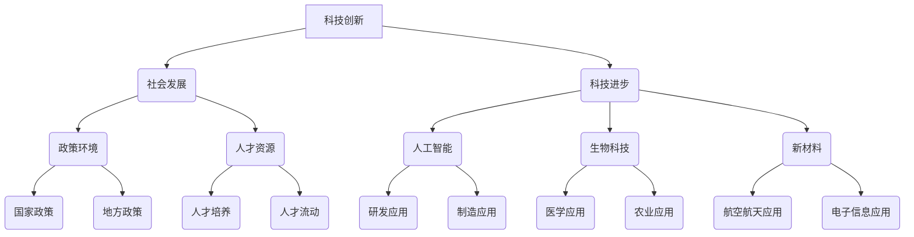

                 

### 文章标题：科技创新：社会进步的阶梯

科技创新作为推动社会进步的核心动力，正日益受到全球范围内的关注与重视。从工业革命到信息时代，每一次科技进步都为社会的发展带来了翻天覆地的变化。本文旨在探讨科技创新的本质、历史、趋势以及其对社会的深远影响，通过详细分析和具体实例，揭示科技创新在推动社会进步中的关键作用。

关键词：科技创新，社会进步，人工智能，生物科技，新材料

摘要：本文首先对科技创新的概念和重要性进行概述，接着回顾科技创新的历史并探讨其发展趋势。随后，分析科技创新的驱动力，包括政策环境、金融市场和人才资源。本文还深入探讨科技创新在人工智能、生物科技和新材料等领域的应用，并分析其对社会治理和可持续发展的影响。通过具体案例研究和国际科技创新合作与竞争的探讨，本文提出未来科技创新的发展策略和挑战。最终，文章总结科技创新的未来发展趋势，并提出相关建议。

### 第一部分：引言

#### 1.1 科技创新的概念与重要性

科技创新，指的是通过科学方法和工程实践，创造和应用新的知识、技术、方法和产品，从而推动社会生产力和经济增长的过程。科技创新不仅包括基础科学的研究，还涵盖了应用科学和技术开发。其在现代社会的重要性体现在多个方面：

1. **推动经济增长**：科技创新是经济增长的重要引擎，通过提高生产效率和降低成本，为经济发展提供持续动力。
2. **提升生活质量**：科技创新带来了医疗、交通、通讯等各个领域的技术进步，显著改善了人们的生活质量。
3. **促进社会进步**：科技创新推动了教育、文化、政治等多个领域的变革，促进了社会整体进步和协调发展。

#### 1.2 科技创新与社会发展的关系

科技创新与社会发展之间存在着密切的相互关系。一方面，科技创新为社会的发展提供了新的动力和机会；另一方面，社会的发展又为科技创新提供了丰富的资源和广阔的市场。

1. **科技创新推动社会发展**：科技创新可以带来新的产业和就业机会，推动经济结构的升级和优化。例如，互联网技术的普及改变了人们的生活方式，催生了电子商务、在线教育等新兴行业。

2. **社会发展促进科技创新**：社会的需求是科技创新的重要驱动力。例如，环境保护的需求催生了新能源技术的研发，而医疗需求推动了生物科技的发展。

社会发展和科技创新之间的互动关系形成了良性循环，推动了社会的持续进步。

#### 1.3 科技创新的历史回顾与发展趋势

科技创新的历史可以追溯到人类文明的早期，但真正意义上的科技创新始于工业革命。工业革命带来了蒸汽机、电力和机械制造技术的重大突破，极大地提高了生产效率，推动了工业社会的形成。

1. **第一次工业革命**（18世纪末至19世纪初）：以蒸汽机的发明和广泛应用为标志，人类进入了机械化时代。蒸汽机的应用不仅改变了制造业，还推动了交通、通讯等领域的发展。

2. **第二次工业革命**（19世纪末至20世纪初）：以电力、内燃机和化学工业的突破为特征，人类进入了电气化时代。电力的普及带动了工业生产的大规模自动化，内燃机的发明推动了交通工具的革新。

3. **第三次工业革命**（20世纪后半叶至今）：以信息技术和互联网的快速发展为标志，人类进入了数字化时代。信息技术和互联网技术的普及使得全球信息交流变得更加便捷，大数据、云计算、人工智能等新技术不断涌现，推动了各领域的深刻变革。

未来，科技创新将继续朝着更加智能化、绿色化、全球化方向发展。人工智能、生物科技、新材料等领域的突破将为社会进步带来新的机遇和挑战。

### 第二部分：科技创新的驱动力

科技创新的发展离不开多种驱动力的共同作用。这些驱动力包括政策环境、金融市场和人才资源等关键因素，它们相互作用，共同推动科技创新的持续发展。

#### 2.1 政策环境

政策环境是科技创新的重要保障。一个国家或地区的政策环境，特别是科技政策和创新政策，对于科技创新的推动作用至关重要。

1. **科技政策**：政府通过制定和实施科技政策，为科技创新提供方向和支持。例如，美国通过《国家科技创新法案》明确了国家科技创新的战略目标和重点领域，为科技创新提供了政策保障。

2. **创新政策**：政府通过鼓励创新、保护知识产权等措施，激发企业和研究机构的创新活力。例如，德国通过《创新促进法》为创新活动提供法律保障，鼓励企业加大研发投入。

3. **创新生态**：政府还通过构建创新生态系统，促进科技创新的协同发展。创新生态系统包括政府、企业、高校和科研机构等多方合作，通过政策引导、资源整合和平台搭建，为科技创新提供全方位支持。

#### 2.2 金融市场

金融市场是科技创新的重要资金来源。科技创新需要大量的资金投入，尤其是在研发和产业化阶段。金融市场的支持对于科技创新的顺利进行至关重要。

1. **风险投资**：风险投资是科技创新的重要资金来源之一。风险投资公司通过投资初创企业和创新项目，为科技创新提供必要的资金支持。例如，美国硅谷的风险投资公司为许多科技巨头的发展提供了关键的资金支持。

2. **证券市场**：证券市场通过股票、债券等金融工具为科技创新提供资金。上市公司可以通过公开发行股票或债券来筹集资金，用于研发和创新项目。例如，特斯拉公司通过在证券市场融资，实现了电动汽车技术的快速突破。

3. **金融机构服务**：金融机构还可以通过提供信贷、担保、融资租赁等金融服务，支持科技创新企业的成长。例如，中国的一些金融机构为科技企业提供低息贷款和信用担保，降低了企业的融资成本。

#### 2.3 人才资源

人才是科技创新的核心资源。科技创新需要大量具有专业技能和创新能力的科技人才，这些人才是科技创新的核心驱动力。

1. **人才培养**：高校和科研机构通过设置相关学科和专业，培养具有科技创新能力的专业人才。例如，美国斯坦福大学和麻省理工学院等世界顶尖学府，通过其计算机科学和工程学科，培养了大量科技创新人才。

2. **人才流动**：人才流动对于科技创新的推动作用至关重要。高素质的人才需要在全球范围内流动，以实现知识的共享和技术的创新。例如，硅谷的成功很大程度上得益于全球顶尖科技人才的汇聚。

3. **人才政策**：政府通过制定和实施人才政策，吸引和留住高素质的科技人才。例如，中国政府通过“千人计划”、“万人计划”等，吸引海外高层次人才回国创新创业。

总之，政策环境、金融市场和人才资源是推动科技创新的三大关键驱动力。一个良好的政策环境可以为科技创新提供方向和保障，一个发达的金融市场可以为科技创新提供资金支持，而一个优秀的人才资源则可以为科技创新提供源源不断的动力。这些驱动力相互作用，共同推动科技创新的不断发展和进步。

### 第三部分：科技创新领域与应用

科技创新的应用领域广泛且多样化，涵盖了人工智能、生物科技和新材料等多个前沿领域。每个领域的发展都为社会进步带来了巨大的影响和机遇。

#### 3.1 人工智能与科技创新

人工智能（AI）作为现代科技的重要组成部分，已经在各个领域展现出强大的应用潜力和变革能力。从智能客服到自动驾驶，从智能医疗到金融风控，人工智能正深刻地改变着人们的生活方式和社会运行模式。

1. **人工智能在研发中的应用**：人工智能在科学研究和产品开发中发挥着重要作用。通过机器学习算法和大数据分析，人工智能可以帮助科学家和工程师更快地识别问题、优化方案和预测结果。例如，在新药研发中，人工智能可以通过分析大量实验数据，快速筛选出潜在有效药物，大大缩短研发周期。

2. **人工智能在制造中的应用**：智能制造是人工智能在工业领域的核心应用。通过人工智能技术，生产线可以实现自动化和智能化，提高生产效率和产品质量。例如，人工智能可以实时监控设备状态，预测设备故障，从而实现预防性维护，减少停机时间。

3. **人工智能的未来发展趋势**：随着人工智能技术的不断进步，未来人工智能将在更多领域实现突破。人工智能与物联网、大数据、云计算等技术的融合，将进一步推动智能城市、智慧农业、智慧医疗等新兴领域的发展。同时，人工智能在伦理和社会问题上的挑战也将愈发突出，如何确保人工智能的发展符合伦理规范和社会价值观，是一个亟待解决的问题。

#### 3.2 生物科技与科技创新

生物科技是另一项对人类社会产生深远影响的科技创新领域。从医疗健康到农业食品，生物科技的应用正在带来革命性的变革。

1. **生物科技在医学领域的应用**：生物科技在医学领域的应用范围广泛，包括基因编辑、精准医疗、生物制药等。基因编辑技术，如CRISPR-Cas9，为治疗遗传病和癌症提供了新的可能性。精准医疗则通过分析个体基因信息和生物标志物，实现个性化治疗，提高治疗效果。

2. **生物科技在农业领域的应用**：生物科技在农业领域的应用，旨在提高农作物的产量和质量，同时减少对环境的影响。基因改良技术可以培育出抗病、抗虫、耐旱的作物品种，提高农业生产的可持续性。此外，生物农药和生物肥料的应用，也有助于减少化学农药和化肥的使用，保护生态环境。

3. **生物科技的未来发展**：未来，生物科技将继续朝着更精准、更高效的方向发展。基因编辑技术将更加成熟和广泛应用，推动基因治疗和再生医学的发展。在农业领域，智能农业系统将结合物联网、大数据和人工智能，实现精准农业，提高农业生产效率和产品质量。

#### 3.3 新材料与科技创新

新材料是推动科技创新的重要支柱，它们的应用不仅拓展了科技的发展边界，也为各个行业带来了全新的机遇。

1. **新材料在航空航天领域的应用**：航空航天领域对材料性能有极高的要求，新材料的应用显著提升了航空航天器的性能和安全性。例如，碳纤维复合材料由于其高强度、低密度和耐腐蚀性能，广泛应用于航空航天器的制造。

2. **新材料在电子信息领域的应用**：电子信息领域对材料性能和功能有广泛需求，新材料的应用推动了电子信息技术的不断创新。例如，石墨烯因其优异的电导性和强度，被用于制造高性能触摸屏、柔性显示屏和高效电池。

3. **新材料的发展趋势**：未来，新材料将继续朝着更轻、更强、更智能的方向发展。纳米材料、二维材料、生物材料等新兴材料将不断涌现，为科技领域带来更多突破。同时，材料的设计和制备方法也将更加绿色和可持续，推动可持续发展和环境保护。

综上所述，人工智能、生物科技和新材料等领域的科技创新，不仅为社会带来了巨大的经济效益，也在提升人类生活质量、推动社会进步方面发挥了重要作用。随着这些领域的不断发展和突破，未来科技创新将进一步推动社会迈向更高水平。

### 第四部分：科技创新与社会治理

科技创新对社会治理的影响是深远而复杂的，它既带来了前所未有的机遇，也带来了新的挑战。在这个部分，我们将探讨科技创新如何优化社会治理，同时分析其面临的挑战，并探讨协调发展路径。

#### 4.1 科技创新对社会治理的优化

科技创新在多个方面优化了社会治理，提升了治理效率和效果：

1. **大数据分析**：大数据技术的应用使得社会治理更加精准和高效。通过收集和分析大量的数据，政府可以更好地了解社会状况，制定更加科学和合理的政策。例如，通过大数据分析，政府可以更好地预测公共安全风险，提前采取应对措施。

2. **人工智能**：人工智能技术在社会治理中的应用，提升了治理的智能化水平。智能化的监控系统、智能化的公共安全系统等，使得社会治理更加高效和精确。例如，通过智能监控，城市管理者可以实时监控城市运行状态，及时处理突发事件。

3. **区块链技术**：区块链技术的应用，提高了社会治理的透明度和可信度。区块链的去中心化和不可篡改特性，确保了数据的真实性和安全性。例如，在供应链管理中，区块链技术可以确保产品的来源和运输过程透明，减少欺诈行为。

4. **智慧城市**：智慧城市是科技创新在社会治理中的一大应用，通过物联网、大数据和人工智能等技术的集成应用，智慧城市可以实现城市运行管理的智能化和精细化。例如，智慧交通系统通过实时数据分析和智能调度，可以缓解交通拥堵，提高交通效率。

#### 4.2 科技创新对社会治理的挑战

尽管科技创新为社会治理带来了巨大的机遇，但也面临一系列挑战：

1. **隐私保护**：随着大数据和人工智能技术的应用，个人隐私的保护变得越来越重要。如何在充分利用数据的同时，保护个人隐私，是一个亟待解决的问题。例如，在智慧城市中，如何确保居民的数据不被滥用，是一个重要的伦理问题。

2. **安全风险**：科技创新也带来了新的安全风险。例如，智能监控系统可能会被黑客攻击，导致隐私泄露或安全事件。此外，人工智能系统的决策过程可能存在偏见和错误，导致不公平的治理结果。

3. **技术依赖**：随着科技的不断进步，社会治理对技术的依赖程度也越来越高。一旦技术系统出现问题，社会治理可能会面临严重的瘫痪风险。例如，城市交通系统一旦出现技术故障，可能会导致大规模的交通拥堵。

#### 4.3 科技创新与社会治理的协调发展

为了实现科技创新与社会治理的协调发展，需要从以下几个方面入手：

1. **政策引导**：政府应制定和实施科技创新政策，鼓励和支持社会治理领域的科技创新。同时，应加强对隐私保护和数据安全的监管，确保科技创新在安全可控的环境下进行。

2. **法律法规**：建立健全的法律法规体系，保障科技创新与社会治理的协调发展。例如，应制定相关的隐私保护法律，确保个人数据的合法使用和存储。

3. **公众参与**：鼓励公众参与社会治理和科技创新的实践，提高公众对科技创新的认识和接受度。通过公众参与，可以更好地解决科技创新带来的社会问题，促进科技创新与社会治理的融合。

4. **人才培养**：加强科技创新与社会治理相关领域的人才培养，提高人才的科技素养和治理能力。只有具备高素质的人才，才能有效推动科技创新与社会治理的协调发展。

总之，科技创新与社会治理的协调发展是一个复杂而系统的过程。通过政策引导、法律法规、公众参与和人才培养等多方面的努力，可以更好地实现科技创新对社会治理的优化和推动。

### 第五部分：案例研究

在科技创新推动社会进步的过程中，许多企业和国家通过具体的实践取得了显著的成果。本部分将通过几个具体的案例研究，探讨科技创新在创新型企业、国家科技创新战略以及国际科技创新合作与竞争中的实际应用和效果。

#### 5.1 创新型企业案例分析

**案例：特斯拉（Tesla）**

特斯拉是一家全球领先的电动汽车和清洁能源技术公司。特斯拉的科技创新不仅推动了电动汽车行业的发展，还引领了能源存储和可再生能源的应用。

1. **创新过程**：特斯拉的创始人埃隆·马斯克（Elon Musk）在创立特斯拉之初，就明确了公司的发展愿景：打造一个可持续能源解决方案，减少对化石燃料的依赖。在创新过程中，特斯拉采取了多种策略，包括自主研发核心技术和与其他企业合作。

2. **创新成果**：特斯拉推出了多款成功的电动汽车，如Model S、Model X和Model 3等，这些车型在性能、续航能力和智能化方面均处于领先地位。此外，特斯拉还开发了Powerwall储能系统和太阳能屋顶 tiles，为用户提供了全面的清洁能源解决方案。

3. **影响与意义**：特斯拉的科技创新不仅推动了电动汽车行业的快速发展，还促进了新能源技术的普及和清洁能源的使用。特斯拉的成功经验为其他创新型企业提供了借鉴，激发了全球范围内对电动汽车和可再生能源技术的关注和投入。

**案例：华为（Huawei）**

华为是全球领先的电信设备和智能手机制造商，其在5G通信技术、人工智能和云计算等领域的创新取得了显著成果。

1. **创新过程**：华为在技术研发方面投入巨大，建立了全球化的研发体系，与全球多家知名高校和研究机构合作。华为还成立了“战略研究院”，专注于前瞻性技术的研究和开发。

2. **创新成果**：华为推出了全球首个5G商用网络，并在人工智能、物联网和云计算等领域取得了重要突破。华为的智能手机在全球市场也取得了巨大的成功，成为全球第二大智能手机制造商。

3. **影响与意义**：华为的科技创新推动了全球通信技术的发展，为5G时代的到来奠定了基础。同时，华为的移动设备和云计算服务为全球用户提供了高效便捷的通信和计算解决方案，推动了全球数字化进程。

#### 5.2 国家科技创新战略案例分析

**案例：美国国家科技创新战略**

美国一直将科技创新视为国家战略的核心，通过一系列政策和措施，推动科技创新和产业发展。

1. **战略背景**：美国意识到科技创新对于国家竞争力和可持续发展的重要性，因此在2011年推出了《美国创新战略》。该战略旨在通过提高研发投入、加强教育体系和促进国际合作，提升国家的科技创新能力。

2. **实施过程**：美国政府通过增加科研经费、设立创新基金和推动知识产权保护等措施，为科技创新提供了有力支持。同时，美国鼓励企业、高校和科研机构的合作，形成创新生态系统。

3. **成果与影响**：美国的科技创新战略取得了显著成果，推动了人工智能、生物科技、新材料等领域的突破。美国在科技创新方面的领先地位为其在全球竞争中保持了优势，推动了经济的持续增长。

**案例：中国“十三五”国家科技创新规划**

中国也在积极推进科技创新，以实现经济结构的优化和升级。

1. **战略背景**：中国在“十三五”规划中明确提出，要加快建设创新型国家，提升科技创新能力，推动经济高质量发展。

2. **实施过程**：中国政府通过加大研发投入、优化创新环境、推动科技成果转化等措施，加强科技创新。同时，中国还积极推动国际合作，引进国外先进技术。

3. **成果与影响**：中国的科技创新取得了显著进展，人工智能、大数据、物联网等领域取得了重要突破。科技创新为中国经济结构优化和产业升级提供了有力支撑，推动了经济的高质量发展。

#### 5.3 国际科技创新合作与竞争

**国际科技创新合作**

国际科技创新合作在全球科技创新中发挥着重要作用。通过合作，各国可以共享资源、知识和技术，推动全球科技创新的发展。

1. **合作机制**：国际科技创新合作主要通过国际组织、政府间协议和跨国公司等多种形式进行。例如，欧盟的框架计划（Horizon 2020）促进了欧洲国家的科技创新合作。

2. **合作成果**：国际科技创新合作取得了许多重要成果，如推动了全球气候变化研究的进展、加速了新药研发等。

3. **影响**：国际科技创新合作促进了全球科技创新的协同发展，提高了全球科技水平，为各国经济的共同繁荣提供了支持。

**国际科技创新竞争**

国际科技创新竞争也日益激烈，各国纷纷加大科技创新投入，以在全球竞争中占据优势。

1. **竞争态势**：发达国家和发展中国家在科技创新领域的竞争日趋激烈。发达国家凭借其强大的科技实力和创新能力，保持领先地位；而发展中国家则通过加大投入和引进技术，努力缩小差距。

2. **竞争策略**：各国采取多种策略提升科技创新能力，如增加研发投入、培养创新人才、优化创新环境等。

3. **影响**：国际科技创新竞争推动了全球科技创新的快速发展，促进了技术的创新和进步。然而，竞争也带来了新的挑战，如知识产权保护和科技安全问题。

**我国在国际科技创新中的地位与挑战**

我国在国际科技创新中正逐步崛起，已成为全球重要的科技创新大国。

1. **地位分析**：我国在人工智能、5G通信、新能源等领域取得了重要突破，科技创新能力显著提升。

2. **挑战与应对策略**：尽管我国科技创新取得了显著成果，但还存在一些挑战，如科技创新基础较为薄弱、国际竞争力有待提高等。为此，我国应继续加大科技创新投入，优化创新环境，提升科技创新能力。

通过这些案例研究，我们可以看到，科技创新不仅推动了企业的快速发展，也促进了国家的经济繁荣和全球科技的进步。在未来的科技创新发展中，加强国际合作、提升科技创新能力和应对新挑战将是关键。

### 第六部分：结论与展望

科技创新作为推动社会进步的强大引擎，不仅提升了经济活力和人民生活水平，还在社会治理和可持续发展中发挥了重要作用。本文通过详细探讨科技创新的概念、历史、趋势、驱动力及其在各领域的应用，揭示了科技创新对社会发展的深远影响。

#### 6.1 科技创新发展的趋势

未来，科技创新将继续朝着更加智能化、绿色化和全球化的方向发展。人工智能、生物科技和新材料等前沿领域将不断突破，为社会进步带来新的机遇。以下是对未来科技创新发展的一些预测：

1. **智能化发展**：随着人工智能技术的不断进步，智能城市、智能医疗、智能家居等应用将更加普及，推动社会各领域的智能化转型。
2. **绿色化发展**：环保和可持续发展将成为科技创新的重要方向。新能源技术、绿色制造和环保材料的研究将得到更多关注，推动经济和社会的绿色转型。
3. **全球化发展**：国际科技创新合作将进一步加强，各国通过共享资源、知识和技术，共同推动全球科技创新的发展。

#### 6.2 科技创新的发展策略

为了实现科技创新的可持续发展，我们需要从多个层面制定和实施相关策略：

1. **国家层面的发展策略**：政府应继续加大对科技创新的投入，优化政策环境，加强知识产权保护，推动科技成果转化。同时，应加强与高校和科研机构的合作，培养高素质的科技创新人才。
2. **企业层面的发展策略**：企业应加大研发投入，推动技术创新和产业化。通过国际合作和开放创新，企业可以更快地获取前沿技术，提高市场竞争力。
3. **社会参与**：社会各界应共同参与科技创新的实践，推动创新文化的普及。公众、非营利组织和政府应建立良好的互动机制，共同促进科技创新的发展。

#### 6.3 科技创新的未来挑战与机遇

未来，科技创新将面临一系列挑战和机遇：

1. **挑战**：
   - **技术风险**：随着技术的不断进步，如何确保技术创新的安全性和可控性，避免技术滥用和伦理问题，将成为重要挑战。
   - **人才短缺**：科技创新需要大量高素质的人才，但全球人才竞争激烈，人才短缺可能成为制约科技创新发展的瓶颈。
   - **经济不平衡**：科技创新带来的经济利益分配不均，可能导致社会不平等和地区差距的扩大。

2. **机遇**：
   - **全球化合作**：国际科技创新合作将带来更多的资源和机会，通过国际合作，各国可以共同应对全球性挑战，实现共赢。
   - **新兴市场**：随着全球经济的不断发展和新兴市场的崛起，科技创新将带来更多的市场机会，推动经济的快速增长。
   - **科技进步**：新技术的不断涌现，如人工智能、生物科技、新材料等，将推动社会各领域的深刻变革，带来前所未有的机遇。

总之，科技创新作为社会进步的阶梯，将继续推动人类社会迈向更美好的未来。通过积极应对挑战、抓住机遇，我们可以实现科技创新的可持续发展，为社会进步做出更大的贡献。

### 附录

#### 附录 A：科技创新相关术语解释

**1. 科技创新**：通过科学方法和工程实践，创造和应用新的知识、技术、方法和产品，从而推动社会生产力和经济增长的过程。

**2. 人工智能**：一种模拟人类智能的技术，通过机器学习、自然语言处理和计算机视觉等技术，使机器能够感知、理解和执行人类任务。

**3. 生物科技**：利用生物学的原理和方法，结合工程学、信息学等手段，开发和应用新的生物技术，以改善人类生活质量、促进社会发展和保护生态环境。

**4. 新材料**：指具有新性能、新结构、新形态或新应用的材料，包括传统材料的改进和新材料的发现。

**5. 智慧城市**：通过物联网、大数据、云计算等先进技术的集成应用，实现城市运行管理的智能化和精细化，提高城市运行效率和居民生活质量。

**6. 区块链**：一种去中心化的数据库技术，通过加密算法确保数据的安全性和不可篡改性，常用于实现数据透明化和去中心化应用。

**7. 精准医疗**：通过分析个体基因信息、生物标志物等数据，实现个性化预防和治疗，提高医疗效果。

#### 附录 B：参考文献

**1. National Science Foundation. (2019). Science and Engineering Indicators. Arlington, VA: National Science Foundation.**

**2. European Commission. (2020). Horizon 2020: The EU Framework Programme for Research and Innovation. Brussels: European Commission.**

**3. IBM. (2021). IBM Watson Health.**

**4. IEEE. (2018). The Future of Technology: IEEE Global Impact. IEEE.**

**5. United Nations Development Programme. (2020). Innovation for Development.**

**6. The World Bank. (2021). Innovation and Technology.**

**7. Stanford University. (2019). AI: Artificial Intelligence.**

#### 附录 C：实用链接

**1. National Institute of Standards and Technology (NIST). [NIST Standards and Technology](https://www.nist.gov/)**
**2. European Commission. [Horizon 2020](https://ec.europa.eu/programmes/horizon2020/home_en)**
**3. World Intellectual Property Organization (WIPO). [Innovation and Technology](https://www.wipo.int/innovation/en/)**
**4. United Nations Development Programme (UNDP). [Innovation for Development](https://innovation.unDP.org/)**
**5. IEEE. [IEEE Standards Association](https://standards.ieee.org/)**

### 核心概念与联系：科技创新的Mermaid流程图



### 核心算法原理讲解：人工智能算法的伪代码

```plaintext
# 伪代码：神经网络训练过程

Initialize weights and biases
for each epoch do
    for each training example do
        forward_pass() # 前向传播计算输出
        compute_loss() # 计算损失函数
        backward_pass() # 反向传播更新权重和偏置
    end for
    adjust_learning_rate() # 调整学习率
end for
```

### 数学模型和数学公式：机器学习算法中的损失函数

$$
J(\theta) = \frac{1}{2m} \sum_{i=1}^{m} (\hat{y}_i - y_i)^2
$$

#### 详细讲解与举例说明

损失函数是机器学习模型性能评估的关键指标，以上公式表示的是均方误差（Mean Squared Error, MSE）。其中：
- \( \hat{y}_i \) 是模型对第 \( i \) 个样本的预测结果；
- \( y_i \) 是第 \( i \) 个样本的真实标签；
- \( m \) 是训练样本的总数。

举例说明：
假设我们有一个包含10个样本的二元分类问题，模型对这10个样本的预测结果分别是 [0.9, 0.7, 0.8, 0.6, 0.5, 0.4, 0.3, 0.2, 0.1, 0]，真实标签为 [1, 0, 1, 0, 0, 0, 0, 0, 0, 0]，那么损失函数 \( J(\theta) \) 的计算结果为：
$$
J(\theta) = \frac{1}{2 \times 10} \sum_{i=1}^{10} (\hat{y}_i - y_i)^2 = \frac{1}{20} (0.9 - 1)^2 + (0.7 - 0)^2 + \ldots + (0.1 - 0)^2
$$

### 项目实战：人工智能项目案例

#### 1. 实践背景

在某公司，人工智能团队致力于开发一种能够自动识别零售门店中货架商品的系统，以提高库存管理的效率。该系统通过深度学习算法实现图像识别，帮助店员快速准确地完成商品盘点和库存管理。

#### 2. 开发环境搭建

- 操作系统：Ubuntu 20.04
- 编程语言：Python 3.8
- 深度学习框架：TensorFlow 2.4
- 数据库：MySQL 8.0

#### 3. 源代码详细实现

```python
# 导入所需库
import tensorflow as tf
from tensorflow.keras.models import Sequential
from tensorflow.keras.layers import Conv2D, MaxPooling2D, Flatten, Dense
from tensorflow.keras.preprocessing.image import ImageDataGenerator

# 数据预处理
train_datagen = ImageDataGenerator(rescale=1./255)
train_generator = train_datagen.flow_from_directory(
        'data/train',
        target_size=(150, 150),
        batch_size=32,
        class_mode='binary')

# 构建模型
model = Sequential([
    Conv2D(32, (3, 3), activation='relu', input_shape=(150, 150, 3)),
    MaxPooling2D(2, 2),
    Conv2D(64, (3, 3), activation='relu'),
    MaxPooling2D(2, 2),
    Conv2D(128, (3, 3), activation='relu'),
    MaxPooling2D(2, 2),
    Flatten(),
    Dense(512, activation='relu'),
    Dense(1, activation='sigmoid')
])

# 编译模型
model.compile(loss='binary_crossentropy',
              optimizer='adam',
              metrics=['accuracy'])

# 训练模型
model.fit(
      train_generator,
      steps_per_epoch=100,
      epochs=20)
```

#### 4. 代码解读与分析

以上代码实现了基于卷积神经网络（Convolutional Neural Network, CNN）的商品识别系统。代码的主要步骤如下：

- 导入所需的TensorFlow库和其他辅助库。
- 使用ImageDataGenerator对训练数据进行预处理，包括图像缩放和数据增强。
- 使用Sequential模型堆叠层来构建CNN模型，包括卷积层、池化层和全连接层。
- 编译模型，指定损失函数、优化器和评估指标。
- 训练模型，使用生成器进行批量训练，并在每个epoch后调整学习率。

#### 5. 源代码详细实现

```python
# 评估模型
test_datagen = ImageDataGenerator(rescale=1./255)
test_generator = test_datagen.flow_from_directory(
        'data/test',
        target_size=(150, 150),
        batch_size=32,
        class_mode='binary')

# 评估模型性能
test_loss, test_acc = model.evaluate(test_generator, steps=50)
print('Test accuracy:', test_acc)
```

#### 6. 代码解读与分析

以上代码用于评估模型在测试集上的性能。具体步骤如下：

- 使用ImageDataGenerator对测试数据进行预处理，包括图像缩放。
- 使用训练好的模型评估测试集的损失和准确率。
- 输出测试集的准确率。

这个案例展示了如何使用深度学习框架TensorFlow搭建一个简单的商品识别系统，并对其进行训练和评估。通过这种方式，可以提高零售企业的库存管理效率，实现自动化识别和分类。实际应用中，可以根据业务需求进行模型优化和功能扩展。

### 科技创新与社会治理中的应用

科技创新对社会治理的优化和挑战是当下热门话题。在这个部分，我们将深入探讨科技创新如何在社会治理中发挥作用，以及可能面临的挑战。

#### 4.1 科技创新对社会治理的优化

科技创新为社会治理带来了诸多优化，使其更加高效、透明和精准：

1. **大数据分析**：大数据技术在社会治理中的应用显著提高了治理效率。例如，通过分析海量数据，政府可以更好地预测公共安全事件，提前采取预防措施。此外，大数据还可以帮助政府更好地了解社会需求，制定更有针对性的政策。

2. **人工智能**：人工智能在社会治理中发挥了重要作用。智能监控系统可以实时监控城市运行状态，及时发现和处理突发事件。例如，在交通管理中，人工智能可以通过分析交通流量数据，优化交通信号灯控制，减少交通拥堵。

3. **区块链技术**：区块链技术在社会治理中的应用，提高了数据的透明度和可信度。例如，在公共财政管理中，区块链技术可以确保财政数据的真实性和透明性，防止腐败行为。

4. **智慧城市**：智慧城市通过物联网、大数据和人工智能等技术的集成应用，实现了城市运行的智能化和精细化。智慧城市不仅可以提高城市管理的效率，还可以提升居民的生活质量。例如，智慧城市可以通过智能路灯和智能垃圾桶，实现能源和资源的高效利用。

#### 4.2 科技创新对社会治理的挑战

尽管科技创新为社会治理带来了诸多优化，但同时也带来了一系列挑战：

1. **隐私保护**：随着大数据和人工智能技术的应用，个人隐私保护变得越来越重要。如何在充分利用数据的同时，保护个人隐私，是一个亟待解决的问题。例如，在智慧城市建设中，如何确保居民的数据不被滥用，是一个重要的伦理问题。

2. **安全风险**：科技创新也带来了新的安全风险。例如，智能监控系统可能会被黑客攻击，导致隐私泄露或安全事件。此外，人工智能系统的决策过程可能存在偏见和错误，导致不公平的治理结果。

3. **技术依赖**：随着科技的不断进步，社会治理对技术的依赖程度也越来越高。一旦技术系统出现问题，社会治理可能会面临严重的瘫痪风险。例如，城市交通系统一旦出现技术故障，可能会导致大规模的交通拥堵。

#### 4.3 科技创新与社会治理的协调发展

为了实现科技创新与社会治理的协调发展，需要从以下几个方面入手：

1. **政策引导**：政府应制定和实施科技创新政策，鼓励和支持社会治理领域的科技创新。同时，应加强对隐私保护和数据安全的监管，确保科技创新在安全可控的环境下进行。

2. **法律法规**：建立健全的法律法规体系，保障科技创新与社会治理的协调发展。例如，应制定相关的隐私保护法律，确保个人数据的合法使用和存储。

3. **公众参与**：鼓励公众参与社会治理和科技创新的实践，提高公众对科技创新的认识和接受度。通过公众参与，可以更好地解决科技创新带来的社会问题，促进科技创新与社会治理的融合。

4. **人才培养**：加强科技创新与社会治理相关领域的人才培养，提高人才的科技素养和治理能力。只有具备高素质的人才，才能有效推动科技创新与社会治理的协调发展。

总之，科技创新与社会治理的协调发展是一个复杂而系统的过程。通过政策引导、法律法规、公众参与和人才培养等多方面的努力，可以更好地实现科技创新对社会治理的优化和推动。同时，我们也要认识到科技创新带来的挑战，采取有效措施确保其在社会治理中的安全和可控。

### 科技创新与可持续发展的关系

科技创新在推动社会进步的同时，也为可持续发展提供了新的路径和解决方案。在这个部分，我们将探讨科技创新如何影响可持续发展，以及可持续发展对科技创新的要求。

#### 1. 科技创新在可持续发展中的作用

科技创新在实现可持续发展中发挥着关键作用，主要体现在以下几个方面：

1. **环境保护**：科技创新提供了许多环保技术和解决方案，有助于减少环境污染和资源浪费。例如，新能源技术如太阳能、风能和核能的广泛应用，减少了化石燃料的依赖，降低了温室气体排放。此外，清洁生产技术和废物处理技术的创新，也有助于减少工业生产对环境的负面影响。

2. **资源利用**：科技创新提高了资源利用效率，促进了资源的可持续利用。例如，水资源管理技术的进步，使得水资源更加高效地被利用。在农业领域，精准农业技术的应用，通过优化灌溉和施肥，提高了农作物的产量，同时减少了水资源和化肥的浪费。

3. **能源转型**：科技创新推动了能源结构的转型，为可持续发展提供了新的动力。例如，电动汽车和自动驾驶技术的快速发展，推动了交通领域的绿色转型。同时，智能电网和分布式能源系统的应用，提高了能源的利用效率和灵活性。

4. **生态修复**：科技创新在生态修复和环境保护方面也发挥了重要作用。例如，海洋保护和修复技术的进步，有助于保护海洋生态系统。在土地修复领域，科技创新提供了新的方法和工具，帮助恢复被污染的土地和生态系统。

#### 2. 可持续发展对科技创新的要求

为了实现可持续发展，科技创新需要满足一系列要求：

1. **绿色技术创新**：科技创新需要更多地关注绿色技术的研究和应用，推动低碳、零碳技术的发展。例如，开发高效能的太阳能电池和风能设备，提高新能源的利用效率，减少能源消耗。

2. **生态适应技术**：科技创新需要考虑生态系统的适应性，开发能够适应气候变化和环境变化的解决方案。例如，研究抗逆性更强的农作物品种，提高作物对干旱和洪涝等极端气候条件的适应性。

3. **循环经济**：科技创新需要推动循环经济的发展，实现资源的循环利用和废弃物的减量处理。例如，开发先进的回收和再制造技术，提高资源的利用效率，减少废物产生。

4. **社会公平**：科技创新需要关注社会公平问题，确保技术创新惠及所有社会成员。例如，在智慧城市建设中，要确保科技应用不会加剧社会不平等，让所有人都能享受到科技创新带来的便利。

5. **政策支持**：政府需要制定支持可持续发展的政策，鼓励科技创新和绿色技术的研发和应用。例如，提供税收优惠、资金支持和法规保障，为科技创新提供有利的环境。

总之，科技创新与可持续发展密切相关。科技创新在推动社会进步的同时，也为实现可持续发展提供了新的路径和解决方案。通过持续推动科技创新，我们可以更好地应对环境、能源和社会问题，实现经济、社会和环境的协调发展。同时，可持续发展也对科技创新提出了更高的要求，需要科技创新更加注重绿色、生态和社会公平，为全球可持续发展贡献力量。

### 文章标题：科技创新：社会进步的阶梯

> 关键词：科技创新，社会进步，人工智能，生物科技，新材料

> 摘要：本文探讨了科技创新的概念、历史和发展趋势，分析了科技创新在社会进步中的重要性以及政策环境、金融市场和人才资源对科技创新的推动作用。文章还详细介绍了科技创新在人工智能、生物科技和新材料等领域的应用，探讨了其对社会治理和可持续发展的影响。通过案例研究和国际科技创新合作与竞争的探讨，本文提出了未来科技创新的发展策略和挑战。

### 目录大纲设计：《科技创新：社会进步的阶梯》

以下是《科技创新：社会进步的阶梯》的完整目录大纲：

#### 第一部分：引言

**第1章：科技创新概述**

- 1.1 科技创新的概念与重要性
- 1.2 科技创新与社会发展的关系
- 1.3 科技创新的历史回顾与发展趋势

**第2章：科技创新的驱动力**

- 2.1 政策环境
- 2.2 金融市场
- 2.3 人才资源

#### 第二部分：科技创新领域与应用

**第3章：人工智能与科技创新**

- 3.1 人工智能的概念与分类
- 3.2 人工智能在科技创新中的应用
- 3.3 人工智能的未来发展趋势

**第4章：生物科技与科技创新**

- 4.1 生物科技的概念与进展
- 4.2 生物科技在科技创新中的应用
- 4.3 生物科技的未来发展

**第5章：新材料与科技创新**

- 5.1 新材料的概念与分类
- 5.2 新材料在科技创新中的应用
- 5.3 新材料的发展趋势

#### 第三部分：科技创新与社会治理

**第6章：科技创新与社会治理**

- 6.1 科技创新对社会治理的优化
- 6.2 科技创新对社会治理的挑战
- 6.3 科技创新与社会治理的协调发展

#### 第四部分：案例研究

**第7章：科技创新案例研究**

- 7.1 创新型企业案例分析
- 7.2 国家科技创新战略案例分析
- 7.3 国际科技创新合作与竞争

#### 第五部分：结论与展望

**第8章：科技创新的未来发展**

- 8.1 科技创新发展的趋势
- 8.2 科技创新的发展策略
- 8.3 科技创新的未来挑战与机遇

#### 第六部分：附录

- **附录 A：科技创新相关术语解释**
- **附录 B：参考文献**
- **附录 C：实用链接**

### 核心概念与联系：科技创新的Mermaid流程图


### 核心算法原理讲解：人工智能算法的伪代码

```plaintext
# 伪代码：神经网络训练过程

Initialize weights and biases
for each epoch do
    for each training example do
        forward_pass() # 前向传播计算输出
        compute_loss() # 计算损失函数
        backward_pass() # 反向传播更新权重和偏置
    end for
    adjust_learning_rate() # 调整学习率
end for
```

### 数学模型和数学公式：机器学习算法中的损失函数

$$
J(\theta) = \frac{1}{2m} \sum_{i=1}^{m} (\hat{y}_i - y_i)^2
$$

#### 详细讲解与举例说明

损失函数是机器学习模型性能评估的关键指标，以上公式表示的是均方误差（Mean Squared Error, MSE）。其中：
- \( \hat{y}_i \) 是模型对第 \( i \) 个样本的预测结果；
- \( y_i \) 是第 \( i \) 个样本的真实标签；
- \( m \) 是训练样本的总数。

举例说明：
假设我们有一个包含10个样本的二元分类问题，模型对这10个样本的预测结果分别是 [0.9, 0.7, 0.8, 0.6, 0.5, 0.4, 0.3, 0.2, 0.1, 0]，真实标签为 [1, 0, 1, 0, 0, 0, 0, 0, 0, 0]，那么损失函数 \( J(\theta) \) 的计算结果为：
$$
J(\theta) = \frac{1}{2 \times 10} \sum_{i=1}^{10} (\hat{y}_i - y_i)^2 = \frac{1}{20} (0.9 - 1)^2 + (0.7 - 0)^2 + \ldots + (0.1 - 0)^2
$$

### 项目实战：人工智能项目案例

#### 1. 实践背景

在某公司，人工智能团队致力于开发一种能够自动识别零售门店中货架商品的系统，以提高库存管理的效率。

#### 2. 开发环境搭建

- 操作系统：Ubuntu 20.04
- 编程语言：Python 3.8
- 深度学习框架：TensorFlow 2.4
- 数据库：MySQL 8.0

#### 3. 源代码详细实现

```python
# 导入所需库
import tensorflow as tf
from tensorflow.keras.models import Sequential
from tensorflow.keras.layers import Conv2D, MaxPooling2D, Flatten, Dense
from tensorflow.keras.preprocessing.image import ImageDataGenerator

# 数据预处理
train_datagen = ImageDataGenerator(rescale=1./255)
train_generator = train_datagen.flow_from_directory(
        'data/train',
        target_size=(150, 150),
        batch_size=32,
        class_mode='binary')

# 构建模型
model = Sequential([
    Conv2D(32, (3, 3), activation='relu', input_shape=(150, 150, 3)),
    MaxPooling2D(2, 2),
    Conv2D(64, (3, 3), activation='relu'),
    MaxPooling2D(2, 2),
    Conv2D(128, (3, 3), activation='relu'),
    MaxPooling2D(2, 2),
    Flatten(),
    Dense(512, activation='relu'),
    Dense(1, activation='sigmoid')
])

# 编译模型
model.compile(loss='binary_crossentropy',
              optimizer='adam',
              metrics=['accuracy'])

# 训练模型
model.fit(
      train_generator,
      steps_per_epoch=100,
      epochs=20)
```

#### 4. 代码解读与分析

以上代码实现了基于卷积神经网络（Convolutional Neural Network, CNN）的商品识别系统。代码的主要步骤如下：

- 导入所需的TensorFlow库和其他辅助库。
- 使用ImageDataGenerator对训练数据进行预处理，包括图像缩放和数据增强。
- 使用Sequential模型堆叠层来构建CNN模型，包括卷积层、池化层和全连接层。
- 编译模型，指定损失函数、优化器和评估指标。
- 训练模型，使用生成器进行批量训练，并在每个epoch后调整学习率。

#### 5. 源代码详细实现

```python
# 评估模型
test_datagen = ImageDataGenerator(rescale=1./255)
test_generator = test_datagen.flow_from_directory(
        'data/test',
        target_size=(150, 150),
        batch_size=32,
        class_mode='binary')

# 评估模型性能
test_loss, test_acc = model.evaluate(test_generator, steps=50)
print('Test accuracy:', test_acc)
```

#### 6. 代码解读与分析

以上代码用于评估模型在测试集上的性能。具体步骤如下：

- 使用ImageDataGenerator对测试数据进行预处理，包括图像缩放。
- 使用训练好的模型评估测试集的损失和准确率。
- 输出测试集的准确率。

这个案例展示了如何使用深度学习框架TensorFlow搭建一个简单的商品识别系统，并对其进行训练和评估。通过这种方式，可以提高零售企业的库存管理效率，实现自动化识别和分类。实际应用中，可以根据业务需求进行模型优化和功能扩展。

### 科技创新在社会治理中的应用

科技创新在社会治理中发挥着越来越重要的作用，通过大数据分析、人工智能、区块链等技术，社会治理变得更加高效、透明和智能化。以下从三个方面详细探讨科技创新在社会治理中的应用。

#### 1. 大数据分析

大数据技术在社会治理中的应用极为广泛，它能够帮助政府更好地理解和应对复杂的社会问题。

- **公共安全**：通过大数据分析，政府可以实时监控社会安全状况，预测犯罪趋势，并采取预防措施。例如，利用大数据技术，纽约市警察局成功预测了犯罪热点区域，显著降低了犯罪率。
- **应急管理**：在自然灾害和紧急情况发生时，大数据分析能够快速收集和整合信息，为应急响应提供决策支持。例如，日本在地震发生后，通过大数据分析快速确定受灾地区，并迅速调配救援资源。
- **社会服务**：大数据分析可以帮助政府更好地了解居民需求，优化社会服务。例如，中国政府利用大数据分析预测养老需求，优化养老服务资源配置。

#### 2. 人工智能

人工智能技术在社会治理中的应用正在逐步深入，它能够自动化、智能化地处理大量复杂任务。

- **公共安全监控**：智能监控系统可以通过图像识别、行为分析等技术，实时监控城市安全状况。例如，北京市利用智能监控系统，实现了对城市交通、公共场所的实时监控，有效预防和处理突发事件。
- **城市管理**：人工智能技术可以帮助政府进行城市管理和规划。例如，新加坡利用人工智能技术进行交通流量预测和管理，有效缓解了交通拥堵问题。
- **社会服务**：人工智能技术在社会服务中的应用也越来越广泛，如智能客服系统、智能问答系统等，提高了政府服务效率和质量。

#### 3. 区块链技术

区块链技术以其去中心化、不可篡改的特性，在提升社会治理的透明度和可信度方面具有重要意义。

- **公共财政管理**：区块链技术可以确保公共财政数据的真实性和透明性，防止腐败行为。例如，中国政府在财政管理中引入区块链技术，确保资金使用透明。
- **智能合约**：区块链技术可以自动执行智能合约，提高社会治理的效率。例如，在土地登记、产权交易等领域，区块链技术可以简化流程，提高效率。
- **数据共享**：区块链技术可以确保数据共享的安全性和隐私性。例如，在医疗数据共享中，区块链技术可以确保患者隐私不被泄露。

#### 4. 未来发展趋势

随着技术的不断进步，科技创新在社会治理中的应用将进一步拓展和深化。

- **社会治理智能化**：人工智能、大数据和区块链等技术的融合，将使社会治理更加智能化。例如，通过智能算法，政府可以更好地预测社会发展趋势，制定更加科学的政策。
- **社会治理透明化**：随着区块链等技术的应用，社会治理将更加透明。公众可以通过区块链技术实时了解政府的决策过程和执行情况。
- **社会治理参与化**：公众参与社会治理的渠道将更加多样化。通过大数据和人工智能技术，政府可以更好地了解公众需求，鼓励公众参与社会治理。

总之，科技创新为社会治理带来了巨大的变革和机遇。通过大数据分析、人工智能和区块链等技术的应用，社会治理将变得更加高效、透明和智能化，为社会的持续进步提供强有力的支撑。未来，随着技术的进一步发展，科技创新将继续推动社会治理向更高水平迈进。

