                 

## 文章标题：科技发展：人类福祉的保障

### 关键词：科技发展、人类福祉、经济、健康、伦理、全球治理

#### 摘要：

科技发展作为推动社会进步的重要动力，对人类福祉的影响深远而复杂。本文从历史与趋势、经济、健康、社会发展、伦理以及全球治理等多个维度，深入探讨了科技如何成为人类福祉的保障。通过详细分析科技革命的历史演变、当前的主要趋势以及科技在不同领域的具体应用，本文揭示了科技在经济增长、医疗进步、教育变革、城市可持续发展等方面的积极作用。同时，本文也关注了科技带来的伦理挑战和全球治理问题，提出了未来科技发展的方向和政策建议，旨在为科技与人类福祉的协调发展提供理论支持和实践参考。

## 《科技发展：人类福祉的保障》目录大纲

### 第一部分：科技发展的背景与影响

#### 第1章：科技发展的历史与趋势
1.1 科技革命的演变历程
1.2 当前科技发展的主要趋势
1.3 科技对人类福祉的潜在影响

### 第二部分：科技与经济

#### 第2章：科技与经济
2.1 科技如何推动经济增长
2.2 科技产业对就业的影响
2.3 科技创新与国际贸易

### 第三部分：科技与人类健康

#### 第3章：生物技术与健康
3.1 基因编辑技术
3.2 生物医药的研发与应用
3.3 科技在公共卫生领域的应用

### 第四部分：科技与社会发展

#### 第4章：科技与教育
4.1 科技对教育模式的变革
4.2 在线教育与远程教育的发展
4.3 科技在促进教育公平中的作用

### 第五部分：科技与城市发展

#### 第5章：科技与城市发展
5.1 智慧城市的技术支撑
5.2 科技在应对城市挑战中的应用
5.3 城市规划与可持续发展

### 第六部分：科技与伦理

#### 第6章：科技伦理问题探讨
6.1 人工智能伦理问题
6.2 数据隐私与网络安全
6.3 伦理审查与责任追究

### 第七部分：科技与全球治理

#### 第7章：科技与全球治理
7.1 科技在全球化背景下的影响
7.2 科技发展的国际合作与竞争
7.3 全球科技治理的挑战与机遇

### 第八部分：科技发展展望

#### 第8章：未来科技趋势预测
8.1 未来科技的发展方向
8.2 科技对人类社会的长远影响
8.3 科技创新与人类福祉的保障

### 第九部分：科技发展的政策建议

#### 第9章：科技发展的政策建议
9.1 政府角色与政策制定
9.2 企业创新与社会责任
9.3 公众参与与科技教育

### 附录

#### 附录A：科技发展相关法律法规与政策
#### 附录B：科技发展的重要里程碑事件
#### 附录C：参考文献与推荐阅读

### 第1章：科技发展的历史与趋势

## 1.1 科技革命的演变历程

### 1.1.1 第一次工业革命

第一次工业革命（18世纪末至19世纪初）是科技发展的一个重要里程碑，它标志着从手工作坊向机械化生产的转变。核心科技突破包括蒸汽机的发明和应用，这一技术极大地提高了生产力，使得大规模工业化成为可能。以下是一个简化的 Mermaid 流程图，描述了第一次工业革命的基本流程：

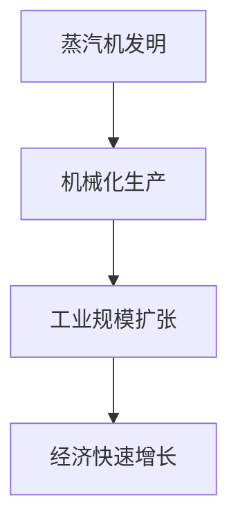

#### 1.1.1.1 基本原理与影响

在第一次工业革命中，蒸汽机作为核心动力源，使得工厂可以从水源丰富的地区迁移到更为便利的交通枢纽，这极大地促进了工业的地理扩张。以下是一个伪代码示例，描述了蒸汽机发明对工业进步的影响：

```python
def IndustrialProgress():
    if Invention("Steam Engine"):
        print("Mechanization leads to increased productivity")
        print("Factory relocation to urban areas")
    print("Economic growth accelerates")
```

### 1.1.2 第二次工业革命

第二次工业革命（19世纪末至20世纪初）以电力和化学工业的发展为特征，进一步推动了工业化的进程。电力成为新的动力源，广泛应用于生产和生活领域，而化学工业的开办则为现代材料、医药和农业提供了新的可能性。以下是第二次工业革命的 Mermaid 流程图：

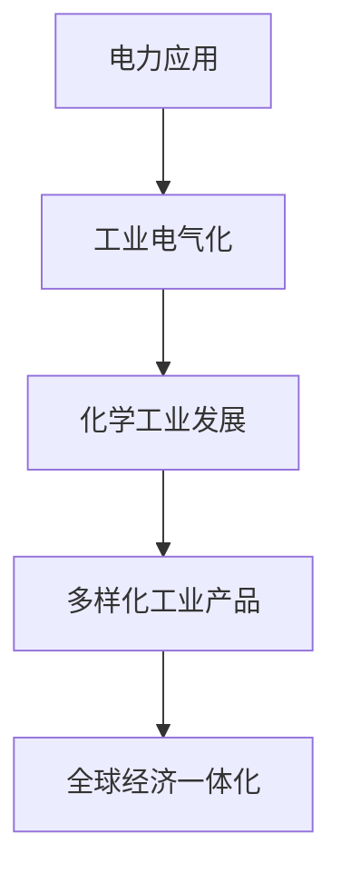

#### 1.1.2.1 基本原理与影响

电力和化学工业的突破带来了生产效率和产品质量的提升，促进了工业化进程的加速。以下是伪代码示例，描述了电力应用和化学工业发展对经济的影响：

```python
def EconomicImpact():
    if Application("Electric Power"):
        print("Industrial Efficiency Improves")
        print("New Industries Emerge")
    if Development("Chemical Industry"):
        print("Material and Product Innovation")
        print("Global Trade Expansion")
```

### 1.1.3 第三次工业革命

第三次工业革命（20世纪后半叶）以信息技术和自动化技术的普及为标志，推动了全球数字化进程。计算机和互联网的发明与应用，使得信息处理和传输变得更加高效和普及。以下是第三次工业革命的 Mermaid 流�程图：

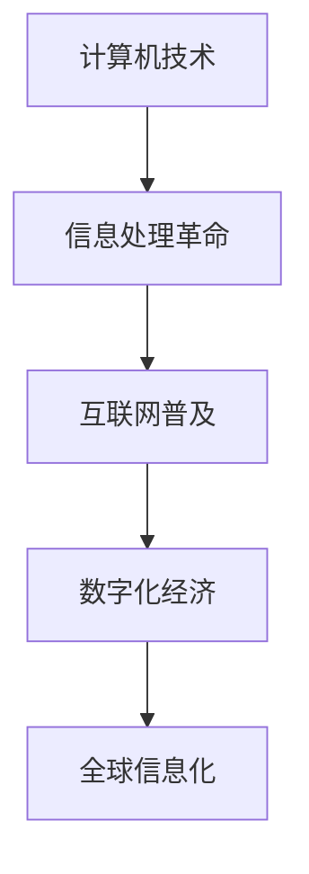

#### 1.1.3.1 基本原理与影响

计算机和互联网的突破极大地改变了人类工作和生活的方式，推动了全球化进程。以下是伪代码示例，描述了计算机技术对经济和社会的深远影响：

```python
def DigitalRevolutionImpact():
    if Invention("Computers"):
        print("Information Processing Speeds Up")
        print("New Business Models Develop")
    if Application("Internet"):
        print("Global Communication Enhances")
        print("Economic Integration Facilitates")
```

### 1.2 当前科技发展的主要趋势

#### 1.2.1 人工智能与机器学习

人工智能（AI）和机器学习（ML）是当前科技发展的重要趋势，它们正在改变各行各业的工作模式。AI技术的核心是通过模拟人类智能，实现机器的自我学习和决策。以下是人工智能技术的 Mermaid 流程图：

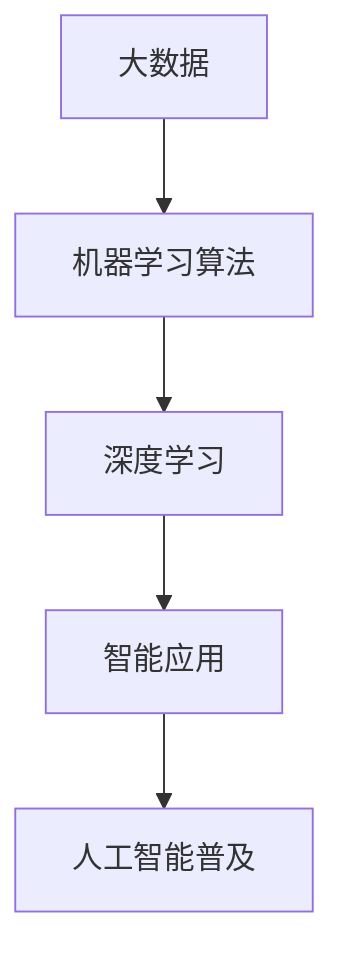

#### 1.2.1.1 基本原理与影响

机器学习算法通过从数据中学习规律和模式，实现了计算机的自主决策。以下是伪代码示例，描述了机器学习和深度学习的基本原理：

```python
def MachineLearning():
    if Data("Massive Data"):
        print("Pattern Recognition Enhances")
        print("Predictive Analytics Improves")
    if Algorithm("Deep Learning"):
        print("Complex Tasks Achievable")
        print("Intelligent Systems Developed")
```

#### 1.2.2 生物技术与基因工程

生物技术与基因工程是另一项重要的科技趋势，它们在医疗、农业和环境科学等领域有着广泛的应用。基因编辑技术如CRISPR-Cas9的出现，使得科学家能够精确修改生物体的基因，带来了一系列革命性的变化。以下是生物技术与基因工程的 Mermaid 流程图：

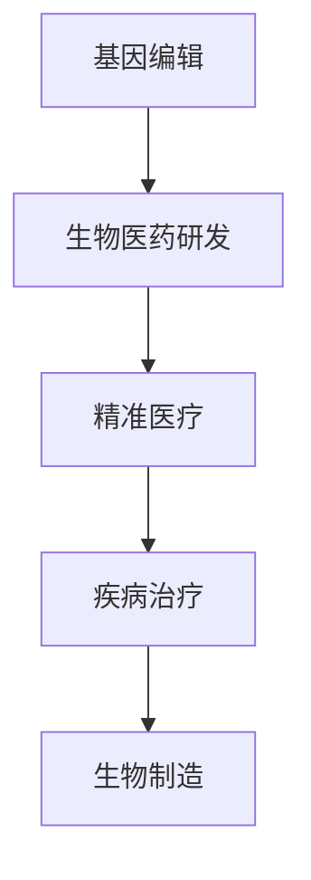

#### 1.2.2.1 基本原理与影响

基因编辑技术的应用不仅能够治疗遗传性疾病，还为农业和生物制造领域带来了新的可能性。以下是伪代码示例，描述了基因编辑技术的基本原理和应用：

```python
def GeneEditing():
    if Technology("CRISPR-Cas9"):
        print("Gene Modification Precision Increases")
        print("Personalized Medicine Advances")
    if Application("Agriculture and Biomanufacturing"):
        print("Crops Improvement")
        print("New Pharmaceutical Products")
```

#### 1.2.3 新材料与新能源

新材料和新能源的研究与开发是当前科技发展的另一个重要趋势，它们对于推动可持续发展至关重要。新型材料如石墨烯和纳米材料具有独特的物理和化学性质，而可再生能源如太阳能和风能则为减少对化石燃料的依赖提供了新的途径。以下是新材料与新能源的 Mermaid 流程图：

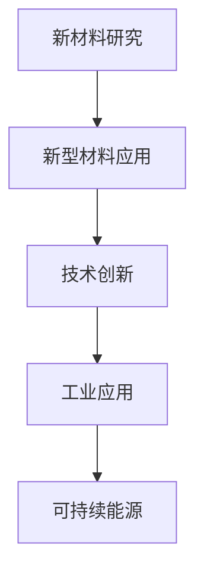

#### 1.2.3.1 基本原理与影响

新型材料和可再生能源的研究推动了工业技术的创新和可持续发展。以下是伪代码示例，描述了新材料和新能源的基本原理和应用：

```python
def NewMaterialsAndEnergy():
    if Material("Graphene and Nanomaterials"):
        print("Advanced Material Properties")
        print("New Manufacturing Processes")
    if Energy("Renewable Energy Sources"):
        print("Reducing Carbon Footprint")
        print("Ensuring Energy Security")
```

### 1.3 科技对人类福祉的潜在影响

#### 1.3.1 经济层面

科技发展对经济的推动作用是显而易见的。通过提高生产效率和促进创新，科技可以带来经济增长、就业机会的增加和国际竞争力的提升。以下是科技对经济影响的 Mermaid 流程图：

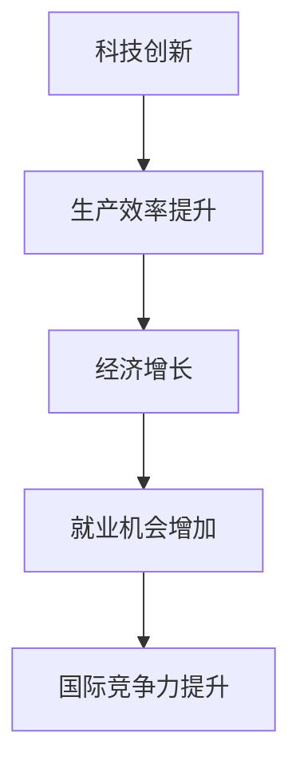

#### 1.3.1.1 基本原理与影响

以下是伪代码示例，描述了科技创新对经济的多方面影响：

```python
def EconomicImpactThroughTech():
    if Innovation("Technological Breakthroughs"):
        print("Productivity Enhances")
        print("Economic Growth Accelerates")
    if Employment("New Job Opportunities"):
        print("Labor Market Dynamics Improve")
        print("International Competitiveness Rises")
```

#### 1.3.2 社会层面

科技在社会层面的影响同样深远，它推动了教育、医疗和社会服务的变革，提高了人们的生活质量。以下是科技对社会影响的 Mermaid 流程图：

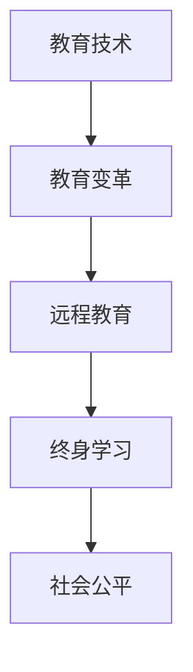

#### 1.3.2.1 基本原理与影响

以下是伪代码示例，描述了科技在教育和社会服务中的应用：

```python
def SocialImpactThroughTech():
    if Education("Educational Technologies"):
        print("Learning Access Improves")
        print("Education Quality Enhances")
    if Services("Digital Public Services"):
        print("Service Efficiency Rises")
        print("Social Inclusion Enhances")
```

#### 1.3.3 健康层面

科技在医疗领域的应用极大地提升了疾病治疗的效果和公共卫生管理水平。基因编辑技术、人工智能诊断和远程医疗服务等创新为人类健康带来了新的希望。以下是科技对健康影响的 Mermaid 流程图：

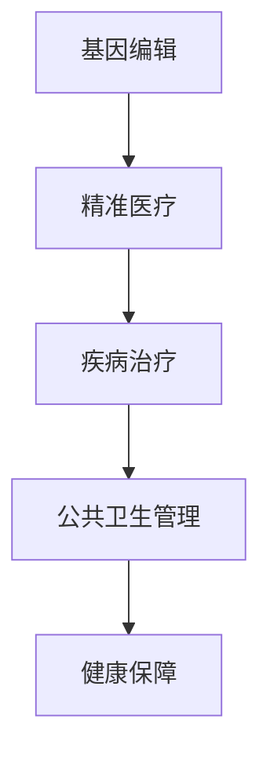

#### 1.3.3.1 基本原理与影响

以下是伪代码示例，描述了科技在健康领域的应用：

```python
def HealthImpactThroughTech():
    if Technology("Gene Editing"):
        print("Personalized Medicine Advances")
        print("Disease Treatment Improves")
    if Application("AI Diagnostics"):
        print("Diagnosis Accuracy Increases")
        print("Health Monitoring Enhances")
```

## 2.1 科技与经济

### 2.1.1 科技创新与经济增长的关系

科技创新是推动经济增长的核心动力。通过提高生产效率和创造新的市场需求，科技创新能够带动整体经济的增长。以下是科技创新与经济增长的 Mermaid 流程图：

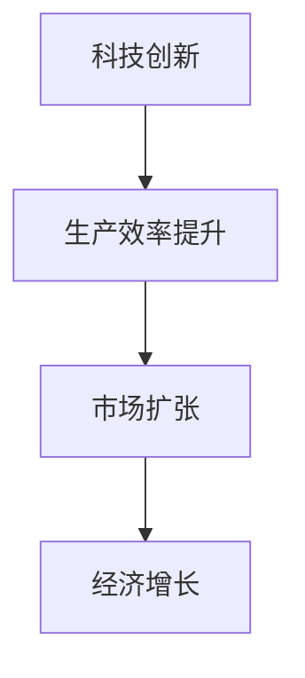

#### 2.1.1.1 基本原理与影响

科技创新通过引入新技术、新工艺和新产品，提升了生产效率和产品质量，从而扩大了市场。以下是伪代码示例，描述了科技创新对经济增长的影响：

```python
def EconomicGrowthThroughInnovation():
    if Innovation("Technological Breakthroughs"):
        print("Productivity Enhances")
        print("Market Demand Expands")
    print("Economic Growth Accelerates")
```

#### 2.1.2 科技产业对就业的影响

科技产业的发展对就业市场有着深远的影响。一方面，它创造了大量新就业机会；另一方面，它也带来了劳动力市场的变革，要求劳动力具备更高的技能。以下是科技产业对就业影响的 Mermaid 流程图：

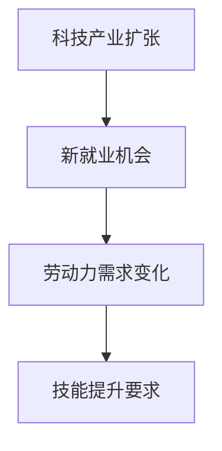

#### 2.1.2.1 基本原理与影响

以下是伪代码示例，描述了科技产业对就业市场的影响：

```python
def EmploymentImpactThroughTechIndustry():
    if Expansion("Tech Industry Growth"):
        print("New Job Opportunities Emerge")
        print("Employment Rates Increase")
    if Change("Skill Requirements"):
        print("High-Skilled Jobs Dominate")
        print("Reskilling and Upgrading Necessary")
```

#### 2.1.3 科技创新与国际贸易

科技创新不仅推动国内经济增长，也加强了国家之间的经济联系。通过提升出口产品的技术含量和竞争力，科技创新促进了国际贸易的发展。以下是科技创新与国际贸易的 Mermaid 流程图：

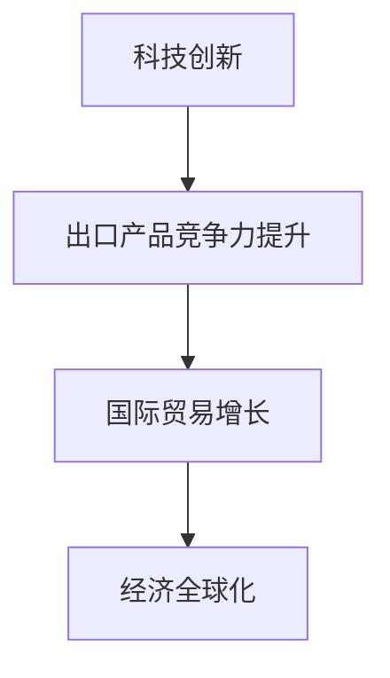

#### 2.1.3.1 基本原理与影响

以下是伪代码示例，描述了科技创新对国际贸易的影响：

```python
def InternationalTradeThroughInnovation():
    if Improvement("Export Product Competitiveness"):
        print("International Demand Increases")
        print("Trade Volume Expands")
    print("Economic Globalization Facilitates")
```

### 2.2 科技与经济模式的转变

#### 2.2.1 数字经济时代的来临

数字经济的兴起标志着经济活动的数字化和在线化，它带来了新的商业模式和商业机会。以下是数字经济的 Mermaid 流程图：

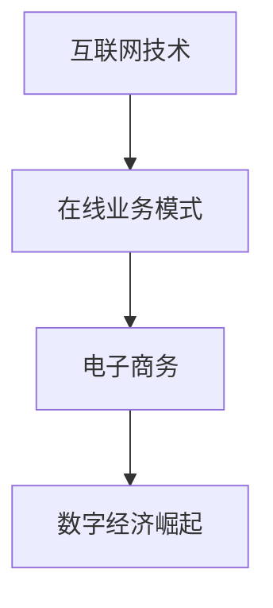

#### 2.2.1.1 基本原理与影响

以下是伪代码示例，描述了数字经济的基本原理和影响：

```python
def DigitalEconomyArrival():
    if Technology("Internet"):
        print("Online Business Models Develop")
        print("E-commerce Flourishes")
    print("Digital Economy Rises")
```

#### 2.2.2 创业与创新文化的培育

创业和创新文化是推动经济发展的重要动力。通过鼓励创新和创业，科技发展可以激发社会的活力和创造力。以下是创业与创新文化的 Mermaid 流程图：

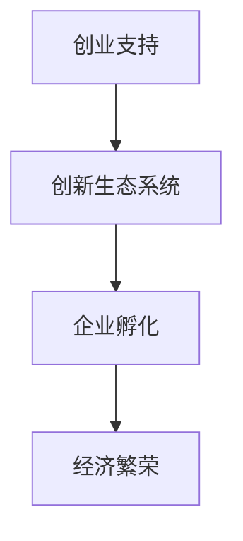

#### 2.2.2.1 基本原理与影响

以下是伪代码示例，描述了创业与创新文化的影响：

```python
def EntrepreneurshipAndInnovationCultivation():
    if Support("Startup Ecosystem"):
        print("New Ventures Emerge")
        print("Innovation Culture Fosters")
    print("Economic Dynamism Boosts")
```

### 2.3 科技对全球经济格局的影响

#### 2.3.1 科技竞争与全球化

科技的快速发展促进了全球经济的竞争和合作。科技优势成为国家竞争力的重要组成部分，而全球化则加强了各国之间的经济联系。以下是科技竞争与全球化的 Mermaid 流程图：

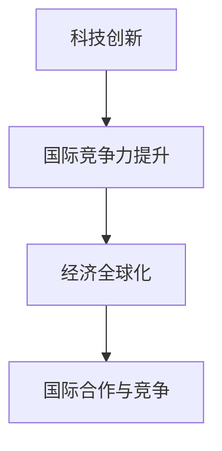

#### 2.3.1.1 基本原理与影响

以下是伪代码示例，描述了科技竞争与全球化的影响：

```python
def GlobalImpactThroughTechnology():
    if Innovation("Technological Advancements"):
        print("International Competitiveness Increases")
        print("Global Economic Integration Enhances")
    print("Global Cooperation and Competition Flourish")
```

#### 2.3.2 科技创新与可持续发展

科技创新在可持续发展中扮演着关键角色，通过推动绿色技术和环保措施，科技创新有助于实现经济、社会和环境的协调发展。以下是科技创新与可持续发展的 Mermaid 流程图：

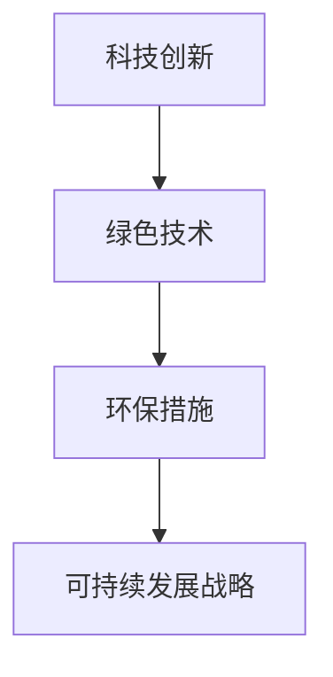

#### 2.3.2.1 基本原理与影响

以下是伪代码示例，描述了科技创新对可持续发展的影响：

```python
def SustainableDevelopmentThroughTechnology():
    if Innovation("Green Technologies"):
        print("Environmental Protection Enhances")
        print("Energy Efficiency Improves")
    if Policy("Sustainable Practices"):
        print("Long-Term Economic Stability Ensures")
        print("Social Well-being Advances")
```

## 3.1 基因编辑技术

### 3.1.1 基因编辑的基本原理

基因编辑技术，如CRISPR-Cas9，允许科学家精确地修改DNA序列，从而改变生物体的遗传特征。以下是基因编辑技术的 Mermaid 流程图：

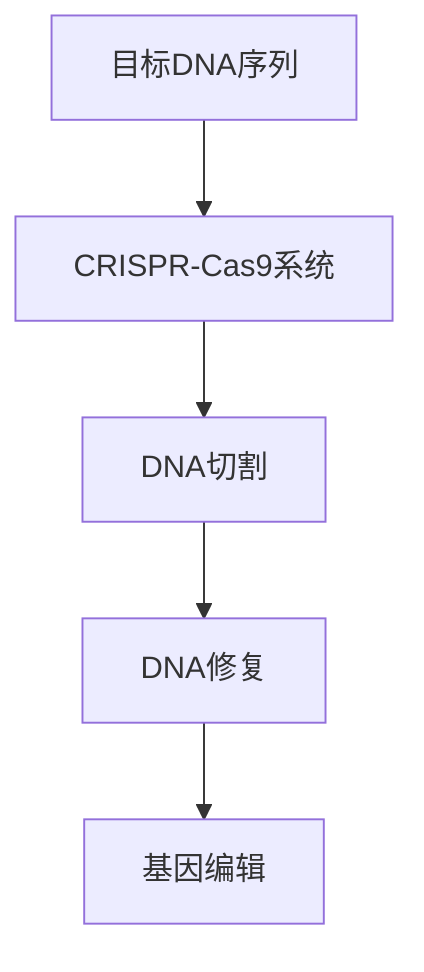

#### 3.1.1.1 基本原理与影响

基因编辑通过识别并切割特定的DNA序列，然后由细胞自身的修复机制进行修复，从而实现基因的精确修改。以下是伪代码示例，描述了基因编辑的基本原理：

```python
def GeneEditing():
    if Sequence("Target DNA"):
        print("Identifying Specific Sequences")
    if System

