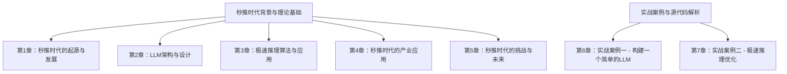

                 

# 文章标题: 秒推时代: LLM极速推理创新高

> 关键词：秒推时代、LLM、推理、深度学习、计算效率、算法优化

> 摘要：本文探讨了秒推时代背景下的LLM（大规模语言模型）极速推理技术，从理论到实践详细解析了其技术基础、架构设计、算法优化及其在各行业的应用和未来挑战。通过实战案例和源代码解析，揭示了LLM极速推理的实际应用场景和实现方法。

## 第一部分：秒推时代背景与理论基础

### 第1章：秒推时代的起源与发展

#### 1.1 秒推时代的定义与背景

**秒推时代的定义**：秒推时代指的是在云计算、大数据和人工智能等技术的推动下，数据处理和分析的速度达到了前所未有的高度，能够在秒级时间内处理并返回结果的时代。

**数据中心与云计算的变革**：随着数据中心和云计算技术的不断进步，数据存储和计算能力得到了显著提升，这为大规模数据处理和快速推理提供了基础。

**人工智能与机器学习的发展**：人工智能和机器学习技术的发展使得复杂的模型和算法能够在大量数据上进行高效训练和推理，这为秒推时代的到来提供了技术支撑。

#### 1.2 LLM极速推理的技术基础

**大规模语言模型（LLM）的基本原理**：LLM是基于神经网络的语言模型，它通过对大量文本数据的学习，能够预测下一个单词或句子。

**极速推理的概念与重要性**：极速推理是指在短时间内对输入的文本进行有效的处理和推理，返回所需的结果。在秒推时代，极速推理是实现快速响应和高效服务的关键。

**推理算法的发展趋势**：随着计算能力和算法优化的提升，推理算法在速度和准确性方面都取得了显著进展，未来将继续朝着高效和智能化的方向演进。

#### 1.3 数学模型与公式解析

**线性代数基础**：线性代数是深度学习的基础，包括矩阵运算、线性方程组求解等基本概念和算法。

**深度学习中的优化算法**：包括梯度下降、Adam优化器等常用优化算法，用于调整模型参数以最小化损失函数。

**推理时间与计算效率**：推理时间与计算效率是衡量推理算法性能的重要指标，通过优化算法和数据结构，可以显著提高计算效率。

## 第2章：LLM架构与设计

### 第2章：LLM架构与设计

#### 2.1 LLM的层次结构

**层级结构与工作原理**：LLM通常由多层神经网络组成，每层神经网络都包含多个神经元，通过前向传播和反向传播进行数据传递和参数更新。

**层级结构优化**：为了提高推理速度和降低计算成本，LLM的层级结构可以进行优化，如使用参数共享、动态层级等策略。

#### 2.2 模型训练与优化

**数据预处理**：数据预处理包括文本清洗、分词、词向量化等步骤，为模型训练提供高质量的输入数据。

**模型训练流程**：模型训练包括前向传播、损失函数计算、反向传播和参数更新等步骤，通过迭代优化模型参数，提高模型性能。

**优化算法与技巧**：包括学习率调整、正则化技术、损失函数设计等，用于提高模型训练效率和性能。

#### 2.3 数学公式与模型优化

**正则化技术**：正则化技术如L1和L2正则化，用于防止模型过拟合，提高泛化能力。

**损失函数设计**：损失函数用于衡量模型预测值与真实值之间的差异，常用的损失函数包括交叉熵损失、均方误差等。

**学习率调整策略**：学习率调整策略如学习率衰减、恒定学习率等，用于优化模型训练过程。

## 第3章：极速推理算法与应用

### 第3章：极速推理算法与应用

#### 3.1 极速推理算法原理

**算法概述**：极速推理算法旨在通过优化算法和数据结构，提高模型的推理速度和计算效率。

**常见推理算法介绍**：包括基于图灵机的推理算法、基于推理机的推理算法、基于神经网络的反向推理算法等。

#### 3.2 极速推理优化

**推理加速技术**：包括向量计算、并行计算、分布式推理等，用于加速模型的推理过程。

**并行计算与分布式推理**：通过并行计算和分布式推理，可以将复杂的推理任务分解到多个计算节点上，提高整体推理效率。

#### 3.3 极速推理案例分析

**实际应用场景**：包括智能问答、自然语言处理、语音识别等，展示了极速推理在实际应用中的优势。

**极速推理的优势与挑战**：分析了极速推理在提高响应速度和降低延迟方面的优势，以及在高并发场景下的性能挑战。

## 第4章：秒推时代的产业应用

### 第4章：秒推时代的产业应用

#### 4.1 企业级应用

**业务流程优化**：通过极速推理技术，企业可以快速处理和分析大量业务数据，实现业务流程的优化和智能化。

**智能决策支持**：企业可以利用LLM进行智能决策支持，如金融风险评估、供应链优化等。

#### 4.2 政府与公共服务

**公共服务智能化**：政府可以利用LLM实现智能化的公共服务，如智能问答、智能客服等。

**政策分析与应用**：政府可以利用LLM对政策文本进行快速分析和预测，提高政策制定的科学性和有效性。

#### 4.3 教育与医疗

**教育智能化**：教育领域可以利用LLM实现个性化教学、智能作业批改等。

**医疗诊断与预测**：医疗领域可以利用LLM进行疾病诊断、药物研发等。

## 第5章：秒推时代的挑战与未来

### 第5章：秒推时代的挑战与未来

#### 5.1 技术挑战

**数据安全与隐私保护**：在秒推时代，如何保障数据的安全和隐私成为重要挑战。

**算法公平性与透明性**：算法的公平性和透明性是确保模型应用合理的重要保障。

#### 5.2 产业发展趋势

**产业变革**：秒推时代将引发产业变革，推动各行业向智能化和高效化方向发展。

**新兴技术应用**：随着秒推技术的不断进步，新兴技术应用如边缘计算、量子计算等将得到广泛应用。

#### 5.3 未来展望

**新一代LLM发展趋势**：未来LLM将朝着更大规模、更高效、更智能的方向发展。

**秒推时代的未来蓝图**：秒推时代将带来更高效的数据处理和分析能力，推动人类社会向更智能、更高效的方向发展。

## 第二部分：实战案例与源代码解析

### 第6章：实战案例一 - 构建一个简单的LLM

#### 6.1 环境搭建

**开发环境配置**：介绍如何搭建Python开发环境，包括安装Python、Jupyter Notebook等。

**必要的依赖安装**：介绍如何安装TensorFlow、PyTorch等深度学习框架。

#### 6.2 模型构建

**伪代码介绍**：给出LLM模型的伪代码，介绍模型的输入、输出和主要结构。

**模型结构**：详细解释LLM的层次结构，包括嵌入层、编码器、解码器等。

#### 6.3 模型训练

**训练过程详解**：介绍模型训练的详细步骤，包括数据预处理、模型初始化、训练过程等。

**训练参数调整**：介绍如何调整学习率、批次大小等参数，以优化训练过程。

#### 6.4 模型推理

**推理流程**：介绍模型推理的详细步骤，包括前向传播、损失函数计算、反向传播等。

**推理性能分析**：分析模型在不同场景下的推理性能，包括速度和准确性。

### 第7章：实战案例二 - 极速推理优化

#### 7.1 推理优化策略

**算法优化**：介绍如何优化推理算法，包括减少内存占用、提高计算效率等。

**并行计算**：介绍如何利用并行计算技术，如GPU加速、多线程等，提高推理速度。

#### 7.2 实际应用案例

**应用场景**：介绍秒推技术在实际应用中的场景，如智能问答、语音识别等。

**优化效果分析**：分析不同优化策略对推理速度和准确性的影响，展示优化效果。

#### 7.3 源代码解读

**关键代码解析**：解析关键代码，包括模型训练、推理优化等。

**优化代码实现**：介绍如何实现推理优化策略，包括代码结构和优化技巧。

## 附录：参考资料与拓展阅读

### 附录A：深度学习与推理工具介绍

**TensorFlow**：介绍TensorFlow框架的基本原理和常用API。

**PyTorch**：介绍PyTorch框架的基本原理和常用API。

**其他深度学习框架**：介绍其他常用的深度学习框架，如Keras、MXNet等。

### 附录B：数学公式与算法解析

**线性代数基础**：介绍线性代数的基本概念和算法，如矩阵运算、线性方程组求解等。

**深度学习算法解析**：介绍深度学习算法的基本原理和常用优化算法。

### 附录C：实战案例代码与数据集

**代码下载链接**：提供实战案例代码的下载链接。

**数据集获取方式**：介绍如何获取实战案例所需的数据集，包括数据集来源和预处理方法。

### Mermaid 流程图

### 总结

本文从秒推时代的背景与理论基础出发，详细解析了LLM极速推理的技术基础、架构设计、算法优化及其在各行业的应用和未来挑战。通过实战案例和源代码解析，揭示了LLM极速推理的实际应用场景和实现方法。未来，随着技术的不断进步，LLM极速推理将在更多领域发挥重要作用。

