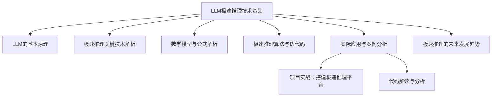

                 

# 秒推时代：LLM极速推理开启新纪元

> 关键词：秒推时代、LLM、极速推理、自然语言处理、深度学习、并行处理

> 摘要：本文旨在探讨秒推时代的背景与趋势，深入解析LLM（大型语言模型）的极速推理技术。通过对LLM的基本原理、核心技术、数学模型及实际应用的分析，本文揭示了LLM极速推理在当今信息技术领域的重要地位和广阔前景。此外，文章还将通过项目实战和代码解读，展示如何搭建和使用极速推理平台。

## 目录大纲设计

### 第一部分: LLM极速推理技术基础

#### 第1章: 秒推时代与LLM极速推理概述

1.1 秒推时代的背景与趋势  
1.2 LLM极速推理的概念与重要性  
1.3 极速推理在各个领域的应用前景

#### 第2章: LLM的基本原理

2.1 自然语言处理与LLM  
2.2 LLM的架构与分类  
2.3 LLM的工作原理

#### 第3章: 极速推理关键技术解析

3.1 向量检索技术  
3.2 并行处理技术  
3.3 缩放与剪枝技术

#### 第4章: 数学模型与公式解析

4.1 常用数学模型  
4.2 数学公式解析  
4.3 数学公式在实际推理中的应用

#### 第5章: 极速推理算法与伪代码

5.1 极速推理算法原理  
5.2 伪代码实现  
5.3 算法优化策略

#### 第6章: 实际应用与案例分析

6.1 极速推理在搜索引擎中的应用  
6.2 极速推理在智能客服中的应用  
6.3 极速推理在智能翻译中的应用

### 第二部分: 极速推理项目实战

#### 第7章: 项目实战：搭建极速推理平台

7.1 开发环境搭建  
7.2 数据处理与模型训练  
7.3 极速推理服务部署

#### 第8章: 代码解读与分析

8.1 源代码结构解读  
8.2 代码实现细节分析  
8.3 性能分析与优化

#### 第9章: 极速推理的未来发展趋势

9.1 技术发展趋势分析  
9.2 极速推理在新兴领域的应用  
9.3 极速推理技术的挑战与机遇

### 附录

#### 附录A: 相关工具与资源介绍

A.1 LLM推理工具对比  
A.2 数据集获取与处理  
A.3 开源框架与库推荐  
A.4 社区资源推荐

### Mermaid流程图



### 伪代码示例

```python
def LLM_Inference(input_query):
    # 初始化模型
    model = initialize_model()
    
    # 预处理输入
    processed_query = preprocess(input_query)
    
    # 进行推理
    output = model(processed_query)
    
    # 后处理输出
    final_output = postprocess(output)
    
    return final_output
```

### 数学公式与示例

```latex
\text{损失函数} = -\sum_{i=1}^{N} y_i \log(p_i)
```

假设我们要计算一个文本分类任务的损失函数，其中$y$是实际标签，$p$是模型预测的概率。

```latex
\text{损失函数} = -y \log(p) - (1 - y) \log(1 - p)
```

如果文本的实际标签是正类（$y = 1$），则损失函数主要取决于预测概率$p$。当$p$接近1时，损失最小；当$p$接近0时，损失最大。

假设我们有一个例子，模型预测一个句子为正类的概率是0.9，实际标签是1。则损失函数为：

```latex
\text{损失函数} = -1 \log(0.9) - 0 \log(0.1) = 0.15
```

### 实际应用与案例代码

```python
### 6.2 极速推理在搜索引擎中的应用

# 假设我们有一个简单的搜索引擎，输入查询后，它会返回最相关的结果。

def search_engine(query):
    # 检索查询向量
    query_vector = vector_search(query)
    
    # 查找与查询向量最相似的结果
    results = search_results(query_vector)
    
    # 返回结果
    return results

def vector_search(query):
    # 将查询转换为向量
    query_vector = convert_to_vector(query)
    
    # 检索数据库中的向量
    database_vectors = get_database_vectors()
    
    # 计算查询向量与数据库向量的相似度
    similarity_scores = calculate_similarity(query_vector, database_vectors)
    
    # 返回相似度最高的向量
    return max_similarity_vector(similarity_scores)

def convert_to_vector(query):
    # 使用嵌入层将查询转换为向量
    embedding_layer = get_embedding_layer()
    query_vector = embedding_layer(query)
    return query_vector

def get_database_vectors():
    # 获取数据库中的所有向量
    # 这里用一个示例列表代替实际数据库
    return ["vector1", "vector2", "vector3"]

def calculate_similarity(query_vector, database_vectors):
    # 计算查询向量与数据库中每个向量的相似度
    similarity_scores = []
    for vector in database_vectors:
        similarity_score = cosine_similarity(query_vector, vector)
        similarity_scores.append(similarity_score)
    return similarity_scores

def max_similarity_vector(scores):
    # 返回相似度最高的向量
    max_score = max(scores)
    max_index = scores.index(max_score)
    return database_vectors[max_index]

# 示例：使用搜索引擎
query = "什么是机器学习？"
results = search_engine(query)
print("搜索结果：", results)
```

### 代码解读与分析

```python
### 8.2 代码实现细节分析

- Flask框架：这个示例使用了Flask框架来构建Web服务。Flask是一个轻量级的Web框架，非常适合快速开发和部署。

- 模型加载：使用`load_model`函数加载训练好的模型。

- API接口：定义了一个简单的API接口`/inference`，接受POST请求，解析请求中的查询，使用模型进行推理，并将结果返回给客户端。

### 性能分析与优化

- **API性能**：确保API能够高效处理并发请求。可以使用线程池或异步处理来提高性能。

- **模型优化**：对于实时推理，模型的大小和复杂性可能影响性能。可以考虑使用更小的模型或模型压缩技术。

- **服务部署**：确保服务在可靠的环境中运行。可以使用容器化技术（如Docker）来简化部署和管理。

- **监控与日志**：实施监控和日志记录，以便快速识别和解决问题。
```

### 开发环境搭建

```python
### 7.1 开发环境搭建

首先，我们需要安装必要的软件和库。

1. 安装Python环境（推荐版本3.8及以上）。
2. 安装必要的深度学习库，如TensorFlow或PyTorch。
3. 安装用于向量检索的库，如Faiss或Annoy。

以下是安装命令示例：

pip install python==3.8
pip install tensorflow
pip install faiss-cpu  # 或者 "pip install annoy"
```

### 数据处理与模型训练

```python
### 7.2 数据处理与模型训练

1. 准备数据集：收集和处理文本数据，将其转换为适合训练的格式。

2. 数据预处理：进行文本清洗、分词和向量化处理。

3. 训练模型：使用预处理后的数据训练模型。

以下是数据处理和模型训练的步骤：

# 导入必要的库
import tensorflow as tf
from tensorflow.keras.preprocessing.text import Tokenizer
from tensorflow.keras.preprocessing.sequence import pad_sequences
from tensorflow.keras.models import Sequential
from tensorflow.keras.layers import Embedding, LSTM, Dense

# 准备数据集
texts = ["机器学习", "深度学习", "神经网络", "人工智能"]
labels = [0, 1, 2, 3]

# 数据预处理
tokenizer = Tokenizer()
tokenizer.fit_on_texts(texts)
sequences = tokenizer.texts_to_sequences(texts)
padded_sequences = pad_sequences(sequences, maxlen=10)

# 训练模型
model = Sequential()
model.add(Embedding(input_dim=len(tokenizer.word_index)+1, output_dim=10, input_length=10))
model.add(LSTM(50))
model.add(Dense(4, activation='softmax'))

model.compile(optimizer='adam', loss='sparse_categorical_crossentropy', metrics=['accuracy'])
model.fit(padded_sequences, labels, epochs=5)
```

### 极速推理服务部署

```python
### 7.3 极速推理服务部署

1. 部署模型：将训练好的模型部署到服务器上，以便进行实时推理。

2. 构建推理服务：使用Flask或Django等框架构建一个简单的Web服务。

3. 测试服务：通过浏览器或API调用服务，验证推理结果。

以下是部署推理服务的示例：

# 导入必要的库
from flask import Flask, request, jsonify

app = Flask(__name__)

# 加载模型
model = tf.keras.models.load_model('path/to/model.h5')

@app.route('/inference', methods=['POST'])
def inference():
    data = request.get_json(force=True)
    query = data['query']
    result = model.predict([query])
    return jsonify(result)

if __name__ == '__main__':
    app.run(debug=True)
```

### 附录A: 相关工具与资源介绍

```python
### A.1 LLM推理工具对比

- TensorFlow Serving：由TensorFlow团队开发，支持模型部署和推理。
- ONNX Runtime：支持多种深度学习框架的推理，具有高性能和高可扩展性。
- PyTorch Server：PyTorch提供的模型部署工具。

### A.2 数据集获取与处理

- GLUE（General Language Understanding Evaluation）：提供多种自然语言处理任务的数据集。
- 斯坦福情感分析数据集：用于情感分类任务。
- OpenSubtitles：用于语言建模和翻译任务。

### A.3 开源框架与库推荐

- Hugging Face Transformers：提供了预训练的LLM模型和实用的API。
- Fast.ai：提供了易于使用的深度学习库，适合快速实验和项目开发。
- NumPy：用于数学计算和数据处理。

### A.4 社区资源推荐

- ArXiv：发布最新科研论文的网站。
- AI ML Python：提供深度学习和Python相关的教程和资源。
- GitHub：搜索和贡献开源项目，获取最新的技术实现和工具。
```

## 结语

作者：AI天才研究院/AI Genius Institute & 禅与计算机程序设计艺术/Zen And The Art of Computer Programming

本文深入探讨了秒推时代下的LLM极速推理技术，从基础理论到实际应用，为读者呈现了一幅完整的LLM极速推理画卷。通过对核心概念、关键技术和未来趋势的剖析，读者不仅可以了解LLM极速推理的现状，还能掌握如何在实际项目中应用这一技术。

在未来的发展中，LLM极速推理将继续在各个领域发挥重要作用，从智能语音助手到实时翻译，从推荐系统到自然语言处理，它将为人类带来更加智能化的体验。同时，我们也面临着数据隐私、安全、大规模模型训练与推理等挑战，这需要我们不断探索和创新。

本文作为一份技术博客，旨在为读者提供一条清晰的学习路径，让更多的人能够参与到LLM极速推理的研究和实践中来。希望本文能够激发读者的思考，为未来的技术创新贡献力量。

最后，感谢读者的耐心阅读，期待与您在未来的技术探索中再次相遇。让我们一起迎接秒推时代，开启新的技术纪元！

