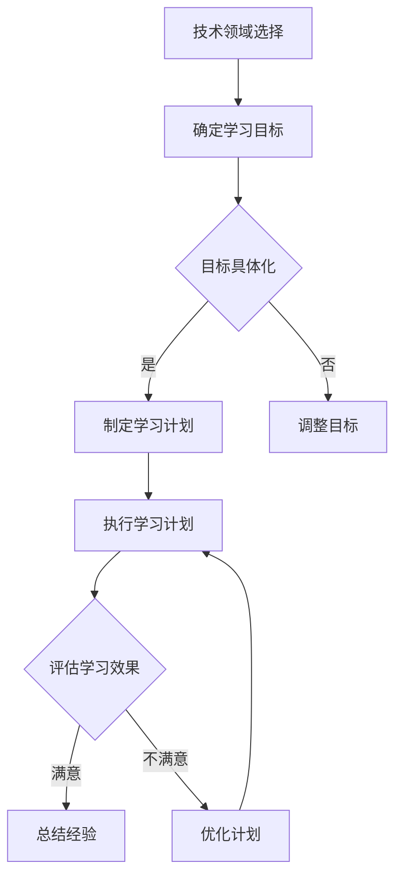
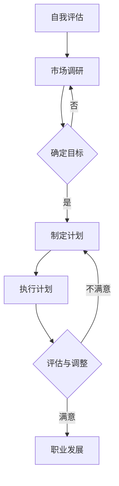
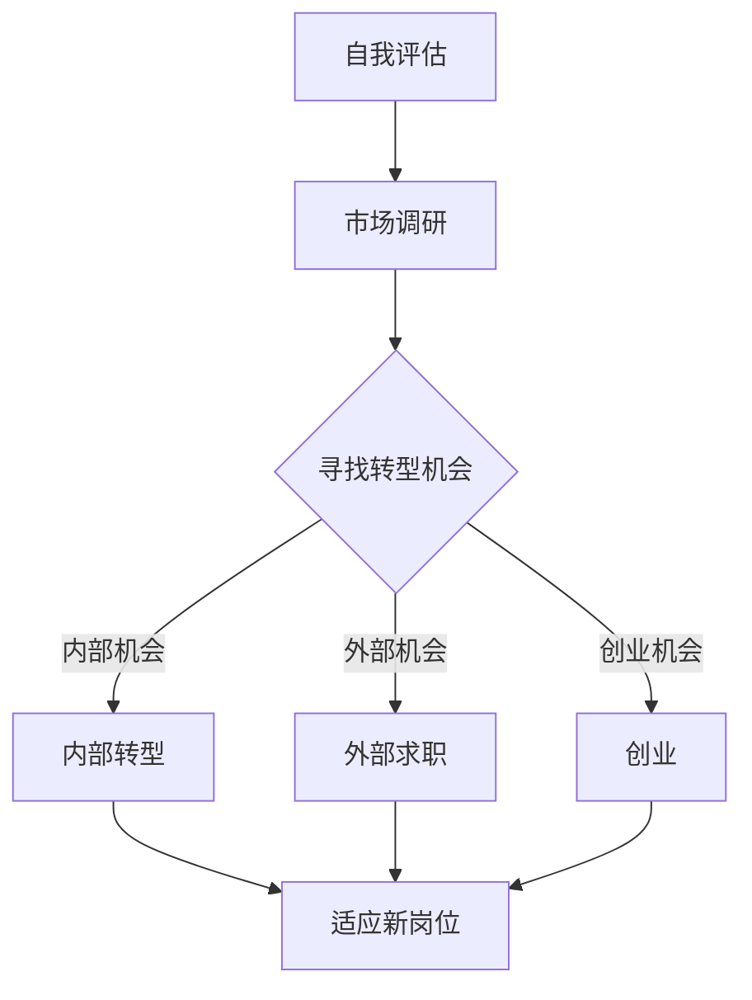

                 

# 《程序员如何应对中年危机与职业瓶颈》

> 关键词：中年危机，职业瓶颈，程序员，技能提升，职业转型，自我提升

> 摘要：本文旨在帮助中年程序员应对职业瓶颈和中年危机。通过分析中年危机的成因与特征，探讨职业发展规划的重要性，以及提升技能、拓宽视野、进行职业转型的方法，本文为中年程序员提供了切实可行的指导和建议。

### 目录

1. **第一部分：理解中年危机与职业瓶颈**
   1.1 **中年危机的成因与特征**
   1.2 **职业瓶颈的表现与影响**
   1.3 **中年程序员的特殊挑战**
   
2. **第二部分：提升技能与拓宽视野**
   2.1 **技术深度与广度**
   2.2 **软技能的培养**
   2.3 **跨领域知识与技能**
   
3. **第三部分：职业转型与自我提升**
   3.1 **职业转型策略**
   3.2 **自我提升与职业成长**
   
4. **第四部分：案例研究与启示**
   4.1 **成功案例分享**
   4.2 **失败案例反思**
   4.3 **案例对中年程序员的启示**
   
5. **附录**
   5.1 **推荐阅读与资源**
   5.2 **流程图与伪代码示例**
   5.3 **数学模型与公式**
   5.4 **代码解读与分析**

---

## 第一部分：理解中年危机与职业瓶颈

### 1.1 中年危机的成因与特征

**中年危机**是指人们在步入中年阶段后，面临的事业、家庭、心理健康等多重压力，导致心理和生理状态发生的一系列变化。对于程序员这一职业来说，中年危机具有其独特性，主要体现在以下几个方面：

- **职业发展停滞**：随着年龄的增长，程序员可能会发现自己的职业发展停滞，晋升空间有限，从而感到职业前景黯淡。
- **技能老化**：随着技术的不断进步，程序员需要不断学习新技术，以保持竞争力。但中年程序员可能由于时间和精力的限制，难以跟上技术发展的步伐，导致技能老化。
- **工作压力**：中年程序员可能同时承担家庭和工作的双重压力，导致身心疲惫。
- **职业安全感缺失**：中年程序员可能会对未来职业发展感到不确定，缺乏职业安全感。

### 1.2 职业瓶颈的表现与影响

**职业瓶颈**是指一个人在职业生涯中，由于技能、经验、资源等方面的限制，无法实现更高的职业发展和收入。对于程序员来说，职业瓶颈可能表现为以下几个方面：

- **职位晋升难**：程序员在达到一定职位后，可能发现难以继续晋升，从而感到职业发展受限。
- **收入增长缓慢**：随着年龄的增长，程序员可能会发现自己的收入增长缓慢，与同龄人相比缺乏竞争力。
- **工作满意度下降**：在职业瓶颈期，程序员可能会对工作产生厌倦感，工作满意度下降。

职业瓶颈对程序员的影响包括：

- **心理压力**：职业瓶颈可能导致程序员感到沮丧、焦虑等心理压力。
- **职业满意度下降**：职业瓶颈会使程序员对工作失去热情，降低职业满意度。
- **生活质量下降**：职业瓶颈可能导致收入增长缓慢，影响生活质量。

### 1.3 中年程序员的特殊挑战

中年程序员面临的挑战包括：

- **平衡家庭与工作**：中年程序员通常需要承担家庭责任，需要平衡家庭与工作之间的关系。
- **技术更新换代**：中年程序员需要不断学习新技术，以保持竞争力。
- **职业转型**：中年程序员可能需要考虑进行职业转型，以适应市场需求。

### 1.4 职业发展规划的重要性

**职业发展规划**是指一个人根据自身的兴趣、能力、价值观等因素，为自己制定的长期职业目标和实现这些目标的具体计划。对于中年程序员来说，职业发展规划具有以下重要性：

- **明确职业目标**：职业发展规划可以帮助中年程序员明确自己的职业目标，从而更有针对性地进行学习和提升。
- **提升竞争力**：通过职业发展规划，中年程序员可以提升自身技能和知识，增强在职场中的竞争力。
- **降低职业风险**：职业发展规划可以帮助中年程序员降低因技能老化、市场需求变化等原因导致的职业风险。
- **提升生活质量**：通过职业发展规划，中年程序员可以更好地实现职业与生活的平衡，提升生活质量。

### 1.5 自我评估与职业定位

**自我评估**是指一个人对自己的兴趣、能力、价值观等方面的全面了解。**职业定位**是指一个人根据自己的特点和市场需求，确定自己在职业生涯中的定位。对于中年程序员来说，自我评估和职业定位具有以下作用：

- **明确发展方向**：通过自我评估和职业定位，中年程序员可以明确自己的发展方向，更有针对性地进行学习和提升。
- **提升职业竞争力**：自我评估和职业定位可以帮助中年程序员发现自身优势，提升职业竞争力。
- **降低职业风险**：通过自我评估和职业定位，中年程序员可以降低因职业选择不当导致的职业风险。

### 1.6 设定目标与行动计划

**设定目标**是指确定自己在职业生涯中的期望和追求。**行动计划**是指为实现这些目标而制定的具体计划和步骤。对于中年程序员来说，设定目标和行动计划具有以下作用：

- **明确努力方向**：通过设定目标和行动计划，中年程序员可以明确自己的努力方向，更有针对性地进行学习和提升。
- **提升执行能力**：行动计划可以帮助中年程序员提升执行能力，确保目标的实现。
- **增强职业成就感**：通过设定目标和实现目标，中年程序员可以增强职业成就感，提高工作满意度。

### 1.7 职业发展规划的步骤

**职业发展规划**可以分为以下步骤：

1. **自我评估**：了解自己的兴趣、能力、价值观等。
2. **市场调研**：了解市场需求和趋势。
3. **目标设定**：根据自我评估和市场调研，设定长期和短期的职业目标。
4. **行动计划**：制定实现目标的行动计划，包括学习、实践、提升等。
5. **实施与调整**：执行行动计划，并根据实际情况进行适当调整。

### 1.8 职业发展规划的工具与方法

**职业发展规划**可以借助以下工具与方法：

- **SWOT分析**：对自身的优势、劣势、机会和威胁进行分析。
- **SMART目标**：确保目标具有具体性、可衡量性、可实现性、相关性和时限性。
- **Gantt图**：对行动计划进行可视化展示。
- **个人品牌建设**：通过提升个人能力和建立个人品牌，增强职业竞争力。

### 1.9 职业发展规划的常见误区

**职业发展规划**中常见的误区包括：

- **目标设定过高或过低**：目标应具有挑战性，但也要考虑实际情况。
- **缺乏长期规划**：职业发展规划应涵盖长期和短期目标。
- **忽视自我评估**：自我评估是职业发展规划的基础。
- **缺乏实施与调整**：行动计划需要执行和根据实际情况进行调整。

通过以上内容，我们可以看到中年危机与职业瓶颈对程序员的影响，以及职业发展规划的重要性。在接下来的部分，我们将探讨如何提升技能、拓宽视野，以及进行职业转型，帮助中年程序员应对中年危机与职业瓶颈。

---

## 第二部分：提升技能与拓宽视野

### 2.1 技术深度与广度

在技术发展迅速的今天，作为程序员，无论是对于新手还是中年程序员，持续学习和不断更新自己的技能库都是至关重要的。这不仅关乎个人的职业发展，更是应对中年危机和职业瓶颈的关键策略。

#### 技术深度的提升

**技术深度**指的是对某一技术领域的深入理解和掌握。它不仅仅包括对现有技术的熟练应用，还涉及到对技术原理的深入理解，以及对技术发展的前瞻性预判。以下是一些提升技术深度的策略：

1. **深入研究核心原理**：无论是编程语言、数据库、网络协议还是算法，理解其核心原理是提升技术深度的第一步。例如，对于计算机网络，可以深入研究TCP/IP协议、HTTP协议等。

   **伪代码示例**：
   ```
   function deepenUnderstand(principle) {
       readBooks(principle);
       watchTutorials(principle);
       writeCodeExamples(principle);
       discussWithPeers(principle);
   }
   ```

2. **解决复杂问题**：通过解决复杂问题，可以提高对技术的实际应用能力。例如，通过实现一个分布式系统，可以加深对分布式计算、数据一致性和容错机制的理解。

3. **技术交流与分享**：参与技术社区，如GitHub、Stack Overflow等，可以与其他程序员交流心得，学习他们的解决方案，同时分享自己的经验和见解。

#### 技术广度的拓展

**技术广度**指的是掌握多个技术领域的知识和技能。一个具有广泛技术背景的程序员，通常能够在不同项目中灵活运用多种技术，从而提高项目的成功率和个人的职业价值。以下是一些拓展技术广度的策略：

1. **跨领域学习**：学习与编程相关的其他领域知识，如产品设计、用户体验、业务逻辑等。这有助于程序员更好地理解整个项目，从而提高协作效率。

   **伪代码示例**：
   ```
   function broadenKnowledge(areas) {
       learnUIDesign(areas);
       understandBusinessLogic(areas);
       practiceWithRealWorldApplications(areas);
   }
   ```

2. **多语言编程**：掌握多种编程语言，如Python、Java、C++等，可以拓宽程序员的技术视野，提高编程技能的多样性。

3. **项目实践**：通过参与不同类型的项目，可以实践和巩固所学的技术知识。例如，参与开源项目、参加技术竞赛或创办自己的创业项目等。

#### 技术深度与广度的平衡

在提升技术深度与广度的过程中，如何找到平衡点是非常重要的。以下是一些建议：

1. **优先级管理**：根据自己的职业规划和市场需求，确定哪些技术领域需要优先提升。例如，对于从事后端开发的程序员，可能需要优先掌握数据库和服务器技术。

2. **专注与跨界**：在提升技术深度的同时，也要适度拓宽视野，进行跨界学习。这有助于保持技术的活力和创新能力。

3. **时间管理**：合理安排时间，确保有足够的时间进行深入学习和技术实践。

### 2.2 持续学习与技能更新

**持续学习**是程序员应对中年危机和职业瓶颈的重要手段。以下是一些持续学习与技能更新的策略：

1. **在线课程与书籍**：利用在线学习平台，如Coursera、Udemy、edX等，以及专业的编程书籍，系统性地学习新技术和知识。

   **伪代码示例**：
   ```
   function learnNewSkills(courses, books) {
       enrollInCourses(courses);
       readProfessionalBooks(books);
       participateInDiscussions();
   }
   ```

2. **技术博客与社区**：定期阅读技术博客，如Medium、Dev.to等，以及参与技术社区，如Stack Overflow、GitHub等，可以及时获取最新的技术动态和经验分享。

3. **内部培训与外部培训**：参加公司内部培训或外部培训机构的专业培训，提高专业技能和知识水平。

### 2.3 技术深度提升的策略

为了更具体地说明技术深度提升的策略，以下是一个基于“技术领域-目标-行动”的Mermaid流程图：



### 2.4 技术广度拓展的路径

技术广度拓展的路径可以包括以下几个方面：

1. **项目实践**：通过参与不同类型的项目，实践多种技术，如前端、后端、数据库、大数据、人工智能等。

2. **跨领域合作**：与其他领域的技术人员合作，了解他们的工作内容和所需技能，从而拓宽自己的技术视野。

3. **技术会议与讲座**：参加技术会议和讲座，了解行业趋势和技术发展方向。

4. **在线课程与研讨会**：利用在线课程和研讨会，学习新兴技术和管理知识。

通过以上策略，程序员可以在技术深度与广度上找到平衡，持续提升自己的技能水平，从而更好地应对中年危机和职业瓶颈。

---

## 第三部分：职业转型与自我提升

### 3.1 职业转型策略

面对中年危机和职业瓶颈，程序员可能需要考虑进行职业转型。职业转型不仅是为了适应市场需求，也是为了重燃职业激情，提升职业价值。以下是一些职业转型的策略：

#### 职业转型的准备

1. **自我评估**：在考虑职业转型之前，首先要进行全面的自我评估，了解自己的兴趣、技能、价值观等。这有助于找到适合自己的转型方向。

2. **市场调研**：了解目标职业的市场需求、薪酬水平、发展前景等，为自己的转型提供依据。

3. **技能匹配**：分析当前技能与目标职业之间的差距，制定针对性的学习计划。

#### 寻找转型机会

1. **内部转型**：首先可以考虑公司内部的转型机会，如从开发岗位转向技术管理或产品管理等。

2. **外部求职**：如果公司内部没有合适的转型机会，可以通过外部求职来寻找合适的职位。

3. **创业**：如果有足够的技能和经验，可以考虑创业，开创自己的事业。

#### 转型过程中的挑战与应对

1. **挑战**：
   - **技能差距**：转型过程中，可能会遇到新的技能要求和挑战。
   - **职业风险**：转型期间可能会面临收入下降、工作不稳定等风险。
   - **时间压力**：在转型过程中，可能需要平衡现有工作和转型学习的时间。

2. **应对策略**：
   - **持续学习**：利用业余时间进行学习，提升转型所需的新技能。
   - **寻求支持**：向有经验的同行、导师或职业规划师寻求建议和支持。
   - **逐步转型**：可以考虑先兼职从事目标职业，逐步过渡到全职。

#### 转型的步骤

1. **目标设定**：明确转型目标和预期成果。
2. **学习计划**：制定详细的学习计划，包括学习内容、时间安排等。
3. **技能提升**：通过学习、实践、项目经验等方式提升所需技能。
4. **转型实施**：逐步实施转型计划，如更换工作、创业等。
5. **评估与调整**：定期评估转型效果，根据实际情况进行调整。

#### 转型成功的关键因素

1. **持续学习**：保持对新技术和知识的渴望，不断提升自己的技能水平。
2. **适应能力**：具备快速适应新环境和新挑战的能力。
3. **沟通能力**：良好的沟通能力有助于在转型过程中与他人合作，获得支持和理解。
4. **抗压能力**：在转型过程中，可能会面临各种压力，需要有较强的抗压能力。

通过以上策略和步骤，程序员可以更顺利地实现职业转型，从而克服中年危机和职业瓶颈，找到新的职业发展方向。

### 3.2 自我提升与职业成长

**自我提升**是程序员在职业生涯中持续发展的关键。以下是一些自我提升的策略：

#### 时间管理

1. **制定日程表**：每天制定详细的日程表，合理安排工作和学习时间。
2. **优先级管理**：根据工作的重要性和紧急程度，合理分配时间。
3. **避免拖延**：养成及时完成任务的习惯，避免拖延导致工作效率低下。

#### 学习能力

1. **定期学习**：每天或每周安排固定时间进行学习，提升自身技能。
2. **主动学习**：主动寻找学习资源，如在线课程、技术博客等，主动学习新知识和技能。
3. **实践应用**：将所学知识应用到实际工作中，通过实践来巩固和提高技能。

#### 沟通能力

1. **倾听**：在沟通中注重倾听对方的意见和需求，避免急于表达自己的观点。
2. **表达清晰**：提高自己的表达能力，确保信息传达准确无误。
3. **团队协作**：培养团队合作精神，与团队成员建立良好的沟通和合作关系。

#### 问题解决能力

1. **分析问题**：面对问题时，首先要进行深入分析，找出问题的根源。
2. **提出解决方案**：根据问题分析，提出可行的解决方案，并进行评估。
3. **实施与验证**：将解决方案付诸实施，并进行验证，确保问题得到有效解决。

#### 领导力与团队合作

1. **领导力培养**：通过参与团队管理和项目负责，培养领导力。
2. **团队合作**：与团队成员建立良好的合作关系，共同完成项目目标。
3. **冲突管理**：在团队中遇到冲突时，积极寻求解决方案，确保团队和谐。

#### 个人品牌建设

1. **专业形象**：通过不断提升自己的专业技能和知识，树立专业形象。
2. **社交媒体**：利用社交媒体平台，分享专业见解和经验，扩大影响力。
3. **参与社区**：参与技术社区和开源项目，提高自己在行业内的知名度。

通过以上策略，程序员可以在自我提升和职业成长的道路上不断前行，克服中年危机和职业瓶颈，实现职业生涯的持续发展。

---

## 第四部分：案例研究与启示

### 4.1 成功案例分享

**案例一：从开发到创业的华丽转型**

**背景**：李先生，35岁，曾是一家互联网公司的后端开发工程师。在经过几年的稳定工作后，他开始感到职业发展停滞，对现状不满。

**转型过程**：
1. **自我评估**：李先生意识到自己的编程技能扎实，但对市场和商业逻辑了解不足。于是，他决定进行职业转型，转向创业。
2. **市场调研**：李先生通过市场调研，发现线上教育和智能学习平台有巨大的市场需求。
3. **技能提升**：他通过在线课程学习产品管理和商业知识，并在业余时间开发了一个智能学习平台的原型。
4. **创业**：在积累了一定的人脉和资源后，李先生辞去了稳定的工作，全身心投入到自己的创业项目中。

**结果**：经过一年的努力，李先生的智能学习平台上线，受到了市场的欢迎，获得了数百万的投资，李先生也实现了职业转型和财务自由。

**启示**：
- **找准市场需求**：成功的职业转型需要找准市场的需求，这可以通过市场调研和了解行业趋势来实现。
- **持续学习**：转型过程中需要不断学习新知识和技能，以适应新的职业要求。
- **勇于行动**：在确定转型方向后，要勇于行动，克服恐惧和不确定性。

**案例二：从技术专家到技术经理的晋升**

**背景**：张女士，40岁，是一家大型软件公司的资深开发工程师。她在技术上有着深厚的积累，但随着公司业务的扩展，对技术管理人才的需求也越来越大。

**转型过程**：
1. **自我评估**：张女士认识到自己在技术方面的优势，同时也有管理潜质。
2. **提升管理能力**：她通过参加管理培训课程，学习团队管理、项目管理、沟通技巧等。
3. **积极参与项目管理**：张女士主动承担了更多的项目管理任务，积累了管理经验。
4. **晋升**：在公司的年度评估中，张女士因出色的项目管理能力和技术实力被晋升为技术经理。

**结果**：张女士的晋升不仅提高了她的职业地位，也让她在公司中获得了更多的职业发展机会。

**启示**：
- **提升管理能力**：对于希望从技术岗位转向管理岗位的程序员来说，提升管理能力是关键。
- **积极参与**：通过积极参与公司项目和管理任务，可以积累经验和提升自己的能力。
- **展现价值**：在职业转型过程中，要展示自己的优势和贡献，获得领导和同事的认可。

### 4.2 失败案例反思

**案例一：盲目跟风转型**

**背景**：王先生，38岁，曾是一名优秀的软件开发工程师。看到区块链和人工智能领域的火热，他决定转型进入这些新兴领域。

**转型过程**：
1. **决策失误**：王先生没有充分了解区块链和人工智能的具体技术要求，盲目跟风。
2. **技能提升**：他通过在线课程和自学，试图在短时间内掌握这些新技能。
3. **项目失败**：在参与一个区块链项目后，由于技术不熟练，项目进展缓慢，最终失败。

**结果**：王先生的转型失败导致他在公司中的地位下降，失去了晋升的机会。

**反思**：
- **充分调研**：在进行职业转型前，要充分了解目标领域的技术要求和发展趋势，避免盲目跟风。
- **逐步过渡**：转型过程不宜过快，应逐步过渡，确保技能的提升与项目的需求相匹配。

**案例二：缺乏明确的职业规划**

**背景**：赵先生，42岁，是一名有着丰富经验的软件开发工程师。他对自己的职业发展没有明确的规划，导致职业瓶颈长期存在。

**转型过程**：
1. **缺乏规划**：赵先生在职业生涯中，没有设定明确的职业目标，导致职业发展停滞。
2. **技能停滞**：随着技术的发展，赵先生的技能逐渐落后，无法满足公司的新要求。
3. **职业困境**：赵先生感到职业前途黯淡，但在没有明确规划的情况下，他不知道如何突破瓶颈。

**结果**：赵先生最终选择了离职，但由于缺乏明确的职业规划，他在新的工作中仍然面临困境。

**反思**：
- **设定目标**：明确的职业目标是职业规划的基础，有助于程序员制定合理的职业发展路径。
- **持续学习**：只有不断学习和提升自己的技能，才能在竞争激烈的职场中保持竞争力。

### 4.3 案例对中年程序员的启示

通过以上成功和失败案例，我们可以得到以下启示，帮助中年程序员更好地应对职业瓶颈和中年危机：

- **理性规划**：在职业转型前，要充分了解目标领域的技术要求和发展趋势，制定明确的职业规划。
- **持续学习**：不断学习新技术和知识，保持自己的技能更新，提高职业竞争力。
- **勇于行动**：在确定转型方向后，要勇于行动，克服恐惧和不确定性，实现职业转型。
- **提升管理能力**：对于有志于从事管理岗位的程序员，提升管理能力是关键。
- **积极参与**：通过积极参与公司项目和管理任务，可以积累经验和提升自己的能力。
- **展现价值**：在职业转型过程中，要展示自己的优势和贡献，获得领导和同事的认可。

通过理性规划、持续学习、勇于行动、提升管理能力和积极参与，中年程序员可以克服职业瓶颈和中年危机，实现职业生涯的持续发展。

---

## 附录

### 附录A：推荐阅读与资源

#### A.1 相关书籍推荐

1. **《深度学习》**（Ian Goodfellow, Yoshua Bengio, Aaron Courville）
   - 内容概述：本书全面介绍了深度学习的基本原理和应用，适合对深度学习感兴趣的程序员。
   - 购买链接：[深度学习](https://www.amazon.com/Deep-Learning-Ian-Goodfellow/dp/0262035618)

2. **《Effective Java》**（Joshua Bloch）
   - 内容概述：本书介绍了Java编程的最佳实践，适合Java程序员学习和提升编码技巧。
   - 购买链接：[Effective Java](https://www.amazon.com/Effective-Java-Third-Joshua-Bloch/dp/0321356683)

3. **《重构：改善既有代码的设计》**（Martin Fowler）
   - 内容概述：本书介绍了重构技术，帮助程序员优化现有代码，提高代码质量。
   - 购买链接：[重构](https://www.amazon.com/Refactoring-Improving-Design-Existing-Software/dp/032148850X)

#### A.2 在线课程与讲座推荐

1. **Coursera - Machine Learning（吴恩达）**
   - 内容概述：由知名教授吴恩达开设的机器学习课程，适合初学者和进阶者。
   - 课程链接：[Machine Learning](https://www.coursera.org/learn/machine-learning)

2. **edX - Python for Everybody（Dr. Charles Severance）**
   - 内容概述：由Dr. Charles Severance教授的Python入门课程，适合没有编程基础的读者。
   - 课程链接：[Python for Everybody](https://www.edx.org/course/python-for-everybody)

3. **Udemy - Angular - The Complete Guide（Angular Team）**
   - 内容概述：由Angular团队开设的Angular框架课程，适合前端开发人员。
   - 课程链接：[Angular - The Complete Guide](https://www.udemy.com/course/angular-the-complete-guide/)

#### A.3 专业组织与社区介绍

1. **GitHub**
   - 内容概述：全球最大的开源代码托管平台，程序员可以在此分享、学习和改进代码。
   - 社区链接：[GitHub](https://github.com/)

2. **Stack Overflow**
   - 内容概述：全球最大的编程问答社区，程序员可以在此提问和解答技术问题。
   - 社区链接：[Stack Overflow](https://stackoverflow.com/)

3. **Reddit - r/learnprogramming**
   - 内容概述：Reddit上的编程学习社区，提供各种编程资源和讨论。
   - 社区链接：[r/learnprogramming](https://www.reddit.com/r/learnprogramming/)

### 附录B：流程图与伪代码示例

#### B.1 职业发展规划流程图



#### B.2 技术深度提升策略伪代码

```python
function deepenTechnicalSkills(technicalArea):
    readCorePrinciples(technicalArea)
    solveComplexProblems(technicalArea)
    practiceWithRealWorldApplications(technicalArea)
    participateInTechnicalCommunities(technicalArea)
```

#### B.3 转型策略流程图



### 附录C：数学模型与公式

#### C.1 机器学习中的常见公式

$$
\text{损失函数} = \frac{1}{2} \sum_{i=1}^{n} (\hat{y_i} - y_i)^2
$$

其中，$\hat{y_i}$ 是预测值，$y_i$ 是真实值，$n$ 是样本数量。

#### C.2 项目效率评估模型

$$
\text{效率} = \frac{\text{完成工作量}}{\text{总工作时间}}
$$

其中，完成工作量可以用完成的任务数量或完成的任务复杂度来衡量。

#### C.3 职业风险评估模型

$$
\text{风险} = \text{不确定性} \times \text{后果}
$$

其中，不确定性表示对职业发展不确定性的估计，后果表示风险事件发生后的影响。

### 附录D：代码解读与分析

#### D.1 实际案例代码解析

**代码片段**：
```java
public class HelloWorld {
    public static void main(String[] args) {
        System.out.println("Hello, World!");
    }
}
```

**解读**：
- `public class HelloWorld`：定义了一个名为 HelloWorld 的公共类。
- `public static void main(String[] args)`：定义了 main 方法，这是 Java 程序的入口点。
- `System.out.println("Hello, World!");`：输出 "Hello, World!" 到控制台。

#### D.2 开发环境搭建与配置

**步骤**：
1. **安装 Java Development Kit (JDK)**：在官方网站下载并安装 JDK，设置环境变量 `JAVA_HOME` 和 `PATH`。
2. **安装 Integrated Development Environment (IDE)**：如 Eclipse、IntelliJ IDEA 等，并配置 JDK。
3. **创建项目**：在 IDE 中创建一个新的 Java 项目，并添加 HelloWorld 类。

#### D.3 代码解读与分析方法

1. **语法分析**：检查代码是否符合 Java 语法规则，包括关键字、标识符、语句和注释的正确使用。
2. **逻辑分析**：理解代码的功能和意图，包括变量、函数、循环和条件语句的作用。
3. **性能分析**：评估代码的运行效率和资源消耗，包括时间复杂度和空间复杂度。
4. **代码审查**：通过代码审查，发现潜在的编程错误和优化机会，提高代码质量。

通过以上附录内容，读者可以更深入地了解职业发展规划、技术提升策略、数学模型和代码解读与分析方法，为应对中年危机和职业瓶颈提供有力支持。

### 作者信息

**作者：AI天才研究院/AI Genius Institute & 禅与计算机程序设计艺术 /Zen And The Art of Computer Programming**

