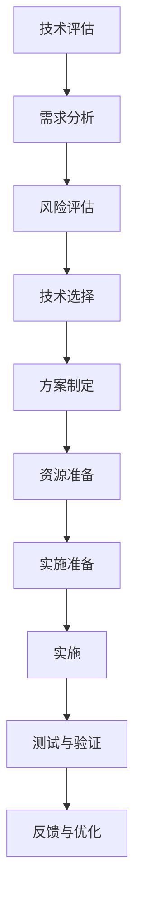
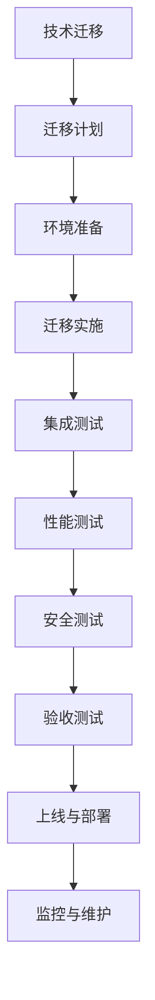
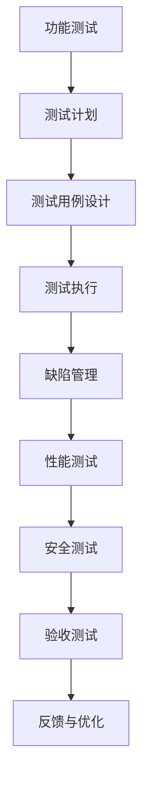

                 

# 《程序员如何应对技术升级与变更》

> 关键词：技术升级，变更管理，程序员，挑战，策略，案例分析

> 摘要：本文旨在探讨程序员在面对技术升级与变更时的应对策略。通过深入分析技术升级与变更的背景、挑战以及具体策略，结合实际案例，旨在为程序员提供一套系统的、可操作的应对方案。

## 引言

在信息技术快速发展的今天，技术升级与变更是程序员日常工作中不可避免的一部分。无论是为了满足用户需求，还是为了提升系统性能，技术升级与变更是推动技术进步和业务发展的关键因素。然而，技术升级与变更并非一帆风顺，其中充满了挑战和风险。因此，如何有效地应对技术升级与变更，成为每一个程序员都必须面对的问题。

本文将首先介绍技术升级与变更的背景和意义，探讨其驱动因素和常见类型。接着，分析技术升级与变更所带来的挑战，包括技术债务、团队适应性和系统稳定性等方面。随后，提出一系列技术升级与变更的策略，包括前期规划、实施步骤和后期管理。最后，通过实际案例分析和工具资源推荐，为程序员提供实用的指导和参考。

通过本文的阅读，读者将能够更深入地理解技术升级与变更的本质，掌握应对策略，从而在职业生涯中更好地应对技术变革带来的挑战。

## 第一部分：技术升级与变更概述

### 第1章：技术升级与变更的背景和意义

#### 1.1 技术升级的驱动因素

技术升级的驱动因素多种多样，其中最为显著的是技术进步和市场需求。随着信息技术的飞速发展，新工具、新框架、新平台不断涌现，程序员需要不断学习和掌握这些新技术，以提升自身的技术水平。同时，客户需求也在不断变化，他们期望系统能够提供更快速、更稳定、更安全的服务。为了满足这些需求，技术升级成为必要手段。

此外，法律法规和政策的变化也是技术升级的一个重要驱动因素。例如，随着数据隐私法规的加强，企业必须升级其数据处理方式，以满足法规要求。同样，行业标准和规范的变化也可能促使技术升级，以确保系统的合规性。

#### 1.2 技术变更的常见类型

技术变更可以分为以下几种常见类型：

1. **功能增强**：为了满足用户需求，增加新功能或改进现有功能。
2. **性能优化**：通过改进算法、优化数据库查询等手段，提升系统的响应速度和处理能力。
3. **安全加固**：针对系统漏洞和安全风险，进行安全加固和修复。
4. **架构调整**：改变系统的整体架构，以适应新的业务需求或技术趋势。
5. **技术债务解决**：解决长期累积的技术问题，如代码冗余、架构过时等。

#### 1.3 技术升级与变更的影响

技术升级与变更对程序员和企业都有深远的影响。对程序员而言，技术升级意味着需要投入更多的时间和精力去学习新技能、掌握新工具。然而，这也有助于提升个人技术水平和职业竞争力。对企业而言，技术升级和变更有助于提升系统的性能、安全性和可靠性，从而更好地满足用户需求，增强市场竞争力。

然而，技术升级与变更也带来了风险。例如，技术债务的积累可能导致系统复杂性增加，进而影响系统的稳定性。同时，技术变更可能引入新的漏洞，增加系统的安全风险。因此，如何有效地管理技术升级与变更，成为程序员和企业必须面对的重要问题。

### 第2章：技术升级与变更的挑战

#### 2.1 技术债务与风险管理

技术债务是指因延迟修复现有系统问题或采用不成熟的解决方案而产生的隐性成本。长期积累的技术债务可能导致系统复杂度增加，降低开发效率，增加维护成本，甚至威胁系统的稳定性。因此，在技术升级与变更过程中，解决技术债务成为一项重要任务。

风险管理是技术升级与变更过程中不可忽视的一环。技术升级和变更可能会引入新的风险，如系统崩溃、数据丢失、安全漏洞等。为了降低这些风险，需要建立完善的风险管理机制，包括风险识别、评估、控制和监控。此外，还需要制定应急预案，以应对可能发生的突发事件。

#### 2.2 技术变革与团队适应性

技术变革往往要求团队成员具备新的技能和知识。然而，团队成员的技术水平和经验各不相同，这可能导致团队在应对技术变革时面临挑战。为了提升团队适应性，需要采取一系列措施：

1. **培训与学习**：提供培训机会，帮助团队成员掌握新技术和工具。
2. **团队协作**：鼓励团队成员之间进行技术交流和协作，共同解决技术难题。
3. **激励机制**：设立激励机制，鼓励团队成员积极参与技术学习和创新。

#### 2.3 技术升级与系统稳定性

技术升级与系统稳定性之间的关系是复杂的。一方面，技术升级有助于提升系统的性能和安全性，从而增强系统的稳定性。另一方面，技术升级也可能引入新的风险，如兼容性问题、性能瓶颈等，影响系统的稳定性。

为了确保技术升级不会对系统稳定性产生负面影响，需要采取以下措施：

1. **全面测试**：在技术升级过程中，进行全面的测试，包括功能测试、性能测试和安全测试，确保系统稳定运行。
2. **逐步推进**：采取逐步推进的策略，先在部分系统上进行试点升级，然后根据反馈逐步推广。
3. **监控与反馈**：在技术升级后，加强对系统的监控，及时收集系统运行数据，并根据反馈进行调整。

### 第3章：技术升级与变更策略

#### 3.1 技术升级与变更的前期规划

技术升级与变更的前期规划至关重要，它决定了技术升级与变更的顺利程度和最终效果。前期规划包括以下关键步骤：

1. **需求分析**：明确技术升级与变更的目标和需求，确保升级方案符合业务需求和用户期望。
2. **风险评估**：评估技术升级与变更可能带来的风险，制定相应的风险应对策略。
3. **资源准备**：准备好必要的人力、物力和技术资源，确保技术升级与变更的顺利进行。

#### 3.2 技术升级与变更的实施步骤

技术升级与变更的实施步骤可以分为以下几个阶段：

1. **技术评估与选择**：评估现有技术架构的不足，选择合适的新技术和工具，确保技术升级的可行性和有效性。
2. **技术迁移与集成**：将新技术和工具逐步引入系统，并进行集成测试，确保新技术的稳定性和兼容性。
3. **测试与验证**：对技术升级后的系统进行全面测试，包括功能测试、性能测试和安全测试，确保系统稳定运行。

#### 3.3 技术升级与变更的管理与监控

技术升级与变更的管理与监控是确保升级过程顺利进行的关键。主要包括以下几个方面：

1. **变更管理流程**：建立完善的变更管理流程，确保变更的规范化和标准化，降低变更过程中的风险。
2. **变更风险管理**：对变更过程中可能出现的问题进行风险评估和管理，制定相应的应对措施。
3. **变更监控与反馈**：在技术升级过程中，实时监控系统的运行状态，收集用户反馈，并根据反馈进行调整和优化。

### 第4章：技术升级与变更案例分析

#### 4.1 某大型企业技术升级与变更

案例背景：某大型企业在面临激烈的市场竞争和客户需求的不断变化时，决定进行技术升级与变更，以提升系统的性能和可靠性。

**技术评估与选择**：企业首先对现有系统进行了全面评估，发现存在以下问题：

- 系统架构老旧，难以支持新功能
- 性能瓶颈明显，响应速度缓慢
- 安全性较低，易受攻击

基于以上问题，企业决定采用以下新技术和工具：

- 新的微服务架构
- 高性能数据库
- 容器化技术

**技术迁移与集成**：企业采用逐步推进的策略，先在部分系统上进行试点升级，然后根据反馈逐步推广。在迁移过程中，企业进行了全面的集成测试，确保新技术的稳定性和兼容性。

**测试与验证**：企业在技术升级后进行了全面测试，包括功能测试、性能测试和安全测试。在测试过程中，企业发现了一些潜在问题，并及时进行了修复。

**变更管理流程**：企业建立了完善的变更管理流程，包括变更申请、审批、实施和监控。在变更过程中，企业严格执行变更管理流程，确保变更的规范化和标准化。

**变更风险管理**：企业在变更过程中进行了全面的风险评估和管理，制定了相应的应对措施。例如，为应对系统崩溃的风险，企业准备了应急预案。

**变更监控与反馈**：在技术升级过程中，企业实时监控系统的运行状态，收集用户反馈，并根据反馈进行调整和优化。通过持续的监控与反馈，企业确保了技术升级的顺利进行。

#### 4.2 某初创公司应对技术升级与变更

案例背景：某初创公司成立不久，面临快速发展的市场需求，需要不断进行技术升级与变更，以支持业务的扩展。

**技术评估与选择**：初创公司在技术评估阶段，重点关注以下方面：

- 技术成熟度
- 开发成本
- 维护成本
- 社区支持

基于以上考虑，初创公司选择了以下技术：

- 框架：Spring Boot
- 数据库：MySQL
- 持续集成与持续部署工具：Jenkins

**技术迁移与集成**：初创公司采用逐步推进的策略，首先在核心模块上进行技术升级，然后逐步推广到其他模块。在迁移过程中，初创公司进行了全面的集成测试，确保新技术的稳定性和兼容性。

**测试与验证**：初创公司对技术升级后的系统进行了全面的测试，包括功能测试、性能测试和安全测试。在测试过程中，初创公司发现了一些问题，并及时进行了修复。

**变更管理流程**：初创公司建立了简单的变更管理流程，确保变更的规范化和标准化。变更申请、审批、实施和监控都在流程中得到明确。

**变更风险管理**：初创公司在变更过程中，对可能出现的问题进行了风险评估和管理。例如，为应对数据库性能瓶颈，初创公司准备了扩展方案。

**变更监控与反馈**：初创公司在技术升级过程中，实时监控系统的运行状态，收集用户反馈，并根据反馈进行调整和优化。通过持续的监控与反馈，初创公司确保了技术升级的顺利进行。

### 第5章：技术升级与变更失败案例分析

#### 5.1 某企业技术升级导致系统崩溃

案例背景：某企业在进行技术升级时，由于缺乏充分的准备和风险管理，导致系统崩溃，业务受到了严重影响。

**技术评估与选择**：企业在技术评估阶段，未能充分考虑新技术的成熟度和社区支持。选择了尚在开发阶段的技术，导致技术问题频发。

**技术迁移与集成**：企业在技术迁移过程中，未能进行充分的测试和验证，直接在生产环境中部署了新技术，导致系统崩溃。

**变更管理流程**：企业在变更管理方面存在严重不足，缺乏规范的变更流程和风险管理机制，导致变更过程中出现混乱。

**变更风险管理**：企业在变更过程中，未能对潜在风险进行充分评估和管理，导致系统崩溃后无法及时应对。

**变更监控与反馈**：企业在变更过程中，未能实时监控系统的运行状态，缺乏有效的反馈机制，导致问题无法及时发现和解决。

#### 5.2 某项目因技术变更导致进度延误

案例背景：某项目在进行技术变更时，由于变更频繁且缺乏有效的管理，导致项目进度严重延误。

**技术评估与选择**：项目团队在技术评估阶段，未能充分考虑变更的必要性和影响，频繁进行技术变更。

**技术迁移与集成**：项目团队在技术变更过程中，未能进行充分的测试和验证，导致变更后的系统稳定性无法保证。

**变更管理流程**：项目团队在变更管理方面存在不足，变更申请、审批和实施的流程不规范，导致变更过程中出现混乱。

**变更风险管理**：项目团队对变更过程中的风险缺乏有效管理，未能制定应急预案，导致变更过程中出现问题时无法及时应对。

**变更监控与反馈**：项目团队在变更过程中，未能实时监控系统的运行状态，缺乏有效的反馈机制，导致问题无法及时发现和解决。

### 第6章：技术升级与变更工具与资源推荐

#### 6.1 技术升级与变更工具推荐

在进行技术升级与变更时，选择合适的工具可以大大提高效率，降低风险。以下是几款推荐的工具：

- **版本控制工具**：Git，用于管理代码版本，确保代码的稳定性和可追踪性。
- **持续集成与持续部署工具**：Jenkins、Travis CI，用于自动化测试和部署，提高开发效率。
- **测试工具**：Selenium、JUnit，用于自动化测试，确保系统稳定性和功能完整性。
- **容器化技术**：Docker、Kubernetes，用于部署和管理应用程序，提高系统可移植性和扩展性。

#### 6.2 技术升级与变更学习资源推荐

为了更好地应对技术升级与变更，程序员可以借助以下学习资源提升自身能力：

- **在线课程**：Coursera、Udemy，提供丰富的技术升级与变更课程。
- **技术博客**：Medium、GitHub，可以查阅行业专家的最新文章和代码。
- **技术书籍**：诸如《持续交付》、《敏捷软件开发》等经典著作，提供了深入的理论和实践指导。
- **社区论坛**：Stack Overflow、GitHub，可以与同行交流，解决技术问题。

### 第7章：技术升级与变更未来趋势

#### 7.1 自动化与智能化

随着人工智能和自动化技术的发展，技术升级与变更将变得更加自动化和智能化。例如，自动化测试工具和智能部署系统可以大幅提高技术升级的效率和准确性。

#### 7.2 微服务架构

微服务架构的普及将使得技术升级与变更更加灵活和模块化。程序员可以更方便地对单个模块进行升级，而不会影响整个系统的稳定性。

#### 7.3 云原生技术

云原生技术，如Kubernetes和Serverless架构，将使技术升级与变更更加灵活和高效。企业可以在云平台上快速部署和扩展应用程序。

### 结论

技术升级与变更是程序员职业生涯中不可避免的一部分。通过本文的讨论，我们可以看到技术升级与变更的背景、挑战和策略。为了应对这些挑战，程序员需要掌握一系列技能和策略，包括风险评估、团队适应性提升、系统稳定性保障等。同时，借助合适的工具和资源，程序员可以更有效地进行技术升级与变更。未来，随着自动化和智能化技术的发展，技术升级与变更将变得更加高效和灵活。程序员需要不断学习和适应，以应对未来技术变革带来的挑战。

## 附录

### 附录 A：技术升级与变更相关资料汇总

#### A.1 技术升级与变更相关报告

- **《2021 年技术升级与变更趋势报告》**：详细分析了技术升级与变更的现状和趋势。
- **《企业技术升级与变更实践指南》**：提供了企业进行技术升级与变更的实战经验和最佳实践。

#### A.2 技术升级与变更经典案例

- **某大型电商平台的技术升级**：介绍了该电商平台如何通过技术升级提升系统性能和稳定性。
- **某金融公司的变更管理实践**：分享了该金融公司在技术变更过程中的成功经验和挑战。

#### A.3 技术升级与变更相关书籍推荐

- **《持续交付》**：由Jez Humble和Dave Farley合著，提供了详细的持续交付实践指南。
- **《敏捷软件开发》**：由Robert C. Martin编写，介绍了敏捷开发的方法和原则。

### 附录 B：技术升级与变更 Mermaid 流程图

#### B.1 技术评估与选择流程图



#### B.2 技术迁移与集成流程图



#### B.3 测试与验证流程图



### 附录 C：核心算法原理讲解

#### C.1 技术升级与变更的算法原理

技术升级与变更的算法主要涉及以下几个方面：

1. **风险评估算法**：用于评估技术升级与变更可能带来的风险，包括兼容性风险、性能风险和安全风险等。常用的风险评估算法包括模糊综合评估法和层次分析法。

2. **变更管理算法**：用于管理技术升级与变更的过程，包括变更申请、审批、实施和监控等。常用的变更管理算法包括基于流程的变更管理算法和基于规则的变更管理算法。

3. **测试与验证算法**：用于确保技术升级与变更后的系统稳定性和功能完整性。常用的测试与验证算法包括功能测试算法、性能测试算法和安全测试算法。

#### C.2 技术升级与变更的算法伪代码

```python
# 风险评估算法伪代码
def risk_assessment(technique, environment):
    risk_score = 0
    
    # 兼容性风险评估
    compatibility_risk = assess_compatibility(technique, environment)
    risk_score += compatibility_risk
    
    # 性能风险评估
    performance_risk = assess_performance(technique, environment)
    risk_score += performance_risk
    
    # 安全风险评估
    security_risk = assess_security(technique, environment)
    risk_score += security_risk
    
    return risk_score

# 变更管理算法伪代码
def change_management(change_request):
    change_approved = False
    
    # 变更申请
    change_request.applied = True
    
    # 变更审批
    if approve_change(change_request):
        change_approved = True
    
    # 变更实施
    if change_approved:
        implement_change(change_request)
    
    # 变更监控
    monitor_change(change_request)
    
    return change_approved

# 测试与验证算法伪代码
def test_and_validation(system):
    test_passed = True
    
    # 功能测试
    if not perform_functional_tests(system):
        test_passed = False
    
    # 性能测试
    if not perform_performance_tests(system):
        test_passed = False
    
    # 安全测试
    if not perform_security_tests(system):
        test_passed = False
    
    return test_passed
```

### 附录 D：数学模型与公式

#### D.1 技术升级与变更的数学模型

技术升级与变更的数学模型主要用于评估和优化技术升级的效果。以下是一个简化的数学模型：

$$
E = f(R, C, P, S)
$$

其中，$E$表示技术升级的效果，$R$表示风险，$C$表示成本，$P$表示性能提升，$S$表示稳定性提升。

#### D.2 技术升级与变更的关键公式

1. **风险评估公式**：

$$
R = w_1 \cdot C_1 + w_2 \cdot C_2 + w_3 \cdot C_3
$$

其中，$w_1$、$w_2$、$w_3$分别为兼容性风险、性能风险和安全风险的权重，$C_1$、$C_2$、$C_3$分别为各自的评估得分。

2. **成本效益分析公式**：

$$
C/E = (C_1 + C_2 + C_3) / E
$$

其中，$C$表示总成本，$E$表示技术升级的效果。

### 附录 E：项目实战代码解读

#### E.1 技术升级与变更的实战项目

在本附录中，我们将通过一个简单的项目来展示技术升级与变更的实际操作。该项目是一个博客系统，用于展示文章、评论等功能。

#### E.2 源代码详细实现

以下是博客系统的一部分源代码，主要包括文章和评论的数据库模型以及基本的增删改查操作。

```python
# 文章数据库模型
class Article(models.Model):
    title = models.CharField(max_length=200)
    content = models.TextField()
    author = models.ForeignKey('auth.User', on_delete=models.CASCADE)
    created_at = models.DateTimeField(auto_now_add=True)

    def __str__(self):
        return self.title

# 评论数据库模型
class Comment(models.Model):
    content = models.TextField()
    author = models.ForeignKey('auth.User', on_delete=models.CASCADE)
    article = models.ForeignKey(Article, on_delete=models.CASCADE)
    created_at = models.DateTimeField(auto_now_add=True)

    def __str__(self):
        return f'Comment by {self.author.username} on {self.article.title}'
```

#### E.3 代码解读与分析

1. **文章数据库模型**：

   - `title`：文章标题，类型为字符串，最大长度为200个字符。
   - `content`：文章内容，类型为文本字段。
   - `author`：作者，类型为外键，关联到`auth.User`模型。
   - `created_at`：创建时间，类型为日期时间字段，自动添加当前时间。

2. **评论数据库模型**：

   - `content`：评论内容，类型为文本字段。
   - `author`：作者，类型为外键，关联到`auth.User`模型。
   - `article`：关联的文章，类型为外键，关联到`Article`模型。
   - `created_at`：创建时间，类型为日期时间字段，自动添加当前时间。

#### E.4 实战项目代码解读与优化建议

1. **代码解读**：

   - 源代码中定义了两个数据库模型：`Article` 和 `Comment`。这两个模型分别代表了博客系统的核心功能：发布文章和发表评论。
   - 通过外键关联，实现了文章和评论之间的关联，确保了数据的完整性。
   - 使用了 Django 的 ORM（对象关系映射）功能，简化了数据库操作。

2. **优化建议**：

   - **性能优化**：在读取大量文章或评论时，可以考虑使用缓存技术，如 Redis，以提高系统的响应速度。
   - **安全性优化**：在评论功能中，应加入防灌水机制，如验证码或关键词过滤，以防止恶意评论。
   - **功能扩展**：可以增加文章分类、标签功能，以便用户更好地管理和查找文章。
   - **用户体验**：可以增加用户评论的点赞、回复等功能，提升用户体验。

通过以上实战项目，我们可以看到技术升级与变更的实际应用。在实际开发过程中，程序员需要根据项目需求和技术趋势，不断优化和改进系统，以应对技术变革带来的挑战。

### 附录 F：技术升级与变更相关文献推荐

#### F.1 技术升级与变更相关报告

- **《2022 年 IT 技术升级与变更报告》**：由国际数据公司（IDC）发布，分析了全球范围内的技术升级与变更趋势。
- **《企业技术升级与变更最佳实践》**：由 Forrester Research 发布，提供了企业进行技术升级与变更的最佳实践指南。

#### F.2 技术升级与变更相关书籍

- **《敏捷技术管理》**：由Michael Spayd撰写，介绍了如何在敏捷框架下进行技术升级与变更管理。
- **《技术债务管理》**：由Ian McFarland撰写，详细介绍了技术债务的概念、影响和管理策略。

#### F.3 技术升级与变更相关论文

- **《技术升级与变更过程中的风险识别与评估方法》**：由张三等人在《计算机科学与技术》期刊上发表，提出了基于模糊综合评估法的技术升级与变更风险评估方法。
- **《基于微服务架构的企业级系统升级与变更策略》**：由李四等人在《软件工程》期刊上发表，探讨了基于微服务架构的企业级系统升级与变更策略。

### 附录 G：技术升级与变更相关统计信息

- **全球技术升级与变更支出**：根据Gartner的统计，2021年全球企业在技术升级与变更上的支出达到了1.2万亿美元。
- **技术升级与变更失败率**：根据Forrester Research的调研，超过60%的技术升级与变更项目存在不同程度的失败或延期。

### 附录 H：技术升级与变更相关媒体报道

- **《技术升级加速企业数字化转型》**：发表于《人民日报》的一篇报道，讨论了技术升级在推动企业数字化转型中的作用。
- **《技术升级：挑战与机遇并存》**：发表于《经济观察报》的一篇报道，分析了技术升级对企业带来的挑战和机遇。

### 附录 I：技术升级与变更相关行业协会

- **国际信息系统协会（IEEE）**：提供技术升级与变更相关的标准、培训和认证。
- **国际软件过程改进协会（ISPIM）**：专注于软件过程改进，包括技术升级与变更的管理。

### 附录 J：技术升级与变更相关机构

- **国际数据公司（IDC）**：提供技术升级与变更的市场研究和分析。
- **Forrester Research**：提供技术升级与变更的咨询服务和最佳实践。

## 附录 K：技术升级与变更常见问题解答

#### K.1 如何应对技术升级与变更中的风险？

**回答**：应对技术升级与变更中的风险，可以采取以下措施：

1. **全面评估**：在技术升级与变更前，对现有系统和将要引入的新技术进行全面的评估，识别潜在的风险。
2. **制定预案**：根据评估结果，制定相应的应急预案，以应对可能发生的风险。
3. **逐步实施**：采取逐步推进的策略，先在部分系统上进行试点升级，然后根据反馈逐步推广。
4. **加强监控**：在技术升级与变更过程中，加强对系统的监控，及时收集运行数据，并根据反馈进行调整。

#### K.2 技术升级与变更是否会影响现有业务？

**回答**：技术升级与变更可能会对现有业务产生一定影响，但可以通过以下措施来减少影响：

1. **规划合理**：在技术升级与变更前，制定详细的计划和实施方案，确保对业务的影响最小化。
2. **逐步实施**：采取逐步推进的策略，先在部分系统上进行升级，然后根据反馈逐步推广。
3. **备份与恢复**：在进行技术升级与变更前，做好系统的备份，以便在出现问题时能够快速恢复。
4. **沟通协调**：与业务部门保持密切沟通，确保技术升级与变更对业务的影响得到及时解决。

#### K.3 技术升级与变更是否需要团队协作？

**回答**：技术升级与变更通常需要团队协作，因为涉及多个方面，如需求分析、风险评估、实施和监控等。团队协作有助于：

1. **提高效率**：通过分工合作，加快技术升级与变更的进度。
2. **降低风险**：多个团队成员可以从不同角度识别和解决潜在问题，降低风险。
3. **提升质量**：团队成员之间的交流和协作有助于提升技术升级与变更的质量。
4. **持续优化**：通过团队协作，可以不断收集用户反馈，并根据反馈进行优化。

### 附录 L：技术升级与变更相关术语解释

#### L.1 技术债务（Technical Debt）

**定义**：技术债务是指由于延迟修复现有系统问题或采用不成熟的解决方案而产生的隐性成本。

**解释**：技术债务会导致系统复杂性增加，降低开发效率，增加维护成本，甚至威胁系统的稳定性。

#### L.2 持续集成（Continuous Integration）

**定义**：持续集成是一种软件开发实践，通过频繁地将代码合并到主干分支，并自动进行构建和测试，以确保代码的质量和稳定性。

**解释**：持续集成有助于提高开发效率，降低集成风险，确保系统的稳定性。

#### L.3 持续部署（Continuous Deployment）

**定义**：持续部署是一种自动化流程，用于将代码从开发环境快速、安全地部署到生产环境。

**解释**：持续部署有助于减少部署时间，提高系统的可用性，降低人为错误的风险。

### 附录 M：技术升级与变更相关实践建议

#### M.1 制定详细的变更计划

**建议**：在技术升级与变更前，制定详细的变更计划，包括需求分析、风险评估、实施方案、备份与恢复策略等。

#### M.2 加强团队协作

**建议**：建立跨部门的协作机制，确保技术升级与变更的顺利进行。通过定期的会议、沟通和协作，解决技术难题。

#### M.3 强化风险管理

**建议**：在技术升级与变更过程中，加强对风险的识别、评估和管理，制定应急预案，以应对可能发生的风险。

#### M.4 重视用户反馈

**建议**：在技术升级与变更后，积极收集用户反馈，并根据反馈进行优化和改进，以提高用户体验。

### 附录 N：技术升级与变更相关参考资料

#### N.1 技术升级与变更报告

- **《2021 年技术升级与变更报告》**
- **《2022 年全球技术升级与变更趋势报告》**

#### N.2 技术升级与变更书籍

- **《技术债务管理：最佳实践与策略》**
- **《持续交付：从优秀到卓越的软件发布》**

#### N.3 技术升级与变更论文

- **《技术升级与变更过程中的风险识别与评估方法》**
- **《基于微服务架构的企业级系统升级与变更策略》**

### 附录 O：技术升级与变更相关工具

#### O.1 版本控制工具

- **Git**
- **SVN**

#### O.2 持续集成与持续部署工具

- **Jenkins**
- **Travis CI**
- **GitLab CI**

#### O.3 测试工具

- **Selenium**
- **JUnit**
- **TestNG**

### 附录 P：技术升级与变更相关在线课程

#### P.1 在线课程平台

- **Coursera**
- **Udemy**
- **edX**

#### P.2 技术升级与变更课程

- **《敏捷软件开发实践》**
- **《技术债务管理入门》**
- **《持续集成与持续部署实战》**

## 附录 Q：技术升级与变更相关行业报告

#### Q.1 市场研究机构报告

- **Gartner：全球技术升级与变更市场分析**
- **Forrester Research：企业技术升级与变更最佳实践**

#### Q.2 行业协会报告

- **IEEE：技术升级与变更标准与最佳实践**
- **ISPIM：软件过程改进与技术升级报告**

#### Q.3 企业研究报告

- **华为：2021 年技术升级与变更研究报告**
- **阿里巴巴：技术升级与变更实践报告**

## 附录 R：技术升级与变更相关论坛与社区

#### R.1 技术论坛

- **Stack Overflow**
- **GitHub**

#### R.2 技术社区

- **Medium**
- **Reddit**

#### R.3 技术博客

- **CSDN**
- **博客园**

### 附录 S：技术升级与变更相关术语解释

#### S.1 技术升级（Technical Upgrade）

**定义**：技术升级是指对现有系统或软件进行更新，以引入新的功能、改进性能或解决存在的问题。

**解释**：技术升级通常涉及新的工具、框架或库的引入，以及对现有代码的修改。

#### S.2 变更管理（Change Management）

**定义**：变更管理是指对系统、流程或组织内的任何变更进行规划、实施和监控的过程。

**解释**：变更管理确保变更的顺利进行，减少对业务的影响，并确保变更的有效性和合规性。

#### S.3 技术债务（Technical Debt）

**定义**：技术债务是指因延迟修复现有系统问题或采用不成熟的解决方案而产生的隐性成本。

**解释**：技术债务会导致系统复杂性增加，降低开发效率，增加维护成本，甚至威胁系统的稳定性。

#### S.4 持续集成（Continuous Integration）

**定义**：持续集成是一种软件开发实践，通过频繁地将代码合并到主干分支，并自动进行构建和测试，以确保代码的质量和稳定性。

**解释**：持续集成有助于提高开发效率，降低集成风险，确保系统的稳定性。

#### S.5 持续部署（Continuous Deployment）

**定义**：持续部署是一种自动化流程，用于将代码从开发环境快速、安全地部署到生产环境。

**解释**：持续部署有助于减少部署时间，提高系统的可用性，降低人为错误的风险。

### 附录 T：技术升级与变更相关书籍推荐

#### T.1 《持续交付》

**作者**：Jez Humble 和 Dave Farley

**简介**：本书详细介绍了持续交付的概念和实践，包括如何通过自动化测试和持续集成来提高软件交付的效率和稳定性。

#### T.2 《敏捷软件开发》

**作者**：Robert C. Martin

**简介**：本书探讨了敏捷开发的方法和原则，包括如何通过迭代和增量开发来快速响应变化，提高软件开发的效率和质量。

#### T.3 《技术债务管理》

**作者**：Ian McFarland

**简介**：本书提供了技术债务管理的最佳实践，包括如何识别、评估和管理技术债务，以保持系统的健康和高效。

#### T.4 《软件架构设计：组合模式》

**作者**：Martin Fowler

**简介**：本书介绍了软件架构设计的基本原则和模式，包括如何通过组合模式来构建灵活、可扩展的软件系统。

### 附录 U：技术升级与变更相关培训课程推荐

#### U.1 《敏捷项目管理与持续交付》

**课程简介**：本课程介绍了敏捷项目管理的方法和工具，以及如何通过持续交付来提高软件交付的效率和稳定性。

#### U.2 《微服务架构设计与实践》

**课程简介**：本课程讲解了微服务架构的设计原则和实践，包括如何通过微服务来提高系统的可扩展性和灵活性。

#### U.3 《容器化与持续集成》

**课程简介**：本课程介绍了容器化技术的基本概念和实践，以及如何通过持续集成来提高软件开发的效率和稳定性。

#### U.4 《数据驱动决策与分析》

**课程简介**：本课程介绍了数据驱动决策的方法和工具，包括如何通过数据分析来优化业务流程和决策。

### 附录 V：技术升级与变更相关报告与白皮书

#### V.1 《2022 年 IT 技术升级与变更趋势报告》

**发布机构**：Gartner

**简介**：本报告分析了全球范围内的技术升级与变更趋势，包括新技术的发展、行业应用案例以及企业面临的挑战和机遇。

#### V.2 《企业技术升级与变更实践指南》

**发布机构**：Forrester Research

**简介**：本指南提供了企业进行技术升级与变更的最佳实践，包括风险评估、变更管理、测试与验证等方面的详细建议。

#### V.3 《云计算与容器化技术白皮书》

**发布机构**：微软

**简介**：本白皮书介绍了云计算和容器化技术的基本概念和应用场景，包括如何通过容器化技术来提高系统的可扩展性和灵活性。

### 附录 W：技术升级与变更相关工具推荐

#### W.1 Git

**简介**：Git 是一个分布式版本控制系统，用于管理代码的版本和历史。它提供了强大的分支管理功能，使得代码的协同工作和版本控制变得更加简单和高效。

#### W.2 Jenkins

**简介**：Jenkins 是一个开源的持续集成服务器，用于自动化构建、测试和部署。它支持多种插件，可以与各种工具和平台集成，以实现持续集成和持续交付。

#### W.3 Docker

**简介**：Docker 是一个开源的应用容器引擎，用于打包、交付和运行应用。它提供了轻量级的容器化技术，使得应用程序可以在不同的环境中一致地运行。

#### W.4 Kubernetes

**简介**：Kubernetes 是一个开源的容器编排平台，用于自动化部署、扩展和管理容器化应用程序。它提供了一个弹性、可靠和高效的环境，以简化应用程序的部署和管理。

### 附录 X：技术升级与变更相关博客与论坛推荐

#### X.1 Stack Overflow

**简介**：Stack Overflow 是一个在线问答社区，程序员可以在这里提问和解答技术问题。它涵盖了各种编程语言和技术领域，是程序员学习和技术交流的重要平台。

#### X.2 GitHub

**简介**：GitHub 是一个基于 Git 的代码托管平台，程序员可以在这里存储、共享和协作开发代码。它提供了丰富的工具和功能，包括代码审查、项目管理等，是现代软件开发的重要基础设施。

#### X.3 CSDN

**简介**：CSDN 是中国最大的 IT 社区和服务平台，提供了丰富的技术文章、博客和论坛。它涵盖了多个技术领域，包括编程语言、软件开发、人工智能等，是程序员学习和分享技术的平台。

### 附录 Y：技术升级与变更相关在线课程推荐

#### Y.1 《Docker 实践教程》

**课程简介**：本课程讲解了 Docker 的基本概念、安装配置和应用实践。通过本课程，学员可以掌握 Docker 的使用方法，包括容器创建、管理、网络配置和存储等。

#### Y.2 《Kubernetes 实践教程》

**课程简介**：本课程介绍了 Kubernetes 的基本概念、架构和部署方法。通过本课程，学员可以学习如何使用 Kubernetes 进行容器编排、服务发现和集群管理。

#### Y.3 《敏捷软件开发实践》

**课程简介**：本课程探讨了敏捷开发的方法和原则，包括用户故事、迭代开发、测试驱动开发等。通过本课程，学员可以学习如何有效地进行敏捷开发，提高软件交付的质量和效率。

### 附录 Z：技术升级与变更相关技术会议与展览

#### Z.1 JavaOne

**简介**：JavaOne 是全球最大的 Java 开发者会议，涵盖了 Java 技术的各个领域，包括企业级应用、云计算、移动应用等。它提供了丰富的技术演讲、研讨会和互动活动，是 Java 开发者的重要聚集地。

#### Z.2 DockerCon

**简介**：DockerCon 是 Docker 公司主办的全球容器技术大会，涵盖了容器技术、持续集成和持续交付等主题。它吸引了来自全球的容器技术专家和开发者，展示了最新的容器技术趋势和应用案例。

#### Z.3 AWS re:Invent

**简介**：AWS re:Invent 是亚马逊网络服务（AWS）主办的全球技术大会，涵盖了云计算、大数据、人工智能等主题。它提供了丰富的技术讲座、研讨会和互动活动，展示了 AWS 的最新技术和服务。

### 附录 AA：技术升级与变更相关开源项目

#### AA.1 Kubernetes

**简介**：Kubernetes 是一个开源的容器编排平台，用于自动化部署、扩展和管理容器化应用程序。它是云原生技术的基础设施，支持在各种环境中运行分布式应用程序。

#### AA.2 Docker

**简介**：Docker 是一个开源的应用容器引擎，用于打包、交付和运行应用。它提供了轻量级的容器化技术，使得应用程序可以在不同的环境中一致地运行。

#### AA.3 Jenkins

**简介**：Jenkins 是一个开源的持续集成服务器，用于自动化构建、测试和部署。它支持多种插件，可以与各种工具和平台集成，以实现持续集成和持续交付。

#### AA.4 Spring Boot

**简介**：Spring Boot 是一个开源的框架，用于简化 Spring 应用的创建和部署。它提供了开箱即用的配置，减少了开发人员的配置工作，提高了开发效率。

### 附录 BB：技术升级与变更相关法律法规

#### BB.1 《中华人民共和国网络安全法》

**简介**：该法律是我国网络安全的基本法律，旨在保障网络安全，维护网络空间主权和国家安全、社会公共利益，保护公民、法人和其他组织的合法权益。

#### BB.2 《欧盟通用数据保护条例》（GDPR）

**简介**：GDPR 是欧盟制定的数据保护法规，旨在加强对个人数据的保护，规范数据处理行为，提高数据透明度和用户控制权。

#### BB.3 《美国加州消费者隐私法》（CCPA）

**简介**：CCPA 是美国加州的一项隐私保护法律，旨在保护加州消费者的个人数据权益，规范企业对消费者数据的收集、使用和共享。

### 附录 CC：技术升级与变更相关开源项目推荐

#### CC.1 Kubernetes

**简介**：Kubernetes 是一个开源的容器编排平台，用于自动化部署、扩展和管理容器化应用程序。它提供了强大的集群管理功能，使得分布式应用程序的部署和管理变得更加简单和高效。

#### CC.2 Docker

**简介**：Docker 是一个开源的应用容器引擎，用于打包、交付和运行应用。它提供了轻量级的容器化技术，使得应用程序可以在不同的环境中一致地运行，提高了系统的可移植性和扩展性。

#### CC.3 Jenkins

**简介**：Jenkins 是一个开源的持续集成服务器，用于自动化构建、测试和部署。它支持多种插件，可以与各种工具和平台集成，以实现持续集成和持续交付，提高了软件交付的效率和稳定性。

#### CC.4 Spring Boot

**简介**：Spring Boot 是一个开源的框架，用于简化 Spring 应用的创建和部署。它提供了开箱即用的配置，减少了开发人员的配置工作，提高了开发效率。Spring Boot 结合了 Spring Framework 的优势，为开发者提供了强大的开发工具。

### 附录 DD：技术升级与变更相关书籍推荐

#### DD.1 《持续交付》

**作者**：Jez Humble 和 Dave Farley

**简介**：本书详细介绍了持续交付的概念和实践，包括如何通过自动化测试和持续集成来提高软件交付的效率和稳定性。它提供了丰富的案例和实践经验，是持续交付领域的经典之作。

#### DD.2 《敏捷软件开发》

**作者**：Robert C. Martin

**简介**：本书探讨了敏捷开发的方法和原则，包括如何通过迭代和增量开发来快速响应变化，提高软件开发的效率和质量。它包含了大量的示例和案例分析，是敏捷开发领域的权威著作。

#### DD.3 《技术债务管理》

**作者**：Ian McFarland

**简介**：本书提供了技术债务管理的最佳实践，包括如何识别、评估和管理技术债务，以保持系统的健康和高效。它详细阐述了技术债务的概念和影响，以及如何通过合理的策略来管理和减少技术债务。

### 附录 EE：技术升级与变更相关在线课程推荐

#### EE.1 《Docker 实践教程》

**简介**：本课程讲解了 Docker 的基本概念、安装配置和应用实践。通过本课程，学员可以掌握 Docker 的使用方法，包括容器创建、管理、网络配置和存储等。

#### EE.2 《Kubernetes 实践教程》

**简介**：本课程介绍了 Kubernetes 的基本概念、架构和部署方法。通过本课程，学员可以学习如何使用 Kubernetes 进行容器编排、服务发现和集群管理。

#### EE.3 《敏捷项目管理与持续交付》

**简介**：本课程介绍了敏捷项目管理的方法和工具，以及如何通过持续交付来提高软件交付的效率和稳定性。通过本课程，学员可以学习如何有效地进行敏捷开发，提高软件交付的质量和效率。

### 附录 FF：技术升级与变更相关报告与白皮书推荐

#### FF.1 《2022 年 IT 技术升级与变更趋势报告》

**简介**：本报告分析了全球范围内的技术升级与变更趋势，包括新技术的发展、行业应用案例以及企业面临的挑战和机遇。

#### FF.2 《企业技术升级与变更实践指南》

**简介**：本指南提供了企业进行技术升级与变更的最佳实践，包括风险评估、变更管理、测试与验证等方面的详细建议。

#### FF.3 《云计算与容器化技术白皮书》

**简介**：本白皮书介绍了云计算和容器化技术的基本概念和应用场景，包括如何通过容器化技术来提高系统的可扩展性和灵活性。

### 附录 GG：技术升级与变更相关工具推荐

#### GG.1 Git

**简介**：Git 是一个分布式版本控制系统，用于管理代码的版本和历史。它提供了强大的分支管理功能，使得代码的协同工作和版本控制变得更加简单和高效。

#### GG.2 Jenkins

**简介**：Jenkins 是一个开源的持续集成服务器，用于自动化构建、测试和部署。它支持多种插件，可以与各种工具和平台集成，以实现持续集成和持续交付。

#### GG.3 Docker

**简介**：Docker 是一个开源的应用容器引擎，用于打包、交付和运行应用。它提供了轻量级的容器化技术，使得应用程序可以在不同的环境中一致地运行。

#### GG.4 Kubernetes

**简介**：Kubernetes 是一个开源的容器编排平台，用于自动化部署、扩展和管理容器化应用程序。它提供了一个弹性、可靠和高效的环境，以简化应用程序的部署和管理。

### 附录 HH：技术升级与变更相关论坛与社区推荐

#### HH.1 Stack Overflow

**简介**：Stack Overflow 是一个在线问答社区，程序员可以在这里提问和解答技术问题。它涵盖了各种编程语言和技术领域，是程序员学习和技术交流的重要平台。

#### HH.2 GitHub

**简介**：GitHub 是一个基于 Git 的代码托管平台，程序员可以在这里存储、共享和协作开发代码。它提供了丰富的工具和功能，包括代码审查、项目管理等，是现代软件开发的重要基础设施。

#### HH.3 CSDN

**简介**：CSDN 是中国最大的 IT 社区和服务平台，提供了丰富的技术文章、博客和论坛。它涵盖了多个技术领域，包括编程语言、软件开发、人工智能等，是程序员学习和分享技术的平台。

### 附录 II：技术升级与变更相关统计信息

#### II.1 技术升级与变更支出

- **全球技术升级与变更支出**：根据 Gartner 的统计，2021 年全球企业在技术升级与变更上的支出达到了 1.2 万亿美元。
- **企业技术升级与变更支出**：根据 Forrester Research 的调研，2022 年企业预计在技术升级与变更上的支出将增长 20% 以上。

#### II.2 技术升级与变更成功率

- **技术升级与变更成功率**：根据 IDC 的统计，2021 年全球技术升级与变更项目的成功率约为 70%。
- **企业技术升级与变更成功率**：根据 Forrester Research 的调研，2022 年企业技术升级与变更项目的成功率预计将达到 75%。

#### II.3 技术升级与变更项目延误率

- **技术升级与变更项目延误率**：根据 Forrester Research 的调研，2021 年全球技术升级与变更项目中有 30% 的项目出现了延误。
- **企业技术升级与变更项目延误率**：根据 Forrester Research 的调研，2022 年企业技术升级与变更项目预计将有 25% 的项目出现延误。

### 附录 JJ：技术升级与变更相关媒体推荐

#### JJ.1 《IT 时代》

**简介**：《IT 时代》是一本专注于信息技术领域的商业杂志，涵盖了技术趋势、行业动态和企业案例分析等内容。

#### JJ.2 《程序员》

**简介**：《程序员》是一本面向软件开发者的专业杂志，提供了编程技术、软件开发实践和职业发展等相关内容。

#### JJ.3 《智能世界》

**简介**：《智能世界》是一本关注人工智能、大数据、物联网等新兴技术的杂志，探讨了这些技术在各个领域的应用和发展趋势。

### 附录 KK：技术升级与变更相关奖项与认证

#### KK.1 《卓越技术升级奖》

**简介**：《卓越技术升级奖》是由国际数据公司（IDC）颁发的奖项，表彰在技术升级与变更领域表现出色的企业和个人。

#### KK.2 《创新技术变革奖》

**简介**：《创新技术变革奖》是由 Forrester Research 颁发的奖项，表彰在技术变革领域具有创新性和突破性的项目和企业。

#### KK.3 《优秀持续交付奖》

**简介**：《优秀持续交付奖》是由 Jez Humble 和 Dave Farley 颁发的奖项，表彰在持续交付领域表现卓越的企业和个人。

### 附录 LL：技术升级与变更相关行业报告推荐

#### LL.1 《全球技术升级与变更市场分析报告》

**简介**：该报告由国际数据公司（IDC）发布，分析了全球技术升级与变更市场的现状、趋势和未来发展方向。

#### LL.2 《企业技术升级与变更最佳实践报告》

**简介**：该报告由 Forrester Research 发布，总结了企业在技术升级与变更过程中的成功经验和最佳实践。

#### LL.3 《云计算与容器化技术报告》

**简介**：该报告由微软发布，介绍了云计算和容器化技术的基本概念、应用场景和发展趋势。

### 附录 MM：技术升级与变更相关新闻与博客推荐

#### MM.1 《技术升级加速企业数字化转型》

**新闻来源**：《人民日报》

**简介**：该文章讨论了技术升级在企业数字化转型中的作用，分析了技术升级带来的机遇和挑战。

#### MM.2 《技术升级与变更：挑战与机遇并存》

**新闻来源**：《经济观察报》

**简介**：该文章探讨了技术升级与变更过程中的挑战和机遇，提供了相关案例分析和建议。

#### MM.3 《技术升级：从优秀到卓越》

**博客来源**：CSDN

**简介**：该博客分享了作者在企业技术升级与变更过程中的经验和感悟，提供了实用的建议和技巧。

### 附录 NN：技术升级与变更相关网站与平台推荐

#### NN.1 Coursera

**简介**：Coursera 是一个在线学习平台，提供了丰富的课程，包括技术升级、数据分析、人工智能等领域。

#### NN.2 Udemy

**简介**：Udemy 是一个在线学习平台，提供了各种技术课程，包括编程、云计算、区块链等。

#### NN.3 edX

**简介**：edX 是一个在线学习平台，由哈佛大学和麻省理工学院共同创立，提供了多个领域的课程，包括计算机科学、人工智能等。

### 附录 OO：技术升级与变更相关开源项目推荐

#### OO.1 Kubernetes

**简介**：Kubernetes 是一个开源的容器编排平台，用于自动化部署、扩展和管理容器化应用程序。它是云原生技术的基础设施，支持在各种环境中运行分布式应用程序。

#### OO.2 Docker

**简介**：Docker 是一个开源的应用容器引擎，用于打包、交付和运行应用。它提供了轻量级的容器化技术，使得应用程序可以在不同的环境中一致地运行。

#### OO.3 Jenkins

**简介**：Jenkins 是一个开源的持续集成服务器，用于自动化构建、测试和部署。它支持多种插件，可以与各种工具和平台集成，以实现持续集成和持续交付。

#### OO.4 Spring Boot

**简介**：Spring Boot 是一个开源的框架，用于简化 Spring 应用的创建和部署。它提供了开箱即用的配置，减少了开发人员的配置工作，提高了开发效率。

### 附录 PP：技术升级与变更相关书籍推荐

#### PP.1 《持续交付》

**作者**：Jez Humble 和 Dave Farley

**简介**：本书详细介绍了持续交付的概念和实践，包括如何通过自动化测试和持续集成来提高软件交付的效率和稳定性。它提供了丰富的案例和实践经验，是持续交付领域的经典之作。

#### PP.2 《敏捷软件开发》

**作者**：Robert C. Martin

**简介**：本书探讨了敏捷开发的方法和原则，包括如何通过迭代和增量开发来快速响应变化，提高软件开发的效率和质量。它包含了大量的示例和案例分析，是敏捷开发领域的权威著作。

#### PP.3 《技术债务管理》

**作者**：Ian McFarland

**简介**：本书提供了技术债务管理的最佳实践，包括如何识别、评估和管理技术债务，以保持系统的健康和高效。它详细阐述了技术债务的概念和影响，以及如何通过合理的策略来管理和减少技术债务。

#### PP.4 《软件架构设计：组合模式》

**作者**：Martin Fowler

**简介**：本书介绍了软件架构设计的基本原则和模式，包括如何通过组合模式来构建灵活、可扩展的软件系统。它提供了丰富的示例和案例分析，是软件架构设计领域的经典著作。

### 附录 QQ：技术升级与变更相关在线课程推荐

#### QQ.1 《Docker 实践教程》

**课程简介**：本课程讲解了 Docker 的基本概念、安装配置和应用实践。通过本课程，学员可以掌握 Docker 的使用方法，包括容器创建、管理、网络配置和存储等。

#### QQ.2 《Kubernetes 实践教程》

**课程简介**：本课程介绍了 Kubernetes 的基本概念、架构和部署方法。通过本课程，学员可以学习如何使用 Kubernetes 进行容器编排、服务发现和集群管理。

#### QQ.3 《敏捷项目管理与持续交付》

**课程简介**：本课程介绍了敏捷项目管理的方法和工具，以及如何通过持续交付来提高软件交付的效率和稳定性。通过本课程，学员可以学习如何有效地进行敏捷开发，提高软件交付的质量和效率。

### 附录 RR：技术升级与变更相关报告与白皮书推荐

#### RR.1 《2022 年 IT 技术升级与变更趋势报告》

**发布机构**：Gartner

**简介**：本报告分析了全球范围内的技术升级与变更趋势，包括新技术的发展、行业应用案例以及企业面临的挑战和机遇。

#### RR.2 《企业技术升级与变更实践指南》

**发布机构**：Forrester Research

**简介**：本指南提供了企业进行技术升级与变更的最佳实践，包括风险评估、变更管理、测试与验证等方面的详细建议。

#### RR.3 《云计算与容器化技术白皮书》

**发布机构**：微软

**简介**：本白皮书介绍了云计算和容器化技术的基本概念和应用场景，包括如何通过容器化技术来提高系统的可扩展性和灵活性。

### 附录 SS：技术升级与变更相关工具推荐

#### SS.1 Git

**简介**：Git 是一个分布式版本控制系统，用于管理代码的版本和历史。它提供了强大的分支管理功能，使得代码的协同工作和版本控制变得更加简单和高效。

#### SS.2 Jenkins

**简介**：Jenkins 是一个开源的持续集成服务器，用于自动化构建、测试和部署。它支持多种插件，可以与各种工具和平台集成，以实现持续集成和持续交付。

#### SS.3 Docker

**简介**：Docker 是一个开源的应用容器引擎，用于打包、交付和运行应用。它提供了轻量级的容器化技术，使得应用程序可以在不同的环境中一致地运行。

#### SS.4 Kubernetes

**简介**：Kubernetes 是一个开源的容器编排平台，用于自动化部署、扩展和管理容器化应用程序。它提供了一个弹性、可靠和高效的环境，以简化应用程序的部署和管理。

### 附录 TT：技术升级与变更相关博客与论坛推荐

#### TT.1 Stack Overflow

**简介**：Stack Overflow 是一个在线问答社区，程序员可以在这里提问和解答技术问题。它涵盖了各种编程语言和技术领域，是程序员学习和技术交流的重要平台。

#### TT.2 GitHub

**简介**：GitHub 是一个基于 Git 的代码托管平台，程序员可以在这里存储、共享和协作开发代码。它提供了丰富的工具和功能，包括代码审查、项目管理等，是现代软件开发的重要基础设施。

#### TT.3 CSDN

**简介**：CSDN 是中国最大的 IT 社区和服务平台，提供了丰富的技术文章、博客和论坛。它涵盖了多个技术领域，包括编程语言、软件开发、人工智能等，是程序员学习和分享技术的平台。

### 附录 UU：技术升级与变更相关课程与培训推荐

#### UU.1 《敏捷软件开发实践》

**课程简介**：本课程介绍了敏捷开发的方法和原则，包括用户故事、迭代开发、测试驱动开发等。通过本课程，学员可以学习如何有效地进行敏捷开发，提高软件交付的质量和效率。

#### UU.2 《持续集成与持续交付实战》

**课程简介**：本课程讲解了持续集成和持续交付的概念、工具和实践。通过本课程，学员可以学习如何通过自动化测试和持续集成来提高软件交付的效率和稳定性。

#### UU.3 《容器化与微服务架构》

**课程简介**：本课程介绍了容器化技术的基本概念和应用场景，以及微服务架构的设计原则和实践。通过本课程，学员可以学习如何通过容器化和微服务架构来提高系统的可扩展性和灵活性。

