                 

## 《程序员如何建立持久的职业竞争力与影响力》

### 关键词：程序员职业发展、技能提升、持续学习、沟通协作、项目管理、个人品牌建设、社交媒体影响力、成功案例、职业规划

#### 摘要

在信息技术飞速发展的今天，程序员作为数字时代的先锋，面临着日益激烈的职业竞争。本文旨在探讨程序员如何通过构建持久的职业竞争力与影响力，实现职业生涯的可持续发展。文章分为四个主要部分，首先分析程序员职业发展的基础，包括路径策略、技能提升和沟通能力；接着讨论如何提升职业竞争力，涉及项目管理、编程风格和未来技术趋势；然后探讨如何建立个人品牌和提升网络影响力；最后通过成功案例分析和职业规划，为程序员提供具体的实践建议。

## 第一部分：职业竞争力基础

### 第1章：职业发展的路径与策略

#### 1.1 程序员职业发展概述

程序员职业发展路径丰富多样，主要包括技术专家、项目管理、技术管理等多个方向。技术专家路径注重技术深度，追求专业技能的卓越；项目管理路径则侧重于协调资源、控制进度，确保项目成功；技术管理路径则涉及团队领导、决策制定等管理层面。每个路径都有其独特的职业发展和晋升机会。

**核心概念与联系：**


**Mermaid流程图说明：**
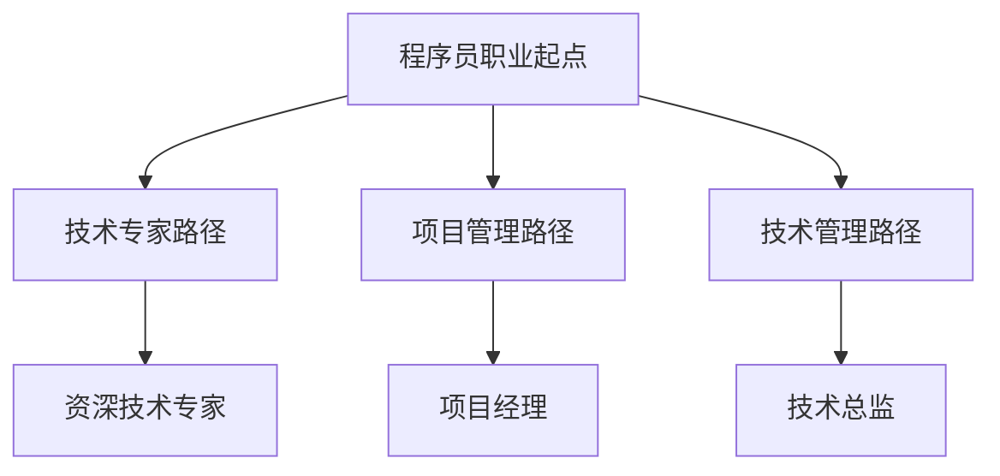

#### 1.2 确定职业目标

明确职业目标是程序员职业生涯的第一步。职业目标应具有明确性、可行性、挑战性和时限性。程序员可以根据个人兴趣、技能特长和职业发展愿景来确定目标。例如，技术专家可以设定成为某个技术领域的专家；项目经理可以设定成功管理一定规模的项目。

**核心概念与联系：**


**Mermaid流程图说明：**
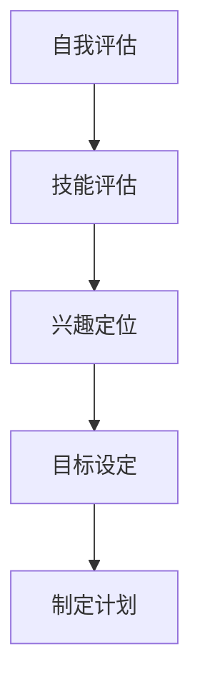

#### 1.3 制定职业发展计划

职业发展计划是实施职业目标的路线图。制定计划需要考虑以下几个方面：

- **技能提升：** 根据目标确定需要学习的技能，制定学习计划，包括自学、培训、实践等。
- **工作经验：** 确定需要的工作经验类型和数量，例如参与项目、实习、兼职等。
- **网络建设：** 建立专业网络，参加行业活动，与同行交流，提升人脉资源。
- **时间安排：** 为每个阶段设定具体的时间框架，确保计划的实施和进度控制。

**核心概念与联系：**


**Mermaid流程图说明：**
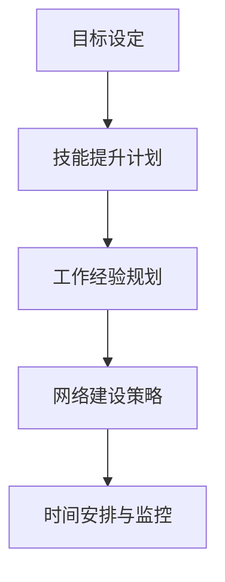

### 第2章：技能提升与持续学习

#### 2.1 技能评估与定位

技能评估是了解自己当前技能水平的重要步骤。程序员可以通过自我评估、同事评价、技能测试等方式进行评估。评估后，应明确自己的优势与短板，确定需要提升的技能。

**核心概念与联系：**


**Mermaid流程图说明：**
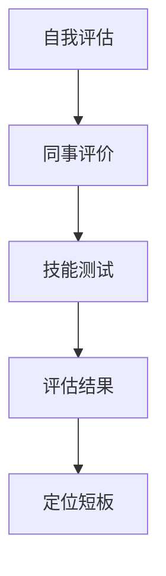

#### 2.2 学习新技能的方法

学习新技能是程序员职业发展的关键。以下是一些有效的学习方法：

- **自学：** 利用在线学习平台（如Coursera、Udemy等）进行系统学习。
- **培训：** 参加专业培训机构提供的课程，获得专业认证。
- **实践：** 通过实际项目和工作任务来应用所学知识。
- **交流：** 与同行交流，参加技术社区和论坛，获取实践经验和最新资讯。

**核心概念与联系：**


**Mermaid流程图说明：**
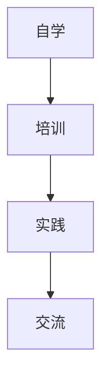

#### 2.3 持续学习的策略

持续学习是程序员职业竞争力的基石。以下是一些持续学习的策略：

- **定期评估：** 定期进行技能评估，了解自身发展状况。
- **时间管理：** 合理安排学习时间，确保学习计划的实施。
- **项目驱动：** 通过实际项目来应用所学知识，不断提升实践能力。
- **求知欲：** 保持对新技术的求知欲，关注行业动态，不断学习。

**核心概念与联系：**


**Mermaid流程图说明：**
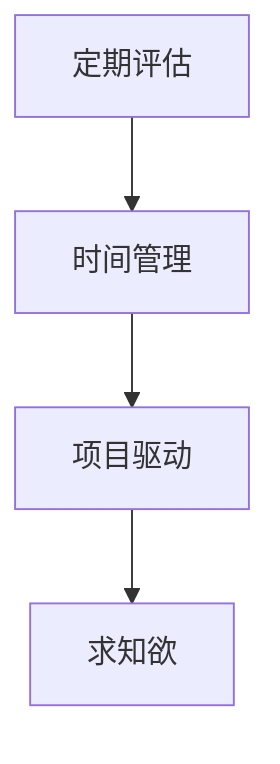

### 第3章：沟通与协作能力

#### 3.1 沟通技巧

沟通技巧是程序员在职场中不可或缺的能力。有效的沟通能够减少误解，提高工作效率。以下是一些沟通技巧：

- **清晰表达：** 用简洁明了的语言表达自己的观点，避免使用专业术语过多。
- **倾听：** 仔细倾听他人的意见，理解对方的需求和意图。
- **反馈：** 给予及时的反馈，帮助团队成员改进工作。
- **非语言沟通：** 通过肢体语言、表情和语调等非语言方式，增强沟通效果。

**核心概念与联系：**


**Mermaid流程图说明：**
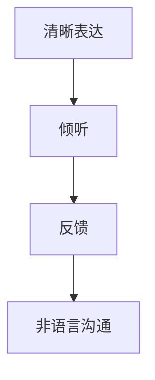

#### 3.2 团队合作

团队合作是程序员工作中常见的形式。以下是一些有效的团队合作技巧：

- **分工协作：** 根据团队成员的特长进行合理分工，提高工作效率。
- **沟通协调：** 定期召开团队会议，确保团队成员之间的沟通畅通。
- **互相支持：** 在团队中互相支持，共同解决问题。
- **目标一致：** 确保团队目标清晰，全体成员共同朝着目标努力。

**核心概念与联系：**


**Mermaid流程图说明：**
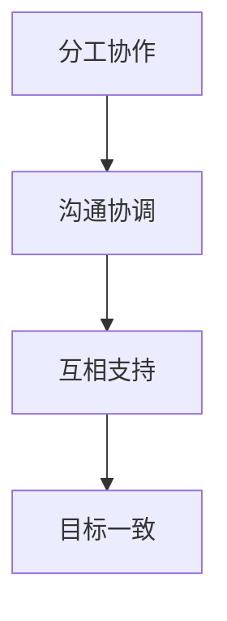

#### 3.3 领导力培养

领导力是项目经理和技术管理者必须具备的能力。以下是一些领导力培养的方法：

- **自我管理：** 培养自我管理能力，提高自律性和工作效率。
- **决策能力：** 通过学习和实践，提高决策能力，能够在压力下做出明智的选择。
- **激励团队：** 学会激励团队成员，激发他们的工作热情和创造力。
- **持续学习：** 不断学习新知识、新技能，提升自身的领导能力。

**核心概念与联系：**


**Mermaid流程图说明：**
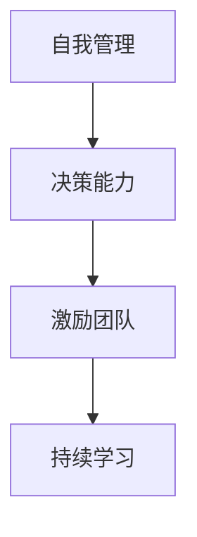

### 总结

第一部分主要探讨了程序员职业发展的路径与策略、技能提升与持续学习、以及沟通与协作能力。职业发展的路径策略、技能评估与定位、持续学习的策略是构建程序员职业竞争力的基础。沟通技巧、团队合作和领导力培养则是提升职业竞争力的重要环节。在接下来的部分，我们将进一步讨论如何提升职业竞争力，包括项目管理、编程风格和未来技术趋势。

### 作者信息

作者：AI天才研究院/AI Genius Institute & 禅与计算机程序设计艺术 /Zen And The Art of Computer Programming

## 第二部分：职业竞争力提升

### 第4章：项目管理与领导力

#### 4.1 项目管理基础

项目管理是程序员职业发展中的一个重要方向。作为项目经理，不仅需要具备扎实的编程技能，还需要掌握项目管理的核心知识。

**项目管理核心知识：**

1. **项目生命周期：** 项目生命周期包括项目启动、项目规划、项目执行、项目监控和项目收尾五个阶段。
2. **项目计划：** 项目计划是项目管理的重要组成部分，包括项目范围、时间进度、成本预算和质量要求等。
3. **资源管理：** 资源管理涉及人力资源、物资资源和财务资源的管理，确保项目资源的合理分配和利用。
4. **风险管理：** 风险管理是识别、评估和应对项目风险的过程，以减少项目的不确定性。
5. **沟通管理：** 沟通管理是确保项目信息畅通、及时传达的过程，包括项目报告、会议沟通和文档管理等。

**核心概念与联系：**


**Mermaid流程图说明：**
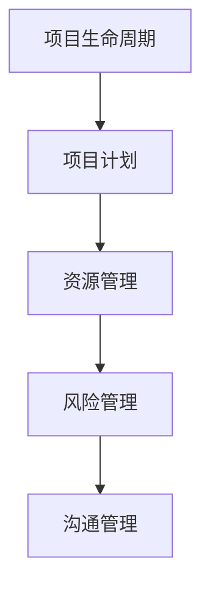

#### 4.2 领导力在项目管理中的应用

领导力在项目管理中起着至关重要的作用。项目经理需要通过有效的领导力来激励团队、解决问题和推动项目进展。

**领导力在项目管理中的应用：**

1. **目标设定：** 项目经理需要明确项目目标，并将其分解为可执行的任务，确保团队成员明确任务目标。
2. **团队建设：** 项目经理需要建立高效的团队，通过合理的分工和协作，提高团队的工作效率和士气。
3. **激励与反馈：** 项目经理需要了解团队成员的需求，通过激励措施和及时反馈，激发团队成员的积极性和创造力。
4. **冲突解决：** 项目经理需要具备良好的沟通能力和冲突解决能力，以解决团队内部的矛盾和问题。

**核心概念与联系：**


**Mermaid流程图说明：**
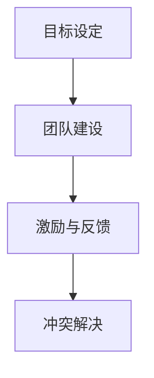

#### 4.3 如何成为一名优秀的项目经理

要成为一名优秀的项目经理，需要不断学习和实践，以下是一些建议：

1. **专业知识：** 掌握项目管理的基本理论和实践方法，了解项目管理工具和技术。
2. **沟通能力：** 提高沟通能力，确保项目信息的畅通和及时传达。
3. **领导力：** 培养领导力，包括目标设定、团队建设、激励与反馈和冲突解决能力。
4. **实践经验：** 积累项目管理经验，通过实际项目来提升自己的项目管理能力。
5. **持续学习：** 关注行业动态，不断学习新知识、新技能，适应项目管理的发展需求。

**核心概念与联系：**


**Mermaid流程图说明：**
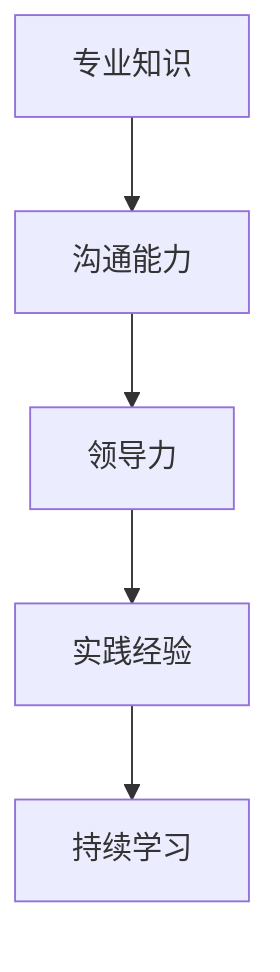

### 第5章：编程风格与代码质量

#### 5.1 编程风格的重要性

编程风格是程序员编写代码时遵循的一系列规范和习惯。良好的编程风格不仅能够提高代码的可读性和可维护性，还能够减少错误和提高开发效率。

**编程风格的重要性：**

1. **可读性：** 良好的编程风格使代码易于理解和阅读，方便其他开发者进行维护和修改。
2. **可维护性：** 一致的编程风格有助于维护代码库，减少代码冗余和错误。
3. **开发效率：** 良好的编程风格可以提高开发者的工作效率，减少代码编写和调试时间。
4. **团队协作：** 一致的编程风格有助于团队协作，减少沟通成本和冲突。

**核心概念与联系：**


**Mermaid流程图说明：**
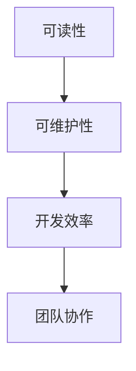

#### 5.2 代码质量评估方法

代码质量评估是保证代码质量的重要环节。以下是一些常用的代码质量评估方法：

1. **代码审查：** 通过同行评审，检查代码的语法错误、逻辑错误和潜在问题。
2. **单元测试：** 编写单元测试，验证代码的功能正确性和性能。
3. **静态代码分析：** 使用静态代码分析工具，检查代码的语法、语义和风格问题。
4. **动态测试：** 在运行时检查代码的行为和性能，发现潜在的bug和错误。

**核心概念与联系：**


**Mermaid流程图说明：**
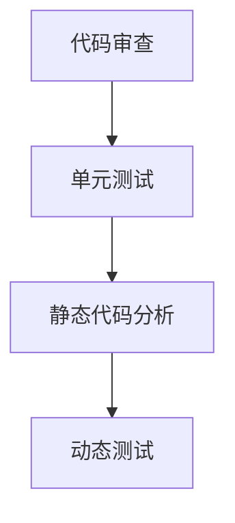

#### 5.3 提高代码质量的实践

要提高代码质量，需要从以下几个方面进行实践：

1. **编码规范：** 制定并遵循编码规范，确保代码的一致性和可读性。
2. **代码重构：** 定期对代码进行重构，优化代码结构和性能。
3. **测试驱动开发：** 使用测试驱动开发（TDD）方法，先编写测试，再编写代码，确保代码的质量和功能正确性。
4. **代码复用：** 适度复用代码，减少冗余和重复工作，提高开发效率。

**核心概念与联系：**


**Mermaid流程图说明：**
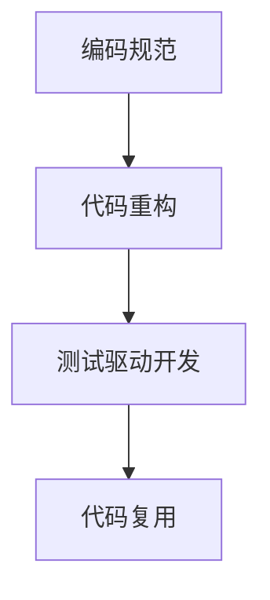

### 第6章：技术趋势与未来发展方向

#### 6.1 当前技术趋势分析

随着科技的不断发展，编程语言、框架和技术工具也在不断更新和迭代。以下是一些当前热门的技术趋势：

1. **人工智能与机器学习：** 人工智能和机器学习技术正在各领域广泛应用，如自动驾驶、智能家居、医疗诊断等。
2. **区块链技术：** 区块链技术以其去中心化和不可篡改的特性，在金融、供应链管理等领域具有广泛的应用前景。
3. **云计算与大数据：** 云计算和大数据技术为企业提供了强大的数据处理和分析能力，助力数字化转型。
4. **前端技术：** 前端技术不断演进，如React、Vue、Angular等框架，为开发者提供了更高效的开发体验。
5. **物联网（IoT）：** 物联网技术连接了各种设备和传感器，为智能城市、智能工厂等提供了新的应用场景。

**核心概念与联系：**


**Mermaid流程图说明：**
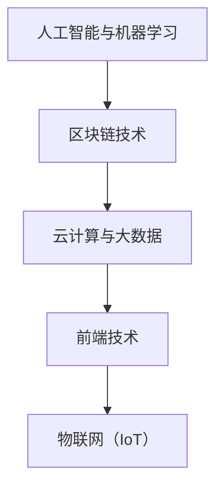

#### 6.2 未来技术发展预测

未来技术发展将更加智能化、互联化和多样化。以下是一些未来技术发展的预测：

1. **量子计算：** 量子计算将有望解决当前计算机难以处理的问题，如大规模数据处理和复杂算法优化。
2. **5G与6G网络：** 5G和6G网络将提供更高的速度和更低的延迟，推动物联网、自动驾驶等技术的进一步发展。
3. **边缘计算：** 边缘计算将数据处理的任务从云端转移到网络边缘，提高数据处理的速度和效率。
4. **生物计算：** 生物计算利用生物分子特性进行计算，有望在药物研发、基因组分析等领域取得突破。
5. **虚拟现实与增强现实：** 虚拟现实和增强现实技术将应用于教育、娱乐、医疗等领域，提供更丰富的交互体验。

**核心概念与联系：**


**Mermaid流程图说明：**
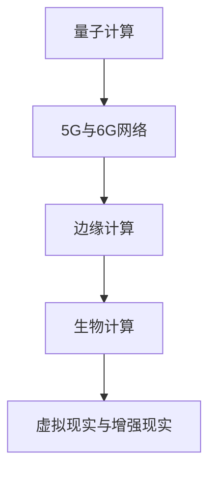

#### 6.3 程序员如何适应技术变化

技术变化对程序员提出了新的挑战，同时也带来了新的机遇。以下是一些程序员适应技术变化的策略：

1. **持续学习：** 保持对新技术的关注和学习，跟上技术发展的步伐。
2. **多技能培养：** 除了编程技能，还应培养其他相关技能，如数据分析和项目管理等。
3. **实践经验：** 通过实际项目和应用，将所学知识应用到实际工作中，提高实践能力。
4. **适应变化：** 具备快速适应新技术和环境的能力，积极应对变化和挑战。
5. **网络交流：** 加入技术社区和论坛，与其他开发者交流经验，获取最新的行业动态和技术趋势。

**核心概念与联系：**


**Mermaid流程图说明：**
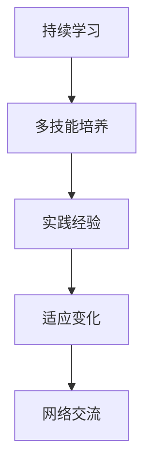

### 总结

第二部分主要讨论了项目管理和领导力、编程风格与代码质量、以及技术趋势和未来发展方向。项目管理与领导力是程序员职业发展的重要方向，良好的项目管理能力和领导力能够提升团队效率和项目成功率。编程风格和代码质量是保证代码质量和维护性的关键，而技术趋势和未来发展方向则为程序员提供了广阔的职业机遇。在接下来的部分，我们将进一步探讨如何建立个人品牌和提升网络影响力。

### 作者信息

作者：AI天才研究院/AI Genius Institute & 禅与计算机程序设计艺术 /Zen And The Art of Computer Programming

## 第三部分：影响力与个人品牌

### 第7章：建立个人品牌

#### 7.1 个人品牌的重要性

个人品牌是程序员在职场中的重要资产，它不仅能够提升个人的职业竞争力，还能为职业生涯带来更多的机遇。以下是一些个人品牌的重要性：

**核心概念与联系：**


1. **职业竞争力：** 建立个人品牌能够提高程序员的职业竞争力，使其在就业市场上更具吸引力。
2. **机会拓展：** 个人品牌能够为程序员带来更多的职业机会，如高薪职位、项目合作、咨询业务等。
3. **行业影响力：** 个人品牌能够提升程序员在行业内的地位和影响力，使其成为行业专家和意见领袖。
4. **个人成长：** 建立个人品牌需要不断学习和提升自身技能，这有助于个人成长和职业发展。

**Mermaid流程图说明：**
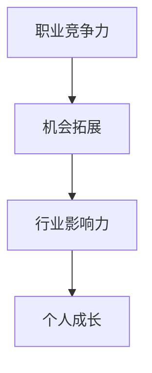

#### 7.2 个人品牌建设策略

要建立个人品牌，需要采取一系列策略和行动。以下是一些建议：

1. **专业技能提升：** 持续学习和提升专业技能，成为某一领域的专家。
2. **知识分享：** 通过博客、技术文章、演讲等方式，分享自己的经验和见解，提升个人知名度。
3. **社交媒体运营：** 在社交媒体上建立个人账号，定期发布有价值的内容，与读者互动。
4. **参与社区活动：** 加入技术社区和论坛，积极参与讨论，建立专业网络。
5. **品牌形象设计：** 设计统一的个人品牌形象，包括头像、签名、个人简介等。

**核心概念与联系：**


**Mermaid流程图说明：**
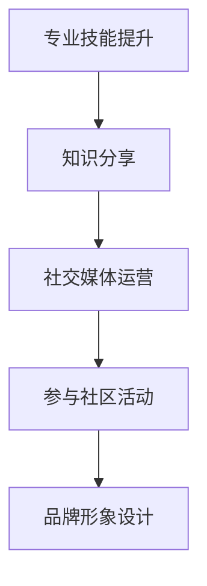

#### 7.3 个人品牌维护与提升

建立个人品牌后，需要持续维护和提升，以确保品牌形象的稳固和发展。以下是一些建议：

1. **内容更新：** 定期更新社交媒体和个人网站的内容，保持活跃度。
2. **参与活动：** 参加行业会议、技术沙龙等活动，与同行交流，扩大人脉。
3. **持续学习：** 持续学习新技术和知识，保持专业竞争力。
4. **品牌监测：** 定期监测个人品牌在网络上的声誉和影响力，及时应对负面信息。
5. **用户互动：** 与粉丝和读者保持互动，了解他们的需求和反馈，提升用户体验。

**核心概念与联系：**


**Mermaid流程图说明：**
```mermaid
graph TD
    A[内容更新] --> B[参与活动]
    B --> C[持续学习]
    C --> D[品牌监测]
    D --> E[用户互动]
```

### 第8章：社交媒体与网络影响力

#### 8.1 社交媒体在职业发展中的作用

社交媒体在程序员的职业发展中扮演着重要的角色。以下是一些社交媒体在职业发展中的作用：

1. **信息传播：** 社交媒体为程序员提供了快速传播技术信息和知识的新渠道。
2. **知识获取：** 通过社交媒体，程序员可以获取最新的技术动态、行业趋势和最佳实践。
3. **职业机会：** 社交媒体上的互动和分享能够为程序员带来更多的职业机会，如招聘信息、项目合作等。
4. **个人品牌：** 社交媒体是建立和维护个人品牌的重要平台，有助于提升个人知名度和影响力。

**核心概念与联系：**


**Mermaid流程图说明：**
```mermaid
graph TD
    A[信息传播] --> B[知识获取]
    B --> C[职业机会]
    C --> D[个人品牌]
```

#### 8.2 建立个人社交媒体平台

要建立个人社交媒体平台，可以遵循以下步骤：

1. **选择平台：** 根据目标受众和内容类型，选择合适的社交媒体平台，如微博、微信公众号、LinkedIn等。
2. **制定内容策略：** 根据平台特点，制定内容发布策略，包括内容类型、发布频率和互动方式等。
3. **内容创作：** 创作高质量的内容，如技术文章、案例分析、视频教程等，分享自己的知识和经验。
4. **互动与反馈：** 与读者和粉丝互动，收集反馈，优化内容策略和平台运营。

**核心概念与联系：**


**Mermaid流程图说明：**
```mermaid
graph TD
    A[选择平台] --> B[制定内容策略]
    B --> C[内容创作]
    C --> D[互动与反馈]
```

#### 8.3 提升网络影响力

要提升网络影响力，可以采取以下策略：

1. **内容质量：** 提高内容质量，确保内容有价值、有深度，能够吸引读者的关注。
2. **互动频率：** 定期发布内容，保持活跃度，增加与读者的互动。
3. **网络合作：** 与其他意见领袖、行业专家建立联系，进行合作和互动，扩大影响力。
4. **社交媒体广告：** 利用社交媒体广告，提高内容曝光率，吸引更多读者和粉丝。
5. **个人故事：** 分享自己的职业故事、成长经历，增加个人亲和力和吸引力。

**核心概念与联系：**


**Mermaid流程图说明：**
```mermaid
graph TD
    A[内容质量] --> B[互动频率]
    B --> C[网络合作]
    C --> D[社交媒体广告]
    D --> E[个人故事]
```

### 第9章：公开演讲与会议组织

#### 9.1 公开演讲技巧

公开演讲是提升个人影响力的重要方式之一。以下是一些公开演讲技巧：

1. **内容准备：** 准备演讲稿，明确演讲主题和结构，确保内容逻辑清晰、有说服力。
2. **肢体语言：** 利用肢体语言，如眼神交流、面部表情、姿态等，增强演讲效果。
3. **声音控制：** 控制声音的音量、节奏和语调，使演讲更加生动有趣。
4. **互动环节：** 设计互动环节，如提问、讨论等，增加与听众的互动。
5. **排练：** 在正式演讲前进行多次排练，熟悉演讲内容和流程。

**核心概念与联系：**


**Mermaid流程图说明：**
```mermaid
graph TD
    A[内容准备] --> B[肢体语言]
    B --> C[声音控制]
    C --> D[互动环节]
    D --> E[排练]
```

#### 9.2 会议组织与策划

会议组织是展示个人能力和影响力的另一个重要方面。以下是一些会议组织与策划的技巧：

1. **明确目标：** 确定会议的目标和主题，确保会议内容聚焦、有价值。
2. **嘉宾邀请：** 根据会议主题和目标，邀请相关领域的专家和嘉宾，增加会议的专业性和吸引力。
3. **议程安排：** 制定详细的会议议程，包括演讲主题、演讲嘉宾、讨论环节等，确保会议的顺利进行。
4. **场地选择：** 选择合适的场地，考虑场地的大小、设施和交通便利性。
5. **会议宣传：** 通过社交媒体、电子邮件等渠道宣传会议，吸引参会者，增加会议的知名度。

**核心概念与联系：**


**Mermaid流程图说明：**
```mermaid
graph TD
    A[明确目标] --> B[嘉宾邀请]
    B --> C[议程安排]
    C --> D[场地选择]
    D --> E[会议宣传]
```

#### 9.3 提升演讲和会议影响力

要提升演讲和会议的影响力，可以采取以下策略：

1. **内容质量：** 提高演讲和会议的内容质量，确保演讲和会议有价值、有深度。
2. **互动与参与：** 鼓励听众参与互动，提问和讨论，提高会议的参与度和活跃度。
3. **社交媒体推广：** 利用社交媒体推广演讲和会议，扩大影响力，吸引更多听众。
4. **后续跟进：** 演讲和会议后，通过邮件、社交媒体等方式与听众保持联系，提供相关资源和信息。
5. **持续改进：** 根据听众反馈和自身经验，不断改进演讲和会议的内容和形式，提高影响力。

**核心概念与联系：**


**Mermaid流程图说明：**
```mermaid
graph TD
    A[内容质量] --> B[互动与参与]
    B --> C[社交媒体推广]
    C --> D[后续跟进]
    D --> E[持续改进]
```

### 总结

第三部分主要讨论了个人品牌的重要性、建设策略和维护方法，以及社交媒体和网络影响力的提升策略。个人品牌是程序员职业发展的重要资产，社交媒体和网络影响力则是展示个人能力和价值的重要平台。在接下来的部分，我们将通过成功案例分析和职业规划，为程序员提供具体的实践建议和成长路径。

### 作者信息

作者：AI天才研究院/AI Genius Institute & 禅与计算机程序设计艺术 /Zen And The Art of Computer Programming

## 第四部分：职业成长与成功案例

### 第10章：成功程序员的职业历程

#### 10.1 成功程序员的共同特点

成功程序员的职业历程中，有一些共同的特点值得学习和借鉴：

1. **持续学习：** 成功程序员始终保持对新技术的学习和探索，不断提升自己的技能水平。
2. **专业专注：** 他们专注于某一技术领域，成为该领域的专家，并在行业中建立起自己的声誉。
3. **实践能力：** 成功程序员不仅具备扎实的理论基础，还具备强大的实践能力，能够将理论知识应用到实际项目中。
4. **沟通协作：** 他们擅长与团队成员沟通协作，能够有效地解决问题和推动项目进展。
5. **自我驱动：** 成功程序员具有强烈的自我驱动能力，能够自我激励，克服困难，持续进步。

**核心概念与联系：**


**Mermaid流程图说明：**
```mermaid
graph TD
    A[持续学习] --> B[专业专注]
    B --> C[实践能力]
    C --> D[沟通协作]
    D --> E[自我驱动]
```

#### 10.2 案例分析

以下是一个成功程序员的职业历程案例：

**案例：** 张三，一名专注于大数据分析的程序员。

**职业历程：**

1. **早期经历：** 张三大学主修计算机科学，毕业后进入一家互联网公司担任数据分析工程师。在工作中，他不断学习和实践，深入理解大数据处理技术和应用场景。

2. **技能提升：** 张三通过自学和参加培训，掌握了多种大数据分析工具和编程语言，如Hadoop、Spark、Python等。他还参加了多个实际项目，积累了丰富的实践经验。

3. **专业专注：** 张三专注于大数据领域，不断深入研究，成为公司内的大数据分析专家。他参与了多个重要项目，为公司的业务提供了有力支持。

4. **职业发展：** 在公司内，张三逐步晋升为数据科学经理，负责领导团队进行大数据分析工作。他还参与了行业技术交流，分享自己的经验和见解，成为行业内的重要意见领袖。

**成功因素分析：**

- **持续学习：** 张三始终保持对新技术的学习和探索，不断提升自己的技能水平。
- **专业专注：** 他专注于大数据领域，深入研究和实践，成为该领域的专家。
- **实践能力：** 张三具备强大的实践能力，能够将理论知识应用到实际项目中。
- **沟通协作：** 他擅长与团队成员沟通协作，能够有效地解决问题和推动项目进展。
- **自我驱动：** 张三具有强烈的自我驱动能力，能够自我激励，克服困难，持续进步。

**核心概念与联系：**


**Mermaid流程图说明：**
```mermaid
graph TD
    A[持续学习] --> B[专业专注]
    B --> C[实践能力]
    C --> D[沟通协作]
    D --> E[自我驱动]
```

#### 10.3 启示与借鉴

从成功程序员的职业历程中，我们可以得到以下启示和借鉴：

1. **持续学习：** 保持对新技术的学习和探索，不断提升自己的技能水平，是职业发展的关键。
2. **专业专注：** 专注于某一技术领域，深入研究和实践，成为该领域的专家，有助于在职业生涯中取得成功。
3. **实践能力：** 良好的实践能力是程序员的核心竞争力，能够将理论知识应用到实际项目中，解决实际问题。
4. **沟通协作：** 沟通协作能力是程序员在职场中不可或缺的能力，能够有效地解决问题和推动项目进展。
5. **自我驱动：** 具有自我驱动能力的程序员能够自我激励，克服困难，持续进步，实现职业成长。

**核心概念与联系：**


**Mermaid流程图说明：**
```mermaid
graph TD
    A[持续学习] --> B[专业专注]
    B --> C[实践能力]
    C --> D[沟通协作]
    D --> E[自我驱动]
```

### 第11章：职业规划与持续成长

#### 11.1 职业规划的重要性

职业规划是程序员实现职业成长和成功的关键。以下是一些职业规划的重要性：

1. **明确目标：** 职业规划帮助程序员明确自己的职业目标和发展方向，确保职业生涯的清晰和有目标性。
2. **资源分配：** 职业规划有助于程序员合理分配时间和资源，专注于提升技能和实现目标。
3. **风险评估：** 职业规划可以帮助程序员识别潜在的职业风险，提前做好准备和应对策略。
4. **持续成长：** 职业规划鼓励程序员不断学习和进步，实现持续成长和职业发展。

**核心概念与联系：**


**Mermaid流程图说明：**
```mermaid
graph TD
    A[明确目标] --> B[资源分配]
    B --> C[风险评估]
    C --> D[持续成长]
```

#### 11.2 如何进行职业规划

以下是一些进行职业规划的方法：

1. **自我评估：** 分析自己的兴趣、优势、劣势和价值观，了解自己的职业定位和目标。
2. **市场调研：** 调研行业动态和市场需求，了解未来职业发展方向和机会。
3. **技能提升：** 根据职业目标，制定技能提升计划，包括学习新技能、参加培训和实际项目。
4. **职业路径：** 确定职业路径，如技术专家、项目管理、技术管理等，并根据路径规划职业发展步骤。
5. **定期调整：** 根据职业发展的实际情况，定期调整职业规划，确保目标的实现。

**核心概念与联系：**


**Mermaid流程图说明：**
```mermaid
graph TD
    A[自我评估] --> B[市场调研]
    B --> C[技能提升]
    C --> D[职业路径]
    D --> E[定期调整]
```

#### 11.3 持续成长与自我提升

持续成长和自我提升是程序员职业发展的核心。以下是一些建议：

1. **学习新知识：** 保持对新知识的学习，关注行业动态，不断更新自己的知识体系。
2. **实践项目：** 参与实践项目，将理论知识应用到实际中，提高实践能力和解决问题的能力。
3. **反思总结：** 定期进行反思和总结，分析自己的优势和不足，制定改进措施。
4. **寻求反馈：** 向同事、领导和专家寻求反馈，了解自己的工作表现和改进方向。
5. **自我激励：** 保持积极的心态，自我激励，克服困难和挑战，实现持续成长。

**核心概念与联系：**


**Mermaid流程图说明：**
```mermaid
graph TD
    A[学习新知识] --> B[实践项目]
    B --> C[反思总结]
    C --> D[寻求反馈]
    D --> E[自我激励]
```

### 总结

第四部分通过成功程序员的职业历程案例分析，探讨了成功程序员的共同特点、职业规划的重要性以及如何进行职业规划。职业规划是实现职业成长和成功的关键，持续学习和自我提升则是实现职业目标的重要保障。在接下来的附录部分，我们将提供一些资源与工具推荐，帮助程序员在职业发展中更好地提升自身能力。

### 作者信息

作者：AI天才研究院/AI Genius Institute & 禅与计算机程序设计艺术 /Zen And The Art of Computer Programming

## 附录

### 附录A：资源与工具推荐

#### A.1 在线学习平台推荐

1. **Coursera：** 提供多样化的在线课程，涵盖计算机科学、数据科学、人工智能等多个领域。
2. **Udemy：** 提供大量的编程和技术课程，适合不同层次的程序员学习。
3. **edX：** 由多所知名大学提供在线课程，包括哈佛大学、麻省理工学院等，课程质量有保障。
4. **Pluralsight：** 专注于技术技能培训，提供丰富的编程和技术视频教程。

#### A.2 专业社区与论坛

1. **Stack Overflow：** 全球最大的开发者社区，适合解决编程问题和技术交流。
2. **GitHub：** 提供代码托管和协作平台，程序员可以在这里分享代码、学习项目。
3. **Reddit：** 有多个技术相关的子版块，如r/programming、r/webdev等，适合交流和学习。
4. **LinkedIn：** 社交媒体平台，适合建立专业网络和获取行业动态。

#### A.3 技术书籍与文献推荐

1. **《算法导论》(Introduction to Algorithms)：** 适合深入理解算法和数据结构。
2. **《设计模式：可复用面向对象软件的基础》(Design Patterns: Elements of Reusable Object-Oriented Software)：** 介绍面向对象设计模式，提升代码质量。
3. **《代码大全》(The Art of Computer Programming)：** 著名计算机科学家Donald Knuth的经典著作，深入讲解编程艺术。
4. **《软件工程：实践者的研究方法》(Software Engineering: A Practitioner’s Approach)：** 介绍软件工程的理论和实践方法。

### 附录B：常见面试题与解答

#### B.1 数据结构与算法

1. **什么是堆（Heap）？**
   **解答：** 堆是一种数据结构，通常用于实现优先队列。它是一种近似完全二叉树的结构，满足堆的性质：父节点的值大于或等于（对于最大堆）或小于或等于（对于最小堆）其所有子节点的值。

2. **什么是图（Graph）？**
   **解答：** 图是一种由节点（或称为顶点）和边组成的数据结构，用于表示实体之间的关系。图可以是有向的或无向的，可以有或没有权重。

3. **什么是深度优先搜索（DFS）？**
   **解答：** 深度优先搜索是一种用于遍历或搜索树的算法。它从根节点开始，沿着路径一直向下搜索，直到到达叶子节点或遇到已访问过的节点。

#### B.2 编程语言特性

1. **什么是面向对象编程（OOP）？**
   **解答：** 面向对象编程是一种编程范式，强调将数据和处理数据的方法封装在一起，形成对象。它支持封装、继承和多态等特性。

2. **什么是函数式编程（FP）？**
   **解答：** 函数式编程是一种编程范式，它将计算视为一系列函数的执行，避免了状态和变量的修改。它强调不可变数据、高阶函数和递归。

3. **什么是动态类型语言和静态类型语言？**
   **解答：** 动态类型语言在运行时确定变量的类型，而静态类型语言在编译时确定变量的类型。动态类型语言如Python、JavaScript，静态类型语言如Java、C++。

#### B.3 软件工程相关

1. **什么是敏捷开发（Agile Development）？**
   **解答：** 敏捷开发是一种软件开发方法，强调快速迭代、用户反馈和灵活性。它包括一系列实践，如Scrum、看板等，以适应不断变化的需求。

2. **什么是测试驱动开发（TDD）？**
   **解答：** 测试驱动开发是一种软件开发方法，它要求先编写测试，然后编写代码以通过测试。这种方法有助于提高代码质量和设计质量。

3. **什么是代码审查（Code Review）？**
   **解答：** 代码审查是一种团队合作方法，用于检查和评估代码的质量和风格。它通常包括同行评审和自动化工具的使用。

### 附录C：代码实战案例

#### C.1 实际项目案例

1. **项目描述：** 使用Python实现一个简单的Web爬虫，爬取指定网站的数据并存储到文件中。

   **开发环境搭建：**
   - 安装Python环境
   - 安装requests库：`pip install requests`
   - 安装BeautifulSoup库：`pip install beautifulsoup4`

   **源代码实现：**
   ```python
   import requests
   from bs4 import BeautifulSoup

   def crawl(url):
       response = requests.get(url)
       if response.status_code == 200:
           soup = BeautifulSoup(response.text, 'html.parser')
           # 对网页内容进行解析和提取数据
           # 存储数据到文件
           return "成功爬取数据"
       else:
           return "爬取失败"

   if __name__ == "__main__":
       url = "https://example.com"
       result = crawl(url)
       print(result)
   ```

   **代码解读与分析：**
   - `requests.get(url)`：发送HTTP GET请求到指定URL。
   - `BeautifulSoup(response.text, 'html.parser')`：使用BeautifulSoup解析HTML内容。
   - 数据提取和存储部分，根据具体需求进行实现。
   - `if __name__ == "__main__":`：确保脚本可以独立运行。

#### C.2 模拟练习与代码解析

1. **项目描述：** 实现一个简单的银行账户管理系统，包括存款、取款、查询余额等功能。

   **开发环境搭建：**
   - 安装Python环境
   - 安装PyQt5库：`pip install PyQt5`

   **源代码实现：**
   ```python
   import sys
   from PyQt5.QtWidgets import QApplication, QWidget, QLabel, QLineEdit, QPushButton

   class BankAccountApp(QWidget):
       def __init__(self):
           super().__init__()
           self.initUI()

       def initUI(self):
           self.setGeometry(100, 100, 300, 200)
           self.setWindowTitle('银行账户管理系统')

           self.label_account = QLabel(self)
           self.label_account.setText("账号：")
           self.label_account.move(20, 20)

           self.lineEdit_account = QLineEdit(self)
           self.lineEdit_account.move(80, 20)

           self.label_balance = QLabel(self)
           self.label_balance.setText("余额：")
           self.label_balance.move(20, 60)

           self.lineEdit_balance = QLineEdit(self)
           self.lineEdit_balance.move(80, 60)

           self.button_deposit = QPushButton(self)
           self.button_deposit.setText("存款")
           self.button_deposit.move(20, 100)

           self.button_withdraw = QPushButton(self)
           self.button_withdraw.setText("取款")
           self.button_withdraw.move(120, 100)

           self.button_query = QPushButton(self)
           self.button_query.setText("查询余额")
           self.button_query.move(220, 100)

           self.button_deposit.clicked.connect(self.deposit)
           self.button_withdraw.clicked.connect(self.withdraw)
           self.button_query.clicked.connect(self.query_balance)

       def deposit(self):
           account = self.lineEdit_account.text()
           balance = float(self.lineEdit_balance.text())
           deposit_amount = float(input("请输入存款金额："))
           new_balance = balance + deposit_amount
           self.lineEdit_balance.setText(str(new_balance))

       def withdraw(self):
           account = self.lineEdit_account.text()
           balance = float(self.lineEdit_balance.text())
           withdraw_amount = float(input("请输入取款金额："))
           if withdraw_amount <= balance:
               new_balance = balance - withdraw_amount
               self.lineEdit_balance.setText(str(new_balance))
           else:
               print("余额不足")

       def query_balance(self):
           account = self.lineEdit_account.text()
           balance = float(self.lineEdit_balance.text())
           print(f"账号：{account}，余额：{balance}")

   if __name__ == "__main__":
       app = QApplication(sys.argv)
       ex = BankAccountApp()
       ex.show()
       sys.exit(app.exec_())
   ```

   **代码解读与分析：**
   - `QApplication`：创建一个应用程序对象，用于管理用户界面和事件处理。
   - `QWidget`：创建一个窗口，用于显示用户界面。
   - `QLabel`、`QLineEdit`、`QPushButton`：创建各种控件，用于显示文本、接收用户输入和触发事件。
   - `initUI()`：初始化用户界面，设置控件布局和连接按钮事件。
   - `deposit()`、`withdraw()`、`query_balance()`：实现存款、取款和查询余额的功能。

### 总结

附录部分提供了在线学习平台、专业社区与论坛、技术书籍与文献的推荐，以及常见面试题的解答。此外，还提供了一个实际的代码实战案例和一个模拟练习与代码解析，帮助程序员在实际项目中提升技能和解决实际问题。

### 作者信息

作者：AI天才研究院/AI Genius Institute & 禅与计算机程序设计艺术 /Zen And The Art of Computer Programming

## 结论

在本文中，我们系统地探讨了程序员如何建立持久的职业竞争力与影响力。通过分析职业发展的路径与策略、技能提升与持续学习、沟通与协作能力、项目管理与领导力、编程风格与代码质量、技术趋势与未来发展方向，以及个人品牌建设、社交媒体与网络影响力、公开演讲与会议组织等方面的内容，我们为程序员提供了一系列实践建议和策略。

建立持久的职业竞争力与影响力，不仅需要程序员具备扎实的技术基础和不断学习新技能的能力，还需要具备良好的沟通协作、领导力和个人品牌建设能力。同时，积极适应技术变化，关注行业动态，不断提升自身综合素质，也是程序员实现职业生涯成功的关键。

最后，通过成功案例分析和职业规划，我们为程序员提供了具体的实践路径和成长策略。希望本文能够为您的职业生涯提供有益的启示和帮助，助力您在激烈的技术竞争中脱颖而出，实现持久的职业竞争力和影响力。

### 作者信息

作者：AI天才研究院/AI Genius Institute & 禅与计算机程序设计艺术 /Zen And The Art of Computer Programming

