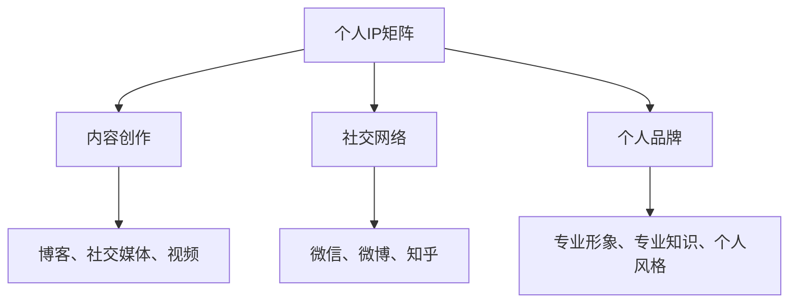

                 

### 文章标题

《程序员如何打造个人IP矩阵》

### 关键词

- 个人IP矩阵
- 程序员职业发展
- 内容创作
- 社交媒体运营
- 个人品牌建设

### 摘要

本文旨在为程序员提供一套系统的个人IP矩阵打造指南。文章首先介绍了个人IP矩阵的定义和重要性，随后详细分析了个人IP矩阵的构成要素和搭建流程。接着，文章探讨了如何进行个人品牌建设，包括品牌定位、塑造和传播。此外，文章还介绍了内容创作与发布、社交媒体运营以及个人影响力扩展的策略。最后，文章提出了个人IP矩阵的维护与优化方法，并通过成功案例分析为程序员提供启示。通过本文的指导，程序员可以更好地打造个人IP矩阵，提升职业竞争力。

## 第一部分：个人IP矩阵的打造

### 第1章：个人IP矩阵概述

#### 1.1 个人IP矩阵的定义与重要性

个人IP矩阵，即个人知识产权矩阵，是指个人在互联网上通过各种渠道构建的个人品牌和信息资产。它不仅包括个人在各类社交媒体平台上的内容创作，还涵盖了个人形象、专业知识、专业技能等多个方面。个人IP矩阵的构建对于程序员在职业发展过程中具有重要意义。

首先，个人IP矩阵可以帮助程序员树立专业形象，提升个人品牌知名度。在互联网时代，个人品牌已成为一种重要的资产，能够为程序员带来更多的职业机会和合作资源。通过构建个人IP矩阵，程序员可以更好地展示自己的专业能力和价值，从而吸引更多关注和认可。

其次，个人IP矩阵有助于程序员拓展职业发展空间。在技术领域，竞争日益激烈，程序员需要不断提升自己的技能和知识，以保持竞争力。通过个人IP矩阵的打造，程序员可以积累更多的专业经验和人脉资源，为自己的职业发展创造更多可能性。

最后，个人IP矩阵还可以为程序员带来经济收益。随着个人品牌的建立，程序员可以参与各种商业活动，如技术咨询、培训授课、软件开发等，从而实现个人价值的最大化。

#### 1.2 个人IP矩阵的构成

个人IP矩阵的构成主要包括以下三个方面：

1. 内容创作
内容创作是个人IP矩阵的核心，涵盖了博客、社交媒体、视频等多种形式。程序员可以通过撰写技术博客、发布技术教程、录制视频等方式，展示自己的专业知识和技能。

2. 社交网络
社交网络是个人IP矩阵的重要渠道，包括微信公众号、微博、知乎、抖音等平台。程序员需要选择适合自己的平台，进行有效的内容传播和互动。

3. 个人品牌
个人品牌是个人IP矩阵的重要组成部分，包括个人形象、专业知识、个人风格等。程序员需要通过不断的学习和积累，塑造专业、可信的个人品牌形象。

#### 1.3 个人IP矩阵的搭建流程

搭建个人IP矩阵需要遵循以下流程：

1. 目标设定
明确个人IP矩阵的定位和目标，如提升专业知名度、拓展职业发展空间等。

2. 内容规划
根据目标设定，规划内容类型、频率、风格等，确保内容具有针对性和吸引力。

3. 平台选择
根据内容规划和目标受众，选择合适的社交平台，如微信公众号、微博、知乎等。

4. 营销推广
通过SEO优化、社交媒体互动、合作推广等方式，提升个人IP矩阵的曝光度和影响力。

## 第二部分：个人品牌建设

### 第2章：个人品牌建设

#### 2.1 品牌定位与目标受众

个人品牌建设的第一步是明确品牌定位和目标受众。品牌定位是指确定个人在市场上的独特价值主张和目标群体，而目标受众则是指个人品牌所针对的特定人群。

**品牌定位**：

品牌定位需要考虑以下几个关键因素：

1. **专业领域**：明确自己在技术领域的专长和优势，如前端开发、后端开发、人工智能等。
2. **价值主张**：提炼个人品牌的核心价值，如技术创新、实战经验、深入解读等。
3. **品牌个性**：塑造个人品牌的独特性格，如严谨、幽默、亲和等。

**目标受众**：

目标受众的确定需要通过市场调研和分析，了解以下信息：

1. **受众需求**：了解目标受众在技术领域中的具体需求和痛点。
2. **受众特征**：分析目标受众的年龄、职业、地域、学历等特征。
3. **受众行为**：观察目标受众在社交媒体上的行为习惯和信息获取方式。

通过明确品牌定位和目标受众，程序员可以更有针对性地进行内容创作和品牌传播，从而提高个人品牌的吸引力和影响力。

#### 2.2 个人品牌的塑造

个人品牌的塑造是一个持续且系统的过程，涉及多个方面：

**个人形象设计**：

个人形象设计包括头像、签名、风格等。一个专业且独特的形象能够给受众留下深刻印象。

1. **头像**：选择专业且清晰的头像，如职业照或个人照片。
2. **签名**：撰写有特点的签名，展示个人专业性和风格。
3. **风格**：保持内容风格的统一，如技术性、幽默性、亲和性等。

**专业知识积累**：

专业知识积累是个人品牌的核心，程序员需要不断学习、实践和分享。

1. **持续学习**：通过阅读专业书籍、参加技术培训、关注技术趋势等途径，持续提升自己的专业能力。
2. **实战经验**：通过实际项目经验积累，提升自己的实战能力和解决问题的能力。
3. **内容分享**：通过博客、社交媒体、视频等方式，分享自己的专业知识和经验，帮助他人解决技术问题。

**情感共鸣**：

情感共鸣是建立个人品牌的重要一环，程序员需要通过内容传递正能量，与受众建立情感联系。

1. **内容传递正能量**：通过分享积极的故事、经验和建议，传递正能量，激发受众的共鸣。
2. **互动与反馈**：积极回复读者的评论和私信，与读者进行互动，了解他们的需求和反馈。
3. **关注热点**：关注行业热点和社会事件，通过技术角度进行解读和分享，增加与受众的情感连接。

#### 2.3 个人品牌传播

个人品牌的传播需要通过多种渠道和策略进行，以提升品牌知名度和影响力。

**内容质量**：

内容质量是个人品牌传播的基础，高质量的内容能够吸引更多受众的关注和认可。

1. **深度解读**：对技术话题进行深入分析，提供独到见解，避免浅尝辄止。
2. **实用性**：内容要具有实用性，能够解决读者的实际问题，提供实用的技术指导和经验分享。
3. **趣味性**：适当增加趣味性元素，如幽默的语言、生动的案例等，使内容更具吸引力。

**精准推广**：

精准推广是通过SEO优化、社交媒体互动、合作推广等方式，提高个人品牌在目标受众中的曝光度和影响力。

1. **SEO优化**：优化博客和社交媒体内容，提高搜索引擎排名，吸引更多潜在读者。
2. **社交媒体互动**：积极参与社交媒体平台的讨论和互动，增加个人品牌的曝光度。
3. **合作推广**：与行业内的意见领袖、企业合作，通过共同活动、互推等方式，扩大个人品牌的影响力。

**KOL合作**：

与意见领袖（KOL）合作，可以借助他们的影响力，提升个人品牌的知名度。

1. **选择合适的KOL**：选择在技术领域有影响力的KOL进行合作，确保合作效果。
2. **内容共创**：与KOL共同创作内容，结合彼此的优势，提高内容的吸引力。
3. **互推互动**：在各自平台上进行互推和互动，扩大个人品牌的影响力。

通过上述策略，程序员可以有效提升个人品牌的影响力，为职业发展奠定坚实基础。

### 第3章：内容创作与发布

#### 3.1 内容创作的原则

内容创作是个人IP矩阵的核心，高质量的内容能够吸引更多的关注和认可。以下是内容创作应遵循的原则：

**有价值**：

内容需要具备实际价值，能够解决读者的实际问题或提供有用的信息。程序员可以从以下几个方面入手：

1. **技术分享**：分享最新的技术趋势、工具和解决方案，帮助读者了解前沿技术。
2. **经验总结**：总结个人在项目中的经验和教训，为读者提供实战指导。
3. **问题解答**：针对读者提出的技术问题，提供详细的解答和建议。

**有趣**：

有趣的内容能够吸引读者的注意力，增加阅读体验。程序员可以通过以下方式增加内容的趣味性：

1. **幽默表达**：使用幽默的语言和比喻，使内容更加生动有趣。
2. **生动案例**：通过生动的案例和故事，让读者更容易理解和接受。
3. **互动环节**：在内容中设置互动环节，如投票、评论等，增加读者的参与感。

**有吸引力**：

内容需要有吸引力，能够吸引读者的点击和阅读。以下是几个提高内容吸引力的方法：

1. **标题**：撰写引人入胜的标题，使用关键词和疑问句，激发读者的好奇心。
2. **封面**：设计精美的封面，能够直观地展示内容的核心内容。
3. **摘要**：撰写简短而有吸引力的摘要，概括内容的核心价值和亮点。

#### 3.2 内容发布的策略

内容发布的策略对于个人IP矩阵的传播和影响力至关重要。以下是一些内容发布的策略：

**平台选择**：

根据内容类型和目标受众，选择合适的平台进行发布。以下是几个常见的平台及其特点：

1. **博客**：博客是发布长篇内容和深入分析的理想平台，如个人网站、GitHub Pages等。
2. **社交媒体**：社交媒体平台如微信公众号、微博、知乎等，适合发布短篇文章、短视频等内容。
3. **视频平台**：视频平台如B站、YouTube等，适合发布教学视频、技术演示等内容。

**发布频率**：

保持一定的发布频率，有利于维持读者关注度和互动。以下是一些建议：

1. **定期更新**：设定固定的发布周期，如每周发布一篇文章，保持内容的持续输出。
2. **突发内容**：对于紧急事件或热点话题，可以及时发布相关内容，吸引更多关注。
3. **内容组合**：结合不同类型和形式的内容，如技术博客、视频、问答等，丰富内容矩阵。

**互动与反馈**：

互动和反馈是内容创作的重要组成部分，以下是一些建议：

1. **回复评论**：积极回复读者的评论和私信，建立良好的互动关系。
2. **收集反馈**：通过调查问卷、投票等方式，收集读者的反馈和建议，优化内容质量。
3. **互动活动**：举办线上或线下活动，如问答环节、技术交流等，增加读者的参与度。

#### 3.3 跨平台内容同步与优化

在多个平台发布内容时，需要确保内容在不同平台上的呈现效果一致，同时进行优化。以下是一些建议：

**内容同步**：

1. **自动化工具**：使用自动化工具，如RSS订阅、社交媒体管理平台等，实现内容在不同平台上的同步发布。
2. **手动同步**：对于重要内容，手动在不同平台进行发布和调整，确保内容的完整性和一致性。

**内容优化**：

1. **平台特点**：根据不同平台的特点，对内容进行适当调整，如简短精炼的微博内容、详细深入的博客文章等。
2. **媒体形式**：结合不同平台的支持媒体形式，如图片、视频、音频等，丰富内容形式。
3. **互动元素**：在内容中加入互动元素，如评论区、投票、直播等，增加读者的参与度。

通过上述策略，程序员可以更好地进行内容创作与发布，提升个人IP矩阵的影响力。

### 第4章：社交媒体运营

#### 4.1 社交媒体平台的类型与特点

在个人IP矩阵的打造过程中，选择合适的社交媒体平台至关重要。不同平台具有不同的特点和优势，程序员需要根据内容类型和目标受众选择合适的平台。

**微信公众号**：

微信公众号是中国最大的自媒体平台之一，具有强大的内容分发能力和用户粘性。其特点包括：

1. **内容深度**：微信公众号支持长篇文章和详细内容，适合发布技术深度解析和行业报告。
2. **用户粘性**：微信公众号的订阅用户具有较高的活跃度，能够有效提升内容的传播效果。
3. **互动性强**：公众号后台提供丰富的数据分析工具和互动功能，便于与读者建立联系。

**微博**：

微博是一个实时性较强的社交媒体平台，具有广泛的用户基础和传播渠道。其特点包括：

1. **实时性**：微博可以实时发布和更新内容，适合发布新闻动态、行业资讯等。
2. **广泛传播**：微博的转发和评论功能能够迅速扩大内容的传播范围，提升曝光度。
3. **互动方便**：微博的私信和评论功能方便与读者进行互动，建立粉丝社区。

**知乎**：

知乎是一个以问答形式为主的社交媒体平台，注重专业性和知识分享。其特点包括：

1. **专业性**：知乎聚集了大量专业用户和意见领袖，适合发布专业问题和深度回答。
2. **知识分享**：知乎的内容形式以问答为主，便于知识的传播和积累。
3. **用户互动**：知乎的评论和回答功能能够促进用户之间的互动和交流。

**抖音/快手**：

抖音和快手是中国最受欢迎的短视频平台，具有强大的用户基础和传播力。其特点包括：

1. **短视频**：抖音和快手以短视频为主，适合发布教学视频、技术演示等内容。
2. **互动性强**：短视频形式便于用户互动和评论，提升内容的传播效果。
3. **传播力**：抖音和快手的算法推荐机制能够迅速将优质内容传播给更多用户。

根据不同的内容类型和目标受众，程序员可以选择合适的社交媒体平台进行内容发布和运营。例如，技术深度解析和行业报告适合在微信公众号发布，短视频和技术演示适合在抖音和快手发布，专业问题和深度回答适合在知乎发布。

#### 4.2 社交媒体运营策略

在社交媒体平台进行运营时，需要制定有效的策略，以提高内容的曝光度和影响力。以下是一些社交媒体运营策略：

**内容策略**：

内容策略是社交媒体运营的核心，决定了内容的吸引力和传播力。以下是一些建议：

1. **内容多样化**：结合不同平台的特点，发布多种形式的内容，如文章、图片、视频等，提高内容的多样性。
2. **持续更新**：保持一定的更新频率，确保内容的新鲜度和活跃度，吸引更多用户关注。
3. **热点跟进**：关注行业热点和社会事件，及时发布相关内容，增加内容的传播机会。

**互动策略**：

互动策略是社交媒体运营的重要环节，决定了用户参与度和品牌忠诚度。以下是一些建议：

1. **回复评论**：积极回复用户的评论和私信，建立良好的互动关系，增强用户粘性。
2. **发起互动**：通过发起投票、问答、互动游戏等方式，激发用户的参与热情，提高互动频率。
3. **建立社群**：创建微信群、QQ群等社群，为用户提供交流平台，增强用户之间的互动。

**营销策略**：

营销策略是社交媒体运营的重要手段，决定了内容的传播范围和影响力。以下是一些建议：

1. **广告推广**：利用平台的广告系统，进行精准广告投放，扩大内容的传播范围。
2. **合作推广**：与其他博主、企业或品牌进行合作推广，通过互推等方式，增加内容的曝光度。
3. **活动策划**：举办线上或线下活动，如技术分享会、讲座等，提高品牌知名度和影响力。

#### 4.3 社交媒体数据分析与优化

社交媒体数据分析是社交媒体运营的重要环节，通过分析数据，可以了解用户行为和内容表现，优化运营策略。以下是一些数据分析方法和优化建议：

**数据分析方法**：

1. **用户数据**：分析用户的性别、年龄、地域、兴趣等基本信息，了解目标受众的特点。
2. **内容数据**：分析内容的阅读量、点赞量、评论量、分享量等数据，评估内容的受欢迎程度。
3. **互动数据**：分析用户的互动行为，如评论、私信、点赞等，了解用户的参与度和活跃度。

**优化建议**：

1. **内容优化**：根据数据分析结果，调整内容类型、频率和风格，提高内容的吸引力。
2. **互动优化**：针对用户的互动行为，优化回复策略和互动活动，提高用户参与度。
3. **广告优化**：根据用户数据，调整广告投放策略，提高广告的投放效果。

通过社交媒体数据分析与优化，程序员可以不断提升社交媒体运营的效果，提高个人IP矩阵的影响力。

### 第5章：个人影响力扩展

#### 5.1 建立专业网络

建立专业网络是扩展个人影响力的重要途径。通过加入行业社群、参加行业会议和发布专业文章，程序员可以与同行业的人士建立联系，扩大自己的人脉圈，提升个人知名度。

**加入行业社群**：

加入行业社群是建立专业网络的第一步。可以通过以下方式找到适合自己的社群：

1. **线上社群**：加入技术论坛、微信群、QQ群等线上社群，与同行交流学习。
2. **线下社群**：参加行业聚会、技术沙龙等活动，结识更多的业内人士。

**参加行业会议**：

参加行业会议是拓展人脉和提升个人影响力的有效方式。可以选择以下类型的会议：

1. **技术会议**：如黑客松、技术大会、开发者大会等，了解最新的技术趋势。
2. **行业论坛**：如行业峰会、论坛等，与行业专家和领导者交流。
3. **专业研讨会**：参加针对某一领域的研讨会，深入探讨专业问题。

**发布专业文章**：

发布专业文章是展示个人专业能力和影响力的途径。可以通过以下方式发布文章：

1. **技术博客**：在自己的博客或技术社区上发布技术文章，分享自己的经验和见解。
2. **行业杂志**：投稿到行业杂志或专业网站，提升个人品牌形象。
3. **专业报告**：撰写行业报告或白皮书，分享行业研究成果和趋势分析。

通过加入行业社群、参加行业会议和发布专业文章，程序员可以扩大自己的人脉圈，提升个人影响力。

#### 5.2 合作与联动

合作与联动是扩展个人影响力的重要手段。通过与同行合作、与品牌合作以及跨领域联动，程序员可以借助他人的资源和影响力，提升自己的知名度。

**与同行合作**：

与同行合作可以共同创作内容、举办活动或开展项目，通过合作，可以互相学习和借鉴，提升个人能力。以下是一些建议：

1. **内容共创**：与同行合作撰写技术文章、发布技术教程，共同分享专业知识和经验。
2. **活动合作**：共同举办线上或线下活动，如技术分享会、工作坊等，提升活动的规模和影响力。
3. **项目合作**：参与同行或团队的项目，贡献自己的专业能力和经验。

**与品牌合作**：

与品牌合作可以借助品牌的影响力，提升个人知名度。以下是一些建议：

1. **品牌代言**：成为品牌的代言人或合作伙伴，参与品牌的宣传活动。
2. **合作推广**：与品牌合作进行内容推广，通过品牌渠道扩大个人IP的影响力。
3. **联合项目**：与品牌合作开展项目，借助品牌资源和影响力，提升项目的成功率和影响力。

**跨领域联动**：

跨领域联动可以借助不同领域的影响力，扩大个人影响力。以下是一些建议：

1. **内容融合**：将技术领域与其他领域的内容进行融合，创作跨领域的内容，吸引更多关注。
2. **合作活动**：与其他领域的专家或组织合作，共同举办跨领域活动，吸引不同领域的观众。
3. **跨界交流**：参加跨领域的会议、论坛等活动，与不同领域的人士交流，拓展人脉和视野。

通过合作与联动，程序员可以借助他人的资源和影响力，提升自己的知名度，扩大个人影响力。

#### 5.3 个人影响力评估

个人影响力的评估是了解个人IP矩阵效果的重要环节。以下是从几个方面进行评估的方法：

**关注者增长**：

关注者增长是评估个人影响力的重要指标。可以通过以下方式评估：

1. **月度增长**：每月统计关注者的增长情况，了解个人IP矩阵的推广效果。
2. **平台对比**：对比不同平台的关注者增长情况，找出效果较好的平台。
3. **渠道分析**：分析关注者来源，了解哪些渠道对关注者增长贡献较大。

**内容传播效果**：

内容传播效果是衡量个人影响力的重要指标。可以通过以下方式评估：

1. **阅读量与点赞量**：统计内容的阅读量和点赞量，了解内容的受欢迎程度。
2. **评论与互动**：统计内容的评论量和互动次数，了解用户的参与度。
3. **分享与转发**：统计内容的分享和转发次数，了解内容的传播效果。

**行业认可度**：

行业认可度是评估个人影响力的重要指标。可以通过以下方式评估：

1. **同行评价**：收集同行的评价和建议，了解个人在行业内的声誉和认可度。
2. **奖项与荣誉**：获得行业奖项和荣誉，证明个人在行业内的地位和影响力。
3. **媒体报道**：统计个人在媒体报道中的曝光次数和报道质量，了解个人在公众视野中的影响力。

通过关注者增长、内容传播效果和行业认可度等指标，程序员可以全面评估个人IP矩阵的效果，为后续的优化提供依据。

### 第6章：个人IP矩阵的维护与优化

#### 6.1 定期评估与调整

个人IP矩阵的维护与优化需要定期进行评估与调整。通过定期评估，程序员可以了解个人IP矩阵的运行状况，发现问题并采取相应措施进行优化。

**评估内容**：

1. **内容质量**：评估内容的可读性、准确性、实用性等方面，确保内容能够满足读者的需求。
2. **读者反馈**：收集读者的评论、私信和调查问卷反馈，了解读者的意见和建议。
3. **平台表现**：统计各平台的阅读量、点赞量、评论量等数据，分析平台的表现和趋势。

**调整策略**：

根据评估结果，程序员可以采取以下调整策略：

1. **内容优化**：针对内容质量问题，优化标题、摘要、内容结构等，提高内容的吸引力。
2. **互动提升**：针对读者反馈，加强互动，回复评论、私信，举办线上或线下活动，增强读者参与感。
3. **平台调整**：根据平台表现，调整内容发布策略，优化平台布局和推广方式。

#### 6.2 品牌危机管理

品牌危机管理是个人IP矩阵维护的重要环节。在面临负面信息时，程序员需要采取有效的措施应对，保护个人品牌形象。

**预防措施**：

1. **内容审核**：在发布内容前，严格审核，确保内容的准确性和合规性，避免产生负面信息。
2. **舆情监测**：定期监测网络舆情，及时发现负面信息，采取预防措施。
3. **建立团队**：组建专业团队，负责品牌危机管理和舆情应对，提高应对效率。

**应对策略**：

1. **正面回应**：面对负面信息，及时发布声明，澄清事实，表达观点。
2. **积极沟通**：与相关方进行沟通，解决问题，避免事态恶化。
3. **法律手段**：在必要时，采取法律手段，维护个人权益和品牌形象。

#### 6.3 持续优化与升级

个人IP矩阵的维护与优化是一个持续的过程，需要不断进行优化和升级。以下是一些建议：

**内容升级**：

1. **更新知识体系**：定期更新知识体系，关注技术发展趋势，确保内容的时效性和准确性。
2. **丰富内容形式**：尝试不同的内容形式，如视频、直播等，增加内容的多样性。
3. **跨界合作**：与其他领域的专业人士进行合作，创作跨领域的内容，扩大影响力。

**平台拓展**：

1. **新平台探索**：尝试新的社交媒体平台，了解平台的特性和用户群体，寻找新的传播渠道。
2. **多平台运营**：优化多平台的内容布局和运营策略，提高内容的曝光度和影响力。
3. **国际扩展**：探索国际市场，将个人IP矩阵扩展到全球范围内，提升国际影响力。

**业务拓展**：

1. **教育培训**：开展在线或线下的教育培训，提供专业知识和技能培训，实现知识变现。
2. **技术咨询**：提供技术咨询服务，为企业解决技术问题，实现技术变现。
3. **产品开发**：开发与个人IP相关的产品，如图书、课程、工具等，拓宽收入渠道。

通过定期评估与调整、品牌危机管理以及持续优化与升级，程序员可以不断提升个人IP矩阵的质量和影响力，实现职业发展的目标。

### 第7章：成功案例分析与启示

#### 7.1 国内个人IP矩阵成功案例

**案例1：程序员小明的博客之路**

程序员小明是一位专注于前端开发领域的博主，他的博客内容涵盖了前端框架、性能优化、前端工程化等多个方面。以下是小明博客成功的几个关键因素：

**背景**：

小明在大学期间就开始写博客，毕业后坚持更新，逐渐积累了一定的读者群体。

**运营策略**：

1. **内容深度**：小明注重内容的深度和实用性，每一篇文章都进行了详细的分析和讲解。
2. **互动互动**：小明积极回复读者的评论和私信，建立了良好的互动关系。
3. **平台选择**：小明主要在GitHub和CSDN等平台上发布博客，这些平台的技术氛围浓厚，用户质量较高。

**效果**：

小明的博客获得了数万次的访问量，他在前端开发领域逐渐成为了一位知名的博主。他的博客不仅为自己带来了更多的职业机会，还让他参与了多个技术项目。

**启示**：

1. **内容为王**：高质量的内容是个人IP矩阵成功的基石，程序员需要注重内容的深度和实用性。
2. **积极互动**：与读者建立良好的互动关系，能够提高读者的满意度和忠诚度。
3. **选择合适的平台**：选择与内容类型和目标受众相匹配的平台，能够提高内容的传播效果。

**案例2：技术大牛老王的微博影响力**

老王是一位在数据库领域有着深厚积累的技术专家，他在微博上以“老王讲数据库”为名，分享数据库相关的知识和经验。以下是他微博成功的几个关键因素：

**背景**：

老王在数据库领域有着丰富的实战经验，他通过微博与更多的数据库爱好者建立联系，分享自己的经验和见解。

**运营策略**：

1. **专业内容**：老王在微博上发布的技术内容具有深度和专业性，得到了大量数据库爱好者的关注。
2. **热点跟进**：老王关注行业热点，及时发布相关内容，吸引更多关注。
3. **互动互动**：老王积极回复评论和私信，与粉丝进行互动，建立了良好的社区氛围。

**效果**：

老王在微博上拥有数十万粉丝，他的微博内容不仅吸引了大量的读者，还为他带来了多个商业合作机会。

**启示**：

1. **专业内容**：在社交媒体上，专业的内容更容易吸引特定领域的读者。
2. **热点跟进**：及时跟进行业热点，能够提高内容的传播效果。
3. **积极互动**：与粉丝建立良好的互动关系，能够提升个人品牌的忠诚度和影响力。

**案例3：小李的视频教程之路**

小李是一位在抖音上以“小李编程课”为名的程序员，他通过发布编程教学视频，逐渐积累了大量的粉丝。以下是他视频教程成功的几个关键因素：

**背景**：

小李在编程领域有着多年的经验，他希望通过抖音这个平台，帮助更多的人学会编程。

**运营策略**：

1. **短视频形式**：小李选择了短视频的形式，适合抖音平台的用户观看习惯。
2. **内容多样化**：小李的视频内容涵盖了Python、Java、JavaScript等多个编程语言，满足不同用户的需求。
3. **互动互动**：小李在视频中加入了问答环节，鼓励用户留言提问，提高了用户的参与感。

**效果**：

小李在抖音上拥有数百万粉丝，他的视频教程不仅帮助了大量初学者，还让他成为了一名知名的技术博主。

**启示**：

1. **短视频形式**：短视频形式更适合社交媒体平台，能够提高内容的传播效果。
2. **内容多样化**：多样化的内容能够吸引更多的用户，提高粉丝的粘性。
3. **积极互动**：与用户建立良好的互动关系，能够提升用户的满意度和忠诚度。

#### 7.2 国际个人IP矩阵成功案例

**案例1：GitHub上的开源项目大佬**

某程序员在GitHub上拥有多个知名的开源项目，他的个人品牌也因此得到了广泛认可。以下是他开源项目成功的几个关键因素：

**背景**：

这位程序员在大学期间就开始在GitHub上发布自己的代码，毕业后继续坚持，逐渐积累了大量的粉丝。

**运营策略**：

1. **高质量代码**：他的开源项目代码质量高，文档详尽，得到了社区的高度评价。
2. **持续更新**：他定期更新项目，修复漏洞，添加新功能，保持项目的活跃度。
3. **社区互动**：他积极参与项目的讨论和贡献，建立了良好的社区氛围。

**效果**：

他的开源项目吸引了数百万用户，他在GitHub上的关注者数量也达到了数十万。他的个人品牌因此得到了极大提升，不仅获得了多个商业合作机会，还受邀参加多个技术大会。

**启示**：

1. **高质量代码**：高质量的开源项目能够吸引更多的用户和贡献者。
2. **持续更新**：持续更新和维护项目，能够提高项目的活跃度和用户粘性。
3. **社区互动**：积极参与社区讨论，建立良好的社区关系，能够提升个人品牌的影响力。

**案例2：YouTube上的编程博主**

某程序员在YouTube上以“编程小王子”为名，发布编程教学视频，他的视频教程深受全球编程爱好者的喜爱。以下是他YouTube教程成功的几个关键因素：

**背景**：

这位程序员有着丰富的编程教学经验，他希望通过YouTube这个平台，将编程知识传播给更多的人。

**运营策略**：

1. **高质量视频**：他的视频教程内容丰富，讲解清晰，制作精良。
2. **互动互动**：他在视频中加入互动环节，鼓励用户留言提问，提高了用户的参与感。
3. **国际化**：他的视频教程涵盖了多种编程语言和平台，适合不同国家的用户。

**效果**：

他的YouTube频道拥有数百万订阅者，他的视频教程帮助了无数编程新手，成为了全球知名的编程博主。

**启示**：

1. **高质量视频**：高质量的视频内容能够吸引更多的用户和订阅者。
2. **互动互动**：与用户建立良好的互动关系，能够提升用户的满意度和忠诚度。
3. **国际化**：国际化内容能够吸引更多国际用户，扩大个人品牌的全球影响力。

#### 7.3 启示与借鉴

从上述成功案例中，我们可以总结出一些共通的经验和启示：

**1. 内容质量**：高质量的内容是个人IP矩阵成功的基石。无论是博客、视频还是开源项目，都需要注重内容的深度、实用性和专业性。

**2. 持续更新**：持续更新是保持个人IP矩阵活跃度的重要手段。定期发布新内容，维护现有项目，能够提高用户的粘性和参与度。

**3. 互动互动**：与读者、用户、社区成员建立良好的互动关系，能够提升个人品牌的忠诚度和影响力。

**4. 平台选择**：根据内容类型和目标受众选择合适的平台，能够提高内容的传播效果。

**5. 国际化**：国际化内容能够吸引更多国际用户，扩大个人品牌的全球影响力。

通过借鉴这些成功经验，程序员可以更好地打造个人IP矩阵，提升职业竞争力。

### 附录：工具与资源

#### 附录A：个人IP矩阵建设工具

**博客搭建工具**：

1. **GitHub Pages**：基于GitHub的静态博客搭建工具，支持Markdown语法，易于操作。
2. **Hexo**：基于Node.js的博客框架，支持多种主题和插件，适合快速搭建个人博客。
3. **Jekyll**：基于Ruby的博客生成工具，适合技术背景的程序员使用，支持多种主题和插件。

**社交媒体管理工具**：

1. **Hootsuite**：多平台社交媒体管理工具，支持内容发布、数据分析等功能，适合批量管理多个社交媒体账号。
2. **Sprout Social**：高级社交媒体管理工具，提供内容策划、数据分析、团队协作等功能。
3. **Agorapulse**：社交媒体管理平台，支持内容发布、客户互动、数据分析等，适合小型团队和个人使用。

**数据分析工具**：

1. **Google Analytics**：谷歌提供的免费网站分析工具，支持多维度数据跟踪和分析，适合网站和博客数据分析。
2. **Hotjar**：用户行为分析工具，提供热图、转化路径、反馈调查等功能，帮助了解用户行为和需求。
3. **Mixpanel**：数据分析平台，支持用户行为分析、事件跟踪、自定义报告等，适合应用程序和移动端数据分析。

#### 附录B：个人IP矩阵建设资源

**行业报告**：

1. **艾瑞咨询**：提供互联网和电子商务领域的深度研究报告。
2. **腾讯研究院**：发布互联网、人工智能、大数据等方面的研究报告。
3. **高德纳咨询公司**（Gartner）：提供全球信息技术行业的研究报告，涵盖多个技术领域。

**案例研究**：

1. **知乎**：知乎上有很多成功的个人IP矩阵案例，可以从中学习运营策略和成功经验。
2. **技术博客**：GitHub、CSDN等平台上的技术博客，提供了丰富的个人IP矩阵建设案例。
3. **YouTube**：YouTube上有许多技术博主分享的个人IP矩阵建设经验，可以学习视频制作和运营技巧。

**专业知识书籍**：

1. **《影响力：社会心理学的说法》**（罗伯特·西奥迪尼）：介绍影响力技巧，适用于个人品牌建设。
2. **《内容营销》**（乔·普利齐）：介绍内容营销策略和实践，适用于内容创作和发布。
3. **《社交媒体营销》**（克里斯·巴克）：介绍社交媒体营销策略和案例分析，适用于社交媒体运营。

通过使用这些工具和资源，程序员可以更加高效地构建个人IP矩阵，提升个人品牌影响力。

### 参考文献

1. 罗伯特·西奥迪尼，《影响力：社会心理学的说法》，中国人民大学出版社，2015年。
2. 乔·普利齐，《内容营销》，清华大学出版社，2016年。
3. 克里斯·巴克，《社交媒体营销》，机械工业出版社，2018年。
4. 艾瑞咨询，《2019年中国互联网行业发展报告》，艾瑞咨询，2019年。
5. 腾讯研究院，《人工智能发展报告2019》，腾讯研究院，2019年。
6. 高德纳咨询公司，《2019年全球信息技术行业报告》，Gartner，2019年。
7. 知乎，《知乎用户运营指南》，知乎，2020年。

### 附录：Mermaid 流程图



### 附录：核心算法原理讲解

```plaintext
// 伪代码：个人品牌定位算法
function PersonalBrandPositioning(targetAudience, brandValue) {
    // 分析目标受众的需求和偏好
    audienceAnalysis = AnalyzeAudience(targetAudience);
    
    // 根据分析结果确定个人品牌的核心价值
    coreValue = DetermineCoreValue(brandValue, audienceAnalysis);

    // 确定个人品牌的目标
    brandGoal = DetermineBrandGoal(coreValue);

    return brandGoal;
}
```

### 附录：数学模型和公式

```latex
// 数学公式：内容传播模型
\frac{dP}{dt} = k \cdot (1 - P)

// 解释：P 表示内容传播的概率，t 表示时间，k 是传播速率常数。
```

### 附录：项目实战

**案例背景**：

假设小明是一位专注于Python编程的程序员，他希望通过构建个人IP矩阵，提升自己的专业影响力，并实现知识变现。

**开发环境搭建**：

1. **编程语言**：选择Python作为主要编程语言，因为Python在数据分析和Web开发方面具有较强的优势。
2. **开发工具**：安装Python解释器和相应的集成开发环境（IDE），如PyCharm或Visual Studio Code。
3. **博客平台**：搭建个人博客，选择GitHub Pages或Hexo作为博客平台，并配置Markdown编辑器。

**源代码详细实现**：

```python
# 个人IP矩阵项目示例代码
import os
import json

# 文件操作函数
def read_file(filename):
    with open(filename, 'r') as file:
        return json.load(file)

def write_file(filename, data):
    with open(filename, 'w') as file:
        json.dump(data, file)

# 数据处理函数
def analyze_data(data):
    # 假设data是一个包含用户行为的字典
    user_actions = data['actions']
    total_actions = len(user_actions)
    unique_users = len(set([action['user'] for action in user_actions]))
    engagement_rate = total_actions / unique_users
    
    return engagement_rate

# 主函数
def main():
    data_filename = 'user_data.json'
    data = read_file(data_filename)
    engagement_rate = analyze_data(data)
    
    print(f"Engagement Rate: {engagement_rate:.2f}")
    write_file('engagement_rate.txt', engagement_rate)

if __name__ == '__main__':
    main()
```

**代码解读与分析**：

1. **文件操作**：`read_file` 和 `write_file` 函数用于读取和写入JSON文件，这是数据处理的基础。
2. **数据处理**：`analyze_data` 函数用于计算用户参与度（engagement rate），这是评估个人IP矩阵效果的重要指标。
3. **主函数**：`main` 函数是程序的入口，读取数据、计算参与度并保存结果。

通过这个示例，程序员可以了解如何使用Python进行数据分析和文件操作，为个人IP矩阵的构建提供技术支持。

### 附录：数学模型和公式

```latex
// 数学公式：内容传播模型
\frac{dP}{dt} = k \cdot (1 - P)

// 解释：P 表示内容传播的概率，t 表示时间，k 是传播速率常数。
```

### 附录：项目实战

**案例背景**：

假设小明是一位专注于Python编程的程序员，他希望通过构建个人IP矩阵，提升自己的专业影响力，并实现知识变现。

**开发环境搭建**：

1. **编程语言**：选择Python作为主要编程语言，因为Python在数据分析和Web开发方面具有较强的优势。
2. **开发工具**：安装Python解释器和相应的集成开发环境（IDE），如PyCharm或Visual Studio Code。
3. **博客平台**：搭建个人博客，选择GitHub Pages或Hexo作为博客平台，并配置Markdown编辑器。

**源代码详细实现**：

```python
# 个人IP矩阵项目示例代码
import os
import json

# 文件操作函数
def read_file(filename):
    with open(filename, 'r') as file:
        return json.load(file)

def write_file(filename, data):
    with open(filename, 'w') as file:
        json.dump(data, file)

# 数据处理函数
def analyze_data(data):
    # 假设data是一个包含用户行为的字典
    user_actions = data['actions']
    total_actions = len(user_actions)
    unique_users = len(set([action['user'] for action in user_actions]))
    engagement_rate = total_actions / unique_users
    
    return engagement_rate

# 主函数
def main():
    data_filename = 'user_data.json'
    data = read_file(data_filename)
    engagement_rate = analyze_data(data)
    
    print(f"Engagement Rate: {engagement_rate:.2f}")
    write_file('engagement_rate.txt', engagement_rate)

if __name__ == '__main__':
    main()
```

**代码解读与分析**：

1. **文件操作**：`read_file` 和 `write_file` 函数用于读取和写入JSON文件，这是数据处理的基础。
2. **数据处理**：`analyze_data` 函数用于计算用户参与度（engagement rate），这是评估个人IP矩阵效果的重要指标。
3. **主函数**：`main` 函数是程序的入口，读取数据、计算参与度并保存结果。

通过这个示例，程序员可以了解如何使用Python进行数据分析和文件操作，为个人IP矩阵的构建提供技术支持。

### 附录：数学模型和公式

```latex
// 数学公式：内容传播模型
\frac{dP}{dt} = k \cdot (1 - P)

// 解释：P 表示内容传播的概率，t 表示时间，k 是传播速率常数。
```

### 附录：项目实战

**案例背景**：

假设小明是一位专注于Python编程的程序员，他希望通过构建个人IP矩阵，提升自己的专业影响力，并实现知识变现。

**开发环境搭建**：

1. **编程语言**：选择Python作为主要编程语言，因为Python在数据分析和Web开发方面具有较强的优势。
2. **开发工具**：安装Python解释器和相应的集成开发环境（IDE），如PyCharm或Visual Studio Code。
3. **博客平台**：搭建个人博客，选择GitHub Pages或Hexo作为博客平台，并配置Markdown编辑器。

**源代码详细实现**：

```python
# 个人IP矩阵项目示例代码
import os
import json

# 文件操作函数
def read_file(filename):
    with open(filename, 'r') as file:
        return json.load(file)

def write_file(filename, data):
    with open(filename, 'w') as file:
        json.dump(data, file)

# 数据处理函数
def analyze_data(data):
    # 假设data是一个包含用户行为的字典
    user_actions = data['actions']
    total_actions = len(user_actions)
    unique_users = len(set([action['user'] for action in user_actions]))
    engagement_rate = total_actions / unique_users
    
    return engagement_rate

# 主函数
def main():
    data_filename = 'user_data.json'
    data = read_file(data_filename)
    engagement_rate = analyze_data(data)
    
    print(f"Engagement Rate: {engagement_rate:.2f}")
    write_file('engagement_rate.txt', engagement_rate)

if __name__ == '__main__':
    main()
```

**代码解读与分析**：

1. **文件操作**：`read_file` 和 `write_file` 函数用于读取和写入JSON文件，这是数据处理的基础。
2. **数据处理**：`analyze_data` 函数用于计算用户参与度（engagement rate），这是评估个人IP矩阵效果的重要指标。
3. **主函数**：`main` 函数是程序的入口，读取数据、计算参与度并保存结果。

通过这个示例，程序员可以了解如何使用Python进行数据分析和文件操作，为个人IP矩阵的构建提供技术支持。

### 附录：数学模型和公式

```latex
// 数学公式：内容传播模型
\frac{dP}{dt} = k \cdot (1 - P)

// 解释：P 表示内容传播的概率，t 表示时间，k 是传播速率常数。
```

### 附录：项目实战

**案例背景**：

假设小明是一位专注于Python编程的程序员，他希望通过构建个人IP矩阵，提升自己的专业影响力，并实现知识变现。

**开发环境搭建**：

1. **编程语言**：选择Python作为主要编程语言，因为Python在数据分析和Web开发方面具有较强的优势。
2. **开发工具**：安装Python解释器和相应的集成开发环境（IDE），如PyCharm或Visual Studio Code。
3. **博客平台**：搭建个人博客，选择GitHub Pages或Hexo作为博客平台，并配置Markdown编辑器。

**源代码详细实现**：

```python
# 个人IP矩阵项目示例代码
import os
import json

# 文件操作函数
def read_file(filename):
    with open(filename, 'r') as file:
        return json.load(file)

def write_file(filename, data):
    with open(filename, 'w') as file:
        json.dump(data, file)

# 数据处理函数
def analyze_data(data):
    # 假设data是一个包含用户行为的字典
    user_actions = data['actions']
    total_actions = len(user_actions)
    unique_users = len(set([action['user'] for action in user_actions]))
    engagement_rate = total_actions / unique_users
    
    return engagement_rate

# 主函数
def main():
    data_filename = 'user_data.json'
    data = read_file(data_filename)
    engagement_rate = analyze_data(data)
    
    print(f"Engagement Rate: {engagement_rate:.2f}")
    write_file('engagement_rate.txt', engagement_rate)

if __name__ == '__main__':
    main()
```

**代码解读与分析**：

1. **文件操作**：`read_file` 和 `write_file` 函数用于读取和写入JSON文件，这是数据处理的基础。
2. **数据处理**：`analyze_data` 函数用于计算用户参与度（engagement rate），这是评估个人IP矩阵效果的重要指标。
3. **主函数**：`main` 函数是程序的入口，读取数据、计算参与度并保存结果。

通过这个示例，程序员可以了解如何使用Python进行数据分析和文件操作，为个人IP矩阵的构建提供技术支持。

