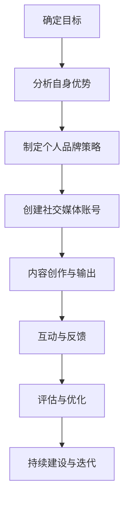

                 

## 文章标题

《程序员如何打造个人IP矩阵》

### 关键词

- 个人IP
- 程序员
- 品牌建设
- 社交媒体
- 内容创作
- 影响力拓展
- 知识管理

### 摘要

本文旨在为程序员提供一套系统化的方法，帮助他们在技术领域中打造个人IP矩阵。文章分为三个主要部分：个人IP矩阵基础、个人IP矩阵构建和个人IP矩阵优化与维护。首先，我们明确了个人IP的概念和重要性，探讨了个人品牌建设、社交媒体运营和知识管理的方法。接着，文章深入讨论了内容创作与输出、影响力拓展的策略。最后，文章提出了个人IP矩阵评估与优化的指标和方法，并分析了成功案例，展望了未来发展趋势。通过本文，程序员可以了解到如何通过构建个人IP矩阵来实现职业发展和个人品牌建设。

### 目录大纲

#### 第一部分：个人IP矩阵基础

**第1章：理解个人IP**

- **1.1 个人IP的定义**
- **1.2 个人IP的重要性**
- **1.3 个人IP与职业发展的关系**
- **1.4 个人IP的构成要素**

**第2章：个人品牌建设**

- **2.1 个人品牌的概念**
- **2.2 建立个人品牌的步骤**
- **2.3 个人品牌的塑造与维护**

**第3章：社交媒体与个人IP**

- **3.1 社交媒体概述**
- **3.2 社交媒体选择与策略**
- **3.3 社交媒体内容创作与传播**

#### 第二部分：个人IP矩阵构建

**第4章：知识管理与传播**

- **4.1 知识管理的重要性**
- **4.2 知识管理的方法与工具**
- **4.3 知识传播的渠道与策略**

**第5章：内容创作与输出**

- **5.1 内容创作的原则**
- **5.2 内容创作的工具与平台**
- **5.3 内容创作的案例分析**

**第6章：影响力拓展**

- **6.1 个人IP的影响力评估**
- **6.2 线上线下活动策划与执行**
- **6.3 合作与互推策略**

#### 第三部分：个人IP矩阵优化与维护

**第7章：个人IP矩阵的评估与优化**

- **7.1 个人IP矩阵的评估指标**
- **7.2 个人IP矩阵的优化方法**
- **7.3 个人IP矩阵的维护策略**

**第8章：案例分析**

- **8.1 成功的个人IP案例解析**
- **8.2 挑战与应对**
- **8.3 未来趋势展望**

#### 附录

**附录A：个人IP矩阵建设工具与资源**

- **A.1 常用社交媒体平台介绍**
- **A.2 知识管理与内容创作工具**
- **A.3 个人IP矩阵建设相关书籍推荐**

### 第1章：理解个人IP

#### 1.1 个人IP的定义

个人IP（Intellectual Property）是指个人在特定领域内的知识、技能、创意等无形资产的集合。它不仅仅包括专利、商标和版权等传统知识产权，还涵盖了个人品牌、社交媒体影响力、内容创作能力等多个方面。个人IP的构建过程，实际上就是将个人的专业技能、知识积累、个人品牌和社交媒体影响力等资源进行整合、管理和传播的过程。

个人IP的构建对于程序员来说尤为重要。程序员的工作本质上是对计算机技术的应用和创造，因此他们的知识、技能和经验构成了个人IP的核心部分。一个强大的个人IP可以帮助程序员在职场中脱颖而出，提升个人竞争力，实现职业发展的跃迁。

#### 1.2 个人IP的重要性

个人IP的重要性体现在以下几个方面：

1. **提升职业竞争力**：在技术领域，拥有个人IP的程序员更容易获得雇主和合作伙伴的认可。个人IP可以作为一个“标志”，证明个人在特定领域内的专业性和权威性。

2. **增加收入来源**：个人IP可以成为收入来源的一部分。通过内容创作、咨询服务、演讲、培训等多种方式，程序员可以将个人知识变现，获得额外的经济收益。

3. **拓宽职业发展路径**：个人IP可以帮助程序员在职业发展中拥有更多的选择。无论是选择创业、转型管理，还是继续深耕技术领域，个人IP都是一个强有力的支持。

4. **建立个人品牌**：个人IP是个人品牌的基石。通过不断输出高质量的内容、参与行业活动、建立社交媒体影响力，程序员可以逐步塑造个人品牌，提升个人知名度。

5. **提高影响力**：个人IP的影响力不仅局限于职场，还可以延伸到更广泛的社交和行业领域。一个有影响力的个人IP可以吸引更多的关注和合作机会，扩大个人影响力。

#### 1.3 个人IP与职业发展的关系

个人IP与职业发展之间存在着紧密的联系。一个成功的个人IP可以显著提升程序员的职业发展速度和高度。

1. **职业认可度提升**：拥有个人IP的程序员更容易得到行业内的认可和尊重。这种认可不仅来自雇主，也来自于同行和社区。

2. **职业机会增加**：个人IP可以成为求职时的优势，提高面试通过率。同时，个人IP还可以吸引更多的职业机会，包括高薪职位、咨询项目、合作机会等。

3. **职业转型容易**：当程序员拥有一个强大的个人IP时，他们更容易实现职业转型。无论是向管理岗位转型，还是向创业方向发展，个人IP都能提供重要的支持和保障。

4. **职业发展高度提升**：个人IP可以成为程序员职业发展的催化剂，帮助他们突破职业发展的瓶颈，达到更高的职业高度。

#### 1.4 个人IP的构成要素

个人IP的构成要素主要包括以下几个方面：

1. **专业技能**：这是个人IP的核心部分。程序员的编程技能、算法能力、技术深度和广度都是专业技能的体现。

2. **知识积累**：程序员的个人知识库，包括对技术、行业趋势、最佳实践的理解和掌握。这些知识积累是个人IP的重要支撑。

3. **个人品牌**：个人品牌是个人在公众心目中的形象和认知。一个良好的个人品牌可以增强个人在行业内的认可度和影响力。

4. **社交媒体影响力**：社交媒体平台上的粉丝数量、互动率、内容传播效果等都是衡量社交媒体影响力的指标。

5. **内容创作能力**：包括写作、演讲、视频制作等多方面的能力。高质量的内容创作是构建个人IP的重要手段。

6. **合作与互推**：与其他个人或机构建立合作关系，互相推广，可以扩大个人IP的影响力。

#### 1.5 个人IP构建的挑战与机遇

在构建个人IP的过程中，程序员会遇到一系列的挑战和机遇：

1. **挑战**：

   - **时间与精力投入**：构建个人IP需要大量的时间和精力，这对工作繁忙的程序员来说是一个不小的挑战。
   - **竞争压力**：技术领域竞争激烈，要脱颖而出需要具备出色的技能和独特的观点。
   - **版权与隐私问题**：在内容创作和分享过程中，需要妥善处理版权和隐私问题，避免法律纠纷。

2. **机遇**：

   - **数字化转型**：随着数字化转型的推进，程序员有更多的机会展示和推广个人技能和知识。
   - **线上平台崛起**：社交媒体和内容创作平台提供了丰富的展示和传播渠道，为个人IP的构建提供了便利。
   - **技术普及**：技术的普及使得更多的人有机会学习和参与到技术领域中，这为个人IP的构建提供了广泛的受众基础。

通过合理规划和管理个人IP，程序员可以在职业发展和个人品牌建设中抓住机遇，应对挑战，实现自身价值。

### 第2章：个人品牌建设

#### 2.1 个人品牌的概念

个人品牌是指个人在公众心目中的形象和认知，它是一个人在职业生涯中通过专业技能、知识积累、行为举止、价值观等综合因素形成的独特标识。一个强大的个人品牌能够提升个人在行业内的认可度和影响力，从而为职业发展带来诸多优势。

个人品牌不仅仅是一个名字或者头衔，它包含了以下几个关键要素：

- **专业性**：个人品牌需要体现个人的专业技能和行业知识，让公众认识到个人在特定领域的专业性和权威性。
- **独特性**：个人品牌应该具备独特性，区别于其他人，这可以通过个人的独特观点、风格或者领域内的独特贡献来实现。
- **一致性**：个人品牌的建设需要保持一致性，从行为举止到内容输出，都需要传达出统一的形象和价值观。
- **可信赖性**：一个可信的个人品牌能够赢得公众的信任，这种信任是通过长期的诚信行为和优质内容积累而来的。

#### 2.2 建立个人品牌的步骤

建立个人品牌是一个系统的过程，需要明确的目标、详细的计划和持续的努力。以下是一些建立个人品牌的步骤：

1. **确定个人品牌定位**

   - **评估自身优势**：首先，需要评估自己在专业技能、知识积累、兴趣爱好等方面的优势，找到能够为个人品牌提供支撑的点。
   - **市场调研**：了解目标受众的需求和期望，明确自己在市场中的定位。
   - **明确品牌定位**：基于自身优势和市场需求，确定个人品牌的定位，这将是后续品牌建设的基础。

2. **打造个人品牌形象**

   - **设计品牌标识**：包括个人头像、名片、网站等，这些标识需要简洁、专业且具有辨识度。
   - **制定品牌色彩**：品牌色彩是个人品牌形象的重要组成部分，应与品牌定位和风格相符合。
   - **建立品牌风格**：包括文字风格、视觉风格等，这需要在内容创作和传播中保持一致。

3. **传播个人品牌**

   - **内容输出**：通过博客、公众号、视频、讲座等多种形式输出高质量的内容，这是建立个人品牌的核心手段。
   - **社交媒体运营**：在社交媒体平台上活跃，与受众互动，扩大品牌影响力。
   - **行业活动参与**：参加行业内的研讨会、论坛、培训等活动，提升个人品牌知名度。

4. **维护和提升个人品牌**

   - **持续更新**：保持内容的更新和活跃度，与受众保持联系。
   - **品牌迭代**：根据市场反馈和自身发展，适时调整品牌定位和策略。
   - **诚信和专业**：始终以诚信和专业赢得公众的信任，这是维护个人品牌的基础。

#### 2.3 个人品牌的塑造与维护

个人品牌的塑造和维护是一个长期而持续的过程，以下是一些关键点：

1. **持续输出高质量内容**

   - **内容规划**：制定内容创作计划，确保内容的连续性和系统性。
   - **内容创新**：不断尝试新的内容形式和表达方式，保持内容的吸引力。
   - **内容优化**：根据受众反馈不断优化内容，提升内容质量。

2. **建立良好的社交媒体运营策略**

   - **定位明确**：确定社交媒体平台的定位，明确目标受众。
   - **内容策略**：制定符合品牌定位和风格的内容策略，包括内容类型、发布频率、互动方式等。
   - **互动管理**：积极与粉丝互动，回复评论和私信，建立良好的粉丝关系。

3. **参与行业活动和合作**

   - **行业活动**：参加行业内的活动，如研讨会、讲座、论坛等，提升个人品牌知名度。
   - **合作与互推**：与其他个人或机构建立合作关系，通过互推扩大个人品牌影响力。

4. **诚信和专业**

   - **诚信**：始终保持诚信，不发布虚假信息，不误导受众。
   - **专业**：不断提升专业技能和知识水平，以专业赢得公众的信任。

通过以上步骤和策略，程序员可以逐步塑造和维护个人品牌，提升个人在行业内的竞争力和影响力。

### 第3章：社交媒体与个人IP

#### 3.1 社交媒体概述

社交媒体是指用户可以在其中创建和分享内容、互动和交流的网络平台。随着互联网的普及和发展，社交媒体已经成为人们日常生活和工作中不可或缺的一部分。对于程序员而言，社交媒体不仅是个人IP构建的重要渠道，也是提升个人知名度和影响力的有效工具。

社交媒体具有以下几个特点：

1. **用户参与度高**：社交媒体平台鼓励用户生成和分享内容，用户之间可以实时互动和交流，这种高度的参与性使得信息传播更加迅速和广泛。
2. **信息传播速度快**：在社交媒体平台上，一条信息可以通过点赞、评论、分享等多种方式迅速传播，极大地提升了信息传播的效率。
3. **多样化的内容形式**：社交媒体支持文本、图片、视频等多种内容形式，程序员可以根据自身特长和受众需求，选择合适的内容形式进行创作和传播。
4. **广泛的受众基础**：社交媒体拥有庞大的用户群体，程序员可以通过这些平台接触到更多的潜在受众，扩大个人品牌的影响力。

#### 3.2 社交媒体选择与策略

选择合适的社交媒体平台并制定有效的运营策略是构建个人IP的关键步骤。以下是一些常见的社交媒体平台及其选择策略：

1. **微博**

   - **特点**：微博是一个以文本和图片为主的内容分享平台，信息传播速度较快，互动性强。
   - **策略**：发布技术心得、行业动态、问答互动等，保持内容的更新频率，积极参与话题讨论。

2. **微信公众号**

   - **特点**：微信公众号是一个集内容创作、用户互动、品牌推广于一体的平台，支持图文、视频等多种内容形式。
   - **策略**：制定内容计划，定期发布高质量的技术文章和视频，通过图文结合的方式提升内容吸引力。

3. **知乎**

   - **特点**：知乎是一个以问答形式为主的知识分享平台，用户可以就特定问题进行深度讨论。
   - **策略**：积极参与回答问题，提供专业的技术解答，建立个人专业形象，吸引更多关注者。

4. **抖音/Bilibili**

   - **特点**：抖音和Bilibili是视频分享平台，适合通过短视频和视频教程的形式传播技术内容。
   - **策略**：制作有趣、易懂的技术教程和分享，利用平台算法提高内容曝光率，吸引粉丝关注。

5. **LinkedIn**

   - **特点**：LinkedIn是一个专业社交网络平台，适合程序员建立职业人脉和分享专业内容。
   - **策略**：完善个人资料，分享职业经验和技术见解，积极参与行业讨论，拓展职业机会。

#### 3.3 社交媒体内容创作与传播

内容创作和传播是社交媒体运营的核心环节，以下是一些关键策略：

1. **内容创作原则**

   - **专业**：内容需要体现个人的专业性和权威性，避免模糊不清或错误信息。
   - **有趣**：有趣的内容更容易吸引受众，可以通过故事化、趣味性表达提升内容吸引力。
   - **有价值**：内容应具备实用性和指导性，帮助受众解决问题或提供新的见解。
   - **持续**：保持内容输出的连续性和稳定性，建立固定的更新频率和内容风格。

2. **内容创作工具**

   - **文本编辑器**：如Markdown编辑器，用于撰写和排版文章。
   - **图像处理软件**：如Canva，用于设计和制作图文内容。
   - **视频制作工具**：如Adobe Premiere Pro、Final Cut Pro，用于制作和剪辑视频。

3. **内容传播策略**

   - **利用热点**：结合行业热点和社会热点，创作相关内容，提高内容曝光率。
   - **互动互动**：与粉丝互动，鼓励点赞、评论和分享，增加内容的互动性和传播力。
   - **广告投放**：通过社交媒体广告，精准投放，扩大内容传播范围。
   - **跨平台推广**：将内容同步发布到多个社交媒体平台，扩大受众基础。

4. **案例分析**

   - **案例1：技术博主XX**

     - **内容形式**：主要以长篇文章为主，涉及技术深入分析、实战经验和心得分享。
     - **传播效果**：文章通过高质量的内容和独特的视角，吸引了大量技术从业者的关注，文章阅读量达到数百万。
     - **成功原因**：内容专业、深入且具有实际应用价值，与粉丝保持良好的互动，持续输出高质量内容。

   - **案例2：程序员YY**

     - **内容形式**：通过短视频和直播形式，分享编程技巧和项目实战。
     - **传播效果**：视频在Bilibili和抖音上获得大量点赞和分享，粉丝数量迅速增长。
     - **成功原因**：内容形式新颖，易于传播，与粉丝互动频繁，及时回应问题，提升用户粘性。

通过合理选择社交媒体平台、制定内容创作和传播策略，程序员可以有效地构建个人IP，提升在行业中的知名度和影响力。

### 第4章：知识管理与传播

#### 4.1 知识管理的重要性

知识管理是一种通过系统化方法收集、整理、存储、传播和利用知识的过程。对于程序员而言，知识管理具有至关重要的意义，主要体现在以下几个方面：

1. **提高工作效率**：通过知识管理，程序员可以快速查找和利用已有的知识和经验，减少重复劳动，提高工作效率。

2. **促进创新思维**：知识管理可以帮助程序员积累和分享各种知识，激发创新思维，推动技术进步和项目创新。

3. **增强团队协作**：知识管理能够促进团队成员之间的知识共享和协作，提升团队整体的工作效率和创造力。

4. **降低知识流失风险**：通过系统化的知识管理，程序员的个人知识和团队知识得以长期保存和传承，降低知识流失的风险。

5. **提升职业竞争力**：拥有良好知识管理的程序员能够更好地应对快速变化的技术环境，保持持续的学习和进步，提升个人和团队的竞争力。

#### 4.2 知识管理的方法与工具

有效的知识管理需要一系列方法和工具的支持，以下是一些常用的方法和工具：

1. **方法**

   - **收集**：收集知识是知识管理的第一步，可以通过阅读书籍、技术文档、在线课程等多种途径获取知识。
   - **整理**：将收集到的知识进行整理和分类，以便于后续查找和利用。可以使用思维导图、笔记软件等工具进行整理。
   - **存储**：将整理后的知识存储在数据库、知识库或个人文件夹中，确保知识的长期保存和便于访问。
   - **传播**：通过培训、讲座、文档分享等方式，将知识传播给团队成员或其他需要的人。
   - **利用**：在项目开发或技术解决过程中，充分利用已有的知识，提高工作效率和解决问题的能力。

2. **工具**

   - **笔记软件**：如Evernote、OneNote等，可以方便地记录、整理和搜索知识。
   - **知识库**：如Confluence、Notion等，用于存储和共享团队知识，提供协作平台。
   - **文档管理软件**：如Google Drive、Dropbox等，用于存储和管理文档资料。
   - **在线课程平台**：如Coursera、Udemy等，提供丰富的在线课程资源，方便学习新知识。
   - **项目管理工具**：如Trello、JIRA等，用于管理和跟踪项目进度，促进团队协作。

#### 4.3 知识传播的渠道与策略

知识传播是知识管理的重要环节，以下是一些有效的知识传播渠道和策略：

1. **内部培训**：定期组织内部培训，邀请专家讲解最新技术和经验，提升团队整体技术水平。

2. **文档分享**：通过知识库或文档管理软件，将整理后的知识文档分享给团队成员，方便查阅和利用。

3. **内部论坛**：搭建内部论坛或问答平台，鼓励团队成员提问和回答问题，促进知识共享和交流。

4. **线上会议**：通过线上会议工具，组织团队讨论和技术分享，提高知识传播的效率。

5. **外部分享**：在社交媒体、博客、讲座等外部平台上分享知识和经验，提升个人和团队的影响力。

6. **策略**

   - **针对性传播**：根据受众的需求和兴趣，有针对性地选择传播渠道和内容，提升传播效果。
   - **互动性传播**：鼓励受众参与互动，如提问、讨论、反馈等，提高知识传播的互动性和参与度。
   - **持续性传播**：保持知识传播的连续性和稳定性，建立固定的传播频率和内容风格。

通过有效的知识管理和传播，程序员可以不断提升自身的技术能力和职业竞争力，为个人IP的构建提供坚实的基础。

### 第5章：内容创作与输出

#### 5.1 内容创作的原则

内容创作是构建个人IP矩阵的核心环节，高质量的内容能够吸引并留住受众，提升个人影响力。以下是一些内容创作的基本原则：

1. **专业性**：内容需要体现出作者在特定领域的专业知识和权威性，避免模糊不清或错误的信息。
2. **有趣性**：有趣的内容更容易吸引受众，可以通过故事化、趣味性表达来提升内容吸引力。
3. **实用性**：内容应具备实用性和指导性，能够帮助受众解决问题或提供新的见解。
4. **创新性**：不断尝试新的内容形式和表达方式，保持内容的独特性和创新性。
5. **一致性**：保持内容输出的连续性和稳定性，建立固定的更新频率和内容风格。

#### 5.2 内容创作的工具与平台

选择合适的内容创作工具和平台是高效创作和传播内容的关键。以下是一些常用的工具和平台：

1. **文本编辑器**：如Markdown编辑器，用于撰写和排版文章，支持多种格式和标记语言。
2. **图像处理软件**：如Canva、Adobe Photoshop等，用于设计和制作图文内容。
3. **视频制作工具**：如Adobe Premiere Pro、Final Cut Pro等，用于制作和剪辑视频。
4. **博客平台**：如WordPress、Hexo等，用于搭建个人博客，发布和分享文章。
5. **社交媒体平台**：如微博、微信公众号、知乎等，用于传播和互动。
6. **内容管理系统**：如Joomla、Drupal等，用于管理和发布内容。

#### 5.3 内容创作的案例分析

以下是一个内容创作案例，分析其选题、风格、形式和推广方式：

**案例：技术博主XX的博客**

1. **选题**：XX选择了一个热门的技术话题——“云计算在企业的应用”，结合自身在云计算领域的工作经验和研究成果，确保内容的专业性和实用性。
2. **风格**：XX采用简洁明了的写作风格，用通俗易懂的语言解释复杂的技术概念，同时加入实例和数据支持，使内容更具说服力。
3. **形式**：文章以图文结合的形式呈现，包括文字内容、图表和图片，便于读者理解和吸收。
4. **推广**：XX通过社交媒体平台（如微博、微信公众号）分享文章，利用行业论坛（如CSDN）进行推广，并积极参与行业讨论，提升文章的曝光率和影响力。

**成功原因**：

- **选题精准**：选择了一个当前热门且具有实际应用价值的话题，符合受众需求。
- **内容质量高**：内容专业且具有实用性，解决了读者的实际问题。
- **推广策略有效**：通过多渠道推广，提高了文章的曝光率和阅读量。

通过以上案例分析，我们可以看到，成功的个人IP内容创作需要紧密结合受众需求，注重内容质量和推广策略，不断尝试和创新。

### 第6章：影响力拓展

#### 6.1 个人IP的影响力评估

评估个人IP的影响力是优化个人IP矩阵的重要步骤。以下是一些常用的评估指标和方法：

1. **关注度和粉丝数量**：这是最基本的评估指标，通过社交媒体平台上的关注者数量来衡量个人IP的受欢迎程度。
2. **互动率**：包括点赞、评论、分享等互动行为，互动率越高，说明受众对内容的兴趣和参与度越高。
3. **内容传播效果**：包括文章阅读量、视频播放量等，传播效果好的内容意味着其影响力较大。
4. **收入情况**：通过内容创作、咨询服务、广告等获得的收入情况，可以直观反映个人IP的经济价值。
5. **行业认可度**：包括行业内的演讲邀请、项目合作机会等，行业认可度越高，个人IP的影响力越大。

**评估方法**：

- **数据分析**：通过社交媒体后台的数据分析功能，获取关注者数量、互动率、内容传播效果等数据。
- **问卷调查**：设计问卷，收集受众对个人IP的认知、喜好和建议，了解受众的需求和反馈。
- **专家评估**：邀请行业专家对个人IP进行评估，提供专业的意见和建议。

#### 6.2 线上线下活动策划与执行

线上线下活动是拓展个人IP影响力的重要手段，以下是一些活动策划与执行的关键步骤：

1. **确定活动目标**：明确活动目标，如提升品牌知名度、增加粉丝数量、推广新内容等。
2. **选择活动形式**：根据目标受众和活动内容，选择适合的活动形式，如讲座、工作坊、聚会、直播等。
3. **策划活动内容**：设计活动流程、演讲内容、互动环节等，确保活动内容丰富有趣，吸引受众参与。
4. **宣传推广**：通过社交媒体、邮件列表、合作伙伴等渠道宣传活动，提高活动曝光率。
5. **活动执行**：确保活动顺利进行，包括场地安排、设备准备、现场管理、互动环节等。
6. **活动反馈**：收集活动反馈，评估活动效果，总结经验教训，为下一次活动提供改进方向。

**案例分析**：

**案例：技术博主XX的线上讲座**

- **活动目标**：提升个人IP影响力，推广最新技术研究成果。
- **活动形式**：线上直播讲座，结合PPT和实时互动。
- **策划内容**：主题为“最新云计算技术趋势及应用”，内容涵盖技术原理、实战案例和未来展望。
- **宣传推广**：通过微信公众号、微博、知乎等平台提前宣传，与合作伙伴合作推广。
- **活动执行**：采用专业的直播平台，确保直播画质和音质，实时解答观众问题。
- **活动反馈**：活动结束后，通过问卷调查收集反馈，提升下一次活动的质量。

**成功原因**：

- **内容实用**：讲座内容结合了最新的技术趋势和实战案例，具有很高的实用价值。
- **互动性强**：通过实时互动，提高了观众的参与度和满意度。
- **推广到位**：通过多渠道宣传和合作推广，提高了活动的曝光率和参与度。

#### 6.3 合作与互推策略

合作与互推是拓展个人IP影响力的有效手段，以下是一些合作与互推策略：

1. **行业合作**：与其他行业专家、机构或企业建立合作关系，共同举办活动或进行内容创作，扩大个人IP的影响力。
2. **内容互推**：与其他个人或机构的内容创作者进行内容互推，通过相互分享和推荐，提高双方的影响力。
3. **社交媒体互推**：在社交媒体平台上进行互推，通过转发、点赞、评论等方式，提高内容的曝光率。
4. **线上活动合作**：与其他个人或机构共同举办线上活动，如讲座、工作坊、直播等，共同吸引受众参与。

**案例分析**：

**案例：技术博主YY的联合讲座**

- **合作对象**：与另一位知名技术博主ZZ合作，共同举办一场关于“人工智能应用与实践”的线上讲座。
- **合作内容**：两位博主分别分享自己在人工智能领域的最新研究成果和应用实践，并进行现场互动和问答环节。
- **推广方式**：通过双方的个人微信公众号、微博、知乎等平台宣传讲座，同时邀请行业内的专家进行推荐。
- **活动效果**：讲座吸引了大量技术从业者的关注，观众互动积极，讲座结束后，双方的个人IP影响力都得到了显著提升。

**成功原因**：

- **内容权威**：两位博主的合作使得讲座内容更加权威和全面，满足了受众的需求。
- **宣传力度大**：通过多渠道、多平台的宣传，提高了讲座的曝光率和参与度。
- **互动性高**：现场互动和问答环节增加了讲座的趣味性和参与度，提升了观众的满意度。

通过合作与互推策略，程序员可以借助他人的资源和影响力，快速提升个人IP的影响力，实现共赢。

### 第7章：个人IP矩阵的评估与优化

#### 7.1 个人IP矩阵的评估指标

评估个人IP矩阵的效率和质量是确保其持续成长的关键。以下是几个关键的评估指标：

1. **影响力**：影响力可以通过社交媒体平台的粉丝数量、文章的阅读量、视频的播放量以及社交媒体的互动率来衡量。高影响力意味着个人IP在目标受众中的认知度和受欢迎程度较高。

2. **活跃度**：活跃度涉及内容更新的频率、用户互动的活跃度以及个人IP在不同平台上的活跃程度。高活跃度表明个人IP能够保持与受众的持续联系和互动，从而维持其吸引力。

3. **内容质量**：内容质量是评估个人IP的核心标准。高质量的内容应该具备专业性、实用性、创新性和趣味性，能够为受众提供价值。

4. **收益**：收益包括直接收入（如内容创作收益、广告收入、咨询费用）和间接收益（如职业机会、品牌合作等）。收益的多少反映了个人IP的经济价值。

5. **受众反馈**：受众的反馈可以通过问卷调查、评论、私信等渠道收集。积极的反馈意味着受众对个人IP的认可和满意度。

#### 7.2 个人IP矩阵的优化方法

优化个人IP矩阵的方法包括以下几个方面：

1. **内容优化**：定期审查和更新内容，确保其时效性和相关性。可以引入数据分析工具，了解受众的喜好和需求，调整内容策略。

2. **平台拓展**：根据受众分布和平台特点，选择合适的社交媒体平台进行拓展。新平台可以为个人IP带来新的受众和机会。

3. **合作深化**：与其他个人或机构建立更深入的合作关系，通过联合活动、内容创作等方式，提升个人IP的影响力和知名度。

4. **品牌升级**：随着个人IP的成长，适时进行品牌升级，如重新设计品牌标识、调整品牌定位等，以适应新的发展需求。

5. **策略调整**：根据评估结果，及时调整个人IP矩阵的策略，如内容创作频率、互动方式、推广渠道等，以提升整体效果。

#### 7.3 个人IP矩阵的维护策略

维护个人IP矩阵的长期稳定和成长需要一系列策略：

1. **内容持续输出**：保持持续的内容输出，建立固定的更新频率和内容风格，提升用户粘性。

2. **互动与反馈**：积极与受众互动，回复评论和私信，建立良好的粉丝关系。定期收集和分析受众反馈，及时调整内容策略。

3. **知识更新**：不断学习和更新知识，确保个人IP的专业性和权威性。参加行业培训、研讨会等，保持与行业动态的同步。

4. **风险管理**：对潜在的风险进行识别和管理，如信息泄露、负面评论等。制定危机应对策略，确保个人IP的稳定。

5. **技术支持**：利用技术手段（如自动化工具、数据分析等）提高内容创作的效率和效果，降低维护成本。

通过科学的评估和优化策略，程序员可以不断提升个人IP矩阵的效率和质量，实现个人职业发展和品牌价值的最大化。

### 第8章：案例分析

#### 8.1 成功的个人IP案例解析

在个人IP构建领域，有许多成功的案例值得我们学习和借鉴。以下解析两个具有代表性的案例，分析其成长历程、核心优势、成功策略以及面临的挑战和应对方法。

**案例1：技术博主A的博客帝国**

**成长历程**：A是一位资深程序员，在早期就开始在技术博客上发表文章。起初，A的文章主要分享自己的编程经验和心得，随着内容的不断积累和质量的提升，吸引了越来越多的读者。A逐步建立了自己的博客帝国，涵盖多个技术领域，如前端开发、后端架构、大数据等。

**核心优势**：

- **内容质量高**：A的文章具有深度和实用性，解决了读者在实际工作中遇到的问题。
- **持续更新**：A保持每周至少发布一篇高质量文章的频率，不断更新内容，与读者保持互动。
- **多元化内容形式**：除了文章，A还制作了视频教程、PPT分享等，丰富了内容形式，吸引了不同偏好的读者。

**成功策略**：

- **精准定位**：A明确自己的目标受众，针对技术从业人员，提供专业、实用的技术内容。
- **积极参与行业活动**：A积极参加行业会议、研讨会等，与业内专家交流，提升个人和博客的知名度。
- **合作与互推**：A与其他技术博主和公司进行合作，共同举办线上活动、撰写联合文章等，扩大影响力。

**面临的挑战**：

- **同质化竞争**：随着越来越多的程序员进入内容创作领域，同质化竞争日益激烈。
- **内容审核风险**：部分内容可能会触碰到敏感话题，面临审核风险。

**应对方法**：

- **创新内容形式**：A不断尝试新的内容形式，如直播、短视频等，以差异化竞争。
- **严格内容审核**：A在发布内容前进行严格审核，确保内容合规，避免法律纠纷。

**案例2：程序员B的社交媒体影响力**

**成长历程**：B是一位专注于人工智能领域的程序员，通过社交媒体平台（如微博、微信公众号）分享技术见解和实战经验。B的账号起初关注者较少，但通过持续输出高质量内容，逐渐积累了大量粉丝。

**核心优势**：

- **专业见解**：B在人工智能领域有深厚的知识积累，分享的内容具有专业性和前瞻性。
- **互动性强**：B积极与粉丝互动，回复评论和私信，建立良好的粉丝关系。

**成功策略**：

- **热点追踪**：B紧跟行业热点，及时分享最新技术动态和趋势分析，提高内容吸引力。
- **专业培训**：B开设在线课程，提供专业培训，增加收入来源。
- **跨平台运营**：B在多个社交媒体平台运营，通过内容同步和跨平台推广，扩大影响力。

**面临的挑战**：

- **时间管理**：B需要在工作和内容创作之间平衡，时间管理成为一大挑战。
- **受众需求变化**：随着技术的发展，受众需求不断变化，需要不断调整内容策略。

**应对方法**：

- **时间管理工具**：B使用时间管理工具，合理安排工作和内容创作时间。
- **市场调研**：B定期进行市场调研，了解受众需求，调整内容策略。

通过以上案例分析，我们可以看到，成功构建个人IP的关键在于内容质量、持续更新、互动互动、专业见解和灵活策略。同时，面对同质化竞争和受众需求变化等挑战，需要不断创新和调整策略，以保持个人IP的活力和影响力。

#### 8.2 挑战与应对

在构建个人IP的过程中，程序员可能会遇到一系列的挑战。以下是一些常见的挑战及其应对策略：

**挑战1：时间与精力的平衡**

**原因**：内容创作、社交媒体运营、知识管理等活动都需要大量的时间和精力，这对忙碌的程序员来说是一个巨大的挑战。

**应对策略**：

- **时间管理**：合理安排时间，制定工作计划，确保内容创作和社交媒体运营的时间。
- **优先级划分**：明确哪些活动对个人IP构建最重要，优先处理这些任务。
- **自动化工具**：使用自动化工具（如内容管理系统、社交媒体管理工具）来简化运营流程，提高效率。

**挑战2：同质化竞争**

**原因**：随着越来越多的程序员进入内容创作领域，同质化竞争日益激烈，很难在众多创作者中脱颖而出。

**应对策略**：

- **差异化内容**：提供独特、有特色的内容，避免与大量内容雷同。
- **创新形式**：尝试不同的内容形式（如视频、直播、PPT等），提高内容吸引力。
- **持续学习**：不断学习新的技术和知识，保持内容的领先性和专业性。

**挑战3：版权与隐私问题**

**原因**：在内容创作和分享过程中，可能会涉及到版权和隐私问题，如侵权、个人隐私泄露等。

**应对策略**：

- **版权保护**：了解相关法律法规，确保内容原创性，并保护自己的知识产权。
- **隐私保护**：在分享个人经历和知识时，注意保护隐私，避免泄露敏感信息。
- **法律咨询**：在遇到法律问题时，及时咨询专业律师，获取法律建议。

**挑战4：受众需求变化**

**原因**：随着技术的发展和市场的变化，受众的需求也会不断变化，个人IP需要不断调整策略以适应这些变化。

**应对策略**：

- **市场调研**：定期进行市场调研，了解受众的最新需求。
- **灵活调整**：根据市场反馈和受众需求，灵活调整内容策略和传播渠道。
- **长期规划**：制定长期发展规划，确保个人IP的持续成长和适应性。

通过应对这些挑战，程序员可以不断提升个人IP的价值和影响力，实现职业发展和个人品牌的成功构建。

#### 8.3 未来趋势展望

在技术不断进步和社交媒体日益普及的背景下，个人IP建设将呈现出以下发展趋势：

1. **内容多样化**：随着技术手段的进步，内容创作将不再局限于文本，视频、音频、直播等形式的内容将更加丰富，满足不同受众的需求。

2. **AI技术的应用**：人工智能技术将大大提升内容创作和传播的效率，如自动生成文章、智能推荐系统等，帮助个人IP更精准地触达目标受众。

3. **知识付费**：知识付费将成为个人IP变现的重要方式，程序员可以通过开设在线课程、咨询服务等获得更多收入。

4. **社群化运营**：社群化运营将进一步提升个人IP的影响力和用户粘性，通过建立社群、举办线下活动等方式，与受众建立更深层次的互动。

5. **全球化拓展**：随着全球化的推进，个人IP将有机会跨越国界，吸引更多国际受众，实现更广泛的品牌影响力。

6. **数据驱动**：数据分析将成为个人IP优化的重要手段，通过数据驱动的内容创作和传播策略，提升个人IP的效率和效果。

通过紧跟这些趋势，程序员可以更好地构建和优化个人IP矩阵，实现职业发展和个人品牌的最大化价值。

### 附录

#### 附录A：个人IP矩阵建设工具与资源

**A.1 常用社交媒体平台介绍**

- **微博**：中国最大的社交媒体平台，适合发布短文本和图片内容。
- **微信公众号**：适合发布长篇文章、图文结合的内容，提供自定义菜单和粉丝互动功能。
- **知乎**：以问答形式为主的平台，适合分享专业知识和解答读者疑问。
- **抖音**：短视频平台，适合制作和分享技术教程、讲解视频。
- **Bilibili**：适合上传技术类长视频和动画视频，用户群体年轻且互动性强。
- **LinkedIn**：专业社交平台，适合建立职业形象和拓展职业机会。

**A.2 知识管理与内容创作工具**

- **Notion**：多功能笔记和项目管理工具，支持知识库和协作功能。
- **Evernote**：强大的笔记和文档管理工具，支持多平台同步。
- **Markdown编辑器**：如Typora、VSCode，用于撰写和排版文本。
- **Canva**：图像设计和内容创作工具，适合制作海报、图标等。
- **Adobe Creative Cloud**：包含Photoshop、Illustrator等图像处理工具，适用于高级内容创作。

**A.3 个人IP矩阵建设相关书籍推荐**

- **《个人品牌：如何塑造并管理你的品牌影响力》**
- **《社交媒体营销：打造个人品牌的秘密》**
- **《内容营销：如何创作、传播和优化内容》**
- **《影响力：如何说服、影响和改变他人》**
- **《演讲的力量：如何在任何场合都能有效表达自己》**

**附录B：个人IP矩阵构建流程图（Mermaid格式）**



**附录C：知识管理与内容创作伪代码示例**

```python
# 伪代码：内容创作流程

# 初始化变量
topic = "如何提升编程能力"
outline = []
content = []

# 设计大纲
outline = ["引言", "编程基础知识", "编程实践技巧", "编程学习资源"]

# 内容创作
for section in outline:
    content.append({"section": section, "text": generate_content(topic)})

# 输出内容
for item in content:
    print(item["section"])
    print(item["text"])
```

**附录D：数学模型和公式示例**

$$
\text{个人IP价值} = \frac{\text{影响力}}{\text{投入成本}}
$$

**详细讲解：** 个人IP价值计算公式中，影响力表示个人IP在社会中的认知度和关注度，投入成本包括时间、精力、资金等。通过这个公式，可以衡量个人IP的投资回报率。在个人IP矩阵建设中，不断提升影响力和降低投入成本是关键目标。

**附录E：项目实战案例**

**案例1：搭建个人博客**

**环境搭建：**

- 安装并配置GitHub Pages
- 安装并配置Jekyll
- 下载并安装主题模板

**代码实现：**

```bash
# 安装Jekyll
gem install jekyll

# 创建博客仓库
mkdir my-blog
cd my-blog
git init
git remote add origin https://github.com/username/my-blog.git

# 下载主题模板
git clone https://github.com/ultrapeak/hexo-theme-next.git themes/next

# 生成静态网站
jekyll serve --watch
```

**代码解读与分析：**

- **环境搭建：** 通过安装GitHub Pages和Jekyll，搭建个人博客的基础环境。GitHub Pages用于托管博客源代码和静态网站，Jekyll是一个将Markdown文件转换为HTML的静态站点生成工具。
- **下载主题模板：** 从GitHub下载主题模板，以便为博客添加美观的样式。
- **生成静态网站：** 使用Jekyll生成静态网站，并在本地进行预览。当源代码发生更改时，Jekyll会自动重新生成网站。

**案例2：创建社交媒体账号并发布内容**

**环境搭建：**

- 注册并登录社交媒体平台（如微信公众号）
- 配置账号设置，包括头像、简介、标签等

**代码实现：**

```python
import requests

# 微信公众号API接口
url = "https://api.weixin.qq.com/cgi-bin/message/custom/send?access_token=ACCESS_TOKEN"

# 消息内容
data = {
    "touser": "OPENID",
    "template_id": "TEMPLATE_ID",
    "form_id": "FORM_ID",
    "data": {
        "keyword1": {"value": "你好！"},
        "keyword2": {"value": "欢迎使用我们的服务。"},
    }
}

# 发送消息
response = requests.post(url, json=data)
print(response.json())
```

**代码解读与分析：**

- **注册并登录社交媒体平台：** 通过注册账号并登录，获取对应的ACCESS_TOKEN和FORM_ID等接口参数。
- **配置账号设置：** 配置账号的基本信息，如头像、简介、标签等，以便吸引更多关注者。
- **发送消息：** 使用微信公众号API接口发送自定义消息，如欢迎语、活动通知等，与关注者进行互动。

通过以上工具和资源，程序员可以更加高效地构建和优化个人IP矩阵，提升个人品牌和影响力。

