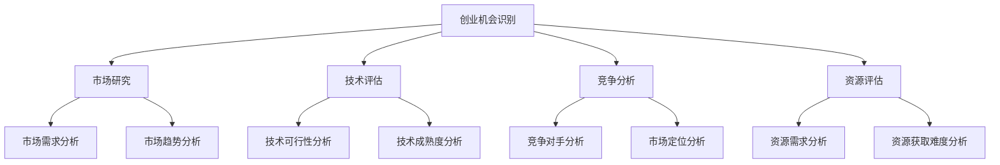
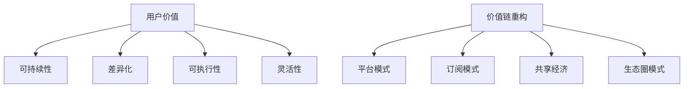

                 

# 《程序员如何评估创业机会》

> 关键词：创业、程序员、机会评估、市场分析、团队建设、风险管理

> 摘要：本文旨在为程序员提供一套系统的创业机会评估方法。通过分析创业背景、市场环境、团队构建、商业模式创新以及风险控制等方面，帮助程序员更好地识别和评估创业机会，从而提高创业成功率。

## 第一部分：创业背景与市场分析

### 第1章：创业概述

#### 1.1 创业的本质与动机

创业，是一种通过创建新的产品、服务或企业来满足市场需求，从而实现商业价值和社会价值的活动。对程序员来说，创业不仅是一种职业选择，更是一种挑战和机遇。程序员通常具有技术背景和创新思维，这使得他们更容易发现市场中的机会，并将其转化为实际的产品或服务。

程序员创业的动机多种多样，包括实现个人价值、追求事业成功、实现技术梦想等。然而，无论动机如何，创业者都需要面对市场、竞争、资金、团队等多方面的挑战。

#### 1.2 创业市场的现状与趋势

当前，全球创业环境日趋成熟，互联网、大数据、人工智能等技术的快速发展，为创业者提供了丰富的资源和机会。同时，创业者面临的竞争也愈发激烈。市场瞬息万变，如何准确把握市场趋势，快速响应市场变化，成为创业者成功的关键。

市场趋势方面，创新性、可持续性和用户体验成为创业的核心要素。创业者需要紧跟市场趋势，不断创新，提供有价值的产品和服务，以满足用户需求。此外，跨行业融合、跨界创新等新兴模式也不断涌现，为创业者提供了更多可能性。

### 第2章：创业机会的识别与评估

#### 2.1 机会识别的理论与方法

创业机会的识别是创业过程的关键步骤。创业者需要具备敏锐的市场洞察力和创新思维，通过多种渠道和方法来发现潜在的机会。

机会识别的理论主要包括：

1. **机会窗口理论**：认为创业机会是市场需求与供给之间的空隙，创业者需要找到并填补这一空隙。
2. **资源基础理论**：强调创业者利用自身资源和能力来识别和开发创业机会。
3. **创新扩散理论**：关注创新在市场中的传播过程，创业者可以通过研究创新扩散的规律来发现机会。

机会识别的方法包括：

1. **市场研究法**：通过对市场进行深入分析，发现潜在的需求和机会。
2. **技术跟踪法**：关注新技术的发展动态，寻找技术变革带来的创业机会。
3. **竞争分析法**：分析竞争对手的优势和劣势，寻找市场空缺和切入点。

#### 2.2 机会评估的框架与指标

在识别创业机会后，创业者需要对其进行评估，以确定其可行性和潜力。机会评估的框架通常包括以下几个方面：

1. **市场需求**：评估目标市场的规模、增长速度和用户需求。
2. **技术可行性**：分析所需技术的成熟度和可获取性。
3. **竞争环境**：评估市场竞争状况、竞争对手的优势和劣势。
4. **资源需求**：评估创业所需的人力、资金、设备等资源。
5. **盈利能力**：评估项目的盈利模式和预期收益。

常用的机会评估指标包括：

1. **市场潜力**：市场规模、增长速度和市场份额。
2. **技术难度**：所需技术的复杂度和开发周期。
3. **竞争优势**：产品或服务的独特性和差异化优势。
4. **资源可获取性**：所需资源的获取难度和成本。
5. **盈利预期**：项目的预期收益和盈利能力。

#### 2.3 创业机会的类型与特点

创业机会可以分为以下几种类型：

1. **需求驱动型**：基于市场需求来发现和创造机会，例如：解决用户痛点、满足特定需求。
2. **技术驱动型**：基于新技术的出现和应用来发现机会，例如：技术创新、应用创新。
3. **市场空缺型**：基于市场中的空白和未被满足的需求来发现机会，例如：市场细分、新市场开拓。
4. **商业模式创新型**：基于新的商业模式来发现和创造机会，例如：共享经济、平台模式。

不同类型的创业机会具有不同的特点，创业者需要根据自身优势和市场环境来选择和把握。

### 第3章：市场研究与定位

#### 3.1 市场研究的步骤与方法

市场研究是创业过程中不可或缺的一环，通过对市场的深入了解，可以帮助创业者更好地定位产品和服务，制定有效的市场策略。市场研究通常包括以下步骤：

1. **确定研究目标**：明确市场研究的具体目的和需求，例如：了解市场需求、分析竞争对手等。
2. **设计研究方案**：制定研究方法和工具，包括问卷调查、访谈、数据分析等。
3. **收集数据**：通过实地调研、网络调查、数据挖掘等方式收集相关数据。
4. **数据分析**：对收集到的数据进行分析，提取有用的信息。
5. **撰写报告**：将研究结果进行总结，并提出建议和策略。

常用的市场研究方法包括：

1. **问卷调查法**：通过设计问卷，收集大量用户反馈，了解市场需求和用户行为。
2. **访谈法**：通过与目标用户进行面对面访谈，深入了解用户需求和偏好。
3. **案例研究法**：通过对典型案例进行分析，了解市场动态和成功经验。
4. **数据分析法**：通过对市场数据进行分析，发现市场趋势和规律。

#### 3.2 市场定位的策略与实施

市场定位是创业成功的关键因素之一，合理的市场定位可以帮助创业者更好地吸引目标用户，提高市场竞争力。市场定位的策略主要包括以下几个方面：

1. **产品定位**：根据产品的特点和用户需求，确定产品的市场定位，例如：高端市场、中低端市场等。
2. **品牌定位**：通过品牌形象、品牌理念等来塑造品牌形象，例如：年轻、专业、高端等。
3. **渠道定位**：选择合适的销售渠道，例如：线上销售、线下销售等。
4. **价格定位**：根据产品的成本、竞争对手的价格和用户需求，确定合适的价格策略，例如：高端定价、性价比定价等。

实施市场定位的策略主要包括：

1. **确定目标市场**：明确目标用户群体，例如：年龄、性别、收入等。
2. **分析目标市场**：了解目标市场的特点、需求和竞争状况。
3. **制定定位策略**：根据目标市场的特点，制定合适的市场定位策略。
4. **实施定位策略**：通过品牌推广、市场营销等方式，将定位策略具体实施。

#### 3.3 市场需求的分析与预测

市场需求是创业成功的重要基础，通过对市场需求的深入分析，可以帮助创业者更好地了解用户需求，制定合适的产品策略。市场需求分析通常包括以下几个方面：

1. **用户需求分析**：了解用户的基本需求、潜在需求和期望，例如：功能需求、性能需求等。
2. **市场趋势分析**：分析市场的发展趋势和变化，例如：技术进步、消费者行为变化等。
3. **竞争分析**：分析竞争对手的产品、市场份额和策略，了解市场动态。
4. **需求预测**：根据历史数据和现有信息，预测未来的市场需求和趋势。

市场需求分析与预测的方法主要包括：

1. **统计分析法**：通过收集和整理历史数据，使用统计方法进行需求预测。
2. **时间序列分析法**：基于时间序列数据，分析市场需求的趋势和周期性变化。
3. **因果分析法**：分析市场需求与相关因素之间的因果关系，预测未来需求。
4. **专家评估法**：通过专家意见和经验，对市场需求进行评估和预测。

### 第4章：商业模式创新与设计

#### 4.1 商业模式的定义与作用

商业模式是指企业通过什么方式来创造、传递和获取价值。它涉及到企业的业务模式、盈利模式、运营模式等方面，是企业发展的重要基础。

商业模式在企业中的作用包括：

1. **指导企业发展**：明确企业的业务方向和目标，为企业的长期发展提供指导。
2. **优化资源配置**：通过合理配置资源，提高企业的效率和竞争力。
3. **实现盈利**：通过商业模式，实现企业的盈利和价值创造。
4. **应对市场变化**：根据市场变化和竞争环境，调整和优化商业模式，以适应市场需求。

#### 4.2 商业模式创新的方法与案例

商业模式创新是企业持续发展的关键。以下是一些常见的商业模式创新方法和案例：

1. **价值链重构**：通过对价值链的重新设计，降低成本、提高效率，创造新的价值。例如：特斯拉通过自建工厂和直营销售，重构了传统汽车行业的价值链。

2. **平台模式**：通过搭建平台，连接供需双方，实现资源共享和协同发展。例如：淘宝通过搭建电商平台，连接消费者和商家，创造了巨大的商业价值。

3. **订阅模式**：通过提供持续的服务或产品，实现长期收益。例如：Spotify通过订阅模式，为用户提供音乐服务，实现了持续的收入来源。

4. **共享经济**：通过共享闲置资源，创造新的商业模式。例如：Airbnb通过共享住宿，创造了新的住宿体验和商业机会。

5. **生态圈模式**：通过构建生态系统，实现多方共赢。例如：小米通过构建智能硬件生态圈，实现了手机、智能家居、互联网服务等多元化业务的发展。

#### 4.3 商业模式设计的原则与技巧

成功的商业模式设计需要遵循以下原则和技巧：

1. **用户价值**：以用户需求为中心，提供有价值的产品或服务。
2. **可持续性**：确保商业模式的长期稳定性和可持续性。
3. **差异化**：通过独特的商业模式，实现差异化竞争。
4. **可执行性**：确保商业模式在实际操作中的可行性和可执行性。
5. **灵活性**：根据市场变化和竞争环境，灵活调整和优化商业模式。

设计商业模式时，可以采用以下技巧：

1. **SWOT分析**：通过分析企业的优势、劣势、机会和威胁，制定合适的商业模式。
2. **价值主张**：明确企业的核心价值主张，为用户创造独特的价值。
3. **盈利模式**：设计合理的盈利模式，确保企业的可持续盈利。
4. **成本结构**：优化成本结构，提高企业的竞争力。
5. **资源整合**：通过整合内外部资源，实现商业模式的创新和优化。

## 第二部分：创业团队的组建与管理

### 第5章：创业团队的构建与管理

#### 5.1 团队成员的角色与职责

一个成功的创业团队需要具备多样化的技能和经验，团队成员的角色与职责如下：

1. **创始人**：负责企业的整体战略规划和决策，领导团队，推动企业的发展。
2. **技术负责人**：负责技术研发和产品实现，确保技术方案的可行性和竞争力。
3. **市场负责人**：负责市场调研、市场定位和市场推广，推动产品的市场占有。
4. **运营负责人**：负责日常运营和管理，确保企业正常运转。
5. **财务负责人**：负责财务管理、预算控制和资金筹集，保障企业的财务健康。
6. **人力资源负责人**：负责招聘、培训和激励员工，提升团队整体素质。

#### 5.2 团队管理的方法与工具

团队管理是创业成功的关键，以下是一些常用的团队管理方法和工具：

1. **目标管理**：明确团队的目标和任务，确保团队成员的工作方向一致。
2. **绩效评估**：定期对团队成员的工作绩效进行评估，激励团队成员不断提升。
3. **沟通协作**：建立有效的沟通渠道，确保团队成员之间的信息共享和协同工作。
4. **项目管理**：使用项目管理工具（如Trello、JIRA等），确保项目进度和质量的控制。
5. **团队建设**：通过团队建设活动，增强团队成员之间的信任和凝聚力。

#### 5.3 团队协作与沟通技巧

有效的团队协作和沟通对于创业团队的成功至关重要，以下是一些团队协作与沟通技巧：

1. **明确分工与责任**：明确每个团队成员的职责和任务，避免工作重叠和冲突。
2. **定期会议**：定期召开团队会议，讨论项目进展、问题和解决方案。
3. **信息共享**：建立信息共享平台，确保团队成员能够及时获取和共享重要信息。
4. **积极倾听**：倾听团队成员的意见和反馈，尊重每个人的观点和贡献。
5. **开放沟通**：鼓励团队成员之间的开放沟通，建立信任和合作的基础。
6. **冲突解决**：建立冲突解决机制，及时解决团队内部的矛盾和分歧。

### 第6章：创业项目的规划与实施

#### 6.1 项目规划的内容与方法

项目规划是创业项目成功的关键，以下是一个典型的项目规划内容和步骤：

1. **项目目标**：明确项目的目标，包括市场目标、技术目标等。
2. **范围定义**：确定项目的范围，包括产品功能、技术实现等。
3. **时间规划**：制定项目的时间表，包括关键里程碑和交付日期。
4. **资源需求**：评估项目所需的资源，包括人力、资金、设备等。
5. **风险评估**：识别项目中的潜在风险，制定相应的风险应对策略。
6. **预算控制**：制定项目的预算，确保项目在预算范围内完成。
7. **质量管理**：制定质量标准，确保项目的质量达到预期。

项目规划的方法包括：

1. **工作分解结构（WBS）**：将项目任务分解为更小的部分，明确每个任务的负责人和时间。
2. **甘特图**：通过甘特图直观地展示项目的进度和时间安排。
3. **关键路径法**：确定项目的关键路径，确保项目的关键任务按计划完成。
4. **资源平衡**：通过资源平衡，优化项目的资源使用，提高项目的效率。

#### 6.2 项目实施的关键步骤与风险控制

项目实施是创业项目的重要阶段，以下是一些关键步骤和风险控制措施：

1. **需求分析**：与客户和利益相关者进行沟通，明确项目的需求和功能。
2. **设计阶段**：根据需求分析，制定详细的设计方案，包括技术方案、产品界面等。
3. **开发阶段**：按照设计方案，进行产品的开发工作，确保产品的质量和进度。
4. **测试阶段**：对产品进行严格的测试，确保产品的功能、性能和安全性。
5. **部署阶段**：将产品部署到生产环境，确保产品的稳定运行。
6. **用户反馈**：收集用户反馈，根据反馈进行产品的改进和优化。

风险控制措施包括：

1. **风险评估**：在项目规划阶段，对项目中的潜在风险进行评估。
2. **风险应对策略**：制定相应的风险应对策略，包括风险回避、风险转移、风险接受等。
3. **监控与报告**：定期监控项目的风险状况，及时报告风险变化，确保风险得到有效控制。

#### 6.3 项目进度的跟踪与评估

项目进度的跟踪与评估是确保项目按时完成的关键，以下是一些方法：

1. **进度报告**：定期向项目利益相关者报告项目进度，确保项目各方了解项目状态。
2. **关键指标监控**：监控关键项目指标（KPI），如任务完成率、进度偏差等。
3. **变更管理**：在项目实施过程中，如有变更需求，需进行变更管理，确保变更的合理性和可行性。
4. **进度评估**：定期对项目进度进行评估，识别进度偏差，制定相应的纠正措施。

### 第7章：创业资源的获取与利用

#### 7.1 资源获取的途径与方法

创业资源的获取是创业成功的重要保障，以下是一些资源获取的途径和方法：

1. **自有资源**：利用自身的技术、经验和人脉等自有资源进行创业。
2. **外部投资**：通过寻找天使投资人、风险投资等外部投资机构进行融资。
3. **政府支持**：利用政府的创业扶持政策，如创业补贴、税收优惠等。
4. **合作伙伴**：与产业链上下游的企业建立合作关系，共享资源，实现互利共赢。
5. **平台资源**：利用互联网平台，如众筹、共享办公等，获取资金、技术、人才等资源。

#### 7.2 资源利用的技巧与策略

有效利用创业资源可以提高企业的效率和竞争力，以下是一些资源利用的技巧与策略：

1. **资源整合**：通过整合内外部资源，实现资源的最大化利用。
2. **成本控制**：优化成本结构，降低运营成本，提高资源利用率。
3. **知识共享**：建立知识共享机制，促进团队内部的知识传递和经验积累。
4. **技术创新**：通过技术创新，提高产品和服务的质量，实现资源的高效利用。
5. **人力资源开发**：加强对员工的培训和发展，提高人力资源的价值。

#### 7.3 资源整合与优化的实践

资源整合与优化的实践可以从以下几个方面入手：

1. **建立资源管理平台**：通过建立资源管理平台，实现资源的统一管理和调度。
2. **优化供应链**：通过优化供应链，提高供应链的效率和灵活性。
3. **跨部门协作**：促进跨部门之间的协作，实现资源的共享和优化。
4. **技术创新**：通过技术创新，提高产品和服务的附加值，实现资源的高效利用。
5. **企业文化**：建立积极向上的企业文化，激发员工的创新和创业精神，提高资源的利用效率。

## 第三部分：创业风险的评估与管理

### 第8章：创业风险的识别与分类

#### 8.1 风险识别的方法与工具

风险识别是创业风险管理的第一步，以下是一些常用的风险识别方法和工具：

1. **头脑风暴**：通过集体讨论，识别项目中的潜在风险。
2. **SWOT分析**：通过分析企业的优势、劣势、机会和威胁，识别潜在的风险。
3. **访谈法**：通过与项目团队成员、利益相关者进行访谈，了解他们的意见和建议，识别潜在风险。
4. **历史数据分析**：通过分析历史项目的数据和经验，识别潜在的风险。
5. **风险评估矩阵**：通过构建风险评估矩阵，对风险进行定量和定性分析，识别高风险。

#### 8.2 风险分类的标准与类型

创业风险可以根据不同的标准进行分类，常见的分类标准包括：

1. **按风险来源分类**：可以分为市场风险、技术风险、财务风险、运营风险等。
2. **按风险性质分类**：可以分为纯粹风险和投机风险，纯粹风险是指只有损失的可能性，投机风险是指既有损失的可能性，也有盈利的可能性。
3. **按风险影响分类**：可以分为重大风险、重要风险、一般风险等，根据风险对项目目标的影响程度进行分类。

常见的创业风险类型包括：

1. **市场风险**：市场需求变化、竞争加剧等可能导致项目失败。
2. **技术风险**：技术实现困难、技术更新换代等可能导致项目延期或失败。
3. **财务风险**：资金不足、成本超支等可能导致项目无法持续。
4. **运营风险**：管理不善、运营中断等可能导致项目失败。
5. **法律风险**：法律纠纷、政策变动等可能导致项目失败。

#### 8.3 风险分析的原则与步骤

风险分析是创业风险管理的重要环节，以下是一些风险分析的原则和步骤：

1. **全面性原则**：风险分析应覆盖项目各个方面，确保全面性。
2. **客观性原则**：风险分析应基于客观事实和数据，避免主观判断。
3. **前瞻性原则**：风险分析应具备前瞻性，考虑未来可能发生的变化和风险。
4. **可行性原则**：风险分析的结果应具备可行性，确保风险应对措施的有效性。

风险分析的一般步骤包括：

1. **确定分析目标**：明确风险分析的目的和范围。
2. **收集风险信息**：通过多种渠道收集风险信息，包括历史数据、专家意见等。
3. **风险识别**：识别项目中的潜在风险。
4. **风险评估**：对风险进行定量和定性分析，确定风险的影响程度。
5. **制定风险应对策略**：根据风险分析结果，制定相应的风险应对策略。

### 第9章：创业风险的管理与应对

#### 9.1 风险管理的策略与措施

创业风险管理是确保项目成功的关键，以下是一些常用的风险管理策略和措施：

1. **风险规避**：通过调整项目计划、改变项目策略等手段，避免风险的发生。
2. **风险转移**：通过购买保险、签订合同等手段，将风险转移给第三方。
3. **风险减轻**：通过改进技术、优化流程等手段，降低风险的影响程度。
4. **风险接受**：对于无法避免或转移的风险，接受风险并制定相应的应对措施。

#### 9.2 风险应对的方法与技巧

在创业过程中，风险是不可避免的。以下是一些风险应对的方法和技巧：

1. **制定应急预案**：在项目计划中，制定应急预案，以应对可能发生的风险。
2. **建立风险管理团队**：建立专门的风险管理团队，负责风险识别、评估和应对。
3. **定期风险评审**：定期对项目中的风险进行评审，识别新的风险并调整风险应对策略。
4. **加强沟通与协作**：通过加强团队内部和外部的沟通与协作，提高风险应对的效率。

#### 9.3 风险监控与评估的实践

风险监控与评估是创业风险管理的持续过程，以下是一些实践方法：

1. **建立风险监控体系**：通过建立风险监控体系，实时监测项目中的风险状况。
2. **定期风险评估**：定期对项目中的风险进行评估，更新风险清单和风险应对策略。
3. **风险报告**：定期向项目利益相关者报告风险状况，确保各方了解项目的风险状况。
4. **改进与优化**：根据风险监控与评估的结果，不断改进和优化风险管理策略和措施。

### 第10章：创业成功的要素与案例分析

#### 10.1 创业成功的要素分析

创业成功需要综合考虑多个要素，以下是一些关键的成功要素：

1. **团队**：一个优秀的团队是创业成功的关键。团队成员需要具备专业技能、合作精神和创新思维。
2. **市场**：明确的目标市场和强大的市场需求是创业成功的基础。
3. **产品**：有价值、有竞争力的产品是创业成功的核心。产品需要满足用户需求，具备差异化优势。
4. **资金**：充足的资金是创业成功的保障。创业者需要合理规划资金使用，确保项目的可持续发展。
5. **创新**：创新是创业成功的动力。创业者需要持续关注市场和技术动态，不断推陈出新。
6. **执行力**：高效的执行力是创业成功的保证。创业者需要具备坚定的信念和执行力，推动项目的顺利进行。
7. **持续学习**：在创业过程中，持续学习和适应变化是创业成功的重要因素。

#### 10.2 创业成功案例的分享与解读

以下是一些创业成功案例的分享与解读：

1. **案例一：小米**
   - 成功要素：团队（雷军带领的创业团队）、市场（智能手机市场）、产品（性价比高的智能手机）、创新（互联网营销模式）。
   - 解读：小米通过互联网营销模式，迅速占领市场，实现了手机销量的爆发式增长。

2. **案例二：Airbnb**
   - 成功要素：市场（旅游住宿市场）、产品（共享住宿平台）、创新（共享经济模式）。
   - 解读：Airbnb通过共享经济模式，创造了新的住宿体验，满足了用户需求，实现了商业模式的成功。

3. **案例三：Spotify**
   - 成功要素：市场（音乐市场）、产品（音乐流媒体服务）、创新（订阅模式）。
   - 解读：Spotify通过订阅模式，为用户提供便捷的音乐服务，实现了持续的收入来源。

#### 10.3 创业者应具备的能力与素质

创业者应具备以下能力与素质：

1. **领导力**：具备领导力，能够带领团队共同实现目标。
2. **创新思维**：具备创新思维，能够不断寻找新的机会和解决方案。
3. **沟通能力**：具备良好的沟通能力，能够与团队成员、利益相关者进行有效沟通。
4. **决策能力**：具备决策能力，能够在复杂环境中做出明智的决策。
5. **学习能力**：具备持续学习能力，能够适应快速变化的市场环境。
6. **执行力**：具备高效的执行力，能够推动项目顺利进行。
7. **抗压能力**：具备抗压能力，能够应对创业过程中的各种挑战和困难。

## 附录

### 附录A：创业资源推荐

#### A.1 创业平台与网络资源

- **创业平台**：36氪、创业邦、天使汇等
- **网络资源**：知乎、创业家、创业论坛等

#### A.2 创业书籍与资料推荐

- **创业书籍**：《创业维艰》、《创新者的窘境》、《创业思维》等
- **资料推荐**：创业计划书模板、商业计划书范本等

#### A.3 创业工具与软件推荐

- **项目管理工具**：Trello、JIRA、Asana等
- **数据分析工具**：Excel、Python、R语言等
- **协作工具**：Slack、Teamlab、Zoom等

### 附录B：创业实战案例

#### B.1 某创业公司的成长历程

- **案例背景**：某创业公司成立于2010年，是一家专注于移动互联网领域的公司。
- **发展历程**：从最初的创业团队发展到今天的规模，公司经历了多次产品迭代和市场拓展。
- **成功经验**：公司通过不断创新，满足了市场需求，取得了良好的业绩。

#### B.2 某创业项目的实践与反思

- **案例背景**：某创业项目是一款面向年轻人的生活方式应用。
- **项目实践**：项目团队在开发过程中遇到了技术难题和用户需求变化等挑战。
- **反思与启示**：通过实践，团队认识到创新思维、用户反馈和市场调研的重要性。

#### B.3 创业成功的关键要素与经验总结

- **关键要素**：团队、市场、产品、创新、执行力等。
- **经验总结**：成功创业需要持续学习、敏锐的市场洞察力、强大的执行力等。

## 作者信息

作者：AI天才研究院/AI Genius Institute & 禅与计算机程序设计艺术 /Zen And The Art of Computer Programming

---

### 核心概念与联系

#### 创业机会识别与评估流程



#### 商业模式设计原则



### 核心算法原理讲解

#### 数据分析算法：K-means聚类

```plaintext
算法描述：
1. 随机选择K个数据点作为初始聚类中心。
2. 对于每个数据点，计算其与各个聚类中心的距离，并将其分配到最近的聚类中心。
3. 更新每个聚类中心的位置，计算聚类中心的新均值。
4. 重复步骤2和3，直到聚类中心的位置不再发生显著变化。

伪代码：
function KMeans(data, K):
    centroids = randomSelectKCentroids(data, K)
    while not convergence:
        assignments = []
        for data_point in data:
            distances = [distance(data_point, centroid) for centroid in centroids]
            closest_centroid = centroids[findMin(distances)]
            assignments.append(closest_centroid)
        new_centroids = computeNewCentroids(data, assignments)
        if centroids == new_centroids:
            break
        centroids = new_centroids
    return centroids, assignments
```

### 数学模型和公式 & 详细讲解 & 举例说明

#### 用户增长模型：指数增长模型

$$
N(t) = N_0 \cdot e^{rt}
$$

其中，$N(t)$ 表示时间 $t$ 时的用户数量，$N_0$ 为初始用户数量，$r$ 为增长速率。

**举例说明**：

假设一家创业公司初始用户数量为1000人，每月用户增长速率为10%，则三个月后的用户数量为：

$$
N(3) = 1000 \cdot e^{0.1 \cdot 3} \approx 1310
$$

### 项目实战：代码实际案例和详细解释说明

#### 实战案例：搭建一个简单的博客系统

**开发环境搭建**：

- 语言：Python
- 框架：Flask
- 数据库：SQLite

**源代码**：

```python
from flask import Flask, render_template, request, redirect, url_for
app = Flask(__name__)

@app.route('/')
def home():
    return render_template('home.html')

@app.route('/about')
def about():
    return render_template('about.html')

@app.route('/post', methods=['GET', 'POST'])
def post():
    if request.method == 'POST':
        title = request.form['title']
        content = request.form['content']
        # 将数据存储到数据库
        # ...
        return redirect(url_for('home'))
    return render_template('post.html')

if __name__ == '__main__':
    app.run(debug=True)
```

**代码解读与分析**：

- `Flask` 是一个轻量级的 Web 应用框架，用于搭建 Web 应用。
- `@app.route('/')` 定义了访问博客主页的 URL 路由。
- `render_template` 函数用于渲染 HTML 模板。
- `request` 对象用于获取客户端请求的数据。
- `redirect` 函数用于重定向到不同的 URL。

**部署**：

- 将源代码上传到服务器。
- 安装所需的依赖包。
- 运行 Flask 应用。

通过这个简单的博客系统，程序员可以了解 Web 开发的基本流程和技巧，为后续的创业项目积累经验。

