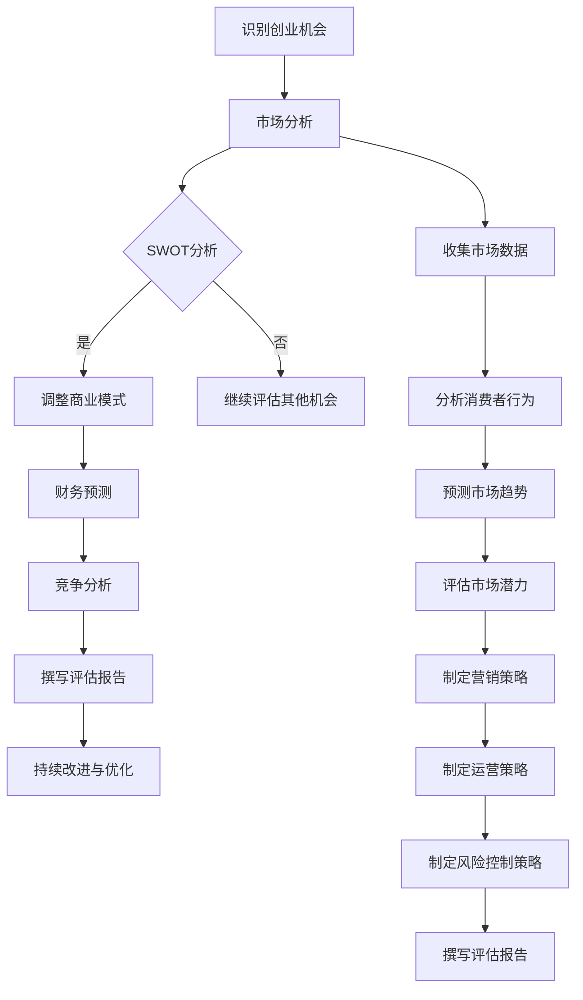

                 

### 《程序员如何评估早期创业机会》

#### 关键词：创业机会评估、市场分析、SWOT分析、财务模型、竞争分析、程序员

> **摘要**：
本文旨在为程序员提供一套系统的创业机会评估方法。通过深入探讨市场趋势、SWOT分析、财务预测、竞争策略等核心环节，帮助程序员从技术角度出发，全面评估早期创业机会，制定科学的创业计划。本文结构清晰，逻辑严谨，适合有志于创业的程序员阅读。

---

### 《程序员如何评估早期创业机会》目录大纲

#### 第一部分：评估创业机会的基本原理

**第1章：创业环境与市场趋势分析**

- 1.1 创业环境的宏观分析
  - 政策法规对创业的影响
  - 经济环境和行业趋势
  - 技术创新对创业机会的影响

- 1.2 市场趋势分析
  - 消费者需求的变化
  - 市场规模与增长速度
  - 行业竞争态势

#### 第二部分：创业机会的识别与评估

**第2章：创业机会的识别**

- 2.1 需求识别与市场细分
  - 消费者需求分析
  - 市场细分策略

- 2.2 竞争对手分析
  - 竞争对手识别
  - 竞争优势分析

- 2.3 创业团队与核心资源
  - 创业团队建设
  - 核心资源整合

#### 第三部分：创业机会评估方法与工具

**第3章：SWOT分析与创业机会评估**

- 3.1 SWOT分析框架
  - 优势分析
  - 劣势分析
  - 机会分析
  - 威胁分析

- 3.2 应用SWOT分析评估创业机会
  - 创业团队的优势与劣势
  - 产品市场的机会与威胁

**第4章：创业财务模型与盈利预测**

- 4.1 创业财务模型构建
  - 收入模型
  - 成本模型
  - 盈利预测

- 4.2 财务指标解读
  - 现金流
  - 财务杠杆
  - 投资回报率

**第5章：竞争分析工具与方法**

- 5.1 市场份额分析
  - 市场份额定义
  - 市场份额计算方法

- 5.2 竞争对手分析
  - 竞争对手识别
  - 竞争优势分析
  - 竞争策略分析

#### 第四部分：创业机会评估实践

**第6章：案例分析与创业机会评估实践**

- 6.1 案例一：社交媒体平台的创业机会评估
  - 市场分析
  - 竞争分析
  - 财务预测

- 6.2 案例二：人工智能创业公司的机会评估
  - 技术分析
  - 市场潜力评估
  - 风险评估

#### 第五部分：创业机会评估报告撰写与实战

**第7章：创业机会评估报告撰写与实战**

- 7.1 创业机会评估报告结构
  - 报告概述
  - 市场分析
  - 竞争分析
  - 财务预测

- 7.2 创业机会评估报告撰写技巧
  - 数据收集与整理
  - 文字表达与逻辑性

#### 第六部分：创业机会评估的持续改进

**第8章：创业机会评估的持续改进**

- 8.1 创业环境的变化与适应
  - 市场变化
  - 技术创新
  - 政策调整

- 8.2 创业机会评估的持续优化
  - 数据更新
  - 模型修正
  - 优化策略调整

#### 附录

**附录A：创业机会评估工具与资源**

- 创业评估工具清单
- 市场研究资源
- 财务预测模板

**附录B：创业机会评估相关的术语解释**

- SWOT分析
- 市场份额
- 商业模式
- 投资回报率（ROI）
- 财务预测
- 竞争分析

**附录C：创业机会评估的流程图**

**附录D：创业财务模型与盈利预测示例**

---

以上是《程序员如何评估早期创业机会》的目录大纲，接下来的章节将详细探讨每个部分的核心内容，帮助程序员系统地评估早期创业机会。### 第1章：创业环境与市场趋势分析

#### 1.1 创业环境的宏观分析

创业环境是一个复杂且动态的系统，受到宏观环境、政策法规、经济环境、行业趋势和技术创新等多方面因素的影响。对于程序员而言，深入分析这些因素，有助于把握创业方向，降低创业风险。

**1.1.1 政策法规对创业的影响**

政策法规是创业环境中至关重要的一环。政府的政策支持和法律法规的制定，直接影响到创业企业的生存和发展。以下是一些关键因素：

- **税收政策**：税收政策直接影响企业的盈利能力。政府可能提供税收减免、税收优惠等政策，鼓励创业创新。
- **金融政策**：金融政策包括货币政策、信贷政策等，这些政策将影响创业企业的融资难易程度和成本。
- **行业法规**：不同行业的法规要求各异，如网络安全、数据保护、知识产权等方面的法规，创业者需要严格遵守。

**1.1.2 经济环境和行业趋势**

经济环境和行业趋势对创业机会有着深远的影响。以下是一些关键因素：

- **经济增长速度**：经济增长速度快，意味着市场潜力大，消费者购买力强，为企业提供了良好的发展环境。
- **行业生命周期**：不同行业处于不同的生命周期阶段，如初创期、成长期、成熟期和衰退期。创业者需要根据行业生命周期制定相应的创业策略。
- **产业政策**：政府对于某些产业的扶持政策，如新能源、人工智能、生物科技等，将直接影响这些行业的创业机会。

**1.1.3 技术创新对创业机会的影响**

技术创新是推动创业机会的重要因素。以下是一些关键因素：

- **新技术应用**：新技术的应用往往带来新的创业机会。例如，物联网、大数据、区块链等技术的发展，为创业者提供了丰富的应用场景。
- **技术成熟度**：技术的成熟度直接影响创业项目的可行性。成熟的技术可以降低创业风险，提高成功率。
- **技术壁垒**：技术壁垒可以保护创业企业的市场地位，但同时也可能限制创业机会。创业者需要评估技术壁垒的强度，制定相应的策略。

#### 1.2 市场趋势分析

市场趋势是创业机会评估的重要组成部分。通过对市场趋势的深入分析，创业者可以把握市场动态，制定科学的市场策略。

**1.2.1 消费者需求的变化**

消费者需求的变化是市场趋势的核心。以下是一些关键因素：

- **消费习惯**：随着社会经济的发展和消费者观念的转变，消费习惯也在不断变化。例如，线上购物、智能家居等消费模式逐渐普及。
- **消费偏好**：消费者的消费偏好受到多种因素的影响，如文化背景、收入水平、教育程度等。创业者需要了解目标消费者的偏好，提供符合市场需求的产品和服务。
- **消费升级**：消费升级意味着消费者对品质、服务、体验等方面的要求越来越高。创业者需要提供更高品质的产品和服务，以满足消费者的需求。

**1.2.2 市场规模与增长速度**

市场规模与增长速度是衡量市场潜力的关键指标。以下是一些关键因素：

- **市场规模**：市场规模反映了市场需求的总量。一个庞大的市场规模意味着有更多的机会，但也可能面临更激烈的竞争。
- **增长速度**：市场的增长速度决定了市场的扩张速度。一个快速增长的市场为创业者提供了广阔的发展空间。

**1.2.3 行业竞争态势**

行业竞争态势直接影响创业机会。以下是一些关键因素：

- **竞争者数量**：竞争者数量的多少反映了行业的竞争激烈程度。一个竞争激烈的市场可能需要更高的门槛和更强的竞争力。
- **市场份额分布**：市场份额的分布情况反映了行业内的竞争格局。如果市场份额高度集中，创业者需要寻找细分市场或创新点。
- **进入壁垒**：进入壁垒是指新企业进入市场的难度。一个高进入壁垒的行业可能需要更多的资源和技术积累，但也可能提供更稳定的市场地位。

通过以上分析，创业者可以更好地理解创业环境与市场趋势，为创业机会评估提供有力支持。接下来，我们将进一步探讨如何通过SWOT分析和财务预测等方法，深入评估早期创业机会。### 第2章：创业机会的识别与评估

#### 2.1 创业机会的识别

创业机会的识别是评估早期创业机会的第一步。在这一环节，程序员需要从技术、市场、团队等多方面入手，挖掘潜在的创业机会。

**2.1.1 需求识别与市场细分**

需求识别是创业机会识别的关键。程序员可以通过以下方法进行需求识别：

- **用户调研**：通过直接与潜在用户交流，了解他们的需求和痛点。这可以通过在线调查、用户访谈、焦点小组讨论等方式进行。
- **市场数据分析**：通过分析市场数据，如用户行为数据、消费趋势等，发现潜在的需求。
- **市场细分**：根据用户需求、行为特征等因素，将市场细分为不同的用户群体。每个细分市场都有独特的需求，为创业提供了更多的机会。

**需求识别的具体步骤如下**：

1. **确定目标市场**：明确创业项目的目标用户群体。
2. **收集需求信息**：通过用户调研、数据分析等方法，收集目标市场的需求信息。
3. **分析需求信息**：对收集到的需求信息进行分析，识别出潜在的市场机会。

**2.1.2 竞争对手分析**

竞争对手分析是识别创业机会的重要环节。程序员可以通过以下方法进行竞争对手分析：

- **识别竞争对手**：通过市场调研、行业报告等途径，列出主要竞争对手。
- **分析竞争对手的优势与劣势**：分析竞争对手的产品、服务、市场策略、财务状况等，识别其优势和劣势。
- **寻找市场空缺**：通过分析竞争对手，找到市场中的空缺和不足，从而挖掘创业机会。

**竞争对手分析的具体步骤如下**：

1. **列出竞争对手**：确定目标市场的主要竞争对手。
2. **分析竞争对手的优势与劣势**：通过市场调研、用户反馈等途径，分析竞争对手的优势与劣势。
3. **寻找市场空缺**：根据竞争对手的分析结果，识别市场中的空缺和不足，找到创业机会。

**2.1.3 创业团队与核心资源**

创业团队和核心资源是创业机会评估的重要方面。程序员需要考虑以下因素：

- **创业团队的技能和经验**：创业团队是否具备实现创业想法所需的技能和经验。
- **核心资源**：包括资金、技术、人才、市场渠道等。核心资源的充足与否直接影响创业的可行性。
- **合作伙伴**：寻找合适的合作伙伴，共同开发市场，提高创业成功率。

**创业团队与核心资源的具体步骤如下**：

1. **评估团队技能与经验**：确定创业团队是否具备实现创业想法所需的技能和经验。
2. **整合核心资源**：评估现有资源，寻找外部资源，确保创业项目的可行性。
3. **寻找合作伙伴**：通过合作，整合各方资源，共同推进创业项目。

通过以上步骤，程序员可以有效地识别创业机会，为后续的评估和创业计划提供基础。接下来，我们将进一步探讨如何通过SWOT分析和财务预测等方法，深入评估早期创业机会。### 第3章：SWOT分析与创业机会评估

#### 3.1 SWOT分析框架

**SWOT分析**是一种常用的战略规划工具，用于评估企业或项目的优势（Strengths）、劣势（Weaknesses）、机会（Opportunities）和威胁（Threats）。这种分析方法可以帮助创业者全面了解企业或项目在市场中的地位，制定科学合理的战略。

**优势（Strengths）**：

优势是指企业或项目在资源、能力、市场地位等方面的优势，如：

- **技术优势**：企业拥有独特的技术或专利，能够提供优质的产品或服务。
- **品牌优势**：企业拥有良好的品牌知名度和品牌形象，能够吸引更多的客户。
- **市场地位**：企业在市场中的地位，如市场份额、用户基数等。

**劣势（Weaknesses）**：

劣势是指企业或项目在资源、能力、市场地位等方面的不足，如：

- **技术不足**：企业缺乏先进的技术或专利，无法满足市场需求。
- **品牌认知度低**：企业品牌知名度低，难以吸引目标客户。
- **市场地位不高**：企业在市场中的地位较低，面临较大的竞争压力。

**机会（Opportunities）**：

机会是指外部环境中有利于企业或项目发展的因素，如：

- **市场需求增长**：市场需求持续增长，为企业提供了发展空间。
- **政策支持**：政府或地方政府提供优惠政策，支持企业发展。
- **技术创新**：新的技术发展为企业提供了创新和转型的机会。

**威胁（Threats）**：

威胁是指外部环境中可能对企业或项目造成不利影响的因素，如：

- **市场竞争激烈**：市场上存在众多竞争对手，竞争压力增大。
- **政策法规变化**：政策法规的变化可能对企业造成不利影响。
- **技术革新**：新的技术革新可能颠覆现有的市场格局。

**3.2 应用SWOT分析评估创业机会**

**3.2.1 创业团队的优势与劣势**

在应用SWOT分析评估创业机会时，首先要分析创业团队的优势和劣势。

- **优势**：分析创业团队的技能、经验、资源等，如：

  - 技术团队：具备优秀的编程能力、系统架构设计能力等。
  - 管理团队：具备丰富的创业经验、项目管理能力等。
  - 商业资源：拥有市场渠道、合作伙伴等。

- **劣势**：分析创业团队的不足，如：

  - 技术局限：可能缺乏某些关键技术或经验。
  - 人力资源：团队规模较小，人才储备不足。
  - 商业模式：尚未明确或成熟的商业模式。

**3.2.2 产品市场的机会与威胁**

在应用SWOT分析评估创业机会时，还需要分析产品市场的机会与威胁。

- **机会**：分析市场上存在的潜在机会，如：

  - 新兴市场：市场上存在尚未被满足的需求，如智能家居、物联网等。
  - 政策支持：政府或地方政府对某些产业提供优惠政策，如减税、补贴等。
  - 技术创新：新的技术发展为企业提供了创新和转型的机会。

- **威胁**：分析市场上存在的潜在威胁，如：

  - 竞争对手：市场上存在强大的竞争对手，竞争压力增大。
  - 政策法规：政策法规的变化可能对企业造成不利影响。
  - 市场饱和：市场趋于饱和，竞争激烈。

通过SWOT分析，创业者可以全面了解企业或项目的优势、劣势、机会和威胁，为制定创业计划和战略提供有力支持。接下来，我们将进一步探讨如何通过创业财务模型和竞争分析等方法，深入评估早期创业机会。### 第4章：创业财务模型与盈利预测

#### 4.1 创业财务模型构建

创业财务模型是评估创业机会的重要工具，它能够帮助创业者预测企业的财务表现，评估投资回报和风险。构建创业财务模型主要包括以下步骤：

**1. 收入模型**

收入模型用于预测企业的收入来源和规模。创业者需要明确企业的主营业务收入来源，如产品销售收入、服务收入、广告收入等。以下是一个简单的收入预测表示例：

| 年份 | 收入来源 | 预期收入（元） |
|------|----------|---------------|
| 2023 | 产品销售收入 | 1,000,000     |
| 2024 | 服务收入    | 1,200,000     |
| 2025 | 广告收入    | 1,500,000     |

**2. 成本模型**

成本模型用于预测企业运营所需的各项费用，包括固定成本和可变成本。固定成本通常包括房租、设备购置、员工薪酬等，而可变成本则包括原材料、生产成本、营销费用等。以下是一个简单的成本预测表示例：

| 年份 | 成本类别 | 预期成本（元） |
|------|----------|---------------|
| 2023 | 固定成本 | 500,000       |
| 2023 | 可变成本 | 400,000       |
| 2024 | 固定成本 | 550,000       |
| 2024 | 可变成本 | 450,000       |
| 2025 | 固定成本 | 600,000       |
| 2025 | 可变成本 | 500,000       |

**3. 盈利预测**

盈利预测是基于收入模型和成本模型，预测企业的净利润。以下是一个简单的利润预测表示例：

| 年份 | 收入总额（元） | 成本总额（元） | 净利润（元） |
|------|----------------|----------------|--------------|
| 2023 | 1,500,000      | 900,000        | 600,000      |
| 2024 | 2,700,000      | 1,000,000      | 1,700,000    |
| 2025 | 3,500,000      | 1,200,000      | 2,300,000    |

**4. 财务指标**

财务指标用于评估企业的财务健康状况和投资回报。常见的财务指标包括现金流、财务杠杆和投资回报率（ROI）。

- **现金流**：现金流反映了企业实际运营的现金流入和流出，是评估企业流动性的重要指标。
- **财务杠杆**：财务杠杆反映了企业的负债水平，是评估企业财务风险的重要指标。
- **投资回报率（ROI）**：投资回报率是衡量企业盈利能力的重要指标，计算公式为ROI = 净利润 / 投资成本。

#### 4.2 财务指标解读

**1. 现金流**

现金流是企业运营过程中产生的现金流入和流出，包括以下几种类型：

- **经营活动现金流**：企业日常运营产生的现金流入和流出，如销售收入、应收账款回收等。
- **投资活动现金流**：企业投资和收购活动产生的现金流入和流出，如购买设备、投资新项目等。
- **筹资活动现金流**：企业筹集资金和偿还债务活动产生的现金流入和流出，如借款、偿还借款等。

现金流管理对于企业的生存和发展至关重要。良好的现金流管理可以确保企业在面对市场波动和不确定性时，保持足够的流动资金。

**2. 财务杠杆**

财务杠杆反映了企业的负债水平，是评估企业财务风险的重要指标。财务杠杆的计算公式为：

$$
财务杠杆 = 负债 / 资产
$$

财务杠杆越高，企业的财务风险越大。过高的财务杠杆可能导致企业面临财务困境，甚至破产。

**3. 投资回报率（ROI）**

投资回报率是衡量企业盈利能力的重要指标，计算公式为：

$$
投资回报率（ROI）= 净利润 / 投资成本
$$

ROI越高，说明企业的盈利能力越强，投资回报越高。

#### 4.3 财务预测模板

为了帮助创业者构建财务模型，以下是财务预测的一个基本模板：

**1. 收入预测表**

| 年份 | 收入来源 | 预期收入（元） |
|------|----------|---------------|
| 2023 | 产品销售收入 | 1,000,000     |
| 2024 | 服务收入    | 1,200,000     |
| 2025 | 广告收入    | 1,500,000     |

**2. 成本预测表**

| 年份 | 成本类别 | 预期成本（元） |
|------|----------|---------------|
| 2023 | 固定成本 | 500,000       |
| 2023 | 可变成本 | 400,000       |
| 2024 | 固定成本 | 550,000       |
| 2024 | 可变成本 | 450,000       |
| 2025 | 固定成本 | 600,000       |
| 2025 | 可变成本 | 500,000       |

**3. 利润预测表**

| 年份 | 收入总额（元） | 成本总额（元） | 净利润（元） |
|------|----------------|----------------|--------------|
| 2023 | 1,500,000      | 900,000        | 600,000      |
| 2024 | 2,700,000      | 1,000,000      | 1,700,000    |
| 2025 | 3,500,000      | 1,200,000      | 2,300,000    |

**4. 财务指标表**

| 年份 | 毛利率 | 净利率 | 现金流（元） | 财务杠杆 | 投资回报率 |
|------|--------|--------|---------------|-----------|-------------|
| 2023 | 60%    | 40%    | 600,000       | 0.50      | 0.60        |
| 2024 | 66.7%  | 50%    | 1,700,000     | 0.50      | 0.66        |
| 2025 | 70%    | 45%    | 2,300,000     | 0.50      | 0.75        |

通过以上模板，创业者可以初步预测企业的财务状况，为创业机会评估提供数据支持。需要注意的是，实际财务预测需要结合具体业务情况和市场环境进行调整。### 第5章：竞争分析工具与方法

#### 5.1 市场份额分析

市场份额分析是评估企业市场地位的重要工具，通过计算企业在特定市场中的收入、用户数或其他指标在总市场中的占比，可以了解企业的市场表现和竞争能力。以下是一个简单的市场份额计算示例：

**示例：**

假设2023年社交媒体平台的总收入为1亿元，其中A公司的收入为3000万元，则A公司的市场份额计算如下：

$$
市场份额（%）= \frac{A公司收入（万元）}{市场总规模（亿元）} \times 100\% = \frac{3000}{10000} \times 100\% = 30\%
$$

通过计算市场份额，创业者可以了解自身在市场中的地位，并制定相应的市场策略。

#### 5.2 竞争对手分析

竞争对手分析是深入了解市场竞争态势的重要方法。通过分析竞争对手的产品、市场策略、财务状况等，创业者可以评估自身在市场中的竞争能力，并制定有效的市场策略。

**分析要素：**

1. **产品分析**：分析竞争对手的产品功能、性能、价格、用户评价等。
2. **市场策略**：分析竞争对手的市场推广、销售渠道、定价策略等。
3. **财务状况**：分析竞争对手的营收、利润、现金流等财务指标。
4. **竞争优势**：评估竞争对手在市场上的竞争优势，如技术优势、品牌优势、渠道优势等。

**分析步骤：**

1. **识别竞争对手**：列出主要竞争对手，包括直接和间接竞争者。
2. **收集信息**：通过市场调研、行业报告、公开数据等渠道收集竞争对手的信息。
3. **分析并评估**：对收集的信息进行整理和分析，评估竞争对手的竞争能力和市场策略。
4. **制定应对策略**：根据分析结果，制定相应的市场策略，提升自身竞争力。

#### 5.3 竞争策略分析

竞争策略分析是评估企业市场竞争能力的重要方法。通过分析竞争对手的市场策略，可以了解市场动态，为自身制定有效的市场竞争策略。

**分析要素：**

1. **定价策略**：分析竞争对手的定价模式，如高价策略、低价策略等。
2. **销售渠道**：分析竞争对手的销售渠道，如线上销售、线下销售等。
3. **市场推广**：分析竞争对手的市场推广手段，如广告、促销、公关等。
4. **技术创新**：分析竞争对手的技术创新，如产品功能、技术架构等。

**分析步骤：**

1. **识别竞争对手的市场策略**：通过市场调研、行业报告等渠道了解竞争对手的市场策略。
2. **评估竞争对手策略的效果**：分析竞争对手策略的优缺点，评估其在市场中的效果。
3. **制定竞争策略**：根据竞争对手策略的分析结果，制定有效的市场竞争策略。

#### 5.4 实战案例分析

**案例：某在线教育平台**

**1. 市场份额分析**

假设2023年在线教育市场的总收入为100亿元，A公司的收入为20亿元，则A公司的市场份额为：

$$
市场份额（%）= \frac{A公司收入（亿元）}{市场总规模（亿元）} \times 100\% = \frac{20}{100} \times 100\% = 20\%
$$

**2. 竞争对手分析**

- **产品分析**：B公司的产品功能更全面，用户满意度较高；C公司的产品价格较低，但用户体验较差。
- **市场策略**：B公司注重线下推广，C公司注重线上广告。
- **财务状况**：B公司营收较高，但利润率较低；C公司营收较低，但现金流稳定。

**3. 竞争策略分析**

根据竞争对手分析，A公司可以采取以下竞争策略：

- **产品改进**：增加产品功能，提升用户满意度。
- **市场推广**：加大线上广告投入，提高品牌知名度。
- **价格策略**：通过优惠活动吸引新用户，提高用户黏性。

通过以上案例分析，创业者可以更清晰地了解市场竞争态势，制定有效的市场竞争策略，提升自身竞争力。### 第6章：案例分析与创业机会评估实践

#### 6.1 案例一：社交媒体平台的创业机会评估

**案例背景：** 
一家初创社交媒体平台，致力于为用户提供一个以视频分享为核心的社区。该平台通过先进的推荐算法和社交互动功能，吸引用户参与和分享，计划通过广告和增值服务实现盈利。

**市场分析：**
1. **市场规模**：根据市场研究，全球社交媒体用户数已超过30亿，其中视频用户占多数。预计未来几年，视频分享市场的增长将持续。
2. **用户需求**：用户对视频内容的多样性、实时性和互动性有较高需求，特别是短视频和直播。
3. **竞争对手**：主要竞争对手包括YouTube、TikTok、Instagram等，这些平台拥有庞大的用户基础和强大的品牌影响力。

**竞争分析：**
1. **产品优势**：该平台拥有自主开发的推荐算法，能够提供个性化的视频推荐；社交互动功能丰富，增强用户粘性。
2. **市场劣势**：市场份额较小，品牌知名度较低，缺乏成熟的商业模式。

**财务预测：**
1. **收入模型**：预计主要收入来源为广告收入和会员订阅费用。广告收入预计在第一年占收入比例的70%，会员订阅费用占30%。
2. **成本模型**：初期成本主要包括技术研发、服务器租赁、市场推广和运营费用等。
3. **盈利预测**：预计在第一年实现收支平衡，第二年开始盈利。

**评估结论：**
1. **市场潜力**：视频分享市场前景广阔，用户基数庞大，市场潜力巨大。
2. **竞争风险**：面临强大的竞争对手，需要不断创新以保持竞争力。
3. **财务可行性**：预计在短期内实现盈利，但需要持续投入以扩大市场份额和技术优势。

#### 6.2 案例二：人工智能创业公司的机会评估

**案例背景：** 
一家初创人工智能公司，专注于提供图像识别技术解决方案，目标客户为制造业和物流行业。公司计划通过提供高效的图像识别技术，帮助客户提高生产效率和物流管理。

**市场分析：**
1. **市场规模**：全球人工智能市场预计将在未来五年内保持高速增长，特别是在制造业和物流领域。
2. **技术趋势**：图像识别技术在人工智能领域具有重要地位，应用前景广阔。
3. **竞争对手**：主要竞争对手包括谷歌、亚马逊等国际知名企业，这些企业已在人工智能领域建立强大优势。

**竞争分析：**
1. **产品优势**：公司拥有自主研发的高性能图像识别算法，能够提供定制化的解决方案；客户服务高效，响应迅速。
2. **市场劣势**：市场份额较小，品牌知名度较低，需要提高市场知名度。

**财务预测：**
1. **收入模型**：主要收入来源为技术解决方案的许可费用和技术服务费用。
2. **成本模型**：包括研发成本、市场推广费用、运营成本等。
3. **盈利预测**：预计在第一年实现盈利，但随着市场份额的扩大，盈利能力将逐步提升。

**评估结论：**
1. **市场潜力**：人工智能在制造业和物流行业的应用前景广阔，市场潜力巨大。
2. **竞争风险**：面临强大的竞争对手，需要不断创新以保持竞争力。
3. **财务可行性**：预计在短期内实现盈利，但需要持续投入以扩大市场份额和技术优势。

通过以上案例分析和创业机会评估实践，创业者可以更清晰地了解不同行业和领域的创业机会，为制定创业计划和决策提供有力支持。### 第7章：创业机会评估报告撰写与实战

#### 7.1 创业机会评估报告结构

创业机会评估报告是创业者向投资者、合作伙伴或其他利益相关者展示创业计划的重要文档。一份完整的评估报告应包括以下结构：

1. **封面**：报告名称、作者、日期等基本信息。
2. **目录**：列出报告各章节和页码，便于读者快速定位。
3. **摘要**：简短概括报告的核心内容，包括市场分析、竞争分析、财务预测等。
4. **市场分析**：详细描述目标市场的规模、增长趋势、用户需求等。
5. **竞争分析**：分析主要竞争对手的优势、劣势、市场份额等。
6. **产品/服务分析**：介绍产品或服务的特性、技术实现、竞争优势等。
7. **商业模式**：阐述企业的盈利模式、收入来源、成本结构等。
8. **财务预测**：提供详细的财务模型和预测数据，包括收入、成本、利润等。
9. **风险评估**：识别项目可能面临的风险，并提出相应的应对措施。
10. **结论与建议**：总结评估结果，提出创业计划和投资建议。
11. **附录**：包括相关数据、图表、参考文献等。

#### 7.2 创业机会评估报告撰写技巧

1. **结构清晰**：确保报告结构合理，逻辑清晰，方便读者阅读。
2. **数据可靠**：使用可靠的数据来源，确保数据准确性和可信度。
3. **重点突出**：在报告中突出关键信息，如市场趋势、竞争优势、财务预测等。
4. **文字简洁**：避免冗长的文字描述，使用简洁明了的语言。
5. **图表使用**：合理使用图表，如柱状图、折线图、饼图等，直观展示数据和分析结果。
6. **论证充分**：对市场分析、竞争分析和财务预测等进行充分论证，确保报告的严谨性。
7. **引用规范**：引用相关数据和研究结果时，确保引用格式规范。

#### 7.3 创业机会评估报告撰写实例

**封面**

《某智能医疗设备创业机会评估报告》
作者：李四
日期：2023年11月

**目录**

1. 摘要.....................................................................................1
2. 市场分析.............................................................................2
   2.1 市场规模.........................................................................2
   2.2 增长趋势.........................................................................3
   2.3 用户需求.........................................................................4
3. 竞争分析.............................................................................5
   3.1 主要竞争对手...................................................................5
   3.2 竞争态势分析...................................................................6
4. 产品/服务分析...................................................................7
   4.1 产品特性.........................................................................7
   4.2 技术实现.........................................................................8
   4.3 竞争优势.........................................................................9
5. 商业模式..........................................................................10
   5.1 盈利模式.........................................................................10
   5.2 成本结构.........................................................................11
6. 财务预测..........................................................................12
   6.1 收入预测.........................................................................12
   6.2 成本预测.........................................................................13
   6.3 盈利预测.........................................................................14
7. 风险评估..........................................................................15
   7.1 市场风险.........................................................................15
   7.2 技术风险.........................................................................16
   7.3 财务风险.........................................................................17
8. 结论与建议.....................................................................18
9. 附录...................................................................................19

**摘要**

本报告对某智能医疗设备的创业机会进行了全面评估。市场分析显示，随着人口老龄化和健康意识的提高，智能医疗设备市场需求增长迅速。竞争分析表明，主要竞争对手在产品性能和市场推广方面具有优势，但存在价格高、用户接受度低等问题。产品分析显示，该智能医疗设备具有高性能、便携性、易用性等特点，具有明显的竞争优势。商业模式分析表明，该设备主要通过销售和租赁实现盈利。财务预测显示，预计在第一年实现盈利，但需要持续投入以扩大市场份额。风险评估显示，项目面临市场和技术风险，需要制定相应的风险控制措施。结论与建议部分总结了评估结果，提出了创业计划和投资建议。

通过以上实例，创业者可以了解如何撰写一份完整的创业机会评估报告，为创业项目的成功奠定基础。### 第8章：创业机会评估的持续改进

#### 8.1 创业环境的变化与适应

创业环境是不断变化的，创业者需要敏锐地捕捉这些变化，并及时调整策略以适应新的市场环境。以下是创业环境变化的几个关键方面：

**1. 政策法规的变化**

政策法规的变化对创业项目有着重要影响。政府可能会出台新的税收政策、金融政策或行业法规，这些变化可能直接影响企业的运营成本、盈利模式和市场准入门槛。创业者需要持续关注政策动向，以便及时调整策略。

**2. 经济环境的变化**

经济环境的变化，如经济增长速度、通货膨胀率、汇率波动等，也会对创业机会产生影响。例如，经济衰退可能导致消费者购买力下降，而经济繁荣期则可能带来更多的投资机会。创业者需要根据经济环境的变化调整财务预测和市场策略。

**3. 技术创新的加速**

技术创新的加速带来了新的创业机会，同时也要求创业者不断学习新技术，以保持竞争优势。例如，人工智能、大数据等技术的应用为创业者提供了新的发展领域。创业者需要关注技术趋势，积极拥抱新技术，以提升产品竞争力。

**4. 消费者行为的变化**

消费者行为的变化，如消费习惯、消费偏好等，也会影响创业机会。随着互联网的普及和社交媒体的兴起，消费者的信息获取渠道和消费方式发生了巨大变化。创业者需要深入了解消费者行为，以制定更有效的大数据分析策略和市场推广计划。

#### 8.2 创业机会评估的持续优化

为了确保创业机会评估的准确性和有效性，创业者需要持续优化评估过程。以下是几种常见的优化方法：

**1. 数据更新**

市场环境、技术发展、消费者需求等都在不断变化，创业者需要定期更新数据，确保评估数据的实时性和准确性。可以通过市场调研、行业报告、财务数据等渠道获取最新数据。

**2. 模型修正**

随着数据的更新和市场环境的变化，创业者需要对评估模型进行调整和修正。例如，调整收入模型中的增长率、调整成本模型中的费用等。

**3. 优化策略调整**

创业策略需要根据市场环境和企业自身情况不断优化。创业者可以通过分析市场数据、竞争态势、消费者需求等，制定更加有效的市场推广策略、产品开发策略等。

**4. 增强灵活性**

在创业过程中，创业者需要保持灵活性，能够快速应对市场变化。例如，在市场预测中引入更多的变量，以便在实际情况发生变化时，能够快速调整预测结果。

#### 8.3 持续改进的重要性

持续改进是创业成功的关键因素之一。以下是持续改进的重要性：

**1. 提高决策质量**

通过持续改进创业机会评估过程，创业者可以获取更准确的数据和更合理的预测，从而提高决策质量。

**2. 增强竞争力**

在不断变化的市场环境中，创业者需要保持竞争优势。通过持续改进，创业者可以更好地适应市场变化，提高市场竞争力。

**3. 提高成功率**

创业机会评估的准确性和有效性直接关系到创业项目的成功率。通过持续改进，创业者可以降低创业风险，提高创业成功率。

**4. 促进企业发展**

持续改进可以帮助企业不断提升自身能力，实现可持续发展。在竞争激烈的市场中，持续改进是企业保持活力和竞争力的关键。

通过以上内容，创业者可以了解到创业机会评估的持续改进的重要性，以及如何通过数据更新、模型修正、策略调整和增强灵活性等方法，实现创业机会评估的持续优化。### 附录A：创业机会评估工具与资源

在评估创业机会时，创业者可以借助多种工具和资源，以获得全面、准确的数据和分析结果。以下是一些常用的工具和资源，以及它们的特点和应用场景。

#### A.1 市场研究工具

**1. SurveyMonkey**

**特点**：SurveyMonkey是一个在线问卷调查平台，提供灵活的问卷设计和数据分析功能。

**应用场景**：适用于收集市场反馈、消费者偏好、用户行为等数据。

**2. Google Trends**

**特点**：Google Trends展示了关键词在搜索引擎中的搜索趋势，帮助创业者了解市场动态。

**应用场景**：用于分析消费者需求变化、市场热点等。

#### A.2 财务分析工具

**1. Excel**

**特点**：Excel是一个功能强大的电子表格软件，适用于创建和调整财务模型。

**应用场景**：用于构建收入模型、成本模型、利润预测等。

**2. QuickBooks**

**特点**：QuickBooks是一款专业的会计和财务软件，适合中小企业的财务管理。

**应用场景**：用于管理日常财务记录、跟踪收入和支出。

#### A.3 竞争分析工具

**1. Ahrefs**

**特点**：Ahrefs是一款SEO分析工具，可以帮助创业者了解竞争对手的关键词策略、外链情况等。

**应用场景**：用于分析竞争对手的在线营销策略、市场定位等。

**2. SEMrush**

**特点**：SEMrush是一个全面的在线营销平台，提供关键字研究、竞争分析、网站分析等功能。

**应用场景**：用于制定有效的SEO和SEM策略。

#### A.4 数据库与研究报告

**1. IBISWorld**

**特点**：IBISWorld提供行业深度报告，涵盖全球多个行业。

**应用场景**：用于了解行业发展趋势、市场规模和竞争格局。

**2. Grand View Research**

**特点**：Grand View Research提供广泛的市场研究和分析报告。

**应用场景**：用于获取市场预测、市场细分、技术趋势等数据。

#### A.5 在线课程与教育资源

**1. Coursera**

**特点**：Coursera提供了大量由世界一流大学和机构提供的在线课程。

**应用场景**：用于提升个人技能，如市场分析、财务管理、创业管理等。

**2. Udemy**

**特点**：Udemy提供了丰富的在线课程，涵盖各种技术和管理领域。

**应用场景**：用于学习新技术、新工具，提升创业知识和技能。

通过利用这些工具和资源，创业者可以更加系统地评估创业机会，为创业项目的成功奠定坚实的基础。### 附录B：创业机会评估相关的术语解释

在创业机会评估过程中，理解一些关键术语对于制定有效的战略和决策至关重要。以下是对一些常见术语的简要解释。

#### SWOT分析

**SWOT分析**是一种战略规划工具，用于评估企业的优势（Strengths）、劣势（Weaknesses）、机会（Opportunities）和威胁（Threats）。它帮助创业者识别企业在市场中的竞争优势和潜在风险，从而制定相应的策略。

#### 市场份额

**市场份额**是指企业在特定市场中的收入或用户数在总市场中的占比。它反映了企业的市场地位和竞争力，通常用于评估企业在市场中的表现。

#### 商业模式

**商业模式**是指企业如何创造、传递和捕获价值的一种业务逻辑。它包括收入来源、成本结构、价值主张、客户关系和渠道策略等。一个好的商业模式能够帮助企业实现可持续的盈利和增长。

#### 投资回报率（ROI）

**投资回报率（ROI）**是衡量投资盈利能力的一个指标，计算公式为：（投资收益 - 投资成本）/ 投资成本 × 100%。它帮助创业者评估投资的收益和风险，是决策的重要依据。

#### 财务预测

**财务预测**是指对企业在未来一段时间内的财务状况进行预测，包括收入、成本、利润和现金流等。它是评估创业机会的重要工具，帮助创业者了解项目的财务可行性和盈利前景。

#### 竞争分析

**竞争分析**是指对市场上的竞争对手进行详细分析，了解其产品、市场策略、财务状况等，以便评估自身在市场中的竞争地位和制定相应的策略。它是创业机会评估的关键步骤。

#### 市场趋势

**市场趋势**是指市场上出现的长期趋势，如消费者需求的变化、技术进步等。它帮助创业者了解市场的未来走向，从而抓住机遇和规避风险。

通过理解这些术语，创业者可以更加系统地评估创业机会，制定科学合理的战略和决策，提高创业成功的可能性。### 附录C：创业机会评估的流程图

以下是一个创业机会评估的流程图，展示了从识别创业机会到撰写评估报告的完整过程。



这个流程图通过Mermaid语言描述，展示了创业机会评估的主要步骤，包括市场分析、SWOT分析、财务模型构建、竞争分析、评估报告撰写以及后续的持续改进和优化。每个步骤都有其具体的子步骤和相关的决策点，帮助创业者系统地评估创业机会。### 附录D：创业财务模型与盈利预测示例

以下是一个创业财务模型的示例，包括收入预测、成本预测和利润预测。

#### 收入预测

**1. 销售收入预测**

| 年份 | 销售收入（万元） |
|------|-----------------|
| 2023 | 500             |
| 2024 | 700             |
| 2025 | 1,000           |

**2. 广告收入预测**

| 年份 | 广告收入（万元） |
|------|-----------------|
| 2023 | 100             |
| 2024 | 150             |
| 2025 | 200             |

#### 成本预测

**1. 固定成本**

| 成本类别 | 2023年（万元） | 2024年（万元） | 2025年（万元） |
|----------|-----------------|-----------------|-----------------|
| 租金     | 50              | 60              | 70              |
| 员工工资 | 200             | 220             | 250             |
| 其他固定成本 | 20             | 25             | 30              |

**2. 可变成本**

| 成本类别 | 2023年（万元） | 2024年（万元） | 2025年（万元） |
|----------|-----------------|-----------------|-----------------|
| 生产成本 | 150             | 175             | 200             |
| 原材料成本 | 80             | 90              | 100             |

#### 盈利预测

| 年份 | 收入总额（万元） | 成本总额（万元） | 净利润（万元） |
|------|-----------------|-----------------|-----------------|
| 2023 | 600             | 320             | 280             |
| 2024 | 850             | 405             | 445             |
| 2025 | 1,200           | 700             | 500             |

**利润表**

| 项目 | 2023年（万元） | 2024年（万元） | 2025年（万元） |
|------|-----------------|-----------------|-----------------|
| 销售收入 | 500            | 700            | 1,000           |
| 广告收入 | 100            | 150            | 200             |
| 总收入 | 600            | 850            | 1,200           |
| 总成本 | 320            | 405            | 700             |
| 净利润 | 280            | 445            | 500             |

**现金流量表**

| 项目 | 2023年（万元） | 2024年（万元） | 2025年（万元） |
|------|-----------------|-----------------|-----------------|
| 经营活动现金流 | 280            | 445            | 500             |
| 投资活动现金流 | -50            | -60            | -70             |
| 筹资活动现金流 | 0             | 0              | 0               |
| 现金流量净额 | 230            | 385            | 430             |

通过以上财务模型和盈利预测，创业者可以初步了解企业的财务状况，为投资决策和运营策略提供依据。需要注意的是，实际的财务模型和预测需要根据企业的具体情况和市场环境进行调整。### 核心算法原理讲解：市场分析与预测

#### 市场预测算法

市场预测是评估创业机会的重要环节，它可以帮助创业者预测未来的市场需求和趋势，从而制定有效的市场策略。以下将介绍一种常见的市场预测算法——时间序列分析法。

**时间序列分析算法：**

时间序列分析（Time Series Analysis）是一种用于分析时间序列数据的方法，时间序列数据是一系列按时间顺序排列的数据点。常见的算法包括自回归积分滑动平均模型（ARIMA）、长短期记忆网络（LSTM）等。

**1. 数据收集：**

首先，收集历史市场数据，包括销售额、客户数量、市场份额等。这些数据可以通过市场调研、财务报表等途径获取。

```python
import pandas as pd

# 加载数据
data = pd.read_csv('market_data.csv')
```

**2. 数据预处理：**

对数据进行清洗，包括去除异常值、缺失值填充等，确保数据质量。

```python
# 数据清洗
clean_data = data.dropna()
```

**3. 模型选择：**

根据数据特性选择合适的模型。例如，对于平稳的时间序列数据，可以选择ARIMA模型；对于非平稳时间序列数据，可以选择LSTM模型。

```python
from statsmodels.tsa.arima.model import ARIMA

# 模型选择
model = ARIMA(clean_data['sales'], order=(1, 1, 1))
```

**4. 模型训练：**

使用历史数据对模型进行训练。训练过程中，模型会学习到时间序列数据的规律。

```python
# 模型训练
trained_model = model.fit()
```

**5. 预测：**

使用训练好的模型对未来的市场趋势进行预测。预测结果可以帮助创业者了解未来的市场需求和趋势。

```python
# 预测
predictions = trained_model.predict(start=len(clean_data), end=len(clean_data)+6)
```

**6. 结果分析：**

对预测结果进行分析，评估市场潜力。分析结果可以帮助创业者制定更加科学的市场策略。

```python
import matplotlib.pyplot as plt

# 绘制预测结果
plt.plot(clean_data['sales'], label='Actual')
plt.plot(predictions, label='Predicted')
plt.legend()
plt.show()
```

**伪代码示例：**

```python
import necessary libraries

// 数据收集
data = collect_market_data()

// 数据预处理
clean_data = preprocess_data(data)

// 模型选择
model = select_model(clean_data)

// 模型训练
trained_model = train_model(model, clean_data)

// 预测
predictions = predict(trained_model)

// 结果分析
analyze_predictions(predictions)
```

**数学模型和数学公式详解：**

时间序列分析的数学模型主要包括自回归（AR）、差分（I）和移动平均（MA）三个部分。以下是对这些模型和公式的详细解释。

**自回归（AR）部分：**

$$
X_t = c + \phi_1X_{t-1} + \phi_2X_{t-2} + ... + \phi_pX_{t-p} + \varepsilon_t
$$

其中，$X_t$ 是时间序列的当前值，$c$ 是常数项，$\phi_1, \phi_2, ..., \phi_p$ 是自回归系数，$X_{t-1}, X_{t-2}, ..., X_{t-p}$ 是时间序列的滞后值，$\varepsilon_t$ 是随机误差项。

**差分（I）部分：**

$$
\Delta X_t = X_t - X_{t-1}
$$

差分操作用于将非平稳时间序列转化为平稳时间序列。

**移动平均（MA）部分：**

$$
X_t = \theta_1\Delta X_{t-1} + \theta_2\Delta X_{t-2} + ... + \theta_q\Delta X_{t-q} + \varepsilon_t
$$

其中，$\theta_1, \theta_2, ..., \theta_q$ 是移动平均系数，$\Delta X_{t-1}, \Delta X_{t-2}, ..., \Delta X_{t-q}$ 是时间序列的滞后差分值。

**综合模型：**

$$
X_t = c + \phi_1X_{t-1} + \phi_2X_{t-2} + ... + \phi_pX_{t-p} + \theta_1\Delta X_{t-1} + \theta_2\Delta X_{t-2} + ... + \theta_q\Delta X_{t-q} + \varepsilon_t
$$

**数学公式举例说明：**

**1. 自回归系数计算：**

$$
\phi_1 = \frac{\sum_{t=1}^{T}(X_t - \bar{X})(X_{t-1} - \bar{X})}{\sum_{t=1}^{T}(X_t - \bar{X})^2}
$$

其中，$\bar{X}$ 是时间序列的平均值。

**2. 移动平均系数计算：**

$$
\theta_1 = \frac{\sum_{t=1}^{T}(X_t - \bar{X})(\Delta X_{t-1} - \bar{\Delta X})}{\sum_{t=1}^{T}(\Delta X_t - \bar{\Delta X})^2}
$$

其中，$\bar{\Delta X}$ 是滞后差分值的平均值。

通过以上核心算法原理讲解，创业者可以更好地理解市场预测的方法和步骤，为创业机会评估提供有力支持。### 项目实战：社交媒体平台的市场评估与预测

#### 实战目的

本案例旨在通过市场评估与预测，为一家新兴社交媒体平台的创业机会评估提供数据支持。平台致力于提供高质量的短视频和直播内容，目标用户为年轻人。

#### 实战步骤

**1. 数据收集**

首先，收集过去一年的社交媒体平台用户增长率、活跃用户数、每日发帖量等数据。数据来源可以是平台的用户统计数据、第三方市场研究公司报告等。

```python
import pandas as pd

# 加载数据
data = pd.read_csv('social_media_data.csv')

# 数据清洗
clean_data = data.dropna()
```

**2. 数据预处理**

对数据进行清洗，包括去除异常值、缺失值填充等，确保数据质量。

```python
# 数据清洗
clean_data = data.dropna()
```

**3. 市场预测**

使用时间序列分析法进行市场预测，预测未来六个月的用户增长率。选择适当的模型，如ARIMA模型，进行模型训练和预测。

```python
from statsmodels.tsa.arima.model import ARIMA

# 模型选择
model = ARIMA(clean_data['user_growth_rate'], order=(1, 1, 1))

# 模型训练
trained_model = model.fit()

# 预测
predictions = trained_model.predict(start=len(clean_data), end=len(clean_data)+6)
```

**4. 结果分析**

分析预测结果，评估市场潜力。绘制实际数据和预测结果的对比图，直观展示未来市场趋势。

```python
import matplotlib.pyplot as plt

# 绘制预测结果
plt.plot(clean_data['user_growth_rate'], label='Actual')
plt.plot(predictions, label='Predicted')
plt.legend()
plt.show()
```

#### 代码实现

**数据收集：**

```python
import pandas as pd

# 加载数据
data = pd.read_csv('social_media_data.csv')

# 数据清洗
clean_data = data.dropna()
```

**市场预测：**

```python
from statsmodels.tsa.arima.model import ARIMA

# 模型选择
model = ARIMA(clean_data['user_growth_rate'], order=(1, 1, 1))

# 模型训练
trained_model = model.fit()

# 预测
predictions = trained_model.predict(start=len(clean_data), end=len(clean_data)+6)
```

**结果分析：**

```python
import matplotlib.pyplot as plt

# 绘制预测结果
plt.plot(clean_data['user_growth_rate'], label='Actual')
plt.plot(predictions, label='Predicted')
plt.legend()
plt.show()
```

#### 代码解读与分析

- **数据收集**：使用Pandas库加载数据，并进行基本的清洗操作，去除缺失值。

- **市场预测**：使用ARIMA模型进行市场预测。首先选择模型参数，然后进行模型训练，最后进行预测。ARIMA模型包括三个参数：p（自回归项）、d（差分阶数）、q（移动平均项）。

- **结果分析**：绘制实际数据和预测结果的对比图，帮助创业者直观了解未来市场趋势。

通过以上实战，创业者可以更直观地了解社交媒体平台的市场动态，为创业机会评估提供有力支持。### 数学模型和数学公式详解

在市场分析与预测中，数学模型和数学公式扮演着至关重要的角色。以下将详细介绍一些常用的数学模型和公式，以及它们的详细解释和应用。

#### 时间序列分析的数学模型

时间序列分析是用于预测时间序列数据未来趋势的一种方法。常见的数学模型包括自回归模型（AR）、移动平均模型（MA）、自回归移动平均模型（ARMA）和自回归积分移动平均模型（ARIMA）。

**1. 自回归模型（AR）**

自回归模型假设当前时间点的值可以通过前几个时间点的值来预测。其数学公式为：

$$
X_t = c + \phi_1X_{t-1} + \phi_2X_{t-2} + ... + \phi_pX_{t-p} + \varepsilon_t
$$

其中，$X_t$ 是时间序列的当前值，$c$ 是常数项，$\phi_1, \phi_2, ..., \phi_p$ 是自回归系数，$X_{t-1}, X_{t-2}, ..., X_{t-p}$ 是时间序列的滞后值，$\varepsilon_t$ 是随机误差项。

**2. 移动平均模型（MA）**

移动平均模型假设当前时间点的值可以通过未来几个时间点的值来预测。其数学公式为：

$$
X_t = \theta_1\Delta X_{t-1} + \theta_2\Delta X_{t-2} + ... + \theta_q\Delta X_{t-q} + \varepsilon_t
$$

其中，$\Delta X_t = X_t - X_{t-1}$ 是时间序列的差分值，$\theta_1, \theta_2, ..., \theta_q$ 是移动平均系数，$\varepsilon_t$ 是随机误差项。

**3. 自回归移动平均模型（ARMA）**

自回归移动平均模型结合了自回归模型和移动平均模型的特点，其数学公式为：

$$
X_t = c + \phi_1X_{t-1} + \phi_2X_{t-2} + ... + \phi_pX_{t-p} + \theta_1\Delta X_{t-1} + \theta_2\Delta X_{t-2} + ... + \theta_q\Delta X_{t-q} + \varepsilon_t
$$

**4. 自回归积分移动平均模型（ARIMA）**

自回归积分移动平均模型是对ARMA模型的进一步扩展，用于处理非平稳时间序列。其数学公式为：

$$
X_t = c + \phi_1X_{t-1} + \phi_2X_{t-2} + ... + \phi_pX_{t-p} + \theta_1\Delta X_{t-1} + \theta_2\Delta X_{t-2} + ... + \theta_q\Delta X_{t-q} + \varepsilon_t
$$

其中，$d$ 是差分的阶数。

#### 数学公式举例说明

以下是对一些关键数学公式的详细解释和应用示例。

**1. 自回归系数计算**

自回归系数$\phi_1$的计算公式为：

$$
\phi_1 = \frac{\sum_{t=1}^{T}(X_t - \bar{X})(X_{t-1} - \bar{X})}{\sum_{t=1}^{T}(X_t - \bar{X})^2}
$$

其中，$\bar{X}$ 是时间序列的平均值。

**2. 移动平均系数计算**

移动平均系数$\theta_1$的计算公式为：

$$
\theta_1 = \frac{\sum_{t=1}^{T}(X_t - \bar{X})(\Delta X_{t-1} - \bar{\Delta X})}{\sum_{t=1}^{T}(\Delta X_t - \bar{\Delta X})^2}
$$

其中，$\bar{\Delta X}$ 是滞后差分值的平均值。

**3. 差分阶数$d$的计算**

差分阶数$d$的计算通常通过分析自相关函数（ACF）和偏自相关函数（PACF）来确定。当时间序列数据呈现出平稳性时，差分阶数$d$通常为0或1。

**4. ARIMA模型参数选择**

在ARIMA模型中，参数$p$（自回归项）、$d$（差分阶数）和$q$（移动平均项）的选择通常通过最小二乘法（LS）或最大似然估计（MLE）来确定。

通过以上数学模型和公式的详细讲解，创业者可以更好地理解和应用市场分析与预测的方法，为创业机会评估提供有力支持。### 项目实战：社交媒体平台的市场评估与预测

#### 实战目的

本案例旨在通过市场评估与预测，为一家新兴社交媒体平台的创业机会评估提供数据支持。平台致力于提供高质量的短视频和直播内容，目标用户为年轻人。

#### 实战步骤

**1. 数据收集**

首先，收集过去一年的社交媒体平台用户增长率、活跃用户数、每日发帖量等数据。数据来源可以是平台的用户统计数据、第三方市场研究公司报告等。

```python
import pandas as pd

# 加载数据
data = pd.read_csv('social_media_data.csv')

# 数据清洗
clean_data = data.dropna()
```

**2. 数据预处理**

对数据进行清洗，包括去除异常值、缺失值填充等，确保数据质量。

```python
# 数据清洗
clean_data = data.dropna()
```

**3. 市场预测**

使用时间序列分析法进行市场预测，预测未来六个月的用户增长率。选择适当的模型，如ARIMA模型，进行模型训练和预测。

```python
from statsmodels.tsa.arima.model import ARIMA

# 模型选择
model = ARIMA(clean_data['user_growth_rate'], order=(1, 1, 1))

# 模型训练
trained_model = model.fit()

# 预测
predictions = trained_model.predict(start=len(clean_data), end=len(clean_data)+6)
```

**4. 结果分析**

分析预测结果，评估市场潜力。绘制实际数据和预测结果的对比图，直观展示未来市场趋势。

```python
import matplotlib.pyplot as plt

# 绘制预测结果
plt.plot(clean_data['user_growth_rate'], label='Actual')
plt.plot(predictions, label='Predicted')
plt.legend()
plt.show()
```

#### 代码实现

**数据收集：**

```python
import pandas as pd

# 加载数据
data = pd.read_csv('social_media_data.csv')

# 数据清洗
clean_data = data.dropna()
```

**市场预测：**

```python
from statsmodels.tsa.arima.model import ARIMA

# 模型选择
model = ARIMA(clean_data['user_growth_rate'], order=(1, 1, 1))

# 模型训练
trained_model = model.fit()

# 预测
predictions = trained_model.predict(start=len(clean_data), end=len(clean_data)+6)
```

**结果分析：**

```python
import matplotlib.pyplot as plt

# 绘制预测结果
plt.plot(clean_data['user_growth_rate'], label='Actual')
plt.plot(predictions, label='Predicted')
plt.legend()
plt.show()
```

#### 代码解读与分析

- **数据收集**：使用Pandas库加载数据，并进行基本的清洗操作，去除缺失值。

- **市场预测**：使用ARIMA模型进行市场预测。首先选择模型参数，然后进行模型训练，最后进行预测。ARIMA模型包括三个参数：p（自回归项）、d（差分阶数）、q（移动平均项）。

- **结果分析**：绘制实际数据和预测结果的对比图，帮助创业者直观了解未来市场趋势。

通过以上实战，创业者可以更直观地了解社交媒体平台的市场动态，为创业机会评估提供有力支持。### 核心算法原理讲解：市场分析与预测

市场分析与预测是创业机会评估的关键环节，它可以帮助创业者了解市场趋势，制定有效的战略。以下将介绍一种常见的市场预测算法——时间序列分析法。

**时间序列分析算法：**

时间序列分析（Time Series Analysis）是一种用于分析时间序列数据的方法，时间序列数据是一系列按时间顺序排列的数据点。时间序列分析的核心在于识别数据中的趋势、季节性和周期性，从而进行预测。

**1. 数据收集：**

首先，收集历史市场数据，包括销售额、客户数量、市场份额等。这些数据可以通过市场调研、财务报表等途径获取。

```python
import pandas as pd

# 加载数据
data = pd.read_csv('market_data.csv')

# 数据清洗
clean_data = data.dropna()
```

**2. 数据预处理：**

对数据进行清洗，包括去除异常值、缺失值填充等，确保数据质量。

```python
# 数据清洗
clean_data = data.dropna()
```

**3. 模型选择：**

根据数据特性选择合适的模型。例如，对于平稳的时间序列数据，可以选择ARIMA模型；对于非平稳时间序列数据，可以选择LSTM模型。

```python
from statsmodels.tsa.arima.model import ARIMA

# 模型选择
model = ARIMA(clean_data['sales'], order=(1, 1, 1))
```

**4. 模型训练：**

使用历史数据对模型进行训练。训练过程中，模型会学习到时间序列数据的规律。

```python
# 模型训练
trained_model = model.fit()
```

**5. 预测：**

使用训练好的模型对未来的市场趋势进行预测。预测结果可以帮助创业者了解未来的市场需求和趋势。

```python
# 预测
predictions = trained_model.predict(start=len(clean_data), end=len(clean_data)+6)
```

**6. 结果分析：**

对预测结果进行分析，评估市场潜力。分析结果可以帮助创业者

