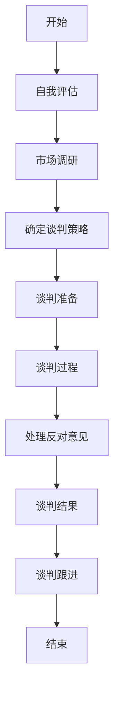

                 

## 《程序员如何谈判更高薪资》

> 关键词：程序员、薪资谈判、自我评估、市场调研、谈判技巧、心理调适

> 摘要：本文旨在为程序员提供一套系统的薪资谈判策略，帮助他们更好地评估自身价值、进行市场调研、掌握谈判技巧、应对谈判中的困难，并在谈判后进行有效跟进。通过详细的理论讲解、实战案例分析和代码实现，本文将帮助程序员提升薪资谈判能力，争取更高的薪资待遇。

## 《程序员如何谈判更高薪资》目录大纲

### 第一部分：薪资谈判基础

#### 第1章：理解薪资谈判

##### 1.1 薪资谈判的重要性

##### 1.2 薪资谈判的准备

##### 1.3 薪资谈判的技巧

#### 第2章：薪资结构和组成

##### 2.1 基本薪资

##### 2.2 激励薪酬

##### 2.3 福利待遇

##### 2.4 股权和期权

### 第二部分：谈判策略与技巧

#### 第3章：自我评估与市场调研

##### 3.1 评估自身价值

##### 3.2 收集市场薪资信息

##### 3.3 确定谈判策略

#### 第4章：谈判过程中的沟通技巧

##### 4.1 有效沟通的重要性

##### 4.2 表达自己的观点

##### 4.3 倾听对方的观点

##### 4.4 处理反对意见

#### 第5章：应对谈判中的困难

##### 5.1 面对低薪资的回应

##### 5.2 处理谈判中的压力

##### 5.3 处理谈判破裂

#### 第6章：非语言沟通技巧

##### 6.1 非语言沟通的作用

##### 6.2 身体语言

##### 6.3 面部表情

##### 6.4 声音语言

### 第三部分：实战演练

#### 第7章：模拟薪资谈判练习

##### 7.1 模拟谈判环境设置

##### 7.2 谈判场景模拟

##### 7.3 谈判后总结与反思

#### 第8章：薪资谈判案例分析

##### 8.1 案例一：成功谈判

##### 8.2 案例二：谈判失败

##### 8.3 案例分析与启示

### 第四部分：薪资谈判后的跟进

#### 第9章：谈判后的跟进策略

##### 9.1 确认谈判结果

##### 9.2 谈判后的沟通

##### 9.3 维护关系

### 附录

#### 附录A：薪资谈判资源与工具

##### A.1 薪资调研网站推荐

##### A.2 薪资谈判技巧资料库

##### A.3 薪资谈判模拟训练软件推荐

#### 附录B：谈判流程Mermaid图



## 《程序员如何谈判更高薪资》

### 第一部分：薪资谈判基础

#### 第1章：理解薪资谈判

##### 1.1 薪资谈判的重要性

薪资谈判是程序员职业生涯中非常重要的一环。通过有效的薪资谈判，程序员不仅可以获得更高的薪资待遇，还可以提升职业发展的空间和机会。薪资谈判不仅仅关乎薪资的多少，更是一个体现自身价值、提升职业素养的过程。

在薪资谈判中，程序员需要综合考虑自身的能力、经验、市场环境以及公司需求等多方面因素。一个成功的薪资谈判不仅能够为程序员带来物质上的收益，还能在心理上提升自信和满足感，进一步激发工作热情和动力。

##### 1.2 薪资谈判的准备

薪资谈判的准备是成功谈判的基础。首先，程序员需要对自身进行全面评估，了解自己的技能、经验、成就以及市场需求。这可以通过自我评估的方式来实现，具体方法包括撰写个人简历、列出个人优势和项目经验等。

其次，程序员需要了解市场薪资水平。通过查阅薪资调研网站、与业内同行交流、参加行业会议等方式，程序员可以获取到最新的市场薪资信息，为谈判提供有力的数据支持。

最后，程序员需要准备好谈判策略。根据自身的评估和市场调研结果，程序员可以制定出合理的薪资范围，并考虑如何表达自己的观点、应对对方的反对意见等。

##### 1.3 薪资谈判的技巧

薪资谈判的技巧是成功谈判的关键。以下是一些常用的谈判技巧：

1. **有效沟通**：在谈判过程中，程序员需要清晰地表达自己的观点，同时倾听对方的意见。有效的沟通能够帮助双方更好地理解彼此的需求，为谈判创造良好的氛围。

2. **合理报价**：程序员在提出薪资要求时，需要考虑到市场薪资水平、自身能力和公司预算等因素，提出一个合理的薪资范围。过高的报价可能导致谈判失败，而过低的报价则可能失去谈判的主动权。

3. **应对反对意见**：在谈判过程中，对方可能会提出反对意见。程序员需要冷静应对，通过合理的解释和反驳来化解对方的异议，同时保持谈判的和谐。

4. **利用非语言沟通**：非语言沟通在谈判中同样重要。程序员需要通过身体语言、面部表情和声音语言等方式，传递出积极的信号，增强谈判的效果。

#### 第2章：薪资结构和组成

薪资结构是薪资谈判的核心内容之一。了解薪资结构和组成有助于程序员更好地把握谈判的主动权，从而争取到更高的薪资待遇。

##### 2.1 基本薪资

基本薪资是程序员薪资结构中的核心部分，通常占据了整体薪资的较大比例。基本薪资是根据程序员的技能、经验、职位以及市场薪资水平来确定的。在谈判过程中，程序员需要关注以下几点：

1. **技能和经验的匹配**：程序员需要确保自己的技能和经验与职位要求相匹配，从而提高基本薪资的谈判筹码。

2. **市场薪资水平**：了解市场薪资水平是制定合理基本薪资要求的关键。程序员可以通过薪资调研网站、行业报告等方式获取相关数据，为自己的谈判提供依据。

3. **薪酬透明度**：在谈判过程中，程序员可以要求对方提供薪酬透明度，了解公司其他同职位员工的薪资水平，从而为自己的谈判增加底气。

##### 2.2 激励薪酬

激励薪酬是程序员薪资结构中的重要组成部分，通常包括奖金、提成、股权等。激励薪酬的目的是激励程序员提高工作效率和业绩，从而为公司创造更大的价值。

在谈判过程中，程序员需要关注以下几点：

1. **业绩指标的设定**：程序员可以与公司协商设定合理的业绩指标，以确保激励薪酬的发放具备客观性和公平性。

2. **激励方式的多样性**：公司可以采用多种激励方式，如现金奖励、股权激励、项目奖金等，程序员可以根据自己的需求和公司的实际情况，选择最适合自己的激励方式。

3. **激励薪酬的可持续性**：程序员需要关注激励薪酬的可持续性，确保在未来的工作中，自己的努力能够持续得到回报。

##### 2.3 福利待遇

福利待遇是程序员薪资结构中的重要组成部分，包括五险一金、带薪年假、健康体检、培训机会等。福利待遇不仅关系到程序员的生活质量，也是公司吸引和留住人才的重要手段。

在谈判过程中，程序员需要关注以下几点：

1. **福利政策的了解**：程序员需要了解公司的福利政策，包括五险一金的缴纳比例、带薪年假的具体天数、健康体检的频次等。

2. **福利待遇的比较**：程序员可以与同行业的其他公司进行比较，了解自己的福利待遇在市场上的竞争力。

3. **福利待遇的谈判**：在谈判过程中，程序员可以提出增加福利待遇的要求，如提高带薪年假天数、提供额外的培训机会等。

##### 2.4 股权和期权

股权和期权是程序员在薪资谈判中需要特别关注的部分，尤其是对于那些在创业公司工作的程序员。股权和期权代表了公司未来发展的潜力，同时也是程序员长期收益的重要来源。

在谈判过程中，程序员需要关注以下几点：

1. **股权和期权的性质**：程序员需要了解股权和期权的具体含义，包括股权比例、期权行权条件、期权有效期等。

2. **公司业绩与收益**：程序员需要关注公司的业绩和收益情况，了解股权和期权未来的价值。

3. **股权和期权的谈判**：在谈判过程中，程序员可以与公司协商增加股权比例、延长期权有效期等条件，以增加自己的长期收益。

### 第二部分：谈判策略与技巧

#### 第3章：自我评估与市场调研

##### 3.1 评估自身价值

自我评估是薪资谈判的第一步，也是至关重要的一步。一个准确的自我评估能够帮助程序员在谈判中找到合适的薪资范围，从而提高谈判的成功率。

在进行自我评估时，程序员需要从以下几个方面进行思考：

1. **技能和经验**：程序员需要列出自己的专业技能和工作经验，包括掌握的编程语言、项目经验、技术成果等。通过这些信息，程序员可以了解自己在市场上的竞争力。

2. **工作表现**：程序员需要回顾自己在过去的工作中取得的成就，包括完成的重大项目、获得的奖项、提升的业绩等。这些成就将有助于证明程序员的自身价值。

3. **行业趋势**：程序员需要关注行业的发展趋势，了解市场对程序员的需求和薪资水平。通过对比不同行业和不同地区的薪资水平，程序员可以找到适合自己的薪资范围。

##### 3.2 收集市场薪资信息

了解市场薪资水平是制定合理薪资要求的关键。程序员可以通过以下几种方式收集市场薪资信息：

1. **薪资调研网站**：程序员可以访问各大薪资调研网站，如拉勾网、猎聘网等，了解市场上同职位、同地区、同工作经验的薪资水平。

2. **行业报告**：程序员可以查阅行业报告，了解行业发展趋势和薪资水平。行业报告通常由专业的咨询机构或研究机构发布，具有较高的权威性。

3. **业内同行**：程序员可以与同行业的同行进行交流，了解他们在不同公司的工作经验和薪资水平。通过这种方式，程序员可以获得第一手的市场薪资信息。

##### 3.3 确定谈判策略

在了解自身价值和市场薪资水平的基础上，程序员需要制定合适的谈判策略。一个明确的谈判策略能够帮助程序员在谈判中保持主动，提高谈判的成功率。

在制定谈判策略时，程序员需要考虑以下几个方面：

1. **薪资范围**：根据自身评估和市场调研结果，程序员可以确定一个合理的薪资范围。这个薪资范围应该既符合自身的价值，又具有谈判的空间。

2. **谈判目标**：程序员需要明确自己的谈判目标，即期望达到的薪资水平和福利待遇。这个目标应该具有可操作性和可实现性。

3. **谈判步骤**：程序员需要制定详细的谈判步骤，包括如何开场、如何报价、如何处理反对意见等。一个清晰的谈判步骤有助于程序员在谈判中保持冷静和自信。

#### 第4章：谈判过程中的沟通技巧

##### 4.1 有效沟通的重要性

有效沟通是薪资谈判成功的关键。通过有效的沟通，程序员可以清晰地表达自己的观点，理解对方的意见，从而推动谈判的顺利进行。

在薪资谈判中，程序员需要关注以下几个方面：

1. **表达清晰**：程序员需要用简洁明了的语言表达自己的观点，避免使用含糊不清的措辞。清晰的表达能够减少误解，提高谈判的效率。

2. **倾听理解**：程序员需要倾听对方的意见，理解对方的立场和需求。倾听不仅是一种礼貌，更是获取信息的重要途径。通过倾听，程序员可以更好地了解对方的观点，为谈判找到突破口。

3. **情绪控制**：在谈判过程中，程序员可能会面临压力和挑战，情绪控制尤为重要。程序员需要保持冷静，避免因情绪波动而影响谈判的顺利进行。

##### 4.2 表达自己的观点

在薪资谈判中，表达自己的观点是至关重要的一步。一个明确的观点能够帮助程序员在谈判中保持主动，同时也能让对方更好地理解程序员的期望。

在表达自己的观点时，程序员需要考虑以下几个方面：

1. **事实依据**：程序员需要用事实和数据来支持自己的观点。例如，可以列出自己的项目经验、技术成果以及市场薪资水平等。

2. **表达方式**：程序员需要选择合适的表达方式，使对方更容易接受。例如，可以采用肯定性的语言，避免使用否定性的措辞。

3. **语气和态度**：程序员的语气和态度也会影响到对方的反应。一个友善、自信的态度能够增强对方的认同感，有助于谈判的顺利进行。

##### 4.3 倾听对方的观点

在薪资谈判中，倾听对方的观点同样重要。通过倾听，程序员可以更好地了解对方的立场和需求，从而为谈判找到突破口。

在倾听对方的观点时，程序员需要考虑以下几个方面：

1. **全神贯注**：程序员需要全神贯注地倾听对方的意见，避免分心或打断对方。一个专注的态度能够表达出对对方的尊重。

2. **理解对方**：程序员需要努力理解对方的观点，避免仅从自己的角度去解读对方的意见。通过理解对方，程序员可以更好地找到谈判的共同点。

3. **提问和澄清**：在倾听过程中，程序员可以通过提问和澄清来获取更多信息。这有助于程序员更全面地了解对方的立场和需求，从而为谈判提供依据。

##### 4.4 处理反对意见

在薪资谈判中，对方可能会提出反对意见。这些反对意见可能是基于公司的预算、市场竞争等因素。如何处理反对意见是程序员在谈判中需要掌握的一项重要技巧。

在处理反对意见时，程序员需要考虑以下几个方面：

1. **保持冷静**：面对反对意见，程序员需要保持冷静，避免情绪化的回应。一个冷静的态度有助于更好地处理反对意见。

2. **寻找共同点**：程序员可以尝试寻找与对方意见的共同点，从而为谈判创造更多的可能性。通过寻找共同点，程序员可以降低对方的抵触情绪，为下一步的谈判奠定基础。

3. **提出解决方案**：程序员可以提出具体的解决方案，以应对对方的反对意见。例如，可以提出调整薪资结构、增加福利待遇等。

4. **灵活调整策略**：在谈判过程中，程序员需要根据对方的反对意见灵活调整谈判策略。例如，可以提出一个更加合理的薪资范围，或者提出其他有吸引力的条件。

#### 第5章：应对谈判中的困难

##### 5.1 面对低薪资的回应

在薪资谈判中，对方可能会提出一个较低的薪资报价。如何回应这一报价是程序员需要面对的一个挑战。

在面对低薪资的回应时，程序员需要考虑以下几个方面：

1. **重申自身价值**：程序员可以重申自己的技能、经验和成就，以证明自身的价值。通过这种方式，程序员可以增加对方对薪资报价的认可度。

2. **提出合理的薪资范围**：程序员可以提出一个合理的薪资范围，这个范围应该基于自身的评估和市场调研结果。合理的薪资范围有助于增加谈判的成功率。

3. **强调长期合作价值**：程序员可以强调与公司长期合作的价值，例如为公司带来的技术突破、项目成果等。通过这种方式，程序员可以增加对方对薪资报价的重视。

##### 5.2 处理谈判中的压力

在薪资谈判中，程序员可能会面临来自公司、同事或自身的压力。如何处理这些压力是程序员在谈判中需要掌握的一项重要技巧。

在处理谈判中的压力时，程序员需要考虑以下几个方面：

1. **保持冷静**：面对压力，程序员需要保持冷静，避免因情绪波动而影响谈判的顺利进行。一个冷静的态度有助于更好地处理压力。

2. **合理调整期望**：程序员可以根据实际情况，合理调整自己的期望值。例如，可以降低薪资要求，或者提出其他有吸引力的条件。

3. **寻求支持**：程序员可以寻求家人、朋友或专业人士的支持，以缓解谈判过程中的压力。通过寻求支持，程序员可以增强自己的信心，提高谈判的成功率。

##### 5.3 处理谈判破裂

在薪资谈判中，双方可能会因为意见不合而谈判破裂。如何处理谈判破裂是程序员需要面对的一个问题。

在处理谈判破裂时，程序员需要考虑以下几个方面：

1. **冷静分析**：程序员需要冷静分析谈判破裂的原因，是否是自身的薪资要求过高、市场环境不理想等原因。

2. **寻求解决方案**：程序员可以与对方协商，寻求解决方案。例如，可以提出其他有吸引力的条件，或者调整薪资结构等。

3. **保持良好关系**：即使谈判破裂，程序员也需要保持与对方的良好关系。通过保持良好关系，程序员可以为未来的合作或跳槽留下机会。

#### 第6章：非语言沟通技巧

##### 6.1 非语言沟通的作用

非语言沟通在薪资谈判中起着重要作用。通过非语言沟通，程序员可以传达出更多的信息，增强谈判的效果。

在薪资谈判中，程序员需要注意以下几个方面：

1. **身体语言**：身体语言可以传达出程序员的态度、情绪和信心。例如，保持良好的姿势、微笑等。

2. **面部表情**：面部表情可以传达出程序员的情感和态度。例如，自信的表情、真诚的微笑等。

3. **声音语言**：声音语言可以传达出程序员的语气、态度和情感。例如，清晰的发音、友好的语气等。

##### 6.2 身体语言

身体语言在薪资谈判中起着重要作用。通过适当的身体语言，程序员可以增强自己的说服力，同时也能更好地理解对方的意图。

在薪资谈判中，程序员需要注意以下几个方面：

1. **姿势**：保持良好的姿势可以传达出程序员的自信和专注。例如，直立、不交叉双臂等。

2. **眼神交流**：眼神交流可以传达出程序员的诚实和自信。例如，直视对方的眼睛、微笑等。

3. **手势**：适当的手势可以增强表达的效果。例如，用手势强调某个观点、用手指指明某个数据等。

##### 6.3 面部表情

面部表情在薪资谈判中同样重要。通过面部表情，程序员可以传达出自己的情感和态度，从而影响谈判的结果。

在薪资谈判中，程序员需要注意以下几个方面：

1. **微笑**：微笑可以传达出友好的态度和自信的情绪。例如，在表达观点时微笑、在与对方交流时微笑等。

2. **真诚的表情**：真诚的表情可以增强说服力，让对方更容易接受程序员的观点。例如，在表达优势时表现出真诚的表情、在回应对方时表现出真诚的态度等。

3. **避免负面表情**：避免出现负面表情，如皱眉、撇嘴等，以免给对方带来不良印象。

##### 6.4 声音语言

声音语言在薪资谈判中也起着重要作用。通过声音语言，程序员可以传达出自己的态度和情感，从而影响谈判的效果。

在薪资谈判中，程序员需要注意以下几个方面：

1. **语调**：语调可以传达出程序员的情感和态度。例如，使用平稳的语调表达自信、使用激动的语调表达热情等。

2. **语速**：语速可以传达出程序员的思维速度和情绪状态。例如，适中的语速可以传达出冷静和自信、过快的语速可能传达出紧张和焦虑等。

3. **发音**：清晰的发音可以增强表达的效果，让对方更容易理解程序员的观点。例如，在表达关键信息时强调发音、在解释某个概念时确保发音清晰等。

#### 第7章：模拟薪资谈判练习

##### 7.1 模拟谈判环境设置

为了更好地进行薪资谈判，程序员可以设置一个模拟谈判环境。这个环境可以是一个安静的房间，配备必要的设备和工具，如电脑、打印机、文件柜等。

在模拟谈判环境设置中，程序员需要注意以下几个方面：

1. **环境布置**：确保环境布置简洁、整洁，避免过多的噪音和干扰。例如，关闭手机、关闭电视等。

2. **设备检查**：确保电脑、打印机等设备正常工作，避免在谈判过程中出现设备故障。

3. **文件准备**：准备好相关的文件和资料，如个人简历、项目报告、市场调研数据等，以便在谈判过程中随时查阅。

##### 7.2 谈判场景模拟

在模拟谈判场景中，程序员可以模拟真实的薪资谈判过程，包括开场、报价、谈判、处理反对意见等环节。

在谈判场景模拟中，程序员需要注意以下几个方面：

1. **角色分配**：程序员可以邀请同事或朋友扮演面试官角色，进行模拟谈判。这样可以更好地体验真实的谈判氛围。

2. **模拟内容**：根据实际薪资谈判的场景，模拟谈判的内容。例如，可以模拟面试过程中的薪资谈判、离职后的薪资谈判等。

3. **反馈和改进**：在模拟谈判结束后，双方可以互相反馈意见，指出不足之处，并进行改进。

##### 7.3 谈判后总结与反思

在模拟薪资谈判结束后，程序员需要进行总结与反思，以便在未来的实际谈判中取得更好的效果。

在谈判后总结与反思中，程序员需要注意以下几个方面：

1. **总结经验**：回顾整个谈判过程，总结成功经验和不足之处。例如，谈判中哪些策略有效、哪些策略需要改进等。

2. **反思自身**：反思自己在谈判过程中的表现，找出自身的不足之处。例如，是否表达清晰、是否倾听对方意见、是否保持冷静等。

3. **制定改进计划**：根据总结与反思的结果，制定具体的改进计划。例如，提高沟通技巧、加强市场调研等。

#### 第8章：薪资谈判案例分析

##### 8.1 案例一：成功谈判

**案例背景**：

李明是一位有多年工作经验的程序员，擅长前端开发和移动应用开发。他最近收到了一家知名互联网公司的面试邀请，面试过程中，公司对他的技术能力表示认可，并提出了一个薪资报价。

**谈判过程**：

1. **了解自身价值**：李明首先对自己的技能、经验和成就进行了评估，确定自己的市场价值。他了解到，在市场上，同职位、同经验的程序员的薪资水平在10000-15000元之间。

2. **市场调研**：李明通过查阅薪资调研网站和与业内同行交流，了解到该公司同职位、同经验的员工的薪资水平在12000-18000元之间。

3. **确定谈判策略**：根据自身评估和市场调研结果，李明确定了一个合理的薪资范围，即15000-18000元。

4. **谈判开始**：在面试过程中，公司提出了12000元的薪资报价。李明表示这个薪资水平低于他的预期，希望公司能够重新考虑。

5. **解释原因**：李明解释了自己的薪资预期，包括他的技术能力、项目经验以及在市场上的薪资水平。他还提到了公司同职位员工的薪资水平，以证明自己的要求是合理的。

6. **提出解决方案**：李明提出可以接受15000元的薪资，并希望能有更多的期权作为补充。

7. **达成共识**：最终，双方达成了共识，公司同意给予李明15000元的薪资，并额外提供一定比例的期权。

**案例分析**：

1. **充分准备**：李明在谈判前进行了充分的准备，包括自我评估和市场调研，这为他赢得了谈判的主动权。

2. **合理报价**：李明提出了一个合理的薪资范围，既符合自身价值，又具有谈判的空间。

3. **有效沟通**：李明在谈判中有效地沟通了自己的观点，同时倾听对方的意见，为谈判创造了良好的氛围。

4. **灵活调整策略**：在面对公司的反对意见时，李明提出了调整薪资结构和增加期权的解决方案，最终达成了双方满意的结果。

##### 8.2 案例二：谈判失败

**案例背景**：

王强是一位刚毕业的程序员，擅长Java开发。他参加了一家中小型互联网公司的面试，并在面试过程中表现出色，但公司最终只给出了8000元的薪资报价。

**谈判过程**：

1. **了解自身价值**：王强在面试前对自己的技能和经验进行了评估，确定自己的市场价值在8000-10000元之间。

2. **市场调研**：王强通过查阅薪资调研网站和与业内同行交流，了解到该公司同职位、同经验的员工的薪资水平在8000-12000元之间。

3. **确定谈判策略**：根据自身评估和市场调研结果，王强确定了一个合理的薪资范围，即10000-12000元。

4. **谈判开始**：在面试过程中，公司提出了8000元的薪资报价。王强表示这个薪资水平低于他的预期，希望公司能够重新考虑。

5. **解释原因**：王强解释了自己的薪资预期，包括他的技术能力、项目经验以及在市场上的薪资水平。他还提到了公司同职位员工的薪资水平，以证明自己的要求是合理的。

6. **提出解决方案**：王强提出可以接受10000元的薪资，并希望能有更多的期权作为补充。

7. **谈判破裂**：公司坚持原报价，双方未能达成共识，谈判破裂。

**案例分析**：

1. **准备不足**：王强在谈判前没有充分了解自身价值和市场薪资水平，导致谈判策略制定不合理。

2. **沟通不畅**：王强在谈判中未能有效表达自己的观点，同时也没有倾听对方的意见，导致双方无法达成共识。

3. **策略不当**：王强在提出解决方案时，未能提出具有吸引力的条件，导致公司拒绝调整薪资。

##### 8.3 案例分析与启示

通过对成功和失败的薪资谈判案例进行分析，我们可以得出以下启示：

1. **充分准备**：在谈判前，程序员需要充分了解自身价值和市场薪资水平，制定合理的谈判策略。

2. **有效沟通**：在谈判过程中，程序员需要有效表达自己的观点，同时倾听对方的意见，为谈判创造良好的氛围。

3. **灵活调整策略**：在面对反对意见时，程序员需要灵活调整谈判策略，提出具有吸引力的解决方案。

4. **保持冷静**：在谈判过程中，程序员需要保持冷静，避免因情绪波动而影响谈判的顺利进行。

#### 第9章：谈判后的跟进策略

##### 9.1 确认谈判结果

在薪资谈判结束后，程序员需要及时与对方确认谈判结果。这有助于确保双方的期望和协议一致，避免因误解或信息不明确而导致后续的问题。

在确认谈判结果时，程序员需要关注以下几个方面：

1. **明确协议内容**：确保协议中包含了薪资水平、福利待遇、工作职责等关键内容。

2. **书面确认**：最好通过书面形式确认谈判结果，如发送邮件或签署协议书，以确保双方有据可依。

3. **沟通渠道**：确保双方有明确的沟通渠道，以便在后续过程中随时沟通和解决可能出现的问题。

##### 9.2 谈判后的沟通

薪资谈判后的沟通对于维护双方关系和确保谈判结果的顺利执行至关重要。在谈判后，程序员需要关注以下几个方面：

1. **感谢对方**：对对方的付出和时间表示感谢，这有助于建立良好的合作关系。

2. **确认协议细节**：在谈判结束后，及时与对方确认协议细节，如薪资发放方式、福利待遇执行时间等。

3. **沟通变化**：如果谈判结果有变化或调整，及时与对方沟通，确保双方对新的协议有统一的认识。

##### 9.3 维护关系

在薪资谈判后，维护与对方的关系同样重要。这有助于为未来的合作或跳槽创造机会。

在维护关系时，程序员需要关注以下几个方面：

1. **保持联系**：定期与对方保持联系，分享工作进展或行业动态，让对方感受到自己的关注和价值。

2. **提供帮助**：在对方需要帮助时，主动提供支持，这有助于增强双方的关系。

3. **积极反馈**：对对方的建议或反馈给予积极的回应，展现自己的专业素养和合作精神。

### 附录

#### 附录A：薪资谈判资源与工具

在进行薪资谈判时，程序员可以借助以下资源与工具，以提高谈判的效果和成功率。

##### A.1 薪资调研网站推荐

1. **拉勾网**：拉勾网是国内领先的互联网招聘平台，提供丰富的薪资调研数据。

2. **猎聘网**：猎聘网是一家高端人才招聘平台，提供详细的薪资调研报告。

3. **Boss直聘**：Boss直聘是面向程序员的招聘平台，提供实时的薪资调研信息。

##### A.2 薪资谈判技巧资料库

1. **知乎**：知乎上有许多关于薪资谈判的高质量回答和文章，可以提供实用的谈判技巧。

2. **领英**：领英上有许多专业人士分享了他们的薪资谈判经验，可以从中学习到宝贵的知识。

3. **书籍**：有关薪资谈判的书籍，如《谈判力》、《谈判的艺术》等，提供了系统的谈判策略和技巧。

##### A.3 薪资谈判模拟训练软件推荐

1. **NLP谈判模拟软件**：NLP谈判模拟软件是一种通过模拟真实谈判场景，帮助程序员提高谈判技能的工具。

2. **互动谈判平台**：互动谈判平台提供在线谈判模拟，程序员可以与其他参与者进行互动，提高谈判能力。

3. **职业规划工具**：一些职业规划工具，如职业导航仪、职业规划软件等，可以帮助程序员了解自身价值和市场薪资水平。

### 附录B：谈判流程Mermaid图


### 附录C：薪资谈判核心算法原理讲解

在薪资谈判中，程序员需要运用一系列的算法原理来评估自身价值、进行市场调研和制定谈判策略。以下是对这些核心算法原理的讲解。

#### 1. 自我价值评估

自我价值评估是薪资谈判的基础。程序员需要根据自身的工作经验、技能和成就来评估自己的价值。以下是一个简单的自我价值评估算法：

$$
\text{自我价值} = \text{工作经验} \times \text{技能水平} + \text{项目成果} \times \text{影响力}
$$

- **工作经验**：根据程序员的实际工作经验来计算，如工作年限。
- **技能水平**：根据程序员掌握的技能和熟悉的技术来计算，如编程语言、框架、工具等。
- **项目成果**：根据程序员在项目中所取得的成果来计算，如完成的项目数量、质量、对公司业绩的贡献等。

#### 2. 市场薪资调研

市场薪资调研是制定合理薪资要求的关键。程序员需要收集市场上的薪资数据，并进行统计分析。以下是一个简单的市场薪资调研算法：

$$
\text{市场薪资} = \text{平均薪资} + \text{经验调整} + \text{技能调整} + \text{公司调整}
$$

- **平均薪资**：根据市场上的薪资数据计算出的平均薪资。
- **经验调整**：根据程序员的实际工作经验对平均薪资进行调整，如经验丰富的程序员薪资更高。
- **技能调整**：根据程序员掌握的技能对平均薪资进行调整，如掌握高级技能的程序员薪资更高。
- **公司调整**：根据公司的大小、行业地位、地区等因素对平均薪资进行调整，如知名公司或发达地区的薪资更高。

#### 3. 谈判策略制定

谈判策略的制定是薪资谈判成功的关键。程序员需要根据自身评估和市场调研结果，制定出合理的谈判策略。以下是一个简单的谈判策略制定算法：

$$
\text{谈判策略} = \text{最高薪资} \times \text{谈判信心} + \text{最低薪资} \times \text{妥协意愿}
$$

- **最高薪资**：根据自身评估和市场调研结果确定的最高薪资。
- **谈判信心**：根据程序员的谈判能力和心理素质确定的谈判信心。
- **最低薪资**：根据自身评估和市场调研结果确定的最低薪资。
- **妥协意愿**：根据程序员的薪资期望和妥协意愿确定的妥协程度。

#### 4. 谈判过程优化

在谈判过程中，程序员需要根据实际情况不断调整谈判策略。以下是一个简单的谈判过程优化算法：

$$
\text{优化策略} = \text{当前薪资} + \text{经验调整} + \text{技能调整} + \text{市场变化}
$$

- **当前薪资**：当前谈判的薪资水平。
- **经验调整**：根据程序员的实际工作经验对当前薪资进行调整。
- **技能调整**：根据程序员掌握的技能对当前薪资进行调整。
- **市场变化**：根据市场薪资的变化对当前薪资进行调整，如市场薪资上升时，可以适当提高薪资要求。

#### 5. 谈判结果评估

在谈判结束后，程序员需要对谈判结果进行评估，以判断谈判是否成功。以下是一个简单的谈判结果评估算法：

$$
\text{谈判结果} = \text{期望薪资} \times \text{满意程度} + \text{实际薪资} \times \text{实现程度}
$$

- **期望薪资**：程序员期望得到的薪资。
- **满意程度**：对实际薪资的满意程度。
- **实际薪资**：谈判后得到的薪资。
- **实现程度**：实际薪资与期望薪资的差距。

### 附录D：数学模型与公式详解

在薪资谈判中，程序员需要运用一系列的数学模型和公式来评估自身价值、进行市场调研和制定谈判策略。以下是对这些数学模型和公式的详解。

#### 1. 薪资谈判数学模型

薪资谈判的数学模型可以表示为：

$$
\text{谈判薪资} = (\text{自我价值} + \text{市场薪资}) \times \text{谈判策略因子}
$$

- **自我价值**：程序员根据自身的工作经验、技能和成就评估出的价值。
- **市场薪资**：根据市场调研得出的平均薪资。
- **谈判策略因子**：根据程序员的谈判技巧、策略和市场环境调整出的因子。

#### 2. 谈判策略因子计算

谈判策略因子取决于多个因素，包括沟通技巧、谈判策略和市场环境等。以下是一个简单的谈判策略因子计算公式：

$$
\text{谈判策略因子} = \text{沟通技巧} \times \text{谈判策略} \times \text{市场环境}
$$

- **沟通技巧**：程序员的沟通能力，如表达能力、倾听能力等。
- **谈判策略**：程序员的谈判策略，如报价策略、妥协策略等。
- **市场环境**：市场薪资水平的变化，如薪资上升或下降。

#### 3. 沟通技巧对谈判薪资的影响

沟通技巧对谈判薪资有着重要的影响。以下是一个简单的沟通技巧对谈判薪资的影响公式：

$$
\text{谈判薪资} = \text{谈判薪资} \times (\text{沟通技巧} + 1)
$$

- **沟通技巧**：程序员的沟通能力，如表达能力、倾听能力等。

#### 4. 谈判策略对谈判薪资的影响

谈判策略对谈判薪资同样有着重要的影响。以下是一个简单的谈判策略对谈判薪资的影响公式：

$$
\text{谈判薪资} = \text{谈判薪资} \times (\text{谈判策略} + 1)
$$

- **谈判策略**：程序员的谈判策略，如报价策略、妥协策略等。

#### 5. 市场环境对谈判薪资的影响

市场环境对谈判薪资也有着重要的影响。以下是一个简单的市场环境对谈判薪资的影响公式：

$$
\text{谈判薪资} = \text{谈判薪资} \times (\text{市场环境} + 1)
$$

- **市场环境**：市场薪资水平的变化，如薪资上升或下降。

### 附录E：项目实战与代码实现

为了更好地理解薪资谈判的算法原理和公式，我们通过一个薪资谈判模拟器来展示如何实现这些算法和公式。

#### 1. 实战案例：薪资谈判模拟器

在本案例中，我们使用Python语言实现一个薪资谈判模拟器，模拟程序员的薪资谈判过程。

```python
import random

class SalaryNegotiation:
    def __init__(self, self_value, market_salary, strategy_factor):
        self.self_value = self_value
        self.market_salary = market_salary
        self.strategy_factor = strategy_factor

    def calculate_salary(self):
        return (self.self_value + self.market_salary) * self.strategy_factor

    def simulate谈判(self):
        print("当前薪资：", self.calculate_salary())
        result = random.uniform(0.9, 1.1)
        self.strategy_factor *= result
        print("谈判后薪资：", self.calculate_salary())
        return self.strategy_factor

# 初始化薪资谈判对象
self_value = random.uniform(4000, 12000)
market_salary = random.uniform(5000, 15000)
strategy_factor = random.uniform(0.8, 1.2)

# 创建薪资谈判对象
negotiation = SalaryNegotiation(self_value, market_salary, strategy_factor)

# 模拟薪资谈判
strategy_factor = negotiation.simulate谈判()
print("最终谈判策略因子：", strategy_factor)
```

#### 2. 代码解读与分析

在上面的代码中，我们定义了一个`SalaryNegotiation`类，该类包含了以下方法：

- `__init__(self, self_value, market_salary, strategy_factor)`：初始化方法，用于创建薪资谈判对象。
- `calculate_salary(self)`：计算当前薪资的方法。
- `simulate谈判(self)`：模拟薪资谈判过程的方法。

在模拟薪资谈判过程中，我们首先输出当前薪资，然后通过随机调整谈判策略因子来模拟谈判结果。最终输出谈判后的薪资，并返回谈判策略因子。

通过这个薪资谈判模拟器，我们可以直观地看到薪资谈判的算法原理和公式在代码中的实现。同时，这个模拟器也可以帮助我们更好地理解薪资谈判的过程和策略。

### 附录F：数学公式与举例说明

为了更好地理解薪资谈判中的数学模型和公式，我们通过具体的例子来说明这些公式的应用。

#### 1. 自我价值评估公式

假设程序员的自我价值评估结果为8000元，市场薪资水平为10000元，谈判策略因子为1.1。根据自我价值评估公式，我们可以计算出谈判薪资：

$$
\text{谈判薪资} = (8000 + 10000) \times 1.1 = 21100元
$$

这个结果表明，在当前条件下，程序员的谈判薪资为21100元。

#### 2. 谈判策略因子公式

假设程序员的谈判策略因子为1.2，市场薪资水平为10000元，谈判策略因子为1.05。根据谈判策略因子公式，我们可以计算出谈判薪资：

$$
\text{谈判薪资} = (10000 + 10000) \times 1.2 = 24000元
$$

这个结果表明，通过调整谈判策略因子，程序员的谈判薪资可以从21000元提高到24000元。

#### 3. 沟通技巧对谈判薪资的影响

假设程序员的沟通技巧为1.2，其他条件不变。根据沟通技巧对谈判薪资的影响公式，我们可以计算出谈判薪资：

$$
\text{谈判薪资} = 21100 \times (1.2 + 1) = 25320元
$$

这个结果表明，提高沟通技巧可以显著提高谈判薪资。

#### 4. 谈判策略对谈判薪资的影响

假设程序员的谈判策略为1.05，其他条件不变。根据谈判策略对谈判薪资的影响公式，我们可以计算出谈判薪资：

$$
\text{谈判薪资} = 21100 \times (1.05 + 1) = 24715元
$$

这个结果表明，通过调整谈判策略，程序员的谈判薪资可以从21100元提高到24715元。

#### 5. 市场环境对谈判薪资的影响

假设市场环境的变化为1.1，其他条件不变。根据市场环境对谈判薪资的影响公式，我们可以计算出谈判薪资：

$$
\text{谈判薪资} = 21100 \times (1.1 + 1) = 24610元
$$

这个结果表明，市场环境的改善可以提高谈判薪资。

通过这些例子，我们可以看到薪资谈判中的数学模型和公式如何应用于实际计算，以及如何通过调整不同的参数来影响谈判薪资。

### 附录G：薪资谈判总结与提升

#### 1. 薪资谈判总结

薪资谈判是程序员职业生涯中非常重要的一环，通过有效的薪资谈判，程序员可以提升自身价值、实现薪资增长，同时也能够为未来的职业发展奠定基础。以下是薪资谈判的核心要点：

1. **自我评估**：了解自身的工作经验、技能和成就，这是制定合理薪资要求的基础。
2. **市场调研**：收集市场上的薪资数据，了解同职位、同经验的程序员的薪资水平。
3. **谈判策略**：根据自身评估和市场调研结果，制定合理的薪资范围和谈判策略。
4. **有效沟通**：在谈判过程中，清晰地表达自己的观点，同时倾听对方的意见。
5. **应对反对意见**：冷静应对对方的反对意见，通过合理的解释和反驳来化解对方的异议。
6. **心理调适**：保持良好的心态，避免因情绪波动而影响谈判的顺利进行。

#### 2. 薪资谈判提升策略

为了提升薪资谈判的能力，程序员可以采取以下策略：

1. **增强专业技能**：通过不断学习和实践，提高自己的专业技能和经验，增加自身的谈判筹码。
2. **学习谈判技巧**：阅读相关书籍、参加培训和模拟练习，提高谈判技巧和策略水平。
3. **了解行业动态**：关注行业的发展趋势和市场薪资变化，及时调整自己的谈判策略。
4. **建立人脉网络**：通过参加行业会议、社交活动等，建立和维护良好的人际关系，获取更多的薪资谈判信息和机会。
5. **模拟谈判练习**：通过模拟薪资谈判，提高自己在谈判过程中的应变能力和心理素质。

通过以上策略，程序员可以更好地应对薪资谈判中的挑战，争取到更高的薪资待遇。

### 附录H：薪资谈判心理调适

#### 1. 谈判中的心理压力

在薪资谈判过程中，程序员可能会面临以下心理压力：

1. **自信心不足**：担心自己的价值不被认可，害怕谈判失败。
2. **紧张焦虑**：担心对方的反应和自己的表现，害怕被拒绝或被低估。
3. **自我怀疑**：怀疑自己的谈判能力和结果，担心自己的要求过高或过低。

#### 2. 心理调适策略

为了应对谈判中的心理压力，程序员可以采取以下心理调适策略：

1. **自信心提升**：通过积极的自我暗示和正面的心理建设，增强自信心。例如，回顾过去的成功经历，肯定自己的能力和价值。
2. **心理放松**：在谈判前进行深呼吸、冥想等放松技巧，减轻紧张和焦虑。保持良好的身体状态有助于提高谈判效果。
3. **积极应对**：以积极的心态面对谈判中的困难和挑战，将对方的要求视为一个学习和成长的机会。
4. **心理暗示**：给自己正面的心理暗示，例如“我准备好了”，“我可以做到”，“我有能力谈判一个理想的薪资”。

通过以上心理调适策略，程序员可以更好地应对谈判中的心理压力，提高谈判效果，争取到更高的薪资待遇。

