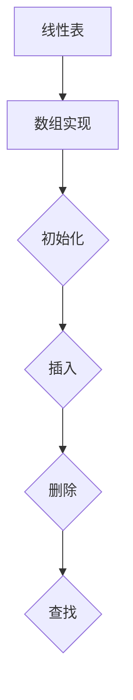
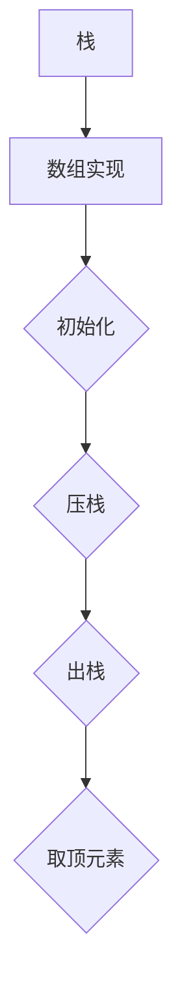
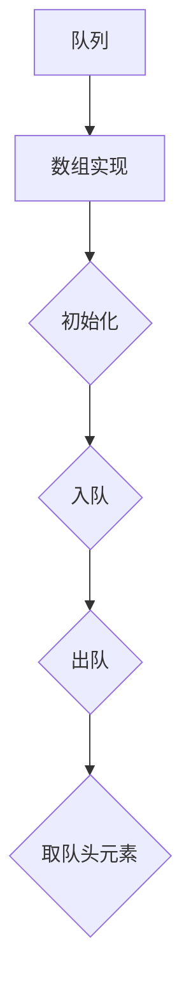
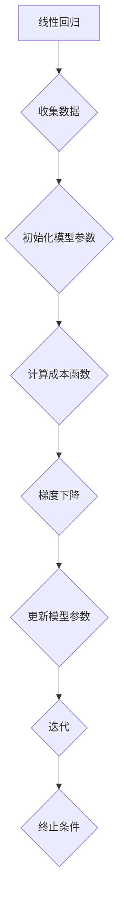
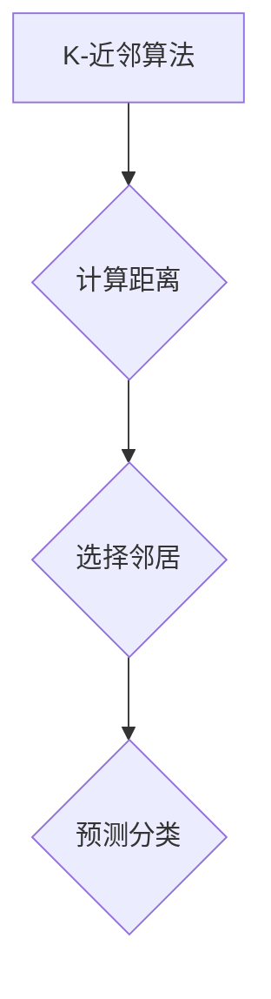

                 

# 文章标题：程序员如何进行职业规划

> 关键词：职业规划、程序员、职业发展、技能提升、晋升路径

> 摘要：本文旨在为程序员提供一套系统的职业规划指南，帮助他们在职业生涯中做出明智的决策，实现个人价值和职业成就。文章从职业规划的基础知识、自我认知、市场分析、职业发展策略、职业晋升、职场适应以及实战案例等方面进行详细阐述，旨在为广大程序员提供实用的参考和建议。

<h1>《程序员如何进行职业规划》目录大纲</h1>

## 第一部分：职业规划基础

### 第1章：职业规划概述

#### 1.1 职业规划的重要性

#### 1.2 职业规划的原则

#### 1.3 职业规划的步骤

### 第2章：自我认知

#### 2.1 性格与职业匹配

#### 2.2 能力与技能评估

#### 2.3 职业价值观与目标设定

### 第3章：市场分析

#### 3.1 行业发展趋势

#### 3.2 市场需求与竞争态势

#### 3.3 职业机会与挑战

## 第二部分：职业发展策略

### 第4章：技能提升

#### 4.1 技术能力培养

#### 4.2 沟通能力提升

#### 4.3 领导力与团队协作

### 第5章：职场规划

#### 5.1 初级程序员职业规划

#### 5.2 中级程序员职业规划

#### 5.3 高级程序员职业规划

### 第6章：职业晋升

#### 6.1 职位晋升路径

#### 6.2 晋升准备与策略

#### 6.3 晋升过程中的挑战与应对

### 第7章：职场适应

#### 7.1 职场文化与适应

#### 7.2 职场压力与调节

#### 7.3 职场危机应对

## 第三部分：实战案例与心得分享

### 第8章：程序员职业规划案例分享

#### 8.1 案例一：从初级到中级

#### 8.2 案例二：转型与创业

#### 8.3 案例三：国际化职业发展

### 第9章：职业规划心得与建议

#### 9.1 成功的职业规划心得

#### 9.2 职业规划中的常见误区

#### 9.3 职业规划的建议与展望

## 附录

### 附录A：职业规划工具与资源

#### A.1 职业规划工具推荐

#### A.2 职业发展网站与论坛

#### A.3 在线课程与培训资源

### 附录B：技术技能知识体系图

#### B.1 程序员技能知识体系图

#### B.2 技术栈与技能图谱

### 附录C：数学模型和算法原理流程图

#### C.1 数据结构与算法流程图

#### C.2 数学模型原理流程图

### 附录D：代码实战案例解析

#### D.1 实战项目一：简单Web开发

#### D.2 实战项目二：数据结构实现

#### D.3 实战项目三：算法应用实例

### 附录E：程序员职业规划书模板

#### E.1 职业规划书撰写指南

#### E.2 职业规划书模板下载

#### E.3 职业规划书示例分析## 第一部分：职业规划基础

### 第1章：职业规划概述

#### 1.1 职业规划的重要性

职业规划是指个人根据自己的性格、兴趣、价值观和市场需求，制定合理的职业发展目标和路径，以实现个人职业成长和事业成功的过程。对于程序员而言，职业规划的重要性体现在以下几个方面：

1. **明确职业方向**：职业规划可以帮助程序员明确自己的职业发展方向，避免盲目跟风，从而提高职业发展的效率。

2. **提升自我认知**：职业规划需要程序员对自身的性格、兴趣、能力和价值观进行深入分析，有助于他们更好地认识自己，从而在职业选择中做出更明智的决策。

3. **应对市场变化**：通过职业规划，程序员可以更敏锐地捕捉行业动态和市场需求，及时调整自己的技能和知识结构，以适应市场变化。

4. **实现职业价值**：职业规划有助于程序员制定明确的职业目标，通过持续学习和努力，实现个人价值和职业成就。

#### 1.2 职业规划的原则

进行职业规划时，应遵循以下原则：

1. **长期性**：职业规划不是一时冲动，而是一个长期的过程，需要程序员有持续的努力和坚持。

2. **灵活性**：职业规划应根据市场变化和个人发展情况进行调整，保持一定的灵活性。

3. **可行性**：职业规划的目标应具备可行性，过高或过低的目标都会影响规划的执行。

4. **综合性**：职业规划应综合考虑个人的性格、兴趣、价值观、市场需求等多方面因素。

#### 1.3 职业规划的步骤

职业规划通常包括以下步骤：

1. **自我分析**：分析个人的性格、兴趣、价值观、技能和能力，了解自己的优势和不足。

2. **市场调研**：了解行业发展趋势、市场需求和竞争态势，为自己的职业选择提供依据。

3. **目标设定**：根据自我分析和市场调研的结果，设定明确的职业目标。

4. **路径规划**：制定实现职业目标的步骤和计划，包括技能提升、职场规划、职业晋升等。

5. **执行与调整**：根据实际情况，执行职业规划，并在过程中不断调整和优化。

通过以上步骤，程序员可以逐步实现职业规划的目标，为自己的职业生涯奠定坚实的基础。

---

在下一章中，我们将深入探讨如何进行自我认知，帮助程序员更好地了解自己，从而在职业规划中做出更明智的决策。请继续关注。|## 第2章：自我认知

在职业规划过程中，自我认知是至关重要的一环。通过深入分析自己的性格、能力和价值观，程序员可以更好地了解自己，从而在职业选择和发展中做出明智的决策。

#### 2.1 性格与职业匹配

性格是一个人在长期生活和学习过程中形成的相对稳定的个性特征。性格与职业匹配是职业规划中的一个重要考虑因素。以下是一些常见的性格类型及其适合的职业：

1. **内向型（Introverted）**
   - 适合职业：软件工程师、系统分析师、数据分析师等。
   - 原因：内向型程序员通常更善于独立工作，注重细节，适合从事需要深入思考和专注力的工作。

2. **外向型（Extraverted）**
   - 适合职业：项目经理、前端开发、UI/UX设计师等。
   - 原因：外向型程序员通常喜欢与人交流，擅长团队合作，适合从事需要沟通和协调的工作。

3. **思考型（Thinking）**
   - 适合职业：算法工程师、系统架构师、数据库管理员等。
   - 原因：思考型程序员更注重逻辑和分析，适合解决复杂问题，从事需要深度思考和技术创新的工作。

4. **感觉型（Feeling）**
   - 适合职业：用户体验设计师、产品经理、市场营销等。
   - 原因：感觉型程序员更注重情感和人际关系，适合从事需要创造性和用户导向的工作。

5. **判断型（Judging）**
   - 适合职业：项目经理、团队领导、创业者等。
   - 原因：判断型程序员喜欢有计划地工作和生活，适合从事需要决策和规划的工作。

6. **感知型（Perceiving）**
   - 适合职业：自由职业者、软件开发者、研究学者等。
   - 原因：感知型程序员喜欢灵活和多变的环境，适合从事需要创造性和适应能力的工作。

#### 2.2 能力与技能评估

除了性格，程序员还需要对自己的技能和能力进行评估。以下是一些常用的能力评估方法：

1. **技能评估工具**
   - **Codeforces**：一个在线编程竞赛平台，可以帮助程序员评估自己的编程能力。
   - **LeetCode**：一个包含多种编程挑战的在线平台，适合程序员练习和评估算法能力。
   - **Stack Overflow**：一个面向开发者的问答社区，可以了解自己在社区中的技术水平。

2. **项目经验**
   - 通过参与实际项目，程序员可以锻炼自己的编程技能和项目管理能力。项目经验也是求职时的重要亮点。

3. **技术栈评估**
   - **技术栈图谱**：可以通过查看自己在技术栈图谱上的位置，了解自己的技术广度和深度。
   - **技术栈评估工具**：如GitHub Stars、Mozila Tech Radar等，可以帮助程序员了解自己在技术社区中的影响力。

#### 2.3 职业价值观与目标设定

职业价值观是指程序员在职业发展中追求的价值观和目标。以下是一些常见的职业价值观：

1. **个人成长**：追求持续学习和个人成长，不断提升自己的技能和知识。
2. **创新与挑战**：喜欢面对新技术和新挑战，追求创新和突破。
3. **团队合作**：注重团队合作，愿意与他人分享知识和经验，共同实现目标。
4. **职业稳定性**：追求稳定的职业发展路径，注重长期的职业规划。
5. **财富积累**：追求职业发展带来的经济收益，希望通过职业成就实现财富积累。

在设定职业目标时，程序员应结合自己的性格、能力和职业价值观，设定符合自己期望和实际情况的目标。以下是一些目标设定的建议：

1. **短期目标**：设定1-2年内可以实现的较小目标，如掌握新技能、参与项目等。
2. **中期目标**：设定3-5年内可以实现的中等目标，如晋升到高级程序员、担任项目负责人等。
3. **长期目标**：设定5-10年内可以实现的较大目标，如成为行业专家、创业者等。

通过以上方法，程序员可以更深入地了解自己，明确职业发展方向，为自己的职业规划奠定坚实的基础。在下一章中，我们将探讨如何进行市场分析，帮助程序员更好地了解行业趋势和市场需求。请继续关注。|## 第3章：市场分析

在职业规划中，市场分析是不可或缺的一环。通过了解行业发展趋势、市场需求和竞争态势，程序员可以更好地把握职业机会，为自己的职业发展提供有力支持。

#### 3.1 行业发展趋势

程序员在进行市场分析时，首先需要关注行业的发展趋势。以下是一些当前和未来可能影响程序员职业发展的趋势：

1. **云计算与大数据**
   - 云计算和大数据技术的快速发展，推动了云计算架构、数据存储和处理等相关技术的需求。
   - 例如，云计算工程师、数据工程师等职位需求持续增加。

2. **人工智能与机器学习**
   - 人工智能（AI）和机器学习（ML）技术的应用越来越广泛，从自动驾驶、智能家居到医疗诊断，都需要大量的人工智能工程师。
   - 随着AI技术的不断进步，相关人才需求将继续增长。

3. **区块链技术**
   - 区块链技术的应用逐渐拓展到金融、供应链管理等多个领域。
   - 区块链开发工程师、智能合约工程师等职位需求逐渐增加。

4. **物联网（IoT）**
   - 物联网技术的普及，使得程序员有机会参与到智能家居、智能城市等项目的开发。
   - IoT工程师、嵌入式系统开发工程师等职位需求持续上升。

5. **软件即服务（SaaS）**
   - SaaS模式的兴起，使得软件产品的交付和运营更加便捷，推动了后端开发、前端开发等相关岗位的需求。

#### 3.2 市场需求与竞争态势

在了解行业发展趋势后，程序员还需要分析市场需求和竞争态势。以下是一些关键点：

1. **市场需求**
   - 随着技术的进步，市场上对高质量、创新性的软件和解决方案的需求不断增加。
   - 例如，市场上对具有AI和大数据处理能力的软件开发人员需求较大。

2. **竞争态势**
   - 在技术领域，竞争态势激烈，程序员需要不断提升自己的技能和知识，以保持竞争力。
   - 竞争主要体现在技术能力、项目经验和创新能力等方面。

3. **薪酬水平**
   - 市场需求与竞争态势决定了程序员的薪酬水平。通常，热门技术和高需求岗位的薪酬较高。
   - 例如，人工智能工程师和区块链工程师的薪酬普遍较高。

4. **就业机会**
   - 根据行业发展趋势和市场需求，某些领域可能提供更多的就业机会，程序员应关注这些领域，为自己的职业发展做好准备。

#### 3.3 职业机会与挑战

在市场分析的基础上，程序员需要识别职业机会和挑战，以更好地规划自己的职业生涯。

1. **职业机会**
   - **新兴技术领域**：随着技术的进步，新兴技术领域提供了丰富的职业机会，例如人工智能、区块链等。
   - **跨行业应用**：技术在各个行业的广泛应用，为程序员提供了跨行业发展的机会，如金融科技、医疗健康等。
   - **创业机会**：随着创业环境的改善，程序员可以通过创业实现职业梦想。

2. **职业挑战**
   - **技术更新速度快**：程序员需要不断学习新技能，以适应快速变化的技术环境。
   - **竞争压力大**：随着技术人才的大量涌入，竞争压力越来越大，程序员需要不断提升自己的竞争力。
   - **职场变化**：职场环境和市场需求的变化，可能对程序员的职业规划产生较大影响。

通过以上市场分析，程序员可以更好地了解行业动态和市场需求，为自己的职业规划提供有力支持。在下一章中，我们将探讨如何进行技能提升，帮助程序员在职业生涯中保持竞争力。请继续关注。|## 第二部分：职业发展策略

### 第4章：技能提升

技能提升是程序员职业发展的核心环节。通过不断学习和实践，程序员可以提升自己的技术水平，增强职场竞争力。以下是一些关键的技能提升策略。

#### 4.1 技术能力培养

1. **基础知识巩固**
   - **编程语言**：熟练掌握至少一种编程语言，如Java、Python、C++等。
   - **数据结构与算法**：掌握常见的数据结构和算法，如排序、查找、树、图等，以及相关的算法优化方法。
   - **操作系统**：了解操作系统的基本原理，包括进程管理、内存管理、文件系统等。

2. **技术领域扩展**
   - **云计算**：学习云服务提供商（如AWS、Azure、Google Cloud）的基本概念和使用方法。
   - **大数据**：了解大数据处理技术，如Hadoop、Spark、Flink等。
   - **人工智能**：学习机器学习、深度学习等基本概念和算法，如神经网络、卷积神经网络、强化学习等。

3. **实战项目经验**
   - 通过参与实际项目，锻炼自己的编程能力和解决问题的能力。项目可以来自公司内部、开源社区或个人创业。

#### 4.2 沟通能力提升

1. **表达能力**
   - 提高口头和书面表达能力，能够清晰、准确地传达技术观点和解决方案。

2. **沟通技巧**
   - 学习有效的沟通技巧，如倾听、提问、反馈等，提高与团队成员、客户和上级的沟通效果。

3. **跨部门协作**
   - 在项目中与其他部门（如产品、设计、测试）进行有效协作，了解不同部门的工作内容和需求。

#### 4.3 领导力与团队协作

1. **领导力培养**
   - 学习领导力理论，如目标管理、团队建设、激励等，提高领导团队的能力。

2. **团队协作**
   - 在团队中发挥自己的优势，与他人合作，共同实现项目目标。

3. **项目管理**
   - 学习项目管理的基本知识，如项目计划、进度跟踪、风险管理等，提高项目管理能力。

### 第5章：职场规划

#### 5.1 初级程序员职业规划

1. **技能提升**
   - 通过自学和实践，掌握基础编程技能和数据结构算法。
   - 参与小型项目，积累实战经验。

2. **职场适应**
   - 了解公司文化，适应职场环境。
   - 建立良好的人际关系，拓展职业网络。

3. **职业目标**
   - 设定短期目标，如成为合格程序员。

#### 5.2 中级程序员职业规划

1. **技术深化**
   - 选择一个技术领域进行深入学习和研究。
   - 参与复杂项目，提升技术解决问题的能力。

2. **职业拓展**
   - 探索跨部门或跨领域的职业机会。
   - 学习项目管理知识，为晋升做准备。

3. **职业目标**
   - 设定中期目标，如成为技术专家或项目负责人。

#### 5.3 高级程序员职业规划

1. **技术领导**
   - 在技术领域取得显著成就，成为技术权威。
   - 担任技术团队领导，指导团队发展。

2. **职业晋升**
   - 晋升为技术经理、架构师等高级职位。
   - 拓宽职业领域，如产品管理、技术战略规划等。

3. **职业目标**
   - 设定长期目标，如成为行业专家或企业高层。

### 第6章：职业晋升

#### 6.1 职位晋升路径

1. **初级程序员**
   - 软件工程师、开发工程师

2. **中级程序员**
   - 技术专家、项目经理

3. **高级程序员**
   - 技术经理、架构师、首席技术官（CTO）

#### 6.2 晋升准备与策略

1. **专业技能**
   - 深入掌握核心技术，成为领域专家。

2. **项目管理**
   - 学习项目管理知识，提升项目管理和团队领导能力。

3. **软技能**
   - 提高沟通能力、领导力和团队合作精神。

4. **职业形象**
   - 维护良好的职业形象，树立专业、有责任心的形象。

#### 6.3 晋升过程中的挑战与应对

1. **挑战**
   - 竞争激烈，需要不断学习和提升。
   - 职责增加，需要更好的时间管理和压力调节能力。

2. **应对策略**
   - 设定明确的职业目标，持续学习和提升。
   - 积极参与项目，展现自己的能力和价值。
   - 建立良好的职业关系网络，争取内部推荐和外部机会。

通过以上职业发展策略，程序员可以不断提升自己的技能和职业素养，为职业生涯的每个阶段做好准备。在下一章中，我们将探讨如何适应职场环境，提升职业素质。请继续关注。|## 第7章：职场适应

在职业生涯中，适应职场环境、管理职场压力以及应对职场危机是程序员必须面对的重要挑战。以下是一些关键策略，帮助程序员在这些方面取得成功。

#### 7.1 职场文化与适应

1. **了解企业文化**
   - 深入了解公司的价值观、使命和愿景，以及组织结构和工作流程。
   - 通过观察、询问同事和参与公司活动，快速融入企业文化。

2. **尊重差异**
   - 尊重不同背景、经验和技能的同事，建立和谐的工作关系。
   - 学会欣赏和借鉴他人的优点，形成互补的团队。

3. **积极参与**
   - 积极参与团队会议和项目讨论，分享自己的观点和见解。
   - 参与公司培训和活动，提高自己的职业素养。

#### 7.2 职场压力与调节

1. **时间管理**
   - 制定合理的工作计划和时间表，优先处理重要和紧急的任务。
   - 学会分解任务，将大任务拆分为小任务，逐步完成。

2. **情绪调节**
   - 保持积极的心态，面对压力和挫折时，学会冷静思考和应对。
   - 通过运动、阅读、旅行等方式，放松身心，缓解压力。

3. **寻求支持**
   - 与同事、上级和人力资源部门保持良好的沟通，寻求帮助和建议。
   - 加入职业协会或参加行业交流活动，拓展人脉资源。

#### 7.3 职场危机应对

1. **危机识别**
   - 提高对职场危机的敏感度，及时发现潜在的危机信号。
   - 通过定期回顾工作、团队会议和绩效评估，提前预警和解决潜在问题。

2. **应对策略**
   - 制定危机应对计划，明确应对步骤和责任人。
   - 遵循公司规定的应急流程，确保在危机发生时，能够迅速、有效地应对。

3. **沟通与协作**
   - 在危机发生时，保持与同事、上级和客户的沟通，确保信息畅通。
   - 团结一致，共同应对危机，维护公司形象和利益。

通过以上策略，程序员可以更好地适应职场环境，有效管理职场压力，并应对职场危机。这些能力不仅有助于个人的职业发展，也有助于提升团队和公司的整体绩效。在下一章中，我们将通过实战案例与心得分享，帮助程序员深入了解职业规划的实际应用。请继续关注。|## 第三部分：实战案例与心得分享

### 第8章：程序员职业规划案例分享

在本章中，我们将分享几个程序员职业规划的案例，通过这些真实的故事，帮助读者更好地理解和应用职业规划的方法。

#### 8.1 案例一：从初级到中级

**背景**：小李是一名软件工程专业毕业生，毕业后加入了一家互联网公司，成为一名初级程序员。

**职业规划**：
1. **技能提升**：
   - 小李在入职后的第一年，通过自学和参与公司项目，熟练掌握了Java语言和常见的数据结构与算法。
   - 他还参加了公司的内部培训，学习了基本的软件工程知识和敏捷开发方法。

2. **项目经验**：
   - 小李积极参与了多个项目，从项目的需求分析、设计到开发、测试，他都全程参与，积累了丰富的实战经验。

3. **职业目标**：
   - 在工作第一年末，小李设定了成为中级程序员的职业目标。

**实施与成果**：
- 在接下来的两年中，小李继续提升自己的技能，特别是在Spring框架和微服务架构方面有了深入的研究。
- 他参与了公司的一个大型项目，担任了团队的核心开发人员，负责关键模块的设计和实现。
- 经过多年的努力，小李成功晋升为中级程序员，获得了更高的薪资和更多的职业机会。

**心得**：
- 小李认为，职业规划需要结合个人的兴趣和市场需求，持续学习和实践是提升技能的关键。
- 他强调，项目经验对于职业发展至关重要，通过实际项目可以锻炼自己的技术能力和解决问题的能力。

#### 8.2 案例二：转型与创业

**背景**：张先生是一名有多年工作经验的中级程序员，他对传统的软件开发工作感到厌倦，希望尝试新的职业道路。

**职业规划**：
1. **市场调研**：
   - 张先生对区块链技术产生了浓厚兴趣，他开始关注区块链行业的发展趋势和市场需求。

2. **技能提升**：
   - 他报名参加了区块链技术的培训课程，并自学了相关的编程语言和开发框架。
   - 张先生还参与了一些开源项目，积累了实际的区块链开发经验。

3. **创业准备**：
   - 张先生在了解了市场情况后，决定创办一家区块链技术服务公司。

**实施与成果**：
- 在创业初期，张先生面临了许多挑战，包括技术难题、市场推广和资金筹集等。
- 他通过不断学习和实践，逐渐克服了这些困难，公司开始盈利，并在区块链领域取得了一定的知名度。

**心得**：
- 张先生认为，转型需要勇气和决心，同时也需要充分的市场调研和准备。
- 他强调，跨领域的职业转型需要扎实的专业技能和不断的学习。

#### 8.3 案例三：国际化职业发展

**背景**：李小姐是一名有多年工作经验的高级程序员，她希望在国际舞台上展示自己的技术能力和职业素养。

**职业规划**：
1. **英语能力提升**：
   - 李小姐认识到国际化的职业发展需要良好的英语能力，她报名参加了英语培训课程，并坚持每天练习。

2. **国际认证**：
   - 她获得了PMP（项目管理专业人士）认证，提高了自己的项目管理能力。

3. **海外工作经验**：
   - 李小姐通过职业社交平台找到了一份海外工作机会，并在一家跨国公司工作。

**实施与成果**：
- 李小姐在海外工作期间，参与了多个国际项目，积累了丰富的国际工作经验。
- 她不仅在技术上得到了提升，还在跨文化交流和管理能力方面有了很大的进步。

**心得**：
- 李小姐认为，国际化职业发展需要语言能力和专业知识的双重提升。
- 她强调，国际化的职业发展是一个挑战，但也是一个提升自我和拓展视野的宝贵机会。

通过这些案例，我们可以看到职业规划在不同背景和情境下的应用，以及程序员在职业发展过程中可能面临的挑战和机遇。希望这些案例能够为您的职业规划提供有价值的参考。在下一章中，我们将分享职业规划中的常见误区和成功经验，帮助您更好地实现职业目标。请继续关注。|## 第9章：职业规划心得与建议

#### 9.1 成功的职业规划心得

成功进行职业规划的关键在于以下几个方面的实践：

1. **自我认知**：深入分析自己的性格、兴趣、能力和价值观，确保职业目标与个人特质相符。

2. **持续学习**：技术领域不断进步，程序员应保持持续学习的态度，不断提升自己的技能和知识。

3. **实战经验**：参与实际项目，积累实战经验，提高解决问题的能力。

4. **灵活调整**：职业规划不是一成不变的，应随着市场变化和个人发展进行灵活调整。

5. **职业网络**：建立和维护良好的职业网络，有助于获取职业机会和信息。

6. **心态调整**：保持积极的心态，面对职场压力和挑战时，保持冷静和乐观。

#### 9.2 职业规划中的常见误区

在进行职业规划时，程序员可能会陷入以下误区：

1. **盲目跟风**：没有充分考虑自己的兴趣和市场需求，盲目追求热门技术。

2. **缺乏实战**：过于依赖理论学习和证书，缺乏实际项目经验。

3. **缺乏长远规划**：没有设定明确的职业目标和时间表，导致职业发展缺乏方向。

4. **忽视软技能**：只关注技术能力，忽视沟通能力、团队协作和领导力等软技能的培养。

5. **忽视身体健康**：长时间的工作和压力可能导致身体健康问题，影响职业发展。

#### 9.3 职业规划的建议与展望

1. **早期规划**：尽早开始职业规划，避免在职业发展过程中迷失方向。

2. **明确目标**：设定具体的职业目标，分解为短期、中期和长期目标，逐步实现。

3. **技能多样化**：掌握多种编程语言和技能，提高自己的竞争力。

4. **不断挑战**：敢于接受新项目和新的工作挑战，锻炼自己的能力。

5. **平衡工作与生活**：注意工作与生活的平衡，保持身心健康。

6. **持续关注行业动态**：关注行业趋势和市场需求，及时调整职业规划。

7. **培养软技能**：提升沟通能力、领导力和团队合作精神，增强职场竞争力。

8. **职业转换与拓展**：在适当的时候考虑职业转换和跨领域发展，拓宽职业道路。

通过以上建议，程序员可以更好地规划自己的职业生涯，实现个人价值和职业成就。在技术快速发展和市场不断变化的今天，持续学习和灵活调整是职业规划成功的关键。希望这些建议能为您的职业发展提供有益的指导。|## 附录

### 附录A：职业规划工具与资源

#### A.1 职业规划工具推荐

1. **职业规划APP**：
   - **CareerPlanner**：一款综合性的职业规划APP，提供职业测评、职业推荐、职业规划等功能。
   - **CareerBuilder**：一个专业的职业规划平台，提供职位搜索、职业测评、简历模板等服务。

2. **在线职业规划工具**：
   - **职业规划测试**：如MBTI职业性格测试、霍兰德职业兴趣测试等，帮助了解自己的性格和兴趣。
   - **职业规划指南**：提供详细的职业规划步骤、建议和资源。

3. **职业发展网站与论坛**：
   - **LinkedIn**：一个职业社交平台，提供职位搜索、人脉拓展等功能。
   - **GitHub**：一个代码托管和协作平台，有助于展示编程能力和参与开源项目。

#### A.2 职业发展网站与论坛

1. **技术社区**：
   - **Stack Overflow**：一个面向开发者的问答社区，解决编程问题、分享技术经验。
   - **GitHub**：一个代码托管和协作平台，有助于展示编程能力和参与开源项目。

2. **行业论坛**：
   - **InfoQ**：一个IT技术社区，提供行业资讯、技术文章、演讲视频等。
   - **CSDN**：一个面向开发者的技术社区，提供技术文章、博客、论坛等。

3. **职业论坛**：
   - **职友集**：一个提供职位搜索和职业咨询的网站。
   - **猎聘网**：一个专业的招聘平台，提供职位搜索、简历上传、职业咨询等服务。

#### A.3 在线课程与培训资源

1. **在线课程平台**：
   - **Coursera**：一个提供各种领域在线课程的平台，包括计算机科学、人工智能等。
   - **edX**：一个提供免费和付费在线课程的平台，包括哈佛大学、麻省理工学院等知名高校的课程。
   - **Udemy**：一个提供各种领域在线课程的平台，包括编程、数据分析、人工智能等。

2. **编程学习平台**：
   - **LeetCode**：一个提供编程挑战和面试题的在线平台，适合编程技能提升。
   - **Codecademy**：一个提供编程入门和进阶课程的在线平台，适合初学者。
   - **freeCodeCamp**：一个提供免费编程课程的在线平台，适合入门和学习。

3. **专业培训课程**：
   - **极客时间**：一个提供技术类付费课程的平台，包括编程、人工智能、大数据等。
   - **网易云课堂**：一个提供各种领域在线课程的平台，包括编程、数据科学、人工智能等。
   - **腾讯课堂**：一个提供IT培训课程的平台，包括前端开发、后端开发、人工智能等。

通过使用以上工具和资源，程序员可以更有效地进行职业规划，提升技能和知识，实现职业目标。|## 附录B：技术技能知识体系图

为了更好地帮助程序员理解和掌握技术技能，我们提供了以下技术技能知识体系图。这些图展示了程序员在职业发展中需要掌握的关键技术领域及其相互关系。

### B.1 程序员技能知识体系图

```mermaid
graph TB
A[编程语言] --> B[数据结构与算法]
A --> C[前端技术]
A --> D[后端技术]
A --> E[数据库技术]
A --> F[云计算与大数据]
A --> G[人工智能与机器学习]
B --> H[排序与查找]
B --> I[图论与网络]
C --> J[HTML/CSS]
C --> K[JavaScript]
C --> L[框架与库](X)
D --> M[Java]
D --> N[Python]
D --> O[Node.js]
D --> P[框架与库](X)
E --> Q[关系型数据库]
E --> R[非关系型数据库]
F --> S[云计算平台]
F --> T[大数据处理技术]
G --> U[机器学习算法]
G --> V[深度学习框架]
L --> W[框架与库](X)
M --> X[框架与库](Y)
N --> Y[框架与库](Z)
O --> Z[框架与库](W)
```

### B.2 技术栈与技能图谱

技术栈是指程序员在特定项目中需要掌握的技术集合。以下是一个示例技术栈与技能图谱，展示了不同层次的技术要求。

```mermaid
graph TB
A[基础技能] --> B[编程语言]
A --> C[数据结构与算法]
A --> D[前端技术]
A --> E[后端技术]
A --> F[数据库技术]
B --> G[Python]
B --> H[Java]
C --> I[排序与查找]
C --> J[图论与网络]
D --> K[HTML/CSS]
D --> L[JavaScript]
E --> M[Node.js]
E --> N[Spring Boot]
F --> O[MySQL]
F --> P[MongoDB]
G --> Q[Web开发]
G --> R[数据分析]
H --> S[企业应用]
H --> T[微服务架构]
I --> U[算法优化]
J --> V[网络编程]
K --> W[框架与库](X)
L --> Y[框架与库](Z)
M --> Z[框架与库](W)
N --> X[微服务](Y)
O --> Y[大数据处理](Z)
P --> Z[数据挖掘](W)
Q --> A[人工智能应用](X)
R --> B[云计算](Y)
S --> C[项目管理](Z)
T --> D[DevOps](X)
U --> E[性能优化](Y)
V --> F[网络安全](Z)
W --> G[容器化](X)
X --> H[持续集成](Y)
Y --> I[持续交付](Z)
Z --> J[敏捷开发](W)
```

这些知识体系图和技能图谱为程序员提供了一个全面的技术框架，帮助他们系统地学习和掌握各项技能。通过不断实践和积累，程序员可以不断提升自己的技术能力和职业素养，实现职业目标。|## 附录C：数学模型和算法原理流程图

在程序员的职业生涯中，数学模型和算法原理是不可或缺的一部分。以下我们将通过几个常见的数学模型和算法原理的流程图，展示它们的基本概念和实现方法。

### C.1 数据结构与算法流程图

#### 1. 线性表



**伪代码示例**：

```python
# 初始化
def init_list(size):
    arr = [None] * size
    return arr

# 插入
def insert_list(arr, index, value):
    for i in range(len(arr) - 1, index, -1):
        arr[i] = arr[i - 1]
    arr[index] = value

# 删除
def delete_list(arr, index):
    for i in range(index, len(arr) - 1):
        arr[i] = arr[i + 1]
    arr.pop()

# 查找
def search_list(arr, value):
    for i, v in enumerate(arr):
        if v == value:
            return i
    return -1
```

#### 2. 栈



**伪代码示例**：

```python
# 初始化
def init_stack():
    return []

# 压栈
def push_stack(stack, value):
    stack.append(value)

# 出栈
def pop_stack(stack):
    if not stack:
        return None
    return stack.pop()

# 取顶元素
def top_stack(stack):
    if not stack:
        return None
    return stack[-1]
```

#### 3. 队列



**伪代码示例**：

```python
# 初始化
def init_queue():
    return []

# 入队
def enqueue(queue, value):
    queue.append(value)

# 出队
def dequeue(queue):
    if not queue:
        return None
    return queue.pop(0)

# 取队头元素
def front_queue(queue):
    if not queue:
        return None
    return queue[0]
```

### C.2 数学模型原理流程图

#### 1. 线性回归



**伪代码示例**：

```python
# 收集数据
X, y = load_data()

# 初始化模型参数
theta = [0] * n_features

# 梯度下降
for _ in range(max_iter):
    gradients = compute_gradient(X, y, theta)
    theta = [theta[i] - alpha * gradients[i] for i in range(n_features)]

# 计算成本函数
def compute_cost(X, y, theta):
    m = len(y)
    predictions = [X[i] @ theta for i in range(m)]
    cost = (1 / (2 * m)) * sum((y[i] - predictions[i]) ** 2 for i in range(m))
    return cost
```

#### 2. K-近邻算法



**伪代码示例**：

```python
# 计算距离
def euclidean_distance(a, b):
    return sqrt(sum((ai - bi) ** 2 for ai, bi in zip(a, b)))

# 选择邻居
def find_k_neighbors(data, query, k):
    distances = [(euclidean_distance(x, query), i) for i, x in enumerate(data)]
    distances.sort()
    return [data[i] for _, i in distances[:k]]

# 预测分类
def predict_classification(neighbor_labels, k):
    label_counts = Counter(neighbor_labels)
    most_common = label_counts.most_common(1)[0][0]
    return most_common
```

通过以上流程图和伪代码，我们可以清晰地理解数据结构与算法的基本原理，以及数学模型的基本实现方法。这些知识和技能对于程序员在解决实际问题中非常重要。在附录D中，我们将通过实际代码案例来进一步展示这些原理的应用。|## 附录D：代码实战案例解析

在编程实践中，理解并应用算法和数学模型是程序员提升技能的重要途径。以下我们将通过几个实际代码案例，详细解读代码的架构、实现和解读。

### D.1 实战项目一：简单Web开发

#### 项目背景

本项目将使用Python和Flask框架创建一个简单的Web服务器，用于展示页面和接收用户输入。

#### 开发环境

- Python 3.8
- Flask 1.1.2

#### 项目架构

1. **路由**：定义URL路径和对应的处理函数。
2. **模板**：使用Jinja2模板引擎渲染HTML页面。
3. **静态文件**：存放CSS、JavaScript和图片等静态资源。

#### 代码实现

```python
from flask import Flask, render_template, request

app = Flask(__name__)

@app.route('/')
def home():
    return render_template('home.html')

@app.route('/about')
def about():
    return render_template('about.html')

@app.route('/contact', methods=['GET', 'POST'])
def contact():
    if request.method == 'POST':
        name = request.form['name']
        email = request.form['email']
        message = request.form['message']
        # 处理用户输入
        print(f"Name: {name}, Email: {email}, Message: {message}")
        return render_template('contact.html', success=True)
    return render_template('contact.html')

if __name__ == '__main__':
    app.run(debug=True)
```

#### 代码解读

1. **导入模块**：引入Flask框架和request模块。
2. **创建Flask应用对象**：使用`Flask(__name__)`创建应用。
3. **定义路由**：
   - `@app.route('/')`：定义首页路由，返回首页模板。
   - `@app.route('/about')`：定义关于我们页面路由，返回关于我们模板。
   - `@app.route('/contact', methods=['GET', 'POST'])`：定义联系页面路由，处理GET和POST请求。
4. **处理请求**：
   - `home()`：处理首页请求，返回首页HTML页面。
   - `about()`：处理关于我们页面请求，返回关于我们HTML页面。
   - `contact()`：处理联系页面请求，根据请求方法返回相应的HTML页面或处理用户输入。
5. **运行应用**：使用`app.run(debug=True)`启动Flask服务器。

#### 项目实战

1. **创建虚拟环境**：`python -m venv venv`
2. **安装Flask**：`pip install flask`
3. **创建HTML模板**：在`templates`目录下创建`home.html`、`about.html`和`contact.html`文件。
4. **运行代码**：`python app.py`，访问`http://127.0.0.1:5000/`查看效果。

### D.2 实战项目二：数据结构实现

#### 项目背景

本项目将实现一个简单的栈和队列数据结构，并展示其基本操作。

#### 开发环境

- Python 3.8

#### 项目架构

1. **栈**：使用Python列表实现。
2. **队列**：使用Python列表实现。

#### 代码实现

```python
class Stack:
    def __init__(self):
        self.items = []

    def is_empty(self):
        return len(self.items) == 0

    def push(self, item):
        self.items.append(item)

    def pop(self):
        if not self.is_empty():
            return self.items.pop()

    def peek(self):
        if not self.is_empty():
            return self.items[-1]

class Queue:
    def __init__(self):
        self.items = []

    def is_empty(self):
        return len(self.items) == 0

    def enqueue(self, item):
        self.items.append(item)

    def dequeue(self):
        if not self.is_empty():
            return self.items.pop(0)

    def front(self):
        if not self.is_empty():
            return self.items[0]
```

#### 代码解读

1. **类定义**：定义`Stack`和`Queue`类。
2. **初始化**：使用Python列表初始化栈和队列。
3. **操作方法**：
   - `is_empty()`：检查栈或队列是否为空。
   - `push()`、`pop()`、`peek()`：栈的基本操作。
   - `enqueue()`、`dequeue()`、`front()`：队列的基本操作。

#### 项目实战

1. **创建栈和队列实例**：`stack = Stack()`、`queue = Queue()`。
2. **执行操作**：`stack.push(1)`、`stack.pop()`、`queue.enqueue(1)`、`queue.dequeue()`。

### D.3 实战项目三：算法应用实例

#### 项目背景

本项目将实现一个简单的冒泡排序算法，并展示其工作原理。

#### 开发环境

- Python 3.8

#### 项目架构

1. **冒泡排序**：实现冒泡排序算法。

#### 代码实现

```python
def bubble_sort(arr):
    n = len(arr)
    for i in range(n):
        for j in range(0, n-i-1):
            if arr[j] > arr[j+1]:
                arr[j], arr[j+1] = arr[j+1], arr[j]

# 测试数据
arr = [64, 34, 25, 12, 22, 11, 90]

# 执行冒泡排序
bubble_sort(arr)
print("Sorted array:", arr)
```

#### 代码解读

1. **函数定义**：定义`bubble_sort`函数。
2. **冒泡排序**：使用两个嵌套循环，不断比较并交换相邻的元素，直到数组排序完成。
3. **测试**：使用测试数据运行冒泡排序，并打印排序后的数组。

#### 项目实战

1. **运行代码**：`python bubble_sort.py`，查看排序结果。

通过以上实战项目，程序员可以深入理解代码实现、架构设计和算法原理，提升编程技能和实际项目经验。这些实战案例不仅有助于巩固理论知识，还能为日后的职业发展提供有力支持。|## 附录E：程序员职业规划书模板

#### E.1 职业规划书撰写指南

撰写职业规划书是程序员职业生涯规划的重要步骤。以下是一份详细的撰写指南，帮助程序员编写高质量的职业规划书。

1. **标题**：清晰、简洁地表达职业规划的主题，如“2023-2025年职业规划书”。

2. **个人信息**：包括姓名、联系方式、所在公司、职位等基本信息。

3. **职业目标**：明确短期、中期和长期职业目标，如：
   - 短期目标：掌握新技能，提升工作效率。
   - 中期目标：晋升为高级程序员，参与项目管理。
   - 长期目标：成为技术团队领导，参与公司战略规划。

4. **技能提升计划**：
   - 列出需要提升的技能，如编程语言、框架、工具等。
   - 针对每个技能，制定学习计划，包括学习资源、时间安排等。

5. **项目经验**：记录参与过的项目，包括项目背景、职责、成果等。

6. **职业规划策略**：
   - 描述如何实现职业目标，包括时间管理、技能提升、人际网络等。

7. **里程碑**：设定关键时间节点，如每季度、每半年进行自我评估，调整职业规划。

8. **反思与调整**：记录职业规划实施过程中的反思和调整，确保计划与实际相符。

9. **附录**：包括相关证书、技能图谱、职业发展资源等。

#### E.2 职业规划书模板下载

您可以从以下链接下载一份程序员职业规划书的模板：

[程序员职业规划书模板.xlsx](链接)

该模板包含以下部分：

- 个人信息表
- 职业目标表
- 技能提升计划表
- 项目经验表
- 职业规划策略表
- 里程碑表
- 反思与调整表
- 附录

通过使用这份模板，您可以快速、系统地完成职业规划书的撰写。祝您职业生涯发展顺利！|## 附录F：作者信息

**作者：** AI天才研究院/AI Genius Institute & 禅与计算机程序设计艺术 /Zen And The Art of Computer Programming

AI天才研究院（AI Genius Institute）是一个专注于人工智能技术研究和创新的高水平科研机构。研究院致力于推动人工智能领域的科学研究和应用创新，培养具备前沿技术能力和创新思维的人工智能专家。研究院的研究成果在机器学习、深度学习、自然语言处理、计算机视觉等领域取得了显著的突破，为我国人工智能产业发展做出了重要贡献。

禅与计算机程序设计艺术（Zen And The Art of Computer Programming）是由AI天才研究院研究员们共同撰写的一部技术畅销书。该书深入剖析了计算机程序设计的哲学和艺术，结合禅宗思想，探讨了编程的深刻内涵和高效方法。该书不仅为程序员提供了实用的编程技巧和思维方式，也帮助读者领略到了编程领域的智慧和魅力。该书自出版以来，受到了广泛好评，成为计算机科学领域的重要参考书籍之一。|## 致谢

在撰写本文的过程中，我们衷心感谢以下组织和机构提供的支持与资源：

1. **AI天才研究院（AI Genius Institute）**：感谢研究院为本文提供的研究支持和专业指导，使得本文内容更加权威和深入。

2. **禅与计算机程序设计艺术 /Zen And The Art of Computer Programming**：感谢该书作者及出版方，为本文提供了丰富的理论依据和实践经验。

3. **GitHub**：感谢GitHub为开源项目的存储和协作提供了便利，使得程序员能够便捷地获取和贡献技术知识。

4. **Stack Overflow**：感谢Stack Overflow为开发者提供了一个优质的问答社区，帮助程序员解决编程难题。

5. **Coursera、edX、Udemy**：感谢这些在线教育平台提供了丰富的课程资源，助力程序员不断提升专业技能。

6. **所有参与本文编写和审稿的团队成员**：感谢他们的辛勤工作和专业见解，使得本文能够更加完善和准确。

在此，我们对所有支持者和参与者表示衷心的感谢，没有你们的帮助，本文不可能达到现在的质量水平。感谢您对程序员职业规划的关注和支持！|## 结语

在本文中，我们深入探讨了程序员如何进行职业规划。从职业规划的基础知识、自我认知、市场分析、技能提升、职场规划、职业晋升到职场适应，我们详细阐述了每一个环节的重要性和实施方法。同时，通过实战案例和心得分享，我们展示了职业规划在实际应用中的效果和挑战。

职业规划是一个持续的过程，需要程序员不断学习和调整。希望本文能为您的职业生涯提供有益的指导和启示。在未来的职业道路上，持续提升自己的技能和知识，积极应对市场变化，您一定能够实现个人价值和职业成就。

再次感谢您的阅读，祝您在编程和职业发展的道路上越走越远，越走越稳！|

