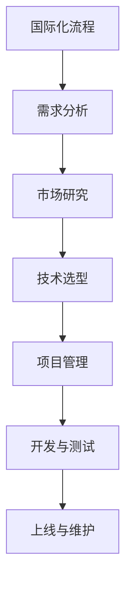

                 

# 程序员的国际化发展：机遇与挑战

> 关键词：国际化发展、程序员、机遇与挑战、跨文化沟通、技术工具、项目实战

> 摘要：本文探讨了程序员的国际化发展，分析了其面临的机遇与挑战。文章从国际化背景、技术知识与工具掌握、实际项目与实战、职业发展与策略四个方面，详细阐述了国际化发展的核心内容。通过实际案例和深入分析，为程序员提供了国际化发展的指南和策略。

## 第一部分: 国际化背景与理解

### 1.1 国际化概述

#### 1.1.1 国际化的概念

国际化（Internationalization），通常指的是将产品、服务或公司扩展到全球市场的过程。对于程序员而言，国际化不仅包括技术层面的拓展，还涵盖了文化、管理、沟通等多个方面。

#### 1.1.2 国际化的重要性

国际化对于程序员和软件开发公司具有重要意义。首先，国际化可以拓展市场，增加收入来源。其次，国际化能够提升程序员的技术水平，促进技术创新。此外，国际化还能够提高程序员的职业竞争力，为个人职业发展提供更多机会。

#### 1.1.3 国际化的分类与形式

国际化可以分为以下几种形式：

1. **市场国际化**：将产品或服务扩展到国外市场。
2. **技术国际化**：采用国际化技术，如多语言编程、国际化架构等。
3. **文化国际化**：适应不同文化背景的需求，提供本地化服务。
4. **管理国际化**：建立跨国团队，管理跨文化团队。

### 1.2 全球化与本土化的平衡

#### 1.2.1 全球化趋势

全球化使得信息和技术的流动更加便捷，但也带来了文化同质化的风险。程序员需要在全球化的背景下，寻找平衡点，既保持产品的一致性，又尊重本土化需求。

#### 1.2.2 本土化策略

本土化策略包括：

1. **本地化内容**：根据当地文化、语言和习惯，调整产品内容。
2. **本地化服务**：提供本地化的客户支持、售后服务等。
3. **本地化团队**：建立本地化团队，更好地理解当地市场。

#### 1.2.3 跨文化沟通技巧

跨文化沟通技巧包括：

1. **了解文化差异**：尊重不同文化，避免文化冲突。
2. **有效沟通**：采用清晰、简洁的语言，确保信息传达准确。
3. **倾听与理解**：倾听对方的意见，理解其需求。

### 1.3 技术全球流动的影响

#### 1.3.1 技术全球化的发展历程

技术全球化经历了从跨国公司到全球互联网的发展过程。如今，互联网的普及使得技术全球流动变得更加便捷。

#### 1.3.2 技术全球流动的驱动因素

驱动因素包括：

1. **全球化经济**：跨国公司拓展业务，推动技术全球化。
2. **技术进步**：互联网、移动通信等技术的发展，降低技术跨国传输成本。
3. **人才流动**：高素质程序员跨国流动，推动技术全球化。

#### 1.3.3 技术全球流动对程序员的挑战

技术全球流动为程序员带来了机遇，同时也带来了挑战：

1. **竞争压力**：全球程序员竞争激烈，程序员需要不断提升自己的技能。
2. **跨文化沟通**：程序员需要具备跨文化沟通能力，适应不同文化背景。
3. **快速学习**：新技术层出不穷，程序员需要具备快速学习能力。

### 1.4 国际化发展的机遇与挑战

#### 1.4.1 国际化发展的机遇

国际化发展为程序员带来了以下机遇：

1. **全球市场**：程序员可以拓展国际市场，获得更多业务机会。
2. **技术进步**：国际化使得程序员有机会接触到更多新技术，促进技术创新。
3. **职业发展**：国际化为程序员提供了更多职业发展机会。

#### 1.4.2 国际化发展的挑战

国际化发展也面临以下挑战：

1. **跨文化沟通**：程序员需要适应不同文化背景，提高跨文化沟通能力。
2. **语言障碍**：多语言编程和本地化服务需要解决语言障碍。
3. **项目管理**：跨国项目管理需要协调不同时区和文化背景的工作。

#### 1.4.3 跨文化沟通障碍与解决策略

跨文化沟通障碍包括：

1. **语言障碍**：不同语言和文化背景可能导致沟通误解。
2. **价值观差异**：不同文化价值观可能导致行为和决策差异。
3. **时区差异**：跨国团队工作可能面临时区差异，影响工作效率。

解决策略包括：

1. **语言培训**：提高程序员的跨语言沟通能力。
2. **文化敏感性**：了解不同文化价值观，提高跨文化沟通效果。
3. **沟通工具**：采用高效的沟通工具，如在线会议、即时通讯等。

## 第二部分: 技术知识与工具掌握

### 2.1 多语言编程基础

#### 2.1.1 编程语言概述

编程语言是程序员进行软件开发的基础。国际化编程需要程序员掌握多种编程语言，如 Java、Python、JavaScript 等。

#### 2.1.2 国际化编程常用工具

国际化编程常用工具包括：

1. **国际化框架**：如 Java 的 ICU、Python 的 Babel 等。
2. **本地化工具**：如 Android 的 Localization Tools、iOS 的 Xcode 等。
3. **翻译工具**：如 Google Translate、DeepL 等。

#### 2.1.3 国际化编程实践

国际化编程实践包括：

1. **多语言支持**：在代码中添加多语言支持，如使用资源文件管理字符串。
2. **日期与时间处理**：处理不同语言和时区的日期与时间格式。
3. **文本处理**：处理不同语言的文本，如字符编码、文本排版等。

### 2.2 概念与联系

#### 2.2.1 Mermaid 流程图：国际化开发流程



#### 2.2.2 国际化架构概述

国际化架构通常包括以下层次：

1. **表示层**：负责展示国际化内容，如用户界面、文本等。
2. **业务逻辑层**：处理国际化业务逻辑，如数据转换、算法实现等。
3. **数据访问层**：负责国际化数据的存储和访问，如数据库、缓存等。

### 2.3 核心算法原理

#### 2.3.1 算法基础

国际化算法基础包括：

1. **文本处理**：如字符串操作、文本编码等。
2. **日期与时间处理**：如日期格式化、时区转换等。
3. **字符处理**：如字符编码转换、字符排序等。

#### 2.3.2 伪代码详细讲解

```python
# 示例伪代码：国际化文本处理
function internationalize_text(text, target_language):
    # 步骤 1: 分析文本语言
    source_language = detect_language(text)

    # 步骤 2: 转换文本到目标语言
    translated_text = translate(text, source_language, target_language)

    # 步骤 3: 格式化文本
    formatted_text = format_text(translated_text, target_language)

    # 步骤 4: 返回格式化后的文本
    return formatted_text
```

#### 2.3.3 算法实践案例

国际化文本处理算法实践案例包括：

1. **多语言文本处理**：如文本翻译、文本格式化等。
2. **日期与时间处理**：如日期格式化、时区转换等。
3. **字符处理**：如字符编码转换、字符排序等。

### 2.4 数学模型与公式

#### 2.4.1 数学模型概述

国际化数学模型主要包括：

1. **文本相似度计算**：如 Jaccard 相似度、余弦相似度等。
2. **日期与时间计算**：如日期差计算、时区差计算等。
3. **字符处理计算**：如字符编码转换、字符排序等。

#### 2.4.2 公式讲解与示例

$$
\text{翻译准确性} = \frac{\text{准确翻译字数}}{\text{总字数}} \times 100\%
$$

#### 2.4.3 公式应用场景与案例分析

公式应用场景包括：

1. **文本翻译准确性评估**：用于评估翻译质量。
2. **日期与时间计算准确性评估**：用于评估日期与时间处理算法的准确性。
3. **字符处理准确性评估**：用于评估字符编码转换、字符排序等算法的准确性。

## 第三部分: 实际项目与实战

### 3.1 项目实战一：多语言网站开发

#### 3.1.1 项目背景

多语言网站开发项目旨在创建一个支持多种语言的网站，满足不同语言用户的需求。项目背景包括：

1. **市场需求**：随着全球化的推进，越来越多的企业希望将业务拓展到国际市场。
2. **技术挑战**：多语言网站开发涉及多语言支持、文本处理、国际化架构等。

#### 3.1.2 开发环境搭建

开发环境搭建包括：

1. **技术选型**：选择合适的开发框架和工具，如 Java、Python 等。
2. **数据库配置**：配置支持多语言数据的数据库，如 MySQL、MongoDB 等。
3. **前端框架**：选择合适的前端框架，如 React、Vue 等。

#### 3.1.3 源代码实现与解读

源代码实现与解读包括：

1. **多语言支持**：在代码中添加多语言支持，如使用资源文件管理字符串。
2. **文本处理**：处理不同语言的文本，如字符编码、文本排版等。
3. **国际化架构**：设计国际化架构，如表示层、业务逻辑层、数据访问层等。

#### 3.1.4 代码解读与分析

代码解读与分析包括：

1. **代码结构**：分析代码结构，确保代码的可读性和可维护性。
2. **性能优化**：分析代码性能，优化关键算法和数据处理。
3. **安全性**：分析代码安全性，防止 SQL 注入、XSS 等安全漏洞。

### 3.2 项目实战二：国际化应用程序

#### 3.2.1 项目背景

国际化应用程序项目旨在开发一个支持多种语言的应用程序，满足不同语言用户的需求。项目背景包括：

1. **市场需求**：随着全球化的推进，越来越多的应用程序希望支持多种语言。
2. **技术挑战**：国际化应用程序开发涉及多语言支持、文本处理、国际化架构等。

#### 3.2.2 开发流程

开发流程包括：

1. **需求分析**：分析用户需求，确定应用程序的功能和界面。
2. **技术选型**：选择合适的开发框架和工具，如 Java、Python 等。
3. **国际化架构设计**：设计国际化架构，如表示层、业务逻辑层、数据访问层等。

#### 3.2.3 源代码实现与解读

源代码实现与解读包括：

1. **多语言支持**：在代码中添加多语言支持，如使用资源文件管理字符串。
2. **文本处理**：处理不同语言的文本，如字符编码、文本排版等。
3. **国际化架构**：实现国际化架构，如表示层、业务逻辑层、数据访问层等。

#### 3.2.4 代码解读与分析

代码解读与分析包括：

1. **代码结构**：分析代码结构，确保代码的可读性和可维护性。
2. **性能优化**：分析代码性能，优化关键算法和数据处理。
3. **安全性**：分析代码安全性，防止 SQL 注入、XSS 等安全漏洞。

### 3.3 项目实战三：国际化数据服务

#### 3.3.1 项目背景

国际化数据服务项目旨在提供支持多种语言的国际化数据服务，满足不同语言用户的需求。项目背景包括：

1. **市场需求**：随着全球化的推进，越来越多的企业需要处理多种语言的数据。
2. **技术挑战**：国际化数据服务涉及多语言数据存储、数据处理、国际化架构等。

#### 3.3.2 数据处理流程

数据处理流程包括：

1. **数据采集**：从不同来源采集多语言数据。
2. **数据清洗**：清洗和预处理多语言数据，确保数据质量。
3. **数据存储**：存储支持多语言数据的数据库，如 MySQL、MongoDB 等。

#### 3.3.3 源代码实现与解读

源代码实现与解读包括：

1. **多语言数据存储**：设计支持多语言数据存储的数据库结构。
2. **数据处理**：处理多语言数据，如字符编码转换、文本处理等。
3. **国际化架构**：实现国际化架构，如表示层、业务逻辑层、数据访问层等。

#### 3.3.4 代码解读与分析

代码解读与分析包括：

1. **代码结构**：分析代码结构，确保代码的可读性和可维护性。
2. **性能优化**：分析代码性能，优化关键算法和数据处理。
3. **安全性**：分析代码安全性，防止 SQL 注入、XSS 等安全漏洞。

## 第四部分: 职业发展与策略

### 4.1 国际化职业规划

#### 4.1.1 国际化职业机会

国际化职业机会包括：

1. **国际化软件开发**：在跨国公司或国际化软件开发公司工作，参与国际化项目。
2. **国际化项目管理**：担任国际化项目管理者，负责跨国团队协调和项目管理。
3. **国际化技术支持**：提供国际化技术支持，如多语言技术支持、国际化解决方案等。

#### 4.1.2 职业发展路径

国际化职业发展路径包括：

1. **初级程序员**：具备国际化编程基础，能够处理国际化项目。
2. **中级程序员**：具备国际化开发经验，能够独立完成国际化项目。
3. **高级程序员**：具备国际化架构设计和项目管理能力，能够领导国际化团队。

#### 4.1.3 跨国公司工作体验

跨国公司工作体验包括：

1. **文化差异**：了解不同文化背景，适应跨国团队合作。
2. **沟通技巧**：提高跨文化沟通能力，确保团队协作顺畅。
3. **工作压力**：适应跨国公司的工作节奏和压力，保持高效工作状态。

### 4.2 跨文化沟通技巧

#### 4.2.1 跨文化沟通障碍

跨文化沟通障碍包括：

1. **语言障碍**：不同语言和文化背景可能导致沟通误解。
2. **价值观差异**：不同文化价值观可能导致行为和决策差异。
3. **时区差异**：跨国团队工作可能面临时区差异，影响工作效率。

#### 4.2.2 沟通策略与实践

沟通策略与实践包括：

1. **了解文化差异**：了解不同文化背景，尊重文化差异。
2. **有效沟通**：采用清晰、简洁的语言，确保信息传达准确。
3. **倾听与理解**：倾听对方的意见，理解其需求。

#### 4.2.3 跨文化团队管理

跨文化团队管理包括：

1. **团队建设**：建立跨文化团队，提高团队凝聚力。
2. **领导风格**：采用适合跨文化团队的管理风格，确保团队协作顺畅。
3. **激励机制**：设计适合跨文化团队的激励机制，提高员工积极性。

### 4.3 持续学习与成长

#### 4.3.1 技术更新与趋势

技术更新与趋势包括：

1. **国际化技术**：学习国际化编程、国际化架构等最新技术。
2. **新兴技术**：关注新兴技术，如人工智能、区块链等，掌握新技术趋势。

#### 4.3.2 学习方法与资源

学习方法与资源包括：

1. **在线课程**：参加在线课程，学习国际化开发相关知识。
2. **技术社区**：加入技术社区，交流学习经验，提高技术能力。
3. **书籍与文档**：阅读相关书籍和文档，深入了解国际化开发原理。

#### 4.3.3 职业发展建议

职业发展建议包括：

1. **职业规划**：制定清晰的职业规划，明确职业目标。
2. **技能提升**：不断提升自身技能，适应国际化发展需求。
3. **拓展人脉**：拓展人脉，建立国际化职业网络，为职业发展提供支持。

## 附录

### 附录 A: 国际化开发资源汇总

#### A.1 常用国际化开发工具

- **国际化框架**：如 Java 的 ICU、Python 的 Babel 等。
- **本地化工具**：如 Android 的 Localization Tools、iOS 的 Xcode 等。
- **翻译工具**：如 Google Translate、DeepL 等。

#### A.2 国际化社区与论坛

- **国际化开发社区**：如 Stack Overflow、GitHub 等。
- **国际化论坛**：如 Localization World、i18n Listserve 等。

#### A.3 国际化学习资源

- **在线课程**：如 Coursera、edX 等。
- **书籍与文档**：如 《国际化软件开发》等。

### 附录 B: 案例分析与经验分享

#### B.1 案例一：某国际公司的国际化开发实践

某国际公司在国际化开发方面的实践包括：

1. **多语言支持**：采用国际化框架，实现多语言支持。
2. **国际化架构**：设计国际化架构，确保系统的可扩展性和可维护性。
3. **跨国团队协作**：建立跨国团队，提高开发效率。

#### B.2 案例二：某开源项目的国际化历程

某开源项目的国际化历程包括：

1. **国际化贡献者**：吸引全球开发者参与国际化贡献。
2. **国际化翻译**：提供多语言文档和翻译。
3. **国际化推广**：通过国际展会和社区活动推广项目。

#### B.3 经验分享：国际化开发中的常见问题与解决方案

国际化开发中的常见问题与解决方案包括：

1. **语言障碍**：采用翻译工具和本地化工具，解决语言障碍。
2. **文化差异**：了解文化差异，采用合适的沟通策略。
3. **时区差异**：采用高效的沟通工具，协调不同时区的工作。

