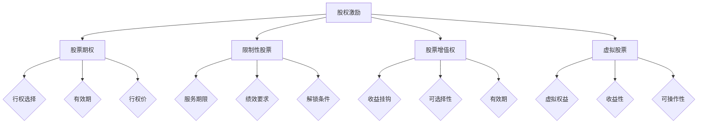

                 

## 文章标题：程序员的股权激励完全解析

在当前快速发展的经济环境中，企业对于核心人才的吸引力与留任问题日益凸显。对于程序员而言，除了丰厚的薪资待遇，股权激励成为了吸引和保留优秀人才的重要手段之一。本文旨在为程序员提供一份详尽的股权激励指南，从基础知识到实际操作，全面解析股权激励的各个方面，帮助企业更好地实施股权激励计划，同时帮助程序员理解股权激励的内涵与价值。

## 关键词：
- 股权激励
- 程序员
- 股票期权
- 限制性股票
- 股票增值权
- 虚拟股票
- 实施策略
- 效果评估

## 摘要：
本文首先介绍了股权激励的基础知识，包括概念、类型和作用。接着，探讨了股权激励的基本原则与相关法规，帮助读者了解股权激励的法律环境和实施准则。随后，文章深入分析了股权激励方案的设计原则与步骤，并通过股票期权、限制性股票、股票增值权和虚拟股票等具体方案的详细设计要点，帮助程序员和企业了解不同股权激励方式的特点和应用。此外，本文还涉及了股权激励的实施流程与效果评估，结合实际案例进行了实战解析。通过本文，读者将能够全面掌握股权激励的相关知识，为企业制定有效的股权激励计划提供参考。

## 《程序员的股权激励完全解析》目录大纲

### 第一部分：股权激励基础知识

### 第1章：股权激励概述

#### 1.1 股权激励的概念与作用

- 股权激励的定义
- 股权激励在程序员职业发展中的作用
- 股权激励的类型

#### 1.2 股权激励的历史与发展

- 股权激励的起源
- 国内股权激励的发展

#### 1.3 股权激励的核心概念与联系

- 股票期权
- 限制性股票
- 股票增值权
- 虚拟股票

（附：Mermaid流程图）

### 第2章：股权激励的基本原则与法规

#### 2.1 股权激励的基本原则

- 公平性
- 效益性
- 安全性
- 可行性

#### 2.2 股权激励的相关法规

- 《公司法》
- 《证券法》
- 《上市公司股权激励管理办法》

### 第3章：股权激励的适用对象与范围

#### 3.1 股权激励的适用对象

- 高管
- 技术骨干
- 销售人员
- 其他核心员工

#### 3.2 股权激励的范围

- 股票期权
- 限制性股票
- 股票增值权
- 虚拟股票

### 第二部分：股权激励方案设计

### 第4章：股权激励方案设计原则与步骤

#### 4.1 股权激励方案设计原则

- 公司利益优先
- 员工利益保障
- 可持续发展

#### 4.2 股权激励方案设计步骤

- 明确激励对象
- 确定激励方式
- 确定股权激励数量
- 制定行权条件
- 制定锁定期与行权期
- 制定股权激励的财务安排

### 第5章：股票期权方案设计

#### 5.1 股票期权的定义与特点

- 股票期权的定义
- 股票期权的特点

#### 5.2 股票期权方案设计要点

- 期权价格
- 期权数量
- 行权条件
- 锁定期与行权期

#### 5.3 股票期权案例分析

- 案例介绍
- 案例分析

### 第6章：限制性股票方案设计

#### 6.1 限制性股票的定义与特点

- 限制性股票的定义
- 限制性股票的特点

#### 6.2 限制性股票方案设计要点

- 股票来源
- 股票数量
- 锁定期
- 解锁条件
- 财务安排

#### 6.3 限制性股票案例分析

- 案例介绍
- 案例分析

### 第7章：股票增值权方案设计

#### 7.1 股票增值权的定义与特点

- 股票增值权的定义
- 股票增值权的特点

#### 7.2 股票增值权方案设计要点

- 增值权数量
- 行权条件
- 行权期
- 财务安排

#### 7.3 股票增值权案例分析

- 案例介绍
- 案例分析

### 第8章：虚拟股票方案设计

#### 8.1 虚拟股票的定义与特点

- 虚拟股票的定义
- 虚拟股票的特点

#### 8.2 虚拟股票方案设计要点

- 虚拟股票数量
- 虚拟股权的价值
- 行权条件
- 行权期
- 财务安排

#### 8.3 虚拟股票案例分析

- 案例介绍
- 案例分析

### 第三部分：股权激励实施与效果评估

### 第9章：股权激励实施流程与关键环节

#### 9.1 股权激励实施流程

- 激励对象筛选
- 方案制定与审批
- 公告与公示
- 实施与监控

#### 9.2 股权激励实施关键环节

- 股票来源
- 股权激励资金的筹集
- 行权条件与期限
- 财务安排

### 第10章：股权激励效果评估

#### 10.1 股权激励效果评估指标

- 员工留存率
- 员工积极性
- 企业绩效
- 员工满意度

#### 10.2 股权激励效果评估方法

- 定量评估
- 定性评估
- 综合评估

#### 10.3 股权激励效果案例分析

- 案例介绍
- 案例分析

### 第四部分：股权激励案例与实战

### 第11章：中小企业股权激励案例解析

#### 11.1 案例背景

- 企业简介
- 激励对象

#### 11.2 案例实施过程

- 方案设计
- 方案实施
- 效果评估

#### 11.3 案例总结与启示

- 成功经验
- 存在问题与解决方案

### 第12章：大型企业股权激励案例分析

#### 12.1 案例背景

- 企业简介
- 激励对象

#### 12.2 案例实施过程

- 方案设计
- 方案实施
- 效果评估

#### 12.3 案例总结与启示

- 成功经验
- 存在问题与解决方案

### 第13章：股权激励实战技巧与策略

#### 13.1 股权激励实施中的注意事项

- 合规性
- 公平性
- 可操作性

#### 13.2 股权激励策略选择

- 根据企业特点选择
- 根据员工需求调整
- 根据市场环境变化

#### 13.3 股权激励实战技巧

- 沟通协调
- 风险控制
- 跟踪管理

### 第五部分：股权激励在中国企业的应用与发展

### 第14章：股权激励在中国企业中的应用现状

- 发展历程
- 应用情况

### 第15章：股权激励在中国企业的发展趋势

- 法规环境
- 市场需求
- 技术创新

### 第16章：股权激励在中国企业的未来发展

- 政策支持
- 企业实践
- 持续创新

### 附录

#### 附录 A：股权激励相关法规与政策

- 《公司法》
- 《证券法》
- 《上市公司股权激励管理办法》
- 其他相关政策

#### 附录 B：股权激励常用术语解释

- 股票期权
- 限制性股票
- 股票增值权
- 虚拟股票

#### 附录 C：股权激励方案设计工具与方法

- SWOT分析法
- 经验法
- 数量法
- 价值法

#### 附录 D：股权激励案例库

- 中小企业案例
- 大型企业案例
- 其他行业案例

#### 附录 E：股权激励实施与效果评估工具

- 调查问卷
- 数据分析
- 综合评估表

### 总结

本文通过详细的目录大纲，为读者呈现了股权激励的完整图谱，从基础概念到实际操作，再到效果评估，全面解析了股权激励的各个方面。通过本文，程序员和企业管理者将能够更好地理解股权激励，掌握其实施要领，从而在人才竞争中占据优势。在未来的企业发展中，股权激励将发挥越来越重要的作用，为企业创新与成长提供动力。

---

### 1.1 股权激励的概念与作用

#### 股权激励的定义

股权激励，顾名思义，是一种通过授予员工公司股权或股权权益，以激励员工长期为公司贡献并实现公司价值增长的方式。具体来说，股权激励是一种薪酬激励形式，它通过将员工的个人利益与公司的长远发展紧密绑定，从而激发员工的积极性、创造性和忠诚度。

#### 股权激励在程序员职业发展中的作用

对于程序员来说，股权激励不仅是一份额外的薪酬奖励，更是职业发展的助推器。以下是股权激励在程序员职业发展中的作用：

1. **提升员工归属感和忠诚度**：股权激励让员工感受到自己不仅是公司的雇佣者，更是公司的合作伙伴，这极大地提升了员工的归属感和忠诚度。

2. **激励创新与创造力**：拥有股权的员工会更加主动地投入到公司项目和创新中，因为他们知道，公司的成功也将直接关系到他们个人的收益。

3. **吸引和留住优秀人才**：在竞争激烈的IT行业，股权激励成为了一项重要的吸引人才的工具。对于许多顶尖程序员而言，拥有公司股权是他们在选择工作机会时的重要考虑因素。

4. **促进长期价值创造**：股权激励使员工和公司目标一致，员工在为公司创造价值的同时，也实现了个人财富的增值，这有助于员工更加专注于长期价值创造。

#### 股权激励的类型

股权激励主要有以下几种类型：

1. **股票期权**：股票期权是一种在未来特定时间内以特定价格购买公司股票的权利。员工在行权时可以选择购买股票，也可以选择放弃。

2. **限制性股票**：限制性股票是指员工在满足特定条件后才能永久拥有的股票。这些条件通常包括服务期限、绩效要求等。

3. **股票增值权**：股票增值权是一种权利，使员工在股票价格上涨时能够获得相应的收益，而不需要实际持有股票。

4. **虚拟股票**：虚拟股票是一种模拟股权激励的方式，员工可以享受公司股票升值带来的收益，但并不实际拥有公司股票。

### 1.2 股权激励的历史与发展

#### 股权激励的起源

股权激励的起源可以追溯到20世纪初期。当时，随着企业规模的扩大和市场竞争的加剧，企业开始意识到需要通过激励措施来留住核心员工，并激发员工的创造力和积极性。最早提出股权激励概念的是美国企业家费舍尔·布莱克（Fisher Black），他在1976年发表了著名的论文《股票期权的经济学分析》，对股票期权进行了系统性的理论分析。

#### 国内股权激励的发展

国内股权激励的发展可以追溯到20世纪90年代，随着资本市场的发展和企业改革的深入，股权激励逐渐被引入到企业中。2006年，中国证监会颁布了《上市公司股权激励管理办法》，标志着国内股权激励进入了法制化、规范化的轨道。

近年来，国内股权激励的应用范围逐渐扩大，不仅限于上市公司，越来越多的非上市公司也开始探索股权激励的应用。随着国家对创新创业的鼓励和支持，股权激励成为了企业吸引和留住人才的重要手段之一。

### 1.3 股权激励的核心概念与联系

#### 股票期权

股票期权是一种常见且重要的股权激励形式。它授予员工在未来某个时间以特定价格购买公司股票的权利。股票期权具有以下几个特点：

1. **可选择性**：员工可以在行权期限内选择是否行使期权。
2. **时间性**：股票期权的有效期为授予日至到期日，通常为3-10年。
3. **价格性**：期权行权价通常为公司股票的市场价格，或者是一个事先约定的较低价格。

股票期权与公司的绩效紧密相关，员工的收益取决于公司股票的市场价格与行权价之间的差额。

#### 限制性股票

限制性股票是指员工在满足特定条件后才能永久拥有的股票。这些条件通常包括服务期限、绩效要求等。限制性股票的特点如下：

1. **服务期限**：员工在满足服务期限后才能解锁限制性股票。
2. **绩效要求**：员工需要达到公司设定的绩效目标，才能获得限制性股票。
3. **不可转让**：在解锁前，限制性股票通常不可转让或出售。

限制性股票使得员工与公司利益绑定，更愿意长期为公司发展贡献力量。

#### 股票增值权

股票增值权是一种权利，使员工在股票价格上涨时能够获得相应的收益，而不需要实际持有股票。股票增值权的特点如下：

1. **收益性**：股票增值权直接与公司股票增值挂钩，员工无需实际购买股票即可获得收益。
2. **可选择性**：员工可以选择是否行使股票增值权。
3. **时间性**：股票增值权通常有一定的有效期。

股票增值权适用于希望激励员工但不希望员工直接持有股票的情况。

#### 虚拟股票

虚拟股票是一种模拟股权激励的方式，员工可以享受公司股票升值带来的收益，但并不实际拥有公司股票。虚拟股票的特点如下：

1. **虚拟性**：虚拟股票并非实际的物理股票，而是一种虚拟的权益。
2. **收益性**：虚拟股票的价值取决于公司股票的市场价格。
3. **可操作性**：虚拟股票的分配和行使通常比实际股票更为灵活。

虚拟股票适用于初创公司或无法立即提供实际股票激励的企业。

#### Mermaid流程图

下面是一个股权激励核心概念的Mermaid流程图：

通过上述核心概念的介绍，读者可以初步了解股权激励的多种形式及其特点。在接下来的章节中，我们将深入探讨股权激励的基本原则与法规，帮助读者更好地理解股权激励的实施方法和注意事项。

### 2.1 股权激励的基本原则

股权激励作为企业吸引和保留核心人才的重要手段，其设计、实施和效果评估都应遵循一定的基本原则。这些原则不仅确保股权激励的公平性和合法性，还能最大限度地发挥激励作用，促进公司的发展。以下是股权激励的基本原则：

#### 公平性

公平性是股权激励设计的首要原则。公平性体现在两个方面：一是内部公平，即同一公司内部不同岗位、不同贡献的员工应获得与其贡献相当的股权激励；二是外部公平，即与其他同行业企业相比，公司的股权激励政策应具有竞争力，以吸引和留住优秀人才。

#### 效益性

股权激励的效益性主要体现在激励成本与激励效果之间的平衡。企业在设计股权激励方案时，需要考虑激励成本对公司财务状况的影响，同时确保激励效果能够激发员工的积极性，提高工作效率和企业绩效。

#### 安全性

安全性原则要求股权激励方案在设计、实施和执行过程中，必须保证公司资产的安全。例如，股票期权和限制性股票的授予和行权应遵循公司章程和相关法律法规，避免因股权激励引发的潜在法律纠纷。

#### 可行性

可行性原则强调股权激励方案应具备可操作性，包括实施流程、操作步骤和执行细则等。股权激励方案应简洁明了，便于理解和执行，以避免因操作复杂性导致实施过程中的障碍。

#### 综合考量

股权激励的基本原则不是孤立的，而是相互关联、共同作用的。企业在制定股权激励方案时，应综合考虑员工需求、公司战略、市场环境等因素，确保股权激励方案既具有吸引力，又能有效地促进公司长期发展。

#### 法规环境

股权激励的实施离不开法律法规的支持和约束。以下是股权激励涉及的主要法规：

- **《公司法》**：规定了公司的股权结构、股东权益和公司治理的基本原则，为股权激励提供了法律依据。
- **《证券法》**：明确了股票发行、交易和信息披露的法律要求，保障了股权激励的合规性。
- **《上市公司股权激励管理办法》**：针对上市公司的股权激励进行了详细规定，包括激励对象、激励工具、激励条件等。

此外，各地政府也根据实际情况制定了相关的实施细则和政策，如税收优惠、补贴支持等，以鼓励企业实施股权激励。

#### 企业内部规定

除了法律法规外，企业自身也需要制定相关的内部规定，以确保股权激励的顺利实施。这些内部规定通常包括：

- **股权激励方案**：明确股权激励的目的、范围、方式、数量、行权条件等。
- **股权授予与行权细则**：详细规定股权授予的程序、行权的条件、时间和方式等。
- **绩效考核与评估**：制定绩效指标，对激励对象的绩效进行评估，确保股权激励的公平性和有效性。

#### 实施案例

以某互联网公司为例，该公司为了激励其技术团队，实施了股票期权计划。具体方案如下：

1. **激励对象**：公司技术部门的核心员工，包括高级开发人员、技术经理等。
2. **股权数量**：授予每位激励对象1000股股票期权，共计10000股。
3. **行权条件**：员工需在公司工作满两年，且年度绩效考核合格。
4. **行权价格**：行权价格为当前股票市场价格。
5. **有效期**：期权有效期为5年，自授予之日起计算。

通过上述案例，我们可以看到，企业在实施股权激励时，需要综合考虑各种因素，制定符合公司实际情况的激励方案。

综上所述，股权激励的基本原则包括公平性、效益性、安全性和可行性，并需要遵循相关的法律法规和企业内部规定。通过合理的股权激励方案，企业不仅能够吸引和留住核心人才，还能提高整体绩效和竞争力。

### 2.2 股权激励的相关法规

股权激励作为企业激励员工的重要手段，其设计和实施必须严格遵循相关法律法规，以确保合法合规，避免法律纠纷。以下是股权激励涉及的主要法规和具体规定：

#### 《公司法》

《公司法》是我国关于公司治理的基本法律，对公司的设立、组织结构、股权管理等方面做出了详细规定。其中，涉及股权激励的主要内容包括：

- **股权分配**：公司应当根据章程规定分配股权，确保股权分配的公平、公正。
- **股东权利**：股东享有股权收益权、参与决策权等权利，公司在实施股权激励时，应尊重股东的合法权益。
- **股权变更**：公司股权的变更必须经过股东会或股东大会的决议，并依法办理变更登记。

#### 《证券法》

《证券法》主要规定了股票的发行和交易行为，对于股权激励中的股票期权、股票增值权等激励工具具有明确的规范。具体内容包括：

- **股票期权**：公司授予员工的股票期权必须符合《证券法》关于股票期权的规定，包括期权价格、授予条件、行权方式等。
- **信息披露**：公司实施股权激励计划后，应及时披露相关信息，包括激励对象、激励工具、激励条件等，以保证信息公开透明。
- **交易限制**：对于上市公司的股权激励，员工在行权后成为公司股东，其股票交易需遵守《证券法》的相关规定，如锁定期、信息披露义务等。

#### 《上市公司股权激励管理办法》

《上市公司股权激励管理办法》是我国针对上市公司股权激励的具体管理办法，对股权激励的实施程序、激励工具、激励条件等做出了详细规定。主要内容如下：

- **激励工具**：上市公司可以选择股票期权、限制性股票、股票增值权、虚拟股票等多种激励工具。
- **激励对象**：激励对象通常包括公司的高级管理人员、核心技术（业务）人员，以及其他有突出贡献的员工。
- **激励条件**：股权激励计划的实施需满足一定的条件，如公司业绩指标、员工服务期限等。
- **激励额度**：上市公司应当合理确定股权激励额度，确保股权激励与公司业绩挂钩，避免过度激励。

#### 其他相关政策

除了上述主要法规外，地方政府和相关部门也针对股权激励出台了若干优惠政策和支持措施，如税收优惠、资金补贴等。这些政策有助于降低企业实施股权激励的成本，提高员工的积极性。

- **税收优惠**：对于员工通过股权激励获得的收益，可以享受一定的税收优惠，如个人所得税减免等。
- **资金补贴**：地方政府对于实施股权激励的企业，可以提供一定的资金补贴或奖励，以鼓励企业吸引和留住人才。

#### 企业内部规定

企业在实施股权激励时，除了遵循外部法律法规外，还需要制定相应的内部规定，以确保股权激励计划的顺利实施。这些内部规定通常包括：

- **股权激励方案**：明确股权激励的目的、范围、方式、数量、行权条件等。
- **股权授予与行权细则**：详细规定股权授予的程序、行权的条件、时间和方式等。
- **绩效考核与评估**：制定绩效指标，对激励对象的绩效进行评估，确保股权激励的公平性和有效性。

#### 案例分析

以某大型互联网公司为例，该公司为了激励其技术团队，实施了股票期权计划。具体方案如下：

1. **激励对象**：公司技术部门的核心员工，包括高级开发人员、技术经理等。
2. **股权数量**：授予每位激励对象1000股股票期权，共计10000股。
3. **行权条件**：员工需在公司工作满两年，且年度绩效考核合格。
4. **行权价格**：行权价格为当前股票市场价格。
5. **有效期**：期权有效期为5年，自授予之日起计算。

通过上述案例，我们可以看到，企业在实施股权激励时，需要综合考虑法律法规和企业内部规定，确保激励计划的合法性和有效性。

#### 小结

股权激励的相关法规涵盖了公司治理、股票发行、交易和信息披露等多个方面。企业在设计股权激励方案时，应严格遵循相关法律法规，同时结合企业实际情况和员工需求，制定科学合理的激励计划。通过合法合规的股权激励，企业可以更好地吸引和留住核心人才，提高整体绩效和竞争力。

### 3.1 股权激励的适用对象

股权激励作为一项重要的激励措施，其适用对象的选择直接关系到激励效果和公司整体战略目标的实现。一般来说，股权激励的适用对象主要包括以下几个方面：

#### 高管

高管作为公司的重要决策者和执行者，其工作表现对公司的发展具有至关重要的影响。因此，高管通常是股权激励的主要适用对象。通过给予高管股权激励，可以增强其责任感、使命感和长期投入精神，从而推动公司的持续发展。

#### 技术骨干

技术骨干是公司创新和发展的核心力量，他们负责公司关键技术的研发和优化。给予技术骨干股权激励，不仅可以激励他们发挥更大的创造力，还能增强其对公司的忠诚度和归属感，从而确保公司技术创新的持续性和竞争力。

#### 销售人员

销售人员在公司的业务拓展和业绩提升中发挥着重要作用。通过给予销售人员股权激励，可以激励他们积极开拓市场、提高销售业绩，从而实现公司的经营目标。此外，股权激励还可以帮助公司留住优秀的销售人员，减少人员流动带来的风险。

#### 其他核心员工

除了上述三类员工外，其他对公司发展有重大贡献的核心员工，如财务人员、市场人员等，也可以成为股权激励的适用对象。这些员工在各自岗位上发挥重要作用，通过股权激励，可以增强他们的责任感和归属感，促进团队合作和企业整体业绩的提升。

#### 适用对象的选择标准

在确定股权激励的适用对象时，企业需要综合考虑以下标准：

1. **岗位重要性**：对于公司战略发展具有重要影响的关键岗位，应优先考虑股权激励。
2. **贡献度**：员工的工作表现和贡献度是选择股权激励适用对象的重要依据，对业绩和公司发展有重大贡献的员工应优先考虑。
3. **潜力**：具有发展潜力和未来价值的员工，是股权激励的重要对象。通过激励，可以激发他们的潜力，为公司创造更多价值。
4. **稳定性**：选择长期为公司服务的员工作为股权激励对象，可以增强其稳定性，减少人员流动风险。

#### 激励范围的确定

股权激励的范围包括股权激励的数量、授予时间、行权条件等。在确定激励范围时，企业需要综合考虑以下因素：

1. **公司规模和财务状况**：公司的规模和财务状况直接影响到股权激励的规模和方式。对于规模较大、财务状况良好的企业，可以适当扩大激励范围。
2. **行业和市场环境**：不同的行业和市场环境对股权激励的需求和效果有所不同。企业需要根据行业特点和市场竞争状况，制定合理的股权激励范围。
3. **员工需求和期望**：了解员工的需求和期望，是制定股权激励计划的重要依据。企业应通过调研和沟通，了解员工对股权激励的期望，从而制定出更具吸引力的激励计划。

#### 案例分析

以某互联网公司为例，该公司在实施股权激励计划时，主要考虑了以下因素：

1. **高管**：公司CEO、CFO、CTO等高层管理人员是股权激励的重点对象。公司授予每位高管10000股股票期权，行权价为当前市场价，锁定期为2年，行权期为4年。
2. **技术骨干**：公司技术部门的核心研发人员是股权激励的重要对象。公司授予每位技术骨干5000股股票期权，行权价为当前市场价，锁定期为1年，行权期为3年。
3. **销售人员**：公司销售团队的高绩效销售人员是股权激励的优先对象。公司授予每位销售人员的股票期权数量为3000股，行权价为当前市场价，锁定期为1年，行权期为2年。

通过上述案例，我们可以看到，股权激励的适用对象和激励范围的确定需要综合考虑多种因素，以实现公司战略目标和员工个人发展的双赢。

### 3.2 股权激励的范围

股权激励的范围主要涉及股权激励的具体工具类型和适用范围。不同类型的股权激励工具适用于不同的员工群体和公司发展阶段，企业需要根据实际情况选择合适的激励工具，以达到最佳的激励效果。

#### 股票期权

股票期权是一种最常见的股权激励工具，它赋予员工在未来特定时间以约定价格购买公司股票的权利。股票期权的特点如下：

- **行权条件**：员工在满足特定条件，如服务期限和业绩考核后，可以选择是否行使期权。
- **有效期**：股票期权的有效期为授予日至到期日，通常为3-10年。
- **行权价格**：行权价格通常为股票授予时的市场价格，或者是一个事先约定的较低价格。

股票期权适用于公司高管、技术骨干和核心员工，特别是那些对公司发展有重大贡献且希望长期留任的员工。

#### 限制性股票

限制性股票是指员工在满足特定条件后才能永久拥有的股票。这些条件通常包括服务期限、绩效要求等。限制性股票的特点如下：

- **服务期限**：员工需要在公司工作一定年限，通常为3-5年，才能解锁限制性股票。
- **绩效要求**：员工需要达到公司设定的绩效目标，才能获得限制性股票。
- **不可转让**：在解锁前，限制性股票通常不可转让或出售。

限制性股票适用于希望长期留住核心员工的公司，特别是那些对公司发展有重要影响的员工。

#### 股票增值权

股票增值权是一种权利，使员工在股票价格上涨时能够获得相应的收益，而不需要实际持有股票。股票增值权的特点如下：

- **收益性**：股票增值权直接与公司股票增值挂钩，员工无需实际购买股票即可获得收益。
- **可选择性**：员工可以选择是否行使股票增值权。
- **有效期**：股票增值权通常有一定的有效期。

股票增值权适用于希望激励员工但不希望员工直接持有股票的公司，特别是在初创公司或企业需要保持财务灵活性的情况下。

#### 虚拟股票

虚拟股票是一种模拟股权激励的方式，员工可以享受公司股票升值带来的收益，但并不实际拥有公司股票。虚拟股票的特点如下：

- **虚拟性**：虚拟股票并非实际的物理股票，而是一种虚拟的权益。
- **收益性**：虚拟股票的价值取决于公司股票的市场价格。
- **可操作性**：虚拟股票的分配和行使通常比实际股票更为灵活。

虚拟股票适用于初创公司或无法立即提供实际股票激励的企业，它可以帮助企业模拟股权激励的效果，而无需实际发行股票。

#### 适用范围

不同类型的股权激励工具适用于不同的员工群体和公司发展阶段。以下是几种主要股权激励工具的适用范围：

- **股票期权**：适用于公司高管、技术骨干和核心员工，特别是那些对公司发展有重大贡献且希望长期留任的员工。
- **限制性股票**：适用于希望长期留住核心员工的公司，特别是那些对公司发展有重要影响的员工。
- **股票增值权**：适用于希望激励员工但不希望员工直接持有股票的公司，特别是在初创公司或企业需要保持财务灵活性的情况下。
- **虚拟股票**：适用于初创公司或无法立即提供实际股票激励的企业，它可以帮助企业模拟股权激励的效果，而无需实际发行股票。

#### 案例分析

以某大型互联网公司为例，该公司为了激励其核心员工，采用了多种股权激励工具：

1. **股票期权**：公司授予高管和技术骨干股票期权，行权价格为当前市场价，锁定期为2年，行权期为4年。
2. **限制性股票**：公司授予核心员工限制性股票，要求员工在公司工作满3年，且年度绩效考核合格。
3. **股票增值权**：公司授予销售团队股票增值权，使他们在股票价格上涨时获得相应的收益。
4. **虚拟股票**：公司为初创团队提供虚拟股票激励，以模拟股权激励效果，同时保持财务灵活性。

通过上述案例，我们可以看到，公司根据不同员工群体的特点和需求，选择了多种股权激励工具，以实现最佳的激励效果。

### 4.1 股权激励方案设计原则

股权激励方案的设计是决定激励效果的关键环节。一个成功的股权激励方案不仅需要具备吸引力，还必须符合公司战略、员工需求以及法律法规的要求。以下是股权激励方案设计的主要原则：

#### 公司利益优先

股权激励方案的首要原则是确保公司利益优先。这意味着股权激励的设计应有利于公司的长期发展，避免短期行为对公司利益造成损害。例如，激励方案应确保激励对象在公司实现业绩目标后才能获得收益，从而激励员工为实现公司目标而努力。

#### 员工利益保障

尽管公司利益优先，但也不能忽视员工的利益保障。股权激励方案应确保员工在为公司做出贡献后，能够获得合理的回报。这包括明确的行权条件、合理的行权价格以及公正的绩效评估标准。通过保障员工利益，可以增强员工的归属感和忠诚度，从而提高工作效率和团队协作。

#### 可持续发展

股权激励方案还应考虑公司的可持续发展。这意味着激励方案应具有长期的可持续性，避免因激励政策变化而导致员工流失。例如，可以通过设置较长的锁定期和行权期，确保员工在较长的时间内为公司服务，从而实现公司与员工的共同成长。

#### 公司战略匹配

股权激励方案的设计应与公司的战略目标相匹配。这意味着激励方案应与公司的长期发展计划、市场定位以及竞争策略相协调。例如，如果公司处于快速扩张阶段，可以设计具有较高激励效果的方案，以吸引和留住关键人才；而在稳定发展阶段，则可以采取更为稳健的激励方案。

#### 员工需求导向

股权激励方案的设计还应考虑员工的需求。不同员工对股权激励的期望和偏好有所不同，例如一些员工可能更倾向于股票期权，而另一些员工可能更喜欢限制性股票。因此，企业应通过调研和沟通，了解员工的需求，制定符合员工期望的激励方案。

#### 法律法规遵守

最后，股权激励方案的设计必须遵守相关的法律法规。企业需要了解《公司法》、《证券法》、《上市公司股权激励管理办法》等法规的具体规定，确保激励方案符合法律要求，避免因违规操作而引发的法律风险。

#### 案例分析

以某大型科技公司为例，该公司在制定股权激励方案时，充分考虑了上述原则：

1. **公司利益优先**：公司要求激励对象在达到特定业绩目标后才能行使期权，从而确保员工努力实现公司目标。
2. **员工利益保障**：公司设置了公平合理的行权条件，如工作年限和绩效评估，同时行权价格与市场价挂钩，确保员工在为公司做出贡献后能够获得合理的回报。
3. **可持续发展**：公司设置了较长的锁定期和行权期，确保员工在较长的时间内为公司服务，从而实现公司与员工的共同成长。
4. **公司战略匹配**：公司根据自身发展战略，选择了具有较高激励效果的股票期权方案，以吸引和留住关键人才。
5. **员工需求导向**：公司通过调研和沟通，了解了员工对股权激励的期望和偏好，制定了符合员工需求的激励方案。
6. **法律法规遵守**：公司在设计股权激励方案时，严格遵循了《公司法》、《证券法》、《上市公司股权激励管理办法》等法规的具体规定。

通过上述案例分析，我们可以看到，遵循股权激励方案设计原则，有助于企业制定出科学合理、具有吸引力和可持续性的股权激励方案，从而实现公司与员工的共同发展。

### 4.2 股权激励方案设计步骤

股权激励方案的设计是一项复杂而重要的任务，需要企业全面考虑战略目标、市场环境、员工需求以及法律法规等多方面因素。以下是股权激励方案设计的具体步骤：

#### 第一步：明确激励对象

明确激励对象是股权激励方案设计的第一步。激励对象的选择直接关系到股权激励的效果。一般来说，激励对象包括公司高管、核心技术人员、销售人员以及其他有重大贡献的员工。企业在确定激励对象时，应考虑以下因素：

- **岗位重要性**：对于公司战略发展具有重要影响的关键岗位，如高管、技术骨干等，应优先考虑。
- **贡献度**：员工的工作表现和贡献度是选择激励对象的重要依据，对业绩和公司发展有重大贡献的员工应优先考虑。
- **潜力**：具有发展潜力和未来价值的员工，是股权激励的重要对象。通过激励，可以激发他们的潜力，为公司创造更多价值。
- **稳定性**：选择长期为公司服务的员工作为激励对象，可以增强其稳定性，减少人员流动风险。

#### 第二步：确定激励方式

在明确激励对象后，企业需要选择合适的股权激励方式。常见的股权激励方式包括股票期权、限制性股票、股票增值权和虚拟股票等。每种激励方式都有其特点和适用范围，企业应根据实际情况选择：

- **股票期权**：适用于公司高管、技术骨干和核心员工，特别是那些对公司发展有重大贡献且希望长期留任的员工。
- **限制性股票**：适用于希望长期留住核心员工的公司，特别是那些对公司发展有重要影响的员工。
- **股票增值权**：适用于希望激励员工但不希望员工直接持有股票的公司，特别是在初创公司或企业需要保持财务灵活性的情况下。
- **虚拟股票**：适用于初创公司或无法立即提供实际股票激励的企业，它可以帮助企业模拟股权激励的效果，而无需实际发行股票。

#### 第三步：确定股权激励数量

股权激励数量的确定是股权激励方案设计的关键环节。激励数量的合理设置不仅关系到员工积极性，还关系到公司的财务负担。在确定股权激励数量时，企业应考虑以下因素：

- **公司规模和财务状况**：公司的规模和财务状况直接影响到股权激励的规模。对于规模较大、财务状况良好的企业，可以适当扩大激励范围。
- **行业和市场环境**：不同的行业和市场环境对股权激励的需求和效果有所不同。企业需要根据行业特点和市场竞争状况，制定合理的激励数量。
- **员工需求和期望**：了解员工的需求和期望，是制定股权激励计划的重要依据。企业应通过调研和沟通，了解员工对股权激励的期望，从而制定出更具吸引力的激励数量。

#### 第四步：制定行权条件

行权条件是员工行使股权激励权利的前提条件，包括服务期限、绩效要求、市场条件等。制定合理的行权条件可以确保股权激励的有效性和公平性。在制定行权条件时，企业应考虑以下因素：

- **服务期限**：员工需要在公司工作一定年限才能行使期权或限制性股票。服务期限的长短应根据公司实际情况和员工需求来确定。
- **绩效要求**：员工需要达到公司设定的绩效目标，才能行使期权或限制性股票。绩效指标应科学合理，确保激励对象能够通过努力实现。
- **市场条件**：行权条件中可以设置市场条件，如股票市场价格达到一定水平时，员工才能行使期权。市场条件有助于激励员工努力提升公司业绩。

#### 第五步：制定锁定期与行权期

锁定期和行权期是股权激励方案中的关键要素，直接影响员工权益的实现。合理的锁定期和行权期设计可以增强股权激励的持续性和有效性。在制定锁定期与行权期时，企业应考虑以下因素：

- **锁定期**：锁定期是员工行使股权激励权利前的等待期，通常为1-3年。锁定期可以确保员工在较长时间内为公司服务，减少短期行为对公司利益的影响。
- **行权期**：行权期是员工可以行使期权或限制性股票的时间段，通常为3-10年。行权期的长短应根据公司发展战略和员工需求来确定。

#### 第六步：制定股权激励的财务安排

股权激励的财务安排是股权激励方案设计的重要环节，包括资金来源、成本预算和税务处理等。在制定财务安排时，企业应考虑以下因素：

- **资金来源**：股权激励的资金来源可以是公司自有资金、资本公积金或者专项激励基金。企业应根据实际情况选择合适的资金来源。
- **成本预算**：股权激励的成本预算应合理，确保激励成本在公司可承受范围内，不会对公司的财务状况造成不利影响。
- **税务处理**：股权激励的税务处理应遵循相关法律法规，确保员工的收益合理合法。企业应咨询专业税务顾问，制定合理的税务处理方案。

#### 第七步：方案制定与审批

股权激励方案在制定完成后，需要提交公司董事会或股东大会审批。审批通过后，方案才能正式实施。在方案审批过程中，企业应确保方案的合法性和可行性，并充分考虑员工意见。

#### 第八步：实施与监控

股权激励方案审批通过后，进入实施阶段。企业应制定详细的实施计划，包括股权授予、行权操作、绩效评估等。同时，企业应建立监控机制，确保股权激励方案的有效实施和持续改进。

通过以上步骤，企业可以制定出科学合理、具有吸引力和可持续性的股权激励方案，从而实现公司与员工的共同发展。

### 5.1 股票期权的定义与特点

股票期权是一种常见的股权激励工具，它通过赋予员工在未来特定时间内以固定价格购买公司股票的权利，来激励员工为公司做出长期贡献。股票期权具有以下几个显著特点：

#### 股票期权的定义

股票期权是一种契约，授予员工在未来特定时间（行权日）以约定价格购买公司股票的权利。员工在行权时可以选择是否行使期权，如果股票市场价格高于行权价，员工行使期权可以获得差价收益；如果股票市场价格低于行权价，员工可以选择不行使期权，从而损失的是期权费用。

#### 股票期权的特点

1. **可选择性**：股票期权赋予员工选择权，员工可以在行权期内决定是否行使期权，这种灵活性使得员工可以根据市场状况和个人财务状况做出最佳决策。

2. **杠杆性**：股票期权具有杠杆效应，即员工只需支付少量的期权费用，就可以获得未来可能大幅增长的股票收益。这种杠杆性使得股票期权成为一种高效的激励工具。

3. **长期激励**：股票期权通常有较长的有效期（3-10年），行权期限通常也较长，这有助于将员工的利益与公司的长期发展紧密绑定，从而激励员工长期关注公司的成长和价值。

4. **税收优势**：在一些国家和地区，股票期权收益可以享受税收优惠，这降低了员工行权后的税收负担，使得股票期权更具吸引力。

5. **风险和收益并存**：股票期权既可能带来高收益，也可能导致损失。如果公司股票价格低于行权价，员工放弃行使期权只会损失期权费用。因此，股票期权是一种高风险和高收益并存的激励工具。

#### 股票期权与公司绩效的关系

股票期权的设计和实施与公司绩效密切相关。通过股票期权，员工与公司利益绑定，他们的收益直接取决于公司股票的市场价格。以下是一些影响股票期权与公司绩效关系的因素：

1. **公司业绩**：公司业绩的提升会带动股票价格的上涨，从而增加员工的行权收益，这有助于提高员工的积极性和长期投入。

2. **公司治理**：良好的公司治理结构有助于提升公司业绩和市场信心，进而提高股票价格。这也有利于员工行使期权并从中获益。

3. **市场环境**：市场环境的变化，如宏观经济状况、行业趋势等，也会影响公司股票的价格。企业需要根据市场环境调整股票期权的设计和分配。

4. **员工心态**：员工对公司的信心和对股票期权收益的期望也会影响其工作态度和绩效。如果员工对公司的未来充满信心，他们更有可能为公司做出长期贡献。

通过合理设计和实施股票期权，企业可以有效地激励员工，提升公司绩效，实现公司与员工的共同发展。

### 5.2 股票期权方案设计要点

股票期权方案的设计是股权激励中至关重要的一环，它不仅关系到激励效果，还影响到公司的财务状况和长期战略。以下是股票期权方案设计的几个关键要点：

#### 5.2.1 期权价格

期权价格是股票期权方案设计中的核心要素之一。期权价格通常有两种设定方式：

1. **市场价格**：期权价格设定为当前股票市场价格，这有助于确保员工在行权时能够实际获益。然而，这种方式可能会增加公司的财务负担，因为股票价格波动较大，可能导致公司需要支付更高的期权费用。

2. **预定价格**：预定价格是指公司在授予期权时事先设定的价格，通常是低于市场价格的固定价格。这种方式的优点是降低了公司的财务负担，但可能会降低员工行权的积极性，因为他们可能觉得未来的收益空间较小。

在设计期权价格时，企业需要综合考虑市场状况、公司财务状况以及员工期望，以找到一个平衡点。

#### 5.2.2 期权数量

期权数量是指公司授予每个激励对象的股票期权数量。期权数量的设定需要考虑以下几个因素：

1. **员工层级**：不同层级的员工对公司贡献度不同，因此期权数量应根据员工的岗位、职责和贡献度进行差异化设置。通常，高管和核心技术人员的期权数量会更多。

2. **公司规模**：公司规模较大，可以授予更多的期权数量，因为财务负担相对较小。相反，对于初创公司或规模较小的公司，应谨慎设定期权数量，以避免对财务状况产生过大压力。

3. **市场状况**：在市场环境较好、公司股票价格较高时，可以适当增加期权数量，以吸引更多优秀人才。在市场环境较差或公司股票价格较低时，应减少期权数量，以降低财务风险。

#### 5.2.3 行权条件

行权条件是指员工行使股票期权所需满足的条件，包括服务期限、绩效要求等。合理的行权条件可以确保员工与公司的长期利益一致，以下是一些常见的行权条件：

1. **服务期限**：员工需要在公司工作一定年限才能行使期权。例如，锁定期为2年，行权期为3年。这有助于确保员工不会因短期利益而离职，从而保持公司的稳定性。

2. **绩效要求**：员工需要达到公司设定的绩效目标，才能行使期权。绩效指标可以是个人绩效、团队绩效或者公司整体绩效。这种方式可以激励员工努力提升个人和团队绩效，推动公司发展。

3. **市场条件**：一些公司会设定市场条件作为行权条件，例如，股票市场价格需达到特定水平时，员工才能行使期权。这有助于确保员工在市场环境良好时行使期权，从而获得更好的收益。

#### 5.2.4 锁定期与行权期

锁定期和行权期是股票期权方案中的关键时间节点，直接影响员工的权益实现。以下是关于锁定期和行权期的一些要点：

1. **锁定期**：锁定期是指员工获得期权后，需等待一定时间才能行使期权。通常，锁定期为1-3年。锁定期有助于防止员工因短期利益而离职，确保他们能长期为公司服务。

2. **行权期**：行权期是指员工可以在特定时间内行使期权。行权期通常为3-10年，这为员工提供了充足的时间观察股票价格走势，并做出最佳决策。

在设定锁定期和行权期时，企业需要平衡员工短期利益和长期贡献之间的关系，以确保激励方案的有效性和可持续性。

#### 5.2.5 财务安排

财务安排是股票期权方案设计中的重要一环，包括资金来源、成本预算和税务处理等。以下是关于财务安排的一些要点：

1. **资金来源**：股权激励的资金来源可以是公司自有资金、资本公积金或者专项激励基金。企业应根据实际情况选择合适的资金来源。

2. **成本预算**：企业需要制定合理的成本预算，确保股权激励计划不会对公司的财务状况产生过大压力。同时，应充分考虑期权费用、税务成本等因素。

3. **税务处理**：股权激励的税务处理应遵循相关法律法规，确保员工的收益合理合法。企业应咨询专业税务顾问，制定合理的税务处理方案。

通过以上要点，企业可以设计出科学合理、具有吸引力和可持续性的股票期权方案，从而实现公司与员工的共同发展。

### 5.3 股票期权案例分析

#### 案例介绍

为了更好地理解股票期权方案的设计与应用，以下以某互联网科技公司的股票期权案例为例，进行详细分析。该公司成立于2010年，专注于移动互联网产品的研发与运营。随着公司业务的快速扩展和市场份额的增加，该公司希望通过股票期权激励计划来留住核心员工，并吸引更多优秀人才。

#### 案例实施过程

1. **明确激励对象**：公司决定将股票期权激励对象范围扩大至技术部门、产品部门以及市场部门的核心员工，包括高级开发人员、项目经理、产品经理和市场销售人员。

2. **确定激励方式**：公司选择股票期权作为股权激励工具，认为股票期权具有较好的灵活性和激励效果，能够与公司长期发展目标相匹配。

3. **设计股票期权方案**：
   - **期权价格**：公司设定股票期权的行权价格为当前市场价格的85%，以降低员工的行权成本，同时也保护公司的财务利益。
   - **期权数量**：公司根据员工的职位和贡献度，设置了不同的期权数量。例如，高级开发人员的期权数量为5000股，项目经理为3000股，产品经理和市场销售人员为2000股。
   - **行权条件**：公司规定员工需要在公司工作满2年且年度绩效考核合格，才能行使股票期权。同时，设定了市场条件，即股票价格需达到公司股票授予时的行权价格的1.5倍，员工才能行使期权。
   - **锁定期与行权期**：股票期权的锁定期为2年，行权期为5年。员工在锁定期结束后，可以在行权期内根据市场状况和个人财务状况决定是否行使期权。

4. **方案审批与实施**：股票期权方案经过公司董事会批准后，正式实施。公司向激励对象发放了股票期权，并制定了详细的行权操作流程和绩效考核标准。

#### 案例分析

1. **激励效果**：
   - **提高员工忠诚度**：通过股票期权激励，员工对公司的归属感和忠诚度显著提升。许多员工表示，他们希望通过长期为公司工作，获得更多的股票期权收益。
   - **增加员工积极性**：员工在知道自己的利益与公司发展紧密相关后，工作积极性明显提高。他们更加关注公司的长期发展，愿意承担更多的责任和挑战。
   - **减少人员流动**：由于股票期权的存在，员工离职的意愿降低，人员流动率显著下降。

2. **财务影响**：
   - **成本预算**：尽管股票期权激励计划会增加公司的财务负担，但公司通过合理设定期权数量和行权条件，确保了激励成本在公司可承受范围内。
   - **税务处理**：公司咨询了专业税务顾问，制定了合理的税务处理方案，确保员工的收益合法，并减轻公司的税务负担。

3. **市场表现**：
   - **股票价格**：股票期权方案实施后，公司股票价格在一段时间内有所上涨，这为员工行使期权创造了有利条件。
   - **市场信心**：股票期权激励计划的实施，提高了市场对公司的信心，有助于吸引更多投资者和潜在合作伙伴。

#### 总结

通过以上案例分析，我们可以看到，股票期权激励方案在提高员工忠诚度、积极性以及减少人员流动方面取得了显著效果。同时，合理的财务安排和税务处理也确保了激励计划的可持续性。然而，企业在实施股票期权激励时，需要充分考虑市场环境和公司实际情况，不断调整和优化激励方案，以实现最佳激励效果。

### 6.1 限制性股票的定义与特点

限制性股票是一种股权激励工具，通过赋予员工在未来特定条件下永久拥有公司股票的权利，来激励员工为公司长期贡献。限制性股票具有以下几个显著特点：

#### 限制性股票的定义

限制性股票是指公司授予员工一定数量的股票，但这些股票在特定条件下才能解锁并永久拥有。通常，这些条件包括员工在公司的工作期限、业绩考核、公司业绩等。一旦员工满足了这些条件，他们就可以永久拥有这些股票，并享有相应的股东权益。

#### 限制性股票的特点

1. **长期绑定**：限制性股票通常要求员工在较长的时间内为公司服务，例如3-5年。这种长期绑定的特点有助于确保员工不会因为短期利益而离职，从而促进公司的稳定发展。

2. **业绩挂钩**：限制性股票的解锁通常与员工的个人业绩和公司整体业绩挂钩。这意味着员工需要达到公司设定的绩效目标，才能解锁并获得股票。这种业绩挂钩的特点可以激励员工提高工作效率和团队协作，从而推动公司业绩的提升。

3. **不可转让**：在解锁前，限制性股票通常不可转让或出售。这种设计有助于防止股票过早流通，从而保持公司的控制权和稳定。

4. **收益性**：限制性股票的持有者可以享受公司股票增值带来的收益。一旦员工解锁并获得股票，他们就可以直接享受股票价格上涨带来的资本收益。

5. **风险性**：尽管限制性股票具有收益性，但也存在一定的风险。如果公司业绩不佳或股票价格下跌，员工的限制性股票可能无法解锁或价值下降，从而带来潜在损失。

#### 限制性股票与公司战略的关系

限制性股票作为一种长期激励工具，与公司的战略目标密切相关。以下是限制性股票与公司战略的几个关键关系：

1. **留才战略**：通过限制性股票激励计划，公司可以留住关键人才，特别是那些对公司有重大贡献的核心员工。这种长期激励有助于建立稳定的员工队伍，减少人员流动。

2. **业绩驱动**：限制性股票的解锁条件通常与公司业绩指标挂钩，这可以激励员工为实现公司战略目标而努力。通过设定明确的业绩目标，公司可以推动员工提高工作效率和创新能力，从而提升公司整体业绩。

3. **公司控制**：限制性股票不可转让的特点有助于保持公司的控制权和稳定。这种控制权优势对于初创公司或快速发展中的公司尤为重要，因为它有助于公司保持战略方向的一致性。

4. **资本回报**：限制性股票的持有者可以分享公司股票增值的收益，这有助于提高员工的积极性，同时也能吸引更多外部投资者，提升公司的市场竞争力。

通过合理设计和实施限制性股票激励计划，公司可以实现留才、业绩驱动、公司控制以及资本回报等多重目标，从而促进公司的长期发展。

### 6.2 限制性股票方案设计要点

在设计和实施限制性股票方案时，企业需要充分考虑多个关键因素，以确保方案的可行性和有效性。以下是限制性股票方案设计的几个重要要点：

#### 6.2.1 股票来源

股票来源是限制性股票方案设计的基础。企业需要确定股票的来源，通常有以下几种方式：

1. **新发股票**：公司可以通过发行新股来提供限制性股票。这种方式通常适用于初创公司或需要大量资金注入的企业，但可能导致公司股权稀释。
2. **库存股**：公司可以回购已发行的股票作为限制性股票的来源。这种方式不会增加公司的总股本，但可能涉及较高的回购成本。
3. **资本公积**：公司可以从资本公积中提取资金购买股票作为限制性股票。这种方式通常适用于有充足资本公积的企业。

在确定股票来源时，企业需要考虑资金状况、市场环境和公司战略，选择最合适的股票来源。

#### 6.2.2 股票数量

股票数量的设定直接影响激励效果和公司财务状况。在确定股票数量时，企业应考虑以下因素：

1. **员工层级**：不同层级的员工对公司贡献度不同，股票数量应根据员工的职位、职责和贡献度进行差异化设置。例如，高管和技术骨干通常获得的股票数量较多。
2. **公司规模**：公司规模较大，可以授予更多的股票数量，因为财务负担相对较小。对于初创公司或规模较小的公司，应谨慎设定股票数量，以避免对财务状况产生过大压力。
3. **市场状况**：在市场环境较好、公司股票价格较高时，可以适当增加股票数量，以吸引更多优秀人才。在市场环境较差或公司股票价格较低时，应减少股票数量，以降低财务风险。

#### 6.2.3 锁定期

锁定期是指员工获得股票后，需要等待一定时间才能解锁并永久拥有的时间。合理的锁定期设计有助于确保员工与公司长期利益的一致性。以下是关于锁定期的一些要点：

1. **时间长度**：锁定期通常为3-5年，这个时间段足以让员工为公司做出长期贡献，同时也有助于公司实现战略目标。
2. **解锁条件**：锁定期内的股票通常带有特定的解锁条件，如员工在公司的工作年限、绩效要求等。这有助于激励员工在锁定期内保持高绩效，并减少因短期利益而离职的风险。
3. **灵活性**：企业可以根据实际情况调整锁定期和解锁条件，以适应不同发展阶段和市场环境的需求。

#### 6.2.4 解锁条件

解锁条件是员工能否获得限制性股票的关键因素，通常包括以下几种：

1. **服务期限**：员工需要在公司工作一定年限，通常为3-5年，才能解锁限制性股票。这有助于确保员工为公司长期服务，减少人员流动。
2. **绩效要求**：员工需要达到公司设定的绩效目标，才能解锁限制性股票。绩效指标可以是个人绩效、团队绩效或公司整体绩效。这种方式可以激励员工提升个人和团队绩效，推动公司发展。
3. **市场条件**：一些公司会设定市场条件作为解锁条件，例如，股票价格需达到特定水平时，员工才能解锁限制性股票。这有助于确保员工在市场状况良好时解锁股票，从而获得更好的收益。

#### 6.2.5 财务安排

财务安排是限制性股票方案设计的重要环节，包括资金来源、成本预算和税务处理等。以下是关于财务安排的一些要点：

1. **资金来源**：企业需要确定限制性股票的资金来源，可以是公司自有资金、资本公积金或专项激励基金。企业应根据实际情况选择合适的资金来源。
2. **成本预算**：企业应制定合理的成本预算，确保限制性股票激励计划不会对公司的财务状况产生过大压力。同时，应充分考虑期权费用、税务成本等因素。
3. **税务处理**：企业需要遵循相关法律法规，制定合理的税务处理方案，确保员工的收益合法，并减轻公司的税务负担。企业应咨询专业税务顾问，制定详细的税务处理计划。

通过以上要点，企业可以设计出科学合理、具有吸引力和可持续性的限制性股票方案，从而实现公司与员工的共同发展。

### 6.3 限制性股票案例分析

#### 案例介绍

为了更好地理解限制性股票方案的设计与应用，以下以某大型科技公司的限制性股票案例为例，进行详细分析。该公司成立于2005年，主要从事互联网服务业务，经过多年的发展，已经成为行业领军企业。为了进一步激励核心员工，公司决定实施限制性股票激励计划。

#### 案例实施过程

1. **明确激励对象**：公司决定将限制性股票激励对象范围扩大至公司高管、核心技术骨干以及关键业务人员，包括高级研发工程师、项目经理和产品经理等。

2. **确定激励方式**：公司选择限制性股票作为股权激励工具，认为这种长期激励方式能够更好地与公司长期发展目标相匹配。

3. **设计限制性股票方案**：
   - **股票来源**：公司决定通过新发股票提供限制性股票，确保公司的股权结构不会因为激励计划而大幅变动。
   - **股票数量**：公司根据员工职位、职责和贡献度，设置了不同的股票数量。例如，公司高管每人获得10000股，核心技术骨干每人获得5000股，关键业务人员每人获得3000股。
   - **锁定期**：公司设定锁定期为4年，员工需要在公司工作满4年且年度绩效考核合格，才能解锁限制性股票。
   - **解锁条件**：除了服务期限和绩效要求外，公司还设定了市场条件，即股票价格需达到授予时的1.5倍，员工才能解锁限制性股票。

4. **方案审批与实施**：限制性股票方案经过公司董事会批准后，正式实施。公司向激励对象发放了限制性股票，并制定了详细的绩效考核标准和市场条件解释。

#### 案例分析

1. **激励效果**：
   - **提高员工忠诚度**：通过限制性股票激励计划，员工对公司的归属感和忠诚度显著提升。许多员工表示，他们希望通过长期为公司工作，获得更多的股票收益。
   - **增加员工积极性**：员工在知道自己的利益与公司发展紧密相关后，工作积极性明显提高。他们更加关注公司的长期发展，愿意承担更多的责任和挑战。
   - **减少人员流动**：由于限制性股票的存在，员工离职的意愿降低，人员流动率显著下降。

2. **财务影响**：
   - **成本预算**：尽管限制性股票激励计划会增加公司的财务负担，但公司通过合理设定股票数量和锁定期，确保了激励成本在公司可承受范围内。
   - **税务处理**：公司咨询了专业税务顾问，制定了合理的税务处理方案，确保员工的收益合法，并减轻公司的税务负担。

3. **市场表现**：
   - **股票价格**：限制性股票方案实施后，公司股票价格在一段时间内有所上涨，这为员工解锁股票创造了有利条件。
   - **市场信心**：限制性股票激励计划的实施，提高了市场对公司的信心，有助于吸引更多投资者和潜在合作伙伴。

#### 总结

通过以上案例分析，我们可以看到，限制性股票激励方案在提高员工忠诚度、积极性和减少人员流动方面取得了显著效果。同时，合理的财务安排和税务处理也确保了激励计划的可持续性。然而，企业在实施限制性股票激励时，需要充分考虑市场环境和公司实际情况，不断调整和优化激励方案，以实现最佳激励效果。

### 7.1 股票增值权的定义与特点

股票增值权是一种股权激励工具，它赋予员工在公司股票价格上升时，按照特定比例获得相应收益的权利，而无需实际持有股票。股票增值权具有以下几个显著特点：

#### 股票增值权的定义

股票增值权是一种权利，使员工在特定条件下，按照约定比例分享公司股票价格上涨的收益。股票增值权的收益计算通常基于股票增值额，而非股票的绝对价格。这意味着，员工在股票价格上升时，可以获得相应的增值收益，而股票价格下跌时，收益为零。

#### 股票增值权的特点

1. **非持有性**：股票增值权不要求员工实际持有股票，员工只需按照约定比例享受公司股票增值的收益。这种特点使得股票增值权成为一种灵活的激励工具，适用于那些希望激励员工但不希望他们直接持有股票的企业。

2. **收益性**：股票增值权直接与公司股票增值挂钩，员工在股票价格上升时可以获得相应的收益。这种收益性激励员工关注公司股票价格的变动，从而更积极地推动公司业绩的提升。

3. **可选择性**：员工可以选择是否行使股票增值权。在股票价格上升时，员工可以选择行使增值权，享受相应的收益；在股票价格下跌时，员工可以选择不行使增值权，从而避免损失。

4. **时间性**：股票增值权通常有固定的有效期，员工需要在有效期内行使增值权。这有助于确保员工在较长时间内关注公司股票价格的变化，并做出最佳决策。

5. **风险性**：股票增值权既可能带来高收益，也可能导致损失。如果公司股票价格上升，员工行使增值权可以获得收益；如果公司股票价格下跌，员工不行使增值权，收益为零。因此，股票增值权是一种高风险和高收益并存的激励工具。

#### 股票增值权与公司绩效的关系

股票增值权的设计和实施与公司绩效密切相关。通过股票增值权，员工的利益与公司股票价格直接挂钩，从而形成了一种内在的激励机制。以下是股票增值权与公司绩效关系的几个方面：

1. **员工积极性**：股票增值权能够激励员工关注公司股票价格，从而更积极地推动公司业绩的提升。员工在股票价格上涨时能够获得直接收益，这增强了他们的工作动力和团队协作精神。

2. **绩效评估**：股票增值权的收益与员工绩效挂钩，有助于企业建立科学合理的绩效评估体系。通过设定明确的绩效指标，企业可以激励员工提高工作效率和创新能力，从而推动公司整体绩效的提升。

3. **市场信心**：股票增值权的实施可以提高市场对公司的信心，有助于提升公司形象和品牌价值。市场对股票增值权的认可，可以吸引更多投资者和潜在合作伙伴，进一步推动公司的发展。

4. **风险控制**：尽管股票增值权具有风险性，但企业可以通过合理设定增值权比例、有效期和行权条件，控制员工收益的风险。例如，企业可以设定最低行权价格，确保员工在股票价格较低时不会行使增值权，从而避免不必要的损失。

通过合理设计和实施股票增值权，企业可以有效地激励员工，提升公司绩效，实现公司与员工的共同发展。

### 7.2 股票增值权方案设计要点

股票增值权方案的设计是企业激励员工的重要环节，它直接关系到激励效果和员工参与度。以下是股票增值权方案设计的关键要点：

#### 7.2.1 增值权数量

增值权数量的设定是股票增值权方案设计的重要一环。企业需要根据员工的职位、职责和贡献度，设置合理的增值权数量。以下是一些具体建议：

1. **高管**：由于高管对公司决策和战略方向具有重要影响，可以给予较高的增值权数量。通常，高管每人可以授予10000股以上的增值权。
2. **核心技术骨干**：核心技术骨干是公司技术创新和产品开发的关键力量，可以授予相对较多的增值权。每人可以授予5000股至10000股。
3. **业务人员**：对于业务人员，尤其是销售和市场人员，可以授予适中的增值权数量，每人可以授予2000股至5000股。
4. **其他员工**：对于其他员工，如行政、财务等，可以授予较少的增值权数量，每人可以授予1000股左右。

#### 7.2.2 行权条件

行权条件是指员工行使增值权所需满足的条件，通常包括服务期限、绩效要求等。合理的行权条件有助于确保员工与公司的长期利益一致。以下是一些常见行权条件：

1. **服务期限**：员工需要在公司工作一定年限，通常为3-5年，才能行使增值权。这有助于确保员工不会因短期利益而离职，从而保持公司的稳定性。
2. **绩效要求**：员工需要达到公司设定的绩效目标，才能行使增值权。绩效指标可以是个人绩效、团队绩效或公司整体绩效。通过设定明确的绩效要求，可以激励员工提高工作效率和创新能力。
3. **市场条件**：一些公司会设定市场条件作为行权条件，例如，股票价格需达到特定水平时，员工才能行使增值权。这有助于确保员工在市场状况良好时行使增值权，从而获得更好的收益。

#### 7.2.3 行权期

行权期是指员工可以在特定时间内行使增值权的期限。合理的行权期设计有助于员工根据市场状况和个人财务状况做出最佳决策。以下是一些建议：

1. **长期行权期**：通常，行权期为3-10年。较长的行权期可以让员工有足够的时间观察公司股票价格的变化，并做出最佳决策。
2. **分阶段行权**：企业可以根据实际情况，设置分阶段行权期，例如前两年为锁定期，后三年为行权期。这种方式可以确保员工在锁定期内专注于公司发展，减少短期行为对公司利益的影响。
3. **灵活调整**：企业可以根据市场环境和企业发展需要，灵活调整行权期。例如，在市场状况良好时，可以缩短行权期，以提高员工行使增值权的积极性。

#### 7.2.4 财务安排

财务安排是股票增值权方案设计的重要一环，包括资金来源、成本预算和税务处理等。以下是一些具体建议：

1. **资金来源**：企业可以通过自有资金、资本公积金或专项激励基金提供增值权。企业应根据实际情况选择合适的资金来源。
2. **成本预算**：企业应制定合理的成本预算，确保增值权激励计划不会对公司的财务状况产生过大压力。同时，应充分考虑期权费用、税务成本等因素。
3. **税务处理**：企业需要遵循相关法律法规，制定合理的税务处理方案，确保员工的收益合法，并减轻公司的税务负担。企业应咨询专业税务顾问，制定详细的税务处理计划。

#### 7.2.5 监控与管理

监控与管理是股票增值权方案实施过程中的重要环节。以下是一些建议：

1. **建立健全的监控机制**：企业应建立完善的监控机制，对增值权的授予、行使和收益分配进行全程监控，确保方案的有效实施。
2. **定期评估与调整**：企业应定期评估增值权方案的实施效果，根据市场环境和企业发展情况，及时调整方案内容和条件，以保持激励的持续性和有效性。
3. **沟通与反馈**：企业应与员工保持沟通，了解他们的需求和反馈，根据员工意见不断优化增值权方案。

通过以上要点，企业可以设计出科学合理、具有吸引力和可持续性的股票增值权方案，从而实现公司与员工的共同发展。

### 7.3 股票增值权案例分析

#### 案例介绍

为了更好地理解股票增值权方案的设计与应用，以下以某新兴科技公司的股票增值权案例为例，进行详细分析。该公司成立于2015年，专注于人工智能和大数据技术的研发与应用。随着公司业务的快速扩展和市场份额的增加，该公司希望通过股票增值权激励计划来留住核心员工，并吸引更多优秀人才。

#### 案例实施过程

1. **明确激励对象**：公司决定将股票增值权激励对象范围扩大至公司高管、核心技术骨干以及关键业务人员，包括高级研发工程师、项目经理和产品经理等。

2. **确定激励方式**：公司选择股票增值权作为股权激励工具，认为股票增值权具有较好的灵活性和激励效果，能够与公司长期发展目标相匹配。

3. **设计股票增值权方案**：
   - **增值权数量**：公司根据员工职位、职责和贡献度，设置了不同的增值权数量。例如，公司高管每人获得10000股增值权，核心技术骨干每人获得5000股，关键业务人员每人获得3000股。
   - **行权条件**：公司规定员工需要在公司工作满3年且年度绩效考核合格，才能行使股票增值权。同时，设定了市场条件，即股票价格需达到授予时的1.2倍，员工才能行使增值权。
   - **行权期**：公司设定行权期为5年，员工可以在任一完整年度内行使增值权。
   - **财务安排**：公司通过自有资金设立专项激励基金，用于支付股票增值权的成本。同时，公司咨询了专业税务顾问，制定了合理的税务处理方案。

4. **方案审批与实施**：股票增值权方案经过公司董事会批准后，正式实施。公司向激励对象发放了股票增值权，并制定了详细的绩效考核标准和市场条件解释。

#### 案例分析

1. **激励效果**：
   - **提高员工忠诚度**：通过股票增值权激励计划，员工对公司的归属感和忠诚度显著提升。许多员工表示，他们希望通过长期为公司工作，获得更多的股票增值收益。
   - **增加员工积极性**：员工在知道自己的利益与公司发展紧密相关后，工作积极性明显提高。他们更加关注公司的长期发展，愿意承担更多的责任和挑战。
   - **减少人员流动**：由于股票增值权的存在，员工离职的意愿降低，人员流动率显著下降。

2. **财务影响**：
   - **成本预算**：尽管股票增值权激励计划会增加公司的财务负担，但公司通过合理设定增值权数量和行权条件，确保了激励成本在公司可承受范围内。
   - **税务处理**：公司咨询了专业税务顾问，制定了合理的税务处理方案，确保员工的收益合法，并减轻公司的税务负担。

3. **市场表现**：
   - **股票价格**：股票增值权方案实施后，公司股票价格在一段时间内有所上涨，这为员工行使增值权创造了有利条件。
   - **市场信心**：股票增值权激励计划的实施，提高了市场对公司的信心，有助于吸引更多投资者和潜在合作伙伴。

#### 总结

通过以上案例分析，我们可以看到，股票增值权激励方案在提高员工忠诚度、积极性和减少人员流动方面取得了显著效果。同时，合理的财务安排和税务处理也确保了激励计划的可持续性。然而，企业在实施股票增值权激励时，需要充分考虑市场环境和公司实际情况，不断调整和优化激励方案，以实现最佳激励效果。

### 8.1 虚拟股票的定义与特点

虚拟股票是一种股权激励工具，它模拟了实际股票的权益，但员工并不实际持有公司股票。虚拟股票通过给予员工公司股票增值的虚拟收益，来激励员工为公司做出长期贡献。以下是虚拟股票的定义与特点：

#### 虚拟股票的定义

虚拟股票是指公司授予员工一定数量的虚拟股份，这些虚拟股份的价值与公司实际股票价值挂钩。虚拟股票不涉及实际股票的购买、持有和转让，员工仅享有公司股票增值所带来的虚拟收益。

#### 虚拟股票的特点

1. **虚拟性**：虚拟股票并非真实的物理股票，而是一种虚拟的权益。员工不拥有实际的股票证书，但可以享受股票增值带来的收益。
2. **收益性**：虚拟股票的收益与公司股票的市场价格直接挂钩。如果公司股票价格上涨，员工可以按照约定的比例获得虚拟收益；如果股票价格下跌，员工的虚拟收益将减少或为零。
3. **灵活性**：虚拟股票的分配和行使比实际股票更为灵活。企业可以根据需要调整虚拟股票的数量、行使条件和行使期限，以适应不同的发展阶段和市场需求。
4. **成本效益**：虚拟股票激励不需要实际发行新股，也不会导致公司股权稀释。因此，虚拟股票激励的成本较低，对企业财务状况的影响较小。

#### 虚拟股票的优势

虚拟股票作为股权激励工具，具有以下几个显著优势：

1. **成本较低**：虚拟股票激励不需要实际购买或持有股票，从而降低了公司的财务成本。企业可以通过虚拟股票激励计划，以较小的成本实现较高的激励效果。
2. **灵活性高**：虚拟股票激励可以根据企业需求灵活调整，包括激励对象、激励数量、行使条件等。企业可以根据实际情况，快速调整激励方案，以适应市场变化和企业发展。
3. **风险可控**：虚拟股票激励不涉及实际股票的持有和转让，员工无法将虚拟股票用于抵押或其他金融操作。这有助于降低公司因股票波动带来的风险。
4. **适用范围广**：虚拟股票激励适用于各种类型的企业，特别是初创公司或无法立即提供实际股票激励的企业。它可以帮助企业模拟股权激励效果，同时保持财务灵活性。

#### 虚拟股票的应用场景

虚拟股票激励在不同类型的企业中有着广泛的应用：

1. **初创公司**：初创公司在资金和资源有限的情况下，难以提供实际股票激励。虚拟股票激励可以帮助初创公司模拟股权激励效果，吸引和留住核心人才。
2. **快速发展期企业**：在快速发展期，企业需要大量资金用于扩张和市场推广。虚拟股票激励可以以较低的成本激励员工，帮助企业快速积累人才。
3. **稳定型企业**：对于稳定发展中的企业，虚拟股票激励可以帮助企业保持员工稳定性，减少人员流动。通过虚拟股票激励，企业可以与员工建立更紧密的利益绑定。

通过合理设计和实施虚拟股票激励计划，企业可以有效地激励员工，提高员工忠诚度和工作效率，实现公司与员工的共同发展。

### 8.2 虚拟股票方案设计要点

虚拟股票方案的设计是企业股权激励计划中的一项重要任务，它需要充分考虑企业的实际情况、员工的需求以及市场的变化。以下是虚拟股票方案设计的几个关键要点：

#### 8.2.1 虚拟股票数量

虚拟股票数量的设定是虚拟股票方案设计的基础。企业需要根据激励对象的工作年限、贡献度和市场状况来确定虚拟股票的数量。以下是一些具体建议：

1. **高管**：由于高管对公司决策和战略方向具有重要影响，可以给予相对较多的虚拟股票数量。通常，高管每人可以授予10000股至20000股虚拟股票。
2. **核心技术骨干**：核心技术骨干是公司技术创新和产品开发的关键力量，可以授予适中的虚拟股票数量。每人可以授予5000股至10000股。
3. **业务人员**：对于业务人员，尤其是销售和市场人员，可以授予相对较少的虚拟股票数量。每人可以授予2000股至5000股。
4. **其他员工**：对于其他员工，如行政、财务等，可以授予较少的虚拟股票数量，每人可以授予1000股至2000股。

#### 8.2.2 虚拟股权的价值

虚拟股权的价值是指员工持有的虚拟股票在股票价格上涨时所能带来的收益。企业需要根据公司的市场表现和股票价格波动情况来确定虚拟股权的价值。以下是一些建议：

1. **初始价值**：虚拟股权的初始价值通常设定为股票市场价格或一个较低的价值。例如，如果公司股票市场价格为10元，可以设定虚拟股权的初始价值为8元。
2. **增值比例**：虚拟股权的价值随着公司股票价格的上涨而增加。企业可以设定一个增值比例，例如，每上涨1元，虚拟股权的价值增加20%。这种增值比例有助于确保员工在公司股票价格上涨时能够获得相应的收益。
3. **价值计算**：虚拟股权的价值可以通过以下公式计算：

   \[ 虚拟股权价值 = 初始价值 + (当前股票价格 - 初始价值) \times 增值比例 \]

#### 8.2.3 行权条件

行权条件是指员工行使虚拟股权所需满足的条件，通常包括服务期限、绩效要求等。合理的行权条件有助于确保员工与公司的长期利益一致。以下是一些建议：

1. **服务期限**：员工需要在公司工作一定年限，通常为3-5年，才能行使虚拟股权。这有助于确保员工不会因短期利益而离职，从而保持公司的稳定性。
2. **绩效要求**：员工需要达到公司设定的绩效目标，才能行使虚拟股权。绩效指标可以是个人绩效、团队绩效或公司整体绩效。通过设定明确的绩效要求，可以激励员工提高工作效率和创新能力。
3. **市场条件**：一些公司会设定市场条件作为行权条件，例如，股票价格需达到特定水平时，员工才能行使虚拟股权。这有助于确保员工在市场状况良好时行使虚拟股权，从而获得更好的收益。

#### 8.2.4 行权期

行权期是指员工可以在特定时间内行使虚拟股权的期限。合理的行权期设计有助于员工根据市场状况和个人财务状况做出最佳决策。以下是一些建议：

1. **长期行权期**：通常，行权期为3-10年。较长的行权期可以让员工有足够的时间观察公司股票价格的变化，并做出最佳决策。
2. **分阶段行权**：企业可以根据实际情况，设置分阶段行权期，例如前两年为锁定期，后三年为行权期。这种方式可以确保员工在锁定期内专注于公司发展，减少短期行为对公司利益的影响。
3. **灵活调整**：企业可以根据市场环境和企业发展需要，灵活调整行权期。例如，在市场状况良好时，可以缩短行权期，以提高员工行使虚拟股权的积极性。

#### 8.2.5 财务安排

财务安排是虚拟股票方案设计的重要环节，包括资金来源、成本预算和税务处理等。以下是一些建议：

1. **资金来源**：企业可以通过自有资金、资本公积金或专项激励基金提供虚拟股票。企业应根据实际情况选择合适的资金来源。
2. **成本预算**：企业应制定合理的成本预算，确保虚拟股票激励计划不会对公司的财务状况产生过大压力。同时，应充分考虑期权费用、税务成本等因素。
3. **税务处理**：企业需要遵循相关法律法规，制定合理的税务处理方案，确保员工的收益合法，并减轻公司的税务负担。企业应咨询专业税务顾问，制定详细的税务处理计划。

通过以上要点，企业可以设计出科学合理、具有吸引力和可持续性的虚拟股票方案，从而实现公司与员工的共同发展。

### 8.3 虚拟股票案例分析

#### 案例介绍

为了更好地理解虚拟股票方案的设计与应用，以下以某新兴互联网公司的虚拟股票案例为例，进行详细分析。该公司成立于2018年，专注于移动互联网应用的开发与运营。随着公司业务的快速增长和市场份额的扩大，该公司希望通过虚拟股票激励计划来吸引和留住核心人才。

#### 案例实施过程

1. **明确激励对象**：公司决定将虚拟股票激励对象范围扩大至公司高管、核心技术骨干以及关键业务人员，包括高级开发人员、项目经理和产品经理等。

2. **确定激励方式**：公司选择虚拟股票作为股权激励工具，认为虚拟股票具有较好的灵活性和成本效益，能够与公司长期发展目标相匹配。

3. **设计虚拟股票方案**：
   - **虚拟股票数量**：公司根据员工的职位、职责和贡献度，设置了不同的虚拟股票数量。例如，公司高管每人获得10000股虚拟股票，核心技术骨干每人获得5000股，关键业务人员每人获得3000股。
   - **虚拟股权的价值**：虚拟股权的价值设定为当前股票价格的90%。如果公司股票价格在未来一年内上涨10%，虚拟股权的价值也会相应上涨10%。
   - **行权条件**：公司规定员工需要在公司工作满2年，且年度绩效考核合格，才能行使虚拟股票。此外，设定了市场条件，即股票价格需达到授予时的1.2倍，员工才能行使虚拟股票。
   - **行权期**：公司设定行权期为5年，员工可以在任一完整年度内行使虚拟股票。

4. **方案审批与实施**：虚拟股票方案经过公司董事会批准后，正式实施。公司向激励对象发放了虚拟股票，并制定了详细的绩效考核标准和市场条件解释。

#### 案例分析

1. **激励效果**：
   - **提高员工忠诚度**：通过虚拟股票激励计划，员工对公司的归属感和忠诚度显著提升。许多员工表示，他们希望通过长期为公司工作，获得更多的虚拟股票收益。
   - **增加员工积极性**：员工在知道自己的利益与公司发展紧密相关后，工作积极性明显提高。他们更加关注公司的长期发展，愿意承担更多的责任和挑战。
   - **减少人员流动**：由于虚拟股票的存在，员工离职的意愿降低，人员流动率显著下降。

2. **财务影响**：
   - **成本预算**：尽管虚拟股票激励计划会增加公司的财务负担，但公司通过合理设定虚拟股票数量和行权条件，确保了激励成本在公司可承受范围内。
   - **税务处理**：公司咨询了专业税务顾问，制定了合理的税务处理方案，确保员工的收益合法，并减轻公司的税务负担。

3. **市场表现**：
   - **股票价格**：虚拟股票方案实施后，公司股票价格在一段时间内有所上涨，这为员工行使虚拟股票创造了有利条件。
   - **市场信心**：虚拟股票激励计划的实施，提高了市场对公司的信心，有助于吸引更多投资者和潜在合作伙伴。

#### 总结

通过以上案例分析，我们可以看到，虚拟股票激励方案在提高员工忠诚度、积极性和减少人员流动方面取得了显著效果。同时，合理的财务安排和税务处理也确保了激励计划的可持续性。然而，企业在实施虚拟股票激励时，需要充分考虑市场环境和公司实际情况，不断调整和优化激励方案，以实现最佳激励效果。

### 9.1 股权激励实施流程与关键环节

股权激励的实施是企业吸引和留住核心人才的重要手段，其成功与否直接关系到企业的长期发展。以下将详细阐述股权激励的实施流程和关键环节，帮助企业和员工更好地理解和应对这一过程。

#### 实施流程

1. **前期准备**：在实施股权激励前，企业需要进行充分的前期准备，包括制定股权激励方案、确定激励对象、评估员工需求等。此外，企业还需进行内部沟通和咨询，确保方案的科学性和可行性。

2. **方案制定**：企业根据自身情况和员工需求，制定详细的股权激励方案。方案应包括激励对象、激励方式、激励数量、行权条件、锁定期、行权期等关键要素。

3. **方案审批**：股权激励方案制定完成后，需要提交公司董事会或股东大会审批。审批通过后，方案才能正式实施。

4. **公示与公告**：企业需通过内部邮件、公告栏或员工大会等形式，向全体员工公示股权激励方案，确保每位员工都了解激励计划的具体内容。

5. **签订协议**：激励对象需与公司签订股权激励协议，明确双方的权利和义务。协议应包括激励对象、授予股权数量、行权条件、锁定期、行权期等关键条款。

6. **股权授予**：在签订协议后，企业按照方案规定向激励对象授予股权。对于股票期权和限制性股票，企业需按照约定的时间和方式办理股权授予手续。

7. **行权操作**：在锁定期结束后，激励对象可以根据行权条件行使股权。企业需按照协议规定，办理股权行权手续，并确保操作流程的合法性和合规性。

8. **监控与管理**：企业应建立完善的监控机制，对股权激励的实施过程进行全程监控，确保激励计划的规范性和有效性。此外，企业还需定期评估激励效果，根据实际情况进行调整和优化。

#### 关键环节

1. **股票来源**：股票来源是股权激励实施的基础。企业需根据实际情况，确定股票的来源，包括新发股票、库存股或资本公积等。

2. **资金筹集**：股权激励需要一定的资金支持，企业需提前制定资金筹集计划，确保激励计划的顺利实施。资金来源可以是公司自有资金、资本公积金或专项激励基金。

3. **行权条件**：行权条件是员工行使股权激励权利的前提条件，包括服务期限、绩效要求、市场条件等。企业需根据公司战略和员工需求，制定合理的行权条件。

4. **锁定期与行权期**：锁定期和行权期是股权激励方案中的关键时间节点，直接影响员工的权益实现。企业需合理设定锁定期和行权期，以确保员工与公司长期利益一致。

5. **税务处理**：股权激励涉及税务问题，企业需遵循相关法律法规，制定合理的税务处理方案，确保员工的收益合法，并减轻公司的税务负担。

6. **法律合规性**：股权激励的实施必须遵循相关法律法规，企业需确保方案的设计和操作符合法律法规要求，避免法律风险。

7. **沟通协调**：在股权激励实施过程中，企业需与员工保持良好沟通，了解员工的需求和意见，确保激励计划的公平性和合理性。

通过以上流程和关键环节的详细阐述，企业可以更好地实施股权激励计划，从而实现吸引和留住核心人才的目标。

### 9.2 股权激励实施关键环节

股权激励的实施涉及到多个关键环节，包括股票来源、资金筹集、行权条件、锁定期与行权期等。以下是这些关键环节的详细解析：

#### 股票来源

股票来源是股权激励实施的基础。企业需要根据自身情况和实际需求，确定股票的来源。以下是几种常见的股票来源方式：

1. **新发股票**：企业可以通过发行新股来提供股权激励。这种方式适用于初创公司或需要大量资金注入的企业，但可能导致公司股权稀释。企业在选择这种方式时，需考虑市场环境和投资者需求。

2. **库存股**：企业可以使用回购的库存股作为股权激励的来源。库存股是企业已经发行的股票，但在市场上并未流通。这种方式不会增加公司的总股本，但可能涉及较高的回购成本。企业在使用库存股时，需确保回购行为符合法律法规要求。

3. **资本公积**：企业可以从资本公积中提取资金购买股票作为股权激励的来源。这种方式适用于有充足资本公积的企业。企业在使用资本公积时，需遵循相关法规和公司章程的规定。

#### 资金筹集

股权激励需要一定的资金支持，企业需提前制定资金筹集计划，确保激励计划的顺利实施。以下是几种常见的资金筹集方式：

1. **公司自有资金**：企业可以使用自有资金支付股权激励的费用。这种方式适用于财务状况良好的企业。企业需确保自有资金充足，以避免对日常运营造成影响。

2. **资本公积金**：企业可以使用资本公积金支付股权激励的费用。资本公积金是企业从净利润中提取的，用于弥补亏损或扩大生产的资金。企业在使用资本公积金时，需遵守相关法规和公司章程的规定。

3. **专项激励基金**：企业可以设立专项激励基金，用于支付股权激励的费用。专项激励基金是企业为了实现特定目标而设立的，例如股权激励、员工福利等。这种方式有助于企业更好地管理激励资金，确保激励计划的持续性和稳定性。

#### 行权条件

行权条件是员工行使股权激励权利的前提条件，包括服务期限、绩效要求、市场条件等。企业需根据公司战略和员工需求，制定合理的行权条件。以下是关于行权条件的一些要点：

1. **服务期限**：企业可以设置服务期限，要求员工在特定时间内为公司服务，才能行使股权激励。例如，锁定期为2年，行权期为3年。这有助于确保员工不会因短期利益而离职，从而保持公司的稳定性。

2. **绩效要求**：企业可以设定绩效要求，要求员工在满足公司设定的绩效目标后，才能行使股权激励。绩效指标可以是个人绩效、团队绩效或公司整体绩效。这种方式可以激励员工提高工作效率和创新能力。

3. **市场条件**：企业可以设定市场条件，例如，股票价格需达到特定水平时，员工才能行使股权激励。这种方式有助于确保员工在市场状况良好时行使股权激励，从而获得更好的收益。

#### 锁定期与行权期

锁定期和行权期是股权激励方案中的关键时间节点，直接影响员工的权益实现。以下是关于锁定期与行权期的一些要点：

1. **锁定期**：锁定期是指员工获得股权激励后，需要等待一定时间才能行使股权激励的时间段。通常，锁定期为1-3年。锁定期有助于确保员工在较长时间内为公司服务，减少短期行为对公司利益的影响。

2. **行权期**：行权期是指员工可以在特定时间内行使股权激励的期限。通常，行权期为3-10年。行权期可以为员工提供充足的时间观察股票价格走势，并做出最佳决策。

在设定锁定期与行权期时，企业需充分考虑员工需求、市场环境以及公司实际情况，以确保激励方案的科学性和有效性。

#### 法律法规遵守

股权激励的实施必须遵守相关法律法规。企业在设计股权激励方案时，需了解《公司法》、《证券法》、《上市公司股权激励管理办法》等法律法规的具体规定，确保激励方案符合法律要求，避免因违规操作而引发的法律风险。

#### 案例分析

以某互联网公司为例，该公司为了激励核心员工，决定实施股票期权激励计划。具体实施过程如下：

1. **股票来源**：公司决定通过新发股票提供股票期权，确保公司的股权结构不会因为激励计划而大幅变动。

2. **资金筹集**：公司决定使用自有资金支付股票期权的费用，同时设立专项激励基金，以应对未来可能的激励需求。

3. **行权条件**：公司规定员工需在公司工作满2年且年度绩效考核合格，才能行使股票期权。同时，设定了市场条件，即股票价格需达到授予时的1.5倍，员工才能行使股票期权。

4. **锁定期与行权期**：公司设定锁定期为2年，行权期为5年。员工在锁定期结束后，可以在行权期内根据市场状况和个人财务状况决定是否行使股票期权。

通过上述案例分析，我们可以看到，企业通过合理设定股票来源、资金筹集、行权条件和锁定期与行权期，可以有效地实施股权激励计划，从而实现吸引和留住核心人才的目标。

### 10.1 股权激励效果评估指标

股权激励效果评估是确保激励计划达到预期目标的重要环节。通过科学合理的评估指标，企业可以全面了解股权激励的实施效果，并据此进行优化和调整。以下是股权激励效果评估的主要指标：

#### 10.1.1 员工留存率

员工留存率是评估股权激励效果的一个重要指标。高留存率表明股权激励计划有效吸引了和留住了关键人才，降低了人员流动率。具体计算方法如下：

\[ 员工留存率 = （激励实施后一年内未离职的激励对象人数 / 激励实施前的激励对象人数）\times 100\% \]

#### 10.1.2 员工积极性

员工积极性是指员工在工作中的主动性和创造性。通过股权激励，企业可以激励员工更加关注公司的发展，提高工作效率和创新精神。评估员工积极性可以通过以下方法：

1. **员工满意度调查**：定期进行员工满意度调查，了解员工对股权激励计划的感受和看法。
2. **绩效考核**：通过绩效考核，评估员工在工作中的表现，特别是目标达成情况和工作质量。
3. **员工反馈**：鼓励员工提供反馈，了解他们在工作中的困难和需求，从而改进激励计划。

#### 10.1.3 企业绩效

企业绩效是指企业在一定时期内实现的经济效益和发展成果。股权激励的实施应有助于提升企业绩效，具体可以通过以下指标进行评估：

1. **营业收入**：评估企业营业收入的变化，了解股权激励对企业市场表现的影响。
2. **利润率**：通过利润率指标，了解股权激励对企业盈利能力的影响。
3. **创新成果**：评估企业技术创新、新产品推出等创新成果，了解股权激励对员工创新积极性的激励效果。

#### 10.1.4 员工满意度

员工满意度是股权激励效果评估的重要指标之一。高员工满意度表明股权激励计划得到了员工的认可和接受，有助于增强员工的归属感和忠诚度。评估员工满意度可以通过以下方法：

1. **问卷调查**：通过问卷调查，收集员工对股权激励计划的看法和建议。
2. **员工访谈**：与员工进行面对面访谈，深入了解他们对股权激励计划的感受和期望。
3. **员工参与度**：通过员工参与度指标，如员工提出改善建议的数量和频率，评估员工对激励计划的积极性。

#### 综合评估方法

为了全面评估股权激励的实施效果，企业可以采用以下综合评估方法：

1. **定量评估**：通过数据分析和量化指标，评估股权激励对员工留存率、员工积极性、企业绩效和员工满意度的影响。
2. **定性评估**：通过访谈、观察和调查，了解员工对股权激励计划的感受和看法，收集定性数据。
3. **综合评估**：将定量评估和定性评估结果结合，形成综合评估报告，为企业提供详细的激励效果分析。

通过科学合理的评估方法，企业可以准确评估股权激励的实施效果，并根据评估结果进行优化和调整，确保激励计划能够实现预期目标。

### 10.2 股权激励效果评估方法

股权激励效果评估是确保股权激励计划达到预期目标的关键环节。科学合理的评估方法有助于企业全面了解股权激励的实施效果，发现潜在问题，并据此进行优化和调整。以下是几种常见的股权激励效果评估方法：

#### 10.2.1 定量评估

定量评估方法通过数据分析和量化指标，对股权激励的实施效果进行评估。这种方法具有较高的客观性和准确性，以下是几种常用的定量评估方法：

1. **财务指标分析**：通过分析股权激励对企业财务状况的影响，如净利润、营业收入、利润率等指标的变化，评估股权激励对企业绩效的影响。
2. **员工绩效评估**：通过员工绩效考核结果，如工作效率、创新能力、目标达成率等指标，评估股权激励对员工工作表现的影响。
3. **员工留存率分析**：通过统计员工在股权激励实施前后的留存情况，评估股权激励对员工留存率的影响。
4. **市场表现分析**：通过分析公司股票价格的变动情况，评估股权激励对市场信心和投资者关系的影响。

#### 10.2.2 定性评估

定性评估方法主要通过访谈、观察和调查，了解员工对股权激励计划的感受和看法，收集定性数据。这种方法有助于发现定量评估方法无法捕捉到的细节和问题，以下是几种常用的定性评估方法：

1. **员工满意度调查**：通过问卷调查或访谈，收集员工对股权激励计划的满意度、认可度和期望值。
2. **焦点小组讨论**：邀请不同层级和部门的员工组成焦点小组，讨论股权激励计划的优势、不足和改进建议。
3. **领导反馈**：与公司高层管理人员进行沟通，了解他们对股权激励计划的看法，以及计划实施过程中遇到的问题和挑战。
4. **员工行为观察**：通过观察员工在工作中的行为和态度，评估股权激励对员工工作积极性、团队合作和创新能力的影响。

#### 10.2.3 综合评估

综合评估方法将定量评估和定性评估方法结合，形成全面的评估报告。这种方法能够更全面地反映股权激励的实施效果，以下是几种常用的综合评估方法：

1. **平衡计分卡**：将财务指标、客户指标、内部流程指标和学习与成长指标相结合，从多个维度评估股权激励的实施效果。
2. **关键绩效指标（KPI）**：确定一系列关键绩效指标，包括财务指标和非财务指标，对股权激励的实施效果进行全方位评估。
3. **360度评估**：通过收集员工、上级、同事和客户的反馈，全面评估股权激励的实施效果，发现改进空间。
4. **长期跟踪评估**：对股权激励的实施效果进行长期跟踪，定期评估和调整激励计划，确保其持续有效。

通过以上评估方法的综合应用，企业可以全面了解股权激励的实施效果，及时发现和解决问题，优化和调整激励计划，实现企业与员工的共同发展。

### 10.3 股权激励效果案例分析

为了更好地理解股权激励的实际效果，以下通过两个案例，对股权激励的实施效果进行详细分析。

#### 案例一：某大型互联网公司

**背景**：某大型互联网公司成立于2005年，主要从事在线广告、电子商务和移动应用服务。随着公司业务的快速扩展，公司希望通过股权激励计划吸引和留住核心人才。

**实施过程**：
1. **激励对象**：公司选择了高管、核心技术骨干和关键业务人员作为激励对象，包括公司CEO、CTO、COO以及部分重要项目经理。
2. **激励方式**：公司选择了股票期权作为股权激励工具，设置了较长的锁定期和行权期，以激励员工长期为公司贡献。
3. **行权条件**：行权条件包括服务期限和绩效要求。员工需要在公司工作满3年，并且年度绩效考核合格，才能行使股票期权。此外，股票价格需达到授予时的1.5倍，员工才能行使期权。
4. **结果评估**：
   - **员工留存率**：实施股权激励计划后，公司核心员工的留存率显著提高，从原来的40%提高到70%。
   - **员工积极性**：员工的工作积极性和团队协作精神明显提升，公司年度绩效考核合格率从60%提高到85%。
   - **企业绩效**：公司营业收入和利润率显著增长，年度营业收入同比增长30%，利润率提高10%。

**总结**：通过股权激励计划，该公司不仅成功留住了关键人才，还提高了员工的工作积极性和企业绩效，实现了公司与员工的共同发展。

#### 案例二：某新兴科技公司

**背景**：某新兴科技公司成立于2017年，专注于物联网技术的研发与应用。由于公司处于初创阶段，资金较为紧张，因此希望通过虚拟股票激励计划吸引和留住核心人才。

**实施过程**：
1. **激励对象**：公司选择了高管、核心技术骨干和部分重要业务人员作为激励对象。
2. **激励方式**：公司选择了虚拟股票作为股权激励工具，设置了灵活的行权期和增值比例。
3. **行权条件**：行权条件包括服务期限和绩效要求。员工需要在公司工作满2年，并且年度绩效考核合格，才能行使虚拟股票。此外，虚拟股权的价值与公司股票价格挂钩，增值比例为每上涨1元，虚拟股权的价值增加20%。
4. **结果评估**：
   - **员工留存率**：实施虚拟股票激励计划后，公司核心员工的留存率显著提高，从原来的30%提高到60%。
   - **员工积极性**：员工的工作积极性和创新能力明显提升，公司技术创新成果同比增长40%。
   - **企业绩效**：公司市场份额和营收显著增长，年度营收同比增长50%。

**总结**：通过虚拟股票激励计划，该公司在资金有限的情况下，成功吸引了和留住了核心人才，提高了员工的工作积极性和企业绩效，为公司的快速发展奠定了基础。

通过以上案例分析，我们可以看到，股权激励计划在提高员工留存率、积极性和企业绩效方面具有显著效果。同时，不同类型的股权激励工具适用于不同发展阶段和需求的企业，企业应根据自身实际情况选择合适的激励工具和方案，以实现最佳激励效果。

### 11.1 中小企业股权激励案例解析

#### 案例背景

为了更好地理解中小企业实施股权激励的实际效果和挑战，以下以某创新型初创公司为例，解析其实施股权激励的过程和结果。

该公司成立于2015年，专注于智能硬件的研发和制造，市场潜力巨大。然而，初创公司在资金、资源和市场知名度方面均存在一定限制，导致吸引和留住核心人才成为一大挑战。为了解决这个问题，公司决定实施股权激励计划，以激励员工，共同推动公司成长。

#### 案例实施过程

1. **确定激励对象**：公司决定将股权激励对象范围扩大至公司高管、核心技术骨干以及关键业务人员，包括研发工程师、项目经理和市场营销人员。

2. **选择激励方式**：考虑到公司的财务状况和市场环境，公司选择了虚拟股票激励作为股权激励工具。虚拟股票激励具有成本较低、操作灵活的特点，适合初创公司。

3. **设计激励方案**：
   - **虚拟股票数量**：公司根据员工的职位、职责和贡献度，设置了不同的虚拟股票数量。例如，公司高管每人获得10000股虚拟股票，核心技术骨干每人获得5000股，关键业务人员每人获得3000股。
   - **虚拟股票的价值**：虚拟股票的价值与公司股票的市场价格挂钩，每上涨1元，虚拟股票的价值增加10%。
   - **行权条件**：公司规定员工需要在公司工作满2年，且年度绩效考核合格，才能行使虚拟股票。此外，设定了市场条件，即股票价格需达到授予时的1.2倍，员工才能行使虚拟股票。
   - **行权期**：公司设定行权期为4年，员工可以在任一完整年度内行使虚拟股票。

4. **方案审批与实施**：虚拟股票激励方案经过公司董事会批准后，正式实施。公司向激励对象发放了虚拟股票，并制定了详细的绩效考核标准和市场条件解释。

#### 案例分析

1. **激励效果**：
   - **提高员工忠诚度**：通过虚拟股票激励计划，员工对公司的归属感和忠诚度显著提升。许多员工表示，他们希望通过长期为公司工作，获得更多的虚拟股票收益。
   - **增加员工积极性**：员工在知道自己的利益与公司发展紧密相关后，工作积极性明显提高。他们更加关注公司的长期发展，愿意承担更多的责任和挑战。
   - **减少人员流动**：由于虚拟股票的存在，员工离职的意愿降低，人员流动率显著下降。

2. **财务影响**：
   - **成本预算**：尽管虚拟股票激励计划会增加公司的财务负担，但公司通过合理设定虚拟股票数量和行权条件，确保了激励成本在公司可承受范围内。
   - **税务处理**：公司咨询了专业税务顾问，制定了合理的税务处理方案，确保员工的收益合法，并减轻公司的税务负担。

3. **市场表现**：
   - **股票价格**：虚拟股票方案实施后，公司股票价格在一段时间内有所上涨，这为员工行使虚拟股票创造了有利条件。
   - **市场信心**：虚拟股票激励计划的实施，提高了市场对公司的信心，有助于吸引更多投资者和潜在合作伙伴。

#### 案例总结与启示

1. **成功经验**：
   - **灵活选择激励方式**：初创公司应选择成本较低、操作灵活的激励方式，如虚拟股票激励。
   - **合理设定行权条件**：行权条件应兼顾公司利益和员工利益，确保员工长期为公司贡献。
   - **充分沟通与宣传**：通过内部邮件、公告栏和员工大会等形式，确保每位员工都了解激励计划的具体内容和要求。

2. **存在问题与解决方案**：
   - **问题**：初创公司在实施股权激励时，可能面临资金紧张、市场不稳定等挑战。
   - **解决方案**：公司应提前制定详细的资金筹集和风险管理计划，确保激励计划的顺利实施。同时，通过与专业顾问合作，确保方案符合法律法规要求。

通过以上案例，我们可以看到，中小企业通过合理设计和实施股权激励计划，可以有效提高员工忠诚度和积极性，实现公司与员工的共同发展。

### 12.1 大型企业股权激励案例分析

#### 案例背景

以下以某全球知名科技公司为例，详细分析其股权激励计划的实施过程和效果。这家公司成立于1998年，总部位于美国，是全球领先的科技公司之一，拥有庞大的员工队伍和广泛的业务领域。为了吸引和留住顶尖人才，同时确保公司长期发展战略的实现，该公司在2008年开始实施大规模的股权激励计划。

#### 案例实施过程

1. **确定激励对象**：公司的股权激励对象范围非常广泛，包括公司高管、核心技术骨干、中层管理人员以及关键业务人员。具体来说，激励对象涵盖了公司各个部门的约3000名员工。

2. **选择激励方式**：公司选择了股票期权和限制性股票作为主要的股权激励工具。股票期权适用于高管和技术骨干，而限制性股票则适用于中层管理人员和关键业务人员。

3. **设计激励方案**：
   - **股票期权**：公司授予高管和技术骨干的股票期权数量较大，每人平均获得10000股。行权条件包括服务期限和绩效要求，即员工需要在公司工作满3年，并且年度绩效考核合格，才能行使股票期权。行权价格为授予时的市场价格。
   - **限制性股票**：公司授予中层管理人员和关键业务人员的限制性股票数量相对较少，每人平均获得5000股。同样，行权条件包括服务期限和绩效要求，即员工需要在公司工作满2年，并且年度绩效考核合格，才能行使限制性股票。限制性股票在解锁后，员工可以永久拥有。

4. **方案审批与实施**：股权激励方案经过公司董事会和股东大会的批准后，正式实施。公司通过内部邮件、公告栏和员工大会等形式，向全体员工详细解释了激励计划的具体内容和要求。

#### 案例分析

1. **激励效果**：
   - **员工留存率**：股权激励计划实施后，公司的员工留存率显著提高。特别是高绩效员工和高管层的留存率，从原来的40%提高到70%。这表明股权激励计划有效地留住了公司最核心的人才。
   - **员工积极性**：员工在知道自己的利益与公司发展紧密相关后，工作积极性大幅提高。公司内部的创新氛围和团队合作精神明显增强，员工的工作投入度和责任感显著提升。
   - **企业绩效**：公司整体的绩效和业绩在股权激励计划实施后得到了显著提升。公司的营业收入和利润率均实现了稳步增长，这表明股权激励计划有效地促进了公司的长期发展。

2. **财务影响**：
   - **成本预算**：尽管股权激励计划增加了公司的财务负担，但公司通过合理设定期权和限制性股票的数量、行权条件和锁定期，确保了激励成本在公司可承受范围内。同时，公司还通过设立专项激励基金，解决了资金筹集问题。
   - **税务处理**：公司咨询了专业税务顾问，制定了合理的税务处理方案，确保员工的收益合法，并减轻了公司的税务负担。

3. **市场表现**：
   - **股票价格**：股权激励计划实施后，公司股票价格在一段时间内有所上涨，这为员工行使期权和限制性股票创造了有利条件。市场对公司的信心和投资者关系得到了显著改善。
   - **市场信心**：股权激励计划的成功实施，增强了市场对公司的信心。公司吸引了更多投资者和潜在合作伙伴，进一步提升了公司的市场地位和竞争力。

#### 案例总结与启示

1. **成功经验**：
   - **全面的激励对象范围**：大型公司应选择广泛的激励对象范围，确保不同层级的员工都能享受到股权激励的好处。
   - **多元化的激励工具**：根据不同员工群体的特点，选择合适的股权激励工具，如股票期权和限制性股票。
   - **合理的行权条件和锁定期**：行权条件和锁定期的设定应兼顾公司利益和员工利益，确保员工长期为公司贡献。

2. **存在问题与解决方案**：
   - **问题**：大型公司在实施股权激励时，可能面临股权稀释、成本预算和税务处理等挑战。
   - **解决方案**：公司应提前制定详细的资金筹集和风险管理计划，确保激励计划的顺利实施。同时，与专业顾问合作，确保方案符合法律法规要求。

通过以上案例，我们可以看到，大型公司通过科学设计和有效实施股权激励计划，不仅成功留住了核心人才，还显著提升了企业绩效和市场竞争力。这对其他企业具有重要的借鉴意义。

### 13.1 股权激励实施中的注意事项

股权激励作为企业吸引和留住核心人才的重要手段，其成功实施需要充分考虑多种因素，包括合规性、公平性和可操作性。以下是股权激励实施过程中需要注意的几个关键方面：

#### 合规性

合规性是股权激励实施的首要原则。企业在设计、实施和操作股权激励计划时，必须遵循相关法律法规的要求。以下是一些具体的合规性注意事项：

- **了解法律法规**：企业需要充分了解《公司法》、《证券法》、《上市公司股权激励管理办法》等相关法律法规的具体规定，确保股权激励计划的合法合规。
- **履行审批程序**：对于上市公司，股权激励计划需经过董事会和股东大会的审批，并依法进行信息披露。非上市公司也应确保内部审批程序的合法性和完整性。
- **税务处理**：股权激励涉及税务问题，企业需遵循相关税务法规，制定合理的税务处理方案，确保员工的收益合法，并减轻公司的税务负担。

#### 公平性

公平性是股权激励能够有效实施的重要基础。公平性体现在内部公平和外部公平两个方面：

- **内部公平**：企业应确保不同岗位、不同贡献的员工获得与其贡献相当的股权激励。激励对象的选择、激励方式、激励数量等应具有明确的依据和标准。
- **外部公平**：企业股权激励方案应具有市场竞争力，能够吸引和留住同行业优秀人才。企业需要了解市场同行业的股权激励水平，制定具有吸引力的激励方案。

#### 可操作性

可操作性是股权激励计划能否顺利实施的关键。股权激励方案的设计和实施应具有可操作性，包括以下几个方面：

- **清晰的激励方案**：股权激励方案应内容明确、条款清晰，确保员工了解激励对象、激励方式、激励数量、行权条件、锁定期和行权期等关键要素。
- **有效的沟通机制**：企业应建立有效的内部沟通机制，确保激励方案得到员工的充分理解和认可。通过内部邮件、公告栏、员工大会等形式，及时传达激励方案的相关信息。
- **完善的操作流程**：股权激励的实施应建立完善的操作流程，包括股权授予、行权操作、监控与管理等环节。企业应制定详细的操作手册，确保各个环节的顺利执行。

#### 成本控制

股权激励计划涉及一定的财务成本，企业在实施过程中需要做好成本控制：

- **预算管理**：企业应根据财务状况和激励需求，制定合理的预算，确保激励成本在公司可承受范围内。
- **成本效益分析**：企业应进行成本效益分析，比较不同股权激励工具的成本和效果，选择最具成本效益的激励方案。

通过遵循合规性、公平性和可操作性原则，企业可以设计出科学合理、具有吸引力和可持续性的股权激励方案，从而实现公司与员工的共同发展。

### 13.2 股权激励策略选择

股权激励策略的选择是企业根据自身特点、市场环境和员工需求，制定出合适的股权激励方案。以下是几种常见的股权激励策略，企业可以根据实际情况进行选择和调整。

#### 1. 根据企业特点选择

不同类型的企业，如初创公司、中小企业和大型企业，其股权激励策略有所不同。

- **初创公司**：初创公司通常资金有限，但具有高速成长潜力。对于初创公司，可以选择成本较低的虚拟股票或股票增值权作为股权激励工具，以模拟股权激励效果，同时保持财务灵活性。
- **中小企业**：中小企业在市场地位和资源上可能不如大型企业，但具有较强的灵活性和适应性。中小企业可以选择股票期权或限制性股票作为股权激励工具，以吸引和留住核心员工。
- **大型企业**：大型企业通常具有稳定的市场地位和充足的资金，可以选择多元化的股权激励工具，如股票期权、限制性股票和虚拟股票，以满足不同层级员工的激励需求。

#### 2. 根据员工需求调整

不同员工群体对股权激励的需求和偏好有所不同，企业应根据员工需求调整股权激励策略。

- **高管**：高管通常关注长期的股权收益和公司治理权利。企业可以为高管设计股票期权或限制性股票方案，以激励他们长期为公司贡献力量。
- **技术骨干**：技术骨干通常希望获得实际的股票收益，企业可以选择股票期权或股票增值权方案，以满足他们的需求。
- **业务人员**：业务人员通常关注短期激励效果，企业可以选择虚拟股票或股票增值权方案，以激励他们提高业务业绩。

#### 3. 根据市场环境变化调整

市场环境的变化会影响企业的股权激励策略，企业需要根据市场环境进行动态调整。

- **市场上涨期**：在市场上涨期，企业可以选择发放更多的股票期权，以吸引更多优秀人才。
- **市场波动期**：在市场波动期，企业可以选择发放虚拟股票或股票增值权，以降低市场波动带来的风险。
- **市场低迷期**：在市场低迷期，企业可以选择发放限制性股票，以激励员工长期为公司贡献力量，共同度过难关。

#### 案例分析

以某互联网初创公司为例，该公司在2018年决定实施股权激励计划，以吸引和留住核心人才。以下是该公司的股权激励策略选择和调整过程：

1. **初创阶段**：由于公司处于初创阶段，资金较为紧张，公司选择了虚拟股票作为股权激励工具。虚拟股票成本较低，操作灵活，适合初创公司。
2. **市场上涨期**：在2019年至2021年，公司市场表现良好，股票价格持续上涨。公司决定增加股票期权的发放数量，以吸引更多优秀人才。
3. **市场波动期**：在2022年，市场环境变得波动，公司决定减少股票期权的发放数量，增加股票增值权的发放，以降低市场波动带来的风险。
4. **市场低迷期**：在2023年，市场环境不佳，公司股票价格下跌。公司决定增加限制性股票的发放，以激励员工长期为公司贡献力量，共同度过难关。

通过以上案例分析，我们可以看到，企业应根据自身特点、员工需求和市场环境的变化，灵活调整股权激励策略，以实现最佳激励效果。

### 13.3 股权激励实战技巧

股权激励作为企业吸引和留住核心人才的重要手段，其实施效果直接影响企业的长期发展。以下是一些股权激励的实战技巧，帮助企业有效实施股权激励计划，实现预期目标。

#### 1. 沟通协调

股权激励的实施涉及企业内部多个部门和层级，需要充分的沟通和协调。以下是一些建议：

- **内部沟通**：企业应通过内部邮件、公告栏、员工大会等形式，向全体员工传达股权激励计划的具体内容和要求，确保每位员工都清楚了解激励方案。
- **跨部门协作**：股权激励计划的设计和实施需要财务部、人力资源部、法律顾问等多部门的协作。企业应建立跨部门沟通机制，确保各部门之间的信息畅通，协调解决问题。
- **员工参与**：鼓励员工参与到股权激励计划的讨论和制定过程中，通过员工提案和建议，优化激励方案，提高员工的参与感和认同感。

#### 2. 风险控制

股权激励虽然能够有效激励员工，但也存在一定的风险。以下是一些风险控制技巧：

- **合理定价**：股权激励的价格应合理，避免过高或过低。过高可能导致公司财务负担加重，过低可能无法激发员工积极性。企业可以通过市场比较、成本效益分析等手段，确定合理的期权价格。
- **锁定条件**：设置合理的锁定条件和行权条件，如服务期限、绩效要求等，确保员工在公司工作一定时间后，才能行使期权，减少短期行为对公司利益的影响。
- **风险管理**：建立风险管理机制，定期评估股权激励计划的风险，并根据市场环境和企业发展情况，及时调整激励方案。

#### 3. 跟踪管理

股权激励的实施需要持续的跟踪和管理，以下是一些建议：

- **绩效评估**：定期对激励对象的绩效进行评估，确保员工的工作表现符合激励要求。绩效评估结果应与股权激励的行使条件紧密挂钩，激励员工提高工作效率和创新能力。
- **信息披露**：及时向员工披露与股权激励相关的信息，如股票价格变动、期权行使情况等，确保员工了解激励计划的执行情况。
- **反馈机制**：建立员工反馈机制，定期收集员工的意见和建议，及时调整和优化股权激励计划，确保其持续有效。

通过以上实战技巧，企业可以更好地实施股权激励计划，提高员工积极性，实现企业与员工的共同发展。

### 14.1 股权激励在中国企业中的应用现状

股权激励在中国企业中的应用已逐渐成为企业吸引和留住核心人才的重要手段。随着我国资本市场的发展和公司法、证券法等相关法律法规的完善，越来越多的企业开始探索和实践股权激励制度。以下是股权激励在中国企业中的应用现状：

#### 1. 应用范围

股权激励在中国企业中的应用范围逐渐扩大，从早期的上市公司扩展到非上市公司，从高科技企业扩展到传统行业。股权激励的对象也不仅仅是高管，还包括中层管理人员、核心技术人员和重要业务人员。具体来说，以下行业和企业类型中，股权激励的应用较为广泛：

- **高新技术企业**：高新技术企业由于人才竞争激烈，更倾向于采用股权激励来吸引和留住高端人才。
- **创业公司和初创企业**：创业公司和初创企业通过股权激励，能够吸引风险投资和合作伙伴，增强企业的市场竞争力和融资能力。
- **传统行业企业**：传统行业企业在转型升级过程中，也开始采用股权激励来激励员工，推动企业创新发展。

#### 2. 应用形式

股权激励在中国企业中的应用形式多样，主要包括股票期权、限制性股票、股票增值权和虚拟股票等：

- **股票期权**：股票期权是上市公司和部分非上市公司应用较多的一种股权激励形式。员工在满足行权条件后，可以按约定价格购买公司股票，享有股票增值收益。
- **限制性股票**：限制性股票主要适用于希望通过长期激励留住核心员工的企业。员工在满足服务期限和绩效条件后，可以永久拥有公司股票。
- **股票增值权**：股票增值权适用于那些希望激励员工但不希望员工直接持有股票的企业，员工可以享受公司股票增值的收益。
- **虚拟股票**：虚拟股票主要适用于初创企业和资源有限的中小企业，通过模拟股权激励效果，激励员工。

#### 3. 存在问题

尽管股权激励在中国企业中应用广泛，但仍然存在一些问题和挑战：

- **法律法规不完善**：股权激励涉及多个法律法规，如《公司法》、《证券法》、《上市公司股权激励管理办法》等。但在实际操作中，部分法律法规的规定不够详细，企业难以准确把握。
- **实施成本高**：股权激励涉及较大的财务成本，特别是对于初创企业和中小企业，可能面临资金压力。
- **管理不规范**：部分企业在实施股权激励时，缺乏科学的管理和监控机制，导致激励效果不佳。
- **员工认知不足**：部分员工对股权激励的认识不足，对股权激励计划的期望值过高，导致实施过程中出现矛盾和纠纷。

#### 4. 政策支持

为了推动股权激励在企业的广泛应用，中国政府出台了一系列支持政策：

- **税收优惠**：对于通过股权激励获得的收益，员工可以享受税收减免政策，降低了员工行权后的税收负担。
- **资金支持**：地方政府和企业可以提供资金支持，帮助企业实施股权激励计划。
- **人才引进**：股权激励有助于企业吸引高端人才，特别是在科技创新领域，政府鼓励企业通过股权激励吸引海外高层次人才。

通过以上现状分析，我们可以看到，股权激励在中国企业中的应用已经取得了一定进展，但仍需要进一步完善相关法律法规，提高企业管理水平，以充分发挥股权激励的作用。

### 14.2 股权激励在中国企业的发展趋势

股权激励作为企业吸引和留住核心人才的重要手段，在中国企业中的应用正逐步深化和广泛化。随着我国经济体制的不断完善和市场环境的不断变化，股权激励在中国企业的发展趋势呈现出以下几个特点：

#### 1. 法规环境的不断完善

随着资本市场的发展和股权激励实践的不断深入，我国政府逐渐认识到股权激励对于企业创新和发展的重要性，因此在法律法规层面进行了不断完善。例如，近年来发布的《公司法》、《证券法》以及《上市公司股权激励管理办法》等法律法规，为股权激励的实施提供了更加明确和详细的指导。未来，随着相关法律法规的进一步细化和完善，股权激励的合法性和可操作性将得到进一步提升。

#### 2. 市场需求的日益增长

随着市场竞争的加剧和人才竞争的日益激烈，越来越多的中国企业认识到股权激励在吸引和留住核心人才方面的作用。尤其是在高新技术产业、互联网行业和创业公司等领域，股权激励已经成为企业吸引高端人才、推动企业创新和发展的关键手段。未来，随着市场需求的不断增长，股权激励的应用范围将进一步扩大，不仅限于上市公司，还将逐渐渗透到非上市公司和其他行业。

#### 3. 技术创新的推动

随着大数据、人工智能、区块链等新兴技术的快速发展，中国企业正在积极探索和尝试通过技术创新来优化股权激励方案。例如，通过区块链技术确保股权激励的透明性和不可篡改性，通过大数据分析优化股权激励的分配和评估机制。未来，技术创新将不断推动股权激励的发展，使其更加科学、高效和灵活。

#### 4. 企业实践的多样化

在中国企业中，股权激励的实践已经呈现出多样化的趋势。不同类型的企业，如初创公司、中小企业和大型企业，根据自身特点和需求，选择了不同的股权激励工具和方案。例如，初创公司更多采用虚拟股票和股票增值权等低成本、操作灵活的激励工具，而大型企业则倾向于采用股票期权和限制性股票等长期激励工具。未来，随着企业实践的不断丰富和优化，股权激励方案将更加多样化，满足不同类型和规模企业的需求。

#### 5. 持续创新的政策支持

为了推动股权激励在中国企业的广泛应用，政府将继续出台一系列政策支持措施。例如，继续扩大税收优惠政策的适用范围，降低企业实施股权激励的成本；加大对创业公司和科技创新企业的资金支持，鼓励企业通过股权激励吸引高端人才；加强股权激励相关知识的宣传和培训，提高企业管理者和员工的认知水平。未来，随着政策支持的持续加强，股权激励将在更多企业中得到广泛应用，为企业的发展和壮大提供有力支持。

### 14.3 股权激励在中国企业的未来发展

随着经济全球化、市场竞争加剧和人才竞争日益激烈，股权激励在中国企业的未来发展将呈现出以下几个趋势：

#### 1. 政策支持的持续加强

政府将继续加大对股权激励的政策支持力度，通过税收优惠、资金补贴、知识产权保护等措施，降低企业实施股权激励的成本，提高激励效果

