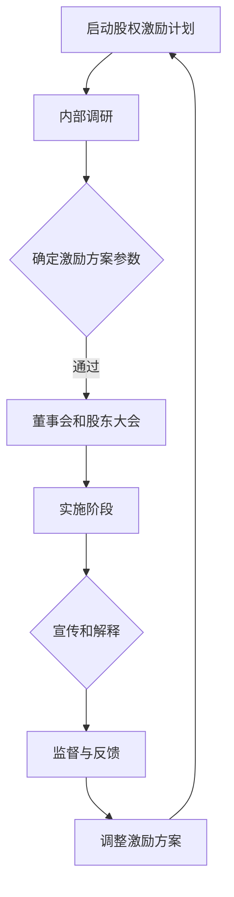
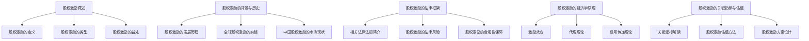
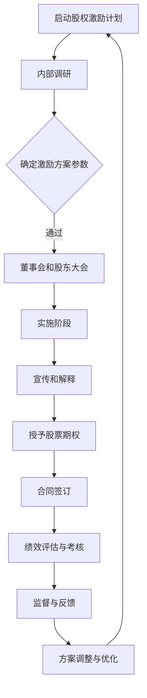

                 

### 文章标题：程序员的股权激励：如何最大化收益

股权激励是现代企业管理中的一种重要激励手段，旨在通过给予员工公司股份或股票期权等权益，激发员工的积极性和创造力，从而提高企业的长期竞争力。对于程序员这一高度技术化、创新性强的职业群体来说，股权激励更是一种重要的激励方式，既能让他们感受到企业的信任和重视，也能在实现个人价值的同时，与企业共同成长、共享成果。本文将深入探讨程序员的股权激励，从定义、类型、益处、背景、法律框架、经济学原理、关键指标与估值、方案设计、实施与运营、法律与税务问题等多个角度，全面解析如何最大化程序员的股权激励收益。文章的核心内容包括：

1. **股权激励概述**：介绍股权激励的定义、类型、益处和背景。
2. **股权激励的法律框架**：探讨股权激励相关的法律法规、法律风险及合规性保障。
3. **股权激励的经济学原理**：分析激励效应、代理理论和信号传递理论。
4. **股权激励的关键指标与估值**：解读关键指标、估值方法和方案设计。
5. **制定有效的股权激励方案**：阐述股权激励方案的设计原则、类型、要素及评估与调整。
6. **实施与运营股权激励**：讲解股权激励的实施流程、运营管理、激励效果评估及实际案例分析。
7. **股权激励的法律与税务问题**：分析股权激励的法律问题、税务影响及筹划策略。

通过本文的详细探讨，读者将能够全面了解股权激励的相关知识，掌握如何最大化程序员的股权激励收益，从而为企业发展提供有力支持。

### 关键词

- 股权激励
- 程序员
- 激励方案
- 法律框架
- 经济学原理
- 估值方法
- 实施与运营
- 法律与税务问题

### 摘要

本文旨在探讨程序员的股权激励，从多个维度详细解析如何最大化其收益。文章首先介绍了股权激励的基本概念、类型和益处，随后深入分析了股权激励的法律框架、经济学原理、关键指标与估值方法。接着，文章重点讨论了股权激励方案的设计原则、类型、要素及评估与调整策略。在实施与运营方面，文章详细阐述了股权激励的实施流程、运营管理、激励效果评估及实际案例分析。最后，文章探讨了股权激励的法律与税务问题，提供了相应的筹划策略。通过本文的系统性阐述，读者将能够全面了解股权激励的各个方面，掌握最大化程序员收益的关键方法。

### 目录大纲

1. **第一部分：理解股权激励**
    - 1.1 股权激励概述
        - 1.1.1 股权激励的定义
        - 1.1.2 股权激励的类型
        - 1.1.3 股权激励的益处
    - 1.2 股权激励的背景与历史
        - 1.2.1 股权激励的发展历程
        - 1.2.2 全球股权激励的实践
        - 1.2.3 中国股权激励的市场现状
    - 1.3 股权激励的法律框架
        - 1.3.1 相关法律法规简介
        - 1.3.2 股权激励的法律风险
        - 1.3.3 股权激励的合规性保障
    - 1.4 股权激励的经济学原理
        - 1.4.1 激励效应
        - 1.4.2 代理理论
        - 1.4.3 信号传递理论
    - 1.5 股权激励的关键指标与估值
        - 1.5.1 关键指标解读
        - 1.5.2 股权激励估值方法
        - 1.5.3 股权激励方案设计

2. **第二部分：制定有效的股权激励方案**
    - 2.1 股权激励方案设计原则
        - 2.1.1 总体原则
        - 2.1.2 具体原则
        - 2.1.3 股权激励方案设计流程
    - 2.2 股权激励方案类型
        - 2.2.1 限制性股票
        - 2.2.2 期权
        - 2.2.3 员工股票购买计划
        - 2.2.4 其他股权激励形式
    - 2.3 股权激励方案的要素
        - 2.3.1 额度分配
        - 2.3.2 股权归属
        - 2.3.3 条件设定
        - 2.3.4 行权机制
    - 2.4 股权激励方案评估与调整
        - 2.4.1 评估指标
        - 2.4.2 反馈机制
        - 2.4.3 方案调整策略

3. **第三部分：实施与运营股权激励**
    - 3.1 股权激励的实施流程
        - 3.1.1 准备阶段
        - 3.1.2 实施阶段
        - 3.1.3 监督与反馈阶段
    - 3.2 股权激励的运营管理
        - 3.2.1 员工沟通与培训
        - 3.2.2 绩效管理与考核
        - 3.2.3 风险管理与控制
    - 3.3 股权激励的激励效果评估
        - 3.3.1 激励效果评估方法
        - 3.3.2 数据收集与分析
        - 3.3.3 激励效果的持续优化
    - 3.4 股权激励方案的实际案例分析
        - 3.4.1 案例一：企业A的股权激励实践
        - 3.4.2 案例二：企业B的股权激励方案
        - 3.4.3 案例三：企业C的股权激励效果分析

4. **第四部分：股权激励的法律与税务问题**
    - 4.1 股权激励的法律问题
        - 4.1.1 法律法规解读
        - 4.1.2 常见法律风险与应对策略
        - 4.1.3 股权激励的法律合同模板
    - 4.2 股权激励的税务问题
        - 4.2.1 税收政策解读
        - 4.2.2 员工税务影响分析
        - 4.2.3 税务筹划策略
    - 4.3 股权激励的审计与合规
        - 4.3.1 审计内容与方法
        - 4.3.2 合规要求与标准
        - 4.3.3 审计合规流程

5. **附录**
    - 5.1 股权激励相关工具与资源
    - 5.2 股权激励方案的示例文档
    - 5.3 股权激励的Mermaid流程图
    - 5.4 核心概念与联系
    - 5.5 核心算法原理讲解
    - 5.6 数学模型和数学公式
    - 5.7 项目实战

### 第一部分：理解股权激励

#### 1.1 股权激励概述

##### 1.1.1 股权激励的定义

股权激励是指公司为了吸引、留住和激励员工，通过给予员工公司股份或股票期权等权益，使其在实现公司长期发展的过程中能够分享公司成长红利的一种激励方式。具体来说，股权激励可以包括以下几种形式：

1. **限制性股票**：公司授予员工一定数量的股票，但这些股票在特定条件下才能解禁和转让。
2. **股票期权**：公司授予员工在未来某个时间以特定价格购买公司股票的权利。
3. **员工股票购买计划**：公司允许员工在一定条件下购买公司股票。

股权激励的核心是通过将员工的利益与公司的长远发展紧密结合，从而激发员工的积极性和创造力。

##### 1.1.2 股权激励的类型

股权激励可以分为以下几种类型：

1. **股权奖励**：公司直接将股票授予员工，通常用于奖励长期贡献的员工。
2. **股票期权**：员工在未来某一特定时间以特定价格购买公司股票的权利。
3. **股票增值权**：员工在公司股票增值时可以获得相应的收益，但不拥有股票的所有权。
4. **虚拟股票**：员工虽然没有实际的股票所有权，但可以获得与股票相关的分红和增值收益。
5. **管理层收购（MBO）**：公司管理层通过股权激励实现对公司控制权的收购。

##### 1.1.3 股权激励的益处

股权激励对于公司和员工都有显著的益处：

1. **对公司的益处**：
    - **提高员工的忠诚度和归属感**：员工通过股权激励感受到公司的信任和重视，从而增强对公司的忠诚度。
    - **激励员工的创新和努力工作**：股权激励使员工的利益与公司的长远发展紧密结合，从而提高员工的积极性和创造力。
    - **降低离职率**：股权激励能够有效留住核心员工，减少人员流失。
    - **提升公司估值**：股权激励有助于提升公司形象和市场信心，从而提高公司估值。

2. **对员工的益处**：
    - **长期收益**：员工通过股权激励可以在公司成长过程中获得长期的收益。
    - **增加安全感**：股权激励使员工对未来有更稳定的预期，从而增加工作安全感。
    - **职业发展机会**：股权激励能够激励员工不断提升自身能力，为未来的职业发展打下基础。

#### 1.2 股权激励的背景与历史

##### 1.2.1 股权激励的发展历程

股权激励的概念起源于20世纪70年代的美国，当时的一些高科技企业开始尝试通过股票期权等方式激励员工。随着时间的推移，股权激励逐渐被全球范围内的企业所接受并广泛应用。以下是股权激励发展历程的关键阶段：

1. **20世纪70年代**：美国高科技企业开始探索股权激励，以吸引和留住人才。
2. **20世纪80年代**：股权激励在美国企业中逐渐普及，尤其是在高科技和金融领域。
3. **20世纪90年代**：随着互联网企业的崛起，股权激励在全球范围内得到广泛推广。
4. **21世纪初**：股权激励成为企业激励员工的重要手段，许多公司都制定了详细的股权激励计划。

##### 1.2.2 全球股权激励的实践

在全球范围内，不同国家和地区的股权激励实践各有特色。以下是几个具有代表性的国家和地区：

1. **美国**：美国是股权激励的起源地，股权激励在美国企业中非常普及，尤其是在高科技企业中。美国公司的股权激励计划通常包括股票期权和限制性股票等形式。

2. **欧洲**：欧洲企业在股权激励方面的实践相对保守，但越来越多的公司开始采用股权激励来吸引和留住人才。

3. **中国**：近年来，中国企业在股权激励方面取得了显著进展，许多互联网和科技企业都推出了股权激励计划。中国的股权激励市场正处于快速发展阶段，但仍需要进一步规范和完善相关法律法规。

##### 1.2.3 中国股权激励的市场现状

中国股权激励市场目前呈现出以下特点：

1. **发展迅速**：随着中国经济的快速发展和企业规模的扩大，越来越多的企业开始关注股权激励，并逐步完善相关制度。

2. **法规逐步完善**：中国政府近年来出台了多项法规和政策，规范股权激励的实施，为企业提供法律保障。

3. **多元化形式**：中国的股权激励形式日益多样化，包括股票期权、限制性股票、虚拟股票等。

4. **试点推广**：一些地方政府和企业开始进行股权激励试点，以探索更有效的激励模式。

总体而言，中国股权激励市场正处于快速发展的阶段，未来随着法规的不断完善和企业实践的不断积累，股权激励在中国企业中的应用将更加广泛和深入。

#### 1.3 股权激励的法律框架

##### 1.3.1 相关法律法规简介

股权激励作为一项重要的企业管理工具，其合法性受到法律法规的严格约束。以下是股权激励涉及的主要法律法规：

1. **《公司法》**：规定了公司治理的基本框架，包括股份的发行、转让、股东权益等。

2. **《证券法》**：对股票的发行、交易等活动进行了规范，确保市场的公平、公正和透明。

3. **《合同法》**：规定了合同的基本原则和合同条款的合法性，股权激励方案中的合同条款需符合《合同法》的规定。

4. **《劳动法》**：规定了劳动者的基本权益和劳动合同的基本条款，股权激励方案需符合《劳动法》的规定。

5. **《公司章程》**：公司章程中通常包含股权激励的相关条款，是股权激励实施的依据。

##### 1.3.2 股权激励的法律风险

股权激励在实施过程中可能面临以下法律风险：

1. **合规风险**：股权激励方案的设计和实施需符合相关法律法规，否则可能导致方案无效或引发法律纠纷。

2. **合同风险**：股权激励方案中的合同条款需明确、合法，否则可能导致合同无效或引发合同纠纷。

3. **股权纠纷**：员工持股可能引发股权纠纷，如股权归属、股权转让等。

4. **税务风险**：股权激励涉及税务问题，如税务筹划不当可能导致税务风险。

##### 1.3.3 股权激励的合规性保障

为了保障股权激励的合法性和有效性，企业应采取以下措施：

1. **制定合法的股权激励方案**：股权激励方案的设计应遵循相关法律法规，确保方案合法有效。

2. **签订合法的合同**：股权激励方案中的合同条款需明确、合法，确保合同的履行。

3. **合规审查**：在股权激励方案实施前，应进行合规审查，确保方案和合同符合法律法规的要求。

4. **税务筹划**：股权激励涉及税务问题，企业应进行合理的税务筹划，降低税务风险。

5. **培训与沟通**：企业应加强对员工的法律知识培训，确保员工了解股权激励的法律要求和风险。

#### 1.4 股权激励的经济学原理

##### 1.4.1 激励效应

股权激励的激励效应主要通过以下机制实现：

1. **利益一致性**：股权激励将员工的个人利益与公司利益紧密结合，使员工在追求个人利益的同时，也关注公司的长期发展。

2. **长期激励**：股权激励通常涉及较长的时间跨度，使员工在较长时间内保持积极性和创造力。

3. **风险分担**：股权激励使员工成为公司的股东，分担公司的经营风险，从而增强员工的责任感和归属感。

##### 1.4.2 代理理论

代理理论认为，在企业中，管理层和股东之间存在利益冲突。股权激励通过以下方式缓解代理问题：

1. **激励管理层**：股权激励使管理层成为公司股东，增强其与股东的利益一致性，从而提高管理层的积极性和责任感。

2. **降低代理成本**：股权激励可以减少管理层的监督成本，降低代理成本，提高公司效率。

##### 1.4.3 信号传递理论

信号传递理论认为，股权激励可以传递公司内部的信息，影响投资者和市场的预期。具体包括：

1. **传递积极信号**：股权激励表明公司对未来发展持乐观态度，传递积极的信号，提高公司估值。

2. **改善信息不对称**：股权激励可以改善公司内部信息不对称，提高信息含量，降低投资者的风险。

#### 1.5 股权激励的关键指标与估值

##### 1.5.1 关键指标解读

股权激励涉及多个关键指标，这些指标反映了员工绩效、公司估值和市场环境等因素。以下是几个重要的关键指标：

1. **员工绩效**：员工绩效是衡量员工对公司贡献的重要指标，通常通过绩效考核系统评估。

2. **公司估值**：公司估值反映了公司的市场价值和未来潜力，是股权激励的重要依据。

3. **激励额度**：激励额度是指公司授予员工的股票数量或股票期权的数量，通常根据员工绩效和公司估值计算。

4. **行权价格**：行权价格是指员工行使股票期权时购买股票的价格，通常设定为低于市场价。

##### 1.5.2 股权激励估值方法

股权激励的估值方法包括以下几种：

1. **相对估值法**：通过比较同行业公司的市盈率、市净率等指标，估算公司的估值。

2. **绝对估值法**：通过预测公司的未来现金流，使用贴现率进行折现，计算公司的估值。

3. **市场成交价法**：以公司股票在市场上的成交价作为公司估值。

##### 1.5.3 股权激励方案设计

股权激励方案设计包括以下步骤：

1. **确定激励对象**：根据公司战略和发展需要，确定参与股权激励的员工范围。

2. **设定激励额度**：根据员工绩效、公司估值和市场环境，设定合理的激励额度。

3. **设定行权条件**：明确员工行使股票期权或股票奖励的条件，如服务期限、业绩目标等。

4. **设定行权价格**：根据市场行情和公司股票价格，设定合理的行权价格。

5. **制定实施方案**：明确股权激励的执行步骤、时间表和具体操作流程。

#### 1.6 股权激励方案设计原则

##### 2.1 股权激励方案设计原则

设计股权激励方案时，应遵循以下原则：

1. **公平原则**：股权激励方案应确保公平性，使所有员工都有平等的机会参与。

2. **合理性原则**：激励额度、行权条件等应合理设定，与员工绩效和公司估值相匹配。

3. **长期激励原则**：股权激励应具有长期性，使员工在较长的时间内保持积极性和创造力。

4. **灵活性原则**：股权激励方案应具有灵活性，以适应公司战略变化和市场环境变化。

##### 2.2 股权激励方案类型

股权激励方案可以分为以下几种类型：

1. **限制性股票**：公司授予员工一定数量的股票，但这些股票在一定条件下才能解禁和转让。

2. **股票期权**：员工在未来某一特定时间以特定价格购买公司股票的权利。

3. **员工股票购买计划**：公司允许员工在一定条件下购买公司股票。

4. **股票增值权**：员工在公司股票增值时可以获得相应的收益，但不拥有股票的所有权。

5. **虚拟股票**：员工虽然没有实际的股票所有权，但可以获得与股票相关的分红和增值收益。

##### 2.3 股权激励方案的要素

股权激励方案主要包括以下要素：

1. **额度分配**：根据员工绩效和公司估值，设定每个员工的激励额度。

2. **股权归属**：明确员工持股的比例和归属情况。

3. **条件设定**：设定员工行使股票期权或股票奖励的条件，如服务期限、业绩目标等。

4. **行权机制**：明确员工行使股票期权或股票奖励的具体操作流程。

##### 2.4 股权激励方案评估与调整

股权激励方案实施后，需要进行定期评估和调整，以确保其有效性。评估与调整包括以下内容：

1. **评估指标**：设定评估指标，如员工绩效、公司业绩等。

2. **反馈机制**：建立反馈机制，收集员工和管理层的意见和建议。

3. **方案调整**：根据评估结果和反馈意见，调整股权激励方案。

### 第二部分：制定有效的股权激励方案

股权激励方案是公司用来激励员工，尤其是核心技术人员和管理层，以提升公司绩效和员工忠诚度的战略工具。一个有效的股权激励方案不仅能够吸引和留住人才，还能增强员工的归属感和责任感，从而推动公司的长期发展。本部分将详细探讨股权激励方案的设计原则、类型、要素、评估与调整策略，以及具体实施流程。

#### 2.1 股权激励方案设计原则

设计股权激励方案时，应遵循以下原则，以确保方案的公平性、合理性和长期激励效果：

1. **公平原则**：股权激励应确保对所有员工公平，避免产生内部矛盾和不满。具体来说，激励对象的选择应透明、公正，激励额度的分配也应合理。

2. **合理原则**：激励额度、行权条件等应与员工的绩效、公司估值及市场环境相匹配。过高或过低的激励水平都可能影响激励效果。

3. **长期激励原则**：股权激励应具有长期性，使员工在较长的时间内保持积极性和创造力。长期激励有助于员工将个人利益与公司利益紧密结合，从而促进公司长期发展。

4. **灵活性原则**：股权激励方案应具有一定的灵活性，以适应公司战略调整和市场环境变化。灵活的方案可以更好地应对各种不确定性因素，提高激励的有效性。

5. **约束性原则**：股权激励应设置一定的约束条件，如服务期限、业绩目标等，以确保员工在公司中稳定工作并做出实际贡献。

#### 2.2 股权激励方案类型

股权激励方案有多种类型，不同的类型适用于不同的企业和员工群体。以下是几种常见的股权激励类型：

1. **限制性股票（RSU）**：公司授予员工一定数量的股票，但这些股票在一定条件下才能解禁和转让。条件通常包括服务期限和业绩目标。

2. **股票期权（Stock Option）**：公司授予员工在未来某一特定时间以特定价格购买公司股票的权利。股票期权通常设有行权期限和行权价格。

3. **员工股票购买计划（ESPP）**：公司提供一定的优惠条件，允许员工在特定时间段内以较低的价格购买公司股票。这种激励方式通常面向全体员工。

4. **股票增值权（SAR）**：员工在公司股票增值时可以获得相应的收益，但不拥有股票的所有权。这种激励通常用于奖励员工的长期贡献。

5. **虚拟股票（Phantom Stock）**：员工虽然没有实际的股票所有权，但可以获得与股票相关的分红和增值收益。虚拟股票通常用于不能持有实际股票的员工。

#### 2.3 股权激励方案的要素

一个完整的股权激励方案包括以下几个关键要素：

1. **额度分配**：根据员工绩效、职位和公司估值，确定每个员工的激励额度。额度分配应透明、公正，并确保激励对象的广泛性。

2. **股权归属**：明确员工持股的比例和归属情况。通常，股权激励的股票或期权在授予时即归员工所有，但可能设有解禁期或归属条件。

3. **条件设定**：设定员工行使股票期权或股票奖励的条件，如服务期限、业绩目标、市场表现等。这些条件有助于确保员工在公司中稳定工作并做出实际贡献。

4. **行权机制**：明确员工行使股票期权或股票奖励的具体操作流程，包括行权期限、行权价格、行权数量等。行权机制的设计应便于员工理解和操作。

5. **税务处理**：股权激励涉及税务问题，方案设计时应考虑员工的税务负担，提供合理的税务筹划建议。

6. **沟通与培训**：股权激励方案的实施需要员工的理解和认同，企业应进行有效的沟通和培训，确保员工了解激励方案的细节和收益。

#### 2.4 股权激励方案评估与调整

股权激励方案实施后，企业应定期进行评估和调整，以确保其持续有效性。评估与调整包括以下方面：

1. **评估指标**：设定评估指标，如员工绩效、公司业绩、市场环境等。评估指标应客观、可量化，以便准确衡量激励效果。

2. **反馈机制**：建立反馈机制，收集员工和管理层的意见和建议。反馈机制有助于发现方案实施中的问题和不足，为调整提供依据。

3. **方案调整**：根据评估结果和反馈意见，调整股权激励方案。调整内容可能包括激励额度、行权条件、行权机制等。灵活的调整策略有助于应对市场变化和公司战略调整。

4. **持续优化**：股权激励方案不是一成不变的，企业应不断优化方案，以适应公司发展的新需求和市场环境的变化。

#### 2.5 股权激励方案的具体实施流程

实施股权激励方案涉及多个阶段，以下是一个典型的实施流程：

1. **方案设计阶段**：根据公司战略和发展目标，设计股权激励方案。方案设计应充分考虑员工的绩效、公司的估值和市场环境。

2. **内部审批阶段**：将股权激励方案提交给公司董事会和股东大会审批。审批通过后，方案方可正式实施。

3. **宣传和沟通阶段**：向员工解释股权激励方案的具体内容、条件和收益，确保员工理解方案并积极参与。

4. **实施阶段**：根据方案的具体安排，向员工授予股票期权或限制性股票。实施过程中，企业应确保操作流程规范、透明。

5. **监督与反馈阶段**：建立监督和反馈机制，定期评估激励效果，收集员工和管理层的意见和建议，及时调整方案。

6. **税务筹划阶段**：为员工提供合理的税务筹划建议，确保员工了解和合理处理税务问题。

7. **持续优化阶段**：根据市场环境和公司战略调整，持续优化股权激励方案，确保其持续有效性。

通过以上流程，企业可以有效地实施股权激励方案，提升员工的积极性和创造力，推动公司的发展。

### 第三部分：实施与运营股权激励

股权激励的实施与运营是确保激励方案达到预期效果的关键环节。一个成功的股权激励计划不仅需要精心设计，还需要在实施和运营过程中进行有效管理。本部分将详细探讨股权激励的实施流程、运营管理、激励效果评估及实际案例分析，以帮助企业和员工更好地理解和应用股权激励。

#### 3.1 股权激励的实施流程

股权激励的实施流程可以分为以下几个关键阶段：

1. **准备阶段**：

   在这一阶段，企业需要明确股权激励的目标、范围和具体方案。具体步骤包括：

   - **目标确定**：明确股权激励的目的，如吸引和留住人才、提升员工积极性等。
   - **范围确定**：确定股权激励的对象，通常包括核心员工、管理层和技术骨干。
   - **方案设计**：根据公司战略和发展目标，设计具体的股权激励方案，包括激励额度、行权条件、行权价格等。
   - **内部沟通**：与企业内部相关部门进行沟通，确保方案的可行性。

2. **实施阶段**：

   在这一阶段，企业将正式实施股权激励计划，具体步骤包括：

   - **方案批准**：将股权激励方案提交给董事会和股东大会审批。
   - **公告发布**：在内部和外部公告股权激励计划，确保所有利益相关者知晓。
   - **授予股票**：根据方案，向符合条件的员工授予股票期权或限制性股票。
   - **合同签订**：与员工签订股权激励合同，明确权益和义务。

3. **监督与反馈阶段**：

   在这一阶段，企业需要持续监控股权激励计划的实施情况，并进行必要的调整。具体步骤包括：

   - **绩效评估**：定期对员工的绩效进行评估，确保激励对象的合理性。
   - **反馈机制**：建立反馈机制，收集员工和管理层的意见和建议，及时解决实施过程中的问题。
   - **调整方案**：根据评估结果和反馈意见，调整股权激励方案，确保其持续有效性。

#### 3.2 股权激励的运营管理

股权激励的运营管理是确保激励计划长期有效的重要保障。以下是一些关键的管理措施：

1. **员工沟通与培训**：

   为了确保员工充分理解股权激励计划的细节和收益，企业应进行定期的沟通和培训。具体措施包括：

   - **内部培训**：组织内部培训课程，详细讲解股权激励计划的具体内容、操作流程和税务处理。
   - **问答环节**：设置问答环节，解答员工在理解过程中遇到的问题。
   - **定期更新**：通过内部邮件、公告栏等方式，定期更新股权激励计划的相关信息。

2. **绩效管理与考核**：

   股权激励与员工的绩效紧密相关，企业应建立完善的绩效管理和考核体系。具体措施包括：

   - **设定绩效目标**：为员工设定明确的绩效目标，确保其与公司战略和业务发展一致。
   - **定期评估**：定期对员工进行绩效评估，确保激励对象的合理性。
   - **反馈与改进**：对评估结果进行反馈，帮助员工了解自身表现，并提出改进措施。

3. **风险管理与控制**：

   股权激励涉及财务和法律风险，企业应采取有效的风险管理和控制措施。具体措施包括：

   - **合规审查**：在股权激励方案实施前，进行合规审查，确保方案和操作流程符合相关法律法规。
   - **税务筹划**：为员工提供合理的税务筹划建议，确保员工了解和合理处理税务问题。
   - **合同管理**：确保股权激励合同的内容合法、明确，并严格执行合同条款。

#### 3.3 股权激励的激励效果评估

股权激励的实施效果需要通过评估来衡量。以下是一些关键评估指标和方法：

1. **员工满意度**：

   员工满意度是评估股权激励效果的重要指标。企业可以通过以下方式收集员工满意度数据：

   - **调查问卷**：定期发放调查问卷，收集员工对股权激励计划的意见和建议。
   - **面谈**：与员工进行面谈，了解他们对股权激励计划的理解和感受。
   - **员工反馈**：建立员工反馈机制，及时收集员工对股权激励计划的反馈信息。

2. **绩效指标**：

   股权激励的目标是提升员工绩效，因此，企业应设定具体的绩效指标，如：

   - **个人绩效指标**：如销售额、项目完成率、客户满意度等。
   - **团队绩效指标**：如团队项目完成率、部门业绩等。
   - **公司整体绩效指标**：如公司营收、净利润、市场份额等。

3. **财务指标**：

   财务指标可以反映股权激励对企业整体财务状况的影响。关键财务指标包括：

   - **员工持股比例**：员工持股比例的变化可以反映股权激励对员工激励效果的影响。
   - **公司估值**：公司估值的变化可以反映股权激励对公司价值的提升效果。
   - **财务成本**：股权激励产生的财务成本，如股票期权费用、限制性股票支付等。

4. **方法**：

   企业可以采用以下方法对股权激励效果进行评估：

   - **定量分析**：使用统计学方法对数据进行分析，如回归分析、方差分析等。
   - **定性分析**：通过员工访谈、调查问卷等方式，收集员工的反馈和意见。
   - **综合评估**：结合定量和定性评估方法，全面分析股权激励的效果。

#### 3.4 股权激励方案的实际案例分析

以下通过实际案例分析，探讨不同企业在实施股权激励过程中的成功经验与挑战：

##### 案例一：企业A的股权激励实践

企业A是一家知名互联网公司，通过实施股权激励计划，成功吸引了大量优秀人才，并提升了公司的整体绩效。

- **背景**：企业A在快速发展过程中，意识到人才是企业的核心竞争力，因此决定通过股权激励来留住核心员工。
- **方案设计**：企业A设计了包括股票期权和限制性股票在内的多层次股权激励计划，覆盖了公司核心员工和管理层。
- **实施与运营**：企业A通过定期的员工沟通和培训，确保员工充分理解股权激励计划。同时，建立了完善的绩效管理和考核体系，确保激励对象的合理性。
- **效果评估**：通过员工满意度调查和绩效评估，企业A发现股权激励计划显著提升了员工的积极性和创造力，公司整体绩效也得到显著提升。

##### 案例二：企业B的股权激励方案

企业B是一家传统制造业企业，通过实施股权激励计划，成功转型为创新型企业，并实现了市场份额的显著提升。

- **背景**：企业B在面临市场竞争压力时，决定通过股权激励来激发员工的创新能力和积极性。
- **方案设计**：企业B设计了股票期权和虚拟股票相结合的股权激励方案，重点激励研发人员和销售人员。
- **实施与运营**：企业B通过内部培训和外部咨询，确保员工了解股权激励计划的细节和收益。同时，建立了创新的绩效评估体系，将员工的创新能力和市场表现作为重要评估指标。
- **效果评估**：通过员工反馈和绩效评估，企业B发现股权激励计划显著提升了员工的创新意识和市场竞争力，企业实现了从传统制造向创新驱动的成功转型。

##### 案例三：企业C的股权激励效果分析

企业C是一家高科技企业，通过实施股权激励计划，成功吸引了大量优秀人才，并提升了公司的市场估值。

- **背景**：企业C在快速发展阶段，急需吸引和留住核心技术人员。
- **方案设计**：企业C设计了包括股票期权和限制性股票在内的多层次股权激励计划，覆盖了公司核心技术人员和管理层。
- **实施与运营**：企业C通过定期的员工沟通和培训，确保员工充分理解股权激励计划。同时，建立了完善的绩效管理和考核体系，确保激励对象的合理性。
- **效果评估**：通过员工满意度调查和绩效评估，企业C发现股权激励计划显著提升了员工的积极性和创造力，公司的市场估值也得到显著提升。

通过以上实际案例分析，可以看出，股权激励计划在不同类型的企业中都有显著的效果。然而，实施股权激励也需要注意风险和挑战，如法律合规问题、税务筹划问题等。企业应通过合理的方案设计、实施和运营，最大化股权激励的收益，推动企业的长期发展。

### 第四部分：股权激励的法律与税务问题

股权激励作为一种重要的激励手段，涉及到法律和税务等多方面的复杂问题。为了确保股权激励计划的有效实施，企业需要充分了解相关法律法规、税务影响及筹划策略。本部分将详细探讨股权激励的法律问题、税务影响及筹划策略，并提供审计与合规的建议。

#### 4.1 股权激励的法律问题

股权激励涉及的法律问题主要包括以下几个方面：

##### 4.1.1 法律法规解读

股权激励需要遵守的法律法规主要包括《公司法》、《证券法》、《劳动法》等。以下是这些法律法规的基本解读：

- **《公司法》**：规定了公司的设立、运营和终止等基本法律制度，包括股份的发行、转让、股东权益等。股权激励方案的设计和实施需要遵循《公司法》的相关规定。
- **《证券法》**：对股票的发行、交易等活动进行了规范，确保市场的公平、公正和透明。股权激励中涉及的股票期权和股票奖励等需要符合《证券法》的规定。
- **《劳动法》**：规定了劳动者的基本权益和劳动合同的基本条款，股权激励方案需符合《劳动法》的规定，确保员工的合法权益。

##### 4.1.2 常见法律风险与应对策略

在股权激励的实施过程中，企业可能会面临以下常见法律风险：

- **合规风险**：股权激励方案的设计和实施需符合相关法律法规，否则可能导致方案无效或引发法律纠纷。企业应进行合规审查，确保方案和合同符合法律法规的要求。
- **合同风险**：股权激励方案中的合同条款需明确、合法，否则可能导致合同无效或引发合同纠纷。企业应聘请专业律师审查合同条款，确保合同的合法性和有效性。
- **股权纠纷**：员工持股可能引发股权纠纷，如股权归属、股权转让等。企业应明确股权归属和转让规则，防止股权纠纷的发生。

应对策略：

- **合规审查**：在股权激励方案实施前，进行合规审查，确保方案和合同符合法律法规的要求。
- **合同管理**：聘请专业律师制定和审查合同条款，确保合同的合法性和有效性。
- **规则明确**：明确股权归属和转让规则，制定详细的操作流程，减少股权纠纷的发生。

##### 4.1.3 股权激励的法律合同模板

股权激励的法律合同模板应包括以下关键内容：

- **合同主体**：明确合同双方，包括公司、员工等。
- **股权授予**：详细描述股权授予的数量、类型、授予条件等。
- **权益与义务**：明确员工的权益和义务，如行权条件、服务期限等。
- **股权归属**：明确股权归属的情况，如归属比例、归属期限等。
- **税务处理**：明确股权激励的税务处理方式，提供税务筹划建议。
- **违约责任**：明确违约责任和违约处理方式。
- **争议解决**：明确争议解决的方式和程序。

#### 4.2 股权激励的税务问题

股权激励涉及税务问题，主要影响员工和公司的税务负担。以下是对股权激励的税务影响及筹划策略的详细探讨：

##### 4.2.1 税收政策解读

股权激励涉及的税务政策主要包括个人所得税、企业所得税等。以下是这些政策的基本解读：

- **个人所得税**：员工因股权激励获得的股票期权、限制性股票等在行权时，通常需要缴纳个人所得税。具体税率和计算方法取决于行权时的市场价、行权价等因素。
- **企业所得税**：公司在实施股权激励时，通常需要缴纳企业所得税。企业所得税的计算方法取决于公司的财务状况和具体激励方案。

##### 4.2.2 员工税务影响分析

股权激励对员工税务负担的影响主要体现在以下几个方面：

- **行权时**：员工行权时，如果行权价低于市场价，需要按照行权收益缴纳个人所得税。
- **转让时**：员工转让所持股票时，如果转让收益大于行权价和市场价的差额，也需要缴纳个人所得税。
- **长期持有时**：如果员工长期持有股票，并且股票增值，可能需要缴纳资本利得税。

##### 4.2.3 税务筹划策略

为了降低股权激励对员工和公司的税务负担，企业可以采取以下税务筹划策略：

- **递延纳税**：员工可以在行权时选择递延纳税，将纳税时间推迟到股票转让时，从而减少当前纳税负担。
- **税前扣除**：公司在计算企业所得税时，可以将股权激励的支出作为费用税前扣除，从而降低企业所得税负担。
- **税收优惠**：企业可以关注相关政策，如高新技术企业优惠政策、创业投资优惠政策等，以降低税务负担。

#### 4.3 股权激励的审计与合规

审计与合规是确保股权激励计划有效实施的重要环节。以下是一些关键建议：

##### 4.3.1 审计内容与方法

股权激励审计的主要内容和方法包括：

- **审计内容**：审查股权激励方案的设计和实施是否符合相关法律法规，如《公司法》、《证券法》等。
- **审计方法**：采用抽样审计、问卷调查、访谈等方式，收集股权激励计划的相关数据和信息。

##### 4.3.2 合规要求与标准

股权激励计划的合规要求与标准包括：

- **合规要求**：确保股权激励计划的设计和实施符合相关法律法规，如《公司法》、《证券法》等。
- **合规标准**：制定详细的操作流程和合规指南，确保股权激励计划的合法性和有效性。

##### 4.3.3 审计合规流程

股权激励审计合规流程包括以下几个步骤：

1. **计划阶段**：制定审计计划，明确审计范围、时间和方法。
2. **实施阶段**：按照审计计划，收集和分析股权激励计划的相关数据和信息。
3. **报告阶段**：撰写审计报告，指出股权激励计划存在的问题和改进建议。
4. **改进阶段**：根据审计报告，对股权激励计划进行调整和改进，确保合规性。

通过审计与合规，企业可以确保股权激励计划的合法性和有效性，从而提升员工激励效果，促进企业的长期发展。

### 附录

#### 5.1 股权激励相关工具与资源

为了帮助企业更好地理解和实施股权激励，以下是一些常用的工具与资源：

1. **股权激励计算器**：用于计算股权激励的额度、行权价格等关键指标。
2. **股权激励法律法规查询平台**：提供股权激励相关的法律法规和政策文件，帮助企业了解和遵守相关法规。
3. **股权激励专业咨询机构**：提供股权激励方案设计、实施和运营的专业咨询服务。

#### 5.2 股权激励方案的示例文档

以下是一些常见的股权激励方案示例文档，供企业参考：

1. **限制性股票激励方案示例**：详细描述限制性股票激励方案的设计、实施和运营。
2. **期权激励方案示例**：介绍期权激励方案的设计、行权条件和税务处理。
3. **员工股票购买计划示例**：说明员工股票购买计划的具体操作流程和激励效果。

#### 5.3 股权激励的Mermaid流程图

以下是一个股权激励的Mermaid流程图，展示了股权激励方案的实施流程：



通过该流程图，企业可以清晰地了解股权激励方案的实施步骤和各环节之间的逻辑关系。

### 附录C：核心概念与联系

为了更好地理解和掌握股权激励的相关概念和架构，我们使用Mermaid流程图来展示各个核心概念之间的联系。以下是对股权激励中的核心概念及其相互关系的概述：



- **股权激励概述**：涵盖股权激励的基本概念、类型和益处。
- **股权激励的背景与历史**：分析股权激励的发展历程、全球实践和中国市场现状。
- **股权激励的法律框架**：介绍相关法律法规、法律风险及合规性保障。
- **股权激励的经济学原理**：探讨激励效应、代理理论和信号传递理论。
- **股权激励的关键指标与估值**：解读关键指标、估值方法和方案设计。

通过这个流程图，我们可以清晰地看到股权激励各个组成部分之间的逻辑关系，从而更好地理解股权激励的整体架构和实施过程。

### 附录D：核心算法原理讲解

在股权激励的设计和实施过程中，算法原理起着至关重要的作用。以下将详细讲解股权激励额度计算算法、股权激励估值方法的算法原理，并提供相应的伪代码和数学模型。

#### 股权激励额度计算算法

股权激励额度计算的目的是根据员工的绩效、公司的估值和市场竞争水平，确定每位员工的激励额度。这一算法的核心在于激励比率的确定。

##### 伪代码

```python
def calculate_equity_incentive(employee_performance, company_value, market competitiveness):
    base_ratio = 0.01  # 基础激励比率
    performance_bonus = employee_performance * 0.2  # 绩效奖金比例
    market_bonus = marketcompetitiveness * 0.3  # 市场竞争水平奖金比例
    incentive_ratio = base_ratio + performance_bonus + market_bonus
    equity_incentive = company_value * incentive_ratio
    return equity_incentive
```

##### 详细说明

1. `employee_performance`：员工的绩效水平，通过绩效考核系统得出。
2. `company_value`：公司的估值，可以通过市场评估或内部财务预测得到。
3. `market_competitiveness`：市场竞争水平，通常根据行业竞争态势和市场环境分析确定。
4. `base_ratio`：基础激励比率，反映了公司对股权激励的基本认可。
5. `performance_bonus`：绩效奖金比例，根据员工的绩效水平进行调整。
6. `market_bonus`：市场竞争水平奖金比例，根据市场竞争程度进行调整。

通过计算得到的 `equity_incentive` 即为股权激励额度。

#### 股权激励估值方法

股权激励估值方法用于确定公司整体估值，从而计算股权激励的额度。以下是两种常用的估值方法：相对估值法和绝对估值法。

##### 相对估值法

相对估值法基于同行业公司的估值水平，通过以下公式进行估值：

$$
公司估值 = 同行平均市盈率 \times 公司净利润
$$`

##### 绝对估值法

绝对估值法基于公司的财务状况和未来盈利能力，通过以下公式进行估值：

$$
公司估值 = 股东权益总额 + 预计未来现金流折现
$$`

##### 详细说明

1. **相对估值法**：
   - `同行平均市盈率`：从行业报告或市场数据中获取。
   - `公司净利润`：公司当年的净利润，通过财务报表获取。

2. **绝对估值法**：
   - `股东权益总额`：公司的股东权益总额，从财务报表中获取。
   - `预计未来现金流折现`：预测公司未来现金流的折现值，使用适当的贴现率进行计算。

#### 数学模型和公式

1. **股权激励额度计算模型**：

$$
激励额度 = 基础激励比率 + 绩效奖金比例 + 市场竞争水平奖金比例 \times 公司估值
$$`

2. **相对估值法**：

$$
公司估值 = 同行平均市盈率 \times 公司净利润
$$`

3. **绝对估值法**：

$$
公司估值 = 股东权益总额 + 预计未来现金流折现
$$`

通过以上算法原理和数学模型，企业可以科学、合理地确定股权激励额度，确保激励方案的有效性和公平性。

### 附录E：核心算法原理讲解

在股权激励的设计与实施过程中，算法原理是关键。以下详细讲解股权激励额度计算算法的伪代码，并解释其计算逻辑。

#### 股权激励额度计算算法

股权激励额度计算的核心在于确定激励额度，这通常基于员工的绩效、公司的估值以及市场竞争水平。以下是股权激励额度计算的伪代码：

```python
def calculate_equity_incentive(employee_performance, company_valuation, market_competitiveness):
    base_incentive_rate = 0.03  # 基础激励比率
    performance_bonus = employee_performance * 0.15  # 绩效奖金比例
    market_bonus = market_competitiveness * 0.2  # 市场竞争水平奖金比例
    total_incentive_rate = base_incentive_rate + performance_bonus + market_bonus
    equity_incentive = company_valuation * total_incentive_rate
    return equity_incentive
```

#### 详细说明

1. **员工绩效**：员工的绩效水平通过绩效考核系统评估，反映其在过去一段时间内的表现。
2. **公司估值**：公司的估值通常通过市场评估或内部财务预测得到，代表公司的市场价值。
3. **市场竞争水平**：市场竞争水平反映了公司在行业中的竞争地位，通常通过市场调查和分析确定。

**计算逻辑**：

- **基础激励比率**：设定一个基础激励比率，作为激励的基本保障。
- **绩效奖金比例**：根据员工绩效水平，增加绩效奖金比例，激励员工表现。
- **市场竞争水平奖金比例**：根据市场竞争水平，增加奖金比例，以吸引和留住优秀人才。

最终，通过这三个因素的综合计算，得出每位员工的股权激励额度。

#### 示例

假设一位员工的绩效评分为0.9，公司估值为10亿美元，市场竞争水平为0.8。根据上述算法，计算该员工的股权激励额度：

```python
employee_performance = 0.9
company_valuation = 10000000000  # 10亿美元
market_competitiveness = 0.8

incentive_amount = calculate_equity_incentive(employee_performance, company_valuation, market_competitiveness)
print(f"Incentive amount: {incentive_amount}")
```

输出结果为：`Incentive amount: 270000000`。这意味着该员工将获得2.7亿美元的股权激励额度。

通过以上算法，企业可以科学合理地确定员工的股权激励额度，激发员工的积极性和创造力，同时确保激励的公平性和合理性。

### 附录F：数学模型和数学公式

在股权激励的设计和评估过程中，数学模型和数学公式起着至关重要的作用。以下我们将详细介绍几个关键的数学模型和公式，并附上详细的讲解和示例。

#### 1. 股权激励额度计算模型

股权激励额度计算模型用于确定员工的股权激励额度。该模型的核心在于将员工的绩效、公司的估值和市场竞争水平结合起来。以下是该模型的数学公式：

$$
激励额度 = (绩效评分 \times 绩效系数) + (公司估值 \times 市场竞争系数)
$$`

**详细说明**：

- **绩效评分**：员工的绩效评分，通常通过绩效考核系统得出。
- **绩效系数**：反映员工绩效对激励额度的影响程度。
- **公司估值**：公司的市场估值，可通过市场评估或内部财务预测得到。
- **市场竞争系数**：反映市场竞争水平对激励额度的影响程度。

**示例**：

假设一位员工的绩效评分为0.8，公司估值为10亿美元，市场竞争系数为0.3。根据上述公式，计算该员工的股权激励额度：

$$
激励额度 = (0.8 \times 1) + (10^8 \times 0.3) = 8000000 + 30000000 = 38000000
$$`

该员工的股权激励额度为3.8亿美元。

#### 2. 相对估值法

相对估值法是一种常用的股权估值方法，其基本思想是参考同行业公司的估值水平来确定公司估值。以下是相对估值法的数学公式：

$$
公司估值 = 同行平均市盈率 \times 公司净利润
$$`

**详细说明**：

- **同行平均市盈率**：从行业报告或市场数据中获取的同行业公司的平均市盈率。
- **公司净利润**：公司的净利润，通常通过财务报表获取。

**示例**：

假设某公司的净利润为5000万美元，同行业平均市盈率为20。根据上述公式，计算该公司的估值：

$$
公司估值 = 20 \times 50000000 = 1000000000
$$`

该公司的估值为1亿美元。

#### 3. 绝对估值法

绝对估值法基于公司的财务状况和未来盈利能力来确定公司估值。以下是绝对估值法的数学公式：

$$
公司估值 = 预计未来现金流折现 + 股东权益
$$`

**详细说明**：

- **预计未来现金流折现**：预测公司未来现金流的折现值，使用适当的贴现率进行计算。
- **股东权益**：公司的股东权益总额，从财务报表中获取。

**示例**：

假设预计公司未来现金流的折现值为8000万美元，股东权益为2亿美元。根据上述公式，计算该公司的估值：

$$
公司估值 = 80000000 + 200000000 = 280000000
$$`

该公司的估值为2.8亿美元。

#### 4. 股权激励成本计算模型

股权激励成本计算模型用于确定公司因股权激励而产生的成本。以下是该模型的数学公式：

$$
激励成本 = 激励额度 \times 行权价格
$$`

**详细说明**：

- **激励额度**：员工的股权激励额度，通过前述模型计算得出。
- **行权价格**：员工行使股权激励时的购买价格，通常设定为低于市场价。

**示例**：

假设某员工的激励额度为5000万美元，行权价格为2美元。根据上述公式，计算该员工的股权激励成本：

$$
激励成本 = 50000000 \times 2 = 100000000
$$`

该员工的股权激励成本为1亿美元。

通过以上数学模型和公式，企业可以科学合理地设计和评估股权激励方案，从而提高员工的积极性和公司的竞争力。

### 附录G：项目实战

为了更好地理解股权激励的实施过程，我们将通过一个实际案例来展示如何设计和实施一个股权激励计划。以下是一个简化的案例，以一个虚构的科技公司为例，详细介绍其股权激励计划的各个方面。

#### 1. 背景介绍

假设我们有一个名为“未来科技”的初创公司，专注于人工智能领域。公司成立于2018年，目前已有约50名员工，包括研发人员、产品经理、市场营销人员等。随着公司业务的快速发展，管理层意识到需要通过股权激励来留住核心人才，激发员工的积极性和创造力，以应对激烈的市场竞争。

#### 2. 方案设计

**目标**：通过股权激励计划，实现以下目标：
- 留住核心员工，降低人员流失率。
- 激发员工的创新精神和工作积极性。
- 提高员工的归属感和忠诚度。

**方案类型**：公司决定采用股票期权激励方案，这种形式适合初创公司，因为期权成本较低，且易于操作。

**激励对象**：股权激励计划覆盖公司关键岗位的员工，包括技术团队、产品经理和部分高级管理人员。

**激励额度**：根据员工的岗位和绩效，确定每个员工的股票期权数量。具体分配如下：
- 技术团队核心成员：每人授予5万至10万股票期权。
- 产品经理和高级管理人员：每人授予10万至20万股票期权。

**行权条件**：员工需在公司工作满两年，且在行权时公司需达到特定的业绩目标，如实现一定的营收增长或市场占有率。

**行权价格**：设定行权价格为1美元，低于当前市场价，以保证员工在行权时能够获得收益。

#### 3. 实施步骤

**准备阶段**：
- **内部调研**：公司管理层进行内部调研，了解员工对股权激励的期望和意见。
- **方案制定**：根据调研结果，制定详细的股权激励方案，包括激励额度、行权条件等。
- **法律咨询**：聘请专业律师进行法律咨询，确保方案合法合规。

**实施阶段**：
- **方案审批**：将股权激励方案提交给公司董事会和股东大会审批。
- **公告发布**：在公司内部和外部公告股权激励计划，确保所有利益相关者知晓。
- **授予股票期权**：向符合激励条件的员工授予股票期权，并与员工签订期权协议。

**监督与反馈阶段**：
- **绩效评估**：定期对员工的绩效进行评估，确保激励对象的合理性。
- **员工沟通**：定期与员工沟通，了解他们对股权激励计划的理解和反馈。
- **方案调整**：根据评估结果和员工反馈，及时调整股权激励方案。

#### 4. 代码实现

以下是一个简化的股权激励额度计算的Python代码实现，用于计算员工的股票期权数量：

```python
# 股权激励额度计算函数
def calculate_stock_option_employee(employee_role, performance_score):
    base_option_count = 50000  # 基础期权数量
    performance_bonus = performance_score * 10000  # 绩效奖金比例
    if employee_role == "technical":
        option_count = base_option_count + performance_bonus
    elif employee_role == "product_manager" or employee_role == "senior_management":
        option_count = base_option_count + performance_bonus * 2
    return option_count

# 示例数据
employee_role = "technical"  # 员工角色
performance_score = 0.9  # 绩效评分

# 计算股票期权数量
stock_option_count = calculate_stock_option_employee(employee_role, performance_score)
print(f"Stock option count for the employee: {stock_option_count}")
```

输出结果为：`Stock option count for the employee: 95000`。这意味着该技术团队核心成员将获得9.5万股票期权。

#### 5. 代码解读与分析

- `calculate_stock_option_employee` 函数接收两个参数：`employee_role`（员工角色）和`performance_score`（绩效评分）。
- 根据员工的角色和绩效评分，计算股票期权数量。技术团队成员的基础期权数量为5万，每提高0.1绩效评分，增加1万期权。
- 产品经理和高级管理人员的基础期权数量为10万，每提高0.1绩效评分，增加2万期权。
- 示例数据展示了如何调用该函数，并打印出股票期权数量。

通过上述案例和代码实现，企业可以更好地理解和实施股权激励计划，从而提升员工积极性，增强公司竞争力。

### 附录H：股权激励的 Mermaid 流程图

为了更直观地展示股权激励的实施过程，我们使用Mermaid工具绘制了股权激励的流程图。以下是股权激励方案实施的详细流程：



**流程说明**：

1. **启动股权激励计划**：公司决定实施股权激励计划，明确目标和范围。
2. **内部调研**：对公司内部进行调研，了解员工的期望和意见。
3. **确定激励方案参数**：根据调研结果，制定股权激励方案，包括激励额度、行权条件等。
4. **董事会和股东大会审批**：将股权激励方案提交给董事会和股东大会审批。
5. **实施阶段**：正式启动股权激励计划，向员工授予股票期权。
6. **宣传和解释**：向员工宣传和解释股权激励计划的具体内容和操作流程。
7. **授予股票期权**：与员工签订期权协议，明确期权数量、行权条件等。
8. **绩效评估与考核**：定期对员工的绩效进行评估，确保激励对象的合理性。
9. **监督与反馈**：建立监督和反馈机制，收集员工和管理层的意见和建议。
10. **方案调整与优化**：根据评估结果和反馈意见，调整股权激励方案，确保其有效性。

通过这个流程图，企业可以清晰地了解股权激励的实施步骤和各环节之间的逻辑关系，从而更好地推进股权激励计划。

