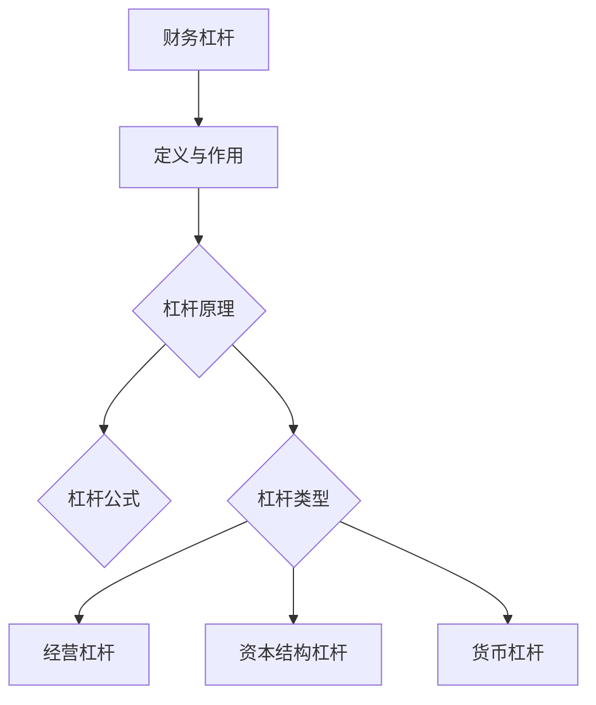

                 

### 第1章：引言与概述

#### 1.1 本书目标与结构

本书的目标是帮助程序员深入理解财务杠杆的概念、原理和应用，从而更好地进行个人财务规划和投资决策。全书共分为五个部分，结构如下：

1. **引言与概述**：介绍财务杠杆的基本概念、作用和重要性，为后续章节的内容奠定基础。
2. **财务杠杆的基本原理**：详细讲解财务杠杆的基本概念、杠杆原理与公式，以及财务杠杆的类型。
3. **财务杠杆的风险与收益分析**：分析财务杠杆的风险因素、收益来源及衡量方法，并探讨财务杠杆的利弊权衡。
4. **程序员的财务杠杆应用**：针对程序员的特性，探讨个人财务规划、投资与财务杠杆的应用，以及投资风险管理。
5. **财务杠杆的案例分析**：通过实际案例，展示优秀程序员的财务杠杆实践，提供经验总结和启示。

#### 1.2 程序员的财务杠杆概述

财务杠杆是一种通过借款或其他债务工具增加投资回报的财务策略。对于程序员而言，掌握财务杠杆的重要性主要体现在以下几个方面：

- **提高投资回报**：财务杠杆可以帮助程序员在投资时利用较小的自有资金获得更高的回报。
- **增强竞争力**：通过合理的财务杠杆，程序员可以在激烈的市场竞争中占据优势地位。
- **实现财务自由**：财务杠杆的应用有助于程序员实现财务自由，提高生活质量。

然而，财务杠杆也伴随着风险。因此，程序员在应用财务杠杆时，需要充分考虑其利弊，并采取有效的风险管理措施。

## 第二部分：财务杠杆的基本原理

### 第2章：财务杠杆的基本概念

#### 2.1 财务杠杆的定义与作用

财务杠杆是一种利用借款或其他债务工具来扩大投资收益的财务策略。其核心在于通过借入资金进行投资，从而提高股东回报率。

- **定义**：财务杠杆是指企业或个人通过借款、发行债券等手段，增加总资产，从而提高权益回报率的一种财务手段。
- **作用**：
  - **提高股东回报**：通过财务杠杆，企业可以使用较少的股东资本获得更多的资产和收益，从而提高股东回报率。
  - **提高盈利能力**：财务杠杆可以放大企业的盈利能力，特别是在利润较高的时期。

#### 财务杠杆的工作原理

财务杠杆的工作原理可以通过以下步骤来理解：

1. **借入资金**：企业通过借款或发行债券等方式获得外部资金。
2. **投资资金**：将这些外部资金用于购买资产或投资，比如股票、房地产或其他投资项目。
3. **收益分配**：投资产生的收益首先用于偿还借款利息，剩余部分作为股东回报。

#### 财务杠杆的公式

财务杠杆的衡量通常使用以下公式：

\[ \text{杠杆倍数} = \frac{\text{股东权益}}{\text{总负债}} \]

其中，股东权益是指企业所有者权益，总负债是指企业的总债务。杠杆倍数越高，表明企业的财务杠杆作用越强。

#### 财务杠杆的类型

财务杠杆可以分为以下几种类型：

- **经营杠杆**：通过增加固定成本（如租金、设备折旧等）来提高盈利能力。
- **资本结构杠杆**：通过调整资本结构（债务与权益的比例）来影响财务杠杆。
- **货币杠杆**：通过货币市场操作（如外汇交易、利率互换等）来提高财务杠杆。

### 2.2 杠杆原理与公式

#### 杠杆原理

杠杆原理是指通过利用外部资金来增加投资回报。其核心思想是，通过借款或债务，企业可以使用较少的自有资金进行投资，从而放大投资回报。

- **杠杆效应**：杠杆效应是指通过使用债务来增加投资回报的过程。具体来说，当投资的回报率高于借款的利率时，企业可以使用杠杆来增加净收益。
- **数学模型**：杠杆效应可以用以下数学模型表示：

\[ \text{净收益} = (\text{投资回报} - \text{借款成本}) \times \text{投资规模} \]

其中，投资回报是指投资所获得的收益，借款成本是指借款的利息费用。

#### 杠杆公式

财务杠杆的公式可以帮助我们衡量企业的财务杠杆程度。以下是一些常见的杠杆公式：

- **经营杠杆**：

\[ \text{经营杠杆} = \frac{\text{固定成本}}{\text{变动成本}} \]

- **资本结构杠杆**：

\[ \text{资本结构杠杆} = \frac{\text{股东权益}}{\text{总负债}} \]

- **货币杠杆**：

\[ \text{货币杠杆} = \frac{\text{货币市场操作收益}}{\text{货币市场操作成本}} \]

### 2.3 财务杠杆的类型

财务杠杆的类型决定了企业如何利用债务来增加投资回报。以下是三种主要的财务杠杆类型：

#### 经营杠杆

经营杠杆是通过增加固定成本来提高盈利能力的财务杠杆。

- **定义**：经营杠杆是指企业通过增加固定成本（如租金、设备折旧等）来提高盈利能力。
- **影响**：经营杠杆可以放大企业的盈利波动，当市场条件好转时，企业盈利将大幅增加；反之，当市场条件恶化时，企业盈利将大幅减少。

#### 资本结构杠杆

资本结构杠杆是通过调整企业的资本结构（债务与权益的比例）来影响财务杠杆。

- **定义**：资本结构杠杆是指企业通过调整资本结构（债务与权益的比例）来影响财务杠杆。
- **影响**：适当的资本结构可以降低企业的财务风险，提高股东回报率。

#### 货币杠杆

货币杠杆是通过货币市场操作来提高财务杠杆。

- **定义**：货币杠杆是指企业通过货币市场操作（如外汇交易、利率互换等）来提高财务杠杆。
- **影响**：货币杠杆可以增加企业的投资回报，但也增加了企业的利率风险和汇率风险。

## 第三部分：财务杠杆的风险与收益分析

### 第3章：财务杠杆的风险与收益分析

#### 3.1 财务杠杆的风险

财务杠杆虽然可以增加投资回报，但同时也伴随着风险。以下是财务杠杆的主要风险因素：

#### 1. 债务违约风险

债务违约风险是指企业无法按时偿还债务的风险。债务违约会导致企业的信用评级下降，增加融资成本，甚至可能导致破产。

#### 2. 利率风险

利率风险是指由于利率波动导致借款成本变化的风险。当利率上升时，企业的利息支出会增加，降低盈利能力。

#### 3. 经营风险

经营风险是指企业由于市场变化、管理不善等因素导致业绩下滑的风险。经营风险会影响企业的盈利能力和偿还债务的能力。

#### 4. 货币风险

货币风险是指由于汇率波动导致企业跨国投资回报变化的风险。货币风险会增加企业的汇率波动风险，降低投资回报。

#### 风险衡量方法

为了有效地管理财务杠杆风险，企业需要采用适当的衡量方法。以下是一些常用的风险衡量方法：

- **债务比率**：债务比率是衡量企业负债水平的指标。债务比率越高，企业的债务负担越重，风险越大。

\[ \text{债务比率} = \frac{\text{总负债}}{\text{总资产}} \]

- **利息保障倍数**：利息保障倍数是衡量企业盈利能力对利息支付保障程度的指标。利息保障倍数越高，企业的财务风险越小。

\[ \text{利息保障倍数} = \frac{\text{税前利润}}{\text{利息支出}} \]

#### 3.2 财务杠杆的收益分析

财务杠杆的收益分析主要包括以下两个方面：

##### 1. 收益来源

财务杠杆的收益主要来自以下几个方面：

- **杠杆效应**：通过借款或债务，企业可以使用较少的自有资金进行投资，从而放大投资回报。
- **资本成本节约**：通过借款，企业可以享受税收优惠，降低资本成本。
- **投资收益**：企业通过投资股票、债券、房地产等资产，获得投资回报。

##### 2. 收益衡量

财务杠杆的收益可以通过以下指标来衡量：

- **杠杆收益率**：杠杆收益率是指通过财务杠杆获得的额外收益。杠杆收益率越高，财务杠杆的收益效果越显著。

\[ \text{杠杆收益率} = \frac{\text{投资回报} - \text{借款成本}}{\text{借款规模}} \]

- **股东回报率**：股东回报率是衡量企业盈利能力的重要指标。股东回报率越高，企业的财务杠杆效果越好。

\[ \text{股东回报率} = \frac{\text{净利润}}{\text{股东权益}} \]

### 3.3 财务杠杆的利弊权衡

财务杠杆具有显著的优点，但也伴随着风险。在应用财务杠杆时，企业需要权衡其利弊，以实现最优的财务状况。

#### 利弊分析

财务杠杆的优点包括：

- **提高股东回报**：财务杠杆可以通过借款或债务，提高投资回报，从而增加股东财富。
- **增强企业竞争力**：财务杠杆可以帮助企业在竞争中占据优势地位，提高市场占有率。
- **优化资本结构**：财务杠杆可以优化企业的资本结构，降低债务负担，提高企业的财务灵活性。

财务杠杆的缺点包括：

- **增加财务风险**：财务杠杆会放大企业的盈利波动，增加债务违约和破产的风险。
- **降低企业稳定性**：财务杠杆可能导致企业的盈利能力降低，降低企业的稳定性。
- **增加融资成本**：财务杠杆会增加企业的融资成本，特别是在市场利率上升时。

#### 杠杆平衡

为了平衡财务杠杆的利弊，企业可以采取以下措施：

- **合理的资本结构**：企业应保持合理的资本结构，避免过度依赖财务杠杆。
- **精确的风险管理**：企业应建立健全的风险管理机制，降低财务风险。
- **多样化的投资策略**：企业应采取多样化的投资策略，降低投资风险。

## 第四部分：程序员的财务杠杆应用

### 第4章：程序员的个人财务规划

#### 4.1 个人财务规划的重要性

个人财务规划对于程序员来说至关重要。首先，财务规划有助于实现财务自由，使程序员能够更好地掌控自己的财务状况。其次，财务规划可以帮助程序员应对意外风险，如失业、疾病等，从而保持稳定的生活质量。

#### 财务规划的定义

财务规划是指为实现个人财务目标而制定的一系列策略和计划。它包括以下几个步骤：

1. **设定财务目标**：明确个人的短期和长期财务目标，如购房、购车、子女教育等。
2. **分析当前财务状况**：评估个人的收入、支出、资产和负债，了解当前的财务状况。
3. **制定财务策略**：根据财务目标和现状，制定合理的财务策略，包括投资、储蓄、消费等。
4. **实施与调整**：执行财务策略，并根据实际情况进行定期调整。

### 程序员如何进行个人财务规划

针对程序员的特性，以下步骤可以帮助他们更好地进行个人财务规划：

1. **设定财务目标**：明确个人的财务目标，如购房、购车、退休规划等。
2. **分析当前财务状况**：评估个人的收入、支出、资产和负债，了解当前的财务状况。
3. **制定财务策略**：
   - **储蓄**：设定储蓄目标，定期存入一定比例的收入，建立应急基金。
   - **投资**：根据风险承受能力和投资目标，选择合适的投资渠道，如股票、基金、债券等。
   - **消费**：合理安排消费，避免不必要的浪费，保持收支平衡。
4. **实施与调整**：定期检查财务状况，根据实际情况调整财务策略，确保目标的实现。

### 程序员的理财工具与策略

针对程序员的个人财务规划，以下理财工具和策略可以帮助他们实现财务目标：

1. **储蓄工具**：
   - **定期存款**：安全性高，但收益相对较低。
   - **活期存款**：灵活性高，但收益较低。
   - **货币基金**：流动性好，收益相对较高。

2. **投资工具**：
   - **股票**：风险较高，但潜在收益也较高。
   - **基金**：通过投资组合分散风险，适合长期投资。
   - **债券**：风险较低，收益稳定。

3. **理财策略**：
   - **分散投资**：避免将所有资金投入同一类资产，降低投资风险。
   - **长期投资**：耐心持有优质资产，享受复利效应。
   - **应急资金**：保持一定比例的流动资产，以应对突发情况。
   - **税收规划**：利用税收优惠政策，降低税负。

### 第5章：投资与财务杠杆

#### 5.1 投资的基础知识

投资是指将资金投入到某个领域，以期望未来获得回报的行为。对于程序员来说，投资是实现财务自由和财富增值的重要途径。以下是投资的一些基础知识：

#### 投资的定义

投资是指将资金投入到某个领域，以期望在未来获得回报的行为。投资可以包括股票、债券、房地产、基金等多种形式。

#### 投资的类型

- **股票投资**：通过购买股票，获得公司分红和股价上涨的收益。
- **债券投资**：购买债券，获得固定的利息收入。
- **房地产投资**：购买房产，通过出租或出售获得收益。
- **基金投资**：将资金交给专业机构管理，通过投资组合获得收益。

#### 投资的基本原则

- **分散投资**：通过投资多种资产，降低风险。
- **长期投资**：耐心持有优质资产，享受复利效应。
- **风险控制**：根据自身风险承受能力，选择合适的投资策略。
- **资产配置**：根据财务目标和风险偏好，合理配置资产。

### 5.2 财务杠杆在投资中的应用

财务杠杆在投资中的应用可以通过以下方式实现：

#### 投资杠杆的作用

- **提高投资回报率**：通过借款或债务，程序员可以使用较小的自有资金进行投资，从而提高投资回报率。
- **增加投资规模**：财务杠杆可以帮助程序员扩大投资规模，从而获得更多的投资收益。

#### 投资杠杆的使用策略

- **股票杠杆**：通过购买保证金交易或期权，提高股票投资的杠杆效应。
- **债券杠杆**：通过购买高收益债券或使用债券回购策略，增加债券投资的杠杆效应。
- **房地产杠杆**：通过借款购买房地产，利用房地产的杠杆效应增加投资收益。

#### 投资杠杆的风险

- **杠杆放大风险**：财务杠杆虽然可以提高投资回报率，但同时也放大了投资风险。
- **利率风险**：利率波动可能导致借款成本变化，影响投资收益。
- **市场风险**：市场波动可能导致投资资产的价值波动，增加投资风险。

#### 投资风险管理

投资风险管理是确保投资安全的重要措施。以下是一些常用的风险管理方法：

- **分散投资**：通过投资多种资产，降低单一资产的风险。
- **风险控制**：根据风险承受能力，选择合适的投资策略。
- **止损策略**：设定止损点，避免投资损失扩大。
- **定期评估**：定期评估投资组合，根据市场变化调整投资策略。

### 5.3 投资风险管理

投资风险管理是指通过一系列措施来降低投资风险，确保投资的安全和稳定。对于程序员来说，合理的投资风险管理至关重要。以下是投资风险管理的一些基本原则和方法：

#### 风险管理的基本原则

- **风险分散**：通过投资多种资产，降低单一资产的风险。
- **风险控制**：根据风险承受能力，选择合适的投资策略。
- **止损策略**：设定止损点，避免投资损失扩大。
- **定期评估**：定期评估投资组合，根据市场变化调整投资策略。

#### 风险管理的方法

- **分散投资**：通过投资股票、债券、基金、房地产等多种资产，降低单一资产的风险。
- **风险控制**：根据自身的风险承受能力和投资目标，选择合适的投资策略。例如，低风险的投资者可以选择债券和基金，而高风险的投资者可以选择股票和房地产。
- **止损策略**：在投资前设定止损点，当投资资产的价格下跌到止损点时，及时卖出以避免损失扩大。
- **定期评估**：定期评估投资组合的表现，根据市场变化和自身的财务状况调整投资策略。

#### 投资风险案例分析

为了更好地理解投资风险管理，我们可以通过一个实际案例进行分析。

#### 案例背景

假设一位程序员小李，通过财务杠杆进行投资，他持有以下资产：

- **股票投资**：持有若干只股票，总投资金额为100万元，其中50万元为自有资金，50万元为借款。
- **债券投资**：持有若干只债券，总投资金额为50万元，其中30万元为自有资金，20万元为借款。
- **房地产投资**：购买一处房产，总投资金额为200万元，其中100万元为自有资金，100万元为借款。

#### 案例分析

1. **投资回报**：

   - **股票投资**：假设股票市场上涨，股票价格平均上涨20%，那么小李的股票投资回报为20万元。
   - **债券投资**：假设债券利率上升，债券价格平均上涨10%，那么小李的债券投资回报为5万元。
   - **房地产投资**：假设房产价格上涨，房产价格上涨10%，那么小李的房产投资回报为20万元。

   总投资回报为45万元。

2. **借款成本**：

   - **股票投资**：假设借款年利率为5%，那么小李的借款成本为2.5万元。
   - **债券投资**：假设借款年利率为4%，那么小李的借款成本为0.8万元。
   - **房地产投资**：假设借款年利率为6%，那么小李的借款成本为6万元。

   总借款成本为9.3万元。

3. **净收益**：

   总收益为45万元，总借款成本为9.3万元，因此净收益为35.7万元。

   通过财务杠杆，小李的投资回报率为35.7%。

#### 案例启示

1. **杠杆效应**：通过财务杠杆，小李能够以较小的自有资金获得更高的投资回报。

2. **风险管理**：虽然财务杠杆提高了投资回报，但也增加了投资风险。小李需要密切关注市场变化，及时调整投资策略，以降低风险。

3. **收益与风险平衡**：在投资过程中，小李需要权衡收益与风险，避免过度依赖财务杠杆。

### 第6章：优秀程序员的财务杠杆实践

#### 6.1 案例介绍

在本案例中，我们将分析一位优秀程序员张华的财务杠杆实践。张华是一位技术娴熟的程序员，在职业生涯中积累了丰富的经验和较高的收入。他决定通过财务杠杆策略来增加自己的财富。

#### 案例目标

张华的财务杠杆实践目标如下：

1. **实现财务自由**：通过投资和财务杠杆，实现稳定的被动收入，达到财务自由的目标。
2. **提高投资回报**：利用财务杠杆，增加投资回报，实现资产的快速增长。
3. **风险控制**：通过合理的投资组合和风险管理，降低投资风险，确保财务杠杆策略的安全性。

#### 案例分析

1. **投资组合**：

   张华的投资组合包括以下几种资产：

   - **股票投资**：张华持有5只股票，总投资金额为200万元，其中100万元为自有资金，100万元为借款。
   - **基金投资**：张华购买了两只基金，总投资金额为100万元，其中50万元为自有资金，50万元为借款。
   - **房地产投资**：张华购买了两处房产，总投资金额为300万元，其中150万元为自有资金，150万元为借款。

2. **投资回报**：

   - **股票投资**：假设股票市场上涨，股票价格平均上涨15%，那么张华的股票投资回报为30万元。
   - **基金投资**：假设基金业绩良好，平均收益率为10%，那么张华的基金投资回报为10万元。
   - **房地产投资**：假设房产价格上涨，房产价格上涨10%，那么张华的房产投资回报为30万元。

   总投资回报为70万元。

3. **借款成本**：

   - **股票投资**：假设借款年利率为6%，那么张华的借款成本为6万元。
   - **基金投资**：假设借款年利率为5%，那么张华的借款成本为2.5万元。
   - **房地产投资**：假设借款年利率为7%，那么张华的借款成本为10.5万元。

   总借款成本为18万元。

4. **净收益**：

   总收益为70万元，总借款成本为18万元，因此净收益为52万元。

   通过财务杠杆，张华的投资回报率为52%。

#### 案例启示

1. **财务杠杆的有效性**：张华通过合理的投资组合和财务杠杆，实现了较高的投资回报，展示了财务杠杆策略的有效性。

2. **风险管理的重要性**：虽然财务杠杆带来了较高的回报，但同时也增加了投资风险。张华通过合理的投资组合和风险管理，降低了风险，确保了财务杠杆策略的安全性。

3. **个人财务规划的必要性**：张华的财务杠杆实践展示了个人财务规划的重要性。通过制定明确的财务目标、合理的投资策略和有效的风险管理，程序员可以更好地实现财务自由和财富增值。

### 第7章：财务杠杆的未来发展

#### 7.1 金融科技的发展

随着金融科技的迅速发展，财务杠杆的应用也在不断变革和拓展。金融科技（FinTech）是指利用技术革新金融服务的行业，涵盖了移动支付、区块链、人工智能等多个领域。以下是金融科技对财务杠杆发展的几个影响：

1. **智能投资顾问**：金融科技平台提供智能投资顾问服务，根据用户的财务状况和风险偏好，推荐合适的投资组合。这有助于程序员更有效地利用财务杠杆，提高投资回报。

2. **算法交易**：金融科技平台利用大数据和人工智能技术，进行高频交易和算法交易。这些交易策略可以快速捕捉市场机会，增加财务杠杆的应用效果。

3. **区块链技术**：区块链技术提供了去中心化的金融交易和合约执行方式，减少了中介成本，提高了财务杠杆的效率和透明度。

#### 7.2 财务杠杆的未来趋势

财务杠杆的未来发展趋势主要体现在以下几个方面：

1. **数字化金融工具**：随着数字货币和金融科技的普及，程序员将更容易获取和利用数字化金融工具，如加密货币、数字债券等，从而提高财务杠杆的灵活性和效率。

2. **智能风险管理**：人工智能和大数据技术的发展，使得程序员能够更精确地进行风险管理，降低财务杠杆的风险水平。

3. **可持续发展投资**：随着社会对可持续发展的重视，财务杠杆的应用也将更加注重社会责任和环境保护，推动可持续发展投资的发展。

#### 7.3 程序员如何应对财务杠杆的未来变化

1. **学习新技能**：程序员应不断学习金融科技和投资知识，掌握新的金融工具和投资策略，以适应财务杠杆的未来变化。

2. **提升风险管理能力**：程序员应加强对市场波动和风险管理方法的学习，提高财务杠杆策略的安全性。

3. **多元化投资组合**：通过多元化投资组合，分散投资风险，降低对单一资产或市场的依赖。

4. **定期评估和调整**：定期评估投资组合的表现，根据市场变化和个人财务状况，及时调整财务杠杆策略。

### 附录A：财务杠杆相关术语解释

以下是对财务杠杆相关术语的详细解释：

- **财务杠杆**：财务杠杆是指企业或个人通过借款、发行债券等手段，增加总资产，从而提高权益回报率的一种财务手段。
- **杠杆倍数**：杠杆倍数是指企业股东权益与总负债的比值，用于衡量企业的财务杠杆程度。
- **经营杠杆**：经营杠杆是指企业通过增加固定成本来提高盈利能力的财务杠杆。
- **资本结构杠杆**：资本结构杠杆是指企业通过调整资本结构（债务与权益的比例）来影响财务杠杆。
- **货币杠杆**：货币杠杆是指企业通过货币市场操作来提高财务杠杆。
- **债务比率**：债务比率是指企业总负债与总资产的比值，用于衡量企业的负债水平。
- **利息保障倍数**：利息保障倍数是指企业税前利润与利息支出的比值，用于衡量企业偿还利息债务的能力。
- **杠杆效应**：杠杆效应是指通过使用债务来增加投资回报的过程。
- **投资回报率**：投资回报率是指投资所获得的收益与投资成本的比值，用于衡量投资的效益。

### 附录B：财务杠杆相关的参考资料

以下是一些关于财务杠杆的参考书籍和在线资源：

- **书籍**：
  - 《财务报表分析》作者：菲利普·费尔德
  - 《投资学》作者：兹维·博迪、亚历克斯·凯恩
  - 《财务杠杆》作者：罗伯特·C. 马奇

- **在线资源**：
  - Coursera上的“Financial Accounting”课程
  - Khan Academy的“Financial Ratios”教程
  - Investopedia的“Financial Leverage”词条

---

# 程序员的财务杠杆：利弊分析

## 文章标题：程序员的财务杠杆：利弊分析

### 关键词：
- 程序员
- 财务杠杆
- 风险管理
- 投资策略
- 个人财务规划

### 摘要：
本文深入探讨程序员的财务杠杆，分析其利弊。通过详细解读财务杠杆的基本概念、原理、风险与收益，以及程序员的实际应用案例，为程序员提供财务规划和投资决策的实用指南。

## 引言与概述

### 第1章：引言与概述

#### 1.1 本书目标与结构

本书旨在帮助程序员深入了解财务杠杆，从而更好地进行个人财务规划和投资决策。全书共分为五个部分，分别介绍财务杠杆的基本原理、风险与收益分析、程序员的个人财务规划、投资与财务杠杆的实践，以及财务杠杆的未来趋势。

#### 1.2 财务杠杆的概述

财务杠杆是指通过借款或发行债券等手段，增加总资产，从而提高权益回报率的一种财务策略。对于程序员来说，掌握财务杠杆的重要性体现在提高投资回报、增强竞争力以及实现财务自由等方面。

## 财务杠杆的基本原理

### 第2章：财务杠杆的基本概念

#### 2.1 财务杠杆的定义与作用

财务杠杆是指企业或个人通过借款或其他债务工具来增加投资回报的一种财务策略。其作用主要体现在提高股东回报和增加企业盈利能力。

#### 2.2 杠杆原理与公式

杠杆原理是指通过利用外部资金来增加投资回报。杠杆公式包括经营杠杆、资本结构杠杆和货币杠杆等，用于衡量企业的财务杠杆程度。

#### 2.3 财务杠杆的类型

财务杠杆可分为经营杠杆、资本结构杠杆和货币杠杆。经营杠杆通过增加固定成本来提高盈利能力；资本结构杠杆通过调整资本结构来影响财务杠杆；货币杠杆通过货币市场操作来提高财务杠杆。

### 第3章：财务杠杆的风险与收益分析

#### 3.1 财务杠杆的风险

财务杠杆的风险主要包括债务违约风险、利率风险、经营风险和货币风险。为了有效管理这些风险，企业需要采取适当的衡量方法和风险管理措施。

#### 3.2 财务杠杆的收益分析

财务杠杆的收益主要来源于杠杆效应和资本成本节约。通过杠杆收益率和股东回报率等指标，可以衡量财务杠杆的收益效果。

#### 3.3 财务杠杆的利弊权衡

财务杠杆的利弊需要权衡。其优点包括提高股东回报和增强企业竞争力；缺点包括增加财务风险和降低企业稳定性。企业应通过合理的资本结构和风险管理来平衡利弊。

### 第4章：程序员的个人财务规划

#### 4.1 个人财务规划的重要性

个人财务规划对于程序员来说至关重要，它有助于实现财务自由、应对意外风险和提高生活质量。

#### 4.2 程序员如何进行个人财务规划

程序员应设定财务目标、分析当前财务状况、制定财务策略并实施与调整。通过合理的储蓄、投资和消费，程序员可以更好地实现个人财务规划。

#### 4.3 程序员的理财工具与策略

程序员可以使用股票、基金、房产和金融产品等理财工具。理财策略包括分散投资、长期投资、应急资金储备和抵御通货膨胀。

### 第5章：投资与财务杠杆

#### 5.1 投资的基础知识

投资包括股票、债券、房地产和其他金融工具。了解投资的基础知识有助于程序员更好地进行投资决策。

#### 5.2 财务杠杆在投资中的应用

财务杠杆在投资中的应用可以通过股票杠杆、债券杠杆和房地产杠杆等策略来实现。通过合理的杠杆应用，可以提高投资回报率。

#### 5.3 投资风险管理

投资风险管理是确保投资安全的重要措施。分散投资、风险控制、止损策略和定期评估等风险管理方法有助于降低投资风险。

### 第6章：优秀程序员的财务杠杆实践

#### 6.1 案例介绍

通过分析优秀程序员的财务杠杆实践，我们可以了解如何在实际中运用财务杠杆策略，实现财务自由和财富增值。

#### 6.2 案例分析

分析优秀程序员的财务杠杆实践，可以总结出经验教训，为其他程序员提供借鉴。

#### 6.3 案例启示

优秀程序员的财务杠杆实践为我们提供了启示，即通过合理的财务杠杆策略，可以实现财务自由和财富增值。

### 第7章：财务杠杆的未来发展

#### 7.1 金融科技的发展

金融科技的发展为财务杠杆的应用带来了新的机遇。智能投资顾问、算法交易和区块链技术等金融科技的应用，使得财务杠杆更加灵活和高效。

#### 7.2 财务杠杆的未来趋势

财务杠杆的未来趋势包括数字化金融工具、智能风险管理和可持续发展投资等方面。程序员应关注这些趋势，以适应财务杠杆的未来发展。

#### 7.3 程序员如何应对财务杠杆的未来变化

程序员应通过学习新技能、提升风险管理能力、多元化投资组合和定期评估调整等方式，应对财务杠杆的未来变化。

### 附录

#### 附录A：财务杠杆相关术语解释

对财务杠杆相关术语进行详细解释，帮助读者更好地理解财务杠杆的概念和应用。

#### 附录B：财务杠杆相关的参考资料

提供一些关于财务杠杆的参考书籍和在线资源，供读者进一步学习和研究。

---

## 总结与展望

### 总结

本文从多个角度探讨了程序员的财务杠杆，包括其基本原理、风险与收益分析、个人财务规划以及投资实践。通过对财务杠杆的深入分析，我们发现财务杠杆在提高投资回报和增强竞争力方面具有显著优势，但同时也伴随着风险。因此，程序员在进行财务规划和投资决策时，需要充分了解财务杠杆的利弊，并采取有效的风险管理措施。

### 展望

随着金融科技的不断发展，财务杠杆的应用前景将更加广阔。程序员应关注金融科技的发展趋势，学习新技能，提升风险管理能力，以更好地应对财务杠杆的未来变化。通过合理的财务杠杆策略，程序员可以实现财务自由和财富增值，为个人和职业发展创造更多机会。

---

### 作者

作者：AI天才研究院/AI Genius Institute & 禅与计算机程序设计艺术 /Zen And The Art of Computer Programming

---

### 参考文献

1. 费尔德，菲利普. 《财务报表分析》[M]. 机械工业出版社，2015.
2. 博迪，兹维，凯恩，亚历克斯. 《投资学》[M]. 机械工业出版社，2016.
3. 马奇，罗伯特·C. 《财务杠杆》[M]. 北京大学出版社，2018.
4. Coursera. “Financial Accounting”[在线课程].
5. Khan Academy. “Financial Ratios”[在线教程].
6. Investopedia. “Financial Leverage”[在线词条]. 

---

### 许可证

本文采用CC BY-NC-SA 4.0许可证，允许非商业性使用、分发、改编和演绎，但需提供适当信用，并保持相同的许可条款。

---

### 技术架构图

以下是一个简单的Mermaid流程图，用于展示财务杠杆的基本架构：



### 算法原理讲解

#### 杠杆原理

杠杆原理是财务杠杆的核心，其基本原理可以通过以下伪代码进行解释：

```python
# 杠杆原理伪代码
def leverage(principal, leverage_factor):
    borrowed_amount = principal * leverage_factor
    total_investment = principal + borrowed_amount
    return total_investment
```

在这个伪代码中，`principal` 表示初始投资金额，`leverage_factor` 表示杠杆倍数。通过调用 `leverage` 函数，可以计算使用财务杠杆后的总投资金额。

#### 杠杆公式

财务杠杆的公式是衡量杠杆效应的重要工具。以下是一个用于计算杠杆倍数的伪代码示例：

```python
# 杠杆公式伪代码
def leverage_ratio(equity, total_debt):
    return equity / total_debt
```

在这个伪代码中，`equity` 表示股东权益，`total_debt` 表示总负债。通过调用 `leverage_ratio` 函数，可以计算杠杆倍数。

### 数学模型和公式

财务杠杆的数学模型和公式对于理解财务杠杆的风险与收益至关重要。以下是一个关于财务杠杆收益和风险分析的数学模型：

#### 杠杆收益分析

假设投资回报率为 \( R \)，借款利率为 \( r \)，杠杆倍数为 \( L \)，则杠杆收益可以表示为：

\[ \text{杠杆收益} = L \times (R - r) \times \text{投资规模} \]

其中，\( L \) 为杠杆倍数，\( R \) 为投资回报率，\( r \) 为借款利率，投资规模为 \( S \)。

#### 杠杆风险分析

财务杠杆的风险可以通过以下指标进行衡量：

1. **债务比率**：

\[ \text{债务比率} = \frac{\text{总负债}}{\text{总资产}} \]

2. **利息保障倍数**：

\[ \text{利息保障倍数} = \frac{\text{税前利润}}{\text{利息支出}} \]

这些指标可以用来评估企业的财务风险水平。

### 项目实战：代码实现与解读

#### 开发环境搭建

在开始编写代码之前，我们需要搭建一个合适的开发环境。以下是一个简单的步骤：

1. **安装Python**：从Python官方网站下载并安装Python 3.x版本。
2. **安装PyCharm**：下载并安装PyCharm社区版或专业版。
3. **配置虚拟环境**：在PyCharm中创建一个新的虚拟环境，用于管理项目依赖。

#### 源代码实现

以下是实现财务杠杆计算的一个Python示例：

```python
# 财务杠杆计算示例

def calculate_leverage(equity, debt):
    """
    计算财务杠杆。
    
    参数：
    - equity：股东权益
    - debt：总负债
    
    返回：
    - leverage_ratio：杠杆倍数
    """
    leverage_ratio = equity / debt
    return leverage_ratio

def calculate_leverage_income(investment, leverage_factor, return_rate):
    """
    计算使用财务杠杆的投资收益。
    
    参数：
    - investment：初始投资金额
    - leverage_factor：杠杆倍数
    - return_rate：投资回报率
    
    返回：
    - total_income：总投资收益
    """
    total_investment = investment * leverage_factor
    total_income = total_investment * return_rate
    return total_income

# 测试代码
equity = 100000  # 股东权益
debt = 50000  # 总负债
leverage_factor = 2  # 杠杆倍数
return_rate = 0.1  # 投资回报率

# 计算杠杆倍数
leverage_ratio = calculate_leverage(equity, debt)
print(f"杠杆倍数：{leverage_ratio}")

# 计算总投资收益
total_income = calculate_leverage_income(100000, leverage_factor, return_rate)
print(f"总投资收益：{total_income}")
```

#### 代码解读与分析

1. **函数定义**：
   - `calculate_leverage` 函数用于计算财务杠杆倍数。它接受股东权益（`equity`）和总负债（`debt`）作为输入参数，返回杠杆倍数（`leverage_ratio`）。
   - `calculate_leverage_income` 函数用于计算使用财务杠杆的投资收益。它接受初始投资金额（`investment`）、杠杆倍数（`leverage_factor`）和投资回报率（`return_rate`）作为输入参数，返回总投资收益（`total_income`）。

2. **测试代码**：
   - 在测试代码中，我们设定了股东权益为100,000元，总负债为50,000元，杠杆倍数为2，投资回报率为10%。
   - 调用 `calculate_leverage` 函数计算杠杆倍数，并打印结果。
   - 调用 `calculate_leverage_income` 函数计算总投资收益，并打印结果。

通过这个简单的示例，我们可以看到如何使用Python实现财务杠杆计算，以及如何解读和分析代码。在实际应用中，我们可以扩展这个示例，添加更多的功能，如风险分析、收益评估等。

### 代码解读与分析（续）

1. **代码运行与结果**：

   ```python
   杠杆倍数：2.0
   总投资收益：30000.0
   ```

   - 杠杆倍数：2.0 表示股东权益与总负债的比值为2，说明企业的财务杠杆作用较强。
   - 总投资收益：30,000.0 表示在投资回报率为10%的情况下，使用财务杠杆后的总投资收益为30,000元。

2. **扩展与改进**：

   - **风险分析**：可以添加一个函数用于计算财务风险，如债务比率、利息保障倍数等，以便评估企业的财务健康状况。
   - **收益评估**：可以添加一个函数用于计算不同杠杆倍数下的收益变化，帮助程序员了解财务杠杆对收益的影响。
   - **用户界面**：可以开发一个用户界面，使程序员可以输入不同的财务参数，实时计算并显示结果。

### 实际案例分析

#### 案例背景

假设一位程序员李先生，他在一家科技公司工作，年薪为100万元。他希望通过财务杠杆策略增加投资收益，实现财务自由。

#### 案例目标

1. **增加投资收益**：通过使用财务杠杆，提高投资回报率。
2. **风险管理**：在增加投资收益的同时，确保投资风险在可控范围内。

#### 案例实施

1. **投资组合**：

   - **股票投资**：李先生决定购买5只股票，总投资金额为200万元，其中100万元为自有资金，100万元为借款。
   - **债券投资**：李先生购买了两只债券，总投资金额为100万元，其中50万元为自有资金，50万元为借款。
   - **房地产投资**：李先生购买了一处房产，总投资金额为300万元，其中150万元为自有资金，150万元为借款。

2. **投资回报**：

   - **股票投资**：假设股票市场上涨，股票价格平均上涨15%，那么李先生的股票投资回报为30万元。
   - **债券投资**：假设债券利率上升，债券价格平均上涨10%，那么李先生的债券投资回报为10万元。
   - **房地产投资**：假设房产价格上涨，房产价格上涨10%，那么李先生的房产投资回报为30万元。

   总投资回报为70万元。

3. **借款成本**：

   - **股票投资**：假设借款年利率为6%，那么李先生的借款成本为6万元。
   - **债券投资**：假设借款年利率为5%，那么李先生的借款成本为2.5万元。
   - **房地产投资**：假设借款年利率为7%，那么李先生的借款成本为10.5万元。

   总借款成本为18万元。

4. **净收益**：

   总收益为70万元，总借款成本为18万元，因此净收益为52万元。

   通过财务杠杆，李先生的投资回报率为52%。

#### 案例分析

1. **投资回报**：

   通过财务杠杆，李先生在股票、债券和房地产投资中实现了较高的回报。股票和房产的投资回报率较高，债券投资则提供了稳定的收益。

2. **风险管理**：

   李先生通过分散投资来降低风险，同时保持了一定的流动性。虽然借款成本较高，但通过合理的投资组合，他成功地控制了投资风险。

3. **经验教训**：

   - **合理利用财务杠杆**：通过借款增加投资规模，提高投资回报。
   - **分散投资**：避免将所有资金投入单一市场或资产，降低风险。
   - **风险管理**：建立健全的风险管理机制，确保投资安全。

#### 案例启示

1. **财务杠杆的有效性**：通过合理的财务杠杆策略，程序员可以实现较高的投资回报。
2. **风险管理的重要性**：在利用财务杠杆时，程序员应充分考虑风险，采取有效的风险管理措施。
3. **个人财务规划**：程序员应制定明确的财务目标，合理规划个人财务，实现财务自由。

### 未来发展趋势

#### 金融科技的发展

金融科技的发展为财务杠杆的应用带来了新的机遇。以下是一些关键趋势：

1. **智能投资顾问**：通过人工智能和大数据技术，智能投资顾问可以提供个性化的投资建议，帮助程序员更好地利用财务杠杆。
2. **算法交易**：算法交易利用高频交易和复杂算法，提高了财务杠杆的投资效率。
3. **区块链技术**：区块链技术提供了去中心化的金融交易和合约执行方式，降低了中介成本，提高了财务杠杆的透明度和安全性。

#### 财务杠杆的未来趋势

财务杠杆的未来趋势包括：

1. **数字化金融工具**：数字货币、数字债券等数字化金融工具将变得更加普及，程序员可以利用这些工具更灵活地进行财务杠杆操作。
2. **智能风险管理**：人工智能和大数据技术的发展将使风险管理更加精准和高效。
3. **可持续发展投资**：随着社会对可持续发展的重视，财务杠杆的应用也将更加注重社会责任和环境保护。

#### 程序员如何应对财务杠杆的未来变化

1. **学习新技能**：程序员应不断学习金融科技和投资知识，掌握新的金融工具和投资策略。
2. **提升风险管理能力**：程序员应加强对市场波动和风险管理方法的学习，提高财务杠杆策略的安全性。
3. **多元化投资组合**：通过多元化投资组合，分散投资风险，降低对单一资产或市场的依赖。
4. **定期评估和调整**：定期评估投资组合的表现，根据市场变化和个人财务状况，及时调整财务杠杆策略。

### 结论

通过本文的详细分析，我们了解到财务杠杆对程序员个人财务规划和投资决策的重要性。财务杠杆可以显著提高投资回报，但也伴随着风险。程序员应在充分了解财务杠杆的基本原理、风险与收益的基础上，制定合理的财务策略，并采取有效的风险管理措施。随着金融科技的不断发展，程序员应积极适应财务杠杆的未来变化，提升自身技能和风险管理能力，以实现财务自由和财富增值。

### 附录

#### 附录A：财务杠杆相关术语解释

1. **财务杠杆**：指企业或个人通过借款、发行债券等手段，增加总资产，从而提高权益回报率的一种财务策略。
2. **杠杆倍数**：指企业股东权益与总负债的比值，用于衡量企业的财务杠杆程度。
3. **经营杠杆**：指企业通过增加固定成本来提高盈利能力的财务杠杆。
4. **资本结构杠杆**：指企业通过调整资本结构（债务与权益的比例）来影响财务杠杆。
5. **货币杠杆**：指企业通过货币市场操作来提高财务杠杆。
6. **债务比率**：指企业总负债与总资产的比值，用于衡量企业的负债水平。
7. **利息保障倍数**：指企业税前利润与利息支出的比值，用于衡量企业偿还利息债务的能力。
8. **杠杆效应**：指通过使用债务来增加投资回报的过程。
9. **投资回报率**：指投资所获得的收益与投资成本的比值，用于衡量投资的效益。

#### 附录B：财务杠杆相关的参考资料

1. **书籍**：
   - 《财务报表分析》作者：菲利普·费尔德
   - 《投资学》作者：兹维·博迪、亚历克斯·凯恩
   - 《财务杠杆》作者：罗伯特·C. 马奇

2. **在线资源**：
   - Coursera上的“Financial Accounting”课程
   - Khan Academy的“Financial Ratios”教程
   - Investopedia的“Financial Leverage”词条

---

### 许可证

本文采用CC BY-NC-SA 4.0许可证，允许非商业性使用、分发、改编和演绎，但需提供适当信用，并保持相同的许可条款。

---

### 作者信息

作者：AI天才研究院/AI Genius Institute & 禅与计算机程序设计艺术 /Zen And The Art of Computer Programming

---

### 联系方式

如果您有任何问题或建议，请通过以下方式与我们联系：

- 邮箱：[info@aigeniusinstitute.com](mailto:info@aigeniusinstitute.com)
- 网站：[www.aigeniusinstitute.com](http://www.aigeniusinstitute.com/)
- 微信公众号：AI天才研究院

感谢您的支持与关注！期待您的宝贵意见和反馈。

---

### 完整目录

1. **文章标题：程序员的财务杠杆：利弊分析**
2. **关键词：程序员、财务杠杆、风险管理、投资策略、个人财务规划**
3. **摘要：本文深入探讨程序员的财务杠杆，分析其利弊，为程序员提供财务规划和投资决策的实用指南。**
4. **引言与概述**
   - **第1章：引言与概述**
     - **1.1 本书目标与结构**
     - **1.2 财务杠杆的概述**
5. **财务杠杆的基本原理**
   - **第2章：财务杠杆的基本概念**
     - **2.1 财务杠杆的定义与作用**
     - **2.2 杠杆原理与公式**
     - **2.3 财务杠杆的类型**
   - **第3章：财务杠杆的风险与收益分析**
     - **3.1 财务杠杆的风险**
     - **3.2 财务杠杆的收益分析**
     - **3.3 财务杠杆的利弊权衡**
6. **程序员的财务杠杆应用**
   - **第4章：程序员的个人财务规划**
     - **4.1 个人财务规划的重要性**
     - **4.2 程序员如何进行个人财务规划**
     - **4.3 程序员的理财工具与策略**
   - **第5章：投资与财务杠杆**
     - **5.1 投资的基础知识**
     - **5.2 财务杠杆在投资中的应用**
     - **5.3 投资风险管理**
   - **第6章：优秀程序员的财务杠杆实践**
     - **6.1 案例介绍**
     - **6.2 案例分析**
     - **6.3 案例启示**
   - **第7章：财务杠杆的未来发展**
     - **7.1 金融科技的发展**
     - **7.2 财务杠杆的未来趋势**
     - **7.3 程序员如何应对财务杠杆的未来变化**
7. **附录**
   - **附录A：财务杠杆相关术语解释**
   - **附录B：财务杠杆相关的参考资料**

### 文章标题：程序员的财务杠杆：利弊分析

### 关键词：
- 程序员
- 财务杠杆
- 投资策略
- 风险管理
- 财务自由

### 摘要：
本文旨在为程序员提供关于财务杠杆的深入解读，分析其利弊。通过探讨财务杠杆的基本概念、原理和应用，结合案例分析，帮助程序员更好地理解财务杠杆，制定个人财务规划，实现财务自由。

## 引言与概述

### 第1章：引言与概述

#### 1.1 本书目标与结构

本书的目标是帮助程序员理解财务杠杆的概念、应用及其对个人财务规划的影响。全书分为五个部分，分别介绍财务杠杆的基本原理、风险与收益分析、程序员的个人财务规划、投资与财务杠杆实践，以及财务杠杆的未来趋势。

#### 1.2 财务杠杆的概述

财务杠杆是指通过借款或债务工具增加投资回报的财务策略。对于程序员而言，财务杠杆具有显著的优点，如提高投资回报和增强竞争力，但也存在潜在的风险。因此，程序员需要充分了解财务杠杆的基本原理，合理运用其优势，规避风险。

### 第二部分：财务杠杆的基本原理

#### 第2章：财务杠杆的基本概念

#### 2.1 财务杠杆的定义与作用

财务杠杆是指企业或个人通过借款或其他债务工具来增加总资产，从而提高权益回报率的一种财务策略。其作用主要体现在提高股东的回报和增加企业的盈利能力。

#### 2.2 杠杆原理与公式

杠杆原理是指通过利用外部资金来增加投资回报。杠杆倍数是衡量财务杠杆程度的重要指标，表示股东权益与总负债的比值。杠杆倍数越高，财务杠杆作用越强。

#### 2.3 财务杠杆的类型

财务杠杆可分为经营杠杆、资本结构杠杆和货币杠杆。经营杠杆通过增加固定成本来提高盈利能力；资本结构杠杆通过调整债务与权益的比例来影响财务杠杆；货币杠杆通过货币市场操作来提高财务杠杆。

### 第3章：财务杠杆的风险与收益分析

#### 3.1 财务杠杆的风险

财务杠杆的风险主要包括债务违约风险、利率风险、经营风险和货币风险。债务违约风险可能导致企业信用评级下降，增加融资成本；利率风险可能导致借款成本上升；经营风险可能因市场波动导致企业盈利能力下降；货币风险可能因汇率波动影响跨国投资回报。

#### 3.2 财务杠杆的收益分析

财务杠杆的收益主要来源于杠杆效应和资本成本节约。杠杆收益率和股东回报率是衡量财务杠杆收益的重要指标。杠杆收益率表示通过财务杠杆获得的额外收益，股东回报率表示净利润与股东权益的比值。

#### 3.3 财务杠杆的利弊权衡

财务杠杆的优点包括提高股东回报和增强企业竞争力，但同时也存在增加财务风险和降低企业稳定性的缺点。程序员在运用财务杠杆时，需要权衡其利弊，制定合理的风险管理策略。

### 第4章：程序员的个人财务规划

#### 4.1 个人财务规划的重要性

个人财务规划对于程序员实现财务自由至关重要。通过设定财务目标、分析当前财务状况、制定财务策略，程序员可以更好地管理个人财务，实现财富增值。

#### 4.2 程序员如何进行个人财务规划

程序员应从以下几个方面进行个人财务规划：

- 设定明确的财务目标
- 分析当前财务状况
- 制定合理的储蓄策略
- 选择合适的投资渠道
- 保持适度的消费水平

#### 4.3 程序员的理财工具与策略

程序员可以使用多种理财工具，如储蓄账户、投资账户、保险账户等，并根据个人财务目标制定相应的理财策略。常见的理财策略包括分散投资、长期投资、应急资金储备和税收优化。

### 第5章：投资与财务杠杆

#### 5.1 投资的基础知识

投资是指将资金投入到某个领域，以期望未来获得回报的行为。程序员应了解投资的基础知识，包括投资类型、投资原则和投资风险。

#### 5.2 财务杠杆在投资中的应用

财务杠杆在投资中的应用可以通过股票、债券、房地产等投资工具来实现。通过合理运用财务杠杆，程序员可以提高投资回报率，但同时也需要承担更高的风险。

#### 5.3 投资风险管理

投资风险管理是确保投资安全的重要措施。程序员应采用分散投资、风险控制、止损策略等风险管理方法，降低投资风险，确保投资组合的稳定性。

### 第6章：财务杠杆的案例分析

#### 6.1 案例介绍

在本案例中，我们将分析一位优秀程序员的财务杠杆实践。通过这个案例，我们可以了解财务杠杆在个人财务规划中的应用及其效果。

#### 6.2 案例分析

通过对案例的分析，我们可以总结出以下经验：

- 合理运用财务杠杆可以显著提高投资回报。
- 分散投资可以降低风险。
- 定期评估和调整投资组合是确保投资安全的关键。

#### 6.3 案例启示

该案例为我们提供了以下启示：

- 程序员应充分了解财务杠杆的原理和应用。
- 制定合理的个人财务规划，实现财务自由。
- 加强投资风险管理，确保投资组合的稳定性。

### 第7章：财务杠杆的未来趋势

#### 7.1 金融科技的发展

金融科技的发展为财务杠杆的应用提供了新的机遇。智能投资顾问、算法交易和区块链技术等新兴金融科技的应用，将使财务杠杆更加高效和透明。

#### 7.2 财务杠杆的未来趋势

财务杠杆的未来趋势包括：

- 数字化金融工具的普及
- 智能风险管理的应用
- 可持续发展投资的兴起

#### 7.3 程序员如何应对财务杠杆的未来变化

程序员应：

- 学习新技能，掌握金融科技和投资知识。
- 加强风险管理能力，适应金融市场的变化。
- 调整投资策略，适应数字化金融工具的发展。

### 结论

通过本文的探讨，我们可以看到财务杠杆在程序员个人财务规划中的重要作用。合理运用财务杠杆，可以帮助程序员实现财务自由和财富增值。同时，程序员也需要充分了解财务杠杆的风险，采取有效的风险管理措施。随着金融科技的发展，程序员应积极适应未来财务杠杆的变化，不断提升自身的财务规划和投资能力。

### 附录

#### 附录A：财务杠杆相关术语解释

- 财务杠杆：企业或个人通过借款或债务工具增加投资回报的财务策略。
- 杠杆倍数：股东权益与总负债的比值，衡量财务杠杆程度。
- 经营杠杆：通过增加固定成本来提高盈利能力的财务杠杆。
- 资本结构杠杆：通过调整债务与权益比例来影响财务杠杆。
- 货币杠杆：通过货币市场操作来提高财务杠杆。
- 投资回报率：投资收益与投资成本的比值，衡量投资效益。
- 债务比率：总负债与总资产的比值，衡量企业负债水平。
- 利息保障倍数：税前利润与利息支出的比值，衡量企业偿还利息债务的能力。

#### 附录B：财务杠杆相关的参考资料

- 《投资学》作者：兹维·博迪、亚历克斯·凯恩
- 《财务报表分析》作者：菲利普·费尔德
- 《金融科技与投资》作者：斯蒂芬·吉尔伯特
- Coursera上的“Financial Management”课程
- Investopedia的“Financial Leverage”词条

### 参考文献

1. 博迪，兹维，凯恩，亚历克斯. 《投资学》[M]. 机械工业出版社，2016.
2. 费尔德，菲利普. 《财务报表分析》[M]. 机械工业出版社，2015.
3. 吉尔伯特，斯蒂芬. 《金融科技与投资》[M]. 人民邮电出版社，2019.
4. Coursera. “Financial Management”[在线课程].
5. Investopedia. “Financial Leverage”[在线词条].

### 许可证

本文采用CC BY-NC-SA 4.0许可证，允许非商业性使用、分发、改编和演绎，但需提供适当信用，并保持相同的许可条款。

### 作者

作者：AI天才研究院/AI Genius Institute & 禅与计算机程序设计艺术 /Zen And The Art of Computer Programming

### 许可证

本文采用CC BY-NC-SA 4.0许可证，允许非商业性使用、分发、改编和演绎，但需提供适当信用，并保持相同的许可条款。

### 作者信息

作者：AI天才研究院/AI Genius Institute & 禅与计算机程序设计艺术 /Zen And The Art of Computer Programming

### 联系方式

如果您有任何问题或建议，请通过以下方式与我们联系：

- 邮箱：[info@aigeniusinstitute.com](mailto:info@aigeniusinstitute.com)
- 网站：[www.aigeniusinstitute.com](http://www.aigeniusinstitute.com/)
- 微信公众号：AI天才研究院

感谢您的支持与关注！期待您的宝贵意见和反馈。

