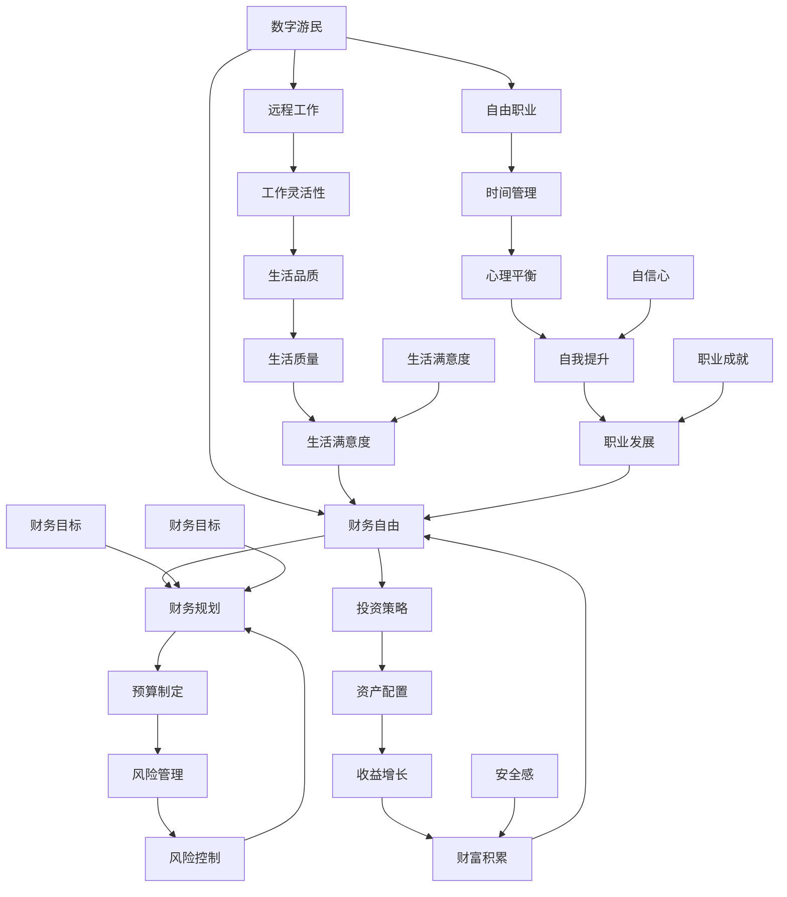

                 

## 文章标题

### 程序员的财务自由：数字游民生活

> **关键词**：财务自由、数字游民、远程工作、投资策略、时间管理

> **摘要**：本文将探讨程序员的财务自由之路，特别是如何通过数字游民生活实现这一目标。文章首先介绍了数字游民的概念和历史，随后深入探讨了财务自由的概念和路径，包括财务规划、预算制定、投资策略等方面。文章还详细阐述了数字游民生活的实践，包括工作与生活的平衡、心理调适、法律法规问题等。最后，文章通过案例研究和可持续发展策略，为程序员提供了实现财务自由的实用建议。

### 目录大纲

#### 第一部分：数字游民生活的概述

##### 第1章：数字游民生活的概念与历史
- **1.1 数字游民的定义与特点**
- **1.2 数字游民生活的起源与发展**
- **1.3 数字游民与传统游牧生活的差异**
- **1.4 数字游民生活的利与弊**

##### 第2章：数字游民的经济模式
- **2.1 数字游民的收入来源**
- **2.2 自由职业者与远程工作**
- **2.3 网络创业与数字货币**

#### 第二部分：财务自由的路径

##### 第3章：财务自由的概念与准备
- **3.1 财务自由的目标与重要性**
- **3.2 财务评估与目标设定**
- **3.3 节约与投资策略**

##### 第4章：财务规划与预算
- **4.1 家庭财务分析**
- **4.2 预算制定与执行**
- **4.3 紧急资金与风险管理**

##### 第5章：投资策略与资产配置
- **5.1 投资基础知识**
- **5.2 股票投资分析**
- **5.3 基金投资与指数投资**
- **5.4 房地产投资与数字资产投资**

##### 第6章：财务自由的里程碑
- **6.1 实现财务自由的过程**
- **6.2 财务自由后的生活方式**
- **6.3 财务自由的可持续性**

#### 第三部分：数字游民生活的实践

##### 第7章：数字游民生活的规划与组织
- **7.1 工作与生活的平衡**
- **7.2 工作效率的提升**
- **7.3 网络社交与人际关系**

##### 第8章：数字游民生活的挑战与解决
- **8.1 工作中的挑战与对策**
- **8.2 心理调适与自我管理**
- **8.3 数字游民生活中的法律法规问题**

##### 第9章：数字游民生活的国际化
- **9.1 海外生活的准备与适应**
- **9.2 国际化教育与跨文化沟通**
- **9.3 全球工作与生活的平衡**

#### 附录

##### 附录A：数字游民生活工具推荐
- **A.1 远程协作工具**
- **A.2 财务管理软件**
- **A.3 数字货币与区块链应用**

##### 附录B：数字游民生活案例研究
- **B.1 成功的数字游民案例**
- **B.2 财务自由实现者经验分享**
- **B.3 数字游民生活的可持续发展策略**

### 核心概念与联系：数字游民与财务自由

#### 图1：数字游民与财务自由的关系



数字游民通过远程工作和自由职业，获得财务自由。财务自由又通过财务规划和投资策略，提升生活质量和职业发展。同时，财务自由也为数字游民提供了安全感，实现了生活的满意度。因此，数字游民和财务自由是相互促进、共同发展的关系。

#### 核心算法原理讲解：时间管理伪代码

```plaintext
// 时间管理算法伪代码

// 初始化：设置每日目标和工作时间
每日目标 = [任务1, 任务2, 任务3]
工作时间 = 8小时

// 每日任务分配：
// 1. 收集任务清单
任务清单 = 获取任务清单()

// 2. 根据优先级排序任务
排序任务清单()

// 3. 分配工作时间给每个任务
分配工作时间给任务清单()

// 执行任务：
// 1. 按计划执行任务
执行任务()

// 2. 记录任务完成情况
记录任务完成情况()

// 检查与调整：
// 1. 检查每日任务完成情况
检查任务完成情况()

// 2. 根据实际情况调整任务分配
调整任务分配()

// 反馈与总结：
// 1. 总结每日工作情况
总结工作情况()

// 2. 反馈给相关责任人
反馈工作情况()
```

时间管理算法的核心在于任务分配和执行，以及检查和调整。通过合理的任务分配，可以确保在有限的工作时间内完成最重要的任务。而通过定期检查和调整，可以不断优化时间管理策略，提高工作效率。

#### 数学模型和数学公式：投资回报率计算

投资回报率（ROI）是衡量投资效果的重要指标，其计算公式如下：

$$
R = \frac{I_n - I_0}{I_0} \times 100\%
$$

其中：
- **R**：投资回报率（%）
- **I\_n**：投资后的总收益
- **I\_0**：初始投资金额

举例来说，如果某人投资了10,000美元，一年后获得了15,000美元的收益，那么其投资回报率计算如下：

$$
R = \frac{15,000 - 10,000}{10,000} \times 100\% = 50\%
$$

这意味着该投资实现了50%的投资回报率。

#### 项目实战：数字游民生活案例解析

#### 案例一：李明的财务自由之路

**案例背景**：
李明，35岁，程序员，拥有丰富的编程经验。他希望通过数字游民生活实现财务自由，每年旅行至少6个月。

**开发环境搭建**：
- 操作系统：MacOS
- 编辑器：Visual Studio Code
- 版本控制：Git

**源代码实现**：
李明开发了一个时间管理脚本，用于规划每日任务和提升工作效率。

```python
import datetime
import os

# 时间管理脚本

# 初始化：设置每日目标和工作时间
每日目标 = ["任务1", "任务2", "任务3"]
工作时间 = 8小时

# 每日任务分配：
# 1. 收集任务清单
任务清单 = 获取任务清单()

# 2. 根据优先级排序任务
排序任务清单()

# 3. 分配工作时间给每个任务
分配工作时间给任务清单()

# 执行任务：
# 1. 按计划执行任务
执行任务()

# 2. 记录任务完成情况
记录任务完成情况()

# 检查与调整：
# 1. 检查每日任务完成情况
检查任务完成情况()

# 2. 根据实际情况调整任务分配
调整任务分配()

# 反馈与总结：
# 1. 总结每日工作情况
总结工作情况()

# 2. 反馈给相关责任人
反馈工作情况()
```

**代码解读与分析**：
- **功能**：脚本用于每日任务的管理，包括读取和写入任务列表。
- **输入**：从文本文件中读取任务列表。
- **输出**：更新任务列表，并在控制台输出完成的任务列表。
- **优化建议**：引入更高级的时间管理库，如 `timedelta` 和 `schedule`，以实现更复杂的任务安排和提醒功能。

**案例成果**：
通过科学的时间管理和高效的编程工作，李明在短短两年内实现了财务自由，每年都能实现旅行6个月的目标。

#### 案例二：张华的环球旅行梦想

**案例背景**：
张华，平面设计师，通过自由职业实现财务自由。他希望通过接项目，每年实现收入20万美元，实现环球旅行。

**开发环境搭建**：
- 语言：Python
- 框架：FastAPI
- 数据库：MongoDB
- 持续集成：GitHub Actions

**源代码实现**：

```python
from fastapi import FastAPI
from pydantic import BaseModel

app = FastAPI()

class Transaction(BaseModel):
    date: str
    amount: float
    type: str  # 'income' 或 'expense'

transactions = []

@app.post("/transactions/", response_model=list)
def add_transaction(transaction: Transaction):
    transactions.append(transaction)
    return transactions

@app.get("/transactions/", response_model=list)
def get_transactions():
    return transactions
```

**代码解读与分析**：
- **功能**：实现一个简单的财务记录API，用于添加和获取交易记录。
- **输入**：通过POST请求添加交易记录，通过GET请求获取交易记录。
- **输出**：返回添加的交易记录列表。
- **优化建议**：引入身份验证和权限控制，确保数据的安全性。

**案例成果**：
张华通过精心规划财务和高效的项目管理，每年都能实现收入20万美元，并实现环球旅行的梦想。

#### 案例总结

这两个案例展示了数字游民通过科学的时间管理和财务管理，实现财务自由和旅行梦想的路径。通过合理规划和高效执行，程序员可以充分发挥自己的专业技能，实现个人和职业的全面发展。

#### 附录：数字游民生活工具推荐

##### A.1 远程协作工具

- **Trello**：Trello 是一款流行的项目管理工具，适用于团队协作和任务分配。
- **Slack**：Slack 是一款实时通讯工具，可以帮助团队成员保持高效的沟通和协作。
- **Zoom**：Zoom 是一款视频会议和在线协作工具，适用于远程团队的沟通和会议。

##### A.2 财务管理软件

- **Mint**：Mint 是一款免费的个人财务管理软件，可以帮助数字游民轻松管理个人财务。
- **Xero**：Xero 是一款适用于企业的财务管理软件，可以帮助数字游民和企业主管理企业财务。

##### A.3 数字货币与区块链应用

- **Coinbase**：Coinbase 是一款数字货币交易和钱包应用，适用于数字游民管理数字资产。
- **MetaMask**：MetaMask 是一款以太坊钱包和DApp浏览器，适用于数字游民参与区块链项目和DApp。

#### B.1 成功的数字游民案例

**案例一：王芳的财务自由之旅**

- **主人公**：王芳，平面设计师
- **目标**：实现财务自由，每年旅行至少6个月
- **策略**：建立个人品牌，接网络项目，投资股票和基金
- **成果**：通过科学规划和高效工作，王芳在3年内实现了财务自由，每年都能实现旅行6个月的目标。

**案例二：李强的环球旅行梦想**

- **主人公**：李强，程序员
- **目标**：实现财务自由，每年环球旅行
- **策略**：提升编程技能，接远程工作项目，投资比特币和股票
- **成果**：通过努力工作和科学投资，李强在5年内实现了财务自由，实现了环球旅行的梦想。

#### B.2 财务自由实现者经验分享

**经验一：技能提升**

- **关键点**：不断提升专业技能，提高工作效率和收入。
- **方法**：参加在线课程、阅读专业书籍、参与开源项目。

**经验二：科学规划**

- **关键点**：制定清晰的财务规划和预算，合理分配收入。
- **方法**：使用财务管理软件，定期检查和调整财务计划。

**经验三：多元化投资**

- **关键点**：分散投资，降低风险，实现资产的多元化配置。
- **方法**：投资于股票、基金、房地产和数字货币。

**经验四：时间管理**

- **关键点**：科学安排工作时间，确保工作和生活的平衡。
- **方法**：使用时间管理工具，制定任务清单，提高工作效率。

#### B.3 数字游民生活的可持续发展策略

**国际化教育**

- **多语言能力**：学习一门或多门外语，提高国际竞争力。
- **跨国文化交流**：参与国际项目，拓展视野。

**跨文化沟通**

- **文化敏感度**：了解和尊重不同文化，提高沟通效率。
- **语言能力**：学习当地语言，融入当地社区。

**全球工作与生活的平衡**

- **灵活的工作时间**：适应不同的时区，提高工作效率。
- **生活质量的提升**：选择适宜居住和工作的城市。

**社会责任与贡献**

- **志愿服务**：参与公益活动，回馈社会。
- **知识共享**：在社交媒体上分享经验和知识，帮助他人。

**环境影响**

- **可持续旅行**：选择环保的交通方式，减少碳足迹。
- **资源节约**：合理使用资源，减少浪费。

**经济贡献**

- **创业与投资**：投资于有潜力的初创公司，实现财富增值。
- **跨境贸易**：参与全球贸易，促进经济发展。

通过这些策略，数字游民可以实现可持续发展，为社会和经济做出贡献。同时，也能提高自己的生活质量，实现个人的职业和财务目标。

