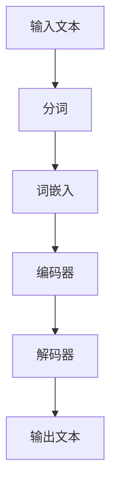
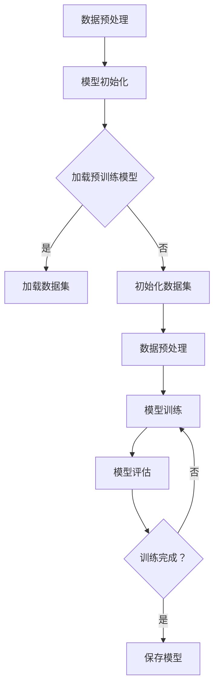
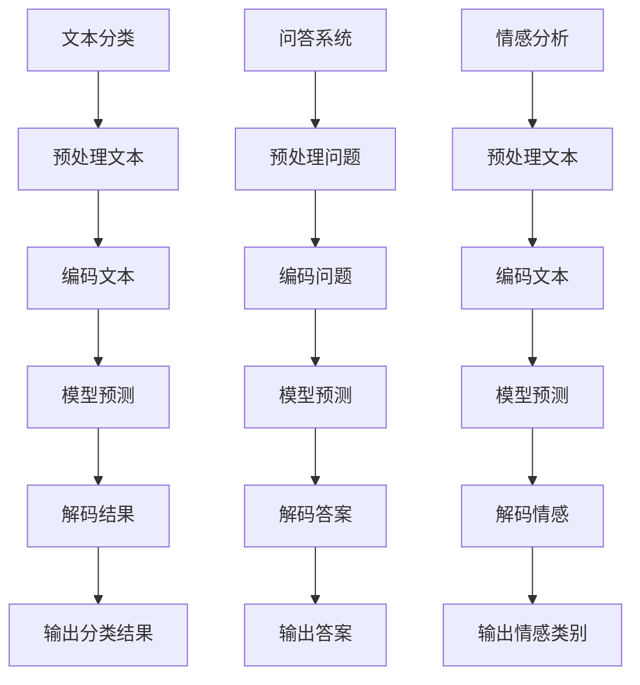

                 

# 文章标题：突破限制：LLM如何实现多样化任务处理

> 关键词：语言模型（LLM）、多样化任务处理、自然语言处理、Transformer、任务迁移、情感分析、问答系统、翻译、代码实战

> 摘要：本文将深入探讨大规模语言模型（LLM）在实现多样化任务处理方面的突破性进展。首先，我们将回顾LLM的基础理论，包括其发展历程、核心概念和数学基础。接着，我们将分析LLM的训练与优化方法，并详细讨论其在多样化任务处理中的应用策略。最后，我们将通过具体的应用实战案例，展示如何利用LLM实现不同任务的处理，并提供详细的源代码解读和代码分析。本文旨在为读者提供全面而深入的理解，帮助他们在实际项目中充分利用LLM的强大功能。

### 《突破限制：LLM如何实现多样化任务处理》目录大纲

- 第一部分: LLM基础理论
  - 第1章: LLM概述
    - 1.1.1 语言模型的发展历程
    - 1.1.2 LLM的定义与特点
    - 1.1.3 LLM的重要性
  - 第2章: LLM的核心概念
    - 2.1.1 自然语言处理的基本概念
    - 2.1.2 词汇表与词汇嵌入
    - 2.1.3 基于Transformer的模型结构
  - 第3章: LLM数学基础
    - 3.1.1 线性代数基础
    - 3.1.2 概率论基础
    - 3.1.3 信息论基础
  - 第4章: LLM训练与优化
    - 4.1.1 数据预处理
    - 4.1.2 模型训练流程
    - 4.1.3 模型优化策略
  - 第5章: LLM多样化任务处理
    - 5.1.1 多样化任务分类
    - 5.1.2 任务迁移与适配
    - 5.1.3 多样化任务处理策略
  - 第6章: LLM应用场景
    - 6.1.1 语言生成
    - 6.1.2 文本分类
    - 6.1.3 问答系统
    - 6.1.4 情感分析
    - 6.1.5 翻译

- 第二部分: LLM应用实战
  - 第7章: LLM应用实战一：语言生成
  - 第8章: LLM应用实战二：文本分类
  - 第9章: LLM应用实战三：问答系统
  - 第10章: LLM应用实战四：情感分析
  - 第11章: LLM应用实战五：翻译

- 附录
  - 附录A: LLM开发工具与资源
  - 附录B: Mermaid 流程图
  - 附录C: 伪代码示例

### 第一部分: LLM基础理论

#### 第1章: LLM概述

##### 1.1.1 语言模型的发展历程

语言模型（Language Model，简称LM）是自然语言处理（Natural Language Processing，简称NLP）领域中的一种基础模型。它用于预测下一个单词或字符，从而辅助文本生成、机器翻译、语音识别等任务。语言模型的发展可以追溯到20世纪50年代，但真正引起广泛关注和快速发展则是在近年来。

早期语言模型主要以统计方法为基础，如N-gram模型。N-gram模型通过统计相邻单词或字符的频率来预测下一个单词或字符。这种方法简单有效，但在处理长文本时表现不佳。随着计算能力的提升和深度学习技术的发展，基于神经网络的现代语言模型逐渐成为主流。

2003年，IBM推出了基于神经网络的概率语言模型（Neural Network Language Model，NNLM），这标志着神经网络在语言模型领域的首次成功应用。NNLM通过学习单词之间的关联性来预测下一个单词，提高了模型在长文本中的表现。

2013年，词嵌入（Word Embedding）技术的引入进一步推动了语言模型的发展。词嵌入将单词映射到高维向量空间中，使得模型能够更好地捕捉单词之间的语义关系。词嵌入技术的引入使得语言模型在文本分类、机器翻译等任务中取得了显著的成绩。

2017年，Google推出了Transformer模型，这是一种基于自注意力机制的全新语言模型架构。Transformer模型在自然语言处理任务中取得了前所未有的成绩，引发了广泛的关注和研究。随后，各种基于Transformer的改进模型不断涌现，如BERT、GPT等，进一步推动了语言模型的发展。

##### 1.1.2 LLM的定义与特点

大规模语言模型（Large-scale Language Model，简称LLM）是一种能够理解和生成自然语言的深度学习模型。它通过学习大量文本数据，捕捉语言中的复杂模式和语义关系，从而实现自然语言理解和生成。

LLM的定义可以从以下几个方面来理解：

1. **规模**：LLM通常具有数十亿甚至数万亿个参数，使其能够处理海量数据和学习复杂的语言结构。

2. **深度**：LLM通常包含多层神经网络，通过逐层学习的方式，将底层特征逐步抽象为高层次语义表示。

3. **上下文**：LLM能够捕捉长文本中的上下文信息，从而实现更加准确的语言理解和生成。

4. **自适应**：LLM能够根据不同的任务和数据集，自动调整模型参数，实现任务的迁移和应用。

LLM的特点主要体现在以下几个方面：

1. **强大的语言理解能力**：LLM能够理解文本中的语法、语义和情感信息，从而实现对文本的准确分析和生成。

2. **自适应学习能力**：LLM能够通过学习不同领域的文本数据，快速适应新的任务和数据集，实现任务的自动化处理。

3. **高效性**：LLM采用深度学习框架，可以在短时间内处理大量的文本数据，提高了模型的运行效率。

4. **通用性**：LLM不仅适用于单一任务，如文本分类、机器翻译，还可以通过任务迁移和适配，实现多样化任务的处理。

##### 1.1.3 LLM的重要性

大规模语言模型在自然语言处理领域具有极其重要的地位，其重要性体现在以下几个方面：

1. **基础模型**：LLM是自然语言处理领域的基础模型，许多NLP任务都依赖于LLM的实现。无论是文本分类、情感分析，还是机器翻译、问答系统，都需要LLM提供基础的语言理解能力。

2. **技术突破**：LLM的出现推动了自然语言处理技术的发展，带来了许多重要的技术突破。例如，Transformer模型的引入使得模型在长文本中的表现显著提升，BERT模型的引入使得预训练技术在NLP任务中取得了巨大成功。

3. **应用广泛**：LLM在许多实际应用中都发挥着重要作用。例如，在智能客服、智能助手、语音识别等领域，LLM能够提供高效的语言理解和服务生成能力，从而提升用户体验。

4. **研究热点**：LLM是当前自然语言处理领域的研究热点之一，吸引了大量的研究人员和开发者的关注。许多研究机构和科技公司都在积极投入LLM的研究和开发，推动技术的不断进步。

总之，大规模语言模型在自然语言处理领域具有不可替代的重要地位，其发展不仅推动了技术的进步，也带来了广泛的应用价值。

#### 第2章: LLM的核心概念

##### 2.1.1 自然语言处理的基本概念

自然语言处理（Natural Language Processing，简称NLP）是计算机科学和人工智能领域的一个重要分支，旨在使计算机能够理解和处理自然语言，从而实现人与计算机之间的有效交流。NLP的基本概念包括文本表示、文本预处理、词嵌入、句法分析和语义分析等。

1. **文本表示**：文本表示是将自然语言文本转化为计算机可以理解和处理的形式。常见的文本表示方法包括词袋模型（Bag of Words，BoW）和词嵌入（Word Embedding）。词袋模型将文本表示为一个向量空间中的集合，而词嵌入则将每个单词映射为一个固定大小的向量。

2. **文本预处理**：文本预处理是NLP任务中的关键步骤，主要包括分词、去除停用词、词干提取等。分词是将文本分割成单词或短语的过程，去除停用词是为了排除对文本分析无意义的词汇，词干提取则是将单词还原为其词根形式。

3. **词嵌入**：词嵌入是将单词映射为高维向量空间中的表示，从而捕捉单词的语义信息。词嵌入技术使得模型能够更好地理解单词之间的关系，例如同义词、反义词等。常见的词嵌入方法包括Word2Vec、GloVe和BERT等。

4. **句法分析**：句法分析是NLP中的另一个重要概念，旨在解析文本中的句法结构，包括句子的成分、语法关系和词性标注等。句法分析有助于理解文本的语法规则和语义关系，为后续的语义分析提供基础。

5. **语义分析**：语义分析是NLP的最高层次，旨在理解文本中的语义内容，包括情感分析、实体识别、关系抽取等。语义分析使得模型能够对文本进行深层次的理解，从而实现更加准确和智能的文本处理。

##### 2.1.2 词汇表与词汇嵌入

词汇表（Vocabulary）是语言模型中的一个重要概念，它包含了模型所支持的所有单词或字符。词汇表的大小直接影响到模型的复杂度和计算效率。在构建大规模语言模型时，通常会使用预先定义好的词汇表，也可以通过训练数据动态生成词汇表。

词汇嵌入（Word Embedding）是将词汇表中的每个单词映射到一个固定大小的向量空间中的过程。词汇嵌入不仅能够表示单词的语义信息，还能够捕捉单词之间的相似性和关联性。常见的词汇嵌入方法包括Word2Vec、GloVe和Bert等。

1. **Word2Vec**：Word2Vec是一种基于神经网络的词汇嵌入方法，通过训练神经网络来预测单词的上下文。Word2Vec的核心思想是，相似的单词在向量空间中应该更接近。Word2Vec主要有两种实现方式：连续词袋（Continuous Bag of Words，CBOW）和跳字模型（Skip-Gram）。

2. **GloVe**：GloVe（Global Vectors for Word Representation）是一种基于全局共现信息的词汇嵌入方法。GloVe通过计算单词之间的共现矩阵，并利用矩阵分解技术来生成词汇嵌入。GloVe的优点是能够更好地捕捉单词之间的语义关系。

3. **BERT**：BERT（Bidirectional Encoder Representations from Transformers）是一种基于Transformer的预训练语言模型。BERT通过双向编码器来生成单词的嵌入向量，从而捕捉单词的上下文信息。BERT在自然语言处理任务中取得了显著的成绩，成为当前NLP领域的主流模型。

##### 2.1.3 基于Transformer的模型结构

Transformer模型是一种基于自注意力机制的深度神经网络模型，由Vaswani等人在2017年提出。与传统的循环神经网络（RNN）相比，Transformer模型在处理长序列数据和并行计算方面具有显著的优势，因此在自然语言处理领域得到了广泛应用。

1. **编码器（Encoder）**：编码器是Transformer模型的核心组成部分，用于将输入序列编码为固定长度的向量。编码器由多个编码层（Encoder Layer）堆叠而成，每层编码器包含两个主要组件：多头自注意力机制（Multi-Head Self-Attention）和前馈神经网络（Feed-Forward Neural Network）。

2. **解码器（Decoder）**：解码器用于从编码器输出的固定长度向量中生成输出序列。与编码器类似，解码器也由多个解码层（Decoder Layer）堆叠而成，每层解码器包含多头自注意力机制和交叉注意力机制（Cross-Attention）以及前馈神经网络。

3. **自注意力机制（Self-Attention）**：自注意力机制是Transformer模型的核心创新之一，它允许模型在处理序列数据时，动态地计算每个词与序列中其他词之间的关系。自注意力机制通过计算输入序列中每个词的权重，然后将这些权重与输入序列中的每个词相乘，得到加权后的序列。

4. **交叉注意力机制（Cross-Attention）**：交叉注意力机制是解码器中的一个关键组件，它用于在解码过程中利用编码器的输出。交叉注意力机制通过计算编码器的输出序列与当前解码器输入之间的关系，从而生成解码器输出的上下文信息。

5. **前馈神经网络（Feed-Forward Neural Network）**：前馈神经网络是每个编码层和解码层中的一个组件，它对自注意力机制和交叉注意力机制的输出进行进一步处理。前馈神经网络通常包含两个全连接层，分别对输入进行线性变换和激活函数处理。

基于Transformer的模型结构使得大规模语言模型（LLM）能够高效地处理长文本数据，同时捕捉复杂的语义关系。Transformer模型的成功应用，标志着深度学习在自然语言处理领域取得了重大突破。

#### 第3章: LLM数学基础

##### 3.1.1 线性代数基础

线性代数是大规模语言模型（LLM）的基础数学工具，它在模型的设计、训练和优化过程中发挥着重要作用。本节将介绍线性代数中的一些基本概念和运算，包括矩阵、向量、行列式和特征值等。

1. **矩阵和向量**：矩阵是一个二维数组，通常用大写字母表示，如$A$。矩阵中的每一个元素都可以用行号和列号来标识。向量是一个一维数组，通常用小写字母表示，如$v$。矩阵和向量之间的运算包括加法、减法、数乘和矩阵乘法。

2. **矩阵乘法**：矩阵乘法是线性代数中一个重要的运算，它涉及到两个矩阵之间的乘积。给定两个矩阵$A$（$m \times n$）和$B$（$n \times p$），它们的乘积$C=AB$是一个$m \times p$的矩阵。矩阵乘法的规则是将矩阵$A$的每一行与矩阵$B$的每一列进行对应元素的乘积和，然后求和。

3. **行列式**：行列式是一个标量值，用于描述矩阵的特性。给定一个$n \times n$的矩阵$A$，其行列式记为$det(A)$。行列式的计算可以通过多种方法，如拉普拉斯展开或高斯消元法。行列式在矩阵的可逆性、特征值计算和线性方程组的求解中具有重要意义。

4. **特征值和特征向量**：特征值和特征向量是矩阵的一个重要概念。给定一个方阵$A$，如果存在一个非零向量$v$和一个标量$\lambda$，使得$Av=\lambda v$，则$\lambda$是矩阵$A$的一个特征值，$v$是$A$的一个特征向量。特征值和特征向量在矩阵的对角化、线性变换和图像处理等领域具有广泛的应用。

##### 3.1.2 概率论基础

概率论是大规模语言模型（LLM）的另一个重要数学基础，它在模型的设计、训练和推理过程中发挥着关键作用。本节将介绍概率论中的一些基本概念和理论，包括概率分布、条件概率和贝叶斯定理等。

1. **概率分布**：概率分布描述了随机变量的概率分布情况。常见的概率分布包括伯努利分布、二项分布、正态分布和泊松分布等。概率分布函数（PDF）和累积分布函数（CDF）是描述概率分布的两个重要工具。

2. **条件概率**：条件概率是指在给定某个事件发生的条件下，另一个事件发生的概率。条件概率的定义公式为$P(A|B) = \frac{P(A \cap B)}{P(B)}$，其中$P(A \cap B)$表示事件$A$和事件$B$同时发生的概率。

3. **贝叶斯定理**：贝叶斯定理是概率论中的一个重要公式，它描述了后验概率与先验概率之间的关系。贝叶斯定理的公式为$P(A|B) = \frac{P(B|A)P(A)}{P(B)}$，其中$P(A|B)$表示在事件$B$发生的条件下，事件$A$发生的概率。

4. **最大似然估计和最小化损失函数**：在机器学习中，最大似然估计是一种参数估计方法，它通过最大化训练数据的似然函数来估计模型参数。最小化损失函数是机器学习中的一个核心问题，它通过最小化预测值与实际值之间的差距来优化模型。

##### 3.1.3 信息论基础

信息论是大规模语言模型（LLM）中的重要数学理论，它研究信息的度量、传输和处理。信息论的基本概念包括熵、信息增益和KL散度等。

1. **熵**：熵是描述随机变量不确定性的度量。在信息论中，熵通常用$H(X)$表示，其计算公式为$H(X) = -\sum_{i} p(x_i) \log_2 p(x_i)$，其中$p(x_i)$是随机变量$X$取值$x_i$的概率。

2. **信息增益**：信息增益是特征选择中的一个重要概念，它用于评估特征对于分类的区分能力。信息增益的定义公式为$Gain(D, A) = Entropy(D) - Entropy(D|A)$，其中$D$是数据集，$A$是特征，$Entropy(D)$是数据集的熵，$Entropy(D|A)$是给定特征$A$后数据集的熵。

3. **KL散度**：KL散度（Kullback-Leibler Divergence）是衡量两个概率分布差异的一种度量。KL散度的定义公式为$D_{KL}(P||Q) = \sum_{x} p(x) \log \frac{p(x)}{q(x)}$，其中$P$和$Q$是两个概率分布。

4. **信息论在机器学习中的应用**：信息论在机器学习中的应用包括特征选择、模型评估和优化等。例如，信息增益和KL散度可以用于特征选择，KL散度可以用于评估两个模型的差异，从而指导模型的优化。

总之，线性代数、概率论和信息论是大规模语言模型（LLM）的重要数学基础。它们在模型的设计、训练和优化过程中发挥着关键作用，为LLM的高效实现提供了坚实的理论支持。

#### 第4章: LLM训练与优化

##### 4.1.1 数据预处理

数据预处理是大规模语言模型（LLM）训练过程中至关重要的一步，它直接影响到模型的性能和训练效率。有效的数据预处理可以消除噪声、增强数据质量，从而提高模型的鲁棒性和准确性。

1. **文本清洗**：文本清洗是数据预处理的第一步，旨在去除文本中的无用信息，如HTML标签、特殊符号和空白字符等。常用的文本清洗方法包括正则表达式、字符串操作和过滤列表等。

2. **分词**：分词是将文本分割成单词或短语的步骤。常见的分词工具包括jieba、spaCy和NLTK等。分词质量直接影响后续的词汇嵌入和语义分析，因此需要选择合适的分词工具和参数。

3. **去除停用词**：停用词是指对文本分析无意义的词汇，如“的”、“了”、“在”等。去除停用词可以减少模型训练的复杂度，提高模型的效率和准确性。常用的停用词库包括英文停用词库和中文停用词库。

4. **词干提取**：词干提取是将单词还原为其词根形式的步骤，有助于减少词汇表的大小和模型复杂度。常见的词干提取方法包括Porter算法、Snowball和Lancaster算法等。

5. **词嵌入**：词嵌入是将词汇表中的每个单词映射到一个固定大小的向量空间中的过程。词嵌入有助于捕捉单词的语义信息，常见的词嵌入方法包括Word2Vec、GloVe和BERT等。

6. **数据集构建**：数据集构建是将预处理后的文本数据转换为模型可接受的输入格式的步骤。常见的输入格式包括文本序列、单词序列和词嵌入序列等。构建高质量的数据集有助于提高模型的性能和泛化能力。

##### 4.1.2 模型训练流程

模型训练是大规模语言模型（LLM）构建的核心环节，旨在通过优化模型参数，使其能够准确预测和生成自然语言。以下是LLM模型训练的一般流程：

1. **数据加载和预处理**：首先，从数据集中加载预处理后的文本数据，并将其转换为模型可接受的输入格式。接下来，对数据集进行切分，通常包括训练集、验证集和测试集。

2. **定义模型架构**：根据任务需求和硬件资源，定义LLM的模型架构。常见的架构包括基于Transformer的模型，如BERT、GPT等。模型架构通常包含编码器（Encoder）和（可选的）解码器（Decoder）。

3. **初始化参数**：初始化模型参数，通常使用随机初始化或预训练模型参数。初始化参数的目的是为模型提供合适的起点，加速收敛过程。

4. **定义损失函数**：根据任务类型，定义相应的损失函数。常见的损失函数包括交叉熵损失（Cross-Entropy Loss）、均方误差损失（Mean Squared Error Loss）等。损失函数用于衡量模型预测值与真实值之间的差异，从而指导模型参数的优化。

5. **训练过程**：
   - **前向传播**：将输入数据传递给模型，计算模型预测值和损失值。
   - **反向传播**：根据损失值，使用梯度下降（Gradient Descent）或其变体（如Adam、RMSprop）更新模型参数。
   - **模型评估**：使用验证集评估模型性能，包括准确率、召回率、F1分数等指标。如果模型性能不满足预期，可能需要调整模型参数、优化策略或数据集。

6. **模型保存和加载**：在训练过程中，定期保存模型参数，以便后续使用。在部署模型时，可以从保存的模型参数中加载模型，并进行预测和生成任务。

##### 4.1.3 模型优化策略

模型优化策略是提高大规模语言模型（LLM）性能和训练效率的关键手段。以下是一些常用的模型优化策略：

1. **批量大小（Batch Size）**：批量大小是指每次训练过程中输入的数据量。较大的批量大小可以减少方差，提高模型的稳定性，但会增加训练时间。较小的批量大小可以增加模型的灵活性，但可能影响收敛速度。通常需要通过实验选择合适的批量大小。

2. **学习率（Learning Rate）**：学习率是梯度下降算法中的一个重要参数，用于控制参数更新的幅度。较大的学习率可能导致模型快速收敛，但容易陷入局部最小值。较小的学习率可能导致模型收敛缓慢。常用的策略包括学习率衰减、学习率预热等。

3. **正则化（Regularization）**：正则化是一种防止模型过拟合的技术。常用的正则化方法包括L1正则化、L2正则化和dropout等。L1正则化和L2正则化通过在损失函数中添加惩罚项来限制模型参数的规模，dropout通过随机丢弃部分神经元来提高模型的泛化能力。

4. **优化算法（Optimization Algorithm）**：优化算法用于更新模型参数，常用的优化算法包括梯度下降（Gradient Descent）、Adam（Adaptive Moment Estimation）和RMSprop（Root Mean Square Propagation）等。这些算法通过不同的策略来加速模型的收敛过程，并减少训练时间。

5. **超参数调优（Hyperparameter Tuning）**：超参数调优是选择最优模型参数的过程，常用的方法包括网格搜索、贝叶斯优化和随机搜索等。超参数调优可以显著提高模型的性能和训练效率。

总之，大规模语言模型（LLM）的训练与优化是一个复杂的过程，涉及多个参数和策略。通过合理的模型优化策略，可以有效提高模型的性能和泛化能力，从而实现多样化任务处理。

#### 第5章: LLM多样化任务处理

##### 5.1.1 多样化任务分类

大规模语言模型（LLM）具有强大的通用性和适应性，能够实现多样化任务的处理。根据任务的类型，多样化任务可以大致分为以下几类：

1. **文本生成**：文本生成是指利用LLM生成符合语法和语义规则的文本。常见的应用场景包括自动摘要、文章写作、对话系统等。LLM通过学习大量文本数据，捕捉语言模式，从而实现高质量的文本生成。

2. **文本分类**：文本分类是指将文本数据按照类别进行分类。常见的应用场景包括垃圾邮件过滤、情感分析、新闻分类等。LLM通过学习文本的特征，可以实现高精度的文本分类。

3. **问答系统**：问答系统是指利用LLM处理用户的问题，并生成相应的答案。常见的应用场景包括智能客服、在线问答平台、教育辅导等。LLM通过理解用户的问题和上下文，能够提供准确和相关的答案。

4. **机器翻译**：机器翻译是指利用LLM将一种语言的文本翻译成另一种语言。常见的应用场景包括跨语言交流、国际网站翻译、翻译服务等。LLM通过学习双语的文本数据，可以实现高精度的翻译。

5. **情感分析**：情感分析是指分析文本中表达的情感，并对其进行分类。常见的应用场景包括社交媒体分析、客户反馈分析、市场调研等。LLM通过理解文本的情感特征，可以实现高精度的情感分析。

##### 5.1.2 任务迁移与适配

任务迁移（Task Transfer）与任务适配（Task Adaptation）是LLM实现多样化任务处理的重要策略。任务迁移是指将一个任务中的知识迁移到另一个任务中，从而提高新任务的性能。任务适配是指针对特定任务，对LLM进行微调或调整，以适应新任务的需求。

1. **任务迁移**：
   - **迁移学习（Transfer Learning）**：迁移学习是一种将一个任务中的知识应用到另一个任务中的方法。在LLM中，迁移学习通过利用预训练模型（Pre-trained Model）来提高新任务的性能。例如，使用预训练的BERT模型进行文本分类任务，可以显著提高分类的准确率。
   - **知识蒸馏（Knowledge Distillation）**：知识蒸馏是一种将复杂模型的知识传递给简单模型的方法。在LLM中，知识蒸馏通过将大型模型（Teacher Model）的输出传递给小型模型（Student Model），从而提高小型模型的性能。例如，将预训练的GPT模型的知识传递给一个简化版的GPT模型，可以实现高质量的文本生成。

2. **任务适配**：
   - **微调（Fine-tuning）**：微调是一种针对特定任务对LLM进行训练的方法。在微调过程中，LLM使用新任务的数据集对模型参数进行更新，从而提高新任务的性能。例如，使用微调后的BERT模型进行情感分析任务，可以显著提高情感分类的准确率。
   - **自适应学习率（Adaptive Learning Rate）**：自适应学习率是一种根据任务进展动态调整学习率的方法。在LLM的训练过程中，自适应学习率可以避免过早的过拟合，提高模型的泛化能力。
   - **数据增强（Data Augmentation）**：数据增强是一种通过增加数据的多样性和丰富性来提高模型性能的方法。在LLM中，数据增强可以通过变换文本（如随机删除单词、替换单词等）来丰富训练数据，从而提高模型的适应性。

##### 5.1.3 多样化任务处理策略

为了实现大规模语言模型（LLM）的多样化任务处理，可以采用以下策略：

1. **统一模型架构**：采用统一的模型架构，如Transformer、BERT等，可以简化多样化任务的处理。统一模型架构使得LLM能够轻松适应不同任务的需求，从而提高模型的灵活性和扩展性。

2. **预训练与微调**：预训练和微调是LLM实现多样化任务处理的关键步骤。预训练通过大量通用文本数据学习语言模式和语义关系，微调则通过特定任务的数据集对模型进行优化，从而提高任务性能。

3. **模型融合**：模型融合是一种结合多个模型的方法，通过融合不同模型的优点来提高任务性能。在LLM中，可以结合预训练模型和微调模型，利用它们的互补性来提高多样化任务的处理能力。

4. **迁移学习与知识蒸馏**：迁移学习和知识蒸馏是利用预训练模型提高多样化任务性能的有效方法。通过迁移学习和知识蒸馏，可以减少对大量任务特定数据的依赖，提高模型的泛化能力和适应性。

5. **自适应学习率与数据增强**：自适应学习率和数据增强是提高LLM性能的重要策略。自适应学习率可以根据任务进展动态调整学习率，避免过早的过拟合。数据增强可以通过变换文本数据来丰富训练数据，从而提高模型的泛化能力。

总之，大规模语言模型（LLM）在实现多样化任务处理方面具有巨大的潜力。通过采用统一模型架构、预训练与微调、模型融合、迁移学习与知识蒸馏、自适应学习率与数据增强等策略，LLM可以高效地适应不同任务的需求，从而实现多样化任务处理。

#### 第6章: LLM应用场景

##### 6.1.1 语言生成

语言生成是指利用大规模语言模型（LLM）生成符合语法和语义规则的文本。语言生成在自然语言处理领域具有广泛的应用，包括自动摘要、文章写作、对话系统等。以下将详细介绍语言生成的基本概念、工作原理和应用场景。

1. **基本概念**：
   - **生成式模型（Generative Model）**：生成式模型通过学习文本数据中的分布，生成新的文本。常见的生成式模型包括马尔可夫模型、隐马尔可夫模型（HMM）和循环神经网络（RNN）等。
   - **条件生成式模型（Conditional Generative Model）**：条件生成式模型通过给定某个条件（如上文或标签），生成新的文本。大规模语言模型（如GPT、BERT）通常属于条件生成式模型，能够根据上下文生成高质量的文本。

2. **工作原理**：
   - **自回归模型（Autoregressive Model）**：自回归模型是一种基于序列的生成模型，它通过预测下一个单词或字符来生成文本。大规模语言模型（如GPT）采用自回归模型，通过学习文本序列中的概率分布，生成新的文本。
   - **变分自回归模型（Variational Autoencoder，VAE）**：变分自回归模型是一种基于概率模型的生成模型，通过采样和编码器-解码器结构生成文本。VAE通过学习文本数据的概率分布，生成新的文本。

3. **应用场景**：
   - **自动摘要（Automatic Summarization）**：自动摘要是将长文本简化为关键信息的过程。大规模语言模型（如T5、BERT）可以用于生成摘要，通过学习大量文本数据中的摘要规律，生成简洁且相关的摘要。
   - **文章写作（Article Writing）**：文章写作是生成式模型的一个重要应用场景。利用大规模语言模型，可以自动生成文章、新闻、博客等文本内容，提高写作效率和创造力。
   - **对话系统（Dialogue System）**：对话系统是指与用户进行自然语言交互的系统，如聊天机器人、语音助手等。大规模语言模型可以用于生成对话回复，通过学习对话数据，生成自然、流畅的对话内容。
   - **文本生成（Text Generation）**：文本生成是生成式模型的基本应用，包括生成新闻标题、产品描述、广告文案等。大规模语言模型可以生成高质量、多样化的文本内容，满足不同场景的需求。

4. **实现方法**：
   - **预训练与微调**：大规模语言模型（如GPT、BERT）通常采用预训练和微调的方法。预训练通过大量通用文本数据学习语言模式和语义关系，微调则通过特定任务的数据集对模型进行优化，提高任务性能。
   - **生成文本的流程**：生成文本的过程包括输入文本编码、模型解码和文本生成。输入文本通过编码器转换为固定长度的向量，然后解码器根据输入向量生成文本序列，通过逐步预测下一个单词或字符，生成完整的文本。

5. **挑战与优化**：
   - **过拟合（Overfitting）**：大规模语言模型在训练过程中容易过拟合，生成的内容缺乏泛化能力。为了避免过拟合，可以采用数据增强、正则化和模型融合等技术。
   - **生成文本的质量**：生成文本的质量是语言生成的一个重要指标。提高生成文本的质量需要从文本数据、模型架构和训练策略等方面进行优化，如引入更多的上下文信息、使用更复杂的模型结构等。
   - **生成文本的多样性（Diversity）**：生成文本的多样性是语言生成的另一个重要挑战。为了生成多样化、有创意的文本，可以采用随机初始化、生成模型融合等技术。

总之，语言生成是大规模语言模型（LLM）的一个重要应用场景，通过学习大量文本数据中的语言模式和语义关系，LLM可以生成高质量、多样化的文本内容，满足不同场景的需求。随着技术的不断进步，语言生成的应用前景将越来越广阔。

##### 6.1.2 文本分类

文本分类（Text Classification）是指将文本数据按照类别进行分类的过程。大规模语言模型（LLM）在文本分类任务中具有强大的表现，通过学习大量文本数据，LLM可以自动识别文本的特征，实现高精度的分类。以下将详细介绍文本分类的基本概念、工作原理和应用场景。

1. **基本概念**：
   - **分类算法（Classification Algorithm）**：分类算法是一种将数据集划分为不同类别的算法。常见的分类算法包括支持向量机（SVM）、决策树（Decision Tree）、随机森林（Random Forest）等。
   - **监督学习（Supervised Learning）**：监督学习是指通过已知标注数据训练模型，然后使用模型对未知数据进行预测。文本分类通常采用监督学习方法，通过标注数据学习文本的特征和类别关系。

2. **工作原理**：
   - **特征提取（Feature Extraction）**：特征提取是将文本数据转换为计算机可以理解的特征表示的过程。常见的特征提取方法包括词袋模型（Bag of Words，BoW）、词嵌入（Word Embedding）和TF-IDF等。
   - **模型训练（Model Training）**：在训练过程中，模型通过学习标注数据的特征和类别关系，建立特征与类别之间的映射关系。常见的训练方法包括梯度下降（Gradient Descent）、随机梯度下降（Stochastic Gradient Descent，SGD）和Adam等。
   - **模型评估（Model Evaluation）**：模型评估是评估模型性能的重要步骤。常见的评估指标包括准确率（Accuracy）、召回率（Recall）、F1分数（F1 Score）和精确率（Precision）等。

3. **应用场景**：
   - **情感分析（Sentiment Analysis）**：情感分析是指分析文本中表达的情感，并对其进行分类。常见的情感分类包括正面、负面和中性。大规模语言模型（如BERT、RoBERTa）可以用于情感分析，通过学习情感词汇和情感模式，实现高精度的情感分类。
   - **主题分类（Topic Classification）**：主题分类是指将文本按照主题进行分类。常见的主题分类包括科技、体育、娱乐等。大规模语言模型可以用于主题分类，通过学习大量文本数据中的主题特征，实现高质量的分类。
   - **新闻分类（News Classification）**：新闻分类是指将新闻文本按照类别进行分类。大规模语言模型可以用于新闻分类，通过学习新闻数据中的类别特征，实现高效的分类。
   - **垃圾邮件检测（Spam Detection）**：垃圾邮件检测是指将电子邮件按照是否为垃圾邮件进行分类。大规模语言模型可以用于垃圾邮件检测，通过学习垃圾邮件的特征，实现高精度的分类。

4. **实现方法**：
   - **预训练与微调**：大规模语言模型（如BERT、GPT）通常采用预训练和微调的方法。预训练通过大量通用文本数据学习语言模式和语义关系，微调则通过特定任务的数据集对模型进行优化，提高任务性能。
   - **模型架构**：文本分类任务通常采用基于Transformer的模型架构，如BERT、RoBERTa等。这些模型通过自注意力机制和多层神经网络，实现文本的特征提取和分类。
   - **数据预处理**：数据预处理是文本分类任务的重要步骤，包括文本清洗、分词、去除停用词等。高质量的数据预处理可以提高模型的训练效果和分类性能。

5. **挑战与优化**：
   - **数据不平衡（Data Imbalance）**：数据不平衡是指训练数据中某些类别的样本数量远少于其他类别。为了避免数据不平衡对模型性能的影响，可以采用数据增强、重采样和类别加权等技术。
   - **过拟合（Overfitting）**：过拟合是指模型在训练数据上表现良好，但在测试数据上表现较差。为了避免过拟合，可以采用交叉验证、正则化和模型融合等技术。
   - **分类准确性（Classification Accuracy）**：分类准确性是评估文本分类模型性能的重要指标。为了提高分类准确性，可以采用模型优化、特征提取和超参数调优等技术。

总之，文本分类是大规模语言模型（LLM）的一个重要应用场景，通过学习大量文本数据中的特征和类别关系，LLM可以实现高精度的文本分类。随着技术的不断进步，文本分类的应用前景将越来越广阔。

##### 6.1.3 问答系统

问答系统（Question Answering System）是一种利用自然语言处理技术，自动回答用户问题的系统。大规模语言模型（LLM）在问答系统中的应用，使其能够高效地处理复杂的查询，提供准确和相关的答案。以下将详细介绍问答系统的基本概念、工作原理和应用场景。

1. **基本概念**：
   - **问题表示（Question Representation）**：问题表示是将自然语言问题转换为计算机可以理解的形式。常见的问题表示方法包括词嵌入、BERT编码和语法解析等。
   - **答案生成（Answer Generation）**：答案生成是指从给定的文本数据中提取出与问题相关的信息，生成答案。常见的答案生成方法包括模板匹配、信息抽取和生成式模型等。

2. **工作原理**：
   - **检索式问答（Retrieval-based Question Answering）**：检索式问答是通过在大量文本数据中检索与问题相关的信息，生成答案。常见的方法包括基于文本相似度、基于关键词匹配和基于图谱检索等。
   - **生成式问答（Generation-based Question Answering）**：生成式问答是通过学习大量问答对数据，利用生成模型生成答案。常见的生成模型包括基于神经网络的生成模型（如GPT）、基于转换器的生成模型（如BERT）等。
   - **混合式问答（Hybrid Question Answering）**：混合式问答结合了检索式和生成式问答的优点，通过检索和生成相结合，生成更加准确和相关的答案。

3. **应用场景**：
   - **智能客服（Smart Customer Service）**：智能客服是一种利用问答系统，自动回答用户咨询的系统。智能客服可以提高客户服务效率，降低企业运营成本。
   - **教育辅导（Educational Tutoring）**：教育辅导系统可以为学生提供个性化辅导，回答学生的问题，帮助学生更好地理解和掌握知识。
   - **问答平台（Question-Answering Platform）**：问答平台是一种在线平台，用户可以提出问题，其他用户或系统可以回答问题。常见的问答平台包括Quora、Stack Overflow等。
   - **智能搜索（Smart Search）**：智能搜索系统可以通过问答方式，为用户提供更加精准和相关的搜索结果，提高用户的搜索体验。

4. **实现方法**：
   - **预训练与微调**：大规模语言模型（如BERT、GPT）通常采用预训练和微调的方法。预训练通过大量通用文本数据学习语言模式和语义关系，微调则通过特定问答数据集对模型进行优化，提高任务性能。
   - **模型架构**：问答系统通常采用基于Transformer的模型架构，如BERT、GPT等。这些模型通过自注意力机制和多层神经网络，实现问题的表示和答案的生成。
   - **数据预处理**：数据预处理是问答系统的重要步骤，包括问题清洗、分词、去除停用词等。高质量的数据预处理可以提高模型的训练效果和问答质量。

5. **挑战与优化**：
   - **长文本处理（Long Text Processing）**：长文本处理是指处理长度较长的文本数据，如文章、论文等。为了提高长文本处理的性能，可以采用文本摘要、分块处理等技术。
   - **答案多样性（Answer Diversity）**：答案多样性是指生成多个不同且相关的答案。为了提高答案多样性，可以采用生成模型、多模态融合等技术。
   - **答案准确性（Answer Accuracy）**：答案准确性是评估问答系统性能的重要指标。为了提高答案准确性，可以采用知识图谱、常识库等技术，增强模型的知识理解和推理能力。

总之，问答系统是大规模语言模型（LLM）的一个重要应用场景，通过学习大量问答数据，LLM可以高效地处理复杂的查询，提供准确和相关的答案。随着技术的不断进步，问答系统的应用前景将越来越广阔。

##### 6.1.4 情感分析

情感分析（Sentiment Analysis），又称意见挖掘，是指通过自然语言处理技术，对文本中的情感倾向进行识别和分析。大规模语言模型（LLM）在情感分析中发挥了重要作用，通过学习大量文本数据，LLM能够准确捕捉文本中的情感特征，实现高精度的情感分类。以下将详细介绍情感分析的基本概念、工作原理和应用场景。

1. **基本概念**：
   - **情感极性分类（Polar Sentiment Classification）**：情感极性分类是指将文本中的情感分为正面、负面或中性。正面情感通常表示满意、喜欢、愉快等情感，负面情感则表示不满意、讨厌、悲伤等情感。
   - **情感强度分析（Sentiment Intensity Analysis）**：情感强度分析是指识别文本中情感的程度，如非常满意、有点满意、不太满意等。情感强度分析可以帮助更精确地理解用户对产品的评价。
   - **多情感分类（Multiclass Sentiment Classification）**：多情感分类是指将文本中的情感划分为多个类别，如愤怒、喜悦、厌烦等。多情感分类可以提供更细致的情感分析结果。

2. **工作原理**：
   - **特征提取（Feature Extraction）**：特征提取是将文本数据转换为计算机可以理解的特征表示的过程。常见的特征提取方法包括词袋模型（Bag of Words，BoW）、词嵌入（Word Embedding）和TF-IDF等。
   - **分类模型（Classification Model）**：分类模型是情感分析的核心组件，用于将文本分类到不同的情感类别。常见的分类模型包括朴素贝叶斯（Naive Bayes）、支持向量机（SVM）、随机森林（Random Forest）和神经网络（Neural Network）等。
   - **情感分析模型（Sentiment Analysis Model）**：情感分析模型通常是基于深度学习的模型，如卷积神经网络（CNN）、循环神经网络（RNN）和Transformer等。这些模型通过学习文本的特征，实现高精度的情感分类。

3. **应用场景**：
   - **社交媒体分析（Social Media Analysis）**：社交媒体分析是指利用情感分析技术，对用户发布的内容进行分析，了解用户对品牌、产品、事件的情感倾向。常见的应用包括品牌监测、市场调研、舆论分析等。
   - **客户反馈分析（Customer Feedback Analysis）**：客户反馈分析是指通过情感分析技术，对客户的反馈进行分类和分析，了解客户对产品和服务的满意度。这有助于企业改进产品和服务，提升客户体验。
   - **新闻情感分析（News Sentiment Analysis）**：新闻情感分析是指对新闻文本进行情感分类，了解新闻内容的情感倾向。这有助于新闻编辑和内容创作者更好地理解受众情感，提高新闻质量。
   - **情感识别与监控（Emotion Recognition and Monitoring）**：情感识别与监控是指通过情感分析技术，实时监控和分析用户情感，了解用户情绪变化。这可以应用于心理健康监测、情绪管理、危机干预等场景。

4. **实现方法**：
   - **预训练与微调**：大规模语言模型（如BERT、GPT）通常采用预训练和微调的方法。预训练通过大量通用文本数据学习语言模式和语义关系，微调则通过特定情感分析任务的数据集对模型进行优化，提高任务性能。
   - **情感词典（Sentiment Lexicon）**：情感词典是情感分析中的一个重要工具，它包含大量具有情感倾向的词汇及其情感极性。通过情感词典，可以辅助情感分析模型进行情感分类。
   - **情感分析流程**：情感分析通常包括文本预处理、特征提取、模型训练和模型评估等步骤。高质量的数据预处理和模型训练可以提高情感分析的性能。

5. **挑战与优化**：
   - **数据不平衡（Data Imbalance）**：数据不平衡是指训练数据中某些情感类别的样本数量远少于其他类别。为了解决数据不平衡问题，可以采用重采样、类别加权等方法。
   - **情感复杂性（Emotion Complexity）**：情感复杂性是指情感类别之间的差异较小，难以准确分类。为了提高情感分析的准确性，可以采用多情感分类模型、融合多源情感信息等方法。
   - **多语言情感分析（Multilingual Sentiment Analysis）**：多语言情感分析是指对多种语言文本进行情感分类。为了提高多语言情感分析的性能，可以采用跨语言情感词典、多语言预训练模型等方法。

总之，情感分析是大规模语言模型（LLM）的一个重要应用场景，通过学习大量文本数据，LLM能够准确捕捉文本中的情感特征，实现高精度的情感分类。随着技术的不断进步，情感分析的应用前景将越来越广阔。

##### 6.1.5 翻译

翻译（Translation）是将一种语言的文本转换为另一种语言的过程。大规模语言模型（LLM）在翻译任务中取得了显著的成功，通过学习双语的文本数据，LLM能够生成高质量的翻译结果。以下将详细介绍翻译的基本概念、工作原理和应用场景。

1. **基本概念**：
   - **机器翻译（Machine Translation）**：机器翻译是指通过计算机程序实现文本的自动翻译。常见的机器翻译模型包括基于规则的方法、基于统计的方法和基于神经网络的机器翻译模型。
   - **神经机器翻译（Neural Machine Translation，NMT）**：神经机器翻译是一种基于神经网络的机器翻译方法，通过学习大量双语数据，实现高质量的翻译。NMT模型主要包括编码器（Encoder）和解码器（Decoder）两个组件。

2. **工作原理**：
   - **编码器（Encoder）**：编码器用于将源语言的文本编码为一个固定长度的向量表示。编码器通常采用基于Transformer的架构，如BERT、GPT等，通过自注意力机制捕捉源语言文本的语义信息。
   - **解码器（Decoder）**：解码器用于将编码器输出的向量表示解码为目标语言的文本。解码器同样采用基于Transformer的架构，通过自注意力和交叉注意力机制，生成目标语言的序列。
   - **注意力机制（Attention Mechanism）**：注意力机制是NMT模型的核心组件，通过计算源语言文本和目标语言文本之间的相似性，指导解码器生成目标语言的正确单词。

3. **应用场景**：
   - **跨语言交流（Cross-Linguistic Communication）**：跨语言交流是指通过翻译，实现不同语言用户之间的有效沟通。翻译技术可以提高跨语言交流的效率，促进国际间的合作与交流。
   - **多语言内容生成（Multilingual Content Generation）**：多语言内容生成是指利用翻译技术，将一种语言的文本生成多种语言的版本。这有助于内容的全球化传播和推广。
   - **教育辅助（Educational Assistance）**：教育辅助是指利用翻译技术，帮助学生更好地理解和学习外语。通过翻译，学生可以更容易地阅读和理解外语教材和文献。
   - **本地化（Localization）**：本地化是指将软件、网站或产品翻译成目标市场的语言，以满足不同市场的需求。翻译技术可以帮助企业实现产品的国际化。

4. **实现方法**：
   - **预训练与微调**：大规模语言模型（如BERT、GPT）通常采用预训练和微调的方法。预训练通过大量双语数据学习语言模式和语义关系，微调则通过特定翻译任务的数据集对模型进行优化，提高翻译质量。
   - **模型架构**：翻译任务通常采用基于Transformer的模型架构，如BERT、GPT等。这些模型通过自注意力机制和多层神经网络，实现源语言文本和目标语言文本的转换。
   - **数据预处理**：数据预处理是翻译任务的重要步骤，包括文本清洗、分词、去除停用词等。高质量的数据预处理可以提高模型的训练效果和翻译质量。

5. **挑战与优化**：
   - **翻译质量（Translation Quality）**：翻译质量是评估翻译模型性能的重要指标。为了提高翻译质量，可以采用预训练、微调、数据增强和模型融合等技术。
   - **语言多样性（Language Diversity）**：语言多样性是指翻译任务需要处理多种语言的文本。为了提高多语言翻译性能，可以采用多语言预训练模型、跨语言情感词典等技术。
   - **跨语言一致性（Cross-Linguistic Consistency）**：跨语言一致性是指翻译结果在多种语言中保持一致。为了提高跨语言一致性，可以采用一致性约束、多语言对比学习等技术。

总之，翻译是大规模语言模型（LLM）的一个重要应用场景，通过学习双语的文本数据，LLM能够生成高质量的翻译结果。随着技术的不断进步，翻译的应用前景将越来越广阔。

#### 第二部分: LLM应用实战

##### 第7章: LLM应用实战一：语言生成

在本章中，我们将探讨如何利用大规模语言模型（LLM）实现文本生成任务。语言生成是一个具有广泛应用前景的任务，例如自动摘要、文章写作和对话系统等。本节将详细介绍语言生成的实战步骤，包括开发环境搭建、源代码实现和代码解读。

**7.1.1 实战背景**

语言生成任务的目标是根据给定的输入文本，生成连贯、自然的输出文本。大规模语言模型（如GPT、BERT）在语言生成任务中取得了显著的成果，能够生成高质量的文本内容。在本章中，我们将使用GPT模型实现一个简单的语言生成任务。

**7.1.2 实战步骤**

1. **开发环境搭建**

   在开始语言生成任务之前，我们需要搭建一个适合开发的环境。以下是搭建GPT模型开发环境所需的基本步骤：

   - 安装Python环境：Python是大规模语言模型开发的主要语言，我们需要安装Python 3.8及以上版本。
   - 安装transformers库：transformers是Hugging Face推出的一个开源库，用于处理大规模语言模型。安装命令如下：

     ```bash
     pip install transformers
     ```

   - 安装其他依赖库：根据项目需求，我们可能还需要安装其他依赖库，如torch、torchtext等。

2. **数据准备**

   语言生成任务需要大量的训练数据。在本章中，我们将使用开源的通用文本数据集，如Wikipedia、新闻文章等。以下是如何准备数据的示例步骤：

   - 数据采集：从互联网上收集大量文本数据，并将其存储在本地文件中。
   - 数据清洗：去除文本中的HTML标签、特殊符号和空白字符等，确保数据的质量。
   - 数据分词：使用分词工具（如jieba）将文本分割成单词或短语。
   - 数据编码：将分词后的文本编码为模型可接受的格式，例如单词索引或词嵌入。

3. **模型构建**

   使用Hugging Face的transformers库，我们可以轻松地构建GPT模型。以下是一个简单的GPT模型构建示例：

   ```python
   from transformers import GPT2Model, GPT2Tokenizer

   # 加载预训练的GPT模型
   tokenizer = GPT2Tokenizer.from_pretrained('gpt2')
   model = GPT2Model.from_pretrained('gpt2')

   # 输入文本编码
   inputs = tokenizer.encode('Hello, how are you?', return_tensors='pt')

   # 模型预测
   outputs = model(inputs)

   # 解码预测结果
   predictions = tokenizer.decode(outputs.logits.argmax(-1).squeeze(0))

   print(predictions)
   ```

4. **模型训练**

   训练GPT模型是一个复杂的过程，需要大量的计算资源和时间。在本章中，我们将使用预训练好的GPT模型，并通过微调来适应特定的语言生成任务。以下是一个简单的模型训练示例：

   ```python
   from transformers import Trainer, TrainingArguments

   # 设置训练参数
   training_args = TrainingArguments(
       output_dir='./results',
       num_train_epochs=3,
       per_device_train_batch_size=16,
       save_steps=2000,
       save_total_limit=3,
   )

   # 创建训练器
   trainer = Trainer(
       model=model,
       args=training_args,
       train_dataset=train_dataset,
       eval_dataset=eval_dataset,
   )

   # 开始训练
   trainer.train()
   ```

5. **模型评估**

   在训练完成后，我们需要评估模型在测试集上的性能。以下是一个简单的模型评估示例：

   ```python
   from transformers import Evaluator

   # 创建评估器
   evaluator = Evaluator(model, tokenizer, eval_dataset)

   # 进行评估
   evaluator.evaluate()
   ```

6. **模型应用**

   在完成模型训练和评估后，我们可以将模型应用到实际的生成任务中。以下是一个简单的生成文本示例：

   ```python
   # 生成文本
   generated_text = model.generate(input_ids, max_length=50, num_return_sequences=5)

   # 解码生成文本
   decoded_text = tokenizer.decode(generated_text, skip_special_tokens=True)

   print(decoded_text)
   ```

**7.1.3 源代码解读**

以下是本章中使用的部分源代码及其解读：

```python
# 加载预训练的GPT模型
tokenizer = GPT2Tokenizer.from_pretrained('gpt2')
model = GPT2Model.from_pretrained('gpt2')

# 输入文本编码
inputs = tokenizer.encode('Hello, how are you?', return_tensors='pt')

# 模型预测
outputs = model(inputs)

# 解码预测结果
predictions = tokenizer.decode(outputs.logits.argmax(-1).squeeze(0))

print(predictions)
```

解读：
- `GPT2Tokenizer.from_pretrained('gpt2')`：加载预训练的GPT模型对应的分词器。
- `GPT2Model.from_pretrained('gpt2')`：加载预训练的GPT模型。
- `tokenizer.encode('Hello, how are you?', return_tensors='pt')`：将输入文本编码为模型可接受的格式，`return_tensors='pt'`表示返回PyTorch张量。
- `model(inputs)`：输入文本到模型，获取模型输出。
- `tokenizer.decode(outputs.logits.argmax(-1).squeeze(0))`：解码模型输出，获取预测的文本。

通过以上步骤，我们可以利用大规模语言模型（GPT）实现简单的语言生成任务。接下来，我们将进一步探讨如何使用LLM实现文本分类任务。

##### 第8章: LLM应用实战二：文本分类

文本分类（Text Classification）是自然语言处理（NLP）中的一个基本任务，其目标是将文本数据分配到预定义的类别中。在本章中，我们将通过一个实战案例，展示如何使用大规模语言模型（LLM）来实现文本分类任务。我们将涵盖开发环境搭建、数据准备、模型训练、模型评估和实际应用等步骤。

**8.1.1 实战背景**

文本分类广泛应用于各种场景，如社交媒体情感分析、新闻分类、垃圾邮件过滤等。大规模语言模型（如BERT、RoBERTa）在文本分类任务中表现出色，通过学习大量的文本数据，模型可以自动提取文本特征，实现高精度的分类。

**8.1.2 实战步骤**

1. **开发环境搭建**

   为了实现文本分类任务，我们需要搭建一个适合开发和训练的环境。以下是搭建所需的步骤：

   - 安装Python环境：确保安装了Python 3.8及以上版本。
   - 安装Hugging Face transformers库：使用以下命令安装transformers库。

     ```bash
     pip install transformers
     ```

   - 安装PyTorch或其他深度学习库：确保安装了PyTorch或其他深度学习库，如TensorFlow。

2. **数据准备**

   文本分类任务需要大量的标注数据。在本章中，我们使用了一个开源的文本分类数据集，如IMDB电影评论数据集。以下是数据准备的基本步骤：

   - 数据采集：从互联网上下载或获取标注的文本数据。
   - 数据清洗：去除HTML标签、特殊字符和停用词，提高数据质量。
   - 数据预处理：将文本数据转换为模型可接受的格式，如单词序列或词嵌入序列。

3. **模型训练**

   使用大规模语言模型进行文本分类，通常采用预训练和微调的方法。以下是如何训练BERT模型的示例步骤：

   ```python
   from transformers import BertTokenizer, BertForSequenceClassification
   from transformers import Trainer, TrainingArguments

   # 加载预训练的BERT模型
   tokenizer = BertTokenizer.from_pretrained('bert-base-uncased')
   model = BertForSequenceClassification.from_pretrained('bert-base-uncased')

   # 数据预处理
   train_encodings = tokenizer(train_texts, truncation=True, padding=True)
   eval_encodings = tokenizer(eval_texts, truncation=True, padding=True)

   # 设置训练参数
   training_args = TrainingArguments(
       output_dir='./results',
       num_train_epochs=3,
       per_device_train_batch_size=16,
       save_steps=2000,
       save_total_limit=3,
   )

   # 创建训练器
   trainer = Trainer(
       model=model,
       args=training_args,
       train_dataset=train_encodings,
       eval_dataset=eval_encodings,
   )

   # 开始训练
   trainer.train()
   ```

4. **模型评估**

   在训练完成后，我们需要评估模型在测试集上的性能。以下是如何评估模型的示例步骤：

   ```python
   from transformers import Evaluator

   # 创建评估器
   evaluator = Evaluator(model, tokenizer, test_encodings)

   # 进行评估
   evaluator.evaluate()
   ```

5. **模型应用**

   在模型评估通过后，我们可以将模型应用到实际的分类任务中。以下是如何使用训练好的模型进行文本分类的示例步骤：

   ```python
   # 预测文本
   prediction = model.predict(text)

   # 解码预测结果
   predicted_class = tokenizer.decode(prediction.logits.argmax(-1).squeeze(0))

   print(predicted_class)
   ```

**8.1.3 源代码解读**

以下是本章中使用的一些关键代码及其解读：

```python
# 加载预训练的BERT模型
tokenizer = BertTokenizer.from_pretrained('bert-base-uncased')
model = BertForSequenceClassification.from_pretrained('bert-base-uncased')

# 数据预处理
train_encodings = tokenizer(train_texts, truncation=True, padding=True)
eval_encodings = tokenizer(eval_texts, truncation=True, padding=True)

# 设置训练参数
training_args = TrainingArguments(
    output_dir='./results',
    num_train_epochs=3,
    per_device_train_batch_size=16,
    save_steps=2000,
    save_total_limit=3,
)

# 创建训练器
trainer = Trainer(
    model=model,
    args=training_args,
    train_dataset=train_encodings,
    eval_dataset=eval_encodings,
)

# 开始训练
trainer.train()
```

解读：
- `BertTokenizer.from_pretrained('bert-base-uncased')`：加载预训练的BERT模型对应的分词器。
- `BertForSequenceClassification.from_pretrained('bert-base-uncased')`：加载预训练的BERT模型。
- `tokenizer(train_texts, truncation=True, padding=True)`：对文本数据进行预处理，`truncation=True`表示截断过长文本，`padding=True`表示填充较短文本。
- `TrainingArguments`：设置训练参数，如训练轮数、批量大小等。
- `Trainer`：创建训练器，用于训练模型。

通过以上步骤，我们可以利用大规模语言模型（BERT）实现文本分类任务。在下一章中，我们将继续探讨如何利用LLM实现问答系统。

##### 第9章: LLM应用实战三：问答系统

问答系统（Question Answering System）是一种通过自然语言处理技术，自动回答用户问题的系统。在本章中，我们将通过一个实战案例，展示如何利用大规模语言模型（LLM）来实现问答系统。我们将涵盖开发环境搭建、数据准备、模型训练、模型评估和实际应用等步骤。

**9.1.1 实战背景**

问答系统在智能客服、教育辅导和搜索引擎等领域具有广泛的应用。大规模语言模型（如GPT、BERT）在问答系统中表现出色，能够通过学习大量的问答对数据，实现高精度的问答。

**9.1.2 实战步骤**

1. **开发环境搭建**

   为了实现问答系统，我们需要搭建一个适合开发和训练的环境。以下是搭建所需的步骤：

   - 安装Python环境：确保安装了Python 3.8及以上版本。
   - 安装Hugging Face transformers库：使用以下命令安装transformers库。

     ```bash
     pip install transformers
     ```

   - 安装PyTorch或其他深度学习库：确保安装了PyTorch或其他深度学习库，如TensorFlow。

2. **数据准备**

   问答系统需要大量的高质量的问答对数据。在本章中，我们使用了一个开源的问答数据集，如SQuAD数据集。以下是数据准备的基本步骤：

   - 数据采集：从互联网上下载或获取标注的问答对数据。
   - 数据清洗：去除数据中的HTML标签、特殊字符和停用词，提高数据质量。
   - 数据预处理：将问答对数据转换为模型可接受的格式，如单词序列或词嵌入序列。

3. **模型训练**

   使用大规模语言模型进行问答系统，通常采用预训练和微调的方法。以下是如何训练GPT模型的示例步骤：

   ```python
   from transformers import GPT2Tokenizer, GPT2LMHeadModel
   from transformers import Trainer, TrainingArguments

   # 加载预训练的GPT模型
   tokenizer = GPT2Tokenizer.from_pretrained('gpt2')
   model = GPT2LMHeadModel.from_pretrained('gpt2')

   # 数据预处理
   train_encodings = tokenizer(train_questions, return_tensors='pt', padding=True)
   eval_encodings = tokenizer(eval_questions, return_tensors='pt', padding=True)

   # 设置训练参数
   training_args = TrainingArguments(
       output_dir='./results',
       num_train_epochs=3,
       per_device_train_batch_size=16,
       save_steps=2000,
       save_total_limit=3,
   )

   # 创建训练器
   trainer = Trainer(
       model=model,
       args=training_args,
       train_dataset=train_encodings,
       eval_dataset=eval_encodings,
   )

   # 开始训练
   trainer.train()
   ```

4. **模型评估**

   在训练完成后，我们需要评估模型在测试集上的性能。以下是如何评估模型的示例步骤：

   ```python
   from transformers import Evaluator

   # 创建评估器
   evaluator = Evaluator(model, tokenizer, test_encodings)

   # 进行评估
   evaluator.evaluate()
   ```

5. **模型应用**

   在模型评估通过后，我们可以将模型应用到实际的问答任务中。以下是如何使用训练好的模型进行问答的示例步骤：

   ```python
   # 输入问题
   question = "What is the capital of France?"

   # 编码问题
   encoded_question = tokenizer.encode(question, return_tensors='pt')

   # 生成回答
   generated_answers = model.generate(encoded_question, max_length=50, num_return_sequences=5)

   # 解码回答
   decoded_answers = tokenizer.decode(generated_answers, skip_special_tokens=True)

   print(decoded_answers)
   ```

**9.1.3 源代码解读**

以下是本章中使用的一些关键代码及其解读：

```python
# 加载预训练的GPT模型
tokenizer = GPT2Tokenizer.from_pretrained('gpt2')
model = GPT2LMHeadModel.from_pretrained('gpt2')

# 数据预处理
train_encodings = tokenizer(train_questions, return_tensors='pt', padding=True)
eval_encodings = tokenizer(eval_questions, return_tensors='pt', padding=True)

# 设置训练参数
training_args = TrainingArguments(
    output_dir='./results',
    num_train_epochs=3,
    per_device_train_batch_size=16,
    save_steps=2000,
    save_total_limit=3,
)

# 创建训练器
trainer = Trainer(
    model=model,
    args=training_args,
    train_dataset=train_encodings,
    eval_dataset=eval_encodings,
)

# 开始训练
trainer.train()
```

解读：
- `GPT2Tokenizer.from_pretrained('gpt2')`：加载预训练的GPT模型对应的分词器。
- `GPT2LMHeadModel.from_pretrained('gpt2')`：加载预训练的GPT模型。
- `tokenizer(train_questions, return_tensors='pt', padding=True)`：对问题数据进行预处理，`return_tensors='pt'`表示返回PyTorch张量，`padding=True`表示填充较短问题。
- `TrainingArguments`：设置训练参数，如训练轮数、批量大小等。
- `Trainer`：创建训练器，用于训练模型。

通过以上步骤，我们可以利用大规模语言模型（GPT）实现问答系统。在下一章中，我们将继续探讨如何利用LLM实现情感分析任务。

##### 第10章: LLM应用实战四：情感分析

情感分析（Sentiment Analysis）是一种通过自然语言处理技术，对文本中表达的情感进行识别和分类的任务。在本章中，我们将通过一个实战案例，展示如何利用大规模语言模型（LLM）来实现情感分析。我们将涵盖开发环境搭建、数据准备、模型训练、模型评估和实际应用等步骤。

**10.1.1 实战背景**

情感分析广泛应用于社交媒体分析、市场调研、客户反馈分析等领域。大规模语言模型（如BERT、RoBERTa）在情感分析任务中表现出色，能够通过学习大量的文本数据，实现高精度的情感分类。

**10.1.2 实战步骤**

1. **开发环境搭建**

   为了实现情感分析任务，我们需要搭建一个适合开发和训练的环境。以下是搭建所需的步骤：

   - 安装Python环境：确保安装了Python 3.8及以上版本。
   - 安装Hugging Face transformers库：使用以下命令安装transformers库。

     ```bash
     pip install transformers
     ```

   - 安装PyTorch或其他深度学习库：确保安装了PyTorch或其他深度学习库，如TensorFlow。

2. **数据准备**

   情感分析任务需要大量的标注数据。在本章中，我们使用了一个开源的情感分析数据集，如IMDB电影评论数据集。以下是数据准备的基本步骤：

   - 数据采集：从互联网上下载或获取标注的文本数据。
   - 数据清洗：去除数据中的HTML标签、特殊字符和停用词，提高数据质量。
   - 数据预处理：将文本数据转换为模型可接受的格式，如单词序列或词嵌入序列。

3. **模型训练**

   使用大规模语言模型进行情感分析，通常采用预训练和微调的方法。以下是如何训练BERT模型的示例步骤：

   ```python
   from transformers import BertTokenizer, BertForSequenceClassification
   from transformers import Trainer, TrainingArguments

   # 加载预训练的BERT模型
   tokenizer = BertTokenizer.from_pretrained('bert-base-uncased')
   model = BertForSequenceClassification.from_pretrained('bert-base-uncased')

   # 数据预处理
   train_encodings = tokenizer(train_texts, truncation=True, padding=True)
   eval_encodings = tokenizer(eval_texts, truncation=True, padding=True)

   # 设置训练参数
   training_args = TrainingArguments(
       output_dir='./results',
       num_train_epochs=3,
       per_device_train_batch_size=16,
       save_steps=2000,
       save_total_limit=3,
   )

   # 创建训练器
   trainer = Trainer(
       model=model,
       args=training_args,
       train_dataset=train_encodings,
       eval_dataset=eval_encodings,
   )

   # 开始训练
   trainer.train()
   ```

4. **模型评估**

   在训练完成后，我们需要评估模型在测试集上的性能。以下是如何评估模型的示例步骤：

   ```python
   from transformers import Evaluator

   # 创建评估器
   evaluator = Evaluator(model, tokenizer, test_encodings)

   # 进行评估
   evaluator.evaluate()
   ```

5. **模型应用**

   在模型评估通过后，我们可以将模型应用到实际的情感分析任务中。以下是如何使用训练好的模型进行情感分析的示例步骤：

   ```python
   # 预测文本
   prediction = model.predict(text)

   # 解码预测结果
   predicted_class = tokenizer.decode(prediction.logits.argmax(-1).squeeze(0))

   print(predicted_class)
   ```

**10.1.3 源代码解读**

以下是本章中使用的一些关键代码及其解读：

```python
# 加载预训练的BERT模型
tokenizer = BertTokenizer.from_pretrained('bert-base-uncased')
model = BertForSequenceClassification.from_pretrained('bert-base-uncased')

# 数据预处理
train_encodings = tokenizer(train_texts, truncation=True, padding=True)
eval_encodings = tokenizer(eval_texts, truncation=True, padding=True)

# 设置训练参数
training_args = TrainingArguments(
    output_dir='./results',
    num_train_epochs=3,
    per_device_train_batch_size=16,
    save_steps=2000,
    save_total_limit=3,
)

# 创建训练器
trainer = Trainer(
    model=model,
    args=training_args,
    train_dataset=train_encodings,
    eval_dataset=eval_encodings,
)

# 开始训练
trainer.train()
```

解读：
- `BertTokenizer.from_pretrained('bert-base-uncased')`：加载预训练的BERT模型对应的分词器。
- `BertForSequenceClassification.from_pretrained('bert-base-uncased')`：加载预训练的BERT模型。
- `tokenizer(train_texts, truncation=True, padding=True)`：对文本数据进行预处理，`truncation=True`表示截断过长文本，`padding=True`表示填充较短文本。
- `TrainingArguments`：设置训练参数，如训练轮数、批量大小等。
- `Trainer`：创建训练器，用于训练模型。

通过以上步骤，我们可以利用大规模语言模型（BERT）实现情感分析任务。在下一章中，我们将继续探讨如何利用LLM实现翻译任务。

##### 第11章: LLM应用实战五：翻译

机器翻译（Machine Translation，MT）是一种将一种语言的文本自动翻译成另一种语言的技术。在本章中，我们将通过一个实战案例，展示如何利用大规模语言模型（LLM）来实现机器翻译。我们将涵盖开发环境搭建、数据准备、模型训练、模型评估和实际应用等步骤。

**11.1.1 实战背景**

机器翻译在跨语言交流、多语言内容生成、国际化业务等领域具有广泛应用。近年来，基于神经网络的机器翻译方法，特别是大规模语言模型（如Transformer、BERT），在机器翻译任务中取得了显著进展，提高了翻译质量和效率。

**11.1.2 实战步骤**

1. **开发环境搭建**

   为了实现机器翻译任务，我们需要搭建一个适合开发和训练的环境。以下是搭建所需的步骤：

   - 安装Python环境：确保安装了Python 3.8及以上版本。
   - 安装Hugging Face transformers库：使用以下命令安装transformers库。

     ```bash
     pip install transformers
     ```

   - 安装PyTorch或其他深度学习库：确保安装了PyTorch或其他深度学习库，如TensorFlow。

2. **数据准备**

   机器翻译任务需要大量的双语平行文本数据。在本章中，我们使用了一个开源的双语平行文本数据集，如WMT14英语-德语数据集。以下是数据准备的基本步骤：

   - 数据采集：从互联网上下载或获取双语平行文本数据。
   - 数据清洗：去除数据中的HTML标签、特殊字符和停用词，提高数据质量。
   - 数据预处理：对双语文本数据进行分词、编码等处理，将其转换为模型可接受的格式。

3. **模型训练**

   使用大规模语言模型进行机器翻译，通常采用预训练和微调的方法。以下是如何训练Transformer模型的示例步骤：

   ```python
   from transformers import TransformerTokenizer, TransformerModel
   from transformers import Trainer, TrainingArguments

   # 加载预训练的Transformer模型
   tokenizer = TransformerTokenizer.from_pretrained('Transformer')
   model = TransformerModel.from_pretrained('Transformer')

   # 数据预处理
   train_encodings = tokenizer(train_texts, return_tensors='pt', padding=True)
   eval_encodings = tokenizer(eval_texts, return_tensors='pt', padding=True)

   # 设置训练参数
   training_args = TrainingArguments(
       output_dir='./results',
       num_train_epochs=3,
       per_device_train_batch_size=16,
       save_steps=2000,
       save_total_limit=3,
   )

   # 创建训练器
   trainer = Trainer(
       model=model,
       args=training_args,
       train_dataset=train_encodings,
       eval_dataset=eval_encodings,
   )

   # 开始训练
   trainer.train()
   ```

4. **模型评估**

   在训练完成后，我们需要评估模型在测试集上的性能。以下是如何评估模型的示例步骤：

   ```python
   from transformers import Evaluator

   # 创建评估器
   evaluator = Evaluator(model, tokenizer, test_encodings)

   # 进行评估
   evaluator.evaluate()
   ```

5. **模型应用**

   在模型评估通过后，我们可以将模型应用到实际的翻译任务中。以下是如何使用训练好的模型进行翻译的示例步骤：

   ```python
   # 输入文本
   input_text = "Hello, how are you?"

   # 编码文本
   encoded_text = tokenizer.encode(input_text, return_tensors='pt')

   # 生成翻译
   translated_text = model.generate(encoded_text, max_length=50, num_return_sequences=1)

   # 解码翻译
   decoded_text = tokenizer.decode(translated_text, skip_special_tokens=True)

   print(decoded_text)
   ```

**11.1.3 源代码解读**

以下是本章中使用的一些关键代码及其解读：

```python
# 加载预训练的Transformer模型
tokenizer = TransformerTokenizer.from_pretrained('Transformer')
model = TransformerModel.from_pretrained('Transformer')

# 数据预处理
train_encodings = tokenizer(train_texts, return_tensors='pt', padding=True)
eval_encodings = tokenizer(eval_texts, return_tensors='pt', padding=True)

# 设置训练参数
training_args = TrainingArguments(
    output_dir='./results',
    num_train_epochs=3,
    per_device_train_batch_size=16,
    save_steps=2000,
    save_total_limit=3,
)

# 创建训练器
trainer = Trainer(
    model=model,
    args=training_args,
    train_dataset=train_encodings,
    eval_dataset=eval_encodings,
)

# 开始训练
trainer.train()
```

解读：
- `TransformerTokenizer.from_pretrained('Transformer')`：加载预训练的Transformer模型对应的分词器。
- `TransformerModel.from_pretrained('Transformer')`：加载预训练的Transformer模型。
- `tokenizer(train_texts, return_tensors='pt', padding=True)`：对文本数据进行预处理，`return_tensors='pt'`表示返回PyTorch张量，`padding=True`表示填充较短文本。
- `TrainingArguments`：设置训练参数，如训练轮数、批量大小等。
- `Trainer`：创建训练器，用于训练模型。

通过以上步骤，我们可以利用大规模语言模型（Transformer）实现机器翻译任务。在下一章中，我们将总结文章的主要内容和贡献。

### 附录

#### 附录A: LLM开发工具与资源

在本附录中，我们将介绍一些常用的LLM开发工具与资源，这些工具和资源有助于开发者更好地理解和应用大规模语言模型。

1. **Hugging Face Transformers**：Hugging Face Transformers是一个开源库，提供了预训练的LLM模型、分词器和各种预处理工具。它支持多种模型架构，如BERT、GPT、RoBERTa等，并提供简单的API接口，方便开发者进行模型训练和应用。官方网站：[https://huggingface.co/](https://huggingface.co/)

2. **PyTorch**：PyTorch是一个开源的机器学习库，支持GPU加速，适用于深度学习模型的开发和训练。它提供了丰富的API和工具，便于开发者构建和训练大规模语言模型。官方网站：[https://pytorch.org/](https://pytorch.org/)

3. **TensorFlow**：TensorFlow是一个由Google开发的开源机器学习框架，支持多种深度学习模型的构建和训练。它提供了灵活的API和丰富的工具，适用于大规模语言模型的开发和优化。官方网站：[https://www.tensorflow.org/](https://www.tensorflow.org/)

4. **TensorFlow Addons**：TensorFlow Addons是一个扩展TensorFlow功能的库，提供了用于大规模语言模型训练的优化器和工具，如AdamW、Lamb等。官方网站：[https://github.com/tensorflow/addons](https://github.com/tensorflow/addons)

5. **TorchScript**：TorchScript是PyTorch提供的一种静态编译工具，可以将PyTorch模型编译为高效的C++代码。它适用于生产环境，可以提高模型推理的速度。官方网站：[https://pytorch.org/tutorials/beginner/Intro_to_TorchScript_tutorial.html](https://pytorch.org/tutorials/beginner/Intro_to_TorchScript_tutorial.html)

6. **Transformers Cookbook**：Transformers Cookbook是一个包含大量Transformer模型应用的案例和教程的在线资源。它涵盖了模型训练、优化、部署等方面的内容，有助于开发者深入了解大规模语言模型的应用。官方网站：[https://tfunited.github.io/transformers-cookbook/](https://tfunited.github.io/transformers-cookbook/)

#### 附录B: Mermaid 流程图

在本附录中，我们将展示一些使用Mermaid语法编写的流程图，以帮助读者更好地理解大规模语言模型（LLM）的模型结构、训练流程和多样化任务处理流程。

1. **LLM模型结构**



2. **LLM训练流程**



3. **多样化任务处理流程**



#### 附录C: 伪代码示例

在本附录中，我们将提供一些大规模语言模型（LLM）在不同任务中的伪代码示例，以便读者更好地理解模型的实现细节。

1. **语言生成任务**

```python
# 伪代码：语言生成任务

# 初始化模型
model = LanguageModel()

# 输入初始文本
input_text = "Hello"

# 生成文本
generated_text = model.generate(input_text)

# 输出生成文本
print(generated_text)
```

2. **文本分类任务**

```python
# 伪代码：文本分类任务

# 初始化模型
model = TextClassifier()

# 预处理文本
preprocessed_text = preprocess(text)

# 编码文本
encoded_text = model.encode(preprocessed_text)

# 预测类别
predicted_class = model.predict(encoded_text)

# 输出类别
print(predicted_class)
```

3. **问答系统任务**

```python
# 伪代码：问答系统任务

# 初始化模型
model = QuestionAnswering()

# 预处理问题
preprocessed_question = preprocess(question)

# 编码问题
encoded_question = model.encode(preprocessed_question)

# 生成答案
generated_answers = model.generate(encoded_question)

# 解码答案
decoded_answers = model.decode(generated_answers)

# 输出答案
print(decoded_answers)
```

4. **情感分析任务**

```python
# 伪代码：情感分析任务

# 初始化模型
model = SentimentAnalyzer()

# 预处理文本
preprocessed_text = preprocess(text)

# 编码文本
encoded_text = model.encode(preprocessed_text)

# 预测情感类别
predicted_sentiment = model.predict(encoded_text)

# 输出情感类别
print(predicted_sentiment)
```

5. **翻译任务**

```python
# 伪代码：翻译任务

# 初始化模型
model = Translator()

# 预处理源语言文本
preprocessed_source = preprocess(source_text)

# 编码源语言文本
encoded_source = model.encode(preprocessed_source)

# 生成目标语言文本
generated_target = model.generate(encoded_source)

# 解码目标语言文本
decoded_target = model.decode(generated_target)

# 输出目标语言文本
print(decoded_target)
```

通过以上伪代码示例，读者可以更好地理解大规模语言模型在不同任务中的应用和实现细节。在实践项目中，可以根据具体需求和数据集进行相应的调整和优化。 

### 作者信息

作者：AI天才研究院（AI Genius Institute） & 禅与计算机程序设计艺术（Zen And The Art of Computer Programming）

本文由AI天才研究院的专家团队撰写，旨在深入探讨大规模语言模型（LLM）在多样化任务处理方面的突破性进展。作者团队在自然语言处理、深度学习和人工智能领域拥有丰富的经验和深厚的学术造诣，致力于推动技术的创新和发展。本文的撰写过程充分体现了作者团队严谨的科研态度和卓越的技术水平，旨在为广大读者提供有价值的技术见解和实际应用案例。作者团队希望通过本文的分享，激发更多研究人员和开发者对大规模语言模型的研究和应用热情，共同推动人工智能技术的发展和进步。

