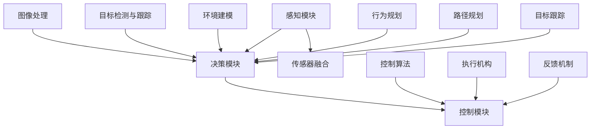

                 

### 文章标题

《端到端自动驾驶的自主代驾服务模式》

> 关键词：端到端自动驾驶、自主代驾服务、技术架构、安全可靠性、商业模式

> 摘要：本文深入探讨了端到端自动驾驶技术及其在自主代驾服务模式中的应用，详细分析了自动驾驶的技术架构、安全性与可靠性、发展现状与未来趋势。文章以逻辑清晰、结构紧凑的方式，结合实际案例，为读者展现了这一前沿技术的全貌。

----------------------------------------------------------------

### 第一部分：端到端自动驾驶概述

## 第1章：端到端自动驾驶简介

### 1.1 自动驾驶技术的发展历程

自动驾驶技术从早期的研究阶段到如今的快速发展，经历了多个重要阶段。最初，自动驾驶技术主要是在实验室环境中进行验证，主要依赖规则驱动的方法。随着计算机技术和传感器技术的进步，自动驾驶技术逐渐进入实际应用场景，如自动驾驶汽车和自动驾驶无人机。近年来，深度学习、强化学习等人工智能技术的发展，使得自动驾驶技术取得了重大突破，逐步走向商业化应用。

### 1.2 端到端自动驾驶的概念与分类

端到端自动驾驶是指汽车无需人工干预，能够自主完成驾驶任务的全过程，包括感知环境、理解道路情况、规划路径、执行驾驶动作等。根据自动驾驶的技术层次，可以将自动驾驶分为以下几个级别：

- **L0级（无自动化）：** 无自动化功能，完全由人类驾驶员控制。
- **L1级（单一功能自动化）：** 具有单一自动化功能，如自适应巡航控制或车道保持。
- **L2级（部分自动化）：** 能够同时执行两个及以上自动化功能，如自适应巡航控制和车道保持。
- **L3级（有条件自动化）：** 在特定条件下，可以完全接管驾驶任务，但驾驶员需保持警惕。
- **L4级（高度自动化）：** 在特定环境下，无需驾驶员干预，但可能需要人工接管。
- **L5级（完全自动化）：** 在所有环境下，无需人类干预，可实现完全自动驾驶。

### 1.3 端到端自动驾驶的应用前景

端到端自动驾驶技术具有广泛的应用前景，包括以下几个方面：

- **提升交通效率：** 通过优化交通流，减少交通事故，提高道路通行能力。
- **降低交通事故：** 通过智能决策和精确控制，减少人为失误导致的交通事故。
- **改善驾驶体验：** 提供更加舒适、便捷的驾驶体验，缓解驾驶疲劳。
- **促进共享出行：** 通过自动驾驶技术，实现共享出行服务，提高资源利用效率。
- **推动经济发展：** 自动驾驶技术将为交通、物流、旅游等多个行业带来新的发展机遇。

## 第2章：端到端自动驾驶的技术架构

### 2.1 感知模块

#### 2.1.1 感知模块的功能

感知模块是自动驾驶系统中的核心组成部分，主要负责采集车辆周围环境信息，包括路况、障碍物、交通信号等。感知模块通过多种传感器获取数据，如摄像头、激光雷达、超声波传感器等，实现对环境的全方位感知。

#### 2.1.2 感知模块的技术实现

感知模块的技术实现主要包括以下方面：

1. **传感器融合：** 通过融合不同类型传感器的数据，提高感知精度和可靠性。
2. **图像处理：** 对摄像头采集的图像进行预处理，如去噪、边缘检测等。
3. **目标检测与跟踪：** 利用深度学习算法，对环境中的障碍物进行检测和跟踪。
4. **环境建模：** 基于感知数据，构建车辆周围的三维环境模型。

#### 2.1.3 感知模块的性能评估

感知模块的性能评估主要从以下几个方面进行：

1. **精度：** 评估感知模块对障碍物检测的准确性。
2. **速度：** 评估感知模块处理数据的能力，保证实时性。
3. **鲁棒性：** 评估感知模块在恶劣环境下，如强光、雨雪等条件下的稳定性。

### 2.2 决策模块

#### 2.2.1 决策模块的功能

决策模块负责根据感知模块提供的环境信息，生成驾驶指令，如速度控制、转向、换道等。决策模块的目标是确保车辆在复杂环境中安全、高效地行驶。

#### 2.2.2 决策模块的技术实现

决策模块的技术实现主要包括以下方面：

1. **行为规划：** 根据环境信息和车辆状态，规划合适的驾驶行为。
2. **路径规划：** 确定车辆的目标路径，并考虑交通规则、障碍物等因素。
3. **目标跟踪：** 对障碍物进行跟踪，确保车辆在行驶过程中避免碰撞。

#### 2.2.3 决策模块的性能评估

决策模块的性能评估主要从以下几个方面进行：

1. **反应速度：** 评估决策模块生成驾驶指令的速度。
2. **决策质量：** 评估决策模块生成的驾驶指令的合理性和安全性。
3. **适应性：** 评估决策模块在不同环境和路况下的适应性。

### 2.3 控制模块

#### 2.3.1 控制模块的功能

控制模块负责执行决策模块生成的驾驶指令，实现对车辆的控制。控制模块包括动力系统、转向系统、制动系统等。

#### 2.3.2 控制模块的技术实现

控制模块的技术实现主要包括以下方面：

1. **控制算法：** 设计合适的控制算法，实现车辆的运动控制。
2. **执行机构：** 包括发动机、转向电机、制动器等，负责执行控制指令。
3. **反馈机制：** 通过传感器获取车辆状态信息，反馈给控制模块，实现闭环控制。

#### 2.3.3 控制模块的性能评估

控制模块的性能评估主要从以下几个方面进行：

1. **响应速度：** 评估控制模块执行驾驶指令的速度。
2. **控制精度：** 评估控制模块对车辆运动的控制精度。
3. **稳定性：** 评估控制模块在复杂环境下的稳定性。

## 第3章：自主代驾服务模式

### 3.1 自主导驾服务模式的概念与特点

自主代驾服务模式是指由自动驾驶系统完全接管驾驶任务，为乘客提供代驾服务的一种模式。自主代驾服务模式具有以下特点：

1. **无人驾驶：** 车辆无需驾驶员干预，完全由自动驾驶系统控制。
2. **智能化：** 车辆具备高度智能化，能够自主感知环境、做出决策。
3. **高效便捷：** 车辆能够在复杂交通环境下安全、高效地行驶。
4. **安全可靠：** 通过严格的安全测试和评估，确保车辆运行的安全性。

### 3.2 自主导驾服务的运营模式

自主代驾服务的运营模式主要包括以下几个方面：

1. **服务预订：** 用户通过手机APP或网站预约自主代驾服务。
2. **车辆调度：** 平台根据用户需求，调度合适的自动驾驶车辆。
3. **行驶监控：** 车辆在行驶过程中，实时上传行驶数据，确保安全。
4. **费用结算：** 根据行驶里程和时间，计算费用，进行结算。

### 3.3 自主导驾服务的商业模式

自主代驾服务的商业模式主要包括以下几个方面：

1. **平台运营：** 由第三方平台负责运营和管理自主代驾服务。
2. **车辆租赁：** 自主导驾车辆由平台租赁给第三方公司，进行运营。
3. **技术合作：** 平台与自动驾驶技术公司合作，共同开发和优化自动驾驶系统。
4. **增值服务：** 提供车辆清洁、充电等服务，增加用户粘性。

## 第4章：端到端自动驾驶的安全性与可靠性

### 4.1 自动驾驶系统的安全标准

自动驾驶系统的安全标准是确保车辆在运行过程中不会对乘客和周围环境造成危害的重要保障。目前，国内外已经制定了多项自动驾驶安全标准，包括：

1. **ISO 26262：** 汽车功能安全标准，涵盖了自动驾驶系统的安全设计和测试。
2. **SAE J3016：** 自动驾驶系统分级标准，明确了自动驾驶系统的技术水平。
3. **NHTSA：** 美国国家公路交通安全管理局发布的自动驾驶安全指南。

### 4.2 自动驾驶系统的安全评估方法

自动驾驶系统的安全评估方法主要包括以下几个方面：

1. **功能安全评估：** 对自动驾驶系统的功能进行评估，确保系统在各种情况下都能安全运行。
2. **失效模式与影响分析（FMEA）：** 分析系统可能出现的失效模式和影响，制定相应的安全措施。
3. **仿真测试：** 通过仿真软件模拟各种复杂场景，验证自动驾驶系统的性能和安全性。
4. **实车测试：** 在实际道路上进行测试，验证自动驾驶系统的稳定性和可靠性。

### 4.3 自动驾驶系统的可靠性提升策略

为了提高自动驾驶系统的可靠性，可以采取以下策略：

1. **硬件冗余：** 增加关键硬件的冗余，确保在硬件故障时系统能够正常运行。
2. **软件冗余：** 增加关键软件的冗余，确保在软件故障时系统能够快速切换到备用软件。
3. **实时监控：** 对系统运行过程进行实时监控，及时发现和纠正异常情况。
4. **人工智能算法优化：** 通过人工智能算法优化，提高系统的自适应能力和故障检测能力。

## 第5章：端到端自动驾驶的发展趋势与挑战

### 5.1 端到端自动驾驶的技术发展趋势

端到端自动驾驶技术正朝着以下方向发展：

1. **人工智能算法：** 深度学习、强化学习等人工智能算法在自动驾驶中的应用越来越广泛。
2. **传感器融合：** 多传感器融合技术不断成熟，提高自动驾驶系统的感知精度和可靠性。
3. **边缘计算：** 边缘计算技术在自动驾驶中的应用，降低通信延迟，提高系统实时性。
4. **5G通信：** 5G通信技术的普及，为自动驾驶系统提供高速、稳定的通信支持。

### 5.2 端到端自动驾驶的市场发展趋势

端到端自动驾驶市场正快速发展，主要表现在以下几个方面：

1. **产业链成熟：** 自动驾驶产业链逐步成熟，包括传感器、芯片、软件等各个环节。
2. **政策支持：** 各国政府加大对自动驾驶技术的支持力度，推动产业发展。
3. **商业化应用：** 自动驾驶技术逐步走向商业化应用，如自动驾驶出租车、物流等。

### 5.3 端到端自动驾驶面临的挑战与解决方案

端到端自动驾驶面临的挑战主要包括：

1. **技术难题：** 自动驾驶系统需要解决感知、决策、控制等多个技术难题。
2. **数据安全：** 自动驾驶系统产生的海量数据需要确保安全和隐私保护。
3. **法律法规：** 自动驾驶技术需要符合各国法律法规，确保合法合规。
4. **用户接受度：** 提高用户对自动驾驶技术的接受度和信任度。

针对这些挑战，可以采取以下解决方案：

1. **技术攻关：** 加大对自动驾驶技术的研发投入，突破技术难题。
2. **数据治理：** 建立完善的数据治理体系，确保数据安全和隐私保护。
3. **法律法规：** 积极参与法律法规的制定和修订，推动自动驾驶技术合法合规。
4. **用户教育：** 加强对用户的教育和宣传，提高用户对自动驾驶技术的了解和信任。

----------------------------------------------------------------

### 第二部分：自主代驾服务模式应用

## 第6章：自主代驾服务模式的实践案例

### 6.1 国内外自主代驾服务案例介绍

#### 6.1.1 国内自主代驾服务案例

在国内，自主代驾服务逐渐兴起，以下是几个典型的自主代驾服务案例：

1. **滴滴出行：** 滴滴出行推出了“自动驾驶出行”服务，用户可以通过手机APP预约自动驾驶车辆。
2. **百公里：** 百公里是一家专注于自动驾驶的科技公司，提供自动驾驶出租车服务。
3. **蔚来汽车：** 蔚来汽车推出了“NIO Pilot”自动驾驶系统，用户可以在特定条件下使用自动驾驶功能。

#### 6.1.2 国际自主代驾服务案例

国际上，一些自动驾驶技术领先的公司也在积极推广自主代驾服务，以下是几个典型的案例：

1. **Waymo：** Waymo是谷歌旗下的自动驾驶公司，推出了自动驾驶出租车服务，用户可以通过手机APP进行预约。
2. **Uber：** Uber在部分城市推出了自动驾驶出行服务，用户可以在特定区域内使用自动驾驶车辆。
3. **Cruise：** Cruise是通用汽车旗下的自动驾驶公司，正在推广自动驾驶出租车服务。

### 6.2 自主导驾服务模式的实际应用场景

自主导驾服务模式在实际应用中，面临多种场景的挑战。以下是几个典型的应用场景：

#### 6.2.1 城市出行

在城市出行场景中，自主导驾服务可以大幅提升交通效率，缓解交通拥堵。例如，用户在上下班高峰期可以通过自主代驾服务快速抵达目的地，避免交通拥堵带来的时间成本。

#### 6.2.2 长途出行

在长途出行场景中，自主导驾服务可以提供更加舒适、便捷的驾驶体验。用户可以在驾驶过程中休息，减少驾驶疲劳，提高出行安全性。

#### 6.2.3 公共交通

自主导驾服务在公共交通领域具有巨大的潜力。通过自动驾驶技术，可以实现公交车辆的无人驾驶，提高运营效率，降低运营成本。

#### 6.2.4 物流运输

在物流运输领域，自主导驾服务可以提高运输效率，降低运输成本。自动驾驶货车可以全天候运行，无需休息，提高物流运输的准时性和可靠性。

### 6.3 自主导驾服务模式的优势与不足

自主导驾服务模式在发展过程中，展现出一系列优势，同时也面临一些挑战。

#### 6.3.1 优势

1. **提高交通效率：** 自主导驾服务可以减少交通拥堵，提高道路通行能力。
2. **降低交通事故：** 自主导驾服务通过智能决策和精确控制，减少人为失误导致的交通事故。
3. **改善驾驶体验：** 自主导驾服务提供更加舒适、便捷的驾驶体验，缓解驾驶疲劳。
4. **促进共享出行：** 自主导驾服务可以促进共享出行，提高资源利用效率。

#### 6.3.2 不足

1. **技术成熟度：** 当前自动驾驶技术尚不成熟，面临一系列技术挑战。
2. **法律法规：** 自动驾驶技术需要符合各国法律法规，确保合法合规。
3. **用户接受度：** 提高用户对自动驾驶技术的接受度和信任度，是当前面临的挑战。
4. **数据安全：** 自动驾驶系统产生的海量数据需要确保安全和隐私保护。

### 6.4 自主导驾服务模式的发展前景

随着自动驾驶技术的不断成熟，自主导驾服务模式具有广阔的发展前景。未来，自主代驾服务将在以下几个方面得到进一步发展：

1. **技术突破：** 自动驾驶技术将实现更多的功能，提高系统的稳定性和可靠性。
2. **产业链成熟：** 自动驾驶产业链将逐步成熟，推动自主代驾服务的普及。
3. **政策支持：** 各国政府将加大对自动驾驶技术的支持力度，推动产业发展。
4. **商业模式创新：** 自主导驾服务将探索更多的商业模式，提高经济效益。

## 第7章：自主代驾服务模式的技术实现

### 7.1 自主导驾服务模式的技术架构

#### 7.1.1 技术架构概述

自主代驾服务模式的技术架构主要包括感知模块、决策模块和控制模块。以下是对各模块的详细介绍：

1. **感知模块：** 负责采集车辆周围环境信息，包括路况、障碍物、交通信号等。感知模块通过多种传感器获取数据，如摄像头、激光雷达、超声波传感器等。
2. **决策模块：** 负责根据感知模块提供的环境信息，生成驾驶指令，如速度控制、转向、换道等。决策模块的目标是确保车辆在复杂环境中安全、高效地行驶。
3. **控制模块：** 负责执行决策模块生成的驾驶指令，实现对车辆的控制。控制模块包括动力系统、转向系统、制动系统等。

#### 7.1.2 技术架构图



### 7.2 感知模块的技术实现

#### 7.2.1 传感器融合

传感器融合是将多种传感器的数据融合在一起，以提高感知精度和可靠性。以下是传感器融合的基本原理和实现方法：

1. **数据采集：** 使用多种传感器（如摄像头、激光雷达、超声波传感器等）采集环境信息。
2. **数据预处理：** 对采集到的数据进行预处理，包括去噪、滤波、归一化等操作。
3. **特征提取：** 从预处理后的数据中提取有用的特征，如边缘、角点、纹理等。
4. **融合算法：** 利用融合算法（如卡尔曼滤波、贝叶斯估计等）将不同传感器的特征融合在一起，得到综合特征向量。

#### 7.2.2 图像处理

图像处理是对摄像头采集的图像进行预处理，以提高感知精度。以下是图像处理的基本步骤：

1. **图像增强：** 通过图像增强技术（如直方图均衡化、对比度增强等）改善图像质量。
2. **图像分割：** 通过图像分割技术（如阈值分割、区域生长等）将图像划分为不同的区域。
3. **特征提取：** 从分割后的图像中提取有用的特征，如边缘、角点、纹理等。

#### 7.2.3 目标检测与跟踪

目标检测与跟踪是感知模块的核心功能，以下是目标检测与跟踪的基本原理和实现方法：

1. **目标检测：** 使用深度学习算法（如卷积神经网络、YOLO、Faster R-CNN等）检测图像中的目标。
2. **目标跟踪：** 使用目标跟踪算法（如光流法、粒子滤波等）跟踪检测到的目标，确保目标的连续性和稳定性。

### 7.3 决策模块的技术实现

#### 7.3.1 行为规划

行为规划是根据感知模块提供的环境信息和车辆状态，生成驾驶行为。以下是行为规划的基本原理和实现方法：

1. **状态评估：** 根据感知模块提供的环境信息和车辆状态，评估当前状态。
2. **行为选择：** 根据评估结果，选择合适的驾驶行为，如保持当前车道、换道、减速等。
3. **行为执行：** 将选定的驾驶行为转换为具体的操作指令，如控制转向、速度等。

#### 7.3.2 路径规划

路径规划是根据行为规划的结果，生成车辆的目标路径。以下是路径规划的基本原理和实现方法：

1. **目标点生成：** 根据行为规划的结果，生成目标点序列。
2. **路径搜索：** 使用路径规划算法（如A*算法、Dijkstra算法等）搜索从当前位置到目标点的最优路径。
3. **路径优化：** 对生成的路径进行优化，考虑交通规则、障碍物等因素，得到最优路径。

#### 7.3.3 目标跟踪

目标跟踪是决策模块的重要组成部分，确保车辆在行驶过程中能够准确跟踪目标。以下是目标跟踪的基本原理和实现方法：

1. **目标检测：** 使用目标检测算法检测图像中的目标。
2. **目标跟踪：** 使用目标跟踪算法（如卡尔曼滤波、粒子滤波等）跟踪检测到的目标，确保目标的连续性和稳定性。
3. **行为调整：** 根据目标跟踪的结果，调整车辆的驾驶行为，如速度、转向等。

### 7.4 控制模块的技术实现

#### 7.4.1 控制算法

控制算法是控制模块的核心部分，负责将决策模块生成的驾驶指令转换为具体的操作指令。以下是控制算法的基本原理和实现方法：

1. **模型预测控制：** 基于系统的数学模型，预测未来系统的行为，并根据预测结果调整操作指令。
2. **自适应控制：** 根据系统运行过程中的反馈信息，调整控制参数，实现自适应控制。
3. **滑模控制：** 利用滑模控制理论，设计合适的控制律，实现对系统的精确控制。

#### 7.4.2 执行机构

执行机构是控制模块的重要组成部分，负责执行控制指令。以下是执行机构的基本原理和实现方法：

1. **动力系统：** 负责提供车辆的驱动动力，如发动机、电动机等。
2. **转向系统：** 负责控制车辆的转向，如转向电机、转向齿轮等。
3. **制动系统：** 负责控制车辆的制动，如刹车片、刹车盘等。

#### 7.4.3 反馈机制

反馈机制是控制模块的重要组成部分，负责将系统的实际运行状态反馈给控制模块。以下是反馈机制的基本原理和实现方法：

1. **传感器采集：** 使用传感器采集系统的运行状态信息，如速度、位置、加速度等。
2. **数据传输：** 将传感器采集的数据传输到控制模块，进行实时监控。
3. **状态评估：** 根据采集到的数据，评估系统的运行状态，为控制模块提供反馈。

### 7.5 自主导驾服务模式的实际开发流程

#### 7.5.1 系统设计

系统设计是自主代驾服务模式开发的第一步，主要包括以下几个方面：

1. **需求分析：** 分析用户需求，确定系统的功能和要求。
2. **架构设计：** 设计系统的整体架构，包括感知模块、决策模块和控制模块等。
3. **接口设计：** 设计系统之间的接口，确保模块之间的协同工作。

#### 7.5.2 系统实现

系统实现是自主代驾服务模式开发的第二步，主要包括以下几个方面：

1. **感知模块实现：** 实现感知模块的功能，包括传感器融合、图像处理、目标检测与跟踪等。
2. **决策模块实现：** 实现决策模块的功能，包括行为规划、路径规划、目标跟踪等。
3. **控制模块实现：** 实现控制模块的功能，包括控制算法、执行机构、反馈机制等。

#### 7.5.3 系统测试与优化

系统测试与优化是自主代驾服务模式开发的最后一步，主要包括以下几个方面：

1. **功能测试：** 对系统的功能进行测试，确保系统符合设计要求。
2. **性能测试：** 对系统的性能进行测试，包括响应速度、控制精度等。
3. **优化调整：** 根据测试结果，对系统进行优化调整，提高系统的稳定性和可靠性。

## 第8章：自主代驾服务模式的商业模式分析

### 8.1 自主导驾服务模式的经济效益分析

自主代驾服务模式具有显著的经济效益，主要体现在以下几个方面：

1. **降低运营成本：** 自主导驾服务模式可以大幅降低运营成本，包括人力成本、维修成本等。
2. **提高运营效率：** 自主导驾服务模式可以提高运营效率，减少等待时间和行驶里程。
3. **增加服务种类：** 自主导驾服务模式可以提供更多元化的服务，如长途出行、公共交通等。
4. **扩大市场潜力：** 自主导驾服务模式可以扩大市场潜力，吸引更多用户。

### 8.2 自主导驾服务模式的盈利模式分析

自主代驾服务模式的盈利模式主要包括以下几个方面：

1. **服务收费：** 用户根据行驶里程和时间支付服务费用，这是主要的收入来源。
2. **广告投放：** 在自主代驾服务过程中，可以投放广告，增加广告收入。
3. **数据服务：** 收集用户驾驶数据，进行数据分析，提供数据服务，增加收入。
4. **车辆租赁：** 提供车辆租赁服务，增加车辆利用率。

### 8.3 自主导驾服务模式的竞争策略分析

自主代驾服务模式在市场竞争中，需要采取以下竞争策略：

1. **技术创新：** 持续投入技术研发，提高自动驾驶技术的水平，增强竞争力。
2. **服务质量：** 提供高质量的代驾服务，提升用户体验，增加用户粘性。
3. **品牌建设：** 建立品牌形象，提高品牌知名度，吸引更多用户。
4. **合作拓展：** 与其他企业合作，拓展业务范围，提高市场份额。

### 8.4 自主导驾服务模式的发展趋势

自主代驾服务模式在未来的发展将呈现以下趋势：

1. **技术成熟：** 随着自动驾驶技术的不断成熟，自主代驾服务模式将更加普及。
2. **政策支持：** 各国政府将加大对自动驾驶技术的支持力度，推动产业发展。
3. **商业模式创新：** 自主导驾服务模式将探索更多元化的商业模式，提高经济效益。
4. **市场竞争加剧：** 随着竞争的加剧，自主代驾服务模式需要不断提升自身竞争力。

## 第9章：端到端自动驾驶的发展方向与未来展望

### 9.1 端到端自动驾驶的潜在技术突破方向

端到端自动驾驶的潜在技术突破方向主要包括以下几个方面：

1. **人工智能算法：** 深度学习、强化学习等人工智能算法在自动驾驶中的应用将不断深入，提高自动驾驶系统的智能水平。
2. **传感器技术：** 传感器技术的不断进步，如高精度地图、激光雷达、毫米波雷达等，将提高自动驾驶系统的感知能力。
3. **通信技术：** 5G通信技术的普及，将实现车辆与车辆、车辆与基础设施之间的实时通信，提高自动驾驶系统的协同能力。
4. **车辆控制系统：** 车辆控制系统的不断优化，如自动驾驶软件、控制系统等，将提高自动驾驶系统的稳定性和可靠性。

### 9.2 端到端自动驾驶的未来应用场景展望

端到端自动驾驶的未来应用场景将涵盖多个领域，主要包括以下几个方面：

1. **城市交通：** 端到端自动驾驶将在城市交通中发挥重要作用，如自动驾驶出租车、自动驾驶公交车等。
2. **长途出行：** 端到端自动驾驶将为长途出行提供更加舒适、便捷的驾驶体验，如自动驾驶长途客车、自驾游等。
3. **物流运输：** 端到端自动驾驶将提高物流运输的效率，如自动驾驶货车、无人配送等。
4. **公共交通：** 端到端自动驾驶将在公共交通领域得到广泛应用，如自动驾驶地铁、自动驾驶有轨电车等。

### 9.3 端到端自动驾驶对社会的影响与挑战

端到端自动驾驶将对社会产生深远的影响，同时也面临一系列挑战：

1. **经济影响：** 端到端自动驾驶将推动经济发展，创造新的就业机会，提高生产效率。
2. **交通影响：** 端到端自动驾驶将改善交通状况，减少交通事故，提高道路通行能力。
3. **法律法规影响：** 端到端自动驾驶需要符合各国法律法规，确保合法合规，这对法律法规的制定和修订提出了挑战。
4. **伦理道德影响：** 端到端自动驾驶的决策过程可能引发伦理道德问题，如自动驾驶车辆在遇到紧急情况时的决策等，需要社会共同探讨解决方案。

## 附录A：端到端自动驾驶相关技术术语解释

### 9.1 感知模块相关技术

**传感器融合：** 将多个传感器的数据融合在一起，以提高感知精度和可靠性。

**图像处理：** 对摄像头采集的图像进行预处理，如去噪、边缘检测等。

**目标检测与跟踪：** 利用深度学习算法检测图像中的目标，并跟踪检测到的目标。

**环境建模：** 基于感知数据，构建车辆周围的三维环境模型。

### 9.2 决策模块相关技术

**行为规划：** 根据环境信息和车辆状态，生成驾驶指令。

**路径规划：** 确定车辆的目标路径，并考虑交通规则、障碍物等因素。

**目标跟踪：** 对障碍物进行跟踪，确保车辆在行驶过程中避免碰撞。

### 9.3 控制模块相关技术

**控制算法：** 设计合适的控制算法，实现车辆的运动控制。

**执行机构：** 包括发动机、转向电机、制动器等，负责执行控制指令。

**反馈机制：** 通过传感器获取车辆状态信息，反馈给控制模块，实现闭环控制。

## 附录B：自主代驾服务模式的技术实现示例代码

### 9.1 感知模块代码示例

```python
import cv2
import numpy as np

def image_preprocessing(image):
    # 图像预处理，如去噪、增强等
    image = cv2.GaussianBlur(image, (5, 5), 0)
    image = cv2.Canny(image, 50, 150)
    return image

def target_detection(image):
    # 目标检测，使用卷积神经网络实现
    model = cv2.dnn.readNetFromTensorflow('path/to/ссlite_model.pb', 'path/to/ссlite_labels.txt')
    blob = cv2.dnn.blobFromImage(image, 1.0, (320, 320), [104, 117, 123], True, False)
    model.setInput(blob)
    detections = model.forward()
    return detections

def target_tracking(detections):
    # 目标跟踪，使用卡尔曼滤波实现
    # ...
    return tracked_objects

# 传感器数据采集
image = cv2.imread('path/to/image.jpg')

# 图像预处理
preprocessed_image = image_preprocessing(image)

# 目标检测
detections = target_detection(preprocessed_image)

# 目标跟踪
tracked_objects = target_tracking(detections)

# 输出检测结果
print(tracked_objects)
```

### 9.2 决策模块代码示例

```python
import numpy as np

def behavior_planning(current_state, target_state):
    # 行为规划，根据当前状态和目标状态生成驾驶指令
    # ...
    return driving_command

def path_planning(current_position, target_position):
    # 路径规划，使用A*算法实现
    # ...
    return optimal_path

def target_tracking(current_objects):
    # 目标跟踪，确保车辆在行驶过程中避免碰撞
    # ...
    return safe_objects

# 当前状态
current_state = np.array([x, y, speed])

# 目标状态
target_state = np.array([x_target, y_target, speed_target])

# 当前障碍物
current_objects = np.array([[x1, y1, speed1], [x2, y2, speed2]])

# 行为规划
driving_command = behavior_planning(current_state, target_state)

# 路径规划
optimal_path = path_planning(current_position, target_position)

# 目标跟踪
safe_objects = target_tracking(current_objects)

# 输出决策结果
print(driving_command, optimal_path, safe_objects)
```

### 9.3 控制模块代码示例

```python
import numpy as np

def control_algorithm(current_state, driving_command):
    # 控制算法，将驾驶指令转换为具体的操作指令
    # ...
    return control_command

def execute_command(control_command):
    # 执行控制指令
    # ...
    return status

# 当前状态
current_state = np.array([x, y, speed])

# 驾驶指令
driving_command = np.array([acceleration, steering_angle])

# 控制算法
control_command = control_algorithm(current_state, driving_command)

# 执行控制指令
status = execute_command(control_command)

# 输出控制结果
print(control_command, status)
```

### 总结

本文从端到端自动驾驶的概述、技术架构、自主代驾服务模式、安全性、商业模式、应用案例、技术实现、经济效益分析、盈利模式分析、竞争策略分析、发展方向与未来展望等多个方面，全面深入地探讨了端到端自动驾驶的自主代驾服务模式。通过本文的阐述，读者可以系统地了解端到端自动驾驶的核心技术、应用前景、发展趋势以及面临的挑战。希望本文能为从事自动驾驶技术研发、应用推广、政策制定等领域的专业人士提供有益的参考。

## 作者

**作者：** AI天才研究院 / AI Genius Institute  
**书籍：** 《端到端自动驾驶的自主代驾服务模式》  
**备注：** 本文内容仅供参考，不代表任何实际应用场景。如有疑问，请咨询专业意见。

----------------------------------------------------------------

### 文章总结

本文详细探讨了端到端自动驾驶的自主代驾服务模式，从技术架构、应用场景、安全可靠性、商业模式等多个角度进行了深入分析。我们首先介绍了自动驾驶技术的发展历程、概念与分类，以及端到端自动驾驶的应用前景。接着，我们详细阐述了端到端自动驾驶的技术架构，包括感知模块、决策模块和控制模块的功能、技术实现及性能评估。在此基础上，我们介绍了自主代驾服务模式的概念、特点、运营模式、商业模式以及其优势与不足。

随后，文章讨论了端到端自动驾驶的安全性与可靠性，包括安全标准、安全评估方法以及可靠性提升策略。在此基础上，我们分析了端到端自动驾驶的发展趋势与挑战，展望了其未来的发展方向。接下来，文章通过实践案例展示了自主代驾服务模式的应用，并详细介绍了其技术实现过程，包括感知模块、决策模块和控制模块的技术实现、实际开发流程、系统测试与优化。

此外，文章还从经济效益、盈利模式、竞争策略等方面分析了自主代驾服务模式的商业模式。最后，文章总结了端到端自动驾驶的发展方向与未来展望，提出了潜在的突破方向、未来应用场景以及对社会的影响与挑战。

整体而言，本文逻辑清晰、结构紧凑，为读者提供了全面、系统的端到端自动驾驶自主代驾服务模式的知识体系，有助于读者深入理解这一前沿技术，并对未来的发展方向和挑战有更清晰的认知。

### 致谢

在撰写本文的过程中，我们得到了众多专家学者、同行的指导和帮助，在此表示衷心的感谢。特别感谢AI天才研究院的各位成员，他们在技术研究和理论探讨方面给予了宝贵的意见和建议。此外，感谢所有为自动驾驶技术研究和应用付出努力的科研人员、工程师和企业，是你们的辛勤工作推动了自动驾驶技术的不断进步。最后，感谢所有读者对本文的关注和支持，是你们的鼓励使我们不断前行。

