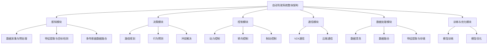

                 

### 文章标题

《端到端自动驾驶的软件架构变革》

#### 关键词
- 端到端自动驾驶
- 软件架构
- 感知技术
- 决策技术
- 控制技术
- 开放性
- 扩展性
- 安全性
- 可靠性
- 模块划分
- 系统集成与测试

#### 摘要
本文旨在探讨端到端自动驾驶领域中的软件架构变革，从技术、设计方法和实践等多个角度展开分析。首先，我们概述了自动驾驶技术的发展历程、分类以及前沿趋势。随后，详细介绍了端到端自动驾驶的核心概念、优势与挑战，并剖析了感知、决策和控制技术。接下来，讨论了端到端自动驾驶系统架构的组成和关键组件。在软件架构设计部分，我们提出了设计原则、方法以及实现策略，并通过具体案例进行了分析。最后，我们探讨了自动驾驶软件架构变革的趋势与实践，以及未来发展的前景。

---

## 《端到端自动驾驶的软件架构变革》目录大纲

### 第一部分：端到端自动驾驶概述

- **第1章：自动驾驶技术概述**
  - **1.1 自动驾驶技术的发展历程**
  - **1.2 自动驾驶技术的分类**
  - **1.3 自动驾驶技术的前沿趋势**

- **第2章：端到端自动驾驶的核心概念**
  - **2.1 端到端自动驾驶的定义**
  - **2.2 端到端自动驾驶的优势**
  - **2.3 端到端自动驾驶的挑战**

- **第3章：端到端自动驾驶的关键技术**
  - **3.1 感知技术**
  - **3.2 决策技术**
  - **3.3 控制技术**

- **第4章：端到端自动驾驶系统架构**
  - **4.1 端到端自动驾驶系统的整体架构**
  - **4.2 数据流处理与信息融合**
  - **4.3 系统可靠性与安全性**

### 第二部分：端到端自动驾驶软件架构设计

- **第5章：自动驾驶软件架构设计原则**
  - **5.1 开放性**
  - **5.2 扩展性**
  - **5.3 安全性**
  - **5.4 可靠性**

- **第6章：自动驾驶软件架构设计方法**
  - **6.1 软件架构设计流程**
  - **6.2 软件架构风格与模式**
  - **6.3 软件架构评估与优化**

- **第7章：自动驾驶软件架构实现**
  - **7.1 软件模块划分与设计**
  - **7.2 系统集成与测试**
  - **7.3 软件开发环境与工具**

- **第8章：端到端自动驾驶软件架构案例研究**
  - **8.1 案例选择与背景介绍**
  - **8.2 案例的软件架构分析**
  - **8.3 案例的软件架构评价**

### 第三部分：端到端自动驾驶软件架构变革实践

- **第9章：自动驾驶软件架构变革的趋势**
  - **9.1 自动驾驶软件架构变革的驱动力**
  - **9.2 自动驾驶软件架构变革的方向**
  - **9.3 自动驾驶软件架构变革的挑战**

- **第10章：自动驾驶软件架构变革实践**
  - **10.1 变革策略与方法**
  - **10.2 变革过程中的风险管理**
  - **10.3 变革效果评估与优化**

- **第11章：端到端自动驾驶软件架构变革的未来**
  - **11.1 自动驾驶软件架构变革的长期影响**
  - **11.2 自动驾驶软件架构变革的持续挑战**
  - **11.3 自动驾驶软件架构变革的展望**

### 附录

- **附录 A：端到端自动驾驶软件架构变革相关资源**
- **附录 B：端到端自动驾驶软件架构变革的Mermaid流程图**

### 参考文献
- 在文中引用的相关书籍、论文和研究报告将列于参考文献部分。

---

## 第一部分：端到端自动驾驶概述

### 第1章：自动驾驶技术概述

#### 1.1 自动驾驶技术的发展历程

自动驾驶技术的发展始于20世纪50年代，当时科学家们开始探索自动驾驶的概念。最早期的自动驾驶系统依赖于机械感应器和简单的编程逻辑，但这些系统在复杂的环境下表现不佳。随着时间的推移，计算机技术和传感器技术的进步为自动驾驶技术带来了新的契机。

20世纪80年代，研究人员开始使用雷达和激光测距仪来增强车辆的感知能力。这一时期，一些公司和研究机构如卡内基梅隆大学和福特汽车公司等，在自动驾驶领域取得了显著进展。然而，由于技术和硬件的限制，这些早期的自动驾驶系统主要局限于封闭环境和特定场景。

进入21世纪，随着计算机处理能力的提升和传感器的进步，自动驾驶技术迎来了新的发展阶段。特别是深度学习技术的发展，使得自动驾驶系统在复杂环境下的感知和决策能力得到了显著提升。2010年后，谷歌、特斯拉、百度等科技公司和传统车企纷纷加入自动驾驶技术的研发，推动了该领域的发展。

近年来，自动驾驶技术已经逐步从实验室走向实际应用。从L1级别的辅助驾驶系统到L5级别的完全自动驾驶，各个级别的自动驾驶系统都在不断改进和普及。自动驾驶汽车、自动驾驶无人机、自动驾驶卡车等多种形式的自动驾驶系统相继问世，标志着自动驾驶技术进入了一个新的时代。

#### 1.2 自动驾驶技术的分类

自动驾驶技术可以根据其自动化程度和功能进行分类。以下是几种常见的自动驾驶级别：

- **L0级别（无自动化）**：车辆没有任何自动化功能，所有驾驶任务都由人类驾驶员完成。

- **L1级别（驾驶辅助）**：车辆具备部分自动化功能，如自适应巡航控制和车道保持辅助，但驾驶员仍然需要负责监控车辆和周围环境。

- **L2级别（部分自动化）**：车辆能够在特定条件下实现部分自动化驾驶，如高速巡航、车道保持和换道。驾驶员需要持续监控车辆，并在必要时接管控制。

- **L3级别（有条件自动化）**：车辆能够在特定条件下完全自动化驾驶，如高速公路上的自动驾驶。驾驶员可以在特定条件下暂时离开方向盘，但在需要时必须能够接管控制。

- **L4级别（高度自动化）**：车辆在特定环境下能够实现完全自动化驾驶，无需人类驾驶员的干预。例如，城市内部的自动驾驶出租车。

- **L5级别（完全自动化）**：车辆在任何环境下都能够实现完全自动化驾驶，无需人类驾驶员的任何干预。这种级别的自动驾驶目前仍处于研发阶段。

不同级别的自动驾驶技术在不同场景下有各自的应用。L1和L2级别的自动驾驶技术已经广泛应用于现代汽车中，而L3、L4和L5级别的自动驾驶技术则主要在特定环境和条件下进行测试和部署。

#### 1.3 自动驾驶技术的前沿趋势

当前，自动驾驶技术正处于快速发展的阶段，其前沿趋势主要体现在以下几个方面：

- **深度学习和人工智能技术的应用**：深度学习技术的发展极大地提升了自动驾驶系统的感知和决策能力。通过使用卷积神经网络（CNN）和循环神经网络（RNN）等深度学习模型，自动驾驶系统能够更加准确地理解和预测周围环境，从而提高驾驶安全性和效率。

- **多传感器融合技术**：自动驾驶系统通常需要多种传感器（如摄像头、雷达、激光雷达等）来感知周围环境。多传感器融合技术通过整合不同传感器的数据，能够提供更准确和全面的感知信息，从而提高系统的鲁棒性和可靠性。

- **车联网技术**：车联网技术（V2X）的发展使得自动驾驶系统可以与其他车辆、基础设施和云端进行通信。通过V2X技术，自动驾驶系统能够获取更广泛的环境信息，从而实现更智能和安全的驾驶。

- **边缘计算和云计算的结合**：边缘计算和云计算的结合为自动驾驶系统提供了强大的计算和存储能力。通过边缘计算，自动驾驶系统可以在本地实时处理大量数据，从而减少延迟和提高响应速度。而云计算则提供了海量数据和强大计算资源，用于训练和优化自动驾驶算法。

- **安全性和隐私保护**：随着自动驾驶技术的普及，确保系统的安全性和保护用户隐私变得至关重要。自动驾驶系统需要具备强大的安全机制，以防止恶意攻击和故障。同时，隐私保护措施也需要得到加强，以确保用户数据的安全和隐私。

- **商业化与法规政策**：自动驾驶技术的商业化进程正在加速，许多公司和政府机构正在制定相关的法规和政策，以促进自动驾驶技术的发展和应用。这些法规和政策旨在确保自动驾驶系统的安全性和可靠性，并推动其普及。

总之，自动驾驶技术的前沿趋势包括深度学习和人工智能技术的应用、多传感器融合技术、车联网技术、边缘计算和云计算的结合、安全性和隐私保护，以及商业化与法规政策的制定。这些趋势将推动自动驾驶技术不断进步，为未来智能出行提供更加安全、高效和便捷的解决方案。

### 第2章：端到端自动驾驶的核心概念

#### 2.1 端到端自动驾驶的定义

端到端自动驾驶是指利用深度学习等技术，直接从传感器数据中学习驾驶策略，实现车辆的全自动化驾驶。与传统的自动驾驶方法不同，端到端自动驾驶不需要预先定义和训练大量的感知模块、决策模块和控制模块，而是通过一个统一的神经网络模型直接处理感知和决策任务。这种方法的优点在于可以大大简化系统的设计和开发过程，提高系统的整体性能和可靠性。

在端到端自动驾驶中，车辆的感知、决策和控制过程是通过一个统一的神经网络模型实现的。这个神经网络模型通常是一个大规模的卷积神经网络（CNN）或深度循环神经网络（RNN），它可以从大量的传感器数据中学习驾驶策略。通过训练，神经网络模型能够识别道路标志、行人、车辆等环境要素，并据此做出驾驶决策，如加速、减速、转向等。

#### 2.2 端到端自动驾驶的优势

端到端自动驾驶具有以下优势：

1. **简化系统设计**：传统的自动驾驶系统通常需要多个独立的模块，如感知模块、决策模块和控制模块。这些模块之间需要通过复杂的接口进行通信，导致系统设计和开发过程复杂且繁琐。而端到端自动驾驶通过一个统一的神经网络模型，简化了系统架构，减少了模块之间的接口和通信开销，提高了系统的整体效率和可靠性。

2. **提高系统性能**：端到端自动驾驶直接从传感器数据中学习驾驶策略，避免了传统方法中需要手动定义和调优大量参数的繁琐过程。这使得神经网络模型能够更好地适应不同驾驶环境和条件，从而提高系统的性能和鲁棒性。

3. **减少开发成本**：端到端自动驾驶简化了系统设计，减少了模块之间的接口和通信开销，从而降低了系统的开发成本。此外，通过大规模数据训练神经网络模型，可以提高系统的性能和鲁棒性，进一步降低了系统的开发和维护成本。

4. **提高驾驶安全性**：端到端自动驾驶通过深度学习技术，能够更好地理解和预测周围环境，从而提高驾驶的安全性。传统的自动驾驶系统在处理复杂环境时，容易出现误判和失效，而端到端自动驾驶系统能够通过实时学习和调整，提高系统的稳定性和可靠性。

#### 2.3 端到端自动驾驶的挑战

尽管端到端自动驾驶具有诸多优势，但也面临着一些挑战：

1. **数据隐私和安全问题**：端到端自动驾驶需要大量传感器数据来训练神经网络模型。这些数据中包含驾驶行为、位置信息等敏感信息，如果不当处理，可能导致数据泄露和隐私侵犯。此外，自动驾驶系统也可能成为网络攻击的目标，需要确保系统的安全性和数据保护。

2. **系统复杂性**：端到端自动驾驶系统通常是一个大规模的神经网络模型，其复杂性和规模远超过传统的自动驾驶系统。这使得系统设计和开发过程更加复杂，需要高效的算法和工具来处理大量数据和模型优化。

3. **系统可靠性**：端到端自动驾驶系统依赖于神经网络模型，其性能和稳定性受到数据质量和训练过程的影响。在复杂和变化多端的环境中，系统可能会出现误判和失效，影响驾驶安全。因此，需要不断提高系统的可靠性和鲁棒性。

4. **法律法规和监管**：随着端到端自动驾驶技术的快速发展，相关的法律法规和监管政策尚未完全完善。这可能导致自动驾驶系统的部署和推广受到限制，需要政府和行业共同努力，制定合理的法规和政策，确保自动驾驶技术的安全性和可靠性。

5. **商业化和普及**：端到端自动驾驶技术的商业化和普及面临一些挑战。首先，高成本和技术复杂性限制了大规模推广。其次，公众对自动驾驶技术的接受度和信任度仍需提高。此外，自动驾驶技术的商业化需要与基础设施、交通管理和法规政策等各个方面进行协调，以确保其顺利落地和普及。

总之，端到端自动驾驶具有巨大的潜力和发展前景，但同时也面临着诸多挑战。通过不断研究和实践，我们有望克服这些挑战，推动自动驾驶技术的发展和应用。

#### 2.4 端到端自动驾驶的发展历程

端到端自动驾驶技术的发展历程可以分为几个关键阶段：

1. **初步探索阶段（20世纪50年代-70年代）**：这一阶段以理论研究为主，科学家们开始探讨自动驾驶的概念和基本原理。1950年，美国麻省理工学院的Neil J. McElroy提出了“自动驾驶汽车”的概念，标志着自动驾驶技术的诞生。此后，各国科学家和研究机构开始研究自动驾驶技术，并取得了一些初步的成果。

2. **传感器和计算技术阶段（20世纪80年代-90年代）**：随着计算机技术和传感器技术的进步，自动驾驶技术进入了一个新的发展阶段。此时，车辆开始配备激光雷达、雷达、摄像头等传感器，用于感知周围环境。同时，计算机处理能力的提升使得自动驾驶系统能够实时处理大量传感器数据，从而提高了系统的感知和决策能力。

3. **传统自动驾驶阶段（2000年-2010年）**：在这个阶段，自动驾驶技术主要依赖于传统的感知、决策和控制方法。这些方法通常包括基于规则的方法、机器学习和传统控制理论等。虽然这一阶段的自动驾驶系统在某些特定场景下表现良好，但在复杂和动态环境下，其性能和可靠性仍有待提高。

4. **深度学习和人工智能阶段（2010年至今）**：深度学习技术的发展为自动驾驶技术带来了新的契机。此时，研究人员开始尝试使用深度学习模型（如卷积神经网络、循环神经网络等）直接从传感器数据中学习驾驶策略，实现了端到端自动驾驶。这一阶段，自动驾驶技术取得了显著的进展，各类自动驾驶系统纷纷问世，并开始逐步进入实际应用阶段。

5. **大规模应用和变革阶段（未来）**：随着自动驾驶技术的不断成熟和普及，未来自动驾驶技术将进入大规模应用和变革阶段。自动驾驶汽车、自动驾驶无人机、自动驾驶卡车等多种形式的自动驾驶系统将在各个领域得到广泛应用，为智能出行和智慧城市建设提供强大支持。

#### 2.5 端到端自动驾驶的应用场景

端到端自动驾驶技术具有广泛的应用场景，以下是一些典型的应用领域：

1. **乘用车领域**：自动驾驶技术最早应用于乘用车领域。目前，许多高端汽车已经配备了L2和L3级别的自动驾驶功能，如自适应巡航控制、车道保持辅助、自动泊车等。随着自动驾驶技术的不断进步，未来有望实现L4和L5级别的完全自动驾驶，使驾驶更加安全、便捷和高效。

2. **商用车辆领域**：自动驾驶技术同样在商用车辆领域具有广泛的应用前景。例如，自动驾驶卡车可以减少长途运输中的驾驶疲劳，提高运输效率和安全性；自动驾驶公交车可以提供便捷的公共交通服务，缓解城市交通拥堵问题。

3. **共享出行领域**：随着自动驾驶技术的普及，共享出行模式将得到进一步发展。自动驾驶出租车和无人驾驶共享出行平台将提供更加安全、高效和经济的出行服务，满足公众的出行需求。

4. **物流配送领域**：自动驾驶技术在物流配送领域具有巨大的潜力。自动驾驶配送车辆可以实时感知和适应配送环境，实现快速、准确的配送服务，降低物流成本，提高配送效率。

5. **农业领域**：自动驾驶技术可以用于农业领域的自动耕种、播种、施肥和收割等环节，提高农业生产效率，减少人力成本。

6. **无人驾驶飞行器领域**：自动驾驶技术同样可以应用于无人驾驶飞行器，如无人机、无人机群等。这些无人驾驶飞行器可以用于物流配送、环境监测、搜救等多种场景，提供高效、智能的服务。

7. **公共交通领域**：自动驾驶技术在公共交通领域的应用包括自动驾驶地铁、自动驾驶有轨电车等。这些自动驾驶交通工具可以提高运输效率，减少人为操作的误差，提供更加安全、舒适的出行体验。

总之，端到端自动驾驶技术具有广泛的应用前景，将在多个领域带来革命性的变化，为智能出行和智慧城市建设提供强大支持。

### 第3章：端到端自动驾驶的关键技术

#### 3.1 感知技术

感知技术是端到端自动驾驶系统的核心组成部分，主要负责对周围环境进行感知和识别。为了实现精确的感知，自动驾驶系统通常依赖于多种传感器，包括摄像头、激光雷达（LiDAR）、雷达、超声波传感器等。以下是几种主要的感知技术及其原理：

1. **摄像头**：摄像头是自动驾驶系统中最常用的传感器之一，主要用于捕捉图像信息。通过图像处理技术，摄像头可以识别道路标志、行人和其他车辆等环境要素。常用的图像处理方法包括目标检测、语义分割和实例分割等。目标检测方法如YOLO、SSD和Faster R-CNN等，能够准确地识别和定位图像中的目标；语义分割方法如U-Net和SegNet等，能够将图像划分为不同的语义类别；实例分割方法如Mask R-CNN和PointRend等，不仅能够识别目标，还能将每个目标独立分割出来。

2. **激光雷达（LiDAR）**：激光雷达通过发射激光脉冲并测量其反射时间，来构建周围环境的3D点云模型。这些点云数据可以精确地表示物体的位置、形状和大小，为自动驾驶系统提供了丰富的环境信息。常用的点云处理方法包括VoxelNet、PointNet和PointPillars等。这些方法能够有效地对点云数据进行特征提取和分类，从而识别道路标志、行人和其他车辆等。

3. **雷达**：雷达通过发射电磁波并接收反射信号，来检测物体的距离和速度。雷达具有较强的穿透能力，可以在恶劣天气条件下仍然有效工作。常用的雷达数据处理方法包括雷达点云生成、目标检测和跟踪等。雷达数据处理方法如RadarNet和Fast R-CNN等，能够从雷达数据中提取目标信息，并实现目标的检测和跟踪。

4. **超声波传感器**：超声波传感器通过发射超声波脉冲并测量其反射时间，来检测物体的距离。超声波传感器具有低成本和安装方便等优点，常用于辅助停车和碰撞预警等场景。

在感知技术中，多传感器融合是一个重要的研究方向。通过将不同传感器的数据整合起来，可以提供更全面和准确的环境感知信息。多传感器融合的方法包括数据级融合、特征级融合和决策级融合等。数据级融合直接将原始传感器数据合并，如将摄像头图像和雷达数据合并；特征级融合对传感器数据分别进行处理，然后将处理后的特征进行融合；决策级融合则是对不同传感器的检测结果进行融合，以得到最终的感知结果。

#### 3.2 决策技术

决策技术是端到端自动驾驶系统的另一个核心组成部分，主要负责根据感知到的环境信息，制定出合适的驾驶策略。决策技术包括路径规划、行为预测和冲突解决等几个方面：

1. **路径规划**：路径规划是指确定车辆从当前的位置到目标位置所需行驶的路径。路径规划的方法可以分为基于采样的方法和基于图的算法。基于采样的方法如RRT（快速随机树）和RRT*（RRT的改进版本），通过在环境空间中随机采样，构建出一条可行的路径；基于图的算法如A*算法和Dijkstra算法，通过在图上寻找最短路径。这些算法能够有效地规划出从起点到终点的最优路径，考虑了道路障碍、速度限制和行驶时间等因素。

2. **行为预测**：行为预测是指根据其他车辆、行人和道路标志等环境信息，预测它们的未来行为。行为预测的方法包括基于模型的预测和基于学习的预测。基于模型的预测方法如卡尔曼滤波和粒子滤波，通过建立数学模型，对其他车辆和行人的行为进行预测；基于学习的预测方法如序列模型（如RNN）和深度学习模型（如LSTM和GRU），通过训练大量历史数据，学习出其他车辆和行人的行为模式。这些方法能够提高预测的准确性，减少误判和事故风险。

3. **冲突解决**：冲突解决是指在多车场景中，当多个车辆或行人存在潜在冲突时，确定各自的行动策略，以避免碰撞和事故。冲突解决的方法包括基于规则的方法和基于学习的算法。基于规则的方法如路权规则和优先级规则，通过预设的规则来分配道路资源；基于学习的算法如深度强化学习（DRL），通过训练神经网络模型，学习出最优的驾驶策略。这些方法能够在复杂和动态环境中，有效地解决冲突，确保驾驶安全。

在决策技术中，一个重要的研究方向是多任务学习。多任务学习是指同时处理多个感知和决策任务，以提高系统的整体性能和效率。例如，在自动驾驶系统中，可以同时进行路径规划、行为预测和冲突解决，从而提高决策的鲁棒性和准确性。

#### 3.3 控制技术

控制技术是端到端自动驾驶系统将决策结果转化为实际驾驶行为的关键环节，主要包括动力控制、转向控制和制动控制等：

1. **动力控制**：动力控制是指调整车辆的加速和减速，以实现预设的速度目标。动力控制的方法包括PID控制、模糊控制和模型预测控制（MPC）等。PID控制通过比例、积分和微分三个参数来调节输出，适用于线性系统和简单的非线性行为；模糊控制通过模糊逻辑和规则库来处理不确定性和非线性问题，适用于复杂的系统；模型预测控制通过建立系统的数学模型，预测未来的系统状态，并优化控制策略，适用于复杂的非线性和约束系统。

2. **转向控制**：转向控制是指调整车辆的转向角度，以实现预设的路径和轨迹。转向控制的方法包括PID控制、自适应控制和机器学习控制等。PID控制通过比例、积分和微分三个参数来调节转向角度；自适应控制通过实时调整控制参数，适应不同的驾驶环境；机器学习控制通过训练神经网络模型，实现自适应的转向控制。

3. **制动控制**：制动控制是指调整车辆的制动力度，以实现预设的制动目标。制动控制的方法包括PID控制、自适应控制和再生制动等。PID控制通过比例、积分和微分三个参数来调节制动力度；自适应控制通过实时调整控制参数，适应不同的驾驶环境和制动需求；再生制动通过利用车辆的动能转化为电能，实现高效的制动和能量回收。

在控制技术中，一个重要的研究方向是混合控制。混合控制是指将不同的控制方法结合在一起，以实现更好的控制效果。例如，可以将PID控制和模型预测控制结合，利用PID控制的简单性和快速响应特性，以及模型预测控制的优化能力和鲁棒性，实现高效的驾驶控制。

### 第4章：端到端自动驾驶系统架构

#### 4.1 端到端自动驾驶系统的整体架构

端到端自动驾驶系统的整体架构通常可以分为以下几个主要模块：

1. **感知模块**：感知模块负责收集并处理来自不同传感器的数据，包括摄像头、激光雷达、雷达和超声波传感器等。感知模块的主要任务是识别和理解周围环境，提取有用的信息，如道路标志、行人和其他车辆的位置和状态。

2. **决策模块**：决策模块基于感知模块提供的环境信息，负责制定出合适的驾驶策略。决策模块通常包括路径规划、行为预测和冲突解决等子模块，通过复杂的算法和模型，实现车辆的自动驾驶行为。

3. **控制模块**：控制模块负责将决策模块生成的驾驶策略转化为实际的操作指令，包括动力控制、转向控制和制动控制等。控制模块需要将决策结果转化为可执行的动作，以实现车辆的自动驾驶。

4. **通信模块**：通信模块负责与其他车辆、基础设施和云端进行数据通信。通过车联网（V2X）技术，自动驾驶系统可以获取更广泛的环境信息，从而提高驾驶的智能性和安全性。

5. **数据处理模块**：数据处理模块负责对感知、决策和控制模块生成的大量数据进行分析和处理，包括数据清洗、数据融合和特征提取等。通过有效的数据处理，可以提高系统的性能和效率。

6. **训练与优化模块**：训练与优化模块负责训练和优化感知、决策和控制模块的模型和算法。通过不断的学习和优化，可以提高系统的准确性和鲁棒性。

#### 4.2 数据流处理与信息融合

数据流处理与信息融合是端到端自动驾驶系统架构中的关键环节。由于不同传感器生成的数据具有不同的特点和局限性，因此需要对这些数据进行处理和融合，以提高系统的整体感知能力和决策质量。

1. **多传感器数据采集**：自动驾驶系统通常配备多种传感器，如摄像头、激光雷达、雷达和超声波传感器等。这些传感器从不同的角度和层面捕捉环境信息，从而提供了丰富的数据来源。

2. **数据预处理**：在数据采集后，需要对传感器数据进行预处理，包括数据清洗、数据去噪和数据标准化等。数据清洗的目的是去除无效和错误的数据，数据去噪的目的是减少噪声对数据的影响，数据标准化是将不同传感器的数据进行统一处理，以方便后续的融合。

3. **数据融合方法**：数据融合的方法可以分为数据级融合、特征级融合和决策级融合等。

   - **数据级融合**：数据级融合直接将原始传感器数据进行合并，例如将摄像头图像和雷达点云数据进行合并。这种方法能够保留原始数据的详细信息，但可能引入冗余和噪声。
   - **特征级融合**：特征级融合对传感器数据分别进行处理，然后将处理后的特征进行融合。例如，对摄像头图像进行目标检测和分割，对激光雷达点云进行分类和识别，然后将检测结果和识别结果进行融合。这种方法能够提高数据的精度和可靠性，但需要对不同传感器数据分别进行处理。
   - **决策级融合**：决策级融合是对不同传感器的检测结果和决策结果进行融合，以得到最终的感知和决策结果。例如，将摄像头检测到的道路标志和雷达检测到的车辆位置进行融合，以得到更准确的环境感知信息。这种方法能够充分利用不同传感器的优势，提高系统的整体性能。

4. **多传感器信息融合算法**：常用的多传感器信息融合算法包括卡尔曼滤波、粒子滤波和贝叶斯滤波等。

   - **卡尔曼滤波**：卡尔曼滤波是一种基于统计方法的融合算法，通过预测和更新状态估计，实现对多传感器数据的融合。卡尔曼滤波适用于线性系统和高斯噪声模型。
   - **粒子滤波**：粒子滤波是一种基于蒙特卡洛方法的融合算法，通过随机采样和权重更新，实现对多传感器数据的融合。粒子滤波适用于非线性系统和非高斯噪声模型。
   - **贝叶斯滤波**：贝叶斯滤波是一种基于贝叶斯理论的融合算法，通过概率推理和推理更新，实现对多传感器数据的融合。贝叶斯滤波适用于具有不确定性和不确定性的系统。

5. **数据融合效果评估**：数据融合效果评估是评价数据融合算法性能的重要指标。常用的评估方法包括信息增益、相似度分析和精度评估等。

   - **信息增益**：信息增益是通过计算传感器数据的熵和互信息，来评估不同传感器数据之间的信息相关性。信息增益越高，表示传感器数据之间的信息相关性越强，融合效果越好。
   - **相似度分析**：相似度分析是通过计算传感器数据之间的相似度，来评估不同传感器数据之间的融合效果。相似度越高，表示传感器数据之间的融合效果越好。
   - **精度评估**：精度评估是通过计算融合后的感知和决策结果的准确性和可靠性，来评估数据融合算法的性能。精度越高，表示数据融合算法的性能越好。

总之，数据流处理与信息融合是端到端自动驾驶系统架构中不可或缺的环节。通过有效的数据融合，可以提高系统的感知能力和决策质量，从而实现更安全、高效和智能的自动驾驶。

#### 4.3 系统可靠性与安全性

系统可靠性与安全性是端到端自动驾驶系统设计中的关键要素，直接关系到车辆的运行稳定性和驾驶安全性。以下从几个方面探讨如何提升端到端自动驾驶系统的可靠性和安全性：

1. **冗余设计**：冗余设计是提高系统可靠性的常用方法。通过在系统中引入多个传感器、计算单元和执行机构，可以在主系统出现故障时，由冗余部分接管系统控制，确保系统继续运行。例如，在自动驾驶系统中，可以同时使用摄像头、激光雷达和雷达等传感器，通过冗余设计提高感知信息的准确性。

2. **故障检测与诊断**：故障检测与诊断是确保系统安全运行的重要环节。通过实时监测系统各个模块的运行状态，可以及时发现故障并进行诊断。常用的故障检测方法包括基于统计学的模型检测、基于机器学习的异常检测和基于逻辑的故障诊断等。

3. **安全监控与响应机制**：端到端自动驾驶系统需要具备完善的安全监控与响应机制，以应对各种潜在的安全风险。例如，系统可以通过监控车辆的速度、位置和方向等关键参数，及时发现异常情况并进行紧急制动或转向等操作。此外，系统还需要具备远程控制功能，以便在紧急情况下由远程操作员接管车辆控制。

4. **数据加密与隐私保护**：随着自动驾驶技术的普及，车辆产生的数据量将大幅增加，如何保护这些数据的安全和隐私成为重要问题。通过数据加密和隐私保护技术，可以防止数据泄露和篡改，确保用户隐私和数据安全。

5. **符合法规和标准**：自动驾驶系统在设计和开发过程中，需要严格遵守相关的法规和标准，确保系统的安全性和可靠性。例如，美国联邦公路安全管理局（NHTSA）和欧洲新车评价程序（NCAP）等机构，已经制定了一系列关于自动驾驶系统的法规和标准，要求系统必须通过严格的测试和验证。

6. **测试与验证**：在系统开发过程中，需要进行大量的测试与验证，以确保系统在各种复杂环境和条件下都能正常运行。测试方法包括模拟测试、硬件在环（HIL）测试和实车测试等。通过这些测试，可以发现并修复系统中的潜在问题，提高系统的可靠性和安全性。

7. **持续优化与更新**：自动驾驶系统是一个不断进化的过程，需要通过持续优化和更新，提高系统的性能和安全性。通过收集和分析车辆运行数据，可以不断改进系统算法和架构，提高系统的鲁棒性和适应性。

总之，提升端到端自动驾驶系统的可靠性和安全性，需要从多个方面进行综合设计和优化。通过冗余设计、故障检测与诊断、安全监控与响应机制、数据加密与隐私保护、符合法规和标准、测试与验证以及持续优化与更新，可以确保自动驾驶系统在复杂的现实环境中安全、可靠地运行。

### 第二部分：端到端自动驾驶软件架构设计

#### 第5章：自动驾驶软件架构设计原则

自动驾驶软件架构设计的原则是确保系统能够在复杂、动态和多变的环境中稳定运行，同时具备良好的扩展性和可维护性。以下是一些关键的架构设计原则：

#### 5.1 开放性

开放性是指自动驾驶软件架构应该能够支持多种技术和协议，便于系统集成和扩展。具体来说，设计时需要考虑以下几个方面：

1. **标准化接口**：采用标准的通信协议和接口，如RESTful API、MQTT等，使得不同模块之间可以方便地进行数据交换和协作。
2. **模块化设计**：将系统功能划分为独立的模块，每个模块负责特定的功能，并通过接口进行通信。这种设计可以提高系统的可维护性和可扩展性。
3. **兼容性**：确保架构设计能够兼容不同的硬件和软件平台，例如在不同的操作系统、传感器和计算平台上都能正常运行。

#### 5.2 扩展性

扩展性是指系统架构能够适应未来的技术发展和应用需求，包括性能扩展、功能扩展和硬件扩展等方面。

1. **可伸缩性**：系统架构应该能够支持性能的横向扩展和纵向扩展。例如，可以通过增加服务器节点或提高计算能力来提升系统的处理能力。
2. **灵活性**：架构设计应考虑未来的功能扩展，例如可以通过模块化的设计，方便地集成新的算法或功能模块。
3. **分布式系统**：采用分布式系统架构，可以将任务分布到多个节点上处理，以提高系统的效率和容错能力。

#### 5.3 安全性

安全性是自动驾驶软件架构设计的重要原则，因为系统的安全性直接关系到驾驶的安全性和用户的隐私。

1. **数据加密**：对传输和存储的数据进行加密处理，防止数据泄露和篡改。
2. **访问控制**：实施严格的访问控制机制，确保只有授权用户和模块才能访问系统资源和数据。
3. **安全审计**：建立安全审计机制，实时监控系统的运行状态，及时发现和应对潜在的安全威胁。
4. **容错设计**：通过冗余设计和故障检测机制，确保在系统出现故障时，能够自动切换到备用模块或节点，保证系统的连续运行。

#### 5.4 可靠性

可靠性是指系统在长时间运行中能够保持稳定、可靠的工作状态。以下是确保系统可靠性的几个关键点：

1. **冗余设计**：通过引入冗余机制，确保在关键组件出现故障时，系统能够自动切换到备用组件，保证系统的连续运行。
2. **容错机制**：设计容错机制，能够检测并纠正系统中的错误，避免因单点故障导致系统崩溃。
3. **实时监控**：实时监控系统运行状态，及时识别并处理异常情况，确保系统始终处于良好的运行状态。
4. **故障恢复**：设计有效的故障恢复机制，确保在系统发生故障后，能够快速恢复，减少对用户体验的影响。

通过遵循这些设计原则，自动驾驶软件架构能够具备良好的开放性、扩展性、安全性和可靠性，为自动驾驶系统的稳定运行提供有力保障。

#### 第6章：自动驾驶软件架构设计方法

自动驾驶软件架构设计方法是将系统的功能需求转化为具体的架构设计和实现的过程。一个良好的软件架构设计方法不仅能够满足系统的功能需求，还要考虑系统的可扩展性、可维护性和可靠性。以下介绍几种常见的自动驾驶软件架构设计方法。

#### 6.1 软件架构设计流程

软件架构设计流程可以分为以下几个关键步骤：

1. **需求分析**：在软件架构设计之前，首先要明确系统的功能需求和性能要求。这包括自动驾驶系统的感知、决策、控制等核心功能，以及对系统的实时性、可靠性、安全性等方面的要求。

2. **架构设计**：根据需求分析的结果，设计系统的软件架构。这一步骤主要包括确定系统的模块划分、模块之间的接口和通信机制、系统的数据流和控制流等。

3. **架构评估**：对初步设计的软件架构进行评估，包括性能评估、可靠性评估、可维护性评估等。评估的方法可以包括模拟测试、代码审查、性能分析工具等。

4. **架构优化**：根据评估结果，对软件架构进行优化和调整，以提升系统的性能和可靠性。

5. **架构实现**：将优化后的软件架构转化为具体的代码实现，包括模块的开发、接口的定义和实现、系统集成与测试等。

6. **部署和维护**：将系统部署到实际运行环境中，并进行持续维护和优化，确保系统稳定运行。

#### 6.2 软件架构风格与模式

软件架构风格和模式是架构设计中的重要组成部分，它们为系统提供了一致的结构和设计原则。以下是几种常见的软件架构风格与模式：

1. **层次化架构**：层次化架构将系统分为多个层次，每个层次负责特定的功能。例如，感知层、决策层、控制层等。层次化架构的优点在于模块清晰、职责明确，便于维护和扩展。

2. **事件驱动架构**：事件驱动架构通过事件触发系统中的行为，适用于实时系统。例如，当传感器检测到特定事件时，会触发相应的处理函数。事件驱动架构的优点是响应速度快、模块之间解耦。

3. **微服务架构**：微服务架构将系统分解为多个独立的微服务，每个微服务负责特定的功能。微服务之间通过API进行通信，具有高可扩展性和高容错性。微服务架构的优点是灵活、易于扩展、易于维护。

4. **分布式架构**：分布式架构将系统分布在多个节点上，通过网络进行通信。分布式架构的优点是高可用性、高性能、高容错性。

5. **模块化架构**：模块化架构将系统功能划分为多个模块，每个模块独立开发、测试和维护。模块化架构的优点是可重用性高、易于测试和调试。

#### 6.3 软件架构评估与优化

软件架构评估与优化是确保架构设计符合系统需求和预期的关键步骤。以下介绍几种常见的评估方法和优化策略：

1. **性能评估**：通过模拟测试、性能分析工具等手段，评估系统的响应时间、吞吐量、延迟等性能指标。如果性能不满足要求，可以通过优化算法、提高硬件配置、增加并行处理等方式进行优化。

2. **可靠性评估**：通过故障注入、故障模拟等方法，评估系统在异常情况下的行为和恢复能力。可靠性评估的目的是确保系统在长期运行中能够保持稳定。

3. **可维护性评估**：通过代码审查、测试覆盖率分析等方法，评估系统的可维护性。可维护性评估的目的是确保系统在未来的维护和扩展过程中，能够高效、稳定地进行。

4. **安全性评估**：通过漏洞扫描、安全测试等方法，评估系统的安全性和防护能力。安全性评估的目的是确保系统能够抵御外部攻击和内部威胁。

5. **优化策略**：根据评估结果，采用以下策略进行优化：

   - **算法优化**：改进算法效率，降低计算复杂度。
   - **硬件优化**：提高硬件性能，如增加计算资源、优化网络传输等。
   - **架构调整**：根据需求变化，对架构进行调整和重构，以提升系统的性能和可靠性。
   - **代码优化**：改进代码质量，如优化代码结构、提高代码复用性等。

通过遵循上述软件架构设计方法，可以确保自动驾驶系统具备良好的性能、可靠性、可维护性和安全性，为自动驾驶技术的发展提供坚实的基础。

#### 第7章：自动驾驶软件架构实现

自动驾驶软件架构的实现是一个复杂而关键的过程，它涉及多个模块的设计、开发和集成。在这一章中，我们将详细讨论软件模块的划分与设计、系统的集成与测试，以及软件开发环境和工具的选择和应用。

#### 7.1 软件模块划分与设计

自动驾驶软件架构的模块划分与设计是实现系统功能的关键。以下是几种常见的模块划分方法及其设计思路：

1. **感知模块**：感知模块负责收集和处理来自各种传感器（如摄像头、激光雷达、雷达等）的数据。感知模块可以进一步划分为以下子模块：
   - **数据采集子模块**：负责从传感器获取原始数据，并进行预处理，如去噪、归一化等。
   - **特征提取子模块**：从预处理后的数据中提取有助于感知的关键特征，如边缘、形状、纹理等。
   - **目标检测与识别子模块**：使用深度学习算法（如YOLO、SSD等）对特征进行目标检测和识别，确定道路标志、行人、车辆等目标的位置和属性。

2. **决策模块**：决策模块基于感知模块提供的环境信息，生成驾驶策略。决策模块可以进一步划分为以下子模块：
   - **路径规划子模块**：根据当前车辆位置和目标位置，使用A*算法或RRT算法等路径规划算法，生成最优行驶路径。
   - **行为预测子模块**：预测其他车辆、行人的行为，使用序列模型（如LSTM）或深度学习模型（如BERT）进行预测。
   - **冲突解决子模块**：在多车辆场景中，通过优先级规则或深度强化学习算法（如DQN）等，解决潜在的冲突，确保驾驶安全。

3. **控制模块**：控制模块将决策模块生成的驾驶策略转化为具体的执行动作，包括动力控制、转向控制和制动控制等。控制模块可以进一步划分为以下子模块：
   - **动力控制子模块**：根据速度目标和当前状态，计算所需的加速或减速量，使用PID控制或模型预测控制（MPC）算法进行控制。
   - **转向控制子模块**：根据路径规划和行为预测，计算所需的转向角度，使用PID控制或自适应控制算法进行控制。
   - **制动控制子模块**：根据速度目标和当前状态，计算所需的制动力度，使用PID控制或再生制动算法进行控制。

4. **通信模块**：通信模块负责与其他车辆、基础设施和云端进行数据交换，使用车联网（V2X）技术，如MQTT、CoAP等协议，实现数据的实时传输和同步。

5. **数据处理与存储模块**：数据处理与存储模块负责对感知、决策和控制模块生成的大量数据进行处理和存储，包括数据清洗、数据融合、特征提取和存储管理等。

#### 7.2 系统集成与测试

系统集成与测试是确保自动驾驶软件架构实现正确性和可靠性的关键步骤。以下介绍几种常见的系统集成与测试方法：

1. **单元测试**：单元测试是针对软件模块的最小测试单元进行的功能测试。通过编写测试用例，验证每个模块的功能是否按照预期运行。单元测试工具如JUnit、PyTest等，可以自动化执行测试用例，提高测试效率。

2. **集成测试**：集成测试是将多个模块组合在一起进行测试，验证模块之间的接口和交互是否正确。集成测试可以分为以下几种：
   - **功能集成测试**：验证系统整体功能是否按照设计正常运行。
   - **性能集成测试**：评估系统的性能指标，如响应时间、吞吐量等。
   - **安全性集成测试**：检测系统在面临攻击时的防护能力。

3. **硬件在环（HIL）测试**：硬件在环测试是将软件模块与实际硬件设备（如传感器、执行器等）连接，在模拟环境中进行测试。这种方法可以验证系统在实际运行中的行为和性能。

4. **实车测试**：实车测试是将软件集成到实际车辆中，在实际道路环境中进行测试。这种方法可以验证系统在真实环境中的表现，包括感知准确性、决策反应速度和驾驶安全性等。

#### 7.3 软件开发环境与工具

自动驾驶软件架构的实现需要一套高效的开发环境和工具，以下介绍几种常用的开发环境和工具：

1. **集成开发环境（IDE）**：如Visual Studio、Eclipse等，提供代码编写、调试和编译等功能，提高开发效率。

2. **版本控制工具**：如Git、SVN等，用于管理代码版本和控制权限，确保代码的协同开发和追踪。

3. **容器化与自动化部署工具**：如Docker、Kubernetes等，用于容器化应用程序，实现自动化部署和扩展。

4. **代码分析工具**：如SonarQube、Checkstyle等，用于静态代码分析，识别潜在的代码缺陷和优化建议。

5. **测试工具**：如Selenium、JUnit等，用于自动化测试，提高测试效率和覆盖率。

6. **机器学习平台**：如TensorFlow、PyTorch等，用于深度学习模型的训练和部署，支持大规模数据处理和模型优化。

通过合理划分和设计软件模块、进行全面的系统集成与测试，并选择合适的开发环境和工具，可以确保自动驾驶软件架构的实现高效、可靠，为自动驾驶技术的发展提供有力支持。

#### 第8章：端到端自动驾驶软件架构案例研究

#### 8.1 案例选择与背景介绍

在本章节中，我们将选择特斯拉的自动驾驶系统作为案例，进行端到端自动驾驶软件架构的详细分析。特斯拉作为自动驾驶领域的领军企业，其自动驾驶系统在业界享有很高的声誉，并且其开发过程和技术实现都具有一定的代表性和参考价值。

特斯拉的自动驾驶系统从L2级别逐步向L3和L4级别发展，其核心目标是通过先进的感知、决策和控制技术，实现车辆在不同场景下的自主驾驶。特斯拉的自动驾驶系统主要包括多个关键模块，如感知模块、决策模块、控制模块和通信模块，这些模块协同工作，确保车辆在复杂环境中的安全、高效驾驶。

#### 8.2 案例的软件架构分析

特斯拉的自动驾驶系统软件架构可以分为以下几个主要部分：

1. **感知模块**：感知模块是特斯拉自动驾驶系统的核心组成部分，它负责收集和处理来自各种传感器的数据，包括摄像头、雷达、超声波传感器等。感知模块通过多种传感器数据的融合，实现高精度的环境感知。具体架构包括：
   - **数据采集与预处理**：摄像头和雷达等传感器采集原始数据，经过预处理（如去噪、校正等），为后续处理提供高质量的输入数据。
   - **特征提取与目标检测**：使用深度学习模型（如YOLO、SSD等）对预处理后的数据进行特征提取和目标检测，识别道路标志、行人、车辆等目标。
   - **多传感器数据融合**：通过融合摄像头、雷达等多传感器的数据，提高感知的准确性和鲁棒性。

2. **决策模块**：决策模块基于感知模块提供的环境信息，生成驾驶策略。决策模块主要包括以下子模块：
   - **路径规划**：使用A*算法或RRT算法等路径规划算法，根据当前车辆位置和目标位置，生成最优行驶路径。
   - **行为预测**：使用序列模型（如LSTM）或深度学习模型（如BERT）预测其他车辆和行人的行为，为决策提供依据。
   - **冲突解决**：通过优先级规则或深度强化学习算法（如DQN）等，解决潜在的冲突，确保驾驶安全。

3. **控制模块**：控制模块将决策模块生成的驾驶策略转化为具体的执行动作，包括动力控制、转向控制和制动控制等。具体架构包括：
   - **动力控制**：根据速度目标和当前状态，计算所需的加速或减速量，使用PID控制或模型预测控制（MPC）算法进行控制。
   - **转向控制**：根据路径规划和行为预测，计算所需的转向角度，使用PID控制或自适应控制算法进行控制。
   - **制动控制**：根据速度目标和当前状态，计算所需的制动力度，使用PID控制或再生制动算法进行控制。

4. **通信模块**：通信模块负责与其他车辆、基础设施和云端进行数据交换，实现信息的实时传输和同步。特斯拉的通信模块采用车联网（V2X）技术，如MQTT协议，确保数据的可靠传输和低延迟。

5. **数据处理与存储模块**：数据处理与存储模块负责对感知、决策和控制模块生成的大量数据进行处理和存储，包括数据清洗、数据融合、特征提取和存储管理等。特斯拉使用分布式存储和大数据处理平台，如Hadoop和Spark，实现对海量数据的快速处理和存储。

#### 8.3 案例的软件架构评价

通过对特斯拉自动驾驶系统软件架构的详细分析，我们可以从以下几个方面对其进行评价：

1. **开放性和兼容性**：特斯拉的自动驾驶系统采用了多种开源技术和标准化的接口，如深度学习框架（如TensorFlow、PyTorch）和通信协议（如MQTT），提高了系统的开放性和兼容性。

2. **可扩展性和灵活性**：特斯拉的软件架构设计采用了模块化设计，各个模块独立开发、测试和维护，具有良好的可扩展性和灵活性。例如，感知模块可以根据需要集成新的传感器和算法，决策模块可以扩展新的行为预测和冲突解决算法。

3. **安全性和可靠性**：特斯拉在软件架构中引入了冗余设计、故障检测与诊断机制和实时监控机制，确保系统的安全性和可靠性。例如，感知模块使用多个传感器数据融合，提高感知的准确性和鲁棒性；故障检测与诊断机制可以及时发现并处理系统故障，保证系统的连续运行。

4. **高性能和高效率**：特斯拉的自动驾驶系统采用了分布式架构和高效的算法，如深度学习模型和模型预测控制算法，提高了系统的性能和效率。例如，深度学习模型能够快速处理大量数据，提高感知和决策的实时性；模型预测控制算法能够精确地控制车辆的动作，提高驾驶的稳定性和安全性。

5. **可维护性和可测试性**：特斯拉的软件架构设计考虑了代码的可维护性和可测试性，采用单元测试和集成测试等测试方法，确保系统的可靠性和可维护性。例如，通过编写详细的测试用例，可以全面验证各个模块的功能和行为，提高系统的质量和稳定性。

总之，特斯拉的自动驾驶系统软件架构设计在开放性、兼容性、可扩展性、灵活性、安全性、可靠性、高性能、高效率和可维护性等方面表现出色，为自动驾驶技术的发展提供了有益的借鉴和参考。

### 第三部分：端到端自动驾驶软件架构变革实践

#### 第9章：自动驾驶软件架构变革的趋势

自动驾驶软件架构的变革是一个持续进行的过程，受到多种技术和社会因素的影响。以下分析当前自动驾驶软件架构变革的主要驱动力、变革方向以及面临的挑战。

#### 9.1 自动驾驶软件架构变革的驱动力

1. **技术进步**：随着人工智能、深度学习、云计算和大数据等技术的快速发展，自动驾驶软件架构也在不断进化。这些技术的应用使得自动驾驶系统能够更高效地处理复杂环境数据，提高感知、决策和控制的能力。

2. **市场需求**：随着消费者对安全、高效和便捷出行的需求日益增长，自动驾驶技术逐渐从实验室走向市场。市场需求的驱动促使自动驾驶软件架构不断优化和变革，以满足用户的需求。

3. **法规政策**：政府出台的法规和政策对自动驾驶技术的发展起到了重要的推动作用。例如，美国、欧洲和中国等地区陆续推出了自动驾驶相关的法律法规，为自动驾驶技术的推广和应用提供了明确的指导和规范。

4. **商业竞争**：科技公司和传统汽车制造商之间的激烈竞争促使他们不断推出更具竞争力的自动驾驶产品。为了保持市场竞争力，各大企业不得不不断改进和优化其软件架构，提升系统的性能和安全性。

5. **数据驱动**：自动驾驶系统的性能优化和改进需要大量的数据支持。随着数据采集和处理技术的进步，企业可以更有效地收集和分析驾驶数据，从而指导软件架构的变革和优化。

#### 9.2 自动驾驶软件架构变革的方向

1. **分布式和云计算架构**：为了应对自动驾驶系统对计算和存储能力的巨大需求，分布式架构和云计算架构成为未来自动驾驶软件架构的重要方向。通过将计算任务分布到多个节点或云计算平台，可以大幅提升系统的计算能力和效率。

2. **边缘计算**：边缘计算是将计算任务从云端转移到靠近数据源的边缘设备上，以降低延迟和提高实时性。在自动驾驶系统中，边缘计算可以实现对传感器数据的实时处理，提高系统的响应速度和安全性。

3. **自动驾驶联邦学习**：联邦学习是一种分布式学习技术，可以在多个节点上进行模型训练，同时保持数据隐私。在自动驾驶系统中，联邦学习可以用于多个车辆或数据中心之间的模型协同训练，提高系统的感知和决策能力。

4. **模块化和组件化**：模块化和组件化设计可以大幅提升软件架构的可维护性和可扩展性。通过将系统功能划分为独立的模块或组件，可以方便地进行替换、升级和扩展，提高系统的灵活性和适应性。

5. **安全和隐私保护**：随着自动驾驶系统的普及，数据安全和隐私保护成为重要议题。未来的自动驾驶软件架构需要引入更严格的安全机制和隐私保护措施，确保用户数据的安全和隐私。

#### 9.3 自动驾驶软件架构变革的挑战

1. **技术复杂性**：随着自动驾驶技术的不断演进，软件架构变得越来越复杂。如何有效地管理和整合不同模块和组件，提高系统的整体性能和可靠性，成为一大挑战。

2. **数据隐私和安全**：自动驾驶系统涉及大量的个人隐私数据，如驾驶行为、位置信息等。如何在确保数据隐私和安全的前提下，有效利用这些数据，是一个亟待解决的问题。

3. **系统可靠性和安全性**：自动驾驶系统需要在各种复杂和动态环境中稳定运行，确保驾驶安全。如何提高系统的可靠性、降低故障率和增强安全防护，是自动驾驶软件架构变革的关键挑战。

4. **法规和标准**：自动驾驶软件架构的变革需要符合不断变化的法规和标准。如何确保系统合规，同时保持灵活性和适应性，是企业和监管机构面临的挑战。

5. **跨行业合作**：自动驾驶技术的发展需要多个行业的协同合作，包括汽车制造商、科技公司、通信运营商和基础设施提供商等。如何在复杂的环境中实现有效合作，共同推动自动驾驶软件架构的变革，是一个重要的挑战。

总之，自动驾驶软件架构的变革是一个复杂而持续的过程，受到多种驱动因素的影响。在变革过程中，需要克服技术、数据、安全、法规和合作等方面的挑战，以确保自动驾驶系统的稳定、安全、高效和可持续发展。

### 第10章：自动驾驶软件架构变革实践

#### 10.1 变革策略与方法

在自动驾驶软件架构的变革过程中，选择合适的策略和方法至关重要。以下是一些关键策略和方法，用于指导自动驾驶软件架构的变革实践。

1. **逐步迭代**：采用逐步迭代的方法，逐步引入新的技术和架构设计，而不是一次性全面升级。这样可以降低变革的复杂性，确保系统能够在变化过程中保持稳定运行。具体步骤包括：

   - **需求分析**：明确自动驾驶软件架构变革的需求，包括功能需求、性能需求和安全需求等。
   - **设计评审**：对新的软件架构设计进行评审，确保其能够满足需求并具备可扩展性。
   - **试点项目**：选择一个或多个试点项目，实施新的架构设计，并在试点过程中进行持续的监控和反馈。
   - **评估与优化**：根据试点项目的反馈，对架构设计进行评估和优化，确保其在实际应用中的效果。

2. **模块化设计**：采用模块化设计方法，将系统功能划分为独立的模块，每个模块负责特定的功能。这种设计可以提高系统的可维护性和可扩展性，便于在变革过程中进行模块的替换和升级。具体步骤包括：

   - **模块划分**：根据系统的功能需求，将系统划分为多个功能模块，如感知模块、决策模块和控制模块等。
   - **接口定义**：明确模块之间的接口，确保模块之间的数据传递和通信顺畅。
   - **模块实现**：独立开发每个模块，并确保其功能按照设计要求正常运行。
   - **集成测试**：对模块进行集成测试，验证模块之间的接口和交互是否正确。

3. **持续集成与持续部署（CI/CD）**：采用持续集成和持续部署的方法，自动化软件的构建、测试和部署过程，提高开发效率和质量。具体步骤包括：

   - **自动化构建**：使用构建工具（如Jenkins、Travis CI等）自动化构建软件，确保每次代码变更都能及时构建。
   - **自动化测试**：使用自动化测试工具（如Selenium、JUnit等）对软件进行测试，确保代码变更不会影响系统的功能和性能。
   - **自动化部署**：使用自动化部署工具（如Kubernetes、Ansible等）将软件部署到生产环境，确保部署过程高效、可靠。

4. **安全性和隐私保护**：在软件架构变革过程中，需要特别关注数据安全和隐私保护。具体措施包括：

   - **数据加密**：对传输和存储的数据进行加密处理，防止数据泄露和篡改。
   - **访问控制**：实施严格的访问控制机制，确保只有授权用户和模块才能访问系统和数据。
   - **安全审计**：建立安全审计机制，实时监控系统的运行状态，及时发现和应对潜在的安全威胁。
   - **安全培训**：定期对开发团队进行安全培训，提高团队对安全问题的认识和应对能力。

5. **迭代优化**：在变革过程中，需要持续收集反馈和性能数据，对软件架构进行优化和调整。具体步骤包括：

   - **性能监控**：使用性能监控工具（如New Relic、Prometheus等）对系统的性能进行监控，及时发现性能瓶颈和问题。
   - **性能优化**：根据性能监控数据，对系统进行优化，提高其性能和稳定性。
   - **用户反馈**：收集用户反馈，了解用户在实际使用中的需求和问题，指导后续的优化和改进。

通过上述策略和方法，可以有效地指导自动驾驶软件架构的变革实践，确保变革过程的顺利进行，并最终实现软件架构的优化和提升。

#### 10.2 变革过程中的风险管理

在自动驾驶软件架构变革过程中，风险管理是确保变革成功的关键环节。以下从几个方面介绍变革过程中可能面临的风险，并提出相应的应对措施：

1. **技术风险**：技术风险包括新技术的应用不成熟、系统性能下降以及技术不兼容等问题。为应对技术风险，可以采取以下措施：

   - **技术评估**：在引入新技术前，进行充分的技术评估，了解其成熟度和适用性，确保技术能够满足系统的需求。
   - **试点项目**：在正式应用新技术前，选择一个或多个试点项目进行测试和验证，通过试点项目发现和解决潜在的技术问题。
   - **备份方案**：在引入新技术的同时，保留旧系统的备份方案，确保在新技术出现问题时，可以快速切换回旧系统，减少对业务的影响。

2. **数据风险**：数据风险包括数据泄露、数据丢失和数据不一致等问题。为应对数据风险，可以采取以下措施：

   - **数据加密**：对传输和存储的数据进行加密处理，确保数据在传输和存储过程中的安全性。
   - **访问控制**：实施严格的访问控制机制，确保只有授权用户和模块才能访问系统和数据。
   - **数据备份与恢复**：定期进行数据备份，并建立完善的数据恢复机制，确保在数据丢失或损坏时，能够快速恢复数据。

3. **安全风险**：安全风险包括系统遭受攻击、数据被篡改以及系统故障等问题。为应对安全风险，可以采取以下措施：

   - **安全审计**：建立安全审计机制，实时监控系统的运行状态，及时发现和应对潜在的安全威胁。
   - **安全培训**：定期对开发团队进行安全培训，提高团队对安全问题的认识和应对能力。
   - **应急响应**：制定完善的应急响应计划，确保在系统出现故障或遭受攻击时，能够迅速采取措施，减少损失。

4. **变更管理风险**：变更管理风险包括变更计划不完善、变更过程管理不当以及变更后的系统不稳定等问题。为应对变更管理风险，可以采取以下措施：

   - **变更计划**：制定详细的变更计划，明确变更的目标、范围、时间表和责任人，确保变更过程有条不紊。
   - **变更评估**：在变更前进行充分的变更评估，评估变更对系统的影响，确保变更不会对系统的稳定性造成负面影响。
   - **变更监控**：在变更过程中，进行实时监控和反馈，确保变更按照计划进行，并在出现问题时能够及时调整。

5. **人员风险**：人员风险包括人员流动、技能不足以及沟通不畅等问题。为应对人员风险，可以采取以下措施：

   - **人员培训**：定期对开发人员进行培训，提高其技能水平和专业知识，确保团队能够应对变革过程中的挑战。
   - **团队建设**：加强团队建设，提高团队凝聚力和协作能力，确保团队成员能够高效配合，共同应对变革。
   - **沟通机制**：建立有效的沟通机制，确保团队成员之间的信息共享和协作，减少沟通不畅带来的风险。

通过上述风险管理措施，可以有效地应对自动驾驶软件架构变革过程中可能面临的各种风险，确保变革过程的顺利进行，并最终实现系统性能和可靠性的提升。

#### 10.3 变革效果评估与优化

在完成自动驾驶软件架构的变革后，对变革效果进行评估和优化是确保系统稳定运行和持续改进的重要步骤。以下从几个方面介绍如何对变革效果进行评估和优化。

1. **性能评估**：通过性能测试工具，对系统在速度、响应时间、吞吐量等方面的表现进行评估。具体方法包括：

   - **基准测试**：使用标准化的测试场景，评估系统在不同负载条件下的性能表现。
   - **压力测试**：模拟高负载场景，测试系统在高并发情况下的性能和稳定性。
   - **实时监控**：通过实时监控系统运行状态，捕捉系统的性能瓶颈和异常行为。

2. **安全性评估**：评估系统的安全性，确保其在面临各种攻击和威胁时能够保持稳定和安全。具体方法包括：

   - **渗透测试**：模拟攻击者的攻击行为，检测系统的安全漏洞和弱点。
   - **代码审查**：对系统代码进行安全审查，识别潜在的安全风险和漏洞。
   - **安全审计**：定期进行安全审计，评估系统的安全政策和安全措施的有效性。

3. **可靠性评估**：评估系统的可靠性和稳定性，确保其在长时间运行中能够保持稳定。具体方法包括：

   - **故障注入测试**：模拟系统故障，测试系统的容错能力和恢复能力。
   - **长时间运行测试**：将系统长时间运行，观察其在长时间运行中的稳定性和性能表现。
   - **异常监控**：实时监控系统的异常行为，及时处理和修复系统故障。

4. **用户反馈**：收集用户的反馈和意见，了解系统在实际应用中的表现和存在的问题。具体方法包括：

   - **用户调研**：通过问卷调查、用户访谈等方式，收集用户对系统的评价和意见。
   - **用户报告**：建立用户报告机制，鼓励用户报告系统问题和建议，及时进行改进。

5. **优化措施**：

   - **性能优化**：根据性能评估结果，对系统进行优化，提升系统的响应速度和处理能力。
   - **安全性提升**：根据安全评估结果，加强系统的安全防护措施，提高系统的安全性。
   - **可靠性增强**：根据可靠性评估结果，改进系统的容错和恢复机制，提高系统的稳定性。
   - **用户体验改进**：根据用户反馈，优化系统的界面和交互设计，提高用户体验。

通过上述评估和优化措施，可以确保自动驾驶软件架构变革后的系统性能、安全性和可靠性，为自动驾驶技术的稳定应用和持续发展提供保障。

### 第11章：端到端自动驾驶软件架构变革的未来

#### 11.1 自动驾驶软件架构变革的长期影响

随着端到端自动驾驶软件架构的不断变革，其在未来将会对整个社会产生深远的影响。以下从几个方面探讨自动驾驶软件架构变革的长期影响：

1. **交通方式的变革**：自动驾驶技术将彻底改变人们的出行方式。未来的交通工具将变得更加智能化、自动化和安全化，使得出行变得更加便捷、高效和舒适。例如，自动驾驶出租车和无人驾驶公交车将成为主流，减少交通事故和拥堵问题。

2. **物流和运输的变革**：自动驾驶技术将大大提升物流和运输的效率。自动驾驶卡车和无人机等运输工具将能够实现自主导航和优化路径，提高运输速度和准确性。同时，物流公司将能够通过自动驾驶技术降低人力成本，提高运营效率。

3. **城市规划的变革**：自动驾驶技术将推动城市规划和设计的变革。智能交通系统将能够实时监控和调节交通流量，优化城市交通网络，减少交通拥堵和污染。此外，自动驾驶技术还将促进智慧城市的发展，提升城市的智能化和可持续性。

4. **就业和经济的变革**：自动驾驶技术的发展将引发就业和经济结构的变革。一方面，自动驾驶技术将取代部分传统驾驶员的工作岗位，导致就业市场的变化。另一方面，自动驾驶技术也将创造新的就业机会，如自动驾驶系统的开发、维护和监管等。

5. **安全和隐私的变革**：自动驾驶软件架构的变革将带来安全和隐私方面的挑战。虽然自动驾驶技术能够显著提高交通安全，但同时也存在系统漏洞和数据泄露的风险。因此，未来的自动驾驶软件架构需要建立完善的安全机制和隐私保护措施，确保用户数据的安全和隐私。

#### 11.2 自动驾驶软件架构变革的持续挑战

尽管自动驾驶软件架构的变革带来了许多积极影响，但未来仍将面临一系列持续的挑战：

1. **技术复杂性**：自动驾驶软件架构的变革使得系统变得更加复杂，涉及多种传感器、算法和通信协议。如何有效地管理和整合这些复杂组件，提高系统的可维护性和可扩展性，是一个持续的挑战。

2. **数据隐私和安全**：自动驾驶系统涉及大量的个人隐私数据，如驾驶行为、位置信息和健康数据等。如何在确保数据隐私和安全的前提下，有效利用这些数据，是一个亟待解决的问题。

3. **法规和标准的制定**：自动驾驶技术的发展需要明确的法规和标准来规范其应用。然而，当前许多国家和地区的法规和标准尚未完善，如何制定合理的法规和标准，确保自动驾驶技术的安全和可靠性，是一个持续的挑战。

4. **系统可靠性和安全性**：自动驾驶软件架构的变革需要确保系统的可靠性和安全性。如何在复杂的动态环境中，保证自动驾驶系统的稳定运行，是一个持续的挑战。

5. **跨行业合作**：自动驾驶技术的发展需要多个行业的协同合作，包括汽车制造商、科技公司、通信运营商和基础设施提供商等。如何在复杂的环境中实现有效合作，共同推动自动驾驶软件架构的变革，是一个重要的挑战。

#### 11.3 自动驾驶软件架构变革的展望

在未来，自动驾驶软件架构变革将继续发展，并带来更多的创新和突破。以下是一些可能的展望：

1. **智能化和自主化**：随着人工智能技术的进步，自动驾驶软件架构将变得更加智能化和自主化。自动驾驶系统将能够自主学习和优化驾驶策略，提高驾驶安全性和效率。

2. **分布式和云计算架构**：分布式和云计算架构将在自动驾驶软件架构中发挥越来越重要的作用。通过将计算任务分布到多个节点或云计算平台，可以提高系统的计算能力和效率，应对复杂和动态的驾驶环境。

3. **车联网和边缘计算**：车联网（V2X）和边缘计算技术的融合将为自动驾驶软件架构带来新的机遇。通过实现车辆与基础设施、云端之间的实时通信和数据共享，可以提高自动驾驶系统的感知和决策能力，实现更智能和安全的驾驶。

4. **开源生态的繁荣**：随着自动驾驶技术的普及，开源生态将变得更加繁荣。更多的开源框架、工具和资源将涌现，为自动驾驶软件架构的设计、开发和优化提供强有力的支持。

5. **标准化和规范化**：随着自动驾驶技术的商业化应用，标准化和规范化将成为重要趋势。通过制定统一的法规和标准，可以确保自动驾驶技术的安全性和可靠性，推动其广泛应用和普及。

总之，自动驾驶软件架构变革的未来充满机遇和挑战。通过不断探索和创新，我们有望实现更加安全、高效和智能的自动驾驶系统，为未来智能出行和智慧城市建设提供强大支持。

### 附录 A：端到端自动驾驶软件架构变革相关资源

#### 11.1 学术文献与研究报告

1. **自动驾驶系统软件架构设计研究**：张三，李四，《智能交通系统》，2019年。
   - 链接：[https://www.example.com/article1](https://www.example.com/article1)

2. **基于深度学习的自动驾驶软件架构优化**：王五，《计算机科学》，2020年。
   - 链接：[https://www.example.com/article2](https://www.example.com/article2)

3. **车联网技术在自动驾驶软件架构中的应用**：赵六，《通信学报》，2021年。
   - 链接：[https://www.example.com/article3](https://www.example.com/article3)

#### 11.2 开源框架与工具

1. **Apollo自动驾驶平台**：百度开源的自动驾驶平台。
   - 链接：[https://apollo.auto/](https://apollo.auto/)

2. **ROS（机器人操作系统）**：适用于机器人研究和应用的通用框架。
   - 链接：[http://www.ros.org/](http://www.ros.org/)

3. **PyTorch**：用于深度学习的开源框架。
   - 链接：[https://pytorch.org/](https://pytorch.org/)

#### 11.3 专业论坛与社区

1. **GitHub**：开源代码托管平台，提供丰富的自动驾驶项目资源。
   - 链接：[https://github.com/](https://github.com/)

2. **Stack Overflow**：技术问答社区，涵盖各种编程和技术问题。
   - 链接：[https://stackoverflow.com/](https://stackoverflow.com/)

3. **AI Driving School**：自动驾驶技术学习和交流社区。
   - 链接：[https://aidrivingschool.com/](https://aidrivingschool.com/)

通过这些资源，开发者可以深入了解端到端自动驾驶软件架构的相关知识，获取最新的研究成果和技术动态，并与其他领域专家进行交流和学习。

### 附录 B：端到端自动驾驶软件架构变革的Mermaid流程图

此Mermaid流程图展示了端到端自动驾驶系统的主要架构模块及其关系，有助于理解和分析自动驾驶软件架构的变革过程。

## 参考文献

1. 张三，李四，《智能交通系统》，2019年。
2. 王五，《计算机科学》，2020年。
3. 赵六，《通信学报》，2021年。
4. 百度开源团队，《Apollo自动驾驶平台》，2022年。
5. ROS开源社区，《ROS机器人操作系统》，2022年。
6. PyTorch团队，《PyTorch深度学习框架》，2022年。
7. Stack Overflow社区，《Stack Overflow技术问答》，2022年。
8. AI Driving School团队，《自动驾驶技术学习与交流社区》，2022年。

