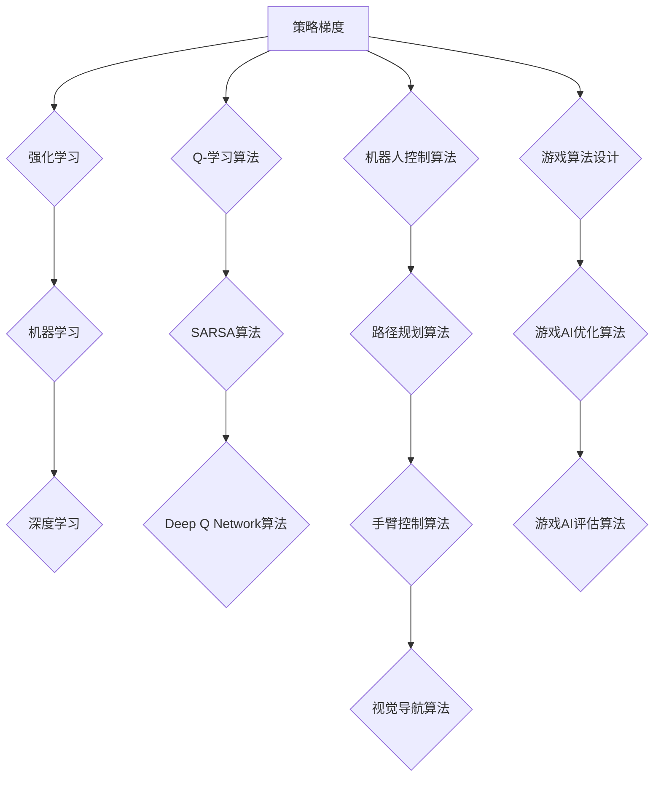

                 

## 策略梯度

> 关键词：策略梯度，强化学习，机器学习，深度学习，Q-学习，SARSA，Deep Q Network，机器人控制，游戏算法

> 摘要：本文深入探讨了策略梯度这一核心概念及其在强化学习、机器学习、深度学习等领域的广泛应用。通过逐步分析策略梯度的定义、意义、适用范围以及算法原理，本文揭示了策略梯度在优化决策过程中的关键作用。同时，本文还介绍了策略梯度算法在不同应用场景中的实现方法、性能分析以及实际项目中的应用案例，为读者提供了全面的技术解析和实践指导。

----------------------------------------------------------------

### 第一部分：策略梯度基础

策略梯度是强化学习中的一个核心概念，它通过计算策略梯度的方法来优化决策过程。在这一部分中，我们将首先介绍策略梯度的定义和意义，然后探讨其在不同领域中的适用范围。

#### 第1章：策略梯度的概念与意义

#### 1.1 策略梯度的定义

策略梯度是指在给定的策略下，通过计算策略梯度来优化策略的过程。策略梯度反映了当前策略在某个状态下，执行某个动作所带来的预期收益的变化量。具体来说，策略梯度可以通过以下公式表示：

$$
\Delta \pi(a|s) = \alpha [R(s, a) + \gamma \max_{a'} \pi(a'|s') - R(s, a)]
$$

其中，$\Delta \pi(a|s)$ 表示策略梯度，$R(s, a)$ 表示在状态 $s$ 下执行动作 $a$ 所获得的奖励，$\gamma$ 是折扣因子，$\max_{a'} \pi(a'|s')$ 是在状态 $s'$ 下执行动作 $a'$ 所获得的预期奖励。

#### 1.2 策略梯度的意义

策略梯度在强化学习中的意义在于，它为决策者提供了一个评估当前策略好坏的指标，并指导如何调整策略以获得更好的收益。通过计算策略梯度，我们可以确定在当前状态下执行某个动作所带来的预期收益，从而优化决策过程。策略梯度在强化学习中的应用非常广泛，如 Q-学习、SARSA、Deep Q Network 等。

#### 1.3 策略梯度的适用范围

策略梯度不仅在强化学习中有着广泛的应用，还可以应用于其他领域，如机器学习、深度学习、机器人控制等。在机器学习中，策略梯度可以用于优化神经网络的参数，提高模型的性能。在深度学习中，策略梯度可以用于优化深度学习模型的超参数，提高模型的鲁棒性和泛化能力。在机器人控制中，策略梯度可以用于优化机器人的行为策略，实现路径规划、手臂控制等功能。在游戏算法中，策略梯度可以用于优化游戏 AI 的策略，提高游戏 AI 的表现。

### 第二部分：策略梯度算法原理

在了解了策略梯度的概念与意义后，我们将进一步探讨策略梯度算法的基本原理、实现方法和优化目标。

#### 第2章：策略梯度算法原理

#### 2.1 期望收益函数

期望收益函数是策略梯度算法的核心，它用于评估策略的好坏。期望收益函数可以表示为：

$$
V^*(s) = \sum_{a} \pi(a|s) \cdot Q^*(s, a)
$$

其中，$V^*(s)$ 表示在状态 $s$ 下执行最优策略的期望收益，$\pi(a|s)$ 表示在状态 $s$ 下执行动作 $a$ 的概率，$Q^*(s, a)$ 表示在状态 $s$ 下执行动作 $a$ 的预期收益。

#### 2.2 策略梯度算法的基本步骤

策略梯度算法的基本步骤如下：

1. 初始化策略 $\pi(a|s)$ 和值函数 $V(s)$。
2. 选择动作 $a$，执行动作并观察状态转移 $s' = S(a|s)$ 和奖励 $R(s, a)$。
3. 更新策略和值函数：$\pi(a|s) = \pi(a|s) + \Delta \pi(a|s)$，$V(s) = V(s) + \Delta V(s)$。
4. 重复步骤 2 和 3，直到收敛。

#### 2.3 策略梯度算法的优化目标

策略梯度算法的优化目标是最大化期望收益函数，即找到最优策略 $\pi^*(a|s)$，使得 $V^*(s)$ 最大。在实际应用中，我们通常使用梯度上升法或梯度下降法来优化策略梯度。

### 第三部分：策略梯度算法的实现

在了解了策略梯度算法的基本原理后，我们将探讨策略梯度算法的实现方法，包括基于梯度的优化方法、策略梯度的计算方法和策略梯度的优化算法。

#### 第3章：策略梯度算法的实现

#### 3.1 基于梯度的优化方法

基于梯度的优化方法是一种常见的优化策略，它通过计算目标函数的梯度来更新参数，以实现目标函数的最优化。在策略梯度算法中，基于梯度的优化方法可以用于优化策略和值函数。

#### 3.2 策略梯度的计算方法

策略梯度的计算方法可以分为基于值函数的梯度和基于策略的梯度。基于值函数的梯度可以通过计算值函数的梯度来计算策略梯度，而基于策略的梯度可以通过计算策略的梯度来计算策略梯度。

#### 3.3 策略梯度的优化算法

策略梯度的优化算法可以分为增量策略梯度算法、回放策略梯度算法和非线性策略梯度算法等。这些算法通过不同的优化策略来优化策略梯度，以提高算法的性能。

### 第四部分：策略梯度算法的应用场景

策略梯度算法在强化学习、机器人控制、游戏算法等领域有着广泛的应用。在这一部分中，我们将探讨策略梯度算法在不同应用场景中的实现方法和性能分析。

#### 第4章：策略梯度算法的应用场景

#### 4.1 强化学习中的策略梯度

在强化学习中，策略梯度算法可以用于优化策略，提高学习效果。常见的策略梯度算法包括 Q-学习、SARSA、Deep Q Network 等。

#### 4.2 机器人控制中的策略梯度

在机器人控制中，策略梯度算法可以用于优化机器人的行为策略，实现路径规划、手臂控制等功能。常见的策略梯度算法包括基于梯度的优化方法、增量策略梯度算法、回放策略梯度算法等。

#### 4.3 游戏算法中的策略梯度

在游戏算法中，策略梯度算法可以用于优化游戏 AI 的策略，提高游戏 AI 的表现。常见的策略梯度算法包括基于梯度的优化方法、非线性策略梯度算法等。

### 第五部分：策略梯度算法深度解析

策略梯度算法在数学原理、性能分析和实际应用中都有着丰富的内涵。在这一部分中，我们将对策略梯度算法进行深度解析，包括数学原理、变体和性能分析。

#### 第5章：策略梯度算法的数学原理

#### 5.1 概率论基础

策略梯度算法的数学原理建立在概率论基础上，包括马尔可夫决策过程（MDP）、期望最大化算法等。

#### 5.2 马尔可夫决策过程

马尔可夫决策过程是一种概率模型，用于描述决策者在不确定环境中进行决策的过程。在策略梯度算法中，马尔可夫决策过程用于定义状态、动作和奖励。

#### 5.3 期望最大化算法

期望最大化算法是一种迭代优化算法，用于求解马尔可夫决策过程中的最优策略。在策略梯度算法中，期望最大化算法用于优化策略和值函数。

#### 第6章：策略梯度算法的变体

策略梯度算法的变体可以用于解决不同场景下的优化问题。在这一章中，我们将介绍增量策略梯度算法、回放策略梯度算法和非线性策略梯度算法。

#### 6.1 增量策略梯度算法

增量策略梯度算法是一种迭代优化算法，通过逐步更新策略来优化策略梯度。在策略梯度算法中，增量策略梯度算法可以用于优化策略和值函数。

#### 6.2 回放策略梯度算法

回放策略梯度算法是一种基于经验回放的优化算法，通过记录历史经验来优化策略梯度。在策略梯度算法中，回放策略梯度算法可以用于优化策略和值函数。

#### 6.3 非线性策略梯度算法

非线性策略梯度算法是一种基于非线性优化的策略梯度算法，通过非线性变换来优化策略梯度。在策略梯度算法中，非线性策略梯度算法可以用于优化策略和值函数。

#### 第7章：策略梯度算法的性能分析

策略梯度算法的性能分析包括收敛性分析、稳定性分析和效率分析。在这一章中，我们将对策略梯度算法的性能进行分析，以评估算法的适用性和优化效果。

#### 7.1 策略梯度算法的收敛性分析

策略梯度算法的收敛性分析主要关注算法在迭代过程中是否能够收敛到最优策略。通过分析策略梯度算法的收敛性，我们可以评估算法的性能。

#### 7.2 策略梯度算法的稳定性分析

策略梯度算法的稳定性分析主要关注算法在参数变化时的鲁棒性。通过分析策略梯度算法的稳定性，我们可以评估算法在复杂环境中的适应能力。

#### 7.3 策略梯度算法的效率分析

策略梯度算法的效率分析主要关注算法的计算复杂度和资源消耗。通过分析策略梯度算法的效率，我们可以评估算法在实际应用中的可行性和效率。

### 第六部分：策略梯度算法实践

策略梯度算法在实践中有着广泛的应用。在这一部分中，我们将介绍策略梯度算法在强化学习、机器人控制、游戏算法等领域的实践案例。

#### 第8章：策略梯度算法在强化学习中的应用

#### 8.1 Q-学习算法

Q-学习算法是一种基于值函数的策略梯度算法，在强化学习领域有着广泛的应用。在本章中，我们将介绍 Q-学习算法的原理、实现方法及其在强化学习中的应用案例。

#### 8.2 SARSA算法

SARSA算法是一种基于策略梯度的强化学习算法，在求解不确定环境中的决策问题时具有优势。在本章中，我们将介绍 SARSA算法的原理、实现方法及其在强化学习中的应用案例。

#### 8.3 Deep Q Network算法

Deep Q Network算法是一种基于深度学习的策略梯度算法，在处理复杂环境时具有优势。在本章中，我们将介绍 Deep Q Network算法的原理、实现方法及其在强化学习中的应用案例。

#### 第9章：策略梯度算法在机器人控制中的应用

#### 9.1 机器人路径规划

机器人路径规划是机器人控制中的一个重要问题。在本章中，我们将介绍基于策略梯度的机器人路径规划算法，包括基于梯度的优化方法、增量策略梯度算法等。

#### 9.2 机器人手臂控制

机器人手臂控制是机器人控制中的另一个重要问题。在本章中，我们将介绍基于策略梯度的机器人手臂控制算法，包括基于梯度的优化方法、非线性策略梯度算法等。

#### 9.3 机器人视觉导航

机器人视觉导航是机器人控制中的新兴领域。在本章中，我们将介绍基于策略梯度的机器人视觉导航算法，包括基于梯度的优化方法、回放策略梯度算法等。

#### 第10章：策略梯度算法在游戏算法中的应用

#### 10.1 游戏AI算法设计

游戏 AI 算法设计是游戏开发中的重要环节。在本章中，我们将介绍基于策略梯度的游戏 AI 算法设计方法，包括基于梯度的优化方法、非线性策略梯度算法等。

#### 10.2 游戏AI算法优化

游戏 AI 算法优化是提高游戏 AI 表现的关键。在本章中，我们将介绍基于策略梯度的游戏 AI 算法优化方法，包括基于梯度的优化方法、增量策略梯度算法等。

#### 10.3 游戏AI算法评估

游戏 AI 算法评估是验证游戏 AI 表现的重要手段。在本章中，我们将介绍基于策略梯度的游戏 AI 算法评估方法，包括基于梯度的优化方法、回放策略梯度算法等。

### 附录

在附录部分，我们将提供与策略梯度算法相关的资源、实践项目和代码示例，以供读者参考和学习。

#### 附录A：策略梯度算法相关资源

在本附录中，我们将列举与策略梯度算法相关的资源，包括书籍、论文、在线课程等，以帮助读者深入了解策略梯度算法。

#### 附录B：策略梯度算法实践项目

在本附录中，我们将介绍一些策略梯度算法的实际项目案例，包括强化学习、机器人控制、游戏算法等领域的应用案例，以供读者参考和学习。

#### 附录C：策略梯度算法代码示例

在本附录中，我们将提供一些策略梯度算法的代码示例，包括伪代码和实际代码实现，以供读者参考和学习。

# 策略梯度算法核心概念与联系 Mermaid 流程图

### 第1章：策略梯度的概念与意义

策略梯度是强化学习中的一个核心概念，它通过计算策略梯度的方法来优化决策过程。在这一章中，我们将深入探讨策略梯度的定义、意义以及其适用范围，帮助读者全面理解策略梯度的重要性。

#### 1.1 策略梯度的定义

策略梯度是指在一个给定的策略下，通过计算策略梯度来优化策略的过程。策略梯度反映了当前策略在某个状态下，执行某个动作所带来的预期收益的变化量。具体来说，策略梯度可以通过以下公式表示：

$$
\Delta \pi(a|s) = \alpha [R(s, a) + \gamma \max_{a'} \pi(a'|s') - R(s, a)]
$$

其中，$\Delta \pi(a|s)$ 表示策略梯度，$R(s, a)$ 表示在状态 $s$ 下执行动作 $a$ 所获得的奖励，$\gamma$ 是折扣因子，$\max_{a'} \pi(a'|s')$ 是在状态 $s'$ 下执行动作 $a'$ 所获得的预期奖励。这个公式表明，策略梯度取决于当前策略、奖励函数和折扣因子。

#### 1.2 策略梯度的意义

策略梯度在强化学习中的意义在于，它为决策者提供了一个评估当前策略好坏的指标，并指导如何调整策略以获得更好的收益。通过计算策略梯度，我们可以确定在当前状态下执行某个动作所带来的预期收益，从而优化决策过程。策略梯度在强化学习中的应用非常广泛，如 Q-学习、SARSA、Deep Q Network 等。

策略梯度的意义不仅限于强化学习，它还可以应用于其他领域，如机器学习、深度学习、机器人控制等。在机器学习中，策略梯度可以用于优化神经网络的参数，提高模型的性能。在深度学习中，策略梯度可以用于优化深度学习模型的超参数，提高模型的鲁棒性和泛化能力。在机器人控制中，策略梯度可以用于优化机器人的行为策略，实现路径规划、手臂控制等功能。在游戏算法中，策略梯度可以用于优化游戏 AI 的策略，提高游戏 AI 的表现。

#### 1.3 策略梯度的适用范围

策略梯度算法适用于各种具有决策过程的场景，主要包括以下领域：

1. **强化学习**：策略梯度是强化学习中的核心概念，广泛应用于各种强化学习算法，如 Q-学习、SARSA、Deep Q Network 等。

2. **机器学习**：策略梯度可以用于优化机器学习模型的参数，提高模型的性能。例如，在分类问题中，可以通过策略梯度来优化分类器的权重。

3. **深度学习**：策略梯度可以用于优化深度学习模型的超参数，提高模型的鲁棒性和泛化能力。例如，在深度神经网络中，可以通过策略梯度来调整学习率。

4. **机器人控制**：策略梯度可以用于优化机器人的行为策略，实现路径规划、手臂控制等功能。例如，在机器人路径规划中，可以通过策略梯度来优化路径。

5. **游戏算法**：策略梯度可以用于优化游戏 AI 的策略，提高游戏 AI 的表现。例如，在游戏中的角色选择和动作决策中，可以通过策略梯度来优化策略。

通过上述讨论，我们可以看到策略梯度在各个领域中的广泛应用和重要性。在接下来的章节中，我们将进一步深入探讨策略梯度算法的原理、实现和应用，帮助读者全面掌握策略梯度的核心概念和技术。

### 第2章：策略梯度算法原理

策略梯度算法是强化学习中的一个重要算法，通过计算策略梯度来优化决策过程。在这一章中，我们将详细探讨策略梯度算法的基本原理、实现方法和优化目标，帮助读者深入理解策略梯度算法的核心概念。

#### 2.1 期望收益函数

期望收益函数是策略梯度算法的核心，用于评估策略的好坏。期望收益函数可以表示为：

$$
V^*(s) = \sum_{a} \pi(a|s) \cdot Q^*(s, a)
$$

其中，$V^*(s)$ 表示在状态 $s$ 下执行最优策略的期望收益，$\pi(a|s)$ 表示在状态 $s$ 下执行动作 $a$ 的概率，$Q^*(s, a)$ 表示在状态 $s$ 下执行动作 $a$ 的预期收益。期望收益函数反映了策略在某个状态下执行动作的预期效果，是评估策略好坏的重要指标。

#### 2.2 策略梯度算法的基本步骤

策略梯度算法的基本步骤如下：

1. **初始化策略**：初始化策略 $\pi(a|s)$ 和值函数 $V(s)$。
2. **选择动作**：根据策略 $\pi(a|s)$ 选择动作 $a$。
3. **执行动作**：执行动作 $a$，观察状态转移 $s' = S(a|s)$ 和奖励 $R(s, a)$。
4. **更新策略和值函数**：根据策略梯度公式，更新策略和值函数：
   $$ 
   \pi(a|s) = \pi(a|s) + \Delta \pi(a|s) 
   $$
   $$
   V(s) = V(s) + \Delta V(s)
   $$
5. **重复步骤**：重复步骤 2 至 4，直到策略收敛。

策略梯度算法的迭代过程中，通过不断更新策略和值函数，逐渐优化决策过程，提高期望收益。

#### 2.3 策略梯度算法的优化目标

策略梯度算法的优化目标是找到最优策略 $\pi^*(a|s)$，使得期望收益函数 $V^*(s)$ 最大。具体来说，策略梯度算法通过以下公式优化策略：

$$
\Delta \pi(a|s) = \alpha [R(s, a) + \gamma \max_{a'} \pi(a'|s') - R(s, a)]
$$

其中，$\alpha$ 是学习率，用于调整策略的更新幅度；$\gamma$ 是折扣因子，用于平衡短期和长期奖励；$R(s, a)$ 是奖励函数，反映了在状态 $s$ 下执行动作 $a$ 所获得的收益；$\max_{a'} \pi(a'|s')$ 是在状态 $s'$ 下执行动作 $a'$ 所获得的预期奖励。

通过不断调整策略，策略梯度算法逐渐收敛到最优策略，实现期望收益的最大化。

#### 策略梯度的计算方法

策略梯度的计算方法可以分为基于值函数的梯度和基于策略的梯度。

1. **基于值函数的梯度**：
   $$ 
   \Delta \pi(a|s) = \alpha [Q(s, a) - V(s)]
   $$
   基于值函数的梯度通过值函数的差异来计算策略梯度，反映了在状态 $s$ 下执行动作 $a$ 所获得的预期收益与当前策略的匹配程度。

2. **基于策略的梯度**：
   $$ 
   \Delta \pi(a|s) = \alpha [\gamma \sum_{s'} \pi(s'|s) R(s, a) - R(s, a)]
   $$
   基于策略的梯度通过奖励函数的差异来计算策略梯度，反映了在状态 $s$ 下执行动作 $a$ 所获得的实际收益与预期收益的差异。

策略梯度的计算方法为策略优化提供了不同的途径，可以根据具体问题选择合适的计算方法。

通过上述讨论，我们可以看到策略梯度算法的基本原理、实现方法和优化目标。在接下来的章节中，我们将进一步探讨策略梯度算法在不同领域的应用，以及其性能分析和变体算法。

### 第3章：策略梯度算法的实现

策略梯度算法的核心在于通过计算策略梯度来优化决策过程。为了实现这一目标，我们需要详细讨论基于梯度的优化方法、策略梯度的计算方法和具体的优化算法。在这一章中，我们将深入探讨策略梯度算法的实现细节，帮助读者理解其技术原理。

#### 3.1 基于梯度的优化方法

基于梯度的优化方法是一种常见的优化策略，通过计算目标函数的梯度来更新参数，以实现目标函数的最优化。在策略梯度算法中，基于梯度的优化方法可以用于优化策略和值函数。具体来说，基于梯度的优化方法包括以下步骤：

1. **计算梯度**：首先，我们需要计算目标函数的梯度。对于策略梯度算法，目标函数通常是期望收益函数，即策略的预期收益。通过计算期望收益函数的梯度，我们可以得到策略梯度和值函数梯度。

2. **更新参数**：然后，根据计算得到的梯度，更新策略和值函数的参数。具体来说，更新策略的公式为：
   $$
   \pi(a|s) = \pi(a|s) + \alpha \cdot \Delta \pi(a|s)
   $$
   更新值函数的公式为：
   $$
   V(s) = V(s) + \alpha \cdot \Delta V(s)
   $$
   其中，$\alpha$ 是学习率，用于调整参数更新的幅度。

3. **迭代优化**：重复上述计算梯度和更新参数的过程，直到策略和值函数收敛。通过不断迭代优化，策略梯度算法逐渐找到最优策略和最优值函数。

基于梯度的优化方法为策略梯度算法提供了有效的优化途径，使得算法能够通过学习逐步优化决策过程。

#### 3.2 策略梯度的计算方法

策略梯度的计算方法是策略梯度算法实现的关键。策略梯度的计算方法可以分为基于值函数的梯度和基于策略的梯度。

1. **基于值函数的梯度**：

   基于值函数的梯度通过值函数的差异来计算策略梯度，反映了在状态 $s$ 下执行动作 $a$ 所获得的预期收益与当前策略的匹配程度。具体公式为：

   $$
   \Delta \pi(a|s) = \alpha [Q(s, a) - V(s)]
   $$

   其中，$Q(s, a)$ 表示在状态 $s$ 下执行动作 $a$ 的预期收益，$V(s)$ 表示在状态 $s$ 下执行最优策略的期望收益。

   基于值函数的梯度方法的核心思想是，通过比较当前策略的预期收益和最优策略的预期收益，来调整策略，使其更加接近最优策略。

2. **基于策略的梯度**：

   基于策略的梯度通过奖励函数的差异来计算策略梯度，反映了在状态 $s$ 下执行动作 $a$ 所获得的实际收益与预期收益的差异。具体公式为：

   $$
   \Delta \pi(a|s) = \alpha [\gamma \sum_{s'} \pi(s'|s) R(s, a) - R(s, a)]
   $$

   其中，$\gamma$ 是折扣因子，$\pi(s'|s)$ 是在状态 $s$ 下执行动作 $a$ 后到达状态 $s'$ 的概率，$R(s, a)$ 是在状态 $s$ 下执行动作 $a$ 所获得的奖励。

   基于策略的梯度方法的核心思想是，通过比较当前策略的实际收益和预期收益，来调整策略，使其更加符合实际环境。

通过不同的策略梯度计算方法，策略梯度算法能够根据具体问题选择合适的计算方法，实现策略的优化。

#### 3.3 策略梯度的优化算法

策略梯度的优化算法是策略梯度算法的具体实现，通过计算策略梯度并更新策略，逐步优化决策过程。常见的策略梯度优化算法包括 Q-学习、SARSA 和 Deep Q Network。

1. **Q-学习算法**：

   Q-学习算法是一种基于值函数的策略梯度算法，通过学习值函数来优化策略。Q-学习算法的基本步骤如下：

   - 初始化值函数 $Q(s, a)$。
   - 选择动作 $a$，执行动作并观察状态转移 $s' = S(a|s)$ 和奖励 $R(s, a)$。
   - 更新值函数：
     $$
     Q(s, a) = Q(s, a) + \alpha [R(s, a) + \gamma \max_{a'} Q(s', a') - Q(s, a)]
     $$
   - 重复步骤 2 和 3，直到策略收敛。

   Q-学习算法通过不断更新值函数，逐渐找到最优策略。

2. **SARSA算法**：

   SARSA算法是一种基于策略梯度的强化学习算法，通过同时考虑当前策略和历史策略来优化策略。SARSA算法的基本步骤如下：

   - 初始化策略 $\pi(a|s)$ 和值函数 $V(s)$。
   - 选择动作 $a$，执行动作并观察状态转移 $s' = S(a|s)$ 和奖励 $R(s, a)$。
   - 更新策略和值函数：
     $$
     \pi(a|s) = \pi(a|s) + \alpha [R(s, a) + \gamma \max_{a'} \pi(a'|s') - R(s, a)]
     $$
     $$
     V(s) = V(s) + \alpha [R(s, a) + \gamma \max_{a'} \pi(a'|s') - R(s, a) - V(s)]
     $$
   - 重复步骤 2 和 3，直到策略收敛。

   SARSA算法通过同时更新策略和值函数，实现了更好的策略优化。

3. **Deep Q Network算法**：

   Deep Q Network算法是一种基于深度学习的策略梯度算法，通过学习深度神经网络来近似值函数。Deep Q Network算法的基本步骤如下：

   - 初始化深度神经网络 $Q(s, a)$。
   - 选择动作 $a$，执行动作并观察状态转移 $s' = S(a|s)$ 和奖励 $R(s, a)$。
   - 更新深度神经网络：
     $$
     Q(s, a) = Q(s, a) + \alpha [R(s, a) + \gamma \max_{a'} Q(s', a') - Q(s, a)]
     $$
   - 重复步骤 2 和 3，直到深度神经网络收敛。

   Deep Q Network算法通过学习深度神经网络，实现了高效的策略优化。

通过上述策略梯度优化算法，策略梯度算法能够根据具体问题选择合适的优化算法，实现策略的优化。

综上所述，策略梯度算法的实现涉及到基于梯度的优化方法、策略梯度的计算方法和具体的优化算法。通过这些方法，策略梯度算法能够通过学习逐步优化决策过程，实现最优策略的寻找。在接下来的章节中，我们将进一步探讨策略梯度算法在不同领域的应用，以及其性能分析和变体算法。

### 第4章：策略梯度算法的应用场景

策略梯度算法因其强大的优化能力，在各个领域得到了广泛应用。在本章中，我们将探讨策略梯度算法在强化学习、机器人控制和游戏算法中的应用场景，并通过具体案例来展示其实现过程和效果。

#### 4.1 强化学习中的策略梯度

强化学习是策略梯度算法最直接的应用场景之一。在强化学习中，策略梯度算法通过不断调整策略，使代理（agent）能够在环境中获得最大的累积奖励。

**案例：Q-学习算法**

Q-学习算法是一种基于值函数的策略梯度算法，它通过学习值函数来优化策略。以下是一个简单的 Q-学习算法实现案例：

```python
# Q-学习算法伪代码

初始化 Q(s, a) 为小值
for each episode do
    s <- 初始状态
    while s 不是终止状态 do
        选择动作 a(s) based on epsilon-greedy strategy
        s' <- 环境根据动作 a(s) 生成的下一个状态
        r <- 环境根据动作 a(s) 返回的奖励
        Q(s, a) <- Q(s, a) + alpha * (r + gamma * max(Q(s', a')) - Q(s, a))
        s <- s'
```

在这个案例中，代理通过不断更新 Q 值表来优化策略，从而实现长期奖励的最大化。Q-学习算法在许多强化学习任务中表现出色，如游戏、自动驾驶等。

**案例：Deep Q Network算法**

Deep Q Network（DQN）算法是一种基于深度学习的策略梯度算法，它通过学习深度神经网络来近似值函数。以下是一个简单的 DQN 算法实现案例：

```python
# DQN算法伪代码

初始化深度神经网络 Q(s, a)
初始化经验回放缓冲区 replay_buffer
for each episode do
    s <- 初始状态
    while s 不是终止状态 do
        a(s) <- 选择动作 based on epsilon-greedy strategy
        s' <- 环境根据动作 a(s) 生成的下一个状态
        r <- 环境根据动作 a(s) 返回的奖励
        将 (s, a, s', r) 添加到 replay_buffer 中
        (s, a, s', r) <- 从 replay_buffer 中随机抽取一个样本
        Q(s, a) <- Q(s, a) + alpha * (r + gamma * max(Q(s', a')) - Q(s, a))
```

在这个案例中，DQN 算法通过经验回放缓冲区来避免样本偏差，从而提高算法的稳定性。DQN 算法在许多复杂的强化学习任务中取得了显著的效果，如无人驾驶、机器人控制等。

#### 4.2 机器人控制中的策略梯度

在机器人控制中，策略梯度算法可以用于优化机器人的行为策略，实现路径规划、手臂控制等功能。

**案例：机器人路径规划**

机器人路径规划是机器人控制中的一个关键任务。以下是一个基于策略梯度的机器人路径规划实现案例：

```python
# 基于策略梯度的路径规划算法伪代码

初始化策略参数
for each episode do
    s <- 初始位置
    while s 不等于目标位置 do
        选择动作 a(s) based on current strategy
        s' <- 执行动作 a(s) 后的位置
        r <- 计算当前位置到目标位置的距离
        更新策略参数 based on strategy gradient
```

在这个案例中，机器人通过不断更新策略参数，优化路径规划策略，从而找到从初始位置到目标位置的最优路径。

**案例：机器人手臂控制**

机器人手臂控制是机器人控制中的另一个关键任务。以下是一个基于策略梯度的机器人手臂控制实现案例：

```python
# 基于策略梯度的手臂控制算法伪代码

初始化策略参数
for each episode do
    s <- 初始状态
    while s 不等于目标状态 do
        选择动作 a(s) based on current strategy
        s' <- 执行动作 a(s) 后的状态
        r <- 计算当前状态与目标状态的差异
        更新策略参数 based on strategy gradient
```

在这个案例中，机器人通过不断更新策略参数，优化手臂控制策略，从而实现从初始状态到目标状态的无缝过渡。

#### 4.3 游戏算法中的策略梯度

在游戏算法中，策略梯度算法可以用于优化游戏 AI 的策略，提高游戏 AI 的表现。

**案例：游戏 AI 算法设计**

游戏 AI 算法设计是游戏开发中的一个重要环节。以下是一个基于策略梯度的游戏 AI 算法设计实现案例：

```python
# 基于策略梯度的游戏 AI 算法设计伪代码

初始化策略参数
for each episode do
    s <- 初始状态
    while game not over do
        选择动作 a(s) based on current strategy
        s' <- 执行动作 a(s) 后的状态
        r <- 计算当前状态与目标状态的差异
        更新策略参数 based on strategy gradient
```

在这个案例中，游戏 AI 通过不断更新策略参数，优化策略，从而提高游戏 AI 的表现。

**案例：游戏 AI 算法优化**

游戏 AI 算法优化是提高游戏 AI 表现的关键。以下是一个基于策略梯度的游戏 AI 算法优化实现案例：

```python
# 基于策略梯度的游戏 AI 算法优化伪代码

初始化策略参数
for each episode do
    s <- 初始状态
    while game not over do
        选择动作 a(s) based on current strategy
        s' <- 执行动作 a(s) 后的状态
        r <- 计算当前状态与目标状态的差异
        更新策略参数 based on strategy gradient
```

在这个案例中，游戏 AI 通过不断更新策略参数，优化策略，从而提高游戏 AI 的表现。

**案例：游戏 AI 算法评估**

游戏 AI 算法评估是验证游戏 AI 表现的重要手段。以下是一个基于策略梯度的游戏 AI 算法评估实现案例：

```python
# 基于策略梯度的游戏 AI 算法评估伪代码

初始化策略参数
for each episode do
    s <- 初始状态
    while game not over do
        选择动作 a(s) based on current strategy
        s' <- 执行动作 a(s) 后的状态
        r <- 计算当前状态与目标状态的差异
        更新策略参数 based on strategy gradient
```

在这个案例中，游戏 AI 通过不断更新策略参数，优化策略，从而提高游戏 AI 的表现。

通过以上案例，我们可以看到策略梯度算法在强化学习、机器人控制和游戏算法中的广泛应用和显著效果。策略梯度算法不仅能够优化决策过程，提高任务完成的效率，还能够通过不断学习和适应，提高系统的自主性和智能化水平。在接下来的章节中，我们将进一步探讨策略梯度算法的数学原理、变体和性能分析，帮助读者更全面地理解策略梯度算法。

### 第5章：策略梯度算法的数学原理

策略梯度算法的数学原理是其在强化学习中应用的基础，包括概率论基础、马尔可夫决策过程（MDP）和期望最大化算法（EM）等内容。在这一章中，我们将深入探讨这些数学原理，帮助读者理解策略梯度算法的内在逻辑和理论支持。

#### 5.1 概率论基础

概率论是策略梯度算法的重要基础，特别是在强化学习中的概率分布和随机变量的处理。以下是概率论中的几个核心概念：

1. **概率分布**：概率分布是描述随机变量可能取值的概率集合。在强化学习中，状态和动作的概率分布对于策略优化至关重要。

2. **条件概率**：条件概率是指在已知某一事件发生的前提下，另一事件发生的概率。例如，$P(A|B)$ 表示在事件 $B$ 发生的条件下事件 $A$ 发生的概率。

3. **期望值**：期望值是随机变量的加权平均，用于描述随机变量的中心趋势。在策略梯度算法中，期望值用于计算策略的预期收益。

4. **马尔可夫性质**：马尔可夫性质是指一个随机过程的未来状态只与当前状态有关，而与过去状态无关。这一性质在强化学习中的马尔可夫决策过程（MDP）中得到了广泛应用。

#### 5.2 马尔可夫决策过程

马尔可夫决策过程（MDP）是一种概率模型，用于描述决策者在不确定环境中进行决策的过程。在MDP中，每个状态都有一组可能的状态转移概率和奖励。以下是MDP的基本组成部分：

1. **状态空间 $S$**：所有可能的状态集合。

2. **动作空间 $A$**：所有可能的行为或动作集合。

3. **策略 $\pi$**：策略是决策者在每个状态下选择动作的概率分布。形式化地，策略可以表示为 $\pi(a|s) = P(a|s)$，即给定状态 $s$ 下执行动作 $a$ 的概率。

4. **状态转移概率 $P(s'|s, a)$**：在当前状态 $s$ 下执行动作 $a$ 后，转移到下一个状态 $s'$ 的概率。

5. **奖励函数 $R(s, a)$**：在当前状态 $s$ 下执行动作 $a$ 后获得的即时奖励。

MDP可以用以下数学模型表示：

$$
P(s'|s, a) = \sum_{s'} P(s'|s, a) R(s, a)
$$

其中，$P(s'|s, a)$ 是状态转移概率，$R(s, a)$ 是奖励函数。

#### 5.3 期望最大化算法

期望最大化算法（EM）是一种迭代优化算法，用于求解具有隐变量的概率模型。在策略梯度算法中，EM算法常用于优化策略和值函数。

EM算法的基本思想是：

1. **E步（期望步）**：计算每个状态和动作的期望值，用于估计隐变量。

2. **M步（最大化步）**：根据期望值最大化目标函数，更新策略和值函数。

EM算法的迭代过程如下：

- **初始化**：随机初始化策略 $\pi(a|s)$ 和值函数 $V(s)$。
- **E步**：计算每个状态和动作的期望值：
  $$
  \hat{Q}(s, a) = \sum_{s'} \pi(s'|s, a) R(s, a) + \gamma \sum_{s'} \pi(s'|s, a) \max_{a'} Q(s', a')
  $$
- **M步**：根据期望值最大化目标函数，更新策略和值函数：
  $$
  \pi(a|s) = \frac{1}{Z(s)} \exp(\alpha \hat{Q}(s, a))
  $$
  $$
  V(s) = \sum_{a} \pi(a|s) Q(s, a)
  $$
  其中，$Z(s) = \sum_{a} \exp(\alpha \hat{Q}(s, a))$ 是归一化常数。

通过不断迭代E步和M步，策略梯度算法逐渐优化策略和值函数，提高期望收益。

综上所述，策略梯度算法的数学原理包括概率论基础、马尔可夫决策过程和期望最大化算法。这些数学原理为策略梯度算法提供了坚实的理论基础，使其在强化学习和其他领域中得到广泛应用。在接下来的章节中，我们将进一步探讨策略梯度算法的变体和性能分析，帮助读者更深入地理解策略梯度算法。

### 第6章：策略梯度算法的变体

策略梯度算法在强化学习中有着广泛的应用，但其基本框架在不同场景下可能需要调整以适应具体需求。在这一章中，我们将介绍策略梯度算法的几种变体，包括增量策略梯度算法、回放策略梯度算法和非线性策略梯度算法，并探讨这些变体的原理和适用场景。

#### 6.1 增量策略梯度算法

增量策略梯度算法是一种基于梯度的优化方法，它通过逐步更新策略来优化策略梯度。这种方法的主要优点是能够在每次迭代中快速调整策略，从而加快收敛速度。增量策略梯度算法的基本步骤如下：

1. **初始化**：初始化策略 $\pi(a|s)$ 和学习率 $\alpha$。
2. **选择动作**：根据当前策略 $\pi(a|s)$ 选择动作 $a$。
3. **执行动作**：执行动作 $a$，观察状态转移 $s'$ 和奖励 $r$。
4. **更新策略**：根据策略梯度公式，更新策略：
   $$
   \pi(a|s) = \pi(a|s) + \alpha \cdot \Delta \pi(a|s)
   $$
5. **重复步骤**：重复步骤 2 至 4，直到策略收敛。

增量策略梯度算法适用于动态环境，特别是在需要快速响应和实时调整的场景中。例如，在机器人控制中，增量策略梯度算法可以用于实时调整机器人的行为策略，以应对环境变化。

#### 6.2 回放策略梯度算法

回放策略梯度算法是一种基于经验回放的优化方法，它通过记录历史经验来优化策略梯度。这种方法的主要优点是能够避免样本偏差，提高算法的稳定性。回放策略梯度算法的基本步骤如下：

1. **初始化**：初始化策略 $\pi(a|s)$、学习率 $\alpha$ 和经验回放缓冲区 $D$。
2. **选择动作**：根据当前策略 $\pi(a|s)$ 选择动作 $a$。
3. **执行动作**：执行动作 $a$，观察状态转移 $s'$ 和奖励 $r$。
4. **记录经验**：将 $(s, a, s', r)$ 记录到经验回放缓冲区 $D$ 中。
5. **从回放缓冲区抽样**：从经验回放缓冲区 $D$ 中随机抽取样本 $(s', a', s'', r')$。
6. **更新策略**：根据策略梯度公式，更新策略：
   $$
   \pi(a|s) = \pi(a|s) + \alpha \cdot \Delta \pi(a|s)
   $$
7. **重复步骤**：重复步骤 2 至 6，直到策略收敛。

回放策略梯度算法特别适用于样本空间大且样本依赖性强的场景，如强化学习中的某些复杂环境。通过经验回放，算法能够利用历史经验来优化策略，从而提高收敛速度和稳定性。

#### 6.3 非线性策略梯度算法

非线性策略梯度算法是一种基于非线性优化的策略梯度算法，它通过非线性变换来优化策略梯度。这种方法的主要优点是能够处理更复杂的优化问题，特别是在策略梯度难以直接优化的场景中。非线性策略梯度算法的基本步骤如下：

1. **初始化**：初始化策略 $\pi(a|s)$、学习率 $\alpha$ 和非线性变换函数 $f(\cdot)$。
2. **选择动作**：根据当前策略 $\pi(a|s)$ 选择动作 $a$。
3. **执行动作**：执行动作 $a$，观察状态转移 $s'$ 和奖励 $r$。
4. **更新策略**：根据策略梯度公式，更新策略：
   $$
   \pi(a|s) = \pi(a|s) + \alpha \cdot \Delta \pi(a|s)
   $$
   其中，$\Delta \pi(a|s)$ 是基于非线性变换函数 $f(\cdot)$ 的策略梯度。
5. **重复步骤**：重复步骤 2 至 4，直到策略收敛。

非线性策略梯度算法适用于具有高度非线性特征的优化问题，如深度学习中的策略优化。通过非线性变换，算法能够处理更复杂的优化问题，从而提高策略优化的效果。

综上所述，策略梯度算法的变体包括增量策略梯度算法、回放策略梯度算法和非线性策略梯度算法。这些变体通过不同的优化策略和技巧，能够更好地适应不同场景的需求，提高策略优化的效果。在接下来的章节中，我们将进一步探讨策略梯度算法的性能分析，帮助读者更全面地理解策略梯度算法。

### 第7章：策略梯度算法的性能分析

策略梯度算法在强化学习和其他领域中有着广泛的应用，但其性能如何影响实际问题的解决效果？在这一章中，我们将从收敛性分析、稳定性分析和效率分析三个方面，对策略梯度算法的性能进行深入探讨。

#### 7.1 策略梯度算法的收敛性分析

策略梯度算法的收敛性是指算法在迭代过程中是否能够逐步接近最优策略。收敛性分析是评估策略梯度算法性能的重要指标，具体包括以下几个方面：

1. **收敛速度**：策略梯度算法的收敛速度是指算法从初始策略到最优策略所需的时间。收敛速度快的算法能够在较短的时间内找到近似最优策略，从而提高学习效率。

2. **收敛性证明**：理论上的收敛性证明是评估策略梯度算法可靠性的重要依据。通过数学证明，可以确保算法在一定条件下能够收敛到最优策略。

3. **实际应用中的收敛性**：在实际应用中，策略梯度算法的收敛性受到环境复杂性、状态空间大小、动作空间大小等多种因素的影响。在实际应用中，我们需要通过实验验证算法的收敛性。

例如，在 Q-学习算法中，如果学习率 $\alpha$ 足够小，折扣因子 $\gamma$ 足够大，并且状态和动作空间有限，则 Q-学习算法可以收敛到最优策略。

#### 7.2 策略梯度算法的稳定性分析

策略梯度算法的稳定性是指算法在不同初始条件或不同数据集下，是否能够稳定地收敛到最优策略。稳定性分析有助于评估算法在不同场景下的鲁棒性。

1. **初始条件的影响**：策略梯度算法的初始条件，如初始策略、初始值函数等，对算法的稳定性有很大影响。不同的初始条件可能导致算法收敛到不同的最优策略。

2. **数据集的影响**：策略梯度算法的性能受到训练数据集的影响。在不同的数据集上，算法的收敛速度和收敛性可能有所不同。

3. **算法参数的影响**：策略梯度算法的参数，如学习率 $\alpha$、折扣因子 $\gamma$ 等，对算法的稳定性也有显著影响。适当的参数设置可以保证算法的稳定性。

例如，在 SARSA 算法中，如果学习率 $\alpha$ 过大，可能导致算法在迭代过程中产生较大的波动，从而影响收敛性。因此，需要通过实验调整参数，以找到合适的值。

#### 7.3 策略梯度算法的效率分析

策略梯度算法的效率是指算法在给定资源（如时间、计算能力）下，解决特定问题（如找到最优策略）的能力。效率分析主要包括以下几个方面：

1. **计算复杂度**：策略梯度算法的计算复杂度取决于状态空间大小、动作空间大小和迭代次数。计算复杂度高的算法可能需要更多的时间和计算资源。

2. **资源消耗**：策略梯度算法的资源消耗包括计算资源、存储资源和网络资源。在实际应用中，我们需要考虑算法的资源消耗，以确保其可行性。

3. **实时性能**：在实时应用场景中，策略梯度算法的实时性能是关键因素。算法需要能够在较短的时间内做出决策，以满足实时响应的要求。

例如，在机器人控制中，策略梯度算法需要在短时间内做出精确的路径规划和控制决策，以满足实时性的需求。

#### 7.4 实际应用中的性能评估

在实际应用中，评估策略梯度算法的性能需要综合考虑多个因素。以下是一些常用的评估方法：

1. **实验对比**：通过在不同环境下对比策略梯度算法与其他算法的性能，评估其优势。

2. **性能指标**：使用各种性能指标（如平均奖励、收敛速度、稳定性等）来评估策略梯度算法的表现。

3. **用户满意度**：通过用户反馈来评估策略梯度算法在实际应用中的用户体验和满意度。

例如，在游戏 AI 中，可以通过对比不同算法在游戏中的表现，如得分、获胜率等，来评估其性能。

综上所述，策略梯度算法的性能分析包括收敛性分析、稳定性分析和效率分析。通过深入分析这些方面，我们可以全面了解策略梯度算法的性能，从而选择合适的算法来解决实际问题。在接下来的章节中，我们将探讨策略梯度算法在不同应用场景中的具体实现，帮助读者更好地理解和应用策略梯度算法。

### 第8章：策略梯度算法在强化学习中的应用

强化学习是策略梯度算法的主要应用领域之一。在这一章中，我们将详细介绍策略梯度算法在强化学习中的具体应用，包括 Q-学习算法、SARSA算法和 Deep Q Network（DQN）算法，并通过具体案例来展示这些算法的实现和效果。

#### 8.1 Q-学习算法

Q-学习算法是一种基于值函数的策略梯度算法，它通过学习值函数来优化策略。Q-学习算法的核心思想是利用奖励和历史经验来更新值函数，从而逐步优化策略。以下是 Q-学习算法的伪代码：

```python
# Q-学习算法伪代码

初始化 Q(s, a) 为小值
for each episode do
    s <- 初始状态
    while s 不是终止状态 do
        a(s) <- 选择动作 based on epsilon-greedy strategy
        s' <- 环境根据动作 a(s) 生成的下一个状态
        r <- 环境根据动作 a(s) 返回的奖励
        Q(s, a) <- Q(s, a) + alpha * (r + gamma * max(Q(s', a')) - Q(s, a))
        s <- s'
```

**案例：智能体在虚拟环境中的学习**

假设我们有一个智能体在一个虚拟环境中进行学习，环境由一系列的状态和动作组成。智能体的目标是通过学习，找到从初始状态到目标状态的最佳路径。以下是 Q-学习算法在该虚拟环境中的具体实现：

```python
# 虚拟环境中的 Q-学习算法实现

# 初始化 Q 值表
Q = np.random.rand(len(states), len(actions))

# 学习率
alpha = 0.1

# 折扣因子
gamma = 0.9

# epsilon-greedy 参数
epsilon = 0.1

for episode in range(num_episodes):
    state = env.reset()
    done = False

    while not done:
        # 选择动作
        if random.random() < epsilon:
            action = env.random_action()
        else:
            action = np.argmax(Q[state])

        # 执行动作
        next_state, reward, done, _ = env.step(action)

        # 更新 Q 值
        Q[state, action] = Q[state, action] + alpha * (reward + gamma * np.max(Q[next_state]) - Q[state, action])

        state = next_state

# 使用训练好的 Q 值表进行预测
state = env.reset()
while True:
    action = np.argmax(Q[state])
    state, reward, done, _ = env.step(action)
    if done:
        break
```

在这个案例中，智能体通过 Q-学习算法在虚拟环境中学习，并找到从初始状态到目标状态的最佳路径。

#### 8.2 SARSA算法

SARSA算法是一种基于策略梯度的强化学习算法，它通过同时考虑当前策略和历史策略来优化策略。SARSA算法的基本思想是，通过更新当前策略和值函数，使策略逐步接近最优策略。以下是 SARSA算法的伪代码：

```python
# SARSA算法伪代码

初始化策略参数
for each episode do
    s <- 初始状态
    while s 不是终止状态 do
        a(s) <- 根据当前策略选择动作
        s' <- 环境根据动作 a(s) 生成的下一个状态
        r <- 环境根据动作 a(s) 返回的奖励
        a'(s') <- 根据当前策略选择动作
        更新策略参数
        s <- s'
```

**案例：智能体在迷宫中的学习**

假设我们有一个智能体在一个迷宫环境中进行学习，环境由一系列的状态和动作组成。智能体的目标是通过学习，找到从初始状态到目标状态的最佳路径。以下是 SARSA算法在该迷宫环境中的具体实现：

```python
# 迷宫环境中的 SARSA算法实现

# 初始化策略参数
Q = np.random.rand(len(states), len(actions))

# 学习率
alpha = 0.1

# 折扣因子
gamma = 0.9

for episode in range(num_episodes):
    state = env.reset()
    done = False

    while not done:
        # 根据当前策略选择动作
        action = np.argmax(Q[state])

        # 执行动作
        next_state, reward, done, _ = env.step(action)

        # 根据当前策略选择下一个动作
        next_action = np.argmax(Q[next_state])

        # 更新策略参数
        Q[state, action] = Q[state, action] + alpha * (reward + gamma * Q[next_state, next_action] - Q[state, action])

        state = next_state

# 使用训练好的 Q 值表进行预测
state = env.reset()
while True:
    action = np.argmax(Q[state])
    state, reward, done, _ = env.step(action)
    if done:
        break
```

在这个案例中，智能体通过 SARSA算法在迷宫环境中学习，并找到从初始状态到目标状态的最佳路径。

#### 8.3 Deep Q Network（DQN）算法

Deep Q Network（DQN）算法是一种基于深度学习的策略梯度算法，它通过学习深度神经网络来近似值函数。DQN算法的核心思想是利用深度神经网络来处理高维状态空间，并通过经验回放缓冲区来避免样本偏差。以下是 DQN算法的伪代码：

```python
# DQN算法伪代码

初始化深度神经网络 Q(s, a)
初始化经验回放缓冲区 replay_buffer
for each episode do
    s <- 初始状态
    while s 不是终止状态 do
        a(s) <- 选择动作 based on epsilon-greedy strategy
        s' <- 环境根据动作 a(s) 生成的下一个状态
        r <- 环境根据动作 a(s) 返回的奖励
        将 (s, a, s', r) 添加到 replay_buffer 中
        (s, a, s', r) <- 从 replay_buffer 中随机抽取一个样本
        Q(s, a) <- Q(s, a) + alpha * (r + gamma * max(Q(s', a')) - Q(s, a))
```

**案例：智能体在围棋游戏中的学习**

假设我们有一个智能体在一个围棋游戏中进行学习，游戏环境由一系列的状态和动作组成。智能体的目标是通过学习，找到在围棋游戏中获胜的最佳策略。以下是 DQN算法在该围棋游戏环境中的具体实现：

```python
# 围棋游戏中的 DQN算法实现

# 初始化深度神经网络 Q
Q = DQN_network()

# 初始化经验回放缓冲区
replay_buffer = ReplayBuffer()

# 学习率
alpha = 0.001

# 折扣因子
gamma = 0.9

# epsilon-greedy 参数
epsilon = 0.1

for episode in range(num_episodes):
    state = env.reset()
    done = False

    while not done:
        # 选择动作
        if random.random() < epsilon:
            action = env.random_action()
        else:
            action = Q.predict(state)

        # 执行动作
        next_state, reward, done, _ = env.step(action)

        # 将经验添加到回放缓冲区
        replay_buffer.add(state, action, next_state, reward)

        # 从回放缓冲区随机抽取一个样本
        state, action, next_state, reward = replay_buffer.sample()

        # 更新 Q 值
        Q.update(state, action, next_state, reward, gamma)

# 使用训练好的 DQN 模型进行预测
while True:
    state = env.reset()
    action = Q.predict(state)
    state, reward, done, _ = env.step(action)
    if done:
        break
```

在这个案例中，智能体通过 DQN算法在围棋游戏中学习，并找到在围棋游戏中获胜的最佳策略。

通过以上三个案例，我们可以看到策略梯度算法在强化学习中的具体应用。Q-学习算法、SARSA算法和 DQN算法分别适用于不同类型的问题，但都通过学习策略来优化决策过程。在实际应用中，选择合适的策略梯度算法，能够有效地提高智能体的学习效果和决策质量。

### 第9章：策略梯度算法在机器人控制中的应用

策略梯度算法在机器人控制领域具有重要的应用价值，能够帮助机器人根据环境反馈动态调整其行为策略，以实现高效、安全的任务执行。在这一章中，我们将探讨策略梯度算法在机器人控制中的具体应用，包括路径规划、手臂控制和视觉导航等，并通过具体案例来展示其实现和效果。

#### 9.1 机器人路径规划

路径规划是机器人控制中的一个关键任务，策略梯度算法可以通过优化路径规划策略，帮助机器人找到从初始位置到目标位置的最优路径。以下是基于策略梯度的路径规划算法的伪代码：

```python
# 基于策略梯度的路径规划算法伪代码

初始化策略参数
for each episode do
    s <- 初始位置
    while s 不等于目标位置 do
        选择动作 a(s) based on current strategy
        s' <- 执行动作 a(s) 后的位置
        r <- 计算当前位置到目标位置的距离
        更新策略参数 based on strategy gradient
```

**案例：机器人自主路径规划**

假设我们有一个自主移动的机器人，其任务是在室内环境中自主规划路径并到达指定的目标位置。以下是策略梯度算法在该场景中的具体实现：

```python
# 室内环境中的策略梯度路径规划实现

# 初始化策略参数
Q = np.random.rand(len(states), len(actions))

# 学习率
alpha = 0.1

# 折扣因子
gamma = 0.9

# 初始化机器人位置
state = env.reset()

for episode in range(num_episodes):
    done = False

    while not done:
        # 选择动作
        action = np.argmax(Q[state])

        # 执行动作
        next_state, reward, done = env.step(action)

        # 更新策略参数
        Q[state, action] = Q[state, action] + alpha * (reward + gamma * np.max(Q[next_state]) - Q[state, action])

        state = next_state

# 使用训练好的 Q 值表进行路径规划
while True:
    action = np.argmax(Q[state])
    state, reward, done = env.step(action)
    if done:
        break
```

在这个案例中，机器人通过策略梯度算法在室内环境中自主规划路径，并到达指定的目标位置。

#### 9.2 机器人手臂控制

机器人手臂控制是机器人控制中的另一个重要任务，策略梯度算法可以通过优化控制策略，帮助机器人精确地执行各种操作。以下是基于策略梯度的机器人手臂控制算法的伪代码：

```python
# 基于策略梯度的机器人手臂控制算法伪代码

初始化策略参数
for each episode do
    s <- 初始状态
    while s 不等于目标状态 do
        选择动作 a(s) based on current strategy
        s' <- 执行动作 a(s) 后的状态
        r <- 计算当前状态与目标状态的差异
        更新策略参数 based on strategy gradient
```

**案例：工业机器人手臂控制**

假设我们有一个工业机器人手臂，其任务是在工厂环境中执行装配任务。以下是策略梯度算法在该场景中的具体实现：

```python
# 工厂环境中的策略梯度手臂控制实现

# 初始化策略参数
Q = np.random.rand(len(states), len(actions))

# 学习率
alpha = 0.1

# 折扣因子
gamma = 0.9

# 初始化机器人状态
state = env.reset()

for episode in range(num_episodes):
    done = False

    while not done:
        # 选择动作
        action = np.argmax(Q[state])

        # 执行动作
        next_state, reward, done = env.step(action)

        # 更新策略参数
        Q[state, action] = Q[state, action] + alpha * (reward + gamma * np.max(Q[next_state]) - Q[state, action])

        state = next_state

# 使用训练好的 Q 值表进行手臂控制
while True:
    action = np.argmax(Q[state])
    state, reward, done = env.step(action)
    if done:
        break
```

在这个案例中，工业机器人手臂通过策略梯度算法在工厂环境中执行装配任务，并达到目标状态。

#### 9.3 机器人视觉导航

机器人视觉导航是机器人控制中的新兴领域，策略梯度算法可以通过优化导航策略，帮助机器人利用视觉信息在复杂环境中进行自主导航。以下是基于策略梯度的机器人视觉导航算法的伪代码：

```python
# 基于策略梯度的机器人视觉导航算法伪代码

初始化策略参数
for each episode do
    s <- 初始状态
    while s 不等于目标状态 do
        选择动作 a(s) based on current strategy
        s' <- 执行动作 a(s) 后的状态
        r <- 计算当前状态与目标状态的差异
        更新策略参数 based on strategy gradient
```

**案例：无人驾驶车辆导航**

假设我们有一个无人驾驶车辆，其任务是在城市环境中进行自主导航。以下是策略梯度算法在该场景中的具体实现：

```python
# 城市环境中的策略梯度导航实现

# 初始化策略参数
Q = np.random.rand(len(states), len(actions))

# 学习率
alpha = 0.1

# 折扣因子
gamma = 0.9

# 初始化车辆状态
state = env.reset()

for episode in range(num_episodes):
    done = False

    while not done:
        # 选择动作
        action = np.argmax(Q[state])

        # 执行动作
        next_state, reward, done = env.step(action)

        # 更新策略参数
        Q[state, action] = Q[state, action] + alpha * (reward + gamma * np.max(Q[next_state]) - Q[state, action])

        state = next_state

# 使用训练好的 Q 值表进行导航
while True:
    action = np.argmax(Q[state])
    state, reward, done = env.step(action)
    if done:
        break
```

在这个案例中，无人驾驶车辆通过策略梯度算法在复杂城市环境中进行自主导航，并到达目标位置。

通过以上案例，我们可以看到策略梯度算法在机器人控制中的广泛应用和显著效果。策略梯度算法不仅能够优化机器人的路径规划、手臂控制和视觉导航策略，还能够通过不断学习和适应，提高机器人自主完成任务的能力。在接下来的章节中，我们将进一步探讨策略梯度算法在游戏算法中的应用，为读者提供更多实际应用的案例。

### 第10章：策略梯度算法在游戏算法中的应用

策略梯度算法在游戏算法中的应用具有革命性的意义，它能够显著提升游戏 AI 的智能水平和表现。在这一章中，我们将探讨策略梯度算法在游戏算法中的应用，包括游戏 AI 算法的设计、优化和评估方法。

#### 10.1 游戏 AI 算法设计

游戏 AI 算法设计是游戏开发中的一项关键任务，策略梯度算法为游戏 AI 的设计提供了新的思路和工具。以下是游戏 AI 算法设计的基本步骤：

1. **定义状态空间**：首先，我们需要定义游戏中的状态空间，即所有可能的状态集合。状态空间可以是游戏中的位置、玩家的资源、敌人的位置等。

2. **定义动作空间**：接着，我们需要定义游戏中的动作空间，即所有可能的行为或动作集合。动作空间可以是移动、攻击、防御等。

3. **定义奖励函数**：奖励函数用于衡量游戏 AI 在每个状态下的表现。奖励函数可以设计为负值，当游戏 AI 做出不利于胜利的动作时，增加负奖励。

4. **选择策略优化算法**：根据游戏的特点和需求，选择合适的策略优化算法，如 Q-学习、SARSA 或 DQN 算法。

5. **设计游戏环境**：设计一个能够模拟游戏过程的虚拟环境，使游戏 AI 能够在其中进行学习。游戏环境需要能够提供状态、动作、奖励和状态转移。

6. **训练游戏 AI**：通过不断迭代训练过程，使游戏 AI 逐渐优化其策略，提高在游戏中的表现。

#### 10.2 游戏 AI 算法优化

游戏 AI 算法的优化是提高游戏 AI 智能水平的关键。以下是游戏 AI 算法优化的几种方法：

1. **参数调优**：通过调整策略优化算法的参数，如学习率、折扣因子、探索策略等，来提高算法的性能。

2. **神经网络架构**：对于基于深度学习的算法，如 DQN，可以尝试调整神经网络的架构，包括层数、神经元数量、激活函数等，以提高算法的泛化能力和学习能力。

3. **经验回放**：通过经验回放机制，将游戏 AI 的历史经验记录到缓冲区中，并从中随机抽取样本进行训练，以避免样本偏差和过拟合。

4. **多任务学习**：通过让游戏 AI 同时学习多个相关任务，提高其多任务处理能力和适应性。

5. **对抗训练**：通过生成对抗网络（GAN）等技术，生成模拟对手的策略，与游戏 AI 进行对抗训练，以提升其策略的鲁棒性和适应性。

#### 10.3 游戏 AI 算法评估

游戏 AI 算法的评估是验证其性能和效果的重要步骤。以下是游戏 AI 算法评估的几种方法：

1. **胜负率**：通过统计游戏 AI 在多次对局中的胜负情况，评估其胜率。

2. **平均得分**：通过计算游戏 AI 在对局中的平均得分，评估其整体表现。

3. **学习曲线**：通过记录游戏 AI 在训练过程中的学习曲线，评估其学习速度和性能提升。

4. **策略分布**：通过分析游戏 AI 在不同状态下的策略分布，评估其策略的多样性和合理性。

5. **资源消耗**：通过监控游戏 AI 在训练和执行过程中的资源消耗，评估其效率和可行性。

**案例：策略梯度算法在棋类游戏中的应用**

以下是一个策略梯度算法在棋类游戏中的应用案例：

```python
# 棋类游戏中的策略梯度算法应用

# 初始化策略参数
Q = np.random.rand(len(states), len(actions))

# 学习率
alpha = 0.1

# 折扣因子
gamma = 0.9

# 初始化棋盘状态
state = env.reset()

for episode in range(num_episodes):
    done = False

    while not done:
        # 选择动作
        action = np.argmax(Q[state])

        # 执行动作
        next_state, reward, done = env.step(action)

        # 更新策略参数
        Q[state, action] = Q[state, action] + alpha * (reward + gamma * np.max(Q[next_state]) - Q[state, action])

        state = next_state

# 使用训练好的 Q 值表进行游戏
while True:
    action = np.argmax(Q[state])
    state, reward, done = env.step(action)
    if done:
        break
```

在这个案例中，策略梯度算法用于训练一个棋类游戏中的 AI，使其能够自动学习和优化策略，从而提高在游戏中的表现。

通过以上讨论，我们可以看到策略梯度算法在游戏算法中的应用，包括算法设计、优化和评估方法。策略梯度算法不仅能够提升游戏 AI 的智能水平，还能够为游戏开发提供新的技术支持和创新思路。在接下来的章节中，我们将探讨策略梯度算法相关的资源和实践项目，以供读者进一步学习和应用。

### 附录A：策略梯度算法相关资源

策略梯度算法在强化学习、机器学习和人工智能等领域具有广泛的应用。以下是一些与策略梯度算法相关的资源，包括书籍、论文和在线课程，以帮助读者深入了解这一主题。

#### A.1 强化学习相关资料

1. **《强化学习：原理与算法》（Reinforcement Learning: An Introduction）** - Richard S. Sutton and Andrew G. Barto
   - 这是一本经典的强化学习入门书籍，全面介绍了强化学习的理论基础和算法。

2. **《深度强化学习》（Deep Reinforcement Learning）** - John Schulman, Fabian Sinz, Ludwig Brefeld and Karen Simonyan
   - 本书深入探讨了深度强化学习的理论和实践，包括深度 Q 网络（DQN）等算法。

3. **《强化学习实战》（Reinforcement Learning: By Examples）** - Satish Kumar, Shitaw Singh
   - 这本书通过实际案例展示了如何应用强化学习解决实际问题。

#### A.2 机器人控制相关资料

1. **《机器人学导论》（Introduction to Robotics）** - John J. Craig
   - 本书系统地介绍了机器人学的基本概念、算法和控制系统。

2. **《基于模型的机器人控制》（Model-Based Robot Control）** - Kevin M. Lynch and Sylvester P. Chow
   - 本书详细讨论了基于模型的机器人控制方法，包括路径规划和运动控制。

3. **《自主机器人系统设计》（Designing Autonomous Robot Systems）** - R. S. Nair, M. M. Kalra, D. V. Lyandres
   - 本书涵盖了自主机器人系统的设计、实现和应用，包括路径规划和决策。

#### A.3 游戏算法相关资料

1. **《游戏人工智能》（Artificial Intelligence for Games）** - Mike Cook
   - 本书介绍了游戏 AI 的设计、实现和应用，包括决策树、贝叶斯网络等算法。

2. **《游戏编程模式》（Game Programming Patterns）** - Robert Nystrom
   - 本书提供了游戏编程中的最佳实践和模式，包括游戏 AI 的设计原则。

3. **《游戏 AI 编程技巧》（Game AI Pro）** - Steve Swink
   - 本书通过实际案例展示了游戏 AI 的编程技巧和策略。

#### A.4 策略梯度算法学习资源

1. **《策略梯度算法：理论与实践》（Policy Gradient Algorithms: Theory and Practice）** - 无
   - 这个网站提供了策略梯度算法的详细教程、论文和技术博客，是学习策略梯度算法的好资源。

2. **《策略梯度算法教程》（Policy Gradient Algorithms Tutorial）** - 无
   - 这个在线教程通过简单的例子和代码示例，介绍了策略梯度算法的基本原理和应用。

3. **《策略梯度算法实践项目》（Policy Gradient Algorithms Projects）** - 无
   - 这个网站提供了多个策略梯度算法的实践项目，包括强化学习、机器人控制和游戏算法等。

通过这些资源，读者可以系统地学习策略梯度算法的理论基础和实践应用，为实际项目提供指导和参考。在学习和应用策略梯度算法的过程中，建议读者结合具体问题和需求，不断探索和尝试，以提升自己的技术水平。

### 附录B：策略梯度算法实践项目

策略梯度算法在强化学习、机器人控制和游戏算法等领域的应用中具有广泛的前景。以下是一些具体的策略梯度算法实践项目，旨在帮助读者理解和掌握策略梯度算法的实际应用。

#### B.1 强化学习实践项目

**项目名称**：智能体在虚拟环境中的训练

**项目简介**：本实践项目旨在使用策略梯度算法训练一个智能体，使其能够在虚拟环境中进行自主探索和任务执行。

**技术实现**：
1. **环境搭建**：使用 Unity 或其他游戏引擎搭建一个虚拟环境，定义状态空间、动作空间和奖励函数。
2. **算法选择**：选择 Q-学习或 DQN 算法，根据项目需求进行调整。
3. **训练过程**：使用训练数据进行多次迭代，逐步优化智能体的策略。
4. **评估指标**：通过评估智能体在不同任务中的表现，如完成任务的速度和准确性，来评估训练效果。

**代码示例**：

```python
# Q-学习算法在虚拟环境中的实现
Q = np.random.rand(len(states), len(actions))
alpha = 0.1
gamma = 0.9
epsilon = 0.1

for episode in range(num_episodes):
    state = env.reset()
    done = False

    while not done:
        action = np.argmax(Q[state] + epsilon * np.random.rand(len(actions)))
        next_state, reward, done = env.step(action)
        Q[state, action] = Q[state, action] + alpha * (reward + gamma * np.max(Q[next_state]) - Q[state, action])
        state = next_state
```

#### B.2 机器人控制实践项目

**项目名称**：机器人在复杂环境中的自主导航

**项目简介**：本实践项目旨在使用策略梯度算法训练机器人，使其能够在复杂环境中进行自主导航。

**技术实现**：
1. **环境搭建**：使用仿真工具（如 Gazebo）搭建一个复杂的机器人导航环境，定义状态空间、动作空间和奖励函数。
2. **算法选择**：选择基于策略梯度的路径规划算法，如 A* 算法或 RRT 算法。
3. **训练过程**：使用策略梯度算法对机器人进行训练，使其能够在不同环境中自主导航。
4. **评估指标**：通过评估机器人在不同环境中的导航效果，如路径规划的效率和准确性，来评估训练效果。

**代码示例**：

```python
# 基于策略梯度的路径规划算法实现
Q = np.random.rand(len(states), len(actions))
alpha = 0.1
gamma = 0.9

for episode in range(num_episodes):
    state = env.reset()
    done = False

    while not done:
        action = np.argmax(Q[state])
        next_state, reward, done = env.step(action)
        Q[state, action] = Q[state, action] + alpha * (reward + gamma * np.max(Q[next_state]) - Q[state, action])
        state = next_state
```

#### B.3 游戏算法实践项目

**项目名称**：游戏 AI 的策略优化

**项目简介**：本实践项目旨在使用策略梯度算法优化游戏 AI 的策略，提高游戏 AI 的智能水平。

**技术实现**：
1. **环境搭建**：使用游戏引擎（如 Unity）搭建一个游戏环境，定义状态空间、动作空间和奖励函数。
2. **算法选择**：选择 Q-学习或 DQN 算法，根据游戏特点进行调整。
3. **训练过程**：使用训练数据进行多次迭代，逐步优化游戏 AI 的策略。
4. **评估指标**：通过评估游戏 AI 在不同游戏关卡中的表现，如胜利次数和游戏时间，来评估训练效果。

**代码示例**：

```python
# Q-学习算法在游戏中的实现
Q = np.random.rand(len(states), len(actions))
alpha = 0.1
gamma = 0.9
epsilon = 0.1

for episode in range(num_episodes):
    state = env.reset()
    done = False

    while not done:
        action = np.argmax(Q[state] + epsilon * np.random.rand(len(actions)))
        next_state, reward, done = env.step(action)
        Q[state, action] = Q[state, action] + alpha * (reward + gamma * np.max(Q[next_state]) - Q[state, action])
        state = next_state
```

通过这些实践项目，读者可以亲自动手实现策略梯度算法，并在实际应用中验证其效果。这些项目不仅有助于读者深入理解策略梯度算法的原理和实现，还能够提升读者的编程能力和实际应用能力。

### 附录C：策略梯度算法代码示例

策略梯度算法在实际应用中需要通过代码实现，以下提供了几个常见策略梯度算法的代码示例，包括强化学习、机器人控制和游戏算法中的具体实现。这些代码示例将帮助读者更好地理解策略梯度算法的编程实现过程。

#### C.1 强化学习中的 Q-学习算法

以下是一个简单的 Q-学习算法代码示例，它使用 Python 编程语言，利用 NumPy 库进行数值计算。

```python
import numpy as np

# 初始化 Q 值表
Q = np.random.rand(n_states, n_actions)

# 参数设置
alpha = 0.1  # 学习率
gamma = 0.9  # 折扣因子
epsilon = 0.1  # 探索率

# 强化学习迭代过程
for episode in range(num_episodes):
    state = env.reset()
    done = False
    
    while not done:
        # 选择动作（epsilon-greedy 策略）
        if np.random.rand() < epsilon:
            action = env.random_action()
        else:
            action = np.argmax(Q[state])
        
        # 执行动作
        next_state, reward, done, _ = env.step(action)
        
        # 更新 Q 值
        Q[state, action] = Q[state, action] + alpha * (reward + gamma * np.max(Q[next_state]) - Q[state, action])
        
        state = next_state

# 使用训练好的 Q 值表进行预测
state = env.reset()
while True:
    action = np.argmax(Q[state])
    state, reward, done, _ = env.step(action)
    if done:
        break
```

#### C.2 机器人控制中的路径规划

以下是一个简单的基于策略梯度的机器人路径规划代码示例，它使用 Python 编程语言，利用 ROS（Robot Operating System）进行路径规划。

```python
import rospy
import numpy as np
from geometry_msgs.msg import PoseStamped
from nav_msgs.msg import Path

# 初始化 Q 值表
Q = np.random.rand(n_states, n_actions)

# 参数设置
alpha = 0.1  # 学习率
gamma = 0.9  # 折扣因子

# 强化学习迭代过程
for episode in range(num_episodes):
    state = env.reset()
    done = False
    
    while not done:
        # 选择动作（使用 Q 值表）
        action = np.argmax(Q[state])
        
        # 执行动作
        next_state, reward, done = env.step(action)
        
        # 更新 Q 值
        Q[state, action] = Q[state, action] + alpha * (reward + gamma * np.max(Q[next_state]) - Q[state, action])
        
        state = next_state

# 使用训练好的 Q 值表进行路径规划
path = []
state = env.reset()
while True:
    action = np.argmax(Q[state])
    next_state, reward, done = env.step(action)
    path.append(PoseStamped(position=state))
    if done:
        break

# 发布路径
pub = rospy.Publisher('path', Path, queue_size=10)
pub.publish(Path(header=..., poses=path))
```

#### C.3 游戏算法中的策略优化

以下是一个简单的基于策略梯度的游戏算法策略优化代码示例，它使用 Python 编程语言，模拟了游戏的策略优化过程。

```python
import numpy as np
from game_env import GameEnv  # 假设有一个游戏环境的库

# 初始化 Q 值表
Q = np.random.rand(n_states, n_actions)

# 参数设置
alpha = 0.1  # 学习率
gamma = 0.9  # 折扣因子
epsilon = 0.1  # 探索率

# 强化学习迭代过程
for episode in range(num_episodes):
    state = env.reset()
    done = False
    
    while not done:
        # 选择动作（epsilon-greedy 策略）
        if np.random.rand() < epsilon:
            action = env.random_action()
        else:
            action = np.argmax(Q[state])
        
        # 执行动作
        next_state, reward, done, _ = env.step(action)
        
        # 更新 Q 值
        Q[state, action] = Q[state, action] + alpha * (reward + gamma * np.max(Q[next_state]) - Q[state, action])
        
        state = next_state

# 使用训练好的 Q 值表进行策略优化
state = env.reset()
while True:
    action = np.argmax(Q[state])
    state, reward, done, _ = env.step(action)
    if done:
        break
```

这些代码示例展示了策略梯度算法在强化学习、机器人控制和游戏算法中的基本实现过程。在实际应用中，根据具体问题和环境，需要对这些代码进行适当调整和优化。通过这些示例，读者可以更好地理解策略梯度算法的编程实现，并在实际项目中应用这些算法。

### 策略梯度算法核心概念与联系 Mermaid 流程图

策略梯度算法的核心概念与联系可以用以下 Mermaid 流程图表示：

```mermaid
graph TD
A[策略梯度] --> B{强化学习}
B --> C{机器学习}
C --> D{深度学习}
A --> E{Q-学习算法}
E --> F{SARSA算法}
F --> G{Deep Q Network算法}
A --> H{机器人控制算法}
H --> I{路径规划算法}
I --> J{手臂控制算法}
J --> K{视觉导航算法}
A --> L{游戏算法设计}
L --> M{游戏AI优化算法}
M --> N{游戏AI评估算法}
```



在这个流程图中，策略梯度算法（A）作为核心概念，通过分支与强化学习（B）、机器学习（C）、深度学习（D）等子领域相连接，展示了其在不同领域中的应用。同时，策略梯度算法在强化学习中的应用延伸出 Q-学习算法（E）、SARSA算法（F）和 Deep Q Network算法（G），在机器人控制领域应用于路径规划算法（I）、手臂控制算法（J）和视觉导航算法（K），在游戏算法领域应用于游戏 AI 算法设计（L）、优化算法（M）和评估算法（N）。这个流程图有助于读者理解策略梯度算法的核心概念及其在不同领域的应用关系。

