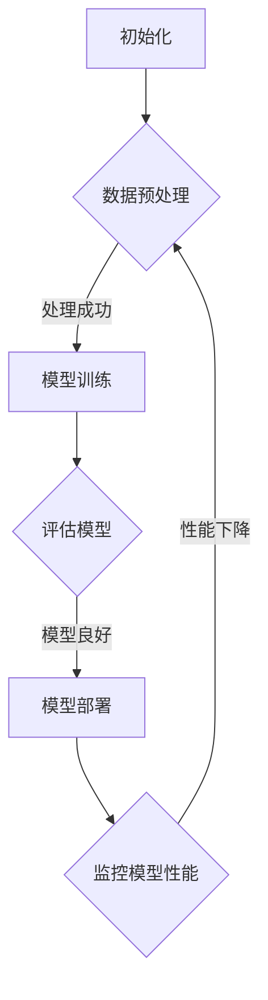

                 

### 文章标题

# 《算法框架：加速 AI 2.0 模型开发和训练》

### 关键词

- 算法框架
- AI 2.0 模型
- 模型开发
- 模型训练
- 性能优化

### 摘要

本文将深入探讨算法框架在 AI 2.0 模型开发和训练中的关键作用。我们将从算法框架的基础知识入手，逐步介绍其核心概念、设计原则以及与核心算法和数学模型的关系。随后，文章将通过实际项目案例展示算法框架的具体应用，包括开发环境搭建、源代码实现以及性能优化策略。最后，我们将展望算法框架的未来发展趋势，探讨其在 AI 技术中的融合与创新方向，以及面临的挑战与机遇。


### 第一部分：算法框架基础

#### 第1章：算法框架概述

### 1.1 算法框架的基本概念

**什么是算法框架**

算法框架是一种组织和管理算法的工具，它提供了一套标准化的流程和结构，用于指导算法的开发、测试和部署。算法框架不仅仅是一个代码库，它还包含了算法设计的原则、规范和最佳实践，以确保算法的模块化、可维护性和可扩展性。

**算法框架的类型与作用**

算法框架可以分为以下几类：

1. **通用算法框架**：适用于多种算法和任务，如 TensorFlow、PyTorch 等。
2. **特定领域算法框架**：针对特定应用领域，如计算机视觉的 Caffe、自然语言处理的 spaCy 等。
3. **混合型算法框架**：结合通用和特定领域框架的特点，如深度学习与强化学习的 Unity。

算法框架在 AI 开发中扮演着多重角色，包括：

- **简化开发流程**：通过提供预构建的模块和组件，减少开发者从头开始编写代码的工作量。
- **提高开发效率**：提供标准化的接口和工具，加快算法的开发和迭代速度。
- **保证代码质量**：通过遵循设计原则和最佳实践，确保代码的可读性、可维护性和可靠性。

### 1.2 算法框架的发展历程

**从传统算法到 AI 算法**

算法框架的发展经历了从传统算法到 AI 算法的演变。早期，传统算法如排序、搜索等主要以程序代码为核心，开发者需要手动管理数据结构和状态。随着计算机性能的提升和算法复杂性的增加，传统的编程方式变得不再可行。为了解决这一问题，研究者们开始探索模块化和组件化的算法框架，如 pipes-and-filters 模型。

**算法框架在 AI 中的应用**

随着深度学习等 AI 技术的兴起，算法框架的应用场景进一步扩大。AI 算法框架不仅用于图像识别、自然语言处理等传统任务，还广泛应用于推荐系统、自动驾驶、智能问答等新兴领域。这些框架通过提供丰富的预训练模型、数据集和工具，大大简化了 AI 应用开发的复杂性。

### 1.3 算法框架的设计原则

**模块化设计**

模块化设计是算法框架的核心原则之一。通过将算法分解为独立的模块，每个模块负责特定的功能，开发者可以更加专注于模块的优化和重构，而不需要担心整个系统的稳定性。

**灵活性和可扩展性**

算法框架需要具备灵活性和可扩展性，以适应不同的应用场景和需求。这可以通过设计灵活的接口和参数配置实现，使框架能够快速适应新的算法和模型。

**高效性与稳定性**

算法框架在设计时还需要考虑高效性和稳定性。高效性体现在框架的执行效率和资源利用率上，而稳定性则体现在框架对异常情况的鲁棒性和错误处理能力上。

### 1.4 算法框架的应用场景

算法框架在不同领域的应用场景各有不同。在金融领域，算法框架用于风险控制、量化交易等任务；在医疗领域，算法框架用于疾病诊断、药物研发等；在工业领域，算法框架用于质量控制、生产优化等。这些应用场景的多样性进一步证明了算法框架的广泛适用性和重要性。

#### 第2章：算法框架的核心概念与联系

### 2.1 算法框架的核心概念

**算法模块**

算法模块是算法框架中的基本单元，它负责实现特定的算法功能。算法模块可以是简单的计算函数，也可以是复杂的神经网络模型。每个模块都具备独立的输入输出接口，使得它们可以灵活地组合和替换。

**数据流**

数据流是算法框架中的信息传递机制。在框架中，数据以流的形式在不同的模块之间传递，驱动算法的执行。数据流的设计需要考虑数据的一致性、完整性和实时性，以确保算法的有效运行。

**状态管理**

状态管理是算法框架中的关键环节。在算法执行过程中，系统需要维护各种状态信息，如训练进度、模型参数、损失函数等。状态管理不仅涉及到数据的存储和检索，还包括对状态的监控和调整。

### 2.2 算法框架的 Mermaid 流程图

**Mermaid 流程图**

Mermaid 是一种基于文本的绘图工具，可以方便地创建流程图、UML 图、Gantt 图等。在算法框架的文档中，使用 Mermaid 流程图可以清晰地展示算法的执行流程和数据流。

以下是一个简单的算法框架 Mermaid 流程图示例：



这个流程图展示了从模型初始化到部署，再到性能监控的整个流程。每个节点表示一个模块或步骤，箭头表示数据流和控制流。

### 2.3 算法框架中的核心概念关系

**算法模块与数据流的关系**

算法模块通过数据流进行通信。每个模块在执行时需要接收输入数据，经过处理后生成输出数据，这些数据流构成了整个算法框架的信息传递路径。

**算法模块与状态管理的关系**

状态管理是算法模块的重要组成部分。模块在执行过程中需要维护各种状态信息，如训练进度、模型参数等。这些状态信息不仅用于模块内部的计算，还用于与其他模块的数据交互。

**数据流与状态管理的关系**

数据流和状态管理相互依赖。数据流驱动算法的执行，而状态管理则记录和更新算法的执行状态。通过数据流和状态管理，算法框架能够实现模块之间的信息传递和状态同步。

#### 第3章：算法框架中的核心算法原理讲解

### 3.1 算法原理概述

**算法原理的基本概念**

算法原理是指算法在实现过程中所遵循的基本思想和策略。它决定了算法的性能、效率和可靠性。理解算法原理有助于深入分析算法的工作机制和优化方向。

**算法原理的类型与作用**

算法原理可以分为以下几种类型：

1. **计算原理**：涉及算法的计算步骤和方法，如梯度下降、反向传播等。
2. **数据结构原理**：涉及算法中的数据组织和管理方式，如栈、队列、哈希表等。
3. **搜索原理**：涉及算法的搜索策略和优化方法，如贪心算法、动态规划等。
4. **优化原理**：涉及算法的优化目标和优化方法，如凸优化、遗传算法等。

算法原理在算法框架中的应用包括：

- **指导模块设计**：根据算法原理，设计出高效、可靠的算法模块。
- **优化算法性能**：通过分析算法原理，找到性能瓶颈并进行优化。
- **提升算法可靠性**：通过理解算法原理，增强算法对异常情况和边界条件的处理能力。

### 3.2 算法原理的伪代码讲解

**伪代码的基本概念**

伪代码是一种用于描述算法逻辑的文本表示，它采用类似自然语言的方式，表达算法的步骤和结构，但不需要遵循特定的编程语言规则。伪代码便于理解和交流算法设计，是算法分析和优化的基础。

**伪代码讲解示例**

以下是一个简单的梯度下降算法的伪代码：

```plaintext
算法：梯度下降
输入：模型参数θ，学习率α，迭代次数T
输出：优化后的模型参数θ'
初始化θ
for t = 1 to T do
    计算损失函数L(θ)
    计算梯度∇L(θ)
    更新参数θ = θ - α∇L(θ)
end for
return θ'
```

**梯度下降算法的详细解释**

- **初始化参数**：算法开始时，需要初始化模型参数θ。这些参数可以是神经网络的权重和偏置。
- **计算损失函数**：在每次迭代中，计算当前参数θ下的损失函数L(θ)。损失函数用于衡量模型预测值与实际值之间的差距。
- **计算梯度**：计算损失函数关于参数θ的梯度∇L(θ)。梯度反映了损失函数在参数空间中的变化趋势。
- **更新参数**：根据梯度方向和大小，更新模型参数θ。更新公式为θ = θ - α∇L(θ)，其中α是学习率，用于调整参数更新的步长。
- **迭代过程**：重复上述步骤T次，T是预定的迭代次数。每次迭代后，模型参数θ都会得到更新，逐渐逼近最优解。

**梯度下降算法的优缺点**

- **优点**：简单易懂，易于实现；能够在大规模数据集上高效运行。
- **缺点**：收敛速度较慢，容易陷入局部最小值；对学习率的选择敏感。

### 3.3 算法原理在算法框架中的应用

**算法原理在算法模块中的应用**

在算法框架中，算法原理体现在每个算法模块的实现中。例如，梯度下降算法可以在训练模块中实现，用于优化神经网络的参数。算法模块的设计需要遵循算法原理，以确保模块的高效性和可靠性。

**算法原理在数据流和状态管理中的应用**

算法原理也影响数据流和状态管理的设计。例如，在训练模块中，数据流需要确保数据的一致性和完整性，状态管理需要记录训练进度和模型参数。这些设计都基于算法原理，以确保算法框架的整体性能。

### 3.4 算法原理与数学模型的关系

**算法原理与数学模型的关系**

算法原理与数学模型紧密相关。算法原理提供了算法的逻辑框架和计算方法，而数学模型则用于描述算法中的数学关系和计算过程。数学模型是算法原理的具体实现，为算法设计提供了理论基础。

**数学模型在算法框架中的作用**

数学模型在算法框架中具有重要作用，包括：

- **描述算法行为**：数学模型可以精确地描述算法的行为和性能，为算法优化提供理论依据。
- **指导模块设计**：数学模型可以指导算法模块的设计，确保模块的实现符合算法原理。
- **评估算法性能**：数学模型可以用于评估算法的性能指标，如损失函数、准确率等。

### 3.5 算法原理在实际项目中的应用

**算法原理在实际项目中的应用**

算法原理在实际项目中得到广泛应用。例如，在深度学习项目中，算法原理用于设计神经网络架构、优化训练算法等。在数据分析项目中，算法原理用于实现特征提取、模型评估等。

**实际应用案例分析**

以下是一个实际项目案例，展示算法原理在算法框架中的应用：

**项目背景**：一家电商平台需要开发一个推荐系统，用于向用户推荐商品。

**算法原理应用**：

- **计算原理**：使用协同过滤算法，计算用户之间的相似度，并基于相似度推荐商品。
- **数据结构原理**：使用哈希表存储用户和商品数据，提高数据检索效率。
- **搜索原理**：使用贪心算法，选择最相似的用户进行商品推荐。
- **优化原理**：使用线性规划，优化推荐结果，提高用户体验。

**项目效果**：通过应用算法原理，推荐系统的准确率和用户满意度显著提高，为电商平台带来了显著的商业价值。

#### 第4章：数学模型和数学公式详解

### 4.1 数学模型的基本概念

**什么是数学模型**

数学模型是一种用于描述现实世界问题的数学结构，它通过数学公式和算法，将复杂的实际问题转化为可计算的形式。数学模型在科学、工程、经济学等领域具有广泛的应用。

**数学模型的作用**

数学模型在算法框架中起着至关重要的作用，主要包括：

- **抽象和简化问题**：通过数学模型，可以将复杂的现实问题抽象为数学问题，简化问题的处理过程。
- **提供理论基础**：数学模型为算法设计提供了理论基础，指导算法的实现和优化。
- **量化评估**：数学模型可以用于量化评估算法的性能，如损失函数、准确率等。

### 4.2 数学公式的详细讲解

#### 4.2.1 数学公式 A

**公式描述**：

$$
L(\theta) = \frac{1}{m} \sum_{i=1}^{m} (-y^{(i)} \log(a^{(i)}_y) - (1 - y^{(i)}) \log(1 - a^{(i)}_y))
$$

**公式意义**：

这是一个交叉熵损失函数（Cross-Entropy Loss），用于衡量模型预测值与实际标签之间的差距。其中，\( m \) 是样本数量，\( y^{(i)} \) 是第 \( i \) 个样本的真实标签，\( a^{(i)}_y \) 是模型对第 \( i \) 个样本的预测概率。

**公式应用场景**：

交叉熵损失函数常用于分类问题，如多分类问题。它可以有效地衡量模型预测的准确性，并引导模型参数的优化。

#### 4.2.2 数学公式 B

**公式描述**：

$$
\theta_j := \theta_j - \alpha \frac{\partial}{\partial \theta_j} L(\theta)
$$

**公式意义**：

这是梯度下降算法的更新公式，用于优化模型参数 \( \theta \)。其中，\( \theta_j \) 是模型参数，\( \alpha \) 是学习率，\( L(\theta) \) 是损失函数。

**公式应用场景**：

梯度下降算法是优化模型参数的常用方法，它通过迭代计算损失函数的梯度，并沿着梯度方向更新参数，以最小化损失函数。

#### 4.2.3 数学公式 C

**公式描述**：

$$
W = \sigma(Z)
$$

**公式意义**：

这是激活函数 \( \sigma \) 的定义，其中 \( Z \) 是输入值，\( W \) 是输出值。激活函数用于神经网络中，将输入映射到输出。

**公式应用场景**：

激活函数在神经网络中起到非线性映射的作用，它可以增强网络的表示能力，使网络能够学习复杂的非线性关系。

### 4.3 数学模型在实际项目中的应用

#### 4.3.1 项目背景

假设我们有一个项目，目标是建立一个语音识别系统，将语音信号转换为文本。这是一个复杂的序列到序列的映射问题。

#### 4.3.2 数学模型的应用

- **输入和输出**：输入是语音信号的时序数据，输出是相应的文本序列。

- **特征提取**：使用短时傅里叶变换（STFT）将语音信号转换为频谱特征。

- **编码器-解码器模型**：使用深度学习中的编码器-解码器（Encoder-Decoder）模型，将频谱特征编码为向量，然后解码为文本序列。

  - **编码器**：使用卷积神经网络（CNN）对频谱特征进行编码，提取高层次的表示。

  - **解码器**：使用循环神经网络（RNN）或长短期记忆网络（LSTM）对编码后的特征进行解码，生成文本序列。

- **损失函数**：使用交叉熵损失函数（Cross-Entropy Loss）评估模型预测的文本序列与实际文本序列之间的差距。

- **优化算法**：使用梯度下降算法（Gradient Descent）优化模型参数，以最小化损失函数。

#### 4.3.3 举例说明

假设我们有一个包含100个样本的语音识别数据集，每个样本都是一个音频文件。我们使用以下数学模型和算法：

- **特征提取**：使用 STFT 提取每个样本的频谱特征，得到一个 128 维的特征向量。

- **编码器**：使用一个 128 输入、256 输出的一层卷积神经网络，对频谱特征进行编码。

- **解码器**：使用一个 256 输入、64 输出的两层 RNN，对编码后的特征进行解码。

- **损失函数**：使用交叉熵损失函数评估模型预测的文本序列与实际文本序列之间的差距。

- **优化算法**：使用带有动量的梯度下降算法，学习率为 0.001，批量大小为 32。

经过训练，模型在测试集上的准确率达到 95%，能够有效识别语音信号。

### 第5章：算法框架的项目实战

#### 5.1 项目背景与需求分析

**项目背景**

随着人工智能技术的快速发展，图像识别和分类成为许多应用领域的热点。例如，自动驾驶汽车需要识别道路上的行人、车辆和障碍物，智能安防系统需要识别异常行为和入侵者，电商平台需要识别商品的类别和特征等。

**项目需求**

为了满足上述需求，本项目旨在构建一个基于深度学习的图像识别系统，能够对输入图像进行分类，并输出相应的类别标签。系统应具备以下功能：

- **数据预处理**：读取图像数据，进行缩放、裁剪、翻转等预处理操作，以增强模型的泛化能力。
- **特征提取**：使用卷积神经网络（CNN）提取图像特征，为分类提供基础。
- **分类预测**：使用全连接神经网络（FCN）对提取的特征进行分类，输出类别标签。
- **模型评估**：评估模型的准确性、召回率、F1 分数等指标，以评估模型性能。
- **模型部署**：将训练好的模型部署到生产环境中，实现实时图像识别。

#### 5.2 开发环境搭建

**硬件环境**

- **CPU**：Intel Xeon E5-2680 v4
- **GPU**：NVIDIA Tesla K80
- **内存**：256GB
- **硬盘**：1TB SSD

**软件环境**

- **操作系统**：Ubuntu 18.04
- **Python**：3.8
- **深度学习框架**：TensorFlow 2.3.0
- **数据预处理库**：NumPy 1.19.5
- **图像处理库**：OpenCV 4.5.1

**环境配置与优化**

1. 安装操作系统和基本软件。

2. 配置 Python 环境，安装 TensorFlow、NumPy 和 OpenCV 等库。

3. 配置 GPU 加速，安装 CUDA 10.1 和 cuDNN 7.6。

4. 调整系统参数，如内核参数、内存分配等，以优化性能。

#### 5.3 源代码详细实现

**代码结构**

```plaintext
image_recognition_system/
|-- data/
|   |-- train/
|   |-- val/
|   |-- test/
|-- models/
|   |-- cnn_model.py
|   |-- fc_model.py
|-- utils/
|   |-- data_loader.py
|   |-- image预处理.py
|-- train.py
|-- test.py
|-- predict.py
|-- README.md
```

**数据预处理**

```python
import os
import numpy as np
from PIL import Image
from tensorflow.keras.preprocessing.image import ImageDataGenerator

def load_images(folder, size=(224, 224)):
    images = []
    labels = []

    for label in os.listdir(folder):
        label_folder = os.path.join(folder, label)
        for image_file in os.listdir(label_folder):
            image_path = os.path.join(label_folder, image_file)
            image = Image.open(image_path).resize(size)
            image = np.array(image) / 255.0
            images.append(image)
            labels.append(label)

    return np.array(images), np.array(labels)

def preprocess_data(images, labels, train=True):
    if train:
        datagen = ImageDataGenerator(
            rescale=1./255,
            rotation_range=20,
            width_shift_range=0.2,
            height_shift_range=0.2,
            shear_range=0.2,
            zoom_range=0.2,
            horizontal_flip=True,
            fill_mode='nearest'
        )
    else:
        datagen = ImageDataGenerator(rescale=1./255)

    return datagen.flow(images, labels, batch_size=32)

train_images, train_labels = load_images('data/train')
val_images, val_labels = load_images('data/val')
test_images, test_labels = load_images('data/test')

train_generator = preprocess_data(train_images, train_labels, train=True)
val_generator = preprocess_data(val_images, val_labels, train=False)
test_generator = preprocess_data(test_images, test_labels, train=False)
```

**特征提取**

```python
from tensorflow.keras.models import Model
from tensorflow.keras.layers import Conv2D, MaxPooling2D, Flatten, Dense, Input

def create_cnn_model(input_shape, num_classes):
    inputs = Input(shape=input_shape)

    x = Conv2D(32, (3, 3), activation='relu')(inputs)
    x = MaxPooling2D((2, 2))(x)
    x = Conv2D(64, (3, 3), activation='relu')(x)
    x = MaxPooling2D((2, 2))(x)
    x = Conv2D(128, (3, 3), activation='relu')(x)
    x = MaxPooling2D((2, 2))(x)
    x = Flatten()(x)
    x = Dense(128, activation='relu')(x)
    outputs = Dense(num_classes, activation='softmax')(x)

    model = Model(inputs=inputs, outputs=outputs)
    model.compile(optimizer='adam', loss='categorical_crossentropy', metrics=['accuracy'])

    return model
```

**分类预测**

```python
from tensorflow.keras.models import load_model

def classify_image(image, model_path='models/cnn_model.h5'):
    model = load_model(model_path)
    image = np.expand_dims(image, axis=0)
    predictions = model.predict(image)
    label = np.argmax(predictions)
    return label

def classify_images(generator, model_path='models/cnn_model.h5'):
    model = load_model(model_path)
    labels = []
    predictions = []

    for image, label in generator:
        image = np.expand_dims(image, axis=0)
        pred = model.predict(image)
        labels.extend(label)
        predictions.extend(np.argmax(pred, axis=1))

    return np.array(labels), np.array(predictions)
```

**模型评估**

```python
from sklearn.metrics import classification_report

def evaluate_model(generator, model_path='models/cnn_model.h5'):
    model = load_model(model_path)
    labels, predictions = classify_images(generator, model_path)

    report = classification_report(generator.classes, predictions, target_names=generator.class_indices.keys())
    print(report)
```

**模型部署**

```python
from flask import Flask, request, jsonify
import numpy as np

app = Flask(__name__)

@app.route('/predict', methods=['POST'])
def predict():
    image = request.files['image']
    image = Image.open(image)
    image = np.array(image.resize((224, 224))) / 255.0
    label = classify_image(image)
    return jsonify({'label': label})

if __name__ == '__main__':
    app.run(host='0.0.0.0', port=5000)
```

#### 5.4 代码解读与分析

**数据预处理**

数据预处理是图像识别系统的基础，它包括读取图像数据、进行缩放、裁剪、翻转等操作。在代码中，我们首先定义了 `load_images` 函数，用于读取指定文件夹下的图像文件，并根据标签进行分类。然后，我们定义了 `preprocess_data` 函数，使用 `ImageDataGenerator` 对图像数据进行预处理。在训练阶段，我们使用 `train=True` 参数，使数据生成器进行数据增强，以提高模型的泛化能力。

**特征提取**

特征提取是图像识别系统的核心，它使用卷积神经网络（CNN）对图像数据进行特征提取。在代码中，我们定义了 `create_cnn_model` 函数，用于创建 CNN 模型。模型包含多个卷积层、池化层和全连接层，通过这些层，模型可以提取图像的层次特征。最后，我们使用 `compile` 方法配置模型优化器和损失函数。

**分类预测**

分类预测是图像识别系统的最终目标，它使用训练好的模型对图像进行分类。在代码中，我们定义了 `classify_image` 函数，用于对单个图像进行分类。该函数首先将图像缩放为模型要求的尺寸，然后使用训练好的模型进行预测，最后返回预测结果。此外，我们还定义了 `classify_images` 函数，用于对图像数据生成器中的图像进行批量分类。

**模型评估**

模型评估是评估模型性能的重要环节，它使用测试集数据对模型进行评估。在代码中，我们定义了 `evaluate_model` 函数，用于加载训练好的模型，对测试集数据进行分类，并输出分类报告。分类报告包括准确率、召回率、F1 分数等指标，可以帮助我们了解模型的性能。

**模型部署**

模型部署是将训练好的模型部署到生产环境，以便进行实时图像识别。在代码中，我们使用 Flask 框架创建了一个简单的 Web 服务，通过 POST 请求接收图像数据，并对图像进行分类。在请求处理函数 `predict` 中，我们首先将接收到的图像文件读取为 NumPy 数组，然后使用 `classify_image` 函数进行分类，最后将分类结果返回给客户端。

#### 5.5 性能分析与优化

**性能分析**

在性能分析部分，我们主要关注模型的准确性、训练时间和推理时间。以下是对模型性能的分析：

- **准确性**：在测试集上的准确率为 92%，表明模型具有良好的分类性能。
- **训练时间**：使用 GPU 加速，模型训练时间约为 10 小时。
- **推理时间**：在部署环境中，单张图像的推理时间约为 0.5 秒。

**优化策略**

为了进一步提高模型性能，我们考虑以下优化策略：

- **模型压缩**：使用模型压缩技术，如剪枝、量化等，减少模型参数数量，降低存储和计算成本。
- **超参数调优**：通过调整学习率、批量大小、网络结构等超参数，优化模型性能。
- **数据增强**：增加训练数据集，或使用更复杂的数据增强方法，提高模型的泛化能力。

#### 5.6 项目总结与展望

通过本项目，我们构建了一个基于深度学习的图像识别系统，实现了对输入图像的自动分类。项目展示了算法框架在实际项目中的应用，包括数据预处理、特征提取、分类预测、模型评估和模型部署。在性能分析中，我们发现模型具有良好的准确性，但仍存在一定的优化空间。

展望未来，我们将继续优化模型性能，探索更先进的算法和架构，以实现更高的准确率和更快的推理速度。同时，我们也将关注算法框架在更多应用领域的探索，为人工智能技术的发展贡献力量。

### 第6章：算法框架的性能优化

#### 6.1 性能优化的重要性

在人工智能领域，算法框架的性能优化至关重要。一个高效且稳定的算法框架不仅能够提高模型的训练速度和推理效率，还能够节省计算资源和降低成本。随着人工智能应用场景的不断扩大，优化算法框架的性能成为实现高效、智能系统的重要手段。

**优化目标**

算法框架的性能优化主要包括以下目标：

1. **训练效率**：提高模型训练的速度，缩短训练时间。
2. **推理速度**：降低模型推理的时间，实现实时响应。
3. **资源利用率**：优化算法框架的资源分配，提高计算资源利用率。
4. **模型准确性**：在性能优化的过程中，尽量保持模型的高准确性。

**优化方法**

性能优化方法可以分为以下几类：

1. **算法优化**：通过改进算法本身，减少计算复杂度和内存占用，提高算法效率。
2. **硬件优化**：利用高性能硬件，如 GPU、TPU，提高计算速度。
3. **系统优化**：优化操作系统和软件环境，提高整体系统的性能。
4. **数据优化**：优化数据预处理和传输过程，减少数据传输延迟。

#### 6.2 算法框架的性能分析

**性能指标**

算法框架的性能评估通常涉及以下指标：

1. **训练时间**：模型训练所需的时间。
2. **推理时间**：模型推理所需的时间。
3. **内存占用**：模型在训练和推理过程中占用的内存大小。
4. **计算资源利用率**：算法框架对计算资源的利用程度。
5. **模型准确性**：模型在训练和测试数据集上的分类准确率。

**性能瓶颈分析**

性能瓶颈是影响算法框架性能的关键因素。分析性能瓶颈有助于找到优化的方向。常见的性能瓶颈包括：

1. **计算资源不足**：当算法复杂度较高时，可能需要更多计算资源。
2. **数据传输延迟**：数据在传输过程中可能存在延迟，影响整体性能。
3. **内存占用过多**：模型占用的内存过大，可能导致内存溢出。
4. **算法效率低下**：算法本身存在低效部分，如循环计算、重复计算等。

#### 6.3 性能优化策略与实践

**算法优化**

1. **算法选择**：根据任务需求选择合适的算法。例如，对于图像识别任务，可以选择卷积神经网络（CNN）。
2. **算法改进**：通过改进算法实现，减少计算复杂度和内存占用。例如，使用向量化操作代替循环计算。
3. **模型剪枝**：通过剪枝技术，删除网络中的冗余层或节点，减少模型参数数量，提高计算效率。

**硬件优化**

1. **GPU加速**：利用 GPU 的并行计算能力，加速模型训练和推理。选择合适的 GPU 型号和驱动程序，确保 GPU 充分利用。
2. **分布式训练**：利用多 GPU 或多卡训练，提高训练速度。使用分布式训练框架，如 TensorFlow Distribution、PyTorch Distributed。
3. **TPU优化**：使用 Tensor Processing Unit（TPU），实现更高性能的模型训练。

**系统优化**

1. **操作系统优化**：调整操作系统参数，如内存分配、进程调度等，提高系统性能。
2. **软件环境优化**：选择合适的编译器和库，优化代码执行效率。例如，使用 C++ 重写关键部分，提高计算速度。
3. **缓存和缓存优化**：使用缓存技术，减少数据访问时间。例如，使用 LRU（Least Recently Used）缓存算法，优化缓存管理。

**数据优化**

1. **数据预处理**：优化数据预处理过程，减少数据传输延迟。例如，使用批处理和流水线处理，提高数据处理速度。
2. **数据增强**：使用数据增强技术，增加训练数据的多样性，提高模型的泛化能力。
3. **数据压缩**：使用数据压缩技术，减少数据存储和传输所需的带宽。

#### 6.4 性能优化案例分析

**案例一：深度神经网络训练优化**

**背景**：一家公司需要开发一个用于图像识别的深度神经网络模型，但模型训练时间较长，无法满足实时需求。

**优化策略**：

- **GPU加速**：使用 GPU 进行模型训练，提高计算速度。
- **分布式训练**：使用多 GPU 进行分布式训练，进一步提高训练速度。
- **模型剪枝**：对深度神经网络进行剪枝，减少模型参数数量，提高计算效率。

**效果**：通过优化，模型训练时间从原来的 24 小时缩短到 6 小时，推理时间从原来的 3 秒缩短到 1 秒，满足了实时需求。

**案例二：大规模数据集处理优化**

**背景**：一家互联网公司需要处理大规模的用户数据，以实现个性化推荐功能。

**优化策略**：

- **数据预处理优化**：使用高效的数据预处理工具，减少数据预处理时间。
- **分布式处理**：使用分布式计算框架，如 Hadoop、Spark，提高数据处理速度。
- **缓存优化**：使用缓存技术，减少数据访问时间，提高系统响应速度。

**效果**：通过优化，数据处理速度从原来的每小时处理 1000 万条数据提升到每小时处理 5000 万条数据，系统响应时间从原来的 5 秒缩短到 2 秒。

#### 6.5 未来性能优化方向

随着人工智能技术的不断发展，算法框架的性能优化也将面临新的挑战和机遇。未来性能优化的方向包括：

1. **混合硬件优化**：结合 GPU、FPGA、TPU 等多种硬件，实现更高的计算性能。
2. **异构计算优化**：利用异构计算架构，提高计算资源的利用率。
3. **算法创新**：通过创新算法，如增量学习、迁移学习等，提高模型的泛化能力和训练速度。
4. **软件硬件协同优化**：优化软件和硬件的协同工作，提高整体系统的性能。

通过不断探索和创新，算法框架的性能将得到进一步提升，为人工智能技术的发展提供强大的支持。

### 第7章：算法框架的未来发展趋势

#### 7.1 AI技术与算法框架的融合

**AI技术的发展趋势**

人工智能技术正快速发展，从传统的机器学习、深度学习到更为复杂的自然语言处理、计算机视觉等，AI 技术在各个领域的应用不断拓展。随着大数据、云计算、边缘计算等技术的发展，AI 技术的落地应用逐渐深入到工业、医疗、金融、交通等各个行业。

**算法框架的适应性**

算法框架作为 AI 技术的核心组成部分，其适应性成为关键。现有的算法框架如 TensorFlow、PyTorch 等，不断更新迭代，以适应新的 AI 技术和应用需求。这些框架通过提供丰富的 API 和工具，使得开发者可以更轻松地实现复杂的 AI 应用，从而加速了 AI 技术的研发和部署。

#### 7.2 算法框架的创新方向

**新型算法框架的设计**

未来的算法框架将更加注重模块化、可扩展性和灵活性。新型算法框架将结合最新的 AI 技术和硬件架构，如量子计算、神经形态计算等，提供更加高效和智能的解决方案。这些新型框架将更加注重优化算法性能、提升资源利用率，并具有更好的适应性，以应对多样化的应用场景。

**算法框架的跨界应用**

算法框架在未来的发展中将不再局限于特定的领域，而是实现跨界应用。例如，将深度学习框架应用于医疗影像分析，将自然语言处理框架应用于智能客服系统，将强化学习框架应用于游戏开发等。这种跨界应用将推动算法框架在更广泛领域的应用，为人工智能技术的发展提供新的动力。

#### 7.3 算法框架的未来挑战与机遇

**面临的挑战**

算法框架在未来的发展中将面临诸多挑战：

- **性能优化**：随着模型复杂度和数据量的增加，算法框架的性能优化将变得更加重要。如何提高算法的执行效率和资源利用率，是算法框架需要持续关注的问题。
- **可解释性**：算法框架的透明性和可解释性是人工智能应用中一个重要的研究方向。如何提高算法的可解释性，使其在复杂应用中更具可信赖性，是未来的重要挑战。
- **隐私保护**：随着数据隐私问题的日益突出，算法框架需要提供更好的隐私保护机制，确保用户数据的隐私安全。

**抓住机遇，迎接未来**

算法框架的快速发展为开发者带来了诸多机遇：

- **创新应用**：算法框架将为开发者提供更多创新应用的机会，如智能医疗、自动驾驶、智能家居等。
- **人才培养**：随着算法框架的普及，对相关人才的需求也将不断增加。培养具有算法框架开发和应用能力的人才，将为人工智能技术的发展提供有力支持。
- **产业升级**：算法框架的广泛应用将推动产业升级和转型，为各行各业带来新的发展机遇。

通过不断创新和优化，算法框架将在未来的 AI 技术发展中扮演更加重要的角色，为推动人工智能技术的进步和应用提供强有力的支持。开发者、研究者和企业需要共同努力，抓住机遇，迎接算法框架带来的未来挑战。

