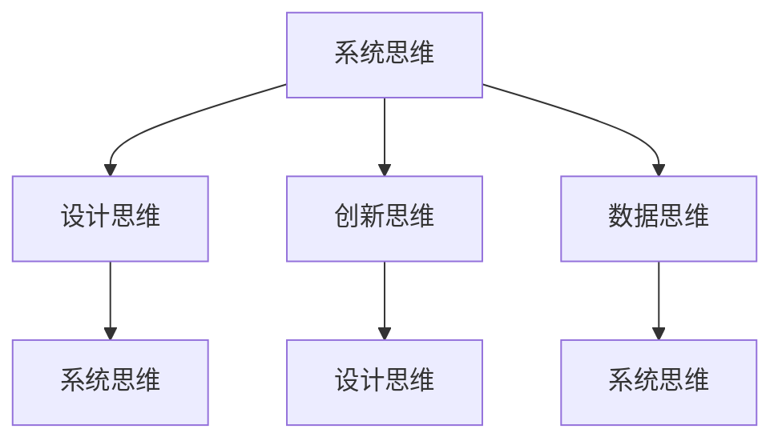

                 

# 文章标题：管理者的思维升级之路

> 关键词：管理者、思维升级、系统思维、设计思维、创新思维、数据思维、实践应用、案例分析

> 摘要：本文旨在深入探讨管理者的思维升级之路，解析系统思维、设计思维、创新思维和数据思维等核心概念，并通过实战案例和实践指南，为读者提供具体的思维升级策略和行动计划。在未来的商业环境中，思维升级将成为管理者不可或缺的能力，本文将为读者提供宝贵的理论支持和实践指导。

### 《管理者的思维升级之路》目录大纲

#### 第一部分：思维升级的理论基础

#### 第二部分：实战应用与案例研究

#### 第三部分：思维升级的未来展望

#### 第四部分：思维升级的实践指南

#### 第五部分：思维升级的行动计划

#### 附录

### 附录A：思维模型与工具集

### 附录B：推荐阅读与学习资源

### 结语

---

#### 第一部分：思维升级的理论基础

# 第1章：思维升级概述

## 1.1 管理者面临的挑战

### 1.1.1 时代变化的压力

### 1.1.2 创新能力的需要

## 1.2 思维升级的重要性

### 1.2.1 思维升级的意义

### 1.2.2 思维升级的路径

## 1.3 核心思维概念与联系

### 1.3.1 系统思维

### 1.3.2 设计思维

### 1.3.3 创新思维

### 1.3.4 数据思维

#### Mermaid 流程图：核心思维概念与联系



---

#### 第二部分：实战应用与案例研究

# 第2章：核心算法原理讲解

## 2.1 系统思维原理

### 2.1.1 系统思维的定义

### 2.1.2 系统思维的框架

### 2.1.3 系统思维的伪代码实现

```python
# 系统思维伪代码
def system_thinking(input_data):
    # 初始化变量
    variables = initialize_variables(input_data)
    
    # 执行系统分析
    system_analysis(variables)
    
    # 输出结果
    output_results(variables)
```

## 2.2 设计思维原理

### 2.2.1 设计思维的定义

### 2.2.2 设计思维的流程

### 2.2.3 设计思维的伪代码实现

```python
# 设计思维伪代码
def design_thinking(problem):
    # 界定问题
    defined_problem = define_problem(problem)
    
    # 收集信息
    collected_info = collect_info(defined_problem)
    
    # 建立原型
    prototype = create_prototype(collected_info)
    
    # 测试反馈
    test_feedback = test_prototype(prototype)
    
    # 完善解决方案
    final_solution = refine_solution(test_feedback)
    
    return final_solution
```

## 2.3 创新思维原理

### 2.3.1 创新思维的定义

### 2.3.2 创新思维的策略

### 2.3.3 创新思维的伪代码实现

```python
# 创新思维伪代码
def innovative_thinking(current_state, target_state):
    # 分析现状
    current_state_analysis = analyze_current_state(current_state)
    
    # 提出解决方案
    potential_solutions = generate_solutions(current_state_analysis)
    
    # 选择最优方案
    best_solution = select_best_solution(potential_solutions)
    
    # 实施方案
    implementation = implement_solution(best_solution)
    
    return implementation
```

## 2.4 数据思维原理

### 2.4.1 数据思维的定义

### 2.4.2 数据思维的方法

### 2.4.3 数据思维的伪代码实现

```python
# 数据思维伪代码
def data_thinking(data_source):
    # 数据收集
    collected_data = collect_data(data_source)
    
    # 数据清洗
    cleaned_data = clean_data(collected_data)
    
    # 数据分析
    data_analysis = analyze_data(cleaned_data)
    
    # 提出决策
    decision = make_decision(data_analysis)
    
    return decision
```

---

#### 第三部分：思维升级的未来展望

# 第3章：思维升级的未来趋势

## 3.1 新技术对思维升级的影响

### 3.1.1 人工智能的发展

### 3.1.2 大数据与云计算的融合

### 3.1.3 新兴技术的应用

## 3.2 管理者的思维升级策略

### 3.2.1 个人成长与持续学习

### 3.2.2 团队建设与思维模式转变

### 3.2.3 企业文化与思维升级

---

#### 第四部分：思维升级的实践指南

# 第4章：思维升级的实践方法

## 4.1 思维导图的应用

### 4.1.1 思维导图的基本原理

### 4.1.2 思维导图在思维升级中的应用

## 4.2 逆向思维的实践

### 4.2.1 逆向思维的基本概念

### 4.2.2 逆向思维在问题解决中的应用

## 4.3 创新工作坊的开展

### 4.3.1 创新工作坊的组织与流程

### 4.3.2 创新工作坊的实际操作

---

#### 第五部分：思维升级的行动计划

# 第5章：思维升级的行动计划

## 5.1 个人思维升级行动计划

### 5.1.1 自我评估与目标设定

### 5.1.2 学习资源与学习计划

### 5.1.3 实践与反馈循环

## 5.2 组织思维升级行动计划

### 5.2.1 组织文化塑造

### 5.2.2 培训与人才发展

### 5.2.3 项目管理与创新机制

---

### 附录

## 附录A：思维模型与工具集

## 附录B：推荐阅读与学习资源

---

### 结语

本文通过深入探讨管理者的思维升级之路，旨在帮助读者掌握系统思维、设计思维、创新思维和数据思维等核心概念，并通过实战案例和实践指南，为读者提供具体的思维升级策略和行动计划。在未来的商业环境中，思维升级将成为管理者不可或缺的能力，本文将为读者提供宝贵的理论支持和实践指导。

作者：AI天才研究院/AI Genius Institute & 禅与计算机程序设计艺术 /Zen And The Art of Computer Programming

---

### 第一部分：思维升级的理论基础

# 第1章：思维升级概述

## 1.1 管理者面临的挑战

### 1.1.1 时代变化的压力

在当今这个快速变革的时代，管理者面临着前所未有的挑战。技术的迅猛发展、市场的快速变化以及全球化的加剧，使得管理环境变得日益复杂。传统的管理思维和方法已经难以应对这些新的挑战，管理者需要具备更加灵活和创新的思维能力，以适应快速变化的环境。

例如，随着人工智能和大数据技术的广泛应用，管理者需要了解如何利用这些新技术来优化业务流程、提高决策效率和创造新的商业模式。这不仅要求管理者具备技术知识，更需要具备系统思维和创新能力，以便在复杂的环境中找到最优解决方案。

### 1.1.2 创新能力的需要

创新是现代企业生存和发展的关键。管理者不仅需要具备解决现有问题的能力，更需要具备预见未来趋势、引领变革和创新的能力。随着市场竞争的加剧和消费者需求的不断变化，管理者需要持续地推动创新，以保持企业的竞争力。

然而，创新并非易事。它需要管理者具备跨学科的思维方式，能够从不同的角度和视角看待问题，发现新的解决方案。此外，创新还需要管理者具备敢于冒险和承受失败的心理素质，勇于尝试新的方法和策略。

## 1.2 思维升级的重要性

### 1.2.1 思维升级的意义

思维升级对管理者来说具有重要意义。首先，它能够帮助管理者更好地应对复杂多变的环境。通过升级思维，管理者能够更加敏锐地捕捉市场变化，快速做出反应，避免因惯性思维而错失发展机遇。

其次，思维升级有助于提升管理者的决策能力。系统思维、设计思维、创新思维和数据思维等不同类型的思维方式，提供了多种分析问题和解决问题的工具和方法，使得管理者能够从多个维度进行思考，做出更为全面和准确的决策。

最后，思维升级有助于管理者提升个人和团队的创新能力。通过不断学习和实践，管理者能够开拓思维，激发创新潜力，推动企业在不断变化的市场中保持竞争优势。

### 1.2.2 思维升级的路径

思维升级并非一蹴而就，而是一个持续学习和实践的过程。以下是一些关键的路径：

1. **持续学习**：管理者需要不断学习新知识、新技能，尤其是与新技术、新趋势相关的知识。通过参加培训、阅读专业书籍、参与行业交流等途径，不断提升自己的认知水平。

2. **实践应用**：理论知识需要通过实践来检验和巩固。管理者可以通过实际项目或日常工作中的问题，运用所学的思维方法进行实践，从而提升自己的思维能力和问题解决能力。

3. **反思与总结**：在学习和实践的过程中，管理者需要不断反思自己的思维过程和决策结果，总结经验教训，找出不足之处，并制定改进措施。

4. **跨学科交流**：与不同领域的专家进行交流，能够帮助管理者开阔视野，发现新的思维方法和解决问题的工具。

5. **培养团队思维**：管理者需要通过团队建设，培养团队成员的思维能力和创新能力，形成集体的智慧，共同应对挑战。

## 1.3 核心思维概念与联系

### 1.3.1 系统思维

系统思维是一种从整体角度看待问题和分析问题的思维方式。它强调各部分之间的相互作用和反馈，认为一个系统的行为是由其内部各要素的相互作用所决定的。系统思维有助于管理者从全局出发，把握问题的本质和内在联系，做出更为全面的决策。

#### 系统思维的定义

系统思维是一种思考方式，它关注系统内部各个组成部分之间的相互关系和相互作用。系统思维强调在分析问题时，要考虑到系统整体的动态平衡和复杂互动。

#### 系统思维的框架

系统思维通常包括以下几个关键步骤：

1. **识别系统**：确定需要分析的系统，并明确系统的边界。
2. **理解系统结构**：分析系统内部各组成部分及其相互关系。
3. **识别反馈循环**：识别系统中各个部分之间的反馈机制，包括正反馈和负反馈。
4. **分析系统行为**：通过模拟和模型分析系统在不同条件下的行为和结果。

#### 系统思维的伪代码实现

```python
# 系统思维伪代码
def system_thinking(input_data):
    # 初始化变量
    variables = initialize_variables(input_data)
    
    # 执行系统分析
    system_analysis(variables)
    
    # 输出结果
    output_results(variables)
```

### 1.3.2 设计思维

设计思维是一种以人为本的解决问题和创新的方法，它强调通过理解用户需求、建立原型、迭代优化来解决问题。设计思维的核心在于将用户需求置于中心位置，通过反复试验和用户反馈来不断改进解决方案。

#### 设计思维的定义

设计思维是一种以用户为中心的思考方式，它强调通过理解用户的需求和情境，构建解决问题的原型，并通过迭代优化来达到最佳的解决方案。

#### 设计思维的流程

设计思维的流程通常包括以下几个步骤：

1. **理解需求**：通过访谈、观察和调研等方法，深入理解用户的需求和问题。
2. **构建原型**：基于用户需求，快速构建一个初步的原型，用于测试和反馈。
3. **测试与迭代**：将原型展示给用户，收集反馈，并根据反馈进行修改和优化。
4. **完善解决方案**：通过多次迭代，不断完善解决方案，直到达到用户满意的程度。

#### 设计思维的伪代码实现

```python
# 设计思维伪代码
def design_thinking(problem):
    # 界定问题
    defined_problem = define_problem(problem)
    
    # 收集信息
    collected_info = collect_info(defined_problem)
    
    # 建立原型
    prototype = create_prototype(collected_info)
    
    # 测试反馈
    test_feedback = test_prototype(prototype)
    
    # 完善解决方案
    final_solution = refine_solution(test_feedback)
    
    return final_solution
```

### 1.3.3 创新思维

创新思维是一种以创造新观点、新方法和新解决方案为核心的思考方式。它强调通过跳出传统思维框架、多角度思考问题和运用创意技巧来寻求创新的解决方案。

#### 创新思维的定义

创新思维是一种思考方式，它强调通过打破常规、尝试新的思路和方法来创造新的观点、方法或解决方案。

#### 创新思维的策略

创新思维的策略包括以下几个方面：

1. **头脑风暴**：通过集体讨论，自由表达各种想法，不限制想法的奇特性和可行性。
2. **思维导图**：通过绘制思维导图，将想法和关联进行可视化，帮助理清思路。
3. **类比思维**：通过寻找不同领域中的相似之处，借鉴已有的成功经验来创造新的解决方案。
4. **逆向思维**：从问题的反面思考，寻求不同的解决方案。
5. **多角度思考**：从不同的角度和视角来看待问题，寻找新的解决方案。

#### 创新思维的伪代码实现

```python
# 创新思维伪代码
def innovative_thinking(current_state, target_state):
    # 分析现状
    current_state_analysis = analyze_current_state(current_state)
    
    # 提出解决方案
    potential_solutions = generate_solutions(current_state_analysis)
    
    # 选择最优方案
    best_solution = select_best_solution(potential_solutions)
    
    # 实施方案
    implementation = implement_solution(best_solution)
    
    return implementation
```

### 1.3.4 数据思维

数据思维是一种以数据为核心的分析和决策思维方式。它强调通过收集、处理和分析数据来指导决策，提高决策的准确性和效率。数据思维在当今大数据时代尤为重要，它可以帮助管理者从海量数据中发现有价值的信息，支持科学决策。

#### 数据思维的定义

数据思维是一种思考方式，它强调通过收集、处理和分析数据来指导决策，以提高决策的准确性和效率。

#### 数据思维的方法

数据思维的方法包括以下几个方面：

1. **数据收集**：收集与决策相关的数据，包括内部数据和外部数据。
2. **数据清洗**：对收集到的数据进行清洗，去除噪声和错误。
3. **数据分析**：运用统计学和数据分析方法，对数据进行处理和分析，提取有价值的信息。
4. **数据可视化**：通过可视化工具将分析结果呈现出来，帮助管理者更直观地理解数据。
5. **数据决策**：根据数据分析结果来指导决策，优化业务流程和策略。

#### 数据思维的伪代码实现

```python
# 数据思维伪代码
def data_thinking(data_source):
    # 数据收集
    collected_data = collect_data(data_source)
    
    # 数据清洗
    cleaned_data = clean_data(collected_data)
    
    # 数据分析
    data_analysis = analyze_data(cleaned_data)
    
    # 提出决策
    decision = make_decision(data_analysis)
    
    return decision
```

#### Mermaid 流程图：核心思维概念与联系


---

## 2.1 系统思维原理

### 2.1.1 系统思维的定义

系统思维是一种从整体角度看待问题和分析问题的思维方式。它强调各部分之间的相互作用和反馈，认为一个系统的行为是由其内部各要素的相互作用所决定的。系统思维有助于管理者从全局出发，把握问题的本质和内在联系，做出更为全面的决策。

系统思维的核心概念包括：

1. **整体性**：系统思维强调看待问题时要关注整体，而不仅仅是各个部分。整体性能和效果取决于各部分之间的相互作用和协调。
2. **反馈机制**：系统思维关注系统内部的反馈机制，包括正反馈和负反馈。正反馈可以放大系统的某些行为，而负反馈则可以抑制系统的不稳定因素。
3. **动态性**：系统思维认为系统是动态的，其行为和状态会随着时间和外部环境的变化而变化。因此，管理者需要不断调整和优化系统，以适应变化。

### 2.1.2 系统思维的框架

系统思维的框架通常包括以下几个关键步骤：

1. **识别系统**：确定需要分析的系统，并明确系统的边界。这一步骤是系统思维的基础，有助于确保分析的对象是明确的、可控的。
2. **理解系统结构**：分析系统内部各组成部分及其相互关系。这一步骤有助于管理者理解系统的内部运作机制，找到问题可能产生的原因。
3. **识别反馈循环**：识别系统中各个部分之间的反馈机制，包括正反馈和负反馈。反馈循环是系统行为的关键因素，有助于解释系统的动态性和稳定性。
4. **分析系统行为**：通过模拟和模型分析系统在不同条件下的行为和结果。这一步骤有助于预测系统未来的发展和趋势，为决策提供依据。

### 2.1.3 系统思维的伪代码实现

```python
# 系统思维伪代码
def system_thinking(input_data):
    # 初始化变量
    variables = initialize_variables(input_data)
    
    # 执行系统分析
    system_analysis(variables)
    
    # 输出结果
    output_results(variables)
```

在上述伪代码中，`initialize_variables` 函数用于初始化系统分析所需的变量，如系统结构、反馈循环等。`system_analysis` 函数则用于执行系统的分析过程，包括识别系统结构、识别反馈循环和分析系统行为等。`output_results` 函数则用于输出系统分析的结果，如系统的动态行为和预测结果。

### 2.1.4 系统思维的应用实例

系统思维在项目管理中的应用是一个典型的例子。在项目管理中，系统思维可以帮助管理者从整体角度看待项目，识别项目的关键因素和潜在风险，从而制定更为有效的项目计划和管理策略。

以下是一个简化的项目管理系统思维的应用实例：

1. **识别系统**：确定项目管理系统，明确系统的边界，如项目团队、项目资源、项目进度等。
2. **理解系统结构**：分析项目管理系统内部各组成部分及其相互关系，如项目团队的角色与职责、项目资源的分配和利用等。
3. **识别反馈循环**：识别项目管理系统中的反馈机制，如项目进度的实时监控和调整、团队成员的协作和反馈等。
4. **分析系统行为**：通过模拟和模型分析项目管理系统在不同条件下的行为和结果，如项目进度延误的影响、团队成员的工作负荷等。

通过系统思维的应用，项目经理可以更好地理解项目管理的复杂性，识别潜在问题，制定有效的解决方案，确保项目顺利完成。

### 2.1.5 系统思维的优势与局限性

系统思维的优势主要体现在以下几个方面：

1. **全局视角**：系统思维帮助管理者从整体角度看待问题，识别系统的关键要素和相互关系，从而做出更为全面的决策。
2. **动态分析**：系统思维强调系统的动态性和变化，有助于管理者预测系统的未来发展和趋势，制定灵活的应对策略。
3. **优化设计**：系统思维可以指导管理者对系统进行优化设计，提高系统的稳定性和效率。

然而，系统思维也存在一些局限性：

1. **复杂度**：系统思维涉及大量的分析工作，需要管理者具备较强的逻辑和分析能力。在实际应用中，复杂系统的分析可能难以完全准确，存在一定的风险。
2. **时间成本**：系统思维的分析过程可能需要较长时间，尤其是在复杂系统中。这可能导致决策的延迟，影响项目的进展。

### 2.1.6 系统思维的实践指南

为了更好地运用系统思维，以下是一些实践指南：

1. **培养全局观念**：管理者需要具备全局观念，从整体角度看待问题和决策，避免陷入局部思维。
2. **强化逻辑分析能力**：管理者需要不断学习和提高逻辑分析能力，以便更好地识别系统的关键要素和相互关系。
3. **应用模型分析**：利用模型分析工具，如流程图、因果图等，帮助管理者更清晰地理解系统结构和反馈机制。
4. **持续实践与反思**：通过实际项目的应用，不断实践和反思系统思维的方法和效果，逐步提高系统思维的运用能力。

---

## 2.2 设计思维原理

### 2.2.1 设计思维的定义

设计思维（Design Thinking）是一种以人为本的创新方法论，它强调通过理解用户需求、建立原型和迭代优化来解决问题。设计思维起源于设计领域，但其应用已经扩展到产品开发、项目管理、组织变革等多个领域。设计思维的核心在于将用户置于中心位置，通过迭代和用户反馈来不断改进解决方案。

设计思维的基本原则包括：

1. **用户中心**：设计思维强调以用户需求为导向，深入了解用户的需求、行为和情境，确保解决方案能够真正满足用户的需求。
2. **迭代迭代**：设计思维采用迭代的方式，通过快速建立原型、测试和优化，不断改进解决方案，而不是一次性完成。
3. **跨学科合作**：设计思维鼓励跨学科合作，通过不同领域的专家和用户共同参与，发挥集体智慧和创造力。
4. **包容性**：设计思维强调包容性，鼓励多样性和不同观点的碰撞，以产生更具创新性的解决方案。

### 2.2.2 设计思维的流程

设计思维的流程通常包括以下几个阶段：

1. **理解需求**：通过访谈、观察、问卷调查等方法，深入了解用户的需求和问题。这一阶段的目标是建立对用户情境的深刻理解。
2. **构建原型**：基于用户需求，快速构建一个初步的原型，可以是草图、模型或简单的功能原型。这一阶段的目标是探索不同的解决方案，而不拘泥于细节。
3. **测试反馈**：将原型展示给用户，收集他们的反馈和意见。这一阶段的目标是验证原型是否符合用户需求，发现潜在的问题和改进点。
4. **优化迭代**：根据用户反馈，对原型进行修改和优化，重新测试，不断迭代，直到解决方案达到用户满意的程度。

### 2.2.3 设计思维的伪代码实现

```python
# 设计思维伪代码
def design_thinking(problem):
    # 界定问题
    defined_problem = define_problem(problem)
    
    # 收集信息
    collected_info = collect_info(defined_problem)
    
    # 建立原型
    prototype = create_prototype(collected_info)
    
    # 测试反馈
    test_feedback = test_prototype(prototype)
    
    # 完善解决方案
    final_solution = refine_solution(test_feedback)
    
    return final_solution
```

在上述伪代码中，`define_problem` 函数用于明确需要解决的问题，`collect_info` 函数用于收集用户需求和相关信息，`create_prototype` 函数用于建立原型，`test_prototype` 函数用于测试原型并收集用户反馈，`refine_solution` 函数用于根据反馈优化解决方案。

### 2.2.4 设计思维的应用实例

设计思维在产品开发中的应用是一个典型的例子。以下是一个简化的产品设计过程，展示了设计思维的应用：

1. **理解需求**：产品经理通过用户访谈和市场调研，了解到用户对某个功能的需求，明确产品的目标用户群体和主要功能。
2. **构建原型**：产品设计师快速构建一个功能原型，例如一个简单的用户界面草图，展示产品的核心功能和交互方式。
3. **测试反馈**：将原型展示给目标用户，收集他们的反馈，了解用户对产品功能的看法和感受。
4. **优化迭代**：根据用户反馈，对原型进行修改和优化，例如调整界面布局、增加功能细节等，然后再次测试和收集反馈。
5. **完善解决方案**：经过多次迭代，最终优化出用户满意的产品设计方案。

通过设计思维的应用，产品开发团队能够更好地理解用户需求，快速迭代和优化产品，提高产品的市场竞争力。

### 2.2.5 设计思维的优势与局限性

设计思维的优势主要体现在以下几个方面：

1. **用户导向**：设计思维以用户需求为导向，确保解决方案能够真正满足用户的需求，提高产品的用户满意度。
2. **快速迭代**：设计思维的迭代过程能够快速发现和解决问题，降低开发风险，提高开发效率。
3. **跨学科合作**：设计思维鼓励跨学科合作，发挥不同领域的专业知识和创造力，产生更具创新性的解决方案。

然而，设计思维也存在一些局限性：

1. **时间成本**：设计思维的迭代过程可能需要较长时间，尤其是在复杂产品开发中，可能影响项目的进度。
2. **用户偏误**：设计思维依赖于用户反馈，但用户的反馈可能存在偏误，影响解决方案的准确性。
3. **资源限制**：设计思维可能需要投入较多的资源和时间，对于资源和时间有限的组织可能存在一定的挑战。

### 2.2.6 设计思维的实践指南

为了更好地运用设计思维，以下是一些实践指南：

1. **深入用户研究**：通过访谈、观察、问卷调查等多种方法，深入了解用户的需求和行为，建立对用户情境的深刻理解。
2. **快速构建原型**：采用快速原型构建方法，如草图、模型等，减少设计和开发过程中的时间成本。
3. **持续迭代与优化**：采用迭代的方式，不断测试和优化原型，根据用户反馈进行调整，确保解决方案的准确性。
4. **跨学科团队协作**：建立跨学科团队，发挥不同领域的专业知识和创造力，共同推动项目的进展。

---

## 2.3 创新思维原理

### 2.3.1 创新思维的定义

创新思维（Innovative Thinking）是一种以创造新观点、新方法和新解决方案为核心的思考方式。它强调通过跳出传统思维框架、多角度思考问题和运用创意技巧来寻求创新的解决方案。创新思维是推动企业持续发展和市场竞争的关键因素。

创新思维的核心特点包括：

1. **创意生成**：创新思维强调创意的生成，通过联想、类比、逆向思维等技巧，产生新的想法和解决方案。
2. **跨学科应用**：创新思维鼓励跨学科的知识和技能的融合，通过不同领域的知识和方法的交叉应用，创造新的价值。
3. **风险评估**：创新思维强调对创新方案的风险评估，通过分析潜在的风险和挑战，制定应对策略。
4. **实践验证**：创新思维强调将创意转化为实践，通过实验和测试验证创意的有效性和可行性。

### 2.3.2 创新思维的策略

创新思维的策略包括以下几个方面：

1. **头脑风暴**：通过集体讨论，自由表达各种想法，不限制想法的奇特性和可行性。头脑风暴有助于激发团队的创造力和想象力。
2. **思维导图**：通过绘制思维导图，将想法和关联进行可视化，帮助理清思路，发现潜在的创意。
3. **类比思维**：通过寻找不同领域中的相似之处，借鉴已有的成功经验来创造新的解决方案。类比思维有助于打破常规，寻找创新的路径。
4. **逆向思维**：从问题的反面思考，寻求不同的解决方案。逆向思维可以帮助发现问题的本质和潜在的创新机会。
5. **多角度思考**：从不同的角度和视角来看待问题，寻找新的解决方案。多角度思考有助于拓宽思维视野，发现创新的切入点。

### 2.3.3 创新思维的伪代码实现

```python
# 创新思维伪代码
def innovative_thinking(current_state, target_state):
    # 分析现状
    current_state_analysis = analyze_current_state(current_state)
    
    # 提出解决方案
    potential_solutions = generate_solutions(current_state_analysis)
    
    # 选择最优方案
    best_solution = select_best_solution(potential_solutions)
    
    # 实施方案
    implementation = implement_solution(best_solution)
    
    return implementation
```

在上述伪代码中，`analyze_current_state` 函数用于分析当前的状态，`generate_solutions` 函数用于提出潜在的解决方案，`select_best_solution` 函数用于选择最优的解决方案，`implement_solution` 函数用于实施解决方案。

### 2.3.4 创新思维的应用实例

创新思维在企业管理中的应用是一个典型的例子。以下是一个简化的企业管理过程，展示了创新思维的应用：

1. **分析现状**：企业高层管理者通过市场调研和数据分析，分析当前企业的运营状况和存在的问题，明确需要改进的领域。
2. **提出解决方案**：管理层采用头脑风暴和思维导图的方法，提出一系列潜在的解决方案，包括改进产品、优化流程、引入新技术等。
3. **选择最优方案**：管理层根据潜在解决方案的可行性、成本和潜在收益等因素，选择最优的解决方案。
4. **实施解决方案**：管理层制定详细的实施计划，分配资源，组织团队执行方案，并进行持续监控和调整。

通过创新思维的应用，企业管理层能够找到创新的解决方案，推动企业的持续改进和创新发展。

### 2.3.5 创新思维的优势与局限性

创新思维的优势主要体现在以下几个方面：

1. **创造力**：创新思维能够激发团队的创造力和想象力，产生新的想法和解决方案。
2. **灵活性**：创新思维鼓励多角度思考，能够适应快速变化的环境，找到灵活的解决方案。
3. **竞争优势**：创新思维有助于企业保持竞争优势，通过不断创新来满足市场和用户的需求。

然而，创新思维也存在一些局限性：

1. **风险**：创新思维可能涉及高风险的尝试，需要管理者具备一定的风险承受能力。
2. **资源**：创新思维可能需要投入较多的资源和时间，对于资源和时间有限的组织可能存在一定的挑战。
3. **实施**：创新思维提出的解决方案可能在实际实施过程中面临各种挑战，需要管理者具备良好的执行力。

### 2.3.6 创新思维的实践指南

为了更好地运用创新思维，以下是一些实践指南：

1. **鼓励自由表达**：创造一个开放和包容的环境，鼓励团队成员自由表达自己的想法，不限制创意的奇特性和可行性。
2. **跨学科合作**：建立跨学科团队，通过不同领域的知识和经验的融合，激发创新的火花。
3. **实践验证**：将创意转化为实践，通过实验和测试验证创意的有效性和可行性，不断优化和完善。
4. **持续学习**：鼓励团队成员持续学习和成长，不断提升自己的知识和技能，为创新思维提供坚实的基础。

---

## 2.4 数据思维原理

### 2.4.1 数据思维的定义

数据思维（Data Thinking）是一种以数据为核心的分析和决策思维方式。它强调通过收集、处理和分析数据来指导决策，提高决策的准确性和效率。在当今大数据时代，数据思维已成为管理者必备的技能，它帮助管理者从海量数据中发现有价值的信息，支持科学决策。

数据思维的核心概念包括：

1. **数据驱动的决策**：数据思维强调基于数据的分析结果来指导决策，而不是凭直觉或经验做出决策。
2. **数据质量的保证**：数据思维重视数据质量，包括数据的准确性、完整性和一致性，确保数据能够真实反映问题的本质。
3. **数据分析的方法**：数据思维采用多种数据分析方法，如统计学、机器学习等，从不同角度分析数据，提取有价值的信息。
4. **数据可视化的应用**：数据思维通过数据可视化工具，将复杂的数据分析结果以直观的方式呈现，帮助管理者更好地理解和利用数据。

### 2.4.2 数据思维的方法

数据思维的方法包括以下几个方面：

1. **数据收集**：数据思维的第一步是收集与决策相关的数据，包括内部数据和外部数据。内部数据可能来源于企业的业务系统、财务系统等，外部数据可能来源于市场调研、公共数据等。
2. **数据清洗**：收集到的数据可能存在噪声和错误，数据清洗的目的是去除噪声和错误，确保数据的质量。数据清洗的方法包括数据去重、数据填补、数据格式化等。
3. **数据分析**：通过统计学和机器学习等方法，对数据进行分析，提取有价值的信息。数据分析的方法包括描述性分析、相关性分析、回归分析、聚类分析等。
4. **数据可视化**：利用数据可视化工具，将数据分析结果以图表、地图等形式呈现，帮助管理者更直观地理解数据。数据可视化有助于发现数据中的模式和趋势，支持决策。
5. **数据决策**：根据数据分析结果，制定具体的决策方案，如优化业务流程、调整营销策略、改进产品设计等。

### 2.4.3 数据思维的伪代码实现

```python
# 数据思维伪代码
def data_thinking(data_source):
    # 数据收集
    collected_data = collect_data(data_source)
    
    # 数据清洗
    cleaned_data = clean_data(collected_data)
    
    # 数据分析
    data_analysis = analyze_data(cleaned_data)
    
    # 提出决策
    decision = make_decision(data_analysis)
    
    return decision
```

在上述伪代码中，`collect_data` 函数用于收集数据，`clean_data` 函数用于清洗数据，`analyze_data` 函数用于分析数据，`make_decision` 函数用于根据数据分析结果做出决策。

### 2.4.4 数据思维的应用实例

数据思维在市场营销中的应用是一个典型的例子。以下是一个简化的市场营销过程，展示了数据思维的应用：

1. **数据收集**：市场调研团队通过问卷调查、用户行为分析等方式，收集与目标市场相关的数据，如用户偏好、购买习惯等。
2. **数据清洗**：对收集到的数据进行清洗，去除噪声和错误，确保数据的质量。
3. **数据分析**：通过描述性分析，了解目标市场的总体特征和趋势；通过回归分析，预测市场需求和用户行为；通过聚类分析，细分市场并确定目标客户群体。
4. **数据可视化**：利用数据可视化工具，将数据分析结果以图表、地图等形式呈现，帮助营销团队更好地理解市场数据和用户需求。
5. **数据决策**：根据数据分析结果，制定具体的营销策略，如优化广告投放、调整产品定价、改进用户服务等。

通过数据思维的应用，市场营销团队能够更准确地了解市场动态和用户需求，制定更为科学的营销策略，提高市场营销的效果。

### 2.4.5 数据思维的优势与局限性

数据思维的优势主要体现在以下几个方面：

1. **准确性**：数据思维基于数据分析，能够提供客观、准确的信息，支持科学决策。
2. **效率**：数据思维通过自动化工具和方法，快速处理大量数据，提高决策效率。
3. **可重复性**：数据思维的方法和工具可以重复使用，确保决策的一致性和可重复性。

然而，数据思维也存在一些局限性：

1. **数据质量**：数据质量是数据思维的关键，如果数据存在噪声和错误，分析结果可能会失真。
2. **数据隐私**：数据收集和使用可能涉及用户隐私，需要遵守相关法律法规，确保数据安全和用户隐私。
3. **分析复杂度**：数据分析过程可能涉及复杂的数学模型和算法，需要具备一定的专业知识和技能。

### 2.4.6 数据思维的实践指南

为了更好地运用数据思维，以下是一些实践指南：

1. **确保数据质量**：重视数据质量，建立数据质量管理机制，确保数据的准确性、完整性和一致性。
2. **培养数据分析能力**：提升团队成员的数据分析能力，通过培训和学习，掌握数据分析的方法和工具。
3. **数据可视化**：利用数据可视化工具，将数据分析结果以直观的方式呈现，帮助团队成员更好地理解和利用数据。
4. **数据伦理**：遵守数据伦理，确保数据收集和使用过程中尊重用户隐私，保护用户权益。

---

### 第二部分：实战应用与案例研究

# 第3章：思维升级实战应用

## 3.1 系统思维在项目管理中的应用

### 3.1.1 项目管理中的系统思维

系统思维在项目管理中具有重要意义。通过系统思维，项目经理可以全面地理解项目内外部的各种关系和互动，从而制定更为有效的项目计划和管理策略。

#### 系统思维在项目规划中的应用

在项目规划阶段，系统思维可以帮助项目经理从整体角度出发，识别项目中的关键因素和潜在风险。以下是一些具体的步骤：

1. **识别项目目标**：明确项目的最终目标，包括项目范围、时间、成本和质量等。
2. **分析项目环境**：了解项目所处的环境，包括市场环境、竞争态势、技术发展等。
3. **识别项目参与者**：明确项目涉及的各方参与者，包括项目团队、利益相关者、供应商等。
4. **识别项目关键因素**：识别影响项目成功的关键因素，如资源、技术、需求等。
5. **分析项目风险**：识别项目潜在的风险，包括技术风险、市场风险、人力资源风险等。

#### 系统思维在项目监控中的应用

在项目监控阶段，系统思维可以帮助项目经理实时监控项目的进展，及时发现和解决问题。以下是一些具体的步骤：

1. **建立项目监控系统**：制定项目监控计划，确定监控的指标和频率。
2. **收集项目数据**：定期收集项目进度、质量、成本等数据，确保数据的准确性和完整性。
3. **分析项目数据**：利用数据分析工具和方法，对项目数据进行深入分析，发现潜在的问题和趋势。
4. **制定应对策略**：根据数据分析结果，制定相应的应对策略，如调整项目计划、增加资源等。
5. **持续监控和反馈**：持续监控项目的进展，根据反馈结果不断调整和优化项目计划和管理策略。

### 3.1.2 设计思维在产品开发中的应用

设计思维在产品开发中具有重要作用。通过设计思维，产品开发团队能够更好地理解用户需求，快速迭代和优化产品，提高产品的市场竞争力。

#### 设计思维在用户调研中的应用

在用户调研阶段，设计思维可以帮助产品开发团队深入了解用户的需求和行为。以下是一些具体的步骤：

1. **确定调研目标**：明确调研的目标和范围，如用户需求、使用场景、痛点等。
2. **收集用户数据**：通过访谈、观察、问卷调查等方法，收集用户的数据和反馈。
3. **分析用户数据**：对用户数据进行深入分析，提取有价值的信息，如用户偏好、使用习惯等。
4. **建立用户画像**：根据用户数据，建立用户画像，明确目标用户群体的特征和需求。
5. **制定产品设计策略**：根据用户画像，制定产品设计的策略，如功能设计、界面设计等。

#### 设计思维在原型设计中的应用

在原型设计阶段，设计思维可以帮助产品开发团队快速构建和测试产品原型，收集用户反馈并进行迭代优化。以下是一些具体的步骤：

1. **确定原型设计目标**：明确原型设计的目标和范围，如核心功能、用户体验等。
2. **构建原型**：基于用户需求和设计策略，快速构建一个原型，可以是草图、线框图或简单的功能原型。
3. **测试原型**：将原型展示给目标用户，收集用户的反馈和意见。
4. **优化迭代**：根据用户反馈，对原型进行修改和优化，例如调整界面布局、增加功能细节等，然后再次测试和收集反馈。
5. **完善解决方案**：经过多次迭代，最终优化出用户满意的产品设计方案。

### 3.1.3 创新思维在企业管理中的应用

创新思维在企业管理中具有重要意义。通过创新思维，企业管理者能够发现新的商业机会，推动企业的持续发展和创新。

#### 创新思维在策略制定中的应用

在策略制定阶段，创新思维可以帮助企业管理者从不同的角度和视角看待问题，制定具有前瞻性和创新性的企业战略。以下是一些具体的步骤：

1. **确定战略目标**：明确企业的长期战略目标，如市场定位、竞争优势等。
2. **分析市场趋势**：了解市场的发展趋势和竞争态势，发现潜在的商机。
3. **跨学科思维**：结合不同领域的知识和经验，寻找创新的解决方案和商业模式。
4. **风险评估**：评估创新策略的潜在风险，制定风险应对措施。
5. **制定实施计划**：根据战略目标和风险评估，制定具体的实施计划，包括资源分配、时间安排等。

#### 创新思维在组织变革中的应用

在组织变革阶段，创新思维可以帮助企业管理者推动组织的变革和创新，提高组织的灵活性和竞争力。以下是一些具体的步骤：

1. **确定变革目标**：明确组织变革的目标和范围，如组织结构、文化、流程等。
2. **分析现状**：了解组织的现状和存在的问题，如效率低下、沟通不畅等。
3. **跨学科思维**：结合不同领域的知识和经验，提出创新的变革方案。
4. **动员员工**：通过沟通和培训，动员员工参与变革，提高变革的接受度和执行力。
5. **实施变革**：根据变革方案，实施具体的变革措施，如组织结构调整、流程优化等。
6. **持续改进**：在变革过程中，持续监控和评估变革效果，根据反馈结果不断调整和优化。

### 3.1.4 数据思维在决策支持中的应用

数据思维在决策支持中具有重要作用。通过数据思维，企业管理者能够从海量数据中提取有价值的信息，支持科学决策。

#### 数据思维在市场分析中的应用

在市场分析阶段，数据思维可以帮助企业管理者深入分析市场数据，发现市场趋势和机会。以下是一些具体的步骤：

1. **确定分析目标**：明确市场分析的目标和范围，如市场规模、用户需求、竞争对手等。
2. **收集市场数据**：通过市场调研、竞品分析、用户调查等方法，收集与市场相关的数据。
3. **数据清洗**：对收集到的市场数据进行清洗，去除噪声和错误，确保数据的质量。
4. **数据分析**：利用数据分析工具和方法，对市场数据进行分析，提取有价值的信息，如用户偏好、市场趋势等。
5. **数据可视化**：利用数据可视化工具，将分析结果以直观的方式呈现，帮助企业管理者更好地理解和利用数据。
6. **制定市场策略**：根据市场分析结果，制定具体的市场策略，如产品定位、营销策略等。

#### 数据思维在风险控制中的应用

在风险控制阶段，数据思维可以帮助企业管理者识别潜在的风险，制定相应的风险控制策略。以下是一些具体的步骤：

1. **确定风险指标**：明确需要监控的风险指标，如财务风险、运营风险、市场风险等。
2. **收集风险数据**：通过实时监控、数据分析等方法，收集与风险相关的数据。
3. **风险分析**：利用数据分析工具和方法，对风险数据进行深入分析，识别潜在的风险因素。
4. **风险评估**：根据风险分析结果，评估风险的严重程度和概率，制定相应的风险控制措施。
5. **风险监控**：持续监控风险指标，及时发现新的风险因素，并根据风险变化调整风险控制策略。

---

### 案例一：某某公司的思维升级之路

#### 4.1.1 案例背景

某某公司是一家从事软件开发和信息技术服务的企业，成立于2005年。在过去的十几年中，公司经历了快速的发展，但同时也面临着日益激烈的市场竞争和技术变革的挑战。为了保持竞争优势，公司决定进行思维升级，提升管理团队的思维能力和创新能力。

#### 4.1.2 案例实施过程

1. **初期调研**：公司首先进行了初步的调研，了解团队成员的思维能力和创新意识现状。通过访谈、问卷调查等方式，收集了团队成员对思维升级的看法和建议。

2. **制定培训计划**：基于调研结果，公司制定了详细的培训计划，包括系统思维、设计思维、创新思维和数据思维的培训内容。培训计划分为三个阶段：基础培训、高级培训和实战演练。

3. **基础培训**：公司邀请了行业专家进行系统思维、设计思维、创新思维和数据思维的基础培训。培训内容包括思维概念、理论框架和实际应用方法。通过培训，团队成员对核心思维概念有了初步的了解。

4. **高级培训**：在基础培训的基础上，公司开展了高级培训，深入探讨各种思维方法的实际应用。高级培训包括案例分析、头脑风暴和实际项目演练等，帮助团队成员掌握高级思维技巧。

5. **实战演练**：公司组织了一系列的实战演练，将培训内容应用到实际项目中。团队成员在项目实践中运用系统思维、设计思维、创新思维和数据思维，解决实际问题。

6. **持续反思和改进**：公司建立了持续反思和改进机制，鼓励团队成员在项目实践中不断总结经验教训，提出改进建议。公司定期组织反思会议，分享实战经验和教训，不断优化思维升级的实践方法。

#### 4.1.3 案例效果评估

1. **团队思维能力的提升**：通过思维升级培训，团队成员的系统思维、设计思维、创新思维和数据思维能力得到了显著提升。团队成员能够更全面地分析问题，提出创新的解决方案，提高了项目质量和客户满意度。

2. **项目效率的提升**：思维升级实践使得项目管理更加高效。通过系统思维，项目经理能够更准确地识别项目风险和关键因素，制定合理的项目计划；通过设计思维，产品开发团队能够快速迭代和优化产品，提高开发效率。

3. **创新能力的提升**：思维升级激发了团队成员的创新潜力。通过创新思维的训练，团队成员能够跳出传统思维框架，提出创新的商业模型和解决方案，推动了公司的持续发展和市场竞争力。

4. **组织文化的改善**：思维升级实践促进了组织文化的改善。团队成员之间的沟通和合作更加顺畅，团队氛围更加开放和包容，创新意识得到了提升。

总体来说，某某公司的思维升级实践取得了显著的效果，为公司的发展注入了新的活力和动力。

### 案例二：某某企业的创新思维实践

#### 4.2.1 案例背景

某某企业是一家大型制造企业，成立于20世纪80年代。在经历了多年的稳定发展后，企业面临着市场需求的不断变化和竞争对手的激烈竞争。为了保持竞争优势，企业决定进行创新思维实践，提升管理团队的创新能力。

#### 4.2.2 案例实施过程

1. **初期调研**：企业首先进行了初期的调研，了解团队成员的创新意识和创新能力现状。通过访谈、问卷调查等方式，收集了团队成员对创新思维实践的看法和建议。

2. **制定创新计划**：基于调研结果，企业制定了详细的创新计划，包括创新思维培训、创新项目实践和创新文化建设等内容。创新计划分为三个阶段：基础培训、项目实践和持续创新。

3. **基础培训**：企业邀请了行业专家进行创新思维的基础培训。培训内容包括创新思维的概念、理论框架和实际应用方法。通过培训，团队成员对创新思维有了初步的了解。

4. **项目实践**：企业组织了一系列的创新项目，鼓励团队成员运用创新思维解决实际问题。项目实践分为项目策划、项目实施和项目评估三个阶段。在项目策划阶段，团队成员运用创新思维提出项目方案；在项目实施阶段，团队成员运用创新方法推动项目进展；在项目评估阶段，团队成员评估项目的创新性和实际效果。

5. **持续创新**：企业建立了持续创新的机制，鼓励团队成员在项目实践中不断探索和创新。企业定期组织创新会议，分享创新经验和成果，激发团队成员的创新热情。

6. **创新文化建设**：企业通过文化建设，营造创新氛围。企业倡导“创新、协同、包容”的文化理念，鼓励团队成员勇于创新、敢于尝试，形成积极向上的创新文化。

#### 4.2.3 案例效果评估

1. **创新能力提升**：通过创新思维实践，企业团队成员的创新能力得到了显著提升。团队成员能够运用创新思维方法，提出创新的解决方案，推动了企业的持续创新和发展。

2. **项目成功率提升**：创新思维实践使得项目管理更加高效。通过创新思维，项目经理能够更准确地识别项目风险和关键因素，制定合理的项目计划，提高了项目的成功率。

3. **市场竞争力提升**：创新思维实践推动了企业的产品创新和市场创新。企业能够更好地满足市场需求，推出具有竞争力的新产品，提高了市场竞争力。

4. **员工满意度提升**：创新思维实践激发了员工的创新热情和积极性，提高了员工的工作满意度和归属感。员工能够在创新项目中发挥自己的才能，实现个人价值和职业发展。

总体来说，某某企业的创新思维实践取得了显著的效果，为企业的发展注入了新的活力和动力。

### 案例三：某某公司的数据思维应用

#### 4.3.1 案例背景

某某公司是一家大数据分析服务提供商，成立于2010年。公司致力于为客户提供全面的数据分析解决方案，帮助客户从海量数据中提取有价值的信息，支持科学决策。为了进一步提升公司的数据思维应用能力，公司决定开展数据思维实践。

#### 4.3.2 案例实施过程

1. **初期调研**：公司首先进行了初期的调研，了解团队成员的数据思维能力现状。通过访谈、问卷调查等方式，收集了团队成员对数据思维应用的看法和建议。

2. **制定培训计划**：基于调研结果，公司制定了详细的数据思维培训计划，包括数据思维的基础知识、数据收集与清洗、数据分析方法、数据可视化等内容。培训计划分为三个阶段：基础培训、高级培训和实战演练。

3. **基础培训**：公司邀请了数据科学家和行业专家进行数据思维的基础培训。培训内容包括数据思维的概念、理论框架和实际应用方法。通过培训，团队成员对数据思维有了初步的了解。

4. **高级培训**：在基础培训的基础上，公司开展了高级培训，深入探讨各种数据分析方法和技术。高级培训包括数据分析工具的使用、数据建模、机器学习等内容。通过高级培训，团队成员掌握了高级数据思维技巧。

5. **实战演练**：公司组织了一系列的数据分析实战演练，将培训内容应用到实际项目中。团队成员在项目实践中运用数据思维，解决实际问题。

6. **数据平台建设**：公司建立了完善的数据平台，包括数据存储、数据处理、数据分析和数据可视化等模块。通过数据平台，团队成员能够高效地进行数据处理和分析。

7. **持续学习和改进**：公司建立了持续学习和改进机制，鼓励团队成员在项目实践中不断总结经验教训，提出改进建议。公司定期组织数据思维分享会，促进团队成员之间的交流和学习。

#### 4.3.3 案例效果评估

1. **数据分析能力提升**：通过数据思维实践，公司团队成员的数据分析能力得到了显著提升。团队成员能够运用数据思维方法，高效地进行数据收集、处理和分析，提高了数据分析的准确性和效率。

2. **决策支持能力提升**：数据思维实践使得公司能够更好地支持客户决策。通过数据思维，公司能够为客户提供全面、准确的数据分析报告，帮助客户做出科学决策。

3. **产品服务质量提升**：数据思维实践提高了公司的产品和服务质量。通过数据思维，公司能够更好地了解客户需求，提供个性化的解决方案，提升了客户满意度和忠诚度。

4. **团队协作能力提升**：数据思维实践促进了团队成员之间的协作。通过数据思维，团队成员能够更好地沟通和合作，共同解决复杂的数据分析问题。

总体来说，某某公司的数据思维实践取得了显著的效果，为公司的发展提供了强大的数据支持和创新能力。

### 第三部分：思维升级的未来展望

# 第4章：思维升级的未来趋势

## 4.1 新技术对思维升级的影响

随着科技的不断进步，新技术如人工智能、大数据、云计算等正在深刻改变着我们的生活方式和工作方式。这些新技术不仅改变了数据的获取、处理和分析方式，也对管理者的思维升级产生了重要影响。

### 4.1.1 人工智能的发展

人工智能（AI）技术的发展为管理者提供了强大的工具和平台，使得数据处理和分析变得更加高效和智能化。人工智能的应用场景涵盖了自然语言处理、图像识别、预测分析等，极大地提升了管理者的决策能力。

1. **智能数据分析**：人工智能技术可以帮助管理者从海量数据中快速提取有价值的信息，支持实时决策。通过机器学习和深度学习算法，人工智能可以自动识别数据中的模式和趋势，提供精准的预测和推荐。

2. **自动化决策**：人工智能可以自动化执行一些复杂的决策过程，减轻管理者的工作负担。例如，在供应链管理中，人工智能可以通过实时数据分析和预测，自动调整库存水平和物流计划。

3. **智能助手**：人工智能助手可以帮助管理者更好地管理日常工作和沟通。例如，通过语音识别和自然语言处理技术，人工智能助手可以协助管理者处理邮件、安排会议和提醒事项。

### 4.1.2 大数据与云计算的融合

大数据和云计算技术的融合为管理者提供了强大的数据基础设施和计算能力。大数据技术可以帮助管理者处理和分析海量数据，而云计算技术则提供了弹性和可扩展的计算资源，使得数据处理变得更加灵活和高效。

1. **数据存储和处理**：云计算平台提供了强大的数据存储和处理能力，管理者可以轻松地存储和处理海量数据，而无需担心数据存储和计算资源的问题。

2. **数据分析和挖掘**：大数据技术可以帮助管理者从海量数据中提取有价值的信息，通过数据挖掘和分析，发现隐藏在数据中的趋势和规律，支持科学决策。

3. **实时数据处理**：云计算技术支持实时数据处理，管理者可以实时获取和分析业务数据，及时做出响应和调整。

### 4.1.3 新兴技术的应用

除了人工智能和大数据技术，其他新兴技术如区块链、物联网、增强现实等也在不断发展和应用，对管理者的思维升级产生了重要影响。

1. **区块链**：区块链技术具有去中心化、安全性和透明性的特点，可以帮助管理者构建安全可信的数据生态系统，提高数据安全和信任度。

2. **物联网**：物联网技术可以将物理世界和数字世界连接起来，管理者可以通过物联网设备实时监控和管理业务流程，提高运营效率。

3. **增强现实**：增强现实（AR）技术可以提供沉浸式的体验，管理者可以通过AR技术更好地理解和分析复杂的数据和信息，提高决策的准确性和效率。

## 4.2 管理者的思维升级策略

面对快速变化的技术环境，管理者需要制定有效的思维升级策略，以提升自身的竞争力和创新能力。以下是一些关键的策略：

### 4.2.1 个人成长与持续学习

1. **主动学习**：管理者应该主动学习新技术和新知识，通过参加培训、在线课程、阅读专业书籍等方式，不断提升自己的专业素养。

2. **跨学科学习**：管理者应该学习跨学科的知识，包括技术、商业、心理学等，以拓宽自己的思维视野，提高综合能力。

3. **实践应用**：理论知识需要通过实践来检验和巩固。管理者应该在实际工作中应用所学的知识，通过实践不断积累经验，提升自己的能力。

### 4.2.2 团队建设与思维模式转变

1. **建立学习型组织**：管理者应该推动团队建立学习型组织文化，鼓励团队成员持续学习和成长，形成良好的学习氛围。

2. **跨学科团队协作**：管理者应该建立跨学科的团队，通过团队成员之间的交流和合作，促进思维碰撞和知识共享。

3. **思维模式转变**：管理者应该推动团队从传统思维模式转向创新思维模式，鼓励团队成员跳出传统框架，勇于尝试新的方法和思路。

### 4.2.3 企业文化与思维升级

1. **鼓励创新**：管理者应该建立鼓励创新的企业文化，为团队成员提供创新的空间和资源，激发团队成员的创新潜力。

2. **建立反馈机制**：管理者应该建立有效的反馈机制，鼓励团队成员分享创新经验和成果，及时发现和解决问题。

3. **持续改进**：管理者应该推动企业不断进行改进和创新，通过持续优化流程、提升效率和质量，保持企业的竞争优势。

### 第四部分：思维升级的实践指南

# 第5章：思维升级的实践方法

## 5.1 思维导图的应用

### 5.1.1 思维导图的基本原理

思维导图（Mind Map）是一种图形化的思维工具，通过将信息以分支和连接的方式呈现，帮助人们梳理和扩展思路。思维导图的基本原理包括：

1. **核心主题**：思维导图的中心是一个核心主题，它代表了整个思维导图的核心内容。
2. **分支结构**：核心主题周围是若干个分支，每个分支代表一个关键概念或主题。
3. **关键词**：在每个分支上使用关键词来表示信息，以简洁的方式表达思想。
4. **连接与关系**：分支之间通过线条和箭头连接，表示不同概念之间的关联和关系。

### 5.1.2 思维导图在思维升级中的应用

思维导图在思维升级中的应用非常广泛，可以帮助管理者梳理思路、提高记忆力和创造力。以下是一些具体的应用场景：

1. **问题分析**：通过思维导图，管理者可以系统地分析问题，识别问题的根源和关键因素，制定解决方案。
2. **会议记录**：在会议中，管理者可以使用思维导图记录关键信息，梳理会议内容，提高会议效率。
3. **项目规划**：通过思维导图，管理者可以规划项目的各个阶段和任务，确保项目顺利进行。
4. **知识管理**：思维导图可以帮助管理者整理和分类知识，建立知识库，提高知识共享和利用效率。

### 5.1.3 思维导图的实际操作

要有效地使用思维导图，以下是一些实际操作的步骤：

1. **确定主题**：明确思维导图的主题和目的，例如分析一个项目的问题、制定一个战略规划等。
2. **绘制核心主题**：在纸上或使用软件，绘制思维导图的核心主题，通常是一个大圆圈或方框。
3. **添加分支**：围绕核心主题，添加主要分支，每个分支代表一个关键概念或主题。
4. **使用关键词**：在每个分支上使用关键词表示信息，保持简洁和直观。
5. **连接与关系**：用线条和箭头连接不同分支，表示它们之间的关系和关联。
6. **迭代优化**：根据需要，不断修改和完善思维导图，使其更加准确和完整。

### 5.1.4 思维导图的优点与局限性

思维导图具有以下优点：

1. **可视化**：通过图形化的方式，使复杂的信息更加直观和易于理解。
2. **记忆辅助**：使用关键词和图像，有助于记忆和回忆关键信息。
3. **创造性**：鼓励思维的发散和创造性，有助于发现新的思路和解决方案。
4. **组织性**：有助于梳理和整理信息，提高工作效率。

然而，思维导图也存在一些局限性：

1. **细节处理**：思维导图更适合表示概括性的信息，对于细节处理可能不够详细。
2. **创造性限制**：思维导图的结构和格式可能限制创造性思维的发展。
3. **软件依赖**：使用思维导图软件可能需要一定的学习和适应，对于不熟悉软件的用户可能存在挑战。

### 5.1.5 思维导图的实践指南

为了更好地运用思维导图，以下是一些实践指南：

1. **确定目标**：明确思维导图的目标和用途，确保绘制的内容有针对性。
2. **简洁明了**：保持思维导图的简洁和直观，避免过多的细节和冗余信息。
3. **多角度思考**：鼓励从不同的角度和视角看待问题，建立多维度的思维导图。
4. **持续迭代**：根据实际需要，不断修改和完善思维导图，确保其准确性和实用性。
5. **团队合作**：鼓励团队成员共同参与思维导图的绘制和讨论，促进团队合作和思维碰撞。

## 5.2 逆向思维的实践

### 5.2.1 逆向思维的基本概念

逆向思维（Reversal Thinking）是一种从问题的反面或相反方向思考问题的方法。它鼓励人们跳出传统思维框架，从不同的角度和视角看待问题，寻找创新的解决方案。

逆向思维的基本原理包括：

1. **反向思考**：从问题的反面或相反方向思考，例如如果问题不存在，会是什么样子？
2. **颠覆常规**：挑战传统思维和常规做法，寻找颠覆性的解决方案。
3. **创造新价值**：通过逆向思维，可以创造出新的价值，解决传统方法无法解决的问题。

### 5.2.2 逆向思维在问题解决中的应用

逆向思维在问题解决中具有重要作用，可以帮助管理者从不同的角度和视角看待问题，寻找创新的解决方案。以下是一些具体的应用场景：

1. **问题诊断**：通过逆向思维，可以从问题的反面或相反方向诊断问题，找到问题的根源。
2. **创新设计**：在产品设计中，逆向思维可以帮助设计师打破传统的设计框架，创造出独特的产品设计。
3. **市场营销**：在市场营销中，逆向思维可以帮助企业从竞争对手的角度思考，制定创新的营销策略。
4. **组织变革**：在组织变革中，逆向思维可以帮助管理者从员工的视角思考，提出创新的变革方案。

### 5.2.3 逆向思维的实际操作

要有效地运用逆向思维，以下是一些实际操作的步骤：

1. **明确问题**：首先明确需要解决的问题，确保逆向思维有明确的针对性和目标。
2. **反向思考**：从问题的反面或相反方向思考，提出与常规不同的假设和解决方案。
3. **验证假设**：对反向思考提出的假设进行验证，确定其可行性和有效性。
4. **迭代优化**：根据验证结果，不断修改和优化假设，直到找到最佳的解决方案。

### 5.2.4 逆向思维的优点与局限性

逆向思维具有以下优点：

1. **创造性**：逆向思维鼓励创造性思维，可以激发创新的思维火花。
2. **突破传统**：逆向思维可以颠覆传统的思维模式，寻找创新的解决方案。
3. **问题诊断**：逆向思维有助于深入分析问题，找到问题的根源。

然而，逆向思维也存在一些局限性：

1. **可行性**：逆向思维提出的解决方案可能存在可行性问题，需要进一步验证和优化。
2. **挑战传统**：逆向思维可能挑战现有的传统观念和做法，需要管理者具备一定的勇气和决心。
3. **时间成本**：逆向思维的验证和优化过程可能需要较长的时间和资源。

### 5.2.5 逆向思维的实践指南

为了更好地运用逆向思维，以下是一些实践指南：

1. **保持开放心态**：逆向思维需要管理者保持开放心态，勇于挑战传统观念和做法。
2. **多角度思考**：鼓励从不同的角度和视角看待问题，提出多种反向思考的假设。
3. **验证假设**：对逆向思维提出的假设进行验证，确保其可行性和有效性。
4. **持续迭代**：根据验证结果，不断修改和优化假设，找到最佳的解决方案。

## 5.3 创新工作坊的开展

### 5.3.1 创新工作坊的组织与流程

创新工作坊是一种促进团队创新思维和合作的方法，通过一系列的活动和讨论，激发团队的创造力，提出创新的解决方案。以下是一个典型的创新工作坊的组织与流程：

1. **准备阶段**：
   - 确定创新工作坊的目标和主题。
   - 选择合适的时间和地点，确保团队成员能够集中精力参与。
   - 准备必要的工具和资源，如白板、彩笔、思维导图软件等。

2. **开场活动**：
   - 开场活动旨在激发团队的创造力和积极性。可以采用热身活动、团队游戏等方式，让团队成员放松心情，准备好参与创新讨论。

3. **问题定义**：
   - 明确需要解决的问题或挑战。可以通过讨论、问卷调查等方式，收集团队成员的意见和想法。

4. **头脑风暴**：
   - 头脑风暴是创新工作坊的核心环节，旨在收集尽可能多的创意和想法。鼓励团队成员自由表达，不限制想法的奇特性和可行性。

5. **筛选与分类**：
   - 将头脑风暴得到的创意进行筛选和分类，确定最具潜力的创意和解决方案。

6. **原型设计与测试**：
   - 选择若干个具有潜力的创意，进行原型设计和测试。原型可以是一个简单的草图、模型或功能原型。

7. **迭代优化**：
   - 根据原型测试结果，对创意进行修改和优化，不断迭代，直到找到最佳的解决方案。

8. **总结与反思**：
   - 总结创新工作坊的过程和成果，鼓励团队成员分享经验和教训。反思创新工作坊的不足之处，提出改进建议。

### 5.3.2 创新工作坊的实际操作

要有效地开展创新工作坊，以下是一些实际操作的步骤：

1. **明确目标和主题**：在开始前，明确创新工作坊的目标和主题，确保团队成员有清晰的方向和目标。

2. **邀请合适的参与者**：邀请与主题相关的团队成员和外部专家参与，确保团队具有多元化的思维和视角。

3. **准备必要工具和资源**：准备白板、彩笔、思维导图软件等工具，确保团队成员能够方便地进行创意表达和讨论。

4. **设置时间和空间**：选择一个安静、舒适的时间和地点，确保团队成员能够集中精力参与创新工作坊。

5. **引导讨论和创意表达**：创新工作坊的主持人应引导团队成员进行讨论和创意表达，鼓励自由思考和合作。

6. **原型设计与测试**：选择具有潜力的创意，进行原型设计和测试，通过实践验证创意的可行性和有效性。

7. **迭代优化**：根据原型测试结果，不断修改和优化创意，找到最佳的解决方案。

8. **总结与反思**：总结创新工作坊的过程和成果，反思不足之处，提出改进建议。

### 5.3.3 创新工作坊的案例

以下是一个创新工作坊的案例：

#### 案例背景

某科技公司希望通过创新工作坊，解决产品用户体验不佳的问题。

#### 实施过程

1. **明确目标和主题**：明确创新工作坊的目标是提升产品用户体验，主题是“改进产品用户体验”。

2. **邀请参与者**：邀请产品经理、设计师、工程师和用户代表参与创新工作坊。

3. **准备工具和资源**：准备白板、彩笔、思维导图软件等工具。

4. **开场活动**：通过团队游戏和讨论，激发团队成员的创造力和积极性。

5. **问题定义**：通过讨论，明确产品用户体验不佳的具体表现和原因。

6. **头脑风暴**：鼓励团队成员提出改进产品用户体验的各种创意和想法，如优化界面设计、增加个性化功能等。

7. **筛选与分类**：将头脑风暴得到的创意进行筛选和分类，确定最具潜力的创意。

8. **原型设计与测试**：选择若干个具有潜力的创意，进行原型设计和测试。例如，设计一个用户界面原型，进行用户测试。

9. **迭代优化**：根据用户测试结果，对原型进行修改和优化，不断迭代，直到找到最佳的用户体验方案。

10. **总结与反思**：总结创新工作坊的过程和成果，反思不足之处，提出改进建议。

通过这个案例，我们可以看到创新工作坊在解决实际问题时的重要作用。它不仅激发了团队的创造力，还通过实践验证和迭代优化，找到了最佳的解决方案。

### 第四部分：思维升级的实践指南

# 第6章：思维升级的实践方法

## 6.1 思维导图的应用

### 6.1.1 思维导图的基本原理

思维导图是一种将思维过程图形化的工具，通过使用关键词、图像和连接线，将信息以分支和子分支的形式组织起来。思维导图的基本原理包括以下几个方面：

1. **中心主题**：思维导图的中心是一个核心主题，它代表了整个思维导图的中心思想和核心内容。通常用一个大圆圈或方框表示。

2. **分支结构**：围绕中心主题，有若干个主要的分支，每个分支代表一个主要概念或子主题。这些分支从中心主题延伸出来，形成一个树状结构。

3. **关键词**：在每个分支上使用关键词来表示信息，以简洁的方式表达思想。关键词应尽量简短，能够准确传达分支的核心内容。

4. **连接与关系**：分支之间通过线条和箭头连接，表示不同概念之间的关联和关系。这种连接关系可以是直接的，也可以是间接的，通过不同的线条样式和箭头方向，可以直观地表达出概念之间的复杂关系。

5. **图像与颜色**：图像和颜色是思维导图的重要组成部分。图像可以直观地传达信息，增加记忆效果；颜色可以区分不同的概念和主题，使思维导图更加生动和易于理解。

### 6.1.2 思维导图在思维升级中的应用

思维导图在思维升级中具有广泛的应用，可以帮助管理者更好地整理思路、激发创造力、提高记忆力和解决问题的效率。以下是一些具体的应用场景：

1. **问题解决**：思维导图可以帮助管理者梳理问题的各个方面，识别问题的根本原因，提出解决方案。

2. **决策制定**：在制定决策时，思维导图可以帮助管理者全面考虑各种因素，权衡不同方案的优缺点，做出更科学的决策。

3. **项目规划**：在项目规划阶段，思维导图可以帮助管理者清晰地定义项目目标、任务和里程碑，确保项目顺利进行。

4. **知识管理**：思维导图可以帮助管理者整理和分类知识，建立知识库，提高知识共享和利用效率。

5. **团队协作**：思维导图可以帮助团队成员共同讨论和梳理问题，促进沟通和协作，提高团队工作效率。

### 6.1.3 思维导图的制作方法

要制作一张有效的思维导图，可以遵循以下步骤：

1. **确定主题**：明确思维导图的主题和目的，确保思维导图的内容有针对性。

2. **绘制中心主题**：在纸张或思维导图软件上，绘制一个中心主题，通常是一个大圆圈或方框。

3. **添加主要分支**：围绕中心主题，添加主要分支，每个分支代表一个主要概念或子主题。

4. **使用关键词**：在每个分支上使用关键词，简洁明了地表达分支的核心内容。

5. **添加子分支**：如果需要，可以继续添加子分支，进一步细化主题。

6. **连接与关系**：用线条和箭头将不同分支连接起来，表示它们之间的关联和关系。

7. **添加图像和颜色**：在适当的位置添加图像和颜色，以增加视觉冲击力和记忆效果。

8. **迭代优化**：根据需要，不断修改和完善思维导图，使其更加准确和完整。

### 6.1.4 思维导图的优点与局限性

思维导图具有以下优点：

1. **可视化**：通过图形化的方式，使复杂的信息更加直观和易于理解。

2. **记忆辅助**：使用关键词、图像和颜色，有助于记忆和回忆关键信息。

3. **创造性**：鼓励思维的发散和创造性，有助于发现新的思路和解决方案。

4. **组织性**：有助于梳理和整理信息，提高工作效率。

然而，思维导图也存在一些局限性：

1. **细节处理**：思维导图更适合表示概括性的信息，对于细节处理可能不够详细。

2. **创造性限制**：思维导图的结构和格式可能限制创造性思维的发展。

3. **软件依赖**：使用思维导图软件可能需要一定的学习和适应，对于不熟悉软件的用户可能存在挑战。

### 6.1.5 思维导图的实践指南

为了更好地运用思维导图，以下是一些实践指南：

1. **明确目标**：在制作思维导图前，明确思维导图的目标和用途，确保绘制的内容有针对性。

2. **简洁明了**：保持思维导图的简洁和直观，避免过多的细节和冗余信息。

3. **多角度思考**：鼓励从不同的角度和视角看待问题，建立多维度的思维导图。

4. **持续迭代**：根据实际需要，不断修改和完善思维导图，确保其准确性和实用性。

5. **团队合作**：鼓励团队成员共同参与思维导图的绘制和讨论，促进团队合作和思维碰撞。

## 6.2 逆向思维的实践

### 6.2.1 逆向思维的基本概念

逆向思维是一种从问题的反面或相反方向思考问题的方法。它鼓励人们跳出传统思维框架，从不同的角度和视角看待问题，寻找创新的解决方案。逆向思维的基本原理包括以下几个方面：

1. **反向思考**：逆向思维鼓励从问题的反面或相反方向思考，例如如果问题不存在，会是什么样子？

2. **颠覆常规**：逆向思维挑战传统思维和常规做法，寻找颠覆性的解决方案。

3. **创造新价值**：通过逆向思维，可以创造出新的价值，解决传统方法无法解决的问题。

### 6.2.2 逆向思维在问题解决中的应用

逆向思维在问题解决中具有重要作用，可以帮助管理者从不同的角度和视角看待问题，寻找创新的解决方案。以下是一些具体的应用场景：

1. **问题诊断**：通过逆向思维，可以从问题的反面或相反方向诊断问题，找到问题的根源。

2. **创新设计**：在产品设计中，逆向思维可以帮助设计师打破传统的设计框架，创造出独特的产品设计。

3. **市场营销**：在市场营销中，逆向思维可以帮助企业从竞争对手的角度思考，制定创新的营销策略。

4. **组织变革**：在组织变革中，逆向思维可以帮助管理者从员工的视角思考，提出创新的变革方案。

### 6.2.3 逆向思维的实际操作

要有效地运用逆向思维，以下是一些实际操作的步骤：

1. **明确问题**：首先明确需要解决的问题，确保逆向思维有明确的针对性和目标。

2. **反向思考**：从问题的反面或相反方向思考，提出与常规不同的假设和解决方案。

3. **验证假设**：对反向思考提出的假设进行验证，确定其可行性和有效性。

4. **迭代优化**：根据验证结果，不断修改和优化假设，找到最佳的解决方案。

### 6.2.4 逆向思维的优点与局限性

逆向思维具有以下优点：

1. **创造性**：逆向思维鼓励创造性思维，可以激发创新的思维火花。

2. **突破传统**：逆向思维可以颠覆传统的思维模式，寻找创新的解决方案。

3. **问题诊断**：逆向思维有助于深入分析问题，找到问题的根源。

然而，逆向思维也存在一些局限性：

1. **可行性**：逆向思维提出的解决方案可能存在可行性问题，需要进一步验证和优化。

2. **挑战传统**：逆向思维可能挑战现有的传统观念和做法，需要管理者具备一定的勇气和决心。

3. **时间成本**：逆向思维的验证和优化过程可能需要较长的时间和资源。

### 6.2.5 逆向思维的实践指南

为了更好地运用逆向思维，以下是一些实践指南：

1. **保持开放心态**：逆向思维需要管理者保持开放心态，勇于挑战传统观念和做法。

2. **多角度思考**：鼓励从不同的角度和视角看待问题，提出多种反向思考的假设。

3. **验证假设**：对逆向思维提出的假设进行验证，确保其可行性和有效性。

4. **持续迭代**：根据验证结果，不断修改和优化假设，找到最佳的解决方案。

## 6.3 创新工作坊的开展

### 6.3.1 创新工作坊的组织与流程

创新工作坊是一种促进团队创新思维和合作的方法，通过一系列的活动和讨论，激发团队的创造力，提出创新的解决方案。以下是一个典型的创新工作坊的组织与流程：

1. **准备阶段**：
   - 确定创新工作坊的目标和主题。
   - 选择合适的时间和地点，确保团队成员能够集中精力参与。
   - 准备必要的工具和资源，如白板、彩笔、思维导图软件等。

2. **开场活动**：
   - 开场活动旨在激发团队的创造力和积极性。可以采用热身活动、团队游戏等方式，让团队成员放松心情，准备好参与创新讨论。

3. **问题定义**：
   - 明确需要解决的问题或挑战。可以通过讨论、问卷调查等方式，收集团队成员的意见和想法。

4. **头脑风暴**：
   - 头脑风暴是创新工作坊的核心环节，旨在收集尽可能多的创意和想法。鼓励团队成员自由表达，不限制想法的奇特性和可行性。

5. **筛选与分类**：
   - 将头脑风暴得到的创意进行筛选和分类，确定最具潜力的创意和解决方案。

6. **原型设计与测试**：
   - 选择若干个具有潜力的创意，进行原型设计和测试。原型可以是一个简单的草图、模型或功能原型。

7. **迭代优化**：
   - 根据原型测试结果，对创意进行修改和优化，不断迭代，直到找到最佳的解决方案。

8. **总结与反思**：
   - 总结创新工作坊的过程和成果，鼓励团队成员分享经验和教训。反思创新工作坊的不足之处，提出改进建议。

### 6.3.2 创新工作坊的实际操作

要有效地开展创新工作坊，以下是一些实际操作的步骤：

1. **明确目标和主题**：在开始前，明确创新工作坊的目标和主题，确保团队成员有清晰的方向和目标。

2. **邀请合适的参与者**：邀请与主题相关的团队成员和外部专家参与，确保团队具有多元化的思维和视角。

3. **准备必要工具和资源**：准备白板、彩笔、思维导图软件等工具，确保团队成员能够方便地进行创意表达和讨论。

4. **设置时间和空间**：选择一个安静、舒适的时间和地点，确保团队成员能够集中精力参与创新工作坊。

5. **引导讨论和创意表达**：创新工作坊的主持人应引导团队成员进行讨论和创意表达，鼓励自由思考和合作。

6. **原型设计与测试**：选择具有潜力的创意，进行原型设计和测试，通过实践验证创意的可行性和有效性。

7. **迭代优化**：根据原型测试结果，不断修改和优化创意，找到最佳的解决方案。

8. **总结与反思**：总结创新工作坊的过程和成果，反思不足之处，提出改进建议。

### 6.3.3 创新工作坊的案例

以下是一个创新工作坊的案例：

#### 案例背景

某科技公司希望通过创新工作坊，解决产品用户体验不佳的问题。

#### 实施过程

1. **明确目标和主题**：明确创新工作坊的目标是提升产品用户体验，主题是“改进产品用户体验”。

2. **邀请参与者**：邀请产品经理、设计师、工程师和用户代表参与创新工作坊。

3. **准备工具和资源**：准备白板、彩笔、思维导图软件等工具。

4. **开场活动**：通过团队游戏和讨论，激发团队成员的创造力和积极性。

5. **问题定义**：通过讨论，明确产品用户体验不佳的具体表现和原因。

6. **头脑风暴**：鼓励团队成员提出改进产品用户体验的各种创意和想法，如优化界面设计、增加个性化功能等。

7. **筛选与分类**：将头脑风暴得到的创意进行筛选和分类，确定最具潜力的创意。

8. **原型设计与测试**：选择若干个具有潜力的创意，进行原型设计和测试。例如，设计一个用户界面原型，进行用户测试。

9. **迭代优化**：根据用户测试结果，对原型进行修改和优化，不断迭代，直到找到最佳的用户体验方案。

10. **总结与反思**：总结创新工作坊的过程和成果，反思不足之处，提出改进建议。

通过这个案例，我们可以看到创新工作坊在解决实际问题时的重要作用。它不仅激发了团队的创造力，还通过实践验证和迭代优化，找到了最佳的解决方案。

### 第四部分：思维升级的实践指南

# 第7章：思维升级的行动计划

## 7.1 个人思维升级行动计划

### 7.1.1 自我评估与目标设定

个人思维升级的第一步是进行自我评估，了解自己的思维模式、优势和劣势。以下是一些具体的步骤：

1. **识别思维模式**：通过自我反思和他人反馈，识别自己的思维模式。常见的思维模式包括线性思维、跳跃思维、批判性思维等。

2. **评估优势与劣势**：分析自己的思维优势，如逻辑性强、创新能力强等，以及劣势，如缺乏系统性、过于依赖经验等。

3. **设定目标**：根据自我评估结果，设定明确的思维升级目标。例如，提高系统思维能力、增强设计思维、培养数据思维等。

### 7.1.2 学习资源与学习计划

为了实现思维升级目标，需要制定详细的学习资源和学习计划。以下是一些建议：

1. **选择学习资源**：选择与目标相关的书籍、课程、在线资源等。例如，系统思维的书籍包括《系统思维的艺术》和《系统思考》；设计思维的书籍包括《设计思维手册》和《设计思维实践》；数据思维的书籍包括《数据思维》和《数据化决策》。

2. **制定学习计划**：根据学习资源，制定详细的学习计划。例如，每天阅读1小时相关书籍，每周完成1个在线课程，每月参加1个思维升级工作坊等。

### 7.1.3 实践与反馈循环

学习与实践是思维升级的关键。以下是一些具体的实践与反馈循环步骤：

1. **应用所学知识**：将学到的思维方法应用到实际工作和生活中。例如，通过项目规划应用系统思维，通过产品设计应用设计思维，通过数据分析应用数据思维。

2. **定期反思**：定期反思自己的思维过程和决策结果，总结经验教训。例如，每周进行一次思维反思会议，与团队成员分享思维实践的经历和心得。

3. **获取反馈**：向他人寻求反馈，了解自己的思维表现和改进空间。例如，通过同事评价、导师指导、用户反馈等方式获取反馈。

4. **持续迭代**：根据反思和反馈结果，不断调整和优化自己的思维方法和实践策略。例如，通过调整学习计划、改进实践方法等，实现持续的思维升级。

## 7.2 组织思维升级行动计划

### 7.2.1 组织文化塑造

组织文化是影响团队成员思维模式和行为的重要因素。以下是一些塑造组织文化的建议：

1. **鼓励创新**：建立鼓励创新的企业文化，鼓励团队成员勇于尝试新方法和思路。例如，设立创新奖项、举办创新竞赛等。

2. **提供资源**：为团队成员提供必要的资源和支持，如培训课程、学习工具、实验平台等，帮助他们提升思维能力。

3. **跨学科合作**：推动跨学科团队建设，促进不同领域的知识交流和合作，激发创新思维。

### 7.2.2 培训与人才发展

培训是提升团队成员思维能力的重要手段。以下是一些培训与人才发展的建议：

1. **定制培训计划**：根据组织目标和团队成员的需求，制定个性化的培训计划。例如，针对系统思维、设计思维、数据思维等开设专题培训课程。

2. **内部培训师**：培养内部培训师，鼓励团队成员分享思维方法和实践经验，促进知识传递和思维升级。

3. **外部培训**：邀请外部专家进行培训和讲座，引入前沿的思维理念和方法。

### 7.2.3 项目管理与创新机制

项目管理和创新机制是促进组织思维升级的关键。以下是一些建议：

1. **项目管理方法**：引入系统思维、设计思维等项目管理方法，提高项目规划、执行和监控的效率和质量。

2. **创新激励机制**：建立创新激励机制，鼓励团队成员提出创新项目和解决方案。例如，设立创新奖金、晋升机会等。

3. **创新工作坊**：定期组织创新工作坊，为团队成员提供交流和分享的平台，激发创新思维和团队合作。

4. **项目评估**：建立项目评估机制，对创新项目的效果进行评估和反馈，持续优化创新机制。

### 附录

## 附录A：思维模型与工具集

### 附录B：推荐阅读与学习资源

### 结语

本书通过深入探讨管理者的思维升级之路，解析了系统思维、设计思维、创新思维和数据思维等核心概念，并提供了具体的思维升级策略和实践指南。在未来的商业环境中，思维升级将成为管理者不可或缺的能力，本书为读者提供了宝贵的理论支持和实践指导。

作者：AI天才研究院/AI Genius Institute & 禅与计算机程序设计艺术 /Zen And The Art of Computer Programming

---

## 结语

通过本文的深入探讨，我们系统地梳理了管理者的思维升级之路。从系统思维、设计思维、创新思维到数据思维，每一种思维方法都有其独特的核心概念和应用场景。系统思维强调全局视角和动态分析，设计思维注重以人为本和迭代优化，创新思维鼓励跨学科思维和风险承担，数据思维则依赖于数据驱动和科学决策。这些思维方法的有机结合，为管理者提供了全面的分析工具和决策支持。

在实战应用和案例研究中，我们看到了思维升级在项目管理、产品开发、企业管理等方面的显著效果。通过系统思维，项目管理者能够更好地规划和管理项目，确保项目顺利进行；通过设计思维，产品开发团队能够快速迭代和优化产品，提高用户体验；通过创新思维，企业管理者能够发现新的商业机会，推动企业持续发展；通过数据思维，决策者能够基于数据做出科学、准确的决策。

未来，随着新技术的不断涌现，管理者的思维升级将面临更多的挑战和机遇。人工智能、大数据、云计算等新兴技术，将为管理者提供强大的工具和平台，但也要求管理者具备更高的思维能力。因此，持续学习和实践，成为管理者思维升级的重要路径。

本书旨在为读者提供思维升级的理论指导和实践指南。希望读者能够将所学知识应用到实际工作中，不断提升自己的思维能力，迎接未来的挑战。在不断变化的市场环境中，思维升级将成为管理者不可或缺的能力，助力企业和个人实现持续发展和创新。

作者：AI天才研究院/AI Genius Institute & 禅与计算机程序设计艺术 /Zen And The Art of Computer Programming

---

### 附录A：思维模型与工具集

#### 系统思维模型与工具

**1. 系统思维图（System Diagram）**
- **定义**：用图形化的方式展示系统内部各个组成部分及其相互关系。
- **应用**：项目规划、流程优化、风险管理。

**2. 因果图（Cause-and-Effect Diagram）**
- **定义**：展示系统内部变量之间的因果关系。
- **应用**：问题诊断、决策制定、过程改进。

**3. 状态图（State Diagram）**
- **定义**：展示系统在不同状态下的行为和转换。
- **应用**：系统设计、状态管理、流程分析。

#### 设计思维模型与工具

**1. 用户画像（User Persona）**
- **定义**：基于用户调研和数据分析，创建代表目标用户的虚构人物。
- **应用**：产品设计、用户体验优化、市场定位。

**2. 思维导图（Mind Map）**
- **定义**：用图形化的方式组织信息和创意。
- **应用**：问题解决、创新设计、项目规划。

**3. 快速原型（Quick Prototype）**
- **定义**：快速构建的一个可交互的原型，用于测试和反馈。
- **应用**：产品设计、用户体验测试、需求验证。

#### 创新思维模型与工具

**1. 头脑风暴（Brainstorming）**
- **定义**：集体讨论，自由表达各种想法。
- **应用**：问题解决、创意生成、团队协作。

**2. 思维导图（Mind Map）**
- **定义**：用图形化的方式组织信息和创意。
- **应用**：问题解决、创新设计、项目规划。

**3. 类比思维（Analogical Thinking）**
- **定义**：借鉴其他领域中的成功经验。
- **应用**：创新设计、商业模式创新、跨领域合作。

#### 数据思维模型与工具

**1. 数据可视化（Data Visualization）**
- **定义**：用图表和图形展示数据分析结果。
- **应用**：数据分析、决策支持、数据沟通。

**2. 数据分析（Data Analysis）**
- **定义**：运用统计学和数据分析方法，提取数据中的信息。
- **应用**：市场研究、业务优化、决策支持。

**3. 机器学习（Machine Learning）**
- **定义**：让计算机从数据中自动学习和做出预测。
- **应用**：预测分析、推荐系统、自动化决策。

### 附录B：推荐阅读与学习资源

**1. 书籍推荐**
- 《系统思维的艺术》（The Art of System Thinking）
- 《设计思维手册》（The Design Thinking Handbook）
- 《创新者的窘境》（The Innovator's Dilemma）
- 《数据思维》（Data Smart）

**2. 在线课程**
- Coursera - "系统思维与复杂问题解决"
- Udemy - "设计思维基础与实战"
- edX - "大数据分析与数据科学"

**3. 学术期刊与论文**
- Journal of Systemics, Cybernetics, and Informatics
- Design Issues
- Harvard Business Review

**4. 社交媒体与博客**
- LinkedIn - "系统思维"、"设计思维"、"创新思维"、"数据思维"
- Medium - "思维模型与工具集"
- HBR Blog Network - "管理思维与领导力"

