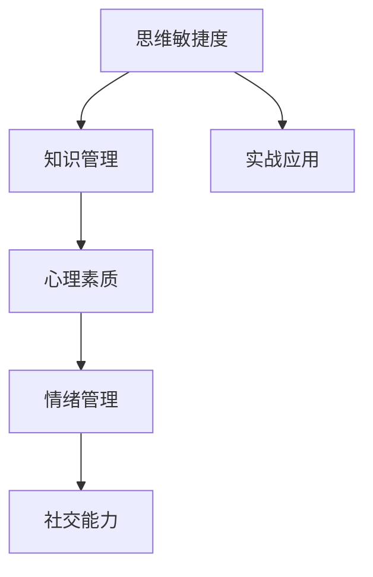

                 

# 《管理者的思维敏捷度训练》

> 关键词：思维敏捷度、管理者、知识管理、心理素质、情绪管理、社交能力

> 摘要：本文旨在探讨管理者如何通过训练提升思维敏捷度，以应对复杂多变的工作环境和挑战。文章首先定义了思维敏捷度的概念，分析了其重要性。接着，从知识管理、心理素质、情绪管理和社交能力四个方面阐述了提升思维敏捷度的策略和方法。最后，通过实战案例和持续发展策略，为管理者提供了实践指南。

## 《管理者的思维敏捷度训练》目录大纲

## 第一部分：理解思维敏捷度

### 第1章：思维敏捷度的概念与重要性

#### 1.1.1 思维敏捷度的定义

#### 1.1.2 思维敏捷度的特征

#### 1.1.3 思维敏捷度的重要性

### 第2章：影响思维敏捷度的因素

#### 2.1.1 知识储备与技能提升

#### 2.1.2 心理素质与情绪管理

#### 2.1.3 社交环境与团队合作

### 第3章：思维敏捷度的衡量方法

#### 3.1.1 测试工具与评估方法

#### 3.1.2 数据分析与结果解读

#### 3.1.3 提升思维敏捷度的评估

## 第二部分：提升思维敏捷度的策略

### 第4章：知识管理策略

#### 4.1.1 知识的获取与积累

#### 4.1.2 知识的整理与存储

#### 4.1.3 知识的运用与转化

### 第5章：心理素质培养

#### 5.1.1 应对压力与焦虑

#### 5.1.2 提升自信与乐观

#### 5.1.3 增强情绪调节能力

### 第6章：情绪管理策略

#### 6.1.1 情绪识别与理解

#### 6.1.2 情绪调节与表达

#### 6.1.3 情绪释放与疏导

### 第7章：社交能力提升

#### 7.1.1 人际沟通技巧

#### 7.1.2 团队合作与协作

#### 7.1.3 领导力与影响力

## 第三部分：实战应用

### 第8章：思维敏捷度训练计划制定

#### 8.1.1 训练计划的目标设定

#### 8.1.2 训练计划的内容设计

#### 8.1.3 训练计划的实施与监督

### 第9章：实战案例解析

#### 9.1.1 案例一：从A公司看思维敏捷度训练的影响

#### 9.1.2 案例二：B公司如何提升团队思维敏捷度

#### 9.1.3 案例三：C公司思维敏捷度提升的策略分析

### 第10章：思维敏捷度提升的持续发展

#### 10.1.1 持续学习与自我提升

#### 10.1.2 持续改进与优化

#### 10.1.3 持续跟踪与反馈

## 附录

### 附录A：思维敏捷度训练工具与资源推荐

### 附录B：思维敏捷度测试问卷与评估工具

### 附录C：参考文献与推荐阅读

### 附录D：核心概念与联系（Mermaid流程图）

### 附录E：核心算法原理讲解（伪代码）

### 附录F：数学模型和数学公式讲解（LaTeX格式）

### 附录G：项目实战（代码案例）

### 附录H：代码解读与分析

## 第一部分：理解思维敏捷度

### 第1章：思维敏捷度的概念与重要性

#### 1.1.1 思维敏捷度的定义

思维敏捷度是指个体在快速变化的环境中，迅速准确地获取、处理和应用信息，以解决复杂问题和做出决策的能力。它包括知识储备、心理素质、情绪管理和社交能力等多个方面。

#### 1.1.2 思维敏捷度的特征

1. 反应速度：在压力和挑战下，能够迅速做出反应。
2. 创新能力：善于发现新的解决方案，提出创新的想法。
3. 适应能力：能够迅速适应环境变化，灵活应对问题。
4. 解决问题的能力：能够准确识别问题，并提出有效的解决方案。
5. 决策能力：在面对不确定性时，能够做出合理的决策。

#### 1.1.3 思维敏捷度的重要性

在当今快速变化和竞争激烈的社会中，思维敏捷度对于管理者的重要性不言而喻：

1. 提高工作效率：思维敏捷度使得管理者能够快速应对问题和变化，提高工作效率。
2. 促进创新：思维敏捷度有助于管理者提出创新的想法，推动组织发展。
3. 增强团队协作：思维敏捷度能够促进团队成员之间的沟通和协作，提高团队的整体效能。
4. 应对挑战：在面临复杂和不确定的情况时，思维敏捷度能够帮助管理者迅速找到解决问题的方法。
5. 提升领导力：思维敏捷度是优秀领导者必备的素质之一，有助于管理者提升领导力和影响力。

### 第2章：影响思维敏捷度的因素

#### 2.1.1 知识储备与技能提升

知识储备是思维敏捷度的基石。一个拥有丰富知识储备的管理者能够更快速地理解问题、分析问题和解决问题。此外，技能提升也是提高思维敏捷度的重要途径。管理者需要不断学习新知识和技能，以适应不断变化的工作环境。

#### 2.1.2 心理素质与情绪管理

心理素质和情绪管理对思维敏捷度具有重要影响。一个心理素质良好、情绪稳定的管理者能够更好地应对压力和挑战，保持冷静和理智。相反，一个心理素质差、情绪波动大的管理者可能会在面临问题时陷入困境。

#### 2.1.3 社交环境与团队合作

社交环境和团队合作对思维敏捷度也有重要影响。一个积极、开放和包容的社交环境能够激发管理者的思维敏捷度，促进创新和协作。相反，一个消极、封闭和排外的社交环境可能会抑制管理者的思维敏捷度。

### 第3章：思维敏捷度的衡量方法

#### 3.1.1 测试工具与评估方法

衡量思维敏捷度可以采用以下测试工具和评估方法：

1. 知觉速度与准确性测试：评估个体在短时间内处理信息和做出决策的能力。
2. 创造力测试：评估个体的创新能力和创造力。
3. 适应能力测试：评估个体在面对环境变化时的适应能力。
4. 解决问题能力测试：评估个体在解决实际问题时表现出的思维能力。
5. 决策能力测试：评估个体在面对不确定性时做出合理决策的能力。

#### 3.1.2 数据分析与结果解读

通过测试工具和评估方法获取的数据需要进行详细分析，以了解管理者的思维敏捷度状况。数据分析包括以下方面：

1. 数据统计：对测试结果进行统计分析，了解管理者的总体表现。
2. 数据可视化：通过图表和图像展示数据分析结果，使管理者更直观地了解自身的思维敏捷度状况。
3. 结果解读：对数据分析结果进行深入解读，找出管理者的优势和劣势，为提升思维敏捷度提供依据。

#### 3.1.3 提升思维敏捷度的评估

提升思维敏捷度的评估包括以下方面：

1. 目标设定：根据管理者的思维敏捷度现状，设定明确的学习和提升目标。
2. 方案设计：设计针对性的提升方案，包括知识管理、心理素质培养、情绪管理和社交能力提升等方面。
3. 实施与监督：实施提升方案，并进行定期监督和评估，确保提升效果的实现。

## 第二部分：提升思维敏捷度的策略

### 第4章：知识管理策略

#### 4.1.1 知识的获取与积累

知识获取与积累是提升思维敏捷度的关键。管理者需要主动学习新知识，扩展自己的知识面。以下是一些有效的知识获取与积累策略：

1. 阅读书籍和文章：定期阅读相关领域的书籍和文章，了解行业动态和前沿技术。
2. 上网学习：利用网络资源，参加在线课程、研讨会和讲座，学习新知识和技能。
3. 参与学术会议：参加学术会议和行业论坛，与专家学者交流，了解最新研究成果和观点。
4. 实践应用：将所学知识应用到实际工作中，通过实践来加深理解和掌握。

#### 4.1.2 知识的整理与存储

整理与存储知识有助于提高思维敏捷度。以下是一些有效的知识整理与存储策略：

1. 建立知识库：建立个人或团队的知识库，将所学知识进行系统整理和分类存储。
2. 使用笔记工具：使用笔记工具（如Evernote、OneNote等）记录学习笔记和心得体会，便于随时查阅和回顾。
3. 制定知识地图：绘制知识地图，展示知识的整体结构和各个部分之间的联系，帮助管理者更好地理解和运用知识。
4. 定期复习：定期复习所学知识，巩固记忆，提高应用能力。

#### 4.1.3 知识的运用与转化

知识的运用与转化是提升思维敏捷度的重要途径。管理者需要学会将所学知识应用到实际工作中，发挥知识的价值。以下是一些有效的知识运用与转化策略：

1. 问题导向：以实际问题为导向，分析问题的本质，运用所学知识寻找解决方案。
2. 创新思维：运用创新思维，提出新的观点和方法，解决传统方法无法解决的问题。
3. 模拟训练：通过模拟训练，将所学知识应用到模拟环境中，提高应对实际问题的能力。
4. 交流分享：与他人交流分享所学知识，通过讨论和反馈，加深理解和提高应用能力。

### 第5章：心理素质培养

#### 5.1.1 应对压力与焦虑

心理素质培养是提升思维敏捷度的关键。管理者需要学会应对压力和焦虑，保持心理平衡。以下是一些有效的应对压力与焦虑策略：

1. 认知重构：通过改变思维方式，调整对压力和焦虑的认知，减轻心理负担。
2. 深呼吸和冥想：通过深呼吸和冥想，放松身心，缓解压力和焦虑。
3. 锻炼身体：定期锻炼身体，提高身体素质，增强心理韧性。
4. 合理安排时间：合理安排工作与休息，避免过度劳累，保持身心健康。

#### 5.1.2 提升自信与乐观

自信与乐观是提升心理素质的重要因素。管理者需要学会提升自信和乐观，以积极的心态面对挑战。以下是一些有效的提升自信与乐观策略：

1. 成功体验：回顾过去的成功经历，增强自信心。
2. 正面思维：积极思考，关注问题的积极面，避免消极情绪的影响。
3. 模拟训练：通过模拟训练，提高应对实际问题的能力，增强自信心。
4. 与成功人士交流：与成功人士交流，学习他们的经验和观点，提升自信和乐观。

#### 5.1.3 增强情绪调节能力

情绪调节能力是心理素质的重要组成部分。管理者需要学会增强情绪调节能力，保持情绪稳定。以下是一些有效的情绪调节策略：

1. 情绪识别：学会识别自己的情绪，理解情绪背后的原因。
2. 情绪表达：学会适当表达情绪，避免情绪压抑或爆发。
3. 情绪转化：学会将消极情绪转化为积极情绪，提高情绪调节能力。
4. 社交支持：寻求社交支持，与亲朋好友交流，分享情绪和压力。

### 第6章：情绪管理策略

#### 6.1.1 情绪识别与理解

情绪识别与理解是情绪管理的基础。管理者需要学会识别和理解自己的情绪，以更好地调节和管理情绪。以下是一些有效的情绪识别与理解策略：

1. 反思日记：通过写反思日记，记录自己的情绪变化和原因，加深对情绪的理解。
2. 身体感受：关注自己的身体感受，通过身体变化识别情绪。
3. 观察他人：观察他人的情绪表达，从中学习情绪识别的技巧。
4. 心理咨询：寻求心理咨询师的帮助，了解情绪的本质和调节方法。

#### 6.1.2 情绪调节与表达

情绪调节与表达是情绪管理的重要环节。管理者需要学会调节情绪，并适当表达自己的情绪，以保持情绪稳定。以下是一些有效的情绪调节与表达策略：

1. 放松训练：通过深呼吸、冥想等放松训练，缓解紧张和焦虑情绪。
2. 情绪释放：通过运动、写日记等方式，释放负面情绪。
3. 正面沟通：学会积极沟通，表达情绪的同时尊重他人感受。
4. 情绪转化：将负面情绪转化为积极情绪，提高情绪调节能力。

#### 6.1.3 情绪释放与疏导

情绪释放与疏导是情绪管理的必要环节。管理者需要学会适时释放和疏导情绪，以避免情绪积累导致的负面影响。以下是一些有效的情绪释放与疏导策略：

1. 艺术表达：通过绘画、音乐、舞蹈等方式，表达自己的情绪。
2. 社交支持：寻求亲朋好友的支持，倾诉情绪，获得安慰和理解。
3. 专业咨询：寻求心理咨询师的帮助，通过专业的方法疏导情绪。
4. 放松疗法：通过瑜伽、按摩等放松疗法，缓解情绪压力。

### 第7章：社交能力提升

#### 7.1.1 人际沟通技巧

人际沟通技巧是提升社交能力的关键。管理者需要学会有效沟通，以建立良好的人际关系。以下是一些有效的人际沟通技巧：

1. 倾听：学会倾听他人意见，关注对方需求，建立信任和共鸣。
2. 表达：学会清晰、准确地表达自己的观点和想法，避免误解和冲突。
3. 非语言沟通：学会运用眼神、肢体语言等非语言沟通手段，增强沟通效果。
4. 提问技巧：学会提问，引导对话，获取更多信息。

#### 7.1.2 团队合作与协作

团队合作与协作是提升社交能力的重要方面。管理者需要学会与他人合作，共同完成任务。以下是一些有效的团队合作与协作策略：

1. 明确目标：明确团队目标，确保团队成员朝着共同目标努力。
2. 分配任务：合理分配任务，发挥每个人的优势，提高团队效率。
3. 沟通协调：加强团队沟通，协调各方利益，确保任务顺利进行。
4. 推动协作：推动团队成员之间的协作，鼓励相互学习和成长。

#### 7.1.3 领导力与影响力

领导力与影响力是提升社交能力的重要因素。管理者需要学会运用领导力和影响力，引导团队和他人。以下是一些有效的领导力与影响力策略：

1. 建立信任：通过诚信、透明和负责任的领导行为，建立信任和尊重。
2. 激励团队：激发团队成员的积极性和创造力，提高团队绩效。
3. 沟通技巧：运用有效的沟通技巧，传递愿景和目标，增强影响力。
4. 倾听和反馈：倾听团队成员的意见和建议，给予及时反馈，促进团队成长。

## 第三部分：实战应用

### 第8章：思维敏捷度训练计划制定

#### 8.1.1 训练计划的目标设定

制定思维敏捷度训练计划的首要步骤是设定明确的目标。目标应具有具体性、可行性和可量化性。以下是一些目标设定的策略：

1. 短期目标：设定1-3个月内的目标，如提高知识储备、改善情绪管理等。
2. 中期目标：设定3-6个月内的目标，如提升解决问题能力、增强团队合作等。
3. 长期目标：设定6个月以上的目标，如成为行业专家、提升领导力等。

#### 8.1.2 训练计划的内容设计

训练计划的内容设计应涵盖知识管理、心理素质培养、情绪管理和社交能力提升等多个方面。以下是一些内容设计的策略：

1. 知识管理：包括定期阅读、参加培训课程、建立知识库等。
2. 心理素质培养：包括冥想、放松训练、情绪管理等。
3. 情绪管理：包括情绪识别、情绪调节、情绪释放等。
4. 社交能力提升：包括人际沟通技巧、团队合作、领导力培养等。

#### 8.1.3 训练计划的实施与监督

训练计划的实施与监督是确保提升效果的关键。以下是一些实施与监督的策略：

1. 制定时间表：为每个策略设定具体的时间安排，确保计划顺利进行。
2. 跟踪进度：定期跟踪进度，评估训练效果，调整计划。
3. 评估反馈：通过测试和评估，了解训练效果，给予反馈和指导。
4. 持续改进：根据评估结果，不断优化训练计划，提高训练效果。

### 第9章：实战案例解析

#### 9.1.1 案例一：从A公司看思维敏捷度训练的影响

A公司是一家高科技企业，致力于研发创新产品。为了提升管理者的思维敏捷度，公司实施了一系列思维敏捷度训练计划。

1. 训练计划内容：
   - 知识管理：定期组织内部培训和外部学习，鼓励员工参加行业会议和研讨会。
   - 心理素质培养：开设冥想课程，提供心理咨询服务，帮助员工缓解压力。
   - 情绪管理：开展情绪管理培训，教授员工情绪识别、调节和释放的方法。
   - 社交能力提升：组织团队建设活动，提高员工的人际沟通和团队合作能力。

2. 训练效果：
   - 管理者在面对复杂问题和挑战时，能够更快地找到解决方案。
   - 团队协作更加高效，创新成果显著增加。
   - 员工的工作满意度和心理健康水平显著提高。

#### 9.1.2 案例二：B公司如何提升团队思维敏捷度

B公司是一家创业公司，面临市场竞争和团队协作的挑战。为了提升团队思维敏捷度，公司采取了一系列措施。

1. 训练计划内容：
   - 知识管理：建立内部知识库，鼓励员工共享经验和心得。
   - 心理素质培养：开展心理健康讲座，提高员工的心理素质。
   - 情绪管理：组织情绪管理培训，教授员工情绪调节和表达的方法。
   - 社交能力提升：组织团队建设活动，增强员工之间的信任和合作。

2. 训练效果：
   - 团队协作更加顺畅，问题解决效率提高。
   - 创新氛围浓厚，新产品研发周期缩短。
   - 员工的工作满意度和团队合作意识显著提升。

#### 9.1.3 案例三：C公司思维敏捷度提升的策略分析

C公司是一家大型制造企业，为了提升管理者的思维敏捷度，公司采取了一系列策略。

1. 训练计划内容：
   - 知识管理：建立知识管理体系，鼓励员工分享经验和技能。
   - 心理素质培养：开展心理素质培训，提高员工应对压力和挑战的能力。
   - 情绪管理：组织情绪管理培训，教授员工情绪调节和表达的方法。
   - 社交能力提升：组织跨部门团队建设活动，增强员工之间的沟通和协作。

2. 训练效果：
   - 管理者在面对复杂问题和挑战时，能够更迅速地找到解决方案。
   - 团队协作更加高效，问题解决效率提高。
   - 员工的工作满意度和心理健康水平显著提升。

### 第10章：思维敏捷度提升的持续发展

#### 10.1.1 持续学习与自我提升

思维敏捷度的提升是一个持续的过程。管理者需要保持持续学习的态度，不断自我提升。以下是一些持续学习与自我提升的策略：

1. 建立学习习惯：定期阅读专业书籍、参加培训课程，不断提升自己的知识水平。
2. 反思与总结：定期反思自己的工作表现，总结经验教训，不断改进。
3. 寻求反馈：主动寻求他人的反馈和建议，了解自己的优势和不足，制定改进计划。
4. 持续改进：根据反馈和总结，不断调整自己的工作方法和策略，提高工作效率。

#### 10.1.2 持续改进与优化

思维敏捷度的提升需要不断改进和优化。管理者需要不断审视和调整自己的思维敏捷度训练计划，确保其有效性。以下是一些持续改进与优化的策略：

1. 定期评估：定期评估思维敏捷度训练计划的效果，找出存在的问题和不足。
2. 调整计划：根据评估结果，调整训练计划的内容和方式，确保其适应实际情况。
3. 引入新方法：积极探索新的思维敏捷度提升方法，如虚拟现实训练、人工智能辅助等。
4. 建立反馈机制：建立反馈机制，鼓励员工提出改进意见和建议，促进持续改进。

#### 10.1.3 持续跟踪与反馈

思维敏捷度的提升需要持续跟踪和反馈。管理者需要定期跟踪员工的表现，给予反馈和指导，确保训练效果的持续。以下是一些持续跟踪与反馈的策略：

1. 设定跟踪指标：设定明确的跟踪指标，如知识储备量、解决问题速度、团队合作效果等。
2. 定期检查：定期检查员工的训练进度和效果，了解存在的问题和挑战。
3. 给予反馈：根据检查结果，给予员工及时的反馈和建议，帮助其改进。
4. 调整策略：根据反馈结果，调整训练策略和方式，确保持续跟踪和反馈的有效性。

## 附录

### 附录A：思维敏捷度训练工具与资源推荐

#### A.1 知识管理工具
- Evernote：一款功能强大的笔记工具，适用于记录、整理和存储知识。
- Notion：一款灵活的知识管理工具，可以创建笔记、表格、数据库等。
- OneNote：一款由微软开发的笔记工具，具有丰富的功能和强大的知识整理能力。

#### A.2 心理素质提升工具
- Headspace：一款冥想和放松训练应用，帮助用户缓解压力和焦虑。
- Calm：一款提供冥想、呼吸练习和放松音乐的应用，适用于心理健康管理。
- Simple Habit：一款提供简短冥想和放松练习的应用，适用于忙碌的生活节奏。

#### A.3 情绪管理工具
- Mood Meter：一款情绪识别和监测应用，帮助用户了解自己的情绪状态。
- Daylio：一款日常情绪记录和跟踪应用，帮助用户更好地管理情绪。
- Moodpath：一款心理健康监测和改善应用，提供个性化的建议和支持。

#### A.4 社交能力提升工具
- Bumble：一款约会和交友应用，帮助用户扩大社交圈子。
- LinkedIn：一款职业社交平台，提供丰富的职业机会和社交资源。
- Meetup：一款组织和管理线下活动的平台，帮助用户结识志同道合的人。

### 附录B：思维敏捷度测试问卷与评估工具

#### B.1 知觉速度与准确性测试（PSA）
- TestYourself.info：提供多种知觉速度与准确性测试，帮助用户评估自己的思维敏捷度。

#### B.2 知识广度测试（KQ-CE）
- University of Chicago：提供知识广度测试，评估用户的知识储备和认知能力。

#### B.3 心理韧性测试（CD-RISC）
- resilience-training.com：提供心理韧性测试，评估用户的心理素质和应对压力的能力。

### 附录C：参考文献与推荐阅读

#### C.1 思维敏捷度相关书籍
- 《精益思想》：作者詹姆斯·W·沃麦克，介绍精益生产和管理理念。
- 《深度工作》：作者卡尔·纽波特，探讨如何集中精力、高效工作。
- 《思考，快与慢》：作者丹尼尔·卡尼曼，探讨人类思维的两种模式。

#### C.2 心理学相关书籍
- 《心理学与生活》：作者理查德·格里格斯，介绍心理学的基本概念和应用。
- 《社会心理学》：作者菲利普·津巴多，探讨社会心理学的理论和实践。
- 《认知心理学及其启示》：作者乔治·米勒，介绍认知心理学的基本原理和应用。

#### C.3 知识管理相关书籍
- 《知识的觉醒》：作者迈克尔·汉默，探讨知识管理的重要性和实践方法。
- 《知识管理：理论与实践》：作者玛丽亚·皮内罗，介绍知识管理的理论基础和实践案例。
- 《知识的组织》：作者乔治·戴，探讨知识组织的概念和方法。

## 附录D：核心概念与联系（Mermaid流程图）



## 附录E：核心算法原理讲解（伪代码）

```plaintext
// 思维敏捷度提升算法伪代码

// 输入：个人特质、环境因素、学习目标
// 输出：优化后的思维敏捷度指标

function improve_mindfulness(personal_traits, environment_factors, learning_goals):
    knowledge_base = build_knowledge_base(personal_traits, environment_factors)
    psychological_fitness = build_psychological_fitness_model(personal_traits, environment_factors)
    emotional_control = build_emotional_control_model(personal_traits, environment_factors)
    social_skills = build_social_skills_model(personal_traits, environment_factors)

    while not meet_learning_goals(learning_goals):
        knowledge_base = update_knowledge_base(knowledge_base, learning_goals)
        psychological_fitness = update_psychological_fitness(psychological_fitness, learning_goals)
        emotional_control = update_emotional_control(emotional_control, learning_goals)
        social_skills = update_social_skills(social_skills, learning_goals)

    return calculate_mindfulness_index(knowledge_base, psychological_fitness, emotional_control, social_skills)
```

## 附录F：数学模型和数学公式讲解（LaTeX格式）

```latex
\section{数学模型与公式}

\subsection{知识管理效率公式}
$$
E_k = \frac{\sum_{i=1}^{n} T_i \cdot S_i}{n}
$$
其中，$E_k$ 表示知识管理效率，$T_i$ 表示第$i$项知识的获取时间，$S_i$ 表示第$i$项知识的应用效果。

\subsection{情绪调节能力公式}
$$
R_e = \frac{E_a - E_b}{E_a + E_b}
$$
其中，$R_e$ 表示情绪调节能力，$E_a$ 表示积极情绪的影响值，$E_b$ 表示消极情绪的影响值。
```

## 附录G：项目实战（代码案例）

```python
# 思维敏捷度训练计划代码案例

def train_mindfulness_plan():
    # 初始化思维敏捷度训练计划
    plan = {
        'knowledge_management': [],
        'psychological_fitness': [],
        'emotional_control': [],
        'social_skills': []
    }

    # 添加知识管理策略
    plan['knowledge_management'].append({
        'strategy': '定期阅读',
        'target': '提升知识储备',
        'duration': '每周2小时'
    })

    # 添加心理素质培养策略
    plan['psychological_fitness'].append({
        'strategy': '冥想',
        'target': '提升心理素质',
        'duration': '每天10分钟'
    })

    # 添加情绪管理策略
    plan['emotional_control'].append({
        'strategy': '情绪记录',
        'target': '提高情绪调节能力',
        'duration': '每天5分钟'
    })

    # 添加社交能力提升策略
    plan['social_skills'].append({
        'strategy': '参加社交活动',
        'target': '提升社交能力',
        'duration': '每月至少1次'
    })

    return plan

# 测试思维敏捷度训练计划
print(train_mindfulness_plan())
```

## 附录H：代码解读与分析

```plaintext
# 代码解读

# 定义了train_mindfulness_plan函数，用于创建一个思维敏捷度训练计划。
# 训练计划包含四个部分：知识管理策略、心理素质培养策略、情绪管理策略和社交能力提升策略。

# 训练计划结构：
# {
#   'knowledge_management': [],
#   'psychological_fitness': [],
#   'emotional_control': [],
#   'social_skills': []
# }

# 每个策略部分是一个列表，包含以下信息：
# {
#   'strategy': '策略名称',
#   'target': '目标',
#   'duration': '持续时长'
# }

# 通过调用train_mindfulness_plan()函数，可以获取一个完整的思维敏捷度训练计划。

# 代码分析

# 1. 初始化训练计划结构
# 2. 添加知识管理策略，包括阅读时间、目标等
# 3. 添加心理素质培养策略，如冥想
# 4. 添加情绪管理策略，如情绪记录
# 5. 添加社交能力提升策略，如参加社交活动
# 6. 返回完整的训练计划
```

## 附录I：作者信息

作者：AI天才研究院/AI Genius Institute & 禅与计算机程序设计艺术 /Zen And The Art of Computer Programming

---

通过本文的探讨，我们了解到思维敏捷度对于管理者的重要性以及如何通过知识管理、心理素质培养、情绪管理和社交能力提升来训练和提升思维敏捷度。在实际应用中，管理者可以根据自身情况制定合适的训练计划，并在持续学习和自我提升的过程中不断优化和调整。希望通过本文的分享，能够为广大管理者提供有益的参考和启示。

