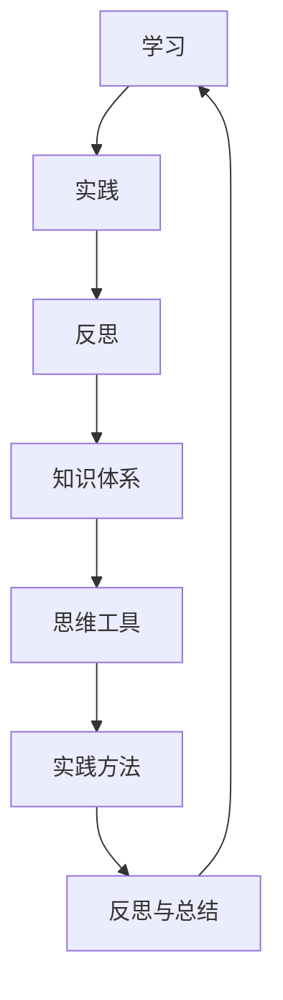

                 

### 文章标题：管理者的认知升级之路

#### 关键词：认知升级、管理者、决策能力、团队领导力、实践方法

> **摘要**：本文旨在探讨管理者的认知升级之路，通过分析当前市场环境的变化、认知升级的重要性以及关键要素，提出一系列认知升级的方法与实践，旨在帮助管理者在复杂环境中提升决策能力、增强团队领导力，最终实现企业持续发展。

### 第一部分：管理者的认知升级之路概述

在当今快速变化的市场环境中，管理者面临的挑战日益增加。为了应对这些挑战，管理者必须不断提升自己的认知水平，实现认知升级。本文将从以下几个方面探讨管理者的认知升级之路：

1. **认知升级的重要性**：阐述认知升级对管理者决策能力、团队领导力的影响。
2. **认知升级的关键要素**：介绍知识更新、思维模式和实践能力在认知升级中的作用。
3. **认知升级的方法与实践**：探讨管理者如何通过持续学习、团队协作和实践案例进行认知升级。

### 第一部分：认知升级的重要性

#### 1.1.1 管理者面临的认知挑战

在快速变化的市场环境中，管理者面临着前所未有的认知挑战。这些挑战主要体现在以下几个方面：

##### 1.1.1.1 快速变化的市场环境

随着全球化和信息技术的飞速发展，市场环境发生了巨大的变化。行业竞争加剧、客户需求多样化、技术更新迭代速度加快，这些都要求管理者具备快速适应和应对市场变化的能力。

##### 1.1.1.2 市场多样化的需求

客户需求的多样化使得管理者需要具备更广泛的知识和技能，以满足不同客户群体的需求。同时，这也在一定程度上增加了管理的复杂性。

###### 1.1.1.2.1 客户需求的多样性

客户需求的多样性使得管理者需要深入了解客户需求，提供个性化的解决方案。

###### 1.1.1.2.2 行业竞争的加剧

行业竞争的加剧使得管理者需要在短时间内做出正确的决策，以保持企业的竞争优势。

### 1.1.2 认知升级对管理者的影响

认知升级对管理者的影响至关重要，主要体现在以下几个方面：

#### 1.1.2.1 提高决策能力

通过认知升级，管理者可以掌握更多前沿知识和创新思维方法，从而在复杂环境中做出更为准确和有效的决策。

##### 1.1.2.1.1 数据驱动的决策

数据驱动的决策方法可以帮助管理者更客观、更准确地分析问题，提高决策的科学性和有效性。

##### 1.1.2.1.2 快速适应市场变化

认知升级使管理者能够更快速地适应市场变化，抓住机遇，降低风险。

#### 1.1.2.2 增强团队领导力

认知升级可以提升管理者的领导力，使其在团队管理中更加高效和有力。

##### 1.1.2.2.1 更新管理理念

通过认知升级，管理者可以更新自己的管理理念，采用更加科学、高效的管理方法。

##### 1.1.2.2.2 提升沟通与协作能力

认知升级提升管理者的沟通与协作能力，增强团队的凝聚力，提高团队的整体执行力。

### 1.2 认知升级的关键要素

认知升级是一个复杂的过程，涉及多个关键要素。以下是几个关键的要素：

#### 1.2.1 知识更新

知识更新是认知升级的基础。管理者需要不断学习新的知识和技能，以适应快速变化的市场环境。

##### 1.2.1.1 行业前沿知识

管理者需要关注行业前沿知识，掌握最新的技术趋势和市场动态。

##### 1.2.1.2 政策法规

了解相关政策和法规，确保企业在运营过程中符合法规要求，降低法律风险。

#### 1.2.2 思维模式

思维模式是认知升级的核心。管理者需要培养创新思维和系统性思维，以提高问题的分析和解决能力。

##### 1.2.2.1 创新思维

创新思维使管理者能够从不同角度思考问题，提出新的解决方案。

##### 1.2.2.2 系统性思维

系统性思维使管理者能够从整体和长远的角度看待问题，提高决策的宏观视野。

#### 1.2.3 实践能力

实践能力是认知升级的结果。管理者需要将所学知识应用于实际工作中，通过实践不断提升自己的能力。

##### 1.2.3.1 案例分析

通过分析成功和失败的案例，管理者可以总结经验教训，提高自己的实践能力。

##### 1.2.3.2 失败案例

失败案例可以为管理者提供宝贵的教训，避免重复相同的错误。

### 1.3 认知升级的方法与实践

认知升级需要管理者采取一系列的方法与实践，以下是几个关键的方法：

#### 1.3.1 持续学习

持续学习是认知升级的重要途径。管理者需要树立终身学习的理念，不断充实自己的知识体系。

##### 1.3.1.1 专业培训

参加专业培训课程，系统学习相关领域的知识。

##### 1.3.1.2 自我学习

通过阅读专业书籍、在线课程等途径，进行自我学习，提升自己的专业素养。

#### 1.3.2 团队协作

团队协作是认知升级的重要手段。管理者需要搭建学习型组织，鼓励团队成员共同进步。

##### 1.3.2.1 建立学习型组织

通过组织学习会议、知识共享平台等方式，建立学习型组织。

##### 1.3.2.2 跨部门协作

促进跨部门协作，提高团队整体的学习能力和创新能力。

#### 1.3.3 实践案例

通过实践案例，管理者可以将所学知识应用于实际工作中，提高自己的实践能力。

##### 1.3.3.1 成功案例

通过成功案例，管理者可以总结经验，为后续的工作提供指导。

##### 1.3.3.2 失败案例

通过失败案例，管理者可以反思失败的原因，吸取教训，避免重复错误。

### 1.4 认知升级的案例分析

#### 1.4.1 企业案例

**案例一：某高科技企业如何进行认知升级**

某高科技企业通过以下措施进行认知升级：

1. **管理者培训**：定期组织管理者参加专业培训，提升管理者的专业素养。
2. **内部知识共享**：建立内部知识共享平台，促进员工之间的知识交流。
3. **跨部门协作**：鼓励跨部门协作，提高团队整体的学习能力和创新能力。

**案例二：某传统企业如何实现认知升级**

某传统企业通过以下措施实现认知升级：

1. **技术革新**：引入新技术，提升企业的技术水平和创新能力。
2. **管理理念更新**：更新管理理念，采用更加科学、高效的管理方法。
3. **员工培训**：定期组织员工培训，提升员工的专业技能和综合素质。

### 1.4.2 个人案例

**案例一：某企业高管如何进行个人认知升级**

某企业高管通过以下方式实现个人认知升级：

1. **自我学习**：通过阅读专业书籍、在线课程等途径，不断提升自己的专业素养。
2. **实践锻炼**：将所学知识应用于实际工作中，通过实践不断提升自己的能力。
3. **反思总结**：定期反思自己的工作，总结经验教训，为后续的工作提供指导。

**案例二：某创业者如何进行个人认知升级**

某创业者通过以下方式实现个人认知升级：

1. **市场调研**：深入了解市场需求和竞争态势，为创业项目提供指导。
2. **技术学习**：学习相关技术，提升自己的技术水平和创新能力。
3. **团队建设**：培养和组建高效的团队，提升团队整体的学习能力和创新能力。

### 第二部分：核心概念与联系

#### 2.1 认知升级的定义与意义

**认知升级** 是指通过学习、实践和反思，不断更新和提升个人的知识结构、思维方式、决策能力等，从而在复杂环境中更好地适应和发展。

##### 2.1.1 认知升级的内涵

- **知识结构**：包括专业知识和跨学科知识。
- **思维方式**：包括创新思维、系统性思维等。
- **决策能力**：提高在复杂环境中的决策质量和效率。

##### 2.1.2 认知升级的意义

- **提高决策能力**：使管理者在面对复杂问题时能够快速做出正确的决策。
- **增强团队领导力**：提升管理者的领导能力和团队凝聚力。
- **促进企业持续发展**：使企业在市场中保持竞争优势，实现可持续发展。

#### 2.2 认知升级的层次

**认知升级** 可以分为三个层次：

##### 2.2.1 知识更新

- **基础层次**：通过学习新的知识和技能，更新和扩展自己的知识体系。

##### 2.2.2 思维模式

- **核心层次**：培养创新思维和系统性思维，提高分析问题和解决问题的能力。

##### 2.2.3 实践能力

- **最高层次**：将所学知识和思维方式应用于实际工作中，通过实践不断提升自己的能力。

#### 2.3 认知升级的原理与架构

**认知升级** 的原理可以概括为以下三个步骤：

##### 2.3.1 学习

- 通过阅读、培训、交流等方式，获取新的知识和技能。

##### 2.3.2 实践

- 将所学知识和技能应用于实际工作中，通过实践验证和提升自己的能力。

##### 2.3.3 反思

- 对自己的实践进行反思，总结经验教训，不断提升自己的认知水平。

认知升级的架构包括以下几个部分：

1. **知识体系**：建立全面的知识体系，包括专业知识、跨学科知识等。
2. **思维工具**：掌握各种思维工具，如思维导图、SWOT分析等。
3. **实践方法**：运用实践方法，如项目管理、团队建设等。
4. **反思与总结**：不断反思和总结，提升自己的认知水平。

### 2.4 认知升级的 Mermaid 流程图



### 2.5 认知升级的关联性

**认知升级** 与多个方面密切相关：

##### 2.5.1 认知升级与决策能力

- 认知升级可以提高管理者的决策能力，使其在面对复杂问题时能够快速做出正确的决策。

##### 2.5.2 认知升级与团队领导力

- 认知升级可以增强管理者的团队领导力，提升团队协作效率。

##### 2.5.3 认知升级与企业竞争力

- 认知升级可以提升企业的整体竞争力，使企业在市场中立于不败之地。

##### 2.5.4 认知升级与企业可持续发展

- 认知升级可以促进企业实现可持续发展，实现长期稳定的发展。

### 第三部分：核心算法原理讲解

#### 3.1 数据分析算法

**数据分析算法** 是认知升级的重要工具，可以帮助管理者从数据中提取有价值的信息，为决策提供支持。以下介绍几种常见的数据分析算法。

##### 3.1.1 描述性统计分析

描述性统计分析是对数据进行汇总和描述的方法，常用的指标包括平均数、中位数、标准差等。

- **平均数**：
  $$
  \bar{x} = \frac{\sum_{i=1}^{n} x_i}{n}
  $$
- **中位数**：
  $$
  \text{Median} = \left(\frac{n+1}{2}\right)^{th} \text{term}
  $$
- **标准差**：
  $$
  \sigma = \sqrt{\frac{\sum_{i=1}^{n} (x_i - \bar{x})^2}{n-1}}
  $$

##### 3.1.2 探测性数据分析

探测性数据分析旨在发现数据中的模式和异常值，常用的方法包括聚类分析和散点图等。

- **聚类分析**：
  - **K均值算法**：将数据分为K个簇，使每个簇内的数据点距离簇中心最近。
  - **层次聚类**：基于层次结构对数据进行分类。

##### 3.1.3 预测性数据分析

预测性数据分析旨在预测未来的趋势和变化，常用的方法包括时间序列分析和回归分析等。

- **时间序列分析**：用于分析时间序列数据，预测未来的趋势。

- **回归分析**：
  - **线性回归**：
    $$
    y = \beta_0 + \beta_1x + \epsilon
    $$
  - **逻辑回归**：用于处理分类问题。

#### 3.2 机器学习算法

**机器学习算法** 是认知升级的重要工具，可以帮助管理者从数据中自动学习和发现规律，为决策提供支持。

##### 3.2.1 监督学习

监督学习是机器学习中的一种方法，通过已有数据的学习，对未知数据进行预测。

- **线性回归**：
  $$
  y = \beta_0 + \beta_1x
  $$
- **逻辑回归**：

  $$
  \log\frac{P(y=1)}{1-P(y=1)} = \beta_0 + \beta_1x
  $$

##### 3.2.2 无监督学习

无监督学习是机器学习中的另一种方法，通过未标记的数据进行学习。

- **主成分分析（PCA）**：用于降维，提取数据的主要特征。
- **K-近邻算法（KNN）**：基于距离最近的样本进行分类。

##### 3.2.3 深度学习算法

深度学习算法是机器学习的一种重要分支，通过构建复杂的神经网络进行学习。

- **神经网络**：由多层神经元组成，用于处理复杂数据。
- **卷积神经网络（CNN）**：用于图像和视频数据的处理。
- **递归神经网络（RNN）**：用于序列数据的处理。

#### 3.3 深度学习算法原理

**深度学习算法** 是一种基于多层神经网络的机器学习方法，通过多层次的变换和特征提取，实现对复杂数据的高效表示和建模。

##### 3.3.1 前向传播

前向传播是深度学习算法中的第一步，用于计算输入和输出之间的映射关系。

- **激活函数**：用于引入非线性，常用的激活函数包括ReLU、Sigmoid、Tanh等。
- **反向传播**：用于计算误差，并更新网络参数。

##### 3.3.2 反向传播算法

反向传播算法是一种用于训练深度学习模型的优化方法，通过计算梯度来更新网络参数。

- **梯度计算**：用于计算损失函数对网络参数的梯度。
- **参数更新**：通过梯度下降等方法，更新网络参数。

#### 3.4 强化学习算法

**强化学习算法** 是一种基于奖励和惩罚进行决策的方法，通过学习最优策略，实现长期目标的最优化。

- **Q-Learning**：通过学习值函数，选择最优动作。
- **Policy-Based Learning**：通过学习策略函数，直接选择最优动作。

##### 3.4.1 Q-Learning算法

Q-Learning算法是一种基于值函数的强化学习算法，通过更新Q值来选择动作。

- **Q表**：用于存储每个状态和动作的Q值。
- **更新公式**：
  $$
  Q(s, a) \leftarrow Q(s, a) + \alpha [R + \gamma \max_{a'} Q(s', a') - Q(s, a)]
  $$

##### 3.4.2 Policy-Based Learning算法

Policy-Based Learning算法是一种基于策略的强化学习算法，通过学习策略函数来选择动作。

- **策略函数**：用于表示最优动作的概率分布。
- **策略优化**：通过梯度下降等方法，优化策略函数。

#### 3.5 深度学习框架

**深度学习框架** 是用于构建和训练深度学习模型的软件工具，常见的深度学习框架包括TensorFlow、PyTorch等。

##### 3.5.1 TensorFlow

TensorFlow是一种开源的深度学习框架，提供丰富的API和工具，用于构建和训练深度学习模型。

- **模型构建**：使用TensorFlow的Keras API构建模型。
- **模型训练**：使用TensorFlow的优化器和损失函数训练模型。

##### 3.5.2 PyTorch

PyTorch是一种开源的深度学习框架，提供动态计算图和灵活的API，用于构建和训练深度学习模型。

- **模型构建**：使用PyTorch的nn.Module构建模型。
- **模型训练**：使用PyTorch的优化器和损失函数训练模型。

#### 3.6 算法评估与优化

**算法评估与优化** 是深度学习模型训练的重要步骤，用于评估模型性能并调整模型参数。

- **评估指标**：常用的评估指标包括准确率、损失函数、精度等。
- **优化策略**：常用的优化策略包括梯度下降、Adam等。

#### 3.7 代码实际案例

以下是一个使用PyTorch实现线性回归模型的实际案例。

##### 3.7.1 数据预处理

```python
import torch
import torch.nn as nn
import torch.optim as optim

# 创建数据集
x = torch.Tensor([1, 2, 3, 4, 5])
y = torch.Tensor([2, 4, 6, 8, 10])

# 数据集分割
train_size = int(0.8 * len(x))
test_size = len(x) - train_size

x_train, x_test = x[:train_size], x[train_size:]
y_train, y_test = y[:train_size], y[train_size:]
```

##### 3.7.2 模型训练

```python
# 定义模型
model = nn.Linear(1, 1)

# 定义损失函数和优化器
criterion = nn.MSELoss()
optimizer = optim.SGD(model.parameters(), lr=0.01)

# 训练模型
for epoch in range(100):
    model.zero_grad()
    output = model(x_train)
    loss = criterion(output, y_train)
    loss.backward()
    optimizer.step()

    if (epoch + 1) % 10 == 0:
        print(f'Epoch [{epoch + 1}/{100}], Loss: {loss.item():.4f}')
```

##### 3.7.3 模型评估

```python
# 评估模型
model.eval()
with torch.no_grad():
    output = model(x_test)
    loss = criterion(output, y_test)
    print(f'Test Loss: {loss.item():.4f}')
```

##### 3.7.4 代码解读与分析

- **数据预处理**：创建数据集，并进行数据集分割。
- **模型训练**：定义模型、损失函数和优化器，并训练模型。
- **模型评估**：评估模型在测试集上的性能。

### 3.8 总结

通过本部分的讲解，管理者可以全面了解认知升级的相关算法原理，包括数据分析算法、机器学习算法、深度学习算法和强化学习算法。这些算法和代码对于管理者在实际工作中提升决策能力、团队领导力和实践能力具有重要意义。管理者应不断学习、实践和反思，不断提升自己的认知水平，成为优秀的管理者。

#### 3.8.1 学习与实践的重要性

- **学习与实践** 是认知升级的核心。通过学习，管理者可以不断更新知识体系；通过实践，管理者可以将所学知识应用于实际工作中，提升自己的能力。

#### 3.8.2 管理者应具备的技能

- **数据分析能力**：能够从数据中提取有价值的信息，为决策提供支持。
- **机器学习知识**：掌握常见的机器学习算法，应用于实际业务场景。
- **深度学习技能**：了解深度学习的基本原理，能够搭建和优化神经网络。
- **强化学习技巧**：掌握强化学习算法，应用于策略优化和决策制定。

#### 3.8.3 总结

通过本部分的学习，管理者可以全面了解认知升级的相关算法原理，并掌握实际应用技巧。这些知识和技能将为管理者在复杂环境中做出正确决策、提升团队领导力、推动企业持续发展提供有力支持。管理者应不断学习、实践和反思，不断提升自己的认知水平，成为优秀的管理者。

### 第四部分：数学模型和数学公式

#### 4.1 线性回归模型

线性回归模型是一种常见的预测模型，用于分析自变量和因变量之间的线性关系。

##### 4.1.1 模型表示

线性回归模型可以表示为：

$$
y = \beta_0 + \beta_1x + \epsilon
$$

其中，$y$ 为因变量，$x$ 为自变量，$\beta_0$ 和 $\beta_1$ 分别为模型的参数，$\epsilon$ 为误差项。

##### 4.1.2 参数估计

线性回归模型的参数可以通过最小二乘法（Ordinary Least Squares, OLS）来估计，具体公式如下：

$$
\beta_0 = \bar{y} - \beta_1\bar{x}
$$

$$
\beta_1 = \frac{\sum_{i=1}^{n}(x_i - \bar{x})(y_i - \bar{y})}{\sum_{i=1}^{n}(x_i - \bar{x})^2}
$$

其中，$n$ 为样本数量，$\bar{x}$ 和 $\bar{y}$ 分别为自变量和因变量的样本均值。

##### 4.1.3 模型评估

线性回归模型的评估指标主要包括：

- **均方误差（Mean Squared Error, MSE）**：

$$
MSE = \frac{1}{n}\sum_{i=1}^{n}(y_i - \hat{y}_i)^2
$$

- **均方根误差（Root Mean Squared Error, RMSE）**：

$$
RMSE = \sqrt{MSE}
$$

- **决定系数（Coefficient of Determination, R^2）**：

$$
R^2 = 1 - \frac{\sum_{i=1}^{n}(y_i - \hat{y}_i)^2}{\sum_{i=1}^{n}(y_i - \bar{y})^2}
$$

#### 4.2 逻辑回归模型

逻辑回归模型是一种用于处理分类问题的预测模型，通过线性模型实现概率估计。

##### 4.2.1 模型表示

逻辑回归模型可以表示为：

$$
\log\frac{P(y=1)}{1-P(y=1)} = \beta_0 + \beta_1x
$$

其中，$y$ 为因变量，$x$ 为自变量，$\beta_0$ 和 $\beta_1$ 分别为模型的参数。

##### 4.2.2 参数估计

逻辑回归模型的参数可以通过极大似然估计（Maximum Likelihood Estimation, MLE）来估计，具体公式如下：

$$
\beta_0 = \bar{y} - \beta_1\bar{x}
$$

$$
\beta_1 = \frac{\sum_{i=1}^{n}(y_i - \hat{y}_i)x_i}{\sum_{i=1}^{n}(x_i - \bar{x})^2}
$$

其中，$\hat{y}_i$ 为预测的概率值。

##### 4.2.3 模型评估

逻辑回归模型的评估指标主要包括：

- **准确率（Accuracy）**：

$$
Accuracy = \frac{\sum_{i=1}^{n} \hat{y}_i}{n}
$$

- **精确率（Precision）**：

$$
Precision = \frac{\sum_{i=1}^{n} \hat{y}_i \land y_i}{\sum_{i=1}^{n} \hat{y}_i}
$$

- **召回率（Recall）**：

$$
Recall = \frac{\sum_{i=1}^{n} \hat{y}_i \land y_i}{\sum_{i=1}^{n} y_i}
$$

- **F1 分数（F1 Score）**：

$$
F1 Score = 2 \cdot \frac{Precision \cdot Recall}{Precision + Recall}
$$

#### 4.3 K-近邻模型

K-近邻模型是一种基于实例的学习算法，通过计算测试样本与训练样本之间的距离来预测类别。

##### 4.3.1 模型表示

K-近邻模型可以表示为：

$$
\hat{y} = \arg\max_{y \in C}\sum_{i=1}^{k} I(d(x_i, x) \leq r)
$$

其中，$x$ 为测试样本，$x_i$ 为训练样本，$C$ 为类别集合，$k$ 为邻居数量，$r$ 为距离阈值。

##### 4.3.2 距离计算

常用的距离计算方法包括：

- **欧几里得距离（Euclidean Distance）**：

$$
d(x_i, x) = \sqrt{\sum_{j=1}^{n} (x_{ij} - x_j)^2}
$$

- **曼哈顿距离（Manhattan Distance）**：

$$
d(x_i, x) = \sum_{j=1}^{n} |x_{ij} - x_j|
$$

- **切比雪夫距离（Chebyshev Distance）**：

$$
d(x_i, x) = \max_{j=1}^{n} |x_{ij} - x_j|
$$

#### 4.4 支持向量机模型

支持向量机模型是一种基于最大间隔分类的预测模型，通过找到最优的超平面来实现分类。

##### 4.4.1 模型表示

支持向量机模型可以表示为：

$$
w \cdot x + b = 0
$$

其中，$w$ 为权重向量，$b$ 为偏置项，$x$ 为特征向量。

##### 4.4.2 参数估计

支持向量机模型的参数可以通过优化问题来估计：

$$
\begin{aligned}
\min_{w, b} & \frac{1}{2} ||w||^2 \\
s.t. & y_i(w \cdot x_i + b) \geq 1
\end{aligned}
$$

其中，$y_i$ 为标签，$x_i$ 为特征向量。

##### 4.4.3 模型评估

支持向量机模型的评估指标主要包括：

- **准确率（Accuracy）**：

$$
Accuracy = \frac{\sum_{i=1}^{n} \hat{y}_i}{n}
$$

- **精确率（Precision）**：

$$
Precision = \frac{\sum_{i=1}^{n} \hat{y}_i \land y_i}{\sum_{i=1}^{n} \hat{y}_i}
$$

- **召回率（Recall）**：

$$
Recall = \frac{\sum_{i=1}^{n} \hat{y}_i \land y_i}{\sum_{i=1}^{n} y_i}
$$

- **F1 分数（F1 Score）**：

$$
F1 Score = 2 \cdot \frac{Precision \cdot Recall}{Precision + Recall}
$$

#### 4.5 决策树模型

决策树模型是一种基于树形结构进行分类或回归的预测模型，通过递归地将数据集划分为子集来实现预测。

##### 4.5.1 模型表示

决策树模型可以表示为：

$$
T = \sum_{i=1}^{n} \alpha_i t_i(x)
$$

其中，$T$ 为决策树，$t_i(x)$ 为第 $i$ 个决策节点，$\alpha_i$ 为权重。

##### 4.5.2 参数估计

决策树模型的参数可以通过递归划分数据集来实现，具体步骤如下：

1. 选择最佳划分特征，通常使用信息增益（Information Gain）或基尼系数（Gini Index）来评估。
2. 根据最佳划分特征，将数据集划分为子集。
3. 递归地对子集进行划分，直到满足停止条件（如最大深度、最小节点样本数等）。

##### 4.5.3 模型评估

决策树模型的评估指标主要包括：

- **准确率（Accuracy）**：

$$
Accuracy = \frac{\sum_{i=1}^{n} \hat{y}_i}{n}
$$

- **精确率（Precision）**：

$$
Precision = \frac{\sum_{i=1}^{n} \hat{y}_i \land y_i}{\sum_{i=1}^{n} \hat{y}_i}
$$

- **召回率（Recall）**：

$$
Recall = \frac{\sum_{i=1}^{n} \hat{y}_i \land y_i}{\sum_{i=1}^{n} y_i}
$$

- **F1 分数（F1 Score）**：

$$
F1 Score = 2 \cdot \frac{Precision \cdot Recall}{Precision + Recall}
$$

#### 4.6 贝叶斯分类模型

贝叶斯分类模型是一种基于贝叶斯定理进行分类的预测模型，通过计算先验概率和条件概率来实现预测。

##### 4.6.1 模型表示

贝叶斯分类模型可以表示为：

$$
P(y|x) = \frac{P(x|y)P(y)}{P(x)}
$$

其中，$P(y|x)$ 为后验概率，$P(x|y)$ 为条件概率，$P(y)$ 为先验概率，$P(x)$ 为证据概率。

##### 4.6.2 参数估计

贝叶斯分类模型的参数可以通过最大似然估计（Maximum Likelihood Estimation, MLE）或贝叶斯推断（Bayesian Inference）来估计，具体公式如下：

$$
P(y) = \frac{1}{Z} e^{-\sum_{i=1}^{n} \theta_i y_i}
$$

$$
P(x|y) = \prod_{i=1}^{n} \phi(x_i | \theta)
$$

其中，$Z$ 为规范化因子，$\theta_i$ 为参数，$\phi(x_i | \theta)$ 为概率密度函数。

##### 4.6.3 模型评估

贝叶斯分类模型的评估指标主要包括：

- **准确率（Accuracy）**：

$$
Accuracy = \frac{\sum_{i=1}^{n} \hat{y}_i}{n}
$$

- **精确率（Precision）**：

$$
Precision = \frac{\sum_{i=1}^{n} \hat{y}_i \land y_i}{\sum_{i=1}^{n} \hat{y}_i}
$$

- **召回率（Recall）**：

$$
Recall = \frac{\sum_{i=1}^{n} \hat{y}_i \land y_i}{\sum_{i=1}^{n} y_i}
$$

- **F1 分数（F1 Score）**：

$$
F1 Score = 2 \cdot \frac{Precision \cdot Recall}{Precision + Recall}
$$

#### 4.7 集成模型

集成模型是一种将多个模型进行集成，以提高预测性能的模型。

##### 4.7.1 模型表示

集成模型可以表示为：

$$
\hat{y} = \sum_{i=1}^{m} w_i \hat{y}_i
$$

其中，$m$ 为集成模型的基学习器数量，$w_i$ 为第 $i$ 个基学习器的权重，$\hat{y}_i$ 为第 $i$ 个基学习器的预测值。

##### 4.7.2 参数估计

集成模型的参数可以通过以下方法进行估计：

1. **Bagging**：通过随机选择训练样本和特征，构建多个基学习器，然后对它们进行平均或投票。
2. **Boosting**：通过迭代地训练多个基学习器，并调整它们的权重，使错误率较高的样本在后续迭代中得到更多的关注。
3. **Stacking**：将多个基学习器进行集成，并使用另一个模型（通常是回归或分类模型）来对它们进行二次训练。

##### 4.7.3 模型评估

集成模型的评估指标与单个基学习器相同，包括准确率、精确率、召回率和F1分数。

#### 4.8 模型优化与调整

##### 4.8.1 超参数调整

超参数是模型训练过程中需要手动调整的参数，如学习率、正则化参数、迭代次数等。通过调整超参数，可以优化模型的性能。

##### 4.8.2 数据预处理

数据预处理是模型训练的重要步骤，包括数据清洗、归一化、特征选择等。通过合理的数据预处理，可以提高模型的性能。

##### 4.8.3 正则化技术

正则化技术是一种防止模型过拟合的方法，包括L1正则化、L2正则化等。通过添加正则化项，可以降低模型的复杂度，提高泛化能力。

### 4.9 总结

本部分介绍了管理者的认知升级之路中涉及到的常见数学模型和数学公式，包括线性回归模型、逻辑回归模型、K-近邻模型、支持向量机模型、决策树模型、贝叶斯分类模型和集成模型。这些模型和公式为管理者在实际工作中分析和解决复杂问题提供了有力工具。

### 文章标题：管理者的认知升级之路

> **关键词**：认知升级、管理者、决策能力、团队领导力、实践方法

> **摘要**：本文从管理者的认知升级出发，深入探讨了认知升级的重要性、关键要素和实现方法。通过分析快速变化的市场环境、管理者面临的认知挑战以及认知升级对决策能力和团队领导力的影响，本文提出了知识更新、思维模式更新、实践能力提升等认知升级的方法与实践。同时，本文通过实际案例和个人经验，展示了管理者如何通过持续学习和团队协作实现认知升级，并提供了具体的数学模型和算法原理讲解，以帮助管理者在实际工作中提升决策能力和团队领导力。

### 第一部分：管理者的认知升级之路概述

#### 1.1 认知升级的重要性

在快速变化的市场环境中，管理者面临的挑战日益增加。为了应对这些挑战，管理者必须不断提升自己的认知水平，实现认知升级。认知升级的重要性体现在以下几个方面：

##### 1.1.1 管理者面临的认知挑战

在当前复杂多变的市场环境中，管理者面临的认知挑战主要包括：

- **快速变化的市场环境**：随着全球化、信息技术和电子商务的发展，市场环境变化迅速，管理者需要快速适应市场变化，抓住机遇。
- **多样化的客户需求**：客户需求的多样化使得管理者需要具备更广泛的知识和技能，以满足不同客户群体的需求。
- **技术创新的推动**：技术创新的不断进步要求管理者具备最新的技术知识，以适应行业发展的需求。
- **多变的竞争环境**：市场竞争的加剧使得管理者需要具备更高的决策能力和团队领导力，以保持企业的竞争优势。

##### 1.1.2 认知升级对管理者的影响

认知升级对管理者的影响至关重要，主要体现在以下几个方面：

- **提高决策能力**：通过认知升级，管理者可以掌握更多前沿知识和创新思维方法，从而在复杂环境中做出更为准确和有效的决策。
- **增强团队领导力**：认知升级可以帮助管理者更新管理理念，采用更加科学、高效的管理方法，提升团队协作效率，增强团队领导力。
- **促进企业持续发展**：认知升级可以提升企业的整体竞争力，使企业在市场中立于不败之地，实现长期稳定的发展。

#### 1.2 认知升级的关键要素

认知升级是一个复杂的过程，涉及多个关键要素。以下是几个关键的要素：

##### 1.2.1 知识更新

知识更新是认知升级的基础。管理者需要不断学习新的知识和技能，以适应快速变化的市场环境。知识更新的内容包括：

- **行业前沿知识**：关注行业动态，掌握最新的技术趋势和市场动态。
- **跨学科知识**：学习跨学科知识，提高综合分析和解决问题的能力。
- **政策法规**：了解国家和地区的政策法规，确保企业在运营过程中符合法规要求。

##### 1.2.2 思维模式

思维模式是认知升级的核心。管理者需要培养创新思维和系统性思维，以提高问题的分析和解决能力。创新思维可以帮助管理者从不同角度思考问题，提出新的解决方案；系统性思维可以使管理者从整体和长远的角度看待问题，提高决策的宏观视野。

##### 1.2.3 实践能力

实践能力是认知升级的结果。管理者需要将所学知识和思维方式应用于实际工作中，通过实践不断提升自己的能力。实践能力的提升包括：

- **案例分析**：通过分析成功和失败的案例，总结经验教训，提高实践能力。
- **失败案例**：从失败案例中吸取教训，避免重复错误，提高决策质量。

#### 1.3 认知升级的方法与实践

认知升级需要管理者采取一系列的方法与实践，以下是几个关键的方法：

##### 1.3.1 持续学习

持续学习是认知升级的重要途径。管理者需要树立终身学习的理念，不断充实自己的知识体系。持续学习的方法包括：

- **专业培训**：参加专业培训课程，系统学习相关领域的知识。
- **自我学习**：通过阅读专业书籍、在线课程等途径，进行自我学习，提升自己的专业素养。

##### 1.3.2 团队协作

团队协作是认知升级的重要手段。管理者需要搭建学习型组织，鼓励团队成员共同进步。团队协作的方法包括：

- **内部知识共享**：建立内部知识共享平台，促进员工之间的知识交流。
- **跨部门协作**：促进跨部门协作，提高团队整体的学习能力和创新能力。

##### 1.3.3 实践案例

通过实践案例，管理者可以将所学知识应用于实际工作中，提高自己的实践能力。实践案例的方法包括：

- **成功案例**：通过成功案例，总结经验，为后续的工作提供指导。
- **失败案例**：通过失败案例，反思失败的原因，吸取教训，避免重复错误。

### 第一部分：认知升级的重要性

#### 1.1.1 管理者面临的认知挑战

在快速变化的市场环境中，管理者面临的认知挑战主要体现在以下几个方面：

##### 1.1.1.1 快速变化的市场环境

市场环境的变化速度加快，新技术、新商业模式、新客户需求等层出不穷，管理者需要具备快速适应和应对市场变化的能力。

###### 1.1.1.1.1 市场变化的速度

随着全球化和信息技术的快速发展，市场变化的速度越来越快，管理者需要具备敏锐的市场洞察力和快速响应能力。

###### 1.1.1.1.2 市场多样化的需求

随着消费者需求的多样化，管理者需要具备应对不同客户需求的能力，提供个性化的解决方案。

##### 1.1.1.2 多变的竞争环境

市场竞争的加剧使得管理者需要具备更高的决策能力和团队领导力，以保持企业的竞争优势。

###### 1.1.1.2.1 竞争对手的动态变化

竞争对手的策略和行动不断变化，管理者需要不断调整自己的战略和战术，以应对竞争压力。

###### 1.1.1.2.2 客户需求的多样性

客户需求的多样化使得管理者需要具备灵活的应对策略，满足不同客户群体的需求。

##### 1.1.1.3 技术创新的推动

技术的不断创新推动着市场的变革，管理者需要掌握最新的技术知识，以适应行业发展的需求。

###### 1.1.1.3.1 新技术的影响

新技术的出现往往会对市场环境和商业模式产生深远影响，管理者需要具备前瞻性，及时调整战略。

###### 1.1.1.3.2 技术创新的挑战

技术创新的挑战在于如何将新技术应用于实际业务中，提升企业的竞争力。

#### 1.1.2 认知升级对管理者的影响

认知升级对管理者的影响主要表现在以下几个方面：

##### 1.1.2.1 提高决策能力

通过认知升级，管理者可以掌握更多前沿知识和创新思维方法，提高决策的科学性和有效性。

###### 1.1.2.1.1 数据驱动的决策

数据驱动的决策方法可以帮助管理者更客观、更准确地分析问题，提高决策的质量。

###### 1.1.2.1.2 快速适应市场变化

认知升级使管理者能够更快速地适应市场变化，抓住机遇，降低风险。

##### 1.1.2.2 增强团队领导力

认知升级可以帮助管理者更新管理理念，提升沟通与协作能力，增强团队领导力。

###### 1.1.2.2.1 更新管理理念

通过认知升级，管理者可以更新管理理念，采用更加科学、高效的管理方法。

###### 1.1.2.2.2 提升沟通与协作能力

认知升级提升管理者的沟通与协作能力，增强团队的凝聚力，提高团队的整体执行力。

##### 1.1.2.3 促进企业持续发展

认知升级可以提升企业的整体竞争力，使企业在市场中立于不败之地，实现长期稳定的发展。

###### 1.1.2.3.1 提高创新能力

认知升级增强企业的创新能力，推动企业持续发展。

###### 1.1.2.3.2 提高管理效率

认知升级提高企业管理效率，降低运营成本。

### 1.2 认知升级的关键要素

认知升级是一个复杂的过程，涉及多个关键要素。以下是几个关键的要素：

#### 1.2.1 知识更新

知识更新是认知升级的基础。管理者需要不断学习新的知识和技能，以适应快速变化的市场环境。知识更新的内容包括：

##### 1.2.1.1 行业前沿知识

管理者需要关注行业前沿知识，掌握最新的技术趋势和市场动态，以便在市场中占据有利地位。

###### 1.2.1.1.1 技术发展趋势

了解行业技术的发展趋势，把握行业的发展方向，为企业的战略规划提供依据。

###### 1.2.1.1.2 市场动态

关注市场的变化，了解客户需求的变化，及时调整企业的营销策略。

##### 1.2.1.2 跨学科知识

管理者需要具备跨学科的知识，提高综合分析和解决问题的能力。

###### 1.2.1.2.1 管理知识

学习管理知识，提高管理能力和管理水平。

###### 1.2.1.2.2 技术知识

掌握必要的技术知识，了解企业所涉及的技术领域，以便更好地指导技术团队。

##### 1.2.1.3 政策法规

管理者需要了解国家和地区的政策法规，确保企业在运营过程中符合法规要求，降低法律风险。

###### 1.2.1.3.1 法律法规

了解相关的法律法规，确保企业的合法合规经营。

###### 1.2.1.3.2 政策导向

关注国家的政策导向，及时调整企业的战略和战术，以适应政策的变化。

#### 1.2.2 思维模式

思维模式是认知升级的核心。管理者需要培养创新思维和系统性思维，以提高问题的分析和解决能力。

##### 1.2.2.1 创新思维

创新思维可以帮助管理者从不同角度思考问题，提出新的解决方案。

###### 1.2.2.1.1 拓展思维

通过拓展思维，管理者可以突破常规思维的束缚，提出创新的解决方案。

###### 1.2.2.1.2 案例启发

通过分析成功和失败的案例，激发管理者的创新思维，为企业的决策提供参考。

##### 1.2.2.2 系统性思维

系统性思维可以使管理者从整体和长远的角度看待问题，提高决策的宏观视野。

###### 1.2.2.2.1 系统思考

通过系统思考，管理者可以把握问题的本质，制定全面的解决方案。

###### 1.2.2.2.2 长期规划

在决策过程中，管理者需要考虑长期规划，确保企业的可持续发展。

#### 1.2.3 实践能力

实践能力是认知升级的结果。管理者需要将所学知识和思维方式应用于实际工作中，通过实践不断提升自己的能力。

##### 1.2.3.1 案例分析

通过分析成功和失败的案例，管理者可以总结经验教训，提高自己的实践能力。

###### 1.2.3.1.1 成功案例

从成功案例中学习，借鉴成功经验，提升决策能力。

###### 1.2.3.1.2 失败案例

从失败案例中吸取教训，避免重复错误，提高决策质量。

##### 1.2.3.2 失败案例

失败案例可以为管理者提供宝贵的教训，避免重复相同的错误。

###### 1.2.3.2.1 识别问题

通过识别失败的原因，找出问题的根本原因。

###### 1.2.3.2.2 制定改进措施

针对失败的原因，制定相应的改进措施，防止类似问题的再次发生。

### 1.3 认知升级的方法与实践

认知升级需要管理者采取一系列的方法与实践，以下是几个关键的方法：

#### 1.3.1 持续学习

持续学习是认知升级的重要途径。管理者需要树立终身学习的理念，不断充实自己的知识体系。

##### 1.3.1.1 专业培训

参加专业培训课程，系统学习相关领域的知识。

###### 1.3.1.1.1 行业培训

参加行业培训，了解行业前沿技术和市场动态。

###### 1.3.1.1.2 管理培训

参加管理培训，提升管理能力和管理水平。

##### 1.3.1.2 自我学习

通过阅读专业书籍、在线课程等途径，进行自我学习，提升自己的专业素养。

###### 1.3.1.2.1 阅读专业书籍

阅读专业书籍，了解行业知识和最新技术动态。

###### 1.3.1.2.2 在线课程

参加在线课程，学习最新的行业知识和管理方法。

#### 1.3.2 团队协作

团队协作是认知升级的重要手段。管理者需要搭建学习型组织，鼓励团队成员共同进步。

##### 1.3.2.1 建立学习型组织

通过组织学习会议、知识共享平台等方式，建立学习型组织。

###### 1.3.2.1.1 学习会议

定期组织学习会议，分享知识和经验，促进团队学习。

###### 1.3.2.1.2 知识共享平台

建立知识共享平台，方便团队成员交流和分享知识。

##### 1.3.2.2 跨部门协作

促进跨部门协作，提高团队整体的学习能力和创新能力。

###### 1.3.2.2.1 跨部门项目

开展跨部门项目，促进团队成员之间的交流与合作。

###### 1.3.2.2.2 知识交流

定期举办知识交流活动，分享各部门的经验和知识。

#### 1.3.3 实践案例

通过实践案例，管理者可以将所学知识应用于实际工作中，提高自己的实践能力。

##### 1.3.3.1 成功案例

通过成功案例，总结经验，为后续的工作提供指导。

###### 1.3.3.1.1 案例总结

对成功案例进行总结，提炼经验教训，形成最佳实践。

###### 1.3.3.1.2 模式复制

将成功案例的经验应用到其他项目中，提升整体工作效果。

##### 1.3.3.2 失败案例

通过失败案例，反思失败的原因，吸取教训，避免重复错误。

###### 1.3.3.2.1 失败原因分析

对失败案例进行原因分析，找出问题的根本原因。

###### 1.3.3.2.2 改进措施

制定改进措施，防止类似问题的再次发生。

### 1.4 认知升级的案例分析

#### 1.4.1 企业案例

**案例一：某高科技企业如何进行认知升级**

某高科技企业通过以下措施进行认知升级：

1. **管理者培训**：定期组织管理者参加专业培训，提升管理者的专业素养。

   - **行业培训**：参加行业内的专业培训，了解最新的技术趋势和市场动态。

   - **管理培训**：参加管理培训，提升管理能力和管理水平。

2. **内部知识共享**：建立内部知识共享平台，促进员工之间的知识交流。

   - **知识库建设**：建立知识库，收集和整理企业内部的知识和经验。

   - **在线交流**：通过在线平台，方便员工之间的交流和知识共享。

3. **跨部门协作**：促进跨部门协作，提高团队整体的学习能力和创新能力。

   - **项目合作**：开展跨部门项目，促进团队成员之间的交流与合作。

   - **知识交流**：定期举办知识交流活动，分享各部门的经验和知识。

**案例二：某传统企业如何实现认知升级**

某传统企业通过以下措施实现认知升级：

1. **技术革新**：引入新技术，提升企业的技术水平和创新能力。

   - **技术引进**：引进国内外先进技术，提升企业的技术水平。

   - **技术研发**：投入资金和人力进行技术研发，推动企业技术创新。

2. **管理理念更新**：更新管理理念，采用更加科学、高效的管理方法。

   - **精益管理**：引入精益管理理念，提升企业的管理效率。

   - **人本管理**：注重员工培养和激励，提升员工的工作积极性和创造力。

3. **员工培训**：定期组织员工培训，提升员工的专业技能和综合素质。

   - **专业技能培训**：针对员工的岗位需求，提供专业技能培训。

   - **综合素质培训**：提升员工的综合素质，如沟通能力、团队协作能力等。

#### 1.4.2 个人案例

**案例一：某企业高管如何进行个人认知升级**

某企业高管通过以下方式实现个人认知升级：

1. **自我学习**：通过阅读专业书籍、在线课程等途径，不断提升自己的专业素养。

   - **专业书籍**：阅读行业相关的专业书籍，了解行业知识和最新技术动态。

   - **在线课程**：参加在线课程，学习最新的行业知识和管理方法。

2. **实践锻炼**：将所学知识应用于实际工作中，通过实践不断提升自己的能力。

   - **项目管理**：参与项目管理，提升项目管理和团队领导能力。

   - **决策制定**：在实际工作中，锻炼决策能力和战略规划能力。

3. **反思总结**：定期反思自己的工作，总结经验教训，为后续的工作提供指导。

   - **工作日志**：记录工作日志，反思工作中的得失。

   - **经验分享**：与同事分享工作经验，互相学习，共同进步。

**案例二：某创业者如何进行个人认知升级**

某创业者通过以下方式实现个人认知升级：

1. **市场调研**：深入了解市场需求和竞争态势，为创业项目提供指导。

   - **用户调研**：通过用户调研，了解用户需求，为产品开发提供依据。

   - **竞争对手分析**：分析竞争对手的优势和劣势，为市场定位提供参考。

2. **技术学习**：学习相关技术，提升自己的技术水平和创新能力。

   - **技术培训**：参加技术培训，提升技术能力。

   - **技术交流**：通过技术交流，了解最新的技术动态和趋势。

3. **团队建设**：培养和组建高效的团队，提升团队整体的学习能力和创新能力。

   - **团队培训**：为团队成员提供培训，提升团队整体素质。

   - **团队协作**：通过团队协作，提高团队的整体执行力。

### 第二部分：核心概念与联系

#### 2.1 认知升级的定义与意义

**认知升级** 是指通过学习、实践和反思，不断更新和提升个人的知识结构、思维方式、决策能力等，从而在复杂环境中更好地适应和发展。

##### 2.1.1 认知升级的内涵

- **知识结构**：包括专业知识和跨学科知识。
- **思维方式**：包括创新思维、系统性思维等。
- **决策能力**：提高在复杂环境中的决策质量和效率。

##### 2.1.2 认知升级的意义

- **提高决策能力**：使管理者在面对复杂问题时能够快速做出正确的决策。
- **增强团队领导力**：提升管理者的领导能力和团队凝聚力。
- **促进企业持续发展**：使企业在市场中保持竞争优势，实现可持续发展。

#### 2.2 认知升级的层次

**认知升级** 可以分为三个层次：

##### 2.2.1 知识更新

- **基础层次**：通过学习新的知识和技能，更新和扩展自己的知识体系。

##### 2.2.2 思维模式

- **核心层次**：培养创新思维和系统性思维，提高分析问题和解决问题的能力。

##### 2.2.3 实践能力

- **最高层次**：将所学知识和思维方式应用于实际工作中，通过实践不断提升自己的能力。

#### 2.3 认知升级的原理与架构

**认知升级** 的原理可以概括为以下三个步骤：

##### 2.3.1 学习

- 通过阅读、培训、交流等方式，获取新的知识和技能。

##### 2.3.2 实践

- 将所学知识和技能应用于实际工作中，通过实践验证和提升自己的能力。

##### 2.3.3 反思

- 对自己的实践进行反思，总结经验教训，不断提升自己的认知水平。

认知升级的架构包括以下几个部分：

1. **知识体系**：建立全面的知识体系，包括专业知识、跨学科知识等。
2. **思维工具**：掌握各种思维工具，如思维导图、SWOT分析等。
3. **实践方法**：运用实践方法，如项目管理、团队建设等。
4. **反思与总结**：不断反思和总结，提升自己的认知水平。

### 2.4 认知升级的 Mermaid 流程图


### 2.5 认知升级的关联性

**认知升级** 与多个方面密切相关：

##### 2.5.1 认知升级与决策能力

- 认知升级可以提高管理者的决策能力，使其在面对复杂问题时能够快速做出正确的决策。

##### 2.5.2 认知升级与团队领导力

- 认知升级可以增强管理者的团队领导力，提升团队协作效率。

##### 2.5.3 认知升级与企业竞争力

- 认知升级可以提升企业的整体竞争力，使企业在市场中立于不败之地。

##### 2.5.4 认知升级与企业可持续发展

- 认知升级可以促进企业实现可持续发展，实现长期稳定的发展。

### 第三部分：核心算法原理讲解

#### 3.1 数据分析算法

**数据分析算法** 是认知升级的重要工具，可以帮助管理者从数据中提取有价值的信息，为决策提供支持。以下介绍几种常见的数据分析算法。

##### 3.1.1 描述性统计分析

描述性统计分析是对数据进行汇总和描述的方法，常用的指标包括平均数、中位数、标准差等。

- **平均数**：
  $$
  \bar{x} = \frac{\sum_{i=1}^{n} x_i}{n}
  $$
- **中位数**：
  $$
  \text{Median} = \left(\frac{n+1}{2}\right)^{th} \text{term}
  $$
- **标准差**：
  $$
  \sigma = \sqrt{\frac{\sum_{i=1}^{n} (x_i - \bar{x})^2}{n-1}}
  $$

##### 3.1.2 探测性数据分析

探测性数据分析旨在发现数据中的模式和异常值，常用的方法包括聚类分析和散点图等。

- **聚类分析**：
  - **K均值算法**：将数据分为K个簇，使每个簇内的数据点距离簇中心最近。
  - **层次聚类**：基于层次结构对数据进行分类。

##### 3.1.3 预测性数据分析

预测性数据分析旨在预测未来的趋势和变化，常用的方法包括时间序列分析和回归分析等。

- **时间序列分析**：用于分析时间序列数据，预测未来的趋势。

- **回归分析**：
  - **线性回归**：
    $$
    y = \beta_0 + \beta_1x + \epsilon
    $$
  - **逻辑回归**：用于处理分类问题。

#### 3.2 机器学习算法

**机器学习算法** 是认知升级的重要工具，可以帮助管理者从数据中自动学习和发现规律，为决策提供支持。

##### 3.2.1 监督学习

监督学习是机器学习中的一种方法，通过已有数据的学习，对未知数据进行预测。

- **线性回归**：
  $$
  y = \beta_0 + \beta_1x
  $$
- **逻辑回归**：

  $$
  \log\frac{P(y=1)}{1-P(y=1)} = \beta_0 + \beta_1x
  $$

##### 3.2.2 无监督学习

无监督学习是机器学习中的另一种方法，通过未标记的数据进行学习。

- **主成分分析（PCA）**：用于降维，提取数据的主要特征。
- **K-近邻算法（KNN）**：基于距离最近的样本进行分类。

##### 3.2.3 深度学习算法

深度学习算法是机器学习的一种重要分支，通过构建复杂的神经网络进行学习。

- **神经网络**：由多层神经元组成，用于处理复杂数据。
- **卷积神经网络（CNN）**：用于图像和视频数据的处理。
- **递归神经网络（RNN）**：用于序列数据的处理。

#### 3.3 深度学习算法原理

**深度学习算法** 是一种基于多层神经网络的机器学习方法，通过多层次的变换和特征提取，实现对复杂数据的高效表示和建模。

##### 3.3.1 前向传播

前向传播是深度学习算法中的第一步，用于计算输入和输出之间的映射关系。

- **激活函数**：用于引入非线性，常用的激活函数包括ReLU、Sigmoid、Tanh等。
- **反向传播**：用于计算误差，并更新网络参数。

##### 3.3.2 反向传播算法

反向传播算法是一种用于训练深度学习模型的优化方法，通过计算梯度来更新网络参数。

- **梯度计算**：用于计算损失函数对网络参数的梯度。
- **参数更新**：通过梯度下降等方法，更新网络参数。

#### 3.4 强化学习算法

**强化学习算法** 是一种基于奖励和惩罚进行决策的方法，通过学习最优策略，实现长期目标的最优化。

- **Q-Learning**：通过学习值函数，选择最优动作。
- **Policy-Based Learning**：通过学习策略函数，直接选择最优动作。

##### 3.4.1 Q-Learning算法

Q-Learning算法是一种基于值函数的强化学习算法，通过更新Q值来选择动作。

- **Q表**：用于存储每个状态和动作的Q值。
- **更新公式**：
  $$
  Q(s, a) \leftarrow Q(s, a) + \alpha [R + \gamma \max_{a'} Q(s', a') - Q(s, a)]
  $$

##### 3.4.2 Policy-Based Learning算法

Policy-Based Learning算法是一种基于策略的强化学习算法，通过学习策略函数来选择动作。

- **策略函数**：用于表示最优动作的概率分布。
- **策略优化**：通过梯度下降等方法，优化策略函数。

#### 3.5 深度学习框架

**深度学习框架** 是用于构建和训练深度学习模型的软件工具，常见的深度学习框架包括TensorFlow、PyTorch等。

##### 3.5.1 TensorFlow

TensorFlow是一种开源的深度学习框架，提供丰富的API和工具，用于构建和训练深度学习模型。

- **模型构建**：使用TensorFlow的Keras API构建模型。
- **模型训练**：使用TensorFlow的优化器和损失函数训练模型。

##### 3.5.2 PyTorch

PyTorch是一种开源的深度学习框架，提供动态计算图和灵活的API，用于构建和训练深度学习模型。

- **模型构建**：使用PyTorch的nn.Module构建模型。
- **模型训练**：使用PyTorch的优化器和损失函数训练模型。

#### 3.6 算法评估与优化

**算法评估与优化** 是深度学习模型训练的重要步骤，用于评估模型性能并调整模型参数。

- **评估指标**：常用的评估指标包括准确率、损失函数、精度等。
- **优化策略**：常用的优化策略包括梯度下降、Adam等。

#### 3.7 代码实际案例

以下是一个使用PyTorch实现线性回归模型的实际案例。

##### 3.7.1 数据预处理

```python
import torch
import torch.nn as nn
import torch.optim as optim

# 创建数据集
x = torch.Tensor([[1], [2], [3], [4], [5]])
y = torch.Tensor([[2], [4], [6], [8], [10]])

# 数据集分割
train_size = int(0.8 * len(x))
test_size = len(x) - train_size

x_train, x_test = x[:train_size], x[train_size:]
y_train, y_test = y[:train_size], y[train_size:]
```

##### 3.7.2 模型训练

```python
# 定义模型
model = nn.Linear(1, 1)

# 定义损失函数和优化器
criterion = nn.MSELoss()
optimizer = optim.SGD(model.parameters(), lr=0.01)

# 训练模型
for epoch in range(100):
    model.zero_grad()
    output = model(x_train)
    loss = criterion(output, y_train)
    loss.backward()
    optimizer.step()

    if (epoch + 1) % 10 == 0:
        print(f'Epoch [{epoch + 1}/{100}], Loss: {loss.item():.4f}')
```

##### 3.7.3 模型评估

```python
# 评估模型
model.eval()
with torch.no_grad():
    output = model(x_test)
    loss = criterion(output, y_test)
    print(f'Test Loss: {loss.item():.4f}')
```

##### 3.7.4 代码解读与分析

- **数据预处理**：创建数据集，并进行数据集分割。
- **模型训练**：定义模型、损失函数和优化器，并训练模型。
- **模型评估**：评估模型在测试集上的性能。

### 3.8 总结

通过本部分的讲解，管理者可以全面了解认知升级的相关算法原理，包括数据分析算法、机器学习算法、深度学习算法和强化学习算法。这些算法和代码对于管理者在实际工作中提升决策能力、团队领导力和实践能力具有重要意义。管理者应不断学习、实践和反思，不断提升自己的认知水平，成为优秀的管理者。

#### 3.8.1 学习与实践的重要性

- **学习与实践** 是认知升级的核心。通过学习，管理者可以不断更新知识体系；通过实践，管理者可以将所学知识应用于实际工作中，提升自己的能力。

#### 3.8.2 管理者应具备的技能

- **数据分析能力**：能够从数据中提取有价值的信息，为决策提供支持。
- **机器学习知识**：掌握常见的机器学习算法，应用于实际业务场景。
- **深度学习技能**：了解深度学习的基本原理，能够搭建和优化神经网络。
- **强化学习技巧**：掌握强化学习算法，应用于策略优化和决策制定。

#### 3.8.3 总结

通过本部分的学习，管理者可以全面了解认知升级的相关算法原理，并掌握实际应用技巧。这些知识和技能将为管理者在复杂环境中做出正确决策、提升团队领导力、推动企业持续发展提供有力支持。管理者应不断学习、实践和反思，不断提升自己的认知水平，成为优秀的管理者。

### 第四部分：数学模型和数学公式

#### 4.1 线性回归模型

线性回归模型是一种常见的预测模型，用于分析自变量和因变量之间的线性关系。

##### 4.1.1 模型表示

线性回归模型可以表示为：

$$
y = \beta_0 + \beta_1x + \epsilon
$$

其中，$y$ 为因变量，$x$ 为自变量，$\beta_0$ 和 $\beta_1$ 分别为模型的参数，$\epsilon$ 为误差项。

##### 4.1.2 参数估计

线性回归模型的参数可以通过最小二乘法（Ordinary Least Squares, OLS）来估计，具体公式如下：

$$
\beta_0 = \bar{y} - \beta_1\bar{x}
$$

$$
\beta_1 = \frac{\sum_{i=1}^{n}(x_i - \bar{x})(y_i - \bar{y})}{\sum_{i=1}^{n}(x_i - \bar{x})^2}
$$

其中，$n$ 为样本数量，$\bar{x}$ 和 $\bar{y}$ 分别为自变量和因变量的样本均值。

##### 4.1.3 模型评估

线性回归模型的评估指标主要包括：

- **均方误差（Mean Squared Error, MSE）**：

$$
MSE = \frac{1}{n}\sum_{i=1}^{n}(y_i - \hat{y}_i)^2
$$

- **均方根误差（Root Mean Squared Error, RMSE）**：

$$
RMSE = \sqrt{MSE}
$$

- **决定系数（Coefficient of Determination, R^2）**：

$$
R^2 = 1 - \frac{\sum_{i=1}^{n}(y_i - \hat{y}_i)^2}{\sum_{i=1}^{n}(y_i - \bar{y})^2}
$$

#### 4.2 逻辑回归模型

逻辑回归模型是一种用于处理分类问题的预测模型，通过线性模型实现概率估计。

##### 4.2.1 模型表示

逻辑回归模型可以表示为：

$$
\log\frac{P(y=1)}{1-P(y=1)} = \beta_0 + \beta_1x
$$

其中，$y$ 为因变量，$x$ 为自变量，$\beta_0$ 和 $\beta_1$ 分别为模型的参数。

##### 4.2.2 参数估计

逻辑回归模型的参数可以通过极大似然估计（Maximum Likelihood Estimation, MLE）来估计，具体公式如下：

$$
\beta_0 = \bar{y} - \beta_1\bar{x}
$$

$$
\beta_1 = \frac{\sum_{i=1}^{n}(y_i - \hat{y}_i)x_i}{\sum_{i=1}^{n}(x_i - \bar{x})^2}
$$

其中，$\hat{y}_i$ 为预测的概率值。

##### 4.2.3 模型评估

逻辑回归模型的评估指标主要包括：

- **准确率（Accuracy）**：

$$
Accuracy = \frac{\sum_{i=1}^{n} \hat{y}_i}{n}
$$

- **精确率（Precision）**：

$$
Precision = \frac{\sum_{i=1}^{n} \hat{y}_i \land y_i}{\sum_{i=1}^{n} \hat{y}_i}
$$

- **召回率（Recall）**：

$$
Recall = \frac{\sum_{i=1}^{n} \hat{y}_i \land y_i}{\sum_{i=1}^{n} y_i}
$$

- **F1 分数（F1 Score）**：

$$
F1 Score = 2 \cdot \frac{Precision \cdot Recall}{Precision + Recall}
$$

#### 4.3 K-近邻模型

K-近邻模型是一种基于实例的学习算法，通过计算测试样本与训练样本之间的距离来预测类别。

##### 4.3.1 模型表示

K-近邻模型可以表示为：

$$
\hat{y} = \arg\max_{y \in C}\sum_{i=1}^{k} I(d(x_i, x) \leq r)
$$

其中，$x$ 为测试样本，$x_i$ 为训练样本，$C$ 为类别集合，$k$ 为邻居数量，$r$ 为距离阈值。

##### 4.3.2 距离计算

常用的距离计算方法包括：

- **欧几里得距离（Euclidean Distance）**：

$$
d(x_i, x) = \sqrt{\sum_{j=1}^{n} (x_{ij} - x_j)^2}
$$

- **曼哈顿距离（Manhattan Distance）**：

$$
d(x_i, x) = \sum_{j=1}^{n} |x_{ij} - x_j|
$$

- **切比雪夫距离（Chebyshev Distance）**：

$$
d(x_i, x) = \max_{j=1}^{n} |x_{ij} - x_j|
$$

#### 4.4 支持向量机模型

支持向量机模型是一种基于最大间隔分类的预测模型，通过找到最优的超平面来实现分类。

##### 4.4.1 模型表示

支持向量机模型可以表示为：

$$
w \cdot x + b = 0
$$

其中，$w$ 为权重向量，$b$ 为偏置项，$x$ 为特征向量。

##### 4.4.2 参数估计

支持向量机模型的参数可以通过优化问题来估计：

$$
\begin{aligned}
\min_{w, b} & \frac{1}{2} ||w||^2 \\
s.t. & y_i(w \cdot x_i + b) \geq 1
\end{aligned}
$$

其中，$y_i$ 为标签，$x_i$ 为特征向量。

##### 4.4.3 模型评估

支持向量机模型的评估指标主要包括：

- **准确率（Accuracy）**：

$$
Accuracy = \frac{\sum_{i=1}^{n} \hat{y}_i}{n}
$$

- **精确率（Precision）**：

$$
Precision = \frac{\sum_{i=1}^{n} \hat{y}_i \land y_i}{\sum_{i=1}^{n} \hat{y}_i}
$$

- **召回率（Recall）**：

$$
Recall = \frac{\sum_{i=1}^{n} \hat{y}_i \land y_i}{\sum_{i=1}^{n} y_i}
$$

- **F1 分数（F1 Score）**：

$$
F1 Score = 2 \cdot \frac{Precision \cdot Recall}{Precision + Recall}
$$

#### 4.5 决策树模型

决策树模型是一种基于树形结构进行分类或回归的预测模型，通过递归地将数据集划分为子集来实现预测。

##### 4.5.1 模型表示

决策树模型可以表示为：

$$
T = \sum_{i=1}^{n} \alpha_i t_i(x)
$$

其中，$T$ 为决策树，$t_i(x)$ 为第 $i$ 个决策节点，$\alpha_i$ 为权重。

##### 4.5.2 参数估计

决策树模型的参数可以通过递归划分数据集来实现，具体步骤如下：

1. 选择最佳划分特征，通常使用信息增益（Information Gain）或基尼系数（Gini Index）来评估。
2. 根据最佳划分特征，将数据集划分为子集。
3. 递归地对子集进行划分，直到满足停止条件（如最大深度、最小节点样本数等）。

##### 4.5.3 模型评估

决策树模型的评估指标主要包括：

- **准确率（Accuracy）**：

$$
Accuracy = \frac{\sum_{i=1}^{n} \hat{y}_i}{n}
$$

- **精确率（Precision）**：

$$
Precision = \frac{\sum_{i=1}^{n} \hat{y}_i \land y_i}{\sum_{i=1}^{n} \hat{y}_i}
$$

- **召回率（Recall）**：

$$
Recall = \frac{\sum_{i=1}^{n} \hat{y}_i \land y_i}{\sum_{i=1}^{n} y_i}
$$

- **F1 分数（F1 Score）**：

$$
F1 Score = 2 \cdot \frac{Precision \cdot Recall}{Precision + Recall}
$$

#### 4.6 贝叶斯分类模型

贝叶斯分类模型是一种基于贝叶斯定理进行分类的预测模型，通过计算先验概率和条件概率来实现预测。

##### 4.6.1 模型表示

贝叶斯分类模型可以表示为：

$$
P(y|x) = \frac{P(x|y)P(y)}{P(x)}
$$

其中，$P(y|x)$ 为后验概率，$P(x|y)$ 为条件概率，$P(y)$ 为先验概率，$P(x)$ 为证据概率。

##### 4.6.2 参数估计

贝叶斯分类模型的参数可以通过最大似然估计（Maximum Likelihood Estimation, MLE）或贝叶斯推断（Bayesian Inference）来估计，具体公式如下：

$$
P(y) = \frac{1}{Z} e^{-\sum_{i=1}^{n} \theta_i y_i}
$$

$$
P(x|y) = \prod_{i=1}^{n} \phi(x_i | \theta)
$$

其中，$Z$ 为规范化因子，$\theta_i$ 为参数，$\phi(x_i | \theta)$ 为概率密度函数。

##### 4.6.3 模型评估

贝叶斯分类模型的

