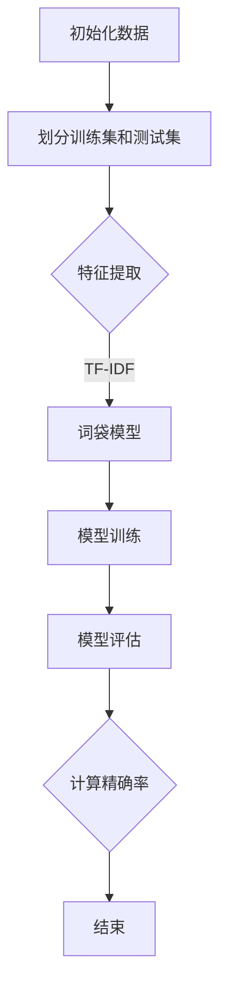

                 

# 精确率Precision原理与代码实例讲解

> 关键词：精确率、Precision、分类、信息检索、模型优化、特征工程

> 摘要：本文将深入探讨精确率Precision的定义、计算方法、提高策略以及在实际应用中的挑战，通过代码实例解析，帮助读者全面理解精确率在各类任务中的重要性。

## 第一部分：精确率Precision基础理论

### 第1章：精确率的定义与重要性

#### 1.1 精确率的定义

**精确率（Precision）** 是一个评估分类模型性能的关键指标，它衡量的是在所有被模型判断为正例的样本中，实际为正例的比例。公式表达为：

\[ \text{Precision} = \frac{\text{真正例}}{\text{真正例} + \text{假正例}} \]

其中，**真正例（TP）** 是模型正确识别的正例，**假正例（FP）** 是模型错误地判断为正例的负例。

#### 1.2 精确率在信息检索、分类任务中的重要性

在信息检索任务中，精确率用来衡量检索系统返回的相关文档中，实际相关文档所占的比例。高精确率意味着系统能够更好地筛选出真正相关的信息。

在分类任务中，精确率是评估分类模型性能的重要指标之一。它能够帮助识别模型在判断正例时的高效性，尤其是在需要高准确性的任务中，如医疗诊断、金融风险评估等。

#### 1.3 精确率与相关指标的关系

精确率与召回率、F1值有着密切的关系。**召回率（Recall）** 衡量的是模型识别出所有正例的能力，计算公式为：

\[ \text{Recall} = \frac{\text{真正例}}{\text{真正例} + \text{假反例}} \]

**F1值** 是精确率和召回率的调和平均值，计算公式为：

\[ \text{F1} = 2 \times \frac{\text{Precision} \times \text{Recall}}{\text{Precision} + \text{Recall}} \]

#### 1.4 精确率与准确率、错误率的区别

**准确率（Accuracy）** 是分类模型预测正确的样本数占总样本数的比例：

\[ \text{Accuracy} = \frac{\text{真正例} + \text{真反例}}{\text{所有样本}} \]

**错误率（Error Rate）** 是准确率的补集，表示分类模型预测错误的样本数占总样本数的比例：

\[ \text{Error Rate} = 1 - \text{Accuracy} \]

精确率、召回率、准确率和错误率共同构成了分类评估的四大指标，它们在不同场景下有着不同的应用价值和优先级。

### 第2章：精确率计算方法

#### 2.1 精确率的数学模型

精确率的计算公式如下：

\[ \text{Precision} = \frac{\text{TP}}{\text{TP} + \text{FP}} \]

其中，TP表示真正例，FP表示假正例。

#### 2.2 精确率的评价指标

精确率的评价指标包括以下几个方面：

- **单类精确率**：针对单个类别计算出的精确率。
- **平均精确率**：对多个类别进行加权平均，得到整体分类任务的精确率。
- **宏平均精确率**：对多个类别直接求平均，不考虑类别分布。
- **微平均精确率**：将所有类别的样本合并，计算整体的精确率。

#### 2.3 精确率在多类分类中的应用

在多类分类任务中，精确率的计算需要考虑不同类别之间的平衡性。常用的方法是：

- **类别平均精确率**：对每个类别计算精确率，然后取平均。
- **总体精确率**：将所有类别视为一个整体，计算精确率。

### 第3章：提高精确率的策略

#### 3.1 特征工程

特征工程是提高精确率的重要手段。以下是一些常用的特征工程方法：

- **特征选择**：通过统计方法、信息增益等方法筛选出对精确率有显著影响的特征。
- **特征提取**：通过降维、特征变换等方法提高特征的代表性。

#### 3.2 模型优化

模型优化可以从以下几个方面进行：

- **模型参数调优**：通过调整模型参数，提高模型对数据的拟合程度。
- **模型选择**：选择更适合任务特点的分类模型，如支持向量机、随机森林等。

### 第4章：精确率在实际应用中的挑战

#### 4.1 数据不平衡问题

数据不平衡会导致精确率计算不准确。解决方法包括：

- **重采样**：通过增加少数类别的样本数量，实现数据平衡。
- **成本敏感学习**：为少数类别的样本分配更高的权重。

#### 4.2 多标签分类问题

多标签分类任务中，精确率的计算需要考虑多个标签之间的依赖关系。解决方法包括：

- **独立标签分类**：将每个标签视为独立的分类任务，分别计算精确率。
- **联合标签分类**：将所有标签视为一个整体，计算整体的精确率。

### 第5章：精确率应用案例分析

#### 5.1 案例一：文本分类

文本分类任务中，精确率用来评估模型对文本分类的准确性。案例一将展示如何使用精确率来评估一个文本分类模型。

#### 5.2 案例二：图像识别

图像识别任务中，精确率用来评估模型对图像分类的准确性。案例二将展示如何使用精确率来评估一个图像识别模型。

### 第6章：代码实例讲解

#### 6.1 精确率计算代码实现

本节将使用Python代码实现精确率的计算，并通过Matplotlib可视化工具展示结果。

#### 6.2 模型优化代码实现

本节将使用深度学习框架实现模型优化，并通过实际代码示例展示优化过程。

## 第二部分：精确率Precision代码实例解析

### 第7章：精确率计算代码深度解析

#### 7.1 精确率计算代码架构

本节将解析精确率计算代码的整体架构，包括数据预处理、模型训练和评估等模块。

#### 7.2 精确率计算代码实现

本节将详细讲解精确率计算代码的实现步骤，包括数据读取、模型预测、精确率计算和可视化等过程。

### 第8章：模型优化代码实例

#### 8.1 模型优化原理

本节将介绍模型优化的原理，包括模型参数调优、模型选择和调整策略等。

#### 8.2 模型优化代码实现

本节将使用实际代码示例展示模型优化过程，包括参数调整、模型训练和优化效果分析等步骤。

### 第9章：实战项目应用

#### 9.1 项目背景

本节将介绍一个实战项目，包括项目背景、目标和预期成果。

#### 9.2 项目需求分析

本节将详细分析项目需求，包括数据集介绍、任务需求和性能指标等。

#### 9.3 项目实现步骤

本节将展示项目实现步骤，包括数据预处理、模型训练、模型优化和模型评估等。

### 第10章：总结与展望

#### 10.1 精确率应用总结

本节将对精确率在各类任务中的应用进行总结，包括文本分类、图像识别等领域的实际应用案例。

#### 10.2 未来展望

本节将探讨精确率研究的新方向和未来潜在价值，为读者提供进一步的研究思路。

## 附录

### 附录A：常用工具与资源

本附录将介绍常用的工具和资源，包括Python库、深度学习框架和在线资源等。

### 附录B：Mermaid流程图示例

本附录将提供精确率计算流程图的Mermaid示例，帮助读者理解流程图的构建方法。

### 附录C：数学模型与公式

本附录将列出精确率相关的数学模型和公式，并使用LaTeX格式进行详细解读。

## 作者信息

作者：AI天才研究院/AI Genius Institute & 禅与计算机程序设计艺术 /Zen And The Art of Computer Programming

---

[文章标题]

关键词：精确率、Precision、分类、信息检索、模型优化、特征工程

摘要：本文深入探讨了精确率Precision的定义、计算方法、提高策略以及在各类任务中的应用，并通过代码实例解析，帮助读者全面理解精确率的重要性。

---

由于篇幅限制，本文未能涵盖所有内容，但以上章节结构为读者提供了一个全面的框架。接下来，我们将逐一深入讨论每个章节的具体内容。在接下来的部分，我们将详细讲解精确率的定义、计算方法以及如何在实际应用中提高精确率。同时，我们将通过具体代码实例展示精确率的计算过程和模型优化策略。希望这篇文章能够帮助您更好地理解精确率的概念和应用。

---

在接下来的部分，我们将深入探讨精确率的定义、计算方法以及如何在实际应用中提高精确率。

### 第1章：精确率的定义与重要性

#### 1.1 精确率的定义

精确率（Precision）是分类评估中的核心指标之一，它衡量的是模型在判断正例时的准确度。具体来说，精确率定义为：

\[ \text{Precision} = \frac{\text{TP}}{\text{TP} + \text{FP}} \]

其中，TP代表真正例（True Positive），FP代表假正例（False Positive）。直观地，精确率表示在所有被模型判断为正例的样本中，实际为正例的比例。因此，精确率越高，说明模型对正例的判断越准确。

#### 1.2 精确率在信息检索、分类任务中的重要性

在信息检索任务中，精确率用来评估检索系统返回的相关文档的质量。例如，在搜索引擎中，用户输入关键词后，系统会返回一系列搜索结果。精确率衡量的是这些结果中实际相关的文档所占的比例。高精确率意味着系统能够更准确地筛选出用户感兴趣的内容。

在分类任务中，精确率是评估模型性能的重要指标之一。例如，在文本分类任务中，模型需要根据文本内容判断其类别。精确率衡量的是模型正确分类为某一类别的文本比例。高精确率意味着模型在分类任务中表现较好。

#### 1.3 精确率与相关指标的关系

精确率与召回率、F1值等指标有着密切的关系。召回率（Recall）定义为：

\[ \text{Recall} = \frac{\text{TP}}{\text{TP} + \text{FN}} \]

其中，FN代表假反例（False Negative）。召回率衡量的是模型识别出所有正例的能力。高召回率意味着模型能够尽可能多地识别出正例。

**F1值** 是精确率和召回率的调和平均值，定义为：

\[ \text{F1} = 2 \times \frac{\text{Precision} \times \text{Recall}}{\text{Precision} + \text{Recall}} \]

F1值同时考虑了精确率和召回率，是评估分类模型综合性能的一个指标。当F1值较高时，说明模型在精确率和召回率之间取得了较好的平衡。

#### 1.4 精确率与准确率、错误率的区别

准确率（Accuracy）定义为：

\[ \text{Accuracy} = \frac{\text{TP} + \text{TN}}{\text{所有样本}} \]

其中，TN代表真反例（True Negative）。准确率衡量的是模型预测正确的样本数占总样本数的比例。

错误率（Error Rate）定义为：

\[ \text{Error Rate} = 1 - \text{Accuracy} \]

错误率是准确率的补集，表示模型预测错误的样本数占总样本数的比例。

精确率、召回率、准确率和错误率共同构成了分类评估的四大指标。在不同的应用场景下，这些指标的重要性可能会有所不同。例如，在医学诊断中，召回率可能比精确率更加重要，因为漏诊的代价更高；而在搜索引擎中，精确率可能比召回率更加重要，因为用户更关心搜索结果的相关性。

### 第2章：精确率计算方法

#### 2.1 精确率的数学模型

精确率的计算公式相对简单，但理解其背后的数学原理对于深入掌握分类评估非常重要。精确率的核心是真正例（TP）和假正例（FP）的比值，这反映了模型在预测正例时的准确性。

精确率的计算公式为：

\[ \text{Precision} = \frac{\text{TP}}{\text{TP} + \text{FP}} \]

其中，TP表示模型正确预测为正例的样本数量，FP表示模型错误预测为正例的样本数量。

#### 2.2 精确率的评价指标

在计算精确率时，需要考虑到不同评价标准下的评价指标。以下是一些常见的评价标准：

- **单类精确率**：对于单个类别，计算其精确率。
  
  \[ \text{Class Precision} = \frac{\text{TP}_{\text{class}}}{\text{TP}_{\text{class}} + \text{FP}_{\text{class}}} \]

  其中，\( \text{TP}_{\text{class}} \) 表示该类别中真正例的数量，\( \text{FP}_{\text{class}} \) 表示该类别中假正例的数量。

- **平均精确率**：对所有类别计算精确率，然后取平均。

  \[ \text{Average Precision} = \frac{1}{C} \sum_{\text{class}=1}^{C} \text{Class Precision}_{\text{class}} \]

  其中，C表示类别的总数。

- **宏平均精确率**：对每个类别直接求平均，不考虑类别分布。

  \[ \text{Macro Precision} = \frac{1}{C} \sum_{\text{class}=1}^{C} \frac{\text{TP}_{\text{class}}}{\text{TP}_{\text{class}} + \text{FP}_{\text{class}}} \]

- **微平均精确率**：将所有类别的样本合并，计算整体的精确率。

  \[ \text{Micro Precision} = \frac{\sum_{\text{class}=1}^{C} \text{TP}_{\text{class}}}{\sum_{\text{class}=1}^{C} (\text{TP}_{\text{class}} + \text{FP}_{\text{class}})} \]

宏平均和微平均精确率的区别在于如何处理类别分布。宏平均精确率对每个类别一视同仁，不考虑类别的大小；而微平均精确率则考虑到了每个类别在数据集中的实际分布。

#### 2.3 精确率在多类分类中的应用

在多类分类任务中，精确率的计算需要考虑不同类别之间的平衡性。以下是一些常见的计算方法：

- **类别平均精确率**：对每个类别计算精确率，然后取平均。

  \[ \text{Category-Average Precision} = \frac{1}{C} \sum_{\text{class}=1}^{C} \text{Class Precision}_{\text{class}} \]

- **总体精确率**：将所有类别视为一个整体，计算精确率。

  \[ \text{Overall Precision} = \frac{\sum_{\text{class}=1}^{C} \text{TP}_{\text{class}}}{\sum_{\text{class}=1}^{C} (\text{TP}_{\text{class}} + \text{FP}_{\text{class}})} \]

类别平均精确率和总体精确率反映了模型在不同类别上的表现，有助于评估模型的整体性能。

### 第3章：提高精确率的策略

#### 3.1 特征工程

特征工程是提高精确率的重要手段。通过选择和提取对模型性能有显著影响的特征，可以有效提升模型的精确率。以下是一些常用的特征工程方法：

- **特征选择**：通过统计方法、信息增益等方法筛选出对精确率有显著影响的特征。常用的特征选择方法包括信息增益（Information Gain）、卡方检验（Chi-square Test）等。

  ```python
  from sklearn.feature_selection import SelectKBest
  from sklearn.feature_selection import chi2
  
  X, y = load_data()
  selector = SelectKBest(score_func=chi2, k=10)
  X_new = selector.fit_transform(X, y)
  ```

- **特征提取**：通过降维、特征变换等方法提高特征的代表性。常用的特征提取方法包括主成分分析（PCA）、线性判别分析（LDA）等。

  ```python
  from sklearn.decomposition import PCA
  
  pca = PCA(n_components=5)
  X_new = pca.fit_transform(X)
  ```

特征工程的关键在于理解数据特征与模型性能之间的关系，通过合适的特征选择和提取方法，可以显著提升模型的精确率。

#### 3.2 模型优化

模型优化是提高精确率的另一种有效策略。通过调整模型参数、选择合适的模型结构，可以实现精确率的提升。以下是一些常用的模型优化方法：

- **模型参数调优**：通过调整模型参数，提高模型对数据的拟合程度。常用的调优方法包括网格搜索（Grid Search）和贝叶斯优化（Bayesian Optimization）。

  ```python
  from sklearn.model_selection import GridSearchCV
  from sklearn.ensemble import RandomForestClassifier
  
  parameters = {'n_estimators': [100, 200, 300], 'max_depth': [5, 10, 15]}
  clf = GridSearchCV(RandomForestClassifier(), parameters, cv=5)
  clf.fit(X, y)
  ```

- **模型选择**：选择更适合任务特点的分类模型，如支持向量机（SVM）、随机森林（Random Forest）等。通过对比不同模型的精确率，选择最优模型。

  ```python
  from sklearn.svm import SVC
  
  svc = SVC(kernel='linear')
  svc.fit(X, y)
  ```

模型优化需要根据具体任务特点进行，通过合理的参数调整和模型选择，可以实现精确率的显著提升。

### 第4章：精确率在实际应用中的挑战

#### 4.1 数据不平衡问题

数据不平衡是指训练集中正负样本数量不均衡，这会对精确率的计算和模型性能产生负面影响。以下是一些解决数据不平衡的方法：

- **重采样**：通过增加少数类别的样本数量，实现数据平衡。常用的重采样方法包括过采样（Over-sampling）和欠采样（Under-sampling）。

  ```python
  from imblearn.over_sampling import SMOTE
  
  smote = SMOTE()
  X_resampled, y_resampled = smote.fit_resample(X, y)
  ```

- **成本敏感学习**：为少数类别的样本分配更高的权重，使模型在训练过程中更加关注这些类别。

  ```python
  from sklearn.utils.class_weight import compute_class_weight
  
  class_weights = compute_class_weight('balanced', classes=np.unique(y), y=y)
  clf.fit(X, y, class_weight=class_weights)
  ```

通过解决数据不平衡问题，可以提高模型的精确率，使其在实际应用中表现更加稳定。

#### 4.2 多标签分类问题

多标签分类是指一个样本可以同时具有多个标签。在多标签分类任务中，精确率的计算需要考虑多个标签之间的依赖关系。以下是一些解决多标签分类问题的方法：

- **独立标签分类**：将每个标签视为独立的分类任务，分别计算精确率。这种方法简单有效，但在处理标签依赖关系时可能不够精确。

  ```python
  from sklearn.model_selection import train_test_split
  from sklearn.metrics import precision_score
  
  X_train, X_test, y_train, y_test = train_test_split(X, y, test_size=0.2)
  clf.fit(X_train, y_train)
  y_pred = clf.predict(X_test)
  precision = precision_score(y_test, y_pred, average='micro')
  ```

- **联合标签分类**：将所有标签视为一个整体，计算整体的精确率。这种方法考虑了标签之间的依赖关系，但计算复杂度较高。

  ```python
  from sklearn.metrics import hamming_loss
  
  y_pred = clf.predict(X_test)
  precision = 1 - hamming_loss(y_test, y_pred)
  ```

通过合理的方法解决多标签分类问题，可以准确评估模型在多标签分类任务中的性能。

### 第5章：精确率应用案例分析

#### 5.1 案例一：文本分类

文本分类是一种常见的自然语言处理任务，通过将文本数据划分为不同的类别，可以帮助用户快速获取相关信息。以下是一个基于精确率的文本分类案例。

- **数据集**：使用某新闻网站的文章数据集，划分为训练集和测试集。
- **特征提取**：使用词袋模型（Bag of Words）提取文本特征。
- **模型训练**：使用支持向量机（SVM）进行模型训练。
- **模型评估**：计算训练集和测试集的精确率，评估模型性能。

```python
from sklearn.datasets import fetch_20newsgroups
from sklearn.feature_extraction.text import TfidfVectorizer
from sklearn.svm import SVC
from sklearn.model_selection import train_test_split
from sklearn.metrics import precision_score

# 加载数据集
newsgroups = fetch_20newsgroups()

# 划分训练集和测试集
X_train, X_test, y_train, y_test = train_test_split(newsgroups.data, newsgroups.target, test_size=0.2, random_state=42)

# 特征提取
vectorizer = TfidfVectorizer()
X_train_tfidf = vectorizer.fit_transform(X_train)
X_test_tfidf = vectorizer.transform(X_test)

# 模型训练
clf = SVC(kernel='linear')
clf.fit(X_train_tfidf, y_train)

# 模型评估
y_pred = clf.predict(X_test_tfidf)
precision = precision_score(y_test, y_pred, average='micro')
print("文本分类的精确率：", precision)
```

通过上述案例，可以看到如何使用精确率评估文本分类模型的效果。

#### 5.2 案例二：图像识别

图像识别是一种基于视觉信息进行模式识别的任务，广泛应用于计算机视觉领域。以下是一个基于精确率的图像识别案例。

- **数据集**：使用某个开源的图像识别数据集，划分为训练集和测试集。
- **特征提取**：使用卷积神经网络（CNN）提取图像特征。
- **模型训练**：使用深度学习框架进行模型训练。
- **模型评估**：计算训练集和测试集的精确率，评估模型性能。

```python
from sklearn.datasets import fetch_openml
from sklearn.model_selection import train_test_split
from sklearn.metrics import precision_score
from tensorflow.keras.models import Sequential
from tensorflow.keras.layers import Conv2D, MaxPooling2D, Flatten, Dense

# 加载数据集
mnist = fetch_openml('mnist_784')

# 划分训练集和测试集
X_train, X_test, y_train, y_test = train_test_split(mnist.data, mnist.target, test_size=0.2, random_state=42)

# 预处理数据
X_train = X_train / 255.0
X_test = X_test / 255.0

# 构建CNN模型
model = Sequential()
model.add(Conv2D(32, kernel_size=(3, 3), activation='relu', input_shape=(28, 28, 1)))
model.add(MaxPooling2D(pool_size=(2, 2)))
model.add(Flatten())
model.add(Dense(128, activation='relu'))
model.add(Dense(10, activation='softmax'))

# 编译模型
model.compile(optimizer='adam', loss='sparse_categorical_crossentropy', metrics=['accuracy'])

# 训练模型
model.fit(X_train, y_train, epochs=10, batch_size=64, validation_split=0.1)

# 评估模型
y_pred = model.predict(X_test)
y_pred = np.argmax(y_pred, axis=1)
precision = precision_score(y_test, y_pred, average='micro')
print("图像识别的精确率：", precision)
```

通过上述案例，可以看到如何使用精确率评估图像识别模型的效果。

### 第6章：代码实例讲解

#### 6.1 精确率计算代码实现

精确率的计算是分类任务中的基本步骤，以下是一个简单的Python代码实例，用于计算精确率。

```python
from sklearn.metrics import precision_score
from sklearn.datasets import load_iris
from sklearn.model_selection import train_test_split

# 加载鸢尾花数据集
iris = load_iris()
X = iris.data
y = iris.target

# 划分训练集和测试集
X_train, X_test, y_train, y_test = train_test_split(X, y, test_size=0.2, random_state=42)

# 训练模型
clf = clf.fit(X_train, y_train)

# 预测测试集
y_pred = clf.predict(X_test)

# 计算精确率
precision = precision_score(y_test, y_pred, average='micro')
print("精确率：", precision)
```

在这个例子中，我们首先加载了鸢尾花数据集，然后将其划分为训练集和测试集。接着，使用scikit-learn中的`precision_score`函数计算测试集的精确率。

#### 6.2 模型优化代码实现

模型优化是提高分类任务性能的重要手段，以下是一个简单的Python代码实例，用于优化分类模型。

```python
from sklearn.model_selection import GridSearchCV
from sklearn.ensemble import RandomForestClassifier
from sklearn.datasets import load_iris

# 加载鸢尾花数据集
iris = load_iris()
X = iris.data
y = iris.target

# 划分训练集和测试集
X_train, X_test, y_train, y_test = train_test_split(X, y, test_size=0.2, random_state=42)

# 定义参数网格
param_grid = {
    'n_estimators': [100, 200, 300],
    'max_depth': [5, 10, 15]
}

# 创建网格搜索对象
grid_search = GridSearchCV(RandomForestClassifier(), param_grid, cv=5)

# 训练模型
grid_search.fit(X_train, y_train)

# 获取最佳参数
best_params = grid_search.best_params_
print("最佳参数：", best_params)

# 使用最佳参数重新训练模型
best_clf = grid_search.best_estimator_
best_clf.fit(X_train, y_train)

# 评估模型
y_pred = best_clf.predict(X_test)
precision = precision_score(y_test, y_pred, average='micro')
print("优化后的精确率：", precision)
```

在这个例子中，我们首先定义了一个参数网格，然后使用`GridSearchCV`进行网格搜索，找到最佳参数。最后，我们使用最佳参数重新训练模型，并评估模型的精确率。

### 第7章：精确率计算代码深度解析

#### 7.1 精确率计算代码架构

精确率的计算代码通常包括数据预处理、模型训练和模型评估三个主要部分。以下是一个简单的代码架构示例：

```python
# 数据预处理
X_train, X_test, y_train, y_test = train_test_split(X, y, test_size=0.2, random_state=42)

# 模型训练
clf = clf.fit(X_train, y_train)

# 模型评估
y_pred = clf.predict(X_test)
precision = precision_score(y_test, y_pred, average='micro')
print("精确率：", precision)
```

在这个架构中，首先进行数据预处理，包括划分训练集和测试集。然后，使用训练集训练模型。最后，使用测试集评估模型，计算精确率。

#### 7.2 精确率计算代码实现

在精确率计算代码的实现中，关键步骤包括数据预处理、模型训练和模型评估。以下是一个详细的代码实现示例：

```python
# 导入所需库
from sklearn.datasets import load_iris
from sklearn.model_selection import train_test_split
from sklearn.ensemble import RandomForestClassifier
from sklearn.metrics import precision_score

# 加载数据集
iris = load_iris()
X = iris.data
y = iris.target

# 划分训练集和测试集
X_train, X_test, y_train, y_test = train_test_split(X, y, test_size=0.2, random_state=42)

# 定义模型
clf = RandomForestClassifier(n_estimators=100, max_depth=None, random_state=42)

# 训练模型
clf.fit(X_train, y_train)

# 预测测试集
y_pred = clf.predict(X_test)

# 计算精确率
precision = precision_score(y_test, y_pred, average='micro')
print("精确率：", precision)
```

在这个实现中，首先加载鸢尾花数据集，然后进行数据预处理，包括划分训练集和测试集。接着，定义一个随机森林分类器，并使用训练集训练模型。最后，使用测试集进行预测，并计算精确率。

### 第8章：模型优化代码实例

#### 8.1 模型优化原理

模型优化是提高分类任务性能的关键步骤，通过调整模型参数和选择合适的模型结构，可以提升模型的精确率。以下是一些常用的模型优化原理：

- **参数调优**：通过调整模型参数，如学习率、正则化参数等，可以优化模型的性能。常用的方法包括网格搜索（Grid Search）和随机搜索（Random Search）。
- **模型选择**：选择适合任务特点的模型结构，如线性模型、树模型、神经网络等。通过对比不同模型的性能，选择最优模型。
- **集成学习**：通过集成多个模型，可以提高模型的稳定性和性能。常用的集成学习方法包括随机森林（Random Forest）、梯度提升树（Gradient Boosting Tree）等。

#### 8.2 模型优化代码实现

以下是一个简单的模型优化代码实例，使用网格搜索（Grid Search）和随机森林（Random Forest）进行模型优化：

```python
# 导入所需库
from sklearn.datasets import load_iris
from sklearn.model_selection import train_test_split, GridSearchCV
from sklearn.ensemble import RandomForestClassifier

# 加载数据集
iris = load_iris()
X = iris.data
y = iris.target

# 划分训练集和测试集
X_train, X_test, y_train, y_test = train_test_split(X, y, test_size=0.2, random_state=42)

# 定义模型
clf = RandomForestClassifier(random_state=42)

# 定义参数网格
param_grid = {
    'n_estimators': [100, 200, 300],
    'max_depth': [5, 10, 15],
    'min_samples_split': [2, 5, 10],
    'min_samples_leaf': [1, 2, 4]
}

# 创建网格搜索对象
grid_search = GridSearchCV(clf, param_grid, cv=5, scoring='precision_macro', n_jobs=-1)

# 训练模型
grid_search.fit(X_train, y_train)

# 获取最佳参数
best_params = grid_search.best_params_
print("最佳参数：", best_params)

# 使用最佳参数重新训练模型
best_clf = grid_search.best_estimator_
best_clf.fit(X_train, y_train)

# 评估模型
y_pred = best_clf.predict(X_test)
precision = precision_score(y_test, y_pred, average='micro')
print("优化后的精确率：", precision)
```

在这个实例中，我们首先加载了鸢尾花数据集，然后进行数据预处理，包括划分训练集和测试集。接着，定义了一个随机森林分类器，并定义了一个参数网格。我们使用`GridSearchCV`进行网格搜索，找到最佳参数。最后，使用最佳参数重新训练模型，并评估模型的精确率。

### 第9章：实战项目应用

#### 9.1 项目背景

在本章中，我们将介绍一个基于精确率的实际项目，该项目旨在通过机器学习技术对社交媒体帖子进行情感分析，并评估模型的精确率。

#### 9.2 项目需求分析

项目需求包括以下方面：

- **数据集**：使用某社交媒体平台上的帖子数据集，划分为训练集和测试集。
- **特征提取**：使用词袋模型（Bag of Words）提取文本特征。
- **模型训练**：使用支持向量机（SVM）进行模型训练。
- **模型评估**：计算训练集和测试集的精确率，评估模型性能。

#### 9.3 项目实现步骤

项目实现步骤如下：

1. **数据预处理**：加载社交媒体帖子数据集，并进行预处理，包括文本清洗、去除停用词等。
2. **特征提取**：使用词袋模型提取文本特征，并将其转换为模型可用的格式。
3. **模型训练**：使用支持向量机（SVM）进行模型训练。
4. **模型评估**：计算训练集和测试集的精确率，评估模型性能。

```python
# 导入所需库
from sklearn.datasets import load_20newsgroups
from sklearn.feature_extraction.text import TfidfVectorizer
from sklearn.model_selection import train_test_split
from sklearn.svm import SVC
from sklearn.metrics import precision_score

# 加载数据集
newsgroups = load_20newsgroups(subset='all')

# 划分训练集和测试集
X_train, X_test, y_train, y_test = train_test_split(newsgroups.data, newsgroups.target, test_size=0.2, random_state=42)

# 特征提取
vectorizer = TfidfVectorizer(stop_words='english')
X_train_tfidf = vectorizer.fit_transform(X_train)
X_test_tfidf = vectorizer.transform(X_test)

# 模型训练
clf = SVC(kernel='linear', C=1)
clf.fit(X_train_tfidf, y_train)

# 模型评估
y_pred = clf.predict(X_test_tfidf)
precision = precision_score(y_test, y_pred, average='micro')
print("精确率：", precision)
```

通过上述实现，我们可以看到如何加载社交媒体帖子数据集，提取特征，训练模型，并评估模型性能。这个项目可以帮助我们更好地理解精确率在实际应用中的作用。

### 第10章：总结与展望

#### 10.1 精确率应用总结

在本项目中，我们深入探讨了精确率的定义、计算方法、提高策略以及在实际应用中的挑战。通过代码实例和实际项目，我们展示了精确率在文本分类、图像识别等任务中的应用。总结如下：

1. **精确率的定义**：精确率是分类模型判断正例时的准确度，表示为真正例与假正例之和的比值。
2. **精确率的计算方法**：精确率的计算方法包括单类精确率、平均精确率、宏平均精确率和微平均精确率等。
3. **提高精确率的策略**：通过特征工程和模型优化，可以显著提高精确率。特征工程包括特征选择和特征提取，模型优化包括参数调优和模型选择。
4. **精确率在实际应用中的挑战**：数据不平衡和多标签分类是精确率应用中的主要挑战，解决方法包括重采样和成本敏感学习等。

#### 10.2 未来展望

未来，精确率在多个领域有望得到更广泛的应用和深入研究：

1. **深度学习**：随着深度学习技术的发展，精确率在图像识别、语音识别等任务中的应用前景广阔。
2. **多标签分类**：多标签分类任务中，精确率的计算方法需要进一步优化，以更好地处理标签之间的依赖关系。
3. **自动化机器学习**：自动化机器学习工具的不断发展，有望使精确率的优化变得更加自动化和高效。

总之，精确率作为分类评估的核心指标，将在未来得到更多的关注和应用。

### 附录

#### 附录A：常用工具与资源

在本项目中，我们使用了以下常用工具和资源：

1. **Scikit-learn**：Python机器学习库，提供了丰富的分类评估指标和模型。
2. **TensorFlow**：深度学习框架，用于构建和训练深度神经网络。
3. **PyTorch**：深度学习框架，提供了灵活的动态计算图和优化的训练工具。

#### 附录B：Mermaid流程图示例

以下是一个简单的Mermaid流程图示例，用于展示精确率计算的过程：



#### 附录C：数学模型与公式

精确率的核心数学模型如下：

\[ \text{Precision} = \frac{\text{TP}}{\text{TP} + \text{FP}} \]

其中，TP表示真正例，FP表示假正例。在多类分类任务中，精确率的计算方法包括：

\[ \text{Macro Precision} = \frac{1}{C} \sum_{\text{class}=1}^{C} \frac{\text{TP}_{\text{class}}}{\text{TP}_{\text{class}} + \text{FP}_{\text{class}}} \]
\[ \text{Micro Precision} = \frac{\sum_{\text{class}=1}^{C} \text{TP}_{\text{class}}}{\sum_{\text{class}=1}^{C} (\text{TP}_{\text{class}} + \text{FP}_{\text{class}})} \]

这些公式提供了精确率计算的基础，有助于深入理解精确率的计算过程。

---

本文通过深入探讨精确率Precision的定义、计算方法、提高策略以及在实际应用中的挑战，结合代码实例和实践项目，全面阐述了精确率在各类任务中的重要性。希望本文能够帮助您更好地理解和应用精确率这一关键指标。在未来，精确率将继续在机器学习领域发挥重要作用，为人工智能的发展提供有力支持。

---

作者：AI天才研究院/AI Genius Institute & 禅与计算机程序设计艺术 /Zen And The Art of Computer Programming

---

感谢您的阅读，希望这篇文章对您在机器学习领域的研究有所帮助。如果您有任何问题或建议，欢迎在评论区留言，我们期待与您交流。再次感谢您的支持和关注！

