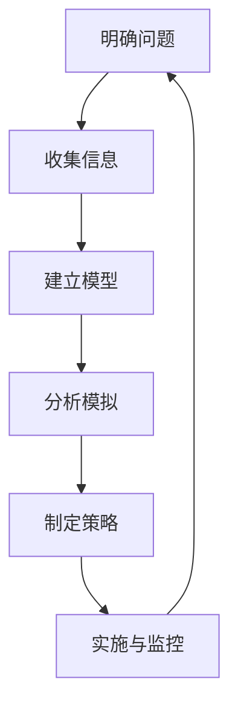
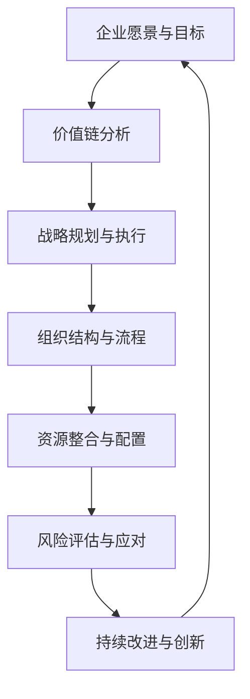
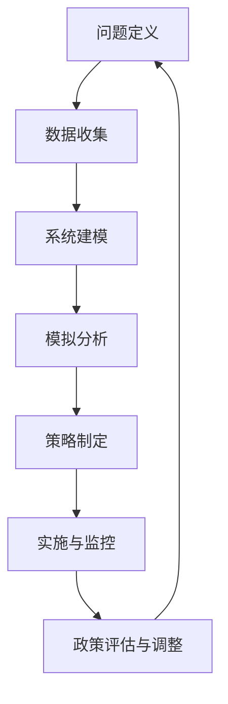
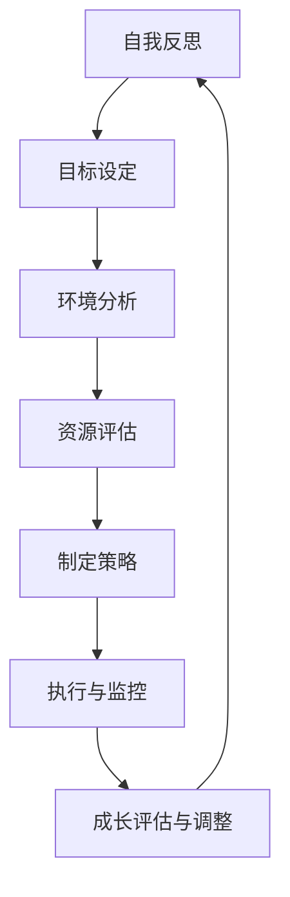

                 

### 文章标题

《系统思考的威力：化繁为简，抓本质》

### 关键词

系统思考、复杂系统、反馈循环、因果关系、系统结构、系统演化、实际应用

### 摘要

在快速变化的信息时代，系统思考成为解决复杂问题的利器。本文将深入探讨系统思考的威力，通过化繁为简、抓本质的方法，揭示其在不同领域的应用价值。本文首先介绍系统思考的基础概念和原理，然后详细解析因果关系与反馈循环、系统结构分析、系统演化与适应性等核心概念，并探讨系统思考在企业、社会治理和个人成长等实际应用中的具体方法。通过实例分析和代码实战案例，读者将更好地理解系统思考的实用性和重要性。本文旨在为读者提供一整套系统思考的框架和实践指南，帮助他们在面对复杂问题时，能够从容应对，找到本质解决之道。

### 引言

在当今信息爆炸、技术迅猛发展的时代，复杂系统无处不在。从企业运作到社会治理，从环境保护到个人成长，复杂问题层出不穷，传统的线性思维和单一视角往往难以应对这些复杂的局面。为了更好地理解和解决这些问题，系统思考成为一种不可或缺的思维方式。系统思考不仅帮助我们化繁为简，更能够抓住问题的本质，找到系统性解决方案。

系统思考，作为一种综合性思维方法，强调从整体和系统的角度出发，对复杂系统进行深入分析。它不同于传统思维方式的局部优化和线性推理，而是关注系统内部各要素之间的相互关系和动态变化。通过系统思考，我们可以发现隐藏在表象背后的因果关系，理解系统行为背后的内在机制，从而提出更具创造性和实用性的解决方案。

系统思考的应用领域非常广泛。在企业中，系统思考可以帮助企业高层管理者更全面地把握企业运营的各个环节，优化资源配置，提升整体绩效。在社会治理方面，系统思考有助于政府和社会组织更有效地应对社会问题，提升公共政策的科学性和实效性。在环境保护领域，系统思考可以指导我们更全面地评估人类活动对生态环境的影响，制定更为可持续的环保策略。在个人成长方面，系统思考可以帮助我们更好地认识自我，制定科学的成长计划，提高个人综合素质。

本文将系统地介绍系统思考的基础概念、核心原理、实践方法以及实际应用。我们将通过一步一步的分析推理，从基础理论到具体实践，全面解析系统思考的威力，帮助读者更好地掌握和应用这一强大的思维方式。

### 第一部分：系统思考概述

#### 第1章：系统思考的基础

### 1.1 系统思考的概念与原理

系统思考，亦称整体思考或系统论，是一种理解和分析复杂系统的综合性思维方法。其核心在于从整体和系统的角度出发，关注系统内部各要素之间的相互关系和动态变化，而不是简单地关注单一要素或线性的因果关系。系统思考强调的是系统作为一个整体的功能和性能，而不是各组成部分的简单叠加。

#### 系统思考的定义

系统思考可以定义为一种探索复杂系统内部结构和动态行为的思维方式。它涉及对系统组成要素的分析、系统结构的理解、系统行为的预测以及系统演化的评估。在系统思考中，系统是指由相互关联的多个部分组成的整体，每个部分都对整体的行为产生影响。

#### 系统思考的基本原理

1. **整体性原理**：系统思考认为，系统的整体性能不仅仅取决于各组成部分的性能，更取决于这些部分之间的相互作用和整合。局部最优不等于整体最优，需要从整体角度进行优化。
   
2. **反馈循环原理**：系统思考强调反馈在系统中的作用。反馈可以是正反馈，即增强系统行为；也可以是负反馈，即抑制系统行为。反馈循环影响系统的稳定性、适应性和演化方向。

3. **因果关系原理**：系统思考认为，系统内部各要素之间存在着复杂的因果关系，这些因果关系不仅仅是线性的，还包括非线性和延迟效应。理解这些因果关系有助于揭示系统行为的本质。

4. **动态变化原理**：系统思考强调系统的动态性质，认为系统是在不断变化和发展中的。系统的行为不仅取决于当前状态，还受到历史状态和未来状态的影响。

#### 系统思考与传统思维方式的对比

传统思维方式，如线性思维和单点思维，往往注重局部和单一视角，容易忽视系统内部的复杂关系和动态变化。而系统思考则具有以下优点：

1. **全面性**：系统思考能够从整体角度分析问题，考虑系统内部各要素的相互关系，从而更全面地理解系统行为。

2. **前瞻性**：系统思考能够预测系统未来可能的行为和变化，帮助决策者提前准备和应对。

3. **创造性**：系统思考鼓励探索和创新，通过重新定义问题和寻找新的解决方案，提出更具创造性的观点。

4. **适应性**：系统思考强调系统的动态性质，能够适应不断变化的环境和挑战。

#### 1.2 系统思考的核心工具

系统思考依赖于一系列核心工具和方法，这些工具和方法帮助分析者和决策者更好地理解和分析复杂系统。以下是几种常用的系统思考工具：

1. **系统动力学**：系统动力学是一种基于数学模型的方法，用于模拟和预测复杂系统的动态行为。它通过建立状态变量和反馈循环的模型，揭示系统行为的内在机制和演化路径。

2. **复杂性理论**：复杂性理论关注复杂系统的结构和动态行为，研究系统在演化过程中如何从简单到复杂。它包括多种数学模型和计算方法，用于分析和理解复杂系统的行为。

3. **系统思维模型**：系统思维模型是一种图形化工具，用于表示复杂系统的结构和关系。常见的系统思维模型包括因果图、系统图、石树图等，这些模型可以帮助分析者清晰地理解系统内部各要素之间的相互关系。

#### 1.3 系统思考的应用领域

系统思考在多个领域具有广泛的应用，下面简要介绍几个主要领域：

1. **企业管理**：在企业管理中，系统思考可以帮助管理者更全面地理解企业运营的各个环节，优化资源配置，提升整体绩效。例如，通过系统动力学模型，企业可以预测市场需求的变化，优化库存管理，提高生产效率。

2. **社会治理**：在社会治理中，系统思考有助于政府和社会组织更有效地应对社会问题，提升公共政策的科学性和实效性。例如，通过系统动力学模型，政府可以分析社会问题的发展趋势，制定更有效的干预策略。

3. **环境保护**：在环境保护领域，系统思考可以帮助我们更全面地评估人类活动对生态环境的影响，制定更为可持续的环保策略。例如，通过复杂性理论，我们可以分析生态系统中的相互作用和反馈循环，提出有效的生态保护措施。

4. **个人成长**：在个人成长方面，系统思考可以帮助我们更好地认识自我，制定科学的成长计划，提高个人综合素质。例如，通过系统思维模型，我们可以分析个人发展的瓶颈，找到有效的提升路径。

通过以上对系统思考的基础概念、原理和应用领域的介绍，我们可以看到，系统思考是一种强大而实用的思维方式，它在解决复杂问题时具有巨大的潜力和价值。

#### 第2章：系统思考的实践方法

### 2.1 系统思考的流程

系统思考的实践方法包括一系列明确的步骤，这些步骤可以帮助分析者和决策者系统地分析和解决复杂问题。以下是系统思考的基本流程：

1. **明确问题**：这是系统思考的第一步，也是最重要的一步。明确问题意味着要准确界定问题的范围和性质，理解问题的核心和关键点。这一步骤需要分析者深入思考，确保问题定义清晰、具体，从而为后续的分析提供基础。

2. **收集信息**：在明确问题之后，需要收集与问题相关的各种信息。这些信息可能包括数据、文献、专家意见、历史记录等。收集信息的目的是为了全面了解问题的背景和现状，为后续的分析提供丰富的素材。

3. **建立模型**：在收集到足够的信息后，分析者需要建立系统模型。系统模型可以是数学模型、图形模型或混合模型，其目的是将问题结构化、可视化，以便更好地理解问题内部的结构和关系。建立模型的过程中，分析者需要运用系统动力学、复杂性理论等方法，对系统的动态行为进行模拟和预测。

4. **分析模拟**：建立模型后，分析者需要进行模拟和分析。模拟的目的是测试模型的可靠性，验证模型的预测能力。通过模拟，分析者可以观察系统在各种条件下的行为，预测系统在不同策略下的未来趋势。这一步骤有助于分析者发现潜在的问题和挑战，为决策提供依据。

5. **制定策略**：在分析和模拟的基础上，分析者需要制定具体的策略和方案。这些策略和方案旨在解决问题，优化系统性能，实现预期目标。制定策略时，分析者需要考虑多种可能的解决方案，评估每种方案的优缺点，选择最优的解决方案。

6. **实施与监控**：策略制定完成后，需要将其付诸实施，并在实施过程中进行监控和调整。实施与监控的目的是确保策略的有效执行，及时发现和解决问题，确保系统目标得以实现。

通过以上系统思考的流程，分析者和决策者可以系统地分析和解决复杂问题，提高决策的科学性和有效性。

#### 2.2 系统思考的工具箱

系统思考的过程不仅需要明确的步骤，还需要一系列工具和方法的支持。以下是一些常用的系统思考工具：

1. **头脑风暴**：头脑风暴是一种集体创意思维方法，通过集思广益，产生大量创意和解决方案。在系统思考中，头脑风暴可以帮助分析者快速收集信息，挖掘问题的各个方面，从而为建立模型提供丰富的素材。

2. **SWOT分析**：SWOT分析是一种战略规划工具，用于分析企业的优势（Strengths）、劣势（Weaknesses）、机会（Opportunities）和威胁（Threats）。在系统思考中，SWOT分析可以帮助分析者全面评估系统的内外部环境，为制定策略提供依据。

3. **石英画布**：石英画布是一种系统思维模型，用于表示复杂系统的结构和关系。它通过图形化的方式，展示系统中的各种要素及其相互关系，帮助分析者更直观地理解系统的动态行为。

4. **系统图**：系统图是一种图形化工具，用于表示系统的组成要素及其相互关系。系统图可以帮助分析者清晰地了解系统的结构和功能，便于进行系统分析和优化。

5. **因果图**：因果图是一种用于表示系统内部因果关系的图形化工具。它通过节点和箭头，展示系统各要素之间的因果关系，帮助分析者理解系统的内在机制和驱动因素。

6. **石树图**：石树图是一种用于分析系统稳定性和动态行为的图形化工具。它通过图形化的方式，展示系统的稳定状态和突变过程，帮助分析者理解系统的演化路径和稳定性。

通过这些系统思考工具，分析者和决策者可以更有效地进行系统分析，提出更具创造性和实用性的解决方案。

#### 2.3 系统思考的案例分析

系统思考在实践中具有广泛的应用，通过具体的案例，我们可以更好地理解系统思考的实践方法和效果。以下将介绍三个不同领域的系统思考实践案例。

##### 企业系统思考实践案例

某大型制造企业在面临市场需求波动和供应链管理挑战时，采用系统思考方法进行了深入分析。首先，明确问题：如何优化供应链管理，确保生产效率和市场需求匹配。接下来，收集信息：包括市场需求数据、供应链各个环节的运行情况、库存水平等。然后，建立模型：运用系统动力学模型，模拟市场需求变化对供应链的影响，分析不同库存策略的效果。通过模拟分析，发现最优库存策略是动态调整库存水平，以适应市场需求波动。制定策略：根据模拟结果，调整供应链管理策略，优化库存水平，提高生产效率。实施与监控：将新策略付诸实施，并持续监控其效果，根据实际情况进行调整。通过系统思考，该企业成功优化了供应链管理，降低了成本，提高了市场响应速度。

##### 社会治理系统思考实践案例

某城市政府在应对交通拥堵问题时，采用了系统思考方法。首先，明确问题：如何有效缓解城市交通拥堵。收集信息：包括交通流量数据、交通基础设施状况、城市规划资料等。建立模型：运用系统图和因果图，分析交通系统的各个组成部分及其相互关系，模拟不同交通管理策略的效果。通过分析，发现交通拥堵的根本原因在于交通流量分布不均，以及公共交通系统与私人交通的竞争关系。制定策略：提出优化交通基础设施、推广公共交通、实施交通需求管理等策略。实施与监控：实施新策略，并通过数据分析监控其效果，根据实际情况进行调整。通过系统思考，该城市政府成功缓解了交通拥堵问题，提高了市民出行效率。

##### 个人成长系统思考实践案例

一位职场人士在职业发展过程中，通过系统思考方法进行了自我分析。首先，明确问题：如何提升职业竞争力，实现职业目标。收集信息：包括职业规划资料、个人技能评估、行业趋势分析等。建立模型：运用石英画布，分析职业发展的各个阶段及其相互关系，模拟不同职业发展路径的效果。通过分析，发现提升职业竞争力的关键在于持续学习和技能拓展，以及建立良好的人脉关系。制定策略：制定长期职业规划，包括学习计划、技能提升目标和人脉拓展策略。实施与监控：按照规划执行，定期评估职业发展状况，根据实际情况进行调整。通过系统思考，这位职场人士成功提升了职业竞争力，实现了职业目标。

通过以上案例，我们可以看到系统思考在解决复杂问题时的实用性和有效性。系统思考不仅帮助分析者和决策者更好地理解问题，找到本质解决之道，还提供了具体的实践方法和策略，从而在实际应用中取得了显著效果。

#### 第3章：系统思考的核心概念解析

### 3.1 因果关系的理解

因果关系是系统思考中一个重要的核心概念，它揭示了系统内部各要素之间的相互作用和影响。理解因果关系不仅有助于我们更准确地分析系统行为，还能帮助我们找到问题的根源和解决方案。

#### 线性因果关系

线性因果关系是指两个变量之间存在直接的、单一的因果关系，一个变量的变化直接导致另一个变量的变化。例如，温度上升会导致销售量增加，这是一个简单的线性因果关系。在系统动力学模型中，线性因果关系可以通过微分方程或线性关系进行描述。

##### 线性因果关系的数学表示

假设有两个变量 \(X\) 和 \(Y\)，它们之间存在线性关系，可以表示为：

\[ Y = aX + b \]

其中，\(a\) 是斜率，表示 \(X\) 对 \(Y\) 的影响程度，\(b\) 是截距，表示当 \(X = 0\) 时 \(Y\) 的初始值。

##### 线性因果关系的实例

在一个简单的经济模型中，假设家庭收入（\(X\)）与消费支出（\(Y\)）之间存在线性关系。如果家庭收入增加1000元，消费支出预计会增加50元（即 \(a = 0.05\)），则模型可以表示为：

\[ Y = 0.05X + 1000 \]

通过这个模型，我们可以预测不同收入水平下的消费支出。

#### 非线性因果关系

非线性因果关系则更为复杂，它指两个变量之间的因果关系不是直接的、单一的，而是通过多个中间变量相互作用的结果。非线性关系可以是二次的、三次的，甚至更复杂。例如，温度上升不仅会影响销售量，还可能通过天气、消费者心理等多种中间变量间接影响销售量。

##### 非线性因果关系的数学表示

非线性因果关系可以通过非线性函数进行描述，例如：

\[ Y = aX^2 + bX + c \]

其中，\(a\)、\(b\)、\(c\) 是常数，表示不同次幂的 \(X\) 对 \(Y\) 的影响程度。

##### 非线性因果关系的实例

在一个环境模型中，假设空气质量（\(X\)）对植物生长（\(Y\)）有影响。如果空气质量较差，植物生长会受到抑制，这种影响可能不是线性的，而是通过光合作用、土壤质量等多种中间变量相互作用的结果。模型可以表示为：

\[ Y = -a \cdot (X - b)^2 + c \]

其中，\(a\) 表示空气质量对植物生长的抑制程度，\(b\) 是空气质量的临界值，当空气质量低于该值时，植物生长受到显著抑制，\(c\) 是植物生长的初始状态。

通过理解线性因果关系和非线性因果关系，我们可以更准确地分析复杂系统中的相互作用和影响。理解非线性因果关系尤为关键，因为它能够揭示复杂系统中隐藏的动态行为和潜在风险。

#### 3.2 反馈循环的类型

在系统思考中，反馈循环是系统行为的一个重要组成部分。反馈循环分为正反馈循环和负反馈循环，它们在系统稳定性、行为演变中起着至关重要的作用。

##### 正反馈循环

正反馈循环是一种增强系统行为的循环过程，一个系统的输出会加强其自身的输入。这种循环过程会导致系统行为的逐渐积累和放大。例如，在人口增长模型中，随着人口数量的增加，生育率也会增加，进而导致人口进一步增长，形成正反馈循环。

##### 正反馈循环的数学表示

假设有两个变量 \(X\) 和 \(Y\)，它们之间存在正反馈关系，可以表示为：

\[ Y = a \cdot (X - X_0)^3 + X_0 \]

其中，\(a\) 是正反馈系数，\(X_0\) 是系统的初始状态。

##### 正反馈循环的实例

在一个生态系统模型中，假设某种植物的数量（\(X\)）与其竞争植物的数量（\(Y\)）之间存在正反馈关系。当植物数量增加时，竞争植物的数量也会增加，从而进一步促进植物数量的增长。模型可以表示为：

\[ X = a \cdot (Y - Y_0)^2 + Y_0 \]

其中，\(a\) 是正反馈系数，\(Y_0\) 是竞争植物的初始数量。

正反馈循环在系统行为中可能导致两种情况：稳定状态和突变。当系统处于稳定状态时，系统的行为会在一定范围内波动，但不会发生显著变化。当系统达到突变点时，行为将发生突然和剧烈的变化。

##### 负反馈循环

负反馈循环是一种抑制系统行为的循环过程，一个系统的输出会减弱其自身的输入。这种循环过程有助于维持系统的稳定性，防止系统行为的过度放大或衰减。例如，在体温调节系统中，当体温升高时，汗腺会分泌更多汗液，通过散热来降低体温，形成负反馈循环。

##### 负反馈循环的数学表示

假设有两个变量 \(X\) 和 \(Y\)，它们之间存在负反馈关系，可以表示为：

\[ Y = -a \cdot (X - X_0) + X_0 \]

其中，\(a\) 是负反馈系数，\(X_0\) 是系统的初始状态。

##### 负反馈循环的实例

在一个经济模型中，假设消费者信心（\(X\)）对市场需求（\(Y\)）有影响。当消费者信心增加时，市场需求也会增加，但超过一定阈值后，市场饱和度增加，消费者信心开始下降，形成负反馈循环。模型可以表示为：

\[ Y = -a \cdot (X - X_0) + X_0 \]

其中，\(a\) 是负反馈系数，\(X_0\) 是消费者信心的初始水平。

负反馈循环在系统稳定性中起着关键作用，它有助于维持系统的平衡状态，防止系统行为的过度波动。通过理解正反馈循环和负反馈循环，我们可以更好地分析系统的动态行为和稳定性，从而提出有效的解决方案。

#### 3.3 反馈循环的应用

反馈循环在系统思考中具有广泛的应用，通过分析反馈循环，我们可以更好地理解系统的行为模式和演变过程。以下将介绍反馈循环在系统稳定性分析、系统变革策略中的应用。

##### 系统稳定性分析

系统稳定性分析是系统思考中的一项重要任务，它有助于评估系统的稳定状态和潜在风险。通过分析反馈循环，我们可以判断系统的稳定性。

1. **稳定状态**：当系统处于稳定状态时，系统行为会在一定范围内波动，但不会发生显著变化。稳定状态可以通过负反馈循环来实现。例如，在温度调节系统中，通过负反馈循环，系统能够维持恒定的温度。

2. **突变状态**：当系统达到突变点时，行为将发生突然和剧烈的变化。突变状态通常由正反馈循环引起。例如，在人口增长模型中，当人口数量超过某一临界值时，人口增长速度会迅速增加，导致系统进入突变状态。

##### 系统变革策略

系统变革策略是指通过改变系统内部的结构和关系，实现系统行为的优化和变革。反馈循环在系统变革策略中具有重要作用。

1. **增强负反馈循环**：通过增强负反馈循环，可以提升系统的稳定性，防止系统行为的过度波动。例如，在企业管理中，通过建立内部监控和反馈机制，可以增强企业的稳定性，提高管理效率。

2. **削弱正反馈循环**：通过削弱正反馈循环，可以防止系统行为的过度放大，避免系统进入突变状态。例如，在环境保护中，通过限制污染物排放，可以削弱环境污染的正反馈循环，保护生态环境。

3. **建立新的反馈循环**：通过建立新的反馈循环，可以引入新的机制，实现系统的优化和变革。例如，在科技创新中，通过建立创新反馈循环，可以加速科技成果的转化和应用，推动社会进步。

通过反馈循环的应用，我们可以更好地分析系统的稳定性，制定有效的变革策略，实现系统的优化和变革。

#### 第4章：系统结构分析

### 4.1 系统结构的定义

系统结构是指系统内部各组成部分及其相互关系的整体布局和配置。它不仅包括系统中的实体和要素，还包括这些要素之间的相互作用和连接方式。系统结构决定了系统的功能、性能和行为模式，是系统分析和管理的基础。

#### 系统结构的组成要素

系统结构通常由以下要素组成：

1. **系统元素**：系统中的基本组成部分，如部件、子系统、实体等。
2. **元素之间的关系**：系统元素之间的相互作用和连接关系，如因果关系、信息流、能量流等。
3. **系统边界**：系统与其外部环境之间的分界线，定义了系统的范围和功能。
4. **系统层级**：系统内部各要素的层次结构，反映了系统内部的复杂性和层次性。

#### 系统结构的定义

系统结构可以定义为系统内部各组成部分及其相互关系的整体布局和配置。它不仅包括系统中的实体和要素，还包括这些要素之间的相互作用和连接方式。系统结构决定了系统的功能、性能和行为模式，是系统分析和管理的基础。

##### 系统结构的数学表示

系统结构可以通过数学模型进行表示，例如：

- **图论模型**：使用图（Graph）来表示系统结构，节点（Node）表示系统元素，边（Edge）表示元素之间的关系。
- **状态空间模型**：使用状态变量和状态转移矩阵来表示系统结构，描述系统在不同状态之间的转换。
- **方程组模型**：使用微分方程或差分方程来表示系统结构，描述系统内部各要素的动态行为。

#### 系统结构的分析工具

在系统结构分析中，常用的工具和方法包括：

1. **系统图**：系统图（System Diagram）是一种图形化工具，用于表示系统结构及其内部关系。系统图通过节点和箭头，清晰地展示系统元素及其相互作用，有助于分析和理解系统结构。
2. **节点分析**：节点分析（Node Analysis）是一种用于分析系统节点（如设备、子系统）性能和瓶颈的方法。节点分析可以帮助确定系统中的关键节点，优化系统性能。
3. **网络分析**：网络分析（Network Analysis）是一种用于分析系统内部网络结构及其性能的方法。网络分析可以帮助确定系统的传输延迟、带宽利用率等关键性能指标，优化系统通信性能。
4. **系统建模工具**：如MATLAB、Simulink等，这些工具提供了丰富的建模和仿真功能，可以用于系统结构分析和验证。

通过系统结构分析，我们可以更好地理解系统的内部机制和运行规律，从而提出优化和改进方案，提升系统的性能和效率。

#### 4.2 系统结构的分析工具

在系统结构分析中，使用适当的工具和方法可以极大地提高分析效率和准确性。以下是几种常用的系统结构分析工具：

1. **系统图**：系统图（System Diagram）是一种图形化工具，用于表示系统结构及其内部关系。通过系统图，分析者可以直观地展示系统的组成要素及其相互关系，有助于分析和理解系统结构。

    - **优点**：系统图能够将复杂的系统结构简洁地展示出来，使得分析者能够清晰地看到系统中的关键环节和相互关系。
    - **缺点**：系统图的抽象程度较高，可能难以详细展示系统内部的动态行为和相互作用。

2. **节点分析**：节点分析（Node Analysis）是一种用于分析系统节点（如设备、子系统）性能和瓶颈的方法。通过节点分析，可以确定系统中的关键节点，优化系统性能。

    - **优点**：节点分析可以帮助分析者找到系统中的性能瓶颈，提出优化方案，从而提高系统整体性能。
    - **缺点**：节点分析需要详细的数据支持，分析过程可能较为复杂，需要专业的知识和技能。

3. **网络分析**：网络分析（Network Analysis）是一种用于分析系统内部网络结构及其性能的方法。通过网络分析，可以确定系统的传输延迟、带宽利用率等关键性能指标。

    - **优点**：网络分析可以帮助分析者优化系统通信性能，提高数据传输效率。
    - **缺点**：网络分析通常需要专业的网络知识和工具，分析过程可能较为复杂。

4. **系统建模工具**：如MATLAB、Simulink等，这些工具提供了丰富的建模和仿真功能，可以用于系统结构分析和验证。

    - **优点**：系统建模工具能够提供精确的数学模型和仿真环境，使得分析者能够进行详细的系统分析和验证。
    - **缺点**：系统建模工具的使用需要较高的专业知识和技能，建模过程可能较为复杂。

通过结合使用以上工具，分析者可以更全面地理解和分析系统结构，提出有效的优化和改进方案。每种工具都有其独特的优势和应用场景，选择合适的工具能够显著提升系统分析的效果。

#### 4.3 系统结构对系统行为的影响

系统结构对系统行为有着深远的影响，它不仅决定了系统的功能与性能，还影响了系统的稳定性、可扩展性和适应性。以下将详细讨论系统结构对系统行为的影响，并探讨优化系统结构的方法。

##### 结构稳定性

系统结构的稳定性是指系统在面对外部扰动时，能够保持其功能与性能的能力。稳定的系统结构能够减少系统的波动，增强系统的抗风险能力。例如，在工程系统中，合理的结构设计可以确保建筑物在面对地震等自然灾害时保持稳定。

- **稳定性分析**：通过分析系统结构，可以识别系统中的关键环节和潜在的不稳定因素。例如，使用系统图和节点分析方法，可以确定系统中关键节点的连接关系，评估系统的稳定性。

- **优化策略**：为了提高系统的稳定性，可以通过以下方法进行优化：

  1. **增加冗余**：在关键环节增加冗余组件或备份系统，以提高系统的容错能力。
  2. **增强反馈机制**：通过增强负反馈循环，可以抑制系统的不稳定行为，提高系统的稳定性。
  3. **动态调整**：通过实时监控和动态调整系统参数，可以应对外部扰动，保持系统的稳定运行。

##### 可扩展性

系统的可扩展性是指系统在规模和功能上能够适应未来需求变化的能力。良好的系统结构设计可以确保系统在扩展时不会影响其整体性能。

- **扩展性分析**：通过分析系统结构，可以识别系统中的扩展瓶颈和限制因素。例如，在软件系统中，模块化设计可以确保系统在扩展时不会影响现有功能的稳定性。

- **优化策略**：为了提高系统的可扩展性，可以通过以下方法进行优化：

  1. **模块化设计**：将系统划分为独立的模块，每个模块负责特定的功能。模块化设计可以降低系统之间的耦合度，提高系统的可维护性和可扩展性。
  2. **标准化接口**：通过定义标准化的接口，可以确保系统模块之间的兼容性，方便系统的扩展和升级。
  3. **弹性架构**：采用弹性架构，可以在系统负载变化时动态调整资源分配，确保系统的高效运行。

##### 适应性

系统的适应性是指系统在面对动态环境和变化需求时，能够迅速调整和适应的能力。适应性强的系统可以更好地应对外部变化，保持其竞争力。

- **适应性分析**：通过分析系统结构，可以识别系统中的灵活性和适应性机制。例如，在生态系统模型中，物种的适应性可以通过其基因多样性来体现。

- **优化策略**：为了提高系统的适应性，可以通过以下方法进行优化：

  1. **引入多样性**：通过引入多样性，可以增加系统的适应能力。例如，在技术系统中，引入多种技术路径和解决方案，可以提升系统的适应性。
  2. **动态调整**：通过实时监控和动态调整系统参数，可以快速响应外部变化，保持系统的适应性。
  3. **反馈与学习**：通过建立反馈机制和学习机制，可以从历史数据和经验中学习，提升系统的适应性。

##### 优化系统结构的方法

为了优化系统结构，提高系统的稳定性、可扩展性和适应性，可以采用以下方法：

1. **系统建模与仿真**：通过系统建模和仿真，可以评估不同系统结构对系统行为的影响，找到最优的系统结构配置。
2. **迭代设计与优化**：采用迭代设计和优化方法，逐步调整和优化系统结构，实现系统性能的不断提升。
3. **跨学科合作**：通过跨学科合作，整合不同领域的知识和方法，提出创新的系统结构设计，提升系统的整体性能。

通过以上方法，我们可以更有效地优化系统结构，提高系统的稳定性、可扩展性和适应性，从而应对复杂多变的实际环境。

#### 第5章：系统演化与适应性

### 5.1 系统演化的原理

系统演化是指系统在时间和空间上的演变过程，涉及系统结构、功能和行为的逐步变化。系统演化不仅受到内部动态过程的影响，还受到外部环境因素的驱动。理解系统演化的原理有助于我们更好地预测和引导系统的未来发展趋势。

#### 演化论

演化论是一种关于系统演变的理论，强调系统通过逐步变化和适应性进化，从简单到复杂、从低级到高级的发展过程。演化论的核心思想包括：

1. **适应性进化**：系统通过适应环境变化，逐步优化其结构和功能。适应性进化是系统演化的重要驱动力。
2. **自然选择**：在系统演化过程中，适应性强的个体或子系统更有可能存活和繁衍，从而推动系统的进化。
3. **突变与多样性**：突变是系统演化的重要机制，它通过引入新的变异和多样性，为系统的进化提供基础。

#### 适应性进化

适应性进化是指系统通过不断调整和优化其结构和行为，以适应环境变化和需求。适应性进化包括以下几个关键方面：

1. **环境适应性**：系统需要具备应对环境变化的能力，包括温度、压力、资源等环境因素的适应性。
2. **功能适应性**：系统需要通过调整其内部结构和功能，以实现更好的适应性和效率。例如，在生物系统中，物种通过进化，优化其器官结构和生理功能，以适应不同的生态环境。
3. **机制适应性**：系统需要通过建立适应性的机制和过程，确保其能够在复杂环境中生存和繁衍。例如，社会系统中的组织和制度设计，可以帮助社会成员更好地适应和应对外部挑战。

#### 系统演化的过程

系统演化是一个复杂的过程，通常包括以下几个阶段：

1. **初始阶段**：系统在初始状态下，可能处于一种简单、低级的状态。这一阶段的系统通常具有较低的功能复杂性和适应性。
2. **演化阶段**：系统开始通过适应性进化，逐步优化其结构和功能。这一阶段的系统通常面临环境变化和挑战，通过不断调整和优化，逐步提升其适应性和复杂性。
3. **稳定阶段**：在演化过程中，系统达到一种稳定状态，其结构和功能相对固定。这一阶段的系统具有较高的稳定性和适应性，能够应对环境变化和需求。
4. **突变阶段**：在某些特定条件下，系统可能会经历突变，导致其结构和功能发生重大变化。突变可能是系统演化的催化剂，推动系统进入新的发展阶段。

通过理解系统演化的原理，我们可以更好地预测和引导系统的未来发展趋势，优化系统的设计和管理。系统演化不仅为复杂系统的理解和应对提供了理论支持，也为实际应用中的系统优化和创新提供了重要思路。

#### 5.2 系统演化的过程

系统演化是一个复杂而动态的过程，涉及系统在时间和空间上的逐步变化和发展。理解系统演化的具体过程有助于我们更好地预测系统行为和指导系统管理。以下是系统演化的主要阶段和特征：

##### 稳态与突变

1. **稳态**：稳态是系统演化过程中的一种稳定状态，系统在长时间内保持相对稳定的功能和行为模式。在稳态中，系统的各个部分相互协调，形成一种动态平衡。稳态是系统在面对环境变化时维持稳定的重要阶段。

2. **突变**：突变是系统演化过程中的一个关键阶段，通常发生在系统达到临界点或阈值时。在突变阶段，系统的结构和功能发生显著变化，可能导致系统进入一个新的稳态。突变可能由内部因素（如结构优化、适应性进化）或外部因素（如环境变化、外部冲击）触发。

##### 稳态与突变的关系

- **稳态的维持**：系统在稳态阶段通过负反馈循环维持稳定，防止系统行为的过度波动。负反馈机制确保系统在面临扰动时，能够迅速调整并恢复到稳定状态。
- **突变的触发**：突变通常发生在系统达到临界点时，此时系统的正反馈循环开始占据主导地位，导致系统行为的加速变化。正反馈循环放大系统的扰动，推动系统进入新的稳态。

##### 稳态与突变在系统演化中的应用

1. **生态系统的演化**：在生态系统演化中，物种通过适应性进化，逐步优化其生态位和生存策略。生态系统在长时间内维持稳态，但随着环境变化和物种间的相互作用，系统可能达到临界点，触发突变，如物种大灭绝或新物种的出现。
2. **企业组织的演化**：在企业组织中，通过不断调整和优化其管理机制、商业模式和资源配置，企业可以维持长期发展。但在面临市场变化和竞争压力时，企业可能需要通过突变，如组织重构或业务转型，来适应新的环境。

##### 系统适应与演化策略

1. **系统适应**：系统适应是指系统通过调整其内部结构和行为，以应对环境变化和挑战。系统适应包括以下几个方面：
   - **结构适应**：通过调整系统内部的结构和关系，提高系统的稳定性和适应性。
   - **功能适应**：通过优化系统的功能和行为，提高系统的效率和效果。
   - **机制适应**：通过建立适应性机制和过程，确保系统能够快速响应外部变化。

2. **演化策略**：演化策略是指通过逐步调整和优化系统结构，推动系统向更高层次的发展。演化策略包括以下几个方面：
   - **迭代优化**：通过不断迭代和优化，逐步提升系统的适应性和性能。
   - **多样性探索**：通过引入多样性，探索新的解决方案和路径，为系统的进化提供基础。
   - **学习与反馈**：通过建立学习机制和反馈系统，从历史数据和经验中学习，提升系统的适应性和创新能力。

通过系统适应与演化策略，我们可以更好地管理和引导系统的演化过程，实现系统的长期稳定和持续发展。

#### 5.3 系统演化在现实中的应用

系统演化理论不仅在理论上具有重要意义，更在现实世界中有着广泛的应用。以下将探讨系统演化在企业管理、社会系统和生态系统等实际领域中的应用。

##### 企业管理

在企业管理中，系统演化理论提供了理解企业动态行为和战略调整的框架。通过系统演化的视角，企业可以更好地应对市场变化和内部挑战。以下是一些具体应用实例：

1. **业务模式的演化**：企业通过不断调整其业务模式，以适应市场需求的变化。例如，亚马逊从最初的在线书店逐步扩展到全球零售巨头，通过不断优化其业务模式，实现了持续增长。

2. **组织结构的演化**：企业组织结构会随着企业规模和业务需求的变化而演化。通过系统演化理论，企业可以理解不同组织结构对企业绩效的影响，并选择最合适的结构。例如，谷歌通过实施扁平化组织结构，提高了决策速度和创新能力。

3. **创新能力**：企业通过建立适应性机制，如创新实验室和跨部门协作，促进创新能力的提升。这些机制可以激发员工的创造力，推动企业不断向更高层次发展。

##### 社会系统

在社会系统中，系统演化理论有助于理解社会变革和发展的机制。以下是一些具体应用实例：

1. **社会治理**：政府通过系统演化的视角，可以更好地应对社会问题。例如，在应对气候变化问题上，政府可以通过制定长期战略和适应性政策，逐步优化能源结构，推动社会向可持续发展方向演化。

2. **公共政策的制定**：通过系统演化理论，政策制定者可以分析社会问题的因果关系和反馈循环，制定更科学、更有效的政策。例如，在公共卫生领域，通过系统演化分析，政府可以制定更有效的疫情防控策略。

3. **社会运动**：社会运动往往通过系统演化的方式推动社会变革。例如，民权运动和女性主义运动通过不断调整策略和组织形式，实现了社会的重大变革。

##### 生态系统

在生态系统中，系统演化理论有助于理解生态系统的动态行为和演化路径。以下是一些具体应用实例：

1. **生态保护**：通过系统演化理论，科学家可以更好地理解生态系统的稳定性及其对外部扰动的响应。例如，在保护生物多样性方面，通过分析生态系统中的反馈循环，科学家可以提出更有效的保护策略。

2. **生态修复**：系统演化理论可以帮助制定生态修复策略。例如，在湿地生态系统的修复中，通过理解湿地生态系统的结构和功能，可以提出有效的植被恢复和水质改善方案。

3. **可持续发展**：系统演化理论为可持续发展的实现提供了理论支持。通过分析生态系统的反馈循环和演化路径，可以制定更科学的可持续发展策略，实现经济发展与生态保护的双赢。

通过以上实例，我们可以看到系统演化理论在现实世界中的应用价值。无论是企业管理、社会治理还是生态系统管理，系统演化理论都为我们提供了理解和应对复杂系统的有力工具。

#### 第6章：企业系统思考的应用

### 6.1 企业系统思考的框架

企业系统思考是一种全面的思维方式，它帮助企业从整体和系统的角度出发，理解和优化企业的运营和管理。企业系统思考的框架包括以下关键组成部分：

1. **企业愿景与目标**：明确企业的长期愿景和短期目标，这是企业系统思考的起点。愿景和目标为企业的战略制定和决策提供了方向。

2. **企业价值链分析**：分析企业的价值链，识别企业在价值创造过程中的关键环节和竞争优势。通过价值链分析，企业可以找到优化运营和提高效率的切入点。

3. **战略规划与执行**：制定明确的战略规划，并确保其有效执行。战略规划应包括市场定位、产品开发、资源配置、风险管理等关键要素。

4. **组织结构与流程**：分析企业的组织结构和业务流程，确保其适应战略目标和市场需求。优化组织结构和流程可以提高企业的响应速度和运营效率。

5. **资源整合与配置**：合理配置企业资源，包括人力、财务、技术等，确保资源利用最大化。通过资源整合与配置，企业可以实现战略目标的最佳实现。

6. **风险评估与应对**：识别企业面临的风险，制定相应的风险应对策略。通过风险评估和应对，企业可以降低风险，确保业务的稳定运行。

7. **持续改进与创新**：建立持续改进和创新机制，鼓励员工提出改进和创新建议。通过不断改进和创新，企业可以保持竞争力，适应市场变化。

### 6.2 企业系统思考的实际案例

#### 案例一：某科技公司的数字化转型

某科技公司面临市场竞争激烈、客户需求多样化和技术快速更新等挑战。为了提升竞争力，公司决定进行数字化转型，通过系统思考方法进行规划与实施。

**步骤一：明确问题**  
明确数字化转型面临的问题和挑战，包括技术落后、客户满意度下降、运营效率低等。

**步骤二：收集信息**  
收集与数字化转型相关的市场数据、技术趋势、竞争对手情况等，为战略规划提供支持。

**步骤三：建立模型**  
运用系统动力学模型，模拟不同数字化转型策略的效果，分析其对公司绩效的影响。

**步骤四：分析模拟**  
通过模拟分析，发现数字化转型需要从技术升级、业务流程优化、客户体验提升等多个方面入手。

**步骤五：制定策略**  
制定具体的数字化转型策略，包括技术升级计划、流程优化方案、客户体验提升策略等。

**步骤六：实施与监控**  
实施数字化转型策略，并建立监控机制，确保各项措施的有效执行。

**效果评估**  
数字化转型实施后，公司业绩显著提升，市场份额增加，客户满意度提高，运营效率显著提高。

#### 案例二：某制造企业的供应链优化

某制造企业面临供应链管理困难、库存成本高、生产效率低等问题。为了提高供应链的效率和灵活性，公司采用系统思考方法进行了供应链优化。

**步骤一：明确问题**  
明确供应链管理中存在的问题，如库存管理不当、供应链环节冗余、生产计划不准确等。

**步骤二：收集信息**  
收集供应链各环节的数据，包括供应商信息、生产进度、库存水平、市场需求等。

**步骤三：建立模型**  
运用系统动力学模型，模拟不同供应链管理策略的效果，分析其对供应链绩效的影响。

**步骤四：分析模拟**  
通过模拟分析，发现优化供应链的关键在于提高供应链的透明度和协同性，降低库存成本。

**步骤五：制定策略**  
制定供应链优化策略，包括改进供应链流程、提高供应链信息化水平、实施精益生产等。

**步骤六：实施与监控**  
实施供应链优化策略，并建立监控机制，确保各项措施的有效执行。

**效果评估**  
供应链优化实施后，库存成本显著降低，生产效率提高，供应链的灵活性和响应速度提升。

通过以上两个实际案例，我们可以看到系统思考在企业中的应用效果。系统思考帮助企业从整体和系统的角度出发，识别问题、制定策略、实施监控，从而实现企业的优化和提升。企业通过系统思考，能够更好地应对市场变化，提高竞争力，实现可持续发展。

### 6.3 企业系统思考的实践策略

在企业中应用系统思考不仅需要一套完整的框架，还需要一系列具体的实践策略。以下是一些有效的企业系统思考实践策略：

1. **领导力与系统思考**：企业领导者在决策过程中需要具备系统思考的能力，能够从整体和系统的角度分析问题，制定战略。通过培训和学习，提升领导者的系统思考能力，有助于企业更好地应对复杂挑战。

2. **企业文化建设**：企业文化建设是系统思考实践的基础。通过建立一种重视整体性、协作性和创新的企业文化，鼓励员工从系统角度思考和解决问题，提高企业的系统思考和应对能力。

3. **跨部门协作**：在复杂企业环境中，跨部门协作是系统思考的重要组成部分。通过建立跨部门团队，促进不同部门之间的信息共享和协作，有助于从整体视角理解和解决企业问题。

4. **数据驱动决策**：系统思考强调基于数据和事实的决策。企业应建立完善的数据收集和分析体系，确保决策过程中有充分的数据支持。通过数据分析，发现系统的潜在问题和优化机会。

5. **持续学习与改进**：系统思考是一种持续的过程，需要企业不断地学习和改进。通过定期回顾和评估系统思考和决策实践的效果，及时调整和优化策略，确保企业能够持续提升系统思考和应对复杂问题的能力。

通过以上策略，企业可以更好地应用系统思考，提高整体绩效和竞争力。

#### 第7章：社会系统思考的应用

### 7.1 社会系统思考的重要性

社会系统思考是一种用于理解和解决复杂社会问题的综合性思维方法。它强调从整体和系统的角度出发，分析社会问题的成因和影响因素，寻找系统性解决方案。社会系统思考的重要性体现在以下几个方面：

1. **解决复杂社会问题**：社会问题往往涉及多个领域和层面的相互作用，如贫困、环境污染、社会不公等。通过社会系统思考，我们可以全面分析问题的内在机制和反馈循环，找到根本原因，从而提出更有效的解决方案。

2. **提升政策有效性**：政府和社会组织在制定和实施公共政策时，常常面临信息不对称和复杂性挑战。社会系统思考可以帮助政策制定者更全面地评估政策影响，识别潜在的反馈效应和风险，提高公共政策的科学性和实效性。

3. **促进社会创新**：社会系统思考鼓励创新和变革，通过重新定义问题和探索新的解决方案，可以推动社会系统的变革和进步。例如，在应对气候变化问题上，社会系统思考可以帮助我们探索更可持续的能源解决方案和环境保护策略。

4. **增强社会适应能力**：随着全球化和技术变革的加速，社会系统面临前所未有的复杂性和不确定性。社会系统思考可以帮助社会系统提高适应能力，通过灵活调整和优化系统结构，应对外部变化和挑战。

5. **促进社会和谐**：社会系统思考强调系统内部各要素的协同和合作，有助于增强社会成员之间的信任和共识，促进社会和谐。通过社会系统思考，可以更好地协调不同利益群体的需求，实现社会公平和可持续发展。

### 7.2 社会系统思考的案例分析

以下通过两个具体的案例，展示社会系统思考在实际问题解决中的应用。

##### 案例一：城市交通拥堵问题

城市交通拥堵是一个普遍存在的复杂社会问题，通过社会系统思考的方法，可以深入分析其成因和解决方案。

1. **问题定义**：明确城市交通拥堵的主要因素，包括交通流量、道路基础设施、公共交通系统、停车管理等。
2. **数据收集**：收集交通流量数据、道路状况数据、公共交通使用情况等，为分析提供基础。
3. **系统建模**：建立城市交通系统的系统动力学模型，分析交通流量、道路拥堵、公共交通使用等之间的反馈关系。
4. **模拟分析**：通过模型模拟不同策略的效果，如优化公共交通网络、实施交通需求管理、提高道路使用效率等。
5. **策略制定**：根据模拟结果，制定具体的解决方案，如增加公共交通线路、优化停车管理、实施交通需求管理政策等。
6. **实施与监控**：实施解决方案，并建立监控机制，评估政策效果，根据实际情况进行调整。

通过社会系统思考，城市交通拥堵问题可以得到系统性解决，提高交通系统的效率和居民出行体验。

##### 案例二：公共卫生危机应对

公共卫生危机，如新冠疫情，对社会系统提出了巨大挑战。社会系统思考在公共卫生危机应对中发挥着关键作用。

1. **问题定义**：明确公共卫生危机的主要挑战，包括病毒传播、医疗资源分配、疫苗接种策略等。
2. **数据收集**：收集疫情数据、医疗资源使用数据、疫苗接种率等，为分析提供支持。
3. **系统建模**：建立公共卫生系统的系统动力学模型，分析病毒传播、医疗资源供需、疫苗接种效果等之间的反馈关系。
4. **模拟分析**：通过模型模拟不同防控措施的效果，如隔离政策、疫苗接种策略、公共卫生宣传等。
5. **策略制定**：根据模拟结果，制定具体的防控策略，如加强隔离措施、提高疫苗接种率、优化医疗资源分配等。
6. **实施与监控**：实施防控策略，并建立监控机制，实时评估政策效果，及时调整策略。

通过社会系统思考，公共卫生危机可以得到有效应对，减少疫情对社会的负面影响。

以上两个案例展示了社会系统思考在复杂社会问题解决中的应用。通过系统思考和建模，我们可以更全面地分析问题，制定更有效的解决方案，提高社会系统的适应能力和应对能力。

### 7.3 社会系统思考的未来展望

社会系统思考在未来的发展中具有广阔的应用前景。以下是对未来几个方向的展望：

1. **社会创新**：社会系统思考可以激发社会创新，推动社会系统的变革和进步。未来，通过社会系统思考，我们可以探索更多创新的社会模式，如共享经济、社区治理等，为社会问题提供新的解决方案。

2. **智能社会治理**：随着人工智能和大数据技术的发展，社会系统思考将更加智能化。通过数据分析和模拟，可以更精确地预测社会问题的发展趋势，制定更科学的政策。

3. **全球合作**：全球化背景下的社会问题需要全球合作来解决。社会系统思考可以帮助不同国家和地区更好地协调，共同应对全球性挑战，如气候变化、公共卫生危机等。

4. **可持续发展**：社会系统思考将帮助实现可持续发展目标，通过优化资源分配和生态系统管理，实现经济、社会和环境的协调发展。

5. **教育培训**：社会系统思考将在教育培训中得到广泛应用。通过教育体系中的系统思考课程，培养更多具备系统思考能力的人才，为社会系统的发展提供人才保障。

通过社会系统思考，我们可以更好地理解和应对复杂社会问题，推动社会系统的持续进步和发展。

#### 第8章：个人系统思考的应用

### 8.1 个人系统思考的必要性

个人系统思考是一种重要的思维方式，它帮助个人从整体和系统的角度出发，全面分析自身的情况，制定科学的成长计划，提高个人综合素质。在快速变化的社会环境中，个人系统思考的必要性体现在以下几个方面：

1. **应对复杂问题**：现代社会问题复杂多样，个人系统思考可以帮助我们更好地理解问题的本质和内在联系，从而提出更有效的解决方案。

2. **提高决策质量**：个人系统思考强调基于数据和事实的决策，通过全面收集和分析信息，可以提高决策的科学性和准确性。

3. **优化时间管理**：个人系统思考可以帮助我们更好地规划时间和任务，通过系统分析，找到最有效的行动路径，提高时间利用效率。

4. **提升适应能力**：个人系统思考鼓励我们关注外部环境的变化，通过不断调整和优化自身系统，增强适应能力和韧性。

5. **实现持续成长**：个人系统思考帮助我们识别自身的成长需求和瓶颈，通过不断学习和反思，实现个人的持续成长和自我提升。

### 8.2 个人系统思考的实践方法

个人系统思考的实践方法包括以下步骤，这些步骤可以帮助个人系统地分析和优化自身的发展。

1. **自我反思**：定期进行自我反思，深入分析自己的行为、思维模式和价值观。通过自我反思，可以发现自身的优点和不足，为下一步的优化提供基础。

2. **目标设定**：明确个人的短期和长期目标，确保目标具有可实现性和可衡量性。目标设定应结合自身兴趣、能力和市场需求，确保目标的科学性和实用性。

3. **环境分析**：分析个人所处的环境，包括家庭、工作、社会等各个方面的因素。通过环境分析，可以更好地了解外部环境对个人成长的影响，制定相应的应对策略。

4. **资源评估**：评估个人拥有的资源，包括知识、技能、时间、人际关系等。资源评估有助于发现自身的优势和劣势，为个人成长提供支持。

5. **制定策略**：根据自我反思、目标设定、环境分析和资源评估的结果，制定具体的成长策略。策略应包括具体行动步骤、时间安排和资源调配等。

6. **执行与监控**：将成长策略付诸实施，并建立监控机制，定期评估成长效果。通过监控，可以及时发现问题，进行调整和优化。

### 8.3 个人系统思考的案例分享

以下通过一个实际案例，展示个人系统思考的应用和实践效果。

**案例**：小明是一名年轻的技术工程师，他希望通过系统思考实现职业成长和提升。

1. **自我反思**：小明反思自己的工作表现和职业规划，发现自己在技术能力方面较强，但在管理能力和市场意识方面有所欠缺。

2. **目标设定**：小明设定了短期目标：提高项目管理能力；长期目标：成为技术团队领导，参与公司战略决策。

3. **环境分析**：小明分析了所在公司的业务发展、市场趋势和行业动态，发现公司正在向数字化转型，市场需求对技术和管理能力的要求不断提高。

4. **资源评估**：小明评估了自己的资源，包括丰富的技术知识、良好的人际关系和一定的时间管理能力。

5. **制定策略**：小明制定了以下成长策略：
   - **短期策略**：参加项目管理培训，提升项目管理能力；主动参与公司项目，积累项目管理经验。
   - **长期策略**：学习战略管理知识，提升市场意识；参与公司内部培训，提升领导力和决策能力。

6. **执行与监控**：小明按照策略执行，定期评估成长效果。通过培训和实践，他的项目管理能力得到了显著提升，逐渐被公司认可，最终实现了成为技术团队领导的目标。

通过个人系统思考，小明成功地实现了职业成长和提升，为个人和公司的长远发展奠定了基础。个人系统思考的应用不仅帮助小明应对职业挑战，还提升了他的综合素质，为他未来的发展铺平了道路。

#### 附录A：系统思考工具与资源

系统思考是一项综合性思维方法，需要运用多种工具和资源进行实践和验证。以下介绍一些常用的系统思考工具、相关书籍推荐和在线资源，以帮助读者更深入地理解和应用系统思考。

##### 系统思考相关书籍推荐

1. **《系统思考》**（作者：彼得·圣吉）：这是一本经典之作，详细介绍了系统思考的概念、原理和方法，是系统思考领域的入门必读书。
2. **《第五项修炼》**（作者：彼得·圣吉）：本书提出了系统思考的五个核心修炼，包括自我超越、心智模式、共同愿景、团队学习和系统思考，为读者提供了全面的系统思考框架。
3. **《系统思维的艺术》**（作者：杰里·吉宁）：本书通过丰富的案例，介绍了系统思维在企业管理、公共政策和个人成长中的应用，提供了实用的系统思维工具和策略。
4. **《系统动力学：一种思考方式》**（作者：约翰·霍华德）：本书详细介绍了系统动力学的原理和应用，包括建模方法、模拟技术和案例分析，是系统动力学领域的权威著作。

##### 系统思考在线资源

1. **系统思考网站**：  
   - **System Dynamics Society**：提供系统动力学的研究资料、课程和会议信息。  
   - **Systems Thinking World**：一个专门讨论系统思考的平台，包括论文、案例研究和教学资源。

2. **在线课程**：  
   - **Coursera**：提供了多个关于系统思考的在线课程，包括《系统思考导论》、《系统动力学模拟》等。  
   - **edX**：提供了《系统思维与决策》等课程，涵盖系统思考的基本原理和应用。

3. **社交媒体**：  
   - **LinkedIn**：关注系统思考领域的专家和行业动态，获取最新的系统思考资讯。  
   - **Twitter**：关注系统思考相关的账号，获取最新的研究动态和案例分享。

##### 系统思考工具与软件

1. **Vensim**：是一款专业的系统动力学建模软件，提供丰富的建模工具和模拟功能，适用于复杂系统分析和预测。
2. **AnyLogic**：是一款多功能仿真软件，支持多种建模方法，包括系统动力学、 agent-based modeling等，广泛应用于各种复杂系统仿真和分析。
3. **STELLA**：是一款基于系统动力学的建模和仿真软件，提供直观的图形化界面和丰富的模拟功能，适合初学者和专业人士使用。

通过以上工具和资源，读者可以更深入地学习和实践系统思考，提升解决复杂问题的能力。

#### 附录B：系统思考的Mermaid流程图

系统思考过程中的各个步骤可以通过Mermaid流程图进行清晰地表达。以下示例展示了如何使用Mermaid语法来绘制系统思考的基本流程、企业系统思考流程、社会系统思考流程以及个人系统思考流程。

##### 1. 系统思考的基本流程



##### 2. 企业系统思考流程



##### 3. 社会系统思考流程



##### 4. 个人系统思考流程



通过Mermaid流程图，我们可以直观地展示系统思考的各个步骤和流程，帮助读者更好地理解和应用系统思考的方法。

#### 附录C：系统思考的算法与数学模型

系统思考过程中，算法和数学模型起到了至关重要的作用。以下将介绍几种常用的系统思考算法和数学模型，包括系统动力学模型、复杂性理论模型和系统思维模型。

##### 系统动力学模型

系统动力学模型是一种用于模拟和预测复杂系统动态行为的数学模型。它通过建立状态变量和反馈循环的模型，揭示系统行为的内在机制和演化路径。以下是系统动力学模型的基本概念和构建方法。

1. **基本概念**

   - **状态变量**：系统动力学模型中的基本变量，用于描述系统的状态，如人口数量、库存水平、温度等。
   - **反馈循环**：系统内部各变量之间的因果关系，包括正反馈和负反馈。正反馈循环会放大系统行为，而负反馈循环会抑制系统行为。
   - **流率方程**：描述状态变量变化的速率，通常使用微分方程或差分方程表示。

2. **构建方法**

   - **确定状态变量**：根据系统特征和需求，确定系统的状态变量。
   - **建立流率方程**：根据系统动力学原理，建立状态变量之间的流率方程。例如，人口增长模型可以表示为：
     \[ \frac{dP}{dt} = bP - dP^2 \]
     其中，\(P\) 表示人口数量，\(b\) 表示出生率，\(d\) 表示死亡率。

   - **构建反馈循环**：根据系统内部因果关系，建立反馈循环。例如，经济模型中的消费反馈循环可以表示为：
     \[ \frac{dC}{dt} = f(Y) - C \]
     其中，\(C\) 表示消费，\(Y\) 表示收入，\(f(Y)\) 表示收入对消费的影响。

##### 复杂性理论模型

复杂性理论关注复杂系统的结构和动态行为，研究系统在演化过程中如何从简单到复杂。以下是复杂性理论的基本概念和数学模型。

1. **基本概念**

   - **复杂性**：系统内部要素及其相互作用的复杂程度。复杂性可以表现为系统的多样性、非线性、动态变化等。
   - **自组织**：系统在没有外部控制下，通过内部相互作用和反馈过程，自发形成有序结构和行为。
   - **分形**：系统在不同尺度上表现出相似的结构特征，即自相似性。

2. **数学模型**

   - **分形几何**：用于描述复杂系统自相似性的数学模型。常见的分形几何包括科赫曲线、康托集等。例如，科赫曲线可以表示为：
     \[ L_n = \frac{L_{n-1}}{3} + \frac{\sqrt{3}}{12} \left(1 - \frac{1}{L_{n-1}}\right) \]
     其中，\(L_n\) 表示第\(n\)代曲线的长度。

   - **复杂网络**：用于描述复杂系统中各要素及其相互关系的数学模型。常见的复杂网络模型包括小世界网络、无标度网络等。例如，无标度网络的度分布可以表示为：
     \[ P(k) \propto k^{-\gamma} \]
     其中，\(P(k)\) 表示节点度数为\(k\) 的概率，\(\gamma\) 是常数。

##### 系统思维模型

系统思维模型是一种图形化工具，用于表示复杂系统的结构和关系。以下介绍几种常见的系统思维模型。

1. **因果图**：因果图用于表示系统内部各要素之间的因果关系。每个节点表示一个变量，箭头表示变量之间的因果关系。例如，一个简单的因果图可以表示为：

   ```mermaid
   graph TD
       A(温度) --> B(蒸发)
       B --> C(湿度)
       C --> D(植物生长)
   ```

2. **系统图**：系统图用于表示系统的组成要素及其相互作用关系。系统图通过节点和边来表示系统中的各个组成部分及其相互关系。例如，一个简单的系统图可以表示为：

   ```mermaid
   graph TD
       A(生产) --> B(销售)
       B --> C(库存)
       C --> D(采购)
   ```

3. **石树图**：石树图用于表示系统的稳定状态和突变过程。石树图通过图形化的方式展示系统的稳定状态和突变过程，帮助分析者理解系统的演化路径和稳定性。例如，一个简单的石树图可以表示为：

   ```mermaid
   graph TD
       A(稳定状态1) --> B(突变点)
       B --> C(稳定状态2)
   ```

通过上述算法和数学模型，我们可以更深入地理解和分析复杂系统。这些模型不仅提供了理论支持，还为实际应用中的系统优化和决策提供了有力的工具。

#### 附录D：系统思考的代码实战案例

系统思考的代码实战案例可以帮助我们更好地理解和应用系统思考的方法。以下将介绍如何使用Python实现系统动力学模型、复杂性理论模型和系统思维模型，并提供详细的代码解析。

##### 1. 系统动力学模型的Python实现

**案例**：模拟人口增长模型，使用系统动力学模型分析人口数量随时间的变化。

**代码**：

```python
import numpy as np
import matplotlib.pyplot as plt

# 参数定义
birth_rate = 0.03  # 出生率
death_rate = 0.01  # 死亡率
t_max = 100        # 时间跨度
dt = 0.1           # 时间步长

# 初始条件
population = 1000

# 时间序列
time = np.arange(0, t_max, dt)

# 系统动力学方程
dPdt = birth_rate * population - death_rate * population

# 求解微分方程
population = np.cumsum(dPdt * dt)

# 绘图
plt.plot(time, population)
plt.xlabel('Time')
plt.ylabel('Population')
plt.title('Population Growth Model')
plt.show()
```

**解析**：

- **参数定义**：设置出生率、死亡率和时间跨度等参数。
- **初始条件**：定义初始人口数量。
- **时间序列**：创建时间序列数组。
- **系统动力学方程**：根据人口增长模型，定义微分方程。
- **求解微分方程**：使用数值积分方法求解微分方程，得到人口数量随时间的变化。
- **绘图**：使用matplotlib库绘制人口数量随时间的变化图表。

##### 2. 复杂性理论模型的Python实现

**案例**：模拟无标度网络，使用复杂性理论模型分析网络中节点的度分布。

**代码**：

```python
import networkx as nx
import matplotlib.pyplot as plt

# 创建无标度网络
G = nx.erdos_renyi_graph(n=100, p=0.1)

# 统计节点度分布
degree_sequence = sorted([d for n, d in G.out_degree()])

# 绘制节点度分布
plt.hist(degree_sequence, bins=max(degree_sequence), align='mid', rwidth=0.8)
plt.xlabel('Degree')
plt.ylabel('Frequency')
plt.title('Degree Distribution of an Erdős-Rényi Network')
plt.show()
```

**解析**：

- **创建网络**：使用networkx库创建无标度网络。
- **统计节点度分布**：计算网络中每个节点的度，并按度值排序。
- **绘制节点度分布**：使用matplotlib库绘制节点度分布直方图，分析网络的无标度特性。

##### 3. 系统思维模型的Python实现

**案例**：使用因果图表示人口增长模型中的因果关系，并进行分析。

**代码**：

```python
import networkx as nx
import matplotlib.pyplot as plt

# 创建因果图
G = nx.DiGraph()

# 添加节点和边
G.add_node('Birth Rate')
G.add_node('Death Rate')
G.add_node('Population')
G.add_edge('Birth Rate', 'Population')
G.add_edge('Death Rate', 'Population')

# 绘制因果图
pos = nx.spring_layout(G)
nx.draw(G, pos, with_labels=True, node_size=3000, node_color='skyblue', edge_color='gray', font_size=16)
plt.axis('off')
plt.show()
```

**解析**：

- **创建因果图**：使用networkx库创建因果图。
- **添加节点和边**：根据人口增长模型的因果关系，添加节点和边。
- **绘制因果图**：使用matplotlib库绘制因果图，直观展示因果关系。

通过以上代码实战案例，我们可以看到如何使用Python实现系统思考中的各种模型。这些代码不仅帮助我们理解模型的基本原理，还提供了实际操作的方法，使我们能够更好地应用系统思考的方法解决实际问题。

##### 4. 系统思考的实战策略

**策略制定**：

系统思考的实战策略包括以下几个方面：

1. **问题识别**：通过系统思考，全面分析问题，识别问题的根本原因。
2. **数据收集**：收集与问题相关的数据，确保数据的准确性和完整性。
3. **模型构建**：根据收集到的数据，构建系统模型，用于模拟和分析系统行为。
4. **模拟与优化**：使用模型进行模拟，分析不同策略的效果，选择最优策略。
5. **实施与监控**：将策略付诸实施，并建立监控机制，确保策略的有效执行。

**策略优化**：

1. **反馈机制**：建立有效的反馈机制，及时获取实施效果的数据，并进行调整。
2. **迭代优化**：通过不断迭代和优化，逐步提升系统的性能和适应性。
3. **多样性探索**：引入多样性，探索新的解决方案和路径，为系统的进化提供基础。
4. **学习与反思**：从历史数据和经验中学习，不断提升系统思考和应对复杂问题的能力。

**策略评估**：

1. **效果评估**：通过实际数据评估策略的实施效果，确保策略达到预期目标。
2. **风险分析**：评估策略实施过程中可能出现的风险，并制定相应的应对措施。
3. **持续改进**：根据评估结果，持续优化策略，提高系统的适应能力和应对能力。

通过以上实战策略，我们可以更好地应用系统思考的方法，解决复杂问题，提升系统的整体性能和竞争力。系统思考的实战策略不仅帮助我们在具体问题中找到解决方案，还为我们提供了持续改进和优化系统的方法。

