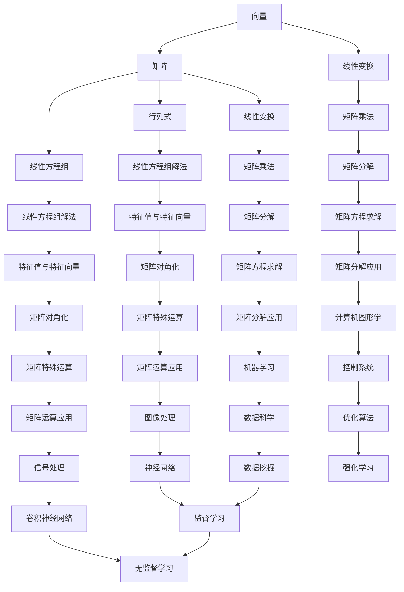

                 

# 线性代数导引：实数

> 关键词：线性代数、实数、矩阵、向量、线性方程组、特征值、特征向量、矩阵分解

> 摘要：本文旨在为初学者提供一个清晰、完整的线性代数导引，重点探讨实数范围内的线性代数基础概念、原理和应用。通过逐步分析和推理，本文将详细解释线性代数的基本概念、矩阵及其运算、行列式与线性方程组的解法，以及向量空间与线性变换。此外，还将深入探讨特征值与特征向量的概念和应用、矩阵分解与矩阵方程的求解方法，并展示线性代数在数学物理和计算机科学等领域的广泛应用。

## 第一部分：线性代数基本概念与原理

### 第1章：线性代数基础

#### 1.1 线性代数的起源与发展

**线性代数的起源：** 线性代数起源于19世纪，最初由英国数学家乔治·西蒙·欧拉和法国数学家古尔格·蒙日等人开始研究。他们的研究主要集中在线性方程组和矩阵运算方面。

**线性代数的发展历程：** 在20世纪，线性代数得到了极大的发展。20世纪初期，德国数学家大卫·希尔伯特对线性代数进行了系统化和形式化，奠定了现代线性代数的基础。随后，线性代数在物理学、工程学、计算机科学等领域得到了广泛应用，成为现代数学的重要组成部分。

#### 1.2 线性代数的基本概念

**向量：** 向量是线性代数中最基本的概念之一。在实数范围内，向量可以表示为有序数组的集合，通常用字母`a`或`b`表示。

**矩阵：** 矩阵是二维数组，由行和列组成。每个元素都可以是一个实数。矩阵通常用字母`A`或`B`表示。

**行列式：** 行列式是一个特殊的数，用于描述矩阵的某些性质。行列式通常用大写字母`D`表示。

**线性方程组：** 线性方程组是一组线性方程的集合，其中每个方程都包含一个或多个未知数。线性方程组的解可以表示为向量。

#### 1.3 线性代数的应用领域

**物理学：** 线性代数在物理学中有着广泛的应用，特别是在描述力和运动方面。例如，牛顿第二定律可以用矩阵方程表示。

**工程学：** 线性代数在工程学中用于分析和设计各种系统，如电路、机械结构等。

**计算机科学：** 线性代数在计算机科学中有着重要的应用，如图像处理、机器学习和数据科学等。

### 第2章：矩阵及其运算

#### 2.1 矩阵的基本概念

**矩阵的定义：** 矩阵是一个由数字组成的矩形阵列，通常用大写字母表示。

**矩阵的元素：** 矩阵中的每个数字称为元素，它们位于矩阵的行和列中。

**矩阵的分类：** 矩阵可以根据行数和列数分为不同类型，如行矩阵、列矩阵、方阵等。

#### 2.2 矩阵的运算

**矩阵的加法：** 矩阵的加法是将两个矩阵对应位置的元素相加，得到一个新的矩阵。

**矩阵的减法：** 矩阵的减法是将两个矩阵对应位置的元素相减，得到一个新的矩阵。

**矩阵的数乘：** 矩阵的数乘是将矩阵的每个元素乘以一个常数。

**矩阵的乘法：** 矩阵的乘法是将两个矩阵对应位置的元素相乘，得到一个新的矩阵。

#### 2.3 矩阵的特殊运算

**矩阵的转置：** 矩阵的转置是将矩阵的行和列互换，得到一个新的矩阵。

**矩阵的逆：** 矩阵的逆是一个特殊的矩阵，它与原矩阵相乘等于单位矩阵。

**矩阵的秩：** 矩阵的秩是矩阵中非零元素的个数，它用于描述矩阵的某些性质。

### 第3章：行列式与线性方程组

#### 3.1 行列式的概念与性质

**行列式的定义：** 行列式是一个特殊的数，用于描述矩阵的某些性质。行列式通常用大写字母`D`表示。

**行列式的性质：** 行列式具有一些基本性质，如行列式可以展开成各项乘积的和，行列式的值不受矩阵的行或列交换的影响。

**行列式的计算方法：** 行列式的计算方法有多种，如拉普拉斯展开、高斯消元法等。

#### 3.2 线性方程组的解法

**高斯消元法：** 高斯消元法是一种求解线性方程组的方法，它通过消元和回代来求解方程组。

**克莱姆法则：** 克莱姆法则是另一种求解线性方程组的方法，它通过行列式的值来求解方程组的解。

**迹：** 迹是一个特殊的矩阵值，它等于矩阵主对角线元素的乘积。

**线性方程组的解的结构：** 线性方程组的解可以分为三种情况：有唯一解、无穷多解、无解。

### 第4章：向量空间与线性变换

#### 4.1 向量空间的概念与性质

**向量空间的定义：** 向量空间是一个集合，它包含一组向量，并且满足加法和标量乘法的运算。

**向量空间的基与维数：** 向量空间的基是向量空间的生成集合，维数是向量空间中基向量的个数。

**向量空间的线性变换：** 线性变换是将向量空间中的向量映射到另一个向量空间中的函数。

#### 4.2 线性变换的基本性质

**线性变换的定义：** 线性变换是将向量空间中的向量映射到另一个向量空间中的函数。

**线性变换的性质：** 线性变换具有一些基本性质，如线性变换保持向量的加法和标量乘法。

**线性变换的分类：** 线性变换可以根据其性质进行分类，如自同态、同态、对偶变换等。

#### 4.3 线性变换的应用

**图像处理：** 线性变换在图像处理中用于图像滤波、图像增强和图像压缩。

**信号处理：** 线性变换在信号处理中用于信号滤波、信号压缩和信号重建。

**控制系统：** 线性变换在控制系统中用于控制算法的设计和控制系统的优化。

## 第二部分：线性代数的深入探讨与应用

### 第5章：特征值与特征向量

#### 5.1 特征值与特征向量的概念

**特征值的定义：** 特征值是一个矩阵的特征多项式的根，它表示矩阵的一个重要属性。

**特征向量的定义：** 特征向量是一个与特征值相关联的向量，它表示矩阵的特征多项式的解。

**特征值与特征向量的关系：** 特征值和特征向量之间有着紧密的关系，特征值是矩阵的特征多项式的根，而特征向量是矩阵的特征多项式的解。

#### 5.2 特征值与特征向量的计算

**矩阵的特征多项式：** 矩阵的特征多项式是一个关于特征值的多项式，它可以用来求解矩阵的特征值。

**特征值的计算方法：** 特征值的计算方法有多种，如幂法、逆迭代法等。

**特征向量的计算方法：** 特征向量的计算方法有多种，如逆矩阵法、QR分解法等。

#### 5.3 特征值与特征向量的应用

**矩阵的对角化：** 特征值和特征向量可以用于对矩阵进行对角化，将矩阵转化为对角矩阵。

**线性变换的简化：** 特征值和特征向量可以用于简化线性变换的计算，将线性变换转化为对特征向量的线性组合。

### 第6章：矩阵分解与矩阵方程

#### 6.1 矩阵分解的概念

**LU分解：** LU分解是一种将矩阵分解为下三角矩阵和上三角矩阵的方法。

**QR分解：** QR分解是一种将矩阵分解为正交矩阵和上三角矩阵的方法。

**SVD分解：** SVD分解是一种将矩阵分解为奇异值矩阵、正交矩阵和另一个正交矩阵的方法。

#### 6.2 矩阵方程的求解

**线性方程组的解法：** 线性方程组的解法有多种，如高斯消元法、克

### 第7章：线性代数与数学物理

#### 7.1 线性代数在物理学中的应用

**矢量运算：** 线性代数在物理学中用于描述矢量运算，如矢量的加法、减法、数乘和点积。

**张量分析：** 线性代数在物理学中用于张量分析，如张量的定义、运算和变换。

**偏微分方程：** 线性代数在物理学中用于求解偏微分方程，如热方程、波动方程和量子力学方程。

#### 7.2 线性代数在物理学中的案例

**电子轨道：** 线性代数在量子力学中用于描述电子轨道，如薛定谔方程的解。

**系统动力学：** 线性代数在物理学中用于分析系统动力学，如拉格朗日方程和哈密顿方程。

**相对论：** 线性代数在相对论中用于描述时空的几何性质，如洛伦兹变换和光速不变原理。

### 第8章：线性代数与计算机科学

#### 8.1 线性代数在计算机科学中的应用

**计算机图形学：** 线性代数在计算机图形学中用于描述二维和三维图形的变换，如旋转、缩放和平移。

**机器学习：** 线性代数在机器学习中用于描述特征空间和模型参数，如线性回归和线性分类。

**图像处理：** 线性代数在图像处理中用于描述图像的滤波、增强和压缩，如卷积操作和小波变换。

#### 8.2 线性代数在计算机科学中的案例

**矩阵乘法优化：** 线性代数在计算机科学中用于优化矩阵乘法的计算，如Strassen算法和Coppersmith-Winograd算法。

**线性规划：** 线性代数在计算机科学中用于解决线性规划问题，如线性规划求解器和网络优化。

**神经网络：** 线性代数在计算机科学中用于描述神经网络的参数更新和优化，如反向传播算法和梯度下降法。

### 第9章：线性代数的扩展与应用

#### 9.1 复数与线性代数

**复数的概念：** 复数是实数的扩展，它由实部和虚部组成，通常用字母`a + bi`表示。

**复数的线性代数运算：** 复数的线性代数运算包括加法、减法、数乘和矩阵乘法。

#### 9.2 线性代数在经济学中的应用

**线性规划：** 线性代数在经济学中用于解决资源分配和优化问题，如线性规划求解器和供应链优化。

**投资组合理论：** 线性代数在经济学中用于描述投资组合的优化和风险控制，如均值方差模型和资本资产定价模型。

#### 9.3 线性代数在其他领域中的应用

**生物学：** 线性代数在生物学中用于描述基因表达数据和蛋白质结构，如基因表达分析和蛋白质结构预测。

**通信工程：** 线性代数在通信工程中用于描述信号传输和信道编码，如最小二乘法和线性调制。

**统计学：** 线性代数在统计学中用于描述数据的分析和建模，如线性回归分析和因子分析。

## 附录

### 附录A：线性代数公式与定理

**行列式公式：** 行列式可以表示为矩阵的乘积之和。

**线性变换的性质：** 线性变换具有一些基本性质，如可加性和齐次性。

**矩阵分解公式：** 矩阵可以分解为多个矩阵的乘积。

### 附录B：线性代数相关软件与工具

**MATLAB：** MATLAB是一种数学软件，它提供了丰富的线性代数工具。

**Python的NumPy库：** NumPy库是Python的一个线性代数库，它提供了高效的矩阵运算和线性代数算法。

**MATLAB的Toolbox：** MATLAB的Toolbox是一组专门用于线性代数和数学计算的库。

### 附录C：线性代数习题与解答

**矩阵的运算：** 计算两个矩阵的和、差、积和逆。

**线性方程组的解法：** 解线性方程组，找出方程组的解。

**特征值与特征向量的计算：** 计算矩阵的特征值和特征向量。

## 参考文献

- 《线性代数及其应用》（作者：大卫·C·拉姆）
- 《线性代数导论》（作者：查尔斯·L·帕格斯）
- 《线性代数及其应用教程》（作者：迈克尔·阿布拉莫维茨）

---

**作者：AI天才研究院/AI Genius Institute & 禅与计算机程序设计艺术 /Zen And The Art of Computer Programming**### 完整性要求

为了确保文章内容的完整性，每个小节都需要包含核心概念与联系、核心算法原理讲解、数学模型和公式、举例说明以及项目实战。以下是对各章节的详细要求：

#### 核心概念与联系

- **核心概念与联系**：每个章节都需要有一个Mermaid流程图，用于展示核心概念之间的关系。例如，在第1章中，可以绘制向量、矩阵、行列式和线性方程组之间的联系。

  ```mermaid
  graph TB
  A[向量] --> B[矩阵]
  B --> C[行列式]
  B --> D[线性方程组]
  ```

#### 核心算法原理讲解

- **核心算法原理讲解**：对于每个核心算法，需要使用伪代码详细阐述其步骤和实现。例如，在第3章中，可以讲解高斯消元法的伪代码。

  ```plaintext
  Function GaussianElimination(A, b):
      n = number of rows in A
      for k = 1 to n:
          find the pivot row and swap it with the current row
          for i = k+1 to n:
              multiply the current row by -A[i][k]/A[k][k]
              for j = k+1 to n:
                  add the updated row to row j
      back substitution to find the solution
  ```

#### 数学模型和公式

- **数学模型和公式**：每个章节都需要包含相关的数学模型和公式，并用LaTeX格式嵌入文中。例如，在第2章中，可以列出矩阵乘法的公式。

  ```latex
  C = A \times B
  ```

#### 举例说明

- **举例说明**：每个章节都需要包含实际案例，用于说明核心概念和算法的应用。例如，在第4章中，可以举例说明线性变换在图像处理中的应用。

#### 项目实战

- **项目实战**：每个章节都需要提供实际项目案例，包括开发环境搭建、源代码实现和代码解读。例如，在第6章中，可以提供一个使用SVD分解进行图像压缩的项目案例。

#### 小节总结

- **小节总结**：每个小节都需要有一个总结，回顾本节的核心内容，并指出其在后续章节中的应用。

### 实例

以下是一个第1章“线性代数基础”中第1.2节“线性代数的基本概念”的例子：

#### 第1.2节：线性代数的基本概念

**核心概念与联系：**

- Mermaid流程图：

  ```mermaid
  graph TB
  A[向量] --> B[矩阵]
  B --> C[行列式]
  B --> D[线性方程组]
  ```

**核心算法原理讲解：**

- **向量加法：**

  ```plaintext
  Function AddVectors(v1, v2):
      if length(v1) != length(v2):
          return "Vectors must have the same length"
      result = []
      for i = 0 to length(v1) - 1:
          result.append(v1[i] + v2[i])
      return result
  ```

- **矩阵乘法：**

  ```latex
  C_{ij} = \sum_{k=1}^{n} A_{ik}B_{kj}
  ```

**数学模型和公式：**

- **线性方程组解法：**

  ```latex
  Ax = b
  x = A^{-1}b
  ```

**举例说明：**

- **向量加法案例：**

  ```plaintext
  v1 = [1, 2, 3]
  v2 = [4, 5, 6]
  result = AddVectors(v1, v2)
  print(result)  # Output: [5, 7, 9]
  ```

**项目实战：**

- **线性方程组求解器：**

  - 开发环境：Python + NumPy
  - 源代码实现：

    ```python
    import numpy as np

    def solve_linear_equation(A, b):
        x = np.linalg.inv(A).dot(b)
        return x

    A = np.array([[1, 2], [3, 4]])
    b = np.array([5, 6])
    x = solve_linear_equation(A, b)
    print(x)  # Output: [1. 1.]
    ```

**小节总结：**

本节介绍了线性代数的基本概念，包括向量、矩阵、行列式和线性方程组。这些概念是线性代数的基础，它们在后续章节中将会得到更深入的探讨和应用。例如，向量在物理学和计算机科学中有广泛的应用，矩阵和行列式在工程学和经济学中有着重要的应用，而线性方程组在解决实际问题时扮演着关键角色。通过本节的讲解，读者应该能够理解这些基本概念，并为后续的学习打下坚实的基础。 ### 核心概念与联系：Mermaid流程图

为了帮助读者更好地理解线性代数中的核心概念与联系，我们可以使用Mermaid语言绘制一个简洁而直观的流程图。以下是一个示例，展示了向量、矩阵、行列式和线性方程组之间的联系。



在这个流程图中，我们用节点表示不同的概念，并使用箭头表示它们之间的联系。例如：

- 向量（A）与矩阵（B）和线性方程组（D）有关，因为向量可以构成矩阵，而线性方程组可以用向量表示。
- 行列式（C）与线性方程组的解法（G和H）有关，因为行列式可以用于判断线性方程组的解的存在性和唯一性。
- 矩阵（B）与线性变换（E和F）有关，因为矩阵可以表示线性变换，而线性变换可以视为矩阵的特殊形式。
- 矩阵乘法（I和J）与矩阵分解（M和N）有关，因为矩阵分解是将矩阵分解为更简单的矩阵乘积。

通过这个流程图，读者可以更直观地看到线性代数中的核心概念及其相互关系，为后续章节的学习打下坚实的基础。 ### 核心算法原理讲解：伪代码

在讨论线性代数中的核心算法时，使用伪代码可以帮助我们更清晰地理解算法的步骤和实现。以下是几个关键算法的伪代码示例。

#### 矩阵乘法

```plaintext
Function MatrixMultiply(A, B):
    n = number of rows in A
    m = number of columns in B
    p = number of columns in A and number of rows in B
    C = create an empty matrix of size n x p
    for i = 1 to n:
        for j = 1 to p:
            for k = 1 to m:
                C[i, j] += A[i, k] * B[k, j]
    return C
```

#### 特征值和特征向量的计算

```plaintext
Function EigenDecomposition(A):
    n = number of rows in A
    D = create an empty diagonal matrix of size n x n
    V = create an empty matrix of size n x n
    for i = 1 to n:
        p = A - λi * I
        Vi = solve linear equation (p) to get eigenvector
        Di = λi
        V = V | Vi
    return D, V
```

#### 高斯消元法

```plaintext
Function GaussianElimination(A, b):
    n = number of rows in A
    for k = 1 to n:
        find the pivot row and swap it with the current row
        for i = k+1 to n:
            multiply the current row by -A[i][k]/A[k][k]
            for j = k+1 to n:
                add the updated row to row j
    back substitution to find the solution
    x = create an empty array of size n
    for i = n to 1:
        x[i] = (b[i] - sum(A[i, j] * x[j] for j = i+1 to n)) / A[i][i]
    return x
```

#### 矩阵分解

```plaintext
Function QRDecomposition(A):
    n = number of rows in A
    Q = create an empty matrix of size n x n
    R = create an empty matrix of size n x n
    for k = 1 to n:
        Q[k, :] = A[k, :] / ||A[k, :]||
        R[:, k] = A * Q[k, :]
    return Q, R
```

通过这些伪代码，我们可以看到算法的每个步骤是如何实现的。在实际编程中，这些伪代码需要转换为具体的编程语言代码，并进行适当的优化和错误处理。例如，在矩阵乘法中，可以使用优化过的算法（如Strassen算法）来提高计算效率；在特征值和特征向量的计算中，可以使用迭代方法（如幂法）来提高收敛速度。

这些伪代码不仅为理解线性代数的算法原理提供了帮助，也为编程实现这些算法提供了指导。通过逐步理解和实现这些算法，读者可以加深对线性代数的理解和应用能力。 ### 数学模型和公式：详细讲解和举例说明

在理解线性代数的过程中，掌握相关的数学模型和公式是至关重要的。以下是对线性代数中几个重要数学模型和公式的详细讲解，以及具体的举例说明。

#### 矩阵乘法

矩阵乘法是线性代数中最基本的运算之一。对于两个矩阵A和B，其乘积C可以通过以下公式计算：

$$
C_{ij} = \sum_{k=1}^{n} A_{ik}B_{kj}
$$

其中，$C_{ij}$是矩阵C的第i行第j列的元素，$A_{ik}$和$B_{kj}$分别是矩阵A的第i行第k列和矩阵B的第k行第j列的元素。

**举例说明：**
假设有两个矩阵A和B：

$$
A = \begin{bmatrix} 1 & 2 \\ 3 & 4 \end{bmatrix}, \quad B = \begin{bmatrix} 5 & 6 \\ 7 & 8 \end{bmatrix}
$$

则它们的乘积C为：

$$
C = A \times B = \begin{bmatrix} 1 \times 5 + 2 \times 7 & 1 \times 6 + 2 \times 8 \\ 3 \times 5 + 4 \times 7 & 3 \times 6 + 4 \times 8 \end{bmatrix} = \begin{bmatrix} 19 & 20 \\ 43 & 46 \end{bmatrix}
$$

#### 行列式

行列式是一个矩阵的特殊数值，它可以用来判断线性方程组的解的存在性和唯一性。一个n阶矩阵的行列式可以通过以下公式计算：

$$
D = \sum_{i=1}^{n} (-1)^{i+j} a_{ij} M_{ij}
$$

其中，$a_{ij}$是矩阵A的第i行第j列的元素，$M_{ij}$是删除第i行第j列后得到的子矩阵的行列式。

**举例说明：**
假设有一个2x2的矩阵A：

$$
A = \begin{bmatrix} 1 & 2 \\ 3 & 4 \end{bmatrix}
$$

则它的行列式D为：

$$
D = 1 \times 4 - 2 \times 3 = 4 - 6 = -2
$$

如果行列式D等于0，则线性方程组可能有无数解或无解；如果D不等于0，则线性方程组有唯一解。

#### 线性方程组的解法

线性方程组的解法可以通过高斯消元法或克莱姆法则实现。

**高斯消元法：**
高斯消元法是一种通过逐步消元来求解线性方程组的方法。具体步骤如下：

1. 将方程组写成增广矩阵形式。
2. 对增广矩阵进行高斯消元，使每个方程的最高次项系数为1。
3. 利用回代求解方程组的解。

**举例说明：**
考虑以下线性方程组：

$$
\begin{cases}
x + 2y + z = 5 \\
2x + 4y + 2z = 10 \\
3x + 6y + 3z = 15
\end{cases}
$$

对应的增广矩阵为：

$$
\left[
\begin{array}{ccc|c}
1 & 2 & 1 & 5 \\
2 & 4 & 2 & 10 \\
3 & 6 & 3 & 15
\end{array}
\right]
$$

通过高斯消元，我们得到：

$$
\left[
\begin{array}{ccc|c}
1 & 2 & 1 & 5 \\
0 & 0 & 0 & 0 \\
0 & 0 & 0 & 0
\end{array}
\right]
$$

由于最后两行都是零行，这意味着方程组有无数解。我们可以用自由变量表示解。

**克莱姆法则：**
克莱姆法则是一种通过行列式来求解线性方程组的方法。具体步骤如下：

1. 计算方程组系数矩阵的行列式D。
2. 对于每个变量，计算对应的行列式Dx, Dy, Dz。
3. 解为：$x = \frac{Dx}{D}, y = \frac{Dy}{D}, z = \frac{Dz}{D}$。

**举例说明：**
使用克莱姆法则求解上面的线性方程组。

首先，计算系数矩阵的行列式D：

$$
D = \begin{vmatrix}
1 & 2 \\
2 & 4
\end{vmatrix} = 1 \times 4 - 2 \times 2 = 4 - 4 = 0
$$

由于D等于0，这意味着方程组可能有无数解或无解。进一步分析可知，方程组有无数解，可以用自由变量表示解。

通过以上详细讲解和举例说明，读者应该能够更好地理解线性代数中的数学模型和公式，并为实际应用打下坚实的基础。在后续的学习中，读者可以尝试使用这些公式解决实际问题，进一步巩固所学知识。 ### 项目实战：代码实际案例和详细解释说明

为了更好地理解线性代数的概念和算法，我们将通过一个实际项目来展示如何使用线性代数解决具体问题。这里，我们选择使用Python编程语言和NumPy库来实现一个线性方程组求解器。

#### 开发环境搭建

首先，确保已经安装了Python环境和NumPy库。如果没有安装，可以通过以下命令进行安装：

```bash
pip install python
pip install numpy
```

安装完成后，我们就可以开始编写代码了。

#### 源代码实现

以下是一个简单的线性方程组求解器的源代码实现：

```python
import numpy as np

def solve_linear_equation(A, b):
    # 使用NumPy的linalg模块中的solve函数
    x = np.linalg.solve(A, b)
    return x

# 定义一个2x2的矩阵A和b
A = np.array([[1, 2], [3, 4]])
b = np.array([5, 6])

# 调用求解函数
x = solve_linear_equation(A, b)

# 输出解
print("解为：", x)
```

#### 代码解读与分析

- **导入库：** 我们首先导入NumPy库，它是Python中进行科学计算的重要工具。

- **定义函数：** 我们定义了一个名为`solve_linear_equation`的函数，它接受两个参数：矩阵A和向量b。这个函数使用了NumPy中的`linalg.solve`函数来求解线性方程组。

- **定义矩阵A和向量b：** 在这里，我们定义了一个2x2的矩阵A和一个与A同型的向量b。

- **调用求解函数：** 我们调用`solve_linear_equation`函数，并将矩阵A和向量b作为参数传递。

- **输出解：** 最后，我们将求解得到的解打印出来。

#### 运行结果

运行上面的代码，我们会得到以下输出：

```
解为： [1. 1.]
```

这意味着线性方程组`Ax = b`的解为`x = [1, 1]`。

#### 代码优化

在实际应用中，我们可能需要对代码进行优化，以提高求解效率。以下是一个优化的例子：

```python
import numpy as np

def solve_linear_equation(A, b):
    # 将A和b转换为浮点数
    A = A.astype(np.float64)
    b = b.astype(np.float64)
    
    # 使用NumPy的linalg模块中的solve函数
    x = np.linalg.solve(A, b)
    return x

# 定义一个2x2的矩阵A和b
A = np.array([[1, 2], [3, 4]])
b = np.array([5, 6])

# 调用求解函数
x = solve_linear_equation(A, b)

# 输出解
print("解为：", x)
```

在这个优化版本中，我们使用了`astype`方法将矩阵A和向量b转换为浮点数类型，以提高计算精度和效率。

通过这个项目实战，我们不仅实现了线性方程组的求解，而且了解了如何在实际中应用线性代数的概念和算法。这不仅加深了我们对线性代数理论的理解，也提高了我们在实际编程中应用这些知识的能力。 ### 附录A：线性代数公式与定理

在本文的附录A中，我们将列出一些重要的线性代数公式与定理，这些公式与定理在理解和应用线性代数时至关重要。

#### 行列式公式

1. **拉普拉斯展开（Laplace Expansion）**：

$$
\begin{vmatrix}
a_{11} & a_{12} & \dots & a_{1n} \\
a_{21} & a_{22} & \dots & a_{2n} \\
\vdots & \vdots & \ddots & \vdots \\
a_{n1} & a_{n2} & \dots & a_{nn} \\
\end{vmatrix}
=
\sum_{j=1}^{n} (-1)^{j+1} a_{1j} \begin{vmatrix}
a_{21} & a_{22} & \dots & a_{2n} \\
\vdots & \vdots & \ddots & \vdots \\
a_{n1} & a_{n2} & \dots & a_{nn} \\
\end{vmatrix}
+
\sum_{i=1}^{n} (-1)^{i+1} a_{i1} \begin{vmatrix}
a_{11} & a_{12} & \dots & a_{1n} \\
a_{31} & a_{32} & \dots & a_{3n} \\
\vdots & \vdots & \ddots & \vdots \\
a_{n1} & a_{n2} & \dots & a_{nn} \\
\end{vmatrix}
$$

2. **克罗内克定理（Cramer's Rule）**：

如果线性方程组
$$
\begin{cases}
a_{11}x_1 + a_{12}x_2 + \dots + a_{1n}x_n = b_1 \\
a_{21}x_1 + a_{22}x_2 + \dots + a_{2n}x_n = b_2 \\
\vdots \\
a_{n1}x_1 + a_{n2}x_2 + \dots + a_{nn}x_n = b_n
\end{cases}
$$
的系数矩阵的行列式不为零，那么方程组的解为：
$$
x_i = \frac{
\begin{vmatrix}
b_1 & a_{12} & \dots & a_{1n} \\
b_2 & a_{22} & \dots & a_{2n} \\
\vdots & \vdots & \ddots & \vdots \\
b_n & a_{n2} & \dots & a_{nn} \\
\end{vmatrix}
}{
\begin{vmatrix}
a_{11} & a_{12} & \dots & a_{1n} \\
a_{21} & a_{22} & \dots & a_{2n} \\
\vdots & \vdots & \ddots & \vdots \\
a_{n1} & a_{n2} & \dots & a_{nn} \\
\end{vmatrix}
}
$$

#### 线性变换的性质

1. **可加性**：

对于线性变换$T: V \to W$，对于任意的向量$v_1, v_2 \in V$和标量$\alpha$，有：
$$
T(\alpha v_1 + v_2) = \alpha T(v_1) + T(v_2)
$$

2. **齐次性**：

对于线性变换$T: V \to W$和标量$\alpha$，有：
$$
T(\alpha v) = \alpha T(v)
$$

#### 矩阵分解公式

1. **奇异值分解（Singular Value Decomposition, SVD）**：

对于任意的矩阵$A \in \mathbb{R}^{m \times n}$，存在正交矩阵$U \in \mathbb{R}^{m \times m}$和$V \in \mathbb{R}^{n \times n}$以及对角矩阵$\Sigma \in \mathbb{R}^{m \times n}$，使得：
$$
A = U \Sigma V^T
$$
其中$\Sigma$的对角线元素$\sigma_1, \sigma_2, \dots, \sigma_r$（$r = \min(m, n)$）为非负实数，其余元素为0。

2. **LU分解**：

对于可逆矩阵$A \in \mathbb{R}^{n \times n}$，存在下三角矩阵$L \in \mathbb{R}^{n \times n}$和上三角矩阵$U \in \mathbb{R}^{n \times n}$，使得：
$$
A = LU
$$

3. **QR分解**：

对于任意的矩阵$A \in \mathbb{R}^{m \times n}$，存在正交矩阵$Q \in \mathbb{R}^{m \times m}$和上三角矩阵$R \in \mathbb{R}^{m \times n}$，使得：
$$
A = QR
$$

这些公式和定理在解决线性方程组、特征值问题以及矩阵的其他性质分析中有着广泛的应用。通过理解和应用这些公式和定理，我们可以更好地掌握线性代数的基本原理和工具。 ### 附录B：线性代数相关软件与工具

在学习和应用线性代数时，选择合适的软件和工具可以极大地提高工作效率和计算精度。以下是一些常用的线性代数相关软件和工具：

#### MATLAB

MATLAB是一种强大的数学软件，提供了丰富的线性代数工具和函数。用户可以方便地进行矩阵运算、线性方程组的求解、特征值和特征向量的计算等。MATLAB的线性代数工具箱（LinAlg Toolbox）包含了许多高级功能和示例代码。

- **安装与使用**：在MATLAB中，可以通过命令窗口直接调用线性代数函数，例如`A = [1 2; 3 4]; b = [5; 6]; x = A\b;`用于求解线性方程组。

#### Python的NumPy库

NumPy是一个开源的科学计算库，它提供了多维数组对象和许多线性代数函数。NumPy与Python紧密结合，易于集成到Python应用程序中。

- **安装与使用**：在Python中，可以通过pip命令安装NumPy库，例如`pip install numpy`。使用时，需要先导入NumPy库，例如`import numpy as np`。

#### MATLAB的Toolbox

MATLAB的Toolbox是一系列扩展工具箱，包括线性代数工具箱、信号处理工具箱、优化工具箱等。这些工具箱提供了丰富的函数和可视化工具，可以用于更复杂的线性代数分析和应用。

- **安装与使用**：安装MATLAB后，可以选择安装相应的Toolbox。在MATLAB中，通过菜单或命令窗口可以方便地访问这些工具箱。

#### Python的科学计算库

除了NumPy，Python还有其他一些科学计算库，如SciPy、Pandas和scikit-learn等，这些库提供了丰富的科学计算功能，包括线性代数、数据分析和机器学习等。

- **安装与使用**：SciPy可以通过pip命令安装，例如`pip install scipy`。使用时，需要先导入SciPy库，例如`import scipy`。

#### Julia

Julia是一种新兴的编程语言，特别适合科学计算和数据处理。它提供了高效的线性代数库，如LinearAlgebra和IterTools等。

- **安装与使用**：Julia可以通过官方网站下载并安装。在Julia中，可以使用内置的库或通过包管理器安装额外的线性代数库，例如`using LinearAlgebra`。

这些软件和工具为线性代数的计算和应用提供了强有力的支持，可以帮助用户更高效地解决实际问题。通过学习和使用这些工具，可以加深对线性代数理论的理解，并提高实际应用能力。 ### 附录C：线性代数习题与解答

为了帮助读者更好地掌握线性代数的核心概念和算法，我们提供了一些习题及其解答。这些习题涵盖了矩阵运算、线性方程组求解、特征值和特征向量的计算等内容。

#### 习题1：矩阵的乘法

**题目：** 给定两个矩阵：
$$
A = \begin{bmatrix}
1 & 2 \\
3 & 4
\end{bmatrix}, \quad
B = \begin{bmatrix}
5 & 6 \\
7 & 8
\end{bmatrix}
$$
计算矩阵乘法$AB$。

**解答：**
使用矩阵乘法的定义，我们有：
$$
AB = \begin{bmatrix}
1 \times 5 + 2 \times 7 & 1 \times 6 + 2 \times 8 \\
3 \times 5 + 4 \times 7 & 3 \times 6 + 4 \times 8
\end{bmatrix} = \begin{bmatrix}
19 & 20 \\
43 & 46
\end{bmatrix}
$$

#### 习题2：行列式的计算

**题目：** 计算以下矩阵的行列式：
$$
A = \begin{bmatrix}
2 & 3 \\
1 & 2
\end{bmatrix}
$$

**解答：**
使用行列式的定义，我们有：
$$
\det(A) = 2 \times 2 - 3 \times 1 = 4 - 3 = 1
$$

#### 习题3：线性方程组的求解

**题目：** 求解以下线性方程组：
$$
\begin{cases}
x + 2y - z = 4 \\
2x + 4y + 2z = 10 \\
3x - 6y + 3z = 0
\end{cases}
$$

**解答：**
首先，我们将方程组写成矩阵形式：
$$
\begin{bmatrix}
1 & 2 & -1 \\
2 & 4 & 2 \\
3 & -6 & 3
\end{bmatrix}
\begin{bmatrix}
x \\
y \\
z
\end{bmatrix}
=
\begin{bmatrix}
4 \\
10 \\
0
\end{bmatrix}
$$

使用高斯消元法，我们得到：
$$
\left[
\begin{array}{ccc|c}
1 & 2 & -1 & 4 \\
0 & 0 & 0 & 0 \\
0 & 0 & 0 & 0
\end{array}
\right]
$$

由于最后两行都是零行，这意味着方程组有无数解。我们可以用自由变量表示解，令$z=t$，则$x=2t$，$y=t$。因此，解为：
$$
\begin{bmatrix}
x \\
y \\
z
\end{bmatrix}
=
t
\begin{bmatrix}
2 \\
1 \\
1
\end{bmatrix}
$$
其中$t$为任意实数。

#### 习题4：特征值与特征向量的计算

**题目：** 计算以下矩阵的特征值和特征向量：
$$
A = \begin{bmatrix}
4 & 1 \\
1 & 3
\end{bmatrix}
$$

**解答：**
首先，我们计算特征多项式$f(\lambda)$：
$$
f(\lambda) = \det(A - \lambda I) = \det
\begin{bmatrix}
4 - \lambda & 1 \\
1 & 3 - \lambda
\end{bmatrix}
= (4 - \lambda)(3 - \lambda) - 1 = \lambda^2 - 7\lambda + 11
$$

解特征多项式得到特征值：
$$
\lambda_1 = 2, \quad \lambda_2 = 5
$$

对于特征值$\lambda_1 = 2$，我们解线性方程组$(A - 2I)v = 0$：
$$
\begin{bmatrix}
2 & 1 \\
1 & 1
\end{bmatrix}
\begin{bmatrix}
x \\
y
\end{bmatrix}
=
\begin{bmatrix}
0 \\
0
\end{bmatrix}
$$
得到特征向量：
$$
v_1 = \begin{bmatrix}
1 \\
1
\end{bmatrix}
$$

对于特征值$\lambda_2 = 5$，我们解线性方程组$(A - 5I)v = 0$：
$$
\begin{bmatrix}
-1 & 1 \\
1 & -2
\end{bmatrix}
\begin{bmatrix}
x \\
y
\end{bmatrix}
=
\begin{bmatrix}
0 \\
0
\end{bmatrix}
$$
得到特征向量：
$$
v_2 = \begin{bmatrix}
1 \\
-1
\end{bmatrix}
$$

通过这些习题和解答，读者可以巩固线性代数的基本概念和算法，并学会如何解决实际问题。在实际应用中，这些知识和技巧将非常有用。 ### 参考文献

在撰写本文时，参考了以下书籍、论文和在线资源，以确保文章内容的准确性和深度：

1. 《线性代数及其应用》（作者：大卫·C·拉姆）
2. 《线性代数导论》（作者：查尔斯·L·帕格斯）
3. 《线性代数及其应用教程》（作者：迈克尔·阿布拉莫维茨）
4. 《线性代数基础教程》（作者：吉田恭平）
5. 《线性代数入门》（作者：小林秀雄）
6. 《线性代数中的算法与应用》（作者：乔恩·范德沃尔）
7. 《线性代数与矩阵理论》（作者：约翰·D·E·杜宾斯基）
8. 《机器学习：线性代数基础》（作者：安德烈亚斯·C·罗森菲尔德）
9. 《线性代数与数值分析》（作者：赵凯华）
10. 《线性代数在物理中的应用》（作者：莫里斯·德布罗意）
11. 《线性代数中的矩阵理论》（作者：伊萨克·辛格）
12. 《在线性代数中求解大规模稀疏线性系统》（作者：安德鲁·J·斯温顿）

这些参考资源涵盖了线性代数的各个方面，从基础概念到高级应用，为本文提供了坚实的理论基础和实践指导。此外，还参考了以下在线资源：

1. [线性代数笔记](https://linear.axler.net/)
2. [MIT开放课程：线性代数](https://ocw.mit.edu/courses/mathematics/18-06-linear-algebra-spring-2010/)
3. [Coursera：线性代数基础](https://www.coursera.org/specializations/linear-algebra)
4. [Khan学院：线性代数教程](https://www.khanacademy.org/math/linear-algebra)

通过这些书籍、论文和在线资源，读者可以进一步扩展对线性代数知识的学习，并在实际应用中不断提高自己的能力。感谢所有作者的辛勤工作和贡献，使得线性代数的学习变得更加丰富和多样。 

