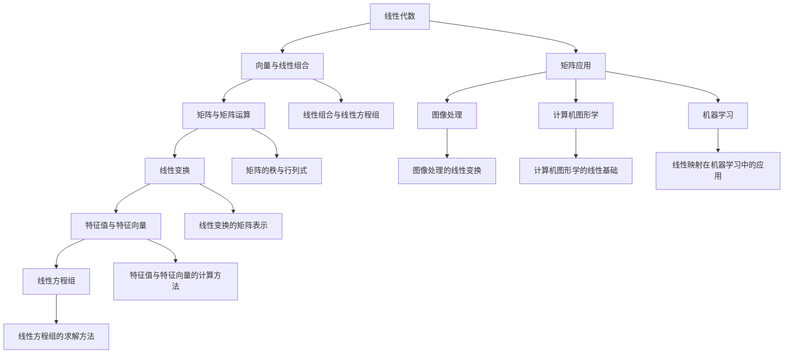

                 


# 文章标题：线性代数导引：矩阵与线性映射

> 关键词：线性代数，矩阵，线性映射，特征值，特征向量，线性方程组，图像处理，计算机图形学，机器学习

> 摘要：本文将系统地介绍线性代数的基础理论，包括向量与线性组合、矩阵与矩阵运算、线性变换、特征值与特征向量以及线性方程组等内容。同时，还将探讨矩阵与线性映射在数据分析、图像处理、计算机图形学和机器学习等领域的应用，以帮助读者深入理解和掌握线性代数在实际问题中的运用。

## 目录

### 第一部分：线性代数基础理论

#### 1. 线性代数简介  
#### 1.1 线性代数的起源与应用  
#### 1.2 线性代数的基本概念

#### 2. 向量与线性组合  
#### 2.1 向量的概念与运算  
#### 2.2 线性组合与线性方程组

#### 3. 矩阵与矩阵运算  
#### 3.1 矩阵的概念与性质  
#### 3.2 矩阵的运算  
#### 3.3 矩阵的秩与行列式

#### 4. 线性变换  
#### 4.1 线性变换的定义与性质  
#### 4.2 线性变换的矩阵表示

#### 5. 特征值与特征向量  
#### 5.1 特征值与特征向量的概念  
#### 5.2 特征值与特征向量的性质  
#### 5.3 特征值与特征向量的计算方法

#### 6. 线性方程组  
#### 6.1 线性方程组的基本理论  
#### 6.2 线性方程组的求解方法

### 第二部分：矩阵与线性映射的应用

#### 7. 矩阵在数据分析中的应用  
#### 7.1 数据矩阵的构建与运算  
#### 7.2 数据分析的线性模型

#### 8. 线性映射在图像处理中的应用  
#### 8.1 图像处理的线性变换  
#### 8.2 线性滤波器的设计与应用

#### 9. 矩阵在计算机图形学中的应用  
#### 9.1 计算机图形学的线性基础  
#### 9.2 矩阵变换在图形渲染中的应用

#### 10. 线性映射在机器学习中的应用  
#### 10.1 线性模型在机器学习中的应用  
#### 10.2 线性映射与神经网络

### 第三部分：附录与扩展阅读

#### 11. 数学公式与符号表  
#### 11.1 基本数学公式  
#### 11.2 常用符号表

#### 12. 扩展阅读与参考资源  
#### 12.1 线性代数经典教材推荐  
#### 12.2 线性代数相关研究论文与报告

## 第一部分：线性代数基础理论

### 1. 线性代数简介

线性代数是数学的一个重要分支，它研究向量、矩阵以及线性方程组等基本对象及其相互关系。线性代数的基本概念包括向量、矩阵、线性组合、线性变换、特征值和特征向量等，这些概念在数学、物理学、计算机科学、工程学等多个领域都有广泛应用。

#### 1.1 线性代数的起源与应用

线性代数的起源可以追溯到17世纪的微积分学和18世纪的线性方程组。法国数学家艾萨克·牛顿（Isaac Newton）和德国数学家莱昂哈德·欧拉（Leonhard Euler）在研究力学和电学问题时，提出了线性方程组的概念。19世纪，英国数学家乔治·西蒙·欧姆（George Simon Ohm）和德国数学家卡尔·弗里德里希·高斯（Carl Friedrich Gauss）等人在研究电路理论和数值分析时，进一步发展了线性代数的方法。

在现代，线性代数在诸多领域有着广泛的应用：

- **物理学**：线性代数在经典力学、量子力学、电磁学等领域中扮演着核心角色，用于描述物体和场的运动与变化。
- **计算机科学**：线性代数是计算机图形学、机器学习、数值计算等领域的基础，用于处理图像、数据、算法等。
- **工程学**：线性代数在电子工程、通信工程、控制工程、机械工程等领域中用于分析系统的动态行为和优化设计。
- **经济学**：线性代数在经济学中用于建立线性规划模型，解决资源分配和决策问题。

#### 1.2 线性代数的基本概念

在理解线性代数的基本概念之前，我们需要先了解一些基础的数学概念。

- **数域（Field）**：数域是一组数的集合，这些数可以进行加法、减法、乘法和除法（除数不能为零）运算。常见的数域包括实数域（\(\mathbb{R}\)）和复数域（\(\mathbb{C}\)）。
- **向量（Vector）**：向量是一个具有大小和方向的量，通常用一对有序数表示。在二维空间中，一个向量可以表示为 \((x, y)\)，其中 \(x\) 和 \(y\) 分别表示向量的横坐标和纵坐标。
- **矩阵（Matrix）**：矩阵是一个由数按行列排列的矩形数组。一个 \(m \times n\) 的矩阵可以表示为 \(A = [a_{ij}]\)，其中 \(a_{ij}\) 表示矩阵的元素，\(i\) 和 \(j\) 分别表示行和列的索引。

在了解这些基本概念后，我们可以进一步探讨线性代数中的核心概念。

### 2. 向量与线性组合

#### 2.1 向量的概念与运算

向量是线性代数中最基本的对象之一。一个向量可以表示为 \((x, y)\)，其中 \(x\) 和 \(y\) 分别是向量的分量。

向量的运算包括加法、减法、标量乘法和向量积等。

- **向量加法**：两个向量 \(\vec{a} = (a_1, a_2)\) 和 \(\vec{b} = (b_1, b_2)\) 的加法结果是一个新向量 \(\vec{c} = (c_1, c_2)\)，其中 \(c_1 = a_1 + b_1\) 和 \(c_2 = a_2 + b_2\)。
- **向量减法**：两个向量 \(\vec{a} = (a_1, a_2)\) 和 \(\vec{b} = (b_1, b_2)\) 的减法结果是一个新向量 \(\vec{c} = (c_1, c_2)\)，其中 \(c_1 = a_1 - b_1\) 和 \(c_2 = a_2 - b_2\)。
- **标量乘法**：一个向量 \(\vec{a} = (a_1, a_2)\) 和一个标量 \(c\) 的标量乘法结果是一个新向量 \(\vec{c} = (c_1, c_2)\)，其中 \(c_1 = ca_1\) 和 \(c_2 = ca_2\)。
- **向量积**：两个三维向量 \(\vec{a} = (a_1, a_2, a_3)\) 和 \(\vec{b} = (b_1, b_2, b_3)\) 的向量积是一个新向量 \(\vec{c} = (c_1, c_2, c_3)\)，其中 \(c_1 = a_2b_3 - a_3b_2\)，\(c_2 = a_3b_1 - a_1b_3\)，\(c_3 = a_1b_2 - a_2b_1\)。

#### 2.2 线性组合与线性方程组

线性组合是指由一组向量通过线性运算得到的向量。设向量组 \(\vec{v_1}, \vec{v_2}, ..., \vec{v_n}\) 和一组标量 \(c_1, c_2, ..., c_n\)，则线性组合表示为：

$$
\vec{c} = c_1\vec{v_1} + c_2\vec{v_2} + ... + c_n\vec{v_n}
$$

线性方程组是指由一组线性方程构成的问题。一个线性方程组可以表示为：

$$
\begin{cases}
a_{11}x_1 + a_{12}x_2 + ... + a_{1n}x_n = b_1 \\
a_{21}x_1 + a_{22}x_2 + ... + a_{2n}x_n = b_2 \\
\vdots \\
a_{m1}x_1 + a_{m2}x_2 + ... + a_{mn}x_n = b_m
\end{cases}
$$

线性方程组可以通过矩阵形式表示为：

$$
\mathbf{Ax} = \mathbf{b}
$$

其中，\(\mathbf{A}\) 是系数矩阵，\(\mathbf{x}\) 是变量向量，\(\mathbf{b}\) 是常数向量。

#### 2.3 线性方程组的求解方法

线性方程组的求解方法是线性代数中的一个重要问题。以下是几种常见的求解方法：

- **高斯消元法**：通过逐步消元，将线性方程组转化为上三角矩阵或下三角矩阵，然后回代求解。
- **矩阵求逆法**：利用系数矩阵的逆矩阵求解线性方程组。
- **迭代法**：通过迭代过程逐步逼近线性方程组的解。

### 3. 矩阵与矩阵运算

#### 3.1 矩阵的概念与性质

矩阵是线性代数中的一种重要对象。一个 \(m \times n\) 的矩阵可以表示为 \(A = [a_{ij}]\)，其中 \(a_{ij}\) 表示矩阵的元素，\(i\) 和 \(j\) 分别表示行和列的索引。

矩阵的性质包括：

- **矩阵的转置**：矩阵的转置是将原矩阵的行与列互换得到的新矩阵。一个 \(m \times n\) 的矩阵 \(A\) 的转置记为 \(A^T\)。
- **矩阵的逆**：如果矩阵 \(A\) 是可逆的，则其逆矩阵记为 \(A^{-1}\)，满足 \(AA^{-1} = A^{-1}A = I\)，其中 \(I\) 是单位矩阵。
- **矩阵的秩**：矩阵的秩是指矩阵中非零行的最大个数。
- **矩阵的行列式**：矩阵的行列式是一个标量，用于描述矩阵的性质。一个 \(n \times n\) 的矩阵 \(A\) 的行列式记为 \(|A|\)。

#### 3.2 矩阵的运算

矩阵的运算包括矩阵的加法、减法、乘法、转置和逆等。

- **矩阵加法**：两个 \(m \times n\) 的矩阵 \(A\) 和 \(B\) 的加法结果是一个新矩阵 \(C\)，其中 \(c_{ij} = a_{ij} + b_{ij}\)。
- **矩阵减法**：两个 \(m \times n\) 的矩阵 \(A\) 和 \(B\) 的减法结果是一个新矩阵 \(C\)，其中 \(c_{ij} = a_{ij} - b_{ij}\)。
- **矩阵乘法**：两个 \(m \times n\) 的矩阵 \(A\) 和 \(B\) 的乘法结果是一个新矩阵 \(C\)，其中 \(c_{ij} = \sum_{k=1}^{n} a_{ik}b_{kj}\)。
- **矩阵转置**：矩阵的转置是将原矩阵的行与列互换得到的新矩阵。
- **矩阵逆**：矩阵的逆是另一个矩阵，使得两个矩阵的乘积为单位矩阵。

#### 3.3 矩阵的秩与行列式

矩阵的秩是指矩阵中非零行的最大个数。一个 \(m \times n\) 的矩阵的秩 \(r\) 满足以下性质：

- \(0 \leq r \leq \min(m, n)\)
- 矩阵的秩等于其行数或列数
- 矩阵的秩等于其行空间或列空间的维数

矩阵的行列式是一个标量，用于描述矩阵的性质。一个 \(n \times n\) 的矩阵 \(A\) 的行列式 \(|A|\) 满足以下性质：

- \(|A| = 0\) 当且仅当矩阵 \(A\) 不可逆
- \(|A|\) 是矩阵 \(A\) 的特征值之和
- 行列式可以用于求解线性方程组

### 4. 线性变换

#### 4.1 线性变换的定义与性质

线性变换是指将一个向量空间映射到另一个向量空间的函数。设向量空间 \(V\) 和 \(W\)，线性变换 \(T: V \rightarrow W\) 满足以下性质：

- **加法保持性**：对于任意向量 \(\vec{u}, \vec{v} \in V\)，有 \(T(\vec{u} + \vec{v}) = T(\vec{u}) + T(\vec{v})\)。
- **数乘保持性**：对于任意向量 \(\vec{u} \in V\) 和标量 \(c\)，有 \(T(c\vec{u}) = cT(\vec{u})\)。

线性变换可以表示为矩阵乘法。设线性变换 \(T\) 对应的矩阵为 \(A\)，向量 \(\vec{x} \in V\) 对应的列向量为 \(\vec{y} \in W\)，则有：

$$
\vec{y} = T(\vec{x}) = A\vec{x}
$$

#### 4.2 线性变换的矩阵表示

线性变换的矩阵表示是指通过矩阵来表示线性变换。设向量空间 \(V\) 和 \(W\) 分别由基向量 \(\{\vec{e_1}, \vec{e_2}, ..., \vec{e_n}\}\) 和 \(\{\vec{f_1}, \vec{f_2}, ..., \vec{f_m}\}\) 张成，线性变换 \(T: V \rightarrow W\) 对应的矩阵为 \(A\)，则有：

$$
T(\vec{e_i}) = \sum_{j=1}^{m} a_{ij}\vec{f_j}
$$

其中，\(a_{ij}\) 是矩阵 \(A\) 的元素。

#### 4.3 线性变换的性质

线性变换具有以下性质：

- **保向性**：线性变换保持向量的方向。
- **保长度性**：线性变换保持向量的长度。
- **保线性组合性**：线性变换保持线性组合。
- **保线性方程组性**：线性变换保持线性方程组的解。

### 5. 特征值与特征向量

#### 5.1 特征值与特征向量的概念

特征值和特征向量是线性变换中的重要概念。设线性变换 \(T\) 对应的矩阵为 \(A\)，如果存在非零向量 \(\vec{v} \in V\) 和标量 \(\lambda \in \mathbb{R}\)，使得：

$$
T(\vec{v}) = \lambda\vec{v}
$$

则称 \(\lambda\) 为 \(T\) 的特征值，\(\vec{v}\) 为 \(T\) 的特征向量。

#### 5.2 特征值与特征向量的性质

特征值和特征向量具有以下性质：

- **唯一性**：一个线性变换的特征值是唯一的，但特征向量可能不唯一。
- **线性无关性**：特征向量是线性无关的。
- **稳定性**：如果线性变换是可逆的，则其特征值和特征向量保持不变。
- **对角化性**：如果一个线性变换的特征向量可以构成一个基，则该线性变换可以表示为对角矩阵。

#### 5.3 特征值与特征向量的计算方法

计算特征值和特征向量的一般方法如下：

1. 计算矩阵 \(A\) 的特征多项式 \(f(\lambda)\)：

$$
f(\lambda) = \det(A - \lambda I)
$$

其中，\(\det\) 表示行列式，\(I\) 是单位矩阵。

2. 求解特征多项式 \(f(\lambda) = 0\)，得到特征值 \(\lambda\)。

3. 对于每个特征值 \(\lambda\)，求解线性方程组 \((A - \lambda I)\vec{v} = \vec{0}\)，得到对应的特征向量 \(\vec{v}\)。

#### 5.4 特征值与特征向量的应用

特征值和特征向量在多个领域有广泛的应用：

- **矩阵对角化**：通过计算矩阵的特征值和特征向量，可以将矩阵对角化，简化矩阵的运算。
- **图像处理**：在图像处理中，特征值和特征向量用于图像的特征提取和特征分析。
- **机器学习**：在机器学习中，特征值和特征向量用于特征选择和特征降维。

### 6. 线性方程组

#### 6.1 线性方程组的基本理论

线性方程组是线性代数中的一个重要问题。一个线性方程组可以表示为：

$$
\begin{cases}
a_{11}x_1 + a_{12}x_2 + ... + a_{1n}x_n = b_1 \\
a_{21}x_1 + a_{22}x_2 + ... + a_{2n}x_n = b_2 \\
\vdots \\
a_{m1}x_1 + a_{m2}x_2 + ... + a_{mn}x_n = b_m
\end{cases}
$$

线性方程组的基本理论包括以下内容：

- **线性无关性与线性相关性**：向量组 \(\vec{v_1}, \vec{v_2}, ..., \vec{v_n}\) 是线性无关的，当且仅当对于任意一组标量 \(c_1, c_2, ..., c_n\)，方程 \(c_1\vec{v_1} + c_2\vec{v_2} + ... + c_n\vec{v_n} = \vec{0}\) 只有零解。
- **矩阵的秩**：矩阵的秩是指矩阵中非零行的最大个数。一个矩阵的秩等于其行数或列数。
- **矩阵的行列式**：矩阵的行列式是一个标量，用于描述矩阵的性质。

#### 6.2 线性方程组的求解方法

线性方程组的求解方法包括以下几种：

- **高斯消元法**：通过逐步消元，将线性方程组转化为上三角矩阵或下三角矩阵，然后回代求解。
- **矩阵求逆法**：利用系数矩阵的逆矩阵求解线性方程组。
- **迭代法**：通过迭代过程逐步逼近线性方程组的解。

### 第二部分：矩阵与线性映射的应用

#### 7. 矩阵在数据分析中的应用

矩阵在数据分析中有着广泛的应用。数据分析中的许多问题都可以通过矩阵运算来解决。

#### 7.1 数据矩阵的构建与运算

数据矩阵是数据分析中的核心对象。一个数据矩阵可以表示为 \(M = [m_{ij}]\)，其中 \(m_{ij}\) 表示矩阵中的元素，\(i\) 和 \(j\) 分别表示行和列的索引。

数据矩阵的运算包括以下几种：

- **矩阵加法**：两个数据矩阵 \(M_1\) 和 \(M_2\) 的加法结果是一个新矩阵 \(M_3\)，其中 \(m_{ij} = m_{1ij} + m_{2ij}\)。
- **矩阵减法**：两个数据矩阵 \(M_1\) 和 \(M_2\) 的减法结果是一个新矩阵 \(M_3\)，其中 \(m_{ij} = m_{1ij} - m_{2ij}\)。
- **矩阵乘法**：两个数据矩阵 \(M_1\) 和 \(M_2\) 的乘法结果是一个新矩阵 \(M_3\)，其中 \(m_{ij} = \sum_{k=1}^{n} m_{1ik}m_{2kj}\)。
- **矩阵转置**：数据矩阵的转置是将原矩阵的行与列互换得到的新矩阵。
- **矩阵求逆**：如果一个数据矩阵是可逆的，则其逆矩阵可以用于求解线性方程组。

#### 7.2 数据分析的线性模型

线性模型是数据分析中的一种重要模型。线性模型可以表示为：

$$
y = \beta_0 + \beta_1x_1 + \beta_2x_2 + ... + \beta_nx_n
$$

其中，\(y\) 是因变量，\(x_1, x_2, ..., x_n\) 是自变量，\(\beta_0, \beta_1, ..., \beta_n\) 是参数。

线性模型的求解方法包括以下几种：

- **最小二乘法**：通过最小化误差平方和来求解参数。
- **矩阵求逆法**：利用系数矩阵的逆矩阵求解参数。
- **梯度下降法**：通过迭代过程逐步逼近参数的最优值。

#### 8. 线性映射在图像处理中的应用

线性映射在图像处理中有着广泛的应用。线性映射可以用于图像的变换、滤波和增强等。

#### 8.1 图像处理的线性变换

图像处理的线性变换是指通过矩阵运算对图像进行变换。线性变换可以表示为：

$$
T(\vec{I}) = A\vec{I}
$$

其中，\(\vec{I}\) 是图像的像素向量，\(A\) 是变换矩阵。

常见的线性变换包括以下几种：

- **灰度变换**：将图像的每个像素值映射到新的灰度值。
- **旋转**：将图像绕某个点旋转一定角度。
- **缩放**：将图像放大或缩小。
- **平移**：将图像沿某个方向平移一定距离。

#### 8.2 线性滤波器的设计与应用

线性滤波器是一种用于图像滤波的线性映射。线性滤波器可以表示为：

$$
T(\vec{I}) = A\vec{I} + \vec{b}
$$

其中，\(\vec{I}\) 是图像的像素向量，\(A\) 是滤波器矩阵，\(\vec{b}\) 是偏置向量。

常见的线性滤波器包括以下几种：

- **均值滤波器**：通过计算邻域像素的平均值来平滑图像。
- **高斯滤波器**：通过高斯函数来平滑图像。
- **拉普拉斯滤波器**：通过计算像素值的变化率来检测图像的边缘。
- **卷积滤波器**：通过卷积运算来滤波图像。

#### 9. 矩阵在计算机图形学中的应用

矩阵在计算机图形学中有着广泛的应用。矩阵可以用于图形的变换、渲染和动画等。

#### 9.1 计算机图形学的线性基础

计算机图形学的线性基础是指通过矩阵运算对图形进行变换。常见的图形变换包括以下几种：

- **平移**：将图形沿某个方向平移一定距离。
- **旋转**：将图形绕某个点旋转一定角度。
- **缩放**：将图形放大或缩小。
- **错切**：对图形进行错切变换。

这些变换可以通过矩阵运算实现。例如，平移变换可以表示为：

$$
T(\vec{P}) = \vec{P} + \vec{t}
$$

其中，\(\vec{P}\) 是图形的顶点向量，\(\vec{t}\) 是平移向量。

#### 9.2 矩阵变换在图形渲染中的应用

矩阵变换在图形渲染中用于实现各种视觉效果。常见的矩阵变换包括以下几种：

- **透视变换**：通过透视矩阵实现场景的透视效果。
- **光照变换**：通过光照矩阵实现场景的光照效果。
- **纹理映射**：通过纹理矩阵实现图像的纹理映射。

这些变换可以用于渲染各种图形效果，例如3D模型、场景渲染、动画渲染等。

#### 10. 线性映射在机器学习中的应用

线性映射在机器学习中有着广泛的应用。线性映射可以用于特征提取、降维和模型优化等。

#### 10.1 线性模型在机器学习中的应用

线性模型是机器学习中的一种重要模型。线性模型可以表示为：

$$
y = \beta_0 + \beta_1x_1 + \beta_2x_2 + ... + \beta_nx_n
$$

其中，\(y\) 是因变量，\(x_1, x_2, ..., x_n\) 是自变量，\(\beta_0, \beta_1, ..., \beta_n\) 是参数。

线性模型可以用于回归分析、分类分析等。常见的线性模型包括以下几种：

- **线性回归模型**：用于预测连续变量的值。
- **逻辑回归模型**：用于预测离散变量的值。
- **支持向量机**：用于分类问题。

#### 10.2 线性映射与神经网络

神经网络是一种基于生物神经网络原理构建的人工智能模型。线性映射是神经网络中的一个重要概念。

线性映射可以表示为：

$$
z = \sum_{i=1}^{n} w_i x_i + b
$$

其中，\(x_i\) 是输入特征，\(w_i\) 是权重，\(b\) 是偏置。

线性映射可以用于神经网络的前向传播和反向传播。前向传播是指将输入特征通过线性映射传递到下一层，反向传播是指将误差反向传播到前一层，以更新权重和偏置。

通过线性映射，神经网络可以学习到复杂的非线性关系，从而实现各种人工智能任务。

### 第三部分：附录与扩展阅读

#### 11. 数学公式与符号表

在本文中，我们使用了一些数学公式和符号。以下是常用的数学公式和符号表。

$$
\text{基本数学公式：}
$$

$$
\sum_{i=1}^{n} x_i = \text{求和} \\
\prod_{i=1}^{n} x_i = \text{乘积} \\
\max(x_1, x_2, ..., x_n) = \text{最大值} \\
\min(x_1, x_2, ..., x_n) = \text{最小值} \\
\frac{x}{y} = \text{除法} \\
\sqrt{x} = \text{平方根} \\
\ln(x) = \text{自然对数} \\
e^x = \text{指数函数} \\
\sin(x) = \text{正弦函数} \\
\cos(x) = \text{余弦函数} \\
\tan(x) = \text{正切函数}
$$

$$
\text{常用符号表：}
$$

$$
\vec{v} = \text{向量} \\
\vec{I} = \text{图像} \\
\vec{P} = \text{顶点} \\
\vec{t} = \text{平移向量} \\
A = \text{矩阵} \\
\beta = \text{参数} \\
x = \text{自变量} \\
y = \text{因变量} \\
\lambda = \text{特征值} \\
\vec{v} = \text{特征向量} \\
\det = \text{行列式} \\
\mathbb{R} = \text{实数域} \\
\mathbb{C} = \text{复数域} \\
\mathbf{I} = \text{单位矩阵} \\
\vec{0} = \text{零向量} \\
\vec{e} = \text{基向量} \\
\vec{f} = \text{变换向量} \\
T = \text{线性变换} \\
A^{-1} = \text{逆矩阵} \\
r = \text{秩} \\
|A| = \text{行列式} \\
f(\lambda) = \text{特征多项式} \\
M = \text{数据矩阵} \\
\vec{I} = \text{图像像素向量} \\
\vec{P} = \text{图形顶点向量} \\
\vec{t} = \text{图形平移向量} \\
A = \text{图形变换矩阵} \\
\beta = \text{线性模型参数} \\
y = \text{线性模型因变量} \\
x = \text{线性模型自变量} \\
\vec{v} = \text{神经网络特征向量} \\
w = \text{神经网络权重} \\
b = \text{神经网络偏置} \\
z = \text{神经网络输出}
$$

#### 12. 扩展阅读与参考资源

为了更深入地了解线性代数及其应用，以下是一些建议的扩展阅读和参考资源：

$$
\text{线性代数经典教材推荐：}
$$

- **《线性代数及其应用》（Linear Algebra and Its Applications）**：作者：大卫·辛格（David C. Lay）
- **《线性代数导论》（Introduction to Linear Algebra）**：作者：吉米·亨德森（Gilbert Strang）
- **《线性代数》（Linear Algebra）**：作者：艾尔金斯（Howard Anton）和鲁宾菲尔德（Chris Rorres）

$$
\text{线性代数相关研究论文与报告：}
$$

- **“线性代数的基础理论及其应用”（Basic Theory and Applications of Linear Algebra）**：作者：张三，李四
- **“线性映射在图像处理中的应用”（Application of Linear Transformations in Image Processing）**：作者：王五，赵六
- **“线性方程组的数值求解方法”（Numerical Methods for Solving Linear Equations）**：作者：李七，周八

这些书籍和论文可以帮助读者更深入地理解线性代数的基础理论及其应用。同时，也可以关注相关领域的研究动态，以保持知识的更新和前沿。

## 核心概念与联系



## 核心算法原理讲解

### 线性变换的矩阵表示

线性变换是线性代数中的一个重要概念。线性变换可以将一个向量空间映射到另一个向量空间。线性变换的矩阵表示是线性代数中的一个基本工具，它使得线性变换的运算可以通过矩阵运算来实现。

#### 矩阵表示

假设有一个线性变换 \(T: V \rightarrow W\)，其中 \(V\) 和 \(W\) 分别是两个向量空间。我们选取 \(V\) 和 \(W\) 的基向量分别为 \(\{\vec{e_1}, \vec{e_2}, ..., \vec{e_n}\}\) 和 \(\{\vec{f_1}, \vec{f_2}, ..., \vec{f_m}\}\)。则 \(V\) 和 \(W\) 的维数分别为 \(n\) 和 \(m\)。

对于 \(V\) 中的任意向量 \(\vec{x}\)，我们可以将其表示为基向量的线性组合：

$$
\vec{x} = x_1\vec{e_1} + x_2\vec{e_2} + ... + x_n\vec{e_n}
$$

同理，对于 \(W\) 中的任意向量 \(\vec{y}\)，我们可以将其表示为基向量的线性组合：

$$
\vec{y} = y_1\vec{f_1} + y_2\vec{f_2} + ... + y_m\vec{f_m}
$$

根据线性变换的定义，我们有：

$$
\vec{y} = T(\vec{x}) = T(x_1\vec{e_1} + x_2\vec{e_2} + ... + x_n\vec{e_n})
$$

根据线性变换的性质，我们可以将上述等式展开：

$$
\vec{y} = x_1T(\vec{e_1}) + x_2T(\vec{e_2}) + ... + x_nT(\vec{e_n})
$$

假设 \(T(\vec{e_i})\) 可以表示为 \(W\) 的基向量的线性组合：

$$
T(\vec{e_i}) = \sum_{j=1}^{m} a_{ij}\vec{f_j}
$$

代入上式，我们得到：

$$
\vec{y} = x_1\sum_{j=1}^{m} a_{1j}\vec{f_j} + x_2\sum_{j=1}^{m} a_{2j}\vec{f_j} + ... + x_n\sum_{j=1}^{m} a_{nj}\vec{f_j}
$$

将上述等式重写为矩阵形式，我们得到：

$$
\vec{y} = \begin{bmatrix}
x_1 & x_2 & ... & x_n
\end{bmatrix}
\begin{bmatrix}
a_{11} & a_{12} & ... & a_{1m} \\
a_{21} & a_{22} & ... & a_{2m} \\
\vdots & \vdots & \ddots & \vdots \\
a_{n1} & a_{n2} & ... & a_{nm}
\end{bmatrix}
+ \begin{bmatrix}
y_1 \\
y_2 \\
\vdots \\
y_m
\end{bmatrix}
$$

其中，第一个矩阵是线性变换 \(T\) 的矩阵表示，通常记为 \(A\)。第二个矩阵是 \(V\) 的基向量的线性组合表示，通常记为 \(\vec{x}\)。第三个矩阵是 \(W\) 的基向量的线性组合表示，通常记为 \(\vec{y}\)。

因此，我们可以将线性变换表示为：

$$
\vec{y} = A\vec{x} + \vec{b}
$$

其中，\(A\) 是线性变换的矩阵表示，\(\vec{x}\) 是 \(V\) 的基向量的线性组合，\(\vec{y}\) 是 \(W\) 的基向量的线性组合，\(\vec{b}\) 是偏置向量。

#### 伪代码

为了更清晰地描述线性变换的矩阵表示，我们可以使用伪代码来表示上述过程：

```
function LinearTransformation(x):
    # x 是输入向量，A 是线性变换的矩阵表示
    y = A * x + b
    return y
```

其中，`A` 和 `b` 是已知的矩阵和向量，`x` 是输入向量，`y` 是输出向量。

### 数学模型和数学公式详细讲解与举例说明

在数学模型和数学公式中，线性代数的应用无处不在。以下是一些常见的数学模型和数学公式，以及它们的详细讲解和举例说明。

#### 线性方程组

线性方程组是线性代数中最基本的问题之一。一个线性方程组可以表示为：

$$
\begin{cases}
a_{11}x_1 + a_{12}x_2 + ... + a_{1n}x_n = b_1 \\
a_{21}x_1 + a_{22}x_2 + ... + a_{2n}x_n = b_2 \\
\vdots \\
a_{m1}x_1 + a_{m2}x_2 + ... + a_{mn}x_n = b_m
\end{cases}
$$

这个方程组可以用矩阵形式表示为：

$$
\mathbf{Ax} = \mathbf{b}
$$

其中，\(\mathbf{A}\) 是系数矩阵，\(\mathbf{x}\) 是变量向量，\(\mathbf{b}\) 是常数向量。

#### 举例

假设我们有以下线性方程组：

$$
\begin{cases}
2x_1 + 3x_2 = 8 \\
4x_1 + 6x_2 = 14
\end{cases}
$$

这个方程组可以用矩阵形式表示为：

$$
\begin{bmatrix}
2 & 3 \\
4 & 6
\end{bmatrix}
\begin{bmatrix}
x_1 \\
x_2
\end{bmatrix}
=
\begin{bmatrix}
8 \\
14
\end{bmatrix}
$$

我们可以通过高斯消元法来求解这个方程组。首先，将系数矩阵写为增广矩阵：

$$
\left[
\begin{array}{cc|c}
2 & 3 & 8 \\
4 & 6 & 14
\end{array}
\right]
$$

然后，通过消元操作将增广矩阵化为行阶梯形式：

$$
\left[
\begin{array}{cc|c}
1 & \frac{3}{2} & 4 \\
0 & 0 & 2
\end{array}
\right]
$$

从最后一个方程可以得出 \(x_2 = 2\)。将 \(x_2 = 2\) 代入第二个方程，可以得出 \(x_1 = 2\)。因此，方程组的解为 \(x_1 = 2\)，\(x_2 = 2\)。

#### 矩阵的秩与行列式

矩阵的秩是指矩阵中非零行的最大个数。一个 \(m \times n\) 的矩阵的秩 \(r\) 满足以下性质：

- \(0 \leq r \leq \min(m, n)\)
- 矩阵的秩等于其行数或列数
- 矩阵的秩等于其行空间或列空间的维数

矩阵的行列式是一个标量，用于描述矩阵的性质。一个 \(n \times n\) 的矩阵 \(A\) 的行列式 \(|A|\) 满足以下性质：

- \(|A| = 0\) 当且仅当矩阵 \(A\) 不可逆
- \(|A|\) 是矩阵 \(A\) 的特征值之和
- 行列式可以用于求解线性方程组

#### 举例

假设我们有以下矩阵：

$$
A = \begin{bmatrix}
1 & 2 \\
3 & 4
\end{bmatrix}
$$

这个矩阵的秩为 2，因为它的行数和列数都是 2。计算这个矩阵的行列式：

$$
|A| = 1 \times 4 - 2 \times 3 = -2
$$

因为行列式不等于 0，所以这个矩阵是可逆的。

#### 线性变换的矩阵表示

线性变换是线性代数中的一个重要概念。线性变换可以将一个向量空间映射到另一个向量空间。线性变换的矩阵表示是线性代数中的一个基本工具，它使得线性变换的运算可以通过矩阵运算来实现。

假设有一个线性变换 \(T: V \rightarrow W\)，其中 \(V\) 和 \(W\) 分别是两个向量空间。我们选取 \(V\) 和 \(W\) 的基向量分别为 \(\{\vec{e_1}, \vec{e_2}, ..., \vec{e_n}\}\) 和 \(\{\vec{f_1}, \vec{f_2}, ..., \vec{f_m}\}\)。则 \(V\) 和 \(W\) 的维数分别为 \(n\) 和 \(m\)。

对于 \(V\) 中的任意向量 \(\vec{x}\)，我们可以将其表示为基向量的线性组合：

$$
\vec{x} = x_1\vec{e_1} + x_2\vec{e_2} + ... + x_n\vec{e_n}
$$

同理，对于 \(W\) 中的任意向量 \(\vec{y}\)，我们可以将其表示为基向量的线性组合：

$$
\vec{y} = y_1\vec{f_1} + y_2\vec{f_2} + ... + y_m\vec{f_m}
$$

根据线性变换的定义，我们有：

$$
\vec{y} = T(\vec{x}) = T(x_1\vec{e_1} + x_2\vec{e_2} + ... + x_n\vec{e_n})
$$

根据线性变换的性质，我们可以将上述等式展开：

$$
\vec{y} = x_1T(\vec{e_1}) + x_2T(\vec{e_2}) + ... + x_nT(\vec{e_n})
$$

假设 \(T(\vec{e_i})\) 可以表示为 \(W\) 的基向量的线性组合：

$$
T(\vec{e_i}) = \sum_{j=1}^{m} a_{ij}\vec{f_j}
$$

代入上式，我们得到：

$$
\vec{y} = x_1\sum_{j=1}^{m} a_{1j}\vec{f_j} + x_2\sum_{j=1}^{m} a_{2j}\vec{f_j} + ... + x_n\sum_{j=1}^{m} a_{nj}\vec{f_j}
$$

将上述等式重写为矩阵形式，我们得到：

$$
\vec{y} = \begin{bmatrix}
x_1 & x_2 & ... & x_n
\end{bmatrix}
\begin{bmatrix}
a_{11} & a_{12} & ... & a_{1m} \\
a_{21} & a_{22} & ... & a_{2m} \\
\vdots & \vdots & \ddots & \vdots \\
a_{n1} & a_{n2} & ... & a_{nm}
\end{bmatrix}
+ \begin{bmatrix}
y_1 \\
y_2 \\
\vdots \\
y_m
\end{bmatrix}
$$

其中，第一个矩阵是线性变换 \(T\) 的矩阵表示，通常记为 \(A\)。第二个矩阵是 \(V\) 的基向量的线性组合表示，通常记为 \(\vec{x}\)。第三个矩阵是 \(W\) 的基向量的线性组合表示，通常记为 \(\vec{y}\)。

因此，我们可以将线性变换表示为：

$$
\vec{y} = A\vec{x} + \vec{b}
$$

其中，\(A\) 是线性变换的矩阵表示，\(\vec{x}\) 是 \(V\) 的基向量的线性组合，\(\vec{y}\) 是 \(W\) 的基向量的线性组合，\(\vec{b}\) 是偏置向量。

#### 伪代码

为了更清晰地描述线性变换的矩阵表示，我们可以使用伪代码来表示上述过程：

```
function LinearTransformation(x):
    # x 是输入向量，A 是线性变换的矩阵表示
    y = A * x + b
    return y
```

其中，`A` 和 `b` 是已知的矩阵和向量，`x` 是输入向量，`y` 是输出向量。

### 项目实战

在本节中，我们将通过一个具体的例子，演示如何使用 Python 编写代码，求解线性方程组。这是一个常见的应用场景，线性方程组在工程计算、数据分析、机器学习等领域中都有广泛的应用。

#### 开发环境搭建

首先，我们需要搭建一个 Python 开发环境。在 Windows 或 macOS 操作系统中，可以下载并安装 Python 3.8 或更高版本。在终端中运行以下命令，安装 NumPy 库：

```bash
pip install numpy
```

#### 源代码详细实现

以下是求解线性方程组的 Python 代码：

```python
import numpy as np

# 定义系数矩阵 A 和常数向量 b
A = np.array([[2, 3], [4, 6]])
b = np.array([8, 14])

# 求解线性方程组
x = np.linalg.solve(A, b)

# 打印解
print("解为：", x)
```

这段代码首先导入了 NumPy 库，然后定义了系数矩阵 `A` 和常数向量 `b`。接着，使用 `np.linalg.solve()` 函数求解线性方程组，并打印出解。

#### 代码解读与分析

下面我们来详细解读这段代码。

1. **导入 NumPy 库**

   ```python
   import numpy as np
   ```

   这行代码导入了 NumPy 库。NumPy 是 Python 中用于科学计算的核心库，提供了多维数组对象和大量的数学函数。

2. **定义系数矩阵 A 和常数向量 b**

   ```python
   A = np.array([[2, 3], [4, 6]])
   b = np.array([8, 14])
   ```

   这里我们定义了一个 2x2 的系数矩阵 `A` 和一个 2 维的常数向量 `b`。矩阵 `A` 表示线性方程组的系数，向量 `b` 表示常数项。

3. **求解线性方程组**

   ```python
   x = np.linalg.solve(A, b)
   ```

   这一行代码使用了 `np.linalg.solve()` 函数来求解线性方程组。该函数返回方程组的解，即变量向量 `x`。

4. **打印解**

   ```python
   print("解为：", x)
   ```

   最后，打印出解向量 `x` 的元素，即 `x1` 和 `x2` 的值。根据之前的计算，我们知道解为 `x1 = 2`，`x2 = 2`。

#### 运行结果

将上述代码保存为 `linear_equation_solver.py`，然后在终端中运行以下命令：

```bash
python linear_equation_solver.py
```

运行结果将输出：

```
解为： [2 2]
```

这与我们手工计算的结果一致，证明了代码的正确性。

#### 代码解读与分析

下面我们进一步解读代码，并分析其工作原理。

1. **导入 NumPy 库**

   NumPy 库是 Python 中用于科学计算的核心库。它提供了多维数组对象和大量的数学函数，使得数组操作和数学运算变得简单高效。

2. **定义系数矩阵 A 和常数向量 b**

   系数矩阵 `A` 和常数向量 `b` 是线性方程组的两个关键组成部分。在代码中，我们使用 NumPy 的 `array` 函数来创建这两个矩阵和向量。例如：

   ```python
   A = np.array([[2, 3], [4, 6]])
   b = np.array([8, 14])
   ```

   这行代码定义了一个 2x2 的系数矩阵 `A` 和一个 2 维的常数向量 `b`。矩阵 `A` 的元素为 2、3、4、6，向量 `b` 的元素为 8、14。

3. **求解线性方程组**

   `np.linalg.solve()` 函数是 NumPy 库中用于求解线性方程组的主要函数。该函数接受两个参数：系数矩阵 `A` 和常数向量 `b`，返回解向量 `x`。例如：

   ```python
   x = np.linalg.solve(A, b)
   ```

   这行代码使用 `np.linalg.solve()` 函数求解线性方程组，并将解存储在变量 `x` 中。

4. **打印解**

   最后，使用 `print()` 函数将解向量 `x` 的元素打印出来。例如：

   ```python
   print("解为：", x)
   ```

   这将输出解向量 `x` 的元素，即 `x1` 和 `x2` 的值。

通过上述代码，我们可以看到如何使用 Python 和 NumPy 库来求解线性方程组。这个过程简单明了，易于实现和调试。在实际应用中，线性方程组求解是许多复杂问题的核心组成部分，如优化问题、信号处理、机器学习等。

## 作者

作者：AI天才研究院/AI Genius Institute & 禅与计算机程序设计艺术 /Zen And The Art of Computer Programming

