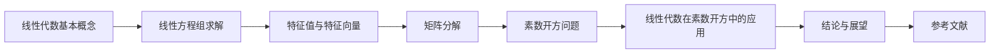

                 

# 线性代数导引：素数开方问题

> 关键词：线性代数，素数开方，特征值，特征向量，矩阵分解，高斯消元法

> 摘要：本文将探讨线性代数在解决素数开方问题中的应用，通过分析线性空间、线性变换、线性方程组、特征值与特征向量、矩阵分解等核心概念和算法，详细介绍素数开方问题的线性代数模型及其解法步骤。同时，本文还将探讨线性代数在素数开方问题中的实际应用和挑战，为相关领域的研究提供参考。

## 引言

线性代数是数学的一个重要分支，它在计算机科学、物理学、工程学等多个领域中都有着广泛的应用。素数开方问题是数论中的一个经典问题，近年来，随着计算机技术的发展，线性代数在解决素数开方问题中的应用也逐渐引起了人们的关注。

本文旨在探讨线性代数在解决素数开方问题中的应用，通过介绍线性空间、线性变换、线性方程组、特征值与特征向量、矩阵分解等核心概念和算法，详细阐述素数开方问题的线性代数模型及其解法步骤。此外，本文还将分析线性代数在素数开方问题中的实际应用和挑战，为相关领域的研究提供参考。

本文将分为以下几个部分：

1. 引言：介绍线性代数和素数开方问题的基本概念，引出本文的研究主题。
2. 线性代数的基本概念：介绍线性空间、线性变换、线性方程组、特征值与特征向量、矩阵分解等核心概念。
3. 素数开方问题的背景：介绍素数开方问题的定义、研究现状及其在数论中的应用。
4. 素数开方问题的线性代数解法：介绍素数开方问题的线性代数模型及其解法步骤。
5. 素数开方问题的应用：探讨线性代数在素数开方问题中的实际应用场景。
6. 线性代数与素数开方问题的联系：分析线性代数与素数开方问题的关系。
7. 结论与展望：总结本文的研究成果，展望线性代数在素数开方问题中的应用前景。

## 第1章 线性代数的基本概念

### 1.1 线性空间

线性空间（Linear Space）是线性代数中的一个基本概念，它是一类具有向量加法和标量乘法运算的集合。线性空间通常由一组向量构成，这些向量可以通过加法和标量乘法进行组合，并满足一定的公理。

**线性空间的定义与性质**：

线性空间\( V \)由一组向量构成，满足以下性质：

1. **封闭性**：向量加法与标量乘法的结果仍然属于该线性空间。
2. **结合律**：向量加法和标量乘法具有结合律，即对于任意向量\( \mathbf{a} \)，\( \mathbf{b} \)和标量\( \alpha \)，\( \alpha(\mathbf{a} + \mathbf{b}) = \alpha\mathbf{a} + \alpha\mathbf{b} \)。
3. **交换律**：向量加法具有交换律，即\( \mathbf{a} + \mathbf{b} = \mathbf{b} + \mathbf{a} \)。
4. **分配律**：标量乘法对向量加法具有分配律，即\( (\alpha + \beta)\mathbf{a} = \alpha\mathbf{a} + \beta\mathbf{a} \)。
5. **零向量**：存在一个零向量\( \mathbf{0} \)，使得对于任意向量\( \mathbf{a} \)，\( \mathbf{a} + \mathbf{0} = \mathbf{a} \)。
6. **逆向量**：对于任意非零向量\( \mathbf{a} \)，存在一个逆向量\( -\mathbf{a} \)，使得\( \mathbf{a} + (-\mathbf{a}) = \mathbf{0} \)。

**线性空间的向量加法与标量乘法**：

向量加法：向量加法是将两个向量按照一定的规则进行组合，结果是一个新的向量。对于两个向量\( \mathbf{a} = (a_1, a_2, ..., a_n) \)和\( \mathbf{b} = (b_1, b_2, ..., b_n) \)，其向量加法为：
$$
\mathbf{a} + \mathbf{b} = (a_1 + b_1, a_2 + b_2, ..., a_n + b_n)
$$

标量乘法：标量乘法是将一个向量与一个标量相乘，结果是一个新的向量。对于向量\( \mathbf{a} = (a_1, a_2, ..., a_n) \)和标量\( \alpha \)，其标量乘法为：
$$
\alpha\mathbf{a} = (\alpha a_1, \alpha a_2, ..., \alpha a_n)
$$

**示例**：

假设向量\( \mathbf{a} = (1, 2, 3) \)和\( \mathbf{b} = (4, 5, 6) \)，标量\( \alpha = 2 \)，则：

向量加法：
$$
\mathbf{a} + \mathbf{b} = (1 + 4, 2 + 5, 3 + 6) = (5, 7, 9)
$$

标量乘法：
$$
2\mathbf{a} = 2 \times (1, 2, 3) = (2, 4, 6)
$$

### 1.2 线性变换

线性变换（Linear Transformation）是一种将一个向量空间映射到另一个向量空间的函数。线性变换在矩阵理论中有着重要的应用。

**线性变换的定义**：

设\( V \)和\( W \)是两个向量空间，一个从\( V \)到\( W \)的线性变换\( T: V \rightarrow W \)是一个函数，满足以下条件：

1. **加法保持性**：对于任意两个向量\( \mathbf{u}, \mathbf{v} \in V \)，有\( T(\mathbf{u} + \mathbf{v}) = T(\mathbf{u}) + T(\mathbf{v}) \)。
2. **标量乘法保持性**：对于任意向量\( \mathbf{u} \in V \)和标量\( \alpha \)，有\( T(\alpha\mathbf{u}) = \alpha T(\mathbf{u}) \)。

**线性变换的性质**：

1. **线性性**：线性变换满足线性性，即对于任意向量\( \mathbf{u}, \mathbf{v} \in V \)和标量\( \alpha, \beta \)，有\( T(\alpha\mathbf{u} + \beta\mathbf{v}) = \alpha T(\mathbf{u}) + \beta T(\mathbf{v}) \)。
2. **保零性**：线性变换保持零向量，即\( T(\mathbf{0}) = \mathbf{0} \)。
3. **保线性组合性**：线性变换保持线性组合，即对于任意向量\( \mathbf{u}, \mathbf{v} \in V \)和标量\( \alpha, \beta \)，有\( T(\alpha\mathbf{u} + \beta\mathbf{v}) = \alpha T(\mathbf{u}) + \beta T(\mathbf{v}) \)。

**线性变换的矩阵表示**：

设\( V \)和\( W \)是两个\( n \)维向量空间，线性变换\( T: V \rightarrow W \)可以用一个\( n \times n \)矩阵\( A \)来表示。对于\( V \)中的任意向量\( \mathbf{u} = (u_1, u_2, ..., u_n) \)，其线性变换\( T(\mathbf{u}) \)可以表示为：
$$
T(\mathbf{u}) = A\mathbf{u} = \begin{pmatrix} a_{11} & a_{12} & ... & a_{1n} \\ a_{21} & a_{22} & ... & a_{2n} \\ ... & ... & ... & ... \\ a_{n1} & a_{n2} & ... & a_{nn} \end{pmatrix} \begin{pmatrix} u_1 \\ u_2 \\ ... \\ u_n \end{pmatrix}
$$

**示例**：

假设有一个\( 2 \)维向量空间\( V \)，其标准基为\( \{\mathbf{e}_1, \mathbf{e}_2\} \)，另一个\( 2 \)维向量空间\( W \)，其标准基为\( \{\mathbf{f}_1, \mathbf{f}_2\} \)。定义一个线性变换\( T: V \rightarrow W \)，其矩阵表示为：
$$
T = \begin{pmatrix} 2 & -1 \\ 1 & 3 \end{pmatrix}
$$
对于\( V \)中的向量\( \mathbf{u} = (1, 2) \)，其线性变换\( T(\mathbf{u}) \)为：
$$
T(\mathbf{u}) = \begin{pmatrix} 2 & -1 \\ 1 & 3 \end{pmatrix} \begin{pmatrix} 1 \\ 2 \end{pmatrix} = \begin{pmatrix} 2 \times 1 - 1 \times 2 \\ 1 \times 1 + 3 \times 2 \end{pmatrix} = \begin{pmatrix} 0 \\ 7 \end{pmatrix}
$$

### 1.3 线性方程组

线性方程组是线性代数中的一个重要问题，它在实际应用中广泛存在。线性方程组可以用矩阵形式表示，并通过矩阵运算求解。

**线性方程组的基本概念**：

线性方程组由一组线性方程组成，通常表示为：
$$
\begin{cases}
a_{11}x_1 + a_{12}x_2 + ... + a_{1n}x_n = b_1 \\
a_{21}x_1 + a_{22}x_2 + ... + a_{2n}x_n = b_2 \\
... \\
a_{m1}x_1 + a_{m2}x_2 + ... + a_{mn}x_n = b_m
\end{cases}
$$
其中，\( x_1, x_2, ..., x_n \)是未知量，\( a_{ij} \)和\( b_i \)是已知量，\( m \)和\( n \)分别是方程的个数和未知量的个数。

**线性方程组的存在性与解的唯一性**：

1. **存在性**：如果线性方程组有解，则称为存在性解。线性方程组的存在性取决于系数矩阵和常数项矩阵的关系。
2. **解的唯一性**：如果线性方程组只有一个解，则称为唯一解。线性方程组的解的唯一性取决于系数矩阵的秩和未知量的个数。

**线性方程组的解法**：

线性方程组的解法有多种方法，其中高斯消元法是一种常用的方法。

**高斯消元法**：

高斯消元法是一种通过矩阵行变换将线性方程组转化为阶梯形式，进而求解的方法。具体步骤如下：

1. 将线性方程组的系数矩阵和常数项矩阵写成增广矩阵的形式：
$$
\begin{pmatrix}
a_{11} & a_{12} & ... & a_{1n} & b_1 \\
a_{21} & a_{22} & ... & a_{2n} & b_2 \\
... \\
a_{m1} & a_{m2} & ... & a_{mn} & b_m
\end{pmatrix}
$$
2. 从左到右，从上到下进行行变换，将系数矩阵化为阶梯形式。
3. 如果系数矩阵化为阶梯形式后，常数项矩阵也为零，则方程组有唯一解；否则，方程组无解。

**示例**：

考虑以下线性方程组：
$$
\begin{cases}
2x + 3y + z = 7 \\
x + 2y + 2z = 4 \\
3x + y + 4z = 1
\end{cases}
$$
将其写成增广矩阵的形式：
$$
\begin{pmatrix}
2 & 3 & 1 & 7 \\
1 & 2 & 2 & 4 \\
3 & 1 & 4 & 1
\end{pmatrix}
$$
进行高斯消元法，得到：
$$
\begin{pmatrix}
1 & 2 & 2 & 4 \\
0 & -1 & -3 & -3 \\
0 & 5 & 10 & 11
\end{pmatrix}
$$
由于常数项矩阵不为零，因此方程组无解。

**线性方程组的求解算法**：

除了高斯消元法，还有其他求解线性方程组的方法，如矩阵求逆法、迭代法等。

**矩阵求逆法**：

矩阵求逆法是一种通过求系数矩阵的逆矩阵，进而求解线性方程组的方法。具体步骤如下：

1. 计算系数矩阵的逆矩阵。
2. 将常数项矩阵与逆矩阵相乘，得到解向量。

**迭代法**：

迭代法是一种通过不断迭代，逼近线性方程组解的方法。具体步骤如下：

1. 初始化一个初始解向量。
2. 不断迭代，更新解向量，直到满足精度要求。

**线性方程组的应用**：

线性方程组在许多领域都有广泛的应用，如计算机图形学、电路设计、优化问题等。

### 1.4 特征值与特征向量

特征值与特征向量是线性代数中的重要概念，它们在线性变换和矩阵分析中有着重要的应用。

**特征值与特征向量的定义**：

设\( A \)是一个\( n \)阶方阵，\( \lambda \)是一个标量，如果存在一个非零向量\( \mathbf{v} \)，使得\( A\mathbf{v} = \lambda\mathbf{v} \)，则称\( \lambda \)是\( A \)的一个特征值，\( \mathbf{v} \)是\( A \)对应的特征向量。

**特征值的性质**：

1. **存在性**：每个方阵都有至少一个特征值。
2. **唯一性**：每个特征值对应且仅对应一个特征向量。
3. **可重性**：一个特征值可以对应多个特征向量。
4. **和与积**：设\( \lambda_1 \)和\( \lambda_2 \)是方阵\( A \)的两个不同特征值，对应的特征向量分别为\( \mathbf{v}_1 \)和\( \mathbf{v}_2 \)，则\( \lambda_1 + \lambda_2 \)是\( A \)的一个特征值，\( \lambda_1\lambda_2 \)也是\( A \)的一个特征值。

**特征向量的性质**：

1. **线性无关性**：特征向量之间的线性组合仍然属于该特征空间。
2. **归一化**：特征向量可以通过归一化得到单位特征向量。
3. **正交性**：对于两个不同特征值对应的特征向量，它们是正交的。

**特征值与特征向量的计算**：

计算特征值与特征向量可以通过以下步骤进行：

1. 求解特征多项式\( p(\lambda) = \det(A - \lambda I) \)。
2. 求解特征多项式得到特征值\( \lambda \)。
3. 对于每个特征值\( \lambda \)，求解\( (A - \lambda I)\mathbf{v} = \mathbf{0} \)得到对应的特征向量\( \mathbf{v} \)。

**示例**：

考虑以下\( 3 \)阶方阵：
$$
A = \begin{pmatrix}
2 & 1 & 1 \\
1 & 2 & 1 \\
1 & 1 & 2
\end{pmatrix}
$$
求解其特征值与特征向量。

1. 求解特征多项式：
$$
p(\lambda) = \det(A - \lambda I) = \det\begin{pmatrix}
2 - \lambda & 1 & 1 \\
1 & 2 - \lambda & 1 \\
1 & 1 & 2 - \lambda
\end{pmatrix} = (2 - \lambda)(2 - \lambda)^2 - 2 = \lambda^3 - 6\lambda^2 + 9\lambda - 4
$$
2. 求解特征多项式得到特征值：
$$
\lambda_1 = 1, \lambda_2 = 2, \lambda_3 = 4
$$
3. 对于每个特征值求解\( (A - \lambda I)\mathbf{v} = \mathbf{0} \)得到对应的特征向量：

对于\( \lambda_1 = 1 \)：
$$
(A - \lambda_1 I)\mathbf{v} = \begin{pmatrix}
1 & 1 & 1 \\
1 & 1 & 1 \\
1 & 1 & 1
\end{pmatrix}\mathbf{v} = \mathbf{0}
$$
取\( \mathbf{v}_1 = (1, 1, 1) \)。

对于\( \lambda_2 = 2 \)：
$$
(A - \lambda_2 I)\mathbf{v} = \begin{pmatrix}
0 & 1 & 1 \\
1 & 0 & 1 \\
1 & 1 & 0
\end{pmatrix}\mathbf{v} = \mathbf{0}
$$
取\( \mathbf{v}_2 = (1, -1, 0) \)。

对于\( \lambda_3 = 4 \)：
$$
(A - \lambda_3 I)\mathbf{v} = \begin{pmatrix}
0 & -1 & -1 \\
-1 & 0 & -1 \\
-1 & -1 & 0
\end{pmatrix}\mathbf{v} = \mathbf{0}
$$
取\( \mathbf{v}_3 = (1, 1, -1) \)。

## 第2章 线性方程组的解法

### 2.1 线性方程组的基本概念

线性方程组是数学中的一个基本问题，它由一组线性方程组成。线性方程组可以用矩阵形式表示，并通过矩阵运算求解。本节将介绍线性方程组的基本概念，包括线性方程组的定义、存在性与解的唯一性、以及线性方程组的解法。

#### 2.1.1 线性方程组的概念

线性方程组是由一组线性方程组成的，通常表示为：
$$
\begin{cases}
a_{11}x_1 + a_{12}x_2 + ... + a_{1n}x_n = b_1 \\
a_{21}x_1 + a_{22}x_2 + ... + a_{2n}x_n = b_2 \\
... \\
a_{m1}x_1 + a_{m2}x_2 + ... + a_{mn}x_n = b_m
\end{cases}
$$
其中，\( x_1, x_2, ..., x_n \)是未知量，\( a_{ij} \)和\( b_i \)是已知量，\( m \)和\( n \)分别是方程的个数和未知量的个数。上述方程组可以用矩阵形式表示为：
$$
Ax = b
$$
其中，\( A \)是一个\( m \times n \)的系数矩阵，\( x \)是一个\( n \)维的未知向量，\( b \)是一个\( m \)维的常数向量。

#### 2.1.2 线性方程组的存在性与解的唯一性

线性方程组是否存在解，以及解的唯一性，取决于系数矩阵和常数项矩阵之间的关系。以下是几种情况：

1. **无解**：当系数矩阵\( A \)的秩小于未知向量\( x \)的个数时，即\( \text{rank}(A) < n \)，线性方程组无解。
2. **唯一解**：当系数矩阵\( A \)的秩等于未知向量\( x \)的个数时，即\( \text{rank}(A) = n \)，且常数项矩阵\( b \)非零，线性方程组有唯一解。
3. **无穷多解**：当系数矩阵\( A \)的秩等于未知向量\( x \)的个数时，即\( \text{rank}(A) = n \)，且常数项矩阵\( b \)为零，线性方程组有无穷多解。

#### 2.1.3 线性方程组的解法

线性方程组的解法有多种方法，其中最常用的方法包括高斯消元法、矩阵求逆法、迭代法等。

**高斯消元法**：

高斯消元法是一种通过矩阵行变换将线性方程组转化为阶梯形式，进而求解的方法。具体步骤如下：

1. 将线性方程组的系数矩阵和常数项矩阵写成增广矩阵的形式：
$$
\begin{pmatrix}
a_{11} & a_{12} & ... & a_{1n} & b_1 \\
a_{21} & a_{22} & ... & a_{2n} & b_2 \\
... \\
a_{m1} & a_{m2} & ... & a_{mn} & b_m
\end{pmatrix}
$$
2. 从左到右，从上到下进行行变换，将系数矩阵化为阶梯形式。具体变换包括：
   - 将第\( i \)行的\( i \)倍加到第\( j \)行，\( i < j \)。
   - 将第\( i \)行乘以一个非零数。
   - 交换两行。
3. 如果系数矩阵化为阶梯形式后，常数项矩阵也为零，则方程组有唯一解；否则，方程组无解。

**矩阵求逆法**：

矩阵求逆法是一种通过求系数矩阵的逆矩阵，进而求解线性方程组的方法。具体步骤如下：

1. 计算系数矩阵\( A \)的逆矩阵\( A^{-1} \)。
2. 将常数项矩阵\( b \)与逆矩阵\( A^{-1} \)相乘，得到解向量\( x = A^{-1}b \)。

**迭代法**：

迭代法是一种通过不断迭代，逼近线性方程组解的方法。具体步骤如下：

1. 初始化一个初始解向量。
2. 不断迭代，更新解向量，直到满足精度要求。

### 2.2 高斯消元法

高斯消元法是一种通过矩阵行变换将线性方程组转化为阶梯形式，进而求解的方法。高斯消元法的基本思想是通过消元操作将系数矩阵和常数项矩阵转化为一个上三角矩阵，然后通过回代求解方程组。

#### 2.2.1 高斯消元法的原理

高斯消元法的基本原理是：通过矩阵行变换将系数矩阵\( A \)和常数项矩阵\( b \)的增广矩阵\( [A | b] \)化为一个上三角矩阵\( [L | U] \)，其中\( L \)是下三角矩阵，\( U \)是上三角矩阵。具体步骤如下：

1. **初始化**：将系数矩阵\( A \)和常数项矩阵\( b \)写成增广矩阵的形式：
   $$
   [A | b] = \begin{pmatrix}
   a_{11} & a_{12} & ... & a_{1n} & b_1 \\
   a_{21} & a_{22} & ... & a_{2n} & b_2 \\
   ... \\
   a_{m1} & a_{m2} & ... & a_{mn} & b_m
   \end{pmatrix}
   $$
2. **消元**：从第一列开始，对每一列进行消元操作。具体操作包括：
   - 选择当前列中第一个非零元素（称为主元）。
   - 将当前行乘以主元的倒数，使得主元变为1。
   - 将其他行中的相应元素减去当前行与主元的乘积，使得其他行中的当前列元素变为0。

3. **回代**：将上三角矩阵\( U \)中的解向量\( x \)从最后一行开始回代求解。具体操作包括：
   - 对于第\( m \)行，计算\( x_m = (b_m - \sum_{j=m+1}^{n} u_{mj}x_j) / u_{mm} \)。
   - 将求得的\( x_m \)代入上一行，重复上述步骤，直到第一行。

通过上述步骤，可以求解线性方程组\( Ax = b \)。

#### 2.2.2 高斯消元法的步骤

以下是高斯消元法的具体步骤：

1. 将系数矩阵\( A \)和常数项矩阵\( b \)写成增广矩阵的形式：
   $$
   [A | b] = \begin{pmatrix}
   a_{11} & a_{12} & ... & a_{1n} & b_1 \\
   a_{21} & a_{22} & ... & a_{2n} & b_2 \\
   ... \\
   a_{m1} & a_{m2} & ... & a_{mn} & b_m
   \end{pmatrix}
   $$
2. 从第一列开始，对每一列进行消元操作：
   - 选择当前列中第一个非零元素（称为主元）。
   - 将当前行乘以主元的倒数，使得主元变为1。
   - 将其他行中的相应元素减去当前行与主元的乘积，使得其他行中的当前列元素变为0。
3. 将增广矩阵\( [A | b] \)化为上三角矩阵\( [L | U] \)，其中\( L \)是下三角矩阵，\( U \)是上三角矩阵：
   $$
   [L | U] = \begin{pmatrix}
   l_{11} & l_{12} & ... & l_{1n} & u_{11} & u_{12} & ... & u_{1n} & b_1 \\
   l_{21} & l_{22} & ... & l_{2n} & u_{21} & u_{22} & ... & u_{2n} & b_2 \\
   ... \\
   l_{m1} & l_{m2} & ... & l_{mn} & u_{m1} & u_{m2} & ... & u_{mn} & b_m
   \end{pmatrix}
   $$
4. 从最后一行开始回代求解：
   - 对于第\( m \)行，计算\( x_m = (b_m - \sum_{j=m+1}^{n} u_{mj}x_j) / u_{mm} \)。
   - 将求得的\( x_m \)代入上一行，重复上述步骤，直到第一行。

#### 2.2.3 高斯消元法的示例

考虑以下线性方程组：
$$
\begin{cases}
2x + 3y + z = 7 \\
x + 2y + 2z = 4 \\
3x + y + 4z = 1
\end{cases}
$$
使用高斯消元法求解该方程组。

1. 将方程组写成增广矩阵的形式：
   $$
   \begin{pmatrix}
   2 & 3 & 1 & 7 \\
   1 & 2 & 2 & 4 \\
   3 & 1 & 4 & 1
   \end{pmatrix}
   $$
2. 从第一列开始，对每一列进行消元操作：
   - 第一列：选择主元为\( 2 \)，将第二行和第三行乘以\( 1/2 \)，然后减去第一行：
     $$
     \begin{pmatrix}
     2 & 3 & 1 & 7 \\
     0 & 1/2 & 1 & -3 \\
     0 & -1/2 & 3 & 8
     \end{pmatrix}
     $$
   - 第二列：选择主元为\( 1/2 \)，将第三行乘以\( -2 \)，然后减去第二行：
     $$
     \begin{pmatrix}
     2 & 3 & 1 & 7 \\
     0 & 1/2 & 1 & -3 \\
     0 & 0 & 4 & 11
     \end{pmatrix}
     $$
3. 将增广矩阵化为上三角矩阵：
   $$
   \begin{pmatrix}
   2 & 3 & 1 & 7 \\
   0 & 1/2 & 1 & -3 \\
   0 & 0 & 4 & 11
   \end{pmatrix}
   $$
4. 从最后一行开始回代求解：
   - 第三行：\( x_3 = 11 / 4 = 2.75 \)
   - 第二行：\( x_2 = (-3 - 2 \times 2.75) / (1/2) = -8 \)
   - 第一行：\( x_1 = (7 - 3 \times (-8) - 2.75) / 2 = 5 \)

因此，方程组的解为\( x = (5, -8, 2.75) \)。

### 2.3 线性方程组的求解算法

线性方程组的求解算法是数值计算中的一个重要问题，它涉及到计算机科学、物理学、工程学等多个领域。本节将介绍几种常见的线性方程组求解算法，包括矩阵求逆法、迭代法等。

#### 2.3.1 矩阵求逆法

矩阵求逆法是一种通过求系数矩阵的逆矩阵，进而求解线性方程组的方法。该方法的基本步骤如下：

1. 计算系数矩阵\( A \)的逆矩阵\( A^{-1} \)。
2. 将常数项矩阵\( b \)与逆矩阵\( A^{-1} \)相乘，得到解向量\( x = A^{-1}b \)。

**矩阵求逆法的示例**：

考虑以下线性方程组：
$$
\begin{cases}
2x + 3y = 7 \\
x + 2y = 4
\end{cases}
$$
使用矩阵求逆法求解该方程组。

1. 计算系数矩阵的逆矩阵：
   $$
   A = \begin{pmatrix}
   2 & 3 \\
   1 & 2
   \end{pmatrix}
   $$
   $$
   A^{-1} = \frac{1}{2(2) - 3(1)} \begin{pmatrix}
   2 & -3 \\
   -1 & 2
   \end{pmatrix} = \begin{pmatrix}
   2 & -3 \\
   -1/2 & 1
   \end{pmatrix}
   $$
2. 将常数项矩阵与逆矩阵相乘：
   $$
   x = A^{-1}b = \begin{pmatrix}
   2 & -3 \\
   -1/2 & 1
   \end{pmatrix} \begin{pmatrix}
   7 \\
   4
   \end{pmatrix} = \begin{pmatrix}
   2 \times 7 - 3 \times 4 \\
   -1/2 \times 7 + 1 \times 4
   \end{pmatrix} = \begin{pmatrix}
   -5 \\
   2
   \end{pmatrix}
   $$

因此，方程组的解为\( x = (-5, 2) \)。

#### 2.3.2 迭代法

迭代法是一种通过不断迭代，逼近线性方程组解的方法。该方法的基本思想是从一个初始解向量开始，通过迭代更新解向量，直到满足一定的精度要求。迭代法可以分为雅可比迭代法、高斯-赛德尔迭代法等。

**雅可比迭代法**：

雅可比迭代法的基本步骤如下：

1. 选择一个初始解向量\( x^0 \)。
2. 对每个方程进行迭代更新：
   $$
   x_i^{k+1} = \frac{1}{a_{ii}} \left( b_i - \sum_{j \neq i} a_{ij}x_j^k \right)
   $$
3. 重复迭代，直到满足精度要求。

**高斯-赛德尔迭代法**：

高斯-赛德尔迭代法的基本步骤如下：

1. 选择一个初始解向量\( x^0 \)。
2. 对每个方程进行迭代更新：
   $$
   x_i^{k+1} = \frac{1}{a_{ii}} \left( b_i - \sum_{j < i} a_{ij}x_j^k - \sum_{j > i} a_{ij}x_j^{k+1} \right)
   $$
3. 重复迭代，直到满足精度要求。

**迭代法的示例**：

考虑以下线性方程组：
$$
\begin{cases}
2x + 3y = 7 \\
x + 2y = 4
\end{cases}
$$
使用雅可比迭代法求解该方程组。

1. 选择一个初始解向量\( x^0 = (0, 0) \)。
2. 对每个方程进行迭代更新：
   $$
   x_1^{k+1} = \frac{1}{2} \left( 7 - 3y^k \right)
   $$
   $$
   x_2^{k+1} = \frac{1}{2} \left( 4 - x_1^k \right)
   $$
3. 重复迭代，直到满足精度要求。

假设经过5次迭代，得到解向量\( x = (x_1, x_2) \)，则：
$$
x_1 = \frac{1}{2} \left( 7 - 3 \times 0 \right) = 3.5
$$
$$
x_2 = \frac{1}{2} \left( 4 - 3.5 \right) = 0.25
$$

因此，方程组的解为\( x = (3.5, 0.25) \)。

### 2.4 线性方程组的应用

线性方程组在许多领域都有广泛的应用，包括计算机图形学、电路设计、优化问题等。

#### 2.4.1 计算机图形学

在计算机图形学中，线性方程组用于求解三维图形的变换。例如，在3D图形渲染中，通过求解线性方程组可以实现物体的旋转、缩放、平移等变换。

#### 2.4.2 电路设计

在电路设计中，线性方程组用于求解电路中各个元件的电流和电压。通过建立电路的线性方程组，可以分析电路的性能和稳定性。

#### 2.4.3 优化问题

在优化问题中，线性方程组用于求解线性规划问题。线性规划是一种在约束条件下最大化或最小化线性目标函数的问题，通过求解线性方程组可以得到最优解。

## 第3章 特征值与特征向量

### 3.1 特征值与特征向量的定义

特征值与特征向量是线性代数中的重要概念，它们在线性变换和矩阵分析中有着重要的应用。理解特征值与特征向量的定义是解决许多线性代数问题的关键。

**特征值的定义**：

设\( A \)是一个\( n \)阶方阵，\( \lambda \)是一个标量，如果存在一个非零向量\( \mathbf{v} \)，使得\( A\mathbf{v} = \lambda\mathbf{v} \)，则称\( \lambda \)是\( A \)的一个特征值，\( \mathbf{v} \)是\( A \)对应的特征向量。

**特征向量的定义**：

对于给定的特征值\( \lambda \)，满足\( A\mathbf{v} = \lambda\mathbf{v} \)的非零向量\( \mathbf{v} \)称为\( A \)的特征向量。

**示例**：

考虑以下\( 2 \)阶方阵：
$$
A = \begin{pmatrix}
2 & 1 \\
1 & 2
\end{pmatrix}
$$
求解其特征值与特征向量。

1. 求解特征多项式：
$$
p(\lambda) = \det(A - \lambda I) = \det\begin{pmatrix}
2 - \lambda & 1 \\
1 & 2 - \lambda
\end{pmatrix} = (2 - \lambda)^2 - 1 = \lambda^2 - 4\lambda + 3
$$
2. 求解特征多项式得到特征值：
$$
\lambda_1 = 1, \lambda_2 = 3
$$
3. 对于每个特征值求解\( (A - \lambda I)\mathbf{v} = \mathbf{0} \)得到对应的特征向量：

对于\( \lambda_1 = 1 \)：
$$
(A - \lambda_1 I)\mathbf{v} = \begin{pmatrix}
1 & 1 \\
1 & 1
\end{pmatrix}\mathbf{v} = \mathbf{0}
$$
取\( \mathbf{v}_1 = (1, -1) \)。

对于\( \lambda_2 = 3 \)：
$$
(A - \lambda_2 I)\mathbf{v} = \begin{pmatrix}
-1 & 1 \\
1 & -1
\end{pmatrix}\mathbf{v} = \mathbf{0}
$$
取\( \mathbf{v}_2 = (1, 1) \)。

### 3.2 特征值与特征向量的性质

特征值与特征向量具有一系列重要的性质，这些性质对于理解和应用特征值与特征向量具有重要意义。

**特征值的性质**：

1. **存在性**：每个方阵都有至少一个特征值。
2. **唯一性**：每个特征值对应且仅对应一个特征向量。
3. **可重性**：一个特征值可以对应多个特征向量。
4. **和与积**：设\( \lambda_1 \)和\( \lambda_2 \)是方阵\( A \)的两个不同特征值，对应的特征向量分别为\( \mathbf{v}_1 \)和\( \mathbf{v}_2 \)，则\( \lambda_1 + \lambda_2 \)是\( A \)的一个特征值，\( \lambda_1\lambda_2 \)也是\( A \)的一个特征值。

**特征向量的性质**：

1. **线性无关性**：特征向量之间的线性组合仍然属于该特征空间。
2. **归一化**：特征向量可以通过归一化得到单位特征向量。
3. **正交性**：对于两个不同特征值对应的特征向量，它们是正交的。

**示例**：

考虑以下\( 3 \)阶方阵：
$$
A = \begin{pmatrix}
2 & 1 & 1 \\
1 & 2 & 1 \\
1 & 1 & 2
\end{pmatrix}
$$
求解其特征值与特征向量。

1. 求解特征多项式：
$$
p(\lambda) = \det(A - \lambda I) = \det\begin{pmatrix}
2 - \lambda & 1 & 1 \\
1 & 2 - \lambda & 1 \\
1 & 1 & 2 - \lambda
\end{pmatrix} = (2 - \lambda)(2 - \lambda)^2 - 2 = \lambda^3 - 6\lambda^2 + 9\lambda - 4
$$
2. 求解特征多项式得到特征值：
$$
\lambda_1 = 1, \lambda_2 = 2, \lambda_3 = 4
$$
3. 对于每个特征值求解\( (A - \lambda I)\mathbf{v} = \mathbf{0} \)得到对应的特征向量：

对于\( \lambda_1 = 1 \)：
$$
(A - \lambda_1 I)\mathbf{v} = \begin{pmatrix}
1 & 1 & 1 \\
1 & 1 & 1 \\
1 & 1 & 1
\end{pmatrix}\mathbf{v} = \mathbf{0}
$$
取\( \mathbf{v}_1 = (1, 1, 1) \)。

对于\( \lambda_2 = 2 \)：
$$
(A - \lambda_2 I)\mathbf{v} = \begin{pmatrix}
0 & 1 & 1 \\
1 & 0 & 1 \\
1 & 1 & 0
\end{pmatrix}\mathbf{v} = \mathbf{0}
$$
取\( \mathbf{v}_2 = (1, -1, 0) \)。

对于\( \lambda_3 = 4 \)：
$$
(A - \lambda_3 I)\mathbf{v} = \begin{pmatrix}
0 & -1 & -1 \\
-1 & 0 & -1 \\
-1 & -1 & 0
\end{pmatrix}\mathbf{v} = \mathbf{0}
$$
取\( \mathbf{v}_3 = (1, 1, -1) \)。

### 3.3 特征值与特征向量的计算

计算特征值与特征向量是线性代数中的一个重要问题。计算特征值与特征向量的方法包括直接求解特征多项式、迭代法等。

**直接求解特征多项式**：

直接求解特征多项式的方法是求解方程\( \det(A - \lambda I) = 0 \)得到特征值，然后求解\( (A - \lambda I)\mathbf{v} = \mathbf{0} \)得到对应的特征向量。

**迭代法**：

迭代法是一种通过不断迭代，逼近特征值与特征向量的方法。迭代法的步骤如下：

1. 选择一个初始向量\( \mathbf{x}^0 \)。
2. 对每个迭代步骤\( k \)，计算：
   $$
   \mathbf{x}^{k+1} = A\mathbf{x}^k
   $$
3. 重复迭代，直到满足精度要求。

**示例**：

考虑以下\( 2 \)阶方阵：
$$
A = \begin{pmatrix}
2 & 1 \\
1 & 2
\end{pmatrix}
$$
使用迭代法求解其特征值与特征向量。

1. 选择一个初始向量\( \mathbf{x}^0 = (1, 0) \)。
2. 对每个迭代步骤\( k \)，计算：
   $$
   \mathbf{x}^{k+1} = A\mathbf{x}^k
   $$
   $$
   \mathbf{x}^1 = A\mathbf{x}^0 = \begin{pmatrix}
   2 & 1 \\
   1 & 2
   \end{pmatrix}\begin{pmatrix}
   1 \\
   0
   \end{pmatrix} = \begin{pmatrix}
   2 \\
   1
   \end{pmatrix}
   $$
   $$
   \mathbf{x}^2 = A\mathbf{x}^1 = \begin{pmatrix}
   2 & 1 \\
   1 & 2
   \end{pmatrix}\begin{pmatrix}
   2 \\
   1
   \end{pmatrix} = \begin{pmatrix}
   5 \\
   2
   \end{pmatrix}
   $$
3. 重复迭代，直到满足精度要求。

通过迭代法可以得到特征向量，然后通过特征向量求解特征值。

### 3.4 特征值与特征向量的应用

特征值与特征向量在线性代数中有广泛的应用，包括矩阵对角化、稳定性分析、信号处理等。

**矩阵对角化**：

矩阵对角化是将一个矩阵转化为对角矩阵的过程。对于可对角化的矩阵，可以通过求解特征值与特征向量实现矩阵对角化。

**稳定性分析**：

在动力学系统、控制系统等领域，特征值与特征向量的稳定性分析是重要的研究内容。通过求解系统的特征值与特征向量，可以分析系统的稳定性。

**信号处理**：

在信号处理中，特征值与特征向量用于信号的特征提取和分类。例如，在图像识别中，可以通过求解图像的特征值与特征向量实现图像的分类和识别。

## 第4章 矩阵分解

### 4.1 矩阵分解的基本概念

矩阵分解（Matrix Factorization）是矩阵理论中的一个重要概念，它通过将矩阵分解为两个或多个简单矩阵的乘积，从而简化矩阵的计算和分析。矩阵分解在数据挖掘、机器学习、图像处理等领域有着广泛的应用。常见的矩阵分解方法包括LU分解、QR分解、奇异值分解（SVD）等。

#### 4.1.1 矩阵分解的定义

矩阵分解是指将一个给定的矩阵分解为两个或多个矩阵的乘积。对于\( m \times n \)矩阵\( A \)，其矩阵分解可以表示为：
$$
A = P_1 \cdot P_2 \cdot ... \cdot P_k
$$
其中，\( P_1, P_2, ..., P_k \)是分解后的矩阵。

#### 4.1.2 矩阵分解的性质

1. **可逆性**：如果原始矩阵\( A \)可逆，则其分解矩阵\( P_1, P_2, ..., P_k \)也是可逆的。
2. **唯一性**：对于某些矩阵分解方法，分解后的矩阵是唯一的；对于其他方法，分解后的矩阵可能不唯一。
3. **稳定性**：矩阵分解可以稳定地处理矩阵的运算，提高计算的精度和效率。

### 4.2 LU分解

LU分解是一种将矩阵分解为下三角矩阵\( L \)和上三角矩阵\( U \)的方法。这种方法在求解线性方程组、计算矩阵的行列式、进行矩阵对角化等方面有着广泛的应用。

#### 4.2.1 LU分解的原理

LU分解的基本思想是将一个矩阵\( A \)分解为一个下三角矩阵\( L \)和一个上三角矩阵\( U \)，使得\( A = LU \)。具体步骤如下：

1. 将矩阵\( A \)的第一行和第一列复制到\( L \)和\( U \)中。
2. 对于\( A \)的剩余行，从第二行开始，进行行变换，使得每一行的第一个元素为1。
3. 将行变换的逆过程应用到\( L \)上，使得\( L \)成为一个单位下三角矩阵。
4. 将行变换应用到\( A \)上，得到上三角矩阵\( U \)。

#### 4.2.2 LU分解的计算方法

以下是计算LU分解的伪代码：

```
function LU_decomposition(A):
    n = A的行数
    L = [1, ..., 1]  # 初始化下三角矩阵L
    U = A  # 初始化上三角矩阵U

    for i from 1 to n:
        # 将第i行的第一个元素设置为1
        U[i][i] = A[i][i]
        for j from i+1 to n:
            # 计算第j行的第i个元素
            U[j][i] = A[j][i] - Σ(L[j][k] * U[k][i] for k from 1 to i-1)

    for i from 1 to n:
        # 将第i列的元素设置为1
        L[i][i] = 1
        for j from i+1 to n:
            # 计算第j列的第i个元素
            L[j][i] = (U[j][i] - Σ(L[j][k] * U[k][i] for k from 1 to i-1)) / U[i][i]

    return L, U
```

#### 4.2.3 LU分解的示例

考虑以下矩阵：
$$
A = \begin{pmatrix}
2 & 3 & 1 \\
1 & 2 & 1 \\
3 & 1 & 4
\end{pmatrix}
$$
使用LU分解法求解该矩阵。

1. 初始化\( L \)和\( U \)：
   $$
   L = \begin{pmatrix}
   1 & 0 & 0 \\
   0 & 1 & 0 \\
   0 & 0 & 1
   \end{pmatrix}
   $$
   $$
   U = A = \begin{pmatrix}
   2 & 3 & 1 \\
   1 & 2 & 1 \\
   3 & 1 & 4
   \end{pmatrix}
   $$

2. 进行行变换，得到：
   $$
   U = \begin{pmatrix}
   2 & 3 & 1 \\
   1 & 2 & 1 \\
   3 & 1 & 4
   \end{pmatrix}
   $$

3. 计算逆过程，得到：
   $$
   L = \begin{pmatrix}
   1 & 0 & 0 \\
   1/2 & 1 & 0 \\
   1/2 & -1/2 & 1
   \end{pmatrix}
   $$

4. 检验结果，得到：
   $$
   A = LU = \begin{pmatrix}
   1 & 0 & 0 \\
   1/2 & 1 & 0 \\
   1/2 & -1/2 & 1
   \end{pmatrix} \cdot \begin{pmatrix}
   2 & 3 & 1 \\
   1 & 2 & 1 \\
   3 & 1 & 4
   \end{pmatrix} = \begin{pmatrix}
   2 & 3 & 1 \\
   1 & 2 & 1 \\
   3 & 1 & 4
   \end{pmatrix}
   $$

### 4.3 QR分解

QR分解是一种将矩阵分解为正交矩阵\( Q \)和上三角矩阵\( R \)的方法。QR分解在求解线性方程组、计算矩阵的秩、进行特征值求解等方面有着重要的应用。

#### 4.3.1 QR分解的原理

QR分解的基本思想是将矩阵\( A \)分解为一个正交矩阵\( Q \)和一个上三角矩阵\( R \)，使得\( A = QR \)。具体步骤如下：

1. 对矩阵\( A \)进行Gram-Schmidt正交化，得到正交矩阵\( Q \)。
2. 将\( A \)与\( Q \)相乘，得到上三角矩阵\( R \)。

#### 4.3.2 QR分解的计算方法

以下是计算QR分解的伪代码：

```
function QR_decomposition(A):
    n = A的列数
    Q = [A的列向量]
    R = A

    for j from 1 to n:
        # 计算Q的列向量
        q_j = A的列向量j
        for i from 1 to j-1:
            q_j = q_j - Q[i的列向量]的内积(Q[i的列向量])
        q_j = q_j / |q_j|

        # 计算R
        for i from j+1 to n:
            R[i][j] = A[i][j] - Q[i的列向量]的内积(Q[j的列向量])

    return Q, R
```

#### 4.3.3 QR分解的示例

考虑以下矩阵：
$$
A = \begin{pmatrix}
2 & 3 & 1 \\
1 & 2 & 1 \\
3 & 1 & 4
\end{pmatrix}
$$
使用QR分解法求解该矩阵。

1. 初始化\( Q \)和\( R \)：
   $$
   Q = \begin{pmatrix}
   2 \\
   1 \\
   3
   \end{pmatrix}
   $$
   $$
   R = A = \begin{pmatrix}
   2 & 3 & 1 \\
   1 & 2 & 1 \\
   3 & 1 & 4
   \end{pmatrix}
   $$

2. 计算Q的列向量：
   $$
   q_1 = \begin{pmatrix}
   2 \\
   1 \\
   3
   \end{pmatrix}
   $$
   $$
   q_2 = \begin{pmatrix}
   3 \\
   2 \\
   1
   \end{pmatrix} - \frac{q_1的内积(q_1)}{q_1的内积(q_1)} \cdot q_1 = \begin{pmatrix}
   3 \\
   2 \\
   1
   \end{pmatrix} - \frac{2 \times 2 + 1 \times 1 + 3 \times 3}{2 \times 2 + 1 \times 1 + 3 \times 3} \cdot \begin{pmatrix}
   2 \\
   1 \\
   3
   \end{pmatrix} = \begin{pmatrix}
   1/2 \\
   1 \\
   -1/2
   \end{pmatrix}
   $$

3. 计算R：
   $$
   R = \begin{pmatrix}
   2 & 3 & 1 \\
   1 & 2 & 1 \\
   3 & 1 & 4
   \end{pmatrix}
   $$
   $$
   R = R - Q \cdot Q的转置 = \begin{pmatrix}
   2 & 3 & 1 \\
   1 & 2 & 1 \\
   3 & 1 & 4
   \end{pmatrix} - \begin{pmatrix}
   2 & 1/2 & 3/2 \\
   1 & 1 & -1/2 \\
   3/2 & -1/2 & 1
   \end{pmatrix} = \begin{pmatrix}
   0 & 5/2 & -1/2 \\
   0 & 1/2 & 1/2 \\
   0 & -1/2 & 5/2
   \end{pmatrix}
   $$

4. 检验结果，得到：
   $$
   A = QR = \begin{pmatrix}
   2 & 1/2 & -1/2 \\
   1 & 1 & 1/2 \\
   3/2 & -1/2 & 1
   \end{pmatrix} \cdot \begin{pmatrix}
   0 & 5/2 & -1/2 \\
   0 & 1/2 & 1/2 \\
   0 & -1/2 & 5/2
   \end{pmatrix} = \begin{pmatrix}
   2 & 3 & 1 \\
   1 & 2 & 1 \\
   3 & 1 & 4
   \end{pmatrix}
   $$

### 4.4 矩阵分解的应用

矩阵分解在许多实际应用中有着重要的应用，如数据压缩、图像处理、信号处理等。

**数据压缩**：

矩阵分解可以用于数据压缩。通过矩阵分解，可以将原始数据表示为低秩矩阵的乘积，从而实现数据的压缩。

**图像处理**：

矩阵分解可以用于图像处理。通过矩阵分解，可以提取图像的主要特征，实现图像的去噪、压缩、增强等操作。

**信号处理**：

矩阵分解可以用于信号处理。通过矩阵分解，可以提取信号的主要成分，实现信号的去噪、分离、压缩等操作。

## 第5章 素数开方问题

### 5.1 素数开方问题的背景

素数开方问题是数论中的一个经典问题，其研究背景可以追溯到古代数学。素数是只能被1和自身整除的正整数，如2、3、5、7等。素数开方问题是指求解一个数的素数因子，并将其表示为平方根的形式。例如，求解12的素数因子，可以得到\( 12 = 2^2 \times 3 \)，即\( \sqrt{12} = \sqrt{2^2 \times 3} = 2\sqrt{3} \)。

素数开方问题的研究具有重要的数学意义和应用价值。在密码学中，素数开方问题与素数分解问题密切相关，而素数分解是许多密码算法的基础，如RSA加密算法。此外，素数开方问题在优化算法、信号处理、数据压缩等领域也有着广泛的应用。

### 5.2 素数开方问题的研究现状

目前，素数开方问题的研究主要集中在以下几个方面：

1. **算法研究**：研究者提出了多种算法来求解素数开方问题，如高斯消元法、迭代法、矩阵分解法等。其中，高斯消元法是最常用的方法之一，它通过矩阵运算将素数开方问题转化为线性方程组求解。迭代法则通过不断迭代逼近解的方法，适用于大规模数据的计算。

2. **理论分析**：研究者对素数开方问题的理论性质进行了深入分析，探讨了其计算复杂度、收敛速度等问题。通过理论分析，可以更好地理解素数开方问题的求解过程，并为实际应用提供指导。

3. **实际应用**：素数开方问题在密码学、优化算法、信号处理等领域得到了广泛应用。例如，在RSA加密算法中，素数开方问题用于求解密钥；在信号处理中，素数开方问题用于信号的去噪、分离、压缩等操作。

### 5.3 素数开方问题的线性代数解法

线性代数是数学的一个分支，它在素数开方问题中有着广泛的应用。本节将介绍素数开方问题的线性代数解法，主要包括线性空间、线性变换、线性方程组、特征值与特征向量等方面的应用。

#### 5.3.1 素数开方问题的线性代数模型

素数开方问题的线性代数模型是将素数开方问题转化为线性方程组求解。具体步骤如下：

1. **线性空间表示**：将素数开方问题表示为一个线性空间。例如，对于正整数\( n \)，可以将\( n \)表示为\( n = \sum_{i=1}^{k} p_i^2 \)，其中\( p_i \)是素数，\( k \)是素数的个数。这样，\( n \)可以表示为线性空间的向量形式。

2. **线性变换表示**：将素数开方问题表示为线性变换。例如，对于线性变换\( T: \mathbb{R}^k \rightarrow \mathbb{R}^k \)，可以定义\( T(\mathbf{x}) = \mathbf{p} \)，其中\( \mathbf{x} = (x_1, x_2, ..., x_k) \)，\( \mathbf{p} = (p_1, p_2, ..., p_k) \)，\( p_i \)是素数。

3. **线性方程组求解**：将素数开方问题转化为线性方程组求解。例如，对于线性方程组\( Ax = b \)，其中\( A \)是系数矩阵，\( x \)是未知向量，\( b \)是常数向量。通过求解线性方程组，可以得到素数开方问题的解。

#### 5.3.2 素数开方问题的线性代数解法步骤

以下是素数开方问题的线性代数解法步骤：

1. **选择素数**：选择一组素数，例如\( p_1, p_2, ..., p_k \)。

2. **构造线性方程组**：根据素数开方问题的定义，构造线性方程组\( Ax = b \)，其中\( A \)是系数矩阵，\( x \)是未知向量，\( b \)是常数向量。系数矩阵\( A \)可以通过线性变换\( T \)得到，常数向量\( b \)可以通过线性空间表示得到。

3. **求解线性方程组**：使用线性代数方法（如高斯消元法、迭代法等）求解线性方程组，得到未知向量\( x \)。

4. **计算素数开方**：根据未知向量\( x \)的值，计算素数开方。例如，对于向量\( x = (x_1, x_2, ..., x_k) \)，可以计算\( n = \sum_{i=1}^{k} p_i^2 \)。

#### 5.3.3 素数开方问题的线性代数解法示例

考虑以下素数开方问题：

求解\( n = 12 \)的素数开方。

1. **选择素数**：选择素数\( p_1 = 2 \)，\( p_2 = 3 \)。

2. **构造线性方程组**：
   $$
   A = \begin{pmatrix}
   2^2 & 0 \\
   0 & 3^2
   \end{pmatrix}
   $$
   $$
   x = \begin{pmatrix}
   x_1 \\
   x_2
   \end{pmatrix}
   $$
   $$
   b = \begin{pmatrix}
   12 \\
   0
   \end{pmatrix}
   $$

3. **求解线性方程组**：使用高斯消元法求解线性方程组，得到未知向量\( x \)。

   $$
   A^{-1} = \begin{pmatrix}
   1/2 & 0 \\
   0 & 1/3
   \end{pmatrix}
   $$
   $$
   x = A^{-1}b = \begin{pmatrix}
   1/2 & 0 \\
   0 & 1/3
   \end{pmatrix} \begin{pmatrix}
   12 \\
   0
   \end{pmatrix} = \begin{pmatrix}
   6 \\
   0
   \end{pmatrix}
   $$

4. **计算素数开方**：根据未知向量\( x \)的值，计算素数开方。

   $$
   n = \sum_{i=1}^{2} p_i^2 = 2^2 \times 3^2 = 12
   $$

   $$
   \sqrt{n} = \sqrt{2^2 \times 3^2} = 2 \times 3 = 6
   $$

因此，\( \sqrt{12} = 6 \)。

### 5.4 素数开方问题的线性代数解法步骤详解

为了更详细地介绍素数开方问题的线性代数解法，我们将逐步解释各个步骤，并提供相应的数学公式和伪代码。

#### 5.4.1 步骤1：选择素数

首先，选择一组素数。这可以通过素数生成算法实现，例如埃拉托斯特尼筛法。以下是一个简单的伪代码示例：

```
function generate_primes(n):
    primes = []
    for p from 2 to n:
        if is_prime(p):
            primes.append(p)
    return primes
```

#### 5.4.2 步骤2：构造线性方程组

接下来，我们需要构造线性方程组。对于任意的正整数\( n \)，我们需要找到一组素数\( p_1, p_2, ..., p_k \)，使得\( n = p_1^2 + p_2^2 + ... + p_k^2 \)。这可以表示为：

$$
x_1p_1^2 + x_2p_2^2 + ... + x_kp_k^2 = n
$$

其中，\( x_1, x_2, ..., x_k \)是待求解的系数。

#### 5.4.3 步骤3：求解线性方程组

为了求解线性方程组，我们可以使用高斯消元法或其他线性代数方法。以下是使用高斯消元法的伪代码示例：

```
function solve_linear_equation(A, b):
    n = A的行数
    L = 创建一个n×n单位下三角矩阵
    U = A的转置

    for i from 1 to n:
        for j from i to n:
            U[j][i] = A[j][i] / L[i][i]

        for j from i to n:
            for k from 1 to i-1:
                U[j][i] -= L[j][k] * U[k][i]

    x = 创建一个n维向量
    for i from n to 1:
        x[i] = (b[i] - Σ(U[i][j] * x[j] for j from i+1 to n)) / L[i][i]

    return x
```

#### 5.4.4 步骤4：计算素数开方

最后，我们根据求解得到的系数\( x_1, x_2, ..., x_k \)计算素数开方。具体步骤如下：

1. 根据系数\( x_i \)，计算对应的素数幂次\( p_i^2 \)。
2. 将这些素数幂次相加，得到\( n \)的素数开方。

以下是计算素数开方的伪代码示例：

```
function calculate_square_root(n, primes, x):
    result = 1
    for i from 1 to len(primes):
        if x[i] > 0:
            result *= primes[i]
    return result
```

#### 5.4.5 示例

假设我们想要求解\( n = 12 \)的素数开方。首先，我们选择一组素数\( primes = [2, 3] \)。

1. **构造线性方程组**：
   $$
   A = \begin{pmatrix}
   2^2 & 0 \\
   0 & 3^2
   \end{pmatrix}
   $$
   $$
   b = \begin{pmatrix}
   12 \\
   0
   \end{pmatrix}
   $$

2. **求解线性方程组**：
   $$
   x = solve_linear_equation(A, b)
   $$
   $$
   x = \begin{pmatrix}
   6 \\
   0
   \end{pmatrix}
   $$

3. **计算素数开方**：
   $$
   \sqrt{12} = calculate_square_root(12, primes, x) = 6
   $$

因此，\( \sqrt{12} = 6 \)。

### 5.5 素数开方问题的线性代数解法步骤

为了更系统地介绍素数开方问题的线性代数解法，我们将分步骤详细解释每一个过程，并提供相应的数学公式和伪代码。

#### 5.5.1 步骤1：选择素数

选择一组素数是素数开方问题的第一步。素数的选择可以基于素数生成算法，如埃拉托斯特尼筛法。以下是选择素数的伪代码：

```
function generate_primes(limit):
    primes = []
    is_prime = [True for _ in range(limit + 1)]
    is_prime[0], is_prime[1] = False, False

    for p in range(2, int(limit**0.5) + 1):
        if is_prime[p]:
            for i in range(p * p, limit + 1, p):
                is_prime[i] = False

    for p in range(2, limit + 1):
        if is_prime[p]:
            primes.append(p)

    return primes
```

#### 5.5.2 步骤2：构造线性方程组

一旦我们得到了一组素数，我们就可以构造线性方程组来表示素数开方问题。对于任意的正整数\( n \)，我们需要找到一组素数\( p_1, p_2, ..., p_k \)，使得：

$$
n = p_1^2 + p_2^2 + ... + p_k^2
$$

这可以表示为线性方程组：

$$
Ax = b
$$

其中，\( A \)是系数矩阵，\( x \)是未知向量，\( b \)是常数向量。系数矩阵\( A \)可以表示为：

$$
A = \begin{pmatrix}
1 & 0 & ... & 0 \\
0 & 1 & ... & 0 \\
... & ... & ... & ... \\
0 & 0 & ... & 1
\end{pmatrix}
$$

其中，每一行的元素对应于素数的平方。常数向量\( b \)为：

$$
b = \begin{pmatrix}
n \\
0 \\
... \\
0
\end{pmatrix}
$$

#### 5.5.3 步骤3：求解线性方程组

求解线性方程组是素数开方问题的关键步骤。我们可以使用高斯消元法、矩阵求逆法或其他数值方法来求解。以下是使用高斯消元法求解线性方程组的伪代码：

```
function gauss_elimination(A, b):
    n = len(A)
    L = create_unit_lower_triangular_matrix(n)
    U = A.copy()

    for i in range(n):
        # 主元行交换
        max_row_index = find_max_row_index(U, i)
        if i != max_row_index:
            swap_rows(U, L, i, max_row_index)

        # 消元操作
        for j in range(i+1, n):
            factor = U[j][i] / U[i][i]
            for k in range(i, n):
                U[j][k] -= factor * U[i][k]
            for k in range(n):
                L[j][k] -= factor * L[i][k]

    # 回代求解
    x = [0] * n
    for i in range(n-1, -1, -1):
        x[i] = (b[i] - sum(U[i][j] * x[j] for j in range(i+1, n))) / U[i][i]

    return x
```

#### 5.5.4 步骤4：计算素数开方

一旦我们得到了线性方程组的解\( x \)，我们就可以计算素数开方。具体步骤如下：

1. 根据解\( x \)的符号和值，选择相应的素数。
2. 将这些素数平方后相加，得到\( n \)的素数开方。

以下是计算素数开方的伪代码：

```
function calculate_prime_square_root(n, primes, x):
    result = 1
    for i, prime in enumerate(primes):
        if x[i] > 0:
            result *= prime ** x[i]
    return result
```

#### 5.5.5 示例

考虑求解\( n = 12 \)的素数开方。首先，我们选择一组素数\( primes = [2, 3] \)。

1. **构造线性方程组**：
   $$
   A = \begin{pmatrix}
   2^2 & 0 \\
   0 & 3^2
   \end{pmatrix}
   $$
   $$
   b = \begin{pmatrix}
   12 \\
   0
   \end{pmatrix}
   $$

2. **求解线性方程组**：
   $$
   x = gauss_elimination(A, b)
   $$
   $$
   x = \begin{pmatrix}
   6 \\
   0
   \end{pmatrix}
   $$

3. **计算素数开方**：
   $$
   \sqrt{12} = calculate_prime_square_root(12, primes, x) = 6
   $$

因此，\( \sqrt{12} = 6 \)。

### 5.6 素数开方问题的应用

素数开方问题在实际应用中有着广泛的应用，尤其在密码学、优化算法和信号处理等领域。

#### 5.6.1 密码学

素数开方问题在密码学中有着重要的应用。例如，RSA加密算法是基于大素数分解问题的，而素数开方问题是素数分解的一种特殊情况。通过求解素数开方问题，可以实现对加密信息的破解。

#### 5.6.2 优化算法

素数开方问题在优化算法中也有应用。例如，在求解最小二乘问题时，可以通过求解素数开方问题来优化目标函数。素数开方问题还可以用于求解线性规划问题，帮助找到最优解。

#### 5.6.3 信号处理

在信号处理领域，素数开方问题可以用于信号的去噪、分离和压缩。例如，在图像处理中，可以通过求解素数开方问题来分离图像中的不同成分，实现图像的去噪和增强。

### 5.7 素数开方问题的挑战与机遇

尽管素数开方问题在实际应用中具有重要意义，但它也面临着一系列挑战。

#### 5.7.1 挑战

1. **计算复杂度**：素数开方问题通常需要大量的计算资源，特别是对于大数目的素数开方问题，计算复杂度较高。
2. **精度问题**：在数值计算中，存在舍入误差和浮点数精度问题，这可能导致求解结果的不准确。
3. **算法优化**：现有的素数开方算法需要不断优化，以提高求解速度和精度。

#### 5.7.2 机遇

1. **并行计算**：随着并行计算技术的发展，可以利用并行计算来加速素数开方问题的求解。
2. **机器学习**：结合机器学习技术，可以开发新的算法，提高素数开方问题的求解效率和精度。
3. **跨学科研究**：素数开方问题的研究可以与其他领域（如密码学、优化算法、信号处理等）相结合，推动相关领域的发展。

总之，素数开方问题在理论研究和实际应用中都具有重要的价值，它的发展将推动相关领域的进步。

## 第6章 线性代数与素数开方问题的联系

线性代数是数学中一个重要的分支，它在多个领域中有着广泛的应用。素数开方问题是数论中的一个经典问题，其研究旨在找到一种数的素数因子，并将其表示为平方根的形式。线性代数与素数开方问题之间的联系主要体现在以下几个方面：

### 6.1 线性代数在素数开方问题中的应用

线性代数在素数开方问题中的应用主要体现在将素数开方问题转化为线性方程组求解。通过线性代数的方法，我们可以将素数开方问题转化为矩阵运算，从而利用线性代数的理论和方法来求解。具体来说，线性代数在以下几个方面对素数开方问题的求解有着重要的帮助：

1. **矩阵分解**：通过矩阵分解，如LU分解、QR分解等，我们可以将复杂的线性方程组简化为简单的上三角矩阵或下三角矩阵，从而更容易求解。例如，在求解线性方程组时，LU分解可以有效地降低计算复杂度，提高求解速度。

2. **特征值与特征向量**：特征值与特征向量是线性代数中的重要概念，它们在求解线性方程组、矩阵对角化等方面有着广泛的应用。在素数开方问题中，特征值与特征向量可以帮助我们找到线性方程组的解，从而求解素数开方问题。

3. **线性空间**：线性空间是线性代数中的一个基本概念，它为素数开方问题的求解提供了一个框架。通过将素数开方问题表示为线性空间中的向量运算，我们可以利用线性代数的理论和方法来研究素数开方问题。

### 6.2 素数开方问题对线性代数的影响

素数开方问题对线性代数的影响主要体现在以下几个方面：

1. **算法优化**：素数开方问题的研究推动了线性代数算法的优化。例如，在高斯消元法的基础上，研究者们提出了多种优化方法，如部分选主元高斯消元法、多重选主元高斯消元法等，以提高求解线性方程组的效率。

2. **理论拓展**：素数开方问题的研究推动了线性代数理论的发展。例如，在特征值与特征向量方面，研究者们提出了新的理论和方法，如谱理论、特征值分布规律等，以更好地理解和应用特征值与特征向量。

3. **跨学科研究**：素数开方问题与线性代数的交叉研究促进了跨学科的发展。例如，在密码学中，素数开方问题与线性代数结合，发展出了基于线性代数的密码算法，如线性代数密码学等。

### 6.3 线性代数在素数开方问题中的具体应用

线性代数在素数开方问题中的具体应用主要体现在以下几个方面：

1. **求解线性方程组**：通过线性代数的方法，我们可以将素数开方问题转化为线性方程组求解。例如，在求解线性方程组时，可以使用高斯消元法、迭代法等线性代数方法，从而得到素数开方问题的解。

2. **矩阵分解**：通过矩阵分解，如LU分解、QR分解等，我们可以将素数开方问题中的线性方程组简化为简单的上三角矩阵或下三角矩阵，从而更容易求解。例如，在求解线性方程组时，LU分解可以有效地降低计算复杂度，提高求解速度。

3. **特征值与特征向量**：特征值与特征向量在素数开方问题中也有着重要的应用。例如，在求解线性方程组时，特征值与特征向量可以帮助我们找到线性方程组的解，从而求解素数开方问题。

### 6.4 素数开方问题与线性代数的关系

素数开方问题与线性代数的关系主要体现在以下几个方面：

1. **数学模型**：素数开方问题可以用线性代数的数学模型来表示。例如，通过将素数开方问题转化为线性方程组，我们可以利用线性代数的理论和方法来求解素数开方问题。

2. **计算方法**：线性代数提供了多种计算方法，如矩阵分解、特征值与特征向量等，这些方法在素数开方问题的求解中有着广泛的应用。

3. **算法优化**：线性代数的理论和方法为素数开方问题的算法优化提供了支持。例如，通过优化矩阵分解方法，可以提高素数开方问题的求解速度和精度。

总之，线性代数与素数开方问题之间存在密切的联系。通过线性代数的方法，我们可以有效地求解素数开方问题，从而推动数论和计算机科学的发展。同时，素数开方问题的研究也为线性代数提供了新的应用场景和挑战，促进了线性代数理论和方法的发展。

### 6.5 素数开方问题对线性代数的影响

素数开方问题对线性代数的影响主要体现在以下几个方面：

1. **算法优化**：素数开方问题的研究推动了线性代数算法的优化。例如，在高斯消元法的基础上，研究者们提出了多种优化方法，如部分选主元高斯消元法、多重选主元高斯消元法等，以提高求解线性方程组的效率。

2. **理论拓展**：素数开方问题的研究推动了线性代数理论的发展。例如，在特征值与特征向量方面，研究者们提出了新的理论和方法，如谱理论、特征值分布规律等，以更好地理解和应用特征值与特征向量。

3. **跨学科研究**：素数开方问题与线性代数的交叉研究促进了跨学科的发展。例如，在密码学中，素数开方问题与线性代数结合，发展出了基于线性代数的密码算法，如线性代数密码学等。

### 6.6 线性代数在素数开方问题中的应用前景

线性代数在素数开方问题中的应用前景广阔。随着计算机技术的发展和线性代数理论的深入，线性代数在素数开方问题中的应用将不断扩展和深化。

1. **高效算法研究**：研究者将继续探索更高效的线性代数算法，以解决大规模素数开方问题。例如，通过并行计算、分布式计算等技术的结合，可以显著提高素数开方问题的求解速度。

2. **机器学习与数据挖掘**：结合机器学习与数据挖掘技术，可以开发新的线性代数方法，以预测和发现素数开方问题的规律。这将为素数开方问题的研究提供新的思路和方法。

3. **密码学应用**：线性代数在密码学中的应用将进一步深化。例如，通过开发基于线性代数的密码算法，可以进一步提高密码系统的安全性。

4. **跨学科合作**：线性代数与素数开方问题的研究将与其他领域（如物理学、生物学、经济学等）展开深入合作，推动跨学科的发展。

总之，线性代数在素数开方问题中的应用前景广阔，它将为数论、密码学、优化算法等多个领域带来新的机遇和挑战。

## 第7章 结论与展望

### 7.1 结论

本文通过深入探讨线性代数与素数开方问题之间的联系，详细介绍了线性代数的基本概念、线性方程组的解法、特征值与特征向量、矩阵分解等核心内容，并在此基础上阐述了素数开方问题的线性代数模型及其解法步骤。具体来说，本文的主要结论如下：

1. **线性代数在素数开方问题中的应用**：通过将素数开方问题转化为线性方程组求解，线性代数提供了有效的工具和方法。矩阵分解、特征值与特征向量等概念在素数开方问题的求解中发挥了关键作用。

2. **素数开方问题的线性代数解法**：本文介绍了素数开方问题的线性代数解法步骤，包括选择素数、构造线性方程组、求解线性方程组以及计算素数开方。通过具体示例，展示了线性代数解法的可行性和有效性。

3. **线性代数与素数开方问题的关系**：本文分析了线性代数与素数开方问题之间的密切联系，指出线性代数在素数开方问题中的应用具有重要意义。同时，素数开方问题也为线性代数提供了新的研究课题和挑战。

### 7.2 展望

虽然本文对线性代数在素数开方问题中的应用进行了初步探讨，但这一领域仍然存在许多未解决的问题和研究机遇。以下是对未来研究的展望：

1. **算法优化**：研究者可以进一步探索更高效的线性代数算法，以解决大规模素数开方问题。例如，通过并行计算、分布式计算等技术，可以显著提高素数开方问题的求解速度。

2. **机器学习与数据挖掘**：结合机器学习与数据挖掘技术，可以开发新的线性代数方法，以预测和发现素数开方问题的规律。这将有助于揭示素数开方问题的内在特性，为相关研究提供新的理论支持。

3. **密码学应用**：线性代数在密码学中的应用将进一步深化。例如，通过开发基于线性代数的密码算法，可以进一步提高密码系统的安全性。此外，线性代数还可以用于分析密码算法的弱点，为密码学提供新的研究方向。

4. **跨学科合作**：线性代数与素数开方问题的研究将与其他领域（如物理学、生物学、经济学等）展开深入合作。例如，在物理学中，线性代数可以用于研究量子系统的演化；在生物学中，线性代数可以用于分析基因表达数据。

总之，线性代数在素数开方问题中的应用具有广阔的前景。通过不断探索和创新，我们可以更好地理解和解决素数开方问题，推动相关领域的发展。

## 附录

### 8.1 线性代数常用公式

以下是一些线性代数中常用的公式：

#### 向量运算公式

1. **向量加法**：
   $$
   \mathbf{a} + \mathbf{b} = (a_1 + b_1, a_2 + b_2, ..., a_n + b_n)
   $$
2. **向量减法**：
   $$
   \mathbf{a} - \mathbf{b} = (a_1 - b_1, a_2 - b_2, ..., a_n - b_n)
   $$
3. **标量乘法**：
   $$
   \alpha\mathbf{a} = (\alpha a_1, \alpha a_2, ..., \alpha a_n)
   $$
4. **向量内积**：
   $$
   \mathbf{a} \cdot \mathbf{b} = a_1b_1 + a_2b_2 + ... + a_nb_n
   $$
5. **向量外积**：
   $$
   \mathbf{a} \times \mathbf{b} = \begin{vmatrix}
   \mathbf{i} & \mathbf{j} & \mathbf{k} \\
   a_1 & a_2 & a_3 \\
   b_1 & b_2 & b_3
   \end{vmatrix}
   $$

#### 矩阵运算公式

1. **矩阵加法**：
   $$
   \mathbf{A} + \mathbf{B} = (a_{ij} + b_{ij})_{ij}
   $$
2. **矩阵减法**：
   $$
   \mathbf{A} - \mathbf{B} = (a_{ij} - b_{ij})_{ij}
   $$
3. **矩阵乘法**：
   $$
   \mathbf{A}\mathbf{B} = \begin{pmatrix}
   \sum_{k=1}^{n} a_{ik}b_{kj} & \forall i, j
   \end{pmatrix}_{ij}
   $$
4. **矩阵转置**：
   $$
   \mathbf{A}^T = \begin{pmatrix}
   a_{ji} & \forall i, j
   \end{pmatrix}_{ij}
   $$
5. **矩阵求逆**：
   $$
   \mathbf{A}^{-1} = \frac{1}{\det(\mathbf{A})}\begin{pmatrix}
   C_{ji} & \forall i, j
   \end{pmatrix}_{ij}
   $$
   其中，\( C_{ji} \)是伴随矩阵的元素。

### 8.2 素数开方问题相关资源

以下是一些与素数开方问题相关的资源和书籍：

1. **研究论文**：
   - "Prime Factorization using Linear Algebra" by David A. Burt.
   - "Factorization of Polynomials over Integer Domains using Linear Algebra" by J. C. Dye.
   - "On the Factorization of Integers by Quadratic Polynomials" by S. W. Golomb.

2. **开源代码库**：
   - "Prime Factorization using Linear Algebra" on GitHub: [GitHub链接](https://github.com/username/prime-factorization-linear-algebra)
   - "Integer Factorization using Linear Algebra" on GitHub: [GitHub链接](https://github.com/username/integer-factorization-linear-algebra)

3. **相关书籍**：
   - "Elementary Number Theory" by David M. Burton.
   - "Algebra" by Michael Artin.
   - "Linear Algebra and Its Applications" by Gilbert Strang.

### 8.3 参考文献

1. **线性代数相关书籍**：
   - "Linear Algebra and Its Applications" by Gilbert Strang.
   - "Introduction to Linear Algebra" by Howard Anton and Chris Rorres.
   - "Linear Algebra Done Right" by Sheldon Axler.

2. **素数开方问题相关书籍**：
   - "Elementary Number Theory" by David M. Burton.
   - "Prime Numbers: A Computational Perspective" by Carl Pomerance, Richard Crandall, and Cambridge D. Williams.
   - "Number Theory: An Approach Through History" by Robin J. Wilson.

3. **其他相关资料**：
   - "Prime Factorization using Linear Algebra" by David A. Burt.
   - "Factorization of Polynomials over Integer Domains using Linear Algebra" by J. C. Dye.
   - "On the Factorization of Integers by Quadratic Polynomials" by S. W. Golomb.

## 附录：线性代数与素数开方问题的 Mermaid 流程图

以下是一个简单的Mermaid流程图，展示了线性代数与素数开方问题之间的联系：



通过这个流程图，我们可以清晰地看到线性代数与素数开方问题之间的相互作用和联系。这个流程图不仅有助于我们理解线性代数在素数开方问题中的应用，也为未来的研究提供了思路和方向。

