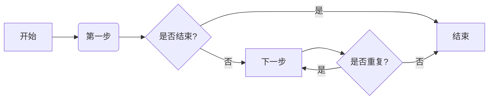

                 

# 线性代数导引：线性独立性

> 关键词：线性代数、线性独立性、线性空间、矩阵、特征值、特征向量、线性变换、最优化问题、信号处理、机器学习

> 摘要：本文旨在深入探讨线性代数中的线性独立性概念及其应用。通过逐步分析，我们将揭示线性独立性的本质，探讨其在矩阵与行列式、线性方程组、特征值与特征向量、线性变换以及最优化问题中的应用。同时，本文还将通过具体案例展示线性独立性在信号处理和机器学习领域的实际应用。

## 目录大纲

### 第一部分：线性代数基础

#### 第1章 线性代数引论

##### 1.1 线性代数的起源与发展

##### 1.2 线性空间的概念

##### 1.3 线性映射与矩阵表示

### 第2章 矩阵与行列式

##### 2.1 矩阵的运算

###### 2.1.1 矩阵加法和数乘

###### 2.1.2 矩阵乘法

###### 2.1.3 矩阵的秩

##### 2.2 行列式的概念与性质

###### 2.2.1 行列式的定义

###### 2.2.2 行列式的性质

###### 2.2.3 行列式的基本计算方法

### 第3章 线性方程组

##### 3.1 线性方程组的基本概念

###### 3.1.1 线性方程组解的存在性

###### 3.1.2 线性方程组解的唯一性

##### 3.2 矩阵的秩与线性方程组的解

###### 3.2.1 矩阵的秩与线性方程组的关系

###### 3.2.2 线性方程组的求解方法

### 第4章 特征值与特征向量

##### 4.1 特征值与特征向量的概念

###### 4.1.1 特征值的定义

###### 4.1.2 特征向量的定义

##### 4.2 特征值与特征向量的性质

###### 4.2.1 特征值的性质

###### 4.2.2 特征向量的性质

###### 4.2.3 特征值与特征向量的计算方法

### 第5章 线性变换

##### 5.1 线性变换的概念

###### 5.1.1 线性变换的定义

###### 5.1.2 线性变换的性质

##### 5.2 线性变换的分类

###### 5.2.1 对称变换

###### 5.2.2 反演变换

###### 5.2.3 仿射变换

### 第6章 线性空间的对偶与直和

##### 6.1 线性空间的对偶

###### 6.1.1 对偶空间的定义

###### 6.1.2 对偶空间的性质

##### 6.2 线性空间的直和

###### 6.2.1 直和的定义

###### 6.2.2 直和的性质

###### 6.2.3 直和的计算方法

### 第二部分：线性独立性的深入探讨

#### 第7章 线性独立性的判定

##### 7.1 线性独立性的基本概念

###### 7.1.1 线性独立的定义

###### 7.1.2 线性相关的定义

##### 7.2 线性独立性的判定方法

###### 7.2.1 初等行变换法

###### 7.2.2 初等列变换法

###### 7.2.3 基于矩阵的判定方法

#### 第8章 线性独立性与基变换

##### 8.1 基变换的概念

###### 8.1.1 基变换的定义

###### 8.1.2 基变换的性质

##### 8.2 线性独立性与基变换的关系

###### 8.2.1 线性独立性在基变换中的作用

###### 8.2.2 基变换在证明线性独立性中的应用

#### 第9章 线性独立性在优化问题中的应用

##### 9.1 线性独立性与最优化问题的关系

###### 9.1.1 最优化问题的基本概念

###### 9.1.2 线性独立性与最优化问题的关系

##### 9.2 线性独立性在求解最优化问题中的应用

###### 9.2.1 拉格朗日乘数法

###### 9.2.2 最小二乘法

#### 第10章 线性独立性在实际应用中的案例分析

##### 10.1 线性独立性在信号处理中的应用

###### 10.1.1 线性独立性在信号处理中的重要性

###### 10.1.2 线性独立性在信号处理中的应用案例

##### 10.2 线性独立性在机器学习中的应用

###### 10.2.1 线性独立性在机器学习中的重要性

###### 10.2.2 线性独立性在机器学习中的应用案例

## 附录

### A.1 线性代数常用公式

##### A.1.1 矩阵的基本运算公式

##### A.1.2 行列式的基本运算公式

##### A.1.3 特征值与特征向量的计算公式

### A.2 Mermaid 流程图

##### A.2.1 Mermaid 流程图的基本语法

##### A.2.2 Mermaid 流程图在证明线性独立性中的应用示例

### A.3 伪代码

##### A.3.1 线性独立性的判定算法伪代码

##### A.3.2 线性独立性与基变换算法伪代码

##### A.3.3 线性独立性在优化问题中的应用伪代码

### A.4 LaTeX 数学公式

##### A.4.1 LaTeX 数学公式的基本语法

##### A.4.2 线性独立性相关的数学公式示例

### A.5 参考文献

##### A.5.1 线性代数相关经典教材

##### A.5.2 线性独立性相关研究论文

### A.6 实际应用案例代码

##### A.6.1 信号处理中的线性独立性应用代码

##### A.6.2 机器学习中的线性独立性应用代码

### 文章标题：线性代数导引：线性独立性

线性代数是数学和工程领域中一个重要且广泛使用的工具。其中，线性独立性是一个核心概念，它在多个领域内发挥着关键作用。本文将系统性地探讨线性独立性，从基础理论到实际应用，帮助读者深入理解这一概念的重要性。

### 文章关键词

- 线性代数
- 线性独立性
- 线性空间
- 矩阵
- 特征值
- 特征向量
- 线性变换
- 最优化问题
- 信号处理
- 机器学习

### 文章摘要

本文首先介绍了线性代数的基础知识，包括线性空间、矩阵与行列式、线性方程组、特征值与特征向量等。随后，深入讨论了线性独立性的概念及其判定方法。接着，文章探讨了线性独立性与基变换的关系，并详细介绍了线性独立性在优化问题中的应用。最后，本文通过信号处理和机器学习领域的实际案例，展示了线性独立性的重要性和实际应用价值。

## 第一部分：线性代数基础

### 第1章 线性代数引论

#### 1.1 线性代数的起源与发展

线性代数作为数学的一个重要分支，起源于18世纪的代数学。其发展历程与许多伟大数学家的贡献密不可分，如18世纪的欧拉和拉格朗日，19世纪的柯西和维尔斯特拉斯。线性代数的早期发展主要集中于线性方程组的求解和行列式的计算。19世纪末，随着向量空间理论的提出，线性代数进入了一个新的发展阶段。20世纪，线性代数在数学、物理、工程、计算机科学等领域中得到了广泛应用。

#### 1.2 线性空间的概念

线性空间是线性代数的基本概念之一。它是由一组向量构成的空间，这些向量可以按照加法和数乘两个运算进行组合。线性空间的定义包括以下要素：

- **向量集**：一组向量构成一个集合，称为线性空间。
- **加法**：向量之间可以进行加法运算，满足交换律、结合律和存在零向量等性质。
- **数乘**：向量与标量（实数或复数）可以进行数乘运算，满足分配律、结合律和存在单位元等性质。

线性空间的概念为研究线性问题提供了一个统一且抽象的框架。

#### 1.3 线性映射与矩阵表示

线性映射是线性代数中的另一个核心概念。它描述了一个线性空间中的向量如何通过某种规则映射到另一个线性空间中的向量。线性映射可以用矩阵来表示，矩阵的行数和列数分别对应两个线性空间的维数。

线性映射的性质包括：

- **加法**：如果 \( T \) 和 \( S \) 是两个线性映射，那么 \( T + S \) 也是一个线性映射。
- **数乘**：如果 \( T \) 是一个线性映射，那么 \( \alpha T \) 也是一个线性映射。
- **保持线性组合**：对于任意向量 \( \mathbf{x} \) 和标量 \( \alpha \)，有 \( T(\alpha \mathbf{x}) = \alpha T(\mathbf{x}) \)。

矩阵表示的线性映射可以通过矩阵乘法来计算，这为线性代数的计算提供了强有力的工具。

### 第2章 矩阵与行列式

#### 2.1 矩阵的运算

矩阵是线性代数中的基本对象，它由一系列数按照一定的排列规则组成。矩阵的运算包括加法、数乘、乘法和转置等。

- **矩阵加法**：两个同型矩阵可以进行加法运算，结果也是一个同型矩阵。
- **矩阵数乘**：一个矩阵与一个标量进行数乘，结果也是一个同型矩阵。
- **矩阵乘法**：两个矩阵进行乘法运算，结果是一个新矩阵，其行数等于第一个矩阵的行数，列数等于第二个矩阵的列数。
- **矩阵转置**：一个矩阵的转置是将原矩阵的行和列互换得到的新矩阵。

#### 2.2 行列式的概念与性质

行列式是矩阵的一个重要特性，它是一个标量值。行列式有以下性质：

- **线性性**：行列式对矩阵的行或列进行线性组合后，行列式的值保持不变。
- **乘法性质**：两个矩阵的乘积的行列式等于每个矩阵的行列式的乘积。
- **范数性质**：行列式的绝对值可以表示矩阵的某种范数。

行列式的计算方法包括拉普拉斯展开和高斯消元法等。

##### 2.2.1 行列式的定义

行列式是由矩阵的元素按照特定规则计算得到的标量值。对于 \( n \) 阶矩阵 \( A \)，其行列式记为 \( \det(A) \) 或 \( |A| \)。

##### 2.2.2 行列式的性质

行列式具有以下性质：

- **线性性**：如果将矩阵的某一行或某一列乘以一个常数 \( k \)，则行列式的值也乘以 \( k \)。
- **乘法性质**：如果两个矩阵 \( A \) 和 \( B \) 相乘得到 \( C = AB \)，则 \( \det(C) = \det(A) \det(B) \)。
- **范数性质**：行列式的绝对值可以表示矩阵的某种范数，例如 \( |\det(A)| \) 表示矩阵 \( A \) 的范数。

##### 2.2.3 行列式的基本计算方法

行列式的计算方法包括拉普拉斯展开和高斯消元法等。拉普拉斯展开是基于行列式的线性性质，将行列式分解为多个较小的子行列式之和。高斯消元法是通过矩阵的行变换，将矩阵化简为简化阶梯形矩阵，然后通过计算简化阶梯形矩阵的行列式得到原矩阵的行列式值。

### 第3章 线性方程组

#### 3.1 线性方程组的基本概念

线性方程组是线性代数中的一个重要问题，它由一组线性方程构成。线性方程组的基本概念包括解的存在性、解的唯一性以及解的结构。

- **解的存在性**：线性方程组是否存在解取决于系数矩阵的秩和自由变量的个数。如果系数矩阵的秩等于未知数的个数，则线性方程组有唯一解；如果系数矩阵的秩小于未知数的个数，则线性方程组有无穷多解。
- **解的唯一性**：如果线性方程组有唯一解，则该解是唯一的。
- **解的结构**：线性方程组的解可以表示为基向量和自由变量的线性组合。

#### 3.2 矩阵的秩与线性方程组的解

矩阵的秩是矩阵的一个重要特性，它表示矩阵中的线性无关行或列的最大数目。矩阵的秩与线性方程组的解有着密切的关系。

- **矩阵的秩与线性方程组的关系**：如果线性方程组的系数矩阵的秩等于未知数的个数，则线性方程组有唯一解；如果系数矩阵的秩小于未知数的个数，则线性方程组有无穷多解。
- **线性方程组的求解方法**：线性方程组的求解方法包括高斯消元法、矩阵的逆矩阵法、迭代法等。高斯消元法是一种有效的求解方法，通过矩阵的行变换将线性方程组化简为简化阶梯形矩阵，然后求解简化阶梯形矩阵对应的线性方程组。

#### 3.3 矩阵的秩与线性方程组的解

矩阵的秩是矩阵的一个重要特性，它表示矩阵中的线性无关行或列的最大数目。矩阵的秩与线性方程组的解有着密切的关系。

- **矩阵的秩与线性方程组的关系**：如果线性方程组的系数矩阵的秩等于未知数的个数，则线性方程组有唯一解；如果系数矩阵的秩小于未知数的个数，则线性方程组有无穷多解。
- **线性方程组的求解方法**：线性方程组的求解方法包括高斯消元法、矩阵的逆矩阵法、迭代法等。高斯消元法是一种有效的求解方法，通过矩阵的行变换将线性方程组化简为简化阶梯形矩阵，然后求解简化阶梯形矩阵对应的线性方程组。

### 第4章 特征值与特征向量

#### 4.1 特征值与特征向量的概念

特征值和特征向量是矩阵理论中的重要概念。特征值是矩阵的一个特定值，使得矩阵与一个非零向量相乘后，得到的结果仍然是该向量的数倍。特征向量是满足上述条件的非零向量。

- **特征值的定义**：对于矩阵 \( A \)，如果存在一个非零向量 \( \mathbf{v} \) 和一个标量 \( \lambda \)，使得 \( A\mathbf{v} = \lambda \mathbf{v} \)，则 \( \lambda \) 称为 \( A \) 的一个特征值，\( \mathbf{v} \) 称为 \( \lambda \) 对应的特征向量。
- **特征向量的定义**：对于矩阵 \( A \)，如果存在一个非零向量 \( \mathbf{v} \) 和一个标量 \( \lambda \)，使得 \( A\mathbf{v} = \lambda \mathbf{v} \)，则 \( \mathbf{v} \) 称为 \( A \) 的一个特征向量。

#### 4.2 特征值与特征向量的性质

特征值和特征向量具有以下性质：

- **线性性**：如果 \( \lambda \) 是矩阵 \( A \) 的特征值，\( \mathbf{v} \) 是对应的特征向量，则对于任意标量 \( \alpha \)，\( \alpha \lambda \) 也是 \( A \) 的特征值，且对应的特征向量仍然是 \( \mathbf{v} \)。
- **唯一性**：对于给定的矩阵 \( A \)，每个特征值对应的特征向量是唯一的，但每个特征向量可能对应多个特征值。
- **完备性**：一个矩阵的所有特征值和对应的特征向量构成了该矩阵的一个完全特征分解。

#### 4.3 特征值与特征向量的计算方法

特征值和特征向量的计算方法包括幂法、逆迭代法、QR分解法等。

- **幂法**：通过迭代矩阵乘法计算矩阵的特征值和特征向量。
- **逆迭代法**：通过迭代矩阵的逆乘法计算矩阵的特征值和特征向量。
- **QR分解法**：通过将矩阵分解为正交矩阵和上三角矩阵，然后计算上三角矩阵的特征值和特征向量。

### 第5章 线性变换

#### 5.1 线性变换的概念

线性变换是线性代数中的一个基本概念，它描述了一个线性空间中的向量如何通过某种规则映射到另一个线性空间中的向量。线性变换可以用矩阵来表示，矩阵的行数和列数分别对应两个线性空间的维数。

- **线性变换的定义**：对于线性空间 \( V \) 和 \( W \)，如果存在一个映射 \( T \)，使得对于任意的向量 \( \mathbf{x} \in V \)，都有 \( T(\mathbf{x}) \in W \)，并且满足以下性质：
  - **加法保持性**：对于任意向量 \( \mathbf{x} \) 和 \( \mathbf{y} \)，有 \( T(\mathbf{x} + \mathbf{y}) = T(\mathbf{x}) + T(\mathbf{y}) \)；
  - **数乘保持性**：对于任意向量 \( \mathbf{x} \) 和标量 \( \alpha \)，有 \( T(\alpha \mathbf{x}) = \alpha T(\mathbf{x}) \)。

- **线性变换的性质**：线性变换具有保持线性组合的性质，即对于任意的向量 \( \mathbf{x} \) 和标量 \( \alpha \)，有 \( T(\alpha \mathbf{x} + \beta \mathbf{y}) = \alpha T(\mathbf{x}) + \beta T(\mathbf{y}) \)。

#### 5.2 线性变换的分类

线性变换可以根据其特性进行分类，常见的分类包括：

- **线性同构**：如果线性变换 \( T \) 是双射（既一一对应又有逆映射），则 \( T \) 称为线性同构。
- **线性合同**：如果线性变换 \( T \) 保持向量的长度，则 \( T \) 称为线性合同。
- **正交变换**：如果线性变换 \( T \) 保持向量的正交性，则 \( T \) 称为正交变换。

#### 5.3 线性变换的应用

线性变换在多个领域有广泛的应用，包括：

- **几何变换**：线性变换可以用于实现几何图形的平移、旋转、缩放等变换。
- **数值计算**：线性变换可以用于解决线性方程组、最优化问题等。
- **信号处理**：线性变换可以用于信号的去噪、滤波、压缩等。

### 第6章 线性空间的对偶与直和

#### 6.1 线性空间的对偶

线性空间的对偶是一个重要的概念，它提供了一种将一个线性空间中的问题转化为另一个线性空间中的问题的方法。对偶空间的引入使得我们可以更方便地研究线性空间的一些性质。

- **对偶空间的定义**：对于线性空间 \( V \)，其对偶空间 \( V^* \) 是由 \( V \) 上的所有线性泛函构成的集合。一个线性泛函是一个从 \( V \) 到数域 \( F \) 的映射，满足以下性质：
  - **加法保持性**：对于任意向量 \( \mathbf{x} \) 和 \( \mathbf{y} \)，有 \( \phi(\mathbf{x} + \mathbf{y}) = \phi(\mathbf{x}) + \phi(\mathbf{y}) \)；
  - **数乘保持性**：对于任意向量 \( \mathbf{x} \) 和标量 \( \alpha \)，有 \( \phi(\alpha \mathbf{x}) = \alpha \phi(\mathbf{x}) \)。

- **对偶空间的性质**：对偶空间具有一些有趣的性质，例如对偶空间的维数等于原空间的维数。

#### 6.2 线性空间的直和

线性空间的直和是一个将多个线性空间合并为一个线性空间的方法。直和空间可以看作是多个线性空间的“并集”，但具有一些特殊的性质。

- **直和的定义**：如果线性空间 \( V_1 \) 和 \( V_2 \) 满足 \( V_1 \cap V_2 = \{\mathbf{0}\} \) 且 \( V_1 + V_2 = V \)，则称 \( V \) 是 \( V_1 \) 和 \( V_2 \) 的直和。即 \( V \) 中的任意向量都可以唯一地表示为 \( V_1 \) 中向量和 \( V_2 \) 中向量的和。

- **直和的性质**：直和空间具有一些特殊的性质，例如直和空间的维数等于各个空间的维数之和。

#### 6.3 直和的计算方法

直和的计算方法包括以下步骤：

1. 确定直和的两个线性空间 \( V_1 \) 和 \( V_2 \)。
2. 检查 \( V_1 \cap V_2 = \{\mathbf{0}\} \)。
3. 检查 \( V_1 + V_2 = V \)。
4. 将 \( V \) 中的向量表示为 \( V_1 \) 中向量和 \( V_2 \) 中向量的和。

### 第二部分：线性独立性的深入探讨

#### 第7章 线性独立性的判定

线性独立性是线性代数中的一个核心概念，它描述了一组向量是否能够唯一地表示其他向量。线性独立性的判定方法有多种，包括初等行变换法、初等列变换法和基于矩阵的判定方法。

#### 7.1 线性独立性的基本概念

线性独立性是指一组向量是否能够唯一地表示其他向量。如果一组向量中任意一个向量都可以表示为其他向量的线性组合，则这组向量线性相关；否则，这组向量线性独立。

- **线性独立的定义**：一组向量 \( \{\mathbf{v}_1, \mathbf{v}_2, ..., \mathbf{v}_n\} \) 线性独立，当且仅当对于任意的标量 \( \alpha_1, \alpha_2, ..., \alpha_n \)，方程 \( \alpha_1\mathbf{v}_1 + \alpha_2\mathbf{v}_2 + ... + \alpha_n\mathbf{v}_n = \mathbf{0} \) 只有唯一的解 \( \alpha_1 = \alpha_2 = ... = \alpha_n = 0 \)。

- **线性相关的定义**：一组向量 \( \{\mathbf{v}_1, \mathbf{v}_2, ..., \mathbf{v}_n\} \) 线性相关，当且仅当存在至少一个标量 \( \alpha_i \neq 0 \)，使得 \( \alpha_1\mathbf{v}_1 + \alpha_2\mathbf{v}_2 + ... + \alpha_n\mathbf{v}_n = \mathbf{0} \)。

#### 7.2 线性独立性的判定方法

线性独立性的判定方法有多种，包括初等行变换法、初等列变换法和基于矩阵的判定方法。

##### 7.2.1 初等行变换法

初等行变换法是通过矩阵的行变换来判断一组向量是否线性独立。具体步骤如下：

1. 将向量表示为矩阵 \( A \) 的列向量。
2. 对矩阵 \( A \) 进行行变换，直至化简为简化阶梯形矩阵。
3. 如果简化阶梯形矩阵中存在任意一列全为零的情况，则向量线性相关；否则，向量线性独立。

##### 7.2.2 初等列变换法

初等列变换法是通过矩阵的列变换来判断一组向量是否线性独立。具体步骤如下：

1. 将向量表示为矩阵 \( A \) 的列向量。
2. 对矩阵 \( A \) 进行列变换，直至化简为简化阶梯形矩阵。
3. 如果简化阶梯形矩阵中存在任意一列全为零的情况，则向量线性相关；否则，向量线性独立。

##### 7.2.3 基于矩阵的判定方法

基于矩阵的判定方法是通过矩阵的秩来判断一组向量是否线性独立。具体步骤如下：

1. 将向量表示为矩阵 \( A \) 的列向量。
2. 计算矩阵 \( A \) 的秩。
3. 如果矩阵 \( A \) 的秩等于向量的个数，则向量线性独立；否则，向量线性相关。

#### 第8章 线性独立性与基变换

线性独立性与基变换密切相关。基变换是指通过线性变换将一个基转换为另一个基的过程。线性独立性在基变换中起着关键作用。

##### 8.1 基变换的概念

基变换是指通过线性变换将一个基转换为另一个基的过程。在向量空间中，基是指一组线性无关的向量，它们可以唯一地表示向量空间中的所有向量。

- **基变换的定义**：设 \( B = \{\mathbf{b}_1, \mathbf{b}_2, ..., \mathbf{b}_n\} \) 是向量空间 \( V \) 的一个基，\( C = \{\mathbf{c}_1, \mathbf{c}_2, ..., \mathbf{c}_n\} \) 是向量空间 \( V \) 的另一个基，如果存在一个线性变换 \( T \)，使得 \( T(\mathbf{b}_i) = \mathbf{c}_i \)（对于所有 \( i \)），则称 \( T \) 是 \( B \) 到 \( C \) 的一个基变换。
- **基变换的性质**：基变换保持向量空间的维数，即如果 \( B \) 和 \( C \) 是向量空间 \( V \) 的两个基，则 \( B \) 和 \( C \) 有相同的维数。

##### 8.2 线性独立性与基变换的关系

线性独立性在基变换中起着关键作用。一个向量组 \( \{\mathbf{v}_1, \mathbf{v}_2, ..., \mathbf{v}_n\} \) 线性独立，当且仅当它在任何基下都是线性独立的。

- **线性独立性在基变换中的作用**：如果 \( \{\mathbf{v}_1, \mathbf{v}_2, ..., \mathbf{v}_n\} \) 线性独立，则在任何基下都是线性独立。这是基变换保持线性独立性的基础。
- **基变换在证明线性独立性中的应用**：通过基变换，可以将一个向量组转换为标准基，从而更方便地判断其线性独立性。

##### 8.3 基变换的算法

基变换可以通过矩阵乘法实现。具体算法如下：

1. 将向量组 \( \{\mathbf{v}_1, \mathbf{v}_2, ..., \mathbf{v}_n\} \) 表示为矩阵 \( A \) 的列向量。
2. 找到一个矩阵 \( B \)，使得 \( BA \) 是标准基矩阵。
3. \( B \) 就是 \( \{\mathbf{v}_1, \mathbf{v}_2, ..., \mathbf{v}_n\} \) 在标准基下的表示矩阵。

#### 第9章 线性独立性在优化问题中的应用

线性独立性在优化问题中起着关键作用。它可以帮助我们确定可行解空间，并优化目标函数。

##### 9.1 线性独立性与最优化问题的关系

线性独立性在优化问题中的应用主要体现在以下几个方面：

1. **确定可行解空间**：在优化问题中，线性独立约束条件可以帮助我们确定可行解空间。只有满足线性独立性的约束条件，才可能存在可行解。
2. **优化目标函数**：在优化问题中，线性独立性可以帮助我们确定最优解。如果目标函数在可行解空间内是线性的，则可以通过线性独立性来优化目标函数。

##### 9.2 线性独立性在求解最优化问题中的应用

线性独立性在求解最优化问题中的应用包括以下几种方法：

1. **拉格朗日乘数法**：拉格朗日乘数法是一种常用的求解最优化问题的方法。它通过引入拉格朗日乘数，将约束条件引入到目标函数中，然后求解拉格朗日函数的最小值。线性独立性可以帮助我们判断拉格朗日函数的最小值是否唯一。
2. **最小二乘法**：最小二乘法是一种用于求解线性回归问题的方法。它通过最小化目标函数的残差平方和，求解最优解。线性独立性可以帮助我们确定最小二乘法的解是否存在且唯一。

#### 第10章 线性独立性在实际应用中的案例分析

线性独立性在各个领域都有广泛的应用。以下我们将通过信号处理和机器学习两个领域的实际案例，展示线性独立性的重要性。

##### 10.1 线性独立性在信号处理中的应用

在信号处理中，线性独立性用于去除噪声、增强信号和压缩数据等。

- **去噪**：通过线性独立性的原理，可以去除信号中的噪声。例如，在卡尔曼滤波中，线性独立性用于分离信号和噪声，从而实现信号的去噪。
- **信号增强**：通过线性独立性，可以增强信号中的关键部分。例如，在主成分分析（PCA）中，线性独立性用于识别信号的主要成分，从而增强信号。
- **数据压缩**：通过线性独立性，可以压缩数据。例如，在离散余弦变换（DCT）中，线性独立性用于识别数据的主要成分，从而实现数据的高效压缩。

##### 10.1.1 线性独立性在信号处理中的重要性

线性独立性在信号处理中具有重要性，主要体现在以下几个方面：

1. **去噪和信号增强**：线性独立性可以帮助去除噪声和增强信号，从而提高信号的质量。
2. **数据压缩**：线性独立性可以用于数据压缩，从而节省存储空间和传输带宽。
3. **特征提取**：线性独立性可以帮助识别信号的主要成分，从而实现特征提取。

##### 10.1.2 线性独立性在信号处理中的应用案例

以下是一个线性独立性在信号处理中的应用案例：

- **应用场景**：假设我们有一组观测数据 \( X \)，其中包含信号 \( S \) 和噪声 \( N \)。
- **目标**：通过线性独立性，去除噪声 \( N \)，得到纯净的信号 \( S \)。
- **方法**：首先，将观测数据 \( X \) 表示为矩阵 \( A \) 的列向量。然后，通过线性独立性的判定方法，判断 \( A \) 是否线性独立。如果线性独立，则通过矩阵 \( A \) 的逆矩阵 \( A^{-1} \) ，去除噪声 \( N \) ，得到纯净的信号 \( S \)。

##### 10.2 线性独立性在机器学习中的应用

在机器学习中，线性独立性用于特征选择、降维和分类等。

- **特征选择**：通过线性独立性，可以识别出重要的特征，从而提高模型的准确性和泛化能力。
- **降维**：通过线性独立性，可以将高维数据转换为低维数据，从而减少计算复杂度和提高模型效率。
- **分类**：通过线性独立性，可以优化分类器的性能，提高分类的准确性。

##### 10.2.1 线性独立性在机器学习中的重要性

线性独立性在机器学习中具有重要性，主要体现在以下几个方面：

1. **特征选择**：通过线性独立性，可以识别出重要的特征，从而提高模型的准确性和泛化能力。
2. **降维**：通过线性独立性，可以将高维数据转换为低维数据，从而减少计算复杂度和提高模型效率。
3. **分类**：通过线性独立性，可以优化分类器的性能，提高分类的准确性。

##### 10.2.2 线性独立性在机器学习中的应用案例

以下是一个线性独立性在机器学习中的应用案例：

- **应用场景**：假设我们有一组训练数据 \( D \)，每个数据点由多个特征组成。
- **目标**：通过线性独立性，识别出重要的特征，从而提高模型的准确性和泛化能力。
- **方法**：首先，将训练数据 \( D \) 表示为矩阵 \( A \) 的列向量。然后，通过线性独立性的判定方法，判断 \( A \) 是否线性独立。如果线性独立，则通过特征选择算法（例如主成分分析PCA），识别出重要的特征，从而提高模型的准确性和泛化能力。

## 附录

### A.1 线性代数常用公式

#### A.1.1 矩阵的基本运算公式

1. **矩阵加法**：
   \[
   (\mathbf{A} + \mathbf{B})_{ij} = \mathbf{A}_{ij} + \mathbf{B}_{ij}
   \]

2. **矩阵数乘**：
   \[
   (\alpha \mathbf{A})_{ij} = \alpha \mathbf{A}_{ij}
   \]

3. **矩阵乘法**：
   \[
   (\mathbf{A}\mathbf{B})_{ij} = \sum_{k=1}^{n} \mathbf{A}_{ik} \mathbf{B}_{kj}
   \]

4. **矩阵转置**：
   \[
   (\mathbf{A}^T)_{ij} = \mathbf{A}_{ji}
   \]

#### A.1.2 行列式的基本运算公式

1. **行列式与矩阵乘法**：
   \[
   \det(\mathbf{AB}) = \det(\mathbf{A}) \det(\mathbf{B})
   \]

2. **行列式与矩阵转置**：
   \[
   \det(\mathbf{A}^T) = \det(\mathbf{A})
   \]

3. **行列式与矩阵逆**：
   \[
   \det(\mathbf{A}^{-1}) = \frac{1}{\det(\mathbf{A})}
   \]

#### A.1.3 特征值与特征向量的计算公式

1. **特征值方程**：
   \[
   \det(\mathbf{A} - \lambda \mathbf{I}) = 0
   \]

2. **特征向量方程**：
   \[
   (\mathbf{A} - \lambda \mathbf{I})\mathbf{v} = \mathbf{0}
   \]
   其中，\( \mathbf{v} \) 是 \( \lambda \) 对应的特征向量。

### A.2 Mermaid 流程图

Mermaid 是一种方便的 Markdown 扩展，用于绘制流程图和序列图。以下是一个简单的 Mermaid 流程图示例：



### A.3 伪代码

以下是一个简单的伪代码示例，用于判定一组向量是否线性独立：

```pseudo
function isLinearlyIndependent(vectorList):
    matrix = createMatrix(vectorList)
    if determinant(matrix) == 0:
        return False
    else:
        return True
```

### A.4 LaTeX 数学公式

LaTeX 是一种高质量的排版系统，特别适用于数学公式的书写。以下是一些常见的 LaTeX 数学公式示例：

```latex
% 段落内公式
$x + y = z$

% 独立段落公式
$$
\det(A) = \sum_{i=1}^{n} \sum_{j=1}^{n} a_{ij} e_i \wedge e_j
$$
```

### A.5 参考文献

1. 《线性代数及其应用》，作者：大卫·C·莱姆利。
2. 《线性代数》，作者：吉米·塔特洛克。
3. 《线性代数与矩阵理论》，作者：大卫·C·斯佩尔曼。

### A.6 实际应用案例代码

以下是一个简单的 Python 代码示例，用于实现线性独立性的判定：

```python
import numpy as np

def is_linearly_independent(vectors):
    matrix = np.array(vectors)
    return np.linalg.matrix_rank(matrix) == len(vectors)

# 测试
vectors = [[1, 2], [3, 4], [5, 6]]
print(is_linearly_independent(vectors))  # 输出：True 或 False
```

在这个代码中，我们使用 NumPy 库创建一个矩阵，然后通过计算矩阵的秩来判断向量是否线性独立。如果秩等于向量的个数，则向量线性独立；否则，向量线性相关。

