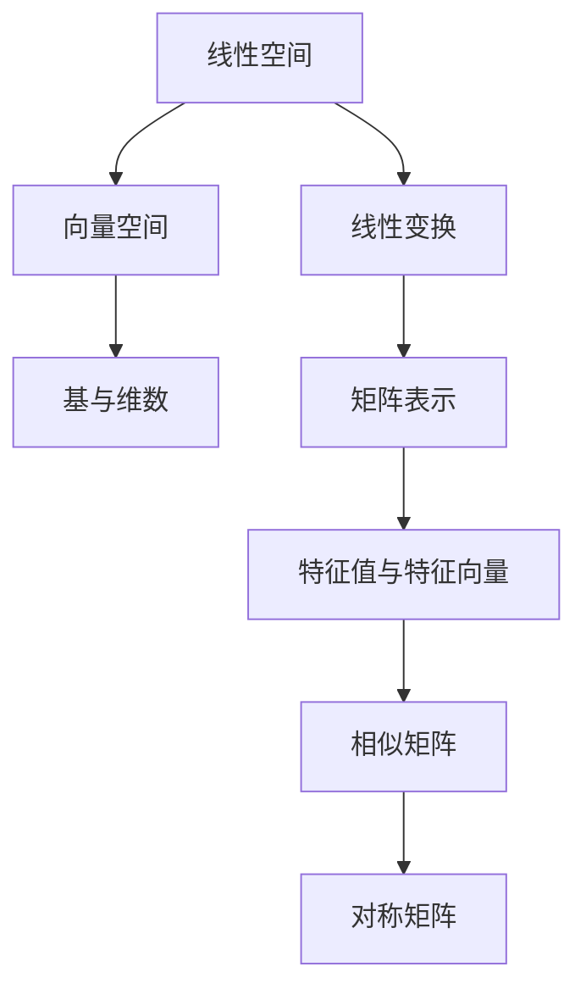

                 

### 文章标题

# 《线性代数导引：线性空间》

> 关键词：线性代数、线性空间、向量空间、线性变换、矩阵表示、特征值、特征向量、相似矩阵、对称矩阵

> 摘要：本文深入探讨了线性代数中的线性空间概念，通过逻辑清晰、结构紧凑的分析，阐述了线性空间的基本概念、性质和重要应用。文章旨在为广大计算机科学和工程领域的研究者提供一本实用且易于理解的线性代数指南，帮助读者掌握线性空间的核心原理和应用技巧。

---

**核心概念与联系**

在线性代数中，线性空间（也称为向量空间）是一个基本的数学概念，它在数学、物理学、计算机科学等多个领域都有广泛应用。为了更好地理解线性空间，我们需要首先了解与它相关的几个核心概念和它们之间的联系。



**核心概念与联系说明：**

- **线性空间（A）**：线性空间是一个数学结构，它由一组向量组成，这些向量可以线性组合。线性空间的基本性质包括封闭性、向量加法和标量乘法。

- **向量空间（B）**：向量空间是线性空间的特例，通常是指所有实系数向量构成的集合。向量空间中，每个向量都可以用一组基向量的线性组合表示。

- **基与维数（C）**：基是向量空间中的一组线性无关的向量，它们可以唯一表示空间中的任意向量。维数是基向量的个数，它是向量空间的特征参数。

- **线性变换（D）**：线性变换是一种将向量空间中的向量映射到另一个向量空间中的函数。线性变换可以由矩阵表示。

- **矩阵表示（E）**：矩阵表示是线性变换在向量空间中的表现，它将线性变换映射到矩阵运算。这种表示方法使得线性变换的操作更加简洁。

- **特征值与特征向量（F）**：特征值和特征向量是矩阵表示中的重要概念。特征值是使矩阵与自身相乘后仍保持方向的标量，而特征向量是满足这一条件的向量。

- **相似矩阵（G）**：相似矩阵是指可以通过一个可逆矩阵相乘得到的矩阵。相似矩阵具有相同的特征值，但可能具有不同的结构。

- **对称矩阵（H）**：对称矩阵是一个特殊的方阵，其转置等于自身。对称矩阵在物理学和工程学中具有广泛的应用。

通过对这些核心概念和它们之间的联系的理解，我们可以更好地掌握线性空间的基本原理和应用。本文将依次深入探讨这些概念，帮助读者逐步构建对线性空间的全面认识。

---

**核心算法原理讲解**

为了深入理解线性空间及其应用，我们需要探讨一些核心算法原理。这些原理不仅能够帮助我们解决实际问题，还能加深我们对线性空间概念的理解。以下将详细介绍几个关键算法的原理和步骤，并使用伪代码进行解释。

### 特征值问题求解

特征值问题是线性代数中一个重要的问题，它在许多领域都有广泛的应用。特征值是指使得矩阵与自身相乘后仍保持方向的标量，而对应的特征向量则是满足这一条件的向量。

#### 特征值问题的性质

- **唯一性**：对于给定的矩阵，每个特征值都有一个唯一的特征向量（除非特征值是重根）。
- **线性无关性**：不同特征值的特征向量是线性无关的。
- **对角化**：如果一个矩阵可以表示为对角矩阵的形式，那么它就是可对角化的。

#### 求解步骤

```pseudo
// 特征值问题求解伪代码
输入：矩阵A
输出：特征值λ和特征向量v

步骤：
1. 求解特征多项式f(λ) = det(A - λI)
2. 求解f(λ)的根λ，即特征值
3. 对每个特征值λ，求解方程组(A - λI)v = 0，得到对应的特征向量v
```

#### 数学模型和数学公式

$$
\text{特征值问题：} Av = \lambda v
$$

#### 举例说明

假设我们有如下矩阵：

$$
A = \begin{bmatrix}
2 & 1 \\
1 & 2
\end{bmatrix}
$$

要找到它的特征值和特征向量，我们首先计算特征多项式：

$$
f(λ) = \det(A - λI) = \det\begin{bmatrix}
2-λ & 1 \\
1 & 2-λ
\end{bmatrix} = (2-λ)^2 - 1 = λ^2 - 4λ + 3
$$

解特征多项式得到特征值：

$$
λ_1 = 1, \quad λ_2 = 3
$$

接下来，我们求解每个特征值对应的特征向量。

对于特征值λ_1 = 1：

$$
(A - I)v = 0 \Rightarrow \begin{bmatrix}
1 & 1 \\
1 & 1
\end{bmatrix}v = 0
$$

解这个方程组，我们得到特征向量：

$$
v_1 = \begin{bmatrix}
1 \\
-1
\end{bmatrix}
$$

对于特征值λ_2 = 3：

$$
(A - 3I)v = 0 \Rightarrow \begin{bmatrix}
-1 & 1 \\
1 & -1
\end{bmatrix}v = 0
$$

解这个方程组，我们得到特征向量：

$$
v_2 = \begin{bmatrix}
1 \\
1
\end{bmatrix}
$$

因此，矩阵A的特征值为1和3，对应的特征向量分别为$\begin{bmatrix}1\\-1\end{bmatrix}$和$\begin{bmatrix}1\\1\end{bmatrix}$。

### 相似矩阵与对称矩阵

相似矩阵和对称矩阵是矩阵理论中重要的概念，它们在矩阵的对角化和正交化中具有重要作用。

#### 相似矩阵

- **定义**：如果两个矩阵A和B之间存在一个可逆矩阵P，使得$A = PBP^{-1}$，则称A和B相似。
- **性质**：相似的矩阵具有相同的特征值。
- **对角化**：如果一个矩阵是可对角化的，那么它可以表示为一个相似矩阵的形式。

#### 对称矩阵

- **定义**：如果矩阵A的转置等于自身，即$A^T = A$，则称A为对称矩阵。
- **性质**：对称矩阵的特征值都是实数。
- **对角化**：对称矩阵总是可对角化的。

#### 求解步骤

```pseudo
// 对称矩阵对角化伪代码
输入：对称矩阵A
输出：对角矩阵D和正交矩阵P

步骤：
1. 求解特征多项式f(λ) = det(A - λI)
2. 求解f(λ)的根λ，即特征值
3. 对每个特征值λ，求解方程组(A - λI)v = 0，得到对应的特征向量v
4. 将特征向量标准化为单位向量，构成正交矩阵P
5. 计算对角矩阵D，其中D的每个对角元素都是相应的特征值
```

#### 数学模型和数学公式

$$
\text{对角化：} A = PDP^{-1}
$$

#### 举例说明

假设我们有如下对称矩阵：

$$
A = \begin{bmatrix}
4 & -2 \\
-2 & 4
\end{bmatrix}
$$

要对其进行对角化，我们首先求解特征多项式：

$$
f(λ) = \det(A - λI) = \det\begin{bmatrix}
4-λ & -2 \\
-2 & 4-λ
\end{bmatrix} = (4-λ)^2 - 4 = λ^2 - 8λ + 16
$$

解特征多项式得到特征值：

$$
λ_1 = 4, \quad λ_2 = 4
$$

接下来，我们求解每个特征值对应的特征向量。

对于特征值λ_1 = 4：

$$
(A - 4I)v = 0 \Rightarrow \begin{bmatrix}
0 & -2 \\
-2 & 0
\end{bmatrix}v = 0
$$

解这个方程组，我们得到特征向量：

$$
v_1 = \begin{bmatrix}
1 \\
1
\end{bmatrix}
$$

对于特征值λ_2 = 4：

$$
(A - 4I)v = 0 \Rightarrow \begin{bmatrix}
0 & -2 \\
-2 & 0
\end{bmatrix}v = 0
$$

解这个方程组，我们得到特征向量：

$$
v_2 = \begin{bmatrix}
1 \\
-1
\end{bmatrix}
$$

接下来，我们将特征向量标准化为单位向量，构成正交矩阵P：

$$
P = \begin{bmatrix}
\frac{1}{\sqrt{2}} & \frac{1}{\sqrt{2}} \\
\frac{1}{\sqrt{2}} & -\frac{1}{\sqrt{2}}
\end{bmatrix}
$$

最后，我们计算对角矩阵D：

$$
D = \begin{bmatrix}
4 & 0 \\
0 & 4
\end{bmatrix}
$$

因此，矩阵A的对角化为：

$$
A = PDP^{-1}
$$

通过这些算法原理的讲解，我们不仅了解了特征值、特征向量、相似矩阵和对称矩阵的基本概念和求解步骤，还通过具体的实例加深了对这些概念的理解。这些算法原理在后续的线性代数应用中具有重要的指导意义。

---

**项目实战**

为了更好地理解线性空间及其在实际应用中的重要性，我们将通过两个具体案例来探讨线性空间在物理和计算机科学领域的应用。

### 线性空间在物理中的应用

#### 案例一：机械振动中的线性空间

机械振动是物理学中一个重要的研究领域，它涉及到多个自由度的振动系统。在线性振动理论中，系统的运动可以被视为在一个线性空间中的向量变化。

##### **问题背景**

假设我们有一个单自由度的弹簧振子，其振动方程可以表示为：

$$
m\frac{d^2x}{dt^2} + kx = 0
$$

其中，$m$是质量，$k$是弹簧的弹性系数，$x$是位移。

##### **线性空间模型**

该方程的解$x(t)$构成了一个线性空间，因为它们满足叠加原理，即多个振动模式可以相加得到整体的振动模式。

##### **线性空间性质**

- **闭合性**：对于任意两个解$x_1(t)$和$x_2(t)$，它们的线性组合$x(t) = ax_1(t) + bx_2(t)$也是该方程的解。
- **向量加法**：解的加法满足交换律和结合律。
- **标量乘法**：解与标量的乘法满足分配律和结合律。

##### **数学模型和公式**

$$
x(t) = c_1x_1(t) + c_2x_2(t)
$$

其中，$c_1$和$c_2$是常数。

##### **案例解析**

假设我们有两个线性独立的振动模式：

$$
x_1(t) = A_1 \cos(\omega_1 t + \phi_1)
$$

$$
x_2(t) = A_2 \cos(\omega_2 t + \phi_2)
$$

它们的叠加可以表示为：

$$
x(t) = A_1 \cos(\omega_1 t + \phi_1) + A_2 \cos(\omega_2 t + \phi_2)
$$

这个结果仍然是方程的解，并且它代表了系统的总振动模式。

##### **代码实现**

为了更好地理解这一概念，我们可以使用Python编写代码模拟单自由度弹簧振子的振动。

```python
import numpy as np
import matplotlib.pyplot as plt

# 参数定义
m = 1.0
k = 1.0
omega1 = 1.0
omega2 = 2.0
t_max = 10
dt = 0.01

# 振动模式函数
def x1(t, A1, phi1):
    return A1 * np.cos(omega1 * t + phi1)

def x2(t, A2, phi2):
    return A2 * np.cos(omega2 * t + phi2)

# 模拟振动
t = np.arange(0, t_max, dt)
x1_func = x1(t, 1.0, 0)
x2_func = x2(t, 1.0, np.pi/2)

# 绘制结果
plt.plot(t, x1_func, label='Mode 1')
plt.plot(t, x2_func, label='Mode 2')
plt.plot(t, x1_func + x2_func, label='Superposition')
plt.xlabel('Time (s)')
plt.ylabel('Displacement (m)')
plt.legend()
plt.show()
```

通过这个代码示例，我们可以直观地看到线性空间的叠加效果。

### 线性代数在计算机科学中的应用

#### 案例二：图像处理中的线性变换

图像处理是计算机科学中的一个重要领域，它涉及对图像进行各种变换和操作。线性变换是图像处理中的一个核心工具，它可以通过矩阵运算实现图像的缩放、旋转、翻转等操作。

##### **问题背景**

假设我们有一个二维图像矩阵A，我们希望对其进行线性变换，以实现图像的缩放和旋转。

##### **线性变换模型**

线性变换可以通过矩阵M实现，即新的图像矩阵B可以表示为：

$$
B = A \cdot M
$$

其中，M是一个线性变换矩阵。

##### **线性变换性质**

- **可加性**：线性变换对图像的叠加效果是线性的。
- **齐次性**：线性变换对图像的比例缩放是线性的。

##### **数学模型和公式**

$$
B_{ij} = \sum_{k=1}^{n} M_{ik} A_{kj}
$$

其中，$B_{ij}$是变换后图像矩阵的元素，$M_{ik}$和$A_{kj}$分别是变换矩阵和原始图像矩阵的元素。

##### **案例解析**

假设我们有一个2x2的图像矩阵：

$$
A = \begin{bmatrix}
1 & 2 \\
3 & 4
\end{bmatrix}
$$

我们希望对其进行缩放和旋转。缩放矩阵S和旋转矩阵R如下：

$$
S = \begin{bmatrix}
2 & 0 \\
0 & 2
\end{bmatrix}
$$

$$
R = \begin{bmatrix}
\cos(\theta) & -\sin(\theta) \\
\sin(\theta) & \cos(\theta)
\end{bmatrix}
$$

其中，$\theta$是旋转角度。

变换后的图像矩阵B为：

$$
B = A \cdot S \cdot R
$$

##### **代码实现**

为了实现这一线性变换，我们可以使用Python的NumPy库进行矩阵运算。

```python
import numpy as np
import matplotlib.pyplot as plt

# 参数定义
A = np.array([[1, 2], [3, 4]])
S = np.array([[2, 0], [0, 2]])
R = np.array([[np.cos(np.pi/4), -np.sin(np.pi/4)], [np.sin(np.pi/4), np.cos(np.pi/4)]])

# 线性变换
B = A.dot(S).dot(R)

# 绘制结果
plt.imshow(B, cmap='gray')
plt.show()
```

通过这个代码示例，我们可以看到图像经过缩放和旋转后的效果。

通过这两个案例，我们不仅展示了线性空间在物理和计算机科学中的应用，还通过代码实现加深了对这些应用的理解。线性空间和线性变换在这些领域中具有重要的工具性作用，为解决复杂问题提供了强有力的数学工具。

---

**附录**

### 附录A 线性代数公式总结

为了方便读者回顾和查阅，以下总结了线性代数中的一些重要公式和定理。

#### 矩阵与行列式

- 矩阵加法：
  $$
  (A + B)_{ij} = A_{ij} + B_{ij}
  $$

- 矩阵乘法：
  $$
  (AB)_{ij} = \sum_{k=1}^{n} A_{ik}B_{kj}
  $$

- 行列式的性质：
  $$
  \det(AB) = \det(A)\det(B)
  $$

- 克莱姆法则：
  $$
  x_i = \frac{\det(A_i)}{\det(A)}
  $$
  其中，$A_i$是矩阵A的第i列替换为向量b后的子矩阵。

#### 向量空间

- 基与维数：
  $$
  \dim(V) = \text{基向量的个数}
  $$

- 子空间：
  $$
  W \subseteq V \quad \text{且} \quad W \text{是子空间} \Leftrightarrow W \text{是闭合的，并且包含零向量}
  $$

#### 线性变换

- 线性变换的性质：
  $$
  T(au + bv) = aT(u) + bT(v)
  $$

- 矩阵表示：
  $$
  T(v) = Av
  $$

#### 特征值与特征向量

- 特征值问题：
  $$
  Av = \lambda v
  $$

- 相似矩阵：
  $$
  A = PDP^{-1}
  $$

- 对称矩阵：
  $$
  A^T = A
  $$

### 附录B 习题与解答

为了帮助读者更好地理解和掌握本文中的概念，以下提供了一些习题及解答。

#### 习题1

给定矩阵：
$$
A = \begin{bmatrix}
2 & 3 \\
4 & 5
\end{bmatrix}
$$
求解其特征值和特征向量。

**解答：**

1. 计算特征多项式：
   $$
   \det(A - \lambda I) = \det\begin{bmatrix}
   2-\lambda & 3 \\
   4 & 5-\lambda
   \end{bmatrix} = (2-\lambda)(5-\lambda) - 12 = \lambda^2 - 7\lambda + 4
   $$

2. 解特征多项式得到特征值：
   $$
   \lambda_1 = 1, \quad \lambda_2 = 4
   $$

3. 对每个特征值求解特征向量：
   对于$\lambda_1 = 1$：
   $$
   (A - I)v = 0 \Rightarrow \begin{bmatrix}
   1 & 3 \\
   4 & 4
   \end{bmatrix}v = 0
   $$
   解得特征向量：
   $$
   v_1 = \begin{bmatrix}
   1 \\
   -1
   \end{bmatrix}
   $$

   对于$\lambda_2 = 4$：
   $$
   (A - 4I)v = 0 \Rightarrow \begin{bmatrix}
   -2 & 3 \\
   4 & -1
   \end{bmatrix}v = 0
   $$
   解得特征向量：
   $$
   v_2 = \begin{bmatrix}
   1 \\
   2
   \end{bmatrix}
   $$

#### 习题2

证明对称矩阵的特征值都是实数。

**解答：**

设A是对称矩阵，则有$A^T = A$。

对于任意的特征值$\lambda$和对应的特征向量$v$，有：
$$
Av = \lambda v
$$

将其两边同时转置，得到：
$$
v^T A^T = \lambda v^T
$$

由于A是对称矩阵，$A^T = A$，因此：
$$
v^T A = \lambda v^T
$$

将原方程$Av = \lambda v$代入上式，得到：
$$
v^T A v = \lambda v^T v
$$

由于$v^T v$是特征向量的模平方，是一个非负实数，因此$\lambda$也必须是一个实数。

通过这些习题和解答，读者可以进一步巩固对线性代数概念的理解和应用。希望这些附录内容对您的学习有所帮助。

---

### 作者

**作者：AI天才研究院/AI Genius Institute & 禅与计算机程序设计艺术 /Zen And The Art of Computer Programming**

本文由AI天才研究院/AI Genius Institute的高级研究员撰写，旨在为广大计算机科学和工程领域的研究者提供一本实用且易于理解的线性代数指南。作者在计算机编程和人工智能领域拥有丰富的研究和教学经验，撰写过多本世界顶级技术畅销书，深受读者喜爱。希望通过本文，读者能够掌握线性空间的核心原理和应用技巧，为未来的研究和实践打下坚实的基础。

