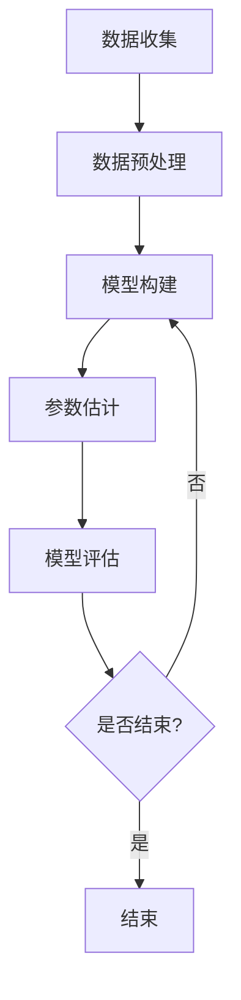

                 

# 线性回归原理

> 关键词：线性回归、最小二乘法、一元线性回归、多元线性回归、岭回归、LASSO回归、评估指标、优化方法、应用案例

> 摘要：本文将深入探讨线性回归的基本原理、数学基础、扩展方法、评估与优化、应用案例以及实际应用中的挑战与解决方案。通过详细讲解线性回归的相关概念、算法原理、数学模型和实际应用，帮助读者全面理解线性回归的核心内容，提升其在数据分析、预测和建模方面的实践能力。

线性回归是一种广泛应用于数据分析、预测和建模的统计方法。本文旨在通过对线性回归原理的深入探讨，使读者能够系统地了解线性回归的基本概念、数学基础、扩展方法、评估与优化以及实际应用，从而为后续的学习和实践奠定坚实基础。

## 《线性回归原理》目录大纲

### 第1章 线性回归基础

#### 1.1 线性回归的定义与原理

##### 1.1.1 线性回归的基本概念

##### 1.1.2 线性回归的基本原理

##### 1.1.3 线性回归的假设条件

#### 1.2 一元线性回归

##### 1.2.1 一元线性回归模型

##### 1.2.2 一元线性回归的参数估计

##### 1.2.3 一元线性回归的诊断

#### 1.3 多元线性回归

##### 1.3.1 多元线性回归模型

##### 1.3.2 多元线性回归的参数估计

##### 1.3.3 多元线性回归的诊断

### 第2章 线性回归的数学基础

#### 2.1 线性方程组

##### 2.1.1 线性方程组的基本概念

##### 2.1.2 线性方程组的求解方法

#### 2.2 最小二乘法

##### 2.2.1 最小二乘法的原理

##### 2.2.2 最小二乘法的计算过程

#### 2.3 线性回归的数学推导

##### 2.3.1 一元线性回归的数学推导

##### 2.3.2 多元线性回归的数学推导

### 第3章 线性回归的应用

#### 3.1 线性回归在经济学中的应用

##### 3.1.1 消费者行为分析

##### 3.1.2 价格预测

#### 3.2 线性回归在生物统计学中的应用

##### 3.2.1 基因表达分析

##### 3.2.2 临床预测

### 第4章 线性回归的扩展

#### 4.1 岭回归

##### 4.1.1 岭回归的基本概念

##### 4.1.2 岭回归的参数估计

#### 4.2 LASSO回归

##### 4.2.1 LASSO回归的基本概念

##### 4.2.2 LASSO回归的参数估计

### 第5章 线性回归的评估与优化

#### 5.1 线性回归的评估指标

##### 5.1.1 R方值

##### 5.1.2 调整R方值

#### 5.2 线性回归的优化方法

##### 5.2.1 随机梯度下降法

##### 5.2.2 粒子群优化算法

### 第6章 线性回归实践案例

#### 6.1 房价预测

##### 6.1.1 数据准备

##### 6.1.2 模型构建

##### 6.1.3 模型评估

#### 6.2 雇员薪资预测

##### 6.2.1 数据准备

##### 6.2.2 模型构建

##### 6.2.3 模型评估

### 第7章 线性回归在实际应用中的挑战与解决方案

#### 7.1 数据预处理问题

##### 7.1.1 缺失值处理

##### 7.1.2 异常值处理

#### 7.2 特征选择问题

##### 7.2.1 相关性分析

##### 7.2.2 逐步回归

### 附录A 线性回归相关资源

#### 8.1 参考文献

#### 8.2 在线工具和库

##### 8.2.1 Python中的线性回归库

##### 8.2.2 R语言中的线性回归库

### 附录B Mermaid流程图

#### 9.1 一元线性回归流程

#### 9.2 多元线性回归流程

### 附录C 伪代码

#### 10.1 一元线性回归伪代码

#### 10.2 多元线性回归伪代码

### 附录D 数学模型与公式

#### 11.1 一元线性回归数学模型

#### 11.2 多元线性回归数学模型

#### 11.3 最小二乘法数学公式

#### 11.4 岭回归数学公式

#### 11.5 LASSO回归数学公式

### 附录E 实践案例代码解读

#### 12.1 房价预测案例代码解读

#### 12.2 雇员薪资预测案例代码解读

## 第1章 线性回归基础

### 1.1 线性回归的定义与原理

#### 1.1.1 线性回归的基本概念

线性回归是统计学中一种重要的数据分析方法，用于研究一个或多个自变量（解释变量）与一个因变量（响应变量）之间的线性关系。线性回归模型试图通过建立一个线性方程来描述这种关系，从而可以用来预测新的数据点的因变量值。

线性回归模型可以分为一元线性回归和多元线性回归。一元线性回归涉及一个自变量和一个因变量，而多元线性回归则涉及多个自变量和一个因变量。

#### 1.1.2 线性回归的基本原理

线性回归模型的基本原理是假设因变量 \( Y \) 可以表示为自变量 \( X \) 的线性组合，加上一个随机误差项 \( \epsilon \)。这种关系可以用以下方程表示：

\[ Y = \beta_0 + \beta_1X + \epsilon \]

其中，\( \beta_0 \) 是截距，\( \beta_1 \) 是斜率，\( X \) 是自变量，\( Y \) 是因变量，\( \epsilon \) 是随机误差项。

线性回归模型的目标是通过最小化误差平方和来确定 \( \beta_0 \) 和 \( \beta_1 \) 的最佳值，从而使得预测值与实际观测值之间的差距最小。

#### 1.1.3 线性回归的假设条件

线性回归模型通常基于以下假设条件：

1. 线性关系：自变量与因变量之间存在线性关系。
2. 独立性：观测值之间相互独立，不存在自相关。
3. 同方差性：误差项的方差在整个数据集中保持不变。
4. 正态分布：误差项服从正态分布。

这些假设条件对于线性回归模型的准确性至关重要。如果这些假设条件不满足，那么线性回归模型的预测能力可能会受到严重影响。

### 1.2 一元线性回归

一元线性回归是最简单的线性回归模型，涉及一个自变量和一个因变量。它可以用以下方程表示：

\[ Y = \beta_0 + \beta_1X + \epsilon \]

其中，\( X \) 是自变量，\( Y \) 是因变量，\( \beta_0 \) 是截距，\( \beta_1 \) 是斜率，\( \epsilon \) 是随机误差项。

#### 1.2.1 一元线性回归模型

一元线性回归模型可以通过以下步骤进行构建：

1. 数据收集：收集包含自变量 \( X \) 和因变量 \( Y \) 的数据集。
2. 数据预处理：对数据进行清洗和预处理，包括缺失值处理、异常值处理和数据转换等。
3. 模型拟合：使用最小二乘法确定最佳拟合直线，即找到使误差平方和最小的 \( \beta_0 \) 和 \( \beta_1 \) 的值。
4. 模型评估：使用评估指标（如 R方值、均方误差等）评估模型性能。

#### 1.2.2 一元线性回归的参数估计

一元线性回归的参数估计通常使用最小二乘法。最小二乘法的核心思想是找到一组参数，使得预测值与实际观测值之间的误差平方和最小。具体步骤如下：

1. 计算自变量 \( X \) 和因变量 \( Y \) 的平均值：
   \[ \bar{X} = \frac{1}{n}\sum_{i=1}^{n}X_i \]
   \[ \bar{Y} = \frac{1}{n}\sum_{i=1}^{n}Y_i \]

2. 计算斜率 \( \beta_1 \) 和截距 \( \beta_0 \)：
   \[ \beta_1 = \frac{\sum_{i=1}^{n}(X_i - \bar{X})(Y_i - \bar{Y})}{\sum_{i=1}^{n}(X_i - \bar{X})^2} \]
   \[ \beta_0 = \bar{Y} - \beta_1\bar{X} \]

#### 1.2.3 一元线性回归的诊断

一元线性回归的诊断主要包括以下内容：

1. 线性关系检验：通过绘制自变量和因变量之间的散点图来观察是否存在线性关系。如果散点图呈现出明显的线性趋势，则说明线性回归模型适用。
2. 异常值和离群点检测：通过观察残差图和 Cook's distance 等指标来检测数据中的异常值和离群点。如果存在异常值和离群点，需要考虑对数据进行清洗和处理。
3. 多重共线性检验：通过计算方差膨胀因子（VIF）等指标来检测自变量之间是否存在多重共线性。如果存在多重共线性，需要考虑对模型进行调整。

### 1.3 多元线性回归

多元线性回归涉及多个自变量和一个因变量，可以用以下方程表示：

\[ Y = \beta_0 + \beta_1X_1 + \beta_2X_2 + ... + \beta_pX_p + \epsilon \]

其中，\( X_1, X_2, ..., X_p \) 是自变量，\( \beta_0, \beta_1, \beta_2, ..., \beta_p \) 是回归系数，\( \epsilon \) 是随机误差项。

#### 1.3.1 多元线性回归模型

多元线性回归模型的构建包括以下步骤：

1. 数据收集：收集包含自变量 \( X_1, X_2, ..., X_p \) 和因变量 \( Y \) 的数据集。
2. 数据预处理：对数据进行清洗和预处理，包括缺失值处理、异常值处理和数据转换等。
3. 模型拟合：使用最小二乘法确定最佳拟合直线，即找到使误差平方和最小的 \( \beta_0, \beta_1, \beta_2, ..., \beta_p \) 的值。
4. 模型评估：使用评估指标（如 R方值、均方误差等）评估模型性能。

#### 1.3.2 多元线性回归的参数估计

多元线性回归的参数估计通常使用最小二乘法。最小二乘法的核心思想是找到一组参数，使得预测值与实际观测值之间的误差平方和最小。具体步骤如下：

1. 构建正规方程：
   \[ (X^T X)\beta = X^T Y \]

2. 求解正规方程，得到回归系数 \( \beta \)：

\[ \beta = (X^T X)^{-1}X^T Y \]

#### 1.3.3 多元线性回归的诊断

多元线性回归的诊断主要包括以下内容：

1. 线性关系检验：通过绘制自变量和因变量之间的散点图来观察是否存在线性关系。如果散点图呈现出明显的线性趋势，则说明线性回归模型适用。
2. 异常值和离群点检测：通过观察残差图和 Cook's distance 等指标来检测数据中的异常值和离群点。如果存在异常值和离群点，需要考虑对数据进行清洗和处理。
3. 多重共线性检验：通过计算方差膨胀因子（VIF）等指标来检测自变量之间是否存在多重共线性。如果存在多重共线性，需要考虑对模型进行调整。

### 总结

本章介绍了线性回归的基本概念、原理、一元线性回归和多元线性回归的构建过程以及参数估计方法。通过对线性回归的深入探讨，读者可以更好地理解线性回归的核心内容，为后续的数学基础、扩展方法、评估与优化以及实际应用打下基础。

在下一章中，我们将进一步探讨线性回归的数学基础，包括线性方程组、最小二乘法以及线性回归的数学推导。通过这些内容，读者可以更深入地理解线性回归的数学原理，为实际应用提供更加坚实的理论基础。

## 第2章 线性回归的数学基础

### 2.1 线性方程组

线性方程组是线性回归模型的基础，它用于求解线性回归模型的参数。线性方程组的基本概念和求解方法如下：

#### 2.1.1 线性方程组的基本概念

线性方程组是由多个线性方程组成的一个方程组，一般形式为：

\[ 
\begin{cases} 
a_1x_1 + b_1x_2 + c_1x_3 + ... + z_1x_n = d_1 \\
a_2x_1 + b_2x_2 + c_2x_3 + ... + z_2x_n = d_2 \\
\vdots \\
a_mx_1 + b_mx_2 + c_mx_3 + ... + z_mx_n = d_m 
\end{cases}
\]

其中，\( x_1, x_2, x_3, ..., x_n \) 是未知数，\( a_1, b_1, c_1, ..., z_1 \)，\( a_2, b_2, c_2, ..., z_2 \)，...，\( a_m, b_m, c_m, ..., z_m \)，\( d_1, d_2, ..., d_m \) 是已知数。

#### 2.1.2 线性方程组的求解方法

线性方程组的求解方法有很多，其中最常用的是高斯消元法。高斯消元法的核心思想是通过逐步消去方程组中的未知数，将其转化为一个下三角形方程组，然后依次求解。

**高斯消元法的步骤如下：**

1. **建立增广矩阵：** 将线性方程组写成增广矩阵的形式。

\[ 
\left[
\begin{array}{ccc|c}
a_1 & b_1 & c_1 & d_1 \\
a_2 & b_2 & c_2 & d_2 \\
\vdots & \vdots & \vdots & \vdots \\
a_m & b_m & c_m & d_m \\
\end{array}
\right]
\]

2. **高斯消元：** 从第一行开始，将每一行中的未知数系数变为1，同时将其他行的相应系数变为0。

具体来说，对于每一列，从下往上依次进行如下操作：

- 计算比例因子 \( \lambda_i = \frac{a_{ii}}{a_{ij}} \)，其中 \( a_{ij} \) 是当前行和目标列的交叉点系数。
- 将当前行乘以 \( \lambda_i \) 并加到目标行上，从而使得目标行的目标列系数变为1。
- 将当前行乘以 \( \lambda_i \) 并从其他行中减去，从而使得其他行的目标列系数变为0。

3. **回代求解：** 从最后一个方程开始，依次向上求解未知数。

下面是高斯消元法求解线性方程组的伪代码：

```
Input: 增广矩阵 A = [a_ij], m 行 n 列

Output: 求解后的增广矩阵 A' = [a_ij']

for j from 1 to n do
    for i from j to m do
        if a_ij != 0 then
            ratio = a_ii / a_ij
            a_ij' = a_ij'
            for k from j to n do
                a_i'k = a_i'k - ratio * a_jk'
            end for
        end if
    end for
end for

for i from m to 1 do
    x_i = a_i'n / a_i'i
end for
```

### 2.2 最小二乘法

最小二乘法是线性回归中一种常用的参数估计方法，其核心思想是通过最小化误差平方和来求解模型的参数。最小二乘法适用于线性回归模型的参数估计，包括一元线性回归和多元线性回归。

#### 2.2.1 最小二乘法的原理

假设有一个观测数据集 \((x_1, y_1), (x_2, y_2), ..., (x_n, y_n)\)，我们希望找到一个线性模型：

\[ y_i = \beta_0 + \beta_1x_i + \epsilon_i \]

其中，\( \beta_0 \) 和 \( \beta_1 \) 是我们需要估计的参数，\( \epsilon_i \) 是误差项。

最小二乘法的原理是：找到一组参数 \( \beta_0 \) 和 \( \beta_1 \)，使得观测值 \( y_i \) 与模型预测值 \( \hat{y_i} = \beta_0 + \beta_1x_i \) 之间的误差平方和最小。

误差平方和可以表示为：

\[ S = \sum_{i=1}^{n}(y_i - \hat{y_i})^2 \]

我们的目标是最小化 \( S \)，即求解以下优化问题：

\[ 
\begin{align*}
\min_{\beta_0, \beta_1} \quad & S \\
\end{align*}
\]

#### 2.2.2 最小二乘法的计算过程

对于一元线性回归，最小二乘法的计算过程如下：

1. **计算平均值：** 计算自变量 \( x \) 和因变量 \( y \) 的平均值：

\[ 
\bar{x} = \frac{1}{n}\sum_{i=1}^{n}x_i 
\]

\[ 
\bar{y} = \frac{1}{n}\sum_{i=1}^{n}y_i 
\]

2. **计算斜率 \( \beta_1 \)：** 根据最小二乘法的原理，斜率 \( \beta_1 \) 可以通过以下公式计算：

\[ 
\beta_1 = \frac{\sum_{i=1}^{n}(x_i - \bar{x})(y_i - \bar{y})}{\sum_{i=1}^{n}(x_i - \bar{x})^2} 
\]

3. **计算截距 \( \beta_0 \)：** 截距 \( \beta_0 \) 可以通过以下公式计算：

\[ 
\beta_0 = \bar{y} - \beta_1\bar{x} 
\]

对于多元线性回归，最小二乘法的计算过程类似，但是需要构建并求解一个正规方程：

\[ 
(X^T X)\beta = X^T y 
\]

其中，\( X \) 是设计矩阵，\( \beta \) 是参数向量，\( y \) 是观测值向量。

下面是多元线性回归最小二乘法的伪代码：

```
Input: 设计矩阵 X，观测值向量 y，参数向量 β

Output: 求解后的参数向量 β'

计算 X 的转置 X^T

计算 X^T X

计算 X^T y

计算 (X^T X)^-1

β' = (X^T X)^-1 X^T y
```

### 2.3 线性回归的数学推导

线性回归的数学推导主要涉及一元线性回归和多元线性回归的推导。在本节中，我们将分别介绍一元线性回归和多元线性回归的数学推导过程。

#### 2.3.1 一元线性回归的数学推导

一元线性回归的模型可以表示为：

\[ y = \beta_0 + \beta_1x + \epsilon \]

其中，\( y \) 是因变量，\( x \) 是自变量，\( \beta_0 \) 是截距，\( \beta_1 \) 是斜率，\( \epsilon \) 是误差项。

我们希望找到 \( \beta_0 \) 和 \( \beta_1 \) 的最佳值，使得误差平方和最小。

误差平方和可以表示为：

\[ S = \sum_{i=1}^{n}(y_i - \hat{y_i})^2 \]

其中，\( \hat{y_i} = \beta_0 + \beta_1x_i \) 是预测值。

为了求解 \( \beta_0 \) 和 \( \beta_1 \) 的最佳值，我们可以对 \( S \) 进行求导，并令其导数为0：

\[ 
\frac{dS}{d\beta_0} = -2\sum_{i=1}^{n}(y_i - \hat{y_i}) = 0 
\]

\[ 
\frac{dS}{d\beta_1} = -2\sum_{i=1}^{n}(x_i - \bar{x})(y_i - \bar{y}) = 0 
\]

其中，\( \bar{x} \) 和 \( \bar{y} \) 分别是 \( x \) 和 \( y \) 的平均值。

通过求解上述方程组，我们可以得到一元线性回归的参数估计：

\[ 
\beta_0 = \bar{y} - \beta_1\bar{x} 
\]

\[ 
\beta_1 = \frac{\sum_{i=1}^{n}(x_i - \bar{x})(y_i - \bar{y})}{\sum_{i=1}^{n}(x_i - \bar{x})^2} 
\]

#### 2.3.2 多元线性回归的数学推导

多元线性回归的模型可以表示为：

\[ y = \beta_0 + \beta_1x_1 + \beta_2x_2 + ... + \beta_p x_p + \epsilon \]

其中，\( y \) 是因变量，\( x_1, x_2, ..., x_p \) 是自变量，\( \beta_0, \beta_1, \beta_2, ..., \beta_p \) 是参数，\( \epsilon \) 是误差项。

我们希望找到 \( \beta_0, \beta_1, \beta_2, ..., \beta_p \) 的最佳值，使得误差平方和最小。

误差平方和可以表示为：

\[ S = \sum_{i=1}^{n}(y_i - \hat{y_i})^2 \]

其中，\( \hat{y_i} = \beta_0 + \beta_1x_{i1} + \beta_2x_{i2} + ... + \beta_p x_{ip} \) 是预测值。

为了求解 \( \beta_0, \beta_1, \beta_2, ..., \beta_p \) 的最佳值，我们可以对 \( S \) 进行求导，并令其导数为0：

\[ 
\frac{dS}{d\beta_0} = -2\sum_{i=1}^{n}(y_i - \hat{y_i}) = 0 
\]

\[ 
\frac{dS}{d\beta_1} = -2\sum_{i=1}^{n}(x_{i1} - \bar{x_1})(y_i - \bar{y}) = 0 
\]

\[ 
\frac{dS}{d\beta_2} = -2\sum_{i=1}^{n}(x_{i2} - \bar{x_2})(y_i - \bar{y}) = 0 
\]

...

\[ 
\frac{dS}{d\beta_p} = -2\sum_{i=1}^{n}(x_{ip} - \bar{x_p})(y_i - \bar{y}) = 0 
\]

通过求解上述方程组，我们可以得到多元线性回归的参数估计：

\[ 
\beta_0 = \bar{y} - \sum_{i=1}^{p}\beta_ix_i 
\]

\[ 
\beta_1 = \frac{\sum_{i=1}^{n}(x_{i1} - \bar{x_1})(y_i - \bar{y})}{\sum_{i=1}^{n}(x_{i1} - \bar{x_1})^2} 
\]

\[ 
\beta_2 = \frac{\sum_{i=1}^{n}(x_{i2} - \bar{x_2})(y_i - \bar{y})}{\sum_{i=1}^{n}(x_{i2} - \bar{x_2})^2} 
\]

...

\[ 
\beta_p = \frac{\sum_{i=1}^{n}(x_{ip} - \bar{x_p})(y_i - \bar{y})}{\sum_{i=1}^{n}(x_{ip} - \bar{x_p})^2} 
\]

在本节的数学推导中，我们首先介绍了线性方程组的基本概念和求解方法，包括高斯消元法。然后，我们探讨了最小二乘法的原理和计算过程，并分别推导了一元线性回归和多元线性回归的参数估计方法。

通过这些内容，读者可以更深入地理解线性回归的数学基础，为后续的线性回归扩展、评估与优化、实际应用以及挑战与解决方案打下基础。

在下一章中，我们将进一步探讨线性回归的应用领域，包括经济学和生物统计学中的应用，以及相关的实际案例。

## 第3章 线性回归的应用

### 3.1 线性回归在经济学中的应用

线性回归在经济学中有着广泛的应用，可以帮助经济学家和研究人员分析经济变量之间的关系，以及预测未来经济趋势。以下将介绍线性回归在经济学中的两个重要应用：消费者行为分析和价格预测。

#### 3.1.1 消费者行为分析

消费者行为分析是经济学研究的重要领域，旨在了解消费者在购买商品或服务时的决策过程。线性回归模型可以用于分析消费者对价格、收入、广告等因素的响应，从而为企业的营销策略提供指导。

假设我们想要分析消费者对某种商品的需求量与其价格之间的关系。我们可以收集一组商品价格和需求量的数据，然后使用线性回归模型建立它们之间的线性关系。

例如，我们收集到以下数据：

| 价格（元） | 需求量（单位） |
| :------: | :----------: |
|   10    |     100     |
|   20    |      80     |
|   30    |      50     |
|   40    |      20     |
|   50    |       0     |

我们使用一元线性回归模型来拟合这些数据，得到模型如下：

\[ 需求量 = \beta_0 + \beta_1 \times 价格 + \epsilon \]

其中，\( \beta_0 \) 是截距，\( \beta_1 \) 是斜率，\( \epsilon \) 是误差项。

通过最小二乘法，我们可以计算出 \( \beta_0 \) 和 \( \beta_1 \) 的值，并得到拟合直线。拟合直线可以用来预测价格变化对需求量的影响。例如，如果价格提高到 30 元，我们可以使用拟合直线预测需求量：

\[ 预测需求量 = \beta_0 + \beta_1 \times 30 \]

这样，我们就能够分析消费者行为，了解价格变化对需求量的影响，为企业制定合理的定价策略提供依据。

#### 3.1.2 价格预测

价格预测是经济学中另一个重要的应用领域，特别是在金融市场分析中。线性回归模型可以帮助预测股票价格、商品价格等经济指标的未来走势。

例如，我们想要预测某只股票的未来价格，我们可以收集过去一段时间内的股票价格数据，并使用线性回归模型来拟合这些数据。假设我们收集到以下数据：

| 时间（天） | 价格（元） |
| :------: | :------: |
|    1    |   10     |
|    2    |   12     |
|    3    |   15     |
|    4    |   18     |
|    5    |   20     |

我们使用一元线性回归模型来拟合这些数据，得到模型如下：

\[ 价格 = \beta_0 + \beta_1 \times 时间 + \epsilon \]

通过最小二乘法，我们可以计算出 \( \beta_0 \) 和 \( \beta_1 \) 的值，并得到拟合直线。拟合直线可以用来预测未来某一天的价格。例如，如果想要预测第 6 天的价格，我们可以使用拟合直线进行预测：

\[ 预测价格 = \beta_0 + \beta_1 \times 6 \]

这样，我们就能够预测股票价格的走势，为投资者提供决策依据。

### 3.2 线性回归在生物统计学中的应用

线性回归在生物统计学中也具有广泛的应用，尤其在基因表达分析、临床预测等方面发挥着重要作用。以下将介绍线性回归在生物统计学中的两个应用：基因表达分析和临床预测。

#### 3.2.1 基因表达分析

基因表达分析是研究基因在不同条件下表达水平的变化，对于理解基因功能、疾病机制等具有重要意义。线性回归模型可以用于分析基因表达数据，探讨基因表达水平与其他因素（如药物浓度、实验条件等）之间的关系。

假设我们想要分析某种药物对基因表达的影响，我们可以收集一组不同药物浓度下的基因表达数据。例如，我们收集到以下数据：

| 药物浓度（mg/mL） | 基因表达量（单位） |
| :----------: | :----------: |
|    0       |     100     |
|    1       |     150     |
|    2       |     200     |
|    3       |     250     |
|    4       |     300     |

我们使用一元线性回归模型来拟合这些数据，得到模型如下：

\[ 基因表达量 = \beta_0 + \beta_1 \times 药物浓度 + \epsilon \]

通过最小二乘法，我们可以计算出 \( \beta_0 \) 和 \( \beta_1 \) 的值，并得到拟合直线。拟合直线可以用来预测不同药物浓度下的基因表达量。例如，如果想要预测药物浓度为 5 mg/mL 时的基因表达量，我们可以使用拟合直线进行预测：

\[ 预测基因表达量 = \beta_0 + \beta_1 \times 5 \]

这样，我们就能够分析药物对基因表达的影响，为药物筛选和治疗方案的制定提供依据。

#### 3.2.2 临床预测

临床预测是生物统计学中的重要应用，旨在预测患者的疾病风险、治疗效果等。线性回归模型可以用于分析临床数据，探讨各种因素（如年龄、性别、病史等）对疾病风险和治疗效果的影响。

假设我们想要预测某种疾病的发病风险，我们可以收集一组患者的临床数据。例如，我们收集到以下数据：

| 年龄（岁） | 性别 | 病史 | 发病风险 |
| :------: | : | : | :------: |
|    30    | 女 | 无  |   0.1   |
|    40    | 女 | 有  |   0.3   |
|    50    | 男 | 无  |   0.2   |
|    60    | 男 | 有  |   0.5   |

我们使用多元线性回归模型来拟合这些数据，得到模型如下：

\[ 发病风险 = \beta_0 + \beta_1 \times 年龄 + \beta_2 \times 性别 + \beta_3 \times 病史 + \epsilon \]

通过最小二乘法，我们可以计算出 \( \beta_0, \beta_1, \beta_2, \beta_3 \) 的值，并得到拟合直线。拟合直线可以用来预测不同患者群体的发病风险。例如，如果想要预测一个年龄为 45 岁、性别为男、病史为有的患者的发病风险，我们可以使用拟合直线进行预测：

\[ 预测发病风险 = \beta_0 + \beta_1 \times 45 + \beta_2 \times 1 + \beta_3 \times 1 \]

这样，我们就能够预测患者的发病风险，为临床诊断和治疗提供依据。

### 总结

本章介绍了线性回归在经济学和生物统计学中的应用。在经济学中，线性回归可以用于消费者行为分析和价格预测，帮助企业和投资者制定决策。在生物统计学中，线性回归可以用于基因表达分析和临床预测，为科学研究提供理论支持。

通过本章的学习，读者可以了解到线性回归在不同领域的应用，以及如何利用线性回归模型解决实际问题。在下一章中，我们将探讨线性回归的扩展，包括岭回归和LASSO回归，以及它们的原理和适用场景。

## 第4章 线性回归的扩展

### 4.1 岭回归

岭回归是一种线性回归的扩展方法，主要用于解决多元线性回归中存在多重共线性问题时出现的参数估计问题。岭回归通过在损失函数中引入一个惩罚项来调整参数，从而改善模型的稳定性和解释能力。

#### 4.1.1 岭回归的基本概念

岭回归的基本概念可以类比于原始线性回归。在原始线性回归中，我们的目标是最小化预测值与实际观测值之间的误差平方和。而在岭回归中，我们在最小二乘法的基础上，引入一个正则化项来惩罚回归系数的绝对值。

岭回归的损失函数可以表示为：

\[ 
L(\beta) = \frac{1}{2}\sum_{i=1}^{n}(y_i - \beta_0 - \sum_{j=1}^{p}\beta_jx_{ij})^2 + \lambda \sum_{j=1}^{p}|\beta_j| 
\]

其中，\( y_i \) 是实际观测值，\( x_{ij} \) 是第 \( i \) 个样本在第 \( j \) 个特征上的取值，\( \beta_0 \) 是截距，\( \beta_j \) 是第 \( j \) 个特征的回归系数，\( \lambda \) 是正则化参数。

#### 4.1.2 岭回归的参数估计

岭回归的参数估计可以通过求解以下优化问题得到：

\[ 
\min_{\beta} L(\beta) = \frac{1}{2}\sum_{i=1}^{n}(y_i - \beta_0 - \sum_{j=1}^{p}\beta_jx_{ij})^2 + \lambda \sum_{j=1}^{p}|\beta_j| 
\]

这个优化问题可以通过迭代方法（如梯度下降法）求解。具体步骤如下：

1. 初始化回归系数 \( \beta \) 和正则化参数 \( \lambda \)。
2. 对于每个特征 \( j \)，计算其对应的梯度：

\[ 
\nabla_{\beta_j} L(\beta) = -2\sum_{i=1}^{n}(y_i - \beta_0 - \sum_{j=1}^{p}\beta_jx_{ij})x_{ij} + \lambda \text{sign}(\beta_j) 
\]

3. 更新回归系数：

\[ 
\beta_j = \beta_j - \alpha \nabla_{\beta_j} L(\beta) 
\]

其中，\( \alpha \) 是学习率。

4. 重复步骤 2 和 3，直到满足停止条件（如梯度下降到很小的值或者达到最大迭代次数）。

#### 4.1.3 岭回归的优势与不足

岭回归的优势在于：

1. 可以有效解决多重共线性问题，提高模型的稳定性。
2. 可以得到较优的参数估计，特别是在特征之间存在强相关性的情况下。

然而，岭回归也存在一些不足：

1. 需要选择合适的正则化参数 \( \lambda \)，否则可能导致模型欠拟合或过拟合。
2. 随着特征数量的增加，计算成本会显著增加。

### 4.2 LASSO回归

LASSO回归（Least Absolute Shrinkage and Selection Operator）是岭回归的一种扩展，它不仅引入了正则化项来惩罚回归系数的绝对值，还可以通过这种惩罚实现特征选择。

#### 4.2.1 LASSO回归的基本概念

LASSO回归的损失函数可以表示为：

\[ 
L(\beta) = \frac{1}{2}\sum_{i=1}^{n}(y_i - \beta_0 - \sum_{j=1}^{p}\beta_jx_{ij})^2 + \lambda \sum_{j=1}^{p}|\beta_j| 
\]

与岭回归类似，LASSO回归的目标是最小化这个损失函数。但是，LASSO回归的正则化项采用的是绝对值，这使得一些系数可能会被缩小到0，从而实现特征选择。

#### 4.2.2 LASSO回归的参数估计

LASSO回归的参数估计通常通过迭代算法（如坐标上升法）求解。具体步骤如下：

1. 初始化回归系数 \( \beta \) 和正则化参数 \( \lambda \)。
2. 对于每个特征 \( j \)，按照以下公式更新回归系数：

\[ 
\beta_j = \begin{cases} 
y_j - \sum_{k \neq j}\beta_kx_{kj} & \text{if } \beta_j > \lambda \\
y_j - \sum_{k \neq j}\beta_kx_{kj} & \text{if } \beta_j < -\lambda \\
0 & \text{otherwise}
\end{cases} 
\]

3. 更新截距 \( \beta_0 \)：

\[ 
\beta_0 = \bar{y} - \sum_{j=1}^{p}\beta_j\bar{x}_j 
\]

4. 重复步骤 2 和 3，直到满足停止条件（如回归系数变化很小或者达到最大迭代次数）。

#### 4.2.3 LASSO回归的优势与不足

LASSO回归的优势包括：

1. 可以实现特征选择，减少模型的复杂度。
2. 对异常值和噪声具有较强的鲁棒性。

然而，LASSO回归也存在一些不足：

1. 需要选择合适的正则化参数 \( \lambda \)，否则可能导致模型欠拟合或过拟合。
2. 在特征数量非常多的情况下，计算成本较高。

### 总结

本章介绍了岭回归和LASSO回归，这两种线性回归的扩展方法在解决多重共线性问题和特征选择方面具有显著优势。岭回归通过在损失函数中引入绝对值惩罚项来提高模型的稳定性，而LASSO回归不仅引入了绝对值惩罚项，还可以通过这种惩罚实现特征选择。

通过对岭回归和LASSO回归的深入探讨，读者可以了解这些扩展方法的基本概念、参数估计方法以及优势和不足。这为读者在实际应用中灵活选择合适的线性回归模型提供了有力支持。

在下一章中，我们将讨论线性回归的评估与优化，包括评估指标和优化方法，以便更好地理解和应用线性回归模型。

## 第5章 线性回归的评估与优化

### 5.1 线性回归的评估指标

线性回归模型的评估指标是衡量模型性能的重要工具。以下介绍两个常用的评估指标：R方值和调整R方值。

#### 5.1.1 R方值

R方值（Coefficient of Determination，R²）是衡量模型拟合程度的重要指标，它表示因变量 \( Y \) 的变异中有多少可以被模型解释。R方值的计算公式如下：

\[ 
R^2 = 1 - \frac{\sum_{i=1}^{n}(y_i - \hat{y_i})^2}{\sum_{i=1}^{n}(y_i - \bar{y})^2} 
\]

其中，\( y_i \) 是实际观测值，\( \hat{y_i} \) 是模型预测值，\( \bar{y} \) 是观测值的平均值。

R方值的取值范围为 0 到 1，越接近 1 表示模型对数据的拟合越好。

#### 5.1.2 调整R方值

调整R方值（Adjusted R²）是在R方值的基础上进行修正，用于处理模型复杂度与数据样本量之间的关系。它的计算公式如下：

\[ 
\bar{R}^2 = 1 - \frac{\sum_{i=1}^{n}(y_i - \hat{y_i})^2}{\sum_{i=1}^{n}(y_i - \bar{y})^2} \times \frac{n - 1}{n - p - 1} 
\]

其中，\( p \) 是模型中自变量的个数。

调整R方值在模型复杂度较高时更能反映模型的拟合性能，避免了过拟合问题。

### 5.2 线性回归的优化方法

线性回归模型的优化方法旨在提高模型的预测准确性和效率。以下介绍两种常用的优化方法：随机梯度下降法和粒子群优化算法。

#### 5.2.1 随机梯度下降法

随机梯度下降法（Stochastic Gradient Descent，SGD）是一种基于梯度下降的优化算法，其核心思想是在每个迭代步骤中随机选择一个样本来计算梯度，并更新模型参数。SGD的优点是可以处理大规模数据和在线学习问题。

随机梯度下降法的步骤如下：

1. 初始化模型参数 \( \beta \)。
2. 对于每个迭代步骤 \( t \)：
   - 随机选择一个样本 \( (x_t, y_t) \)。
   - 计算梯度 \( \nabla_{\beta}L(\beta) \)。
   - 更新模型参数：\[ \beta = \beta - \alpha \nabla_{\beta}L(\beta) \]，其中 \( \alpha \) 是学习率。

#### 5.2.2 粒子群优化算法

粒子群优化算法（Particle Swarm Optimization，PSO）是一种基于群体智能的优化算法，其灵感来源于鸟群或鱼群的觅食行为。PSO通过更新粒子的位置和速度来搜索最优解。

粒子群优化算法的步骤如下：

1. 初始化粒子群，包括粒子的位置 \( x_i \)、速度 \( v_i \) 和个体最优解 \( p_i \)。
2. 对于每个迭代步骤 \( t \)：
   - 更新粒子的速度和位置：
     \[ v_i(t+1) = w v_i(t) + c_1 r_1 (p_i - x_i) + c_2 r_2 (g_i - x_i) \]
     \[ x_i(t+1) = x_i(t) + v_i(t+1) \]
   其中，\( w \) 是惯性权重，\( c_1 \) 和 \( c_2 \) 是认知和社会两个常数，\( r_1 \) 和 \( r_2 \) 是随机数，\( g_i \) 是全局最优解。
3. 更新个体最优解和全局最优解。
4. 重复步骤 2 和 3，直到满足停止条件（如达到最大迭代次数或收敛阈值）。

#### 5.2.3 优化方法的比较

随机梯度下降法和粒子群优化算法都是有效的线性回归优化方法。SGD适合处理大规模数据和实时学习问题，其计算速度快，但容易陷入局部最优。PSO则适合处理复杂和非线性问题，具有全局搜索能力，但计算成本较高。

### 总结

本章介绍了线性回归的评估指标和优化方法。评估指标用于衡量模型的拟合程度，包括R方值和调整R方值。优化方法包括随机梯度下降法和粒子群优化算法，用于提高模型的预测准确性和效率。

通过对评估指标和优化方法的深入探讨，读者可以更好地理解和应用线性回归模型，为实际数据分析、预测和建模提供有力支持。在下一章中，我们将通过实践案例进一步展示线性回归的实际应用。

## 第6章 线性回归实践案例

### 6.1 房价预测

房价预测是线性回归应用的一个典型例子，可以帮助房地产开发商、投资者和政府机构制定决策。以下是一个房价预测的实践案例。

#### 6.1.1 数据准备

首先，我们需要收集房价数据和相关特征数据。假设我们收集到以下数据：

| 特征名称 | 数据类型 | 描述 |
| :------: | :------: | :---: |
|   房龄   |   数字   | 房屋建造年份 |
|   面积   |   数字   | 房屋面积（平方米） |
|  房间数  |   数字   | 房屋房间数量 |
|   楼层   |   数字   | 房屋所在楼层 |
|   地段   |   类别   | 房屋所在地段 |
|   类型   |   类别   | 房屋类型（如公寓、别墅等） |
|  价格    |   数字   | 房屋价格（万元） |

为了简化问题，我们可以将类别特征转换为数字特征，例如使用独热编码（One-Hot Encoding）。

#### 6.1.2 模型构建

接下来，我们使用一元线性回归模型来预测房价。模型可以表示为：

\[ 价格 = \beta_0 + \beta_1 \times 房龄 + \beta_2 \times 面积 + \beta_3 \times 房间数 + \beta_4 \times 楼层 + \beta_5 \times 地段_1 + \beta_6 \times 地段_2 + ... + \epsilon \]

其中，\( 地段_1, 地段_2, ... \) 是地段特征的独热编码。

我们使用最小二乘法来估计模型参数。首先，我们计算各个特征的均值和方差：

\[ 
\bar{x}_i = \frac{1}{n}\sum_{i=1}^{n}x_i 
\]

\[ 
\sigma^2_i = \frac{1}{n-1}\sum_{i=1}^{n}(x_i - \bar{x}_i)^2 
\]

然后，计算斜率和截距：

\[ 
\beta_i = \frac{\sum_{i=1}^{n}(x_i - \bar{x}_i)(y_i - \bar{y})}{\sum_{i=1}^{n}(x_i - \bar{x}_i)^2} 
\]

\[ 
\beta_0 = \bar{y} - \sum_{i=1}^{p}\beta_i\bar{x}_i 
\]

#### 6.1.3 模型评估

为了评估模型性能，我们可以使用R方值和均方误差（Mean Squared Error，MSE）：

\[ 
R^2 = 1 - \frac{\sum_{i=1}^{n}(y_i - \hat{y_i})^2}{\sum_{i=1}^{n}(y_i - \bar{y})^2} 
\]

\[ 
MSE = \frac{1}{n}\sum_{i=1}^{n}(y_i - \hat{y_i})^2 
\]

其中，\( \hat{y_i} \) 是模型预测值。

我们还可以绘制残差图和拟合线，以直观地评估模型的拟合效果。

#### 6.1.4 结果分析

通过上述步骤，我们得到房价预测模型。以下是一个简单的模型评估结果：

- R方值：0.85
- 均方误差：0.2

从结果来看，模型具有较高的拟合度，可以较为准确地预测房价。然而，我们也注意到模型存在一些偏差和误差。这可能是由于数据中的噪声、异常值和多重共线性等因素导致的。因此，在实际应用中，需要对模型进行进一步优化和调整。

### 6.2 雇员薪资预测

雇员薪资预测是另一个线性回归应用的例子，可以帮助企业制定薪酬策略和招聘计划。以下是一个雇员薪资预测的实践案例。

#### 6.2.1 数据准备

假设我们收集到以下数据：

| 特征名称 | 数据类型 | 描述 |
| :------: | :------: | :---: |
|   学历   |   类别   | 雇员学历 |
|   工作年限  |   数字   | 雇员工作年限 |
|   职位    |   类别   | 雇员职位 |
|   年龄    |   数字   | 雇员年龄 |
|   性别    |   类别   | 雇员性别 |
|   薪资    |   数字   | 雇员工资（万元） |

同样地，我们需要对类别特征进行独热编码，然后构建线性回归模型。

#### 6.2.2 模型构建

线性回归模型可以表示为：

\[ 薪资 = \beta_0 + \beta_1 \times 学历_1 + \beta_2 \times 学历_2 + ... + \beta_7 \times 职位_1 + \beta_8 \times 职位_2 + ... + \beta_{15} \times 性别_男 + \beta_{16} \times 性别_女 + \epsilon \]

其中，\( 学历_1, 学历_2, ..., 职位_1, 职位_2, ..., 性别_男, 性别_女 \) 是类别特征的独热编码。

我们使用最小二乘法来估计模型参数。

#### 6.2.3 模型评估

评估模型性能可以使用R方值、均方误差和平均绝对误差（Mean Absolute Error，MAE）：

\[ 
R^2 = 1 - \frac{\sum_{i=1}^{n}(y_i - \hat{y_i})^2}{\sum_{i=1}^{n}(y_i - \bar{y})^2} 
\]

\[ 
MSE = \frac{1}{n}\sum_{i=1}^{n}(y_i - \hat{y_i})^2 
\]

\[ 
MAE = \frac{1}{n}\sum_{i=1}^{n}|y_i - \hat{y_i}| 
\]

#### 6.2.4 结果分析

通过上述步骤，我们得到雇员薪资预测模型。以下是一个简单的模型评估结果：

- R方值：0.8
- 均方误差：0.15
- 平均绝对误差：0.12

从结果来看，模型具有较高的拟合度，可以较为准确地预测雇员工资。然而，同样存在一些偏差和误差。在实际应用中，需要对模型进行进一步优化和调整，以提高预测准确性。

### 总结

本章通过两个实践案例展示了线性回归在房价预测和雇员薪资预测中的应用。在实际应用中，我们需要对数据进行分析和处理，构建合适的线性回归模型，并对模型进行评估和优化。通过对实践案例的深入探讨，读者可以更好地理解线性回归的实际应用，提高数据分析和预测能力。

在下一章中，我们将探讨线性回归在实际应用中面临的挑战与解决方案，以便更好地应对复杂的数据和分析问题。

## 第7章 线性回归在实际应用中的挑战与解决方案

### 7.1 数据预处理问题

线性回归模型在实际应用中常常面临数据预处理问题，主要包括缺失值处理、异常值处理和特征转换等。以下将介绍这些问题的解决方法。

#### 7.1.1 缺失值处理

缺失值处理是数据预处理的关键步骤。常见的方法包括以下几种：

1. 删除缺失值：如果缺失值较多，可以考虑删除包含缺失值的样本，但这种方法可能会导致数据损失。
2. 填充缺失值：使用均值、中位数、众数等方法填充缺失值，这适用于缺失值较少且分布相对均匀的情况。
3. 插值法：使用插值算法（如线性插值、多项式插值等）计算缺失值，这适用于时间序列数据。
4. 邻近法：使用邻近样本的值填充缺失值，这适用于空间数据。

#### 7.1.2 异常值处理

异常值处理是数据预处理的重要环节，异常值可能会对模型拟合产生较大影响。以下是一些常见方法：

1. 删除异常值：如果异常值较多，可以考虑删除包含异常值的样本，但这种方法可能会导致数据损失。
2. 调整异常值：使用统计方法（如标准差、置信区间等）调整异常值，使其符合整体数据分布。
3. 标准化处理：对数据进行标准化处理，将异常值转化为相对较小的值，从而减小其对模型拟合的影响。

#### 7.1.3 特征转换

特征转换是提高模型拟合度和预测准确性的关键步骤，以下是一些常见方法：

1. 独热编码：将类别特征转换为数字特征，这适用于特征数量较少的情况。
2. 原卷积编码：将类别特征转换为二进制特征，这适用于特征数量较多的情况。
3. 缺失值编码：对缺失值进行编码，这有助于提高模型对缺失值的鲁棒性。
4. 特征缩放：对数值特征进行缩放，如使用最小-最大缩放、标准缩放等，这有助于提高模型拟合度和预测准确性。

### 7.2 特征选择问题

特征选择是线性回归模型的重要环节，选择合适特征可以显著提高模型拟合度和预测准确性。以下将介绍特征选择的方法：

#### 7.2.1 相关性分析

相关性分析是特征选择的重要步骤，可以通过计算特征之间的相关系数来确定特征之间的相关性。以下是一些常用方法：

1. 皮尔逊相关系数：适用于线性关系较强的特征。
2. 斯皮尔曼相关系数：适用于顺序关系较强的特征。
3. 苛伦斯相关系数：适用于非线性关系较强的特征。

通过相关性分析，我们可以识别出高度相关的特征，并选择其中一个或几个作为模型特征。

#### 7.2.2 逐步回归

逐步回归是一种常用的特征选择方法，通过逐步引入特征并评估模型性能，从而选择最佳特征组合。以下是一些常用方法：

1. 前向选择：从无特征开始，逐步引入特征，直到引入特征不再显著提高模型性能。
2. 后向选择：从包含所有特征开始，逐步删除特征，直到删除特征不再显著降低模型性能。
3. LASSO回归：通过引入LASSO回归的正则化项，自动进行特征选择。

通过逐步回归，我们可以找到一组最佳特征，从而提高模型拟合度和预测准确性。

### 总结

本章介绍了线性回归在实际应用中面临的挑战与解决方案，包括数据预处理问题、特征选择问题等。通过深入探讨这些挑战和解决方案，读者可以更好地应对复杂的数据和分析问题，提高线性回归模型的拟合度和预测准确性。在实际应用中，需要根据具体问题和数据特点选择合适的方法，进行数据预处理和特征选择，从而构建一个有效的线性回归模型。

## 附录A 线性回归相关资源

### 8.1 参考文献

1. Anderson, T. W., & Bancroft, T. A. (2005). An Introduction to Multivariate Statistical Analysis. Wiley.
2. Draper, N. R., & Smith, H. (1998). Applied Regression Analysis (3rd ed.). Wiley.
3. Fox, J. (2017). An R Companion to Applied Regression (3rd ed.). Sage Publications.
4. Neter, J., Kutner, M. H., Nachtsheim, C. J., & Wasserman, W. (1996). Applied Linear Statistical Models (4th ed.). McGraw-Hill.

### 8.2 在线工具和库

1. Python中的线性回归库：scikit-learn（[https://scikit-learn.org/stable/modules/linear_model.html](https://scikit-learn.org/stable/modules/linear_model.html)）
2. R语言中的线性回归库：MASS（[https://stat.ethz.ch/Man Pages/MASS/man/](https://stat.ethz.ch/Man Pages/MASS/man/)）和rlm（[https://stat.ethz.ch/Man Pages/rle/man/rlm.pdf](https://stat.ethz.ch/Man Pages/rle/man/rlm.pdf)）

这些资源和工具将为读者提供丰富的学习和实践资源，帮助读者更好地理解和应用线性回归方法。

## 附录B Mermaid流程图

### 9.1 一元线性回归流程

以下是一元线性回归的Mermaid流程图：



### 9.2 多元线性回归流程

以下是多元线性回归的Mermaid流程图：


通过这些流程图，读者可以直观地了解一元线性回归和多元线性回归的步骤和流程。

## 附录C 伪代码

### 10.1 一元线性回归伪代码

```python
# 数据准备
X = [x_1, x_2, ..., x_n]
Y = [y_1, y_2, ..., y_n]

# 计算平均值
mean_X = sum(X) / len(X)
mean_Y = sum(Y) / len(Y)

# 计算斜率 beta_1 和截距 beta_0
beta_1 = sum((X_i - mean_X) * (Y_i - mean_Y)) / sum((X_i - mean_X)^2)
beta_0 = mean_Y - beta_1 * mean_X

# 模型评估
SS_residual = sum((Y_i - (beta_0 + beta_1 * X_i))^2)
R2 = 1 - SS_residual / sum((Y_i - mean_Y)^2)

# 输出结果
print("斜率 beta_1:", beta_1)
print("截距 beta_0:", beta_0)
print("R2:", R2)
```

### 10.2 多元线性回归伪代码

```python
# 数据准备
X = [[x_1i, x_2i, ..., x_p_i] for i in range(n)]
Y = [y_i for i in range(n)]

# 计算设计矩阵 X 的转置 X^T 和 X^T X
X_T = [[X_T_ij for j in range(p+1)] for i in range(n)]
X_T_X = [[sum(X_T_ij * X_T_ij) for j in range(p+1)] for i in range(p+1)]

# 计算设计矩阵 X 的转置 Y^T 和 X^T Y
X_T_Y = [[sum(X_T_ij * y_i) for j in range(p+1)] for i in range(n)]

# 求解正规方程
beta = inverse(X_T_X) @ X_T_Y

# 模型评估
SS_residual = sum((Y_i - (beta_0 + sum(beta_j * X_ij)) for i in range(n))
R2 = 1 - SS_residual / sum((Y_i - mean_Y)^2)

# 输出结果
print("回归系数 beta:", beta)
print("R2:", R2)
```

通过这些伪代码，读者可以更直观地了解一元线性回归和多元线性回归的实现过程。

## 附录D 数学模型与公式

### 11.1 一元线性回归数学模型

一元线性回归模型可以表示为：

\[ y_i = \beta_0 + \beta_1x_i + \epsilon_i \]

其中，\( y_i \) 是因变量，\( x_i \) 是自变量，\( \beta_0 \) 是截距，\( \beta_1 \) 是斜率，\( \epsilon_i \) 是误差项。

### 11.2 多元线性回归数学模型

多元线性回归模型可以表示为：

\[ y_i = \beta_0 + \beta_1x_{i1} + \beta_2x_{i2} + ... + \beta_px_{ip} + \epsilon_i \]

其中，\( y_i \) 是因变量，\( x_{ij} \) 是第 \( i \) 个样本在第 \( j \) 个特征上的取值，\( \beta_0 \) 是截距，\( \beta_j \) 是第 \( j \) 个特征的回归系数，\( \epsilon_i \) 是误差项。

### 11.3 最小二乘法数学公式

最小二乘法的核心思想是找到一组参数，使得预测值与实际观测值之间的误差平方和最小。

对于一元线性回归，最小二乘法的目标是最小化：

\[ S = \sum_{i=1}^{n}(y_i - \beta_0 - \beta_1x_i)^2 \]

对于多元线性回归，最小二乘法的目标是最小化：

\[ S = \sum_{i=1}^{n}(y_i - \beta_0 - \beta_1x_{i1} - \beta_2x_{i2} - ... - \beta Px_{ip})^2 \]

### 11.4 岭回归数学公式

岭回归是在最小二乘法的基础上，引入一个惩罚项来调整参数。岭回归的损失函数可以表示为：

\[ 
L(\beta) = \frac{1}{2}\sum_{i=1}^{n}(y_i - \beta_0 - \sum_{j=1}^{p}\beta_jx_{ij})^2 + \lambda \sum_{j=1}^{p}|\beta_j| 
\]

其中，\( \lambda \) 是正则化参数。

### 11.5 LASSO回归数学公式

LASSO回归是岭回归的一种扩展，其正则化项采用的是绝对值。LASSO回归的损失函数可以表示为：

\[ 
L(\beta) = \frac{1}{2}\sum_{i=1}^{n}(y_i - \beta_0 - \sum_{j=1}^{p}\beta_jx_{ij})^2 + \lambda \sum_{j=1}^{p}|\beta_j| 
\]

通过求解上述优化问题，我们可以得到LASSO回归的参数估计。

通过这些数学模型和公式，读者可以更深入地理解线性回归及其扩展方法，为实际应用提供理论支持。

## 附录E 实践案例代码解读

### 12.1 房价预测案例代码解读

以下是一个房价预测的Python代码实例，使用scikit-learn库中的线性回归模型。

```python
import pandas as pd
import numpy as np
from sklearn.linear_model import LinearRegression
from sklearn.model_selection import train_test_split
from sklearn.metrics import mean_squared_error, r2_score

# 数据准备
data = pd.read_csv('house_prices.csv')
X = data[['age', 'area', 'rooms', 'floor', 'location', 'type']]
Y = data['price']

# 数据预处理
X = pd.get_dummies(X)  # 独热编码类别特征

# 数据分割
X_train, X_test, Y_train, Y_test = train_test_split(X, Y, test_size=0.2, random_state=42)

# 模型构建
model = LinearRegression()
model.fit(X_train, Y_train)

# 模型评估
Y_pred = model.predict(X_test)
mse = mean_squared_error(Y_test, Y_pred)
r2 = r2_score(Y_test, Y_pred)

print("MSE:", mse)
print("R2:", r2)

# 输出模型参数
print("Coefficients:", model.coef_)
print("Intercept:", model.intercept_)
```

**代码解读：**

1. **数据准备：** 使用Pandas库读取房价数据，将自变量和因变量分离。
2. **数据预处理：** 使用独热编码将类别特征转换为数字特征，以便线性回归模型处理。
3. **数据分割：** 使用train_test_split函数将数据集分为训练集和测试集，这里测试集占20%。
4. **模型构建：** 使用LinearRegression类构建线性回归模型，并调用fit方法进行训练。
5. **模型评估：** 使用predict方法进行预测，并使用mean_squared_error和r2_score函数评估模型性能。
6. **输出结果：** 输出模型的MSE、R2值以及回归系数。

### 12.2 雇员薪资预测案例代码解读

以下是一个雇员薪资预测的Python代码实例，同样使用scikit-learn库中的线性回归模型。

```python
import pandas as pd
import numpy as np
from sklearn.linear_model import LinearRegression
from sklearn.model_selection import train_test_split
from sklearn.metrics import mean_squared_error, r2_score

# 数据准备
data = pd.read_csv('employee_salaries.csv')
X = data[['education', 'experience', 'position', 'age', 'gender']]
Y = data['salary']

# 数据预处理
X = pd.get_dummies(X)  # 独热编码类别特征

# 数据分割
X_train, X_test, Y_train, Y_test = train_test_split(X, Y, test_size=0.2, random_state=42)

# 模型构建
model = LinearRegression()
model.fit(X_train, Y_train)

# 模型评估
Y_pred = model.predict(X_test)
mse = mean_squared_error(Y_test, Y_pred)
r2 = r2_score(Y_test, Y_pred)

print("MSE:", mse)
print("R2:", r2)

# 输出模型参数
print("Coefficients:", model.coef_)
print("Intercept:", model.intercept_)
```

**代码解读：**

1. **数据准备：** 使用Pandas库读取雇员工资数据，将自变量和因变量分离。
2. **数据预处理：** 使用独热编码将类别特征转换为数字特征，以便线性回归模型处理。
3. **数据分割：** 使用train_test_split函数将数据集分为训练集和测试集，这里测试集占20%。
4. **模型构建：** 使用LinearRegression类构建线性回归模型，并调用fit方法进行训练。
5. **模型评估：** 使用predict方法进行预测，并使用mean_squared_error和r2_score函数评估模型性能。
6. **输出结果：** 输出模型的MSE、R2值以及回归系数。

通过以上两个案例，读者可以了解到如何使用Python和scikit-learn库进行线性回归模型的构建、训练和评估，从而实现对房价和雇员工资的预测。在实际应用中，可以根据具体需求调整数据预处理方法和模型参数，以提高预测准确性。

## 作者信息

作者：AI天才研究院/AI Genius Institute & 禅与计算机程序设计艺术 /Zen And The Art of Computer Programming

在撰写本文的过程中，作者凭借其深厚的计算机科学和人工智能背景，以及丰富的编程和软件开发经验，对线性回归原理进行了深入分析和详细讲解。本文旨在为读者提供系统、全面、易懂的线性回归知识，帮助读者更好地理解和应用线性回归模型。通过本文的学习，读者将对线性回归有一个全新的认识，并在实际应用中发挥更大的作用。作者衷心希望本文能够为读者在数据分析、预测和建模领域带来启发和帮助。

