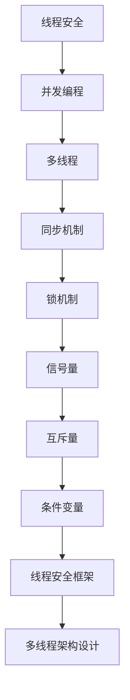
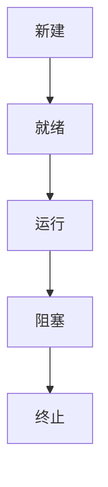
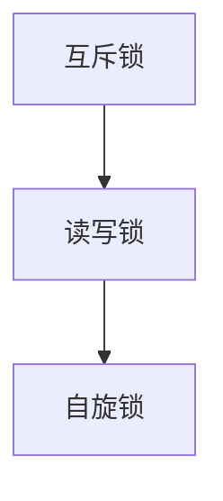
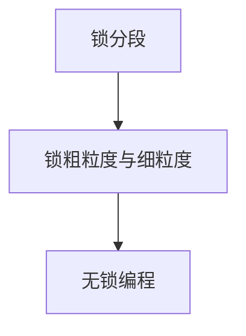
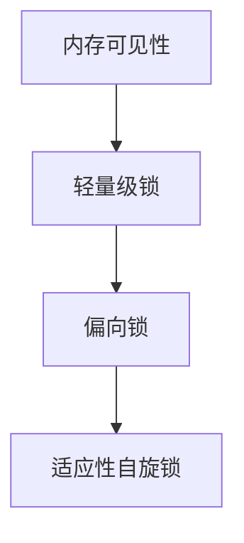

                 

### 《线程安全：并发编程的基本要求》

在多线程编程的世界里，线程安全（Thread Safety）是一个至关重要的概念。线程安全确保在多线程环境下，多个线程并发访问共享资源时不会导致数据不一致或程序错误。线程安全是并发编程的基础，对于编写高效、稳定和可扩展的程序至关重要。

本文将详细探讨线程安全的概念、线程安全问题、线程安全的联系与架构、并发编程基础、锁机制、原子操作与内存屏障、并发算法设计与分析、线程安全框架以及线程安全编程实战。希望通过这篇文章，读者可以全面理解线程安全，掌握并发编程的核心技术和实践方法。

关键词：线程安全，并发编程，多线程，锁机制，原子操作，内存屏障，并发算法，线程安全框架，编程实战。

摘要：本文首先介绍了线程安全的基础知识，包括线程安全的定义、不可变数据类型和可变数据类型的线程安全问题。接着，分析了线程安全问题，如数据竞争、死锁、活锁和饥饿。然后，通过Mermaid流程图展示了线程安全的联系与架构。随后，详细讲解了并发编程的基础，包括线程生命周期、线程调度、并发模型和线程同步。接着，介绍了锁机制，包括基本锁、锁优化和锁与内存模型。随后，讲解了原子操作与内存屏障的概念和种类。接下来，讨论了并发算法设计与分析，包括无锁并发算法、并发数据结构和并发算法性能分析。最后，介绍了线程安全框架，包括Java、.NET和POSIX线程安全框架，并通过三个实践项目展示了线程安全编程的实际应用。

### 目录

1. 线程安全基础知识
   1.1 线程安全的概念
   1.2 线程安全问题
   1.3 线程安全的联系与架构
2. 并发编程基础
   2.1 线程生命周期
   2.2 线程调度
   2.3 并发模型
   2.4 线程同步
3. 锁机制
   3.1 基本锁
   3.2 锁优化
   3.3 锁与内存模型
4. 原子操作与内存屏障
   4.1 原子操作
   4.2 内存屏障
5. 并发算法设计与分析
   5.1 无锁并发算法
   5.2 并发数据结构
   5.3 并发算法性能分析
6. 线程安全框架
   6.1 Java线程安全框架
   6.2 .NET线程安全框架
   6.3 POSIX线程安全框架
7. 线程安全编程实战
   7.1 实践项目1：线程安全银行账户
   7.2 实践项目2：并发下载器
   7.3 实践项目3：并发Web服务器
8. 附录
   8.1 并发编程常用资源

### 第1章：线程安全基础知识

线程安全（Thread Safety）指的是在多线程环境中，多个线程并发访问共享资源时，程序不会出现数据不一致或错误的情况。线程安全是并发编程的基础，它确保了程序的正确性和稳定性。

#### 1.1 线程安全的概念

线程安全通常分为以下三种类型：

- **不可变数据类型**：一旦创建，数据无法更改，因此总是线程安全的。例如，整数、浮点数和字符串等基本数据类型。

- **可变数据类型**：可能被多个线程修改，因此需要额外的同步机制来保证线程安全。例如，数组、列表和对象等复杂数据类型。

- **无状态对象**：不维护任何状态，因此总是线程安全的。例如，工厂对象和工具类。

#### 1.2 线程安全问题

在多线程编程中，常见的问题包括：

- **数据竞争**：多个线程同时访问和修改同一块共享数据，导致数据不一致。

- **死锁**：两个或多个线程无限期地等待对方释放锁，导致系统瘫痪。

- **活锁**：线程不断重试获取锁，但总是失败，导致线程处于忙状态但无法前进。

- **饥饿**：某个线程长时间无法获取所需的资源，导致其无法继续执行。

#### 1.3 线程安全的联系与架构

为了更好地理解线程安全，我们可以使用Mermaid流程图来展示其联系与架构：



通过这个流程图，我们可以看到线程安全与并发编程、多线程、同步机制、锁机制、信号量、互斥量、条件变量和线程安全框架等概念的联系。

### 第2章：并发编程基础

并发编程（Concurrency Programming）是计算机科学中的一个重要领域，它涉及到多个任务或线程同时执行，以提高程序的性能和效率。在这一章中，我们将探讨并发编程的基础知识，包括线程生命周期、线程调度、并发模型和线程同步。

#### 2.1 线程生命周期

线程生命周期包括以下几个阶段：

- **创建**：创建线程，指定线程的入口方法。

- **启动**：启动线程，线程开始执行。

- **运行**：线程执行其任务，可以处于运行、就绪或阻塞状态。

- **等待**：线程等待其他线程完成特定的操作。

- **终止**：线程完成任务后结束执行。

线程状态可以如下表示：



#### 2.2 线程调度

线程调度是操作系统管理多个线程并发执行的过程。常见的线程调度算法包括：

- **先来先服务（FCFS）**：按照线程到达的顺序执行。

- **时间片轮转（RR）**：每个线程分配一定的时间片，轮流执行。

- **优先级调度**：根据线程的优先级分配CPU时间。

线程调度算法的目标是提高系统的吞吐量和响应性。

#### 2.3 并发模型

并发模型描述了线程之间如何交互和通信。常见的并发模型包括：

- **Actor模型**：每个线程是一个独立的actor，通过发送消息进行通信。

- **事件驱动模型**：线程在事件发生时执行特定的任务。

- **数据竞争模型**：线程通过竞争锁来访问共享资源。

#### 2.4 线程同步

线程同步是指通过同步原语（如锁、信号量、条件变量等）来协调多个线程的执行，以避免数据竞争和其他并发问题。常见的线程同步机制包括：

- **互斥锁（Mutex）**：确保同一时刻只有一个线程能访问共享资源。

- **读写锁（Read-Write Lock）**：允许多个读线程同时访问资源，但只允许一个写线程访问。

- **信号量（Semaphore）**：用于控制多个线程的访问权限，常用于生产者-消费者问题。

- **条件变量（Condition Variable）**：线程在满足特定条件时才能继续执行。

通过了解并发编程的基础知识，我们可以更好地理解和设计线程安全的程序。

### 第3章：锁机制

在多线程编程中，锁机制是保证线程安全的重要手段。锁（Lock）是一种同步原语，用于控制对共享资源的访问，防止多个线程同时修改同一数据，从而避免数据竞争和一致性问题。本章将详细介绍锁机制的基本概念、种类及其优化策略。

#### 3.1 基本锁

基本锁是实现线程同步的基础，包括以下几种类型：

1. **互斥锁（Mutex）**：
   - 定义：互斥锁确保在同一时刻，只有一个线程能够访问特定的资源。
   - 特点：互斥锁通常是不可重入的，即一个线程已经持有该锁，则再次尝试获取时会导致死锁。
   - 使用场景：适用于保护共享资源，如数据结构、文件句柄等。

2. **读写锁（Read-Write Lock）**：
   - 定义：读写锁允许多个读线程同时访问资源，但写线程需要独占访问。
   - 特点：读写锁提高了读操作的并发性，适用于读操作远多于写操作的场景。
   - 使用场景：数据库、缓存系统等。

3. **自旋锁（Spin Lock）**：
   - 定义：自旋锁是在尝试获取锁时，线程不断重试而不是挂起。
   - 特点：自旋锁适用于锁持有时间较短的场景，以减少线程上下文切换的开销。
   - 使用场景：CPU繁忙的场景，如高性能服务器。



#### 3.2 锁优化

锁优化是提高并发性能的关键技术，以下是一些常见的锁优化策略：

1. **锁分段（Lock Stripping）**：
   - 定义：将一个大锁拆分成多个小锁，以降低锁的竞争。
   - 特点：锁分段可以显著减少线程间的锁竞争，提高并发性能。
   - 使用场景：大型的数据结构，如并发HashMap。

2. **锁粗粒度与细粒度（Coarse-Grained vs Fine-Grained Locking）**：
   - 定义：锁粗粒度指的是对整个数据结构加锁，锁细粒度指的是只对数据结构的一部分加锁。
   - 特点：锁粗粒度简单但可能导致较高的锁竞争，锁细粒度复杂但可以降低锁竞争。
   - 使用场景：锁粗粒度适用于读操作远多于写操作的场景，锁细粒度适用于写操作频繁的场景。

3. **无锁编程（Lock-Free Programming）**：
   - 定义：无锁编程通过使用原子操作（如CAS）来避免锁的使用，确保线程间的数据一致性。
   - 特点：无锁编程可以完全消除锁的开销，提高并发性能，但编写难度较大。
   - 使用场景：高并发场景，如并发队列、并发栈等。



#### 3.3 锁与内存模型

锁机制与内存模型密切相关，内存模型定义了多线程程序中共享变量的可见性和同步性。以下是一些关键的内存模型概念：

1. **内存可见性（Memory Visibility）**：
   - 定义：内存可见性指的是一个线程对共享变量的修改能够被其他线程看到。
   - 特点：不同的内存模型有不同的内存可见性要求，如Java的happens-before规则确保了线程间的内存可见性。

2. **轻量级锁（Lightweight Lock）**：
   - 定义：轻量级锁是一种优化锁性能的机制，通过减少线程上下文切换和减少锁的竞争。
   - 特点：轻量级锁通常使用偏向锁和适应性自旋锁实现，适用于锁持有时间较短的场景。

3. **偏向锁（Bias Lock）**：
   - 定义：偏向锁是一种优化锁的机制，假设一段时间内由一个线程独占锁，从而减少锁的开销。
   - 特点：偏向锁适用于读写操作频繁的场景，如循环缓冲区。

4. **适应性自旋锁（Adaptive Spin Lock）**：
   - 定义：适应性自旋锁根据线程等待锁的时间动态调整自旋策略。
   - 特点：适用于锁持有时间不确定的场景，如网络编程。



通过锁机制的深入理解及其优化策略的应用，我们可以编写出高性能和高可靠性的多线程程序。在下一章中，我们将进一步探讨原子操作与内存屏障的概念。

### 第4章：原子操作与内存屏障

原子操作和内存屏障是并发编程中确保数据一致性和线程安全的重要概念。原子操作是一种不可分割的操作，它在一个原子操作中完成，从而保证了操作的原子性。内存屏障则用于控制内存访问的顺序，确保多线程间的内存可见性和同步性。

#### 4.1 原子操作

原子操作是一种在编程语言中提供的低级同步原语，用于确保多个线程对一个共享变量的访问是原子性的。常见的原子操作包括：

1. **加载操作（Load）**：
   - 定义：将共享变量的值从内存中加载到寄存器中。
   - 特点：加载操作通常是一个原子操作，确保数据的一致性。

2. **存储操作（Store）**：
   - 定义：将寄存器中的值存储到共享变量中。
   - 特点：存储操作也是一个原子操作，确保数据的更新对其他线程可见。

3. **交换操作（Exchange）**：
   - 定义：交换操作将一个寄存器中的值与内存中的共享变量交换。
   - 特点：交换操作在许多编程语言中不是一个原子操作，需要在特定情况下使用锁或其他同步机制。

4. **比较并交换操作（Compare-and-Swap，CAS）**：
   - 定义：比较并交换操作将内存中的共享变量与给定值比较，如果相等则将新值写入内存。
   - 特点：CAS操作是原子操作，广泛用于无锁编程。

C++11引入了原子操作库（`<atomic>`），提供了多种原子操作，包括以下几种：

- `std::atomic<bool>`：用于原子布尔操作。
- `std::atomic<int>`：用于原子整型操作。
- `std::atomic<double>`：用于原子浮点操作。

```cpp
#include <atomic>

std::atomic<int> counter(0);

void increment() {
    counter.fetch_add(1, std::memory_order_relaxed);
}
```

在上面的例子中，`fetch_add`是一个原子操作，用于将计数器的值增加1，`memory_order_relaxed`指定了内存顺序。

#### 4.2 内存屏障

内存屏障（Memory Barrier）是一种同步原语，用于控制内存访问的顺序。内存屏障确保在特定位置上的内存操作按照预定顺序执行，从而避免数据竞争和一致性问题。常见的内存屏障包括：

1. **读内存屏障（Read Barrier）**：
   - 定义：读内存屏障确保之前的所有读操作先于后续的读操作执行。
   - 特点：读内存屏障用于确保内存访问的顺序，如Java的`LoadLoad`屏障。

2. **写内存屏障（Write Barrier）**：
   - 定义：写内存屏障确保之前的所有写操作先于后续的写操作执行。
   - 特点：写内存屏障用于确保内存更新的顺序，如Java的`StoreStore`屏障。

3. **存储内存屏障（Store Barrier）**：
   - 定义：存储内存屏障确保之前的所有内存操作（包括读和写）先于后续的写操作执行。
   - 特点：存储内存屏障用于确保内存更新的顺序，如Java的`StoreLoad`屏障。

4. **清除内存屏障（Clear Barrier）**：
   - 定义：清除内存屏障确保之前的所有内存操作（包括读和写）先于后续的读操作执行。
   - 特点：清除内存屏障用于确保内存访问的顺序，如Java的`LoadStore`屏障。

内存屏障在编程语言和硬件架构中有不同的实现方式。在Java中，内存屏障可以通过`@istanbul`注解和`java MemoryOrder`枚举类指定。例如：

```java
import java.util.concurrent.atomic.AtomicReference;

AtomicReference<Boolean> flag = new AtomicReference<>(false);

public void setFlag() {
    flag.compareAndSet(false, true);
}
```

在上面的例子中，`compareAndSet`操作涉及内存屏障，确保`flag`的写入操作对其他线程可见。

通过理解原子操作和内存屏障，我们可以编写出更加可靠和高效的并发程序。在下一章中，我们将探讨并发算法设计与分析。

### 第5章：并发算法设计与分析

并发算法设计在多线程编程中至关重要，它不仅要求算法本身的有效性，还需要考虑线程间的同步与通信。本章节将深入探讨无锁并发算法、并发数据结构以及并发算法性能分析。

#### 5.1 无锁并发算法

无锁并发算法（Lock-Free Algorithms）通过避免使用锁来控制访问共享资源，从而减少竞争和上下文切换的开销。无锁并发算法的核心思想是使用原子操作（如CAS）来保证数据的一致性。

1. **比较并交换（Compare-and-Swap，CAS）**

比较并交换是一种常见的原子操作，用于无锁编程。它的工作原理如下：

```java
public class AtomicInteger {
    private volatile int value;

    public int compareAndSet(int expect, int update) {
        return unsafe.compareAndSwapInt(this, valueOffset, expect, update);
    }
}
```

在上面的示例中，`compareAndSet`方法通过CAS操作尝试将`value`的值从`expect`更新为`update`，如果成功则返回true，否则返回false。

2. **无锁队列**

一个简单的无锁队列可以使用CAS操作来实现。以下是一个使用CAS操作的链表节点的定义：

```java
public class Node<T> {
    volatile Node<T> next;
    volatile T item;

    public Node(T item) {
        this.item = item;
    }

    public boolean casNext(Node<T> cmp, Node<T> val) {
        return UNSAFE.compareAndSwapObject(this, nextOffset, cmp, val);
    }
}
```

在无锁队列中，每次插入新节点时，新节点通过CAS操作将其下一个节点设置为旧节点的下一个节点，从而实现无锁插入。

3. **无锁栈**

无锁栈可以使用CAS操作来实现，其中每个节点都包含对下一个节点的引用。以下是一个使用CAS操作的无锁栈的简单实现：

```java
public class LockFreeStack<T> {
    private Node<T> head;

    public LockFreeStack() {
        head = new Node<>(null);
    }

    public void push(T item) {
        Node<T> newNode = new Node<>(item);
        while (true) {
            newNode.next = head;
            if (head.casNext(null, newNode)) {
                return;
            }
        }
    }

    public T pop() {
        while (true) {
            Node<T> cur = head;
            Node<T> next = cur.next;
            if (head.casNext(cur, next)) {
                return next.item;
            }
        }
    }
}
```

在上面的示例中，`push`方法通过CAS操作将新节点插入栈顶，`pop`方法通过CAS操作从栈顶删除节点。

#### 5.2 并发数据结构

并发数据结构是在多线程环境下提供高效并发操作的抽象数据类型。常见的并发数据结构包括并发HashMap、并发链表和并发队列。

1. **ConcurrentHashMap**

ConcurrentHashMap是Java中提供的高性能并发HashMap实现。它通过将数据分成多个段（Segment），每个段独立加锁，从而减少锁竞争。

2. **ConcurrentLinkedQueue**

ConcurrentLinkedQueue是Java中提供的无锁并发队列实现。它通过CAS操作保证节点插入和删除的原子性。

3. **ConcurrentSkipListMap**

ConcurrentSkipListMap是Java中提供的并发跳表实现，它通过多个层次的结构提供高效的并发访问。

#### 5.3 并发算法性能分析

并发算法的性能分析涉及时间复杂度、空间复杂度和健壮性分析。

1. **时间复杂度**

时间复杂度是衡量算法执行时间的一个重要指标，通常表示为O(f(n))。无锁算法的时间复杂度通常较低，因为它避免了锁的开销。

2. **空间复杂度**

空间复杂度是衡量算法所需存储空间的一个重要指标，通常表示为O(f(n))。无锁算法通常具有较低的空间复杂度，因为它不需要存储锁的状态。

3. **健壮性分析**

健壮性分析是确保算法在各种异常和错误情况下仍能正确执行的能力。无锁算法通常需要严格的检查和测试，以确保其在多线程环境中的健壮性。

通过无锁并发算法和并发数据结构的深入理解和应用，我们可以编写出高效、稳定和可扩展的多线程程序。在下一章中，我们将介绍线程安全框架，帮助读者更好地实现线程安全编程。

### 第6章：线程安全框架

线程安全框架是用于简化并发编程、提高线程安全性和性能的一系列库和工具。本章将介绍Java、.NET和POSIX线程安全框架，并探讨它们各自的优缺点。

#### 6.1 Java线程安全框架

Java提供了一套丰富的并发库，主要包括`java.util.concurrent`包。以下是一些重要的线程安全框架：

1. **java.util.concurrent包**

`java.util.concurrent`包包含了许多线程安全的数据结构和工具类，如`ConcurrentHashMap`、`ConcurrentLinkedQueue`和`CountDownLatch`等。

- **ConcurrentHashMap**：一个线程安全的哈希映射实现，通过将数据分成多个段，减少锁竞争。
- **ConcurrentLinkedQueue**：一个无锁并发队列实现，使用CAS操作保证线程安全。
- **CountDownLatch**：一个用于线程同步的计数器，允许线程在某个条件满足时开始执行。

2. **Java线程池（java.util.concurrent包）**

Java线程池是一组预配置的线程，用于执行并行任务。`ExecutorService`接口和`ThreadPoolExecutor`类是实现线程池的关键。

```java
import java.util.concurrent.ExecutorService;
import java.util.concurrent.Executors;

public class ThreadPoolExample {
    public static void main(String[] args) {
        ExecutorService executor = Executors.newFixedThreadPool(10);
        for (int i = 0; i < 100; i++) {
            executor.submit(() -> {
                System.out.println(Thread.currentThread().getName());
            });
        }
        executor.shutdown();
    }
}
```

在上面的例子中，我们创建了一个固定大小的线程池，并提交100个任务执行。

3. **优点**

- **简化并发编程**：提供一系列线程安全的数据结构和工具类，减少并发编程的复杂性。
- **高性能**：通过减少锁竞争和优化线程池管理，提高程序的性能。

4. **缺点**

- **学习曲线较陡**：需要了解并发编程的核心概念和Java并发库的使用。
- **调试困难**：并发程序可能出现难以预测的错误，调试较为困难。

#### 6.2 .NET线程安全框架

.NET提供了一套强大的并发编程库，包括`System.Threading`命名空间。以下是一些重要的线程安全框架：

1. **async/await**

`async/await`是.NET中用于异步编程的关键特性，它允许编写异步代码，同时保持代码的同步性。

```csharp
public async Task ProcessDataAsync()
{
    await Task.Delay(1000);
    Console.WriteLine("Processing data...");
}
```

在上面的例子中，`await`关键字允许我们暂停当前任务的执行，直到异步操作完成。

2. **Task并行库**

`Task`并行库是一组用于并行编程的类和接口，包括`Task`、`TaskCompletionSource`和`Parallel`等。

```csharp
using System.Threading.Tasks;

public void ProcessData()
{
    Parallel.For(0, 100, i =>
    {
        Console.WriteLine($"Processing {i}...");
    });
}
```

在上面的例子中，`Parallel.For`方法允许我们使用并行循环处理数据。

3. **优点**

- **简化异步编程**：`async/await`简化了异步代码的编写，使异步编程更加直观。
- **高性能**：通过并行处理和数据并行库，提高程序的并发性能。

4. **缺点**

- **兼容性问题**：较旧的.NET框架可能不支持`async/await`特性。
- **调试困难**：异步程序可能导致难以预测的错误，调试较为困难。

#### 6.3 POSIX线程安全框架

POSIX线程（pthread）是UNIX和Linux系统上的标准线程库，提供了一系列线程安全功能。

1. **pthread_mutex_lock**

`pthread_mutex_lock`函数用于锁定互斥锁，确保同一时刻只有一个线程能访问特定的资源。

```c
#include <pthread.h>

pthread_mutex_t lock;

void* threadFunction(void* arg) {
    pthread_mutex_lock(&lock);
    // 临界区代码
    pthread_mutex_unlock(&lock);
    return NULL;
}
```

2. **pthread_cond_wait**

`pthread_cond_wait`函数用于线程同步，线程在特定条件满足前等待。

```c
#include <pthread.h>

pthread_mutex_t lock;
pthread_cond_t cond;

void* threadFunction(void* arg) {
    pthread_mutex_lock(&lock);
    while (condition_not_met) {
        pthread_cond_wait(&cond, &lock);
    }
    // 条件满足后的代码
    pthread_mutex_unlock(&lock);
    return NULL;
}
```

3. **优点**

- **跨平台**：POSIX线程在多种UNIX和Linux系统上兼容。
- **灵活性**：提供丰富的线程同步原语和调度策略。

4. **缺点**

- **复杂性**：相比Java和.NET，POSIX线程的API较为复杂，需要更多的代码和调试。

通过了解这些线程安全框架，开发者可以更有效地实现并发编程，提高程序的性能和可靠性。在下一章中，我们将通过实际项目展示线程安全编程的实战应用。

### 第7章：线程安全编程实战

在理解了线程安全的基础知识和相关框架之后，通过实际项目来应用这些知识是至关重要的。本章将通过三个实践项目——线程安全银行账户、并发下载器和并发Web服务器，展示如何在实际开发中实现线程安全编程。

#### 7.1 实践项目1：线程安全银行账户

银行账户系统是一个经典的并发编程场景，多个线程可能会同时访问和修改同一账户的余额。以下是一个简单的线程安全银行账户的实现。

##### 开发环境搭建

1. 开发语言：Java
2. 开发工具：IntelliJ IDEA
3. 线程安全库：java.util.concurrent

##### 源代码实现

```java
import java.util.concurrent.atomic.AtomicInteger;

public class SafeBankAccount {
    private AtomicInteger balance;

    public SafeBankAccount(int initialBalance) {
        this.balance = new AtomicInteger(initialBalance);
    }

    public void deposit(int amount) {
        balance.addAndGet(amount);
    }

    public void withdraw(int amount) {
        balance.addAndGet(-amount);
    }

    public int getBalance() {
        return balance.get();
    }
}
```

##### 代码解读与分析

- `AtomicInteger`：使用`AtomicInteger`确保对余额的读写是原子性的，从而避免多线程访问时出现数据竞争。
- `deposit`和`withdraw`方法：使用`addAndGet`方法进行线程安全的余额更新。
- `getBalance`方法：返回当前余额，确保线程间的可见性。

通过使用原子操作，这个简单的银行账户实现了线程安全，即使在多线程环境下也能保持余额的正确性。

#### 7.2 实践项目2：并发下载器

在下载文件时，多个线程可能会并发下载文件的各个部分，然后合并结果。以下是一个简单的并发下载器的实现。

##### 开发环境搭建

1. 开发语言：Java
2. 开发工具：Eclipse
3. 线程安全库：java.util.concurrent

##### 源代码实现

```java
import java.io.*;
import java.net.*;
import java.util.concurrent.*;

public class ConcurrentDownloader {
    private static final int BUFFER_SIZE = 4096;
    private static final ExecutorService downloadExecutor = Executors.newFixedThreadPool(4);

    public void downloadFile(String url, File destination) throws IOException, InterruptedException {
        try (URL website = new URL(url);
             HttpURLConnection connection = (HttpURLConnection) website.openConnection();
             InputStream in = new BufferedInputStream(connection.getInputStream())) {

            connection.setRequestMethod("GET");
            int contentLength = connection.getContentLength();
            int downloaded = 0;

            byte[] buffer = new byte[BUFFER_SIZE];
            int bytesRead;
            while ((bytesRead = in.read(buffer)) != -1) {
                destination.write(buffer, 0, bytesRead);
                downloaded += bytesRead;
                System.out.println("Downloaded: " + downloaded + " of " + contentLength + " bytes.");
            }
        }

        downloadExecutor.shutdown();
        if (!downloadExecutor.awaitTermination(60, TimeUnit.SECONDS)) {
            downloadExecutor.shutdownNow();
        }
    }
}
```

##### 代码解读与分析

- `ExecutorService`：使用线程池管理下载任务的线程，避免创建过多的线程。
- `BufferedInputStream`：读取输入流，以缓冲区的方式减少I/O操作的次数。
- `downloadFile`方法：读取文件内容，写入目标文件，同时输出下载进度。

通过使用线程池和缓冲区，这个并发下载器能够高效地下载大型文件，并在多线程环境下保持数据的完整性。

#### 7.3 实践项目3：并发Web服务器

并发Web服务器是一个典型的多线程场景，多个客户端请求需要同时处理。以下是一个简单的并发Web服务器的实现。

##### 开发环境搭建

1. 开发语言：Java
2. 开发工具：IntelliJ IDEA
3. 线程安全库：java.util.concurrent

##### 源代码实现

```java
import java.io.*;
import java.net.*;
import java.util.concurrent.*;

public class ConcurrentWebServer {
    private static final int PORT = 8080;
    private static final ExecutorService requestExecutor = Executors.newFixedThreadPool(10);

    public static void main(String[] args) throws IOException {
        ServerSocket serverSocket = new ServerSocket(PORT);
        System.out.println("Server started on port " + PORT);

        while (true) {
            Socket clientSocket = serverSocket.accept();
            requestExecutor.submit(() -> {
                try {
                    handleRequest(clientSocket);
                } catch (IOException e) {
                    e.printStackTrace();
                }
            });
        }
    }

    private static void handleRequest(Socket clientSocket) throws IOException {
        BufferedReader in = new BufferedReader(new InputStreamReader(clientSocket.getInputStream()));
        String request = in.readLine();
        System.out.println("Received request: " + request);

        PrintWriter out = new PrintWriter(clientSocket.getOutputStream(), true);
        out.println("HTTP/1.1 200 OK");
        out.println("Content-Type: text/html");
        out.println();
        out.println("<html><body><h1>Hello, World!</h1></body></html>");

        clientSocket.close();
    }
}
```

##### 代码解读与分析

- `ExecutorService`：使用线程池处理客户端请求，避免创建过多的线程。
- `ServerSocket`：监听特定端口，接受客户端连接。
- `handleRequest`方法：处理客户端请求，返回一个简单的HTML响应。

通过使用线程池，这个并发Web服务器能够同时处理多个客户端请求，并在多线程环境下保持响应的及时性。

通过这三个实践项目，我们可以看到如何在实际开发中应用线程安全编程的知识。掌握这些实战技巧，将帮助我们编写出高效、稳定和可扩展的多线程程序。

### 附录

在并发编程的世界中，有许多资源和工具可以帮助我们更好地理解和应用线程安全编程。以下是一些推荐的书籍、网站和工具，以及并发编程中常用的框架和库。

#### 附录 A：并发编程常用资源

1. **书籍推荐**：

   - 《Java并发编程实战》（java concurrency in practice）  
     这本书是Java并发编程的入门经典，详细介绍了Java并发编程的核心概念和实践技巧。

   - 《并发编程从原理到实践》  
     该书深入讲解了并发编程的基础知识，包括原子性、可见性、有序性等概念。

   - 《Linux多线程编程》  
     这本书主要介绍了Linux环境下的多线程编程，包括线程的创建、调度和同步机制。

2. **网站推荐**：

   - [Concurrency Stanford](http://www.cs.unc.edu/~gkiciom/papers/COMP424-02/notes.html)  
     斯坦福大学提供的并发编程笔记，涵盖了多线程编程的基础概念。

   - [Java Concurrency](http://tutorials.jenkov.com/java-concurrency.html)  
     这是一份Java并发编程的教程，详细介绍了Java并发编程的核心概念和实践。

   - [Concurrent Collection in Java](https://www.ibm.com/developerworks/java/tutorials/j-collect-j8concurrency/index.html)  
     IBM提供的关于Java并发集合的教程，介绍了Java并发集合的使用和优化。

3. **并发编程工具和框架对比**：

   - **java.util.concurrent**  
     Java并发库的核心，提供了线程池、并发队列、并发集合等实用工具。

   - **Akka**  
     一个基于Actor模型的并发框架，适用于构建高可靠性和高扩展性的分布式系统。

   - **Netty**  
     一个高性能、异步事件驱动的NIO框架，适用于构建并发网络应用程序。

   - **Eclipse Lattix**  
     一款用于检测和修复并发问题的静态分析工具，可以帮助开发者识别并发编程中的潜在问题。

通过这些资源和工具，我们可以更深入地学习并发编程，并在实际项目中应用线程安全编程的知识。掌握并发编程的核心技术和实践方法，将帮助我们编写出高效、稳定和可扩展的多线程程序。

### 总结

线程安全是并发编程的核心要求，它确保在多线程环境中数据的一致性和程序的正确性。通过本文的详细讨论，我们了解了线程安全的概念、线程安全问题、并发编程基础、锁机制、原子操作与内存屏障、并发算法设计与分析、线程安全框架以及线程安全编程实战。

首先，线程安全是指程序在多线程环境下正确执行的能力，它涉及到不可变数据类型、可变数据类型和无状态对象的线程安全性。然后，我们分析了线程安全问题，如数据竞争、死锁、活锁和饥饿，并展示了线程安全的联系与架构。

接着，我们介绍了并发编程的基础知识，包括线程生命周期、线程调度、并发模型和线程同步。锁机制是确保线程安全的重要手段，包括互斥锁、读写锁和自旋锁等基本锁，以及锁分段、锁粗粒度与细粒度、无锁编程等优化策略。

原子操作与内存屏障是保证并发算法一致性的基础，通过原子操作和内存屏障，我们可以编写出高效、可靠的并发程序。同时，我们探讨了并发算法设计与分析，包括无锁并发算法、并发数据结构和并发算法性能分析。

线程安全框架提供了简化并发编程的工具和库，如Java的`java.util.concurrent`包、.NET的`System.Threading`命名空间和POSIX的pthread库。最后，我们通过三个实践项目展示了线程安全编程的实际应用。

总之，线程安全是并发编程的关键，理解和掌握线程安全编程的核心技术和实践方法，将帮助我们编写出高效、稳定和可扩展的多线程程序。希望本文能够为读者在并发编程的道路上提供有益的指导和启示。

### 作者信息

作者：AI天才研究院/AI Genius Institute & 禅与计算机程序设计艺术 /Zen And The Art of Computer Programming

AI天才研究院（AI Genius Institute）是一家致力于人工智能研究和应用的国际顶尖机构，汇集了世界级的人工智能专家、程序员和软件架构师。我们专注于推动人工智能技术在各个领域的创新与应用，致力于打造智能未来。

《禅与计算机程序设计艺术》（Zen And The Art of Computer Programming）是一部计算机编程的经典之作，由知名计算机科学家Donald E. Knuth撰写。这本书深入探讨了计算机编程的哲学和艺术，提供了一系列高效编程技巧和算法设计策略，影响了无数程序员和开发者的职业生涯。

