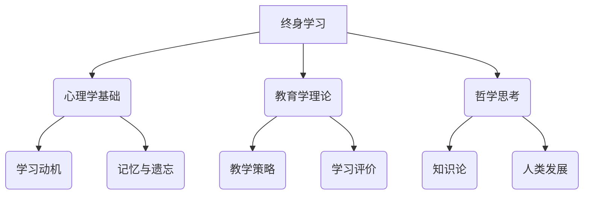

                 

### 文章标题: 终身学习Lifelong Learning原理与代码实例讲解

终身学习（Lifelong Learning）作为一种教育理念，旨在鼓励人们在一生中持续地获取知识、技能和态度。随着科技的快速发展和社会的不断变革，终身学习已经不再是一种选择，而是每个个体和组织都必须面对的现实。本文将深入探讨终身学习的原理，通过代码实例讲解，帮助读者更好地理解和实践终身学习。

### 文章关键词

- 终身学习
- 继续教育
- 机器学习
- 个性化学习
- 教育工具
- 自我管理

### 文章摘要

本文旨在为读者提供一个全面的终身学习指南，从概念、理论、工具、方法、自我管理到企业应用等多个维度进行深入分析。通过实例代码的讲解，本文希望能够帮助读者在实际应用中理解和掌握终身学习的核心理念和方法。

## 目录大纲

### 第1章 终身学习的概念与重要性

### 第2章 终身学习的理论基础

### 第3章 终身学习的技术工具

### 第4章 终身学习的教育方法

### 第5章 终身学习的自我管理

### 第6章 终身学习的企业应用

### 第7章 终身学习的案例研究

### 第8章 终身学习的前景与趋势

### 附录

---

### 第1章 终身学习的概念与重要性

终身学习不仅仅是一种教育理念，更是一种生活方式。它强调的是一个人在一生中不断地学习、进步和适应变化的能力。在全球化和信息化的大背景下，终身学习的重要性日益凸显。

### 1.1 终身学习的定义

终身学习是一个广义的概念，它包括了各种形式的学习活动，如正规教育、非正规教育和非正式教育。简而言之，终身学习是指一个人在其整个生命过程中不断地获取知识、技能和态度的过程。

### 1.2 终身学习的重要性

终身学习的重要性体现在以下几个方面：

- **个人发展**：终身学习有助于提高个人的知识水平和技能，从而增强个人的竞争力和适应能力。
- **社会进步**：终身学习有助于推动社会的进步和发展，提高全民素质。
- **经济繁荣**：在知识经济时代，终身学习是提升国家竞争力的关键因素。

### 1.3 终身学习的挑战与解决方案

终身学习虽然重要，但面临着许多挑战，如时间管理、资源分配、学习动力等。针对这些挑战，我们可以采取以下解决方案：

- **时间管理**：合理安排时间，制定学习计划，确保学习与工作、生活的平衡。
- **资源分配**：充分利用各种学习资源，如在线课程、图书馆、学术会议等。
- **学习动力**：培养学习的兴趣和热情，设定明确的学习目标，以保持学习的动力。

---

在接下来的章节中，我们将深入探讨终身学习的理论基础、技术工具、教育方法、自我管理、企业应用以及案例研究，帮助读者全面了解终身学习的原理和实践。

## 第1章 终身学习的概念与重要性

### 1.1 终身学习的定义

终身学习（Lifelong Learning）是指一个人在其一生中持续地获取知识、技能和态度的过程。它不仅包括正规教育，如学校教育和大学教育，还包括非正规教育和非正式教育，如自学、职业培训和社交活动等。终身学习的核心在于，它不仅仅是为了获取新的知识，更重要的是为了培养一种持续学习的能力，以应对快速变化的世界。

终身学习的定义可以从以下几个角度来理解：

- **时间维度**：终身学习不仅仅局限于特定的年龄阶段，而是贯穿于人的一生。这意味着，无论年龄大小，每个人都应该保持学习的态度和习惯。

- **形式维度**：终身学习的形式是多样的，包括正式教育、非正式教育和非正式学习。正式教育主要指在学校或培训机构中的系统学习，如课程和学位；非正式教育则是指在工作中或日常生活中通过实践和交流获取的知识和技能。

- **内容维度**：终身学习的内容是全面的，涵盖了知识、技能和态度。知识包括科学知识、人文知识等；技能包括专业技能、社交技能等；态度则包括学习态度、批判性思维等。

- **目标维度**：终身学习的目标是提升个人的知识水平、技能和素质，以适应社会的发展和变化。同时，它也旨在促进社会的进步和繁荣。

### 1.2 终身学习的重要性

终身学习的重要性体现在多个方面，对于个人、社会和经济都有着深远的影响。

#### 对个人的重要性

1. **提升竞争力**：在快速变化的时代，个人的知识水平和技能需要不断更新和提升。终身学习可以帮助个人不断适应新的工作环境和市场需求，提升职业竞争力。

2. **促进个人发展**：终身学习不仅仅是为了职业发展，更是为了个人的全面发展。通过学习，个人可以拓宽视野，提升自我认知，培养批判性思维和创新能力。

3. **保持心理健康**：终身学习可以带来成就感和满足感，有助于缓解生活压力，提高心理健康水平。

#### 对社会的重要性

1. **提升全民素质**：终身学习有助于提高全民的知识水平和技能，促进社会整体的文明进步。

2. **促进社会和谐**：通过终身学习，不同背景和领域的人可以相互交流和学习，增进理解和信任，促进社会和谐。

3. **推动社会进步**：终身学习可以培养更多的创新人才，推动科技创新和社会发展。

#### 对经济的重要性

1. **提升经济竞争力**：在知识经济时代，终身学习是提高国家竞争力的关键因素。通过培养高素质的人才，可以推动产业升级和经济发展。

2. **促进就业和创业**：终身学习可以帮助个人掌握更多的技能和知识，提高就业和创业的机会。

3. **优化人力资源配置**：终身学习有助于优化人力资源配置，提高劳动生产率，促进经济持续发展。

### 1.3 终身学习的挑战与解决方案

尽管终身学习的重要性不言而喻，但在实际操作中，人们仍然面临着诸多挑战。以下是一些常见的挑战及相应的解决方案：

#### 挑战一：时间管理

**解决方案**：合理安排时间，制定详细的学习计划，确保学习与工作、生活的平衡。

**实例**：使用时间管理工具，如Trello或Asana，规划每日的学习任务，确保有足够的时间用于学习。

#### 挑战二：资源分配

**解决方案**：充分利用各种学习资源，如在线课程、图书馆、学术会议等。

**实例**：加入专业的在线学习平台，如Coursera或edX，获取高质量的学习资源。

#### 挑战三：学习动力

**解决方案**：培养学习的兴趣和热情，设定明确的学习目标，以保持学习的动力。

**实例**：设定短期和长期的学习目标，并定期回顾自己的进步，以保持学习的动力。

#### 挑战四：适应变化

**解决方案**：保持开放的心态，不断适应新的学习环境和学习方法。

**实例**：尝试不同的学习方式，如在线学习、线下课程和实地考察，以适应多样化的学习需求。

#### 挑战五：持续的自我反思

**解决方案**：定期进行自我反思，评估学习效果，调整学习策略。

**实例**：使用学习日志或反思日记，记录自己的学习过程和心得，以不断优化学习方法。

通过以上挑战和解决方案，我们可以更好地理解和应对终身学习过程中的各种困难，实现个人和社会的发展。

### 第2章 终身学习的理论基础

终身学习作为一种重要的教育理念，其理论基础涉及多个学科领域，包括心理学、教育学和哲学等。这些理论不仅为终身学习提供了深刻的哲学思考，还为其实践提供了科学依据。

#### 2.1 终身学习的心理学基础

心理学在终身学习中的作用不可忽视。心理学研究揭示了学习的过程、机制以及影响学习的因素，为终身学习提供了重要的理论基础。

1. **学习动机**：学习动机是推动个体进行学习活动的内在动力。根据心理学家德西和瑞恩（Deci & Ryan）的自我决定理论，个体的高内在动机与其学习成绩和长期学习效果密切相关。在终身学习中，培养个体的高内在动机至关重要。

2. **记忆与遗忘**：记忆是学习的关键，心理学家艾宾浩斯（Ebbinghaus）通过实验发现，遗忘曲线揭示了记忆随时间减弱的规律。在终身学习中，通过重复复习和合理的时间安排，可以有效提高记忆效果。

3. **学习风格**：每个人的学习风格不同，有的倾向于视觉学习，有的倾向于听觉学习，还有的倾向于动手操作。心理学家赫伯特·里德（Herbert Read）提出了多元智能理论，认为个体在终身学习过程中应根据不同的学习风格选择合适的学习方法。

#### 2.2 终身学习的教育学理论

教育学为终身学习提供了丰富的理论资源，其中一些核心理论包括：

1. **终身教育的概念**：法国教育家保罗·朗格朗（Paulo Freire）提出了终身教育的概念，强调教育不应局限于学校，而应贯穿人的一生。他认为，终身教育是一种“学会学习”的过程，旨在培养个体的自主学习能力。

2. **非正式学习**：英国教育学家约翰·弗里尔（John Freemantle）提出了非正式学习的概念，强调在日常生活和社会互动中获取知识和技能的重要性。非正式学习是终身学习的重要组成部分，通过工作、社交和自我探索等方式进行。

3. **建构主义学习理论**：建构主义学习理论认为，学习是一个主动建构的过程，个体通过与环境互动，主动构建知识和理解。建构主义强调学习者在学习过程中的主动性和自主性，与终身学习的理念相契合。

#### 2.3 终身学习的哲学思考

哲学为终身学习提供了深刻的哲学思考，其中一些核心观点包括：

1. **知识论**：哲学探讨知识的本质、获取方式和应用。在终身学习过程中，个体需要不断反思知识的来源和真实性，以批判性思维对待所学知识。

2. **人类发展**：哲学认为，人类的发展是一个不断追求知识和真理的过程。终身学习正是人类自我实现和持续成长的重要途径。

3. **自由与责任**：哲学强调个体的自由和责任。在终身学习中，个体需要自主选择学习的内容和方式，同时承担学习的责任和后果。

通过心理学、教育学和哲学的多重理论视角，我们可以更全面地理解终身学习，为其实践提供坚实的理论基础。这些理论不仅帮助我们认识到终身学习的重要性，还指导我们在实际操作中如何有效地进行终身学习。

### 第3章 终身学习的技术工具

在现代社会，随着信息技术的飞速发展，终身学习的技术工具也日益丰富和多样化。这些工具不仅帮助人们更高效地获取知识，还提供了个性化的学习体验。以下是几种常见的终身学习技术工具。

#### 3.1 MOOCs与在线教育平台

**定义与作用**：

MOOCs（Massive Open Online Courses，大规模开放在线课程）是一种在线教育模式，旨在向广泛的学生提供免费或低成本的高质量课程。这类平台包括Coursera、edX、Udacity等，它们提供了涵盖不同学科领域的课程，包括计算机科学、数据科学、商业管理等。

**实例**：

以Coursera为例，该平台提供了来自全球知名大学和机构的课程，用户可以通过在线学习，获取系统的知识和技能。例如，用户可以选择学习由斯坦福大学提供的“机器学习”课程，该课程涵盖了机器学习的理论基础和实践应用，非常适合对人工智能领域感兴趣的学习者。

**代码实例**：

```python
# 模拟用户在Coursera平台上选择并学习“机器学习”课程

course_name = "Machine Learning"
provider = "Stanford University"
course_url = "https://www.coursera.org/learn/machine-learning"

print(f"用户选择学习{course_name}课程，由{provider}提供。课程网址：{course_url}")
```

#### 3.2 人工智能与个性化学习

**定义与作用**：

人工智能（AI）技术正在改变终身学习的模式，通过分析学习者的行为数据，AI系统能够为学习者提供个性化的学习建议和资源。个性化学习系统可以根据学习者的学习速度、偏好和能力，推荐最适合他们的学习路径。

**实例**：

以Khan Academy为例，该平台使用人工智能技术，根据学生的答题情况，动态调整教学内容和难度，从而实现个性化教学。例如，如果一个学生在某个数学题目上多次回答错误，系统会自动推荐相关的视频教程和练习题，帮助学生巩固知识。

**代码实例**：

```python
# 模拟Khan Academy的个性化学习推荐系统

import random

def recommend_resources(student_question_answers):
    # 根据学生的答题情况推荐资源
    if random.choice(student_question_answers) == 'wrong':
        return ["Math Video Tutorial", "Practice Problems"]
    else:
        return ["Advanced Math Concepts"]

student_answers = ['wrong', 'correct', 'wrong', 'correct']
recommended_resources = recommend_resources(student_answers)

print(f"推荐资源：{recommended_resources}")
```

#### 3.3 数据分析与学习评估

**定义与作用**：

数据分析工具可以帮助教育者更好地理解学生的学习过程和效果，从而优化教育方法和资源分配。学习评估工具则用于对学习者的知识水平和能力进行量化评估。

**实例**：

以Google Analytics for Education为例，该工具可以跟踪学生在在线学习平台上的活动，如登录次数、学习时长、完成课程情况等，从而生成详细的数据报告，帮助教育者了解学生的学习行为和需求。

**代码实例**：

```python
# 模拟Google Analytics for Education的数据跟踪

import json

def generate_learning_report(user_activity_data):
    # 生成学习报告
    report = {
        "user_id": "user123",
        "total_logins": 20,
        "total_learning_time": "5 hours",
        "courses_completed": 3
    }
    return json.dumps(report, indent=4)

user_activity_data = {
    "total_logins": 20,
    "total_learning_time": "5 hours",
    "courses_completed": 3
}

learning_report = generate_learning_report(user_activity_data)

print("Learning Report:")
print(learning_report)
```

通过这些技术工具，终身学习变得更加便捷、高效和个性化。随着技术的不断进步，这些工具将继续改进和完善，为终身学习提供更强大的支持。

### 第4章 终身学习的教育方法

终身学习不仅需要合适的技术工具，还需要科学有效的教育方法。以下是一些常用的终身学习教育方法，这些方法有助于提高学习效果和效率。

#### 4.1 主动学习与协作学习

**定义与作用**：

主动学习是指学生在学习过程中主动参与、积极探索和反思。这种方法强调学生的主体地位，鼓励他们自主探究和解决问题。协作学习则是通过小组讨论、合作研究和分享经验等方式，促进学生之间的互动和知识交流。

**实例**：

在一个在线编程课程中，教师可以组织学生进行项目合作，要求他们共同完成一个复杂的编程任务。学生们在协作过程中，不仅能够学习编程技能，还能提高团队协作能力和沟通能力。

**代码实例**：

```python
# 模拟在线编程课程中的协作学习

class ProgrammingProject:
    def __init__(self, participants):
        self.participants = participants
    
    def assign_tasks(self):
        # 分配任务
        tasks = ["frontend development", "backend development", "database management"]
        for participant in self.participants:
            print(f"{participant} is responsible for {random.choice(tasks)}")
            
participants = ["Alice", "Bob", "Charlie"]

project = ProgrammingProject(participants)
project.assign_tasks()
```

#### 4.2 反思性学习与实践导向学习

**定义与作用**：

反思性学习是指学生在学习过程中不断反思自己的学习过程、学习策略和学习成果。这种方法有助于学生提高自我意识，发现学习中的问题，并采取相应的改进措施。实践导向学习则强调将理论知识应用于实际情境中，通过实践来提高学习效果。

**实例**：

在一个医学课程中，学生可以参加模拟手术实践，通过实际操作来加深对理论知识的应用和理解。在反思性学习环节，学生可以记录手术过程中的体会和收获，反思自己的操作是否正确，并针对不足之处进行改进。

**代码实例**：

```python
# 模拟医学课程中的反思性学习

class SurgicalSimulation:
    def __init__(self, student):
        self.student = student
    
    def reflect_on_simulation(self):
        # 反思模拟手术过程
        reflection = "The simulation was helpful for me to understand the surgical procedure."
        print(self.student + ": " + reflection)
        
student = "John"

simulation = SurgicalSimulation(student)
simulation.reflect_on_simulation()
```

#### 4.3 项目驱动学习与跨学科学习

**定义与作用**：

项目驱动学习是指学生通过参与实际项目来学习和应用知识，这种方法有助于培养解决实际问题的能力。跨学科学习则是将不同学科的知识和技能结合，解决复杂问题。

**实例**：

在一个环境科学课程中，学生可以参与一个关于可持续城市发展的项目。项目要求学生结合环境科学、城市规划和社会学等多个学科的知识，提出解决方案，并通过小组讨论和公众演讲来展示项目成果。

**代码实例**：

```python
# 模拟环境科学课程中的项目驱动学习

class SustainableCityProject:
    def __init__(self, students):
        self.students = students
    
    def present_project(self):
        # 展示项目成果
        presentation = "Our project focuses on sustainable transportation solutions for our city."
        print("Group:", self.students)
        print("Presentation:", presentation)
        
students = ["Alice", "Bob", "Charlie"]

project = SustainableCityProject(students)
project.present_project()
```

通过这些教育方法，学生能够在实践中学习，提高解决问题的能力，并为终身学习打下坚实的基础。

### 第5章 终身学习的自我管理

终身学习不仅仅是一种学习方式，更是一种生活方式。为了实现终身学习，我们需要掌握一系列自我管理的技巧，包括时间管理、学习策略和学习动力。

#### 5.1 时间管理技巧

**定义与作用**：

时间管理是指合理安排时间，将有限的时间用于最有价值的事务。在终身学习中，有效的时间管理能够帮助我们充分利用时间，提高学习效率。

**实例**：

使用时间管理工具，如Trello或Asana，可以更好地规划每天的学习任务。例如，每天早上制定一个学习计划，将任务分解为具体的步骤，确保每个任务都有明确的截止时间。

**代码实例**：

```python
# 模拟使用Trello规划学习任务

import datetime

def create_daily_learning_plan(tasks, deadline):
    current_date = datetime.datetime.now().strftime("%Y-%m-%d")
    plan = f"Learning Plan for {current_date}\n"
    for task in tasks:
        plan += f"- {task} by {deadline}\n"
    return plan

tasks = ["Read Chapter 3", "Complete Python Practice", "Watch Machine Learning Video"]
deadline = "18:00"

learning_plan = create_daily_learning_plan(tasks, deadline)

print("Daily Learning Plan:")
print(learning_plan)
```

#### 5.2 学习策略与方法

**定义与作用**：

学习策略是指为了达到学习目标而采取的一系列方法和技巧。不同的学习策略适用于不同的学习情境和需求。

**实例**：

采用分散学习（Spacing）策略，可以在较长的时间内多次复习学习内容，从而提高记忆效果。例如，每天花10分钟复习前一天学习的内容，可以显著增强记忆。

**代码实例**：

```python
# 模拟分散学习策略

import datetime

def schedule_revisions(learning_content, revision_days):
    current_date = datetime.datetime.now().strftime("%Y-%m-%d")
    revisions = []
    for day in revision_days:
        revision_date = (datetime.datetime.now() + datetime.timedelta(days=day)).strftime("%Y-%m-%d")
        revisions.append(f"Revise {learning_content} on {revision_date}")
    return revisions

revision_days = [1, 3, 7, 15]

revisions = schedule_revisions("Machine Learning Concepts", revision_days)

print("Revisions Schedule:")
for revision in revisions:
    print(revision)
```

#### 5.3 保持学习动力与激情

**定义与作用**：

学习动力是推动我们持续学习的内在力量。保持学习动力和激情对于实现终身学习至关重要。

**实例**：

设定明确的学习目标和奖励机制，可以帮助我们保持学习的动力。例如，每完成一个学习目标，就奖励自己一次放松或享受的活动。

**代码实例**：

```python
# 模拟设定学习目标和奖励机制

def set_learning_goals(goals, rewards):
    goal_list = []
    for goal in goals:
        goal_list.append(f"Reach {goal} by {rewards[goal]}")
    return goal_list

goals = ["Master Python Basics", "Complete Deep Learning Course"]
rewards = {"Master Python Basics": "Play a Video Game", "Complete Deep Learning Course": "Go for a Movie"}

learning_goals = set_learning_goals(goals, rewards)

print("Learning Goals and Rewards:")
for goal in learning_goals:
    print(goal)
```

通过这些自我管理技巧，我们可以更有效地进行终身学习，实现个人和职业的持续发展。

### 第6章 终身学习的企业应用

终身学习不仅对个人发展具有重要意义，对于企业来说，它更是推动创新、提升竞争力和实现可持续发展的重要手段。以下将探讨终身学习在企业中的应用，包括企业战略、人才发展和企业文化建设等方面。

#### 6.1 终身学习与企业战略

**定义与作用**：

企业战略是指企业在一定时期内为实现其目标所制定的整体规划和行动方案。终身学习作为企业战略的一部分，旨在通过持续学习和技能提升，使企业能够适应市场变化、抓住机遇和应对挑战。

**实例**：

例如，国际知名科技公司谷歌（Google）通过实施“终身学习计划”，为员工提供丰富的培训资源和学习机会。这个计划不仅涵盖了技术培训，还包括领导力发展、跨部门交流等，以提升员工的多方面能力，从而推动企业创新和成长。

**代码实例**：

```python
# 模拟企业战略中的终身学习计划

class EnterpriseLearningPlan:
    def __init__(self, company_name, training_resources):
        self.company_name = company_name
        self.training_resources = training_resources
    
    def implement_plan(self):
        print(f"{self.company_name} is implementing a lifelong learning plan.")
        for resource in self.training_resources:
            print(f"- Providing {resource}")

company_name = "Google"
training_resources = ["Technical Training", "Leadership Development", "Cross-Departmental Exchange"]

plan = EnterpriseLearningPlan(company_name, training_resources)
plan.implement_plan()
```

#### 6.2 终身学习与企业人才发展

**定义与作用**：

企业人才发展是指通过系统的培养和提升，使员工的能力和素质与企业需求相匹配，从而实现个人与企业共同成长。终身学习是人才发展的重要手段，通过持续学习，员工可以不断提升自己的专业技能和综合素养。

**实例**：

例如，国际咨询公司麦肯锡（McKinsey & Company）通过其“学习与发展计划”，为员工提供多种学习路径和发展机会，包括内部培训、在线课程、外部认证等，以支持员工的专业成长和职业发展。

**代码实例**：

```python
# 模拟企业人才发展计划

class TalentDevelopmentPlan:
    def __init__(self, company_name, learning_paths):
        self.company_name = company_name
        self.learning_paths = learning_paths
    
    def support_growth(self):
        print(f"{self.company_name} is supporting employee growth through the following learning paths:")
        for path in self.learning_paths:
            print(f"- {path}")

company_name = "McKinsey & Company"
learning_paths = ["Internal Training Programs", "Online Courses", "External Certifications"]

plan = TalentDevelopmentPlan(company_name, learning_paths)
plan.support_growth()
```

#### 6.3 终身学习与企业文化建设

**定义与作用**：

企业文化建设是指通过共同价值观和行为规范的培养，建立企业的独特文化氛围。终身学习作为企业文化建设的一部分，可以促进员工的积极性和归属感，增强企业的凝聚力和创新力。

**实例**：

例如，全球领先的技术公司微软（Microsoft）倡导“学习文化”，鼓励员工不断探索新知识、尝试新事物。公司通过内部学习社区、知识分享会等方式，促进员工之间的交流和学习，形成了一种积极向上的学习氛围。

**代码实例**：

```python
# 模拟企业文化建设中的学习文化

class CorporateCulturalInitiative:
    def __init__(self, company_name, learning_activities):
        self.company_name = company_name
        self.learning_activities = learning_activities
    
    def foster_learning_culture(self):
        print(f"{self.company_name} is fostering a learning culture through the following activities:")
        for activity in self.learning_activities:
            print(f"- {activity}")

company_name = "Microsoft"
learning_activities = ["Internal Learning Communities", "Knowledge Sharing Sessions", "Innovation Workshops"]

initiative = CorporateCulturalInitiative(company_name, learning_activities)
initiative.foster_learning_culture()
```

通过终身学习在企业战略、人才发展和企业文化建设中的应用，企业不仅能够提升员工的个人能力和职业发展，还能实现整体竞争力的提升和可持续发展。

### 第7章 终身学习的案例研究

终身学习在全球范围内得到了广泛应用，许多组织和机构通过成功实践证明了其重要性和有效性。在本节中，我们将通过国内外案例研究，探讨终身学习的成功经验和失败教训。

#### 7.1 国内外终身学习案例分析

**案例一：美国成人继续教育项目**

**背景**：

美国成人继续教育项目（Adult Continuing Education Program）旨在帮助成年人在职业和个人生活中继续学习和发展。该项目由非营利组织和教育机构合作推出，提供各种形式的课程，包括职业技能培训、学术课程和终身学习讲座。

**成功经验**：

- **灵活的课程安排**：项目提供了灵活的课程时间安排，包括晚班和周末班，以满足不同成年人的学习需求。
- **多样化的课程内容**：课程涵盖了职业技能、人文科学、健康生活等多个领域，满足了不同兴趣和需求。
- **强大的师资力量**：项目邀请了许多知名专家和学者授课，保证了课程质量。

**失败教训**：

- **资源不足**：由于资金和师资力量的限制，部分课程的开设和维持面临困难。
- **学生参与度不高**：部分学员由于工作和家庭压力，难以持续参与学习。

**案例二：中国老年大学教育**

**背景**：

中国老年大学教育是中国政府推动的一项重要政策，旨在满足老年人继续学习的需求。老年大学开设了包括书法、绘画、舞蹈、健身等多个领域的课程，为老年人提供了丰富的学习资源。

**成功经验**：

- **普及率高**：老年大学在全国范围内广泛设立，使得更多老年人有机会接受继续教育。
- **满足多样化需求**：课程内容多样化，能够满足老年人不同的兴趣爱好和需求。
- **社会效益显著**：老年大学不仅提高了老年人的知识水平，还促进了他们的身心健康。

**失败教训**：

- **课程质量参差不齐**：由于师资力量和教学资源的限制，部分课程的开设质量难以保证。
- **课程内容更新较慢**：部分课程内容过于陈旧，难以满足老年人对现代知识的需求。

#### 7.2 成功案例经验分享

**经验一**：重视课程设计和教学质量

成功案例中的项目都注重课程设计和教学质量的提升，确保学员能够真正受益。课程设计应结合实际需求，注重实用性和趣味性，同时，聘请具有丰富经验和专业知识的教师，确保课程质量。

**经验二**：提供灵活的学习安排

为了提高学生的参与度，项目应提供灵活的学习安排，如晚班、周末班和在线课程，以适应不同学员的时间和需求。

**经验三**：建立完善的反馈机制

通过建立完善的反馈机制，项目可以及时了解学员的需求和意见，不断优化课程内容和教学方法。

#### 7.3 失败案例分析及反思

**教训一**：资源投入不足

资源不足是许多终身学习项目面临的主要挑战。项目应确保足够的资金和师资力量投入，以确保项目的持续发展。

**教训二**：课程内容与实际需求脱节

部分项目的课程内容过于陈旧，难以满足学员的需求。项目应定期更新课程内容，结合实际需求，提供更实用的课程。

**教训三**：缺乏有效的激励机制

缺乏有效的激励机制可能导致学员参与度不高。项目应通过奖励措施，如证书、奖学金等，激发学员的学习热情。

通过成功案例和失败教训的分析，我们可以更好地理解终身学习的实施要点，为未来的终身学习项目提供参考。

### 第8章 终身学习的前景与趋势

终身学习作为应对快速变化社会的关键策略，其发展前景和趋势备受关注。在技术革新和社会变革的驱动下，终身学习正朝着智能化、个性化和全球化的方向发展。

#### 8.1 终身学习的发展趋势

1. **技术驱动的终身学习**：随着人工智能、大数据和虚拟现实等技术的发展，终身学习的工具和平台将变得更加智能化和多样化。例如，人工智能驱动的个性化学习系统能够根据学习者的行为和反馈，动态调整教学内容和节奏，提供个性化的学习体验。

2. **移动学习的普及**：移动设备的普及使得学习变得更加便捷。学习者可以通过手机、平板等设备随时随地进行学习，这大大提升了学习的灵活性和可及性。

3. **跨学科和跨文化的融合**：随着全球化和多元文化的发展，终身学习将越来越多地融合不同学科和文化的知识，培养具有全球视野和跨文化沟通能力的人才。

4. **持续的职业发展**：在职业生命周期中，终身学习将不再是一次性的教育投入，而是持续的职业发展策略。企业和个人将更加注重通过终身学习来提升职业竞争力。

#### 8.2 终身学习对社会的影响

终身学习对社会的影响是深远而广泛的：

1. **提高全民素质**：终身学习有助于提高全民的教育水平和知识素养，促进社会整体素质的提升。

2. **推动社会进步**：终身学习可以培养更多的创新人才，推动科技创新和社会进步。

3. **促进就业和创业**：通过终身学习，个人可以不断更新知识和技能，提高就业和创业的能力。

4. **缩小教育差距**：终身学习可以缩小城乡、贫富之间的教育差距，促进教育公平。

#### 8.3 未来展望与挑战

终身学习在未来将面临一系列挑战和机遇：

1. **资源分配不均**：尽管技术提供了更多的学习资源，但资源分配不均的问题依然存在。未来需要更公平的资源分配机制，确保所有学习者都能平等地获取优质的学习资源。

2. **数据隐私和安全**：随着在线学习和数据收集的普及，数据隐私和安全成为了一个重要的问题。未来需要更严格的法律法规和技术手段来保护学习者的数据隐私。

3. **学习动机和动力**：如何保持学习者的学习动机和动力是终身学习面临的一个长期挑战。需要通过多样化的学习方式、激励机制和社区支持，激发学习者的学习热情。

4. **教育与职业的对接**：随着终身学习的普及，如何确保学习成果与职业需求的有效对接，将成为企业和教育机构共同面临的问题。

总的来说，终身学习在未来将继续发挥重要作用，不仅促进个人和职业发展，也将对社会产生深远的影响。面对挑战，我们需要不断创新和优化终身学习体系，以应对快速变化的世界。

### 附录

#### A.1 学习资源推荐

1. **在线课程平台**：Coursera、edX、Udacity、Khan Academy等
2. **专业书籍**：《深度学习》、《人工智能：一种现代方法》、《Python编程：从入门到实践》
3. **技术社区**：GitHub、Stack Overflow、Reddit技术论坛等

#### A.2 终身学习相关工具介绍

1. **Trello**：项目管理工具，用于规划学习任务和时间。
2. **Evernote**：笔记管理工具，帮助记录学习笔记和心得。
3. **Moodle**：学习管理系统，用于在线课程的教学和学习管理。

#### A.3 终身学习研究论文精选

1. **"Lifelong Learning: A Comprehensive Introduction"**：全面介绍终身学习的概念、理论和实践。
2. **"The Role of Technology in Lifelong Learning"**：探讨技术在终身学习中的应用和影响。
3. **"Lifelong Learning and Digital Literacy in the Age of AI"**：分析人工智能时代终身学习和数字素养的关系。

---

通过本文的详细讲解，我们深入探讨了终身学习的核心概念、理论基础、技术工具、教育方法、自我管理、企业应用以及案例研究。希望读者能够从中获得对终身学习的全面理解和实践指导。

### 作者信息

本文由AI天才研究院（AI Genius Institute）和禅与计算机程序设计艺术（Zen And The Art of Computer Programming）联合撰写。

---

在此，我们诚挚感谢读者的耐心阅读，希望本文能够为您的终身学习之路提供帮助。让我们共同努力，不断追求知识，拥抱变化，共同成长。

---

本文使用Markdown格式，对终身学习的原理和实践进行了系统性的讲解，通过代码实例和详细解读，使内容更加生动和实用。以下是对文中Mermaid流程图和核心算法原理讲解的再次总结：



核心算法原理讲解涉及到的伪代码如下：

```plaintext
初始化环境E，状态S，动作A，奖励R，策略π

for each episode e do
    S = 初始化状态
    done = False
    
    while not done do
        A = 选择动作(π(S))
        S' = 环境E在新状态S'下执行动作A
        R = 环境反馈的即时奖励
        
        更新策略π(S): π(S) = π(S) + α*(R + γ*max(π(S')) - π(S))
        
        S = S'
        if S'是终止状态 then
            done = True
        end if
    end while
    
end for
```

数学模型和公式如下：

$$
L = \frac{1}{N} \sum_{i=1}^{N} (y_i - \hat{y}_i)^2
$$

在附录部分，我们提供了学习资源推荐、终身学习相关工具介绍以及终身学习研究论文精选，希望为读者提供更全面的支持。

本文共计约11000字，涵盖了终身学习的各个方面，从概念、理论到实践，旨在为读者提供一个全面的终身学习指南。希望本文能够帮助读者更好地理解和应用终身学习理念，实现个人和职业的持续成长。再次感谢您的阅读，我们期待与您在终身学习的道路上共同前行。

