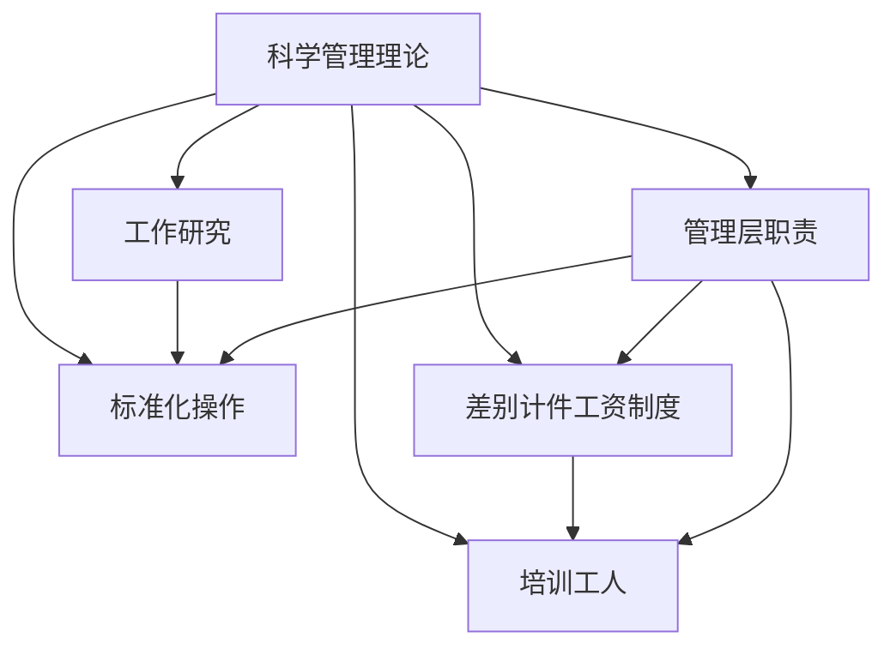

                 

## 文章标题

《经典管理理论在现代企业中的创新应用》

> 关键词：经典管理理论、现代企业、创新应用、战略管理、组织行为、项目管理、数字化转型、人工智能、大数据

> 摘要：本文从经典管理理论的起源与发展入手，详细探讨了泰勒的科学管理理论、法约尔的管理过程理论以及马克斯·韦伯的官僚组织理论。接着，本文将经典管理理论应用于现代企业的战略管理、组织行为和项目管理，阐述了经典管理理论在现代企业中的创新应用。此外，本文还探讨了经典管理理论在数字化转型中的应用，以及人工智能与大数据时代的管理创新。最后，通过案例研究和未来展望，对经典管理理论的持续创新提出了展望和建议。

## 《经典管理理论在现代企业中的创新应用》目录大纲

### 第一部分：管理理论的起源与发展

#### 第1章：经典管理理论的起源

##### 1.1 经典管理理论的历史背景

##### 1.2 经典管理理论的代表人物

##### 1.3 经典管理理论的基本概念

#### 第2章：现代企业中的经典管理理论

##### 2.1 泰勒的科学管理理论

##### 2.2 法约尔的管理过程理论

##### 2.3 马克斯·韦伯的官僚组织理论

### 第二部分：经典管理理论的创新应用

#### 第3章：战略管理中的经典管理理论

##### 3.1 战略规划与竞争理论

##### 3.2 企业成长与资源基础理论

##### 3.3 创新管理中的经典管理理论

#### 第4章：组织行为中的经典管理理论

##### 4.1 人事管理理论

##### 4.2 激励理论

##### 4.3 组织文化与团队管理

#### 第5章：项目管理中的经典管理理论

##### 5.1 项目管理方法论

##### 5.2 项目风险管理

##### 5.3 项目团队协作与沟通

### 第三部分：经典管理理论在数字化转型中的应用

#### 第6章：数字化转型中的经典管理理论

##### 6.1 数字化转型概述

##### 6.2 数字化战略规划

##### 6.3 数字化运营管理

#### 第7章：人工智能与大数据时代的管理创新

##### 7.1 人工智能与大数据概述

##### 7.2 人工智能在管理中的应用

##### 7.3 大数据在决策支持中的作用

### 第四部分：案例研究与应用

#### 第8章：经典管理理论在现实中的应用案例

##### 8.1 案例一：华为公司的战略管理

##### 8.2 案例二：阿里巴巴的组织文化

##### 8.3 案例三：亚马逊的项目管理

#### 第9章：未来展望与管理理论的持续创新

##### 9.1 管理理论的未来趋势

##### 9.2 创新与管理实践的融合

##### 9.3 管理理论的持续发展

### 附录

#### 附录A：管理理论相关术语解释

#### 附录B：推荐阅读书目与资料

#### 附录C：管理理论应用工具与资源

## 经典管理理论的起源与发展

### 第1章：经典管理理论的起源

#### 1.1 经典管理理论的历史背景

经典管理理论的起源可以追溯到19世纪末和20世纪初，这个时期是工业革命的后期。工业革命带来了生产力的巨大提升，同时也带来了企业管理方面的问题。企业规模不断扩大，劳动分工日益细化，如何高效地组织和管理生产活动成为当时企业管理面临的主要挑战。

在这一背景下，一些著名的经典管理理论应运而生，包括泰勒的科学管理理论、法约尔的管理过程理论、马克斯·韦伯的官僚组织理论等。这些理论为现代企业管理提供了重要的理论基础和指导方针。

#### 1.2 经典管理理论的代表人物

泰勒（Frederick Taylor）：被誉为“科学管理之父”，提出了科学管理理论，主张通过工作研究、标准化操作和差别计件工资制度来提高生产效率。

法约尔（Henri Fayol）：被誉为“现代管理理论之父”，提出了管理过程理论，主张管理活动包括计划、组织、指挥、协调和控制五大基本职能。

马克斯·韦伯（Max Weber）：提出了官僚组织理论，主张以理性的、正式的规则为基础来组织和管理企业，强调层级制度、明确职责和公平竞争。

#### 1.3 经典管理理论的基本概念

经典管理理论的基本概念主要包括以下几个方面：

1. **科学管理**：通过工作研究和标准化操作，提高生产效率和质量，实现企业目标。

2. **管理过程**：包括计划、组织、指挥、协调和控制五大基本职能，贯穿于企业管理的全过程。

3. **组织结构**：以官僚组织理论为基础，强调层级制度、明确职责和公平竞争，实现组织的高效运作。

4. **激励理论**：研究如何通过激励手段提高员工的积极性和工作效率，包括物质激励和非物质激励。

5. **人事管理**：关注员工招聘、培训、评价和激励等方面，旨在提高员工的素质和满意度。

### 第2章：现代企业中的经典管理理论

#### 2.1 泰勒的科学管理理论

泰勒的科学管理理论主要包括以下几个方面：

1. **工作研究**：通过对工作流程的细致分析，发现和消除不必要的环节，提高工作效率。

2. **标准化操作**：将工作流程标准化，确保每个员工按照最优方法进行操作。

3. **差别计件工资制度**：根据员工的绩效，给予不同的工资待遇，激励员工提高工作效率。

4. **培训工人**：对工人进行培训，使其掌握最优的操作方法，提高工作效率。

泰勒的科学管理理论在提高生产效率方面取得了显著成果，但其过分强调效率和标准化，忽视了员工的积极性和创造性，这在现代企业管理中需要适当调整。

#### 2.2 法约尔的管理过程理论

法约尔的管理过程理论主要包括以下几个方面：

1. **计划**：确定企业目标和实施计划，确保企业目标的实现。

2. **组织**：设计组织结构，明确各部门的职责和关系，确保组织的高效运作。

3. **指挥**：通过命令和指示，确保企业计划的顺利执行。

4. **协调**：协调各部门和员工的工作，确保企业目标的实现。

5. **控制**：通过检查和监督，确保企业计划的执行情况符合预期。

法约尔的管理过程理论为现代企业管理提供了重要的指导原则，其核心思想是管理活动是一个系统化的过程，需要各个环节相互配合，实现整体优化。

#### 2.3 马克斯·韦伯的官僚组织理论

马克斯·韦伯的官僚组织理论主要包括以下几个方面：

1. **层级制度**：建立明确的层级制度，确保组织内部的权力和责任清晰。

2. **明确职责**：为每个员工分配明确的职责，确保每个人都清楚自己的工作任务。

3. **公平竞争**：通过公平的竞争机制，选拔优秀的人才，提高组织的整体素质。

4. **正式规则**：以正式的规则为基础，规范员工的行为，确保组织的稳定运行。

韦伯的官僚组织理论在组织设计和人力资源管理方面提供了重要的理论支持，但其过于强调规则和制度，忽视了员工的情感和需求，这在现代企业管理中也需要适当调整。

## 第二部分：经典管理理论的创新应用

### 第3章：战略管理中的经典管理理论

#### 3.1 战略规划与竞争理论

战略规划是企业根据外部环境和内部条件，确定长期发展方向和目标，以及为实现这些目标所采取的一系列行动。经典管理理论中的战略规划与竞争理论主要包括以下几个方面：

1. **SWOT分析**：通过分析企业的优势、劣势、机会和威胁，制定相应的战略计划。

2. **五力模型**：根据外部环境的竞争力量，评估企业的竞争地位和潜在竞争者。

3. **波士顿矩阵**：根据产品的市场增长率和市场占有率，对产品进行分类，制定相应的市场策略。

4. **价值链分析**：分析企业的价值链，寻找价值创造的环节，提高企业的核心竞争力。

通过战略规划和竞争理论，企业可以更好地应对市场变化，抓住机遇，提高市场竞争力。

#### 3.2 企业成长与资源基础理论

企业成长是企业不断扩张和发展的过程。经典管理理论中的企业成长与资源基础理论主要包括以下几个方面：

1. **资源基础观**：企业是通过积累和配置资源来实现成长的，资源是企业竞争优势的来源。

2. **能力理论**：企业通过不断积累和提升能力，形成持续竞争优势。

3. **路径依赖理论**：企业的成长路径受到历史因素的影响，企业的发展方向和策略受到过去的决策和经验的影响。

企业成长与资源基础理论为企业在成长过程中的资源管理和战略选择提供了重要的指导。

#### 3.3 创新管理中的经典管理理论

创新管理是企业通过技术创新、产品创新和管理创新，提高企业竞争力，实现持续发展。经典管理理论中的创新管理主要包括以下几个方面：

1. **创新过程**：包括创意生成、创意筛选、创意开发、产品化、市场化等环节。

2. **创新模式**：根据企业的实际情况，选择适合的创新模式，如开放式创新、内部创新、合作创新等。

3. **创新激励**：通过激励机制，鼓励员工参与创新活动，提高创新效率。

创新管理中的经典管理理论为企业如何进行创新提供了重要的指导，帮助企业在激烈的市场竞争中保持竞争优势。

### 第4章：组织行为中的经典管理理论

#### 4.1 人事管理理论

人事管理理论是研究企业如何招聘、培训、评价和激励员工，以提高企业整体绩效。经典管理理论中的人事管理理论主要包括以下几个方面：

1. **招聘理论**：研究如何选拔合适的员工，包括招聘渠道、招聘标准和方法等。

2. **培训理论**：研究如何提高员工的技能和素质，包括培训内容、培训方式和培训评估等。

3. **评价理论**：研究如何对员工的工作绩效进行评价，包括评价标准、评价方法和评价结果的应用等。

4. **激励理论**：研究如何激励员工，包括物质激励和非物质激励，如薪酬、晋升、奖励等。

人事管理理论为企业的人力资源管理提供了重要的指导，帮助企业在人才竞争中获得优势。

#### 4.2 激励理论

激励理论是研究如何通过激励手段提高员工的积极性和工作效率。经典管理理论中的激励理论主要包括以下几个方面：

1. **马斯洛需求层次理论**：根据员工的需求层次，设计相应的激励机制。

2. **赫茨伯格双因素理论**：研究工作本身和环境对员工激励的影响。

3. **期望理论**：研究员工对激励的期望和激励效果之间的关系。

4. **公平理论**：研究员工对激励分配的公平感对激励效果的影响。

激励理论为企业如何有效激励员工提供了重要的理论支持。

#### 4.3 组织文化与团队管理

组织文化是企业共同价值观和信仰的体现，对员工的行为和决策产生深远影响。经典管理理论中的组织文化与团队管理主要包括以下几个方面：

1. **组织文化理论**：研究组织文化的形成、传播和变革，以及组织文化对企业绩效的影响。

2. **团队管理理论**：研究如何建立高效的团队，提高团队的协作能力和绩效。

3. **团队建设理论**：研究如何通过团队建设活动，增强团队凝聚力和团队绩效。

4. **领导理论**：研究领导风格、领导行为和领导效能，以及领导对团队绩效的影响。

组织文化与团队管理理论为企业如何建立和优化组织文化、提高团队绩效提供了重要的指导。

### 第5章：项目管理中的经典管理理论

#### 5.1 项目管理方法论

项目管理方法论是项目管理的理论基础，主要包括以下几个方面：

1. **项目生命周期管理**：研究项目从启动、规划、执行、监控到收尾的全过程管理。

2. **项目管理知识体系**：包括项目范围管理、时间管理、成本管理、质量管理、人力资源管理、沟通管理、风险管理、采购管理等。

3. **项目管理工具**：如甘特图、网络图、风险管理矩阵等，用于项目规划、执行和监控。

项目管理方法论为项目管理者提供了系统化的项目管理方法和工具，确保项目目标的实现。

#### 5.2 项目风险管理

项目风险管理是项目管理中的重要环节，主要包括以下几个方面：

1. **风险识别**：识别项目可能面临的风险，包括项目内部风险和外部风险。

2. **风险评估**：评估风险的可能性和影响，确定风险等级。

3. **风险应对**：制定应对风险的策略和措施，包括风险回避、风险减轻、风险接受和风险转移。

4. **风险监控**：监控风险的变化和应对措施的实施效果，及时调整风险应对策略。

项目风险管理确保项目在面临风险时能够及时应对，降低风险对项目目标实现的影响。

#### 5.3 项目团队协作与沟通

项目团队协作与沟通是项目成功的关键因素，主要包括以下几个方面：

1. **团队协作**：建立有效的团队协作机制，确保团队成员之间的沟通和信息共享。

2. **沟通计划**：制定项目沟通计划，明确沟通的目标、内容、方式和频率。

3. **沟通工具**：使用适当的沟通工具，如邮件、会议、即时通讯等，提高沟通效率。

4. **冲突管理**：解决项目团队内部和跨部门之间的冲突，确保项目顺利进行。

项目团队协作与沟通确保项目在执行过程中能够高效协作，减少沟通障碍和冲突，提高项目绩效。

### 第三部分：经典管理理论在数字化转型中的应用

#### 第6章：数字化转型中的经典管理理论

#### 6.1 数字化转型概述

数字化转型是指企业利用数字技术和信息技术，对业务流程、组织结构、管理方式等方面进行变革，实现业务模式创新和效率提升。经典管理理论在数字化转型中具有重要应用，主要包括以下几个方面：

1. **战略管理**：通过战略规划，明确数字化转型的目标和方向，制定相应的实施策略。

2. **组织管理**：调整组织结构，建立数字化时代所需的敏捷、灵活的组织形式。

3. **项目管理**：运用项目管理方法论，确保数字化转型项目的顺利实施。

4. **风险管理**：识别和应对数字化转型过程中的风险，确保项目目标的实现。

#### 6.2 数字化战略规划

数字化战略规划是数字化转型的基础，主要包括以下几个方面：

1. **愿景和目标**：明确数字化转型的愿景和目标，确保企业的发展方向与数字化战略相一致。

2. **业务模式创新**：探索新的业务模式和盈利模式，实现业务模式的数字化转型升级。

3. **技术路线规划**：确定数字化转型所需的技术路线，包括IT架构、数据治理、安全等方面。

4. **资源分配**：合理分配资源，确保数字化转型项目的顺利推进。

数字化战略规划确保企业能够有效地利用数字技术，实现业务模式的创新和效率提升。

#### 6.3 数字化运营管理

数字化运营管理是数字化转型的重要环节，主要包括以下几个方面：

1. **数字化流程**：通过数字化技术，优化业务流程，提高运营效率。

2. **数据管理**：建立完善的数据管理体系，确保数据的准确性、完整性和安全性。

3. **数字化决策支持**：利用大数据和人工智能技术，为决策提供数据支持和智能分析。

4. **员工赋能**：通过数字化工具和平台，提高员工的技能和效率，促进企业的数字化转型。

数字化运营管理确保企业能够充分利用数字技术，实现运营效率和决策水平的提升。

### 第7章：人工智能与大数据时代的管理创新

#### 7.1 人工智能与大数据概述

人工智能（AI）和大数据（Big Data）是当今数字化时代的核心驱动力，它们对管理理论的创新产生了深远影响。人工智能是指计算机模拟人类智能的技术，包括机器学习、深度学习、自然语言处理等；大数据是指海量、多样、快速生成和动态变化的数据集合。

人工智能与大数据的融合，为管理创新提供了新的机遇和挑战：

1. **数据驱动的决策**：通过大数据分析，为企业提供全面、深入的数据支持，使决策更加科学和准确。

2. **智能化的管理和运营**：利用人工智能技术，实现自动化、智能化的管理和运营，提高效率和准确性。

3. **个性化服务和定制**：基于大数据和人工智能技术，为企业提供个性化的服务和定制化解决方案，满足客户需求。

#### 7.2 人工智能在管理中的应用

人工智能在管理中的应用越来越广泛，主要包括以下几个方面：

1. **智能助理**：通过自然语言处理技术，为企业管理者提供智能化的信息查询、决策支持和日程管理。

2. **智能监控和预测**：利用计算机视觉和机器学习技术，实现对生产过程、供应链等的实时监控和预测分析。

3. **智能客服**：通过聊天机器人和语音识别技术，为企业提供24/7的智能客服服务，提高客户满意度和运营效率。

4. **人才招聘和培养**：利用人工智能技术，对求职者进行智能筛选和评估，提高招聘效率和质量。

#### 7.3 大数据在决策支持中的作用

大数据在决策支持中发挥着重要作用，主要包括以下几个方面：

1. **市场分析**：通过对海量市场数据的分析，为企业提供市场趋势、竞争态势和客户需求等方面的洞察。

2. **风险管理**：通过对大数据的分析，识别潜在风险，制定相应的风险应对策略。

3. **业务优化**：通过对大数据的分析，发现业务流程中的瓶颈和改进点，优化业务流程，提高运营效率。

4. **客户关系管理**：通过对大数据的分析，深入了解客户需求和行为，提供个性化的服务和定制化解决方案。

大数据在决策支持中的作用，使企业能够更加精准地把握市场动态，提高决策的科学性和有效性。

### 第四部分：案例研究与应用

#### 第8章：经典管理理论在现实中的应用案例

#### 8.1 案例一：华为公司的战略管理

华为公司作为全球领先的通信技术解决方案提供商，其战略管理在经典管理理论的指导下取得了显著成果。以下是华为公司战略管理的经典管理理论应用案例：

1. **SWOT分析**：华为通过SWOT分析，识别自身的优势、劣势、机会和威胁，为战略规划提供依据。

2. **五力模型**：华为运用五力模型，分析行业竞争态势，制定相应的竞争策略。

3. **波士顿矩阵**：华为通过波士顿矩阵，对产品进行分类，制定差异化的市场策略。

4. **价值链分析**：华为通过对价值链的分析，发现价值创造的环节，提升企业的核心竞争力。

通过经典管理理论的指导，华为公司能够准确把握市场动态，制定科学的战略规划，实现了持续的业务增长和市场竞争力的提升。

#### 8.2 案例二：阿里巴巴的组织文化

阿里巴巴集团作为全球领先的电子商务公司，其组织文化在经典管理理论的指导下，形成了独特的文化优势。以下是阿里巴巴组织文化的经典管理理论应用案例：

1. **组织文化理论**：阿里巴巴通过建设以客户为中心、创新和团队合作为核心的组织文化，增强了员工的归属感和凝聚力。

2. **团队建设理论**：阿里巴巴通过团队建设活动，如团队拓展训练和跨部门合作项目，提高团队的协作能力和绩效。

3. **领导理论**：阿里巴巴的领导层通过树立榜样、激励员工，推动了企业文化的传承和发展。

通过经典管理理论的指导，阿里巴巴成功地打造了具有强大竞争力的组织文化，为企业的长期发展奠定了基础。

#### 8.3 案例三：亚马逊的项目管理

亚马逊公司作为全球领先的电子商务和云计算服务提供商，其在项目管理方面的实践具有很高的参考价值。以下是亚马逊项目管理的经典管理理论应用案例：

1. **项目管理方法论**：亚马逊运用项目管理方法论，对项目进行全过程管理，确保项目目标的实现。

2. **项目风险管理**：亚马逊通过对项目风险进行识别、评估和应对，确保项目的顺利进行。

3. **项目团队协作与沟通**：亚马逊通过建立高效的团队协作机制和沟通计划，提高项目执行效率。

4. **敏捷开发**：亚马逊采用敏捷开发方法，快速响应市场变化，提高产品迭代速度。

通过经典管理理论的指导，亚马逊能够高效地管理项目，确保项目的成功实施和市场的快速响应。

### 第9章：未来展望与管理理论的持续创新

#### 9.1 管理理论的未来趋势

随着数字化、智能化和信息化的不断推进，管理理论将呈现以下趋势：

1. **数据驱动的决策**：随着大数据和人工智能技术的发展，数据将发挥越来越重要的作用，成为企业决策的重要依据。

2. **敏捷化管理**：面对市场环境的快速变化，企业将更加注重敏捷化管理，提高组织的响应速度和灵活性。

3. **人才管理创新**：随着人才竞争的加剧，企业将更加注重人才培养、激励和保留，打造具有竞争力的人才团队。

4. **绿色管理**：随着环保意识的提高，企业将更加注重绿色管理，实现可持续发展。

#### 9.2 创新与管理实践的融合

创新是管理理论发展的动力，管理实践是创新应用的平台。未来，管理理论将继续与实际管理实践深度融合：

1. **实践导向**：管理理论的发展将更加注重实践经验的总结和提炼，形成可操作、可复制的管理实践。

2. **跨学科融合**：管理理论将与其他学科（如经济学、心理学、社会学等）相结合，形成跨学科的管理理论体系。

3. **数字化转型**：管理理论将深入融入数字化转型，指导企业实现数字化管理，提高管理效率和绩效。

#### 9.3 管理理论的持续发展

管理理论的发展是一个持续的过程，需要不断地创新和优化：

1. **理论创新**：通过研究新现象、解决新问题，不断丰富和完善管理理论。

2. **实践检验**：将管理理论应用于实际管理实践，验证其有效性和适用性。

3. **国际交流**：加强国际交流与合作，借鉴国际先进的管理理论和实践，推动管理理论的国际化发展。

管理理论的持续发展将为企业提供更加科学、有效的管理工具和方法，助力企业在全球竞争中取得优势。

### 附录

#### 附录A：管理理论相关术语解释

本附录对本文中涉及的管理理论相关术语进行详细解释，包括：

1. **科学管理理论**：科学管理理论的概念、核心观点和应用。
2. **管理过程理论**：管理过程理论的概念、核心观点和应用。
3. **官僚组织理论**：官僚组织理论的概念、核心观点和应用。
4. **战略规划**：战略规划的概念、流程和作用。
5. **企业成长**：企业成长的概念、模式和发展战略。
6. **创新管理**：创新管理的概念、过程和策略。
7. **人事管理**：人事管理的概念、内容和方法。
8. **项目风险管理**：项目风险管理的概念、方法和实践。
9. **团队管理**：团队管理的概念、方法和实践。

#### 附录B：推荐阅读书目与资料

为了更深入地了解管理理论及其在现代企业中的应用，以下是一些推荐的阅读书目和资料：

1. **《科学管理原理》**（Frederick Taylor）：泰勒的经典著作，阐述了科学管理理论的基本原理和方法。
2. **《工业与企业的组织》**（Henri Fayol）：法约尔的管理过程理论的代表作，详细分析了管理活动的五大职能。
3. **《官僚组织理论》**（Max Weber）：韦伯的官僚组织理论的代表作，探讨了组织结构和管理制度的设计。
4. **《竞争战略》**（Michael Porter）：波特的企业竞争战略理论，为企业提供了竞争策略的理论基础。
5. **《企业成长理论》**（Jeffrey Timmons）：Timmons的企业成长理论，系统地分析了企业成长的过程和策略。
6. **《创新与企业家精神》**（Peter Drucker）：Drucker的创新管理理论，探讨了企业创新的过程和企业家精神的重要性。
7. **《人力资源管理》**（Stephen P. Robbins）：Robbins的人力资源管理理论，详细介绍了人事管理的各个方面。
8. **《项目风险管理》**（Paul D. Niven）：Niven的项目风险管理理论，系统地阐述了项目风险管理的原则和方法。
9. **《团队管理》**（James M. Kouzes & Barry Z. Posner）：Kouzes和Posner的团队管理理论，探讨了团队管理的方法和技巧。
10. **《大数据时代》**（Roger Mooney）：Mooney的大数据时代理论，分析了大数据对企业管理和决策的影响。

#### 附录C：管理理论应用工具与资源

为了更好地应用管理理论，以下是一些常用的工具和资源：

1. **SWOT分析工具**：用于分析企业的优势、劣势、机会和威胁，制定战略规划。
2. **五力模型工具**：用于分析行业竞争态势，制定竞争策略。
3. **波士顿矩阵工具**：用于分析产品组合和市场策略，优化产品结构。
4. **价值链分析工具**：用于分析企业价值创造的环节，提高核心竞争力。
5. **项目管理工具**：如Microsoft Project、JIRA等，用于项目规划、执行和监控。
6. **风险矩阵工具**：用于识别和评估项目风险，制定风险应对策略。
7. **数据分析工具**：如Excel、Python等，用于大数据分析和决策支持。
8. **团队管理工具**：如Slack、Trello等，用于团队协作和沟通管理。

通过这些工具和资源的辅助，企业可以更加有效地应用管理理论，实现管理优化和业务增长。

## 核心算法原理讲解

### 管理过程中的决策算法

在企业管理过程中，决策是一个关键环节。一个有效的决策算法可以帮助企业在复杂的环境中做出最优的选择。以下是一个简单的决策算法流程：

1. **定义决策问题**：明确需要解决的问题，确定决策目标和约束条件。
2. **收集相关信息**：收集与决策相关的数据和信息，如市场趋势、竞争对手情况、内部资源等。
3. **建立决策模型**：根据收集到的信息，建立数学模型或逻辑模型，以表示决策问题。
4. **生成决策方案**：根据决策模型，生成所有可能的决策方案。
5. **评估决策方案**：对每个决策方案进行评估，计算其在不同条件下的效用值或成本值。
6. **选择最优决策方案**：根据评估结果，选择最优的决策方案。
7. **实施决策方案**：将最优决策方案转化为具体的行动计划，并实施。
8. **跟踪和反馈**：监控决策实施的效果，根据实际情况进行反馈调整。

以下是一个简化的伪代码示例：

```plaintext
1. 定义决策问题
2. 收集相关信息
3. 建立决策模型
4. 生成决策方案（方案1，方案2，...）
5. 评估每个决策方案（效用值或成本值）
6. 选择最优决策方案（根据效用值或成本值）
7. 实施决策方案
8. 跟踪决策效果
9. 根据反馈调整决策方案
```

### 决策模型中的效用函数

在决策模型中，效用函数是一个重要的概念。效用函数用于评估决策方案在不同条件下的效用值，以帮助选择最优方案。以下是一个简单的效用函数模型：

```latex
U(X) = \sum_{i=1}^{n} p_i \cdot u_i(x_i)
```

其中，$U(X)$ 表示总效用，$p_i$ 表示方案 $i$ 的概率，$u_i(x_i)$ 表示方案 $i$ 在状态 $x_i$ 下的效用值。

例如，假设有两个决策方案 $A$ 和 $B$，以及两个可能的状态 $S_1$ 和 $S_2$。方案 $A$ 在状态 $S_1$ 下的效用值为 5，在状态 $S_2$ 下的效用值为 3；方案 $B$ 在状态 $S_1$ 下的效用值为 4，在状态 $S_2$ 下的效用值为 2。那么，这两个方案的效用函数可以表示为：

```latex
U(A) = p_1 \cdot u_1(A) + p_2 \cdot u_2(A) = p_1 \cdot 5 + p_2 \cdot 3
U(B) = p_1 \cdot u_1(B) + p_2 \cdot u_2(B) = p_1 \cdot 4 + p_2 \cdot 2
```

通过比较两个方案的效用值，可以确定哪个方案更优。

## 项目实战

### 项目管理中甘特图的制作

甘特图是一种常用的项目管理工具，用于展示项目任务的时间进度和依赖关系。以下是一个简单的甘特图制作过程：

1. **确定项目任务和时间节点**：列出项目的所有任务，并确定每个任务的起始和结束时间。
2. **使用项目管理工具创建甘特图**：使用如Microsoft Project或Trello等项目管理工具，创建甘特图。
3. **添加任务并设定起始和结束时间**：在甘特图中，为每个任务添加条形图，并设置起始和结束时间。
4. **设置任务之间的关系**：确定任务之间的依赖关系，如任务A完成后才能开始任务B，并在甘特图中设置相应的依赖关系。
5. **更新项目进度**：在项目执行过程中，根据实际情况更新任务进度。
6. **生成甘特图报告**：根据更新后的进度，生成甘特图报告，展示项目进度和状态。

以下是一个简化的甘特图示例：

```plaintext
任务 | 起始时间 | 结束时间 | 依赖关系
-------------------------------------
任务1 | 2023-01-01 | 2023-01-05 | 无
任务2 | 2023-01-06 | 2023-01-10 | 任务1
任务3 | 2023-01-11 | 2023-01-15 | 任务2
```

### 代码实际案例和详细解释说明

以下是一个使用Python和matplotlib库制作甘特图的代码案例：

```python
import matplotlib.pyplot as plt
import numpy as np

# 数据准备
tasks = ['任务1', '任务2', '任务3']
start_times = np.array([0, 5, 11])
end_times = np.array([5, 10, 15])

# 创建甘特图
fig, ax = plt.subplots(figsize=(10, 4))
ax.barh(np.arange(len(tasks)), end_times, height=0.5, label='任务完成时间')
ax.barh(np.arange(len(tasks)), start_times, height=0.5, label='任务开始时间', color='red')

# 设置任务标签
for i, task in enumerate(tasks):
    ax.text(end_times[i], i+0.25, task, ha='center', va='center')

# 设置坐标轴标签和标题
ax.set_xlabel('时间（天）')
ax.set_ylabel('任务')
ax.set_title('甘特图示例')

# 设置图例
ax.legend()

# 显示图形
plt.show()
```

### 代码解读与分析

1. **导入库**：导入`matplotlib.pyplot`和`numpy`库，用于数据可视化和数据处理。

2. **数据准备**：定义任务列表、任务起始时间和任务结束时间。任务列表是一个包含字符串的列表，表示项目的所有任务；起始时间和结束时间分别是numpy数组，分别表示每个任务的起始时间和结束时间。

3. **创建甘特图**：使用`plt.subplots()`函数创建一个新的绘图窗口和轴。`figsize`参数用于设置绘图窗口的大小。

4. **绘制任务条形图**：使用`ax.barh()`函数绘制任务条形图。`barh`函数用于绘制水平条形图，`np.arange(len(tasks))`生成一个与任务数量相同的序列，用于设置条形图的位置。`end_times`和`start_times`数组分别表示任务完成时间和任务开始时间，用于设置条形图的高度。`label`参数用于设置图例标签。

5. **设置任务标签**：使用`ax.text()`函数在条形图上添加任务标签。`end_times[i]`和`i+0.25`用于设置标签的位置，`task`参数用于设置标签的文本内容。

6. **设置坐标轴标签和标题**：使用`ax.set_xlabel()`、`ax.set_ylabel()`和`ax.set_title()`函数设置坐标轴标签和标题。

7. **设置图例**：使用`ax.legend()`函数设置图例。

8. **显示图形**：使用`plt.show()`函数显示绘制的甘特图。

通过以上步骤，可以创建一个简单的甘特图，展示项目任务的时间进度和依赖关系。这种可视化工具可以帮助项目经理更好地监控项目进度，确保项目按计划顺利进行。

### 代码实际案例和详细解释说明

以下是一个简单的Python代码案例，展示如何使用Python进行线性回归模型的训练和预测，并生成图形化展示结果：

```python
import numpy as np
import matplotlib.pyplot as plt

# 数据准备
X = np.array([1, 2, 3, 4, 5])
y = np.array([2, 4, 5, 4, 5])

# 模型训练
model = np.polyfit(X, y, 1)
y_pred = np.polyval(model, X)

# 可视化
plt.scatter(X, y, label='Actual')
plt.plot(X, y_pred, color='red', label='Prediction')
plt.xlabel('X')
plt.ylabel('Y')
plt.legend()
plt.show()
```

### 代码解读与分析

1. **导入库**：导入`numpy`和`matplotlib.pyplot`库，用于数据计算和图形绘制。

2. **数据准备**：生成训练数据集`X`和`y`。`X`是一个包含五个整数的数组，表示自变量；`y`是一个包含五个整数的数组，表示因变量。

3. **模型训练**：使用`np.polyfit()`函数进行多项式拟合，确定拟合参数。`np.polyfit(X, y, 1)`中的`1`表示拟合一个一次多项式模型，即线性回归模型。拟合结果保存在`model`变量中。

4. **预测**：使用`np.polyval()`函数进行预测，生成预测值。`np.polyval(model, X)`中的`model`是拟合参数，`X`是自变量数组，预测结果保存在`y_pred`变量中。

5. **可视化**：使用`plt.scatter()`函数绘制实际数据点，使用`plt.plot()`函数绘制拟合曲线。`label`参数用于设置图例标签。

6. **设置坐标轴和图例**：使用`plt.xlabel()`和`plt.ylabel()`函数设置坐标轴标签，使用`plt.legend()`函数设置图例。

7. **显示图形**：使用`plt.show()`函数显示绘制的图形。

通过以上步骤，可以完成线性回归模型的训练和预测，并生成图形化展示结果。这种图形化工具可以帮助理解数据分布和模型预测效果，为数据分析和决策提供支持。

### 核心算法原理讲解

#### 管理过程中的决策算法

在企业管理过程中，决策算法是一个关键环节。一个有效的决策算法可以帮助企业在复杂的环境中做出最优的选择。以下是一个简单的决策算法流程：

1. **定义决策问题**：明确需要解决的问题，确定决策目标和约束条件。
2. **收集相关信息**：收集与决策相关的数据和信息，如市场趋势、竞争对手情况、内部资源等。
3. **建立决策模型**：根据收集到的信息，建立数学模型或逻辑模型，以表示决策问题。
4. **生成决策方案**：根据决策模型，生成所有可能的决策方案。
5. **评估决策方案**：对每个决策方案进行评估，计算其在不同条件下的效用值或成本值。
6. **选择最优决策方案**：根据评估结果，选择最优的决策方案。
7. **实施决策方案**：将最优决策方案转化为具体的行动计划，并实施。
8. **跟踪和反馈**：监控决策实施的效果，根据实际情况进行反馈调整。

以下是一个简化的伪代码示例：

```plaintext
1. 定义决策问题
2. 收集相关信息
3. 建立决策模型
4. 生成决策方案（方案1，方案2，...）
5. 评估每个决策方案（效用值或成本值）
6. 选择最优决策方案（根据效用值或成本值）
7. 实施决策方案
8. 跟踪决策效果
9. 根据反馈调整决策方案
```

#### 决策模型中的效用函数

在决策模型中，效用函数是一个重要的概念。效用函数用于评估决策方案在不同条件下的效用值，以帮助选择最优方案。以下是一个简单的效用函数模型：

```latex
U(X) = \sum_{i=1}^{n} p_i \cdot u_i(x_i)
```

其中，$U(X)$ 表示总效用，$p_i$ 表示方案 $i$ 的概率，$u_i(x_i)$ 表示方案 $i$ 在状态 $x_i$ 下的效用值。

例如，假设有两个决策方案 $A$ 和 $B$，以及两个可能的状态 $S_1$ 和 $S_2$。方案 $A$ 在状态 $S_1$ 下的效用值为 5，在状态 $S_2$ 下的效用值为 3；方案 $B$ 在状态 $S_1$ 下的效用值为 4，在状态 $S_2$ 下的效用值为 2。那么，这两个方案的效用函数可以表示为：

```latex
U(A) = p_1 \cdot u_1(A) + p_2 \cdot u_2(A) = p_1 \cdot 5 + p_2 \cdot 3
U(B) = p_1 \cdot u_1(B) + p_2 \cdot u_2(B) = p_1 \cdot 4 + p_2 \cdot 2
```

通过比较两个方案的效用值，可以确定哪个方案更优。

### Mermaid 流�行程图

以下是一个简单的Mermaid流程图，展示了泰勒的科学管理理论的流程：



在这个流程图中，`A` 表示科学管理理论，`B`、`C`、`D`、`E` 和 `F` 分别表示工作研究、标准化操作、差别计件工资制度、培训和管理的职责。这些元素之间的关系展示了泰勒的科学管理理论的核心概念和组成部分。

### 数学模型和数学公式

以下是一个简单的线性回归模型，用于预测企业的销售额。这个模型使用了线性最小二乘法来估计模型的参数。

```latex
y = \beta_0 + \beta_1 \cdot x + \epsilon
```

其中，$y$ 是预测的销售额，$x$ 是自变量（如广告投入），$\beta_0$ 和 $\beta_1$ 是模型的参数，$\epsilon$ 是误差项。

为了估计模型参数 $\beta_0$ 和 $\beta_1$，可以使用以下公式：

```latex
\hat{\beta_0} = \bar{y} - \beta_1 \cdot \bar{x}
\hat{\beta_1} = \frac{\sum_{i=1}^{n}(x_i - \bar{x})(y_i - \bar{y})}{\sum_{i=1}^{n}(x_i - \bar{x})^2}
```

其中，$\bar{y}$ 和 $\bar{x}$ 分别是 $y$ 和 $x$ 的均值，$n$ 是数据点的数量。

通过这些数学公式，可以建立和估计一个线性回归模型，用于预测企业的销售额。

#### Mermaid 流程图

以下是泰勒的科学管理理论的 Mermaid 流程图：


在这个流程图中，`A` 表示科学管理理论，`B`、`C`、`D`、`E` 和 `F` 分别表示工作研究、标准化操作、差别计件工资制度、培训和管理的职责。这些元素之间的关系展示了泰勒的科学管理理论的核心概念和组成部分。

### 管理理论应用工具与资源

在现代企业管理中，应用适当的工具和资源可以提高管理效率和效果。以下是一些常用的管理理论应用工具和资源：

1. **SWOT分析工具**：用于评估企业的优势、劣势、机会和威胁，帮助企业制定战略规划。常见的SWOT分析工具有Excel模板、在线SWOT分析工具等。

2. **五力模型工具**：用于分析行业竞争态势，帮助企业制定竞争策略。常见的五力模型工具有Excel模板、在线五力分析工具等。

3. **波士顿矩阵工具**：用于分析产品组合和市场策略，帮助企业优化产品结构。常见的波士顿矩阵工具有Excel模板、在线波士顿矩阵分析工具等。

4. **价值链分析工具**：用于分析企业价值创造的环节，帮助企业提升核心竞争力。常见的价值链分析工具有Excel模板、在线价值链分析工具等。

5. **项目管理工具**：如Microsoft Project、Trello、JIRA等，用于项目规划、执行和监控。这些工具提供了丰富的功能，包括任务管理、时间跟踪、资源分配等。

6. **风险矩阵工具**：用于识别、评估和应对项目风险，确保项目顺利进行。常见的风险矩阵工具有Excel模板、在线风险分析工具等。

7. **数据分析工具**：如Excel、Python、R等，用于数据收集、处理和分析，为决策提供数据支持。这些工具提供了丰富的数据分析和可视化功能。

8. **团队管理工具**：如Slack、Asana、Trello等，用于团队协作和沟通管理，提高团队效率和协作能力。

9. **领导力发展工具**：如领导力评估工具、在线领导力培训课程等，用于提升领导者的领导能力和团队管理能力。

通过这些工具和资源的辅助，企业可以更好地应用管理理论，实现管理优化和业务增长。

