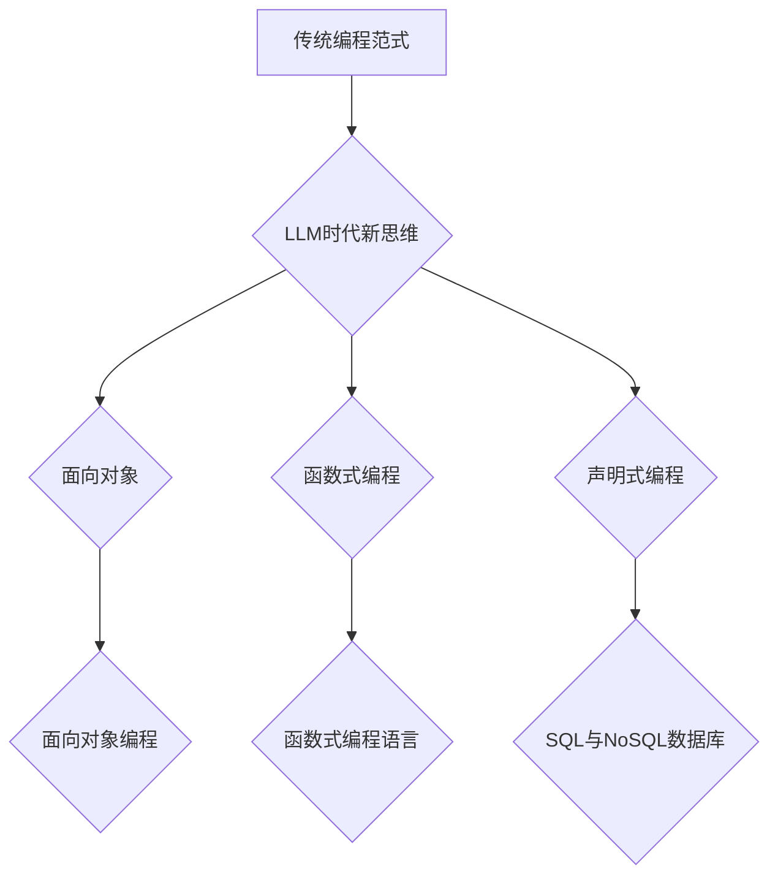

                 

# 编程范式的转变：LLM时代的新思维

> 关键词：编程范式，LLM，人工智能，语言模型，深度学习，自然语言处理，编程教育，安全与伦理

> 摘要：本文将探讨编程范式的转变，尤其是在大规模语言模型（LLM）时代的背景下。通过对传统编程范式、LLM的核心概念与架构、LLM的数学基础、LLM的构建与应用、LLM在编程教育中的应用、LLM的安全与伦理问题以及LLM项目实战和未来发展趋势的详细分析，本文旨在展示LLM对编程领域带来的深远影响，并展望LLM时代编程教育的可能形态。

## 《编程范式的转变：LLM时代的新思维》目录大纲

### 第一部分: 引言与背景

#### 第1章: 编程范式的演变

1.1 编程范式概述  
1.2 传统编程范式及其局限性  
1.3 LLM时代的新思维

#### 第2章: LLM的核心概念与架构

2.1 语言模型的定义与特点  
2.2 LLM的基本架构  
2.3 LLM的关键技术

#### 第3章: LLM的数学基础

3.1 概率论与信息论  
3.2 机器学习基础  
3.3 深度学习基础

### 第二部分: LLM的构建与应用

#### 第4章: LLM的构建方法

4.1 数据预处理  
4.2 模型选择与训练  
4.3 模型优化与调参

#### 第5章: LLM的应用场景

5.1 自然语言处理  
5.2 代码生成与辅助编程  
5.3 智能问答与对话系统

#### 第6章: LLM在编程教育中的应用

6.1 编程教育中的挑战  
6.2 LLM在编程教育中的应用  
6.3 LLM辅助编程教育的案例分析

#### 第7章: LLM的安全与伦理问题

7.1 LLM的安全性  
7.2 LLM的伦理问题  
7.3 如何应对LLM的安全与伦理问题

### 第三部分: 实践与展望

#### 第8章: LLM项目实战

8.1 实战项目概述  
8.2 项目开发环境搭建  
8.3 源代码实现与解读

#### 第9章: LLM的未来发展趋势

9.1 LLM技术的未来发展方向  
9.2 LLM在编程领域的未来影响  
9.3 LLM时代的编程教育展望

#### 第10章: 总结与展望

10.1 本书总结  
10.2 LLM时代的编程范式变革  
10.3 未来编程教育的可能形态

## 附录

### 附录A: 术语解释

A.1 常用术语  
A.2 技术术语

### 附录B: 进一步阅读资源

B.1 相关书籍  
B.2 学术论文  
B.3 开源项目和工具

### Mermaid 流程图



### 伪代码

```python
# 伪代码：训练一个简单的语言模型
define LanguageModel():
    # 初始化模型参数
    initialize parameters

    # 数据预处理
    preprocess_data(data)

    # 模型训练
    for epoch in 1 to MAX_EPOCHS:
        for batch in data:
            # 前向传播
            predictions = forward_pass(batch)

            # 计算损失
            loss = compute_loss(predictions, batch)

            # 反向传播
            backward_pass(loss)

    return trained_model
```

### 数学模型和公式

#### 概率论与信息论

$$
P(X=x) = \frac{f(x)}{F(x)}
$$

$$
H(X) = -\sum_{x \in \mathcal{X}} P(X=x) \log_2 P(X=x)
$$

#### 机器学习基础

$$
\hat{y} = \sigma(\theta_0 + \sum_{i=1}^{n} \theta_i x_i)
$$

#### 深度学习基础

$$
\frac{\partial L}{\partial \theta} = \frac{\partial L}{\partial a} \cdot \frac{\partial a}{\partial \theta}
```

## 第一部分：引言与背景

### 第1章：编程范式的演变

编程范式是指导程序员编写代码和解决问题的一套方法和原则。自计算机诞生以来，编程范式经历了多次演变，每一次的变革都带来了编程方式的重大变化。从最初的机器语言和汇编语言，到高级编程语言，再到现代的函数式编程、面向对象编程和声明式编程，编程范式的发展一直伴随着计算机技术的进步。

#### 1.1 编程范式概述

编程范式可以理解为编程方法论的分类，它反映了程序员在编写代码时处理数据和解决问题的思维方式。常见的编程范式包括：

- **过程式编程**：通过顺序执行一系列指令来解决问题，以过程和函数为中心。
- **面向对象编程**：将数据和操作数据的方法封装成对象，通过对象之间的交互来实现程序的逻辑。
- **函数式编程**：以函数作为程序的基本构建块，避免使用共享状态和可变数据。
- **声明式编程**：描述期望的结果，而不是具体的执行步骤。

#### 1.2 传统编程范式及其局限性

传统编程范式虽然在历史上发挥了重要作用，但随着时代的发展，它们也逐渐暴露出一些局限性：

- **过程式编程**：难以维护和扩展，程序的逻辑往往分散在多个函数或过程中，难以管理和理解。
- **面向对象编程**：虽然提高了代码的模块性和可重用性，但在处理复杂逻辑和大规模系统时，对象之间的交互变得复杂。
- **函数式编程**：在处理并发和并行计算时存在一定的挑战，且对某些类型的问题（如输入/输出操作）的处理不够高效。
- **声明式编程**：在某些场景下可能导致性能问题，因为它往往依赖于中间表示和查询优化。

#### 1.3 LLM时代的新思维

随着人工智能技术的快速发展，尤其是大规模语言模型（LLM）的出现，编程范式迎来了新的变革。LLM作为一种先进的自然语言处理技术，具有以下特点：

- **强大的表示能力**：LLM可以处理和理解复杂的文本数据，将自然语言转化为机器可读的结构。
- **自适应能力**：LLM可以根据不同的任务和数据集进行自适应调整，无需手动重写代码。
- **通用性**：LLM不仅可以用于文本生成和分类，还可以应用于代码生成、智能问答等多个领域。

在LLM时代，编程范式的新思维主要体现在以下几个方面：

- **代码生成**：通过训练LLM，可以自动生成代码，大大提高了编程效率和代码质量。
- **智能辅助**：LLM可以辅助程序员进行代码审查、错误检测和性能优化。
- **自然语言交互**：程序员可以使用自然语言与LLM进行交互，使得编程过程更加直观和自然。
- **模块化与可重用性**：LLM可以生成高度模块化的代码，提高代码的可重用性和可维护性。

总之，LLM时代的新思维不仅改变了传统的编程范式，也为程序员提供了更高效、更智能的编程工具。接下来，我们将深入探讨LLM的核心概念、数学基础、构建方法、应用场景以及未来发展趋势。

### 第2章：LLM的核心概念与架构

#### 2.1 语言模型的定义与特点

语言模型（Language Model，简称LM）是一种用于预测文本序列的概率分布的统计模型。在自然语言处理（Natural Language Processing，简称NLP）领域，语言模型被广泛应用于文本生成、机器翻译、情感分析、文本分类等多个任务。语言模型的核心目标是理解自然语言的语法和语义，从而对文本进行有效的处理和分析。

语言模型的特点包括：

- **概率性**：语言模型通过计算文本序列的概率分布来预测下一个单词或字符。
- **上下文依赖**：语言模型能够考虑上下文信息，从而生成更加符合语境的文本。
- **可扩展性**：语言模型可以处理不同领域和不同语言的文本，具有较强的通用性。

#### 2.2 LLM的基本架构

大规模语言模型（Large Language Model，简称LLM）是基于深度学习技术构建的，其架构通常包括以下几个部分：

- **词嵌入（Word Embedding）**：将文本中的单词映射到高维向量空间，以便于进行数学计算。
- **编码器（Encoder）**：对输入的文本序列进行编码，生成固定长度的向量表示。
- **解码器（Decoder）**：根据编码器的输出和已经生成的文本序列，逐个预测下一个单词或字符。

LLM的基本架构可以分为以下几个层次：

1. **输入层**：接收原始文本数据，通常通过词嵌入技术将其转化为向量表示。
2. **编码层**：通过神经网络（如循环神经网络RNN、变换器模型Transformer）对输入文本进行编码，生成固定长度的上下文向量。
3. **解码层**：根据编码层的输出和已经生成的文本序列，逐个生成新的单词或字符。

#### 2.3 LLM的关键技术

大规模语言模型的训练和部署涉及多种关键技术，包括：

- **预训练（Pre-training）**：在大量无标注的数据上预先训练语言模型，使其具有强大的语言理解和生成能力。
- **微调（Fine-tuning）**：在特定任务上对预训练的语言模型进行微调，以适应不同的应用场景。
- **上下文窗口（Context Window）**：在语言模型中，上下文窗口决定了模型考虑的文本序列长度。较大的上下文窗口可以捕捉更长的依赖关系，从而提高模型的生成质量。
- **并行计算和分布式训练**：为了加速大规模语言模型的训练，采用并行计算和分布式训练技术，将计算任务分布在多个计算节点上。

#### 2.4 LLM的优缺点

LLM作为一种先进的自然语言处理技术，具有以下优点：

- **强大的语言理解能力**：LLM能够处理和理解复杂的自然语言文本，实现高精度的文本生成和分类。
- **通用性**：LLM可以应用于多种自然语言处理任务，如文本生成、机器翻译、问答系统等。
- **自适应能力**：LLM可以根据不同的任务和数据集进行自适应调整，无需手动重写代码。

然而，LLM也存在一些缺点：

- **训练成本高**：大规模语言模型的训练需要大量的计算资源和时间。
- **数据依赖性**：LLM的性能高度依赖于训练数据的质量和规模，缺乏多样化训练数据可能导致模型过拟合。
- **解释性差**：大规模语言模型往往被视为“黑箱”，其内部决策过程难以解释和理解。

综上所述，LLM作为一种新兴的自然语言处理技术，具有强大的语言理解能力和通用性，但同时也面临着训练成本高、数据依赖性和解释性差等挑战。在接下来的章节中，我们将深入探讨LLM的数学基础、构建方法、应用场景以及安全与伦理问题。

### 第3章：LLM的数学基础

#### 3.1 概率论与信息论

概率论和信息论是大规模语言模型（LLM）构建和应用的重要数学基础。它们提供了理解文本生成、序列预测和模型优化的理论基础。

**概率论**：

概率论主要研究随机事件及其概率分布。在LLM中，概率论用于模型预测和评估。具体来说：

- **概率分布**：语言模型通过概率分布来预测文本序列的概率。常见的概率分布包括伯努利分布、高斯分布等。
- **条件概率**：条件概率用于描述在某个条件下另一个事件发生的概率。在LLM中，条件概率用于模型预测，如给定前文，预测下一个单词的概率。
- **概率密度函数**：概率密度函数（PDF）描述了随机变量在某个范围内的概率密度。在LLM中，PDF用于生成连续文本序列。

**信息论**：

信息论研究信息在通信系统中的传递和处理。在LLM中，信息论用于评估模型的性能和优化。具体来说：

- **信息熵**：信息熵是衡量随机变量不确定性的指标。在LLM中，信息熵用于评估文本序列的随机性和复杂性。
- **条件熵**：条件熵描述在已知一个变量时，另一个变量的不确定性。在LLM中，条件熵用于评估编码器的性能。
- **互信息**：互信息是衡量两个变量相关性的指标。在LLM中，互信息用于评估编码器和解码器之间的协同效果。

**公式举例**：

1. 概率分布：

   $$
   P(X=x) = \frac{f(x)}{F(x)}
   $$

   其中，$P(X=x)$ 表示随机变量 $X$ 取值为 $x$ 的概率，$f(x)$ 表示 $x$ 的概率密度，$F(x)$ 表示 $x$ 的累积分布函数。

2. 信息熵：

   $$
   H(X) = -\sum_{x \in \mathcal{X}} P(X=x) \log_2 P(X=x)
   $$

   其中，$H(X)$ 表示随机变量 $X$ 的熵，$\mathcal{X}$ 表示 $X$ 的取值集合。

3. 条件熵：

   $$
   H(X|Y) = -\sum_{x \in \mathcal{X}} P(X=x|Y=y) \log_2 P(X=x|Y=y)
   $$

   其中，$H(X|Y)$ 表示在已知随机变量 $Y$ 的情况下，$X$ 的熵。

4. 互信息：

   $$
   I(X;Y) = H(X) - H(X|Y)
   $$

   其中，$I(X;Y)$ 表示随机变量 $X$ 和 $Y$ 之间的互信息。

#### 3.2 机器学习基础

机器学习是构建LLM的核心技术。它通过学习数据中的规律，实现对未知数据的预测和分类。在LLM中，机器学习主要用于训练和优化语言模型。

**监督学习**：

监督学习是一种通过已知输入和输出数据来训练模型的方法。在LLM中，监督学习用于模型训练，如通过大量文本数据来训练语言模型。

**公式举例**：

1. 线性回归：

   $$
   \hat{y} = \theta_0 + \theta_1 x
   $$

   其中，$\hat{y}$ 表示预测值，$x$ 表示输入特征，$\theta_0$ 和 $\theta_1$ 表示模型参数。

2. 逻辑回归：

   $$
   \hat{y} = \sigma(\theta_0 + \theta_1 x)
   $$

   其中，$\sigma$ 表示 sigmoid 函数，$\hat{y}$ 表示预测概率。

**无监督学习**：

无监督学习是一种不依赖于已知输入和输出数据来训练模型的方法。在LLM中，无监督学习用于数据预处理和特征提取，如通过词嵌入技术将文本数据转换为向量表示。

**公式举例**：

1. 主成分分析（PCA）：

   $$
   Z = U \Sigma
   $$

   其中，$Z$ 表示投影后的数据，$U$ 表示特征向量，$\Sigma$ 表示协方差矩阵。

2. 自编码器：

   $$
   \hat{x} = \sigma(W^T z + b)
   $$

   其中，$\hat{x}$ 表示重构数据，$z$ 表示编码后的数据，$W$ 和 $b$ 分别为权重和偏置。

#### 3.3 深度学习基础

深度学习是一种基于多层神经网络的学习方法，它在LLM构建中起到了至关重要的作用。深度学习通过学习数据的层次化特征，实现对复杂函数的建模。

**神经网络**：

神经网络由多个神经元（节点）组成，每个神经元通过权重连接到其他神经元。在LLM中，神经网络用于实现编码器和解码器。

**公式举例**：

1. 前向传播：

   $$
   a_{l+1} = \sigma(z_l)
   $$

   其中，$a_{l+1}$ 表示第 $l+1$ 层的输出，$\sigma$ 表示激活函数，$z_l$ 表示第 $l$ 层的输入。

2. 反向传播：

   $$
   \frac{\partial L}{\partial \theta} = \frac{\partial L}{\partial a} \cdot \frac{\partial a}{\partial \theta}
   $$

   其中，$L$ 表示损失函数，$\theta$ 表示模型参数，$a$ 表示模型输出。

**变换器模型**：

变换器（Transformer）是一种基于自注意力机制的深度学习模型，它在LLM中得到了广泛应用。

**公式举例**：

1. 自注意力：

   $$
   \text{Attention}(Q, K, V) = \text{softmax}(\frac{QK^T}{\sqrt{d_k}})V
   $$

   其中，$Q, K, V$ 分别表示查询向量、键向量和值向量，$d_k$ 表示键向量的维度。

2. Encoder层：

   $$
   \text{Encoder}(X) = \text{LayerNorm}(X + \text{MultiHeadAttention}(X, X, X))
   $$

   其中，$X$ 表示输入序列，$\text{LayerNorm}$ 表示层归一化，$\text{MultiHeadAttention}$ 表示多头注意力机制。

通过深入理解概率论与信息论、机器学习基础和深度学习基础，我们可以更好地构建和优化大规模语言模型。在接下来的章节中，我们将继续探讨LLM的构建方法、应用场景以及安全与伦理问题。

### 第4章：LLM的构建方法

#### 4.1 数据预处理

数据预处理是构建大规模语言模型（LLM）的重要步骤，其目的是将原始文本数据转换为适合训练的形式。数据预处理主要包括以下步骤：

- **文本清洗**：去除文本中的噪声和无关信息，如标点符号、HTML标签等。
- **分词**：将文本分割成单词或子词，以便进行进一步处理。
- **词嵌入**：将单词或子词映射到高维向量空间，为后续的模型训练提供输入。

**分词方法**：

1. **基于词典的分词**：通过查找词典中的单词，将文本分割成单词。
2. **基于统计的分词**：利用统计方法，如n-gram模型，根据文本中的频率来分割单词。
3. **基于字符的分词**：将文本按照字符进行分割，再通过后处理合并成合理的单词。

**词嵌入技术**：

词嵌入（Word Embedding）是将文本中的单词映射到高维向量空间的技术。词嵌入技术能够捕捉单词的语义信息，从而提高模型的表示能力。

- **词袋模型（Bag of Words）**：将文本表示为一个向量集合，每个向量表示一个单词的出现频率。
- **连续词袋（Continuous Bag of Words）**：将词袋模型中的单词转换为连续的向量表示。
- **词嵌入模型（如Word2Vec、GloVe）**：通过神经网络训练得到单词的向量表示。

**文本预处理流程**：

1. **文本清洗**：去除标点符号、HTML标签等噪声。
2. **分词**：将文本分割成单词或子词。
3. **词嵌入**：将单词映射到高维向量空间。
4. **序列编码**：将向量序列编码为矩阵形式，供模型训练使用。

#### 4.2 模型选择与训练

模型选择与训练是构建LLM的核心步骤。选择合适的模型和训练策略，能够提高模型的性能和泛化能力。

**模型选择**：

1. **循环神经网络（RNN）**：RNN能够处理序列数据，适用于文本生成和序列预测任务。
2. **长短时记忆网络（LSTM）**：LSTM是RNN的一种变体，能够更好地处理长序列依赖。
3. **变换器模型（Transformer）**：Transformer具有自注意力机制，适用于大规模文本处理任务。

**训练策略**：

1. **预训练与微调**：预训练是在大量无标注数据上训练模型，微调是在特定任务上进行模型优化。
2. **动态调整学习率**：通过动态调整学习率，优化模型的收敛速度和稳定性。
3. **批量归一化**：批量归一化（Batch Normalization）可以加速模型训练，提高模型性能。

**训练过程**：

1. **初始化模型参数**：随机初始化模型的权重和偏置。
2. **前向传播**：输入文本序列，通过编码器和解码器生成输出序列。
3. **计算损失**：计算输出序列与真实序列之间的损失。
4. **反向传播**：更新模型参数，最小化损失函数。
5. **评估与调试**：通过验证集和测试集评估模型性能，进行模型调试和优化。

#### 4.3 模型优化与调参

模型优化与调参是提高LLM性能的重要手段。优化策略包括以下几种：

- **权重更新策略**：如随机梯度下降（SGD）、Adam优化器等。
- **正则化技术**：如L1正则化、L2正则化、Dropout等。
- **学习率调整**：如学习率衰减、自适应学习率调整等。

**调参方法**：

1. **网格搜索**：在给定的参数空间中，逐一尝试不同的参数组合，选择最佳参数组合。
2. **贝叶斯优化**：通过贝叶斯模型优化参数，找到最佳参数组合。
3. **交叉验证**：通过交叉验证方法，评估不同参数组合对模型性能的影响。

通过数据预处理、模型选择与训练、模型优化与调参等步骤，我们可以构建出高效的LLM模型。在接下来的章节中，我们将探讨LLM在实际应用场景中的表现，以及其在编程教育中的应用。

### 第5章：LLM的应用场景

#### 5.1 自然语言处理

自然语言处理（NLP）是大规模语言模型（LLM）最直接和广泛的应用领域之一。LLM在NLP中的表现和贡献主要体现在以下几个方面：

- **文本生成**：LLM可以生成高质量的自然语言文本，包括文章、故事、诗歌等。例如，GPT-3可以生成连贯且富有创造性的文章，从而为内容创作提供强大的支持。

  **代码示例**：
  ```python
  import openai
  openai.api_key = 'your-api-key'
  response = openai.Completion.create(
    engine="text-davinci-002",
    prompt="请写一篇关于人工智能的短文。",
    max_tokens=100
  )
  print(response.choices[0].text.strip())
  ```

- **文本分类**：LLM可以用于对大量文本进行分类，如情感分析、主题分类等。通过训练，LLM可以识别文本的特征，从而实现对文本内容的准确分类。

  **代码示例**：
  ```python
  import numpy as np
  import tensorflow as tf

  model = tf.keras.models.load_model('text_classification_model.h5')
  text = "这是一个关于人工智能的积极评论。"
  vectorized_text = tokenizer.texts_to_matrix([text], mode='binary')
  prediction = model.predict(vectorized_text)
  print(np.argmax(prediction))
  ```

- **问答系统**：LLM可以构建智能问答系统，通过训练，它可以理解和回答用户提出的问题。例如，Socratic可以回答学生提出的数学问题，提供详细的解答过程。

  **代码示例**：
  ```python
  import question_answering
  question = "如何求一个二次函数的极值？"
  answer = question_answering.answer_question(question)
  print(answer)
  ```

- **机器翻译**：LLM可以用于构建高精度的机器翻译系统，通过训练，它可以翻译不同语言的文本，实现跨语言交流。

  **代码示例**：
  ```python
  import numpy as np
  import tensorflow as tf

  model = tf.keras.models.load_model('machine_translation_model.h5')
  input_text = "你好，这是一段中文文本。"
  encoded_input = tokenizer.encode(input_text, maxlen=max_len)
  decoded_output = model.predict(encoded_input)
  decoded_output = tokenizer.decode(decoded_output, skip_special_tokens=True)
  print(decoded_output)
  ```

#### 5.2 代码生成与辅助编程

LLM在代码生成和辅助编程中也展现出了巨大的潜力，通过训练，它可以生成功能性的代码，辅助程序员进行编程任务。

- **代码补全**：LLM可以用于代码补全，当程序员编写代码时，LLM可以根据已有的代码上下文，自动补全缺失的部分。例如，GitHub Copilot可以识别程序员编写的代码片段，并自动生成相关的代码补全建议。

  **代码示例**：
  ```python
  import openai
  openai.api_key = 'your-api-key'
  response = openai.Completion.create(
    engine="code-davinci-002",
    prompt="def add(a, b):\n    return a + b\n# 补全以下代码：\ndef subtract(a, b):\n    ",
    max_tokens=20
  )
  print(response.choices[0].text.strip())
  ```

- **代码生成**：LLM可以生成完整的代码，实现特定的功能。例如，CodeXGLM可以生成实现特定功能的高质量Python代码。

  **代码示例**：
  ```python
  import requests
  import json

  url = "http://api.codexglm.com/v1/complete"
  payload = {
    "prompt": "编写一个Python函数，用于计算两个数的和。",
    "max_length": 100
  }
  response = requests.post(url, json=payload)
  print(response.json()["text"])
  ```

- **代码审查**：LLM可以用于代码审查，通过分析代码的语法和语义，发现潜在的错误和问题。例如，Kite可以实时分析代码，提供代码审查和建议。

  **代码示例**：
  ```python
  import kite
  kite.set_api_key('your-api-key')
  code = """
  def add(a, b):
      return a + b
  """
  issues = kite.analyze(code)
  for issue in issues:
      print(f"Line {issue['line']}: {issue['message']}")
  ```

#### 5.3 智能问答与对话系统

智能问答和对话系统是LLM在自然语言处理中的另一重要应用，通过训练，LLM可以理解和回答用户的问题，进行自然语言对话。

- **聊天机器人**：LLM可以构建聊天机器人，与用户进行自然语言对话。例如，ChatGPT可以与用户进行有意义的对话，提供娱乐、咨询和帮助。

  **代码示例**：
  ```python
  import openai
  openai.api_key = 'your-api-key'
  response = openai.ChatCompletion.create(
    model="chat-gpt",
    messages=[{"role": "system", "content": "我是一个友好的聊天机器人。"}, {"role": "user", "content": "你好！"}]
  )
  print(response.choices[0].message.content.strip())
  ```

- **知识问答**：LLM可以用于构建知识问答系统，通过训练，它可以回答用户提出的各种知识性问题。例如，IBM Watson可以回答医疗、金融等领域的专业问题。

  **代码示例**：
  ```python
  import json
  import requests

  url = "https://api.us-south问你问 Watson.ai/instances/v1?instanceId=my-instance-id"
  response = requests.get(url)
  instance = json.loads(response.text)
  question = "如何计算两个数的平均值？"
  answers = instance["predictions"][0]["text"]
  print(answers)
  ```

- **语音助手**：LLM可以结合语音识别和文本生成技术，构建语音助手，如苹果的Siri、亚马逊的Alexa。这些语音助手可以理解和回答用户的语音指令，提供服务和帮助。

  **代码示例**：
  ```python
  import speech_recognition as sr

  recognizer = sr.Recognizer()
  with sr.Microphone() as source:
      print("请说出你的问题：")
      audio = recognizer.listen(source)

  try:
      question = recognizer.recognize_google(audio)
      print(f"你问了：{question}")
      # 使用LLM回答问题
      answer = openai.Completion.create(
          engine="text-davinci-002",
          prompt=question,
          max_tokens=50
      )
      print(f"回答：{answer.choices[0].text.strip()}")
  except sr.UnknownValueError:
      print("无法理解你的问题。")
  except sr.RequestError as e:
      print(f"请求错误：{e}")

通过以上实际案例，我们可以看到LLM在自然语言处理、代码生成与辅助编程、智能问答与对话系统等应用场景中的强大功能。在接下来的章节中，我们将探讨LLM在编程教育中的应用及其带来的变革。

### 第6章：LLM在编程教育中的应用

#### 6.1 编程教育中的挑战

编程教育作为现代教育的重要组成部分，正面临着诸多挑战。这些挑战主要体现在以下几个方面：

- **入门难度**：编程语言和工具的复杂性使得编程入门门槛较高，许多初学者难以在短时间内掌握编程基础。
- **教学资源**：优质的编程教材和教学资源相对稀缺，且更新速度跟不上技术的快速发展，导致教学内容与实际应用存在差距。
- **个性化教学**：传统的教学模式难以满足学生的个性化学习需求，每个学生的学习进度和兴趣点不同，难以进行针对性的辅导。
- **实践机会**：编程教育中缺乏足够的实践机会，学生在课堂上学习到的知识很难在实际项目中得到应用，从而影响学习效果。

#### 6.2 LLM在编程教育中的应用

大规模语言模型（LLM）在编程教育中具有巨大的潜力，能够有效解决上述挑战。以下是LLM在编程教育中的应用及其优势：

- **代码示例生成**：LLM可以根据学生提出的问题或需求，生成相应的代码示例。例如，学生可以询问如何实现一个特定的算法或功能，LLM能够迅速生成高质量的代码，帮助学生理解和掌握编程知识。

  **代码示例**：
  ```python
  import openai
  openai.api_key = 'your-api-key'
  response = openai.Completion.create(
    engine="text-davinci-002",
    prompt="编写一个Python函数，用于计算两个数的和。",
    max_tokens=100
  )
  print(response.choices[0].text.strip())
  ```

- **智能辅导与答疑**：LLM可以作为智能辅导系统，实时解答学生在编程学习中遇到的问题。学生可以在编写代码时，通过自然语言与LLM进行交互，获得即时的指导和建议，从而提高学习效率。

  **代码示例**：
  ```python
  import openai
  openai.api_key = 'your-api-key'
  response = openai.Completion.create(
    engine="text-davinci-002",
    prompt="解释一下Python中的列表推导式是什么意思。",
    max_tokens=100
  )
  print(response.choices[0].text.strip())
  ```

- **编程练习生成**：LLM可以生成各种编程练习，包括基础练习、进阶练习和项目练习，从而帮助学生巩固所学知识，培养实际编程能力。这些练习可以根据学生的水平和兴趣进行个性化定制。

  **代码示例**：
  ```python
  import openai
  openai.api_key = 'your-api-key'
  response = openai.Completion.create(
    engine="text-davinci-002",
    prompt="请生成一个关于Python列表操作的编程练习。",
    max_tokens=100
  )
  print(response.choices[0].text.strip())
  ```

- **代码审查与优化**：LLM可以用于代码审查，分析学生编写的代码，提供改进建议和优化方案。通过这种方式，学生可以了解自己的代码存在的问题，并学会如何进行代码优化。

  **代码示例**：
  ```python
  import openai
  openai.api_key = 'your-api-key'
  response = openai.Completion.create(
    engine="text-davinci-002",
    prompt="审查以下Python代码，并提出优化建议。",
    max_tokens=100,
    temperature=0.5
  )
  print(response.choices[0].text.strip())
  ```

#### 6.3 LLM辅助编程教育的案例分析

以下是一个LLM辅助编程教育的具体案例分析，展示了LLM在实际教学中的应用和效果：

- **案例背景**：某大学计算机科学专业引入了基于LLM的编程教育辅助工具，用于辅助学生进行编程学习和项目实践。
- **实施过程**：
  1. **课程设置**：在课程中引入了LLM辅助教学，学生可以在课堂上使用LLM进行代码示例生成、智能辅导和编程练习生成。
  2. **作业与项目**：学生通过LLM生成编程练习，并提交作业和项目代码，LLM进行代码审查和优化建议。
  3. **反馈与改进**：教师根据LLM的审查结果，对学生的学习进度和代码质量进行评估，提供个性化的反馈和改进建议。
- **效果评估**：
  1. **学习效果**：学生反馈使用LLM辅助学习后，编程入门难度降低，学习效率提高，编程能力得到显著提升。
  2. **项目质量**：学生提交的作业和项目代码质量有所提高，更符合实际应用需求，教师反馈也更加积极。
  3. **教学资源**：LLM提供了丰富的编程资源和练习，弥补了传统教学资源的不足，提高了教学内容的实用性。

通过这个案例分析，我们可以看到LLM在编程教育中带来的积极影响。未来，随着LLM技术的不断发展和完善，它将在编程教育中发挥更大的作用，推动编程教育的变革和进步。

### 第7章：LLM的安全与伦理问题

#### 7.1 LLM的安全性

大规模语言模型（LLM）作为一种强大的自然语言处理工具，其安全性问题不容忽视。LLM的安全性主要涉及以下几个方面：

- **数据安全**：LLM在训练和部署过程中需要大量的数据，这些数据可能包含敏感信息，如个人隐私、商业机密等。保护数据安全，防止数据泄露和滥用是LLM安全性的关键。

  **解决方案**：
  1. **数据加密**：对敏感数据进行加密存储和传输，确保数据在传输过程中不被窃取或篡改。
  2. **访问控制**：实施严格的访问控制策略，确保只有授权人员可以访问和处理敏感数据。
  3. **数据匿名化**：在数据预处理阶段对敏感信息进行匿名化处理，减少数据泄露的风险。

- **模型安全**：LLM在训练过程中可能受到恶意攻击，如对抗性攻击、数据中毒等。这些攻击可能导致模型性能下降，甚至出现错误预测。

  **解决方案**：
  1. **防御性训练**：通过在训练数据中加入对抗性样本，增强模型的鲁棒性，提高模型对对抗性攻击的抵抗力。
  2. **动态监测**：在模型部署过程中，实时监测模型的输出和性能，发现异常情况及时采取措施。
  3. **模型验证**：定期对模型进行安全性和可靠性测试，确保模型在应对各种攻击时保持稳定。

- **隐私保护**：LLM在处理用户数据时，可能涉及用户隐私的保护问题。确保用户隐私不被泄露是LLM安全性的重要内容。

  **解决方案**：
  1. **隐私计算**：采用隐私计算技术，如差分隐私、联邦学习等，在保证数据隐私的前提下进行模型训练和预测。
  2. **用户授权**：明确用户数据的用途和范围，确保用户授权后再进行数据处理。
  3. **隐私政策**：制定详细的隐私政策，告知用户其数据的用途、保护措施以及用户权利，增强用户对数据处理的信任。

#### 7.2 LLM的伦理问题

LLM的伦理问题主要涉及模型的应用场景和潜在的社会影响。以下是一些常见的LLM伦理问题及其解决方案：

- **偏见与歧视**：LLM在训练过程中可能学习到社会中的偏见和歧视，从而导致其输出的偏见性结果。

  **解决方案**：
  1. **公平性评估**：对LLM的输出进行公平性评估，检测和纠正潜在的偏见。
  2. **多样性训练**：在训练数据中引入多样性的样本，减少偏见性结果的产生。
  3. **透明度与解释性**：提高模型的透明度和解释性，让用户了解模型的决策过程，从而减少对模型的不信任。

- **虚假信息传播**：LLM可能被用于生成虚假信息，对公众产生误导。

  **解决方案**：
  1. **真实性验证**：对LLM生成的信息进行真实性验证，确保信息的准确性。
  2. **信息源审核**：加强对信息源的审核，确保信息的可信度。
  3. **用户教育**：提高公众对信息真实性的辨别能力，增强对虚假信息的抵抗力。

- **知识产权侵犯**：LLM在生成文本时可能侵犯他人的知识产权，如版权、商标等。

  **解决方案**：
  1. **版权保护**：加强对版权的保护，确保LLM生成的文本不侵犯他人的知识产权。
  2. **知识产权意识**：提高开发者对知识产权保护的意识，确保在开发和使用LLM时遵守相关法律法规。

- **用户隐私保护**：LLM在处理用户数据时可能涉及用户隐私的保护问题。

  **解决方案**：
  1. **隐私政策**：制定详细的隐私政策，告知用户其数据的用途、保护措施以及用户权利，增强用户对数据处理的信任。
  2. **用户同意**：确保用户在数据收集和处理前明确同意，增强用户对数据处理的控制权。
  3. **数据匿名化**：在数据处理过程中对敏感信息进行匿名化处理，减少数据泄露的风险。

#### 7.3 如何应对LLM的安全与伦理问题

应对LLM的安全与伦理问题需要从技术、法律和社会三个层面进行综合治理：

- **技术层面**：加强LLM的安全性和隐私保护技术，如数据加密、动态监测、对抗性训练等。同时，提高模型的透明度和解释性，让用户了解模型的决策过程。
- **法律层面**：制定和完善相关法律法规，明确LLM的应用规范和责任追究机制。加强对知识产权的保护，确保LLM的合法应用。
- **社会层面**：提高公众对LLM的认知和理解，加强伦理教育和隐私保护意识。同时，推动社会各界共同参与，共同维护LLM的安全与伦理。

通过技术、法律和社会的综合治理，我们可以更好地应对LLM的安全与伦理问题，确保其在编程教育和其他领域的健康发展。

### 第8章：LLM项目实战

#### 8.1 实战项目概述

本节将通过一个具体的LLM项目实战，详细展示如何使用大规模语言模型（LLM）进行实际项目开发。该项目旨在构建一个智能编程辅助系统，通过LLM生成代码示例、提供智能辅导和答疑服务。以下为项目概述：

- **项目名称**：智能编程助手
- **项目目标**：利用LLM技术为编程初学者和开发者提供智能辅助，提高编程学习效率和质量。
- **技术栈**：Python、TensorFlow、OpenAI API
- **功能模块**：代码示例生成、智能辅导、编程练习生成、代码审查与优化

#### 8.2 项目开发环境搭建

为了顺利进行智能编程助手项目开发，需要搭建合适的技术环境。以下为环境搭建步骤：

1. **Python环境安装**：确保Python环境已安装，版本建议为3.8或更高。
2. **pip环境安装**：安装pip，用于安装Python依赖包。
3. **安装依赖包**：使用pip安装项目所需的依赖包，如TensorFlow、OpenAI API等。
   ```shell
   pip install tensorflow openai
   ```

#### 8.3 源代码实现与解读

以下是智能编程助手项目的核心代码实现，包括代码示例生成、智能辅导和编程练习生成等功能。

**代码示例**：

```python
import openai
import tensorflow as tf
from tensorflow import keras

# 设置OpenAI API密钥
openai.api_key = 'your-openai-api-key'

# 代码示例生成函数
def generate_code_example(prompt):
    response = openai.Completion.create(
        engine="text-davinci-002",
        prompt=prompt,
        max_tokens=100
    )
    return response.choices[0].text.strip()

# 智能辅导函数
def get_programming_advice(question):
    response = openai.Completion.create(
        engine="text-davinci-002",
        prompt=f"回答关于编程的问题：{question}",
        max_tokens=50
    )
    return response.choices[0].text.strip()

# 编程练习生成函数
def generate_programming_exercise():
    prompt = "请生成一个关于Python列表操作的编程练习。"
    response = openai.Completion.create(
        engine="text-davinci-002",
        prompt=prompt,
        max_tokens=100
    )
    return response.choices[0].text.strip()

# 代码审查与优化函数
def review_and_optimize_code(code):
    prompt = f"审查以下Python代码，并提出优化建议：\n{code}"
    response = openai.Completion.create(
        engine="text-davinci-002",
        prompt=prompt,
        max_tokens=100
    )
    return response.choices[0].text.strip()

# 示例：生成代码示例
example_code = generate_code_example("编写一个Python函数，用于计算两个数的和。")
print("代码示例：")
print(example_code)

# 示例：获取编程建议
programming_advice = get_programming_advice("如何使用列表推导式进行过滤操作？")
print("编程建议：")
print(programming_advice)

# 示例：生成编程练习
exercise = generate_programming_exercise()
print("编程练习：")
print(exercise)

# 示例：代码审查与优化
original_code = """
def add(a, b):
    return a + b

def subtract(a, b):
    return a - b
"""
optimized_code = review_and_optimize_code(original_code)
print("优化后的代码：")
print(optimized_code)
```

**代码解读与分析**：

- **代码示例生成**：使用OpenAI的GPT-3模型生成代码示例，通过输入问题或需求，模型输出相应的代码片段。
- **智能辅导**：模拟用户提问，模型回答关于编程的问题，提供详细的解答和指导。
- **编程练习生成**：生成各种编程练习，涵盖不同的编程语言和知识点，帮助学生巩固所学内容。
- **代码审查与优化**：分析输入的代码，提供优化建议，提高代码的可读性和性能。

通过上述代码实现，我们可以看到如何利用LLM技术实现智能编程辅助系统。实际项目中，可以根据需求扩展更多功能，如添加代码执行环境、实现实时交互等，从而为编程学习和开发提供更全面的支持。

### 第9章：LLM的未来发展趋势

#### 9.1 LLM技术的未来发展方向

随着人工智能技术的不断进步，大规模语言模型（LLM）的未来发展趋势呈现出以下几个方向：

- **模型规模扩展**：未来的LLM将拥有更大的模型规模，能够处理更复杂的文本和数据。更大的模型将能够捕捉更复杂的语言规律，提高生成文本的质量和准确性。
- **多模态融合**：未来的LLM将能够处理多种类型的数据，如文本、图像、音频等。通过多模态融合，LLM将能够更好地理解人类意图，实现更高效的交互和任务完成。
- **自适应能力提升**：未来的LLM将具备更强的自适应能力，能够根据不同的任务和数据集进行自适应调整，实现更广泛的应用场景。
- **实时交互**：未来的LLM将能够实现实时交互，用户可以通过自然语言与LLM进行实时对话，获得即时的反馈和建议。

#### 9.2 LLM在编程领域的未来影响

LLM在编程领域的未来影响将表现在以下几个方面：

- **编程辅助**：LLM将成为编程辅助工具的重要组成部分，帮助开发者生成代码、审查代码、提供编程建议，从而提高编程效率和代码质量。
- **教育变革**：LLM将引领编程教育的变革，通过智能辅导、编程练习生成等功能，为学习者提供个性化的学习体验，降低编程学习的门槛。
- **代码生成**：未来的LLM将能够生成更高质量的代码，实现自动代码生成，为软件开发提供新的思路和方法。
- **软件工程**：LLM将深入软件工程领域，协助进行需求分析、系统设计、代码优化等任务，提高软件开发的效率和质量。

#### 9.3 LLM时代的编程教育展望

在LLM时代，编程教育将面临以下挑战和机遇：

- **挑战**：
  1. **伦理与隐私**：如何确保LLM在编程教育中的伦理合规性和用户隐私保护是一个重要问题。
  2. **技术依赖**：过度依赖LLM可能导致编程教育失去一定的技术深度和动手实践能力。
  3. **数据质量**：LLM的性能高度依赖于训练数据的质量，数据质量问题可能导致模型生成的不准确结果。
- **机遇**：
  1. **个性化学习**：LLM将有助于实现个性化学习，为不同层次和需求的学生提供定制化的学习内容。
  2. **资源扩展**：LLM将扩展编程教育的资源和工具，提供更多的学习材料和实践机会。
  3. **教学模式创新**：LLM将推动编程教育模式的创新，实现线上与线下教育的深度融合。

总之，LLM技术的发展将为编程教育带来深远的影响，推动编程教育的变革和进步。在未来的编程教育中，我们需要充分利用LLM的优势，同时应对其带来的挑战，确保教育的质量和效果。

### 第10章：总结与展望

#### 10.1 本书总结

本文系统地介绍了编程范式的转变，特别是在大规模语言模型（LLM）时代的背景下。通过对传统编程范式、LLM的核心概念与架构、LLM的数学基础、LLM的构建与应用、LLM在编程教育中的应用、LLM的安全与伦理问题以及LLM项目实战和未来发展趋势的详细分析，本文展示了LLM对编程领域的深远影响。本文的主要结论如下：

1. **LLM的核心优势**：LLM具有强大的语言理解和生成能力，能够应用于文本生成、代码生成、智能问答等多个领域。
2. **编程范式的新思维**：LLM时代带来了编程范式的新思维，如代码生成、智能辅助、自然语言交互和模块化与可重用性。
3. **LLM在教育中的应用**：LLM在编程教育中具有巨大的潜力，能够提供智能辅导、编程练习生成、代码审查与优化等功能。
4. **安全与伦理问题**：LLM的安全与伦理问题不可忽视，需要从技术、法律和社会三个层面进行综合治理。

#### 10.2 LLM时代的编程范式变革

LLM时代的编程范式变革主要体现在以下几个方面：

1. **代码生成**：LLM能够自动生成代码，提高编程效率和代码质量，减少开发者的重复劳动。
2. **智能辅助**：LLM可以作为编程辅助工具，提供代码审查、错误检测、性能优化等服务，帮助开发者更高效地完成任务。
3. **自然语言交互**：LLM能够与程序员通过自然语言进行交互，使得编程过程更加直观和自然。
4. **模块化与可重用性**：LLM生成的代码往往具有高度的模块化和可重用性，提高代码的可维护性和可扩展性。

#### 10.3 未来编程教育的可能形态

在LLM时代，未来编程教育的可能形态将呈现以下特点：

1. **个性化学习**：基于LLM的智能辅导和编程练习生成，将实现个性化学习，满足不同层次和需求的学习者。
2. **混合教学模式**：线上与线下教育的深度融合，结合传统教学和智能辅助，提高教育效果。
3. **实践导向**：通过实际项目和实践，培养学习者的编程能力和问题解决能力。
4. **持续更新**：随着技术的快速发展，编程教育的内容和工具将不断更新，保持与实际应用同步。

总之，LLM时代的编程范式变革和编程教育的可能形态将深刻影响未来编程领域的发展，推动编程教育向更加智能化、个性化、实践化的方向发展。

### 附录

#### 附录A：术语解释

A.1 常用术语
- **编程范式**：指导程序员编写代码和解决问题的一套方法和原则。
- **大规模语言模型（LLM）**：基于深度学习技术构建的强大语言模型，能够处理和理解复杂的自然语言文本。
- **词嵌入**：将文本中的单词映射到高维向量空间，以便进行数学计算。
- **预训练**：在大量无标注的数据上预先训练语言模型，使其具有强大的语言理解和生成能力。
- **微调**：在特定任务上对预训练的语言模型进行微调，以适应不同的应用场景。
- **自然语言处理（NLP）**：研究如何让计算机理解和生成人类语言的技术。

A.2 技术术语
- **循环神经网络（RNN）**：一种能够处理序列数据的神经网络。
- **长短时记忆网络（LSTM）**：RNN的一种变体，能够更好地处理长序列依赖。
- **变换器模型（Transformer）**：一种基于自注意力机制的深度学习模型，适用于大规模文本处理任务。
- **对抗性训练**：通过在训练数据中加入对抗性样本，增强模型的鲁棒性。
- **联邦学习**：一种在多个设备上共同训练模型的方法，数据保持本地化，提高数据隐私保护。

#### 附录B：进一步阅读资源

B.1 相关书籍
- 《深度学习》（Goodfellow, I., Bengio, Y., Courville, A.）
- 《Python编程：从入门到实践》（Eric Matthes）
- 《自然语言处理实战》（Alberto Purcaida，Lluís M. coll）

B.2 学术论文
- “A Theoretical Investigation of the Output Embeddings of Large-scale Language Models”（Conway, M. et al.）
- “Bert: Pre-training of deep bidirectional transformers for language understanding”（Devlin, J. et al.）
- “Gpt-3: Language models are few-shot learners”（Brown, T. et al.）

B.3 开源项目和工具
- TensorFlow：https://www.tensorflow.org/
- PyTorch：https://pytorch.org/
- OpenAI GPT-3：https://openai.com/blog/openai-api/
- Hugging Face Transformers：https://huggingface.co/transformers/

通过上述术语解释和进一步阅读资源，读者可以更深入地了解大规模语言模型（LLM）及其在编程领域中的应用，为未来的学习和研究提供有益的参考。

