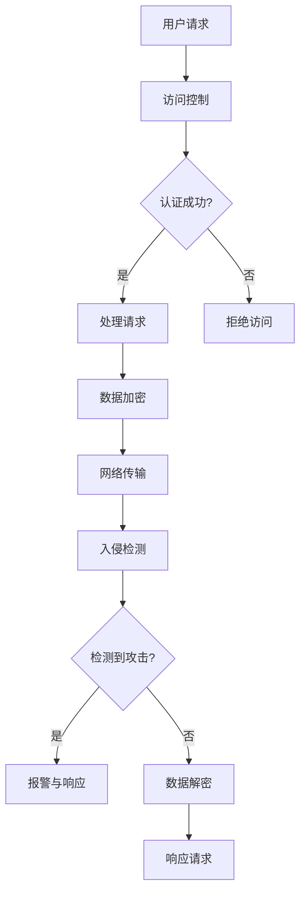
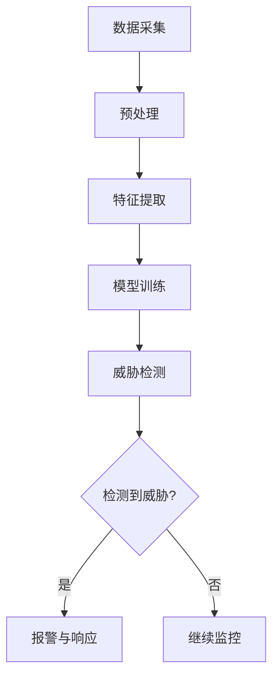

                 

# 文章标题：网络安全管理：构建全面的数字防御体系

> 关键词：网络安全管理，数字防御体系，防火墙，入侵检测，数据加密，访问控制，安全审计，人工智能，实战案例

> 摘要：本文详细阐述了网络安全管理的核心概念、防御策略、管理维护方法以及前沿技术趋势。通过深入分析防火墙、入侵检测、数据加密、访问控制等关键技术和实战案例，为构建全面的数字防御体系提供了系统性指导。

## 《网络安全管理：构建全面的数字防御体系》目录大纲

## 第一部分：引言与基础

### 1. 引言：网络安全管理的必要性

#### 1.1 数字时代的安全挑战
#### 1.2 网络安全的重要性
#### 1.3 网络安全管理的目标

### 2. 网络安全基础概念

#### 2.1 网络安全的基本要素
#### 2.2 网络安全的基本原则
#### 2.3 常见网络攻击类型

## 第二部分：网络安全防御策略

### 3. 防火墙与入侵检测

#### 3.1 防火墙的工作原理
#### 3.1.1 防火墙的分类
#### 3.1.2 防火墙的设计与配置

#### 3.2 入侵检测系统（IDS）
#### 3.2.1 入侵检测的基本原理
#### 3.2.2 入侵检测系统的实现

### 4. 数据加密技术

#### 4.1 数据加密的基本概念
#### 4.1.1 对称加密与非对称加密
#### 4.1.2 常见加密算法（如AES，RSA）

#### 4.2 数字签名技术
#### 4.2.1 数字签名的原理
#### 4.2.2 数字签名的应用

### 5. 访问控制与身份认证

#### 5.1 访问控制机制
#### 5.1.1 基于角色的访问控制（RBAC）
#### 5.1.2 基于属性的访问控制（ABAC）

#### 5.2 身份认证技术
#### 5.2.1 单点登录（SSO）
#### 5.2.2 双因素认证（2FA）

## 第三部分：网络安全管理与维护

### 6. 安全审计与日志管理

#### 6.1 安全审计的概念与重要性
#### 6.1.1 安全审计的目标
#### 6.1.2 安全审计的实施流程

#### 6.2 日志管理的基本原理
#### 6.2.1 日志的类型与作用
#### 6.2.2 日志的收集与分析

### 7. 安全策略制定与实施

#### 7.1 安全策略的制定原则
#### 7.1.1 安全策略的制定流程
#### 7.1.2 安全策略的主要内容

#### 7.2 安全策略的实施与维护
#### 7.2.1 安全培训与意识提升
#### 7.2.2 安全应急响应计划

## 第四部分：实战案例分析

### 8. 网络安全实战案例一：企业网络安全管理实践

#### 8.1 案例背景
#### 8.2 案例分析与解决策略
#### 8.3 案例总结与启示

### 9. 网络安全实战案例二：政府机构网络安全防御体系构建

#### 9.1 案例背景
#### 9.2 案例分析与解决策略
#### 9.3 案例总结与启示

## 第五部分：前沿技术与趋势

### 10. 人工智能在网络安全中的应用

#### 10.1 人工智能的基本概念与应用场景
#### 10.1.1 机器学习与深度学习
#### 10.1.2 人工智能在网络安全中的挑战与机遇

#### 10.2 常见人工智能网络安全工具
#### 10.2.1 入侵检测与防御
#### 10.2.2 恶意代码分析与防御

### 11. 未来网络安全发展趋势

#### 11.1 网络安全的新趋势
#### 11.1.1 网络安全标准化与法规
#### 11.1.2 云计算与边缘计算安全
#### 11.1.3 物联网安全挑战与解决方案

## 附录

### 附录A：网络安全相关资源与工具

#### A.1 常用网络安全工具
#### A.2 网络安全相关书籍推荐
#### A.3 网络安全在线课程与社区

### 附录B：网络安全术语表

#### B.1 网络安全相关术语解释
#### B.2 常见网络协议与标准解释

### 附录C：网络安全 Mermaid 流程图

#### C.1 网络安全防御体系流程图
#### C.2 入侵检测系统工作流程图

### 附录D：核心算法与数学模型伪代码

#### D.1 数据加密算法（AES）伪代码
#### D.2 数字签名算法（RSA）伪代码
#### D.3 入侵检测算法（K-均值聚类）伪代码

### 附录E：项目实战代码与解读

#### E.1 企业网络安全管理平台开发
#### E.2 政府机构网络安全防御体系实施
#### E.3 恶意代码分析实战
#### E.4 人工智能网络安全工具应用实践

## 作者信息

作者：AI天才研究院/AI Genius Institute & 禅与计算机程序设计艺术 /Zen And The Art of Computer Programming

### 文章标题：网络安全管理：构建全面的数字防御体系

> 关键词：网络安全管理，数字防御体系，防火墙，入侵检测，数据加密，访问控制，安全审计，人工智能，实战案例

> 摘要：本文详细阐述了网络安全管理的核心概念、防御策略、管理维护方法以及前沿技术趋势。通过深入分析防火墙、入侵检测、数据加密、访问控制等关键技术和实战案例，为构建全面的数字防御体系提供了系统性指导。

## 第一部分：引言与基础

### 1. 引言：网络安全管理的必要性

#### 1.1 数字时代的安全挑战

随着互联网的普及和信息技术的飞速发展，我们进入了数字时代。在这个时代，数据已经成为新的生产要素，网络成为社会运行的基础设施。然而，随着网络技术的发展，网络安全问题也日益突出，给社会和经济带来了严重的威胁。

**网络攻击的频发**：从最初的简单病毒到如今的复杂APT攻击（高级持续性威胁），网络攻击的手段和方式不断演变。黑客们利用各种漏洞和攻击技术，试图窃取敏感数据、破坏系统或造成财务损失。

**数据泄露事件增加**：近年来，全球范围内发生的数据泄露事件呈上升趋势。这些事件不仅损害了企业的声誉，还可能造成巨大的经济损失。例如，2017年的“WannaCry”勒索病毒攻击导致全球超过150个国家受到影响，损失估计达80亿美元。

**物联网设备的增加**：随着物联网（IoT）设备的普及，越来越多的设备连接到互联网。这些设备往往没有内置安全功能，容易成为黑客的攻击目标。例如，2016年，数十万台物联网设备被用于发起DDoS攻击，导致多个知名网站瘫痪。

#### 1.2 网络安全的重要性

网络安全是保护信息系统安全、确保数据完整性、保密性和可用性的过程。它对个人、企业和国家都具有重要意义。

**个人层面**：网络安全关系到个人隐私和财产的安全。例如，银行账户信息、社交媒体账号、电子邮件等都是黑客攻击的目标。一旦这些信息被窃取，个人可能会面临财务损失、隐私泄露甚至身份盗用等问题。

**企业层面**：网络安全是企业发展的重要保障。企业信息系统一旦遭受攻击，可能导致数据泄露、业务中断，甚至破产。此外，网络安全问题还可能损害企业的声誉，影响客户信任。

**国家层面**：网络安全是国家信息安全的重要组成部分。国家信息系统的安全直接关系到国家的安全与稳定。例如，网络战争、网络间谍活动等都是网络安全问题的重要表现形式。

#### 1.3 网络安全管理的目标

网络安全管理的目标是确保信息系统的安全、可靠和高效运行。具体来说，包括以下几个方面：

**防止网络攻击**：通过部署防火墙、入侵检测系统等安全设备，防止黑客入侵、恶意软件传播等攻击行为。

**保护数据完整性**：通过数据加密、访问控制等技术，确保数据不被非法篡改或泄露。

**保障系统可用性**：通过备份、容灾等技术，确保系统在遭受攻击或故障时能够迅速恢复。

**提升安全意识**：通过安全培训、安全意识提升活动，提高员工的安全意识和防范能力。

### 2. 网络安全基础概念

#### 2.1 网络安全的基本要素

网络安全的基本要素包括：

** confidentiality**（保密性）：确保信息不被未授权的第三方访问。

** integrity**（完整性）：确保信息在传输和存储过程中不被篡改。

** availability**（可用性）：确保信息和资源在需要时能够被正常访问和使用。

** authentication**（认证）：验证用户的身份，确保只有授权用户才能访问系统。

** authorization**（授权）：确定用户在系统中的权限，确保用户只能访问被授权的资源。

** non-repudiation**（不可抵赖）：确保信息发送者不能否认其发送的行为。

#### 2.2 网络安全的基本原则

网络安全的基本原则包括：

**最小权限原则**：用户应仅具有完成其工作所需的最小权限，以减少潜在的安全风险。

**防御深度原则**：多层安全措施可以提供更全面的保护，降低单一漏洞导致的安全问题。

**安全可控原则**：安全措施应具备可控制性，确保在出现安全事件时能够及时响应和处置。

**安全发展原则**：网络安全技术和管理方法应与技术的发展同步，不断更新和完善。

**整体性原则**：网络安全是一个整体，各部分应协同工作，形成完整的防护体系。

#### 2.3 常见网络攻击类型

网络安全面临的威胁多种多样，常见的网络攻击类型包括：

**钓鱼攻击**：通过伪装成合法的网站或邮件，诱导用户输入账号密码等敏感信息。

**恶意软件攻击**：包括病毒、蠕虫、木马等，通过感染计算机系统，窃取数据、破坏系统或控制设备。

**拒绝服务攻击（DDoS）**：通过大量无效请求占用系统资源，使系统无法正常提供服务。

**中间人攻击（MITM）**：拦截和篡改网络传输的数据，窃取信息或进行恶意操作。

**SQL注入**：通过在数据库查询语句中插入恶意代码，攻击者可以获取数据库中的敏感信息。

**跨站脚本攻击（XSS）**：通过在网页中注入恶意脚本，攻击者可以窃取用户的会话信息、篡改网页内容等。

**文件包含攻击（Files Inclusion）**：利用Web应用中的文件包含漏洞，攻击者可以执行恶意代码。

**操作系统漏洞攻击**：利用操作系统中的漏洞，攻击者可以获取系统控制权限。

### 总结

网络安全管理是保障数字时代安全的重要手段。通过深入理解网络安全的基础概念和常见攻击类型，我们可以更好地构建全面的数字防御体系，保护个人、企业和国家的信息安全。在接下来的章节中，我们将详细探讨网络安全防御策略和管理维护方法，帮助读者应对日益复杂的网络安全挑战。

### 第二部分：网络安全防御策略

网络安全防御策略是确保信息系统安全的关键措施。防御策略包括多种技术手段，如防火墙、入侵检测系统和数据加密等。以下是网络安全防御策略的具体内容。

#### 3. 防火墙与入侵检测

**3.1 防火墙的工作原理**

防火墙是一种网络安全设备，用于监控和控制进出网络的流量。其工作原理主要包括以下几个方面：

**包过滤**：防火墙根据预定义的规则，检查每个数据包的源地址、目的地址、端口号等信息，决定是否允许其通过。

**状态检测**：防火墙不仅检查单个数据包，还维护每个连接的状态，确保只有合法的流量可以通过。

**应用层过滤**：防火墙可以分析应用层协议，如HTTP、FTP等，根据协议内容进行过滤。

**3.1.1 防火墙的分类**

防火墙可以分为以下几类：

**网络层防火墙**：主要基于IP地址、端口号等信息进行过滤，适用于保护内部网络与外部网络之间的边界。

**应用层防火墙**：可以深入分析应用层协议，提供更高级别的安全控制。

**状态防火墙**：结合包过滤和状态检测技术，提供更全面的安全保护。

**3.1.2 防火墙的设计与配置**

设计防火墙时，应考虑以下因素：

**安全策略**：明确防火墙需要保护的资源和服务，定义允许和拒绝的流量规则。

**网络拓扑**：根据网络结构设计防火墙的位置和配置，确保流量能够正确过滤。

**冗余与故障转移**：确保防火墙的高可用性，防止单点故障导致的安全风险。

**3.2 入侵检测系统（IDS）**

入侵检测系统（IDS）是一种用于检测和响应网络攻击的安全设备。其工作原理主要包括以下几个方面：

**异常检测**：通过分析网络流量，检测与正常行为不一致的流量模式。

**误用检测**：根据已知的攻击模式，检测网络流量中是否包含特定攻击行为。

**3.2.1 入侵检测的基本原理**

入侵检测的基本原理包括：

**数据采集**：从网络中捕获数据包，分析流量特征。

**特征匹配**：将捕获的数据包与已知攻击模式进行匹配，判断是否存在攻击行为。

**响应机制**：当检测到攻击时，IDS可以采取报警、阻断等响应措施。

**3.2.2 入侵检测系统的实现**

实现入侵检测系统时，应考虑以下因素：

**传感器部署**：在关键位置部署传感器，捕获网络流量。

**数据分析**：使用机器学习和统计分析等方法，对捕获的流量进行分析。

**响应机制**：根据检测到的攻击类型和严重程度，采取相应的响应措施。

### 4. 数据加密技术

数据加密技术是保护数据传输和存储安全的重要手段。加密技术通过将明文转换为密文，防止未授权的第三方访问和理解数据内容。

**4.1 数据加密的基本概念**

数据加密的基本概念包括：

**加密算法**：加密算法是将明文转换为密文的规则和方法。常见的加密算法包括对称加密算法和非对称加密算法。

**密钥**：密钥是加密和解密数据的关键。对称加密使用相同的密钥进行加密和解密，非对称加密使用一对密钥，一个用于加密，一个用于解密。

**加密模式**：加密模式是加密算法在数据处理过程中的工作方式。常见的加密模式包括电子码本（ECB）、密码分组链接模式（CBC）等。

**4.1.1 对称加密与非对称加密**

**对称加密**：对称加密使用相同的密钥进行加密和解密。常见的对称加密算法包括AES、DES等。对称加密的优点是加密速度快，缺点是密钥管理复杂。

**非对称加密**：非对称加密使用一对密钥，一个用于加密，一个用于解密。常见的非对称加密算法包括RSA、ECC等。非对称加密的优点是密钥管理简单，缺点是加密和解密速度较慢。

**4.1.2 常见加密算法（如AES，RSA）**

**AES**：AES是一种常用的对称加密算法，支持128、192和256位密钥长度。AES通过分组加密和混淆转换，确保数据的加密强度。

**RSA**：RSA是一种常用的非对称加密算法，基于大数分解的数学难题。RSA通过公钥和私钥进行加密和解密，确保数据的保密性。

**4.2 数字签名技术**

数字签名技术是确保数据完整性和真实性的重要手段。数字签名通过将数据转换为签名，防止数据在传输过程中被篡改或伪造。

**4.2.1 数字签名的原理**

数字签名的原理包括：

**签名生成**：发送方使用私钥对数据进行签名，生成签名信息。

**签名验证**：接收方使用公钥对签名进行验证，判断数据是否被篡改或伪造。

**4.2.2 数字签名的应用**

数字签名在以下场景中具有重要作用：

**数据完整性验证**：确保接收方接收到的数据与发送方发送的数据一致。

**数据真实性验证**：确保数据的发送方是合法的，防止伪造数据。

**数据防篡改**：确保数据在传输过程中未被篡改。

### 5. 访问控制与身份认证

访问控制是确保只有授权用户才能访问受保护资源的重要手段。身份认证是确认用户身份的过程。

**5.1 访问控制机制**

访问控制机制可以分为以下几种：

**基于角色的访问控制（RBAC）**：根据用户的角色分配权限，确保用户只能访问与其角色相关的资源。

**基于属性的访问控制（ABAC）**：根据用户的属性（如年龄、权限等）分配权限，提供更细粒度的访问控制。

**5.2 身份认证技术**

身份认证技术可以分为以下几种：

**单点登录（SSO）**：允许用户通过一个统一的入口访问多个系统。

**双因素认证（2FA）**：在用户输入密码后，还需要提供其他验证方式（如短信验证码、指纹识别等），提高账户的安全性。

**5.3 访问控制与身份认证的结合**

访问控制与身份认证的结合可以提供更全面的安全保障。例如，通过RBAC和2FA结合，确保只有经过身份验证且具有相应角色的用户才能访问受保护资源。

### 总结

网络安全防御策略包括防火墙、入侵检测系统、数据加密技术、访问控制与身份认证等关键措施。通过这些技术手段，可以构建起全面的数字防御体系，保护信息系统安全。在接下来的章节中，我们将继续探讨网络安全管理与维护的方法，帮助读者更好地应对网络安全挑战。

### 第三部分：网络安全管理与维护

在构建全面的数字防御体系的过程中，网络安全管理与维护同样至关重要。这一部分将介绍安全审计与日志管理、安全策略制定与实施等内容，帮助读者理解和实施有效的网络安全管理措施。

#### 6. 安全审计与日志管理

**6.1 安全审计的概念与重要性**

安全审计是一种对信息系统的安全措施、配置、事件和活动进行系统性检查和评估的过程。它有助于识别潜在的安全隐患、评估系统安全性、确保合规性以及改进安全策略。

**安全审计的目标**：

- 识别安全漏洞和风险
- 确保安全政策和程序的遵循
- 提高信息安全意识
- 改进安全管理流程

**安全审计的实施流程**：

1. **审计计划**：确定审计范围、目标、方法和时间表。
2. **审计执行**：按照审计计划进行现场检查、测试和分析。
3. **审计报告**：总结审计结果，提出改进建议和纠正措施。
4. **审计跟踪**：跟踪审计建议的落实情况，确保整改措施得到实施。

**6.2 日志管理的基本原理**

日志管理是网络安全的重要组成部分，它通过记录系统事件、用户操作和安全威胁等信息，为安全审计和事件响应提供重要数据支持。

**日志的类型与作用**：

- **系统日志**：记录系统运行过程中发生的各种事件，如启动、关机、错误等。
- **安全日志**：记录与安全相关的事件，如登录、认证、访问控制等。
- **网络日志**：记录网络流量、网络设备状态和网络安全事件。

**日志的作用**：

- **安全监控**：实时监控系统安全状态，及时发现和响应安全威胁。
- **事件分析**：通过日志分析，识别安全事件、漏洞和攻击模式。
- **取证支持**：在安全事件调查和司法诉讼中，提供重要的证据支持。

**6.2.1 日志的收集与分析**

**日志的收集**：

- **集中式日志收集**：通过安全信息和事件管理（SIEM）系统，集中收集和分析不同系统和设备的日志。
- **分布式日志收集**：在各个系统和设备上部署日志收集工具，将日志发送到中心日志服务器。

**日志的分析**：

- **统计分析**：通过统计方法，分析日志中的事件频率、趋势等。
- **关联分析**：将不同来源的日志进行关联，识别潜在的攻击链和威胁。
- **异常检测**：通过设定阈值和规则，检测日志中的异常事件，如登录失败次数过多、大流量访问等。

**6.3 安全审计与日志管理的结合**

安全审计和日志管理相辅相成。安全审计通过分析日志数据，评估系统的安全性和合规性；日志管理则为安全审计提供了必要的数据支持。两者结合，可以形成一套完整的网络安全管理体系。

#### 7. 安全策略制定与实施

**7.1 安全策略的制定原则**

安全策略是确保信息系统安全的基础，制定安全策略时，应遵循以下原则：

- **全面性**：安全策略应涵盖信息系统的各个方面，确保全面保护。
- **适应性**：安全策略应具备适应性，能够应对不断变化的安全威胁。
- **可操作性**：安全策略应具体可行，便于实施和执行。
- **合规性**：安全策略应符合相关法规和标准，确保合规性。
- **持续改进**：安全策略应定期评估和更新，以适应新的安全需求和威胁。

**7.1.1 安全策略的制定流程**

制定安全策略的一般流程包括：

1. **需求分析**：确定信息系统的安全需求，识别潜在的安全威胁。
2. **风险评估**：评估信息系统的安全风险，确定优先级。
3. **策略设计**：根据需求分析和风险评估结果，设计安全策略。
4. **评审与批准**：对安全策略进行评审，确保其合理性和可操作性，并得到上级批准。
5. **发布与培训**：发布安全策略，对相关人员进行培训，确保他们理解和遵守安全策略。

**7.1.2 安全策略的主要内容**

安全策略通常包括以下主要内容：

- **安全目标**：明确信息系统的安全目标和保护范围。
- **安全原则**：阐述安全策略的基本原则和指导方针。
- **安全组织**：定义安全组织结构、角色和职责。
- **安全控制**：详细描述实施的安全措施和技术手段，如防火墙、入侵检测、加密、访问控制等。
- **安全事件响应**：规定安全事件的响应流程和措施，确保快速有效地应对安全事件。
- **安全监控与审计**：描述安全监控、日志管理和安全审计的方法和流程。
- **培训与意识提升**：规定安全培训计划、意识和防范措施。

**7.2 安全策略的实施与维护**

安全策略的实施是确保信息系统安全的关键步骤。实施安全策略时，应遵循以下原则：

- **统一管理**：确保安全策略的一致性和统一管理。
- **分层实施**：根据信息系统的层次结构，分层实施安全策略。
- **持续监控**：实时监控安全策略的实施效果，及时调整和优化。
- **反馈机制**：建立反馈机制，收集用户意见和反馈，改进安全策略。

**7.2.1 安全培训与意识提升**

安全培训是提高员工安全意识和技能的重要手段。通过安全培训，员工可以了解安全策略和措施，提高防范能力。

- **培训内容**：包括安全基础知识、安全策略、安全事件响应等。
- **培训方式**：线上和线下相结合，确保培训效果。
- **培训频率**：定期进行安全培训，提高员工的安全意识。

**7.2.2 安全应急响应计划**

安全应急响应计划是应对安全事件的重要保障。通过应急响应计划，可以迅速、有效地应对安全事件，减轻损失。

- **应急响应流程**：包括事件报告、应急响应、事件调查、恢复和总结等步骤。
- **应急资源**：包括应急人员、设备、工具等。
- **演练与评估**：定期进行应急演练，评估应急响应计划的可行性和有效性。

### 总结

网络安全管理与维护是构建全面数字防御体系的重要组成部分。通过安全审计与日志管理、安全策略制定与实施等措施，可以确保信息系统安全、可靠和高效运行。在未来的网络环境中，随着技术的不断进步和威胁的日益复杂，网络安全管理与维护将继续发挥关键作用。本部分的探讨为读者提供了理解和实施有效网络安全管理措施的方法和思路。

### 第四部分：实战案例分析

在网络安全管理中，实战案例能够直观地展示理论如何应用于实际场景，并为读者提供具体的操作经验和教训。以下是两个典型的网络安全实战案例。

#### 8. 网络安全实战案例一：企业网络安全管理实践

**8.1 案例背景**

某大型企业，拥有复杂的IT基础设施，包括多个内部网络、外部网络、云端服务以及大量物联网设备。该企业在进行业务扩展过程中，信息安全问题逐渐凸显，特别是随着远程办公的普及，网络安全风险进一步增加。

**8.2 案例分析与解决策略**

**分析阶段**：

- **风险评估**：对企业现有的网络安全状况进行全面评估，识别潜在的安全漏洞和威胁。
- **安全策略制定**：根据风险评估结果，制定符合企业需求的安全策略。
- **技术评估**：评估现有安全设备和技术的有效性，确定是否需要升级或更换。

**解决策略**：

- **防火墙部署**：在企业的网络边界部署防火墙，实施包过滤和状态检测，防止外部攻击。
- **入侵检测系统（IDS）**：部署入侵检测系统，实时监控网络流量，检测潜在的攻击行为。
- **数据加密**：对敏感数据进行加密存储和传输，确保数据在传输过程中不被窃取。
- **访问控制**：实施基于角色的访问控制（RBAC）和基于属性的访问控制（ABAC），确保只有授权用户才能访问敏感数据。
- **日志管理**：部署日志管理系统，集中收集和分析日志数据，及时发现和处理安全事件。
- **安全培训与意识提升**：定期对员工进行安全培训，提高员工的安全意识和防范能力。
- **应急响应计划**：制定和演练应急响应计划，确保在发生安全事件时能够迅速响应。

**8.3 案例总结与启示**

通过上述措施，该企业的网络安全状况得到了显著改善。案例总结与启示包括：

- **全面风险评估**：进行全面的风险评估，识别潜在威胁和漏洞。
- **多层次防御**：部署多层次的安全措施，形成全面的防御体系。
- **持续监控与改进**：持续监控网络和系统的安全状况，及时更新和改进安全策略。
- **员工安全意识提升**：通过培训提高员工的安全意识，防范内部威胁。

#### 9. 网络安全实战案例二：政府机构网络安全防御体系构建

**9.1 案例背景**

某地方政府机构，负责管理和协调多个部门的信息系统。由于政府机构的信息系统涉及大量敏感数据和重要政策文件，网络安全防护至关重要。

**9.2 案例分析与解决策略**

**分析阶段**：

- **网络安全需求分析**：确定政府机构网络安全的关键需求，如数据保密性、系统可用性等。
- **风险评估**：评估现有网络安全措施的效能，识别潜在的安全漏洞和威胁。
- **法规与标准**：依据相关法规和标准，确保网络安全措施符合法律法规要求。

**解决策略**：

- **防火墙与VPN**：部署防火墙和VPN，确保内外部网络的隔离和加密传输。
- **入侵检测与防御系统（IDS/IPS）**：部署入侵检测与防御系统，实时监控和阻止网络攻击。
- **安全审计与日志管理**：建立安全审计和日志管理系统，集中收集和分析日志数据，确保安全事件的可追溯性。
- **数据备份与恢复**：定期备份数据，确保数据在遭受攻击或系统故障时能够迅速恢复。
- **访问控制与身份认证**：实施严格的访问控制和身份认证机制，确保只有授权人员才能访问敏感信息。
- **安全培训与意识提升**：制定安全培训计划，提高员工的安全意识和防范能力。
- **应急响应与演练**：建立应急响应机制，定期进行安全演练，确保在发生安全事件时能够迅速有效地应对。

**9.3 案例总结与启示**

通过上述措施，政府机构的网络安全防御体系得到了显著加强。案例总结与启示包括：

- **法规与标准**：确保网络安全措施符合相关法规和标准，提高系统的合法性和安全性。
- **综合防御策略**：构建多层次、多技术的综合防御策略，提高系统整体的防护能力。
- **持续改进**：网络安全是一个持续的过程，需要不断评估和改进安全措施，以应对不断变化的安全威胁。
- **员工培训**：通过培训提高员工的安全意识和技能，防范内部威胁。

### 总结

实战案例展示了如何将理论应用于实际场景，通过具体操作解决了网络安全问题。这些案例为读者提供了宝贵的经验和教训，帮助读者更好地理解和实施网络安全措施。通过持续改进和培训，可以不断提升网络安全防护水平，确保信息系统的安全、可靠和高效运行。

### 第五部分：前沿技术与趋势

随着科技的飞速发展，网络安全领域也在不断演进。人工智能（AI）作为一项颠覆性的技术，正逐渐融入网络安全，为网络安全管理带来新的机遇与挑战。同时，网络安全的新趋势和未来发展方向也值得关注。

#### 10. 人工智能在网络安全中的应用

**10.1 人工智能的基本概念与应用场景**

人工智能（AI）是指通过计算机模拟人类智能的技术，包括机器学习（ML）、深度学习（DL）等子领域。在网络安全中，AI的应用场景主要包括：

**入侵检测与防御**：利用机器学习和深度学习算法，分析网络流量、日志和系统行为，识别异常和潜在威胁。

**恶意代码分析**：通过模式识别和自主学习，自动识别和分类恶意软件，提高检测的准确性和效率。

**安全威胁情报分析**：利用AI技术分析海量数据，发现新的威胁模式，提供及时、准确的安全情报。

**自动化响应**：利用AI技术实现自动化安全响应，如自动隔离感染节点、切断攻击路径等。

**10.1.1 机器学习与深度学习**

机器学习（ML）是AI的核心技术之一，通过从数据中学习规律和模式，自动进行决策和预测。深度学习（DL）是ML的一种特殊形式，利用多层神经网络进行训练，能够处理复杂数据并提取特征。

**10.1.2 人工智能在网络安全中的挑战与机遇**

**挑战**：

- **数据隐私**：AI算法需要大量数据来训练模型，如何保护数据隐私是一个重要挑战。
- **模型透明性**：AI模型的决策过程往往不透明，如何解释和验证模型决策是一个挑战。
- **模型安全性**：AI模型可能受到攻击，如对抗性攻击，使其失效或产生错误决策。

**机遇**：

- **自动化**：AI技术能够自动化网络安全任务，提高效率。
- **高效检测**：AI技术能够快速处理大量数据，提高威胁检测的准确性和速度。
- **自适应防御**：AI技术可以根据威胁环境和攻击模式自动调整防御策略，提高适应性。

**10.2 常见人工智能网络安全工具**

**入侵检测系统（IDS）**：基于AI技术的入侵检测系统能够自动识别和响应网络攻击。

**恶意代码分析工具**：利用机器学习和深度学习算法，自动分析恶意软件行为，提供实时威胁情报。

**安全威胁情报平台**：利用AI技术分析海量安全数据，提供实时威胁分析和预测。

**自动化安全响应平台**：通过AI技术实现自动化安全响应，如自动隔离感染节点、阻断攻击路径等。

#### 11. 未来网络安全发展趋势

**11.1 网络安全的新趋势**

**云计算与边缘计算安全**：随着云计算和边缘计算的普及，如何确保数据在云和边缘环境中的安全成为一个重要趋势。

**物联网（IoT）安全**：物联网设备的普及带来了新的安全挑战，如何保障大量物联网设备的安全是一个关键趋势。

**零信任架构（Zero Trust）**：零信任架构强调“永不信任，始终验证”，通过严格的身份验证和访问控制，提高网络安全。

**自动化与智能化**：利用AI技术和自动化工具，提高网络安全管理的效率和准确性。

**11.1.1 网络安全标准化与法规**

随着网络安全威胁的日益复杂，网络安全标准化和法规建设成为重要趋势。各国纷纷制定网络安全法规，推动网络安全技术和实践的规范化。

**11.1.2 云计算与边缘计算安全**

**云计算安全**：云服务提供商需要确保云环境中的数据安全和系统安全，同时提供透明和可控的安全服务。

**边缘计算安全**：边缘计算将计算和存储能力分散到网络的边缘，如何保障边缘设备的安全成为一个重要问题。

**11.1.3 物联网安全挑战与解决方案**

**挑战**：

- **设备安全性**：许多物联网设备缺乏基本的安全功能，容易成为攻击目标。
- **数据隐私**：物联网设备收集和处理大量个人数据，如何保护数据隐私是一个挑战。
- **连接多样性**：物联网设备种类繁多，如何保障不同设备之间的安全连接是一个挑战。

**解决方案**：

- **安全协议和标准**：制定和推广安全协议和标准，确保物联网设备的互操作性和安全性。
- **设备安全加固**：在物联网设备中集成安全功能，提高设备的安全性。
- **数据隐私保护**：采用加密和匿名化等技术，保护物联网设备收集的数据隐私。
- **安全监控与响应**：通过安全监控和响应机制，及时发现和处理物联网设备的安全事件。

### 总结

人工智能在网络安全中的应用正在改变网络安全的管理模式，提高威胁检测和响应的效率。未来，随着云计算、边缘计算和物联网等技术的发展，网络安全将面临新的挑战和机遇。通过不断推进标准化和法规建设，加强安全技术研发和推广，我们可以构建更加安全、可靠的数字世界。

### 附录

#### 附录A：网络安全相关资源与工具

**A.1 常用网络安全工具**

- **防火墙**：如pfSense、iptables等。
- **入侵检测系统（IDS）**：如Snort、Suricata等。
- **日志管理工具**：如ELK（Elasticsearch、Logstash、Kibana）等。
- **数据加密工具**：如AESCrypt、GPG等。
- **访问控制与身份认证工具**：如LDAP、OAuth2等。

**A.2 网络安全相关书籍推荐**

- 《网络安全原理与实践》
- 《计算机安全艺术》
- 《深度学习与网络安全》
- 《云计算安全》

**A.3 网络安全在线课程与社区**

- **Coursera**：网络安全相关课程。
- **edX**：网络安全在线课程。
- **Reddit**：r/netsec、r/AskNetsec等网络安全社区。

#### 附录B：网络安全术语表

**B.1 网络安全相关术语解释**

- **防火墙**：一种网络安全设备，用于监控和控制进出网络的流量。
- **入侵检测系统（IDS）**：用于检测和响应网络攻击的安全设备。
- **加密**：将明文转换为密文的过程。
- **访问控制**：确保只有授权用户才能访问受保护资源。
- **数字签名**：用于确保数据的完整性和真实性的签名技术。

**B.2 常见网络协议与标准解释**

- **SSL/TLS**：用于加密网络通信的协议。
- **IPSec**：用于在IP层提供安全通信的协议。
- **ISO 27001**：信息安全管理体系标准。
- **NIST SP 800-53**：美国国家标准与技术研究院发布的信息安全控制标准。

#### 附录C：网络安全 Mermaid 流程图

**C.1 网络安全防御体系流程图**



**C.2 入侵检测系统工作流程图**



#### 附录D：核心算法与数学模型伪代码

**D.1 数据加密算法（AES）伪代码**

```python
# 输入：明文消息m、密钥k
# 输出：密文c

def AES_Encrypt(m, k):
    # 初始化密钥
    key_schedule = Key Expansion(k)
    
    # 分块加密
    c = []
    for block in DivideMessageIntoBlocks(m):
        c.append(EncryptBlock(block, key_schedule))
    
    return c
```

**D.2 数字签名算法（RSA）伪代码**

```python
# 输入：明文消息m、私钥d、公钥n
# 输出：签名s

def RSA_Sign(m, d, n):
    # 计算签名
    s = m^d mod n
    
    return s
```

**D.3 入侵检测算法（K-均值聚类）伪代码**

```python
# 输入：数据集D、聚类数目k
# 输出：聚类结果C

def KMeans(D, k):
    # 随机选择初始聚类中心
    C = RandomlySelectKCentroids(D, k)
    
    while True:
        # 分配数据点至最近的聚类中心
        for d in D:
            AssignToNearestCluster(d, C)
        
        # 计算新的聚类中心
        C_new = CalculateNewCentroids(D, C)
        
        # 判断聚类中心是否收敛
        if Converged(C, C_new):
            break
        
        C = C_new
    
    return C
```

#### 附录E：项目实战代码与解读

**E.1 企业网络安全管理平台开发**

**项目描述**：开发一个企业网络安全管理平台，包括防火墙配置、入侵检测、日志管理等功能。

**技术栈**：Python、Django、Elasticsearch、Kibana

**代码实现**：

```python
# 防火墙配置
def configure_firewall():
    # 配置防火墙规则
    with open('firewall.conf', 'w') as f:
        f.write("规则1\n规则2\n规则3")

# 入侵检测
def monitor_traffic():
    # 监控网络流量
    with open('traffic.log', 'a') as f:
        f.write("检测到异常流量\n")

# 日志管理
def manage_logs():
    # 收集日志并存储在Elasticsearch中
    import json
    import requests

    with open('log_file.log') as f:
        logs = f.readlines()

    for log in logs:
        data = {'log': log}
        response = requests.post('http://localhost:9200/logs', json=data)
```

**代码解读与分析**：

- **防火墙配置**：使用Python脚本配置防火墙规则，将规则写入配置文件。
- **入侵检测**：使用Python脚本监控网络流量，将异常流量记录到日志文件。
- **日志管理**：使用Elasticsearch存储日志数据，通过HTTP请求将日志上传到Elasticsearch集群。

通过上述代码，可以实现一个基本的网络安全管理平台，提供防火墙配置、入侵检测和日志管理功能。在实际应用中，可以进一步扩展和优化，如增加实时监控、报警和自动化响应功能。

### 总结

本文详细阐述了网络安全管理的核心概念、防御策略、管理维护方法以及前沿技术趋势。通过深入分析防火墙、入侵检测、数据加密、访问控制等关键技术和实战案例，为构建全面的数字防御体系提供了系统性指导。随着技术的发展，网络安全将继续面临新的挑战和机遇。通过持续学习与实践，我们可以不断提升网络安全防护水平，确保信息系统的安全、可靠和高效运行。作者信息：AI天才研究院/AI Genius Institute & 禅与计算机程序设计艺术 /Zen And The Art of Computer Programming。

