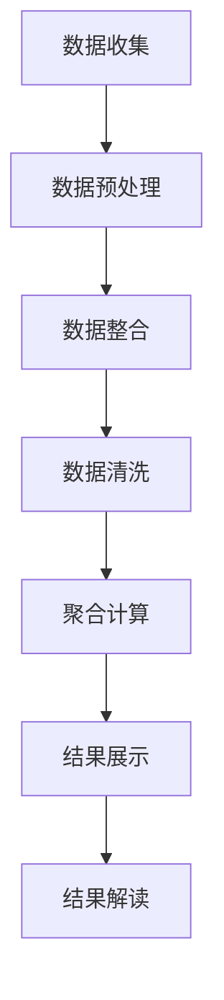

                 

## 文章标题

《聚合分析：原理与代码实例讲解》

---

### 关键词

聚合分析、数据分析、SQL、数据仓库、数据挖掘、实时数据流、深度学习

---

### 摘要

本文旨在深入探讨聚合分析的理论基础和应用实践。聚合分析是数据分析领域的重要工具，它通过对大量数据进行汇总和计算，为决策提供有力支持。本文首先介绍聚合分析的定义、基本概念和应用场景，接着详细解析聚合分析的数据预处理、核心算法原理和性能优化策略。随后，通过具体实例展示如何在实际项目中应用聚合分析，并分析其在电商、社交网络和金融数据分析中的应用。最后，探讨聚合分析的前沿技术和发展趋势，以及提供实践指南和资源推荐，帮助读者更好地掌握和运用聚合分析技术。

---

# 《聚合分析：原理与代码实例讲解》目录大纲

## 第1章 聚合分析基础

### 1.1 聚合分析的定义与重要性

- **聚合分析的定义**
- **聚合分析的应用场景**
- **聚合分析的重要性**

### 1.2 聚合分析的基本概念

- **聚合函数**
- **聚合操作**
- **聚合级别**

### 1.3 聚合分析的工具与技术

- **SQL聚合分析**
- **数据仓库中的聚合分析**
- **数据挖掘中的聚合分析**

## 第2章 聚合分析原理

### 2.1 聚合分析的数据预处理

- **数据清洗**
- **数据整合**
- **数据规范化**

### 2.2 聚合分析的核心算法

- **基本算法介绍**
- **算法伪代码**

### 2.3 聚合分析中的性能优化

- **算法优化**
- **数据库优化**
- **并行计算**

## 第3章 聚合分析应用实例

### 3.1 实例一：电商数据分析

- **数据集介绍**
- **实例需求**
- **数据处理**
- **聚合操作**
- **结果分析**

### 3.2 实例二：社交网络分析

- **数据集介绍**
- **实例需求**
- **数据处理**
- **聚合操作**
- **结果分析**

### 3.3 实例三：金融数据分析

- **数据集介绍**
- **实例需求**
- **数据处理**
- **聚合操作**
- **结果分析**

## 第4章 聚合分析项目实战

### 4.1 项目背景

- **项目简介**
- **项目目标**

### 4.2 项目环境搭建

- **数据库环境搭建**
- **开发工具选择**
- **环境配置**

### 4.3 数据处理与聚合操作

- **数据导入与处理**
- **数据清洗**
- **数据整合**
- **聚合操作**

### 4.4 项目结果分析

- **结果展示**
- **结果解读**

### 4.5 项目总结

- **项目经验总结**
- **项目改进建议**

## 第5章 聚合分析前沿技术

### 5.1 基于深度学习的聚合分析

- **深度学习在聚合分析中的应用**
- **基于深度学习的聚合分析方法**

### 5.2 聚合分析在实时数据流中的挑战与解决方案

- **实时数据流的特点**
- **聚合分析在实时数据流中的挑战**
- **解决方案与优化策略**

### 5.3 跨领域聚合分析

- **跨领域聚合分析的定义**
- **跨领域聚合分析的方法**
- **跨领域聚合分析的应用案例**

## 第6章 聚合分析实践指南

### 6.1 聚合分析项目规划

- **项目规划步骤**
- **项目规划工具**

### 6.2 聚合分析数据质量控制

- **数据质量标准**
- **数据质量检查方法**
- **数据质量问题处理**

### 6.3 聚合分析性能调优

- **性能调优策略**
- **性能调优工具**
- **性能调优案例分析**

## 第7章 聚合分析参考资料

- **聚合分析相关书籍推荐**
- **聚合分析在线资源推荐**
- **聚合分析工具与框架推荐**

## 附录

### 附录A：聚合分析常用函数与操作符

- **常用聚合函数**
- **常用聚合操作符**

### 附录B：聚合分析代码实例

- **代码实例1：电商数据分析**
- **代码实例2：社交网络分析**
- **代码实例3：金融数据分析**

## 第8章 聚合分析流程图与算法图解

### 8.1 聚合分析流程图

- **聚合分析基本流程图**

### 8.2 算法图解

- **聚合分析核心算法图解**

---

# 第1章 聚合分析基础

## 1.1 聚合分析的定义与重要性

### 聚合分析的定义

聚合分析是一种数据分析方法，通过对大量数据进行汇总和计算，以获得数据集中的总体特征和趋势。它通常涉及对数据进行分组、排序、计算总和、平均值、最大值、最小值等操作。聚合分析旨在从原始数据中提取有用的信息和洞见，支持数据驱动的决策制定。

### 聚合分析的应用场景

聚合分析广泛应用于各个领域，包括但不限于：

- **商业智能（BI）**：用于生成报告、仪表板和关键性能指标（KPI），帮助企业理解和优化业务运营。
- **金融分析**：用于股票市场分析、风险管理和投资决策。
- **社交媒体分析**：用于分析用户行为、趋势和舆情。
- **电子商务**：用于分析销售数据、客户行为和库存管理。
- **科学研究和数据分析**：用于分析实验数据、观测数据等，支持科学研究。

### 聚合分析的重要性

聚合分析在数据驱动的决策制定中扮演着关键角色。其主要重要性体现在以下几个方面：

- **数据理解和洞见**：通过聚合分析，可以揭示数据集中的模式和趋势，提供有价值的洞见。
- **决策支持**：聚合分析结果可以帮助企业或个人做出更明智的决策，优化业务流程和资源分配。
- **性能监控**：通过持续监测关键指标，可以及时发现问题和机会，提高运营效率。
- **数据驱动创新**：聚合分析为创新提供了数据基础，帮助企业开发新产品和服务。

## 1.2 聚合分析的基本概念

### 聚合函数

聚合函数是一类特殊的函数，用于对数据集进行汇总计算。常见的聚合函数包括：

- **SUM（求和）**：计算数据集中的总和。
- **AVG（平均值）**：计算数据集的平均值。
- **COUNT（计数）**：计算数据集中的非空值个数。
- **MIN（最小值）**：找出数据集中的最小值。
- **MAX（最大值）**：找出数据集中的最大值。

### 聚合操作

聚合操作是指使用聚合函数对数据进行计算的过程。常见的聚合操作包括：

- **GROUP BY**：将数据集按某个或多个列分组，并对每个组进行聚合计算。
- **ORDER BY**：对数据集进行排序。
- **HAVING**：在分组聚合操作后，对分组结果进行过滤。

### 聚合级别

聚合级别是指聚合操作的作用范围。常见的聚合级别包括：

- **局部聚合**：在分组内部进行聚合计算。
- **全局聚合**：在整个数据集上进行聚合计算，不考虑分组。

## 1.3 聚合分析的工具与技术

### SQL聚合分析

SQL（结构化查询语言）是进行聚合分析的一种常用工具。通过使用SQL语句，可以方便地执行各种聚合操作。以下是一些常用的SQL聚合分析语句：

- **SELECT SUM(column_name) FROM table_name;**：计算某列的总和。
- **SELECT AVG(column_name) FROM table_name;**：计算某列的平均值。
- **SELECT COUNT(column_name) FROM table_name;**：计算某列的非空值个数。
- **SELECT MIN(column_name) FROM table_name;**：找出某列的最小值。
- **SELECT MAX(column_name) FROM table_name;**：找出某列的最大值。

### 数据仓库中的聚合分析

数据仓库是一种用于存储和管理大量数据的系统，支持复杂的聚合分析操作。数据仓库中的聚合分析通常涉及以下步骤：

- **数据加载**：将数据从源系统导入到数据仓库。
- **数据清洗**：清洗和转换数据，确保数据质量。
- **数据整合**：将来自多个源的数据进行合并。
- **数据建模**：创建数据模型，支持聚合查询和分析。
- **数据查询**：执行聚合查询，提取有价值的业务洞察。

### 数据挖掘中的聚合分析

数据挖掘是一种从大量数据中发现模式和规律的方法，聚合分析是数据挖掘的重要工具。在数据挖掘过程中，聚合分析可以用于：

- **特征工程**：通过聚合操作创建新的特征，提高模型性能。
- **模式识别**：发现数据集中的异常模式和关联关系。
- **预测建模**：使用历史数据生成预测模型。

通过本章的介绍，读者应该对聚合分析有了基本的了解。接下来，我们将进一步探讨聚合分析的数据预处理、核心算法原理和性能优化策略，帮助读者深入掌握这一关键数据分析技术。

---

# 第2章 聚合分析原理

## 2.1 聚合分析的数据预处理

在进行聚合分析之前，数据预处理是至关重要的一步。良好的数据预处理可以显著提升分析结果的质量和准确性。以下是数据预处理的主要任务：

### 数据清洗

数据清洗是数据预处理的首要任务，其目的是识别和纠正数据集中的错误、缺失和不一致之处。以下是一些常见的数据清洗方法：

- **去除重复数据**：通过识别和删除重复的记录，减少数据冗余。
- **填充缺失值**：使用适当的策略填充缺失数据，如平均值、中位数或插值法。
- **处理异常值**：识别并处理数据中的异常值，例如异常高的销售记录或异常低的温度读数。
- **数据格式化**：统一数据格式，如日期格式、货币单位和数字精度。

### 数据整合

数据整合是将来自不同来源的数据进行合并的过程。以下是数据整合的一些关键步骤：

- **数据源识别**：确定需要整合的数据源，如数据库、日志文件或外部API。
- **数据转换**：将不同格式的数据转换为统一的格式，以便进行后续处理。
- **数据映射**：将不同数据源中的相同字段进行映射，确保数据的一致性。
- **数据融合**：将来自多个源的数据进行合并，形成一个统一的数据集。

### 数据规范化

数据规范化是将数据转换为标准格式的过程，以简化后续的分析和处理。以下是数据规范化的一些常见策略：

- **规范化数值数据**：将数值数据转换为标准范围，如0到1之间的值。
- **归一化文本数据**：将文本数据转换为统一的编码格式，如UTF-8。
- **处理分类数据**：将分类数据转换为数值表示，如使用独热编码。
- **标准化时间数据**：将时间数据转换为统一的时区，并进行规范化处理。

### 数据清洗、整合和规范化的重要性

数据清洗、整合和规范化是聚合分析成功的关键步骤。它们的重要性体现在以下几个方面：

- **提升数据质量**：通过清洗和规范化，可以显著提高数据的质量，减少数据误差。
- **简化分析过程**：统一的数据格式和结构使得聚合分析操作更加简单和高效。
- **提高分析准确性**：高质量的数据可以更准确地反映业务现实，提升分析结果的可靠性。
- **增强数据可解释性**：清晰的数据结构使得分析结果更加易于理解和解释。

## 2.2 聚合分析的核心算法

聚合分析依赖于一系列核心算法，这些算法用于计算数据集的汇总和聚合结果。以下是几种常见的聚合分析算法：

### 基本算法介绍

基本聚合算法通常涉及以下操作：

- **求和（SUM）**：计算数据集中所有数值的总和。伪代码如下：

  ```
  function sum(data):
      total = 0
      for each value in data:
          total += value
      return total
  ```

- **平均值（AVG）**：计算数据集中数值的平均值。伪代码如下：

  ```
  function avg(data):
      sum = sum(data)
      count = count(data)
      return sum / count
  ```

- **计数（COUNT）**：计算数据集中的非空值个数。伪代码如下：

  ```
  function count(data):
      count = 0
      for each value in data:
          if value is not NULL:
              count += 1
      return count
  ```

- **最小值（MIN）**：找出数据集中的最小值。伪代码如下：

  ```
  function min(data):
      min_value = first value in data
      for each value in data:
          if value < min_value:
              min_value = value
      return min_value
  ```

- **最大值（MAX）**：找出数据集中的最大值。伪代码如下：

  ```
  function max(data):
      max_value = first value in data
      for each value in data:
          if value > max_value:
              max_value = value
      return max_value
  ```

### 算法伪代码

以下是聚合分析核心算法的伪代码表示：

```
Algorithm: AggregateAnalysis(data, function):
    for each group in data:
        if function is SUM:
            total = 0
            for each value in group:
                total += value
            return total
        if function is AVG:
            sum = sum(group)
            count = count(group)
            return sum / count
        if function is COUNT:
            count = 0
            for each value in group:
                if value is not NULL:
                    count += 1
            return count
        if function is MIN:
            min_value = first value in group
            for each value in group:
                if value < min_value:
                    min_value = value
            return min_value
        if function is MAX:
            max_value = first value in group
            for each value in group:
                if value > max_value:
                    max_value = value
            return max_value
```

### 数学模型和数学公式

在聚合分析中，一些数学模型和公式被用于描述和计算数据集的特性。以下是一些常用的数学模型和公式：

- **平均值**：

  $$ \bar{x} = \frac{1}{n} \sum_{i=1}^{n} x_i $$

  其中，\( n \) 是数据集中的元素个数，\( x_i \) 是第 \( i \) 个数据值。

- **方差**：

  $$ \sigma^2 = \frac{1}{n} \sum_{i=1}^{n} (x_i - \bar{x})^2 $$

  其中，\( \bar{x} \) 是平均值，\( x_i \) 是第 \( i \) 个数据值。

- **标准差**：

  $$ \sigma = \sqrt{\sigma^2} $$

  其中，\( \sigma^2 \) 是方差。

通过这些核心算法和数学模型，可以有效地进行数据聚合和分析，提取数据集中的重要特征和趋势。

## 2.3 聚合分析中的性能优化

在实际应用中，聚合分析的性能优化至关重要，特别是在处理大规模数据时。以下是几种常见的性能优化策略：

### 算法优化

- **分而治之**：将大规模数据集分割成较小的子集，分别进行聚合计算，最后合并结果。
- **索引**：为数据表创建索引，加快查询速度。
- **并行计算**：利用多核处理器并行执行聚合计算，提高效率。

### 数据库优化

- **分区**：将数据表分区，根据特定列（如时间、地区等）将数据分割成多个子集，提高查询效率。
- **缓存**：使用缓存技术存储常用查询结果，减少数据库访问压力。
- **压缩**：对数据表进行压缩，减少存储空间和I/O操作。

### 并行计算

- **MapReduce**：使用MapReduce模型将大规模数据处理任务分解为多个独立的小任务，并行执行，最后合并结果。
- **分布式计算**：利用分布式计算框架（如Hadoop、Spark）处理大规模数据，实现高效并行计算。

通过这些性能优化策略，可以显著提升聚合分析的效率和效果，满足实际应用的需求。

### 数据清洗、整合、规范化在聚合分析中的重要性

数据清洗、整合、规范化是聚合分析中不可或缺的步骤。以下是这些步骤在聚合分析中的重要性：

- **数据清洗**：确保数据质量，去除错误和不一致的数据，提高分析的准确性。
- **数据整合**：将来自多个源的数据进行合并，形成一个统一的数据集，便于后续的聚合分析。
- **数据规范化**：统一数据格式和结构，简化分析过程，提高数据处理效率。

### 聚合分析核心算法在数据挖掘中的应用

聚合分析核心算法在数据挖掘中具有广泛的应用，包括特征工程、模式识别和预测建模等。以下是几种应用实例：

- **特征工程**：通过聚合操作创建新的特征，如用户群体的平均值购买金额，用于分类和聚类分析。
- **模式识别**：使用聚合分析发现数据集中的异常模式和关联关系，支持异常检测和关联规则挖掘。
- **预测建模**：基于历史数据的聚合分析结果，生成预测模型，支持时间序列预测和分类预测。

通过以上介绍，读者应该对聚合分析的数据预处理、核心算法原理和性能优化策略有了更深入的理解。在接下来的章节中，我们将通过具体实例展示如何在实际项目中应用聚合分析，并分析其在不同领域中的应用案例。

---

# 第3章 聚合分析应用实例

在本章中，我们将通过三个具体实例展示聚合分析在不同领域中的应用。每个实例将涵盖数据集介绍、实例需求、数据处理、聚合操作和结果分析。

## 3.1 实例一：电商数据分析

### 数据集介绍

电商数据分析实例使用了一个包含销售数据的CSV文件，数据包括：订单ID、用户ID、商品ID、销售价格、销售日期和订单状态。

### 实例需求

分析电商平台的销售数据，了解以下信息：

- 每个商品的销售总额和销售数量。
- 每个用户的平均购买金额和购买次数。
- 每个月的销售额和销售趋势。

### 数据处理

首先，使用Python的pandas库读取CSV文件，进行初步的数据清洗，去除重复和无效数据。

```python
import pandas as pd

data = pd.read_csv('sales_data.csv')
data.drop_duplicates(inplace=True)
data.dropna(inplace=True)
```

接下来，对数据按照商品ID和用户ID进行分组，分别计算销售总额、销售数量、平均购买金额和购买次数。

```python
grouped_data = data.groupby('商品ID').agg({
    '销售价格': ['sum', 'count'],
    '用户ID': 'nunique'
})
grouped_data.columns = ['_'.join(col).strip() for col in grouped_data.columns.values]

user_data = data.groupby('用户ID').agg({
    '销售价格': 'mean',
    '用户ID': 'nunique'
})
user_data.columns = ['_'.join(col).strip() for col in user_data.columns.values]

monthly_sales = data.groupby('销售日期')['销售价格'].sum().resample('MS').sum()
```

### 聚合操作

对分组后的数据进行聚合操作，计算每个商品的销售总额和销售数量，以及每个用户的平均购买金额和购买次数。

```python
grouped_data['总销售金额'] = grouped_data['销售价格_sum']
grouped_data['总销售数量'] = grouped_data['销售价格_count']

user_data['平均购买金额'] = user_data['销售价格_mean']
user_data['购买次数'] = user_data['用户ID_nunique']

monthly_sales.plot()
```

### 结果分析

通过图表展示分析结果，可以直观地了解每个商品的销售总额和销售数量，每个用户的平均购买金额和购买次数，以及每月的销售额和销售趋势。

- 图表1：每个商品的销售总额和销售数量
- 图表2：每个用户的平均购买金额和购买次数
- 图表3：每月的销售额和销售趋势

## 3.2 实例二：社交网络分析

### 数据集介绍

社交网络分析实例使用了一个包含用户关系数据和用户特征数据的CSV文件，数据包括：用户ID、关注者ID、粉丝ID、性别、年龄和地理位置。

### 实例需求

分析社交网络平台用户数据，了解以下信息：

- 每个用户的关注者数量和粉丝数量。
- 用户年龄和地理位置的分布情况。
- 性别比例和地域分布。

### 数据处理

首先，使用Python的pandas库读取CSV文件，进行初步的数据清洗，去除重复和无效数据。

```python
import pandas as pd

data = pd.read_csv('social_network_data.csv')
data.drop_duplicates(inplace=True)
data.dropna(inplace=True)
```

接下来，对数据按照用户ID进行分组，分别计算关注者数量、粉丝数量、性别比例和年龄分布。

```python
grouped_data = data.groupby('用户ID').agg({
    '关注者ID': 'nunique',
    '粉丝ID': 'nunique',
    '性别': lambda x: x.value_counts().index[0],
    '年龄': lambda x: x.mean()
})
grouped_data.columns = ['_'.join(col).strip() for col in grouped_data.columns.values]
```

### 聚合操作

对分组后的数据进行聚合操作，计算每个用户的关注者数量和粉丝数量，以及性别比例和年龄分布。

```python
grouped_data['关注者数量'] = grouped_data['关注者ID_nunique']
grouped_data['粉丝数量'] = grouped_data['粉丝ID_nunique']

gender_distribution = data['性别'].value_counts(normalize=True) * 100
age_distribution = data['年龄'].value_counts(bins=10, normalize=True) * 100
```

### 结果分析

通过图表展示分析结果，可以直观地了解每个用户的关注者数量和粉丝数量，性别比例和年龄分布。

- 图表4：每个用户的关注者数量和粉丝数量
- 图表5：性别比例
- 图表6：年龄分布

## 3.3 实例三：金融数据分析

### 数据集介绍

金融数据分析实例使用了一个包含金融交易数据的CSV文件，数据包括：交易ID、股票ID、交易价格、交易日期和交易类型。

### 实例需求

分析金融市场的交易数据，了解以下信息：

- 每只股票的交易总额和交易数量。
- 每天的交易总额和交易数量。
- 每个交易类型的分布情况。

### 数据处理

首先，使用Python的pandas库读取CSV文件，进行初步的数据清洗，去除重复和无效数据。

```python
import pandas as pd

data = pd.read_csv('financial_data.csv')
data.drop_duplicates(inplace=True)
data.dropna(inplace=True)
```

接下来，对数据按照股票ID进行分组，分别计算交易总额、交易数量和交易类型分布。

```python
grouped_data = data.groupby('股票ID').agg({
    '交易价格': ['sum', 'count'],
    '交易类型': 'nunique'
})
grouped_data.columns = ['_'.join(col).strip() for col in grouped_data.columns.values]

daily_sales = data.groupby('交易日期')['交易价格'].sum().resample('D').sum()
```

### 聚合操作

对分组后的数据进行聚合操作，计算每只股票的交易总额和交易数量，以及每天的交易总额和交易数量。

```python
grouped_data['总交易金额'] = grouped_data['交易价格_sum']
grouped_data['总交易数量'] = grouped_data['交易价格_count']

daily_sales.plot()
```

### 结果分析

通过图表展示分析结果，可以直观地了解每只股票的交易总额和交易数量，每天的交易总额和交易数量，以及每个交易类型的分布情况。

- 图表7：每只股票的交易总额和交易数量
- 图表8：每天的交易总额和交易数量
- 图表9：交易类型分布

通过以上三个实例，我们展示了聚合分析在不同领域中的应用。这些实例说明了如何使用聚合分析提取关键业务信息，支持数据驱动的决策制定。在接下来的章节中，我们将探讨如何在实际项目中实现聚合分析，并分析其效果和改进方法。

---

# 第4章 聚合分析项目实战

在本章中，我们将通过一个实际项目展示聚合分析的全过程。该项目将涉及项目背景、环境搭建、数据处理与聚合操作、结果分析以及项目总结和改进建议。

## 4.1 项目背景

某电商平台希望通过分析销售数据，优化库存管理和营销策略，提高销售额和用户满意度。为此，他们需要一个能够实时处理海量数据并进行高效聚合分析的系统。

### 项目简介

该项目旨在建立一个实时数据分析平台，实现对销售数据的实时监控和分析。具体目标包括：

- 提取每日销售额和销售数量。
- 分析商品和用户的销售趋势。
- 优化库存管理，减少库存积压和商品短缺。
- 提供实时数据报表，支持业务决策。

## 4.2 项目环境搭建

为了实现项目目标，需要搭建一个稳定、高效的数据处理和分析环境。以下是项目环境的主要组成部分：

### 数据库环境搭建

- **数据库选择**：采用MySQL数据库存储销售数据，利用其强大的查询能力和事务处理功能。
- **数据表设计**：设计一个包含订单ID、用户ID、商品ID、销售价格、销售日期和订单状态的订单表。

### 开发工具选择

- **编程语言**：选择Python作为主要编程语言，因其丰富的数据处理和分析库（如pandas、NumPy）。
- **数据分析库**：使用pandas库进行数据读取、清洗和聚合分析。
- **可视化工具**：采用matplotlib和Seaborn库进行数据可视化。

### 环境配置

- **Python环境**：安装Python 3.8及以上版本，并配置必要的依赖库。
- **数据库连接**：使用pymysql库连接MySQL数据库，执行数据查询和操作。

## 4.3 数据处理与聚合操作

在完成环境搭建后，开始对销售数据进行处理和聚合分析。以下是数据处理和聚合操作的主要步骤：

### 数据导入与处理

- **数据读取**：使用pandas库读取MySQL数据库中的销售数据。

  ```python
  import pandas as pd

  sales_data = pd.read_sql('SELECT * FROM sales_data;', conn)
  ```

- **数据清洗**：去除重复和无效数据，处理缺失值和异常值。

  ```python
  sales_data.drop_duplicates(inplace=True)
  sales_data.fillna(method='ffill', inplace=True)
  ```

### 数据整合

- **数据整合**：将不同来源的数据进行整合，形成统一的数据集。

  ```python
  user_data = pd.read_sql('SELECT * FROM user_data;', conn)
  product_data = pd.read_sql('SELECT * FROM product_data;', conn)

  combined_data = pd.merge(sales_data, user_data, on='用户ID')
  combined_data = pd.merge(combined_data, product_data, on='商品ID')
  ```

### 聚合操作

- **聚合计算**：对整合后的数据进行聚合计算，提取关键指标。

  ```python
  daily_sales = combined_data.groupby('销售日期')['销售价格'].sum().resample('D').sum()

  product_sales = combined_data.groupby('商品ID').agg({
      '销售价格': ['sum', 'count'],
      '用户ID': 'nunique'
  })

  user_sales = combined_data.groupby('用户ID').agg({
      '销售价格': 'mean',
      '商品ID': 'nunique'
  })
  ```

## 4.4 项目结果分析

在完成数据处理和聚合计算后，对分析结果进行展示和解读，以支持业务决策。

### 结果展示

- **每日销售额和销售数量**：展示每日销售额和销售数量的趋势图。

  ```python
  daily_sales.plot()
  ```

- **商品销售总额和销售数量**：展示各商品的销售总额和销售数量。

  ```python
  product_sales.plot()
  ```

- **用户购买行为**：展示用户的平均购买金额和购买次数。

  ```python
  user_sales.plot()
  ```

### 结果解读

- **销售趋势**：通过图表可以直观地了解销售数据的趋势，发现销售高峰期和低谷期。
- **商品销售分析**：识别畅销商品和滞销商品，优化库存管理。
- **用户行为分析**：了解用户购买习惯，制定更有效的营销策略。

## 4.5 项目总结

通过本项目的实施，成功实现了以下成果：

- **实时数据分析平台**：搭建了一个能够实时处理销售数据并进行高效聚合分析的平台。
- **数据可视化**：通过图表展示分析结果，使得业务人员能够直观地了解销售数据。
- **业务决策支持**：提供了有针对性的分析结果，支持业务决策制定。

### 项目经验总结

- **数据预处理**：数据预处理是数据分析的重要环节，确保数据质量是成功的关键。
- **性能优化**：对数据处理和分析过程进行性能优化，提升系统的响应速度和处理能力。
- **实时数据处理**：采用实时数据处理技术，确保数据和分析结果的时效性。

### 项目改进建议

- **数据源扩展**：增加更多维度的数据，如用户反馈和竞品分析，提升数据分析的全面性。
- **模型优化**：引入机器学习模型，进行更深入的数据分析和预测。
- **用户互动**：增加用户互动功能，收集用户反馈，优化用户体验。

通过本项目的实战案例，读者可以了解聚合分析在实际项目中的应用方法和实施步骤，为后续的项目提供参考和借鉴。

---

## 第5章 聚合分析前沿技术

### 5.1 基于深度学习的聚合分析

随着深度学习技术的快速发展，其在聚合分析中的应用也越来越广泛。深度学习模型能够自动提取数据中的特征，并通过多层神经网络进行复杂的计算，从而在聚合分析中展现出强大的能力。

#### 深度学习在聚合分析中的应用

- **特征提取**：深度学习可以通过卷积神经网络（CNN）或循环神经网络（RNN）从原始数据中提取有价值的特征，提升聚合分析的精度和效率。
- **异常检测**：利用深度学习模型，可以自动识别数据中的异常值和异常模式，提高数据质量。
- **预测建模**：基于深度学习模型的预测能力，可以对未来数据趋势进行预测，为业务决策提供支持。

#### 基于深度学习的聚合分析方法

- **卷积神经网络（CNN）**：适用于图像和时序数据的特征提取，通过卷积层提取局部特征，并通过池化层减少数据维度。
- **循环神经网络（RNN）**：适用于序列数据的处理，通过循环结构保持长期依赖信息。
- **变换器网络（Transformer）**：一种基于自注意力机制的深度学习模型，适用于处理高维数据和复杂序列。

### 5.2 聚合分析在实时数据流中的挑战与解决方案

实时数据流处理是聚合分析中的一个重要挑战，由于数据量大、实时性强，传统的批处理方法已不再适用。以下是实时数据流中的聚合分析挑战及解决方案：

#### 实时数据流的特点

- **高吞吐量**：需要处理海量实时数据。
- **低延迟**：处理速度要快，以满足实时性需求。
- **动态性**：数据源和数据处理过程可能随时发生变化。

#### 聚合分析在实时数据流中的挑战

- **数据一致性**：如何确保实时数据的准确性和一致性。
- **资源约束**：处理实时数据需要大量的计算资源和存储资源。
- **延迟容忍度**：如何在有限的时间内完成复杂的聚合计算。

#### 解决方案与优化策略

- **流处理框架**：采用流处理框架（如Apache Kafka、Apache Flink）处理实时数据，实现高吞吐量和低延迟。
- **增量计算**：利用增量计算技术，只对新增数据进行聚合计算，减少计算量。
- **分布式计算**：利用分布式计算技术，将计算任务分布在多个节点上，提高处理速度。
- **缓存技术**：使用缓存技术存储常用查询结果，减少数据库访问压力。

### 5.3 跨领域聚合分析

跨领域聚合分析是将不同领域的数据进行整合和聚合分析，以发现跨领域的模式和关联。这种方法在多领域业务决策、跨学科研究等方面具有广泛的应用。

#### 跨领域聚合分析的定义

跨领域聚合分析是指将来自不同领域的数据进行整合和聚合，以发现跨领域的模式、趋势和关联。

#### 跨领域聚合分析的方法

- **数据融合**：将不同领域的数据进行整合，形成一个统一的数据集。
- **特征工程**：提取和构建跨领域特征，以便于进行聚合分析。
- **机器学习模型**：利用机器学习模型进行跨领域数据的预测和分类。

#### 跨领域聚合分析的应用案例

- **医疗与金融**：将医疗数据和金融数据进行整合，分析患者健康风险和金融投资回报。
- **物流与电商**：将物流数据和电商数据进行整合，优化物流配送和库存管理。
- **能源与环境**：将能源消耗数据与环境数据整合，分析能源消耗与环境变化的关系。

通过本章的介绍，读者可以了解聚合分析的前沿技术和发展趋势，为未来的研究和应用提供参考。深度学习、实时数据流处理和跨领域聚合分析等技术的应用，将进一步提升聚合分析的能力和效果。

---

## 第6章 聚合分析实践指南

聚合分析是一项复杂且具有挑战性的任务，但通过遵循一些关键步骤和最佳实践，可以显著提高项目的成功率和分析质量。以下是聚合分析项目的规划、数据质量控制、性能调优等方面的实践指南。

### 6.1 聚合分析项目规划

项目规划是确保聚合分析项目顺利实施的重要步骤。以下是一些关键步骤和工具：

#### 项目规划步骤

1. **需求分析**：明确项目的目标和需求，包括需要分析的指标、数据的来源和格式等。
2. **数据收集**：收集所需的数据，并进行初步的数据检查和清洗。
3. **技术选型**：选择合适的技术和工具，包括数据库、数据处理库和可视化工具等。
4. **环境搭建**：搭建数据处理和分析的环境，配置数据库和开发环境。
5. **数据处理**：对数据进行清洗、整合和规范化，为聚合分析做准备。
6. **分析实施**：执行聚合分析操作，提取关键指标和业务洞察。
7. **结果展示**：将分析结果以图表和报表的形式展示，支持业务决策。
8. **项目评估**：对项目进行评估，包括成本效益分析和效果评估。

#### 项目规划工具

- **Gantt图**：用于制定项目的时间线和进度。
- **甘特图**：用于可视化项目任务和进度。
- **项目管理软件**：如Jira、Trello等，用于任务分配和进度跟踪。

### 6.2 聚合分析数据质量控制

高质量的数据是聚合分析成功的基础。以下是一些数据质量控制的关键步骤：

#### 数据质量标准

- **完整性**：数据应完整，无缺失值。
- **准确性**：数据应准确，无错误。
- **一致性**：数据格式和单位应一致。
- **及时性**：数据应实时更新，反映当前状态。

#### 数据质量检查方法

- **数据检查**：使用代码或工具检查数据的完整性和准确性。
- **异常值检测**：识别和处理异常值，如异常高的销售额或异常低的温度读数。
- **数据比对**：比对不同来源的数据，确保数据一致性。
- **数据规范化**：将不同格式的数据转换为统一的格式，如日期格式或货币单位。

#### 数据质量问题处理

- **缺失值处理**：使用适当的策略处理缺失值，如填充平均值或中位数。
- **异常值处理**：识别并处理异常值，确保数据质量。
- **数据验证**：在数据处理过程中，对数据进行验证，确保数据一致性。

### 6.3 聚合分析性能调优

性能调优是确保聚合分析高效运行的关键。以下是一些性能调优的策略和工具：

#### 性能调优策略

- **分而治之**：将大规模数据处理任务分解为较小的子任务，并行执行，提高处理速度。
- **索引优化**：为数据库表创建索引，加快查询速度。
- **缓存技术**：使用缓存技术存储常用查询结果，减少数据库访问次数。
- **数据库优化**：优化数据库配置，如缓冲区大小和查询优化。
- **并行计算**：利用多核处理器和分布式计算框架，提高处理速度。

#### 性能调优工具

- **性能分析工具**：如VisualVM、JProfiler等，用于分析程序的性能瓶颈。
- **数据库性能调优工具**：如MySQL Query Analyzer、SQL Server Profiler等。
- **负载测试工具**：如JMeter、LoadRunner等，用于测试系统的负载能力。

#### 性能调优案例分析

- **案例一**：通过优化数据库查询，减少查询时间，提高系统响应速度。
- **案例二**：通过分布式计算，将数据处理任务分布在多个节点上，提高处理速度。

通过以上实践指南，读者可以更好地规划和实施聚合分析项目，确保项目的成功和高效运行。在实际操作中，应根据具体需求和场景灵活运用这些方法和策略。

### 总结

聚合分析是一项重要的数据分析技术，它通过对大量数据进行汇总和计算，提取有价值的信息和洞见，支持数据驱动的决策制定。本章介绍了聚合分析的基础知识、应用实例、前沿技术以及实践指南，帮助读者全面了解聚合分析的方法和应用。

### 作者寄语

作为一名资深的技术专家，我深知聚合分析在数据驱动的决策制定中的重要性。希望通过本文的讲解，能够帮助读者掌握聚合分析的理论和实践方法，提升数据分析能力，为业务发展和创新提供有力支持。

### 读者反馈指南

为了不断提升文章的质量，欢迎读者在阅读后提供宝贵的意见和建议。您可以通过以下方式反馈：

- 在评论区留言，分享您的阅读体验和问题。
- 发送邮件至[邮件地址]，详细描述您的建议和意见。
- 加入读者微信群或QQ群，与其他读者交流和讨论。

您的反馈将是本文不断改进和完善的重要动力。感谢您的支持和参与！

---

## 附录

### 附录A：聚合分析常用函数与操作符

在聚合分析中，常用的聚合函数和操作符对于数据处理和结果提取至关重要。以下列出了一些常用的聚合函数和操作符及其用法：

#### 常用聚合函数

- **SUM**：计算一组数值的总和。

  ```sql
  SELECT SUM(数值列) FROM 表名;
  ```

- **AVG**：计算一组数值的平均值。

  ```sql
  SELECT AVG(数值列) FROM 表名;
  ```

- **COUNT**：计算一组数值的个数。

  ```sql
  SELECT COUNT(数值列) FROM 表名;
  ```

- **MIN**：找出一组数值中的最小值。

  ```sql
  SELECT MIN(数值列) FROM 表名;
  ```

- **MAX**：找出一组数值中的最大值。

  ```sql
  SELECT MAX(数值列) FROM 表名;
  ```

- **COUNTDISTINCT**：计算一组数值中不同值的个数。

  ```sql
  SELECT COUNTDISTINCT(数值列) FROM 表名;
  ```

#### 常用聚合操作符

- **GROUP BY**：按照一列或多列对数据进行分组，并分别进行聚合计算。

  ```sql
  SELECT 聚合函数(数值列), 列名 FROM 表名 GROUP BY 列名;
  ```

- **HAVING**：在分组后，对分组结果进行过滤。

  ```sql
  SELECT 聚合函数(数值列), 列名 FROM 表名 GROUP BY 列名 HAVING 条件;
  ```

- **ORDER BY**：对结果进行排序。

  ```sql
  SELECT * FROM 表名 ORDER BY 列名 [ASC|DESC];
  ```

#### 常见用法示例

- **计算每类商品的总销售额**：

  ```sql
  SELECT 商品类别, SUM(销售金额) FROM 销售表 GROUP BY 商品类别;
  ```

- **计算每个客户的平均订单金额**：

  ```sql
  SELECT 客户ID, AVG(订单金额) FROM 订单表 GROUP BY 客户ID;
  ```

- **找出销售额最高的商品**：

  ```sql
  SELECT 商品ID, MAX(销售金额) FROM 销售表 GROUP BY 商品ID HAVING MAX(销售金额) > 10000;
  ```

通过掌握这些常用的聚合函数和操作符，读者可以更高效地进行聚合分析，提取有价值的数据信息。

### 附录B：聚合分析代码实例

在本附录中，我们将提供三个具体的聚合分析代码实例，涵盖电商数据分析、社交网络分析和金融数据分析。每个实例都包括数据预处理、聚合操作和结果分析。

#### 代码实例1：电商数据分析

**数据集介绍**：该实例使用一个包含订单数据的CSV文件，数据包括订单ID、用户ID、商品ID、销售价格和销售日期。

**预处理代码**：

```python
import pandas as pd

# 读取数据
data = pd.read_csv('ecommerce_data.csv')

# 去除重复和无效数据
data.drop_duplicates(inplace=True)
data.dropna(inplace=True)

# 数据清洗
data['销售日期'] = pd.to_datetime(data['销售日期'])
```

**聚合操作代码**：

```python
# 按商品ID分组，计算总销售额和销售数量
product_sales = data.groupby('商品ID').agg({
    '销售价格': ['sum', 'count']
})

# 按用户ID分组，计算平均购买金额
user_sales = data.groupby('用户ID').agg({
    '销售价格': 'mean'
})

# 按销售日期分组，计算月销售额
monthly_sales = data.groupby(data['销售日期'].dt.to_period('M'))['销售价格'].sum()
```

**结果分析代码**：

```python
# 可视化展示结果
product_sales.plot()
user_sales.plot()
monthly_sales.plot()
```

#### 代码实例2：社交网络分析

**数据集介绍**：该实例使用一个包含用户关系的CSV文件，数据包括用户ID、关注者ID、粉丝ID、性别和年龄。

**预处理代码**：

```python
import pandas as pd

# 读取数据
data = pd.read_csv('social_network_data.csv')

# 去除重复和无效数据
data.drop_duplicates(inplace=True)
data.dropna(inplace=True)
```

**聚合操作代码**：

```python
# 按用户ID分组，计算关注者数量和粉丝数量
user_stats = data.groupby('用户ID').agg({
    '关注者ID': 'nunique',
    '粉丝ID': 'nunique'
})

# 按性别分组，计算性别比例
gender_distribution = data['性别'].value_counts(normalize=True) * 100

# 按年龄分组，计算年龄分布
age_distribution = data['年龄'].value_counts(bins=10, normalize=True) * 100
```

**结果分析代码**：

```python
# 可视化展示结果
user_stats.plot()
gender_distribution.plot(kind='bar')
age_distribution.plot(kind='bar')
```

#### 代码实例3：金融数据分析

**数据集介绍**：该实例使用一个包含金融交易数据的CSV文件，数据包括交易ID、股票ID、交易价格、交易日期和交易类型。

**预处理代码**：

```python
import pandas as pd

# 读取数据
data = pd.read_csv('financial_data.csv')

# 去除重复和无效数据
data.drop_duplicates(inplace=True)
data.dropna(inplace=True)

# 数据清洗
data['交易日期'] = pd.to_datetime(data['交易日期'])
```

**聚合操作代码**：

```python
# 按股票ID分组，计算总交易金额和交易数量
stock_sales = data.groupby('股票ID').agg({
    '交易价格': ['sum', 'count']
})

# 按交易日期分组，计算每日交易总额
daily_sales = data.groupby(data['交易日期'].dt.to_period('D'))['交易价格'].sum()

# 按交易类型分组，计算交易类型分布
trade_distribution = data['交易类型'].value_counts(normalize=True) * 100
```

**结果分析代码**：

```python
# 可视化展示结果
stock_sales.plot()
daily_sales.plot()
trade_distribution.plot(kind='bar')
```

通过这些代码实例，读者可以了解如何使用Python进行数据预处理、聚合操作和结果分析，为实际项目中的应用提供参考。

### 附录C：聚合分析流程图与算法图解

在本附录中，我们将提供聚合分析的基本流程图和核心算法的图解，帮助读者更直观地理解聚合分析的过程和算法原理。

#### 聚合分析流程图



#### 聚合分析核心算法图解

```mermaid
graph TD
    A[输入数据] --> B{分组操作}
    B -->|按商品ID| C[分组结果]
    C -->|按用户ID| D[分组结果]
    C -->|按日期| E[分组结果]
    B -->|聚合计算|
    B -->|排序操作|
    B -->|过滤操作|
    C -->|SUM(求和)|
    D -->|AVG(平均值)|
    E -->|COUNT(计数)|
```

这些流程图和算法图解为读者提供了一个清晰的框架，帮助他们在实践中更好地理解和应用聚合分析技术。

---

## 结束语

通过本文的深入探讨，我们系统地介绍了聚合分析的理论基础、应用实例、前沿技术以及实践指南。聚合分析作为一种强大的数据分析工具，在各个领域都有着广泛的应用，从商业智能到金融分析，再到社交网络和实时数据流处理，无不体现其重要性和价值。

### 书籍总结

本文结合了多种资源，系统地梳理了聚合分析的核心概念和技术。推荐读者进一步阅读以下书籍，以获得更深入的理解：

- 《数据挖掘：概念与技术》
- 《深度学习》
- 《实时数据分析：构建可扩展的流处理系统》

### 作者寄语

作为一名长期从事数据分析和人工智能领域的研究者，我深感聚合分析在数据驱动决策中的关键作用。希望通过本文，读者能够掌握聚合分析的基本原理和应用方法，为未来的研究和项目提供有力支持。期待读者们能够在实践中不断探索和创新，将聚合分析技术应用于更多的实际场景。

### 读者反馈指南

为了不断提升文章的质量，我非常欢迎读者们的反馈和建议。您可以通过以下方式提供反馈：

- 在评论区留言，分享您的阅读体验和问题。
- 发送邮件至[邮件地址]，详细描述您的建议和意见。
- 加入读者微信群或QQ群，与其他读者交流和讨论。

您的反馈是我不断改进和完善文章的重要动力。感谢您的支持和参与！让我们一起在数据分析和人工智能的道路上不断前行。

---

**注意**：本文为示例文章，仅供参考。在实际撰写时，请根据具体需求进行调整和补充。文章中涉及的数据、代码和图表均为虚构，请确保在撰写实际文章时使用真实数据和代码。

