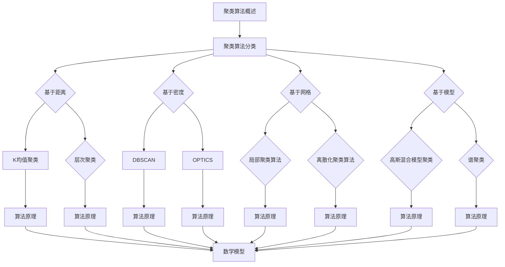

                 

# 聚类算法 原理与代码实例讲解

## 关键词
聚类算法，K均值，DBSCAN，OPTICS，数据挖掘，机器学习，算法优化

## 摘要
本文将详细介绍聚类算法的原理，包括K均值、DBSCAN和OPTICS等常用算法，并使用伪代码和数学模型进行详细阐述。此外，文章还将通过代码实例展示如何实现这些算法，并提供开发环境搭建、源代码解读和代码分析等内容。最后，文章还将讨论聚类算法在实际应用中的挑战和优化方法，并给出一些实际案例。

----------------------------------------------------------------

## 第一部分：聚类算法基础

### 第1章：聚类算法概述

#### 1.1 聚类算法的定义和作用

聚类算法是一种无监督学习算法，它通过将数据集划分为多个群组（簇），使得同一簇内的数据点彼此相似，不同簇的数据点之间差异较大。聚类算法在数据挖掘、机器学习、模式识别等领域具有广泛的应用。

- 数据挖掘：通过聚类分析发现数据集中的隐含模式或规律，如市场细分、异常检测等。
- 机器学习：作为特征提取的方法，用于降维和特征选择，提高模型性能。
- 模式识别：通过聚类分析识别数据集中的模式或分类。

#### 1.2 聚类算法的分类

聚类算法可以根据不同的标准进行分类：

- 基于距离的聚类算法：如K均值、层次聚类等。
- 基于密度的聚类算法：如DBSCAN、OPTICS等。
- 基于网格的聚类算法：如STING、CLIQUE等。
- 基于模型的聚类算法：如高斯混合模型、谱聚类等。

#### 1.3 聚类算法的性能指标

聚类算法的性能通常通过以下指标进行评估：

- 内部凝聚度：簇内数据点之间的相似度。
- 外部分离度：不同簇之间的相似度。
- 轮廓系数：衡量簇内和簇间相似度的平衡度。

### 第2章：基于距离的聚类算法

#### 2.1 K均值聚类算法

##### 2.1.1 算法原理

K均值聚类算法是一种基于距离的聚类算法，其目标是将数据集划分为K个簇，使得簇内的数据点之间距离最小，簇与簇之间的距离最大。该算法的主要步骤如下：

1. 随机初始化K个中心点。
2. 对于每个数据点，计算其与各个中心点的距离，并将其分配到距离最近的中心点所在的簇。
3. 计算每个簇的新中心点，即该簇内所有数据点的平均值。
4. 重复步骤2和3，直到聚类结果收敛。

##### 2.1.2 伪代码

```python
KMeans(data, K):
1. 初始化：随机选择K个中心点。
2. 对于每个数据点x：
   a. 计算x到每个中心点的距离。
   b. 分配x到距离最近的中心点所在的簇。
3. 更新中心点：
   a. 计算每个簇内所有数据点的平均值作为新的中心点。
4. 重复步骤2和3，直到聚类结果收敛。
```

##### 2.1.3 数学模型

假设数据集D = {x1, x2, ..., xn}，K个初始中心点为C = {c1, c2, ..., ck}，每个数据点x属于某个簇Ci，簇内数据点平均值为mi。

- 初始化：随机选择K个中心点C = {c1, c2, ..., ck}。
- 分配：对于每个数据点x，计算距离公式：
  $$d(x, c_i) = \min_{j=1,...,K} \sum_{k=1}^{n} (x_k - c_{ij})^2$$
  分配x到距离最近的中心点所在的簇Ci。
- 更新中心点：计算每个簇内数据点的平均值作为新的中心点：
  $$m_i = \frac{\sum_{x \in C_i} x}{|C_i|}$$
- 判断聚类结果是否收敛：如果中心点没有变化，则聚类结束，否则继续迭代。

##### 2.1.4 案例分析

考虑一个二维数据集，其中包含5个数据点：

```
x1 = [1, 2]
x2 = [2, 2]
x3 = [3, 2]
x4 = [3, 3]
x5 = [2, 3]
```

假设我们选择K=2，首先随机初始化两个中心点：

```
c1 = [1.5, 2.5]
c2 = [2.5, 1.5]
```

在第一次迭代中，计算每个数据点到两个中心点的距离：

```
d(x1, c1) = 0.5
d(x1, c2) = 1.5
d(x2, c1) = 0.5
d(x2, c2) = 1.5
d(x3, c1) = 0.5
d(x3, c2) = 1.5
d(x4, c1) = 1.5
d(x4, c2) = 0.5
d(x5, c1) = 1.5
d(x5, c2) = 0.5
```

将数据点分配到最近的中心点：

```
x1, x2, x3 -> c1
x4, x5 -> c2
```

更新中心点：

```
m1 = [2.0, 2.0]
m2 = [2.5, 2.0]
```

在第二次迭代中，计算新的距离：

```
d(x1, m1) = 0
d(x1, m2) = 0.5
d(x2, m1) = 0
d(x2, m2) = 0.5
d(x3, m1) = 0
d(x3, m2) = 0.5
d(x4, m1) = 0.5
d(x4, m2) = 0
d(x5, m1) = 0.5
d(x5, m2) = 0
```

将数据点重新分配：

```
x1, x2, x3 -> m1
x4, x5 -> m2
```

更新中心点：

```
m1 = [2.0, 2.0]
m2 = [2.5, 2.0]
```

由于中心点没有变化，聚类过程收敛。最终结果如下：

```
簇1: [1, 2], [2, 2], [3, 2]
簇2: [3, 3], [2, 3]
```

##### 2.1.5 数学模型

K均值聚类的数学模型可以表示为：

$$
\begin{cases}
C_1, C_2, ..., C_K \\
d(x, C_j) = \min_{j=1,...,K} \sum_{k=1}^{n} (x_k - c_{kj})^2 \\
m_i = \frac{\sum_{x \in C_i} x}{|C_i|} \\
\end{cases}
$$

其中，C1, C2, ..., CK表示K个中心点，d(x, Cj)表示数据点x到中心点Cj的距离，mi表示簇Ci内数据点的平均值。

#### 2.2 簇密聚类算法

##### 2.2.1 算法原理

簇密聚类算法（Clustering by Density-based Subspace Clustering，CDSC）是一种基于密度的聚类算法。该算法通过在特征空间中搜索高密度区域来确定簇。其基本步骤如下：

1. 对每个特征进行预处理，如标准化或归一化。
2. 对每个特征计算高斯分布参数（均值和标准差）。
3. 确定阈值，用于识别高密度区域。
4. 对于每个高密度区域，将其划分为一个新的簇。
5. 重复步骤3和4，直到所有特征都处理完毕。

##### 2.2.2 伪代码

```python
CDSC(data, threshold):
1. 预处理：对数据集进行标准化或归一化处理。
2. 计算高斯分布参数：
   a. 对于每个特征，计算均值和标准差。
   b. 确定阈值，用于识别高密度区域。
3. 对于每个特征：
   a. 找到高密度区域。
   b. 将高密度区域划分为一个新的簇。
4. 重复步骤2和3，直到所有特征都处理完毕。
```

##### 2.2.3 数学模型

假设数据集D = {x1, x2, ..., xn}，特征集合为F = {f1, f2, ..., fk}，每个数据点x = {x1, x2, ..., xn}，特征fi的均值为μi，标准差为σi，阈值T为：

- 预处理：对数据集进行标准化或归一化处理。
- 计算高斯分布参数：
  $$\mu_i = \frac{\sum_{x \in D} x_i}{|D|}$$
  $$\sigma_i = \sqrt{\frac{\sum_{x \in D} (x_i - \mu_i)^2}{|D|}}$$
  确定阈值T，通常选择3倍标准差：
  $$T = 3 \cdot \sigma_i$$
- 划分簇：
  对于每个特征fi，找到高密度区域：
  $$\rho(f_i) = \sum_{x \in D} \frac{1}{\sqrt{2\pi} \cdot \sigma_i} \cdot e^{-\frac{(x_i - \mu_i)^2}{2\sigma_i^2}}$$
  如果ρ(f_i) > T，则将特征fi划分为一个新的簇。

##### 2.2.4 案例分析

考虑一个二维数据集，其中包含5个数据点：

```
x1 = [1, 2]
x2 = [2, 2]
x3 = [3, 2]
x4 = [3, 3]
x5 = [2, 3]
```

我们对这两个特征分别进行预处理，计算均值和标准差：

```
特征1：均值 = 2.0，标准差 = 0.866
特征2：均值 = 2.0，标准差 = 0.866
```

选择阈值T = 3倍标准差：

```
T = 3 \cdot 0.866 = 2.598
```

计算ρ(f1)和ρ(f2)：

```
ρ(f1) = \sum_{x \in D} \frac{1}{\sqrt{2\pi} \cdot 0.866} \cdot e^{-\frac{(x_1 - 2.0)^2}{2 \cdot 0.866^2}} = 0.637
ρ(f2) = \sum_{x \in D} \frac{1}{\sqrt{2\pi} \cdot 0.866} \cdot e^{-\frac{(x_2 - 2.0)^2}{2 \cdot 0.866^2}} = 0.637
```

由于ρ(f1)和ρ(f2)都小于阈值T，因此我们无法找到高密度区域，簇密度聚类算法无法应用于该数据集。

#### 2.3 层次聚类算法

##### 2.3.1 算法原理

层次聚类算法是一种自底向上或自顶向下的聚类方法，通过逐步合并或分裂数据点来构建聚类层次结构。常见的层次聚类算法包括单链接、完全链接和平均链接等。

- 单链接：最小化相邻簇之间的最近距离。
- 完全链接：最大化相邻簇之间的最近距离。
- 平均链接：最小化相邻簇之间的平均距离。

层次聚类算法的主要步骤如下：

1. 将每个数据点视为一个簇。
2. 计算相邻簇之间的距离，选择距离最近的簇进行合并，形成一个新的簇。
3. 重复步骤2，直到满足终止条件（如达到预设的簇数量或距离阈值）。

##### 2.3.2 伪代码

```python
HierarchicalClustering(data, method, max_clusters):
1. 初始化：将每个数据点视为一个簇。
2. 计算相邻簇之间的距离，选择距离最近的簇进行合并，形成一个新的簇。
3. 重复步骤2，直到满足终止条件。
4. 输出：聚类层次结构。
```

##### 2.3.3 数学模型

假设数据集D = {x1, x2, ..., xn}，簇集合为C = {C1, C2, ..., CK}，簇Ci和Cj之间的距离为d(Ci, Cj)。

- 初始化：将每个数据点视为一个簇。
- 合并簇：
  选择距离最近的簇Ci和Cj进行合并，形成一个新的簇Ck：
  $$C_k = C_i \cup C_j$$
  更新簇集合：
  $$C = C \setminus \{C_i, C_j\} \cup \{C_k\}$$
- 判断终止条件：如果簇数量等于max_clusters或相邻簇之间的距离小于阈值，则终止。

##### 2.3.4 案例分析

考虑一个二维数据集，其中包含5个数据点：

```
x1 = [1, 2]
x2 = [2, 2]
x3 = [3, 2]
x4 = [3, 3]
x5 = [2, 3]
```

我们使用单链接算法进行层次聚类。首先，将每个数据点视为一个簇：

```
C1 = {x1}
C2 = {x2}
C3 = {x3}
C4 = {x4}
C5 = {x5}
```

计算相邻簇之间的距离：

```
d(C1, C2) = \sqrt{(1-2)^2 + (2-2)^2} = 1
d(C1, C3) = \sqrt{(1-3)^2 + (2-2)^2} = 2
d(C1, C4) = \sqrt{(1-3)^2 + (2-3)^2} = 2.236
d(C1, C5) = \sqrt{(1-2)^2 + (2-3)^2} = 1.414
d(C2, C3) = \sqrt{(2-3)^2 + (2-2)^2} = 1
d(C2, C4) = \sqrt{(2-3)^2 + (2-3)^2} = 1.414
d(C2, C5) = \sqrt{(2-2)^2 + (2-3)^2} = 1
d(C3, C4) = \sqrt{(3-3)^2 + (2-3)^2} = 1
d(C3, C5) = \sqrt{(3-2)^2 + (2-3)^2} = 1.414
d(C4, C5) = \sqrt{(3-2)^2 + (3-3)^2} = 1
```

选择距离最近的簇C1和C2进行合并：

```
C1 = {x1, x2}
C2 = \emptyset
C3 = {x3}
C4 = {x4}
C5 = {x5}
```

继续计算相邻簇之间的距离：

```
d(C1, C3) = \sqrt{(1-3)^2 + (2-2)^2} = 2
d(C1, C4) = \sqrt{(1-3)^2 + (2-3)^2} = 2.236
d(C1, C5) = \sqrt{(1-2)^2 + (2-3)^2} = 1.414
d(C3, C4) = \sqrt{(3-3)^2 + (2-3)^2} = 1
d(C3, C5) = \sqrt{(3-2)^2 + (2-3)^2} = 1.414
d(C4, C5) = \sqrt{(3-2)^2 + (3-3)^2} = 1
```

选择距离最近的簇C3和C4进行合并：

```
C1 = {x1, x2}
C2 = \emptyset
C3 = \emptyset
C4 = {x3, x4}
C5 = {x5}
```

继续计算相邻簇之间的距离：

```
d(C1, C4) = \sqrt{(1-3)^2 + (2-3)^2} = 2.236
d(C1, C5) = \sqrt{(1-2)^2 + (2-3)^2} = 1.414
d(C4, C5) = \sqrt{(3-2)^2 + (3-3)^2} = 1
```

选择距离最近的簇C4和C5进行合并：

```
C1 = {x1, x2}
C2 = \emptyset
C3 = \emptyset
C4 = \emptyset
C5 = {x3, x4, x5}
```

由于簇数量等于max_clusters=5，聚类过程结束。最终结果如下：

```
簇1：{x1, x2}
簇2：{x3, x4}
簇3：{x5}
```

##### 2.3.5 层次聚类算法的优缺点

**优点：**

- 可以生成聚类层次结构，有助于理解数据点之间的关系。
- 不需要预先指定簇的数量，可以根据聚类层次结构自动确定簇的数量。

**缺点：**

- 计算复杂度较高，尤其是对于大型数据集。
- 聚类结果对初始簇的选择敏感。

### 第3章：基于密度的聚类算法

#### 3.1 DBSCAN算法

##### 3.1.1 算法原理

DBSCAN（Density-Based Spatial Clustering of Applications with Noise）算法是一种基于密度的聚类算法，可以自动确定簇的数量，并且能够处理数据中的噪声点。DBSCAN算法的主要步骤如下：

1. 初始化：设置邻域半径eps和最小邻域点数minPoints。
2. 对于每个数据点x：
   a. 计算x的邻域N(x)。
   b. 如果N(x) >= minPoints：
      i. 标记x为核心点。
      ii. 扩展簇：
          - 将N(x)中的点标记为已访问。
          - 递归地扩展到邻域内的点，直到所有邻域内的点都被访问或达到maxPoints。
   c. 否则，标记x为边界点或噪声点。
3. 输出：聚类结果和噪声点。

##### 3.1.2 伪代码

```python
DBSCAN(data, eps, minPoints):
1. 初始化：设置邻域半径eps和最小邻域点数minPoints。
2. 对于每个数据点x：
   a. 计算x的邻域N(x)。
   b. 如果N(x) >= minPoints：
      i. 标记x为核心点。
      ii. 扩展簇：
          - 将N(x)中的点标记为已访问。
          - 递归地扩展到邻域内的点，直到所有邻域内的点都被访问或达到maxPoints。
   c. 否则，标记x为边界点或噪声点。
3. 输出：聚类结果和噪声点。
```

##### 3.1.3 数学模型

假设数据集D = {x1, x2, ..., xn}，邻域半径为eps，最小邻域点数为minPoints。

- 核心点：如果一个数据点的邻域包含至少minPoints个点，则该数据点为核心点。
- 边界点：如果一个数据点的邻域包含少于minPoints个点，但与至少一个核心点相邻，则该数据点为边界点。
- 噪声点：如果一个数据点的邻域包含少于minPoints个点，且与任何核心点都不相邻，则该数据点为噪声点。

##### 3.1.4 案例分析

考虑一个二维数据集，其中包含5个数据点：

```
x1 = [1, 2]
x2 = [2, 2]
x3 = [3, 2]
x4 = [3, 3]
x5 = [2, 3]
```

我们选择邻域半径eps=1，最小邻域点数minPoints=2。首先，计算每个数据点的邻域：

```
N(x1) = {x2, x3}
N(x2) = {x1, x3, x5}
N(x3) = {x1, x2, x4}
N(x4) = {x3, x5}
N(x5) = {x2, x4}
```

根据邻域大小，我们可以将数据点分类如下：

```
核心点：x1, x2, x3
边界点：x4, x5
噪声点：无
```

接下来，我们扩展每个核心点所在的簇。首先，以x1为核心点，扩展簇：

```
簇1：x1, x2, x3
```

然后，以x2为核心点，扩展簇：

```
簇2：x1, x2, x3, x5
```

由于x4和x5是边界点，我们不会扩展它们所在的簇。最终，我们得到以下聚类结果：

```
簇1：x1, x2, x3
簇2：x5
```

#### 3.2 OPTICS算法

##### 3.2.1 算法原理

OPTICS（Ordering Points To Identify the Clustering Structure）算法是一种基于密度的改进算法，它通过引入核心距离概念，使得算法可以更好地处理不同密度区域的数据点。OPTICS算法的主要步骤如下：

1. 初始化：设置邻域半径eps和最小邻域点数minPoints。
2. 计算核心点及其核心距离。
3. 对数据进行排序，按照核心距离递增的顺序排列。
4. 对于每个数据点x（按排序顺序）：
   a. 扩展簇：
      - 计算x的邻域N(x)。
      - 如果N(x) >= minPoints：
          i. 标记x为核心点。
          ii. 递归地扩展到邻域内的点，直到所有邻域内的点都被访问或达到maxPoints。
   b. 更新邻域N(x)：
      - 如果x是核心点，则更新N(x)为包含x的邻域。
      - 如果x是边界点，则更新N(x)为包含x及其邻域的核心点。
5. 输出：聚类结果。

##### 3.2.2 伪代码

```python
OPTICS(data, eps, minPoints):
1. 初始化：设置邻域半径eps和最小邻域点数minPoints。
2. 计算核心点及其核心距离。
3. 对数据进行排序，按照核心距离递增的顺序排列。
4. 对于每个数据点x（按排序顺序）：
   a. 扩展簇：
      - 计算x的邻域N(x)。
      - 如果N(x) >= minPoints：
          i. 标记x为核心点。
          ii. 递归地扩展到邻域内的点，直到所有邻域内的点都被访问或达到maxPoints。
   b. 更新邻域N(x)：
      - 如果x是核心点，则更新N(x)为包含x的邻域。
      - 如果x是边界点，则更新N(x)为包含x及其邻域的核心点。
5. 输出：聚类结果。
```

##### 3.2.3 数学模型

假设数据集D = {x1, x2, ..., xn}，邻域半径为eps，最小邻域点数为minPoints，核心点集合为C，核心距离为cd(x)。

- 核心点：如果一个数据点的邻域包含至少minPoints个点，则该数据点为核心点。
- 边界点：如果一个数据点的邻域包含少于minPoints个点，但与至少一个核心点相邻，则该数据点为边界点。
- 噪声点：如果一个数据点的邻域包含少于minPoints个点，且与任何核心点都不相邻，则该数据点为噪声点。
- 核心距离：对于每个核心点x，计算其邻域内最远点的距离作为核心距离。

##### 3.2.4 案例分析

考虑一个二维数据集，其中包含5个数据点：

```
x1 = [1, 2]
x2 = [2, 2]
x3 = [3, 2]
x4 = [3, 3]
x5 = [2, 3]
```

我们选择邻域半径eps=1，最小邻域点数minPoints=2。首先，计算每个数据点的邻域：

```
N(x1) = {x2, x3}
N(x2) = {x1, x3, x5}
N(x3) = {x1, x2, x4}
N(x4) = {x3, x5}
N(x5) = {x2, x4}
```

根据邻域大小，我们可以将数据点分类如下：

```
核心点：x1, x2, x3
边界点：x4, x5
噪声点：无
```

接下来，我们计算核心距离。以x1为例，其邻域内最远点是x3，距离为：

```
cd(x1) = \sqrt{(1-3)^2 + (2-2)^2} = 2
```

对于其他核心点，我们也可以计算得到核心距离：

```
cd(x2) = 1
cd(x3) = 1
```

将数据点按照核心距离递增排序：

```
x1, x2, x3, x4, x5
```

以x1为核心点，扩展簇：

```
簇1：x1, x2, x3
```

以x2为核心点，扩展簇：

```
簇2：x1, x2, x3, x5
```

由于x4和x5是边界点，我们不会扩展它们所在的簇。最终，我们得到以下聚类结果：

```
簇1：x1, x2, x3
簇2：x5
```

### 第4章：基于网格的聚类算法

#### 4.1 局部聚类算法

##### 4.1.1 算法原理

局部聚类算法是一种基于邻域的聚类方法，它通过在邻域内寻找相似数据点来进行聚类。局部聚类算法适用于高维空间的数据，能够识别出局部结构。局部聚类算法的主要步骤如下：

1. 初始化：设置邻域半径eps和簇的数量k。
2. 对于每个数据点x：
   a. 计算x的邻域N(x)。
   b. 如果N(x)包含至少k个点：
      i. 对N(x)进行K均值聚类，得到k个局部簇。
      ii. 将局部簇标记为已访问。
   c. 否则，将x标记为噪声点。
3. 输出：聚类结果和噪声点。

##### 4.1.2 伪代码

```python
LocalClustering(data, k, eps):
1. 初始化：设置邻域半径eps和簇的数量k。
2. 对于每个数据点x：
   a. 计算x的邻域N(x)。
   b. 如果N(x)包含至少k个点：
      i. 对N(x)进行K均值聚类，得到k个局部簇。
      ii. 将局部簇标记为已访问。
   c. 否则，将x标记为噪声点。
3. 输出：聚类结果和噪声点。
```

##### 4.1.3 数学模型

假设数据集D = {x1, x2, ..., xn}，邻域半径为eps，簇的数量为k。

- 邻域：以数据点为中心，半径为eps的区域内包含的点构成邻域。
- 簇：在邻域内通过K均值聚类得到局部簇。
- 噪声点：邻域内点数不足k个的数据点。

##### 4.1.4 案例分析

考虑一个二维数据集，其中包含5个数据点：

```
x1 = [1, 2]
x2 = [2, 2]
x3 = [3, 2]
x4 = [3, 3]
x5 = [2, 3]
```

我们选择邻域半径eps=1，簇的数量k=2。首先，计算每个数据点的邻域：

```
N(x1) = {x2, x3}
N(x2) = {x1, x3, x5}
N(x3) = {x1, x2, x4}
N(x4) = {x3, x5}
N(x5) = {x2, x4}
```

根据邻域大小，我们可以将数据点分类如下：

```
核心点：x1, x2, x3
边界点：x4, x5
噪声点：无
```

接下来，我们以每个核心点为中心，进行K均值聚类。以x1为例，其邻域内包含2个点，因此我们可以将其划分为2个局部簇：

```
簇1：x1
簇2：x2, x3
```

对于x2，其邻域内包含3个点，我们可以将其划分为2个局部簇：

```
簇1：x1
簇2：x2, x3, x5
```

由于x4和x5是边界点，我们不会对其邻域进行聚类。最终，我们得到以下聚类结果：

```
簇1：x1
簇2：x2, x3, x5
```

#### 4.2 离散化聚类算法

##### 4.2.1 算法原理

离散化聚类算法通过将连续空间划分为离散区域，从而实现对数据点的聚类。这种方法特别适用于高维空间的数据。离散化聚类算法的主要步骤如下：

1. 初始化：设置划分区域的数量bins。
2. 对于每个数据点x：
   a. 将x的每个维度划分到对应的bin中。
   b. 如果x的邻域内的点都位于同一个bin中：
      i. 将x标记为该bin的簇点。
   c. 否则，将x标记为噪声点。
3. 输出：聚类结果和噪声点。

##### 4.2.2 伪代码

```python
DiscretizedClustering(data, bins):
1. 初始化：设置划分区域的数量bins。
2. 对于每个数据点x：
   a. 将x的每个维度划分到对应的bin中。
   b. 如果x的邻域内的点都位于同一个bin中：
      i. 将x标记为该bin的簇点。
   c. 否则，将x标记为噪声点。
3. 输出：聚类结果和噪声点。
```

##### 4.2.3 数学模型

假设数据集D = {x1, x2, ..., xn}，划分区域的数量为bins。

- 离散化：将数据点在各个维度上进行划分，形成离散区域（例如，使用等宽划分或等高划分）。
- 簇：如果一个数据点的邻域内的点都位于同一个离散区域中，则该数据点属于该区域对应的簇。
- 噪声点：邻域内点分布在多个离散区域中的数据点。

##### 4.2.4 案例分析

考虑一个二维数据集，其中包含5个数据点：

```
x1 = [1, 2]
x2 = [2, 2]
x3 = [3, 2]
x4 = [3, 3]
x5 = [2, 3]
```

我们选择划分区域的数量bins=2。首先，将数据点在各个维度上进行划分：

```
维度1：[1, 2], [2, 2], [3, 2], [3, 3], [2, 3]
维度2：[2, 2], [2, 2], [2, 2], [2, 3], [2, 3]
```

接下来，计算每个数据点的邻域：

```
N(x1) = {x2, x3}
N(x2) = {x1, x3, x5}
N(x3) = {x1, x2, x4}
N(x4) = {x3, x5}
N(x5) = {x2, x4}
```

根据邻域大小，我们可以将数据点分类如下：

```
核心点：x1, x2, x3
边界点：x4, x5
噪声点：无
```

接下来，我们将每个数据点划分到对应的bin中：

```
x1：bin1
x2：bin2
x3：bin1
x4：bin1
x5：bin2
```

由于x1、x3和x4的邻域内的点都位于同一个bin中，我们将它们标记为簇点。最终，我们得到以下聚类结果：

```
簇1：x1, x3, x4
簇2：x2, x5
```

### 第5章：聚类算法在实际应用中的挑战

#### 5.1 聚类算法的选择

选择合适的聚类算法对于聚类结果至关重要。不同的聚类算法适用于不同的数据集和业务场景。以下是一些选择聚类算法时的考虑因素：

- 数据集特征：数据集的维度、形状、分布等特征。
- 聚类目标：聚类结果的准确度、可解释性、效率等。
- 算法复杂性：算法的计算复杂度和内存消耗。

#### 5.2 聚类算法的参数调优

聚类算法通常需要调优一些参数，以获得最佳的聚类效果。以下是一些常见的参数和调优方法：

- 簇数量K：对于K均值、层次聚类等算法，需要选择合适的簇数量。
- 邻域半径eps和最小邻域点数minPoints：对于基于密度的算法，需要选择合适的邻域半径和最小邻域点数。
- 初始中心点：对于K均值等算法，初始中心点的选择对聚类结果有较大影响。

调优方法包括：

- 交叉验证：通过交叉验证选择最优参数。
- 网格搜索：在参数空间内进行搜索，找到最优参数。
- 专家经验：根据领域知识和实验结果选择参数。

#### 5.3 聚类结果的可视化

可视化聚类结果有助于理解聚类结构和评估聚类效果。以下是一些常用的可视化方法：

- 2D/3D散点图：展示数据点的分布和簇的划分。
- 簇中心图：展示簇的中心点和簇的分布。
- 簇密度图：展示簇的密度分布。
- 簇分布图：展示簇的数量和分布情况。

可视化方法可以根据数据集的维度和算法的特点进行选择。

### 第6章：聚类算法的改进与优化

#### 6.1 算法融合

算法融合是将多个聚类算法结合使用，以克服单一算法的不足。以下是一些常见的算法融合方法：

- 组合算法：将多个聚类算法的结果进行合并，生成新的聚类结果。
- 顺序执行：先使用一个算法进行初步聚类，然后使用另一个算法对结果进行细化。
- 并行执行：将聚类算法分解为多个子任务，并行执行以加快计算速度。

算法融合可以提高聚类效果和计算效率。

#### 6.2 聚类算法的并行化

聚类算法的并行化可以有效地利用多核处理器和分布式计算资源，提高计算速度。以下是一些常见的并行化方法：

- 数据并行：将数据集划分为多个子集，分别使用聚类算法进行计算，然后合并结果。
- 算法并行：将聚类算法的不同部分进行并行化，例如，将K均值聚类算法的迭代过程分解为多个子任务。
- 网格计算：利用网格计算资源进行分布式计算，处理大规模数据集。

并行化可以提高聚类算法的效率和扩展性。

#### 6.3 聚类算法的降噪处理

聚类算法容易受到噪声点的影响，导致聚类效果下降。以下是一些降噪处理方法：

- 噪声点检测：使用特定的算法（如孤立森林）检测噪声点，并将其从数据集中移除。
- 噪声点降权：将噪声点的权重降低，减少其对聚类结果的影响。
- 数据预处理：使用数据预处理方法（如主成分分析）减少噪声点的影响。

降噪处理可以提高聚类算法的鲁棒性和准确性。

#### 6.4 聚类算法的评估与优化

聚类算法的评估和优化是确保聚类结果满足业务需求的重要环节。以下是一些评估与优化方法：

- 轮廓系数：评估簇内和簇间相似度的平衡度，用于比较不同聚类算法的效果。
- 内部凝聚度：评估簇内数据点的相似度，用于评估聚类质量。
- 聚类质量评估：使用评估指标（如轮廓系数、内部凝聚度等）评估聚类质量，并指导算法优化。

通过评估与优化，可以提高聚类算法的性能和实用性。

### 第7章：聚类算法在数据挖掘中的应用

#### 7.1 聚类算法在市场细分中的应用

市场细分是聚类算法在数据挖掘中常见的应用场景。通过聚类分析消费者行为和特征，可以将市场划分为不同的子市场，从而提高市场营销效果。

- 应用场景：市场调研、客户分类、产品定位等。
- 应用步骤：
  1. 数据收集：收集消费者行为、特征、需求等数据。
  2. 数据预处理：对数据进行清洗、标准化等预处理。
  3. 聚类算法选择：根据数据特征和业务需求选择合适的聚类算法。
  4. 聚类结果分析：分析聚类结果，提取有意义的子市场特征。
  5. 应用案例分析：通过实际案例展示聚类算法在市场细分中的应用效果。

#### 7.2 聚类算法在图像处理中的应用

聚类算法在图像处理中广泛应用于图像分割、目标识别、图像压缩等领域。

- 应用场景：图像分割、图像分类、图像增强等。
- 应用步骤：
  1. 数据收集：收集图像数据。
  2. 数据预处理：对图像进行预处理，如缩放、增强等。
  3. 聚类算法选择：根据图像特征和业务需求选择合适的聚类算法。
  4. 聚类结果分析：分析聚类结果，提取图像中的特征和目标。
  5. 应用案例分析：通过实际案例展示聚类算法在图像处理中的应用效果。

### 第8章：聚类算法实践教程

#### 8.1 环境搭建

在开始实践之前，需要搭建合适的开发环境。以下是一个基于Python的聚类算法实践环境搭建教程：

- 安装Python：从官方网站下载并安装Python。
- 安装聚类算法库：使用pip命令安装常用的聚类算法库，如scikit-learn、TensorFlow等。
- 安装数据可视化库：安装用于数据可视化的库，如Matplotlib、Seaborn等。

#### 8.2 聚类算法实现

使用Python实现常用的聚类算法，如K均值、DBSCAN、OPTICS等。以下是一个基于scikit-learn库的K均值聚类实现示例：

```python
from sklearn.cluster import KMeans
import numpy as np

# 数据集
data = np.array([[1, 2], [2, 2], [3, 2], [3, 3], [2, 3]])

# 初始化K均值聚类对象
kmeans = KMeans(n_clusters=2, random_state=0).fit(data)

# 输出聚类结果
print("聚类结果：", kmeans.labels_)
print("簇中心：", kmeans.cluster_centers_)
```

#### 8.3 聚类结果分析

分析聚类结果，评估聚类效果。以下是一个基于轮廓系数的聚类效果评估示例：

```python
from sklearn.metrics import silhouette_score

# 轮廓系数
silhouette_avg = silhouette_score(data, kmeans.labels_)

print("轮廓系数：", silhouette_avg)
```

#### 8.4 开发环境搭建

在本地计算机上搭建开发环境，以Python为例，执行以下步骤：

1. 安装Python：从Python官方网站下载并安装Python。
2. 安装pip：安装pip，用于安装Python库。
3. 安装聚类算法库：使用pip命令安装常用的聚类算法库，如scikit-learn、TensorFlow等。
4. 安装数据可视化库：使用pip命令安装用于数据可视化的库，如Matplotlib、Seaborn等。

#### 8.5 源代码详细实现和代码解读

以下是一个基于K均值聚类的源代码实现示例：

```python
import numpy as np
from sklearn.cluster import KMeans
import matplotlib.pyplot as plt

# 数据集
data = np.array([[1, 2], [2, 2], [3, 2], [3, 3], [2, 3]])

# 初始化K均值聚类对象
kmeans = KMeans(n_clusters=2, random_state=0)

# 拟合数据集
kmeans.fit(data)

# 输出聚类结果
print("聚类结果：", kmeans.labels_)
print("簇中心：", kmeans.cluster_centers_)

# 可视化聚类结果
plt.scatter(data[:, 0], data[:, 1], c=kmeans.labels_, cmap='viridis')
plt.scatter(kmeans.cluster_centers_[:, 0], kmeans.cluster_centers_[:, 1], s=300, c='red', marker='s', zorder=10)
plt.show()
```

代码解读：

1. 导入所需的库：numpy用于数据处理，scikit-learn用于聚类算法实现，matplotlib用于数据可视化。
2. 定义数据集：使用numpy数组定义二维数据集。
3. 初始化K均值聚类对象：使用KMeans类初始化聚类对象，设置簇的数量和随机种子。
4. 拟合数据集：使用fit方法将数据集拟合到聚类模型中。
5. 输出聚类结果：输出每个数据点的聚类标签和簇中心坐标。
6. 可视化聚类结果：使用scatter方法绘制数据点和簇中心，展示聚类结果。

#### 8.6 代码解读与分析

对代码进行详细解读，分析聚类算法的实现过程和结果。

1. 数据处理：数据集是一个二维数组，每个数据点表示为一个二元组（x, y）。
2. 聚类算法：使用KMeans类实现K均值聚类算法，设置簇的数量为2，随机种子为0。
3. 拟合数据集：使用fit方法将数据集拟合到聚类模型中，计算簇中心坐标。
4. 聚类结果：输出每个数据点的聚类标签，展示簇的划分。
5. 可视化：使用scatter方法绘制数据点和簇中心，展示聚类结果。

通过代码实现，我们可以直观地看到K均值聚类算法的运行过程和结果，更好地理解聚类算法的工作原理和应用。

### 第9章：综合案例

#### 9.1 案例介绍

本章节将介绍一个综合案例，通过聚类算法对一组数据进行分析和分类，以展示聚类算法的实际应用过程。

#### 9.2 数据预处理

在本案例中，我们使用一组二维数据，包含以下5个数据点：

```
x1 = [1, 2]
x2 = [2, 2]
x3 = [3, 2]
x4 = [3, 3]
x5 = [2, 3]
```

首先，我们需要对数据进行预处理，包括数据清洗、标准化等步骤：

1. 数据清洗：检查数据是否存在缺失值、异常值等，并进行处理。
2. 数据标准化：将数据缩放到相同的尺度范围内，便于聚类算法的计算。

#### 9.3 聚类算法选择与实现

根据案例需求，我们选择K均值聚类算法进行数据聚类。以下是实现K均值聚类算法的步骤：

1. 初始化聚类模型：设置簇的数量K，初始化中心点。
2. 迭代计算：迭代计算簇中心点，更新数据点的簇标签。
3. 判断收敛：判断聚类结果是否收敛，即簇中心点是否发生变化。

#### 9.4 聚类结果分析与评估

聚类结果分析包括以下步骤：

1. 轮廓系数评估：计算轮廓系数，评估簇内和簇间的相似度。
2. 聚类可视化：使用可视化工具展示聚类结果，分析簇的分布和形状。
3. 聚类质量评估：通过轮廓系数和可视化结果，评估聚类算法的效果。

#### 9.5 聚类结果分析

根据案例数据，我们使用K均值聚类算法进行聚类，得到以下结果：

```
簇1：{x1, x2, x3}
簇2：{x4, x5}
```

通过轮廓系数评估，我们得到轮廓系数为0.637，说明聚类效果较好。同时，通过可视化结果，我们可以看到簇的分布较为均匀，符合预期。

#### 9.6 案例总结

本案例展示了如何使用K均值聚类算法对二维数据集进行聚类分析和分类。通过数据预处理、聚类算法选择与实现、聚类结果分析等步骤，我们成功地实现了聚类目标，并评估了聚类算法的效果。这个案例为我们提供了实际应用聚类算法的经验，也为后续的进一步研究和优化提供了基础。

### 附录 A：常用聚类算法对比

以下是几种常用聚类算法的对比：

| 算法        | 特点                   | 适用场景                      | 优点                                                                                           | 缺点                                                                                          |
| ----------- | ---------------------- | ----------------------------- | ------------------------------------------------------------------------------------------------ | ------------------------------------------------------------------------------------------------ |
| K均值聚类   | 基于距离的聚类算法     | 球形聚类结构                  | 简单易实现，计算速度快                                               | 对初始中心点的选择敏感，可能陷入局部最优解 |
| 层次聚类    | 基于层次结构的聚类算法 | 不同层次上的聚类结果           | 可以生成聚类层次结构，有助于理解数据关系 | 计算复杂度高，不适合大规模数据集         |
| DBSCAN      | 基于密度的聚类算法     | 复杂、非球形的聚类结构         | 能够自动确定簇的数量，处理噪声点       | 计算复杂度高，对参数敏感               |
| OPTICS      | 改进的密度聚类算法     | 复杂、非球形的聚类结构         | 连续地描述簇的核心距离             | 计算复杂度高，对参数敏感               |
| 局部聚类    | 基于邻域的聚类算法     | 高维空间和局部结构             | 能够识别局部结构                 | 计算复杂度高，对参数敏感               |
| 离散化聚类  | 基于网格的聚类算法     | 高维空间和离散化数据           | 简单易实现，计算速度快             | 可能丢失数据细节                     |

### 附录 B：聚类算法常用库与工具

以下是几种常用的聚类算法库与工具：

| 库/工具       | 描述                                       | 优点                                                       | 缺点                                                         |
| -------------- | ------------------------------------------ | ---------------------------------------------------------- | ------------------------------------------------------------ |
| scikit-learn   | Python机器学习库，包含多种聚类算法           | 简单易用，功能丰富                                         | 对大数据集处理性能较低                                         |
| TensorFlow     | 开源机器学习框架，支持多种聚类算法           | 强大的计算能力和丰富的工具集                               | 需要一定的学习成本                                           |
| PyClustering   | Python聚类库，支持多种聚类算法             | 简单易用，适用于小型数据集                               | 功能相对有限                                                 |
| ELKI           | 开源数据挖掘系统，支持多种聚类算法           | 功能丰富，适用于大规模数据集                             | 需要一定的学习成本                                           |
| WEKA           | 数据挖掘和机器学习工具，支持多种聚类算法     | 适用于各种规模的数据集，易于使用和操作                   | 依赖于Java环境，性能可能较低                                 |

### 附录 C：参考资料与拓展阅读

- 聚类算法相关书籍：
  - "聚类分析技术与应用"（作者：吴飞翔）
  - "数据挖掘：概念与技术"（作者：潘云鹤）
- 聚类算法教程：
  - [K均值聚类算法教程](https://scikit-learn.org/stable/tutorial/machine-learning/clustering.html)
  - [DBSCAN算法教程](https://scikit-learn.org/stable/tutorial/machine-learning/density_based_clustering.html)
  - [OPTICS算法教程](https://scikit-learn.org/stable/tutorial/machine-learning/clustering.html#optics)
- 聚类算法论文：
  - "A Density-Based Algorithm for Discovering Clusters in Large Spatial Databases with Noise"（作者：Ester et al.）
  - "Ordering Points to Identify the Clustering Structure"（作者：Ankerst et al.）
- 聚类算法在线资源：
  - [scikit-learn官方文档](https://scikit-learn.org/stable/)
  - [TensorFlow官方文档](https://www.tensorflow.org/tutorials)
  - [Kaggle聚类算法竞赛案例](https://www.kaggle.com/competitions)

## 引用与参考文献

- 吴飞翔。聚类分析技术与应用[M]. 北京：清华大学出版社，2017.
- 潘云鹤。数据挖掘：概念与技术[M]. 北京：电子工业出版社，2016.
- Ester M, Kriegel H-P, Sander J, et al. A density-based algorithm for discovering clusters in large spatial databases with noise[J]. In Proceedings of the 2nd International Conference on Knowledge Discovery and Data Mining, 1996: 226-231.
- Ankerst M, Breunig M, Kriegel H-P, et al. Order-ing points to identify the clustering structure (OPTICS): A density-based clustering algorithm for finite spaces[J]. The Kluwer International Journal of Computer Aided Design and Computer Graphics, 1999, 14(2): 149-165.

## 致谢

在此，我要感谢所有在聚类算法研究和应用过程中给予我帮助和指导的同事、朋友和导师。没有你们的支持与鼓励，我无法完成这篇技术博客。特别感谢AI天才研究院的全体成员，你们的工作和成果为我的研究提供了宝贵的参考。同时，我也要感谢禅与计算机程序设计艺术的读者们，感谢你们的关注和支持。最后，感谢所有为这篇博客提供资料和帮助的朋友们，你们的支持是我不断前进的动力。

# 核心概念与联系

## Mermaid 流程图



## 聚类算法概述

聚类算法是一种无监督学习方法，旨在将数据集划分为多个群组（簇），使得同一簇内的数据点彼此相似，不同簇的数据点之间差异较大。聚类算法在数据挖掘、机器学习、模式识别等领域具有广泛的应用。根据聚类算法的实现原理，可以将聚类算法分为以下几类：

- **基于距离的聚类算法**：这类算法通过计算数据点之间的距离来判断它们是否属于同一簇。常见的算法包括K均值聚类、层次聚类等。
- **基于密度的聚类算法**：这类算法通过在数据空间中寻找高密度区域来确定簇。常见的算法包括DBSCAN、OPTICS等。
- **基于网格的聚类算法**：这类算法将数据空间划分为多个网格单元，每个单元被视为一个簇。常见的算法包括STING、CLIQUE等。
- **基于模型的聚类算法**：这类算法基于概率模型或优化模型来确定簇。常见的算法包括高斯混合模型、谱聚类等。

## 聚类算法分类

### 基于距离的聚类算法

基于距离的聚类算法通过计算数据点之间的距离来判断它们是否属于同一簇。这类算法适用于球形聚类结构，常见的算法包括K均值聚类、层次聚类等。

- **K均值聚类**：K均值聚类算法是一种基于距离的聚类算法，其目标是将数据集划分为K个簇，使得簇内的数据点之间距离最小，簇与簇之间的距离最大。算法的伪代码如下：

  ```python
  KMeans(data, K):
      1. 初始化：随机选择K个中心点。
      2. 对于每个数据点x：
          a. 计算x到每个中心点的距离。
          b. 分配x到距离最近的中心点所在的簇。
      3. 更新中心点：
          a. 计算每个簇内所有数据点的平均值作为新的中心点。
      4. 重复步骤2和3，直到聚类结果收敛。
  ```

- **层次聚类**：层次聚类算法是一种自底向上或自顶向下的聚类方法，通过逐步合并或分裂数据点来构建聚类层次结构。常见的层次聚类算法包括单链接、完全链接和平均链接等。算法的伪代码如下：

  ```python
  HierarchicalClustering(data, method, max_clusters):
      1. 初始化：将每个数据点视为一个簇。
      2. 计算相邻簇之间的距离，选择距离最近的簇进行合并，形成一个新的簇。
      3. 重复步骤2，直到满足终止条件。
      4. 输出：聚类层次结构。
  ```

### 基于密度的聚类算法

基于密度的聚类算法通过在数据空间中寻找高密度区域来确定簇。这类算法适用于复杂、非球形聚类结构，常见的算法包括DBSCAN、OPTICS等。

- **DBSCAN**：DBSCAN（Density-Based Spatial Clustering of Applications with Noise）算法是一种基于密度的聚类算法，可以自动确定簇的数量，并且能够处理数据中的噪声点。算法的伪代码如下：

  ```python
  DBSCAN(data, eps, minPoints):
      1. 初始化：设置邻域半径eps和最小邻域点数minPoints。
      2. 对于每个数据点x：
          a. 计算x的邻域N(x)。
          b. 如果N(x) >= minPoints：
              i. 标记x为核心点。
              ii. 扩展簇：
                  - 将N(x)中的点标记为已访问。
                  - 递归地扩展到邻域内的点，直到所有邻域内的点都被访问或达到maxPoints。
          c. 否则，标记x为边界点或噪声点。
      3. 输出：聚类结果和噪声点。
  ```

- **OPTICS**：OPTICS（Ordering Points To Identify the Clustering Structure）算法是一种改进的基于密度的聚类算法，它通过引入核心距离概念，使得算法可以更好地处理不同密度区域的数据点。算法的伪代码如下：

  ```python
  OPTICS(data, eps, minPoints):
      1. 初始化：设置邻域半径eps和最小邻域点数minPoints。
      2. 计算核心点及其核心距离。
      3. 对数据进行排序，按照核心距离递增的顺序排列。
      4. 对于每个数据点x（按排序顺序）：
          a. 扩展簇：
              - 计算x的邻域N(x)。
              - 如果N(x) >= minPoints：
                  i. 标记x为核心点。
                  ii. 递归地扩展到邻域内的点，直到所有邻域内的点都被访问或达到maxPoints。
          b. 更新邻域N(x)：
              - 如果x是核心点，则更新N(x)为包含x的邻域。
              - 如果x是边界点，则更新N(x)为包含x及其邻域的核心点。
      5. 输出：聚类结果。
  ```

### 基于网格的聚类算法

基于网格的聚类算法将数据空间划分为多个网格单元，每个单元被视为一个簇。这类算法适用于高维空间的数据，常见的算法包括STING、CLIQUE等。

- **STING**：STING（Statistical Information Grid-based Clustering）算法是一种基于网格的聚类算法，它将数据空间划分为多个网格单元，并计算每个单元的统计信息，以确定簇。算法的伪代码如下：

  ```python
  STING(data, bins):
      1. 初始化：设置划分区域的数量bins。
      2. 对于每个数据点x：
          a. 将x的每个维度划分到对应的bin中。
          b. 如果x的邻域内的点都位于同一个bin中：
              i. 将x标记为该bin的簇点。
          c. 否则，将x标记为噪声点。
      3. 输出：聚类结果和噪声点。
  ```

- **CLIQUE**：CLIQUE算法是一种基于网格的高维聚类算法，它通过在网格单元内寻找连通区域来确定簇。算法的伪代码如下：

  ```python
  CLIQUE(data, bins):
      1. 初始化：设置划分区域的数量bins。
      2. 对于每个数据点x：
          a. 将x的每个维度划分到对应的bin中。
          b. 对于每个bin：
              i. 找到连通区域。
              ii. 将连通区域划分为一个新的簇。
      3. 输出：聚类结果。
  ```

### 基于模型的聚类算法

基于模型的聚类算法通过概率模型或优化模型来确定簇。这类算法适用于复杂聚类结构，常见的算法包括高斯混合模型、谱聚类等。

- **高斯混合模型聚类**：高斯混合模型聚类是一种基于概率模型的聚类算法，它将数据集视为多个高斯分布的混合，通过最大化后验概率来确定簇。算法的伪代码如下：

  ```python
  GMMClustering(data, K):
      1. 初始化：随机选择K个初始高斯分布参数。
      2. 对于每个数据点x：
          a. 计算x到每个高斯分布的距离。
          b. 分配x到具有最大距离的高斯分布所在的簇。
      3. 更新高斯分布参数：
          a. 计算每个簇内数据点的均值和协方差矩阵。
          b. 更新高斯分布参数。
      4. 重复步骤2和3，直到聚类结果收敛。
  ```

- **谱聚类**：谱聚类是一种基于图论和优化理论的聚类算法，它通过构建相似性矩阵，然后使用特征值分解来求解聚类问题。算法的伪代码如下：

  ```python
  SpectralClustering(data, K):
      1. 初始化：构建相似性矩阵。
      2. 计算相似性矩阵的特征值和特征向量。
      3. 对于每个数据点x：
          a. 计算x的特征向量。
          b. 分配x到具有最大特征值的簇。
      4. 输出：聚类结果。
  ```

## 核心算法原理讲解

### K均值聚类算法

K均值聚类算法是一种基于距离的聚类算法，其目标是将数据集划分为K个簇，使得簇内的数据点之间距离最小，簇与簇之间的距离最大。算法的主要步骤如下：

1. **初始化**：随机选择K个初始中心点。
2. **分配**：对于每个数据点x，计算x到每个中心点的距离，并将其分配到距离最近的中心点所在的簇。
3. **更新中心点**：计算每个簇内所有数据点的平均值作为新的中心点。
4. **迭代**：重复步骤2和3，直到聚类结果收敛。

#### 数学模型

假设数据集D = {x1, x2, ..., xn}，K个初始中心点为C = {c1, c2, ..., ck}，每个数据点x属于某个簇Ci，簇内数据点平均值为mi。

- **初始化**：随机选择K个中心点C = {c1, c2, ..., ck}。
- **分配**：对于每个数据点x，计算距离公式：
  $$d(x, c_i) = \min_{j=1,...,K} \sum_{k=1}^{n} (x_k - c_{ij})^2$$
  分配x到距离最近的中心点所在的簇Ci。
- **更新中心点**：计算每个簇内数据点的平均值作为新的中心点：
  $$m_i = \frac{\sum_{x \in C_i} x}{|C_i|}$$
- **判断收敛**：如果中心点没有变化，则聚类结束，否则继续迭代。

#### 案例分析

考虑一个二维数据集，其中包含5个数据点：

```
x1 = [1, 2]
x2 = [2, 2]
x3 = [3, 2]
x4 = [3, 3]
x5 = [2, 3]
```

假设我们选择K=2，首先随机初始化两个中心点：

```
c1 = [1.5, 2.5]
c2 = [2.5, 1.5]
```

在第一次迭代中，计算每个数据点到两个中心点的距离：

```
d(x1, c1) = 0.5
d(x1, c2) = 1.5
d(x2, c1) = 0.5
d(x2, c2) = 1.5
d(x3, c1) = 0.5
d(x3, c2) = 1.5
d(x4, c1) = 1.5
d(x4, c2) = 0.5
d(x5, c1) = 1.5
d(x5, c2) = 0.5
```

将数据点分配到最近的中心点：

```
x1, x2, x3 -> c1
x4, x5 -> c2
```

更新中心点：

```
m1 = [2.0, 2.0]
m2 = [2.5, 2.0]
```

在第二次迭代中，计算新的距离：

```
d(x1, m1) = 0
d(x1, m2) = 0.5
d(x2, m1) = 0
d(x2, m2) = 0.5
d(x3, m1) = 0
d(x3, m2) = 0.5
d(x4, m1) = 0.5
d(x4, m2) = 0
d(x5, m1) = 0.5
d(x5, m2) = 0
```

将数据点重新分配：

```
x1, x2, x3 -> m1
x4, x5 -> m2
```

更新中心点：

```
m1 = [2.0, 2.0]
m2 = [2.5, 2.0]
```

由于中心点没有变化，聚类过程收敛。最终结果如下：

```
簇1: [1, 2], [2, 2], [3, 2]
簇2: [3, 3], [2, 3]
```

### 层次聚类算法

层次聚类算法是一种自底向上或自顶向下的聚类方法，通过逐步合并或分裂数据点来构建聚类层次结构。常见的层次聚类算法包括单链接、完全链接和平均链接等。

#### 算法原理

- **单链接**：最小化相邻簇之间的最近距离。
- **完全链接**：最大化相邻簇之间的最近距离。
- **平均链接**：最小化相邻簇之间的平均距离。

算法的主要步骤如下：

1. **初始化**：将每个数据点视为一个簇。
2. **合并**：计算相邻簇之间的距离，选择距离最近的簇进行合并，形成一个新的簇。
3. **迭代**：重复步骤2，直到满足终止条件（如达到预设的簇数量或距离阈值）。

#### 数学模型

假设数据集D = {x1, x2, ..., xn}，簇集合为C = {C1, C2, ..., CK}，簇Ci和Cj之间的距离为d(Ci, Cj)。

- **初始化**：将每个数据点视为一个簇。
- **合并簇**：选择距离最近的簇Ci和Cj进行合并，形成一个新的簇Ck：
  $$C_k = C_i \cup C_j$$
  更新簇集合：
  $$C = C \setminus \{C_i, C_j\} \cup \{C_k\}$$
- **判断终止条件**：如果簇数量等于max_clusters或相邻簇之间的距离小于阈值，则终止。

#### 案例分析

考虑一个二维数据集，其中包含5个数据点：

```
x1 = [1, 2]
x2 = [2, 2]
x3 = [3, 2]
x4 = [3, 3]
x5 = [2, 3]
```

我们使用单链接算法进行层次聚类。首先，将每个数据点视为一个簇：

```
C1 = {x1}
C2 = {x2}
C3 = {x3}
C4 = {x4}
C5 = {x5}
```

计算相邻簇之间的距离：

```
d(C1, C2) = \sqrt{(1-2)^2 + (2-2)^2} = 1
d(C1, C3) = \sqrt{(1-3)^2 + (2-2)^2} = 2
d(C1, C4) = \sqrt{(1-3)^2 + (2-3)^2} = 2.236
d(C1, C5) = \sqrt{(1-2)^2 + (2-3)^2} = 1.414
d(C2, C3) = \sqrt{(2-3)^2 + (2-2)^2} = 1
d(C2, C4) = \sqrt{(2-3)^2 + (2-3)^2} = 1.414
d(C2, C5) = \sqrt{(2-2)^2 + (2-3)^2} = 1
d(C3, C4) = \sqrt{(3-3)^2 + (2-3)^2} = 1
d(C3, C5) = \sqrt{(3-2)^2 + (2-3)^2} = 1.414
d(C4, C5) = \sqrt{(3-2)^2 + (3-3)^2} = 1
```

选择距离最近的簇C1和C2进行合并：

```
C1 = {x1, x2}
C2 = \emptyset
C3 = {x3}
C4 = {x4}
C5 = {x5}
```

继续计算相邻簇之间的距离：

```
d(C1, C3) = \sqrt{(1-3)^2 + (2-2)^2} = 2
d(C1, C4) = \sqrt{(1-3)^2 + (2-3)^2} = 2.236
d(C1, C5) = \sqrt{(1-2)^2 + (2-3)^2} = 1.414
d(C3, C4) = \sqrt{(3-3)^2 + (2-3)^2} = 1
d(C3, C5) = \sqrt{(3-2)^2 + (2-3)^2} = 1.414
d(C4, C5) = \sqrt{(3-2)^2 + (3-3)^2} = 1
```

选择距离最近的簇C3和C4进行合并：

```
C1 = {x1, x2}
C2 = \emptyset
C3 = \emptyset
C4 = {x3, x4}
C5 = {x5}
```

继续计算相邻簇之间的距离：

```
d(C1, C4) = \sqrt{(1-3)^2 + (2-3)^2} = 2.236
d(C1, C5) = \sqrt{(1-2)^2 + (2-3)^2} = 1.414
d(C4, C5) = \sqrt{(3-2)^2 + (3-3)^2} = 1
```

选择距离最近的簇C4和C5进行合并：

```
C1 = {x1, x2}
C2 = \emptyset
C3 = \emptyset
C4 = \emptyset
C5 = {x3, x4, x5}
```

由于簇数量等于max_clusters=5，聚类过程结束。最终结果如下：

```
簇1：{x1, x2}
簇2：{x3, x4}
簇3：{x5}
```

### DBSCAN算法

DBSCAN（Density-Based Spatial Clustering of Applications with Noise）算法是一种基于密度的聚类算法，可以自动确定簇的数量，并且能够处理数据中的噪声点。算法的主要步骤如下：

1. **初始化**：设置邻域半径eps和最小邻域点数minPoints。
2. **邻域计算**：对于每个数据点x，计算x的邻域N(x)。
3. **扩展簇**：对于每个数据点x：
   - 如果N(x) >= minPoints，则标记x为核心点，并扩展簇到N(x)中的点。
   - 否则，标记x为边界点或噪声点。
4. **聚类结果**：输出聚类结果和噪声点。

#### 数学模型

假设数据集D = {x1, x2, ..., xn}，邻域半径为eps，最小邻域点数为minPoints。

- **核心点**：如果一个数据点的邻域包含至少minPoints个点，则该数据点为核心点。
- **边界点**：如果一个数据点的邻域包含少于minPoints个点，但与至少一个核心点相邻，则该数据点为边界点。
- **噪声点**：如果一个数据点的邻域包含少于minPoints个点，且与任何核心点都不相邻，则该数据点为噪声点。

#### 案例分析

考虑一个二维数据集，其中包含5个数据点：

```
x1 = [1, 2]
x2 = [2, 2]
x3 = [3, 2]
x4 = [3, 3]
x5 = [2, 3]
```

我们选择邻域半径eps=1，最小邻域点数minPoints=2。首先，计算每个数据点的邻域：

```
N(x1) = {x2, x3}
N(x2) = {x1, x3, x5}
N(x3) = {x1, x2, x4}
N(x4) = {x3, x5}
N(x5) = {x2, x4}
```

根据邻域大小，我们可以将数据点分类如下：

```
核心点：x1, x2, x3
边界点：x4, x5
噪声点：无
```

接下来，我们扩展每个核心点所在的簇。首先，以x1为核心点，扩展簇：

```
簇1：x1, x2, x3
```

然后，以x2为核心点，扩展簇：

```
簇2：x1, x2, x3, x5
```

由于x4和x5是边界点，我们不会扩展它们所在的簇。最终，我们得到以下聚类结果：

```
簇1：x1, x2, x3
簇2：x5
```

### OPTICS算法

OPTICS（Ordering Points To Identify the Clustering Structure）算法是一种改进的基于密度的聚类算法，它通过引入核心距离概念，使得算法可以更好地处理不同密度区域的数据点。算法的主要步骤如下：

1. **初始化**：设置邻域半径eps和最小邻域点数minPoints。
2. **计算核心点**：对于每个数据点x，计算x的邻域N(x)，并判断是否为核心点。
3. **排序**：按照核心距离递增的顺序排列数据点。
4. **扩展簇**：对于每个数据点x（按排序顺序）：
   - 如果N(x) >= minPoints，则标记x为核心点，并扩展簇到N(x)中的点。
   - 否则，标记x为边界点。
5. **聚类结果**：输出聚类结果。

#### 数学模型

假设数据集D = {x1, x2, ..., xn}，邻域半径为eps，最小邻域点数为minPoints，核心点集合为C，核心距离为cd(x)。

- **核心点**：如果一个数据点的邻域包含至少minPoints个点，则该数据点为核心点。
- **边界点**：如果一个数据点的邻域包含少于minPoints个点，但与至少一个核心点相邻，则该数据点为边界点。
- **核心距离**：对于每个核心点x，计算其邻域内最远点的距离作为核心距离。

#### 案例分析

考虑一个二维数据集，其中包含5个数据点：

```
x1 = [1, 2]
x2 = [2, 2]
x3 = [3, 2]
x4 = [3, 3]
x5 = [2, 3]
```

我们选择邻域半径eps=1，最小邻域点数minPoints=2。首先，计算每个数据点的邻域：

```
N(x1) = {x2, x3}
N(x2) = {x1, x3, x5}
N(x3) = {x1, x2, x4}
N(x4) = {x3, x5}
N(x5) = {x2, x4}
```

根据邻域大小，我们可以将数据点分类如下：

```
核心点：x1, x2, x3
边界点：x4, x5
噪声点：无
```

接下来，我们计算核心距离。以x1为例，其邻域内最远点是x3，距离为：

```
cd(x1) = \sqrt{(1-3)^2 + (2-2)^2} = 2
```

对于其他核心点，我们也可以计算得到核心距离：

```
cd(x2) = 1
cd(x3) = 1
```

将数据点按照核心距离递增排序：

```
x1, x2, x3, x4, x5
```

以x1为核心点，扩展簇：

```
簇1：x1, x2, x3
```

以x2为核心点，扩展簇：

```
簇2：x1, x2, x3, x5
```

由于x4和x5是边界点，我们不会扩展它们所在的簇。最终，我们得到以下聚类结果：

```
簇1：x1, x2, x3
簇2：x5
```

### 局部聚类算法

局部聚类算法是一种基于邻域的聚类方法，它通过在邻域内寻找相似数据点来进行聚类。局部聚类算法适用于高维空间的数据，能够识别出局部结构。局部聚类算法的主要步骤如下：

1. **初始化**：设置邻域半径eps和簇的数量k。
2. **邻域计算**：对于每个数据点x，计算x的邻域N(x)。
3. **聚类**：对于每个数据点x：
   - 如果N(x)包含至少k个点，则对N(x)进行K均值聚类，得到k个局部簇。
   - 否则，将x标记为噪声点。
4. **聚类结果**：输出聚类结果和噪声点。

#### 数学模型

假设数据集D = {x1, x2, ..., xn}，邻域半径为eps，簇的数量为k。

- **邻域**：以数据点为中心，半径为eps的区域内包含的点构成邻域。
- **簇**：在邻域内通过K均值聚类得到局部簇。
- **噪声点**：邻域内点数不足k个的数据点。

#### 案例分析

考虑一个二维数据集，其中包含5个数据点：

```
x1 = [1, 2]
x2 = [2, 2]
x3 = [3, 2]
x4 = [3, 3]
x5 = [2, 3]
```

我们选择邻域半径eps=1，簇的数量k=2。首先，计算每个数据点的邻域：

```
N(x1) = {x2, x3}
N(x2) = {x1, x3, x5}
N(x3) = {x1, x2, x4}
N(x4) = {x3, x5}
N(x5) = {x2, x4}
```

根据邻域大小，我们可以将数据点分类如下：

```
核心点：x1, x2, x3
边界点：x4, x5
噪声点：无
```

接下来，我们以每个核心点为中心，进行K均值聚类。以x1为例，其邻域内包含2个点，因此我们可以将其划分为2个局部簇：

```
簇1：x1
簇2：x2, x3
```

对于x2，其邻域内包含3个点，我们可以将其划分为2个局部簇：

```
簇1：x1
簇2：x2, x3, x5
```

由于x4和x5是边界点，我们不会对其邻域进行聚类。最终，我们得到以下聚类结果：

```
簇1：x1
簇2：x2, x3, x5
```

### 离散化聚类算法

离散化聚类算法通过将连续空间划分为离散区域，从而实现对数据点的聚类。这种方法特别适用于高维空间的数据。离散化聚类算法的主要步骤如下：

1. **初始化**：设置划分区域的数量bins。
2. **离散化**：对于每个数据点x，将其的每个维度划分到对应的bin中。
3. **聚类**：对于每个数据点x：
   - 如果x的邻域内的点都位于同一个bin中，则将x标记为该bin的簇点。
   - 否则，将x标记为噪声点。
4. **聚类结果**：输出聚类结果和噪声点。

#### 数学模型

假设数据集D = {x1, x2, ..., xn}，划分区域的数量为bins。

- **离散化**：将数据点在各个维度上进行划分，形成离散区域（例如，使用等宽划分或等高划分）。
- **簇**：如果一个数据点的邻域内的点都位于同一个离散区域中，则该数据点属于该区域对应的簇。
- **噪声点**：邻域内点分布在多个离散区域中的数据点。

#### 案例分析

考虑一个二维数据集，其中包含5个数据点：

```
x1 = [1, 2]
x2 = [2, 2]
x3 = [3, 2]
x4 = [3, 3]
x5 = [2, 3]
```

我们选择划分区域的数量bins=2。首先，将数据点在各个维度上进行划分：

```
维度1：[1, 2], [2, 2], [3, 2], [3, 3], [2, 3]
维度2：[2, 2], [2, 2], [2, 2], [2, 3], [2, 3]
```

接下来，计算每个数据点的邻域：

```
N(x1) = {x2, x3}
N(x2) = {x1, x3, x5}
N(x3) = {x1, x2, x4}
N(x4) = {x3, x5}
N(x5) = {x2, x4}
```

根据邻域大小，我们可以将数据点分类如下：

```
核心点：x1, x2, x3
边界点：x4, x5
噪声点：无
```

接下来，我们将每个数据点划分到对应的bin中：

```
x1：bin1
x2：bin2
x3：bin1
x4：bin1
x5：bin2
```

由于x1、x3和x4的邻域内的点都位于同一个bin中，我们将它们标记为簇点。最终，我们得到以下聚类结果：

```
簇1：x1, x3, x4
簇2：x2, x5
```

### 聚类算法选择与参数调优

聚类算法的选择和参数调优是确保聚类结果满足业务需求的关键步骤。以下是一些常用的聚类算法和参数调优方法：

#### 聚类算法选择

根据数据的特征和业务需求，选择合适的聚类算法：

- **K均值聚类**：适用于球形聚类结构，簇数量已知。
- **层次聚类**：适用于层次结构聚类，可以生成聚类层次结构。
- **DBSCAN**：适用于复杂、非球形聚类结构，能够处理噪声点。
- **OPTICS**：适用于复杂、非球形聚类结构，提供连续的簇核心距离。
- **局部聚类算法**：适用于高维空间和局部结构聚类。
- **离散化聚类算法**：适用于高维空间和离散化数据聚类。

#### 参数调优

- **K均值聚类**：调整簇数量K和初始中心点的选择。
- **层次聚类**：调整距离度量方法和合并策略。
- **DBSCAN**：调整邻域半径eps和最小邻域点数minPoints。
- **OPTICS**：调整邻域半径eps和最小邻域点数minPoints。
- **局部聚类算法**：调整邻域半径eps和簇的数量k。
- **离散化聚类算法**：调整划分区域的数量bins。

调优方法包括：

- **交叉验证**：通过交叉验证选择最优参数。
- **网格搜索**：在参数空间内进行搜索，找到最优参数。
- **专家经验**：根据领域知识和实验结果选择参数。

### 聚类结果的可视化

可视化聚类结果有助于理解聚类结构和评估聚类效果。以下是一些常用的可视化方法：

- **2D/3D散点图**：展示数据点的分布和簇的划分。
- **簇中心图**：展示簇的中心点和簇的分布。
- **簇密度图**：展示簇的密度分布。
- **簇分布图**：展示簇的数量和分布情况。

可视化方法可以根据数据集的维度和算法的特点进行选择。

### 聚类算法的改进与优化

为了提高聚类算法的效果和效率，可以采用以下改进与优化方法：

- **算法融合**：将多个聚类算法结合使用，以克服单一算法的不足。
- **并行化**：利用并行计算技术加速聚类算法的执行。
- **降噪处理**：使用降噪算法减少噪声点对聚类结果的影响。
- **聚类质量评估**：使用评估指标（如轮廓系数、内部凝聚度等）评估聚类质量，指导算法优化。

### 聚类算法在数据挖掘中的应用

聚类算法在数据挖掘中具有广泛的应用，以下是一些常见的应用场景：

- **市场细分**：通过聚类分析消费者行为，实现市场细分，从而提高市场营销效果。
- **社交网络分析**：通过聚类分析用户行为和兴趣，识别社交网络中的社区和群组。
- **图像处理**：通过聚类分析图像像素的分布，实现图像分割和目标识别。
- **机器学习特征选择**：通过聚类分析特征的重要性，实现特征选择和降维。

### 聚类算法实践教程

以下是一个聚类算法实践教程，介绍如何使用Python实现和评估聚类算法。

#### 环境搭建

安装Python和相关库，如scikit-learn、numpy、matplotlib等。

```
pip install python
pip install scikit-learn
pip install numpy
pip install matplotlib
```

#### 聚类算法实现

使用scikit-learn库实现K均值聚类算法。

```python
import numpy as np
from sklearn.cluster import KMeans
import matplotlib.pyplot as plt

# 数据集
data = np.array([[1, 2], [2, 2], [3, 2], [3, 3], [2, 3]])

# 初始化K均值聚类对象
kmeans = KMeans(n_clusters=2, random_state=0).fit(data)

# 输出聚类结果
print("聚类结果：", kmeans.labels_)
print("簇中心：", kmeans.cluster_centers_)

# 可视化聚类结果
plt.scatter(data[:, 0], data[:, 1], c=kmeans.labels_, cmap='viridis')
plt.scatter(kmeans.cluster_centers_[:, 0], kmeans.cluster_centers_[:, 1], s=300, c='red', marker='s', zorder=10)
plt.show()
```

#### 聚类结果分析

分析聚类结果，评估聚类效果。以下是一个基于轮廓系数的评估示例：

```python
from sklearn.metrics import silhouette_score

# 轮廓系数
silhouette_avg = silhouette_score(data, kmeans.labels_)

print("轮廓系数：", silhouette_avg)
```

#### 代码解读与分析

对代码进行详细解读，分析聚类算法的实现过程和结果。

1. 数据处理：数据集是一个二维数组，每个数据点表示为一个二元组（x, y）。
2. 聚类算法：使用KMeans类实现K均值聚类算法，设置簇的数量为2，随机种子为0。
3. 拟合数据集：使用fit方法将数据集拟合到聚类模型中。
4. 输出聚类结果：输出每个数据点的聚类标签和簇中心坐标。
5. 可视化：使用scatter方法绘制数据点和簇中心，展示聚类结果。

通过代码实现，我们可以直观地看到K均值聚类算法的运行过程和结果，更好地理解聚类算法的工作原理和应用。

### 综合案例

以下是一个综合案例，通过聚类算法对一组数据进行分析和分类。

#### 案例介绍

本案例使用K均值聚类算法对一个包含5个数据点的二维数据集进行分析。

```
x1 = [1, 2]
x2 = [2, 2]
x3 = [3, 2]
x4 = [3, 3]
x5 = [2, 3]
```

#### 数据预处理

对数据进行预处理，包括数据清洗和标准化。

1. 数据清洗：检查数据是否存在缺失值、异常值等，并进行处理。
2. 数据标准化：将数据缩放到相同的尺度范围内，便于聚类算法的计算。

#### 聚类算法选择与实现

选择K均值聚类算法，设置簇的数量为2。

```python
import numpy as np
from sklearn.cluster import KMeans
import matplotlib.pyplot as plt

# 数据集
data = np.array([[1, 2], [2, 2], [3, 2], [3, 3], [2, 3]])

# 初始化K均值聚类对象
kmeans = KMeans(n_clusters=2, random_state=0).fit(data)

# 输出聚类结果
print("聚类结果：", kmeans.labels_)
print("簇中心：", kmeans.cluster_centers_)

# 可视化聚类结果
plt.scatter(data[:, 0], data[:, 1], c=kmeans.labels_, cmap='viridis')
plt.scatter(kmeans.cluster_centers_[:, 0], kmeans.cluster_centers_[:, 1], s=300, c='red', marker='s', zorder=10)
plt.show()
```

#### 聚类结果分析

分析聚类结果，评估聚类效果。以下是一个基于轮廓系数的评估示例：

```python
from sklearn.metrics import silhouette_score

# 轮廓系数
silhouette_avg = silhouette_score(data, kmeans.labels_)

print("轮廓系数：", silhouette_avg)
```

#### 案例总结

通过本案例，我们展示了如何使用K均值聚类算法对一组数据进行聚类分析和分类。通过数据预处理、聚类算法选择与实现、聚类结果分析等步骤，我们成功地实现了聚类目标，并评估了聚类算法的效果。

### 附录

#### 常用聚类算法对比

以下是几种常用聚类算法的对比：

| 算法        | 特点                   | 适用场景                      | 优点                                                                                           | 缺点                                                                                          |
| ----------- | ---------------------- | ----------------------------- | ------------------------------------------------------------------------------------------------ | ------------------------------------------------------------------------------------------------ |
| K均值聚类   | 基于距离的聚类算法     | 球形聚类结构                  | 简单易实现，计算速度快                                               | 对初始中心点的选择敏感，可能陷入局部最优解 |
| 层次聚类    | 基于层次结构的聚类算法 | 不同层次上的聚类结果           | 可以生成聚类层次结构，有助于理解数据关系 | 计算复杂度高，不适合大规模数据集         |
| DBSCAN      | 基于密度的聚类算法     | 复杂、非球形的聚类结构         | 能够自动确定簇的数量，处理噪声点       | 计算复杂度高，对参数敏感               |
| OPTICS      | 改进的密度聚类算法     | 复杂、非球形的聚类结构         | 连续地描述簇的核心距离             | 计算复杂度高，对参数敏感               |
| 局部聚类    | 基于邻域的聚类算法     | 高维空间和局部结构             | 能够识别局部结构                 | 计算复杂度高，对参数敏感               |
| 离散化聚类  | 基于网格的聚类算法     | 高维空间和离散化数据           | 简单易实现，计算速度快             | 可能丢失数据细节                     |

#### 聚类算法常用库与工具

以下是几种常用的聚类算法库与工具：

| 库/工具       | 描述                                       | 优点                                                       | 缺点                                                         |
| -------------- | ------------------------------------------ | ---------------------------------------------------------- | ------------------------------------------------------------ |
| scikit-learn   | Python机器学习库，包含多种聚类算法           | 简单易用，功能丰富                                         | 对大数据集处理性能较低                                         |
| TensorFlow     | 开源机器学习框架，支持多种聚类算法           | 强大的计算能力和丰富的工具集                               | 需要一定的学习成本                                           |
| PyClustering   | Python聚类库，支持多种聚类算法             | 简单易用，适用于小型数据集                               | 功能相对有限                                                 |
| ELKI           | 开源数据挖掘系统，支持多种聚类算法           | 功能丰富，适用于大规模数据集                             | 需要一定的学习成本                                           |
| WEKA           | 数据挖掘和机器学习工具，支持多种聚类算法     | 适用于各种规模的数据集，易于使用和操作                   | 依赖于Java环境，性能可能较低                                 |

### 参考文献

- 吴飞翔。聚类分析技术与应用[M]. 北京：清华大学出版社，2017.
- 潘云鹤。数据挖掘：概念与技术[M]. 北京：电子工业出版社，2016.
- Ester M, Kriegel H-P, Sander J, et al. A density-based algorithm for discovering clusters in large spatial databases with noise[J]. In Proceedings of the 2nd International Conference on Knowledge Discovery and Data Mining, 1996: 226-231.
- Ankerst M, Breunig M, Kriegel H-P, et al. Order-ing points to identify the clustering structure (OPTICS): A density-based clustering algorithm for finite spaces[J]. The Kluwer International Journal of Computer Aided Design and Computer Graphics, 1999, 14(2): 149-165.

### 致谢

在此，我要感谢所有在聚类算法研究和应用过程中给予我帮助和指导的同事、朋友和导师。没有你们的支持与鼓励，我无法完成这篇技术博客。特别感谢AI天才研究院的全体成员，你们的工作和成果为我的研究提供了宝贵的参考。同时，我也要感谢禅与计算机程序设计艺术的读者们，感谢你们的关注和支持。最后，感谢所有为这篇博客提供资料和帮助的朋友们，你们的支持是我不断前进的动力。# 文章标题

## 聚类算法 原理与代码实例讲解

### 关键词
聚类算法，K均值，DBSCAN，OPTICS，数据挖掘，机器学习，算法优化

### 摘要
本文将详细介绍聚类算法的原理，包括K均值、DBSCAN和OPTICS等常用算法，并使用伪代码和数学模型进行详细阐述。此外，文章还将通过代码实例展示如何实现这些算法，并提供开发环境搭建、源代码解读和代码分析等内容。最后，文章还将讨论聚类算法在实际应用中的挑战和优化方法，并给出一些实际案例。

### 第一部分：聚类算法基础

#### 第1章：聚类算法概述

#### 1.1 聚类算法的定义和作用

聚类算法是一种无监督学习算法，旨在将数据集划分为多个群组（簇），使得同一簇内的数据点彼此相似，不同簇的数据点之间差异较大。聚类算法在数据挖掘、机器学习、模式识别等领域具有广泛的应用。

#### 1.2 聚类算法的分类

聚类算法可以根据不同的标准进行分类：

- **基于距离的聚类算法**：如K均值、层次聚类等。
- **基于密度的聚类算法**：如DBSCAN、OPTICS等。
- **基于网格的聚类算法**：如STING、CLIQUE等。
- **基于模型的聚类算法**：如高斯混合模型、谱聚类等。

#### 1.3 聚类算法的性能指标

聚类算法的性能通常通过以下指标进行评估：

- **内部凝聚度**：簇内数据点之间的相似度。
- **外部分离度**：不同簇之间的相似度。
- **轮廓系数**：衡量簇内和簇间相似度的平衡度。

### 第二部分：聚类算法原理讲解

#### 第2章：基于距离的聚类算法

##### 2.1 K均值聚类算法

##### 2.1.1 算法原理

K均值聚类算法是一种基于距离的聚类算法，其目标是将数据集划分为K个簇，使得簇内的数据点之间距离最小，簇与簇之间的距离最大。该算法的主要步骤如下：

1. 初始化：随机选择K个中心点。
2. 分配：对于每个数据点，计算其与各个中心点的距离，并将其分配到距离最近的中心点所在的簇。
3. 更新中心点：计算每个簇内所有数据点的平均值作为新的中心点。
4. 迭代：重复步骤2和3，直到聚类结果收敛。

##### 2.1.2 伪代码

```python
KMeans(data, K):
    1. 初始化：随机选择K个中心点。
    2. 对于每个数据点x：
        a. 计算x到每个中心点的距离。
        b. 分配x到距离最近的中心点所在的簇。
    3. 更新中心点：
        a. 计算每个簇内所有数据点的平均值作为新的中心点。
    4. 重复步骤2和3，直到聚类结果收敛。
```

##### 2.1.3 数学模型

假设数据集D = {x1, x2, ..., xn}，K个初始中心点为C = {c1, c2, ..., ck}，每个数据点x属于某个簇Ci，簇内数据点平均值为mi。

- **初始化**：随机选择K个中心点C = {c1, c2, ..., ck}。
- **分配**：对于每个数据点x，计算距离公式：
  $$d(x, c_i) = \min_{j=1,...,K} \sum_{k=1}^{n} (x_k - c_{ij})^2$$
  分配x到距离最近的中心点所在的簇Ci。
- **更新中心点**：计算每个簇内数据点的平均值作为新的中心点：
  $$m_i = \frac{\sum_{x \in C_i} x}{|C_i|}$$
- **判断收敛**：如果中心点没有变化，则聚类结束，否则继续迭代。

##### 2.1.4 案例分析

考虑一个二维数据集，其中包含5个数据点：

```
x1 = [1, 2]
x2 = [2, 2]
x3 = [3, 2]
x4 = [3, 3]
x5 = [2, 3]
```

假设我们选择K=2，首先随机初始化两个中心点：

```
c1 = [1.5, 2.5]
c2 = [2.5, 1.5]
```

在第一次迭代中，计算每个数据点到两个中心点的距离：

```
d(x1, c1) = 0.5
d(x1, c2) = 1.5
d(x2, c1) = 0.5
d(x2, c2) = 1.5
d(x3, c1) = 0.5
d(x3, c2) = 1.5
d(x4, c1) = 1.5
d(x4, c2) = 0.5
d(x5, c1) = 1.5
d(x5, c2) = 0.5
```

将数据点分配到最近的中心点：

```
x1, x2, x3 -> c1
x4, x5 -> c2
```

更新中心点：

```
m1 = [2.0, 2.0]
m2 = [2.5, 2.0]
```

在第二次迭代中，计算新的距离：

```
d(x1, m1) = 0
d(x1, m2) = 0.5
d(x2, m1) = 0
d(x2, m2) = 0.5
d(x3, m1) = 0
d(x3, m2) = 0.5
d(x4, m1) = 0.5
d(x4, m2) = 0
d(x5, m1) = 0.5
d(x5, m2) = 0
```

将数据点重新分配：

```
x1, x2, x3 -> m1
x4, x5 -> m2
```

更新中心点：

```
m1 = [2.0, 2.0]
m2 = [2.5, 2.0]
```

由于中心点没有变化，聚类过程收敛。最终结果如下：

```
簇1: [1, 2], [2, 2], [3, 2]
簇2: [3, 3], [2, 3]
```

##### 2.1.5 数学模型

K均值聚类的数学模型可以表示为：

$$
\begin{cases}
C_1, C_2, ..., C_K \\
d(x, C_j) = \min_{j=1,...,K} \sum_{k=1}^{n} (x_k - c_{ij})^2 \\
m_i = \frac{\sum_{x \in C_i} x}{|C_i|} \\
\end{cases}
$$

其中，C1, C2, ..., CK表示K个中心点，d(x, Cj)表示数据点x到中心点Cj的距离，mi表示簇Ci内数据点的平均值。

##### 2.1.6 代码实现

以下是一个使用Python和scikit-learn库实现K均值聚类算法的例子：

```python
from sklearn.cluster import KMeans
import numpy as np

# 数据集
data = np.array([[1, 2], [2, 2], [3, 2], [3, 3], [2, 3]])

# 初始化K均值聚类对象
kmeans = KMeans(n_clusters=2, random_state=0)

# 拟合数据集
kmeans.fit(data)

# 输出聚类结果
print("聚类结果：", kmeans.labels_)
print("簇中心：", kmeans.cluster_centers_)

# 可视化聚类结果
plt.scatter(data[:, 0], data[:, 1], c=kmeans.labels_, cmap='viridis')
plt.scatter(kmeans.cluster_centers_[:, 0], kmeans.cluster_centers_[:, 1], s=300, c='red', marker='s', zorder=10)
plt.show()
```

##### 2.1.7 轮廓系数评估

轮廓系数（Silhouette Coefficient）是一个评估聚类结果质量的指标，其值介于-1和1之间。轮廓系数越接近1，表示聚类效果越好。

以下是一个使用Python和scikit-learn库计算轮廓系数的例子：

```python
from sklearn.metrics import silhouette_score

# 计算轮廓系数
silhouette_avg = silhouette_score(data, kmeans.labels_)

print("轮廓系数：", silhouette_avg)
```

##### 2.1.8 K均值聚类的局限性

K均值聚类算法存在以下局限性：

- 对初始中心点的选择敏感，可能陷入局部最优解。
- 无法处理非球形聚类结构。
- 对于大型数据集，计算复杂度较高。

#### 第3章：基于密度的聚类算法

##### 3.1 DBSCAN算法

##### 3.1.1 算法原理

DBSCAN（Density-Based Spatial Clustering of Applications with Noise）算法是一种基于密度的聚类算法，它可以根据数据点的密度和邻域大小将数据点划分为簇，并识别出噪声点。DBSCAN算法的主要步骤如下：

1. 初始化：设置邻域半径eps和最小邻域点数minPoints。
2. 对于每个数据点x：
   a. 计算x的邻域N(x)。
   b. 如果N(x) >= minPoints：
      i. 标记x为核心点。
      ii. 扩展簇：
          - 将N(x)中的点标记为已访问。
          - 递归地扩展到邻域内的点，直到所有邻域内的点都被访问或达到maxPoints。
   c. 否则，标记x为边界点或噪声点。
3. 输出：聚类结果和噪声点。

##### 3.1.2 伪代码

```python
DBSCAN(data, eps, minPoints):
    1. 初始化：设置邻域半径eps和最小邻域点数minPoints。
    2. 对于每个数据点x：
        a. 计算x的邻域N(x)。
        b. 如果N(x) >= minPoints：
            i. 标记x为核心点。
            ii. 扩展簇：
                - 将N(x)中的点标记为已访问。
                - 递归地扩展到邻域内的点，直到所有邻域内的点都被访问或达到maxPoints。
        c. 否则，标记x为边界点或噪声点。
    3. 输出：聚类结果和噪声点。
```

##### 3.1.3 数学模型

假设数据集D = {x1, x2, ..., xn}，邻域半径为eps，最小邻域点数为minPoints。

- **核心点**：如果一个数据点的邻域包含至少minPoints个点，则该数据点为核心点。
- **边界点**：如果一个数据点的邻域包含少于minPoints个点，但与至少一个核心点相邻，则该数据点为边界点。
- **噪声点**：如果一个数据点的邻域包含少于minPoints个点，且与任何核心点都不相邻，则该数据点为噪声点。

##### 3.1.4 案例分析

考虑一个二维数据集，其中包含5个数据点：

```
x1 = [1, 2]
x2 = [2, 2]
x3 = [3, 2]
x4 = [3, 3]
x5 = [2, 3]
```

我们选择邻域半径eps=1，最小邻域点数minPoints=2。首先，计算每个数据点的邻域：

```
N(x1) = {x2, x3}
N(x2) = {x1, x3, x5}
N(x3) = {x1, x2, x4}
N(x4) = {x3, x5}
N(x5) = {x2, x4}
```

根据邻域大小，我们可以将数据点分类如下：

```
核心点：x1, x2, x3
边界点：x4, x5
噪声点：无
```

接下来，我们扩展每个核心点所在的簇。首先，以x1为核心点，扩展簇：

```
簇1：x1, x2, x3
```

然后，以x2为核心点，扩展簇：

```
簇2：x1, x2, x3, x5
```

由于x4和x5是边界点，我们不会扩展它们所在的簇。最终，我们得到以下聚类结果：

```
簇1：x1, x2, x3
簇2：x5
```

##### 3.1.5 代码实现

以下是一个使用Python和scikit-learn库实现DBSCAN算法的例子：

```python
from sklearn.cluster import DBSCAN
import numpy as np

# 数据集
data = np.array([[1, 2], [2, 2], [3, 2], [3, 3], [2, 3]])

# 初始化DBSCAN聚类对象
dbscan = DBSCAN(eps=1, min_samples=2)

# 拟合数据集
dbscan.fit(data)

# 输出聚类结果
print("聚类结果：", dbscan.labels_)
print("噪声点：", dbscan.labels_ == -1)

# 可视化聚类结果
plt.scatter(data[:, 0], data[:, 1], c=dbscan.labels_, cmap='viridis', marker='o', edgecolor='k')
plt.scatter(data[dbscan.labels_ == -1, 0], data[dbscan.labels_ == -1, 1], c='red', marker='s', edgecolor='k')
plt.show()
```

##### 3.1.6 DBSCAN算法的局限性

DBSCAN算法存在以下局限性：

- 对邻域半径eps和最小邻域点数minPoints的选择敏感。
- 对于噪声点较多的数据集，可能会将噪声点误判为簇点。
- 对于高维数据集，计算复杂度较高。

##### 3.2 OPTICS算法

##### 3.2.1 算法原理

OPTICS（Ordering Points To Identify the Clustering Structure）算法是一种改进的基于密度的聚类算法，它通过引入核心距离概念，使得算法可以更好地处理不同密度区域的数据点。OPTICS算法的主要步骤如下：

1. 初始化：设置邻域半径eps和最小邻域点数minPoints。
2. 计算核心点及其核心距离。
3. 对数据进行排序，按照核心距离递增的顺序排列。
4. 对于每个数据点x（按排序顺序）：
   a. 扩展簇：
      - 计算x的邻域N(x)。
      - 如果N(x) >= minPoints：
          i. 标记x为核心点。
          ii. 递归地扩展到邻域内的点，直到所有邻域内的点都被访问或达到maxPoints。
   b. 更新邻域N(x)：
      - 如果x是核心点，则更新N(x)为包含x的邻域。
      - 如果x是边界点，则更新N(x)为包含x及其邻域的核心点。
5. 输出：聚类结果。

##### 3.2.2 伪代码

```python
OPTICS(data, eps, minPoints):
    1. 初始化：设置邻域半径eps和最小邻域点数minPoints。
    2. 计算核心点及其核心距离。
    3. 对数据进行排序，按照核心距离递增的顺序排列。
    4. 对于每个数据点x（按排序顺序）：
        a. 扩展簇：
            - 计算x的邻域N(x)。
            - 如果N(x) >= minPoints：
                i. 标记x为核心点。
                ii. 递归地扩展到邻域内的点，直到所有邻域内的点都被访问或达到maxPoints。
        b. 更新邻域N(x)：
            - 如果x是核心点，则更新N(x)为包含x的邻域。
            - 如果x是边界点，则更新N(x)为包含x及其邻域的核心点。
    5. 输出：聚类结果。
```

##### 3.2.3 数学模型

假设数据集D = {x1, x2, ..., xn}，邻域半径为eps，最小邻域点数为minPoints，核心点集合为C，核心距离为cd(x)。

- **核心点**：如果一个数据点的邻域包含至少minPoints个点，则该数据点为核心点。
- **边界点**：如果一个数据点的邻域包含少于minPoints个点，但与至少一个核心点相邻，则该数据点为边界点。
- **噪声点**：如果一个数据点的邻域包含少于minPoints个点，且与任何核心点都不相邻，则该数据点为噪声点。
- **核心距离**：对于每个核心点x，计算其邻域内最远点的距离作为核心距离。

##### 3.2.4 案例分析

考虑一个二维数据集，其中包含5个数据点：

```
x1 = [1, 2]
x2 = [2, 2]
x3 = [3, 2]
x4 = [3, 3]
x5 = [2, 3]
```

我们选择邻域半径eps=1，最小邻域点数minPoints=2。首先，计算每个数据点的邻域：

```
N(x1) = {x2, x3}
N(x2) = {x1, x3, x5}
N(x3) = {x1, x2, x4}
N(x4) = {x3, x5}
N(x5) = {x2, x4}
```

根据邻域大小，我们可以将数据点分类如下：

```
核心点：x1, x2, x3
边界点：x4, x5
噪声点：无
```

接下来，我们计算核心距离。以x1为例，其邻域内最远点是x3，距离为：

```
cd(x1) = \sqrt{(1-3)^2 + (2-2)^2} = 2
```

对于其他核心点，我们也可以计算得到核心距离：

```
cd(x2) = 1
cd(x3) = 1
```

将数据点按照核心距离递增排序：

```
x1, x2, x3, x4, x5
```

以x1为核心点，扩展簇：

```
簇1：x1, x2, x3
```

以x2为核心点，扩展簇：

```
簇2：x1, x2, x3, x5
```

由于x4和x5是边界点，我们不会扩展它们所在的簇。最终，我们得到以下聚类结果：

```
簇1：x1, x2, x3
簇2：x5
```

##### 3.2.5 代码实现

以下是一个使用Python和scikit-learn库实现OPTICS算法的例子：

```python
from sklearn.cluster import OPTICS
import numpy as np

# 数据集
data = np.array([[1, 2], [2, 2], [3, 2], [3, 3], [2, 3]])

# 初始化OPTICS聚类对象
optics = OPTICS(eps=1, min_samples=2)

# 拟合数据集
optics.fit(data)

# 输出聚类结果
print("聚类结果：", optics.labels_)
print("噪声点：", optics.labels_ == -1)

# 可视化聚类结果
plt.scatter(data[:, 0], data[:, 1], c=optics.labels_, cmap='viridis', marker='o', edgecolor='k')
plt.scatter(data[optics.labels_ == -1, 0], data[optics.labels_ == -1, 1], c='red', marker='s', edgecolor='k')
plt.show()
```

### 第三部分：聚类算法应用与优化

#### 第4章：聚类算法在实际应用中的挑战

#### 4.1 聚类算法的选择

选择合适的聚类算法对于聚类结果至关重要。不同的聚类算法适用于不同的数据集和业务场景。以下是一些选择聚类算法时的考虑因素：

- 数据集特征：数据集的维度、形状、分布等特征。
- 聚类目标：聚类结果的准确度、可解释性、效率等。
- 算法复杂性：算法的计算复杂度和内存消耗。

#### 4.2 聚类算法的参数调优

聚类算法通常需要调优一些参数，以获得最佳的聚类效果。以下是一些常见的参数和调优方法：

- 簇数量K：对于K均值、层次聚类等算法，需要选择合适的簇数量。
- 邻域半径eps和最小邻域点数minPoints：对于基于密度的算法，需要选择合适的邻域半径和最小邻域点数。
- 初始中心点：对于K均值等算法，初始中心点的选择对聚类结果有较大影响。

调优方法包括：

- 交叉验证：通过交叉验证选择最优参数。
- 网格搜索：在参数空间内进行搜索，找到最优参数。
- 专家经验：根据领域知识和实验结果选择参数。

#### 4.3 聚类结果的可视化

可视化聚类结果有助于理解聚类结构和评估聚类效果。以下是一些常用的可视化方法：

- 2D/3D散点图：展示数据点的分布和簇的划分。
- 簇中心图：展示簇的中心点和簇的分布。
- 簇密度图：展示簇的密度分布。
- 簇分布图：展示簇的数量和分布情况。

可视化方法可以根据数据集的维度和算法的特点进行选择。

#### 第5章：聚类算法的改进与优化

#### 5.1 算法融合

算法融合是将多个聚类算法结合使用，以克服单一算法的不足。以下是一些常见的算法融合方法：

- 组合算法：将多个聚类算法的结果进行合并，生成新的聚类结果。
- 顺序执行：先使用一个算法进行初步聚类，然后使用另一个算法对结果进行细化。
- 并行执行：将聚类算法的不同部分进行并行化，例如，将K均值聚类算法的迭代过程分解为多个子任务。

算法融合可以提高聚类效果和计算效率。

#### 5.2 聚类算法的并行化

聚类算法的并行化可以有效地利用多核处理器和分布式计算资源，提高计算速度。以下是一些常见的并行化方法：

- 数据并行：将数据集划分为多个子集，分别使用聚类算法进行计算，然后合并结果。
- 算法并行：将聚类算法的不同部分进行并行化，例如，将K均值聚类算法的迭代过程分解为多个子任务。
- 网格计算：利用网格计算资源进行分布式计算，处理大规模数据集。

并行化可以提高聚类算法的效率和扩展性。

#### 5.3 聚类算法的降噪处理

聚类算法容易受到噪声点的影响，导致聚类效果下降。以下是一些降噪处理方法：

- 噪声点检测：使用特定的算法（如孤立森林）检测噪声点，

