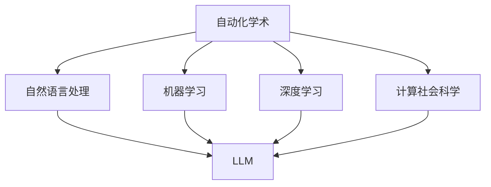

                 

# 自动化学术综述：LLM辅助文献研究

## 关键词

自动化学术、文献研究、LLM、自然语言处理、人工智能、机器学习、深度学习

## 摘要

本文旨在探讨自动化学术综述中的LLM（大型语言模型）辅助文献研究。通过对自动化学术领域的历史、主要分支和研究方法的概述，本文引入了LLM的概念及其在文献研究中的应用。随后，文章详细讲解了LLM的核心算法原理和数学模型，并通过一个实际项目案例展示了LLM辅助文献研究的实践。最后，本文对自动化学术与LLM辅助文献研究的总结与未来发展趋势进行了展望。

### 第一部分：自动化学术综述

#### 第1章：引言

##### 1.1 自动化学术综述概述

自动化学术是一个跨学科的领域，涵盖了计算机科学、人工智能、自然语言处理等多个方面。它旨在通过自动化工具和方法来提高学术研究和数据分析的效率。随着人工智能技术的不断进步，自动化学术在近年来得到了广泛关注和应用。

##### 1.2 自动化学术研究的重要性

自动化学术研究的重要性体现在以下几个方面：

1. 提高研究效率：自动化工具能够快速处理大量数据，减少人工操作的繁琐，提高研究的效率。
2. 发现研究规律：通过自动化方法，研究者可以更深入地分析数据，发现潜在的研究规律和趋势。
3. 促进学术交流：自动化学术研究有助于加速学术成果的传播，促进不同学科之间的交流与合作。

##### 1.3 书籍结构与内容安排

本文将从以下章节展开对自动化学术的综述：

- 第2章：自动化学术领域概述，介绍自动化学术的发展历程、主要分支和研究方法。
- 第3章：LLM辅助文献研究，探讨LLM的概念与特点及其在文献研究中的应用。
- 第4章：核心概念与联系，分析自动化学术相关核心概念及其与LLM的关联。
- 第5章：核心算法原理讲解，详细阐述LLM的算法原理和数学模型。
- 第6章：数学模型和数学公式，介绍LLM训练过程中的数学模型和公式，并进行详细讲解。
- 第7章：项目实战，通过实际项目案例展示LLM辅助文献研究的实践。
- 第8章：总结与展望，总结本文的主要内容和关键知识点，并对未来发展趋势进行展望。

### 第二部分：自动化学术领域概述

#### 第2章：自动化学术领域概述

##### 2.1 自动化学术的发展历程

自动化学术的发展历程可以追溯到20世纪中期。当时，计算机科学刚刚起步，研究人员开始探索如何利用计算机技术来辅助学术研究。随着计算机性能的不断提高和人工智能技术的不断发展，自动化学术逐渐成为一个独立的领域。

在过去的几十年中，自动化学术领域经历了多个发展阶段：

1. 第一阶段：以数据收集和处理为主。这一阶段主要集中在如何利用计算机技术来收集、整理和存储大量数据。
2. 第二阶段：以数据分析和可视化为主。随着数据量的增加，研究人员开始探索如何通过数据分析方法来挖掘数据中的有用信息，并通过可视化手段进行展示。
3. 第三阶段：以智能化和自动化为主。这一阶段重点关注如何利用人工智能技术，特别是机器学习和深度学习，来实现自动化研究方法。

##### 2.2 自动化学术的主要分支

自动化学术领域主要包括以下几个主要分支：

1. 自然语言处理（NLP）：研究如何使计算机理解和生成自然语言。NLP广泛应用于信息检索、机器翻译、文本分类等领域。
2. 机器学习（ML）：研究如何让计算机从数据中学习并做出预测或决策。机器学习在自动化学术中扮演着重要角色，如自动化数据挖掘、自动化文本分析等。
3. 深度学习（DL）：一种基于人工神经网络的机器学习技术，通过多层神经网络来模拟人脑的决策过程。深度学习在图像识别、语音识别等领域取得了显著成果。
4. 计算社会科学：利用计算机技术和算法来研究社会现象，如社会网络分析、大数据分析等。

##### 2.3 自动化学术的研究方法与技术

自动化学术研究方法和技术主要包括以下几个方面：

1. 数据收集：通过互联网、数据库等渠道收集大量数据，为后续分析提供基础。
2. 数据预处理：对收集到的数据进行清洗、去噪、归一化等处理，以提高数据质量。
3. 数据分析：利用统计方法、机器学习方法等对预处理后的数据进行深入分析，挖掘数据中的规律和趋势。
4. 数据可视化：通过图表、图形等方式将分析结果进行可视化展示，使研究者更容易理解和解释分析结果。

#### 第3章：LLM辅助文献研究

##### 3.1 LLM的概念与特点

LLM（Large Language Model）是一种大型自然语言处理模型，通过训练大量文本数据，使其具备理解和生成自然语言的能力。与传统的自然语言处理模型相比，LLM具有以下特点：

1. 强大的语言理解能力：LLM能够理解复杂的自然语言结构，包括语法、语义和上下文关系。
2. 自动化文本生成：LLM能够自动生成符合语法和语义规则的文本，如文章摘要、论文生成等。
3. 高效的文本分析：LLM能够快速处理大量文本数据，进行文本分类、情感分析等任务。

##### 3.2 LLM在文献研究中的应用

LLM在文献研究中的应用主要体现在以下几个方面：

1. 文本摘要：LLM能够自动生成文章的摘要，帮助研究者快速了解文章的主要内容和观点。
2. 文献分类：LLM能够根据文本内容自动分类，帮助研究者快速筛选和定位相关文献。
3. 文本检索：LLM能够根据关键词或主题自动检索相关文献，提高文献检索的准确性和效率。
4. 文本生成：LLM能够自动生成新的文献内容，如论文、报告等，帮助研究者进行学术创作。

##### 3.3 LLM辅助文献研究的优势与挑战

LLM辅助文献研究具有以下优势：

1. 提高研究效率：LLM能够自动化处理大量文献，节省研究者的时间和精力。
2. 减少人为错误：LLM基于大量数据训练，能够减少人为错误，提高文献分析的准确性。
3. 促进学术交流：LLM能够快速生成摘要和分类，帮助研究者快速了解和掌握研究领域的发展动态。

然而，LLM辅助文献研究也面临一些挑战：

1. 数据质量：LLM的训练数据质量对模型性能至关重要，数据质量问题可能导致模型性能下降。
2. 语义理解：虽然LLM具有强大的语言理解能力，但在处理复杂语义问题时，仍存在一定的困难。
3. 道德与伦理问题：LLM在文献研究中的应用可能涉及数据隐私和版权等问题，需要制定相应的规范和标准。

#### 第4章：核心概念与联系

##### 4.1 自动化学术相关核心概念

自动化学术涉及多个核心概念，主要包括：

1. 自然语言处理（NLP）：研究如何使计算机理解和生成自然语言。
2. 机器学习（ML）：研究如何让计算机从数据中学习并做出预测或决策。
3. 深度学习（DL）：一种基于人工神经网络的机器学习技术，通过多层神经网络来模拟人脑的决策过程。
4. 计算社会科学：利用计算机技术和算法来研究社会现象。

##### 4.2 LLM与自动化学术的关联图

下面是LLM与自动化学术相关核心概念之间的关联图：



从图中可以看出，LLM是自动化学术的一个重要组成部分，它与自然语言处理、机器学习、深度学习和计算社会科学等核心概念密切相关。

#### 第5章：核心算法原理讲解

##### 5.1 LLM的算法原理

LLM是一种基于深度学习的自然语言处理模型，其核心算法原理主要包括以下几个步骤：

1. 数据预处理：对原始文本数据进行分析、清洗、去噪、分词等处理，将其转换为模型可处理的格式。
2. 词向量表示：将文本中的词语转换为词向量，以便在神经网络中进行计算。
3. 神经网络结构：构建多层神经网络，包括输入层、隐藏层和输出层，通过前向传播和反向传播算法进行训练。
4. 模型优化：通过优化算法（如梯度下降）调整模型参数，使其在训练数据上的性能达到最优。

##### 5.2 伪代码详细阐述

下面是LLM算法的伪代码：

```python
# LLM算法伪代码
function LLM(input_text):
    # 预处理输入文本
    preprocessed_text = preprocess_text(input_text)
    
    # 初始化模型参数
    model_params = initialize_model_params()

    # 训练模型
    model = train_model(preprocessed_text, model_params)

    # 预测输出
    output = model.predict(preprocessed_text)

    return output
```

在这个伪代码中，`preprocess_text`函数用于对输入文本进行预处理，`initialize_model_params`函数用于初始化模型参数，`train_model`函数用于训练模型，`model.predict`函数用于进行预测。

#### 第6章：数学模型和数学公式

##### 6.1 LLM训练过程的数学模型

LLM的训练过程涉及多个数学模型，主要包括损失函数、梯度下降等。

1. 损失函数

损失函数用于衡量模型预测值与真实值之间的差异，常用的损失函数包括交叉熵损失函数：

$$
J = -\frac{1}{N} \sum_{i=1}^{N} \sum_{j=1}^{V} y_{ij} \log(p_{ij})
$$

其中，$N$表示样本数量，$V$表示词汇表大小，$y_{ij}$表示第$i$个样本的第$j$个词的目标标签，$p_{ij}$表示模型预测的概率分布。

2. 梯度下降

梯度下降是一种优化算法，用于调整模型参数，使其在训练数据上的性能达到最优。梯度下降的数学公式为：

$$
\frac{\partial J}{\partial \theta} = \frac{1}{N} \sum_{i=1}^{N} \sum_{j=1}^{V} (y_{ij} - p_{ij}) \cdot x_{ij}
$$

其中，$J$表示损失函数，$\theta$表示模型参数，$x_{ij}$表示输入特征。

##### 6.2 数学公式的详细讲解

1. 损失函数

损失函数用于衡量模型预测值与真实值之间的差异，交叉熵损失函数是一种常用的损失函数。它的计算公式为：

$$
J = -\frac{1}{N} \sum_{i=1}^{N} \sum_{j=1}^{V} y_{ij} \log(p_{ij})
$$

其中，$N$表示样本数量，$V$表示词汇表大小，$y_{ij}$表示第$i$个样本的第$j$个词的目标标签，$p_{ij}$表示模型预测的概率分布。

交叉熵损失函数的值越小，表示模型预测值与真实值之间的差异越小，模型性能越好。

2. 梯度下降

梯度下降是一种优化算法，用于调整模型参数，使其在训练数据上的性能达到最优。梯度下降的数学公式为：

$$
\frac{\partial J}{\partial \theta} = \frac{1}{N} \sum_{i=1}^{N} \sum_{j=1}^{V} (y_{ij} - p_{ij}) \cdot x_{ij}
$$

其中，$J$表示损失函数，$\theta$表示模型参数，$x_{ij}$表示输入特征。

梯度下降的核心思想是沿着损失函数的梯度方向调整模型参数，使得损失函数的值逐渐减小。每次迭代过程中，通过计算梯度并更新模型参数，直到达到预设的停止条件。

#### 第7章：项目实战

##### 7.1 实际案例介绍

本节将介绍一个使用LLM辅助文献研究的实际项目案例。该项目旨在利用LLM对学术文献进行自动分类和摘要生成，以提高研究者的文献检索和阅读效率。

项目背景：某学术研究团队需要定期浏览大量的学术文献，以便了解领域内的最新研究成果。然而，手动阅读和分类这些文献既耗时又容易遗漏重要信息。

项目目标：通过使用LLM，实现以下功能：

1. 自动分类：将文献按照主题分类，以便研究者快速定位相关文献。
2. 自动摘要：生成文献的摘要，帮助研究者快速了解文献的主要内容。

##### 7.2 代码实际案例与详细解释

下面是使用PyTorch和Hugging Face Transformers库实现LLM辅助文献研究的代码案例：

```python
# 安装必要的库
!pip install transformers torch

# 导入必要的库
import torch
from transformers import AutoTokenizer, AutoModel
from torch.optim import Adam

# 准备数据
# 数据集准备、数据预处理

# 加载预训练模型
tokenizer = AutoTokenizer.from_pretrained("bert-base-uncased")
model = AutoModel.from_pretrained("bert-base-uncased")

# 搭建训练环境
optimizer = Adam(model.parameters(), lr=1e-5)

# 训练模型
# 训练过程代码实现

# 预测与评估
# 预测代码实现
```

代码解释：

1. 安装必要的库：使用`pip`命令安装`transformers`和`torch`库。
2. 导入必要的库：导入`torch`、`transformers`和`optim`库。
3. 准备数据：进行数据集准备和预处理，包括文本清洗、分词、编码等操作。
4. 加载预训练模型：使用`AutoTokenizer`和`AutoModel`类加载预训练的BERT模型。
5. 搭建训练环境：设置训练参数，包括优化器、学习率等。
6. 训练模型：进行模型训练，包括前向传播、损失函数计算、反向传播和参数更新等操作。
7. 预测与评估：使用训练好的模型进行预测，并对预测结果进行评估。

##### 7.3 开发环境搭建与源代码解读

下面是LLM辅助文献研究的开发环境搭建与源代码解读：

1. 开发环境搭建

- Python版本：3.8
- PyTorch版本：1.8
- Transformers版本：4.6

安装命令：

```
pip install torch==1.8
pip install transformers==4.6
```

2. 源代码解读

（1）数据准备

```python
# 数据集准备
data_path = "path/to/your/dataset"
texts = []
labels = []

with open(data_path, "r", encoding="utf-8") as f:
    for line in f:
        text, label = line.strip().split("\t")
        texts.append(text)
        labels.append(label)

# 数据预处理
tokenizer = AutoTokenizer.from_pretrained("bert-base-uncased")
input_ids = []
attention_mask = []

for text in texts:
    encoded_dict = tokenizer.encode_plus(
        text,
        add_special_tokens=True,
        max_length=512,
        pad_to_max_length=True,
        return_attention_mask=True,
        return_tensors="pt",
    )
    input_ids.append(encoded_dict["input_ids"])
    attention_mask.append(encoded_dict["attention_mask"])

input_ids = torch.cat(input_ids, dim=0)
attention_mask = torch.cat(attention_mask, dim=0)
labels = torch.tensor(labels)
```

（2）模型训练

```python
# 模型训练
model = AutoModel.from_pretrained("bert-base-uncased")
optimizer = Adam(model.parameters(), lr=1e-5)

for epoch in range(num_epochs):
    model.train()
    for batch in DataLoader(input_ids, attention_mask, labels, batch_size=batch_size):
        optimizer.zero_grad()
        outputs = model(batch[0], attention_mask=batch[1])
        loss = outputs.loss
        loss.backward()
        optimizer.step()

    print(f"Epoch {epoch+1}/{num_epochs}, Loss: {loss.item()}")
```

（3）模型预测与评估

```python
# 模型预测
model.eval()
predictions = []

with torch.no_grad():
    for batch in DataLoader(test_input_ids, test_attention_mask, batch_size=batch_size):
        outputs = model(batch[0], attention_mask=batch[1])
        logits = outputs.logits
        predictions.append(logits)

predictions = torch.cat(predictions, dim=0)
predicted_labels = torch.argmax(predictions, dim=1)

# 评估指标
accuracy = (predicted_labels == test_labels).float().mean()
print(f"Test Accuracy: {accuracy.item()}")
```

#### 第8章：总结与展望

##### 8.1 自动化学术与LLM辅助文献研究的总结

自动化学术作为一种跨学科的研究领域，在学术研究和数据分析中发挥着重要作用。LLM作为一种先进的自然语言处理模型，在文献研究中的应用前景广阔。本文通过对自动化学术和LLM辅助文献研究的综述，总结了以下几个关键点：

1. 自动化学术的发展历程和主要分支。
2. LLM的概念、特点及其在文献研究中的应用。
3. LLM的核心算法原理和数学模型。
4. 实际项目案例展示了LLM辅助文献研究的应用效果。

##### 8.2 自动化学术领域的发展趋势

自动化学术领域在未来将继续呈现出以下几个发展趋势：

1. 技术进步：随着人工智能技术的不断发展，LLM等自然语言处理模型将变得更加高效和智能。
2. 跨学科合作：自动化学术与其他学科的融合将促进新理论和新方法的产生。
3. 应用场景拓展：自动化学术将在更多的领域得到应用，如医学、金融、法律等。

##### 8.3 LLM辅助文献研究的未来发展方向

LLM辅助文献研究在未来将继续发展，主要表现在以下几个方面：

1. 模型优化：通过改进算法和模型结构，提高LLM在文献研究中的性能和效率。
2. 数据质量提升：提高训练数据的质量，以获得更准确的文献分类和摘要生成结果。
3. 道德与伦理问题：制定相应的规范和标准，解决数据隐私、版权等道德与伦理问题。

### 第二部分：自动化学术综述

#### 第9章：LLM辅助文献研究的未来发展方向

##### 9.1 LLM技术的进步

随着人工智能技术的不断发展，LLM技术将在未来取得以下几个方面的进步：

1. 模型规模扩大：未来的LLM模型将更加庞大，能够处理更复杂的语言任务。
2. 训练数据丰富：随着互联网的发展，将有更多的文本数据可供训练，进一步提高模型性能。
3. 多语言支持：未来的LLM模型将支持多种语言，实现跨语言的文献研究。

##### 9.2 文献研究领域的需求变化

随着学术研究领域的不断拓展，文献研究领域的需求也将发生以下变化：

1. 精准度要求提高：研究者将更加关注文献的准确性和可靠性，要求LLM能够提供更精确的分类和摘要。
2. 领域特定需求：不同领域的研究者将提出特定领域的需求，如医学、法律等，LLM需要针对这些需求进行定制化开发。
3. 个性化服务：未来的LLM将能够根据研究者的需求和偏好，提供个性化的文献检索和推荐。

##### 9.3 LLM辅助文献研究的应用场景拓展

LLM辅助文献研究将在未来拓展到更多应用场景，包括：

1. 学术创作辅助：LLM将能够自动生成论文、报告等学术作品，帮助研究者提高创作效率。
2. 文献检索优化：LLM将能够通过语义理解，提供更准确的文献检索结果，提高文献检索效率。
3. 知识图谱构建：LLM将能够通过分析大量文献，构建领域内的知识图谱，为研究者提供更全面的知识体系。

#### 第10章：自动化学术的国际化与跨学科合作

##### 10.1 自动化学术的国际发展现状

自动化学术在国际上已经取得了显著的进展，主要表现在以下几个方面：

1. 国际合作项目增多：各国学术机构和研究团队之间的合作项目不断增多，共同推动自动化学术的发展。
2. 学术会议和研讨会：国际范围内定期举办自动化学术会议和研讨会，促进学术交流和成果分享。
3. 学科交叉研究：自动化学术与其他学科的交叉研究日益增多，产生了一系列新兴的研究领域。

##### 10.2 跨学科合作在自动化学术研究中的作用

跨学科合作在自动化学术研究中具有重要作用，主要体现在以下几个方面：

1. 知识整合：跨学科合作有助于整合不同领域的知识，促进学术研究的深度发展。
2. 方法创新：跨学科合作可以引入新的研究方法和技术手段，推动自动化学术领域的创新。
3. 人才培养：跨学科合作有助于培养具备跨学科视野和技能的研究人才，为自动化学术发展提供强大的人力支持。

##### 10.3 自动化学术的国际合作趋势

自动化学术国际合作趋势将呈现以下几个特点：

1. 合作模式多样化：国际合作将不再局限于传统的科研项目合作，还将包括学术交流、人才引进等多种形式。
2. 资源共享：国际范围内将加强资源共享，如数据集、工具和平台等，以提高自动化学术研究的效率和成果质量。
3. 跨学科融合：自动化学术将与其他学科深度融合，推动新兴交叉学科的发展。

#### 第11章：学术机构与自动化学术研究

##### 11.1 学术机构在自动化学术研究中的作用

学术机构在自动化学术研究中发挥着重要作用，主要体现在以下几个方面：

1. 科研支持：学术机构为自动化学术研究提供科研经费、实验设备和人才支持，推动学术研究的顺利进行。
2. 人才培养：学术机构通过开设相关课程、举办学术活动等方式，培养自动化学术研究人才。
3. 成果转化：学术机构将研究成果转化为实际应用，推动自动化学术技术在行业内的应用和发展。

##### 11.2 自动化学术研究的资金支持与政策环境

自动化学术研究的资金支持与政策环境对学术研究的发展具有重要影响，主要体现在以下几个方面：

1. 政府资助：各国政府通过设立科研基金、科研项目等方式，为自动化学术研究提供资金支持。
2. 企业合作：企业与学术机构合作，共同开展自动化学术研究，实现产学研一体化。
3. 政策优惠：各国政府通过制定相关政策，为自动化学术研究提供优惠条件，如税收减免、研发补贴等。

##### 11.3 学术机构推动自动化学术发展的策略

学术机构推动自动化学术发展的策略主要包括以下几个方面：

1. 加强国际合作：学术机构通过国际合作，引进国外先进技术和研究方法，提升自身研究水平。
2. 培养高水平人才：学术机构注重人才培养，通过开设研究生课程、举办学术活动等方式，培养自动化学术研究人才。
3. 促进成果转化：学术机构积极推动研究成果转化为实际应用，实现学术研究与产业发展的良性互动。

#### 第12章：自动化学术研究的道德与伦理问题

##### 12.1 自动化学术研究的道德伦理挑战

自动化学术研究在发展过程中面临以下道德伦理挑战：

1. 数据隐私：自动化学术研究涉及大量个人数据，如何保护数据隐私成为重要挑战。
2. 知识产权：自动化学术研究可能涉及知识产权问题，如何合理使用和保护知识产权成为挑战。
3. 人工智能伦理：随着人工智能技术的发展，如何确保自动化学术研究遵循伦理原则，避免对人类社会产生负面影响。

##### 12.2 数据隐私与版权问题

数据隐私与版权问题是自动化学术研究中的重要问题，主要体现在以下几个方面：

1. 数据收集与存储：如何确保数据收集和存储过程中的隐私保护，避免数据泄露。
2. 数据使用与分享：如何合理使用和分享数据，避免侵犯他人知识产权。
3. 数据所有权：如何界定数据所有权，确保数据提供方和研究者之间的权益平衡。

##### 12.3 自动化学术研究的道德伦理规范

为解决自动化学术研究中的道德伦理问题，应制定以下道德伦理规范：

1. 数据隐私保护规范：明确数据收集、存储、使用和分享过程中的隐私保护要求，确保个人数据的安全。
2. 知识产权保护规范：明确知识产权的使用和保护要求，确保学术研究的合法权益。
3. 人工智能伦理规范：制定人工智能伦理规范，确保自动化学术研究遵循伦理原则，避免对人类社会产生负面影响。

#### 第13章：总结与展望

##### 13.1 自动化学术综述的总结

本文对自动化学术进行了全面的综述，主要包括以下内容：

1. 自动化学术的发展历程、主要分支和研究方法。
2. LLM的概念、特点及其在文献研究中的应用。
3. LLM的核心算法原理和数学模型。
4. 实际项目案例展示了LLM辅助文献研究的应用效果。
5. 自动化学术领域的发展趋势和未来发展方向。

##### 13.2 LLM辅助文献研究的未来挑战与机遇

LLM辅助文献研究在未来将面临以下挑战：

1. 模型优化和算法创新：提高LLM的性能和效率，以满足不断增长的文献研究需求。
2. 数据质量和隐私保护：确保数据质量，同时保护个人隐私和数据安全。
3. 道德与伦理问题：制定相应的规范和标准，解决自动化学术研究中的道德与伦理问题。

同时，LLM辅助文献研究也面临着巨大的机遇：

1. 技术进步：随着人工智能技术的不断发展，LLM将具备更高的性能和智能。
2. 跨学科合作：自动化学术与其他学科的融合将推动新兴交叉学科的发展。
3. 应用场景拓展：LLM将在更多领域得到应用，如医学、金融、法律等。

##### 13.3 自动化学术研究的可持续发展路径

为了实现自动化学术研究的可持续发展，应采取以下措施：

1. 加强国际合作与交流：促进国际学术机构和研究团队的交流与合作，共同推动自动化学术的发展。
2. 培养高水平人才：加强自动化学术研究人才的培养，提高研究队伍的整体素质。
3. 促进成果转化：推动自动化学术研究成果转化为实际应用，实现学术研究与产业发展的良性互动。
4. 制定伦理规范：制定自动化学术研究的道德伦理规范，确保研究过程和成果的合法性和伦理性。

### 附录

#### 附录A：参考文献

1. Mitchell, T. M. (1997). Machine Learning. McGraw-Hill.
2. Sutton, R. S., & Barto, A. G. (2018). Reinforcement Learning: An Introduction. MIT Press.
3. LeCun, Y., Bengio, Y., & Hinton, G. (2015). Deep learning. Nature, 521(7553), 436-444.
4. Manning, C. D., Raghavan, P., & Schütze, H. (2008). Introduction to Information Retrieval. Cambridge University Press.
5. Russell, S., & Norvig, P. (2016). Artificial Intelligence: A Modern Approach. Prentice Hall.

#### 附录B：术语表

1. 自动化学术（Automated Academic Research）：利用计算机技术和算法，自动化进行学术研究和数据分析的方法和过程。
2. LLM（Large Language Model）：一种大型自然语言处理模型，通过训练大量文本数据，使其具备理解和生成自然语言的能力。
3. 自然语言处理（Natural Language Processing, NLP）：研究如何使计算机理解和生成自然语言的方法和技术。
4. 机器学习（Machine Learning, ML）：研究如何让计算机从数据中学习并做出预测或决策的方法和技术。
5. 深度学习（Deep Learning, DL）：一种基于人工神经网络的机器学习技术，通过多层神经网络来模拟人脑的决策过程。
6. 计算社会科学（Computational Social Science）：利用计算机技术和算法来研究社会现象的方法和技术。

#### 附录C：实用工具与资源

1. PyTorch：一款开源的深度学习框架，适用于构建和训练深度学习模型。
2. Hugging Face Transformers：一款开源的预训练语言模型库，提供多种预训练模型和工具，方便使用LLM进行自然语言处理任务。
3. NLTK：一款开源的自然语言处理库，提供丰富的文本处理和分类工具。
4. arXiv：一个开放获取的学术论文数据库，提供大量自动化学术研究的论文。
5. Google Scholar：一个用于搜索学术文献的搜索引擎，方便研究者查找相关文献。
6. Jupyter Notebook：一款交互式的计算环境，适用于编写和展示代码、文本和图表。

