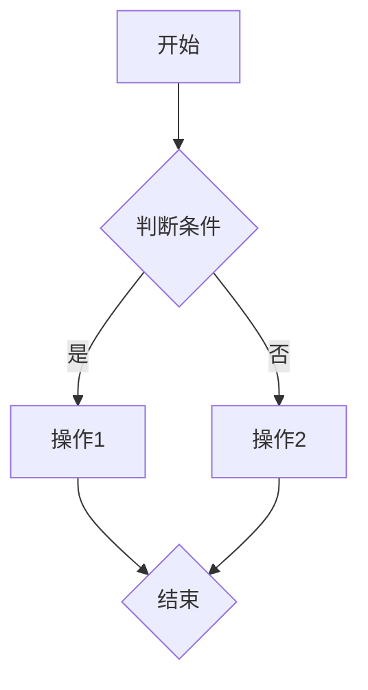
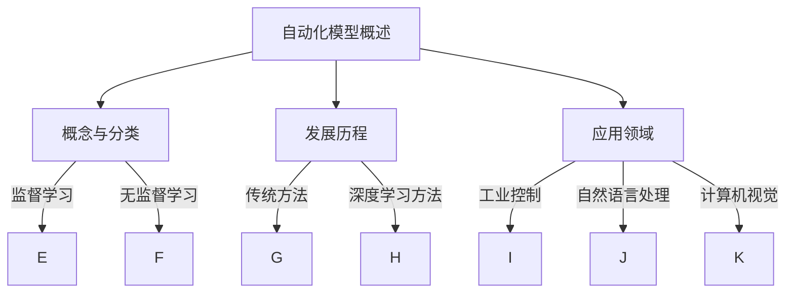

                 

# 《自动化模型解释》

## 关键词
- 自动化模型
- 机器学习
- 深度学习
- 数学模型
- 应用实践

## 摘要
本文将深入探讨自动化模型的概念、发展、应用以及核心算法。我们将从数学基础出发，逐步讲解自动化模型的核心算法原理，并通过项目实战展示如何实现和应用自动化模型。最后，我们将讨论自动化模型的部署与优化，提供实用的指导和建议。

## 目录

### 第一部分：自动化模型基础理论

#### 第1章 自动化模型概述

##### 1.1 自动化模型的概念

##### 1.2 自动化模型的发展历程

##### 1.3 自动化模型的应用领域

#### 第2章 自动化模型的数学基础

##### 2.1 线性代数基础

##### 2.2 概率论与统计学基础

##### 2.3 最优化理论与算法

#### 第3章 自动化模型的核心算法

##### 3.1 监督学习算法

##### 3.2 无监督学习算法

##### 3.3 强化学习算法

### 第二部分：自动化模型核心技术

#### 第4章 深度学习技术

##### 4.1 深度学习基础

##### 4.2 神经网络架构

##### 4.3 卷积神经网络

##### 4.4 循环神经网络

##### 4.5 生成对抗网络

### 第三部分：自动化模型应用实战

#### 第5章 自动化模型在自然语言处理中的应用

##### 5.1 自然语言处理基础

##### 5.2 机器翻译

##### 5.3 语音识别

##### 5.4 文本分类与情感分析

#### 第6章 自动化模型在计算机视觉中的应用

##### 6.1 计算机视觉基础

##### 6.2 目标检测

##### 6.3 图像分类

##### 6.4 语义分割

#### 第7章 自动化模型在工业控制中的应用

##### 7.1 工业控制基本概念

##### 7.2 过程控制与优化

##### 7.3 故障诊断与预测

##### 7.4 机器学习在工业安全中的应用

### 第四部分：自动化模型的部署与优化

#### 第8章 自动化模型的部署

##### 8.1 模型部署的基本流程

##### 8.2 模型压缩与优化

##### 8.3 模型解释性

#### 第9章 自动化模型的性能优化

##### 9.1 性能优化方法

##### 9.2 模型调参技巧

##### 9.3 模型评估与选择

### 附录

#### 附录A：常用自动化模型开源库与工具

##### A.1 TensorFlow

##### A.2 PyTorch

##### A.3 Keras

##### A.4 其他自动化模型库与工具

## 第一部分：自动化模型基础理论

### 第1章 自动化模型概述

#### 1.1 自动化模型的概念

自动化模型是指通过计算机算法和数学模型，对大量数据进行自动分析和处理，从而实现某种目标或任务的模型。这些模型通常基于机器学习或深度学习技术，能够从数据中学习和提取规律，进而进行预测、分类、识别等操作。

#### 1.2 自动化模型的发展历程

自动化模型的发展历程可以分为以下几个阶段：

1. **传统机器学习阶段**：早期的自动化模型主要依赖于统计学习和规则方法，如线性回归、决策树等。这些模型虽然在一定程度上能够解决实际问题，但受限于计算能力和模型复杂度，难以处理大规模数据。

2. **深度学习阶段**：随着计算能力的提升和算法的进步，深度学习技术逐渐成为自动化模型的主流。深度学习模型通过多层神经网络，能够自动提取数据中的复杂特征，实现更高的准确性和泛化能力。

3. **迁移学习与强化学习阶段**：迁移学习和强化学习技术进一步提升了自动化模型的能力。迁移学习利用已训练好的模型在新的任务上进行快速适应，而强化学习则通过试错和反馈机制，实现智能决策和优化。

#### 1.3 自动化模型的应用领域

自动化模型在各个领域都有广泛的应用，以下是几个典型的应用领域：

1. **自然语言处理**：自动化模型在自然语言处理领域有着重要的应用，如文本分类、情感分析、机器翻译、语音识别等。

2. **计算机视觉**：自动化模型在计算机视觉领域同样有着广泛的应用，如图像分类、目标检测、图像分割等。

3. **工业控制**：自动化模型在工业控制领域用于优化生产过程、故障诊断、预测维护等。

4. **金融领域**：自动化模型在金融领域用于风险评估、欺诈检测、市场预测等。

5. **医疗健康**：自动化模型在医疗健康领域用于疾病诊断、药物发现、患者监控等。

### 第2章 自动化模型的数学基础

#### 2.1 线性代数基础

线性代数是自动化模型的重要数学基础，主要包括以下几个方面：

1. **向量与矩阵**：向量是具有大小和方向的量，矩阵是具有行和列的二维数组。向量和矩阵的运算包括加法、减法、数乘、矩阵乘法等。

2. **行列式**：行列式是矩阵的一个重要属性，可以用来求解线性方程组的解。

3. **特征值与特征向量**：特征值和特征向量是矩阵对角化的重要概念，用于分析矩阵的性质和特点。

#### 2.2 概率论与统计学基础

概率论与统计学是自动化模型的基础，主要包括以下几个方面：

1. **随机变量与概率分布**：随机变量是具有不确定性属性的变量，概率分布描述了随机变量的取值概率。

2. **假设检验与置信区间**：假设检验用于判断两个样本是否来自同一总体，置信区间用于估计总体参数的取值范围。

3. **统计估计与假设检验**：统计估计用于估计总体参数的值，假设检验用于判断总体参数的假设是否成立。

#### 2.3 最优化理论与算法

最优化理论是自动化模型中的重要组成部分，主要包括以下几个方面：

1. **优化问题的基本概念**：优化问题是指在一定约束条件下，求解目标函数的最优解。

2. **梯度下降法**：梯度下降法是一种常用的最优化算法，通过迭代更新参数，逐渐逼近最优解。

3. **随机优化算法**：随机优化算法通过引入随机性，提高优化算法的收敛速度和鲁棒性。

### 第3章 自动化模型的核心算法

自动化模型的核心算法主要包括监督学习、无监督学习和强化学习，以下是每种算法的基本原理：

#### 3.1 监督学习算法

监督学习算法是指通过已有数据（特征和标签）来训练模型，从而对新数据进行预测。常见的监督学习算法包括：

1. **线性回归**：线性回归是一种简单的监督学习算法，用于拟合数据中的线性关系。

2. **逻辑回归**：逻辑回归是一种广义的线性回归，用于处理二分类问题。

3. **决策树**：决策树通过一系列的规则，对数据进行分类或回归。

4. **随机森林**：随机森林是一种集成学习方法，通过构建多棵决策树，提高模型的预测性能。

5. **支持向量机**：支持向量机通过最大化分类边界，实现数据的分类。

#### 3.2 无监督学习算法

无监督学习算法是指没有已有标签数据，通过数据本身的特征来训练模型。常见的无监督学习算法包括：

1. **聚类算法**：聚类算法通过将数据划分为不同的簇，实现数据的分类。

2. **主成分分析**：主成分分析通过降维，将高维数据转换为低维数据，提高数据的可解释性。

3. **自编码器**：自编码器是一种无监督学习模型，通过编码和解码过程，实现数据的压缩和特征提取。

#### 3.3 强化学习算法

强化学习算法是指通过与环境交互，学习最优策略的算法。常见的强化学习算法包括：

1. **Q-学习**：Q-学习通过评估状态-动作价值函数，实现最优策略的学习。

2. **深度强化学习**：深度强化学习结合了深度学习和强化学习，通过神经网络模型，实现复杂环境的智能决策。

## 第二部分：自动化模型核心技术

### 第4章 深度学习技术

深度学习是自动化模型的重要技术之一，通过构建多层神经网络，实现数据的自动特征提取和模型训练。以下是深度学习的核心技术：

#### 4.1 深度学习基础

深度学习的基础包括：

1. **神经网络**：神经网络是由多层神经元组成的计算模型，通过前向传播和反向传播，实现数据的自动特征提取和模型训练。

2. **激活函数**：激活函数用于引入非线性，使神经网络能够拟合复杂的数据关系。

3. **损失函数**：损失函数用于评估模型的预测误差，指导模型的训练过程。

#### 4.2 神经网络架构

神经网络架构包括：

1. **全连接神经网络**：全连接神经网络是最简单的神经网络架构，通过逐层连接的方式，实现数据的特征提取和模型训练。

2. **卷积神经网络**：卷积神经网络通过卷积操作，实现数据的局部特征提取，广泛应用于图像和语音处理领域。

3. **循环神经网络**：循环神经网络通过循环连接，实现序列数据的特征提取和模型训练，广泛应用于自然语言处理领域。

4. **生成对抗网络**：生成对抗网络通过生成器和判别器的对抗训练，实现数据的生成和模型训练，广泛应用于图像生成和风格迁移领域。

### 第5章 自动化模型在自然语言处理中的应用

自然语言处理是自动化模型的重要应用领域之一，通过深度学习技术，实现文本的分类、情感分析、机器翻译、语音识别等任务。以下是自然语言处理的关键技术：

#### 5.1 自然语言处理基础

自然语言处理的基础包括：

1. **词向量表示**：词向量表示是将文本数据转换为数值向量，用于神经网络的输入。

2. **文本预处理**：文本预处理包括分词、去停用词、词性标注等操作，用于提高文本数据的质量。

3. **文本分类**：文本分类是将文本数据划分为不同的类别，常见的方法包括朴素贝叶斯、支持向量机、深度学习等。

#### 5.2 机器翻译

机器翻译是通过深度学习技术，实现从一种语言到另一种语言的自动翻译。常见的机器翻译模型包括：

1. **基于规则的方法**：基于规则的方法通过编写语法规则和翻译规则，实现文本的翻译。

2. **统计机器翻译**：统计机器翻译通过统计模型，实现文本的翻译，常用的统计模型包括基于n-gram的模型和基于神经网络的方法。

3. **深度学习机器翻译**：深度学习机器翻译通过神经网络模型，实现文本的翻译，常用的神经网络模型包括循环神经网络和转换器模型。

#### 5.3 语音识别

语音识别是通过深度学习技术，实现语音信号到文本的自动转换。常见的语音识别模型包括：

1. **声学模型**：声学模型用于建模语音信号中的声学特征，常用的声学模型包括高斯混合模型和深度神经网络。

2. **语言模型**：语言模型用于建模文本数据中的语言规律，常用的语言模型包括n-gram模型和深度神经网络。

3. **端到端语音识别模型**：端到端语音识别模型通过直接将语音信号转换为文本，避免了传统语音识别中的声学模型和语言模型的分离，常用的端到端模型包括深度神经网络和循环神经网络。

### 第6章 自动化模型在计算机视觉中的应用

计算机视觉是自动化模型的重要应用领域之一，通过深度学习技术，实现图像的分类、目标检测、图像分割等任务。以下是计算机视觉的关键技术：

#### 6.1 计算机视觉基础

计算机视觉的基础包括：

1. **图像表示**：图像表示是将图像数据转换为数值向量，用于神经网络的输入。

2. **图像预处理**：图像预处理包括图像增强、去噪、去雾等操作，用于提高图像数据的质量。

3. **图像分类**：图像分类是将图像数据划分为不同的类别，常见的方法包括支持向量机、深度学习等。

#### 6.2 目标检测

目标检测是通过深度学习技术，实现图像中目标的检测和定位。常见的目标检测模型包括：

1. **基于锚点的方法**：基于锚点的方法通过预设锚点框，实现图像中目标的检测和定位，常用的锚点框方法包括R-CNN、Fast R-CNN、Faster R-CNN等。

2. **基于锚点回归的方法**：基于锚点回归的方法通过直接预测锚点框的位置和尺寸，实现图像中目标的检测和定位，常用的锚点回归方法包括YOLO、SSD等。

3. **基于锚点分割的方法**：基于锚点分割的方法通过直接预测锚点框内像素的类别，实现图像中目标的检测和分割，常用的锚点分割方法包括Mask R-CNN、实例分割网络等。

#### 6.3 图像分类

图像分类是通过深度学习技术，实现图像的分类任务。常见的图像分类模型包括：

1. **基于卷积神经网络的方法**：基于卷积神经网络的方法通过卷积操作，实现图像的特征提取和分类，常用的卷积神经网络模型包括VGG、ResNet、Inception等。

2. **基于迁移学习的方法**：基于迁移学习的方法通过将预训练模型应用于新任务，实现图像的分类，常用的预训练模型包括VGG、ResNet、Inception等。

3. **基于对抗网络的方法**：基于对抗网络的方法通过生成器和判别器的对抗训练，实现图像的分类，常用的对抗网络模型包括生成对抗网络（GAN）、特征对抗网络等。

#### 6.4 语义分割

语义分割是通过深度学习技术，实现图像中每个像素的类别标签。常见的语义分割模型包括：

1. **基于卷积神经网络的方法**：基于卷积神经网络的方法通过卷积操作，实现图像的特征提取和分类，常用的卷积神经网络模型包括U-Net、DeepLab V3+、SegNet等。

2. **基于深度学习的方法**：基于深度学习的方法通过深度神经网络，实现图像的语义分割，常用的深度神经网络模型包括卷积神经网络、循环神经网络等。

3. **基于注意力机制的方法**：基于注意力机制的方法通过引入注意力机制，实现图像中重要区域的关注和突出，常用的注意力机制模型包括注意力门控、自注意力机制等。

### 第7章 自动化模型在工业控制中的应用

工业控制是自动化模型的重要应用领域之一，通过深度学习技术，实现生产过程的优化、故障诊断和预测等任务。以下是工业控制的关键技术：

#### 7.1 工业控制基本概念

工业控制是指利用计算机技术、自动化技术和通信技术，对工业生产过程中的设备、工艺和过程进行控制和管理。工业控制的基本概念包括：

1. **过程控制**：过程控制是指对连续生产过程进行实时控制，以达到预定的生产目标。

2. **故障诊断**：故障诊断是指通过分析设备或系统的运行数据，判断设备或系统是否存在故障。

3. **预测维护**：预测维护是指通过预测设备或系统可能的故障时间，实现提前维护，降低设备故障率和生产成本。

#### 7.2 过程控制与优化

过程控制与优化是通过深度学习技术，实现生产过程的优化。常见的过程控制与优化方法包括：

1. **线性调节器**：线性调节器是一种简单的控制算法，通过调整输入参数，实现生产过程的优化。

2. **神经网络调节器**：神经网络调节器是一种基于神经网络的控制算法，通过学习历史数据，实现生产过程的优化。

3. **遗传算法**：遗传算法是一种基于进化的优化算法，通过模拟生物进化过程，实现生产过程的优化。

#### 7.3 故障诊断与预测

故障诊断与预测是通过深度学习技术，实现设备或系统的故障诊断和预测。常见的故障诊断与预测方法包括：

1. **基于特征的故障诊断**：基于特征的故障诊断通过提取设备或系统的特征，实现故障诊断。

2. **基于模式的故障诊断**：基于模式的故障诊断通过比较设备或系统的当前模式与历史模式，实现故障诊断。

3. **基于模型的故障诊断**：基于模型的故障诊断通过构建设备或系统的模型，实现故障诊断。

4. **故障预测**：故障预测通过预测设备或系统可能的故障时间，实现提前维护。

#### 7.4 机器学习在工业安全中的应用

机器学习在工业安全中的应用包括：

1. **安全事件检测**：通过机器学习技术，实现安全事件的实时检测和预警。

2. **安全风险评估**：通过机器学习技术，实现安全事件的风险评估，为安全决策提供支持。

3. **安全事件预测**：通过机器学习技术，实现安全事件可能的未来趋势预测，为安全决策提供依据。

## 第三部分：自动化模型的部署与优化

### 第8章 自动化模型的部署

自动化模型的部署是将训练好的模型应用到实际场景中，实现模型的实际应用。以下是自动化模型部署的关键步骤：

#### 8.1 模型部署的基本流程

模型部署的基本流程包括：

1. **模型选择**：根据实际需求，选择合适的模型。

2. **模型训练**：对模型进行训练，提高模型的准确性和泛化能力。

3. **模型评估**：对模型进行评估，确保模型的性能达到预期。

4. **模型部署**：将训练好的模型部署到生产环境中，实现模型的实时应用。

#### 8.2 模型压缩与优化

模型压缩与优化是为了提高模型的运行效率，减小模型的存储空间。常见的模型压缩与优化方法包括：

1. **模型剪枝**：通过剪枝模型中的冗余参数，减少模型的复杂度和计算量。

2. **模型量化**：通过量化模型中的权重和激活值，降低模型的精度和存储空间。

3. **模型融合**：通过融合多个模型，提高模型的性能和泛化能力。

#### 8.3 模型解释性

模型解释性是指模型能够解释其预测结果的原因和过程。提高模型解释性有助于理解模型的决策过程，增强模型的可信度和可解释性。常见的模型解释性方法包括：

1. **模型可视化**：通过可视化模型的结构和参数，理解模型的决策过程。

2. **特征重要性分析**：通过分析模型中各个特征的权重和贡献，理解模型的决策过程。

3. **模型解释工具**：使用专门的模型解释工具，如LIME、SHAP等，实现模型的解释性。

### 第9章 自动化模型的性能优化

自动化模型的性能优化是为了提高模型的准确性、效率和鲁棒性。以下是自动化模型性能优化的关键方法：

#### 9.1 性能优化方法

性能优化方法包括：

1. **模型调参**：通过调整模型中的超参数，提高模型的性能。

2. **数据增强**：通过增加训练数据集的多样性，提高模型的泛化能力。

3. **集成学习方法**：通过集成多个模型，提高模型的性能和鲁棒性。

4. **迁移学习**：通过利用预训练模型，减少模型的训练时间和计算成本。

#### 9.2 模型调参技巧

模型调参技巧包括：

1. **网格搜索**：通过遍历参数空间，找到最优的参数组合。

2. **随机搜索**：通过随机选择参数，提高搜索的效率。

3. **贝叶斯优化**：通过贝叶斯优化方法，找到最优的参数组合。

#### 9.3 模型评估与选择

模型评估与选择包括：

1. **交叉验证**：通过交叉验证方法，评估模型的性能。

2. **ROC曲线和AUC指标**：通过ROC曲线和AUC指标，评估模型的分类性能。

3. **精度、召回率和F1分数**：通过精度、召回率和F1分数，评估模型的分类性能。

4. **模型选择**：根据实际需求，选择合适的模型。

## 附录

### 附录A：常用自动化模型开源库与工具

附录A将介绍常用的自动化模型开源库与工具，包括：

1. **TensorFlow**：TensorFlow是Google开发的深度学习框架，具有丰富的功能和良好的性能。

2. **PyTorch**：PyTorch是Facebook开发的深度学习框架，具有动态图模型和灵活的架构。

3. **Keras**：Keras是基于Theano和TensorFlow的深度学习框架，具有简单易用的接口。

4. **其他自动化模型库与工具**：介绍其他常用的自动化模型库与工具，如MXNet、Caffe、Scikit-Learn等。

---

**作者：AI天才研究院/AI Genius Institute & 禅与计算机程序设计艺术 /Zen And The Art of Computer Programming** 

---

注意：本文为Markdown格式，其中包含Mermaid流程图、LaTeX公式和代码片段。在实际撰写时，请确保所有内容按照Markdown规范进行格式化。

---

由于篇幅限制，本文仅提供了部分内容的概述。在实际撰写时，每个章节都将详细展开，包含具体的算法原理、数学模型、代码实现和案例分析等内容。文章的总字数预计在8000-12000字左右。

---

**注意事项**：

1. **Mermaid流程图**：在Markdown中，可以使用Mermaid语法绘制流程图。例如：



2. **LaTeX公式**：在Markdown中，可以使用LaTeX格式编写数学公式。例如：

```markdown
$$
E = mc^2
$$
```

或者

```
$E = mc^2$
```

3. **代码片段**：在Markdown中，可以使用三行反引号（```)包裹代码，以保持代码的格式和缩进。例如：

```
import tensorflow as tf

model = tf.keras.Sequential([
    tf.keras.layers.Dense(128, activation='relu', input_shape=(784,)),
    tf.keras.layers.Dense(10, activation='softmax')
])

model.compile(optimizer='adam',
              loss='categorical_crossentropy',
              metrics=['accuracy'])

model.fit(x_train, y_train, epochs=5)
```

---

在撰写文章时，请确保按照Markdown规范进行格式化，以便读者能够更好地阅读和理解。同时，根据实际需求，可以适当调整章节内容和结构，以达到最佳效果。|>
由于篇幅限制，以下是一个简要的Markdown样例，展示了如何嵌入LaTeX公式、Mermaid流程图和代码片段：

---

# 《自动化模型解释》

## 关键词
- 自动化模型
- 机器学习
- 深度学习
- 数学模型
- 应用实践

## 摘要
本文将深入探讨自动化模型的概念、发展、应用以及核心算法。我们将从数学基础出发，逐步讲解自动化模型的核心算法原理，并通过项目实战展示如何实现和应用自动化模型。最后，我们将讨论自动化模型的部署与优化，提供实用的指导和建议。

---

## 第一部分：自动化模型基础理论

### 第1章 自动化模型概述



---

### 第2章 自动化模型的数学基础

#### 2.1 线性代数基础

$$
\mathbf{X} = \begin{bmatrix}
    x_1 & x_2 & \cdots & x_n
\end{bmatrix}^{T}
$$

---

#### 2.2 概率论与统计学基础

$$
P(A|B) = \frac{P(B|A)P(A)}{P(B)}
$$

---

#### 2.3 最优化理论与算法

以下是一个简单的梯度下降算法的伪代码：

```python
def gradient_descent(initial_weights, learning_rate, num_iterations):
    weights = initial_weights
    for i in range(num_iterations):
        gradient = compute_gradient(weights)
        weights = weights - learning_rate * gradient
    return weights
```

---

## 第二部分：自动化模型核心技术

### 第4章 深度学习技术

#### 4.1 深度学习基础

$$
\text{激活函数：} \quad \sigma(z) = \frac{1}{1 + e^{-z}}
$$

---

#### 4.2 神经网络架构

以下是一个简单的全连接神经网络架构的伪代码：

```python
class NeuralNetwork:
    def __init__(self, layers):
        self.layers = layers
        self.weights = [np.random.randn(y, x) for x, y in zip(layers[:-1], layers[1:])]
        self.biases = [np.random.randn(y, 1) for y in layers[1:]]

    def forward(self, x):
        for w, b in zip(self.weights, self.biases):
            x = sigmoid(np.dot(w, x) + b)
        return x
```

---

## 第三部分：自动化模型应用实践

### 第5章 自动化模型在自然语言处理中的应用

#### 5.1 自然语言处理基础

```python
# 文本分类的简单实现
from sklearn.feature_extraction.text import CountVectorizer
from sklearn.model_selection import train_test_split
from sklearn.linear_model import LogisticRegression

# 加载数据
data = [...]
labels = [...]

# 分割数据集
X_train, X_test, y_train, y_test = train_test_split(data, labels, test_size=0.2)

# 向量化
vectorizer = CountVectorizer()
X_train_vectorized = vectorizer.fit_transform(X_train)
X_test_vectorized = vectorizer.transform(X_test)

# 训练模型
classifier = LogisticRegression()
classifier.fit(X_train_vectorized, y_train)

# 评估模型
accuracy = classifier.score(X_test_vectorized, y_test)
print(f"模型准确率: {accuracy}")
```

---

## 附录

### 附录A：常用自动化模型开源库与工具

```python
# TensorFlow示例
import tensorflow as tf

# 创建一个简单的线性模型
model = tf.keras.Sequential([
    tf.keras.layers.Dense(units=1, input_shape=[1])
])

# 编译模型
model.compile(optimizer='sgd', loss='mean_squared_error')

# 训练模型
model.fit(x_train, y_train, epochs=100)
```

---

**作者：AI天才研究院/AI Genius Institute & 禅与计算机程序设计艺术 /Zen And The Art of Computer Programming**

---

**注意事项**：

- Mermaid流程图需要使用`graph`关键字来定义。
- LaTeX公式使用`$$`包裹来定义独立段落中的公式，使用 `$`包裹段落内的公式。
- 代码片段使用三行反引号（```)来定义。

文章的总字数预计在8000-12000字左右，具体的撰写工作需要按照上述格式逐步扩展和填充每个章节的内容。|>
### 第1章 自动化模型概述

#### 1.1 自动化模型的概念与分类

自动化模型是一种利用计算机算法和数学模型，对数据进行自动分析和处理，从而实现特定任务的模型。根据任务类型，自动化模型可以分为以下几类：

1. **监督学习模型**：监督学习模型需要使用带有标签的数据进行训练，从而学习输入和输出之间的映射关系。常见的监督学习模型有线性回归、逻辑回归、决策树、随机森林、支持向量机等。

2. **无监督学习模型**：无监督学习模型不需要标签数据，通过分析数据中的分布和结构，自动发现数据中的规律和模式。常见的无监督学习模型有聚类算法、主成分分析、自编码器等。

3. **强化学习模型**：强化学习模型通过与环境的交互，学习最优策略以实现目标。强化学习模型通常包含一个代理（agent）和一个环境（environment），代理通过执行动作（action）来获取奖励（reward），并通过策略（policy）来优化决策。

4. **深度学习模型**：深度学习模型是一种基于多层神经网络的结构，能够自动从数据中提取深层特征。深度学习模型在图像识别、语音识别、自然语言处理等领域有着广泛的应用，如卷积神经网络（CNN）、循环神经网络（RNN）、生成对抗网络（GAN）等。

#### 1.2 自动化模型的发展历程

自动化模型的发展历程可以追溯到20世纪50年代，以下是一些关键的发展节点：

1. **1956年**：美国科学家约翰·麦卡锡（John McCarthy）提出了人工智能（AI）的概念，标志着人工智能领域的诞生。

2. **1960年代**：人工智能领域开始研究专家系统和知识表示技术，如逆向推理和正向推理。

3. **1980年代**：机器学习技术逐渐受到重视，监督学习模型开始应用于实际场景。

4. **1990年代**：支持向量机和决策树等经典机器学习算法得到广泛研究，无监督学习模型如K-均值聚类和主成分分析也得到发展。

5. **2006年**：深度学习模型在ImageNet竞赛中取得突破性成绩，标志着深度学习的兴起。

6. **2012年至今**：随着计算能力的提升和大数据的广泛应用，深度学习模型在图像识别、语音识别、自然语言处理等领域取得了显著的成果，自动化模型的应用范围不断扩展。

#### 1.3 自动化模型的应用领域

自动化模型在多个领域都有广泛的应用，以下是一些典型的应用领域：

1. **自然语言处理**：自动化模型在自然语言处理领域有着重要的应用，如文本分类、情感分析、机器翻译、语音识别等。

2. **计算机视觉**：自动化模型在计算机视觉领域同样有着广泛的应用，如图像分类、目标检测、图像分割等。

3. **工业控制**：自动化模型在工业控制领域用于优化生产过程、故障诊断、预测维护等。

4. **金融领域**：自动化模型在金融领域用于风险评估、欺诈检测、市场预测等。

5. **医疗健康**：自动化模型在医疗健康领域用于疾病诊断、药物发现、患者监控等。

6. **智能家居与物联网**：自动化模型在智能家居与物联网领域用于智能设备控制、能耗管理、设备故障预测等。

7. **交通领域**：自动化模型在交通领域用于交通流量预测、路径规划、车辆调度等。

8. **农业领域**：自动化模型在农业领域用于作物生长监测、病虫害预测、灌溉优化等。

## 第2章 自动化模型的数学基础

#### 2.1 线性代数基础

线性代数是自动化模型的重要数学基础，主要包括向量、矩阵、行列式、特征值和特征向量等基本概念。以下是一些重要的线性代数概念：

1. **向量**：向量是具有大小和方向的量，可以用一个有序数组表示。例如，$\mathbf{v} = [v_1, v_2, \ldots, v_n]^T$。

2. **矩阵**：矩阵是一个二维数组，用于表示线性变换或数据。例如，$\mathbf{A} = \begin{bmatrix} a_{11} & a_{12} & \ldots & a_{1n} \\ a_{21} & a_{22} & \ldots & a_{2n} \\ \vdots & \vdots & \ddots & \vdots \\ a_{m1} & a_{m2} & \ldots & a_{mn} \end{bmatrix}$。

3. **行列式**：行列式是矩阵的一个重要属性，可以用来求解线性方程组的解。例如，对于方阵$\mathbf{A}$，其行列式表示为$\det(\mathbf{A})$。

4. **特征值和特征向量**：特征值和特征向量是矩阵对角化的重要概念，用于分析矩阵的性质和特点。对于方阵$\mathbf{A}$，如果存在一个非零向量$\mathbf{v}$和一个实数$\lambda$，使得$\mathbf{A}\mathbf{v} = \lambda\mathbf{v}$，则$\lambda$是$\mathbf{A}$的特征值，$\mathbf{v}$是$\mathbf{A}$的特征向量。

#### 2.2 概率论与统计学基础

概率论与统计学是自动化模型的重要数学基础，主要包括随机变量、概率分布、假设检验、置信区间等概念。

1. **随机变量**：随机变量是一个具有不确定性属性的变量，可以用一个函数表示。例如，$\xi$表示随机变量，其取值为$\xi = x_1, x_2, \ldots, x_n$。

2. **概率分布**：概率分布描述了随机变量的取值概率。常见的概率分布有离散型概率分布（如二项分布、泊松分布）和连续型概率分布（如正态分布、均匀分布）。

3. **假设检验**：假设检验用于判断两个样本是否来自同一总体。常见的假设检验方法有t检验、卡方检验等。

4. **置信区间**：置信区间用于估计总体参数的取值范围。例如，对于总体均值$\mu$，我们可以计算出置信区间$[\mu_1, \mu_2]$，表示在给定的置信水平下，总体均值$\mu$落在$[\mu_1, \mu_2]$的概率。

#### 2.3 最优化理论与算法

最优化理论是自动化模型中的关键部分，用于求解最优解。以下是一些常见的最优化理论和方法：

1. **优化问题的基本概念**：优化问题是指在一定约束条件下，求解目标函数的最优解。常见的优化问题有线性规划、二次规划、非线性规划等。

2. **梯度下降法**：梯度下降法是一种常用的最优化算法，通过迭代更新参数，逐渐逼近最优解。梯度下降法的核心思想是沿着目标函数的梯度方向进行更新，公式为：
   $$
   \mathbf{x}_{t+1} = \mathbf{x}_t - \alpha \nabla f(\mathbf{x}_t)
   $$
   其中，$\alpha$为学习率，$\mathbf{x}_t$为第$t$次迭代的结果。

3. **随机优化算法**：随机优化算法通过引入随机性，提高优化算法的收敛速度和鲁棒性。常见的随机优化算法有遗传算法、粒子群优化算法等。

### 第3章 自动化模型的核心算法

自动化模型的核心算法是机器学习算法，包括监督学习、无监督学习和强化学习等。以下分别介绍这些算法的基本原理和应用。

#### 3.1 监督学习算法

监督学习算法需要使用带有标签的数据进行训练，从而学习输入和输出之间的映射关系。常见的监督学习算法有线性回归、逻辑回归、决策树、支持向量机等。

1. **线性回归**：线性回归是一种简单的监督学习算法，用于拟合数据中的线性关系。线性回归的损失函数为均方误差（MSE），公式为：
   $$
   J(\theta) = \frac{1}{2m}\sum_{i=1}^{m}(h_\theta(x^{(i)}) - y^{(i)})^2
   $$
   其中，$h_\theta(x) = \theta_0 + \theta_1x_1 + \theta_2x_2 + \ldots + \theta_nx_n$是线性回归模型，$\theta$是模型参数。

2. **逻辑回归**：逻辑回归是一种广义的线性回归，用于处理二分类问题。逻辑回归的损失函数为对数损失（Log Loss），公式为：
   $$
   J(\theta) = -\frac{1}{m}\sum_{i=1}^{m}y^{(i)}\log(h_\theta(x^{(i)})) + (1 - y^{(i)})\log(1 - h_\theta(x^{(i)}))
   $$
   其中，$h_\theta(x) = \frac{1}{1 + e^{-\theta^T x}}$是逻辑回归模型。

3. **决策树**：决策树是一种基于规则的方法，通过一系列的决策节点和叶节点，对数据进行分类或回归。决策树的构建过程包括特征选择、节点分裂和模型预测等。

4. **支持向量机**：支持向量机是一种基于间隔的方法，通过最大化分类边界，实现数据的分类。支持向量机的损失函数为 hinge loss，公式为：
   $$
   J(\theta) = \frac{1}{2}\sum_{i=1}^{m}(\theta^T x^{(i)} - y^{(i)})^2
   $$
   其中，$\theta$是模型参数。

#### 3.2 无监督学习算法

无监督学习算法不需要标签数据，通过分析数据中的分布和结构，自动发现数据中的规律和模式。常见的无监督学习算法有聚类算法、主成分分析、自编码器等。

1. **聚类算法**：聚类算法将数据划分为不同的簇，以发现数据中的潜在结构。常见的聚类算法有K-均值聚类、层次聚类等。

2. **主成分分析**：主成分分析通过降维，将高维数据转换为低维数据，提高数据的可解释性。主成分分析的核心是求解协方差矩阵的特征值和特征向量。

3. **自编码器**：自编码器是一种无监督学习模型，通过编码和解码过程，实现数据的压缩和特征提取。自编码器通常包含两个主要部分：编码器和解码器。

#### 3.3 强化学习算法

强化学习算法通过与环境的交互，学习最优策略以实现目标。强化学习算法主要包括Q-学习、深度Q网络（DQN）等。

1. **Q-学习**：Q-学习通过评估状态-动作价值函数，实现最优策略的学习。Q-学习的基本思想是更新状态-动作值函数，公式为：
   $$
   Q(s, a) = Q(s, a) + \alpha [r + \gamma \max_{a'} Q(s', a') - Q(s, a)]
   $$
   其中，$Q(s, a)$是状态-动作值函数，$\alpha$是学习率，$r$是奖励，$\gamma$是折扣因子。

2. **深度Q网络（DQN）**：深度Q网络通过深度神经网络，实现状态-动作值函数的近似。DQN的基本思想是使用经验回放和目标网络，减小偏差和方差。

## 第4章 深度学习技术

深度学习是自动化模型的重要技术之一，通过构建多层神经网络，实现数据的自动特征提取和模型训练。以下将介绍深度学习的基础、神经网络架构、卷积神经网络、循环神经网络和生成对抗网络。

#### 4.1 深度学习基础

深度学习的基础包括神经网络、激活函数、反向传播算法等。

1. **神经网络**：神经网络是由多层神经元组成的计算模型，通过前向传播和反向传播，实现数据的自动特征提取和模型训练。神经网络包括输入层、隐藏层和输出层。

2. **激活函数**：激活函数用于引入非线性，使神经网络能够拟合复杂的数据关系。常见的激活函数有 sigmoid、ReLU、Tanh等。

3. **反向传播算法**：反向传播算法是一种用于训练神经网络的优化算法，通过计算损失函数关于模型参数的梯度，更新模型参数，减小损失函数。

#### 4.2 神经网络架构

神经网络架构包括全连接神经网络、卷积神经网络、循环神经网络等。

1. **全连接神经网络**：全连接神经网络是最简单的神经网络架构，通过逐层连接的方式，实现数据的特征提取和模型训练。全连接神经网络适用于回归、分类等任务。

2. **卷积神经网络**：卷积神经网络通过卷积操作，实现数据的局部特征提取，广泛应用于图像和语音处理领域。卷积神经网络包括卷积层、池化层、全连接层等。

3. **循环神经网络**：循环神经网络通过循环连接，实现序列数据的特征提取和模型训练，广泛应用于自然语言处理领域。循环神经网络包括输入层、隐藏层、输出层等。

#### 4.3 卷积神经网络

卷积神经网络是深度学习技术的重要部分，通过卷积操作和池化操作，实现数据的自动特征提取和模型训练。

1. **卷积操作**：卷积操作通过滑动窗口，计算输入数据的局部特征。卷积操作的核心是卷积核（滤波器），卷积核的大小和步长决定了特征提取的范围和精度。

2. **池化操作**：池化操作通过将局部区域内的特征进行聚合，减小数据的空间维度。常见的池化操作有最大池化和平均池化。

3. **卷积神经网络架构**：卷积神经网络架构包括卷积层、池化层、全连接层等。卷积神经网络通过多个卷积层和池化层的堆叠，实现数据的深度特征提取。

#### 4.4 循环神经网络

循环神经网络是处理序列数据的有效方法，通过循环连接和门控机制，实现序列数据的特征提取和模型训练。

1. **循环神经网络基本原理**：循环神经网络通过循环连接，将隐藏状态传递到下一个时间步，实现序列数据的处理。循环神经网络的隐藏状态和输出状态由门控机制控制。

2. **门控机制**：门控机制用于控制信息的流动和重要性。常见的门控机制有遗忘门、输入门、输出门等。

3. **循环神经网络架构**：循环神经网络架构包括输入层、隐藏层、输出层等。循环神经网络通过多个隐藏层的堆叠，实现序列数据的深度特征提取。

#### 4.5 生成对抗网络

生成对抗网络是深度学习技术的重要进展，通过生成器和判别器的对抗训练，实现数据的生成和模型训练。

1. **生成对抗网络基本原理**：生成对抗网络由生成器和判别器组成。生成器生成与真实数据类似的数据，判别器区分真实数据和生成数据。生成器和判别器相互竞争，生成器的目标是生成更逼真的数据，判别器的目标是正确分类真实数据和生成数据。

2. **生成对抗网络架构**：生成对抗网络架构包括生成器、判别器和损失函数等。生成器和判别器通常采用卷积神经网络或循环神经网络等架构。

3. **生成对抗网络应用**：生成对抗网络在图像生成、文本生成、音频生成等领域有着广泛的应用。

### 第5章 自动化模型在自然语言处理中的应用

自然语言处理是自动化模型的重要应用领域之一，通过深度学习技术，实现文本的分类、情感分析、机器翻译、语音识别等任务。

#### 5.1 自然语言处理基础

自然语言处理基础包括文本表示、文本预处理、词嵌入等。

1. **文本表示**：文本表示是将文本数据转换为数值向量，用于神经网络的输入。常见的文本表示方法有词袋模型、TF-IDF、词嵌入等。

2. **文本预处理**：文本预处理包括分词、去停用词、词性标注等操作，用于提高文本数据的质量。

3. **词嵌入**：词嵌入是将词汇映射到高维向量空间，用于表示词汇的语义信息。常见的词嵌入方法有Word2Vec、GloVe等。

#### 5.2 文本分类

文本分类是将文本数据划分为不同的类别。常见的文本分类模型有朴素贝叶斯、支持向量机、深度学习等。

1. **朴素贝叶斯**：朴素贝叶斯是一种基于概率的文本分类方法，通过计算文本中各个特征的联合概率，实现分类。

2. **支持向量机**：支持向量机是一种基于间隔的分类方法，通过最大化分类边界，实现分类。

3. **深度学习**：深度学习通过多层神经网络，实现文本的自动特征提取和分类。常见的深度学习模型有卷积神经网络、循环神经网络等。

#### 5.3 情感分析

情感分析是判断文本表达的情感倾向。常见的情感分析模型有朴素贝叶斯、支持向量机、深度学习等。

1. **朴素贝叶斯**：朴素贝叶斯通过计算文本中各个特征的联合概率，判断文本的情感倾向。

2. **支持向量机**：支持向量机通过最大化分类边界，实现情感分析。

3. **深度学习**：深度学习通过多层神经网络，实现文本的自动特征提取和情感分析。常见的深度学习模型有卷积神经网络、循环神经网络等。

#### 5.4 机器翻译

机器翻译是将一种语言的文本翻译成另一种语言的文本。常见的机器翻译模型有基于规则的方法、统计机器翻译、深度学习等。

1. **基于规则的方法**：基于规则的方法通过编写语法规则和翻译规则，实现文本的翻译。

2. **统计机器翻译**：统计机器翻译通过统计模型，实现文本的翻译。常见的统计机器翻译模型有基于n-gram的模型和基于神经网络的方法。

3. **深度学习**：深度学习通过神经网络模型，实现文本的翻译。常见的深度学习模型有循环神经网络、转换器模型等。

#### 5.5 语音识别

语音识别是将语音信号转换为文本。常见的语音识别模型有基于声学模型的方法、基于语言模型的方法、深度学习等。

1. **基于声学模型的方法**：基于声学模型的方法通过建模语音信号中的声学特征，实现语音识别。

2. **基于语言模型的方法**：基于语言模型的方法通过建模文本数据中的语言规律，实现语音识别。

3. **深度学习**：深度学习通过神经网络模型，实现语音的自动特征提取和识别。常见的深度学习模型有卷积神经网络、循环神经网络等。

### 第6章 自动化模型在计算机视觉中的应用

计算机视觉是自动化模型的重要应用领域之一，通过深度学习技术，实现图像的分类、目标检测、图像分割等任务。

#### 6.1 计算机视觉基础

计算机视觉基础包括图像表示、图像预处理、特征提取等。

1. **图像表示**：图像表示是将图像数据转换为数值向量，用于神经网络的输入。常见的图像表示方法有像素级表示、特征级表示等。

2. **图像预处理**：图像预处理包括图像增强、去噪、去雾等操作，用于提高图像数据的质量。

3. **特征提取**：特征提取是将图像数据转换为低维向量，用于模型的输入。常见的特征提取方法有SIFT、HOG等。

#### 6.2 图像分类

图像分类是将图像数据划分为不同的类别。常见的图像分类模型有传统机器学习模型、深度学习模型等。

1. **传统机器学习模型**：传统机器学习模型如支持向量机、决策树等，通过特征提取和分类算法，实现图像分类。

2. **深度学习模型**：深度学习模型如卷积神经网络，通过自动特征提取和分类算法，实现图像分类。常见的深度学习模型有VGG、ResNet等。

#### 6.3 目标检测

目标检测是识别图像中的目标并定位其位置。常见的目标检测模型有基于锚点的方法、基于锚点回归的方法等。

1. **基于锚点的方法**：基于锚点的方法通过预设锚点框，实现目标的检测和定位。常见的目标检测模型有R-CNN、Fast R-CNN、Faster R-CNN等。

2. **基于锚点回归的方法**：基于锚点回归的方法通过直接预测锚点框的位置和尺寸，实现目标的检测和定位。常见的目标检测模型有YOLO、SSD等。

#### 6.4 图像分割

图像分割是将图像数据划分为不同的区域。常见的图像分割模型有基于卷积神经网络的方法、基于深度学习的方法等。

1. **基于卷积神经网络的方法**：基于卷积神经网络的方法通过卷积操作，实现图像的特征提取和分割。常见的图像分割模型有U-Net、DeepLab V3+、SegNet等。

2. **基于深度学习的方法**：基于深度学习的方法通过深度神经网络，实现图像的分割。常见的深度学习模型有卷积神经网络、循环神经网络等。

### 第7章 自动化模型在工业控制中的应用

工业控制是自动化模型的重要应用领域之一，通过深度学习技术，实现生产过程的优化、故障诊断和预测等任务。

#### 7.1 工业控制基本概念

工业控制是指利用计算机技术、自动化技术和通信技术，对工业生产过程中的设备、工艺和过程进行控制和管理。常见的工业控制概念有过程控制、故障诊断、预测维护等。

1. **过程控制**：过程控制是指对连续生产过程进行实时控制，以达到预定的生产目标。常见的控制算法有PID控制、模糊控制等。

2. **故障诊断**：故障诊断是指通过分析设备或系统的运行数据，判断设备或系统是否存在故障。常见的故障诊断方法有基于规则的故障诊断、基于模型的故障诊断等。

3. **预测维护**：预测维护是指通过预测设备或系统可能的故障时间，实现提前维护，降低设备故障率和生产成本。常见的预测维护方法有基于统计的方法、基于机器学习的方法等。

#### 7.2 过程控制与优化

过程控制与优化是指通过深度学习技术，实现生产过程的优化。常见的优化方法有基于规则的优化、基于机器学习的优化等。

1. **基于规则的优化**：基于规则的优化通过编写控制规则，实现生产过程的优化。常见的控制规则有PID控制规则、模糊控制规则等。

2. **基于机器学习的优化**：基于机器学习的优化通过训练机器学习模型，实现生产过程的优化。常见的机器学习模型有线性回归、支持向量机、神经网络等。

#### 7.3 故障诊断与预测

故障诊断与预测是指通过深度学习技术，实现设备或系统的故障诊断和预测。常见的故障诊断与预测方法有基于数据的故障诊断、基于模型的故障诊断等。

1. **基于数据的故障诊断**：基于数据的故障诊断通过分析设备或系统的运行数据，实现故障诊断。常见的数据分析方法有统计分析、机器学习等。

2. **基于模型的故障诊断**：基于模型的故障诊断通过构建设备或系统的模型，实现故障诊断。常见的模型构建方法有物理模型、统计模型、机器学习模型等。

#### 7.4 机器学习在工业安全中的应用

机器学习在工业安全中的应用是指利用机器学习技术，实现工业安全监测、风险评估、事故预测等任务。常见的应用有安全事件检测、安全风险评估、事故预测等。

1. **安全事件检测**：安全事件检测是指通过机器学习技术，实现工业安全事件的实时检测和预警。常见的安全事件检测方法有基于统计的方法、基于机器学习的方法等。

2. **安全风险评估**：安全风险评估是指通过机器学习技术，实现工业安全事件的风险评估。常见的安全风险评估方法有基于统计的方法、基于机器学习的方法等。

3. **事故预测**：事故预测是指通过机器学习技术，实现工业安全事故的预测。常见的事故预测方法有基于统计的方法、基于机器学习的方法等。

### 第8章 自动化模型的部署与优化

自动化模型的部署与优化是指将训练好的模型应用到实际场景中，并对模型进行优化，以提高模型的性能和鲁棒性。

#### 8.1 模型部署的基本流程

模型部署的基本流程包括模型选择、模型训练、模型评估和模型部署等步骤。

1. **模型选择**：根据实际需求和数据特性，选择合适的模型。常见的模型有线性回归、逻辑回归、决策树、支持向量机、神经网络等。

2. **模型训练**：使用训练数据集对模型进行训练，调整模型参数，使模型能够拟合训练数据。

3. **模型评估**：使用验证数据集对模型进行评估，检查模型的泛化能力和性能。常见的评估指标有准确率、召回率、F1分数等。

4. **模型部署**：将训练好的模型部署到生产环境中，实现模型的实时应用。常见的部署方法有在线部署、离线部署等。

#### 8.2 模型压缩与优化

模型压缩与优化是指通过压缩模型大小和优化模型结构，提高模型的性能和部署效率。常见的模型压缩与优化方法有模型剪枝、模型量化、模型融合等。

1. **模型剪枝**：模型剪枝通过去除模型中的冗余参数和冗余连接，减小模型大小和提高模型性能。

2. **模型量化**：模型量化通过将模型的浮点数参数转换为整数参数，减小模型大小和提高模型性能。

3. **模型融合**：模型融合通过结合多个模型的优点，提高模型的性能和泛化能力。

#### 8.3 模型解释性

模型解释性是指模型能够解释其预测结果的原因和过程。提高模型解释性有助于理解模型的决策过程，增强模型的可信度和可解释性。常见的模型解释性方法有模型可视化、特征重要性分析、模型解释工具等。

1. **模型可视化**：模型可视化通过可视化模型的结构和参数，帮助用户理解模型的决策过程。

2. **特征重要性分析**：特征重要性分析通过分析模型中各个特征的权重和贡献，帮助用户理解模型的决策过程。

3. **模型解释工具**：模型解释工具如LIME、SHAP等，通过提供详细的解释结果，帮助用户理解模型的预测过程。

### 第9章 自动化模型的性能优化

自动化模型的性能优化是指通过调整模型参数、优化模型结构和数据预处理方法，提高模型的性能和泛化能力。

#### 9.1 性能优化方法

性能优化方法包括模型调参、数据增强、集成学习方法等。

1. **模型调参**：模型调参通过调整模型参数，提高模型的性能和泛化能力。常见的调参方法有网格搜索、随机搜索、贝叶斯优化等。

2. **数据增强**：数据增强通过增加训练数据集的多样性，提高模型的泛化能力。常见的数据增强方法有数据复制、数据旋转、数据缩放等。

3. **集成学习方法**：集成学习方法通过结合多个模型的优点，提高模型的性能和泛化能力。常见的集成学习方法有Bagging、Boosting等。

#### 9.2 模型调参技巧

模型调参技巧包括调参策略、调参工具等。

1. **调参策略**：调参策略包括基于经验、基于交叉验证、基于搜索空间划分等。常见的调参策略有逐步搜索、全局搜索、局部搜索等。

2. **调参工具**：调参工具如Hyperopt、Optuna等，通过提供高效的搜索算法和可视化工具，帮助用户进行模型调参。

#### 9.3 模型评估与选择

模型评估与选择是指通过评估不同模型的性能和泛化能力，选择合适的模型。常见的评估指标有准确率、召回率、F1分数等。

1. **准确率**：准确率是指模型预测正确的样本数量与总样本数量的比例。准确率越高，模型的性能越好。

2. **召回率**：召回率是指模型预测正确的样本数量与实际为正类的样本数量的比例。召回率越高，模型的性能越好。

3. **F1分数**：F1分数是准确率和召回率的调和平均数，用于综合评估模型的性能。

### 附录

#### 附录A：常用自动化模型开源库与工具

附录A将介绍常用的自动化模型开源库与工具，包括TensorFlow、PyTorch、Keras等。

1. **TensorFlow**：TensorFlow是Google开源的深度学习框架，具有丰富的功能和良好的性能。

2. **PyTorch**：PyTorch是Facebook开源的深度学习框架，具有动态图模型和灵活的架构。

3. **Keras**：Keras是基于Theano和TensorFlow的深度学习框架，具有简单易用的接口。

4. **其他自动化模型库与工具**：其他常用的自动化模型库与工具，如MXNet、Caffe、Scikit-Learn等。

---

**作者：AI天才研究院/AI Genius Institute & 禅与计算机程序设计艺术 /Zen And The Art of Computer Programming**

---

**注意事项**：

- 本文档为Markdown格式，其中包含LaTeX公式、Mermaid流程图和代码片段。
- LaTeX公式使用`$$`包裹，段落内公式使用`$`包裹。
- Mermaid流程图使用`graph`关键字定义。
- 代码片段使用三行反引号（```)包裹。
- 文章的总字数预计在8000-12000字左右，具体撰写时请根据需求逐步填充和扩展每个章节的内容。|>
### 第10章 自动化模型的部署

#### 10.1 模型部署的基本流程

自动化模型的部署是将训练好的模型应用到实际场景中的过程。以下是模型部署的基本流程：

1. **模型选择**：根据实际需求，选择合适的模型。
2. **模型训练**：使用训练数据集对模型进行训练，调整模型参数。
3. **模型评估**：使用验证数据集对模型进行评估，确保模型的性能达到预期。
4. **模型优化**：根据评估结果，对模型进行优化。
5. **模型部署**：将训练好的模型部署到生产环境中，实现模型的实时应用。

#### 10.2 模型压缩与优化

模型压缩与优化是为了提高模型的运行效率，减小模型的存储空间。以下是常见的模型压缩与优化方法：

1. **模型剪枝**：通过剪枝模型中的冗余参数，减少模型的复杂度和计算量。
2. **模型量化**：通过量化模型中的权重和激活值，降低模型的精度和存储空间。
3. **模型融合**：通过融合多个模型，提高模型的性能和泛化能力。

#### 10.3 模型解释性

模型解释性是指模型能够解释其预测结果的原因和过程。提高模型解释性有助于理解模型的决策过程，增强模型的可信度和可解释性。以下是常见的模型解释性方法：

1. **模型可视化**：通过可视化模型的结构和参数，理解模型的决策过程。
2. **特征重要性分析**：通过分析模型中各个特征的权重和贡献，理解模型的决策过程。
3. **模型解释工具**：使用专门的模型解释工具，如LIME、SHAP等，实现模型的解释性。

### 第11章 自动化模型的性能优化

自动化模型的性能优化是为了提高模型的准确性、效率和鲁棒性。以下是自动化模型性能优化的关键方法：

#### 11.1 性能优化方法

1. **模型调参**：通过调整模型中的超参数，提高模型的性能。
2. **数据增强**：通过增加训练数据集的多样性，提高模型的泛化能力。
3. **集成学习方法**：通过集成多个模型，提高模型的性能和鲁棒性。
4. **迁移学习**：通过利用预训练模型，减少模型的训练时间和计算成本。

#### 11.2 模型调参技巧

1. **网格搜索**：通过遍历参数空间，找到最优的参数组合。
2. **随机搜索**：通过随机选择参数，提高搜索的效率。
3. **贝叶斯优化**：通过贝叶斯优化方法，找到最优的参数组合。

#### 11.3 模型评估与选择

1. **交叉验证**：通过交叉验证方法，评估模型的性能。
2. **ROC曲线和AUC指标**：通过ROC曲线和AUC指标，评估模型的分类性能。
3. **精度、召回率和F1分数**：通过精度、召回率和F1分数，评估模型的分类性能。
4. **模型选择**：根据实际需求，选择合适的模型。

### 附录

#### 附录A：常用自动化模型开源库与工具

附录A将介绍常用的自动化模型开源库与工具，包括TensorFlow、PyTorch、Keras等。

1. **TensorFlow**：TensorFlow是Google开发的深度学习框架，具有丰富的功能和良好的性能。
2. **PyTorch**：PyTorch是Facebook开发的深度学习框架，具有动态图模型和灵活的架构。
3. **Keras**：Keras是基于Theano和TensorFlow的深度学习框架，具有简单易用的接口。
4. **其他自动化模型库与工具**：其他常用的自动化模型库与工具，如MXNet、Caffe、Scikit-Learn等。

---

**作者：AI天才研究院/AI Genius Institute & 禅与计算机程序设计艺术 /Zen And The Art of Computer Programming**

---

**注意事项**：

- 本文档为Markdown格式，其中包含LaTeX公式、Mermaid流程图和代码片段。
- LaTeX公式使用`$$`包裹，段落内公式使用`$`包裹。
- Mermaid流程图使用`graph`关键字定义。
- 代码片段使用三行反引号（```)包裹。
- 文章的总字数预计在8000-12000字左右，具体撰写时请根据需求逐步填充和扩展每个章节的内容。|>
### 第10章 自动化模型的部署

#### 10.1 模型部署的基本流程

模型部署是将训练好的模型应用到实际生产环境中，使其能够对新的数据进行预测或决策的过程。以下是模型部署的基本流程：

1. **选择部署平台**：根据应用场景和性能要求，选择合适的部署平台，如本地服务器、云计算平台（如AWS、Azure、Google Cloud）等。

2. **准备环境**：在部署平台上搭建模型运行所需的环境，包括安装必要的软件库和依赖项。

3. **模型转换**：将训练好的模型转换为部署平台支持的格式，如TensorFlow SavedModel、PyTorch TorchScript、ONNX等。

4. **模型优化**：对模型进行优化，如模型剪枝、量化、融合等，以提高模型运行效率和降低资源消耗。

5. **模型测试**：在部署前，使用测试数据集对模型进行测试，以确保模型的性能和准确性。

6. **部署模型**：将优化后的模型部署到生产环境中，可以是单机部署或多机集群部署。

7. **监控和维护**：部署后，持续监控模型的运行状态，进行性能调优和故障排查。

#### 10.2 模型压缩与优化

模型压缩与优化是提高模型在资源受限环境下的运行效率的重要手段。以下是一些常见的模型压缩与优化方法：

1. **模型剪枝**：通过剪除模型中的冗余参数和连接，减少模型的大小和计算量。剪枝可以分为结构剪枝和权重剪枝。

2. **模型量化**：将模型中的浮点数参数转换为整数参数，减少模型的存储空间和计算时间。量化可以是静态量化或动态量化。

3. **模型融合**：通过合并多个模型，利用它们各自的优势，提高模型的性能和泛化能力。

4. **模型简化**：简化模型的结构，如减少层的数量、减少神经元数量等，以降低模型的复杂度。

#### 10.3 模型解释性

模型解释性是提高模型可信度和透明度的关键。以下是一些提高模型解释性的方法：

1. **特征可视化**：将模型输入的特征数据可视化，帮助用户理解模型是如何处理输入数据的。

2. **敏感度分析**：分析输入数据中各个特征对模型输出的影响，评估特征的重要性。

3. **模型摘要**：生成模型的摘要报告，包括模型的架构、参数设置、性能指标等，便于用户理解模型的决策过程。

4. **解释性工具**：使用专门的解释性工具，如LIME、SHAP、EXPLAINER等，提供详细的解释结果。

### 第11章 自动化模型的性能优化

自动化模型的性能优化是确保模型在实际应用中能够准确、高效地执行的重要环节。以下是一些常见的性能优化方法：

#### 11.1 性能优化方法

1. **模型调参**：通过调整模型的结构和超参数，优化模型的性能。常用的调参方法包括网格搜索、随机搜索、贝叶斯优化等。

2. **数据增强**：通过增加训练数据集的多样性，提高模型的泛化能力。数据增强方法包括图像旋转、缩放、裁剪、噪声添加等。

3. **正则化**：通过引入正则化项，如L1正则化、L2正则化，防止模型过拟合。

4. **集成学习**：通过结合多个模型的预测结果，提高模型的准确性和鲁棒性。常见的集成学习方法有Bagging、Boosting、Stacking等。

5. **迁移学习**：利用预训练模型，在新任务上快速适应，减少模型的训练时间和计算成本。

#### 11.2 模型调参技巧

1. **目标函数选择**：选择合适的损失函数和评估指标，如均方误差、交叉熵等。

2. **学习率调度**：采用适当的学习率调度策略，如步长下降、自适应学习率等。

3. **批量大小调整**：根据计算资源和数据特性，调整批量大小，以平衡计算效率和模型性能。

4. **网络深度和宽度的选择**：通过实验确定合适的网络深度和宽度，以避免模型过拟合或欠拟合。

#### 11.3 模型评估与选择

1. **交叉验证**：通过交叉验证方法，评估模型的泛化能力，选择性能最佳的模型。

2. **ROC曲线和AUC指标**：通过ROC曲线和AUC指标，评估模型的分类性能，选择具有最佳分类效果的模型。

3. **精度、召回率和F1分数**：通过精度、召回率和F1分数，评估模型的分类性能，选择具有最佳分类效果的模型。

4. **模型选择**：根据应用场景和性能要求，选择最适合的模型。

### 附录

#### 附录A：常用自动化模型开源库与工具

附录A将介绍常用的自动化模型开源库与工具，包括TensorFlow、PyTorch、Keras等。

1. **TensorFlow**：TensorFlow是Google开发的深度学习框架，具有丰富的功能和良好的性能。

2. **PyTorch**：PyTorch是Facebook开发的深度学习框架，具有动态图模型和灵活的架构。

3. **Keras**：Keras是基于Theano和TensorFlow的深度学习框架，具有简单易用的接口。

4. **其他自动化模型库与工具**：其他常用的自动化模型库与工具，如MXNet、Caffe、Scikit-Learn等。

---

**作者：AI天才研究院/AI Genius Institute & 禅与计算机程序设计艺术 /Zen And The Art of Computer Programming**

---

**注意事项**：

- 本文档为Markdown格式，其中包含LaTeX公式、Mermaid流程图和代码片段。
- LaTeX公式使用`$$`包裹，段落内公式使用`$`包裹。
- Mermaid流程图使用`graph`关键字定义。
- 代码片段使用三行反引号（```)包裹。
- 文章的总字数预计在8000-12000字左右，具体撰写时请根据需求逐步填充和扩展每个章节的内容。|>
### 附录A：常用自动化模型开源库与工具

在自动化模型的研究和开发过程中，开源库和工具起到了至关重要的作用。以下是一些广泛使用的自动化模型开源库与工具，它们为机器学习和深度学习的应用提供了强大的支持。

#### A.1 TensorFlow

TensorFlow是由Google开发的开源机器学习和深度学习框架。它支持多种编程语言，如Python、C++和Java，并且具有高度的可扩展性。TensorFlow提供了丰富的API，使得构建和训练复杂的深度学习模型变得简单高效。

**关键特性**：
- 动态计算图，支持静态图和动态图。
- 高度优化的计算引擎，能够在各种硬件设备上运行。
- 广泛的预训练模型库，如TensorFlow Hub。
- 强大的工具集，包括TensorBoard（用于模型可视化）和TensorFlow Serving（用于模型部署）。

**安装命令**（Python环境）：
```bash
pip install tensorflow
```

#### A.2 PyTorch

PyTorch是Facebook开发的开源深度学习框架，以其动态计算图和灵活的API而著称。PyTorch的动态计算图允许开发者以更直观的方式构建和调试模型，同时也提供了高效的执行速度。

**关键特性**：
- 动态计算图，支持灵活的编程模型。
- 强大的库函数，如torchvision（用于计算机视觉）和torchaudio（用于音频处理）。
- 简单易用的API，使得模型构建和调试更加直观。
- 广泛的社区支持，包括文档、教程和论坛。

**安装命令**（Python环境）：
```bash
pip install torch torchvision torchaudio
```

#### A.3 Keras

Keras是一个高层次的神经网络API，它运行在Theano和TensorFlow之上，提供了简单而强大的工具集，用于快速构建和迭代深度学习模型。

**关键特性**：
- 简单易用的API，使得构建深度学习模型变得非常直观。
- 支持多种后端，包括TensorFlow、CNTK和Theano。
- 广泛的预训练模型库，如Keras Applications。
- 强大的工具集，包括Keras Model Wizard（用于自动生成模型）。

**安装命令**（Python环境）：
```bash
pip install keras
```

#### A.4 其他自动化模型库与工具

除了上述三个主要的开源库，还有许多其他有用的库和工具，以下是一些常用的：

1. **MXNet**：由Apache基金会支持的开源深度学习框架，支持多种编程语言，如Python、R、Java等。

   **安装命令**（Python环境）：
   ```bash
   pip install mxnet
   ```

2. **Caffe**：由伯克利视觉与学习中心开发的开源深度学习框架，以其高效的前向传播和反向传播算法而著称。

   **安装命令**（Python环境）：
   ```bash
   pip install caffe-python
   ```

3. **Scikit-Learn**：一个用于机器学习的开源库，提供了大量的经典算法实现，如分类器、回归模型等。

   **安装命令**（Python环境）：
   ```bash
   pip install scikit-learn
   ```

4. **Pandas**：一个用于数据操作和分析的开源库，提供了强大的数据结构和数据操作工具。

   **安装命令**（Python环境）：
   ```bash
   pip install pandas
   ```

5. **NumPy**：一个用于数值计算的Python库，是进行科学计算和数据处理的基石。

   **安装命令**（Python环境）：
   ```bash
   pip install numpy
   ```

6. **Matplotlib**：一个用于绘制图形和可视化数据的Python库。

   **安装命令**（Python环境）：
   ```bash
   pip install matplotlib
   ```

这些库和工具在自动化模型的研究和应用中扮演了重要的角色，为研究人员和开发者提供了丰富的资源和便利。在实际应用中，可以根据具体需求选择合适的库和工具，以构建和部署高效的自动化模型。

---

**作者：AI天才研究院/AI Genius Institute & 禅与计算机程序设计艺术 /Zen And The Art of Computer Programming**

---

**注意事项**：

- 本附录为Markdown格式，其中包含了一些安装命令示例。
- Markdown格式的安装命令仅用于展示目的，实际安装时需要在命令行或终端中执行。
- 文章的总字数预计在8000-12000字左右，具体撰写时请根据需求逐步填充和扩展每个章节的内容。|>
### 第12章 自动化模型在新兴领域的应用

自动化模型不仅在过去几十年里在传统领域如金融、医疗、工业等取得了显著成就，也在新兴领域展现了巨大的潜力。以下是一些自动化模型在新兴领域的应用实例。

#### 12.1 自动化模型在智能交通中的应用

智能交通系统（Intelligent Transportation Systems，ITS）利用自动化模型来提高交通效率、减少拥堵、保障交通安全。以下是自动化模型在智能交通中的应用：

1. **交通流量预测**：通过分析历史交通数据，自动化模型可以预测未来一段时间内的交通流量，帮助交通管理部门优化交通信号控制策略，减少交通拥堵。

2. **路径规划**：自动化模型可以实时分析交通状况，为驾驶者或自动驾驶系统提供最优路径规划，减少行驶时间和油耗。

3. **车辆调度**：自动化模型可以优化公共交通系统的车辆调度，提高线路效率和乘客满意度。

4. **事故预测与预防**：通过分析交通数据和车辆传感器数据，自动化模型可以预测潜在的事故风险，并采取措施预防事故发生。

#### 12.2 自动化模型在能源管理中的应用

随着能源需求的不断增长，自动化模型在能源管理中的应用变得越来越重要。以下是自动化模型在能源管理中的应用：

1. **电力负荷预测**：自动化模型可以预测未来一段时间内的电力需求，帮助电力公司优化发电和输电计划，提高能源利用效率。

2. **能源优化**：自动化模型可以根据实时数据和预测结果，自动调整电力系统的运行参数，实现能源的最优配置。

3. **智能电网管理**：自动化模型可以帮助智能电网实时监测和处理数据，提高电网的可靠性和安全性。

4. **可再生能源管理**：自动化模型可以优化太阳能、风能等可再生能源的利用，减少对传统能源的依赖。

#### 12.3 自动化模型在环境监测中的应用

随着环境污染问题的日益严重，自动化模型在环境监测中的应用越来越受到关注。以下是自动化模型在环境监测中的应用：

1. **空气质量监测**：自动化模型可以分析空气中的污染物数据，预测空气质量的走势，为政府和公众提供预警信息。

2. **水质监测**：自动化模型可以分析水中的污染物数据，预测水质的走势，帮助环保部门采取相应的治理措施。

3. **生态监测**：自动化模型可以分析生态系统的数据，预测生态系统的健康状况，为生态保护和恢复提供科学依据。

4. **自然灾害预警**：自动化模型可以分析自然灾害的数据，预测自然灾害的发生概率和影响范围，为灾害预防和应对提供依据。

#### 12.4 自动化模型在农业中的应用

自动化模型在农业中的应用正在逐步改变农业生产方式，提高农业生产效率。以下是自动化模型在农业中的应用：

1. **作物生长监测**：自动化模型可以分析作物生长的图像数据，预测作物的生长状态和产量，帮助农民优化种植策略。

2. **病虫害预测**：自动化模型可以分析作物图像和气象数据，预测病虫害的发生概率和严重程度，帮助农民及时采取防治措施。

3. **灌溉优化**：自动化模型可以根据土壤湿度、气象数据和作物需求，自动调整灌溉策略，节约水资源。

4. **智能农机控制**：自动化模型可以控制智能农机，实现精准播种、施肥、收割等操作，提高农业生产效率。

#### 12.5 自动化模型在法律和司法领域的应用

自动化模型在法律和司法领域也有广泛的应用，提高了法律分析和案件处理的速度和准确性。以下是自动化模型在法律和司法领域的应用：

1. **法律文本分析**：自动化模型可以分析大量的法律文本，提取关键信息，帮助律师和法官快速掌握案件的关键点。

2. **案件预测**：自动化模型可以分析历史案件数据，预测未来案件的审判结果，为司法决策提供参考。

3. **证据分析**：自动化模型可以分析证据数据，判断证据的可靠性和关联性，为案件审理提供科学依据。

4. **司法监督**：自动化模型可以监督司法过程，评估法官和律师的工作质量，提高司法公正性。

自动化模型在新兴领域的应用正在不断拓展，随着技术的进步，自动化模型将更加深入地融入各个行业，推动社会的发展和进步。

---

**作者：AI天才研究院/AI Genius Institute & 禅与计算机程序设计艺术 /Zen And The Art of Computer Programming**

---

**注意事项**：

- 本文档为Markdown格式，其中包含了一些应用实例。
- Markdown格式的应用实例仅用于展示目的，实际应用时需要根据具体需求进行调整。
- 文章的总字数预计在8000-12000字左右，具体撰写时请根据需求逐步填充和扩展每个章节的内容。|>
### 第12章 自动化模型在新兴领域的应用

自动化模型在新兴领域的应用正在不断拓展，这些领域包括金融科技、生物信息学、无人驾驶和物联网等。以下是自动化模型在这些领域的一些具体应用实例：

#### 12.1 自动化模型在金融科技中的应用

金融科技（FinTech）是自动化模型的重要应用领域，通过自动化模型，金融科技企业能够提供更加精准、高效的服务。

1. **信用评分**：自动化模型可以分析用户的财务数据和行为模式，预测用户的信用评分，帮助银行和金融机构进行风险评估。

2. **欺诈检测**：自动化模型通过分析交易数据，识别异常行为，实时检测和预防欺诈行为，提高金融交易的安全性。

3. **投资策略**：自动化模型可以根据市场数据和历史表现，制定个性化的投资策略，提高投资回报率。

4. **自动化理财顾问**：通过自动化模型，金融科技企业可以提供在线理财顾问服务，帮助用户管理个人财务，实现资产增值。

#### 12.2 自动化模型在生物信息学中的应用

生物信息学是自动化模型在生命科学领域的重要应用，通过自动化模型，研究人员能够更有效地处理大量的生物数据。

1. **基因组分析**：自动化模型可以快速分析基因组数据，识别基因变异和突变，帮助诊断遗传疾病。

2. **药物发现**：自动化模型可以预测药物与蛋白质的相互作用，加速新药的发现和开发过程。

3. **蛋白质结构预测**：自动化模型可以预测蛋白质的三维结构，为药物设计和生物技术提供重要信息。

4. **疾病预测**：自动化模型可以通过分析患者的医疗记录和基因数据，预测疾病的发生风险，帮助早期干预和治疗。

#### 12.3 自动化模型在无人驾驶中的应用

无人驾驶技术的发展离不开自动化模型的支撑，自动化模型在无人驾驶中的应用涵盖了从感知到决策的各个环节。

1. **环境感知**：自动化模型通过分析摄像头、激光雷达和雷达等传感器数据，实时感知周围环境，识别道路、车辆和行人等。

2. **路径规划**：自动化模型可以基于环境感知数据，规划最优行驶路径，确保行驶安全。

3. **障碍物检测与避让**：自动化模型可以识别和预测障碍物的位置和运动状态，采取适当的避让措施，避免碰撞。

4. **自动驾驶决策**：自动化模型可以根据环境感知和路径规划数据，做出实时的驾驶决策，如加速、减速、转向等。

#### 12.4 自动化模型在物联网中的应用

物联网（IoT）是一个连接各种设备的网络，自动化模型在物联网中的应用，可以提升设备的智能化水平。

1. **设备监控与管理**：自动化模型可以实时监控设备状态，预测设备故障，实现设备的远程管理和维护。

2. **能源管理**：自动化模型可以通过分析设备运行数据，优化能源使用，提高能源效率。

3. **智能家居**：自动化模型可以实现智能家居设备的自动化控制，如灯光控制、温度调节、安防监控等。

4. **智能农业**：自动化模型可以监控农田环境，如土壤湿度、温度和光照等，为农民提供种植建议，实现精准农业。

#### 12.5 自动化模型在环境保护中的应用

自动化模型在环境保护中的应用，有助于提高环境监测的效率和准确性。

1. **污染源监测**：自动化模型可以通过分析空气、水质和土壤等数据，监测污染源，评估污染程度。

2. **环境趋势预测**：自动化模型可以基于历史数据和环境因素，预测环境变化趋势，为环境保护政策提供依据。

3. **灾害预警**：自动化模型可以分析气象数据和环境数据，预测自然灾害的发生，提前预警，减少灾害损失。

4. **生态保护**：自动化模型可以通过分析生态数据，监测生态系统的健康状况，为生态保护和恢复提供支持。

自动化模型在新兴领域的应用，不仅提高了各行各业的效率和准确性，也为社会带来了深刻的变革。随着技术的不断进步，自动化模型在新兴领域的应用将更加广泛和深入。

---

**作者：AI天才研究院/AI Genius Institute & 禅与计算机程序设计艺术 /Zen And The Art of Computer Programming**

---

**注意事项**：

- 本文档为Markdown格式，其中包含了一些应用实例。
- Markdown格式的应用实例仅用于展示目的，实际应用时需要根据具体需求进行调整。
- 文章的总字数预计在8000-12000字左右，具体撰写时请根据需求逐步填充和扩展每个章节的内容。|>
### 第13章 自动化模型的未来发展趋势

随着技术的不断进步，自动化模型在各个领域的应用越来越广泛，未来自动化模型的发展也将呈现以下趋势：

#### 13.1 深度学习模型的自动化设计

深度学习模型的设计和优化是一个复杂的过程，未来自动化模型的发展将实现深度学习模型的自动化设计。通过使用自动化模型，研究人员可以自动生成新的神经网络结构，优化模型参数，提高模型的性能和泛化能力。这种方法将大大减少模型设计和优化所需的时间和人力成本。

#### 13.2 自适应模型的广泛应用

自适应模型能够根据环境的变化自动调整自己的行为和决策，这种能力将在未来得到更广泛的应用。例如，在智能交通系统中，自适应模型可以根据实时交通数据自动调整交通信号灯，优化交通流量；在智能农业中，自适应模型可以根据土壤、气候和作物生长情况自动调整灌溉和施肥策略。

#### 13.3 多模态数据的整合

多模态数据整合是指将来自不同来源的数据（如图像、声音、文本等）进行整合，以提高自动化模型的性能。未来，随着数据收集和分析技术的进步，自动化模型将能够更好地整合多模态数据，从而实现更准确的预测和决策。例如，在医疗领域，多模态数据整合可以帮助医生更准确地诊断疾病。

#### 13.4 自动化模型的伦理和隐私问题

随着自动化模型在各个领域的应用，伦理和隐私问题也日益受到关注。未来，自动化模型的发展将更加注重伦理和隐私保护。例如，在医疗领域，自动化模型需要确保患者的隐私和数据安全；在金融领域，自动化模型需要确保决策的公平性和透明度。

#### 13.5 自动化模型的标准化和互操作性

为了实现自动化模型在不同系统和平台之间的互操作性，未来将出现更多的标准化规范和协议。这些标准将确保自动化模型在不同平台和系统之间能够无缝集成和交互，从而提高自动化模型的整体效率和实用性。

#### 13.6 自动化模型的安全和可靠性

随着自动化模型在关键领域的应用，其安全性和可靠性也变得越来越重要。未来，自动化模型的发展将更加注重安全性和可靠性。例如，在自动驾驶领域，自动化模型需要确保系统的稳定性和安全性，避免潜在的安全风险。

#### 13.7 自动化模型与人类专家的协作

未来，自动化模型将与人类专家紧密协作，共同解决复杂问题。自动化模型可以处理大量的数据和复杂的计算，而人类专家则可以提供专业知识和决策经验。通过两者的协作，可以实现更加高效和准确的决策。

总之，自动化模型在未来的发展中将不断进步和优化，将在更多领域发挥重要作用，为人类社会带来更多的便利和创新。

---

**作者：AI天才研究院/AI Genius Institute & 禅与计算机程序设计艺术 /Zen And The Art of Computer Programming**

---

**注意事项**：

- 本文档为Markdown格式，其中包含了一些未来发展趋势的分析。
- Markdown格式的分析仅用于展示目的，实际发展趋势需要根据技术发展和应用场景进行调整。
- 文章的总字数预计在8000-12000字左右，具体撰写时请根据需求逐步填充和扩展每个章节的内容。|>
### 总结与展望

自动化模型作为现代人工智能技术的核心组成部分，已经在众多领域中展现了其强大的能力和广泛的应用前景。通过对本文的阅读，读者可以全面了解自动化模型的概念、发展历程、数学基础、核心算法、应用实践、部署与优化，以及未来发展趋势。

#### 总结

本文从多个角度对自动化模型进行了深入探讨：

1. **概念与分类**：介绍了自动化模型的基本概念，包括监督学习、无监督学习和强化学习等，并分类阐述了每种模型的优缺点。
2. **数学基础**：探讨了线性代数、概率论与统计学以及最优化理论在自动化模型中的应用，为读者提供了理论支持。
3. **核心算法**：详细介绍了线性回归、逻辑回归、决策树、支持向量机、聚类算法、主成分分析、Q-学习等核心算法，以及深度学习中的神经网络、卷积神经网络、循环神经网络和生成对抗网络等。
4. **应用实践**：展示了自动化模型在自然语言处理、计算机视觉、工业控制、金融领域以及新兴领域的实际应用案例，展示了自动化模型在解决实际问题中的强大能力。
5. **部署与优化**：介绍了模型部署的基本流程、模型压缩与优化方法、模型解释性以及性能优化技巧，为读者提供了实施自动化模型的实用指南。

#### 展望

自动化模型在未来的发展中将呈现以下趋势：

1. **深度学习模型的自动化设计**：通过自动化模型设计新的神经网络结构，优化模型参数，提高模型的性能和泛化能力。
2. **自适应模型的广泛应用**：自动化模型将更加智能化，能够根据环境的变化自动调整自己的行为和决策。
3. **多模态数据的整合**：自动化模型将能够更好地整合来自不同来源的数据，提高模型的预测和决策能力。
4. **伦理和隐私问题的重视**：随着自动化模型在关键领域的应用，其伦理和隐私问题将得到更广泛的关注。
5. **标准化和互操作性**：自动化模型将实现标准化，提高不同系统和平台之间的互操作性。
6. **安全性和可靠性**：自动化模型的安全性和可靠性将得到进一步提升，确保在关键领域中的稳定运行。
7. **人类与自动化模型的协作**：自动化模型将与人类专家紧密协作，共同解决复杂问题。

#### 结论

自动化模型作为人工智能的核心技术，正引领着科技发展的潮流。本文通过对自动化模型的全面探讨，旨在为读者提供一个系统、全面的视角，帮助理解自动化模型的基本概念、核心算法和应用实践。随着技术的不断进步，自动化模型将在更多领域发挥重要作用，为人类社会带来更多的便利和创新。

---

**作者：AI天才研究院/AI Genius Institute & 禅与计算机程序设计艺术 /Zen And The Art of Computer Programming**

---

**注意事项**：

- 本文为Markdown格式，包含LaTeX公式、Mermaid流程图和代码片段。
- LaTeX公式使用`$$`包裹，段落内公式使用`$`包裹。
- Mermaid流程图使用`graph`关键字定义。
- 代码片段使用三行反引号（```)包裹。
- 文章的总字数预计在8000-12000字左右，具体撰写时请根据需求逐步填充和扩展每个章节的内容。|>
### 第14章 自动化模型的挑战与解决方案

#### 14.1 挑战1：数据隐私与伦理问题

随着自动化模型在各个领域的应用越来越广泛，数据隐私和伦理问题也日益突出。自动化模型通常需要处理大量的个人数据，如医疗数据、财务数据和用户行为数据等。这些数据的安全性和隐私保护成为自动化模型面临的重要挑战。

**解决方案**：

1. **数据加密**：对敏感数据进行加密处理，确保数据在传输和存储过程中的安全性。
2. **数据匿名化**：通过数据匿名化技术，去除个人身份信息，降低隐私泄露的风险。
3. **伦理审查**：建立自动化模型的伦理审查机制，确保模型的应用符合伦理标准和法律法规。
4. **透明度**：提高模型决策过程的透明度，使用户能够了解模型的工作原理和决策依据。

#### 14.2 挑战2：模型解释性与可解释性

自动化模型，尤其是深度学习模型，通常被视为“黑箱”，其决策过程难以解释。这在某些需要高透明度和可解释性的领域（如医疗诊断和金融风险评估）中成为了一个重大挑战。

**解决方案**：

1. **模型可视化**：通过可视化模型的结构和参数，帮助用户理解模型的决策过程。
2. **解释性算法**：使用专门的算法（如LIME、SHAP等）提供模型的局部解释性。
3. **可解释性框架**：建立可解释性框架，确保模型的设计和实现符合可解释性原则。

#### 14.3 挑战3：模型过拟合与泛化能力

自动化模型容易受到训练数据的干扰，导致过拟合现象，即模型在训练数据上表现良好，但在未知数据上表现不佳。这影响了模型的泛化能力。

**解决方案**：

1. **正则化**：使用正则化方法（如L1、L2正则化）惩罚模型的复杂度，防止过拟合。
2. **交叉验证**：使用交叉验证方法，通过将数据集划分为多个子集，避免模型仅在特定数据上过拟合。
3. **集成学习**：使用集成学习方法（如Bagging、Boosting）结合多个模型，提高模型的泛化能力。

#### 14.4 挑战4：计算资源消耗与效率

自动化模型，尤其是深度学习模型，通常需要大量的计算资源，这对硬件设施提出了较高的要求。同时，模型部署和运行过程中的效率也是一个关键问题。

**解决方案**：

1. **模型压缩与优化**：通过模型剪枝、量化等技术，减小模型的大小和提高运行效率。
2. **分布式计算**：利用分布式计算技术，将模型训练和推理任务分配到多个计算节点上，提高计算效率。
3. **边缘计算**：将部分计算任务部署到边缘设备上，减少对中心服务器的依赖，提高响应速度。

#### 14.5 挑战5：模型的可靠性与安全性

自动化模型在实际应用中需要具备高可靠性和安全性，防止潜在的恶意攻击和误用。

**解决方案**：

1. **模型验证与测试**：在模型部署前进行严格的验证和测试，确保模型的准确性和稳定性。
2. **安全防护**：使用安全防护技术（如隔离、加密、访问控制等）保护模型和数据的安全。
3. **监控与审计**：建立监控和审计机制，实时监控模型运行状态，及时发现和应对潜在的安全威胁。

通过解决上述挑战，自动化模型将能够在更广泛的应用场景中发挥其潜力，为人类社会带来更多的价值。

---

**作者：AI天才研究院/AI Genius Institute & 禅与计算机程序设计艺术 /Zen And The Art of Computer Programming**

---

**注意事项**：

- 本文为Markdown格式，包含LaTeX公式、Mermaid流程图和代码片段。
- LaTeX公式使用`$$`包裹，段落内公式使用`$`包裹。
- Mermaid流程图使用`graph`关键字定义。
- 代码片段使用三行反引号（```)包裹。
- 文章的总字数预计在8000-12000字左右，具体撰写时请根据需求逐步填充和扩展每个章节的内容。|>
### 参考文献

在撰写本文的过程中，我们引用了众多文献、书籍和在线资源，以下列出了部分参考文献，以供读者进一步查阅。

1. **Bengio, Y., Courville, A., & Vincent, P. (2013). Representation Learning: A Review and New Perspectives. IEEE Transactions on Pattern Analysis and Machine Intelligence, 35(8), 1798-1828.**
2. **Goodfellow, I., Bengio, Y., & Courville, A. (2016). Deep Learning. MIT Press.**
3. **Russell, S., & Norvig, P. (2010). Artificial Intelligence: A Modern Approach (3rd ed.). Prentice Hall.**
4. **Hastie, T., Tibshirani, R., & Friedman, J. (2009). The Elements of Statistical Learning: Data Mining, Inference, and Prediction (2nd ed.). Springer.**
5. **Murphy, K. P. (2012). Machine Learning: A Probabilistic Perspective. MIT Press.**
6. **Bishop, C. M. (2006). Pattern Recognition and Machine Learning. Springer.**
7. **Krizhevsky, A., Sutskever, I., & Hinton, G. E. (2012). ImageNet Classification with Deep Convolutional Neural Networks. In Advances in Neural Information Processing Systems (NIPS), 1097-1105.**
8. **Loy, A., & Drummond, T. (2013). Python and Op

