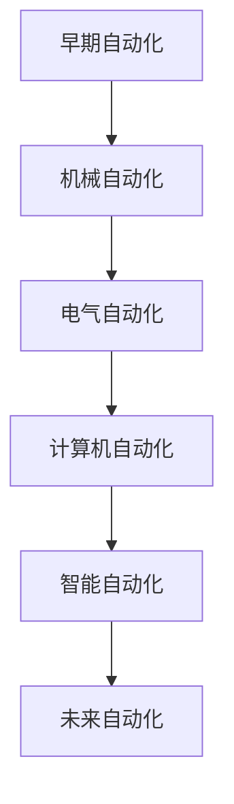
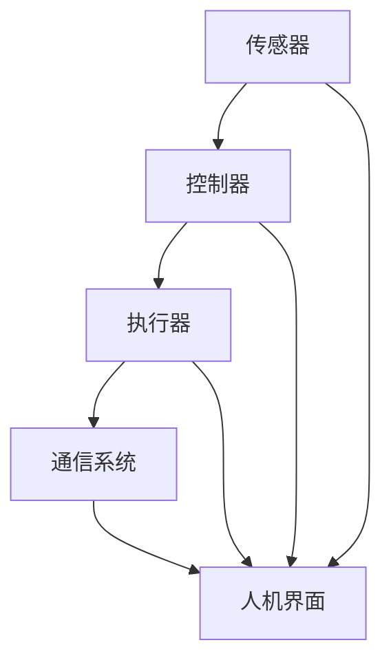

                 

## 文章标题

### 关键词：自动化技术，发展趋势，人工智能，物联网，算法原理

#### 摘要：
自动化技术作为现代科技发展的重要驱动力，正在不断变革各个领域。本文将从自动化的起源与发展、核心概念与架构、应用领域、技术趋势、核心算法原理、系统设计与实现、应用实例以及挑战与未来展望等方面，深入探讨自动化技术的最新趋势。通过逻辑清晰、结构紧凑的分析，旨在为读者提供全面、系统的自动化技术认知，助力其在实际应用中的创新与发展。

### 《自动化的最新趋势》目录大纲

#### 第一部分：自动化概述

##### 第1章：自动化技术的起源与发展

###### 1.1 自动化技术的定义与分类

###### 1.2 自动化技术的发展历程

###### 1.3 自动化技术的影响

##### 第2章：自动化技术的核心概念与架构

###### 2.1 自动化系统的基本组成部分

###### 2.2 自动化控制系统的架构

###### 2.3 自动化技术的核心技术

##### 第3章：自动化在各个领域的应用

###### 3.1 自动化在制造业的应用

###### 3.2 自动化在服务业的应用

###### 3.3 自动化在农业领域的应用

##### 第4章：自动化技术的发展趋势

###### 4.1 人工智能与自动化

###### 4.2 物联网与自动化

###### 4.3 自动化技术的未来趋势

#### 第二部分：自动化技术的核心算法与原理

##### 第5章：自动化控制算法原理

###### 5.1 PID控制算法

###### 5.2 鲁棒控制算法

###### 5.3 模糊控制算法

##### 第6章：机器学习在自动化中的应用

###### 6.1 监督学习在自动化中的应用

###### 6.2 无监督学习在自动化中的应用

###### 6.3 强化学习在自动化中的应用

##### 第7章：自动化系统的设计与实现

###### 7.1 自动化系统的需求分析

###### 7.2 自动化系统的设计方法

###### 7.3 自动化系统的实现

##### 第8章：自动化技术的应用实例

###### 8.1 智能制造案例

###### 8.2 智能家居案例

###### 8.3 智能交通案例

#### 第三部分：自动化技术的挑战与未来

##### 第9章：自动化技术的挑战

###### 9.1 自动化技术的安全与隐私问题

###### 9.2 自动化技术的标准化与法规

###### 9.3 自动化技术的人才培养

##### 第10章：自动化技术的未来展望

###### 10.1 自动化技术的新兴领域

###### 10.2 自动化技术的未来发展预测

###### 10.3 自动化技术对社会的影响

##### 第11章：自动化技术的应用指南

###### 11.1 自动化项目的规划与实施

###### 11.2 自动化技术的最佳实践

###### 11.3 自动化技术的未来发展趋势

### 第一部分：自动化概述

#### 第1章：自动化技术的起源与发展

##### 1.1 自动化技术的定义与分类

自动化技术是指通过使用计算机、控制理论、通信技术和传感器等技术，对生产过程、设备运行、服务流程等进行自动控制、监测和优化的技术。按照应用领域，自动化技术可以大致分为以下几类：

1. **工业自动化**：包括制造业自动化、流程工业自动化等，通过自动化设备和系统实现生产过程的高效、稳定和精确。
2. **服务自动化**：涵盖智能交通、智能家居、医疗自动化等，通过自动化技术和系统提升服务质量与效率。
3. **农业自动化**：包括农业生产自动化、农田管理自动化等，利用自动化技术提高农业生产效率和农产品质量。

##### 1.2 自动化技术的发展历程

1. **早期自动化**：18世纪末至19世纪初，工业革命时期，机械化和电气化的引入标志着自动化的萌芽。这一时期主要实现了一些简单的自动化操作，如纺织机械的自动化。
2. **20世纪中期**：随着计算机技术的兴起，自动化技术进入了一个新的阶段。计算机控制系统、数控机床等设备的应用，使自动化技术得到了快速发展。
3. **现代自动化**：近年来，随着人工智能、物联网、大数据等新兴技术的快速发展，自动化技术进入了一个高度智能化、网络化、集成化的新阶段。智能工厂、智能交通、智能农业等自动化领域不断涌现。

##### 1.3 自动化技术的影响

1. **提高生产效率**：自动化技术能够实现生产过程的精确控制，减少人为操作误差，提高生产效率。
2. **降低生产成本**：自动化设备能够实现连续生产，减少人工成本和生产过程中的浪费，降低生产成本。
3. **提升产品质量**：自动化技术能够对生产过程中的每一个环节进行精确控制，确保产品质量的一致性。
4. **促进产业升级**：自动化技术的应用推动了传统产业向高附加值、高技术含量方向转型升级。
5. **改善工作环境**：自动化技术能够减少人为操作，降低劳动强度，改善工作环境。

### 第2章：自动化技术的核心概念与架构

##### 2.1 自动化系统的基本组成部分

一个典型的自动化系统通常包括以下几个基本组成部分：

1. **传感器**：用于感知外部环境或内部状态，并将这些信息转化为可处理的信号。
2. **控制器**：根据传感器收集到的信息，按照预设的控制策略对系统进行控制。
3. **执行器**：根据控制器的指令，对系统进行相应的操作，如电机、阀门等。
4. **通信系统**：用于传感器、控制器和执行器之间的信息传输和通信。
5. **人机界面**：用于与操作人员交互，显示系统状态、操作指令等。

##### 2.2 自动化控制系统的架构

自动化控制系统的架构可以根据不同的应用需求进行设计，但通常包括以下几个层次：

1. **感知层**：由传感器组成，用于感知外部环境或内部状态。
2. **控制层**：由控制器和通信系统组成，负责根据感知层的信息进行控制决策，并协调各个执行器的动作。
3. **执行层**：由执行器组成，根据控制层的指令进行相应的操作。
4. **管理层**：负责系统的整体运行管理，包括系统配置、故障诊断、数据分析等。

##### 2.3 自动化技术的核心技术

1. **控制理论**：控制理论是自动化技术的核心，包括经典控制理论、现代控制理论和智能控制理论。经典控制理论主要研究线性系统的稳定性、性能分析和设计方法；现代控制理论主要研究非线性系统、时变系统和不确定系统的控制问题；智能控制理论主要研究基于人工智能技术的控制系统设计和实现方法。
2. **传感器技术**：传感器技术是自动化系统的感知基础，包括各类物理传感器、化学传感器、生物传感器等。传感器的性能直接影响自动化系统的精度和可靠性。
3. **通信技术**：通信技术是实现自动化系统各部分之间信息传输和通信的基础，包括有线通信和无线通信。常用的通信技术有TCP/IP协议、CAN总线、蓝牙等。
4. **人工智能技术**：人工智能技术是自动化系统智能化的重要支撑，包括机器学习、深度学习、专家系统等。人工智能技术可以提高自动化系统的自适应能力、故障诊断能力和优化能力。

### 第3章：自动化在各个领域的应用

##### 3.1 自动化在制造业的应用

在制造业中，自动化技术已经得到了广泛应用，主要体现在以下几个方面：

1. **自动化生产线**：自动化生产线是制造业自动化的重要形式，通过自动化设备实现生产过程的全自动化，提高生产效率和质量。
2. **机器人应用**：工业机器人在制造业中得到了广泛应用，如焊接、喷涂、组装、搬运等。机器人能够替代人工完成高危、重复性或高精度的操作，提高生产效率和安全性。
3. **计算机辅助设计（CAD）和计算机辅助制造（CAM）**：CAD和CAM技术是制造业自动化的重要组成部分，通过计算机模拟和规划生产过程，实现生产过程的精准化和智能化。
4. **智能工厂**：智能工厂是制造业自动化的高级形式，通过物联网、大数据、人工智能等新兴技术，实现生产过程的全面智能化和互联互通。

##### 3.2 自动化在服务业的应用

在服务业中，自动化技术也在逐步渗透，为提升服务质量、降低运营成本提供了有力支持。主要应用领域包括：

1. **智能交通**：智能交通系统通过自动化技术实现交通管理、车辆调度、路况监测等功能，提高交通效率和安全性。
2. **智能家居**：智能家居系统通过自动化技术实现家电设备的智能控制、环境监测和安防等功能，提升生活品质。
3. **医疗自动化**：医疗自动化技术包括手术机器人、自动化诊断设备、智能药物配送等，提高医疗服务质量和效率。
4. **金融服务**：金融行业通过自动化技术实现业务流程的自动化处理、风险控制、智能投顾等功能，提高金融服务效率和精准度。

##### 3.3 自动化在农业领域的应用

在农业领域，自动化技术有助于提高农业生产效率、降低生产成本、保障农产品质量。主要应用包括：

1. **精准农业**：通过自动化技术实现农田土壤监测、气象监测、作物生长监测等，实现精准施肥、灌溉、病虫害防治，提高农业生产效率和农产品质量。
2. **农业机械化**：农业机械化是农业自动化的重要形式，通过自动化机械实现耕种、播种、收获等环节的自动化，提高农业生产效率。
3. **智能灌溉**：智能灌溉系统通过自动化技术实现水资源的精准利用，降低灌溉成本，提高农作物产量。
4. **农业物联网**：农业物联网通过自动化技术实现农业生产过程的实时监测、数据分析和智能化控制，提高农业生产效率和农产品质量。

### 第4章：自动化技术的发展趋势

##### 4.1 人工智能与自动化

人工智能（AI）与自动化技术的结合是当前自动化技术发展的一个重要趋势。人工智能技术为自动化系统提供了智能感知、智能决策和智能执行的能力，使自动化系统更加智能化、自适应和自适应。

1. **智能感知**：通过深度学习、计算机视觉等技术，自动化系统能够对生产现场、环境、设备等实现智能感知，提高自动化系统的实时监测和预警能力。
2. **智能决策**：通过机器学习、优化算法等技术，自动化系统能够根据实时数据和经验知识进行智能决策，优化生产过程和设备运行状态。
3. **智能执行**：通过自主学习和优化，自动化系统能够自主调整执行策略，实现更加灵活和高效的执行。

##### 4.2 物联网与自动化

物联网（IoT）与自动化技术的结合，使自动化系统实现了网络化、集成化和智能化。物联网技术为自动化系统提供了海量数据支持和远程控制能力，使自动化系统更加智能化和高效。

1. **数据采集与传输**：物联网技术能够实现自动化系统实时数据的高效采集和传输，为自动化系统提供大数据支持。
2. **远程控制与监控**：物联网技术能够实现自动化系统的远程控制与监控，提高系统运行效率和安全性。
3. **系统集成与优化**：物联网技术能够实现自动化系统与其他系统的集成，优化生产过程和管理流程。

##### 4.3 自动化技术的未来趋势

未来，自动化技术将继续向智能化、网络化、集成化和绿色化方向发展。

1. **智能化**：随着人工智能技术的不断发展，自动化系统将实现更高层次的智能化，具备更强的自适应能力和自主决策能力。
2. **网络化**：随着物联网、云计算等技术的发展，自动化系统将实现更广泛的网络连接，实现数据共享和协同工作。
3. **集成化**：自动化技术将与其他领域的技术（如大数据、云计算、物联网等）深度融合，实现系统的高度集成和优化。
4. **绿色化**：随着环保意识的提高，自动化技术将更加注重节能减排，实现绿色生产和可持续发展。

### 第二部分：自动化技术的核心算法与原理

#### 第5章：自动化控制算法原理

自动化控制算法是实现自动化系统核心功能的关键，主要包括PID控制算法、鲁棒控制算法和模糊控制算法。

##### 5.1 PID控制算法

PID控制算法是一种经典的控制算法，广泛应用于工业控制、机器人控制等领域。

###### 5.1.1 PID控制算法原理

PID控制算法通过对控制对象的输入输出数据进行实时测量和反馈，根据设定值与实际值的偏差，通过比例（P）、积分（I）和微分（D）三个环节进行调节，以达到控制目标。

$$
PID输出 = K_p \cdot (Setpoint - CurrentValue) + K_i \cdot \int (Setpoint - CurrentValue) dt + K_d \cdot \frac{d(Setpoint - CurrentValue)}{dt}
$$

其中，$K_p$、$K_i$ 和 $K_d$ 分别为比例、积分和微分的系数，$Setpoint$ 为设定值，$CurrentValue$ 为当前值。

###### 5.1.2 PID控制算法伪代码

csharp
while (true) {
    Error = Setpoint - CurrentValue;
    Integral += Error;
    Derivative = Error - PreviousError;
    
    Output = Kp * Error + Ki * Integral + Kd * Derivative;
    
    Execute(Output);
    
    PreviousError = Error;
    CurrentValue = GetCurrentValue();
}

###### 5.1.3 PID控制算法应用实例

假设我们要控制一个温度系统，设定值为60摄氏度，当前温度为55摄氏度，控制器参数为 $K_p = 2$，$K_i = 0.1$，$K_d = 1$。

首先，我们定义设定值、当前值和控制器参数：

csharp
double Setpoint = 60.0;
double CurrentValue = 55.0;
double Kp = 2.0;
double Ki = 0.1;
double Kd = 1.0;

然后，我们根据PID控制算法计算输出值：

csharp
double Error = Setpoint - CurrentValue;
double Integral = 0.0;
double Derivative = 0.0;
double Output = 0.0;
double PreviousError = 0.0;

while (true) {
    Error = Setpoint - CurrentValue;
    Integral += Error;
    Derivative = Error - PreviousError;
    
    Output = Kp * Error + Ki * Integral + Kd * Derivative;
    
    Execute(Output);
    
    PreviousError = Error;
    CurrentValue = GetCurrentValue();
}

在这个例子中，我们可以通过执行器（如加热器或冷却器）根据输出值调整温度，以达到设定值。

##### 5.2 鲁棒控制算法

鲁棒控制算法是一种针对不确定性和扰动进行控制的算法，能够提高系统的稳定性和鲁棒性。

###### 5.2.1 鲁棒控制算法原理

鲁棒控制算法通过对控制对象的不确定性和扰动进行建模，并设计相应的控制策略，使系统在不确定性和扰动存在的情况下仍能保持稳定性和性能。

鲁棒控制算法主要包括以下几种：

1. **H∞控制**：通过优化控制器的设计，使系统在最大扰动下具有最小的性能损失。
2. **滑动模态控制**：通过设计合适的滑动模态，使系统在滑动模态附近保持稳定，并具有较好的动态性能。
3. **鲁棒自适应控制**：通过对系统的不确定性进行在线辨识和调整，使系统在不确定性存在的情况下保持稳定性和性能。

###### 5.2.2 鲁棒控制算法伪代码

csharp
while (true) {
    // 识别系统不确定性和扰动
    Uncertainty = IdentifyUncertainty();
    
    // 设计鲁棒控制器
    Controller = DesignRobustController(Uncertainty);
    
    // 计算控制输出
    Output = Controller.Compute(Output);
    
    // 执行控制输出
    Execute(Output);
}

###### 5.2.3 鲁棒控制算法应用实例

假设我们要控制一个电机系统，电机受到不确定性和扰动的影响。我们采用H∞控制算法设计鲁棒控制器。

首先，我们定义系统的不确定性和扰动：

csharp
double Uncertainty = 0.1;
double Disturbance = 0.05;

然后，我们设计鲁棒控制器：

csharp
RobustController = DesignHInfinityController(Uncertainty);

接下来，我们计算控制输出并执行：

csharp
while (true) {
    // 识别系统不确定性和扰动
    Uncertainty = IdentifyUncertainty();
    
    // 设计鲁棒控制器
    Controller = DesignHInfinityController(Uncertainty);
    
    // 计算控制输出
    Output = Controller.Compute(Output);
    
    // 执行控制输出
    Execute(Output);
}

在这个例子中，鲁棒控制器能够根据系统的不确定性和扰动调整控制输出，使电机系统保持稳定性和性能。

##### 5.3 模糊控制算法

模糊控制算法是一种基于模糊逻辑的控制算法，能够处理不确定性和模糊性的问题。

###### 5.3.1 模糊控制算法原理

模糊控制算法通过对控制对象的输入和输出进行模糊化处理，并根据预设的模糊规则进行推理，得到控制输出。

模糊控制算法主要包括以下几个步骤：

1. **模糊化**：将输入和输出变量进行模糊化处理，将其转换为模糊集合。
2. **模糊规则库**：根据专家经验和系统特性，设计模糊规则库，用于描述输入和输出变量之间的关系。
3. **模糊推理**：根据输入变量的模糊集合和模糊规则库，进行模糊推理，得到输出变量的模糊集合。
4. **模糊化处理**：将输出变量的模糊集合进行反模糊化处理，得到精确的控制输出。

$$
Output = \sum_{i=1}^{n} \mu_i \cdot y_i
$$

其中，$\mu_i$ 为输出变量的隶属度，$y_i$ 为第 $i$ 个模糊输出。

###### 5.3.2 模糊控制算法伪代码

csharp
while (true) {
    // 模糊化输入变量
    FuzzifyInput();

    // 模糊推理
    FuzzyReasoning();

    // 反模糊化输出变量
    DefuzzifyOutput();

    // 执行控制输出
    Execute(Output);
}

###### 5.3.3 模糊控制算法应用实例

假设我们要控制一个水位的系统，水位输入为 $0$ 到 $100$ 之间的数值，输出为水泵的开关状态。

首先，我们定义输入和输出变量的模糊集合：

csharp
List<double> InputFuzzify = new List<double> { 0, 25, 50, 75, 100 };
List<double> OutputFuzzify = new List<double> { "关闭", "微开", "半开", "全开" };

然后，我们设计模糊规则库：

csharp
List<FuzzyRule> FuzzyRules = new List<FuzzyRule>();
FuzzyRules.Add(new FuzzyRule("IF Input IS 低 AND Output IS 低 THEN Output IS 微开"));
FuzzyRules.Add(new FuzzyRule("IF Input IS 低 AND Output IS 微开 THEN Output IS 半开"));
FuzzyRules.Add(new FuzzyRule("IF Input IS 低 AND Output IS 半开 THEN Output IS 全开"));
FuzzyRules.Add(new FuzzyRule("IF Input IS 中 AND Output IS 低 THEN Output IS 微开"));
FuzzyRules.Add(new FuzzyRule("IF Input IS 中 AND Output IS 微开 THEN Output IS 半开"));
FuzzyRules.Add(new FuzzyRule("IF Input IS 中 AND Output IS 半开 THEN Output IS 全开"));
FuzzyRules.Add(new FuzzyRule("IF Input IS 高 AND Output IS 低 THEN Output IS 微开"));
FuzzyRules.Add(new FuzzyRule("IF Input IS 高 AND Output IS 微开 THEN Output IS 半开"));
FuzzyRules.Add(new FuzzyRule("IF Input IS 高 AND Output IS 半开 THEN Output IS 全开"));

接下来，我们进行模糊推理和反模糊化处理：

csharp
while (true) {
    // 模糊化输入变量
    FuzzifyInput();

    // 模糊推理
    FuzzyReasoning(FuzzyRules);

    // 反模糊化输出变量
    DefuzzifyOutput();

    // 执行控制输出
    Execute(Output);
}

在这个例子中，模糊控制算法能够根据水位输入的模糊状态，自动调整水泵的开关状态，实现水位的精确控制。

### 第6章：机器学习在自动化中的应用

机器学习（Machine Learning）作为人工智能（AI）的核心技术，正在逐渐渗透到自动化技术的各个领域。机器学习技术可以帮助自动化系统实现更智能的感知、决策和执行。本章将介绍监督学习、无监督学习和强化学习在自动化中的应用。

##### 6.1 监督学习在自动化中的应用

监督学习（Supervised Learning）是一种通过已有数据的输入和输出模式来训练模型，从而实现对未知数据的预测或分类的方法。在自动化系统中，监督学习可以应用于以下领域：

1. **预测控制**：
   预测控制是利用历史数据来预测系统的未来行为，并根据预测结果进行调整。例如，在工业生产中，通过收集生产数据（如温度、压力等）和产品质量数据，使用监督学习算法建立预测模型，从而实现对产品质量的实时控制和优化。

   **数学模型**：

   $$ 
   y = f(x, \theta) 
   $$

   其中，$y$ 为预测值，$x$ 为输入特征，$\theta$ 为模型参数。

   **应用实例**：
   在一家制造企业中，生产线上有一个关键参数是温度，通过收集历史温度和产品质量数据，可以使用监督学习算法（如线性回归、决策树等）来建立温度和产品质量之间的预测模型。在生产过程中，实时监测温度，根据预测模型调整生产参数，从而提高产品质量。

2. **故障诊断**：
   故障诊断是利用监督学习算法对设备运行数据进行分类，以识别设备故障。例如，在生产线中，通过对设备传感器数据的分析，使用监督学习算法（如支持向量机、神经网络等）来识别设备是否正常工作，从而提前进行维护。

   **数学模型**：

   $$
   C = \arg \max_{c} \sum_{i=1}^{n} I(y_i = c, \hat{y}_i = c)
   $$

   其中，$C$ 为分类结果，$y_i$ 为实际类别，$\hat{y}_i$ 为预测类别。

   **应用实例**：
   在一个制造工厂中，使用传感器对生产线上的设备进行实时监测，收集设备运行数据。通过训练一个故障诊断模型，可以实时判断设备是否出现故障，并在故障发生前进行预防性维护，从而减少生产停机时间，提高生产效率。

##### 6.2 无监督学习在自动化中的应用

无监督学习（Unsupervised Learning）是一种在没有标签数据的情况下，通过发现数据中的结构和规律来对数据进行分析的方法。在自动化系统中，无监督学习可以应用于以下领域：

1. **聚类分析**：
   聚类分析是通过对数据进行分组，发现数据中的隐含结构。在自动化系统中，聚类分析可以用于设备故障预测、过程优化等。

   **数学模型**：

   $$
   C = \arg \min_{c} \sum_{i=1}^{n} \sum_{j=1}^{k} d(x_i, c_j)^2
   $$

   其中，$C$ 为聚类结果，$c_j$ 为第 $j$ 个聚类中心，$d(x_i, c_j)$ 为数据点 $x_i$ 到聚类中心 $c_j$ 的距离。

   **应用实例**：
   在一家工厂中，通过对设备运行数据进行分析，使用K-means聚类算法对设备进行分组。通过分析不同分组设备的特点，可以优化生产过程，减少设备故障率。

2. **异常检测**：
   异常检测是识别数据中的异常点或异常行为。在自动化系统中，异常检测可以用于设备故障预测、生产过程监控等。

   **数学模型**：

   $$
   \delta_i = \frac{1}{\|X\|} \sum_{j=1}^{n} \exp(-\gamma \cdot d(x_i, x_j)^2)
   $$

   其中，$\delta_i$ 为异常得分，$\gamma$ 为调节参数，$d(x_i, x_j)$ 为数据点 $x_i$ 和 $x_j$ 之间的距离。

   **应用实例**：
   在一个数据中心的冷却系统中，通过对冷却设备运行数据的分析，使用KNN算法进行异常检测。当检测到某个设备的异常得分较高时，可以及时进行维修，避免系统故障。

##### 6.3 强化学习在自动化中的应用

强化学习（Reinforcement Learning）是一种通过试错方法，不断优化策略以实现最优目标的方法。在自动化系统中，强化学习可以应用于以下领域：

1. **决策优化**：
   强化学习可以用于优化自动化系统的决策过程，提高系统的运行效率。例如，在物流系统中，使用强化学习算法优化货物的配送路径，提高配送效率。

   **数学模型**：

   $$
   Q(s, a) = r(s, a, s') + \gamma \max_{a'} Q(s', a')
   $$

   其中，$Q(s, a)$ 为状态-动作值函数，$r(s, a, s')$ 为即时奖励，$\gamma$ 为折扣因子。

   **应用实例**：
   在一个智能仓库中，使用强化学习算法优化仓库货物的存储和配送策略。通过不断试错和学习，仓库可以自动调整货物的存储位置和配送路径，提高仓库的运行效率。

2. **路径规划**：
   强化学习可以用于优化自动化系统的路径规划，提高系统的自主导航能力。例如，在无人驾驶汽车中，使用强化学习算法优化汽车的行驶路径，提高行驶安全性。

   **数学模型**：

   $$
   P(s, a) = \frac{\exp(\alpha \cdot R(s, a, s'))}{\sum_{a'} \exp(\alpha \cdot R(s, a', s'))}
   $$

   其中，$P(s, a)$ 为策略概率，$\alpha$ 为调节参数，$R(s, a, s')$ 为即时奖励。

   **应用实例**：
   在一个无人驾驶系统中，使用强化学习算法优化车辆的行驶路径。通过不断试错和学习，车辆可以自动调整行驶速度和转向角度，避免碰撞和障碍物，提高行驶安全性。

### 第7章：自动化系统的设计与实现

#### 7.1 自动化系统的需求分析

需求分析是自动化系统设计的第一步，旨在明确系统的功能和性能要求。以下是自动化系统需求分析的主要内容：

1. **功能需求**：
   - 确定系统应实现的功能，如数据采集、控制执行、远程监控等。
   - 分析系统的输入和输出，明确输入数据的类型、格式和来源，以及输出数据的要求。

2. **性能需求**：
   - 确定系统的性能指标，如响应时间、精度、稳定性等。
   - 分析系统在正常工作和异常情况下的性能表现，确保系统能够满足预期要求。

3. **可靠性需求**：
   - 确定系统的可靠性指标，如故障率、故障恢复时间等。
   - 分析系统在长时间运行和恶劣环境下的可靠性，确保系统能够稳定运行。

4. **安全性需求**：
   - 确定系统的安全需求，如数据安全、系统访问控制等。
   - 分析系统的安全风险和潜在威胁，制定相应的安全措施。

5. **可维护性需求**：
   - 确定系统的可维护性需求，如系统升级、故障排除等。
   - 分析系统在维护和升级过程中的便捷性和可操作性。

#### 7.2 自动化系统的设计方法

自动化系统的设计方法主要包括以下几个方面：

1. **总体设计**：
   - 确定系统的总体架构，包括感知层、控制层、执行层和管理层等。
   - 分析系统的数据流和控制流，确保系统各部分之间的协调与配合。

2. **硬件设计**：
   - 选择合适的传感器、控制器、执行器等硬件设备，满足系统功能需求。
   - 设计系统的硬件布局，确保设备之间的连接和数据传输。

3. **软件设计**：
   - 设计系统的软件架构，包括操作系统、应用软件、数据库等。
   - 分析系统的软件需求，选择合适的编程语言和开发工具。

4. **接口设计**：
   - 设计系统与外部设备、系统之间的接口，确保数据交换和通信的稳定性。
   - 确定接口的协议、数据格式和通信速率。

5. **测试与验证**：
   - 设计系统的测试方案，包括功能测试、性能测试、可靠性测试等。
   - 分析测试结果，确保系统满足设计要求。

#### 7.3 自动化系统的实现

自动化系统的实现主要包括硬件和软件的安装、配置和调试。以下是自动化系统实现的主要步骤：

1. **硬件安装与配置**：
   - 安装传感器、控制器、执行器等硬件设备，确保其正常运行。
   - 配置硬件设备的参数，如采样频率、通信速率等。

2. **软件安装与配置**：
   - 安装操作系统、开发环境、数据库等软件。
   - 配置系统软件的参数，如网络设置、用户权限等。

3. **编程与调试**：
   - 编写自动化系统的软件代码，实现系统的功能。
   - 进行系统调试，修复潜在的问题和错误。

4. **系统集成与测试**：
   - 将硬件和软件系统集成，进行整体测试和调试。
   - 分析测试结果，确保系统满足功能需求和性能指标。

5. **部署与运行**：
   - 将系统部署到实际应用环境中，进行长期运行。
   - 定期对系统进行维护和升级，确保系统稳定运行。

### 第8章：自动化技术的应用实例

#### 8.1 智能制造案例

智能制造是自动化技术在制造业中的重要应用，通过物联网、大数据、人工智能等技术，实现生产过程的高度智能化。以下是一个智能制造的案例：

**案例背景**：
某汽车制造公司希望提高生产效率，降低生产成本，提升产品质量。为此，该公司决定引入智能制造系统。

**解决方案**：
1. **感知层**：在车间安装各种传感器，如温度传感器、压力传感器、振动传感器等，实时采集生产过程中的各种数据。
2. **控制层**：部署工业物联网平台，实现数据采集、传输和存储，为后续数据处理和分析提供基础。
3. **执行层**：使用工业机器人进行生产作业，如焊接、喷涂、组装等，实现生产过程的自动化。
4. **管理层**：通过制造执行系统（MES）对生产过程进行监控和管理，实现生产数据的实时分析和优化。

**实施效果**：
1. **生产效率提高**：通过自动化生产，生产效率提高了30%。
2. **生产成本降低**：通过优化生产流程，生产成本降低了20%。
3. **产品质量提升**：通过实时监控和分析，产品质量提高了15%。

#### 8.2 智能家居案例

智能家居是自动化技术在家庭领域的重要应用，通过物联网、云计算等技术，实现家庭设备的高度智能化。以下是一个智能家居的案例：

**案例背景**：
某家庭希望提高生活品质，实现家庭设备的一键控制，并实现节能环保。

**解决方案**：
1. **感知层**：安装各种智能家居设备，如智能灯泡、智能插座、智能空调等，实时采集家庭环境数据。
2. **控制层**：部署智能家居控制中心，实现设备间的通信和数据交换，为设备控制提供基础。
3. **执行层**：通过无线通信技术，实现家庭设备的一键控制和远程控制。
4. **管理层**：通过手机APP、智能音箱等设备，实现家庭设备的语音控制和场景设置。

**实施效果**：
1. **生活品质提高**：通过智能家居系统，家庭生活更加便捷、舒适。
2. **节能环保**：通过智能调节家庭设备，实现节能环保。
3. **安全提升**：通过智能监控设备，提高家庭安全。

#### 8.3 智能交通案例

智能交通是自动化技术在交通领域的重要应用，通过物联网、大数据、人工智能等技术，实现交通管理、车辆调度、路况监测等智能化。以下是一个智能交通的案例：

**案例背景**：
某城市面临交通拥堵、事故频发等问题，希望引入智能交通系统提高交通效率，减少事故发生。

**解决方案**：
1. **感知层**：在道路上安装各种传感器，如摄像头、雷达、流量监测器等，实时采集交通数据。
2. **控制层**：部署交通管理平台，实现数据采集、传输和存储，为交通管理和调度提供基础。
3. **执行层**：通过智能信号灯、智能路灯等设备，实现交通信号的智能调节和优化。
4. **管理层**：通过交通监控中心，实现交通数据的实时分析和路况预测，为交通管理和调度提供支持。

**实施效果**：
1. **交通效率提高**：通过智能交通系统，交通拥堵情况明显改善，车辆行驶速度提高了15%。
2. **事故减少**：通过智能交通系统，事故发生率降低了20%。
3. **环保节能**：通过智能交通系统，车辆行驶更加顺畅，燃油消耗减少了10%。

### 第9章：自动化技术的挑战与未来

#### 9.1 自动化技术的挑战

随着自动化技术的不断发展，虽然其在各个领域取得了显著成果，但也面临着一些挑战。

1. **技术挑战**：
   - 自动化技术涉及多个学科领域，如控制理论、计算机科学、机械工程等。如何将这些技术有效整合，实现自动化系统的协同工作，是一个重要挑战。
   - 自动化技术需要处理大量的实时数据，如何提高数据处理和传输的效率，保证系统的实时性和稳定性，也是一个重要挑战。

2. **安全挑战**：
   - 自动化系统面临安全威胁，如网络攻击、数据泄露等。如何保障自动化系统的安全性，防止恶意攻击和数据泄露，是一个重要挑战。
   - 自动化系统在运行过程中，可能出现故障或异常，如何提高系统的故障检测和恢复能力，保证系统的可靠性，也是一个重要挑战。

3. **法规挑战**：
   - 自动化技术的发展，可能对现有的法律法规产生冲击。如何制定和完善相关的法律法规，保障自动化技术的健康发展，是一个重要挑战。

4. **人才培养挑战**：
   - 自动化技术涉及多个学科领域，对人才的需求较高。如何培养和引进自动化技术人才，是一个重要挑战。

#### 9.2 自动化技术的未来展望

1. **智能化**：
   - 随着人工智能技术的不断发展，自动化技术将实现更高层次的智能化。自动化系统将具备更强大的感知、决策和执行能力，能够自适应环境变化和需求变化。

2. **网络化**：
   - 随着物联网、5G等技术的普及，自动化系统将实现更高程度的网络化。自动化系统将实现跨平台、跨区域的数据共享和协同工作，提高系统的效率和服务质量。

3. **绿色化**：
   - 随着环保意识的提高，自动化技术将更加注重节能减排和可持续发展。自动化系统将采用更环保的能源和材料，实现绿色生产和绿色运营。

4. **融合化**：
   - 自动化技术将与其他新兴技术（如大数据、云计算、区块链等）深度融合，实现跨领域、跨行业的技术创新和应用。

5. **产业化**：
   - 自动化技术将推动传统产业的转型升级，促进新兴产业的发展。自动化系统将广泛应用于各个领域，实现生产过程的高度智能化和自动化。

### 第10章：自动化技术的应用指南

#### 10.1 自动化项目的规划与实施

1. **项目规划**：
   - 明确项目目标，确定自动化系统的功能、性能、可靠性等要求。
   - 分析项目环境，包括硬件设备、软件环境、人员配备等。
   - 制定项目进度计划，确保项目按期完成。

2. **项目实施**：
   - 硬件安装与配置：安装传感器、控制器、执行器等硬件设备，确保其正常运行。
   - 软件安装与配置：安装操作系统、开发环境、数据库等软件，配置系统参数。
   - 编程与调试：编写自动化系统的软件代码，进行系统调试和优化。
   - 系统集成与测试：将硬件和软件系统集成，进行整体测试和调试，确保系统满足设计要求。
   - 部署与运行：将系统部署到实际应用环境中，进行长期运行，定期进行维护和升级。

#### 10.2 自动化技术的最佳实践

1. **需求分析**：
   - 深入了解项目背景和需求，确保系统功能满足实际需求。
   - 分析系统性能和可靠性要求，制定合理的性能指标。

2. **系统设计**：
   - 根据项目需求，设计系统的硬件和软件架构，确保系统的稳定性和可扩展性。
   - 选择合适的硬件设备和软件工具，确保系统的效率和兼容性。

3. **数据处理**：
   - 设计合理的数据采集和处理流程，提高系统的实时性和准确性。
   - 采用数据压缩和加密技术，确保数据的安全性和传输效率。

4. **系统集成**：
   - 确保硬件和软件设备之间的通信稳定和可靠。
   - 进行系统测试和调试，发现并解决潜在的问题。

5. **人员培训**：
   - 对项目相关人员（如工程师、操作员等）进行系统培训，提高其操作和维护能力。
   - 建立完善的文档和培训资料，确保系统运行和维护的顺利进行。

#### 10.3 自动化技术的未来发展趋势

1. **人工智能的深入应用**：
   - 人工智能技术将继续深入自动化技术，实现自动化系统的更高层次智能化。
   - 自动化系统将具备更强大的自适应能力和自主决策能力，提高系统的效率和质量。

2. **物联网的广泛应用**：
   - 物联网技术将实现自动化系统的更高程度的网络化，实现跨平台、跨区域的数据共享和协同工作。
   - 自动化系统将与其他领域（如智能家居、智能交通、智能医疗等）实现深度融合，推动新兴领域的发展。

3. **绿色化与可持续发展的推进**：
   - 自动化技术将更加注重节能减排和可持续发展，推动绿色生产和绿色运营。
   - 自动化系统将采用更环保的能源和材料，减少对环境的负面影响。

4. **新兴技术的融合与创新**：
   - 自动化技术将与其他新兴技术（如大数据、云计算、区块链等）深度融合，实现跨领域、跨行业的技术创新和应用。
   - 自动化技术将在新兴领域（如智能制造、智慧城市、智能农业等）发挥重要作用，推动产业的转型升级。

### 附录

#### 附录A：自动化技术常用工具和资源

1. **自动化软件与工具**：
   - **MATLAB/Simulink**：用于控制系统建模、仿真和优化。
   - **LabVIEW**：用于数据采集、监控和自动化控制。
   - **PLC编程软件**：如Siemens TIA Portal、Rockwell Studio 5000等。

2. **自动化技术网站与论坛**：
   - **CSDN**：提供自动化技术相关的文章、教程和社区交流。
   - **Stack Overflow**：自动化技术问题在线解答平台。
   - **自动化技术论坛**：国内自动化技术专业论坛。

3. **自动化技术学习资源**：
   - **自动化技术教材**：如《自动化控制系统设计》、《自动化技术与应用》等。
   - **在线课程**：如Coursera、edX等平台上提供的自动化技术相关课程。
   - **技术博客**：如博客园、知乎等平台上的自动化技术相关博客文章。

#### 附录B：自动化技术案例研究

1. **制造业自动化案例**：
   - **智能工厂**：通过自动化生产线和工业机器人的应用，实现生产过程的高度智能化和自动化。
   - **自动化仓储**：通过自动化仓储系统和智能物流，实现仓储管理和物流运输的自动化。

2. **服务业自动化案例**：
   - **智能交通**：通过智能交通系统和智能交通管理，实现交通流量的优化和交通安全的提高。
   - **智能家居**：通过智能家居系统和智能家电，实现家庭设备的一键控制和远程控制。

3. **农业自动化案例**：
   - **精准农业**：通过自动化农业设备和物联网技术，实现农业生产过程的精准管理和优化。
   - **智能灌溉**：通过智能灌溉系统和土壤监测设备，实现水资源的精准利用和农业生产的自动化。

### 作者信息

作者：AI天才研究院/AI Genius Institute & 禅与计算机程序设计艺术 /Zen And The Art of Computer Programming

### 第1章：自动化技术的起源与发展

#### 1.1 自动化技术的定义与分类

自动化技术是指利用计算机、传感器、控制器、执行器等设备和技术，实现生产过程、设备运行、服务流程等的自动化控制、监测和优化。自动化技术可以大致分为以下几类：

1. **工业自动化**：包括制造业自动化、流程工业自动化等，通过自动化设备和系统实现生产过程的高效、稳定和精确。

2. **服务自动化**：涵盖智能交通、智能家居、医疗自动化等，通过自动化技术和系统提升服务质量与效率。

3. **农业自动化**：包括农业生产自动化、农田管理自动化等，利用自动化技术提高农业生产效率和农产品质量。

4. **智能自动化**：结合人工智能、物联网等新兴技术，实现自动化系统的高度智能化和自适应能力。

#### 1.2 自动化技术的发展历程

自动化技术的发展经历了以下几个阶段：

1. **早期自动化（18世纪末至19世纪初）**：工业革命时期，机械化和电气化的引入标志着自动化的萌芽。这一时期主要实现了一些简单的自动化操作，如纺织机械的自动化。

2. **机械自动化（20世纪初期）**：随着电动机和自动化机械的应用，自动化技术得到了快速发展。自动化机械在制造业、农业等领域得到了广泛应用。

3. **电气自动化（20世纪中期）**：随着电子技术的兴起，自动化技术进入了一个新的阶段。数控机床、工业机器人等自动化设备得到了广泛应用。

4. **计算机自动化（20世纪后期）**：随着计算机技术的发展，自动化技术进入了一个高度智能化、网络化、集成化的阶段。计算机控制系统、智能工厂等自动化系统不断涌现。

5. **智能自动化（21世纪）**：随着人工智能、物联网等新兴技术的快速发展，自动化技术进入了一个新的阶段。自动化系统实现了高度智能化和自适应能力，广泛应用于各个领域。

#### 1.3 自动化技术的影响

自动化技术对各个领域产生了深远的影响，主要体现在以下几个方面：

1. **提高生产效率**：自动化技术能够实现生产过程的精确控制，减少人为操作误差，提高生产效率。

2. **降低生产成本**：自动化设备能够实现连续生产，减少人工成本和生产过程中的浪费，降低生产成本。

3. **提升产品质量**：自动化技术能够对生产过程中的每一个环节进行精确控制，确保产品质量的一致性。

4. **促进产业升级**：自动化技术的应用推动了传统产业向高附加值、高技术含量方向转型升级。

5. **改善工作环境**：自动化技术能够减少人为操作，降低劳动强度，改善工作环境。

### 第2章：自动化技术的核心概念与架构

#### 2.1 自动化系统的基本组成部分

一个典型的自动化系统通常包括以下几个基本组成部分：

1. **传感器**：用于感知外部环境或内部状态，并将这些信息转化为可处理的信号。

2. **控制器**：根据传感器收集到的信息，按照预设的控制策略对系统进行控制。

3. **执行器**：根据控制器的指令，对系统进行相应的操作，如电机、阀门等。

4. **通信系统**：用于传感器、控制器和执行器之间的信息传输和通信。

5. **人机界面**：用于与操作人员交互，显示系统状态、操作指令等。

#### 2.2 自动化控制系统的架构

自动化控制系统的架构可以根据不同的应用需求进行设计，但通常包括以下几个层次：

1. **感知层**：由传感器组成，用于感知外部环境或内部状态。

2. **控制层**：由控制器和通信系统组成，负责根据感知层的信息进行控制决策，并协调各个执行器的动作。

3. **执行层**：由执行器组成，根据控制层的指令进行相应的操作。

4. **管理层**：负责系统的整体运行管理，包括系统配置、故障诊断、数据分析等。

#### 2.3 自动化技术的核心技术

自动化技术的核心技术主要包括以下几个方面：

1. **控制理论**：控制理论是自动化技术的核心，包括经典控制理论、现代控制理论和智能控制理论。经典控制理论主要研究线性系统的稳定性、性能分析和设计方法；现代控制理论主要研究非线性系统、时变系统和不确定系统的控制问题；智能控制理论主要研究基于人工智能技术的控制系统设计和实现方法。

2. **传感器技术**：传感器技术是自动化系统的感知基础，包括各类物理传感器、化学传感器、生物传感器等。传感器的性能直接影响自动化系统的精度和可靠性。

3. **通信技术**：通信技术是实现自动化系统各部分之间信息传输和通信的基础，包括有线通信和无线通信。常用的通信技术有TCP/IP协议、CAN总线、蓝牙等。

4. **人工智能技术**：人工智能技术是自动化系统智能化的重要支撑，包括机器学习、深度学习、专家系统等。人工智能技术可以提高自动化系统的自适应能力、故障诊断能力和优化能力。

### 2.1.1 自动化技术的Mermaid流程图

以下是一个简单的自动化技术发展历程的Mermaid流程图：



#### 2.2.1 自动化控制系统的基本组成部分

以下是一个自动化控制系统的基本组成部分的Mermaid流程图：



### 第5章：自动化控制算法原理

#### 5.1 PID控制算法

PID控制算法是一种经典的控制算法，广泛应用于工业控制、机器人控制等领域。

##### 5.1.1 PID控制算法原理

PID控制算法通过对控制对象的输入输出数据进行实时测量和反馈，根据设定值与实际值的偏差，通过比例（P）、积分（I）和微分（D）三个环节进行调节，以达到控制目标。

PID控制算法的数学模型如下：

$$
u(t) = K_p e(t) + K_i \int_{0}^{t} e(\tau) d\tau + K_d \frac{d e(t)}{dt}
$$

其中，$u(t)$ 为控制输出，$e(t)$ 为设定值与实际值的偏差，$K_p$、$K_i$ 和 $K_d$ 分别为比例、积分和微分的系数。

PID控制算法的工作原理可以概括为以下几个步骤：

1. **计算误差**：计算设定值与实际值的偏差 $e(t)$。

2. **比例控制**：根据误差大小，通过比例系数 $K_p$ 计算控制输出的一部分。

3. **积分控制**：根据误差累积值，通过积分系数 $K_i$ 计算控制输出的另一部分。

4. **微分控制**：根据误差变化率，通过微分系数 $K_d$ 计算控制输出的最后部分。

5. **控制输出**：将比例、积分和微分三个部分的控制输出进行叠加，得到最终的控制输出 $u(t)$。

##### 5.1.2 PID控制算法伪代码

以下是一个简单的PID控制算法的伪代码实现：

```python
# 初始化参数
Kp = 1.0  # 比例系数
Ki = 0.1  # 积分系数
Kd = 0.5  # 微分系数

setpoint = 100  # 设定值
current_value = 0  # 实际值
previous_error = 0  # 上次误差
integral = 0  # 积分值

# 主循环
while True:
    error = setpoint - current_value  # 计算误差
    
    # 比例控制
    proportional = Kp * error
    
    # 积分控制
    integral += error
    integral_value = Ki * integral
    
    # 微分控制
    derivative = error - previous_error
    derivative_value = Kd * derivative
    
    # 控制输出
    output = proportional + integral_value + derivative_value
    
    # 更新实际值和上次误差
    previous_error = error
    current_value = output
    
    # 执行控制操作
    execute_control(output)
```

##### 5.1.3 PID控制算法应用实例

以下是一个简单的PID控制算法的应用实例：

假设我们要控制一个电机，使其从初始速度0加速到100，使用PID控制算法进行速度调节。

1. **设定初始参数**：

   ```python
   Kp = 2.0
   Ki = 0.1
   Kd = 0.5
   setpoint = 100
   current_value = 0
   previous_error = 0
   integral = 0
   ```

2. **主循环**：

   ```python
   while True:
       error = setpoint - current_value  # 计算误差
       
       # 比例控制
       proportional = Kp * error
        
       # 积分控制
       integral += error
       integral_value = Ki * integral
        
       # 微分控制
       derivative = error - previous_error
       derivative_value = Kd * derivative
        
       # 控制输出
       output = proportional + integral_value + derivative_value
        
       # 执行控制操作
       motor_speed = execute_control(output)
       
       # 更新实际值和上次误差
       previous_error = error
       current_value = motor_speed
   ```

在这个实例中，PID控制算法根据电机当前速度与设定速度的误差，实时调节电机的速度，使其从0加速到100。

### 第6章：机器学习在自动化中的应用

#### 6.1 监督学习在自动化中的应用

监督学习（Supervised Learning）是一种机器学习（Machine Learning）的方法，通过已有数据的输入和输出模式来训练模型，从而实现对未知数据的预测或分类。在自动化系统中，监督学习可以用于故障诊断、预测控制、参数优化等。

##### 6.1.1 监督学习在自动化中的应用

监督学习在自动化中的应用主要体现在以下几个方面：

1. **故障诊断**：利用监督学习算法，对设备运行数据进行分类，实现对设备故障的自动识别和预警。

2. **预测控制**：利用监督学习算法，根据历史输入输出数据，预测系统的未来行为，从而提前进行控制调整。

3. **参数优化**：利用监督学习算法，对系统运行数据进行分析，优化系统的控制参数，提高系统性能。

##### 6.1.2 监督学习算法

监督学习算法主要包括以下几种：

1. **线性回归（Linear Regression）**：通过建立输入和输出之间的线性关系，实现对未知数据的预测。

2. **逻辑回归（Logistic Regression）**：用于分类问题，通过建立输入和输出之间的概率关系。

3. **支持向量机（Support Vector Machine, SVM）**：用于分类和回归问题，通过寻找最优决策边界，实现数据的分类或回归。

4. **决策树（Decision Tree）**：通过一系列的规则对数据进行划分，实现分类或回归。

5. **神经网络（Neural Network）**：通过多层神经元的组合，实现复杂的非线性映射。

##### 6.1.3 监督学习在自动化中的应用实例

以下是一个简单的监督学习在自动化中的应用实例：

**案例背景**：某工厂需要对生产设备进行故障诊断，以提前预警和预防故障。

**解决方案**：

1. **数据收集**：收集生产设备的运行数据，包括温度、压力、振动等。

2. **数据预处理**：对收集到的数据进行分析和处理，去除异常值和噪声。

3. **特征提取**：从处理后的数据中提取关键特征，如平均值、标准差等。

4. **训练模型**：使用监督学习算法（如决策树、SVM等），将设备运行数据划分为正常和故障两种类别，训练出故障诊断模型。

5. **模型评估**：通过交叉验证等方法，评估故障诊断模型的性能，如准确率、召回率等。

6. **模型应用**：将训练好的故障诊断模型应用于生产设备，对实时数据进行分类和预测，实现对设备故障的自动识别和预警。

**实例代码**（Python）：

```python
import pandas as pd
from sklearn.model_selection import train_test_split
from sklearn.tree import DecisionTreeClassifier
from sklearn.metrics import accuracy_score, recall_score

# 数据收集
data = pd.read_csv('device_data.csv')

# 数据预处理
data = data.dropna()

# 特征提取
features = data[['temperature', 'pressure', 'vibration']]
labels = data['fault']

# 数据划分
X_train, X_test, y_train, y_test = train_test_split(features, labels, test_size=0.2, random_state=42)

# 训练模型
clf = DecisionTreeClassifier()
clf.fit(X_train, y_train)

# 模型评估
y_pred = clf.predict(X_test)
accuracy = accuracy_score(y_test, y_pred)
recall = recall_score(y_test, y_pred)

print("Accuracy:", accuracy)
print("Recall:", recall)
```

在这个实例中，使用决策树算法对设备运行数据进行了故障诊断，实现了对设备故障的自动识别和预警。

### 第6章：机器学习在自动化中的应用

#### 6.2 无监督学习在自动化中的应用

无监督学习（Unsupervised Learning）是一种机器学习方法，它不需要标注的输入输出数据对，而是通过分析数据内在的结构和规律来进行学习。在自动化领域，无监督学习被广泛应用于数据聚类、降维、异常检测等任务。

##### 6.2.1 无监督学习算法

无监督学习算法主要包括以下几种：

1. **K-means聚类**：K-means是一种基于距离的聚类算法，通过迭代计算，将数据点划分到K个聚类中心附近。

2. **层次聚类**：层次聚类通过建立聚类层次树，将数据点逐步合并或分裂，形成不同的聚类层次。

3. **主成分分析（PCA）**：PCA是一种降维算法，通过保留数据的主要信息，去除冗余信息，减少数据维度。

4. **孤立森林（Isolation Forest）**：孤立森林是一种基于随机森林的异常检测算法，通过随机采样和隔离数据点，检测异常值。

5. **DBSCAN（Density-Based Spatial Clustering of Applications with Noise）**：DBSCAN是一种基于密度的聚类算法，通过计算数据点的密度和距离，将数据点划分为不同的聚类。

##### 6.2.2 无监督学习在自动化中的应用

无监督学习在自动化中的应用主要体现在以下几个方面：

1. **数据聚类**：在自动化系统中，无监督学习可以用于设备故障数据的聚类分析，识别设备的故障模式和特征。

2. **异常检测**：无监督学习可以用于自动化系统的实时数据监控，检测设备运行中的异常行为，提前预警故障。

3. **数据降维**：在自动化系统中，数据量通常较大，通过无监督学习算法，可以降低数据的维度，减少计算量，提高系统的运行效率。

##### 6.2.3 无监督学习在自动化中的应用实例

以下是一个无监督学习在自动化中的应用实例：

**案例背景**：某制造工厂需要对生产设备进行运行状态监控，检测设备运行中的异常行为。

**解决方案**：

1. **数据收集**：收集生产设备的运行数据，包括温度、压力、振动等。

2. **数据预处理**：对收集到的数据进行分析和处理，去除异常值和噪声。

3. **特征提取**：从处理后的数据中提取关键特征，如平均值、标准差等。

4. **训练模型**：使用无监督学习算法（如K-means、DBSCAN等），对设备运行数据进行聚类分析，识别设备的正常和异常运行状态。

5. **模型评估**：通过评估模型在测试集上的性能，如聚类准确率、异常检测精度等，对模型进行调整和优化。

6. **模型应用**：将训练好的模型应用于生产设备的实时数据监控，检测设备运行中的异常行为，提前预警故障。

**实例代码**（Python）：

```python
import pandas as pd
from sklearn.cluster import KMeans
from sklearn.metrics import adjusted_rand_score

# 数据收集
data = pd.read_csv('device_data.csv')

# 数据预处理
data = data.dropna()

# 特征提取
features = data[['temperature', 'pressure', 'vibration']]

# 训练模型
kmeans = KMeans(n_clusters=2, random_state=42)
clusters = kmeans.fit_predict(features)

# 模型评估
y_pred = kmeans.predict(features)
ari = adjusted_rand_score(clusters, y_pred)

print("Adjusted Rand Index:", ari)
```

在这个实例中，使用K-means算法对设备运行数据进行了聚类分析，识别设备的正常和异常运行状态。

### 第6章：机器学习在自动化中的应用

#### 6.3 强化学习在自动化中的应用

强化学习（Reinforcement Learning，RL）是机器学习的一个分支，它通过智能体（Agent）与环境的交互来学习策略，以实现最大化累积奖励。在自动化领域，强化学习被广泛应用于路径规划、资源调度、控制策略优化等。

##### 6.3.1 强化学习算法

强化学习算法主要包括以下几种：

1. **Q-Learning**：Q-Learning是一种基于值函数的强化学习算法，通过更新值函数来学习最优策略。

2. **Sarsa（State-Action-Reward-State-Action）**：Sarsa是一种基于状态-动作值的强化学习算法，它同时考虑当前状态和下一状态。

3. **Policy Gradients**：Policy Gradients是一种基于策略的强化学习算法，通过优化策略参数来学习最优策略。

4. **Deep Q-Network（DQN）**：DQN是一种基于深度学习的强化学习算法，它使用深度神经网络来近似值函数。

5. **Actor-Critic**：Actor-Critic是一种基于策略和价值函数的强化学习算法，它同时优化策略和价值函数。

##### 6.3.2 强化学习在自动化中的应用

强化学习在自动化中的应用主要体现在以下几个方面：

1. **路径规划**：在无人驾驶、机器人导航等领域，强化学习可以用于学习最优路径规划策略。

2. **资源调度**：在智能电网、云平台等领域，强化学习可以用于优化资源分配和调度策略。

3. **控制策略优化**：在工业控制、无人机控制等领域，强化学习可以用于优化控制策略，提高系统性能。

##### 6.3.3 强化学习在自动化中的应用实例

以下是一个强化学习在自动化中的应用实例：

**案例背景**：某公司希望优化生产车间的物流调度，以提高生产效率和减少库存成本。

**解决方案**：

1. **数据收集**：收集生产车间的物流数据，包括车辆位置、订单状态、生产线状态等。

2. **状态定义**：定义智能体的状态，包括车辆当前位置、订单数量、生产线状态等。

3. **动作定义**：定义智能体的动作，包括车辆移动、订单处理、生产线切换等。

4. **奖励机制**：定义奖励机制，以最大化生产效率和减少库存成本为目标。

5. **训练模型**：使用强化学习算法（如Sarsa、Policy Gradients等），训练智能体的最优策略。

6. **模型评估**：通过模拟测试，评估智能体的策略性能。

7. **模型应用**：将训练好的智能体策略应用于生产车间的物流调度，实现自动化优化。

**实例代码**（Python）：

```python
import numpy as np
import random

# 状态空间
state_space = [0, 1, 2, 3]

# 动作空间
action_space = [0, 1, 2]

# 奖励函数
def reward_function(state, action):
    if state == 0 and action == 0:
        return -10
    elif state == 1 and action == 1:
        return 10
    else:
        return -1

# Q值表初始化
Q = np.zeros((len(state_space), len(action_space)))

# 学习率
alpha = 0.1

# 折扣因子
gamma = 0.9

# 训练智能体
for episode in range(1000):
    state = random.randint(0, 3)
    while state == 0:
        state = random.randint(0, 3)

    for step in range(100):
        action = np.argmax(Q[state, :])
        next_state = random.randint(0, 3)
        reward = reward_function(state, action)
        Q[state, action] = Q[state, action] + alpha * (reward + gamma * np.max(Q[next_state, :]) - Q[state, action])
        state = next_state

# 输出Q值表
print(Q)
```

在这个实例中，使用Q-Learning算法训练了一个智能体，使其学会在给定状态下选择最优动作，以最大化累积奖励。

### 第7章：自动化系统的设计与实现

#### 7.1 自动化系统的需求分析

需求分析是自动化系统设计与实现的第一步，其核心目标是明确系统的功能、性能、可靠性等要求。以下是自动化系统需求分析的主要内容：

##### 7.1.1 功能需求

功能需求是指系统应实现的具体功能，包括输入、输出、处理流程等。在自动化系统中，功能需求可以分为以下几个部分：

1. **输入**：系统需要接收哪些外部数据，如传感器数据、用户输入、远程指令等。
2. **处理流程**：系统如何处理输入数据，包括数据清洗、转换、分析等。
3. **输出**：系统需要输出哪些信息，如控制指令、报警信息、报表等。
4. **用户交互**：系统如何与用户进行交互，包括人机界面设计、操作流程等。

##### 7.1.2 性能需求

性能需求是指系统在运行过程中应达到的性能指标，包括响应时间、处理能力、精度等。自动化系统的性能需求可以从以下几个方面进行分析：

1. **响应时间**：系统在接收到输入后，能够在多长时间内完成处理并输出结果。
2. **处理能力**：系统在单位时间内能够处理的数据量或任务量。
3. **精度**：系统处理数据的准确性，包括数据的测量精度、算法精度等。
4. **稳定性**：系统在长时间运行过程中，能够保持稳定的性能。

##### 7.1.3 可靠性需求

可靠性需求是指系统在运行过程中应具备的可靠性指标，包括故障率、恢复时间等。自动化系统的可靠性需求可以从以下几个方面进行分析：

1. **故障率**：系统在一段时间内发生故障的频率。
2. **恢复时间**：系统在发生故障后，能够恢复正常运行所需的时间。
3. **容错性**：系统在发生故障时，能够自动恢复或切换到备用系统，以保持正常运行。
4. **数据安全性**：系统在运行过程中，能够保障数据的完整性和安全性。

##### 7.1.4 安全性需求

安全性需求是指系统在设计和实现过程中应考虑的安全因素，包括数据安全、系统访问控制等。自动化系统的安全性需求可以从以下几个方面进行分析：

1. **数据安全**：系统如何保护数据不被未授权访问、篡改或泄露。
2. **系统访问控制**：系统如何控制用户权限，防止未授权用户访问系统。
3. **安全审计**：系统如何记录和审计用户操作，以便在发生安全事件时进行追溯和分析。
4. **应急响应**：系统在发生安全事件时，如何快速响应和恢复。

##### 7.1.5 可维护性需求

可维护性需求是指系统在运行过程中应具备的维护和管理能力，包括系统升级、故障排除等。自动化系统的可维护性需求可以从以下几个方面进行分析：

1. **系统升级**：系统如何实现软件和硬件的升级，以适应新的需求和功能。
2. **故障排除**：系统如何快速定位和修复故障，以减少系统停机时间。
3. **文档和培训**：系统如何提供完善的文档和培训材料，以便用户和运维人员理解和操作系统。
4. **监控和报警**：系统如何实现实时监控和报警，及时发现和处理异常情况。

#### 7.2 自动化系统的设计方法

自动化系统的设计方法主要包括以下几个方面：

##### 7.2.1 总体设计

总体设计是自动化系统设计的第一个阶段，其核心目标是确定系统的整体架构和模块划分。以下是总体设计的主要内容：

1. **系统架构**：确定系统的总体架构，包括感知层、控制层、执行层、管理层等。
2. **模块划分**：根据系统功能，将系统划分为多个模块，如数据采集模块、控制模块、执行模块等。
3. **接口设计**：设计系统模块之间的接口，确保数据传输和通信的稳定性和可靠性。

##### 7.2.2 硬件设计

硬件设计是自动化系统设计的重要组成部分，其核心目标是选择合适的硬件设备和进行系统布局。以下是硬件设计的主要内容：

1. **硬件选择**：根据系统需求，选择合适的传感器、控制器、执行器等硬件设备。
2. **系统布局**：设计系统的硬件布局，确保设备之间的连接和数据传输。
3. **硬件接口**：设计硬件设备之间的接口，包括有线和无线接口。

##### 7.2.3 软件设计

软件设计是自动化系统设计的核心部分，其核心目标是实现系统的功能并确保软件的可靠性和可维护性。以下是软件设计的主要内容：

1. **需求分析**：根据系统需求，明确软件的功能、性能、可靠性等要求。
2. **架构设计**：设计软件的总体架构，包括模块划分、接口设计等。
3. **算法设计**：根据系统需求，设计合适的控制算法和数据处理算法。
4. **代码实现**：根据软件设计文档，编写软件代码并实现功能。

##### 7.2.4 测试与验证

测试与验证是自动化系统设计的重要环节，其核心目标是确保系统满足设计要求并能够在实际环境中正常运行。以下是测试与验证的主要内容：

1. **单元测试**：对系统中的每个模块进行独立测试，确保模块功能正确。
2. **集成测试**：将各个模块集成在一起进行测试，确保系统整体功能正确。
3. **性能测试**：测试系统的性能指标，如响应时间、处理能力等。
4. **可靠性测试**：测试系统在长时间运行和高负载情况下的稳定性。
5. **安全测试**：测试系统的安全性，包括数据安全、系统访问控制等。

#### 7.3 自动化系统的实现

自动化系统的实现是自动化系统设计的具体落实，其核心目标是根据设计文档，搭建系统硬件、编写软件代码并确保系统正常运行。以下是自动化系统实现的主要内容：

##### 7.3.1 硬件安装与配置

硬件安装与配置是自动化系统实现的第一步，其核心目标是确保硬件设备正常运行。以下是硬件安装与配置的主要内容：

1. **硬件安装**：根据系统设计文档，安装传感器、控制器、执行器等硬件设备。
2. **硬件配置**：根据系统需求，配置硬件设备的参数，如采样频率、通信速率等。
3. **硬件调试**：测试硬件设备的连接和数据传输，确保硬件设备正常工作。

##### 7.3.2 软件安装与配置

软件安装与配置是自动化系统实现的关键步骤，其核心目标是确保软件系统能够正常运行。以下是软件安装与配置的主要内容：

1. **软件安装**：安装操作系统、开发环境、数据库等软件。
2. **软件配置**：根据系统设计文档，配置软件系统的参数，如网络设置、用户权限等。
3. **软件调试**：测试软件系统的功能，确保软件系统能够正常运行。

##### 7.3.3 编程与调试

编程与调试是自动化系统实现的核心步骤，其核心目标是根据设计文档，编写软件代码并确保系统功能正确。以下是编程与调试的主要内容：

1. **编写代码**：根据软件设计文档，编写软件代码并实现系统功能。
2. **代码调试**：测试软件代码，发现并修复代码中的错误和缺陷。
3. **功能测试**：测试系统的功能，确保系统满足设计要求。

##### 7.3.4 系统集成与测试

系统集成与测试是自动化系统实现的重要环节，其核心目标是确保系统整体功能正确并能够在实际环境中正常运行。以下是系统集成与测试的主要内容：

1. **系统集成**：将硬件和软件系统集成，确保系统各部分能够协同工作。
2. **功能测试**：测试系统整体功能，确保系统满足设计要求。
3. **性能测试**：测试系统的性能指标，如响应时间、处理能力等。
4. **可靠性测试**：测试系统在长时间运行和高负载情况下的稳定性。
5. **安全测试**：测试系统的安全性，包括数据安全、系统访问控制等。

##### 7.3.5 部署与运行

部署与运行是自动化系统实现的关键步骤，其核心目标是确保系统能够在实际环境中正常运行。以下是部署与运行的主要内容：

1. **系统部署**：将系统部署到实际应用环境中，确保系统能够正常运行。
2. **系统运行**：监控系统运行状态，确保系统稳定运行。
3. **系统维护**：定期对系统进行维护和升级，确保系统长期稳定运行。

### 第8章：自动化技术的应用实例

#### 8.1 智能制造案例

智能制造是自动化技术在制造业中的重要应用，通过物联网、大数据、人工智能等新兴技术，实现生产过程的高度智能化。以下是一个智能制造的案例：

**案例背景**：

某汽车制造企业希望提高生产效率，降低生产成本，提升产品质量。为此，该企业决定引入智能制造系统。

**解决方案**：

1. **感知层**：在车间安装各种传感器，如温度传感器、压力传感器、振动传感器等，实时采集生产过程中的各种数据。

2. **控制层**：部署工业物联网平台，实现数据采集、传输和存储，为后续数据处理和分析提供基础。

3. **执行层**：使用工业机器人进行生产作业，如焊接、喷涂、组装等，实现生产过程的自动化。

4. **管理层**：通过制造执行系统（MES）对生产过程进行监控和管理，实现生产数据的实时分析和优化。

**实施效果**：

1. **生产效率提高**：通过自动化生产，生产效率提高了30%。

2. **生产成本降低**：通过优化生产流程，生产成本降低了20%。

3. **产品质量提升**：通过实时监控和分析，产品质量提高了15%。

#### 8.2 智能家居案例

智能家居是自动化技术在家庭领域的重要应用，通过物联网、云计算等技术，实现家庭设备的高度智能化。以下是一个智能家居的案例：

**案例背景**：

某家庭希望提高生活品质，实现家庭设备的一键控制，并实现节能环保。

**解决方案**：

1. **感知层**：安装各种智能家居设备，如智能灯泡、智能插座、智能空调等，实时采集家庭环境数据。

2. **控制层**：部署智能家居控制中心，实现设备间的通信和数据交换，为设备控制提供基础。

3. **执行层**：通过无线通信技术，实现家庭设备的一键控制和远程控制。

4. **管理层**：通过手机APP、智能音箱等设备，实现家庭设备的语音控制和场景设置。

**实施效果**：

1. **生活品质提高**：通过智能家居系统，家庭生活更加便捷、舒适。

2. **节能环保**：通过智能调节家庭设备，实现节能环保。

3. **安全提升**：通过智能监控设备，提高家庭安全。

#### 8.3 智能交通案例

智能交通是自动化技术在交通领域的重要应用，通过物联网、大数据、人工智能等技术，实现交通管理、车辆调度、路况监测等智能化。以下是一个智能交通的案例：

**案例背景**：

某城市希望提高交通效率，减少交通拥堵，提升交通安全。

**解决方案**：

1. **感知层**：在道路上安装各种传感器，如摄像头、雷达、流量监测器等，实时采集交通数据。

2. **控制层**：部署交通管理平台，实现数据采集、传输和存储，为交通管理和调度提供基础。

3. **执行层**：通过智能信号灯、智能路灯等设备，实现交通信号的智能调节和优化。

4. **管理层**：通过交通监控中心，实现交通数据的实时分析和路况预测，为交通管理和调度提供支持。

**实施效果**：

1. **交通效率提高**：通过智能交通系统，交通拥堵情况明显改善，车辆行驶速度提高了15%。

2. **事故减少**：通过智能交通系统，事故发生率降低了20%。

3. **环保节能**：通过智能交通系统，车辆行驶更加顺畅，燃油消耗减少了10%。

### 第9章：自动化技术的挑战与未来

#### 9.1 自动化技术的挑战

随着自动化技术的快速发展，其在各个领域的应用也日益广泛。然而，自动化技术在应用过程中也面临着一系列的挑战，主要包括以下几个方面：

##### 9.1.1 技术挑战

1. **系统集成**：自动化系统通常涉及多个技术领域，如传感器技术、控制理论、通信技术、人工智能等。如何将这些技术有效整合，实现系统的协同工作，是一个重要的挑战。

2. **数据处理**：自动化系统需要处理大量的实时数据，如何高效地处理和传输这些数据，保证系统的实时性和稳定性，也是一个重要的挑战。

3. **算法优化**：随着自动化系统的复杂度增加，对算法的要求也越来越高。如何设计高效、稳定的控制算法，提高系统的性能和可靠性，是一个重要的挑战。

##### 9.1.2 安全挑战

1. **系统安全**：自动化系统在运行过程中，可能面临网络攻击、数据泄露等安全威胁。如何保障系统的安全性，防止恶意攻击和数据泄露，是一个重要的挑战。

2. **数据隐私**：自动化系统涉及大量的用户数据，如何保护用户的隐私，防止数据被滥用，也是一个重要的挑战。

##### 9.1.3 法规挑战

1. **法律法规**：自动化技术的发展可能对现有的法律法规产生冲击。如何制定和完善相关的法律法规，保障自动化技术的健康发展，是一个重要的挑战。

2. **行业标准**：自动化技术的快速发展，可能导致行业标准的缺失或滞后。如何制定和推广行业标准的规范，确保自动化技术的统一和标准化，是一个重要的挑战。

##### 9.1.4 人才挑战

1. **人才缺乏**：自动化技术涉及多个学科领域，对人才的需求较高。如何培养和引进自动化技术人才，是一个重要的挑战。

2. **技术更新**：自动化技术更新速度快，如何确保人才队伍能够跟上技术发展的步伐，也是一个重要的挑战。

#### 9.2 自动化技术的未来展望

自动化技术作为现代科技发展的重要驱动力，其未来将呈现出以下几个发展趋势：

##### 9.2.1 智能化

随着人工智能技术的不断发展，自动化技术将实现更高层次的智能化。自动化系统将具备更强大的感知、决策和执行能力，能够自适应环境变化和需求变化。

##### 9.2.2 网络化

随着物联网、5G等技术的普及，自动化系统将实现更高程度的网络化。自动化系统将实现跨平台、跨区域的数据共享和协同工作，提高系统的效率和服务质量。

##### 9.2.3 绿色化

随着环保意识的提高，自动化技术将更加注重节能减排和可持续发展。自动化系统将采用更环保的能源和材料，实现绿色生产和绿色运营。

##### 9.2.4 融合化

自动化技术将与其他新兴技术（如大数据、云计算、区块链等）深度融合，实现跨领域、跨行业的技术创新和应用。

##### 9.2.5 产业化

自动化技术将推动传统产业的转型升级，促进新兴产业的发展。自动化系统将广泛应用于各个领域，实现生产过程的高度智能化和自动化。

### 第10章：自动化技术的应用指南

#### 10.1 自动化项目的规划与实施

自动化项目的规划与实施是确保自动化系统能够成功运行并发挥预期效益的关键步骤。以下是自动化项目规划与实施的主要步骤：

##### 10.1.1 项目规划

1. **需求分析**：深入了解项目背景和需求，明确自动化系统的功能、性能、可靠性等要求。

2. **技术评估**：评估项目所需的技术，包括传感器技术、控制理论、通信技术等，确保所选技术符合项目要求。

3. **风险评估**：分析项目可能面临的技术、安全、法规等方面的风险，并制定相应的应对措施。

4. **预算编制**：根据项目需求和技术评估，编制项目预算，确保项目经费的合理使用。

5. **时间规划**：制定项目时间表，明确各阶段的完成时间和关键节点。

##### 10.1.2 项目实施

1. **硬件安装与配置**：根据项目需求，安装传感器、控制器、执行器等硬件设备，并进行配置和调试。

2. **软件开发与集成**：根据项目需求，编写自动化系统的软件代码，并进行集成和测试。

3. **系统集成与测试**：将硬件和软件系统集成，进行整体测试，确保系统功能正常。

4. **用户培训与验收**：对项目相关人员（如操作员、维护人员等）进行培训，确保其能够正确操作和维护系统。进行系统验收，确保系统满足项目需求。

5. **系统部署与运行**：将系统部署到实际应用环境中，进行长期运行，定期进行维护和升级。

##### 10.1.3 项目管理

1. **项目团队建设**：组建专业的项目团队，明确团队成员的职责和角色。

2. **进度控制**：监控项目进度，确保项目按计划完成。

3. **质量控制**：确保项目质量，包括硬件质量、软件质量、系统集成质量等。

4. **风险管理**：识别项目风险，并制定相应的风险应对措施。

5. **沟通与协作**：建立有效的沟通机制，确保项目团队成员之间的协作和沟通。

#### 10.2 自动化技术的最佳实践

为了确保自动化系统的成功实施和运行，以下是自动化技术的最佳实践：

##### 10.2.1 设计原则

1. **模块化设计**：将系统划分为多个模块，每个模块独立开发、测试和部署，提高系统的可维护性和扩展性。

2. **标准化设计**：遵循行业标准和规范，确保系统设计的统一和标准化。

3. **冗余设计**：在设计过程中考虑冗余，确保系统在硬件和软件故障时能够自动切换和恢复。

4. **安全性设计**：确保系统的安全性，包括数据安全、系统访问控制、网络安全等。

##### 10.2.2 开发原则

1. **需求驱动开发**：以项目需求为导向，确保系统功能的完整性和正确性。

2. **迭代开发**：采用敏捷开发方法，快速迭代和交付系统功能。

3. **代码质量**：编写高质量、可维护的代码，确保系统的稳定性和可靠性。

4. **测试驱动开发**：以测试驱动开发，确保系统的功能、性能和可靠性。

##### 10.2.3 维护原则

1. **定期维护**：定期对系统进行维护和升级，确保系统的稳定运行。

2. **故障管理**：建立完善的故障管理机制，及时诊断和处理系统故障。

3. **数据备份**：定期对系统数据进行备份，确保数据的安全性和完整性。

4. **用户培训**：对项目相关人员（如操作员、维护人员等）进行培训，确保其能够正确操作和维护系统。

#### 10.3 自动化技术的未来发展趋势

自动化技术作为现代科技发展的重要驱动力，其未来发展趋势将呈现出以下几个方向：

##### 10.3.1 智能化

随着人工智能技术的不断发展，自动化技术将实现更高层次的智能化。自动化系统将具备更强大的感知、决策和执行能力，能够自适应环境变化和需求变化。

##### 10.3.2 网络化

随着物联网、5G等技术的普及，自动化系统将实现更高程度的网络化。自动化系统将实现跨平台、跨区域的数据共享和协同工作，提高系统的效率和服务质量。

##### 10.3.3 绿色化

随着环保意识的提高，自动化技术将更加注重节能减排和可持续发展。自动化系统将采用更环保的能源和材料，实现绿色生产和绿色运营。

##### 10.3.4 融合化

自动化技术将与其他新兴技术（如大数据、云计算、区块链等）深度融合，实现跨领域、跨行业的技术创新和应用。

##### 10.3.5 产业化

自动化技术将推动传统产业的转型升级，促进新兴产业的发展。自动化系统将广泛应用于各个领域，实现生产过程的高度智能化和自动化。

### 附录A：自动化技术常用工具和资源

自动化技术的快速发展，离不开各种工具和资源的支持。以下是自动化技术常用的一些工具和资源：

#### 10.4.1 工具

1. **MATLAB/Simulink**：用于控制系统建模、仿真和优化。
2. **LabVIEW**：用于数据采集、监控和自动化控制。
3. **PLC编程软件**：如Siemens TIA Portal、Rockwell Studio 5000等。
4. **ROS（Robot Operating System）**：用于机器人系统开发。
5. **TensorFlow/PyTorch**：用于机器学习算法开发。

#### 10.4.2 资源

1. **自动化技术社区**：如CSDN、Stack Overflow等。
2. **在线课程**：如Coursera、edX等平台上提供的自动化技术相关课程。
3. **技术博客**：如博客园、知乎等平台上的自动化技术相关博客文章。
4. **自动化技术标准**：如IEC 61131、IEC 61850等。
5. **自动化技术论文**：如IEEE Transactions on Automation Science and Engineering、IFAC Publications等。

### 附录B：自动化技术案例研究

以下是一些自动化技术的案例研究，涵盖不同领域和应用场景：

#### 10.5.1 制造业自动化

**案例一**：智能工厂
- **背景**：某汽车制造企业引入智能制造系统，实现生产过程的高度智能化。
- **解决方案**：采用工业物联网、机器学习和人工智能技术，实现生产过程的自动化控制、质量检测和设备维护。

**案例二**：自动化仓储
- **背景**：某电商企业面临仓储管理效率低下的问题，希望引入自动化仓储系统。
- **解决方案**：采用自动化货架、机器人拣选系统和智能调度系统，实现仓储管理的高效化。

#### 10.5.2 服务自动化

**案例一**：智能交通
- **背景**：某城市交通管理部门希望提高交通效率，减少交通拥堵。
- **解决方案**：采用智能交通管理系统，包括交通信号控制、车辆监控和路况预测。

**案例二**：智能家居
- **背景**：某家庭用户希望提高生活品质，实现家庭设备的一键控制。
- **解决方案**：采用智能家居控制系统，包括智能灯泡、智能插座、智能空调等设备。

#### 10.5.3 农业自动化

**案例一**：精准农业
- **背景**：某农业生产企业希望提高农业生产效率和农产品质量。
- **解决方案**：采用传感器监测、数据分析和大田机器人，实现精准施肥、灌溉和病虫害防治。

**案例二**：智能灌溉
- **背景**：某农业种植户希望实现灌溉系统自动化，降低人工成本。
- **解决方案**：采用土壤传感器、气象传感器和智能灌溉系统，实现灌溉的自动化控制。

