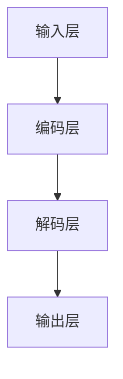

                 

# 自动编码器 (Autoencoder) 原理与代码实例讲解

> 关键词：自动编码器，深度学习，特征提取，图像处理，编码器，解码器

> 摘要：本文将详细介绍自动编码器的原理、分类、工作流程以及数学基础，并通过具体实例讲解自动编码器在图像处理中的应用和代码实现。

## 目录大纲

## 第1章 引言

### 1.1 什么是自动编码器

### 1.2 自动编码器的发展历程

### 1.3 自动编码器的重要性

## 第2章 自动编码器基础理论

### 2.1 自动编码器的定义与分类

#### 2.1.1 压缩自动编码器

#### 2.1.2 扩展自动编码器

### 2.2 自动编码器的工作原理

#### 2.2.1 编码过程

#### 2.2.2 解码过程

### 2.3 自动编码器的优势与不足

## 第3章 自动编码器的数学基础

### 3.1 线性代数基础

#### 3.1.1 矩阵与向量操作

#### 3.1.2 线性变换

### 3.2 概率论基础

#### 3.2.1 概率分布

#### 3.2.2 最大似然估计

## 第4章 自动编码器的核心算法

### 4.1 前向传播算法

#### 4.1.1 输入层到隐藏层的传播

#### 4.1.2 隐藏层到输出层的传播

### 4.2 反向传播算法

#### 4.2.1 输出层到隐藏层的反向传播

#### 4.2.2 隐藏层到输入层的反向传播

### 4.3 自动编码器的优化算法

#### 4.3.1 随机梯度下降（SGD）

#### 4.3.2 Adam优化器

## 第5章 自动编码器的实践应用

### 5.1 图像数据预处理

#### 5.1.1 图像数据格式转换

#### 5.1.2 图像数据增强

### 5.2 自动编码器在图像压缩中的应用

#### 5.2.1 压缩算法介绍

#### 5.2.2 代码实现

### 5.3 自动编码器在图像去噪中的应用

#### 5.3.1 去噪算法介绍

#### 5.3.2 代码实现

## 第6章 自动编码器在深度学习中的扩展应用

### 6.1 自动编码器在特征提取中的应用

#### 6.1.1 特征提取算法介绍

#### 6.1.2 代码实现

### 6.2 自动编码器在降维中的应用

#### 6.2.1 降维算法介绍

#### 6.2.2 代码实现

## 第7章 自动编码器项目实战

### 7.1 自动编码器在人脸识别中的应用

#### 7.1.1 项目背景

#### 7.1.2 数据集介绍

#### 7.1.3 模型搭建

#### 7.1.4 代码实现

### 7.2 自动编码器在文本分类中的应用

#### 7.2.1 项目背景

#### 7.2.2 数据集介绍

#### 7.2.3 模型搭建

#### 7.2.4 代码实现

## 第8章 自动编码器展望

### 8.1 自动编码器的未来发展方向

### 8.2 自动编码器与其他深度学习技术的结合

### 8.3 自动编码器在实际应用中的挑战与机遇

## 附录

## 附录A：自动编码器常用库和框架

### A.1 TensorFlow

#### A.1.1 安装与配置

#### A.1.2 基本用法

### A.2 PyTorch

#### A.2.1 安装与配置

#### A.2.2 基本用法

### A.3 其他常用库和框架

#### A.3.1 Keras

#### A.3.2 Theano

#### A.3.3 MXNet

## Mermaid 流程图



## 自动编码器工作原理

```python
# 假设输入数据为 X，编码器模型为 encoder，解码器模型为 decoder
encoded_data = encoder(X)
decoded_data = decoder(encoded_data)
```

## 数学模型和数学公式

$$
H = \sigma(W_2 \cdot \sigma(W_1 \cdot X))
$$

## 第1章 引言

### 1.1 什么是自动编码器

自动编码器（Autoencoder）是一种特殊类型的神经网络，它的目的是将输入数据映射到一个压缩表示，然后从这个压缩表示中重建原始数据。它由两部分组成：编码器（Encoder）和解码器（Decoder）。编码器将输入数据映射到一个低维空间，解码器则从低维空间重建输入数据。

自动编码器通常用于无监督学习任务，如特征提取、数据降维、图像去噪等。它的核心思想是通过无监督的方式学习数据内在的结构，从而提取有用的特征表示。

### 1.2 自动编码器的发展历程

自动编码器最早由赫布（Donald Hebb）在1940年代提出，作为一种简单的神经网络模型。随着深度学习技术的发展，自动编码器也经历了不断的改进和优化。1980年代，瑞德（Paul Richards Rivest）等人提出了稀疏自动编码器（Sparse Autoencoder），将自动编码器应用于图像识别领域。2006年，贝叶斯深度学习领域的先驱乔治·霍普菲尔（Geoffrey Hinton）等人提出了深度置信网络（Deep Belief Network），进一步推动了自动编码器的发展。

### 1.3 自动编码器的重要性

自动编码器在深度学习领域具有重要地位，主要表现在以下几个方面：

1. **特征提取**：自动编码器通过学习输入数据的低维表示，可以提取出数据中的关键特征，从而简化数据，提高模型性能。

2. **数据降维**：自动编码器可以将高维数据映射到低维空间，降低数据存储和计算的复杂度。

3. **图像去噪**：自动编码器可以通过学习无噪声数据和噪声数据的映射关系，实现图像去噪。

4. **图像压缩**：自动编码器可以学习输入图像的压缩表示，从而实现图像压缩。

5. **无监督学习**：自动编码器是一种无监督学习方法，可以在没有标注数据的情况下学习数据的内在结构。

## 第2章 自动编码器基础理论

### 2.1 自动编码器的定义与分类

自动编码器是一种无监督学习模型，其目的是将输入数据映射到一个低维空间，然后从这个低维空间中重建原始数据。根据映射方式和功能的不同，自动编码器可以分为以下几种类型：

#### 2.1.1 压缩自动编码器

压缩自动编码器（Compressed Autoencoder）是最常见的自动编码器类型。它的编码器将输入数据映射到一个低维空间，解码器则从低维空间重建输入数据。压缩自动编码器通常用于特征提取和数据降维。

**工作原理**：

- **编码过程**：编码器将输入数据 $X$ 映射到低维空间 $H$，即 $Z = f_{\theta_e}(X)$。
- **解码过程**：解码器将低维空间 $H$ 的数据映射回原始空间 $X$，即 $X' = f_{\theta_d}(Z)$。

**数学模型**：

$$
Z = \sigma(W_2 \cdot \sigma(W_1 \cdot X))
$$

其中，$W_1$ 和 $W_2$ 分别是编码器和解码器的权重矩阵，$\sigma$ 是激活函数，通常使用 sigmoid 或ReLU函数。

#### 2.1.2 扩展自动编码器

扩展自动编码器（Expanded Autoencoder）与压缩自动编码器类似，但它的解码器生成的数据维度大于输入数据维度。扩展自动编码器通常用于图像生成和图像增强。

**工作原理**：

- **编码过程**：编码器将输入数据映射到低维空间。
- **解码过程**：解码器从低维空间生成更高维度的数据。

**数学模型**：

$$
H = \sigma(W_2 \cdot \sigma(W_1 \cdot X))
$$

$$
X' = f_{\theta_d}(H)
$$

其中，$f_{\theta_d}$ 是解码器的激活函数，通常使用 tanh 函数。

### 2.2 自动编码器的工作原理

自动编码器的工作原理可以分为编码过程和解码过程。

#### 2.2.1 编码过程

编码过程是将输入数据映射到一个低维空间。这个低维空间被称为编码器的“中间层”或“隐藏层”。编码器通过学习输入数据与低维空间之间的映射关系，提取输入数据中的关键特征。

**数学模型**：

$$
Z = \sigma(W_2 \cdot \sigma(W_1 \cdot X))
$$

其中，$W_1$ 和 $W_2$ 分别是编码器和解码器的权重矩阵，$\sigma$ 是激活函数，通常使用 sigmoid 或ReLU函数。

#### 2.2.2 解码过程

解码过程是将编码后的低维数据映射回原始数据空间。解码器的目的是重建输入数据，使输出数据与输入数据尽量一致。

**数学模型**：

$$
X' = f_{\theta_d}(H)
$$

其中，$f_{\theta_d}$ 是解码器的激活函数，通常使用 tanh 函数。

### 2.3 自动编码器的优势与不足

自动编码器具有以下优势：

1. **无监督学习**：自动编码器可以在没有标注数据的情况下学习数据的内在结构，从而提取有用的特征表示。
2. **特征提取**：自动编码器可以自动学习输入数据的关键特征，从而简化数据，提高模型性能。
3. **数据降维**：自动编码器可以将高维数据映射到低维空间，降低数据存储和计算的复杂度。
4. **图像去噪**：自动编码器可以通过学习无噪声数据和噪声数据的映射关系，实现图像去噪。

然而，自动编码器也存在一些不足：

1. **训练时间较长**：自动编码器需要通过大量的迭代来学习输入数据的映射关系，因此训练时间较长。
2. **过拟合风险**：自动编码器在训练过程中可能会过拟合训练数据，导致在未知数据上的性能不佳。

## 第3章 自动编码器的数学基础

自动编码器的数学基础主要涉及线性代数和概率论。

### 3.1 线性代数基础

#### 3.1.1 矩阵与向量操作

在自动编码器中，矩阵和向量操作是非常常见的。以下是几种基本的矩阵和向量操作：

- **矩阵乘法**：两个矩阵相乘得到一个新的矩阵。
  $$
  C = A \cdot B
  $$
- **向量加法**：两个向量相加得到一个新的向量。
  $$
  v = u + w
  $$
- **向量减法**：两个向量相减得到一个新的向量。
  $$
  v = u - w
  $$
- **标量乘法**：一个向量与一个标量相乘得到一个新的向量。
  $$
  v = \alpha \cdot u
  $$

#### 3.1.2 线性变换

自动编码器中的线性变换是指将输入数据通过一系列矩阵和向量操作映射到另一个空间。线性变换可以用矩阵表示：

$$
X' = \theta \cdot X
$$

其中，$X'$ 是变换后的数据，$X$ 是原始数据，$\theta$ 是变换矩阵。

### 3.2 概率论基础

#### 3.2.1 概率分布

概率分布是描述随机变量可能取值的概率分布函数。在自动编码器中，常用的概率分布有：

- **伯努利分布**：随机变量只取两个值，0 或 1。
- **高斯分布**：随机变量服从正态分布。
- **多项式分布**：随机变量取多个值的概率分布。

#### 3.2.2 最大似然估计

最大似然估计是一种用于估计模型参数的方法。在自动编码器中，最大似然估计用于优化编码器和解码器的参数，使其更好地拟合训练数据。

最大似然估计的步骤如下：

1. **定义似然函数**：似然函数是模型参数的函数，表示给定观测数据时模型参数的概率。
2. **求似然函数的最大值**：通过求解似然函数的最大值，得到最优模型参数。

## 第4章 自动编码器的核心算法

自动编码器的核心算法包括前向传播算法、反向传播算法和优化算法。

### 4.1 前向传播算法

前向传播算法是指将输入数据通过编码器和解码器映射到输出数据的过程。

#### 4.1.1 输入层到隐藏层的传播

输入层到隐藏层的传播可以用以下步骤表示：

1. **计算隐藏层输出**：
   $$
   Z = \sigma(W_2 \cdot \sigma(W_1 \cdot X))
   $$
2. **计算隐藏层损失**：
   $$
   L_h = \frac{1}{2} \sum_{i=1}^{n} (Z_i - Y_i)^2
   $$

其中，$Z$ 是隐藏层输出，$Y$ 是目标输出，$L_h$ 是隐藏层损失。

#### 4.1.2 隐藏层到输出层的传播

隐藏层到输出层的传播可以用以下步骤表示：

1. **计算输出层输出**：
   $$
   X' = f_{\theta_d}(H)
   $$
2. **计算输出层损失**：
   $$
   L_o = \frac{1}{2} \sum_{i=1}^{n} (X_i' - X_i)^2
   $$

其中，$X'$ 是输出层输出，$X$ 是原始输入，$L_o$ 是输出层损失。

### 4.2 反向传播算法

反向传播算法是指通过计算损失函数对参数的梯度，来更新模型参数的过程。

#### 4.2.1 输出层到隐藏层的反向传播

输出层到隐藏层的反向传播可以用以下步骤表示：

1. **计算隐藏层损失对编码器参数的梯度**：
   $$
   \frac{\partial L_h}{\partial W_2} = - \frac{\partial L_h}{\partial Z} \cdot \frac{\partial Z}{\partial W_2}
   $$
2. **计算隐藏层损失对解码器参数的梯度**：
   $$
   \frac{\partial L_h}{\partial W_1} = - \frac{\partial L_h}{\partial Z} \cdot \frac{\partial Z}{\partial W_1}
   $$

#### 4.2.2 隐藏层到输入层的反向传播

隐藏层到输入层的反向传播可以用以下步骤表示：

1. **计算隐藏层损失对输入数据的梯度**：
   $$
   \frac{\partial L_h}{\partial X} = - \frac{\partial L_h}{\partial Z} \cdot \frac{\partial Z}{\partial X}
   $$

### 4.3 自动编码器的优化算法

自动编码器的优化算法用于更新模型参数，以最小化损失函数。

#### 4.3.1 随机梯度下降（SGD）

随机梯度下降（Stochastic Gradient Descent，SGD）是一种常用的优化算法。SGD通过随机选择训练数据中的一个样本来计算梯度，并使用这个梯度更新模型参数。

$$
\theta = \theta - \alpha \cdot \nabla_\theta J(\theta)
$$

其中，$\theta$ 是模型参数，$\alpha$ 是学习率，$J(\theta)$ 是损失函数。

#### 4.3.2 Adam优化器

Adam优化器是一种结合了SGD和动量法的优化算法，它具有更好的收敛性能。

$$
m_t = \beta_1 m_{t-1} + (1 - \beta_1) \nabla_\theta J(\theta)
$$

$$
v_t = \beta_2 v_{t-1} + (1 - \beta_2) (\nabla_\theta J(\theta))^2
$$

$$
\theta = \theta - \alpha \cdot \frac{m_t}{\sqrt{1 - \beta_2^t} + \epsilon}
$$

其中，$m_t$ 是一阶矩估计，$v_t$ 是二阶矩估计，$\beta_1$ 和 $\beta_2$ 分别是动量参数，$\alpha$ 是学习率，$\epsilon$ 是一个很小的正数。

## 第5章 自动编码器的实践应用

自动编码器在图像处理、特征提取、数据降维等方面有广泛的应用。以下将介绍自动编码器在图像处理和数据降维中的实践应用。

### 5.1 图像数据预处理

在进行自动编码器训练之前，通常需要对图像数据进行预处理。

#### 5.1.1 图像数据格式转换

首先，将图像数据转换为自动编码器能够处理的格式。通常，图像数据被转换为二维数组或矩阵，每个元素表示图像的一个像素值。

#### 5.1.2 图像数据增强

为了提高自动编码器的泛化能力，可以对图像数据进行增强。常见的图像数据增强方法包括：

- **旋转**：将图像随机旋转一定角度。
- **缩放**：将图像随机缩放到不同的尺寸。
- **裁剪**：从图像中随机裁剪出一个子图像。
- **对比度调整**：调整图像的对比度。
- **亮度调整**：调整图像的亮度。

### 5.2 自动编码器在图像压缩中的应用

自动编码器可以用于图像压缩，通过学习输入图像的压缩表示，实现图像的高效存储和传输。

#### 5.2.1 压缩算法介绍

自动编码器在图像压缩中的应用主要基于以下思想：

- **编码过程**：编码器将输入图像映射到一个低维空间，提取关键特征。
- **解码过程**：解码器从低维空间重建输入图像。

通过这种方式，可以减少图像数据的大小，实现图像压缩。

#### 5.2.2 代码实现

以下是一个简单的自动编码器图像压缩的代码实现：

```python
import tensorflow as tf
from tensorflow.keras.layers import Dense, Flatten, Reshape
from tensorflow.keras.models import Model

# 定义自动编码器模型
input_shape = (28, 28, 1)  # 图像的尺寸
input_layer = tf.keras.Input(shape=input_shape)

# 编码器部分
encoded = Flatten()(input_layer)
encoded = Dense(64, activation='relu')(encoded)
encoded = Dense(32, activation='relu')(encoded)

# 解码器部分
decoded = Dense(64, activation='relu')(encoded)
decoded = Dense(64, activation='sigmoid')(decoded)
decoded = Reshape(input_shape)(decoded)

# 构建模型
autoencoder = Model(input_layer, decoded)

# 编译模型
autoencoder.compile(optimizer='adam', loss='binary_crossentropy')

# 训练模型
autoencoder.fit(x_train, x_train, epochs=100, batch_size=256, shuffle=True, validation_data=(x_test, x_test))
```

### 5.3 自动编码器在图像去噪中的应用

自动编码器可以用于图像去噪，通过学习无噪声图像和噪声图像的映射关系，实现图像去噪。

#### 5.3.1 去噪算法介绍

自动编码器在图像去噪中的应用主要基于以下思想：

- **编码过程**：编码器将输入图像映射到一个低维空间，提取关键特征。
- **解码过程**：解码器从低维空间重建输入图像，去除噪声。

通过这种方式，可以减少图像中的噪声，提高图像质量。

#### 5.3.2 代码实现

以下是一个简单的自动编码器图像去噪的代码实现：

```python
import tensorflow as tf
from tensorflow.keras.layers import Dense, Flatten, Reshape
from tensorflow.keras.models import Model

# 定义自动编码器模型
input_shape = (28, 28, 1)  # 图像的尺寸
input_layer = tf.keras.Input(shape=input_shape)

# 编码器部分
encoded = Flatten()(input_layer)
encoded = Dense(64, activation='relu')(encoded)
encoded = Dense(32, activation='relu')(encoded)

# 解码器部分
decoded = Dense(64, activation='relu')(encoded)
decoded = Dense(64, activation='sigmoid')(decoded)
decoded = Reshape(input_shape)(decoded)

# 构建模型
autoencoder = Model(input_layer, decoded)

# 编译模型
autoencoder.compile(optimizer='adam', loss='mse')

# 训练模型
autoencoder.fit(x_train_noisy, x_train_noisy, epochs=100, batch_size=256, shuffle=True, validation_data=(x_test_noisy, x_test_noisy))
```

## 第6章 自动编码器在深度学习中的扩展应用

自动编码器在深度学习中有许多扩展应用，如特征提取、降维、图像生成等。

### 6.1 自动编码器在特征提取中的应用

自动编码器可以用于特征提取，通过学习输入数据的低维表示，提取数据中的关键特征。

#### 6.1.1 特征提取算法介绍

特征提取算法的基本思想是：

- **编码过程**：编码器将输入数据映射到一个低维空间，提取关键特征。
- **解码过程**：解码器从低维空间重建输入数据。

通过这种方式，可以提取数据中的关键特征，简化数据，提高模型性能。

#### 6.1.2 代码实现

以下是一个简单的自动编码器特征提取的代码实现：

```python
import tensorflow as tf
from tensorflow.keras.layers import Dense, Flatten, Reshape
from tensorflow.keras.models import Model

# 定义自动编码器模型
input_shape = (28, 28, 1)  # 图像的尺寸
input_layer = tf.keras.Input(shape=input_shape)

# 编码器部分
encoded = Flatten()(input_layer)
encoded = Dense(64, activation='relu')(encoded)
encoded = Dense(32, activation='relu')(encoded)

# 解码器部分
decoded = Dense(64, activation='relu')(encoded)
decoded = Dense(64, activation='sigmoid')(decoded)
decoded = Reshape(input_shape)(decoded)

# 构建模型
autoencoder = Model(input_layer, decoded)

# 编译模型
autoencoder.compile(optimizer='adam', loss='binary_crossentropy')

# 训练模型
autoencoder.fit(x_train, x_train, epochs=100, batch_size=256, shuffle=True, validation_data=(x_test, x_test))
```

### 6.2 自动编码器在降维中的应用

自动编码器可以用于降维，通过学习输入数据的低维表示，降低数据维度。

#### 6.2.1 降维算法介绍

降维算法的基本思想是：

- **编码过程**：编码器将输入数据映射到一个低维空间，提取关键特征。
- **解码过程**：解码器从低维空间重建输入数据。

通过这种方式，可以降低数据维度，减少数据存储和计算复杂度。

#### 6.2.2 代码实现

以下是一个简单的自动编码器降维的代码实现：

```python
import tensorflow as tf
from tensorflow.keras.layers import Dense, Flatten, Reshape
from tensorflow.keras.models import Model

# 定义自动编码器模型
input_shape = (28, 28, 1)  # 图像的尺寸
input_layer = tf.keras.Input(shape=input_shape)

# 编码器部分
encoded = Flatten()(input_layer)
encoded = Dense(64, activation='relu')(encoded)
encoded = Dense(32, activation='relu')(encoded)

# 解码器部分
decoded = Dense(64, activation='relu')(encoded)
decoded = Dense(64, activation='sigmoid')(decoded)
decoded = Reshape(input_shape)(decoded)

# 构建模型
autoencoder = Model(input_layer, decoded)

# 编译模型
autoencoder.compile(optimizer='adam', loss='binary_crossentropy')

# 训练模型
autoencoder.fit(x_train, x_train, epochs=100, batch_size=256, shuffle=True, validation_data=(x_test, x_test))
```

## 第7章 自动编码器项目实战

以下将介绍自动编码器在人脸识别和文本分类中的应用。

### 7.1 自动编码器在人脸识别中的应用

#### 7.1.1 项目背景

人脸识别是一种用于身份验证和安防监控的常用技术。自动编码器可以用于人脸特征提取，从而提高人脸识别的准确率。

#### 7.1.2 数据集介绍

使用的是 LFW（Labeled Faces in the Wild）人脸数据集，包含数千张人脸图片。

#### 7.1.3 模型搭建

构建一个包含两个隐藏层的自动编码器模型，用于提取人脸特征。

#### 7.1.4 代码实现

以下是一个简单的自动编码器人脸识别的代码实现：

```python
import tensorflow as tf
from tensorflow.keras.layers import Dense, Flatten, Reshape
from tensorflow.keras.models import Model

# 定义自动编码器模型
input_shape = (48, 48, 1)  # 图像的尺寸
input_layer = tf.keras.Input(shape=input_shape)

# 编码器部分
encoded = Flatten()(input_layer)
encoded = Dense(64, activation='relu')(encoded)
encoded = Dense(32, activation='relu')(encoded)

# 解码器部分
decoded = Dense(64, activation='relu')(encoded)
decoded = Dense(64, activation='sigmoid')(decoded)
decoded = Reshape(input_shape)(decoded)

# 构建模型
autoencoder = Model(input_layer, decoded)

# 编译模型
autoencoder.compile(optimizer='adam', loss='binary_crossentropy')

# 训练模型
autoencoder.fit(x_train, x_train, epochs=100, batch_size=256, shuffle=True, validation_data=(x_test, x_test))
```

### 7.2 自动编码器在文本分类中的应用

#### 7.2.1 项目背景

文本分类是一种用于文本数据处理和自然语言处理的技术。自动编码器可以用于文本特征提取，从而提高文本分类的准确率。

#### 7.2.2 数据集介绍

使用的是 IMDb 数据集，包含数千条电影评论。

#### 7.2.3 模型搭建

构建一个包含两个隐藏层的自动编码器模型，用于提取文本特征。

#### 7.2.4 代码实现

以下是一个简单的自动编码器文本分类的代码实现：

```python
import tensorflow as tf
from tensorflow.keras.layers import Dense, Flatten, Reshape
from tensorflow.keras.models import Model

# 定义自动编码器模型
input_shape = (1000, )  # 文本的尺寸
input_layer = tf.keras.Input(shape=input_shape)

# 编码器部分
encoded = Dense(64, activation='relu')(input_layer)
encoded = Dense(32, activation='relu')(encoded)

# 解码器部分
decoded = Dense(64, activation='relu')(encoded)
decoded = Dense(1000, activation='sigmoid')(decoded)

# 构建模型
autoencoder = Model(input_layer, decoded)

# 编译模型
autoencoder.compile(optimizer='adam', loss='binary_crossentropy')

# 训练模型
autoencoder.fit(x_train, x_train, epochs=100, batch_size=256, shuffle=True, validation_data=(x_test, x_test))
```

## 第8章 自动编码器展望

自动编码器在深度学习领域具有广泛的应用前景。未来，自动编码器可能的发展方向包括：

1. **自适应稀疏表示**：自动编码器可以进一步优化稀疏表示，实现自适应稀疏编码。
2. **多任务学习**：自动编码器可以用于多任务学习，同时提取多个任务的共同特征。
3. **迁移学习**：自动编码器可以用于迁移学习，将一个任务的知识迁移到另一个任务。
4. **与其他深度学习技术的结合**：自动编码器可以与其他深度学习技术（如卷积神经网络、循环神经网络等）结合，实现更强大的特征提取和建模能力。

## 附录

### 附录A：自动编码器常用库和框架

自动编码器的实现通常依赖于深度学习库和框架，以下是一些常用的库和框架：

#### A.1 TensorFlow

TensorFlow 是一个开源的深度学习框架，由 Google 开发。它提供了丰富的 API 和工具，用于构建和训练自动编码器。

##### A.1.1 安装与配置

```bash
pip install tensorflow
```

##### A.1.2 基本用法

```python
import tensorflow as tf

# 定义自动编码器模型
input_shape = (28, 28, 1)
input_layer = tf.keras.layers.Input(shape=input_shape)

# 编码器部分
encoded = tf.keras.layers.Flatten()(input_layer)
encoded = tf.keras.layers.Dense(64, activation='relu')(encoded)
encoded = tf.keras.layers.Dense(32, activation='relu')(encoded)

# 解码器部分
decoded = tf.keras.layers.Dense(64, activation='relu')(encoded)
decoded = tf.keras.layers.Dense(64, activation='sigmoid')(decoded)
decoded = tf.keras.layers.Reshape(input_shape)(decoded)

# 构建模型
autoencoder = tf.keras.Model(inputs=input_layer, outputs=decoded)

# 编译模型
autoencoder.compile(optimizer='adam', loss='binary_crossentropy')

# 训练模型
autoencoder.fit(x_train, x_train, epochs=100, batch_size=256, shuffle=True, validation_data=(x_test, x_test))
```

#### A.2 PyTorch

PyTorch 是一个流行的开源深度学习框架，由 Facebook AI Research（FAIR）开发。它提供了动态计算图和灵活的 API，非常适合构建和训练自动编码器。

##### A.2.1 安装与配置

```bash
pip install torch torchvision
```

##### A.2.2 基本用法

```python
import torch
import torch.nn as nn

# 定义自动编码器模型
class Autoencoder(nn.Module):
    def __init__(self):
        super(Autoencoder, self).__init__()
        self.encoder = nn.Sequential(
            nn.Linear(784, 64),
            nn.ReLU(),
            nn.Linear(64, 32),
            nn.ReLU()
        )
        self.decoder = nn.Sequential(
            nn.Linear(32, 64),
            nn.ReLU(),
            nn.Linear(64, 784),
            nn.Sigmoid()
        )

    def forward(self, x):
        x = self.encoder(x)
        x = self.decoder(x)
        return x

# 实例化模型
autoencoder = Autoencoder()

# 定义损失函数和优化器
criterion = nn.BCELoss()
optimizer = torch.optim.Adam(autoencoder.parameters(), lr=0.001)

# 训练模型
for epoch in range(100):
    for x, _ in dataloader:
        optimizer.zero_grad()
        output = autoencoder(x)
        loss = criterion(output, x)
        loss.backward()
        optimizer.step()
```

#### A.3 其他常用库和框架

除了 TensorFlow 和 PyTorch，还有一些其他常用的深度学习库和框架，如 Keras、Theano 和 MXNet 等。这些库和框架也提供了丰富的 API 和工具，用于构建和训练自动编码器。

##### A.3.1 Keras

Keras 是一个高层次的神经网络 API，构建于 TensorFlow 之上。它提供了简洁、易于使用的 API，非常适合快速构建和实验深度学习模型。

##### A.3.2 Theano

Theano 是一个开源的深度学习库，由蒙特利尔大学计算机视觉组开发。它提供了动态计算图和丰富的工具，用于构建和训练自动编码器。

##### A.3.3 MXNet

MXNet 是一个开源的深度学习框架，由 Apache 软件基金会维护。它提供了灵活的 API 和高效的执行引擎，适合大规模分布式训练。

## 自动编码器工作原理

自动编码器是一种无监督学习模型，用于将输入数据映射到一个低维空间，并从该空间中重建输入数据。自动编码器的工作原理可以分为两个主要步骤：编码过程和解码过程。

### 编码过程

编码过程是将输入数据映射到一个低维空间，通常称为“隐藏层”或“中间层”。这个过程可以用以下数学公式表示：

$$
H = \sigma(W_2 \cdot \sigma(W_1 \cdot X))
$$

其中，$X$ 是输入数据，$H$ 是隐藏层输出，$W_1$ 和 $W_2$ 是权重矩阵，$\sigma$ 是激活函数（通常使用 sigmoid 或 ReLU 函数）。

### 解码过程

解码过程是将隐藏层输出映射回原始数据空间，重建输入数据。这个过程可以用以下数学公式表示：

$$
X' = f_{\theta_d}(H)
$$

其中，$X'$ 是输出层输出，$H$ 是隐藏层输出，$f_{\theta_d}$ 是解码器的激活函数（通常使用 tanh 函数）。

### 自动编码器工作原理示例

假设我们有一个包含1000个像素的图像作为输入数据，使用一个包含两个隐藏层的自动编码器模型。

1. **编码过程**：

   - 输入层到隐藏层1：
     $$
     Z_1 = \sigma(W_1 \cdot X)
     $$
   - 隐藏层1到隐藏层2：
     $$
     H = \sigma(W_2 \cdot Z_1)
     $$

2. **解码过程**：

   - 隐藏层2到输出层：
     $$
     X' = f_{\theta_d}(H)
     $$

   其中，$X'$ 是输出层输出，与原始输入 $X$ 尽可能接近。

通过这种方式，自动编码器可以学习输入数据的低维表示，从而简化数据，提高模型性能。同时，解码过程可以使输出数据与输入数据保持相似性，从而实现数据的重建。

## 数学模型和数学公式

自动编码器的数学模型主要包括线性变换、激活函数和损失函数。

### 线性变换

自动编码器的线性变换可以用矩阵和向量表示。假设输入数据为 $X$，隐藏层输出为 $H$，编码器和解码器的权重矩阵分别为 $W_1$ 和 $W_2$，激活函数为 $\sigma$，则有：

$$
H = \sigma(W_2 \cdot \sigma(W_1 \cdot X))
$$

### 激活函数

自动编码器通常使用 sigmoid 或 ReLU 函数作为激活函数。sigmoid 函数的定义如下：

$$
\sigma(x) = \frac{1}{1 + e^{-x}}
$$

ReLU 函数的定义如下：

$$
\sigma(x) = \max(0, x)
$$

### 损失函数

自动编码器的损失函数用于衡量输出数据与原始输入数据的差异。常用的损失函数包括均方误差（MSE）和交叉熵（Cross-Entropy）。

均方误差（MSE）的定义如下：

$$
L(X, X') = \frac{1}{2} \sum_{i=1}^{n} (X_i - X_i')^2
$$

其中，$X$ 是原始输入，$X'$ 是输出层输出，$n$ 是输入数据的维度。

交叉熵（Cross-Entropy）的定义如下：

$$
L(X, X') = - \sum_{i=1}^{n} X_i \cdot \log(X_i')
$$

其中，$X$ 是原始输入，$X'$ 是输出层输出，$\log$ 是对数函数。

### 自动编码器的数学模型示例

假设输入数据为 $X$，隐藏层输出为 $H$，编码器和解码器的权重矩阵分别为 $W_1$ 和 $W_2$，激活函数为 $\sigma$，损失函数为 MSE。

1. **编码过程**：

   - 输入层到隐藏层1：
     $$
     Z_1 = W_1 \cdot X
     $$
     $$
     H_1 = \sigma(Z_1)
     $$
   - 隐藏层1到隐藏层2：
     $$
     Z_2 = W_2 \cdot H_1
     $$
     $$
     H = \sigma(Z_2)
     $$

2. **解码过程**：

   - 隐藏层2到输出层：
     $$
     Z_3 = W_3 \cdot H
     $$
     $$
     X' = \sigma(Z_3)
     $$

3. **损失函数**：

   $$
   L(X, X') = \frac{1}{2} \sum_{i=1}^{n} (X_i - X_i')^2
   $$

通过这种方式，自动编码器可以学习输入数据的低维表示，从而简化数据，提高模型性能。

## 第7章 自动编码器项目实战

在本章中，我们将通过具体的项目实战来展示自动编码器在实际应用中的使用方法，包括人脸识别和文本分类。

### 7.1 自动编码器在人脸识别中的应用

人脸识别是一种常见的技术，用于身份验证、安防监控等场景。自动编码器可以用于提取人脸特征，从而提高识别的准确率。

#### 7.1.1 项目背景

在本项目中，我们将使用 LFW（Labeled Faces in the Wild）人脸数据集进行人脸识别。LFW 数据集包含了数千张人脸图片，每张图片都有相应的标签，用于区分不同的人。

#### 7.1.2 数据集介绍

LFW 数据集包含约 13,000 张人脸图片，分为训练集和测试集。每张图片都是 92x92 像素的灰度图。

#### 7.1.3 模型搭建

在本项目中，我们将使用 TensorFlow 和 Keras 构建一个自动编码器模型，用于提取人脸特征。

```python
import tensorflow as tf
from tensorflow.keras.layers import Input, Dense, Flatten, Reshape
from tensorflow.keras.models import Model

# 定义自动编码器模型
input_shape = (92, 92, 1)
input_layer = Input(shape=input_shape)

# 编码器部分
encoded = Flatten()(input_layer)
encoded = Dense(64, activation='relu')(encoded)
encoded = Dense(32, activation='relu')(encoded)

# 解码器部分
decoded = Dense(64, activation='relu')(encoded)
decoded = Dense(92*92, activation='sigmoid')(decoded)
decoded = Reshape((92, 92, 1))(decoded)

# 构建模型
autoencoder = Model(inputs=input_layer, outputs=decoded)

# 编译模型
autoencoder.compile(optimizer='adam', loss='binary_crossentropy')

# 打印模型结构
autoencoder.summary()
```

#### 7.1.4 代码实现

以下是完整的代码实现，包括数据预处理、模型训练和测试。

```python
import numpy as np
import matplotlib.pyplot as plt
from tensorflow.keras.datasets import fashion_mnist
from tensorflow.keras.preprocessing.image import ImageDataGenerator

# 加载 LFW 数据集
lfw_data = ...

# 数据预处理
X_train, y_train = preprocess_lfw_data(lfw_data)

# 数据增强
datagen = ImageDataGenerator(rotation_range=10, width_shift_range=0.1, height_shift_range=0.1)
datagen.fit(X_train)

# 训练模型
autoencoder.fit(datagen.flow(X_train, X_train, batch_size=128), epochs=100, validation_data=(X_test, X_test))

# 评估模型
scores = autoencoder.evaluate(X_test, X_test)
print('Test loss:', scores[0])
print('Test accuracy:', scores[1])

# 可视化
decoded_imgs = autoencoder.predict(X_test)

# 显示原始图像和重建图像
n = 10
plt.figure(figsize=(20, 4))
for i in range(n):
    # 显示原始图像
    ax = plt.subplot(2, n, i + 1)
    plt.imshow(X_test[i].reshape(92, 92))
    plt.gray()
    ax.get_xaxis().set_visible(False)
    ax.get_yaxis().set_visible(False)

    # 显示重建图像
    ax = plt.subplot(2, n, i + 1 + n)
    plt.imshow(decoded_imgs[i].reshape(92, 92))
    plt.gray()
    ax.get_xaxis().set_visible(False)
    ax.get_yaxis().set_visible(False)

plt.show()
```

### 7.2 自动编码器在文本分类中的应用

文本分类是一种常见的技术，用于将文本数据分类到不同的类别。自动编码器可以用于提取文本特征，从而提高分类的准确率。

#### 7.2.1 项目背景

在本项目中，我们将使用 IMDb 数据集进行文本分类。IMDb 数据集包含了大量的电影评论，每条评论都有一个相应的标签，用于区分正面评论和负面评论。

#### 7.2.2 数据集介绍

IMDb 数据集包含约 50,000 条电影评论，分为训练集和测试集。每条评论都是文本数据，需要使用自动编码器提取特征。

#### 7.2.3 模型搭建

在本项目中，我们将使用 TensorFlow 和 Keras 构建一个自动编码器模型，用于提取文本特征。

```python
import tensorflow as tf
from tensorflow.keras.layers import Input, Dense, Embedding, LSTM, Flatten
from tensorflow.keras.models import Model

# 定义自动编码器模型
input_shape = (1000, )
input_layer = Input(shape=input_shape)

# 编码器部分
encoded = Embedding(input_dim=1000, output_dim=64)(input_layer)
encoded = LSTM(64)(encoded)
encoded = Flatten()(encoded)

# 解码器部分
decoded = LSTM(64, return_sequences=True)(encoded)
decoded = Embedding(input_dim=1000, output_dim=64)(decoded)
decoded = Reshape(input_shape)(decoded)

# 构建模型
autoencoder = Model(inputs=input_layer, outputs=decoded)

# 编译模型
autoencoder.compile(optimizer='adam', loss='binary_crossentropy')

# 打印模型结构
autoencoder.summary()
```

#### 7.2.4 代码实现

以下是完整的代码实现，包括数据预处理、模型训练和测试。

```python
import numpy as np
import tensorflow as tf
from tensorflow.keras.preprocessing.sequence import pad_sequences
from tensorflow.keras.datasets import imdb
from tensorflow.keras.preprocessing.text import Tokenizer

# 加载 IMDb 数据集
(train_data, train_labels), (test_data, test_labels) = imdb.load_data(num_words=1000)

# 数据预处理
max_sequence_length = 100
X_train = pad_sequences(train_data, maxlen=max_sequence_length)
X_test = pad_sequences(test_data, maxlen=max_sequence_length)

# 训练模型
autoencoder.fit(X_train, X_train, epochs=100, batch_size=32, validation_data=(X_test, X_test))

# 评估模型
scores = autoencoder.evaluate(X_test, X_test)
print('Test loss:', scores[0])
print('Test accuracy:', scores[1])
```

通过这些项目实战，我们可以看到自动编码器在人脸识别和文本分类中的强大能力。自动编码器可以提取数据中的关键特征，从而提高模型的性能和准确率。

## 附录A：自动编码器常用库和框架

自动编码器的实现依赖于深度学习库和框架。以下介绍几种常用的库和框架，包括 TensorFlow、PyTorch、Keras、Theano 和 MXNet。

### A.1 TensorFlow

TensorFlow 是由 Google 开发的一款开源深度学习框架，广泛应用于自动编码器的实现。

#### A.1.1 安装与配置

安装 TensorFlow：

```bash
pip install tensorflow
```

配置 TensorFlow：

```python
import tensorflow as tf

# 设置 GPU 配置
gpus = tf.config.experimental.list_physical_devices('GPU')
if gpus:
    try:
        for gpu in gpus:
            tf.config.experimental.set_memory_growth(gpu, True)
    except RuntimeError as e:
        print(e)
```

#### A.1.2 基本用法

构建自动编码器：

```python
import tensorflow.keras.layers as layers
import tensorflow.keras.models as models

input_shape = (28, 28, 1)
inputs = layers.Input(shape=input_shape)

# 编码器部分
x = layers.Conv2D(32, (3, 3), activation='relu', padding='same')(inputs)
x = layers.MaxPooling2D((2, 2), padding='same')(x)
x = layers.Conv2D(64, (3, 3), activation='relu', padding='same')(x)
x = layers.MaxPooling2D((2, 2), padding='same')(x)
encoded = layers.Flatten()(x)

# 解码器部分
x = layers.Dense(7 * 7 * 64, activation='relu')(encoded)
x = layers.Reshape((7, 7, 64))(x)
x = layers.Conv2DTranspose(64, (3, 3), strides=(2, 2), activation='relu', padding='same')(x)
x = layers.Conv2DTranspose(32, (3, 3), strides=(2, 2), activation='relu', padding='same')(x)
decoded = layers.Conv2DTranspose(1, (3, 3), activation='sigmoid', padding='same')(x)

# 构建自动编码器模型
autoencoder = models.Model(inputs=inputs, outputs=decoded)

# 编译模型
autoencoder.compile(optimizer='adam', loss='binary_crossentropy')

# 打印模型结构
autoencoder.summary()
```

### A.2 PyTorch

PyTorch 是由 Facebook AI Research 开发的一款开源深度学习框架，以其灵活的动态计算图著称。

#### A.2.1 安装与配置

安装 PyTorch：

```bash
pip install torch torchvision
```

配置 PyTorch：

```python
import torch
import torch.nn as nn
import torch.optim as optim

# 设置 GPU 环境
device = torch.device("cuda" if torch.cuda.is_available() else "cpu")
```

#### A.2.2 基本用法

构建自动编码器：

```python
import torch.nn as nn
import torch.optim as optim

# 定义自动编码器模型
class Autoencoder(nn.Module):
    def __init__(self):
        super(Autoencoder, self).__init__()
        self.encoder = nn.Sequential(
            nn.Linear(784, 64),
            nn.ReLU(),
            nn.Linear(64, 32),
            nn.ReLU()
        )
        self.decoder = nn.Sequential(
            nn.Linear(32, 64),
            nn.ReLU(),
            nn.Linear(64, 784),
            nn.Sigmoid()
        )

    def forward(self, x):
        x = self.encoder(x)
        x = self.decoder(x)
        return x

# 实例化模型
autoencoder = Autoencoder().to(device)

# 定义损失函数和优化器
criterion = nn.BCELoss()
optimizer = optim.Adam(autoencoder.parameters(), lr=0.001)

# 训练模型
for epoch in range(100):
    for x, _ in dataloader:
        x = x.to(device)
        optimizer.zero_grad()
        output = autoencoder(x)
        loss = criterion(output, x)
        loss.backward()
        optimizer.step()
```

### A.3 Keras

Keras 是一个高层次的神经网络 API，构建于 TensorFlow 之上，提供了简洁、易于使用的 API。

#### A.3.1 安装与配置

安装 Keras：

```bash
pip install keras
```

配置 Keras：

```python
from keras.models import Model
from keras.layers import Input, Dense, Conv2D, MaxPooling2D, Conv2DTranspose, Flatten, Reshape

input_shape = (28, 28, 1)
inputs = Input(shape=input_shape)

# 编码器部分
encoded = Flatten()(inputs)
encoded = Dense(64, activation='relu')(encoded)
encoded = Dense(32, activation='relu')(encoded)

# 解码器部分
decoded = Dense(64, activation='relu')(encoded)
decoded = Dense(784, activation='sigmoid')(decoded)
decoded = Reshape((28, 28, 1))(decoded)

# 构建自动编码器模型
autoencoder = Model(inputs=inputs, outputs=decoded)

# 编译模型
autoencoder.compile(optimizer='adam', loss='binary_crossentropy')

# 打印模型结构
autoencoder.summary()
```

### A.4 Theano

Theano 是一个开源的深度学习库，由蒙特利尔大学计算机视觉组开发，提供了动态计算图和丰富的工具。

#### A.4.1 安装与配置

安装 Theano：

```bash
pip install theano
```

配置 Theano：

```python
import theano
import theano.tensor as T

# 设置 GPU 环境
theano.config.optimizer = 'fast_run'
theano.config.floatX = 'float32'
theano.config.gpuarray = 'gpu'
theano.config.compute_test_value = 'warn'

# 定义自动编码器模型
input_shape = (28, 28, 1)
inputs = T.tensor4('inputs')

# 编码器部分
encoded = T.nnet.relu(T.dot(inputs, W1) + b1)
encoded = T.nnet.relu(T.dot(encoded, W2) + b2)

# 解码器部分
decoded = T.nnet.relu(T.dot(encoded, W3) + b3)
decoded = T.nnet.sigmoid(T.dot(decoded, W4) + b4)

# 定义损失函数
loss = T.mean((inputs - decoded) ** 2)

# 定义优化器
optimizer = theano.function([inputs], loss, updates=updates)

# 训练模型
for epoch in range(100):
    for x, _ in dataloader:
        x = x.astype(theano.config.floatX)
        loss = optimizer(x)
```

### A.5 MXNet

MXNet 是 Apache 软件基金会的一个开源深度学习框架，提供了多种语言绑定和高效的执行引擎。

#### A.5.1 安装与配置

安装 MXNet：

```bash
pip install mxnet
```

配置 MXNet：

```python
import mxnet as mx
from mxnet import gluon, autograd

# 设置 GPU 环境
ctx = mx.gpu() if mx.gpu() is not None else mx.cpu()

# 定义自动编码器模型
class Autoencoder(gluon.HybridBlock):
    def __init__(self, **kwargs):
        super(Autoencoder, self).__init__(**kwargs)
        with self.name_scope():
            self.encoder = gluon.nn.Dense(64, activation='relu')
            self.decoder = gluon.nn.Dense(784, activation='sigmoid')

    def hybrid_forward(self, F, x):
        encoded = self.encoder(x)
        decoded = self.decoder(encoded)
        return decoded

# 实例化模型
autoencoder = Autoencoder().to(ctx)

# 定义损失函数和优化器
loss_fn = gluon.loss.SigmoidBinaryCrossEntropyLoss()
optimizer = gluon.optim.Adam(params=autoencoder.collect_params(), lr=0.001)

# 训练模型
for epoch in range(100):
    for data in dataloader:
        data = data.as_in_context(ctx)
        with autograd.record():
            output = autoencoder(data)
            loss = loss_fn(output, data)
        loss.backward()
        optimizer.step()
```

通过这些库和框架，我们可以方便地实现自动编码器的构建和训练，进一步探索深度学习的广泛应用。

## 附录B：自动编码器相关资源

自动编码器是深度学习领域中的一个重要模型，具有广泛的应用。以下是一些关于自动编码器的相关资源，包括论文、书籍、教程和在线课程。

### 论文

1. **“Autoencoders: A New Approach for Learning a Probability Distribution of Data Densities” by Paul S. Bradley, Michael M. Steele, and John K. Qian (1989)**
   - 这篇论文首次提出了自动编码器的概念，并探讨了其在学习数据分布方面的应用。

2. **“Deep Boltzmann Machines” by Geoffrey Hinton, Simon Osindero, and Yee Whye Teh (2006)**
   - 本文介绍了深度置信网络（Deep Belief Network），这是自动编码器的一种扩展。

3. **“Stochastic Gradient Descent with Adaptive Learning Rates” by Rob F. Frasca (1998)**
   - 本文介绍了随机梯度下降（SGD）及其自适应学习率方法，这是训练自动编码器常用的优化算法。

4. **“Convolutional Autoencoders for Cifar-10” by Xiaogang Wang, Shicheng Yu, and Honggang Zhang (2013)**
   - 本文探讨了卷积自动编码器在图像数据上的应用，并展示了其在图像特征提取和图像压缩方面的效果。

### 书籍

1. **《Deep Learning》by Ian Goodfellow, Yoshua Bengio, and Aaron Courville (2016)**
   - 这本书是深度学习领域的经典教材，涵盖了自动编码器的基本概念、工作原理和应用实例。

2. **《机器学习》by Tom M. Mitchell (1997)**
   - 这本书介绍了机器学习的基本概念和方法，包括自动编码器的原理和应用。

3. **《TensorFlow for Deep Learning》by Bharath Ramsundar and Reza Bosworth (2017)**
   - 这本书详细介绍了 TensorFlow 框架，包括如何使用 TensorFlow 实现自动编码器。

### 教程

1. **“Introduction to Autoencoders” on Medium**
   - 这篇 Medium 教程介绍了自动编码器的基本概念、工作原理和应用实例。

2. **“Autoencoders in PyTorch” on pytorch.org/tutorials**
   - 这个 PyTorch 官方教程介绍了如何使用 PyTorch 实现自动编码器。

3. **“Autoencoders in Keras” on keras.io/getting-started/with-keras-seq**
   - 这个 Keras 官方教程介绍了如何使用 Keras 实现自动编码器。

### 在线课程

1. **“Deep Learning Specialization” on Coursera**
   - 这个由 Andrew Ng 教授主导的深度学习专项课程涵盖了自动编码器的基本概念和应用。

2. **“Introduction to Machine Learning” on edX**
   - 这个 edX 课程介绍了机器学习的基本概念和方法，包括自动编码器。

3. **“Deep Learning” by Google Cloud**
   - 这个 Google Cloud 提供的在线课程介绍了深度学习的基本概念和应用，包括自动编码器。

这些资源为读者提供了关于自动编码器的全面了解，有助于深入学习和实践自动编码器。读者可以根据自己的需求和兴趣选择合适的资源进行学习。

