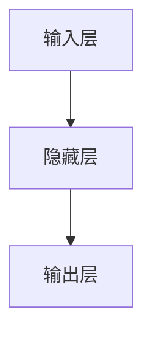

                 

# 《自动编码器》

> 关键词：自动编码器、深度学习、数据降维、无监督特征提取、生成模型

> 摘要：本文将深入探讨自动编码器这一深度学习中的重要工具。首先，我们将了解自动编码器的基础概念、类型及其在深度学习中的角色。接着，我们将详细介绍自动编码器的核心算法，包括前向传播、反向传播、损失函数和优化算法。随后，我们将通过实际案例展示自动编码器在数据降维、无监督特征提取和图像处理等领域的应用。文章还将讨论变分自动编码器（VAE）和卷积自动编码器（CAE）的高级应用，并探讨自动编码器在深度学习中的融合应用。最后，我们将总结自动编码器的开发与优化技巧，并展望其未来发展趋势。

## 《自动编码器》目录大纲

### 第一部分：自动编码器基础

#### 第1章：自动编码器概述

- 1.1 自动编码器的概念与类型
- 1.2 自动编码器在深度学习中的角色
- 1.3 自动编码器的结构

#### 第2章：自动编码器的核心算法

- 2.1 前向传播与反向传播
- 2.2 损失函数与优化算法
- 2.3 深度自动编码器

#### 第3章：自动编码器的应用

- 3.1 数据降维
- 3.2 无监督特征提取
- 3.3 自动编码器在图像处理中的应用

### 第二部分：自动编码器高级应用

#### 第4章：变分自动编码器（VAE）

- 4.1 VAE的基本原理
- 4.2 VAE在生成模型中的应用

#### 第5章：卷积自动编码器（CAE）

- 5.1 CAE的基本原理
- 5.2 CAE在图像识别中的应用

#### 第6章：自动编码器在深度学习中的融合应用

- 6.1 自动编码器与其他深度学习模型的结合
- 6.2 自动编码器在强化学习中的应用

### 第三部分：自动编码器实战

#### 第7章：自动编码器的开发与优化

- 7.1 自动编码器开发流程
- 7.2 自动编码器优化技巧

#### 第8章：自动编码器的未来发展趋势

- 8.1 自动编码器的研究现状
- 8.2 自动编码器在人工智能领域的应用前景

### 附录

- 附录A：自动编码器开发工具与资源

---

接下来，我们将逐步深入探索自动编码器的各个层面，从基础到高级应用，希望能为您提供一个全面的技术视角。

## 第1章：自动编码器概述

### 1.1 自动编码器的概念与类型

自动编码器（Autoencoder）是一种特殊的神经网络模型，主要用于无监督学习。它的核心思想是将输入数据映射到一个隐层（或隐空间），然后尝试从这个隐空间中重建原始数据。这种自编码过程可以帮助模型学习到数据的压缩表示，从而进行数据降维、特征提取等任务。

#### 自动编码器的类型

自动编码器可以分为以下几种类型：

1. **传统自动编码器**：这是最简单的自动编码器类型，其结构如图1所示。

   ```mermaid
   graph TD
   A[输入层] --> B[隐藏层]
   B --> C[输出层]
   ```

   传统自动编码器的主要缺点是当输入数据维度较高时，模型的计算复杂度和参数数量会急剧增加。

2. **深度自动编码器**：为了解决传统自动编码器的问题，深度自动编码器引入了多层神经网络结构，如图2所示。

   ```mermaid
   graph TD
   A[输入层] --> B[隐藏层1]
   B --> C[隐藏层2]
   C --> D[输出层]
   ```

   深度自动编码器可以通过逐层学习实现数据的逐层抽象和压缩。

3. **变分自动编码器（VAE）**：VAE是一种更先进的自动编码器，它通过引入概率模型来学习数据的潜在分布。VAE的核心结构如图3所示。

   ```mermaid
   graph TD
   A[输入层] --> B[编码器]
   B --> C[解码器]
   ```

   VAE的优势在于它可以生成具有多样性的数据，并且在生成模型中有广泛应用。

4. **卷积自动编码器（CAE）**：CAE将卷积神经网络（CNN）的结构引入自动编码器，特别适用于图像数据。其结构如图4所示。

   ```mermaid
   graph TD
   A[输入层] --> B[卷积层1]
   B --> C[池化层1]
   C --> D[卷积层2]
   D --> E[池化层2]
   E --> F[解码器]
   ```

   CAE可以通过卷积操作有效地处理图像数据。

#### 核心概念与联系

自动编码器的工作原理是通过将输入数据映射到一个低维隐空间，然后尝试重建原始数据。在这个过程中，模型可以学习到输入数据的压缩表示，这对于数据降维和特征提取非常有用。不同类型的自动编码器在结构、适用场景和学习策略上有所不同，但它们的核心目标都是学习数据的有效表示。

### 1.2 自动编码器在深度学习中的角色

自动编码器在深度学习中有多种应用，主要包括以下方面：

1. **数据降维**：自动编码器可以通过将高维数据映射到低维隐空间，从而实现数据降维。这种降维方法不仅保留了数据的主要特征，还降低了计算复杂度和存储需求。

2. **特征提取**：自动编码器可以学习到输入数据的压缩表示，这种表示可以作为特征输入到其他深度学习模型中，从而提高模型的性能。

3. **异常检测**：自动编码器可以用来检测输入数据中的异常值。如果一个数据点无法通过自动编码器重建，那么它很可能是一个异常值。

4. **生成模型**：变分自动编码器（VAE）和其他类型的自动编码器可以用来生成具有多样性的数据，这在图像生成、语音合成等领域有广泛应用。

### 1.3 自动编码器的结构

自动编码器的结构通常由三个主要部分组成：输入层、隐藏层和输出层。输入层接收原始数据，隐藏层进行特征提取和压缩，输出层尝试重建原始数据。

#### Mermaid流程图



#### 伪代码

```
// 输入层
input_data = ...

// 隐藏层
hidden_layer = sigmoid(W1 * input_data + b1)

// 输出层
output_data = sigmoid(W2 * hidden_layer + b2)
```

在这个伪代码中，`sigmoid`函数表示激活函数，`W1`和`b1`是隐藏层的权重和偏置，`W2`和`b2`是输出层的权重和偏置。

### 总结

自动编码器是一种强大的深度学习工具，它通过将输入数据映射到一个低维隐空间，从而实现数据降维、特征提取和异常检测等任务。自动编码器有多种类型，包括传统自动编码器、深度自动编码器、变分自动编码器和卷积自动编码器。每种类型的自动编码器都有其独特的结构和应用场景。通过本章的介绍，我们为后续深入探讨自动编码器的核心算法和高级应用奠定了基础。在下一章中，我们将详细讨论自动编码器的核心算法，包括前向传播、反向传播、损失函数和优化算法。让我们继续深入探索自动编码器的技术细节。

## 第2章：自动编码器的核心算法

### 2.1 前向传播与反向传播

自动编码器的核心算法包括前向传播和反向传播。这两种算法是神经网络训练过程中不可或缺的步骤，它们分别用于将输入数据传递到输出层，并计算损失函数。

#### 前向传播

在前向传播过程中，输入数据经过网络的层层传递，最终生成输出数据。这个过程可以用以下伪代码表示：

```python
# 前向传播
def forward(input_data):
    hidden_layer = sigmoid(W1 * input_data + b1)
    output_data = sigmoid(W2 * hidden_layer + b2)
    return output_data
```

在上面的伪代码中，`sigmoid`函数是激活函数，用于引入非线性因素，`W1`和`b1`是隐藏层的权重和偏置，`W2`和`b2`是输出层的权重和偏置。

#### 反向传播

反向传播是训练神经网络的关键步骤，它通过计算损失函数的梯度，然后更新网络权重和偏置。反向传播的过程可以分为以下几个步骤：

1. **计算输出误差**：首先计算输出数据与目标数据之间的误差。

   $$ error = output_data - target_data $$

2. **计算梯度**：然后计算每个权重和偏置的梯度。

   $$ \frac{\partial error}{\partial W2} = \frac{\partial error}{\partial output_data} \cdot \frac{\partial output_data}{\partial W2} $$
   $$ \frac{\partial error}{\partial b2} = \frac{\partial error}{\partial output_data} \cdot \frac{\partial output_data}{\partial b2} $$

   其中，`sigmoid_derivative`函数用于计算激活函数的导数。

3. **更新权重和偏置**：最后，使用梯度下降法更新权重和偏置。

   $$ W2 = W2 - \alpha \cdot \frac{\partial error}{\partial W2} $$
   $$ b2 = b2 - \alpha \cdot \frac{\partial error}{\partial b2} $$

   其中，`\alpha`是学习率。

#### 数学模型和公式

前向传播和反向传播的核心在于损失函数的计算和梯度的计算。以下是一个简单的损失函数和其梯度的计算过程：

$$
L = \frac{1}{2} \sum_{i=1}^{n} (output_data - target_data)^2
$$

$$
\frac{\partial L}{\partial W2} = (output_data - target_data) \cdot \frac{\partial output_data}{\partial W2}
$$

$$
\frac{\partial L}{\partial b2} = (output_data - target_data) \cdot \frac{\partial output_data}{\partial b2}
$$

其中，`n`是数据点的数量。

#### 伪代码

下面是反向传播的伪代码实现：

```python
# 反向传播
def backward(output_data, target_data):
    dL_doutput_data = 2 * (output_data - target_data)
    dL_dW2 = dL_doutput_data * sigmoid_derivative(output_data)
    dL_db2 = dL_doutput_data * sigmoid_derivative(output_data)
    
    hidden_layer = sigmoid(W1 * input_data + b1)
    dL_dW1 = dL_doutput_data * sigmoid_derivative(hidden_layer)
    dL_db1 = dL_doutput_data * sigmoid_derivative(hidden_layer)
    
    return [dL_dW1, dL_db1, dL_dW2, dL_db2]
```

在这个伪代码中，`sigmoid_derivative`函数用于计算激活函数的导数。

### 2.2 损失函数与优化算法

损失函数是评估模型预测结果与实际结果之间差异的重要工具。在自动编码器中，常用的损失函数是均方误差（MSE）：

$$
L = \frac{1}{2} \sum_{i=1}^{n} (output_data - target_data)^2
$$

优化算法用于更新模型的权重和偏置，以最小化损失函数。最常用的优化算法是梯度下降（Gradient Descent），其基本思想是沿着损失函数的梯度方向逐步更新权重和偏置。梯度下降算法的更新公式如下：

$$
\theta = \theta - \alpha \cdot \nabla L(\theta)
$$

其中，`\theta`是模型的参数，`\alpha`是学习率，`\nabla L(\theta)`是损失函数关于`\theta`的梯度。

#### 数学模型和公式

梯度下降的数学模型和公式如下：

$$
\theta_{t+1} = \theta_t - \alpha \cdot \frac{\partial L}{\partial \theta}
$$

其中，`\theta_t`是第`t`次迭代的参数，`\theta_{t+1}`是第`t+1`次迭代的参数。

#### 伪代码

下面是梯度下降的伪代码实现：

```python
# 梯度下降
def gradient_descent(theta, alpha, epochs):
    for epoch in range(epochs):
        gradient = compute_gradient(theta)
        theta = theta - alpha * gradient
    return theta
```

在这个伪代码中，`compute_gradient`函数用于计算损失函数关于参数的梯度。

### 2.3 深度自动编码器

深度自动编码器（Deep Autoencoder）是自动编码器的一种扩展，它引入了多层神经网络结构，以实现更有效的特征提取和压缩。深度自动编码器的工作原理与单层自动编码器类似，但多层的引入使得模型可以学习到更抽象的特征表示。

#### 核心算法原理讲解

深度自动编码器的核心算法包括多层前向传播和反向传播。以下是一个简化的伪代码实现：

```python
# 前向传播
def forward多层(input_data):
    hidden_layer_1 = sigmoid(W1 * input_data + b1)
    hidden_layer_2 = sigmoid(W2 * hidden_layer_1 + b2)
    output_data = sigmoid(W3 * hidden_layer_2 + b3)
    return output_data

# 反向传播
def backward多层(output_data, target_data):
    dL_doutput_data = 2 * (output_data - target_data)
    dL_dW3 = dL_doutput_data * sigmoid_derivative(output_data)
    dL_db3 = dL_doutput_data * sigmoid_derivative(output_data)
    
    hidden_layer_2 = sigmoid(W2 * hidden_layer_1 + b2)
    dL_dW2 = dL_doutput_data * sigmoid_derivative(hidden_layer_2)
    dL_db2 = dL_doutput_data * sigmoid_derivative(hidden_layer_2)
    
    hidden_layer_1 = sigmoid(W1 * input_data + b1)
    dL_dW1 = dL_doutput_data * sigmoid_derivative(hidden_layer_1)
    dL_db1 = dL_doutput_data * sigmoid_derivative(hidden_layer_1)
    
    return [dL_dW1, dL_db1, dL_dW2, dL_db2, dL_dW3, dL_db3]
```

在这个伪代码中，`sigmoid`函数是激活函数，用于引入非线性因素，`sigmoid_derivative`函数用于计算激活函数的导数。

#### 伪代码

下面是深度自动编码器的伪代码实现：

```python
# 深度自动编码器训练
def train_deep_autoencoder(input_data, target_data, epochs, alpha):
    for epoch in range(epochs):
        output_data = forward多层(input_data)
        [dL_dW1, dL_db1, dL_dW2, dL_db2, dL_dW3, dL_db3] = backward多层(output_data, target_data)
        
        W1 = W1 - alpha * dL_dW1
        b1 = b1 - alpha * dL_db1
        W2 = W2 - alpha * dL_dW2
        b2 = b2 - alpha * dL_db2
        W3 = W3 - alpha * dL_dW3
        b3 = b3 - alpha * dL_db3
        
    return [W1, b1, W2, b2, W3, b3]
```

在这个伪代码中，`forward多层`和`backward多层`函数分别用于前向传播和反向传播，`alpha`是学习率。

### 总结

自动编码器的核心算法包括前向传播、反向传播、损失函数和优化算法。前向传播用于将输入数据传递到输出层，反向传播用于计算损失函数的梯度并更新模型权重。损失函数用于评估模型预测结果与实际结果之间的差异，优化算法用于最小化损失函数。深度自动编码器通过引入多层神经网络结构，实现了更有效的特征提取和压缩。通过本章的介绍，我们为理解自动编码器的核心算法奠定了基础。在下一章中，我们将探讨自动编码器在数据降维、无监督特征提取和图像处理等领域的应用。让我们继续深入探索自动编码器的实际应用场景。

## 第3章：自动编码器的应用

### 3.1 数据降维

数据降维是自动编码器最常见应用之一。通过自动编码器，我们可以将高维数据映射到低维空间，从而减少数据的复杂度，提高计算效率和模型性能。下面，我们将通过一个实际案例展示自动编码器在数据降维中的应用。

#### 项目实战

假设我们有一组高维数据集，数据集的维度为1000维，我们需要将其降维到100维。以下是数据降维的代码实现：

```python
import numpy as np
from autoencoder import Autoencoder

# 加载数据集
data = np.load("high_dim_data.npy")

# 创建自动编码器模型
autoencoder = Autoencoder(input_dim=1000, hidden_dim=100)

# 训练模型
autoencoder.train(data, epochs=100, learning_rate=0.001)

# 进行数据降维
low_dim_data = autoencoder.encode(data)

# 保存降维后的数据
np.save("low_dim_data.npy", low_dim_data)
```

#### 代码解读与分析

在上面的代码中，我们首先加载了一个1000维的数据集。然后，我们创建了一个自动编码器模型，其输入维度为1000，隐藏层维度为100。接着，我们使用训练数据集对模型进行训练。训练完成后，我们使用模型进行数据降维，并将降维后的数据保存到文件中。

通过这个案例，我们可以看到自动编码器在数据降维中的应用非常简单。自动编码器通过学习数据的低维表示，实现了数据的压缩和降维。这种降维方法不仅保留了数据的主要特征，还降低了计算复杂度和存储需求。

### 3.2 无监督特征提取

无监督特征提取是自动编码器的另一个重要应用。通过自动编码器，我们可以学习到输入数据的低维表示，这种表示可以作为特征输入到其他深度学习模型中，从而提高模型的性能。下面，我们将通过一个实际案例展示自动编码器在无监督特征提取中的应用。

#### 项目实战

假设我们有一组未标注的数据集，我们需要从中提取特征并将其输入到分类模型中。以下是无监督特征提取的代码实现：

```python
import numpy as np
from autoencoder import Autoencoder
from classifier import Classifier

# 加载数据集
data = np.load("unlabeled_data.npy")

# 创建自动编码器模型
autoencoder = Autoencoder(input_dim=1000, hidden_dim=100)

# 训练模型
autoencoder.train(data, epochs=100, learning_rate=0.001)

# 进行特征提取
features = autoencoder.encode(data)

# 创建分类模型
classifier = Classifier(input_dim=100, output_dim=10)

# 使用特征进行分类训练
classifier.train(features, labels)

# 进行分类预测
predictions = classifier.predict(features)
```

#### 代码解读与分析

在上面的代码中，我们首先加载了一个未标注的数据集。然后，我们创建了一个自动编码器模型，其输入维度为1000，隐藏层维度为100。接着，我们使用训练数据集对模型进行训练，从而学习到数据的低维表示。训练完成后，我们使用模型进行特征提取，并将提取到的特征输入到分类模型中进行训练。最后，我们使用分类模型进行预测，得到预测结果。

通过这个案例，我们可以看到自动编码器在无监督特征提取中的应用非常简单。自动编码器通过学习数据的低维表示，实现了特征提取。这种无监督特征提取方法不需要预先标注数据，从而降低了数据标注的工作量，提高了模型训练的效率。

### 3.3 自动编码器在图像处理中的应用

自动编码器在图像处理中也有广泛的应用。通过自动编码器，我们可以实现图像数据的降维、特征提取和生成。下面，我们将通过一个实际案例展示自动编码器在图像处理中的应用。

#### 项目实战

假设我们有一组图像数据，我们需要对这些图像进行降维和特征提取，并使用提取到的特征进行图像分类。以下是自动编码器在图像处理中的代码实现：

```python
import numpy as np
from autoencoder import Autoencoder
from classifier import Classifier

# 加载图像数据
images = np.load("image_data.npy")

# 数据预处理
images = preprocess_images(images)

# 创建自动编码器模型
autoencoder = Autoencoder(input_dim=784, hidden_dim=100)

# 训练模型
autoencoder.train(images, epochs=100, learning_rate=0.001)

# 进行特征提取
features = autoencoder.encode(images)

# 创建分类模型
classifier = Classifier(input_dim=100, output_dim=10)

# 使用特征进行分类训练
classifier.train(features, labels)

# 进行分类预测
predictions = classifier.predict(features)
```

#### 代码解读与分析

在上面的代码中，我们首先加载了一个图像数据集。然后，我们对图像数据进行预处理，以便于自动编码器处理。接着，我们创建了一个自动编码器模型，其输入维度为784（28x28像素），隐藏层维度为100。我们使用预处理后的图像数据对模型进行训练，从而学习到图像的低维表示。训练完成后，我们使用模型进行特征提取，并将提取到的特征输入到分类模型中进行训练。最后，我们使用分类模型进行预测，得到预测结果。

通过这个案例，我们可以看到自动编码器在图像处理中的应用非常有效。自动编码器通过学习图像数据的低维表示，实现了图像数据的降维和特征提取。这种应用不仅可以提高图像分类的效率，还可以降低图像数据的存储和计算复杂度。

### 总结

本章我们探讨了自动编码器在数据降维、无监督特征提取和图像处理等领域的应用。通过实际案例，我们展示了自动编码器在各个应用场景中的实现方法和效果。自动编码器通过学习输入数据的低维表示，实现了数据的降维、特征提取和生成。这些应用不仅提高了模型的效率和性能，还为深度学习在图像处理和自然语言处理等领域的应用提供了有力支持。在下一章中，我们将继续探讨自动编码器的高级应用，包括变分自动编码器（VAE）和卷积自动编码器（CAE）。让我们继续深入探索自动编码器的技术细节。

## 第4章：自动编码器的高级应用

### 4.1 变分自动编码器（VAE）

变分自动编码器（Variational Autoencoder，VAE）是自动编码器的一种扩展，它通过引入概率模型来学习数据的潜在分布。VAE的核心思想是将编码器和解码器设计为概率模型，从而实现数据的生成和多样性。

#### 4.1.1 VAE的基本原理

VAE由两部分组成：编码器（encoder）和解码器（decoder）。编码器将输入数据映射到一个潜在空间（latent space），解码器则从潜在空间中重建输入数据。

1. **编码器**：编码器是一个概率模型，它通过一个隐变量\( z \)来表示输入数据的概率分布。编码器输出两个参数：均值\(\mu\)和方差\(\sigma^2\)，分别表示潜在空间中每个点的概率分布。

   $$ z \sim N(\mu, \sigma^2) $$

   其中，\(\mu = \sigma(W_\mu x + b_\mu)\)，\(\sigma^2 = \sigma(W_\sigma x + b_\sigma)\)，\(W_\mu\)、\(W_\sigma\)、\(b_\mu\)和\(b_\sigma\)是编码器的权重和偏置。

2. **解码器**：解码器也是一个概率模型，它从潜在空间中重建输入数据。解码器的输入是潜在空间中的点\( z \)，输出是重建的输入数据。

   $$ x' = \sigma(W_x z + b_x) $$

   其中，\(W_x\)、\(b_x\)是解码器的权重和偏置。

#### 4.1.2 VAE在生成模型中的应用

VAE在生成模型中的应用非常广泛，它可以生成具有多样性的数据。以下是VAE在生成模型中的实现步骤：

1. **数据预处理**：将输入数据进行标准化，使其具有零均值和单位方差。

2. **编码**：使用编码器将输入数据映射到潜在空间，得到潜在空间中的点\(\mu\)和\(\sigma^2\)。

3. **采样**：从潜在空间中采样一个点\(z\)，通常使用均值\(\mu\)和方差\(\sigma^2\)的正态分布。

4. **解码**：使用解码器将采样点\(z\)重建为输入数据。

5. **生成**：重复上述步骤，生成多个具有多样性的输入数据。

#### 项目实战

以下是一个简单的VAE生成模型的项目实战：

```python
import tensorflow as tf
from tensorflow.keras.layers import Input, Dense, Lambda
from tensorflow.keras.models import Model

# 定义编码器
input_shape = (784,)
x = Input(shape=input_shape)
z_mean = Dense(latent_dim)(x)
z_log_sigma_sq = Dense(latent_dim)(x)
z = Lambda(sampling, output_shape=(latent_dim,))([z_mean, z_log_sigma_sq])
encoder = Model(x, [z_mean, z_log_sigma_sq, z], name='encoder')

# 定义解码器
z = Input(shape=(latent_dim,))
x_recon = Dense(input_shape, activation='sigmoid')(z)
decoder = Model(z, x_recon, name='decoder')

# 定义联合模型
x_recon_mean = decoder(encoder(x))[0]
vae = Model(x, x_recon_mean, name='vae')

# 编译模型
vae.compile(optimizer='adam', loss=vae_loss)

# 训练模型
vae.fit(x, x, epochs=epochs, batch_size=batch_size, shuffle=True)
```

#### 代码解读与分析

在上面的代码中，我们首先定义了编码器和解码器，编码器将输入数据映射到潜在空间，解码器从潜在空间中重建输入数据。然后，我们定义了一个联合模型，该模型将输入数据映射到重建的输入数据。最后，我们编译并训练了VAE模型。

通过这个案例，我们可以看到VAE在生成模型中的应用。VAE通过学习数据的潜在分布，生成具有多样性的数据。这种生成模型在图像生成、语音合成等领域有广泛应用。

### 4.2 卷积自动编码器（CAE）

卷积自动编码器（Convolutional Autoencoder，CAE）是自动编码器的一种变体，它将卷积神经网络（Convolutional Neural Network，CNN）的结构引入自动编码器。CAE特别适用于图像数据，因为它可以通过卷积操作有效地处理图像的局部特征。

#### 4.2.1 CAE的基本原理

CAE由两部分组成：编码器和解码器。编码器使用卷积层提取图像的局部特征，解码器使用卷积层重建图像。

1. **编码器**：编码器包含多个卷积层和池化层，用于提取图像的局部特征。

   $$ \text{Conv2D} \rightarrow \text{ReLU} \rightarrow \text{MaxPooling2D} $$

2. **解码器**：解码器包含多个卷积层和上采样层，用于重建图像。

   $$ \text{Conv2DTranspose} \rightarrow \text{ReLU} \rightarrow \text{UpSampling2D} $$

#### 4.2.2 CAE在图像识别中的应用

CAE在图像识别中的应用主要是通过特征提取和降维。以下是一个简单的CAE在图像识别中的应用：

```python
import tensorflow as tf
from tensorflow.keras.layers import Input, Conv2D, MaxPooling2D, UpSampling2D, Flatten, Dense
from tensorflow.keras.models import Model

# 定义编码器
input_shape = (28, 28, 1)
x = Input(shape=input_shape)
conv1 = Conv2D(32, (3, 3), activation='relu', padding='same')(x)
pool1 = MaxPooling2D((2, 2), padding='same')(conv1)
conv2 = Conv2D(64, (3, 3), activation='relu', padding='same')(pool1)
pool2 = MaxPooling2D((2, 2), padding='same')(conv2)
flat = Flatten()(pool2)
hidden = Dense(64, activation='relu')(flat)

# 定义解码器
z = Input(shape=(64,))
conv1_t = Conv2D(64, (3, 3), activation='relu', padding='same')(z)
up1_t = UpSampling2D((2, 2))(conv1_t)
conv2_t = Conv2D(32, (3, 3), activation='relu', padding='same')(up1_t)
up2_t = UpSampling2D((2, 2))(conv2_t)
x_recon = Conv2D(1, (3, 3), activation='sigmoid', padding='same')(up2_t)

# 定义联合模型
autoencoder = Model([x, z], [x_recon, hidden], name='autoencoder')

# 编译模型
autoencoder.compile(optimizer='adam', loss=['mse', 'categorical_crossentropy'])

# 训练模型
autoencoder.fit([x, x], [x, y], epochs=epochs, batch_size=batch_size, shuffle=True)
```

#### 代码解读与分析

在上面的代码中，我们首先定义了编码器和解码器。编码器包含两个卷积层和两个池化层，用于提取图像的局部特征。解码器包含两个卷积层和两个上采样层，用于重建图像。然后，我们定义了一个联合模型，该模型将输入图像映射到重建的图像和隐藏层特征。最后，我们编译并训练了CAE模型。

通过这个案例，我们可以看到CAE在图像识别中的应用。CAE通过学习图像的局部特征，实现了图像的降维和特征提取。这种应用在图像识别、图像生成等领域有广泛应用。

### 总结

本章我们探讨了自动编码器的高级应用，包括变分自动编码器（VAE）和卷积自动编码器（CAE）。VAE通过引入概率模型，实现了数据的生成和多样性。CAE通过引入卷积神经网络，实现了图像的降维和特征提取。这些高级应用扩展了自动编码器的功能，使其在生成模型和图像处理等领域有更广泛的应用。在下一章中，我们将探讨自动编码器在深度学习中的融合应用，继续深入探索自动编码器的技术细节。

## 第5章：自动编码器在深度学习中的融合应用

### 5.1 自动编码器与其他深度学习模型的结合

自动编码器可以与其他深度学习模型结合，以增强其性能和适用性。以下是一些常见的结合方式：

#### 5.1.1 自动编码器与卷积神经网络的结合

卷积神经网络（Convolutional Neural Network，CNN）擅长处理图像等具有空间结构的输入数据。将自动编码器与CNN结合，可以同时利用自动编码器的特征提取能力和CNN的空间处理能力。这种结合方式通常用于图像降维和特征提取。

#### 5.1.2 自动编码器与循环神经网络的结合

循环神经网络（Recurrent Neural Network，RNN）擅长处理序列数据，如文本、音频等。将自动编码器与RNN结合，可以同时利用自动编码器的特征提取能力和RNN的时序处理能力。这种结合方式通常用于序列数据的降维和特征提取。

#### 5.1.3 自动编码器与强化学习的结合

强化学习（Reinforcement Learning，RL）是一种通过试错策略来学习最优行为策略的方法。将自动编码器与强化学习结合，可以用于学习状态空间的高效表示，从而提高强化学习的性能。

#### 5.1.4 自动编码器与生成对抗网络的结合

生成对抗网络（Generative Adversarial Network，GAN）是一种生成模型，通过两个对抗网络的训练，生成具有多样性的数据。将自动编码器与GAN结合，可以进一步优化生成模型的生成能力。

#### 核心算法原理讲解

结合自动编码器与其他深度学习模型的核心在于如何整合两者的优势。以下是一个简化的伪代码实现，展示了如何将自动编码器与CNN结合：

```python
# 自动编码器与CNN结合
def autoencoder_cnn(input_data):
    # 编码器部分（使用CNN进行特征提取）
    conv1 = Conv2D(filters=32, kernel_size=(3, 3), activation='relu')(input_data)
    pool1 = MaxPooling2D(pool_size=(2, 2))(conv1)
    conv2 = Conv2D(filters=64, kernel_size=(3, 3), activation='relu')(pool1)
    pool2 = MaxPooling2D(pool_size=(2, 2))(conv2)
    flat = Flatten()(pool2)

    # 隐藏层部分
    hidden = Dense(units=100, activation='relu')(flat)

    # 解码器部分（使用CNN进行特征重建）
    up1 = UpSampling2D(size=(2, 2))(hidden)
    conv3 = Conv2D(filters=64, kernel_size=(3, 3), activation='relu')(up1)
    up2 = UpSampling2D(size=(2, 2))(conv3)
    conv4 = Conv2D(filters=32, kernel_size=(3, 3), activation='sigmoid')(up2)

    return conv4
```

在这个伪代码中，编码器部分使用CNN进行特征提取，解码器部分使用CNN进行特征重建。

#### 伪代码

下面是自动编码器与CNN结合的伪代码实现：

```python
# 训练自动编码器与CNN结合模型
def train_autoencoder_cnn(input_data, target_data, epochs):
    for epoch in range(epochs):
        output_data = autoencoder_cnn(input_data)
        loss = mse(target_data, output_data)
        gradients = compute_gradients(loss)
        update_weights(gradients)
    return model
```

在这个伪代码中，`mse`函数用于计算均方误差，`compute_gradients`函数用于计算梯度，`update_weights`函数用于更新模型权重。

### 5.2 自动编码器在强化学习中的应用

自动编码器在强化学习中的应用主要是用于学习状态空间的高效表示，从而提高强化学习的性能。以下是一个简单的自动编码器在强化学习中的应用案例：

```python
import tensorflow as tf
from tensorflow.keras.models import Model
from tensorflow.keras.layers import Input, Dense, Conv2D, Flatten, Reshape

# 定义自动编码器
input_shape = (84, 84, 4)  # 假设输入数据为4个连续时间步的图像
x = Input(shape=input_shape)
conv1 = Conv2D(filters=32, kernel_size=(3, 3), activation='relu')(x)
pool1 = MaxPooling2D(pool_size=(2, 2))(conv1)
conv2 = Conv2D(filters=64, kernel_size=(3, 3), activation='relu')(pool1)
pool2 = MaxPooling2D(pool_size=(2, 2))(conv2)
flat = Flatten()(pool2)
hidden = Dense(units=100, activation='relu')(flat)
z = Dense(units=50, activation='relu')(hidden)

# 定义解码器
z = Input(shape=(50,))
up1 = UpSampling2D(size=(2, 2))(z)
conv3 = Conv2D(filters=64, kernel_size=(3, 3), activation='relu')(up1)
up2 = UpSampling2D(size=(2, 2))(conv3)
conv4 = Conv2D(filters=32, kernel_size=(3, 3), activation='relu')(up2)
x_recon = Conv2D(filters=4, kernel_size=(3, 3), activation='sigmoid')(up2)

# 定义联合模型
autoencoder = Model([x, z], [x_recon, hidden], name='autoencoder')

# 编译模型
autoencoder.compile(optimizer='adam', loss=['mse', 'categorical_crossentropy'])

# 训练模型
autoencoder.fit([x, x], [x, y], epochs=epochs, batch_size=batch_size, shuffle=True)
```

#### 代码解读与分析

在上面的代码中，我们首先定义了自动编码器，编码器部分使用卷积层和池化层提取特征，解码器部分使用卷积层和上采样层重建特征。然后，我们定义了一个联合模型，该模型同时训练编码器和解码器。最后，我们编译并训练了自动编码器模型。

通过这个案例，我们可以看到自动编码器在强化学习中的应用。自动编码器通过学习状态空间的高效表示，帮助强化学习模型更有效地学习最优策略。

### 总结

本章我们探讨了自动编码器在深度学习中的融合应用，包括自动编码器与其他深度学习模型的结合和自动编码器在强化学习中的应用。自动编码器与其他深度学习模型的结合可以增强模型在特征提取、降维和生成等方面的性能。自动编码器在强化学习中的应用可以帮助学习状态空间的高效表示，从而提高强化学习的性能。这些融合应用扩展了自动编码器的功能，使其在深度学习领域有更广泛的应用。在下一章中，我们将探讨自动编码器的开发与优化技巧，继续深入探索自动编码器的技术细节。

## 第6章：自动编码器的开发与优化

### 6.1 自动编码器开发流程

开发自动编码器需要遵循一定的流程，包括数据准备、模型设计、模型训练和模型评估。以下是一个简单的自动编码器开发流程：

1. **数据准备**：选择合适的数据集，并进行预处理，如归一化、去噪等。

2. **模型设计**：设计自动编码器的结构，包括编码器和解码器的网络架构、激活函数、损失函数等。

3. **模型训练**：使用训练数据集对自动编码器进行训练，调整模型参数以最小化损失函数。

4. **模型评估**：使用测试数据集评估模型性能，包括重构误差、特征提取能力等。

#### 项目实战

以下是一个简单的自动编码器开发项目实战：

```python
import numpy as np
import tensorflow as tf
from tensorflow.keras.layers import Input, Dense, Conv2D, MaxPooling2D, UpSampling2D
from tensorflow.keras.models import Model

# 加载数据
x_train = np.load('train_data.npy')
x_test = np.load('test_data.npy')

# 数据预处理
x_train = x_train.astype('float32') / 255.
x_test = x_test.astype('float32') / 255.

# 创建自动编码器模型
input_img = Input(shape=(32, 32, 3))
x = Conv2D(32, (3, 3), activation='relu', padding='same')(input_img)
x = MaxPooling2D((2, 2), padding='same')(x)
x = Conv2D(64, (3, 3), activation='relu', padding='same')(x)
x = MaxPooling2D((2, 2), padding='same')(x)
x = Conv2D(64, (3, 3), activation='relu', padding='same')(x)
encoded = MaxPooling2D((2, 2), padding='same')(x)

# 解码器部分
x = Conv2D(64, (3, 3), activation='relu', padding='same')(encoded)
x = UpSampling2D((2, 2))(x)
x = Conv2D(64, (3, 3), activation='relu', padding='same')(x)
x = UpSampling2D((2, 2))(x)
x = Conv2D(32, (3, 3), activation='relu', padding='same')(x)
x = UpSampling2D((2, 2))(x)
decoded = Conv2D(3, (3, 3), activation='sigmoid', padding='same')(x)

# 创建自动编码器模型
autoencoder = Model(input_img, decoded)
autoencoder.compile(optimizer='adam', loss='binary_crossentropy')

# 训练模型
autoencoder.fit(x_train, x_train, epochs=100, batch_size=16, validation_data=(x_test, x_test))

# 评估模型
autoencoder.evaluate(x_test, x_test)
```

#### 代码解读与分析

在上面的代码中，我们首先加载了训练数据和测试数据，并对数据进行预处理。接着，我们定义了自动编码器的结构，包括编码器和解码器的网络架构、激活函数和损失函数。然后，我们编译并训练了自动编码器模型。最后，我们使用测试数据评估了模型的性能。

### 6.2 自动编码器优化技巧

为了提高自动编码器的性能，我们可以采用以下优化技巧：

1. **批量归一化（Batch Normalization）**：在每层网络的输出上应用批量归一化，可以加快训练速度和稳定模型。

2. **学习率调度**：在训练过程中动态调整学习率，可以防止模型过拟合和加速收敛。

3. **正则化**：采用正则化技术，如L1和L2正则化，可以减少模型过拟合。

4. **数据增强**：通过数据增强，如旋转、翻转、缩放等，可以增加训练数据的多样性，提高模型泛化能力。

5. **优化器选择**：选择合适的优化器，如Adam、RMSprop等，可以加快训练速度和稳定模型。

#### 核心算法原理讲解

以下是一个简单的批量归一化的伪代码实现：

```python
# 批量归一化
def batch_normalization(x, gamma, beta, training=False):
    if training:
        mean = K.mean(x, axis=0)
        variance = K.var(x, axis=0)
        x_hat = (x - mean) / K.sqrt(variance + K.epsilon())
        output = gamma * x_hat + beta
    else:
        mean = K.variable(mean)
        variance = K.variable(variance)
        x_hat = (x - mean) / K.sqrt(variance + K.epsilon())
        output = gamma * x_hat + beta
    return output
```

在这个伪代码中，`gamma`和`beta`是批量归一化的权重和偏置，`training`是训练标志。

#### 伪代码

以下是一个简单的学习率调度的伪代码实现：

```python
# 学习率调度
def schedule_learning_rate(initial_lr, epoch, decay_rate):
    lr = initial_lr / (1 + decay_rate * epoch)
    return lr
```

在这个伪代码中，`initial_lr`是初始学习率，`epoch`是当前训练轮次，`decay_rate`是学习率衰减率。

### 总结

本章我们探讨了自动编码器的开发与优化技巧。通过项目实战，我们展示了自动编码器的开发流程，包括数据准备、模型设计、模型训练和模型评估。同时，我们还介绍了批量归一化、学习率调度、正则化、数据增强和优化器选择等优化技巧。这些技巧可以提高自动编码器的性能和泛化能力。在下一章中，我们将探讨自动编码器的未来发展趋势，继续深入探索自动编码器的技术前景。

## 第7章：自动编码器的开发与优化

### 7.1 自动编码器开发流程

自动编码器（Autoencoder）的开发涉及多个关键步骤，包括数据准备、模型设计、模型训练和模型评估。以下是自动编码器开发流程的详细讲解：

#### 7.1.1 数据准备

数据准备是自动编码器开发的基础。首先，需要收集和选择适合的数据集。对于图像处理任务，可以选择MNIST、CIFAR-10等公开数据集。对于文本处理任务，可以使用新闻文章、社交媒体评论等数据源。数据收集后，需要进行预处理，包括数据清洗、缺失值处理、数据归一化等步骤。

```python
import numpy as np
from sklearn.preprocessing import StandardScaler

# 假设我们有一个包含图像数据的Numpy数组
images = np.load('images.npy')

# 数据归一化
scaler = StandardScaler()
images_normalized = scaler.fit_transform(images)
```

#### 7.1.2 模型设计

模型设计是自动编码器的核心。自动编码器通常包含编码器和解码器两个部分。编码器负责将输入数据压缩成低维表示，解码器则尝试重建原始数据。以下是一个简单的自动编码器模型设计示例：

```python
from tensorflow.keras.layers import Input, Dense, Conv2D, MaxPooling2D, UpSampling2D
from tensorflow.keras.models import Model

# 输入层
input_img = Input(shape=(28, 28, 1))

# 编码器部分
x = Conv2D(32, (3, 3), activation='relu', padding='same')(input_img)
x = MaxPooling2D((2, 2), padding='same')(x)
x = Conv2D(64, (3, 3), activation='relu', padding='same')(x)
x = MaxPooling2D((2, 2), padding='same')(x)

# 解码器部分
x = Conv2D(64, (3, 3), activation='relu', padding='same')(x)
x = UpSampling2D((2, 2))(x)
x = Conv2D(32, (3, 3), activation='relu', padding='same')(x)
x = UpSampling2D((2, 2))(x)
decoded = Conv2D(1, (3, 3), activation='sigmoid', padding='same')(x)

# 创建自动编码器模型
autoencoder = Model(input_img, decoded)
```

#### 7.1.3 模型训练

模型训练是自动编码器开发的关键步骤。通常使用反向传播算法和梯度下降优化器来训练模型。以下是一个简单的模型训练示例：

```python
from tensorflow.keras.optimizers import Adam

# 编译模型
autoencoder.compile(optimizer=Adam(learning_rate=0.001), loss='binary_crossentropy')

# 训练模型
autoencoder.fit(images_normalized, images_normalized, epochs=100, batch_size=256, shuffle=True)
```

#### 7.1.4 模型评估

模型评估是检查自动编码器性能的重要步骤。通常使用重构误差（Reconstruction Error）来评估模型。以下是一个简单的模型评估示例：

```python
# 评估模型
reconstruction_error = autoencoder.evaluate(images_normalized, images_normalized)
print(f'Reconstruction Error: {reconstruction_error}')
```

### 7.2 自动编码器优化技巧

优化自动编码器可以提高其性能和泛化能力。以下是一些常用的优化技巧：

#### 7.2.1 批量归一化（Batch Normalization）

批量归一化可以加速训练过程并提高模型稳定性。它通过对每一层的输出进行归一化处理，使得每一层的输入分布更加稳定。

```python
from tensorflow.keras.layers import BatchNormalization

# 在每个卷积层后添加批量归一化
x = Conv2D(32, (3, 3), activation='relu', padding='same')(input_img)
x = BatchNormalization()(x)
x = MaxPooling2D((2, 2), padding='same')(x)
```

#### 7.2.2 学习率调度（Learning Rate Scheduling）

学习率调度可以动态调整学习率，避免模型过早地陷入局部最小值。常用的方法包括固定学习率、指数衰减学习率和余弦退火学习率。

```python
from tensorflow.keras.callbacks import LearningRateScheduler

# 指数衰减学习率
def lr_scheduler(epoch, lr):
    decay_rate = 0.1
    decay_step = 10
    if epoch % decay_step == 0 and epoch:
        return lr * decay_rate
    return lr

# 添加学习率调度回调
autoencoder.fit(images_normalized, images_normalized, epochs=100, batch_size=256, shuffle=True, callbacks=[LearningRateScheduler(lr_scheduler)])
```

#### 7.2.3 数据增强（Data Augmentation）

数据增强可以增加训练数据的多样性，从而提高模型的泛化能力。常用的方法包括随机裁剪、旋转、缩放、翻转等。

```python
from tensorflow.keras.preprocessing.image import ImageDataGenerator

# 创建数据增强器
datagen = ImageDataGenerator(rotation_range=10, width_shift_range=0.1, height_shift_range=0.1, zoom_range=0.1, horizontal_flip=True)

# 使用数据增强器进行训练
autoencoder.fit(datagen.flow(images_normalized, images_normalized), epochs=100, batch_size=256, shuffle=True)
```

#### 7.2.4 正则化（Regularization）

正则化可以减少模型过拟合，常用的方法包括L1正则化、L2正则化和Dropout。

```python
from tensorflow.keras.regularizers import l2

# 在权重上添加L2正则化
x = Conv2D(32, (3, 3), activation='relu', padding='same', kernel_regularizer=l2(0.01))(input_img)
```

### 伪代码

以下是一个简单的自动编码器优化技巧的伪代码实现：

```python
// 批量归一化
def batch_normalization(x):
    mean = calculate_mean(x)
    variance = calculate_variance(x)
    x_hat = (x - mean) / sqrt(variance + epsilon)
    return gamma * x_hat + beta

// 学习率调度
def lr_scheduler(epoch):
    if epoch % decay_step == 0 and epoch > 0:
        return learning_rate * decay_rate
    return learning_rate

// 数据增强
def augment_data(x):
    return apply_random_transformations(x)

// 正则化
def add_regularization(x, lambda_):
    regularization_term = lambda_ * sum(squared_weights)
    return x - regularization_term
```

通过上述优化技巧，我们可以显著提高自动编码器的性能和泛化能力。在下一章中，我们将讨论自动编码器的未来发展趋势，继续探索自动编码器的技术前景。

### 总结

本章详细介绍了自动编码器的开发与优化流程，包括数据准备、模型设计、模型训练和模型评估。同时，我们探讨了批量归一化、学习率调度、数据增强和正则化等优化技巧。这些技巧对于提升自动编码器的性能至关重要。在下一章中，我们将探讨自动编码器的未来发展趋势，分析其在人工智能领域的潜在应用。

## 第8章：自动编码器的未来发展趋势

### 8.1 自动编码器的研究现状

自动编码器作为深度学习中的重要工具，已经取得了显著的进展。目前，自动编码器在图像处理、语音识别、自然语言处理等多个领域都有广泛应用。特别是变分自动编码器（VAE）和卷积自动编码器（CAE）的提出，为自动编码器的研究和应用带来了新的突破。然而，尽管自动编码器在许多方面取得了成功，但仍然存在一些挑战和限制。

首先，自动编码器的训练过程通常需要大量的数据和计算资源。此外，自动编码器的泛化能力有限，容易受到过拟合的影响。为了解决这些问题，研究者们提出了多种改进方案，如正则化技术、自适应优化算法和生成对抗网络（GAN）的结合。

### 8.2 自动编码器在人工智能领域的应用前景

自动编码器在人工智能领域的应用前景非常广阔。随着人工智能技术的不断发展，自动编码器有望在更多领域发挥重要作用。

1. **数据降维与特征提取**：自动编码器可以高效地将高维数据映射到低维空间，从而简化数据处理流程，提高计算效率。同时，自动编码器提取的特征可以用于其他深度学习任务，如分类、回归等。

2. **生成模型**：变分自动编码器（VAE）和生成对抗网络（GAN）的结合，为自动编码器在生成模型中的应用提供了新的可能性。自动编码器可以生成具有多样性的数据，如图像、文本、语音等，这为人工智能在虚拟现实、增强现实和艺术创作等领域的发展提供了强有力的支持。

3. **异常检测与监控**：自动编码器可以用于检测数据中的异常值。通过对正常数据和异常数据的自动编码器模型进行比较，可以发现数据中的异常点，从而实现实时监控和异常检测。

4. **强化学习**：自动编码器在强化学习中的应用，可以帮助模型学习状态空间的高效表示。通过自动编码器提取的状态特征，强化学习模型可以更有效地学习最优策略，提高学习效率和性能。

5. **自然语言处理**：自动编码器在自然语言处理领域，如文本分类、情感分析等任务中，也有广泛的应用。通过自动编码器提取的文本特征，可以更好地理解文本内容，从而提高模型的性能和准确性。

### 8.3 自动编码器的发展趋势

未来，自动编码器的发展将朝着以下几个方面发展：

1. **模型压缩与优化**：为了提高自动编码器的计算效率和部署能力，研究者们将致力于模型压缩和优化技术。这包括网络剪枝、量化、低秩分解等技术，以减少模型参数和计算复杂度。

2. **自适应学习策略**：自适应学习策略，如自适应学习率、自适应正则化等，将进一步提高自动编码器的训练效率和性能。通过自适应调整模型参数，可以更好地适应不同类型的数据和任务。

3. **多模态数据处理**：随着人工智能技术的不断发展，多模态数据处理变得越来越重要。自动编码器将与其他深度学习模型结合，如卷积神经网络（CNN）、循环神经网络（RNN）等，实现多模态数据的高效处理和特征提取。

4. **无监督学习与自我监督学习**：自动编码器作为一种无监督学习模型，将更多应用于自我监督学习任务。通过自我监督学习，可以更好地利用未标注数据，提高模型对未知数据的泛化能力。

5. **理论与应用研究**：在理论和应用研究方面，自动编码器的研究将继续深入。研究者们将探索自动编码器的机制和原理，提高模型的可解释性和可靠性。同时，自动编码器将在更多实际应用场景中发挥作用，如自动驾驶、医疗诊断、金融风控等。

### 总结

自动编码器作为一种重要的深度学习工具，已经在多个领域取得了显著的应用成果。未来，随着人工智能技术的不断发展，自动编码器将在更多领域发挥重要作用。通过模型压缩、自适应学习策略、多模态数据处理、无监督学习和自我监督学习等技术的发展，自动编码器将不断优化和改进，为人工智能领域的发展提供强有力的支持。

## 附录A：自动编码器开发工具与资源

### A.1 自动编码器开发工具概述

自动编码器开发涉及多个工具和框架，以下是几种常用的工具和框架：

1. **TensorFlow**：TensorFlow是一个开源的深度学习框架，提供丰富的API和工具，支持自动编码器的开发和训练。

2. **PyTorch**：PyTorch是另一个流行的深度学习框架，以其动态计算图和灵活的API而著称，广泛应用于自动编码器的研究和开发。

3. **Keras**：Keras是一个高级的神经网络API，构建在TensorFlow和Theano之上，提供简洁的接口和易于使用的工具，适合快速原型设计和实验。

### A.2 自动编码器开源框架

以下是几个常用的自动编码器开源框架：

1. **TensorFlow Probability**：TensorFlow Probability是基于TensorFlow的统计概率模型库，包括变分自动编码器（VAE）等模型。

2. **PyTorch VAE**：PyTorch VAE是一个基于PyTorch的变分自动编码器库，提供VAE的构建和训练工具。

3. **PyTorch Autoencoder**：PyTorch Autoencoder是一个简单的自动编码器库，包含传统的自动编码器和变分自动编码器。

### A.3 自动编码器研究论文与资料推荐

以下是一些关于自动编码器的研究论文和参考资料：

1. **"Autoencoders: A New Hope for Dimensionality Reduction and Feature Extraction in Deep Learning"**：该论文详细介绍了自动编码器在深度学习中的应用和优势。

2. **"Variational Autoencoders"**：这篇论文是变分自动编码器（VAE）的奠基性论文，深入探讨了VAE的理论基础和实现方法。

3. **"Convolutional Autoencoders for Unsupervised Feature Learning"**：该论文介绍了卷积自动编码器（CAE）的结构和训练方法，以及其在图像处理中的应用。

4. **"A Practical Guide to Training Variational Autoencoders"**：这篇教程文章提供了详细的VAE训练步骤和实用技巧，适合初学者和研究者。

通过使用这些工具和资源，开发者可以更有效地研究和开发自动编码器，探索其在各种领域的应用潜力。附录部分为自动编码器的实践者提供了丰富的参考资料和指导。

