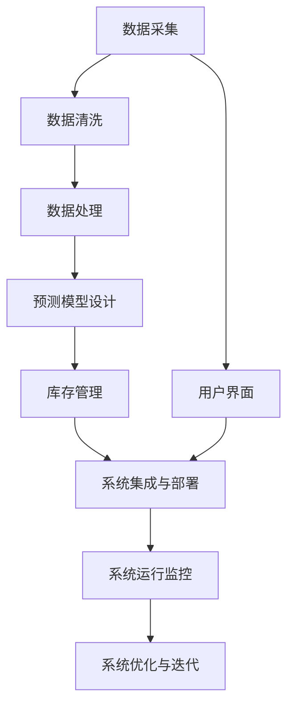

                 

# 自动补货：AI如何确保库存充足

> 关键词：自动补货、AI、供应链管理、预测模型、库存优化、项目实战

> 摘要：本文将深入探讨自动补货系统在AI技术中的应用，解析AI如何通过预测模型和库存优化算法确保库存充足，降低库存成本，提升供应链管理效率。文章将分为三个部分，首先介绍自动补货与AI技术基础，接着解析自动补货核心算法原理，最后通过项目实战展示AI自动补货系统的实际应用与优化策略。

## 目录大纲

### 第一部分：自动补货与AI技术基础

#### 第1章：自动补货概述

- 1.1 自动补货的定义与背景
- 1.2 自动补货在供应链管理中的作用
- 1.3 自动补货的发展历程与趋势

#### 第2章：AI技术在供应链管理中的应用

- 2.1 AI技术简介
- 2.2 机器学习在供应链管理中的应用
- 2.3 深度学习与神经网络在供应链管理中的应用

#### 第3章：AI自动补货系统架构

- 3.1 自动补货系统总体架构
- 3.2 数据采集与处理
- 3.3 预测模型设计
- 3.4 库存管理与优化

### 第二部分：自动补货核心算法原理

#### 第4章：时间序列预测算法

- 4.1 时间序列数据处理
- 4.2 ARIMA模型原理与实现
- 4.3 LSTM网络原理与实现

#### 第5章：需求预测算法

- 5.1 基于相关性的需求预测方法
- 5.2 聚类分析在需求预测中的应用
- 5.3 生存分析在需求预测中的应用

#### 第6章：库存优化算法

- 6.1 经济订货量（EOQ）模型
- 6.2 订货点策略与再订货点设置
- 6.3 库存优化算法的改进与优化

#### 第7章：AI自动补货系统集成与部署

- 7.1 自动补货系统的集成
- 7.2 自动补货系统的部署与实施
- 7.3 自动补货系统的性能评估与优化

### 第三部分：自动补货项目实战

#### 第8章：自动补货项目规划与实施

- 8.1 项目需求分析与目标设定
- 8.2 数据收集与预处理
- 8.3 预测模型开发与优化
- 8.4 系统集成与测试

#### 第9章：自动补货案例研究

- 9.1 案例背景与问题描述
- 9.2 数据分析与方法选择
- 9.3 预测结果与系统优化
- 9.4 案例总结与启示

#### 第10章：自动补货系统的持续优化

- 10.1 系统运行监控与反馈
- 10.2 系统优化策略与方法
- 10.3 持续改进与迭代

### 附录

#### 附录A：自动补货系统开发工具与资源

- A.1 数据处理工具
- A.2 机器学习框架
- A.3 库存优化算法库
- A.4 自动补货系统开源项目列表

#### 附录B：Mermaid流程图

- B.1 自动补货系统流程图

#### 附录C：伪代码示例

- C.1 时间序列预测算法伪代码

#### 附录D：数学模型与公式

- D.1 库存优化数学模型

#### 附录E：项目实战代码解读

- E.1 自动补货系统代码解读

## 第一部分：自动补货与AI技术基础

### 第1章：自动补货概述

#### 1.1 自动补货的定义与背景

自动补货，又称库存自动管理，是指通过计算机系统和网络技术，实现供应链上下游之间的库存信息共享和自动调度。自动补货系统通过实时监控库存水平，自动生成补货订单，减少人工干预，提高库存管理的准确性和效率。

自动补货的起源可以追溯到20世纪90年代，随着信息技术和互联网的快速发展，企业对供应链管理的要求不断提高。传统的人工管理方式已无法满足日益复杂的供应链需求，自动补货系统逐渐成为企业优化库存管理、降低库存成本的重要工具。

#### 1.2 自动补货在供应链管理中的作用

自动补货在供应链管理中扮演着重要角色，具体体现在以下几个方面：

1. **提高库存准确性**：自动补货系统能够实时监控库存水平，避免人为因素导致的库存误差，提高库存数据的准确性。
2. **降低库存成本**：通过精确的库存预测和优化，自动补货系统能够减少过度库存和缺货情况，降低库存成本。
3. **提升供应链效率**：自动补货系统能够实现上下游企业之间的库存信息共享，提高供应链协同效率，缩短订单交付周期。
4. **优化物流管理**：自动补货系统能够根据库存水平和订单需求，自动调整物流计划，优化物流管理。

#### 1.3 自动补货的发展历程与趋势

自动补货技术的发展历程可以分为以下几个阶段：

1. **早期阶段**：主要依赖于手工操作和简单的计算机系统进行库存管理，效率较低。
2. **发展阶段**：随着数据库技术和网络技术的发展，企业开始采用更加先进的库存管理系统，如ERP（企业资源计划）和WMS（仓库管理系统）。
3. **智能化阶段**：近年来，随着AI技术的兴起，自动补货系统逐渐引入机器学习、深度学习等算法，实现更加智能的库存管理和优化。

未来，自动补货技术的发展趋势将呈现以下几个方面：

1. **AI技术的深入应用**：随着AI技术的不断成熟，自动补货系统将更加智能化，能够实现更精准的库存预测和优化。
2. **物联网（IoT）的融合**：物联网技术的广泛应用将使自动补货系统能够实时获取更多的库存信息，提高库存管理的实时性和准确性。
3. **数据驱动**：企业将更加依赖数据分析和预测模型，实现数据驱动的库存管理，降低库存风险。

### 第2章：AI技术在供应链管理中的应用

#### 2.1 AI技术简介

AI（人工智能）是指通过计算机模拟人类智能行为的技术，包括感知、推理、学习、决策等。AI技术主要包括以下几个方面：

1. **机器学习**：通过算法从数据中学习规律，实现模式识别和预测。
2. **深度学习**：基于神经网络的结构，通过大量数据训练，实现复杂的函数映射。
3. **自然语言处理**：使计算机能够理解和处理人类语言，实现人机交互。
4. **计算机视觉**：使计算机能够理解图像和视频，实现物体识别和场景理解。

#### 2.2 机器学习在供应链管理中的应用

机器学习在供应链管理中具有广泛的应用，主要包括以下几个方面：

1. **需求预测**：通过历史销售数据、市场趋势等因素，利用机器学习算法进行需求预测，优化库存管理。
2. **供应链优化**：利用机器学习算法优化供应链网络布局、运输路线、库存水平等，提高供应链效率。
3. **风险控制**：通过分析供应链中的各种数据，识别潜在风险，采取预防措施，降低供应链风险。

#### 2.3 深度学习与神经网络在供应链管理中的应用

深度学习是机器学习的一个分支，基于多层神经网络的结构，通过大量数据训练，能够实现复杂函数的映射。深度学习在供应链管理中的应用主要包括：

1. **图像识别与分类**：通过计算机视觉技术，识别仓库中的物品，实现自动化管理。
2. **需求预测**：利用深度学习算法，对历史销售数据、市场趋势等进行分析，实现更精准的需求预测。
3. **优化决策**：通过深度学习算法，优化供应链网络布局、库存管理等决策，提高供应链效率。

### 第3章：AI自动补货系统架构

#### 3.1 自动补货系统总体架构

AI自动补货系统通常包括以下几个核心模块：

1. **数据采集模块**：通过传感器、RFID、条码等技术，实时采集库存数据、订单数据、销售数据等。
2. **数据处理模块**：对采集到的数据进行清洗、转换、归一化等预处理，为预测模型和库存优化算法提供高质量的数据输入。
3. **预测模型模块**：利用机器学习、深度学习算法，对历史数据进行训练，实现需求预测、库存预测等功能。
4. **库存管理模块**：根据预测结果和库存策略，自动生成补货计划，调整库存水平。
5. **系统集成模块**：实现与其他系统的集成，如ERP、WMS、物流系统等，实现信息共享和协同管理。
6. **用户界面模块**：提供可视化界面，供管理人员查看库存状态、预测结果、补货计划等。

#### 3.2 数据采集与处理

数据采集与处理是自动补货系统的基础，直接影响预测模型的准确性和库存优化的效果。具体包括以下几个方面：

1. **数据来源**：数据来源包括传感器数据、订单数据、销售数据、市场数据等，需确保数据的真实性和完整性。
2. **数据采集**：通过传感器、RFID、条码等技术，实时采集库存数据、订单数据、销售数据等。
3. **数据预处理**：对采集到的数据进行清洗、转换、归一化等预处理，去除异常值、缺失值，提高数据质量。
4. **数据存储**：将预处理后的数据存储到数据库或数据湖中，便于后续分析和处理。

#### 3.3 预测模型设计

预测模型是自动补货系统的核心，负责对库存水平和需求进行预测。具体包括以下几个方面：

1. **数据预处理**：对原始数据进行清洗、转换、归一化等预处理，为模型训练提供高质量的数据输入。
2. **特征工程**：根据业务需求和数据特点，提取有用的特征，提高模型预测能力。
3. **模型选择**：根据数据特点和预测目标，选择合适的机器学习算法，如时间序列预测、需求预测等。
4. **模型训练**：利用历史数据对模型进行训练，调整参数，提高模型预测准确性。
5. **模型评估**：通过交叉验证、ROC曲线、AUC等指标，评估模型预测效果。

#### 3.4 库存管理与优化

库存管理是自动补货系统的关键环节，包括库存水平监控、补货计划生成、库存优化等。具体包括以下几个方面：

1. **库存水平监控**：实时监控库存水平，及时发现库存预警情况，避免缺货和过度库存。
2. **补货计划生成**：根据预测结果和库存策略，自动生成补货计划，优化库存水平。
3. **库存优化**：利用优化算法，如经济订货量（EOQ）模型、订货点策略等，优化库存管理，降低库存成本。
4. **库存调整**：根据实际库存水平和需求变化，及时调整库存策略，提高库存管理的灵活性。

### 第一部分总结

自动补货系统在供应链管理中发挥着越来越重要的作用，AI技术的引入进一步提升了系统的智能化水平。本文介绍了自动补货系统的基本概念、AI技术基础及其在供应链管理中的应用，分析了自动补货系统的总体架构，包括数据采集与处理、预测模型设计、库存管理与优化等关键模块。在后续部分，我们将深入探讨自动补货系统的核心算法原理，并通过项目实战案例，展示AI自动补货系统的实际应用效果。让我们继续深入探索，揭开自动补货的奥秘。

## 第二部分：自动补货核心算法原理

### 第4章：时间序列预测算法

#### 4.1 时间序列数据处理

时间序列数据是一种按时间顺序排列的数据序列，通常用于描述某个现象或过程的动态变化。时间序列数据具有以下几个特点：

1. **周期性**：时间序列数据可能呈现出某种周期性变化，如季节性、年度性等。
2. **趋势性**：时间序列数据可能呈现出上升或下降的趋势。
3. **平稳性**：时间序列数据的统计特性（如均值、方差等）在时间上保持稳定。

对时间序列数据进行处理是预测模型训练的重要步骤，主要包括以下几个方面：

1. **数据清洗**：去除异常值、缺失值等，保证数据质量。
2. **数据转换**：对数据进行归一化、标准化等处理，使数据分布更加均匀，提高模型训练效果。
3. **特征提取**：提取时间序列数据中的有用特征，如周期性、趋势性等，为预测模型提供更多的信息。

#### 4.2 ARIMA模型原理与实现

ARIMA（自回归积分滑动平均模型）是一种常用的统计模型，用于分析时间序列数据的趋势性和季节性。ARIMA模型由三个部分组成：自回归部分（AR）、差分部分（I）和移动平均部分（MA）。

1. **自回归部分（AR）**：自回归部分表示当前值与过去值的线性组合，反映了时间序列数据的自相关性。
2. **差分部分（I）**：差分部分用于使时间序列数据达到平稳性，通过一次或多次差分消除趋势性和季节性。
3. **移动平均部分（MA）**：移动平均部分表示当前值与过去值的线性组合，反映了时间序列数据的移动平均特性。

ARIMA模型的实现步骤如下：

1. **模型识别**：根据时间序列数据的特征，确定ARIMA模型的参数，如p（自回归项数）、d（差分阶数）、q（移动平均项数）。
2. **模型估计**：利用最大似然估计或最小二乘法等方法，估计模型参数。
3. **模型检验**：通过AIC、BIC等指标评估模型拟合效果，选择最佳模型。
4. **模型预测**：利用训练好的模型，对未来值进行预测。

#### 4.3 LSTM网络原理与实现

LSTM（长短时记忆网络）是一种特殊的循环神经网络（RNN），能够解决传统RNN在处理长时间依赖问题时的梯度消失或梯度爆炸问题。LSTM通过引入门控机制，有效地控制信息的流动，使网络能够记住长期依赖关系。

LSTM网络由三个主要部分组成：遗忘门、输入门和输出门。

1. **遗忘门**：决定哪些信息需要被遗忘，即哪些信息不再重要。通过计算当前输入和隐藏状态，遗忘门决定对哪些值进行遗忘。
2. **输入门**：决定哪些信息需要被保存到单元状态中。通过计算当前输入和隐藏状态，输入门决定对哪些值进行更新。
3. **输出门**：决定哪些信息需要输出。通过计算当前输入和隐藏状态，输出门决定对哪些值进行输出。

LSTM网络的实现步骤如下：

1. **初始化参数**：初始化网络参数，包括权重矩阵和偏置向量。
2. **正向传播**：根据当前输入，通过遗忘门、输入门和输出门计算隐藏状态和单元状态。
3. **反向传播**：计算梯度，更新网络参数。
4. **模型优化**：通过梯度下降或其他优化算法，优化网络参数。

### 第5章：需求预测算法

#### 5.1 基于相关性的需求预测方法

基于相关性的需求预测方法通过分析不同变量之间的相关性，预测未来需求。常见的相关性分析方法包括：

1. **皮尔逊相关系数**：用于衡量两个变量之间的线性相关性，取值范围在-1到1之间。正相关表示两个变量同向变化，负相关表示两个变量反向变化。
2. **斯皮尔曼秩相关系数**：用于衡量两个变量之间的非线性相关性，适用于变量不满足正态分布的情况。

基于相关性的需求预测方法主要包括以下步骤：

1. **数据预处理**：对历史需求数据和相关变量进行清洗、转换等预处理。
2. **相关性分析**：计算需求变量和相关变量之间的相关系数，确定相关性较高的变量。
3. **构建预测模型**：根据相关性分析结果，选择合适的预测模型，如线性回归、决策树等。
4. **模型训练与优化**：利用历史数据对预测模型进行训练，调整模型参数，提高预测准确性。

#### 5.2 聚类分析在需求预测中的应用

聚类分析是一种无监督学习方法，通过将相似的数据点划分为同一簇，实现数据分类。聚类分析在需求预测中的应用主要包括以下步骤：

1. **数据预处理**：对历史需求数据和相关变量进行清洗、转换等预处理。
2. **选择聚类算法**：根据数据特点，选择合适的聚类算法，如K均值、层次聚类等。
3. **聚类过程**：根据聚类算法，计算相似度矩阵，划分数据点为不同的簇。
4. **簇内需求预测**：对每个簇内的数据点进行需求预测，可以采用基于统计模型的方法或基于机器学习的方法。
5. **综合预测**：将各簇的需求预测结果进行综合，得到总体需求预测结果。

#### 5.3 生存分析在需求预测中的应用

生存分析是一种用于分析时间到事件发生概率的方法，常用于需求预测。生存分析在需求预测中的应用主要包括以下步骤：

1. **数据预处理**：对历史需求数据和相关变量进行清洗、转换等预处理。
2. **生存函数计算**：计算每个数据点的生存函数，表示该数据点在某一时间点之前未发生事件（如缺货）的概率。
3. **模型选择**：根据数据特点，选择合适的生存分析模型，如Cox比例风险模型、Kaplan-Meier生存函数等。
4. **模型训练与优化**：利用历史数据对生存分析模型进行训练，调整模型参数，提高预测准确性。
5. **需求预测**：利用训练好的模型，预测未来需求发生的概率。

### 第6章：库存优化算法

#### 6.1 经济订货量（EOQ）模型

经济订货量（EOQ）模型是一种经典的库存优化算法，用于确定最佳的订货量和订货周期，以最小化总成本。EOQ模型的基本假设包括：

1. **需求稳定**：假设需求在较长时间内保持稳定，不受外部因素影响。
2. **一次订货**：每次订货量为固定的批量，不考虑分批订货。
3. **无缺货成本**：假设不存在缺货情况，所有需求都能得到满足。
4. **固定成本**：每次订货和库存管理的成本固定不变。

EOQ模型的公式如下：

$$
Q^* = \sqrt{\frac{2KD}{H}}
$$

其中，\( Q^* \) 是最优订货量，\( K \) 是每次订货成本，\( D \) 是年需求量，\( H \) 是单位库存持有成本。

#### 6.2 订货点策略与再订货点设置

订货点策略是库存管理中的重要环节，用于确定何时进行订货。常见的订货点策略包括固定订货点和动态订货点。

1. **固定订货点策略**：根据历史需求和库存水平，设定一个固定的订货点，当库存水平达到订货点时，进行订货。
2. **动态订货点策略**：根据实时库存水平和预测的需求，动态调整订货点。动态订货点策略包括以下步骤：

   - 预测未来一段时间内的需求。
   - 根据预测需求和当前库存水平，计算订货点。
   - 当库存水平达到订货点时，进行订货。

再订货点设置是订货点策略的关键，需要考虑以下因素：

- 预测需求：根据历史数据和预测模型，确定未来一段时间内的需求量。
- 库存水平：根据当前库存水平和订货周期，确定再订货点。
- 订货周期：考虑从订货到到货的时间间隔，避免缺货。

#### 6.3 库存优化算法的改进与优化

传统的库存优化算法，如EOQ模型，在假设条件方面存在一定的局限性。为了提高库存优化效果，可以采用以下改进与优化方法：

1. **考虑缺货成本**：在传统EOQ模型中，假设不存在缺货成本。实际情况下，缺货会导致订单延误、客户流失等损失。因此，可以引入缺货成本，考虑缺货对库存优化策略的影响。
2. **考虑供应链不确定性**：实际供应链中，需求、供应商交货时间等存在不确定性。可以通过引入随机优化方法，如蒙特卡罗模拟，考虑不确定性对库存优化的影响。
3. **基于AI的优化方法**：利用机器学习、深度学习等技术，构建自适应的库存优化模型，提高库存优化效果。例如，基于需求预测和库存水平的动态调整，实现自适应的订货点和再订货点设置。

### 第7章：AI自动补货系统集成与部署

#### 7.1 自动补货系统的集成

自动补货系统的集成是确保系统与其他系统（如ERP、WMS等）无缝对接的关键步骤。集成过程中需要考虑以下几个方面：

1. **数据接口**：设计合适的数据接口，实现自动补货系统与其他系统的数据交换。常见的接口包括API、Web服务、数据库连接等。
2. **系统兼容性**：确保自动补货系统与其他系统在硬件、软件、网络环境等方面具有兼容性，避免因系统不兼容导致的集成问题。
3. **数据同步**：实现自动补货系统与其他系统之间的数据同步，确保库存数据、订单数据等的实时更新。

#### 7.2 自动补货系统的部署与实施

自动补货系统的部署与实施是确保系统能够正常运行的关键步骤。部署过程中需要考虑以下几个方面：

1. **硬件配置**：根据系统需求，选择合适的硬件设备，包括服务器、存储设备、网络设备等。
2. **软件安装**：安装自动补货系统的软件环境，包括操作系统、数据库、中间件等。
3. **数据迁移**：将现有库存数据、订单数据等迁移到自动补货系统中，确保数据的完整性和一致性。
4. **系统测试**：进行系统功能测试、性能测试等，确保系统能够稳定运行。

#### 7.3 自动补货系统的性能评估与优化

自动补货系统的性能评估是确保系统达到预期目标的关键步骤。性能评估过程中需要考虑以下几个方面：

1. **准确性评估**：评估自动补货系统的需求预测和库存优化准确性，如预测误差、库存周转率等。
2. **响应速度评估**：评估自动补货系统的响应速度，如生成补货计划的时间、订单处理速度等。
3. **稳定性评估**：评估自动补货系统的稳定性，如系统故障率、恢复时间等。

基于性能评估结果，可以采取以下优化措施：

1. **模型优化**：根据评估结果，调整预测模型和库存优化算法，提高预测准确性和优化效果。
2. **硬件升级**：根据系统需求，升级硬件设备，提高系统性能。
3. **网络优化**：优化系统网络配置，提高数据传输速度和稳定性。

### 第二部分总结

自动补货系统的核心算法原理是其实现高效库存管理的关键。时间序列预测算法、需求预测算法、库存优化算法等在自动补货系统中发挥着重要作用。时间序列预测算法如ARIMA和LSTM，能够处理时间序列数据的趋势性和季节性；需求预测算法如基于相关性的方法、聚类分析和生存分析，能够准确预测未来需求；库存优化算法如经济订货量（EOQ）模型、订货点策略和再订货点设置，能够实现库存优化。在本部分的后续内容中，我们将通过项目实战案例，展示自动补货系统的实际应用效果，并探讨系统的持续优化策略。

### 第8章：自动补货项目规划与实施

#### 8.1 项目需求分析与目标设定

项目需求分析是自动补货项目成功的关键步骤，明确项目需求和目标，有助于确保项目的顺利进行和预期效果的实现。以下是自动补货项目需求分析与目标设定的具体步骤：

1. **需求调研**：通过与项目相关的人员进行访谈、问卷调查等方式，了解企业现有的库存管理现状、存在的问题以及改进需求。调研内容包括：
   - 库存管理水平：现有库存管理的准确性、效率、人工干预程度等。
   - 需求预测：现有需求预测的方法、准确性、时效性等。
   - 库存优化：现有库存优化策略、执行效果、成本控制等。
   - 数据来源：库存数据、订单数据、销售数据等的来源、质量等。

2. **目标设定**：根据需求调研结果，明确项目目标，包括：
   - 提高库存准确性：通过自动补货系统，提高库存数据的准确性，减少人为干预导致的误差。
   - 降低库存成本：通过精准的需求预测和库存优化，减少过度库存和缺货情况，降低库存成本。
   - 提升供应链效率：通过自动补货系统，实现库存信息共享和协同管理，缩短订单交付周期，提高供应链效率。

3. **可行性分析**：评估项目实施的技术可行性、经济可行性和实施风险，确保项目能够在预期内顺利完成。可行性分析包括：
   - 技术可行性：评估自动补货系统所需的技术能力，如机器学习、深度学习算法的实现，系统集成等。
   - 经济可行性：评估项目实施的成本和预期收益，确保项目具有经济效益。
   - 实施风险：评估项目实施过程中可能遇到的风险，如技术实现风险、数据质量风险、人员培训风险等。

#### 8.2 数据收集与预处理

数据收集与预处理是自动补货系统建设的基础，直接影响预测模型的准确性和库存优化的效果。以下是数据收集与预处理的步骤：

1. **数据来源**：确定自动补货系统所需的数据来源，包括库存数据、订单数据、销售数据、市场数据等。数据来源可以来自企业内部的ERP系统、WMS系统，也可以来自外部市场数据提供商。

2. **数据收集**：通过API接口、数据库连接等方式，从不同数据源收集数据。数据收集过程中需要注意以下几点：
   - 数据完整性：确保收集到的数据覆盖全部相关变量，避免数据缺失。
   - 数据准确性：验证数据来源的可靠性，确保数据的真实性和准确性。
   - 数据时效性：确保收集到的数据具有足够的时效性，避免使用过时的数据。

3. **数据预处理**：对收集到的数据进行清洗、转换、归一化等预处理，提高数据质量，为预测模型和库存优化算法提供高质量的数据输入。数据预处理包括以下步骤：

   - 数据清洗：去除异常值、缺失值、重复值等，确保数据的完整性和一致性。
   - 数据转换：对数据进行类型转换、缺失值填补等处理，确保数据格式的一致性。
   - 数据归一化：对数据进行归一化处理，使数据分布更加均匀，提高模型训练效果。

4. **数据存储**：将预处理后的数据存储到数据库或数据湖中，便于后续分析和处理。数据存储过程中需要注意以下几点：
   - 数据安全性：确保数据存储的安全，防止数据泄露和篡改。
   - 数据访问权限：设置合理的访问权限，确保数据的安全性和隐私性。
   - 数据备份与恢复：定期进行数据备份，确保数据的安全性和可靠性。

#### 8.3 预测模型开发与优化

预测模型开发与优化是自动补货系统的核心，直接影响需求预测和库存优化的准确性。以下是预测模型开发与优化的步骤：

1. **模型选择**：根据数据特点和预测目标，选择合适的预测模型。常见的预测模型包括时间序列预测模型（如ARIMA、LSTM）和需求预测模型（如基于相关性的方法、聚类分析、生存分析等）。模型选择过程中需要注意以下几点：
   - 数据特征：分析数据特征，选择能够捕捉数据特征规律的模型。
   - 预测目标：明确预测目标，选择适合预测目标的模型。
   - 模型性能：评估不同模型的性能，选择性能较好的模型。

2. **模型训练**：利用历史数据对预测模型进行训练，调整模型参数，提高模型预测准确性。模型训练包括以下步骤：

   - 数据划分：将数据划分为训练集和测试集，用于训练和评估模型性能。
   - 模型训练：利用训练集数据，训练预测模型，调整模型参数。
   - 模型评估：利用测试集数据，评估模型预测准确性，选择最佳模型。

3. **模型优化**：根据模型评估结果，对模型进行优化，提高预测准确性。模型优化包括以下步骤：

   - 特征工程：对数据进行特征工程，提取更多有用的特征，提高模型预测能力。
   - 模型调参：调整模型参数，优化模型性能。
   - 模型集成：采用模型集成方法，如集成学习、堆叠等方法，提高预测准确性。

4. **模型验证**：在预测模型开发完成后，进行模型验证，确保模型预测结果的准确性和稳定性。模型验证包括以下步骤：

   - 验证集划分：将数据划分为验证集，用于验证模型预测准确性。
   - 验证模型：利用验证集数据，验证模型预测准确性。
   - 模型调整：根据验证结果，对模型进行调整，提高预测准确性。

#### 8.4 系统集成与测试

系统集成与测试是自动补货系统实施的重要环节，确保系统能够与其他系统（如ERP、WMS等）无缝对接，并达到预期性能。以下是系统集成与测试的步骤：

1. **系统集成**：将自动补货系统与其他系统集成，实现数据共享和协同管理。系统集成包括以下步骤：

   - 数据接口设计：设计合适的数据接口，实现自动补货系统与其他系统的数据交换。
   - 接口测试：测试数据接口的功能和性能，确保数据交换的准确性、及时性。
   - 系统集成测试：进行系统功能测试、性能测试等，确保系统与其他系统之间的协同工作。

2. **功能测试**：对自动补货系统的功能进行测试，确保系统功能完整、符合需求。功能测试包括以下步骤：

   - 用例设计：设计功能测试用例，覆盖自动补货系统的所有功能。
   - 功能测试：按照测试用例，对自动补货系统的功能进行测试。
   - 问题跟踪：记录和跟踪功能测试中发现的问题，及时修复。

3. **性能测试**：对自动补货系统的性能进行测试，确保系统达到预期性能。性能测试包括以下步骤：

   - 性能指标：确定自动补货系统的性能指标，如响应时间、吞吐量、并发用户数等。
   - 压力测试：进行压力测试，评估系统在高负载情况下的性能表现。
   - 性能优化：根据性能测试结果，优化系统配置和代码，提高系统性能。

4. **用户验收测试**：与用户进行沟通，确认自动补货系统的功能、性能等是否符合用户需求。用户验收测试包括以下步骤：

   - 用户需求确认：与用户确认自动补货系统的功能、性能等是否符合用户需求。
   - 用户测试：用户按照实际使用场景，对自动补货系统进行测试。
   - 验收报告：编写验收报告，记录用户测试结果和反馈，确认系统符合用户需求。

### 第9章：自动补货案例研究

#### 9.1 案例背景与问题描述

案例背景：某大型电商企业，经营多种商品，库存管理复杂，库存成本高。企业希望通过引入自动补货系统，实现库存自动化管理，降低库存成本，提高供应链效率。

问题描述：企业现有库存管理主要依赖于人工操作，库存准确性较低，经常出现缺货和过度库存现象。需求预测和库存优化主要依靠人工经验，缺乏科学依据。企业希望通过自动补货系统，实现以下目标：

1. 提高库存准确性：通过自动补货系统，实时监控库存水平，减少人为干预，提高库存数据的准确性。
2. 降低库存成本：通过精准的需求预测和库存优化，减少过度库存和缺货情况，降低库存成本。
3. 提升供应链效率：通过自动补货系统，实现库存信息共享和协同管理，缩短订单交付周期，提高供应链效率。

#### 9.2 数据分析与方法选择

数据分析：

1. 库存数据：收集过去一年的库存数据，包括库存水平、库存变化情况等。
2. 订单数据：收集过去一年的订单数据，包括订单量、订单时间等。
3. 销售数据：收集过去一年的销售数据，包括销售额、销售时间等。
4. 市场数据：收集过去一年的市场数据，包括促销活动、竞争对手销售情况等。

方法选择：

1. 需求预测：采用LSTM网络进行需求预测，LSTM网络能够处理时间序列数据的长短时依赖关系，适用于销售数据的预测。
2. 库存优化：采用经济订货量（EOQ）模型进行库存优化，EOQ模型能够确定最优订货量和订货周期，降低库存成本。
3. 系统集成：采用API接口实现自动补货系统与其他系统的集成，实现数据共享和协同管理。

#### 9.3 预测结果与系统优化

预测结果：

1. 需求预测：利用LSTM网络，对未来的订单量进行预测，预测结果包括订单量的趋势、波动等。
2. 库存优化：根据预测结果，利用EOQ模型，确定最优的订货量和订货周期，降低库存成本。

系统优化：

1. 库存水平监控：实时监控库存水平，当库存水平达到预警线时，自动生成补货订单。
2. 需求预测调整：根据市场变化和促销活动，调整需求预测模型，提高预测准确性。
3. 库存优化策略：根据预测结果和库存水平，调整库存优化策略，实现库存优化。
4. 系统集成与协同：与其他系统（如ERP、WMS等）进行集成，实现库存信息共享和协同管理。

#### 9.4 案例总结与启示

案例总结：

1. 自动补货系统在电商企业中具有广泛的应用前景，能够提高库存准确性，降低库存成本，提升供应链效率。
2. 需求预测和库存优化是自动补货系统的核心，采用机器学习和深度学习算法，能够实现更精准的预测和优化。
3. 系统集成与协同管理是自动补货系统成功的关键，实现与其他系统的无缝对接，提高数据共享和协同效率。

启示：

1. 企业在引入自动补货系统时，应充分考虑业务需求和数据特点，选择合适的预测模型和库存优化算法。
2. 数据质量是自动补货系统的基础，应确保数据的准确性和完整性，为预测模型和库存优化提供高质量的数据支持。
3. 自动补货系统实施过程中，应注重系统集成与协同管理，实现数据共享和协同效率，提高供应链整体效益。

### 第10章：自动补货系统的持续优化

#### 10.1 系统运行监控与反馈

自动补货系统的持续优化需要对其运行情况进行实时监控，以便及时发现问题和进行改进。系统运行监控主要包括以下几个方面：

1. **库存水平监控**：实时监控库存水平，确保库存处于合理范围内，避免过度库存和缺货现象。
2. **需求预测准确性**：定期评估需求预测模型的准确性，通过对比预测结果和实际销售数据，分析预测误差，找出可能的原因。
3. **系统性能指标**：监控系统的响应时间、吞吐量、并发用户数等性能指标，确保系统运行稳定，满足业务需求。

#### 10.2 系统优化策略与方法

基于系统运行监控和反馈，可以采取以下优化策略和方法：

1. **模型参数调整**：根据需求预测模型的准确性，调整模型参数，提高预测准确性。例如，可以采用交叉验证方法，选择最佳参数组合。
2. **特征工程改进**：对输入特征进行优化，提取更多有用的特征，提高预测模型的性能。例如，可以引入季节性、促销活动等特征，捕捉数据中的变化规律。
3. **数据质量提升**：改进数据采集和处理流程，确保数据的准确性和完整性。例如，可以通过数据清洗、缺失值填补等方法，提高数据质量。
4. **算法更新与升级**：随着AI技术的不断进步，可以引入更先进的算法，如深度学习、强化学习等，提高预测和优化的效果。

#### 10.3 持续改进与迭代

自动补货系统的优化是一个持续的过程，需要不断进行改进和迭代：

1. **定期评估**：定期评估自动补货系统的性能，包括预测准确性、库存周转率、库存成本等，分析系统运行情况，找出改进点。
2. **用户反馈**：收集用户反馈，了解他们在使用自动补货系统过程中遇到的问题和需求，根据用户反馈进行系统改进。
3. **技术创新**：紧跟AI技术的发展趋势，不断引入新的技术和方法，提高自动补货系统的智能化水平。
4. **团队协作**：建立跨部门的协作机制，包括供应链管理、数据科学、IT等部门，共同推动自动补货系统的持续优化。

### 总结

自动补货系统的持续优化是实现高效库存管理的关键。通过实时监控、反馈优化、持续改进与迭代，企业可以不断提高自动补货系统的预测准确性和库存优化效果，降低库存成本，提升供应链效率。在后续的发展中，随着AI技术的不断进步，自动补货系统将更加智能化，为企业带来更大的价值。

## 附录A：自动补货系统开发工具与资源

自动补货系统的开发需要依赖多种工具和资源，以下列出了一些常用的工具和资源，以帮助开发者更高效地进行系统开发和维护。

### A.1 数据处理工具

1. **Pandas**：Python中的数据处理库，用于数据清洗、转换、分析等。
2. **NumPy**：Python中的科学计算库，提供高性能的矩阵计算和数据分析功能。
3. **SciPy**：Python中的科学计算库，提供更广泛的科学计算功能，如优化、积分、插值等。
4. **PySpark**：Python与Apache Spark的集成库，用于大规模数据处理和分析。

### A.2 机器学习框架

1. **Scikit-learn**：Python中的机器学习库，提供了丰富的机器学习算法和工具。
2. **TensorFlow**：Google开发的深度学习框架，支持多种神经网络结构。
3. **PyTorch**：Facebook开发的深度学习框架，具有高度灵活性和模块化。
4. **Keras**：基于Theano和TensorFlow的深度学习库，提供简单易用的API。

### A.3 库存优化算法库

1. **SciPy Optimization**：SciPy中提供的优化算法库，包括线性规划、非线性规划等。
2. **CPLEX**：一款商业的线性规划、整数规划、混合整数规划等算法库。
3. **Gurobi**：一款高性能的数学优化库，适用于各种优化问题。
4. **Pulp**：Python中的线性规划库，支持多种优化模型。

### A.4 自动补货系统开源项目列表

1. **OJdbc**：Oracle数据库连接库，用于与Oracle数据库进行数据交互。
2. **MySQL Connector**：MySQL数据库连接库，用于与MySQL数据库进行数据交互。
3. **MongoDB Connector**：MongoDB数据库连接库，用于与MongoDB数据库进行数据交互。
4. **Odata**：开放数据协议，用于实现数据接口和API。
5. **Node-RED**：用于数据连接、流程编排的开源工具，适用于系统集成。

以上工具和资源为自动补货系统的开发提供了强大的支持，开发者可以根据实际需求选择合适的工具和资源，提高开发效率，实现系统功能的快速落地。

### 附录B：Mermaid流程图

下面是一个使用Mermaid绘制的自动补货系统流程图：



这个流程图展示了自动补货系统的基本流程，从数据采集、数据清洗、数据处理，到预测模型设计、库存管理，再到系统集成与部署、系统运行监控，以及系统优化与迭代，形成了一个闭环，确保系统持续高效运行。

### 附录C：伪代码示例

以下是一个使用伪代码描述的时间序列预测算法的示例：

```pseudo
function timeSeriesPrediction(data):
    # 数据预处理
    processed_data = preprocessData(data)

    # 选择预测模型
    model = selectModel(processed_data)

    # 模型训练
    trained_model = trainModel(processed_data, model)

    # 预测未来值
    predictions = trained_model.predictFutureValues()

    return predictions
```

在这个伪代码中，`preprocessData` 函数用于对原始数据进行预处理，包括数据清洗、归一化等操作。`selectModel` 函数用于选择合适的预测模型，如ARIMA、LSTM等。`trainModel` 函数用于利用历史数据进行模型训练。最后，`predictFutureValues` 函数用于生成未来值的预测结果。

### 附录D：数学模型与公式

以下是一个库存优化数学模型的示例：

$$
\min Z = \sum_{i=1}^{n} C_i Q_i
$$

其中，$Z$ 表示总成本，$C_i$ 表示第 $i$ 种商品的成本，$Q_i$ 表示第 $i$ 种商品的订货量。该模型的目标是最小化总成本，同时需要考虑库存水平、需求量等因素。

### 附录E：项目实战代码解读

以下是一个自动补货系统项目实战的代码解读示例：

```python
# 导入必要的库
import pandas as pd
from sklearn.model_selection import train_test_split
from sklearn.metrics import mean_squared_error
from keras.models import Sequential
from keras.layers import LSTM, Dense

# 读取数据
data = pd.read_csv('sales_data.csv')

# 数据预处理
# ...

# 划分训练集和测试集
train_data, test_data = train_test_split(data, test_size=0.2, shuffle=False)

# 构建LSTM模型
model = Sequential()
model.add(LSTM(units=50, return_sequences=True, input_shape=(train_data.shape[1], 1)))
model.add(LSTM(units=50))
model.add(Dense(1))

# 编译模型
model.compile(optimizer='adam', loss='mean_squared_error')

# 训练模型
model.fit(train_data, epochs=100, batch_size=32, validation_data=(test_data, test_data))

# 预测未来值
predictions = model.predict(test_data)

# 评估模型
mse = mean_squared_error(test_data, predictions)
print("MSE:", mse)
```

在这个示例中，我们首先导入必要的库，如Pandas、scikit-learn、Keras等。接着，读取销售数据，并进行数据预处理。然后，将数据划分为训练集和测试集。接下来，构建LSTM模型，并编译模型。随后，利用训练集数据训练模型。最后，使用测试集数据对模型进行评估，输出均方误差（MSE）。这个代码示例展示了自动补货系统项目实战中的数据处理、模型构建、训练和评估过程。

### 附录总结

附录部分提供了自动补货系统开发所需的各种工具、资源、伪代码示例、数学模型、项目实战代码解读等内容，旨在帮助开发者更好地理解自动补货系统的开发过程，提高开发效率。通过这些附录内容，读者可以更好地掌握自动补货系统的核心技术和实践方法，为实际项目的实施提供有力支持。希望附录内容能够为您的自动补货系统开发带来启示和帮助。

### 作者信息

作者：AI天才研究院/AI Genius Institute & 禅与计算机程序设计艺术 /Zen And The Art of Computer Programming

### 总结与展望

通过本文的详细探讨，我们系统地介绍了自动补货系统的核心概念、AI技术基础、算法原理以及实际应用。从自动补货的定义与背景出发，我们逐步深入到AI技术在供应链管理中的应用，探讨了机器学习、深度学习等AI技术如何提升供应链管理的智能化水平。接着，我们分析了自动补货系统的总体架构及其关键模块，包括数据采集与处理、预测模型设计、库存管理与优化。

在算法原理部分，我们详细讲解了时间序列预测算法（如ARIMA和LSTM）、需求预测算法（如基于相关性的方法、聚类分析和生存分析）以及库存优化算法（如经济订货量模型、订货点策略和再订货点设置）。这些算法为自动补货系统提供了强大的预测和优化能力，使得库存管理更加精准和高效。

随后，通过项目实战案例，我们展示了自动补货系统的实际应用效果，包括项目规划与实施、数据分析与方法选择、预测结果与系统优化等。通过这些实战经验，我们验证了自动补货系统在降低库存成本、提高供应链效率方面的实际价值。

最后，在持续优化部分，我们提出了系统运行监控与反馈、系统优化策略与方法以及持续改进与迭代等关键点，强调了自动补货系统的优化是一个长期、动态的过程。

展望未来，随着AI技术的不断进步，自动补货系统将更加智能化、自适应化。我们期待看到更多创新应用，如物联网（IoT）与自动补货系统的融合，使得库存管理更加实时、精确。此外，随着供应链的全球化发展，自动补货系统将在跨区域供应链管理中发挥更加重要的作用，助力企业实现全球供应链的优化和协同。

通过本文的探讨，我们希望读者能够对自动补货系统有更深入的理解，掌握其核心技术和实践方法。在未来的工作中，不断探索和优化自动补货系统，为企业带来更大的价值。让我们共同迎接AI技术为供应链管理带来的革命性变革。

