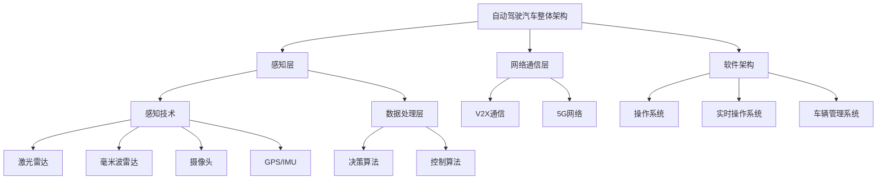
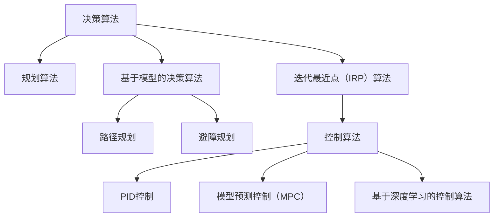

                 

# 自动驾驶汽车和 LLM：实现道路安全和效率

> 关键词：自动驾驶汽车、语言模型（LLM）、道路安全、效率

> 摘要：本文深入探讨了自动驾驶汽车和语言模型（LLM）的结合，旨在通过技术分析和项目实战，展示如何利用LLM提升自动驾驶汽车的道路安全和效率。文章首先介绍了自动驾驶汽车的基础知识，包括其定义、发展历程、核心技术、架构以及感知、决策与控制算法。接着，详细阐述了语言模型的基本概念、评估与优化方法，以及其在自动驾驶中的应用价值。随后，文章探讨了自动驾驶汽车的安全与伦理问题，并展望了其未来发展趋势。最后，通过一个实际项目，展示了如何实现自动驾驶汽车的感知与决策系统，为相关领域的研发和实践提供了有益的参考。

### 引言

随着科技的快速发展，自动驾驶汽车已经成为现代交通领域的一个热点话题。自动驾驶技术不仅可以提高道路安全性，减少交通事故，还能够提升交通效率，缓解城市交通拥堵。然而，实现完全自动驾驶汽车面临着诸多技术挑战，其中之一便是如何提升车辆的感知、决策和控制能力。近年来，语言模型（LLM）的崛起为自动驾驶技术提供了新的发展方向。LLM在自然语言处理领域取得了显著成果，其强大的语义理解和生成能力有望为自动驾驶汽车的智能决策提供有力支持。

本文将从以下几个方面展开讨论：

1. **自动驾驶汽车基础**：介绍自动驾驶汽车的定义、发展历程、核心技术、架构以及感知、决策与控制算法。
2. **LLM基础与应用**：探讨语言模型的基本概念、评估与优化方法，以及其在自动驾驶中的应用案例。
3. **自动驾驶汽车安全与伦理**：分析自动驾驶汽车的安全挑战和伦理问题。
4. **自动驾驶汽车的未来发展趋势**：展望自动驾驶汽车的技术和社会影响。
5. **项目实战**：通过实际项目展示自动驾驶汽车的感知与决策系统开发过程。

本文旨在通过深入的技术分析和项目实战，探讨自动驾驶汽车和LLM结合的可能性，为相关领域的研发和实践提供有价值的参考。

#### 第一部分：自动驾驶汽车基础

##### 第1章：自动驾驶汽车概述

自动驾驶汽车，也被称作无人驾驶汽车，是指能够通过自身感知系统收集周围环境信息，并根据这些信息进行自主决策和控制，从而实现自动驾驶的智能交通工具。自动驾驶技术的发展可以追溯到20世纪50年代，但直到21世纪，随着计算机技术和传感器技术的飞速发展，自动驾驶汽车才逐渐进入人们的视野。自动驾驶技术主要分为感知、决策和控制三个部分。

- **感知技术**：自动驾驶汽车的感知技术主要包括激光雷达、毫米波雷达、摄像头、GPS和IMU等。这些传感器能够实时收集车辆周围的环境信息，包括车辆、行人、道路标志等。
- **决策技术**：感知技术收集到的信息会通过决策算法进行处理，从而生成车辆的控制指令。决策技术主要涉及路径规划、避障、交通信号识别等。
- **控制技术**：决策算法生成的控制指令会通过控制算法转化为具体的控制动作，包括加速、减速、转向等。

自动驾驶汽车的技术分类可以根据其自动化程度进行划分。目前，自动驾驶技术主要分为五个级别：

- **L0级（无自动化）**：车辆不具备任何自动驾驶功能，全部驾驶操作由人类驾驶员完成。
- **L1级（部分自动化）**：车辆具备部分自动化功能，如自适应巡航控制、车道保持辅助等，但需要人类驾驶员随时接管控制。
- **L2级（部分自动化）**：车辆具备部分自动驾驶功能，能够在特定场景下实现自动换道、自动泊车等，但仍需人类驾驶员负责监督。
- **L3级（有条件自动化）**：车辆能够在特定条件下实现完全自动驾驶，但在特定情况下需要人类驾驶员接管控制。
- **L4级（高度自动化）**：车辆能够在大多数场景下实现完全自动驾驶，无需人类驾驶员干预。
- **L5级（完全自动化）**：车辆在任何条件下都能实现自动驾驶，无需人类驾驶员干预。

自动驾驶汽车的发展历程可以分为以下几个阶段：

- **早期研究阶段**（1950-1970年代）：自动驾驶技术最初源于军事和工业需求，美国、日本等国家开始进行相关研究。
- **技术探索阶段**（1980-1990年代）：随着计算机技术和传感器技术的进步，自动驾驶技术逐渐应用于实际场景，如自动火车、自动飞机等。
- **商业化起步阶段**（2000-2010年代）：谷歌等科技公司开始投入巨资研发自动驾驶汽车，自动驾驶技术逐渐从实验室走向市场。
- **商业化推广阶段**（2010年代至今）：众多车企和科技公司纷纷加入自动驾驶汽车的研发与推广，自动驾驶汽车逐渐进入公众视野。

自动驾驶技术的未来发展趋势将朝着更高自动化、更智能化的方向发展。随着人工智能技术的不断进步，自动驾驶汽车将具备更强的感知、决策和控制能力，从而实现更安全、更高效的自动驾驶。此外，自动驾驶汽车与城市交通系统的深度融合也将成为未来发展的一个重要方向。

##### 第1章：自动驾驶汽车概述

**1.1 自动驾驶汽车的定义与发展历程**

自动驾驶汽车，又称无人驾驶汽车，是一种能够在没有人类驾驶员直接操控的情况下，依靠自身搭载的传感器、计算设备和人工智能算法，实现自主驾驶的智能交通工具。自动驾驶汽车的发展可以追溯到20世纪50年代，当时科学家们开始探索利用雷达和计算机技术来实现车辆自动驾驶。早期的自动驾驶系统主要依靠模拟环境下的编程，缺乏对复杂现实场景的处理能力。

进入20世纪70年代，随着微处理器和传感器技术的进步，自动驾驶技术逐渐从理论研究走向实际应用。美国国防部高级研究计划局（DARPA）资助了一系列自动驾驶汽车项目，标志着自动驾驶技术进入了一个新的发展阶段。这些项目推动了自动驾驶技术在道路测试中的应用，初步展示了自动驾驶汽车的潜力和挑战。

到了20世纪80年代和90年代，随着计算机性能的显著提升和传感器技术的进步，自动驾驶技术逐渐从实验室走向实际道路测试。这一时期，出现了许多自动驾驶汽车的演示项目，如卡内基梅隆大学的Navlab项目和麻省理工学院的Autopilot项目。这些项目在自动驾驶技术的研究和应用上取得了重要进展，为自动驾驶汽车的进一步发展奠定了基础。

进入21世纪，互联网、大数据和人工智能技术的快速发展为自动驾驶技术注入了新的活力。谷歌、特斯拉、百度等科技公司纷纷投入巨资研发自动驾驶汽车，推动了自动驾驶技术的商业化进程。2009年，谷歌的自动驾驶汽车首次在公共道路上进行了测试，标志着自动驾驶技术进入了商业化推广阶段。

近年来，自动驾驶汽车技术的发展取得了显著成果。自动驾驶汽车从早期的简单导航功能，逐渐发展到具备感知、决策、控制等复杂功能。自动驾驶汽车的技术等级也在不断提升，从L0级别的辅助驾驶，逐渐发展到L4级别的完全自动驾驶。随着技术的不断进步，自动驾驶汽车的应用场景也在不断扩大，从封闭园区、高速公路，逐步扩展到城市道路、复杂交通环境。

**1.2 自动驾驶汽车的核心技术**

自动驾驶汽车要实现自主驾驶，需要依赖于多种核心技术的支持，这些技术主要包括感知技术、决策技术和控制技术。

**感知技术**是自动驾驶汽车获取环境信息的重要手段。自动驾驶汽车通过搭载各种传感器，如激光雷达（LIDAR）、毫米波雷达、摄像头、GPS、IMU（惯性测量单元）等，实时感知周围环境。这些传感器各自具有不同的优势和局限性，通过数据融合和综合处理，可以形成一个完整的感知系统。

- **激光雷达（LIDAR）**：激光雷达通过发射激光束并测量反射时间，获取三维空间中的点云数据。激光雷达具有高分辨率、强抗干扰能力和远距离感知能力，是自动驾驶汽车中最常用的传感器之一。
- **毫米波雷达**：毫米波雷达通过发射和接收毫米波信号，检测前方物体的距离、速度和方向。毫米波雷达具有较强的穿透能力和较好的抗干扰性能，适用于雨雪等恶劣天气条件下的环境感知。
- **摄像头**：摄像头通过捕捉图像，提取视觉信息。视觉传感器可以识别道路标志、交通信号灯、行人等目标，具有高精度和丰富的信息获取能力。
- **GPS**：全球定位系统（GPS）通过卫星信号，为自动驾驶汽车提供位置信息。GPS具有较高的定位精度和实时性，是自动驾驶汽车进行路径规划和导航的重要工具。
- **IMU**：惯性测量单元（IMU）通过测量车辆的加速度和角速度，提供车辆的姿态和运动状态信息。IMU在自动驾驶汽车中用于辅助定位和姿态估计，提高感知系统的可靠性。

**决策技术**是自动驾驶汽车根据感知到的环境信息，进行自主决策的过程。决策技术主要包括路径规划、避障、交通信号识别等算法。

- **路径规划**：路径规划是自动驾驶汽车的核心技术之一，其主要目标是根据当前车辆状态和道路环境，生成一条最优行驶路径。路径规划算法可以分为局部规划和全局规划两种。局部规划算法主要关注当前车辆周围的局部环境，通过实时调整车辆方向和速度，实现路径的平滑行驶。全局规划算法则从整体上考虑行驶路径，生成一条从起点到终点的最优路径。
- **避障**：避障是自动驾驶汽车在复杂环境中行驶的关键技术。避障算法通过感知系统获取的环境信息，识别前方障碍物，并生成相应的避障策略。常见的避障算法包括基于碰撞检测的避障算法和基于场景模拟的避障算法。
- **交通信号识别**：交通信号识别是自动驾驶汽车在复杂交通环境中行驶的重要功能。通过摄像头和传感器获取的道路信息，自动驾驶汽车可以识别交通信号灯、道路标志等交通元素，并生成相应的行驶策略。

**控制技术**是将决策算法生成的控制指令，转化为具体的车辆控制动作，实现自动驾驶的过程。控制技术主要包括车辆控制算法和执行器控制。

- **车辆控制算法**：车辆控制算法根据决策算法生成的控制指令，对车辆的加速度、转向、制动等执行器进行控制。常见的车辆控制算法包括PID控制、模型预测控制（MPC）、基于深度学习的控制算法等。
- **执行器控制**：执行器控制是将车辆控制算法生成的控制指令，通过执行器实现具体的车辆动作。执行器主要包括发动机、转向系统、制动系统等。

**1.3 自动驾驶汽车的分类**

根据自动驾驶汽车的自动化程度，可以分为不同的级别。目前，自动驾驶汽车主要分为L0到L5六个级别：

- **L0级**：无自动化，所有驾驶操作由人类驾驶员完成。
- **L1级**：部分自动化，车辆具备特定功能，如自适应巡航控制或车道保持，但需要人类驾驶员随时接管。
- **L2级**：部分自动化，车辆具备自动驾驶功能，但需要人类驾驶员监督，如自动换道、自动泊车等。
- **L3级**：有条件自动化，车辆在特定条件下能够实现自动驾驶，但需要人类驾驶员在特定情况下接管。
- **L4级**：高度自动化，车辆在大多数情况下能够实现自动驾驶，无需人类驾驶员干预。
- **L5级**：完全自动化，车辆在任何条件下都能够实现自动驾驶，无需人类驾驶员干预。

随着技术的不断进步，自动驾驶汽车的正逐步从低级别向高级别发展。未来，自动驾驶汽车将更加智能化、自动化，为人们的出行带来更多便利和安全。

##### 第2章：自动驾驶汽车架构

自动驾驶汽车的架构是确保其能够安全、高效地行驶的关键因素。一个典型的自动驾驶汽车架构可以分为硬件架构和软件架构两个部分。硬件架构负责提供所需的感知、计算和控制能力，而软件架构则负责处理感知数据、制定决策并控制车辆执行动作。以下将详细探讨这两个部分。

**2.1 自动驾驶汽车硬件架构**

自动驾驶汽车的硬件架构通常包括传感器、计算平台和执行器三个主要组成部分。

**传感器**：传感器是自动驾驶汽车获取外部环境信息的重要设备。常见的传感器包括激光雷达、毫米波雷达、摄像头、GPS和IMU等。激光雷达通过发射激光束并测量反射时间来获取三维点云数据，具有高分辨率和强抗干扰能力。毫米波雷达发射和接收毫米波信号，可以检测前方物体的距离、速度和方向，适用于各种天气条件。摄像头通过捕捉图像，提取视觉信息，如道路标志、行人等。GPS提供精确的位置信息，而IMU则通过测量加速度和角速度，提供车辆的姿态和运动状态。

**计算平台**：计算平台是自动驾驶汽车的核心，负责处理来自传感器的数据，执行决策算法，并生成控制指令。计算平台通常包括中央处理单元（CPU）、图形处理单元（GPU）和现场可编程门阵列（FPGA）等。CPU负责执行基本的计算任务，如路径规划和决策算法。GPU则因其强大的并行计算能力，被广泛应用于复杂的数据处理和图像处理任务。FPGA则提供了灵活的硬件加速能力，适合实现实时性要求高的控制算法。

**执行器**：执行器是自动驾驶汽车控制系统的输出部分，负责将决策算法生成的控制指令转化为具体的动作。常见的执行器包括发动机、转向系统、制动系统和悬挂系统等。发动机控制车辆的速度和加速度，转向系统负责调整车辆的方向，制动系统则用于减速和停车，而悬挂系统则负责保持车辆的稳定性。

**2.2 自动驾驶汽车软件架构**

自动驾驶汽车的软件架构可以分为多个层次，包括感知层、决策层、控制层和通信层。

**感知层**：感知层负责接收传感器数据，并进行预处理和特征提取。感知层包括图像处理、点云处理和雷达数据处理等模块。图像处理模块负责对摄像头捕获的图像进行预处理，如去噪、增强和特征提取。点云处理模块负责对激光雷达和毫米波雷达捕获的点云数据进行滤波、分割和分类。雷达数据处理模块则负责对雷达信号进行解码和处理，提取目标的位置和速度信息。

**决策层**：决策层负责处理感知层提供的信息，并生成车辆的控制指令。决策层包括路径规划、避障和交通信号识别等模块。路径规划模块根据当前车辆状态和目标位置，生成一条最优行驶路径。避障模块通过感知到的障碍物信息，生成避障策略。交通信号识别模块则负责识别道路上的交通信号灯和标志，并根据这些信息调整车辆的行驶策略。

**控制层**：控制层负责将决策层生成的控制指令转化为具体的控制动作，如加速、减速和转向等。控制层包括车辆控制算法和执行器控制模块。车辆控制算法根据决策指令，调整车辆的加速度和转向角度。执行器控制模块则通过电机控制、液压控制等手段，实现具体的控制动作。

**通信层**：通信层负责与其他车辆、道路基础设施和云端进行数据交换。通信层包括V2X（车对车、车对基础设施、车对云）通信和5G网络等模块。V2X通信模块通过无线信号，实现车辆之间的实时通信，提高交通效率和安全性。5G网络则提供了高速、低延迟的通信服务，支持自动驾驶汽车与云端的连接，实现大数据分析和智能决策。

**2.3 软硬件协同工作**

自动驾驶汽车的成功运行依赖于硬件和软件的协同工作。硬件提供了感知、计算和控制的基础设施，而软件则负责数据处理和决策生成。在自动驾驶汽车中，软硬件之间的协同工作主要体现在以下几个方面：

- **数据预处理**：传感器捕获的数据通常包含噪声和冗余信息，需要通过硬件和软件协同处理，进行去噪、滤波和特征提取，为后续的决策提供高质量的数据。
- **实时计算**：自动驾驶汽车需要实时处理感知数据，并生成控制指令。硬件平台的高性能计算能力，结合软件算法的优化，确保了实时性的需求。
- **动态决策**：自动驾驶汽车在行驶过程中，需要根据环境变化和目标调整行驶策略。硬件和软件的协同工作，使得车辆能够在复杂环境中做出快速、准确的决策。
- **安全冗余**：为了提高自动驾驶汽车的安全性，通常采用多传感器融合和数据冗余的方法。硬件和软件的协同工作，可以确保车辆在各种条件下都能稳定运行。

通过硬件和软件的协同工作，自动驾驶汽车能够实现高效、安全的自主驾驶，为人们的出行带来更多便利和安全。未来，随着硬件和软件技术的不断进步，自动驾驶汽车的性能和可靠性将得到进一步提升，推动自动驾驶技术的广泛应用。

##### 第3章：自动驾驶汽车感知技术原理

感知技术是自动驾驶汽车的核心组成部分，它负责收集并处理外部环境信息，为车辆提供可靠的决策依据。自动驾驶汽车感知技术主要包括激光雷达、毫米波雷达、摄像头和GPS/IMU等。以下将详细探讨这些感知技术的原理及数据处理过程。

**3.1 激光雷达原理与数据预处理**

激光雷达（LIDAR，Light Detection and Ranging）是一种通过发射激光束并测量反射时间来获取三维空间点云数据的传感器。激光雷达的工作原理如下：

1. **发射激光束**：激光雷达发射高强度激光脉冲，照射到目标物体上。
2. **接收反射信号**：激光束遇到物体后，部分光会被反射回来，激光雷达接收反射信号。
3. **测量时间**：激光雷达通过测量激光发射和接收之间的时间差，计算出激光脉冲往返的时间。
4. **计算距离**：根据光速和往返时间，激光雷达可以计算出激光脉冲到达目标物体的距离。
5. **生成三维点云**：通过重复上述过程，激光雷达可以生成目标物体的三维点云数据。

在获取点云数据后，需要对数据进行预处理，以提高数据的可靠性和准确性。预处理步骤包括去噪声、滤波和点云分割等。

- **去噪声**：激光雷达捕获的点云数据中可能包含噪声点，这些噪声点会干扰后续的处理。去噪声算法通过检测并去除这些噪声点，提高点云数据的质量。
- **滤波**：滤波算法用于平滑点云数据，去除高频噪声。常见的滤波算法包括高斯滤波和均值滤波等。
- **点云分割**：点云分割是将点云数据分割成不同的部分，以便进行后续处理。点云分割算法可以根据点云的密度、距离等特征进行分类。

**3.2 毫米波雷达原理与数据处理**

毫米波雷达（Millimeter Wave Radar）通过发射和接收毫米波信号来检测物体的距离、速度和方向。毫米波雷达的工作原理如下：

1. **发射毫米波信号**：毫米波雷达发射毫米波脉冲，脉冲通过天线发射出去。
2. **接收反射信号**：毫米波脉冲遇到物体后，部分能量会被反射回来，毫米波雷达接收这些反射信号。
3. **测量时间**：毫米波雷达通过测量发射和接收之间的时间差，计算出毫米波脉冲往返的时间。
4. **计算距离**：根据毫米波脉冲的往返时间和光速，毫米波雷达可以计算出目标物体的距离。
5. **测量速度**：通过连续测量多个时间间隔，毫米波雷达可以计算出目标物体的速度。

在获取到距离和速度信息后，需要对数据进行处理，以提高数据的质量和可靠性。

- **距离测量数据处理**：距离测量数据可能包含误差和噪声，通过滤波算法，如高斯滤波，可以平滑数据，去除噪声。
- **速度测量数据处理**：速度测量数据需要通过连续的距离测量值进行计算，以消除瞬时误差和噪声。常用的方法包括卡尔曼滤波和粒子滤波。

**3.3 摄像头感知技术**

摄像头是自动驾驶汽车中常用的视觉感知设备，通过捕捉图像，提取视觉信息。摄像头感知技术的处理过程主要包括图像预处理、目标检测和目标跟踪。

- **图像预处理**：图像预处理包括去噪、增强和边缘检测等步骤。去噪算法可以去除图像中的噪声，增强算法可以增强图像的细节，边缘检测算法可以提取图像中的边缘信息。
- **目标检测**：目标检测算法通过分析图像特征，识别出图像中的目标物体。常见的目标检测算法包括基于深度学习的检测算法，如卷积神经网络（CNN）和区域建议网络（R-CNN）等。
- **目标跟踪**：目标跟踪算法在检测到目标物体后，通过跟踪目标在连续图像中的位置，实现对目标的持续监控。常用的目标跟踪算法包括光流法、卡尔曼滤波和粒子滤波等。

**3.4 GPS/IMU**

全球定位系统（GPS）和惯性测量单元（IMU）是自动驾驶汽车中常用的位置和姿态感知设备。

- **GPS**：GPS通过接收卫星信号，提供车辆的位置信息。GPS具有较高的定位精度和实时性，是自动驾驶汽车进行路径规划和导航的重要工具。
- **IMU**：IMU通过测量加速度和角速度，提供车辆的姿态和运动状态信息。IMU在自动驾驶汽车中用于辅助定位和姿态估计，提高感知系统的可靠性。

在获取到GPS和IMU数据后，需要进行数据融合，以提高定位和姿态估计的准确性。常用的数据融合方法包括卡尔曼滤波和粒子滤波。

**总结**

自动驾驶汽车的感知技术通过激光雷达、毫米波雷达、摄像头和GPS/IMU等设备，实时收集外部环境信息，为车辆提供可靠的感知数据。通过数据处理，可以去除噪声和冗余信息，提取关键特征，为后续的决策和控制提供高质量的数据。随着感知技术的不断进步，自动驾驶汽车将能够更好地应对复杂的交通环境，提高道路安全性和行驶效率。

##### 第4章：自动驾驶汽车决策与控制算法

自动驾驶汽车的决策与控制算法是实现自主驾驶的核心技术。这些算法负责处理感知层收集到的数据，生成车辆的行驶策略和控制指令。本章将详细介绍自动驾驶汽车决策与控制算法的基本原理，包括规划算法、控制算法及其应用。

**4.1 决策算法**

决策算法是自动驾驶汽车的核心组成部分，它负责对感知层提供的数据进行处理，生成车辆的行驶策略。决策算法可以分为路径规划、避障和交通信号识别等子模块。

**4.1.1 规划算法**

路径规划是决策算法中的关键模块，它负责根据车辆的当前位置、目标位置和周围环境信息，生成一条最优行驶路径。路径规划算法可以分为局部规划和全局规划两种。

- **局部规划**：局部规划算法关注当前车辆周围的局部环境，通过实时调整车辆的方向和速度，实现路径的平滑行驶。常见的局部规划算法包括最近点迭代（RRT）算法、粒子滤波算法等。这些算法能够在复杂的交通环境中，为车辆生成平稳、安全的行驶路径。

- **全局规划**：全局规划算法从整体上考虑行驶路径，生成一条从起点到终点的最优路径。常见的全局规划算法包括A*算法、Dijkstra算法等。这些算法能够考虑到车辆的动态行为和道路的静态特性，为车辆生成最优的行驶路径。

**4.1.2 避障算法**

避障算法是自动驾驶汽车在复杂环境中行驶的重要技术。避障算法通过感知系统获取的环境信息，识别前方障碍物，并生成相应的避障策略。常见的避障算法包括基于碰撞检测的避障算法和基于场景模拟的避障算法。

- **基于碰撞检测的避障算法**：这类算法通过检测车辆与障碍物之间的距离，判断是否会发生碰撞，并生成避障策略。常用的算法包括碰撞时间计算（Time-to-Collision, TTC）算法、碰撞距离计算（Collision Distance, CD）算法等。

- **基于场景模拟的避障算法**：这类算法通过模拟车辆与障碍物之间的交互，预测可能的碰撞情况，并生成避障策略。常见的算法包括基于物理的仿真（Physics-Based Simulation）算法、基于行为的模拟（Behavior-Based Simulation）算法等。

**4.1.3 交通信号识别**

交通信号识别是自动驾驶汽车在复杂交通环境中行驶的重要功能。通过摄像头和传感器获取的道路信息，自动驾驶汽车可以识别交通信号灯、道路标志等交通元素，并生成相应的行驶策略。常见的交通信号识别算法包括基于机器学习的识别算法和基于规则的系统。

- **基于机器学习的识别算法**：这类算法通过训练模型，识别道路上的交通信号灯和标志。常用的算法包括卷积神经网络（CNN）、循环神经网络（RNN）等。这些算法能够处理复杂的视觉信息，具有较高的识别精度。

- **基于规则的系统**：这类系统通过预设的规则，识别交通信号灯和标志。例如，通过颜色、形状等特征，判断交通信号灯的状态。这类系统的优点是简单、高效，但识别精度受限于规则的设定。

**4.2 控制算法**

控制算法是将决策算法生成的行驶策略转化为具体的车辆控制指令，实现车辆的自主驾驶。控制算法可以分为车辆控制算法和执行器控制算法。

**4.2.1 车辆控制算法**

车辆控制算法根据决策算法生成的控制指令，对车辆的加速度、转向、制动等执行器进行控制。常见的车辆控制算法包括PID控制、模型预测控制（MPC）和基于深度学习的控制算法等。

- **PID控制**：PID控制算法是一种经典的控制算法，通过比例（P）、积分（I）和微分（D）三个部分，调整车辆的加速度、转向和制动。PID控制算法简单、易实现，适用于一些简单的控制场景。

- **模型预测控制（MPC）**：MPC控制算法通过建立车辆动态模型，预测车辆的未来状态，并根据预测结果调整控制输入。MPC控制算法能够处理复杂的非线性系统和多变量控制问题，具有较高的控制精度和鲁棒性。

- **基于深度学习的控制算法**：基于深度学习的控制算法通过训练深度神经网络，实现车辆的自主驾驶。常见的算法包括深度强化学习（DRL）和生成对抗网络（GAN）等。这些算法能够处理复杂的环境和动态变化，具有较强的自适应能力。

**4.2.2 执行器控制算法**

执行器控制算法是将车辆控制算法生成的控制指令转化为具体的车辆动作。常见的执行器控制算法包括电机控制、液压控制和气压控制等。

- **电机控制**：电机控制算法通过调整电机的电流和电压，控制电机的转速和扭矩。常见的电机控制算法包括PID控制和模糊控制等。

- **液压控制**：液压控制算法通过调整液压系统的压力和流量，控制液压缸的运动。常见的液压控制算法包括PID控制和模糊控制等。

- **气压控制**：气压控制算法通过调整气压系统的压力和流量，控制气动元件的运动。常见的气压控制算法包括PID控制和模糊控制等。

**4.3 决策与控制算法的应用**

决策与控制算法在自动驾驶汽车中的应用场景非常广泛。以下是一些典型的应用场景：

- **高速公路驾驶**：在高速公路上，自动驾驶汽车通过决策算法生成最优行驶路径，并通过控制算法实现车辆的自动驾驶。常见的应用包括自适应巡航控制（ACC）、车道保持辅助（LKA）和自动换道等。

- **城市道路驾驶**：在城市道路上，自动驾驶汽车需要应对复杂的交通环境和动态变化。决策算法通过路径规划和避障算法，为车辆生成安全的行驶路径。控制算法通过PID控制和MPC控制，实现车辆的平稳行驶和动态调整。

- **停车辅助**：停车辅助是自动驾驶汽车的另一个重要应用场景。通过摄像头和激光雷达等感知设备，自动驾驶汽车可以检测周围环境，并通过决策算法生成停车策略。控制算法则通过执行器控制，实现车辆的自动泊车。

- **交通监控和调度**：自动驾驶汽车可以通过感知技术和通信技术，实现交通监控和调度。通过实时收集道路信息和交通流量数据，自动驾驶汽车可以生成交通优化策略，提高道路通行效率。

**总结**

自动驾驶汽车的决策与控制算法是实现自主驾驶的核心技术。决策算法通过路径规划、避障和交通信号识别等模块，生成车辆的行驶策略。控制算法通过车辆控制算法和执行器控制算法，将决策算法生成的控制指令转化为具体的车辆动作。随着算法的不断优化和硬件性能的提升，自动驾驶汽车将能够应对更加复杂的交通环境，提高道路安全性和行驶效率。

##### 第5章：自动驾驶汽车仿真与测试

自动驾驶汽车的仿真与测试是确保其技术可靠性和安全性的重要环节。仿真技术可以模拟真实的驾驶环境，测试自动驾驶汽车在不同场景下的性能表现。测试方法主要包括测试场测试、公路测试和实际路况测试。以下将详细探讨这些方法及其重要性。

**5.1 自动驾驶汽车仿真平台**

自动驾驶汽车的仿真平台是进行虚拟测试和验证的关键工具。这些平台能够模拟各种复杂的驾驶环境和交通状况，为自动驾驶系统的开发提供有效的测试环境。国内外有许多知名的自动驾驶仿真平台，如CARLA、AirSim、Sumo等。

- **CARLA**：CARLA是一个开源的自动驾驶仿真平台，由NVIDIA开发。它提供了逼真的3D城市环境和各种交通场景，支持自动驾驶车辆的感知、决策和控制算法的测试。
- **AirSim**：AirSim是一个基于Unity引擎的开源仿真平台，由Ouster公司开发。它支持多种传感器数据，如激光雷达、摄像头、IMU等，适用于无人机和自动驾驶汽车的仿真测试。
- **Sumo**：Sumo是一个开源的交通仿真软件，主要用于模拟城市交通流。它支持多种交通元素的建模和交互，适用于自动驾驶车辆的路径规划和交通信号控制测试。

**5.2 测试场测试**

测试场测试是在受控环境下对自动驾驶汽车进行系统性测试的方法。测试场通常具有各种驾驶场景和交通设施，如直行路段、弯道、坡道、交叉路口、停车场等。通过在测试场进行测试，可以验证自动驾驶汽车在不同驾驶环境下的性能和稳定性。

- **感知系统测试**：测试场测试可以评估自动驾驶汽车的感知系统，包括激光雷达、摄像头、毫米波雷达等传感器。通过模拟不同的光照条件、天气状况和交通场景，验证感知系统的可靠性和准确性。
- **决策与控制测试**：测试场测试还可以验证自动驾驶汽车的决策与控制算法。通过模拟复杂的驾驶环境，如紧急情况、交通拥堵等，评估决策算法的鲁棒性和控制算法的响应速度。
- **安全测试**：测试场测试是评估自动驾驶汽车安全性的重要手段。通过模拟各种可能的危险情况，如车辆失控、行人突然出现等，验证自动驾驶汽车的安全防护措施和应急响应能力。

**5.3 公路测试**

公路测试是将自动驾驶汽车从测试场转移到实际公路上进行测试的方法。公路测试可以更真实地模拟实际驾驶环境，测试自动驾驶汽车在复杂交通条件下的表现。公路测试通常包括以下步骤：

- **路线规划**：根据测试目标和实际路况，规划合适的测试路线。路线应包含各种驾驶场景，如城市道路、高速公路、乡村道路等。
- **数据采集**：在测试过程中，采集车辆传感器数据、环境数据和控制指令等，用于后续分析和评估。
- **性能评估**：通过分析测试数据，评估自动驾驶汽车在不同驾驶场景下的感知、决策和控制性能。重点关注车辆的行驶平稳性、响应速度和安全性。

**5.4 实际路况测试**

实际路况测试是将自动驾驶汽车投入实际道路运行，进行长期测试和验证的方法。实际路况测试可以进一步验证自动驾驶汽车在真实交通环境下的性能和可靠性。

- **数据积累**：通过长期的实际路况测试，积累大量真实交通数据，为自动驾驶系统的优化和改进提供依据。
- **场景多样化**：实际路况测试能够遇到各种复杂的交通场景，如高峰期交通、恶劣天气、施工路段等，验证自动驾驶汽车的适应性。
- **安全性评估**：通过实际路况测试，评估自动驾驶汽车在实际交通环境下的安全性。重点关注车辆的应急处理能力、行人保护措施和事故防范措施。

**5.5 测试方法的重要性**

自动驾驶汽车的仿真与测试方法在自动驾驶系统的开发和应用中具有重要意义：

- **验证技术可靠性**：仿真与测试方法可以验证自动驾驶汽车的技术性能和可靠性，确保其在各种驾驶环境下能够安全、稳定地运行。
- **优化算法性能**：通过仿真与测试，可以识别和解决自动驾驶系统中存在的问题，优化决策和控制算法的性能，提高自动驾驶汽车的智能化水平。
- **保障道路安全**：严格的测试方法可以确保自动驾驶汽车在复杂交通环境下的安全性能，减少交通事故的发生。
- **推动技术进步**：仿真与测试方法为自动驾驶技术的持续发展提供了有力支持，促进了相关技术的创新和突破。

**总结**

自动驾驶汽车的仿真与测试是确保其技术可靠性和安全性的关键环节。通过仿真平台测试、测试场测试、公路测试和实际路况测试，可以全面验证自动驾驶汽车在不同驾驶环境下的性能和可靠性。这些测试方法为自动驾驶技术的研发和应用提供了有力支持，推动了自动驾驶汽车的快速发展。

### 第二部分：LLM基础与应用

##### 第6章：LLM概述

语言模型（Language Model，简称LLM）是自然语言处理（Natural Language Processing，简称NLP）领域的重要工具，它通过统计方法或深度学习算法，模拟人类语言生成和理解能力。LLM在自动驾驶中的应用潜力巨大，能够为自动驾驶汽车提供更加智能化的决策支持。

**6.1 语言模型的基本概念**

语言模型的基本概念包括以下几个方面：

- **词汇表**：语言模型通常包含一个词汇表，词汇表中的每个词或短语都对应一个唯一的索引。
- **概率分布**：语言模型的目的是预测给定上下文中的下一个词或短语的概率分布。通过训练，语言模型能够学习到词汇之间的关联性。
- **生成模型**：生成模型是一种能够根据已有文本生成新文本的模型。常见的生成模型包括n元语法模型、递归神经网络（RNN）和变换器（Transformer）等。

**6.2 语言模型的发展历程**

语言模型的发展历程可以分为几个阶段：

- **统计语言模型**：早期的语言模型主要基于统计学方法，如n元语法模型。n元语法模型通过统计相邻n个词出现的频率，预测下一个词的概率。虽然这种方法简单有效，但无法处理长距离依赖问题。
- **基于规则的模型**：基于规则的模型通过手动定义规则，模拟人类语言生成和理解能力。这种方法在处理特定任务时效果较好，但规则数量庞大，难以扩展。
- **递归神经网络（RNN）**：RNN通过循环结构，能够处理长距离依赖问题。LSTM（长短期记忆）和GRU（门控循环单元）是RNN的变体，它们通过门控机制，有效地记忆和遗忘信息。
- **变换器（Transformer）**：变换器是一种基于自注意力机制的模型，它通过并行计算和多头注意力，显著提升了语言模型的性能。BERT（双向编码表示器）和GPT（生成预训练变换器）是基于变换器的典型语言模型。

**6.3 语言模型的基本类型**

语言模型可以分为生成式模型和判别式模型两种基本类型：

- **生成式模型**：生成式模型通过生成文本的概率分布，生成新的文本。常见的生成式模型包括n元语法模型、RNN和变换器。生成式模型能够生成连贯的文本，但预测准确性较低。
- **判别式模型**：判别式模型通过学习文本的分布，预测给定文本的真实概率。常见的判别式模型包括朴素贝叶斯分类器、支持向量机（SVM）和深度神经网络。判别式模型预测准确性较高，但生成能力较差。

**6.4 语言模型的评估与优化**

语言模型的评估与优化是确保其性能和生成质量的重要步骤。以下是一些常用的评估指标和优化策略：

- **评估指标**：
  - **准确率（Accuracy）**：准确率是评估模型分类性能的常用指标，表示模型正确分类的样本数占总样本数的比例。
  - **精确率（Precision）**：精确率表示模型预测为正类的样本中，实际为正类的比例。
  - **召回率（Recall）**：召回率表示实际为正类的样本中，被模型正确预测为正类的比例。
  - **F1值（F1 Score）**：F1值是精确率和召回率的加权平均，用于综合评估模型的分类性能。

- **优化策略**：
  - **超参数调优**：超参数调优是通过调整模型参数，如学习率、隐藏层神经元数量等，优化模型性能。常用的方法包括网格搜索、随机搜索和贝叶斯优化等。
  - **数据增强**：数据增强是通过生成新的训练样本，提高模型泛化能力。常见的数据增强方法包括随机噪声添加、数据转换和合成等。
  - **正则化**：正则化是一种防止模型过拟合的方法，通过引入惩罚项，降低模型复杂度。常用的正则化方法包括L1正则化、L2正则化和dropout等。

**6.5 语言模型的训练与部署**

语言模型的训练与部署是确保其应用效果的关键环节。以下是一些常见的训练与部署方法：

- **训练**：
  - **数据收集**：收集大规模的文本数据集，用于训练语言模型。数据集应包含多种语言和领域，以提高模型泛化能力。
  - **预处理**：对文本数据进行预处理，如分词、去停用词和词向量化等，以提高模型训练效果。
  - **模型训练**：使用梯度下降等优化算法，训练语言模型参数，使模型在训练数据上达到最优性能。

- **部署**：
  - **模型集成**：将训练好的语言模型集成到自动驾驶系统中，与其他模块协同工作，提供智能决策支持。
  - **实时推理**：通过在线推理，实时处理自动驾驶过程中的语言任务，如语音识别、自然语言理解和对话生成等。
  - **性能优化**：对部署后的模型进行性能优化，如模型压缩、量化和小样本训练等，提高模型运行效率。

**总结**

语言模型是自然语言处理领域的重要工具，通过模拟人类语言生成和理解能力，为自动驾驶汽车提供了智能化的决策支持。本文介绍了语言模型的基本概念、发展历程、基本类型和评估与优化方法，为后续讨论语言模型在自动驾驶中的应用提供了基础。

##### 第7章：LLM在自动驾驶中的应用

语言模型（LLM）在自动驾驶中的应用前景广阔，其强大的语义理解和生成能力为自动驾驶汽车的智能决策提供了有力支持。以下将详细探讨LLM在自动驾驶中的应用价值，包括人机交互、路况预测和道路标志识别等方面。

**7.1 LLM在自动驾驶中的价值**

LLM在自动驾驶中的价值主要体现在以下几个方面：

- **提高驾驶安全性**：LLM能够理解交通信号、道路标志和行人意图等复杂信息，帮助自动驾驶汽车做出更安全、更合理的驾驶决策。例如，在通过复杂路口时，LLM可以分析交通信号灯的变化，预测行人的动向，从而采取适当的驾驶策略，避免发生交通事故。
- **提高驾驶舒适性**：LLM能够与驾驶员进行自然语言交互，提供语音提示和导航服务，提高驾驶舒适性。例如，在长途驾驶过程中，LLM可以根据驾驶员的语音指令，调整导航路线、播放音乐或提供新闻资讯，缓解驾驶员的疲劳感。
- **提高驾驶效率**：LLM能够理解和分析交通流量信息，帮助自动驾驶汽车选择最优行驶路径，提高驾驶效率。例如，在拥堵的城市道路上，LLM可以通过分析实时交通数据，预测交通状况，引导自动驾驶汽车避开拥堵路段，提高行驶速度。

**7.2 LLM在自动驾驶中的应用案例**

LLM在自动驾驶中的应用已经取得了一些显著成果，以下是一些典型的应用案例：

- **人机交互**：在自动驾驶汽车中，LLM可以与驾驶员进行自然语言交互，提供语音提示和导航服务。例如，特斯拉的自动驾驶系统可以通过语音识别和自然语言处理技术，理解驾驶员的语音指令，调整导航路线、播放音乐或提供新闻资讯。
- **路况预测**：LLM可以通过分析历史交通数据、实时交通流量信息，预测未来交通状况，帮助自动驾驶汽车做出更合理的驾驶决策。例如，百度自动驾驶汽车可以通过LLM分析交通流量数据，预测前方道路的交通状况，提前调整行驶策略，避免拥堵。
- **道路标志识别**：LLM可以结合计算机视觉技术，识别道路标志和交通信号灯。例如，谷歌的自动驾驶汽车通过摄像头和LLM，能够识别道路上的各种标志，如限速标志、禁止左转标志等，并根据这些信息调整行驶策略。

**7.3 LLM在自动驾驶中的应用挑战**

尽管LLM在自动驾驶中具有广泛的应用价值，但也面临一些挑战：

- **语义理解准确性**：语言模型的语义理解准确性是自动驾驶决策的关键。在实际驾驶场景中，道路标志、信号灯和行人行为可能存在模糊性，需要LLM具备更高的语义理解能力，以便做出准确决策。
- **实时性**：自动驾驶汽车需要在短时间内做出决策，因此LLM的实时性是一个重要挑战。如何在保证语义理解准确性的同时，提高LLM的实时处理能力，是一个亟待解决的问题。
- **数据多样性**：自动驾驶场景复杂多样，LLM需要处理各种不同的交通场景和语言输入。数据多样性对于LLM的训练和优化至关重要，如何收集和利用多样化的数据，提高LLM的泛化能力，是一个重要课题。

**7.4 LLM在自动驾驶中的应用前景**

随着LLM技术的不断进步，其在自动驾驶中的应用前景非常广阔：

- **自动驾驶系统智能化**：LLM可以与计算机视觉、传感器数据融合等技术相结合，提升自动驾驶系统的智能化水平，实现更安全、更高效的自动驾驶。
- **自动驾驶汽车的个性化和定制化**：LLM可以根据驾驶员的喜好和需求，提供个性化的导航、语音提示和娱乐服务，提升驾驶体验。
- **跨领域应用**：LLM不仅在自动驾驶领域具有应用价值，还可以应用于智能交通系统、智能城市和智能机器人等领域，推动人工智能技术在多个领域的融合发展。

**总结**

LLM在自动驾驶中的应用价值巨大，能够提高驾驶安全性、舒适性和效率。通过人机交互、路况预测和道路标志识别等应用案例，LLM为自动驾驶汽车提供了智能化的决策支持。尽管面临一些挑战，但LLM技术具有广阔的应用前景，将在自动驾驶领域发挥越来越重要的作用。

##### 第8章：LLM在自动驾驶汽车中的集成与优化

在自动驾驶汽车中，语言模型（LLM）的集成与优化是一个关键环节，它直接影响到自动驾驶汽车的整体性能和安全性。LLM与感知技术、决策控制算法的融合，可以提高自动驾驶汽车的智能水平，从而实现更高效、更安全的驾驶体验。

**8.1 LLM与感知技术的融合**

感知技术是自动驾驶汽车获取环境信息的基础，包括激光雷达、摄像头、毫米波雷达等传感器。这些传感器提供的数据是自动驾驶汽车进行决策和控制的重要依据。LLM与感知技术的融合，可以通过以下方式实现：

- **多传感器数据融合**：LLM可以处理来自不同传感器的数据，实现多源数据的融合。例如，摄像头提供的图像数据和激光雷达提供的点云数据可以经过LLM处理后，生成更全面、更准确的环境信息。
- **语义理解**：LLM的语义理解能力可以帮助自动驾驶汽车更好地理解环境信息。例如，当摄像头检测到行人时，LLM可以分析行人的动作和意图，预测行人的下一步行为，从而生成相应的驾驶策略。
- **动态场景建模**：LLM可以通过对传感器数据的分析，建立动态的场景模型。例如，通过分析道路标志、交通信号灯和道路情况，LLM可以生成一个动态的道路模型，帮助自动驾驶汽车实时调整驾驶策略。

**8.2 LLM与决策控制算法的融合**

决策控制算法是自动驾驶汽车的核心，它负责根据感知到的环境信息，生成车辆的行驶策略和控制指令。LLM与决策控制算法的融合，可以通过以下方式实现：

- **路径规划优化**：LLM可以优化自动驾驶汽车的路径规划算法，提高路径规划的灵活性和鲁棒性。例如，在复杂交通环境中，LLM可以通过分析历史交通数据和实时感知数据，生成更优的行驶路径。
- **避障策略生成**：LLM可以帮助自动驾驶汽车生成更合理的避障策略。例如，在遇到行人或障碍物时，LLM可以分析行人的行为和障碍物的动态，生成最佳的避障策略。
- **控制指令优化**：LLM可以优化自动驾驶汽车的控制指令，提高车辆的驾驶稳定性。例如，通过分析车辆的动态数据和驾驶环境，LLM可以调整车辆的加速度、转向和制动指令，实现平稳的驾驶。

**8.3 融合感知系统的优化**

融合感知系统是将多种传感器数据通过LLM进行融合和处理，生成更全面的环境信息。以下是一些优化策略：

- **数据预处理**：在融合感知系统中，数据预处理是关键环节。通过使用LLM进行数据预处理，可以去除噪声、过滤冗余信息，提高数据质量。例如，使用LLM对激光雷达点云数据进行去噪和滤波，可以提高点云数据的分辨率和准确性。
- **特征提取**：LLM可以用于提取传感器数据的特征。通过使用深度学习算法，LLM可以自动提取数据中的关键特征，提高感知系统的识别能力。例如，使用LLM对摄像头图像进行特征提取，可以识别道路标志和行人。
- **实时性优化**：在融合感知系统中，实时性是一个重要指标。通过优化LLM的计算流程，可以降低计算复杂度，提高系统的实时性。例如，使用模型压缩和量化技术，可以减少LLM的参数数量和计算量，提高系统的处理速度。

**8.4 实际应用案例**

以下是一个实际应用案例，展示了LLM在自动驾驶汽车中的集成与优化：

- **项目背景**：某自动驾驶汽车公司开发了一套自动驾驶系统，包括激光雷达、摄像头和毫米波雷达等传感器。为了提高系统的感知能力和决策水平，该公司决定集成LLM。
- **项目目标**：通过集成LLM，优化自动驾驶汽车的路径规划、避障策略和控制指令，提高车辆的驾驶稳定性和安全性能。
- **实现过程**：
  - **数据预处理**：使用LLM对传感器数据进行预处理，包括去噪、滤波和特征提取，提高数据质量。
  - **场景建模**：使用LLM建立动态场景模型，通过分析历史交通数据和实时感知数据，生成环境信息。
  - **路径规划**：使用LLM优化路径规划算法，提高路径规划的灵活性和鲁棒性。
  - **避障策略**：使用LLM生成合理的避障策略，提高车辆的驾驶稳定性。
  - **控制指令优化**：使用LLM优化控制指令，实现平稳的驾驶。

**总结**

LLM在自动驾驶汽车中的集成与优化，通过多传感器数据融合、语义理解和动态场景建模，提高了自动驾驶汽车的智能水平。在实际应用中，LLM与感知技术和决策控制算法的融合，为自动驾驶汽车提供了更安全、更高效的驾驶体验。随着LLM技术的不断进步，其在自动驾驶汽车中的应用前景将更加广阔。

##### 第9章：自动驾驶汽车安全与伦理

自动驾驶汽车的发展带来了诸多变革，但同时也引发了一系列安全与伦理问题。这些问题的解决对于推动自动驾驶技术的健康发展至关重要。

**9.1 自动驾驶汽车安全挑战**

自动驾驶汽车的安全挑战主要集中在以下几个方面：

- **系统可靠性**：自动驾驶汽车依赖于复杂的技术系统，包括传感器、计算平台、通信网络等。任何一个环节的故障都可能导致严重的安全事故。因此，提高系统的可靠性和稳定性是确保自动驾驶汽车安全的关键。

- **人机交互**：在自动驾驶汽车中，驾驶员与车辆的交互是一个复杂的过程。如何确保驾驶员能够在正确的时间接管车辆控制权，以及如何设计出易于理解的界面，都是需要解决的难题。

- **道德决策**：在紧急情况下，自动驾驶汽车可能需要做出道德决策，例如在碰撞无法避免时选择哪个方向躲避。这种决策需要考虑多种因素，如乘客安全、行人权益等，涉及深刻的伦理问题。

**9.2 自动驾驶汽车伦理问题**

自动驾驶汽车的伦理问题主要集中在以下几个方面：

- **责任归属**：在自动驾驶汽车发生事故时，如何确定责任归属是一个重要问题。是制造商的责任、软件开发商的责任还是用户的责任？这些问题需要法律和伦理的明确界定。

- **隐私保护**：自动驾驶汽车需要收集大量的个人数据，如位置信息、驾驶行为等。如何保护用户隐私，防止数据泄露，是自动驾驶汽车面临的重要伦理挑战。

- **道德决策**：自动驾驶汽车在紧急情况下需要做出道德决策，这涉及到复杂的伦理问题。例如，当车辆必须选择撞击行人和碰撞墙壁时，如何确保决策的公平性和合理性？

**9.3 自动驾驶汽车安全与伦理问题的解决策略**

为了解决自动驾驶汽车的安全与伦理问题，可以采取以下策略：

- **技术提升**：通过不断的技术创新，提高自动驾驶汽车的可靠性和安全性。例如，采用更先进的传感器技术、更强大的计算平台和更智能的算法，确保车辆在复杂环境下的稳定运行。

- **法律法规**：制定完善的法律法规，明确自动驾驶汽车的责任归属、数据保护等方面的规定。这需要政府、立法机构和相关利益方共同参与，确保法律法规的公正性和适用性。

- **伦理规范**：建立自动驾驶汽车伦理规范，明确在紧急情况下的道德决策原则。这需要伦理学家、法律专家和科技公司共同研究，制定出具有广泛认可和适用性的伦理标准。

- **公众教育**：提高公众对自动驾驶汽车的认识和理解，增强公众对自动驾驶技术的信任度。通过教育和宣传，让公众了解自动驾驶汽车的优点和潜在风险，积极参与到自动驾驶技术的发展中来。

**9.4 自动驾驶汽车安全与伦理问题的社会影响**

自动驾驶汽车的安全与伦理问题不仅关系到技术本身，还对社会产生了深远的影响：

- **交通安全**：自动驾驶汽车有望显著减少交通事故，提高交通安全水平。通过实时监测和智能决策，自动驾驶汽车能够在复杂交通环境中避免事故发生。

- **交通效率**：自动驾驶汽车可以通过智能调度和路径优化，提高交通效率，减少交通拥堵。这将有助于缓解城市交通压力，提升整体交通运行效率。

- **就业变化**：自动驾驶汽车的发展将带来就业结构的变化。一方面，部分传统驾驶员的岗位可能被自动化替代；另一方面，自动驾驶技术的研发、维护和监管将创造新的就业机会。

- **社会信任**：自动驾驶汽车的安全性和可靠性直接影响到公众对自动驾驶技术的信任度。通过有效的安全与伦理管理，可以提升公众对自动驾驶汽车的信任，推动技术的广泛应用。

**总结**

自动驾驶汽车的安全与伦理问题是一个复杂且多面的挑战。通过技术提升、法律法规、伦理规范和公众教育等策略，可以逐步解决这些问题，确保自动驾驶汽车的安全、可靠和公平。随着自动驾驶技术的不断发展，我们需要持续关注其安全与伦理问题，推动自动驾驶汽车的健康发展。

##### 第10章：自动驾驶汽车的未来发展趋势

自动驾驶汽车作为现代交通领域的一项前沿技术，正逐渐从实验室走向实际应用。随着传感器技术、人工智能和云计算等领域的不断进步，自动驾驶汽车的技术性能和可靠性将得到显著提升。本章节将探讨自动驾驶汽车的未来发展趋势，包括技术演进、市场前景和社会影响。

**10.1 自动驾驶汽车技术发展趋势**

1. **硬件技术的演进**

自动驾驶汽车的硬件技术将继续向更高性能、更小型化和更低成本的方向发展。以下是几个关键趋势：

- **传感器技术**：激光雷达和摄像头将继续优化，以提高分辨率、准确性和抗干扰能力。此外，新型传感器如视觉惯性测量单元（VIO）和光流传感器也将被应用于自动驾驶汽车，提升感知系统的整体性能。

- **计算平台**：随着人工智能算法的复杂度增加，自动驾驶汽车的计算平台将需要更强大的计算能力。未来，边缘计算和云计算的结合将成为主流，通过分布式计算架构实现高效的数据处理和实时决策。

- **通信技术**：5G通信技术的普及将大大提高自动驾驶汽车的数据传输速度和通信可靠性。V2X（车对车、车对基础设施、车对云）通信技术的发展，将实现车辆与道路基础设施之间的实时数据交换，提升交通系统的协同性和智能化水平。

2. **软件技术的进步**

自动驾驶汽车的软件技术也将不断发展，以适应更加复杂和动态的交通环境。以下是几个关键趋势：

- **深度学习算法**：深度学习算法在自动驾驶中的应用将更加广泛和深入。例如，卷积神经网络（CNN）和变换器（Transformer）等模型将在图像识别、语音识别和路径规划等方面发挥重要作用。

- **增强学习**：增强学习算法将在自动驾驶汽车的决策和控制中扮演重要角色。通过模拟环境和试错学习，自动驾驶汽车可以不断优化其行为，提高复杂环境下的适应能力。

- **软件平台**：自动驾驶汽车将采用更加开放和灵活的软件平台，支持不同层次和功能的模块化开发。例如，ROS（机器人操作系统）和Apollo等开源平台将为自动驾驶汽车的软件研发提供有力支持。

3. **数据驱动的决策**

自动驾驶汽车将越来越多地依赖大数据和云计算技术，实现数据驱动的决策。以下是几个关键趋势：

- **大规模数据采集**：自动驾驶汽车将配备更多传感器，采集更丰富的环境数据。这些数据将被用于训练和优化自动驾驶算法，提高系统的准确性和可靠性。

- **云计算和边缘计算**：云计算和边缘计算的结合将实现自动驾驶汽车的实时数据处理和分析。通过云端的强大计算能力和边缘计算的低延迟特性，自动驾驶汽车可以快速响应环境变化，做出更准确的决策。

**10.2 自动驾驶汽车的社会影响**

1. **城市交通变革**

自动驾驶汽车有望显著改变城市交通模式，带来以下影响：

- **交通效率提升**：自动驾驶汽车可以通过智能调度和路径优化，减少交通拥堵，提高交通效率。这将有助于缓解城市交通压力，提升整体交通运行效率。

- **公共交通发展**：自动驾驶汽车将为公共交通系统带来新的发展机遇。自动驾驶公交车和出租车将提高公共交通的便利性和服务质量，促进更多人选择公共交通出行。

- **智慧城市构建**：自动驾驶汽车与智慧城市系统的结合，将推动城市交通、能源、环境等领域的智能化发展。通过数据共享和协同工作，智慧城市将实现更高效、更可持续的发展。

2. **产业生态构建**

自动驾驶汽车的发展将带动一系列产业链的崛起，形成新的产业生态。以下是几个关键领域：

- **传感器和硬件制造商**：随着自动驾驶汽车对传感器和硬件性能要求的提高，传感器和硬件制造商将迎来新的市场机遇。

- **软件和算法开发商**：自动驾驶汽车的软件和算法需求将持续增长，为软件和算法开发商提供广阔的市场空间。

- **数据服务提供商**：自动驾驶汽车的数据采集和分析需求，将催生大量数据服务提供商，包括数据采集、存储、处理和分析等环节。

3. **社会责任与伦理**

自动驾驶汽车的发展也带来了深刻的伦理和社会责任问题，需要全社会共同努力解决。以下是几个关键领域：

- **交通安全**：确保自动驾驶汽车的安全性能，减少交通事故，是自动驾驶汽车发展的重要目标。

- **隐私保护**：保护用户隐私，防止数据泄露，是自动驾驶汽车发展的伦理底线。

- **就业变化**：自动驾驶汽车的发展将带来就业结构的变化，需要制定相应的政策和措施，保障劳动者的权益。

**10.3 自动驾驶汽车的未来前景**

自动驾驶汽车的未来前景充满希望。随着技术的不断进步，自动驾驶汽车将在道路安全、交通效率和环境保护等方面发挥重要作用。以下是几个潜在的应用场景：

- **个性化出行**：自动驾驶汽车将为个人出行提供更加便捷、高效的解决方案。用户可以通过手机应用预约自动驾驶汽车，享受个性化的出行服务。

- **物流配送**：自动驾驶汽车在物流配送领域的应用将大大提升配送效率，降低物流成本。无人驾驶卡车和配送机器人将在未来物流体系中发挥关键作用。

- **公共交通**：自动驾驶公交车和出租车将提升公共交通的服务质量，促进更多人选择公共交通出行，推动绿色出行。

**总结**

自动驾驶汽车的未来发展趋势充满希望，技术演进、市场前景和社会影响将共同推动自动驾驶汽车的快速发展。通过不断的技术创新和伦理规范，自动驾驶汽车有望为人类带来更安全、更高效、更环保的出行体验。

### 附录

#### 附录A：自动驾驶汽车和LLM相关资源

**A.1 开源代码与工具**

- **自动驾驶汽车开源代码**：
  - **Apollo**：百度开源的自动驾驶平台，提供完整的自动驾驶系统解决方案，包括感知、决策、控制等模块。
  - **CARLA**：NVIDIA开源的自动驾驶仿真平台，支持多种传感器和自动驾驶算法的测试和验证。
  - **ROS**：机器人操作系统，提供丰富的机器人开发工具和库，适用于自动驾驶汽车的软件开发。

- **LLM开源代码与工具**：
  - **Transformer模型**：包括BERT、GPT等大规模变换器模型的实现和训练工具，如Hugging Face的Transformers库。
  - **TensorFlow**：谷歌开源的深度学习框架，支持LLM的建模和训练。
  - **PyTorch**：Facebook开源的深度学习框架，广泛应用于NLP领域。

**A.2 自动驾驶汽车和LLM研究机构**

- **国内外自动驾驶研究机构**：
  - **百度**：百度在自动驾驶领域具有深厚的研发实力，旗下有Apollo自动驾驶平台。
  - **特斯拉**：特斯拉在自动驾驶汽车的研发和应用上处于领先地位。
  - **卡内基梅隆大学**：卡内基梅隆大学在自动驾驶汽车技术的研究和应用上具有很高的声誉。
  - **丰田**：丰田在自动驾驶汽车的研究和应用上投入巨大，拥有丰富的自动驾驶技术积累。

- **LLM研究机构**：
  - **谷歌**：谷歌在NLP领域的研究处于世界领先地位，开发了BERT、GPT等大规模变换器模型。
  - **微软**：微软在NLP和人工智能领域具有深厚的研发实力，开发了Azure Machine Learning等工具。
  - **IBM**：IBM在人工智能和NLP领域具有丰富的经验和研究成果，开发了Watson等NLP工具。

#### 附录B：术语表

**自动驾驶汽车相关术语**：

- 自动驾驶汽车（Autonomous Vehicle）：无需人类驾驶员直接操作即可实现自动驾驶的智能交通工具。
- 感知技术（Sensing Technology）：自动驾驶汽车用于获取环境信息的传感器技术，如激光雷达、摄像头、毫米波雷达等。
- 决策技术（Decision Technology）：自动驾驶汽车用于处理感知信息并生成控制指令的算法技术，如路径规划、避障、交通信号识别等。
- 控制技术（Control Technology）：自动驾驶汽车用于执行控制指令的执行器技术，如发动机、转向系统、制动系统等。

**LLM相关术语**：

- 语言模型（Language Model，LLM）：用于模拟人类语言生成和理解能力的算法模型。
- 生成式模型（Generative Model）：能够生成新文本的模型，如n元语法模型、RNN、变换器等。
- 判别式模型（Discriminative Model）：用于预测文本真实概率的模型，如朴素贝叶斯分类器、SVM、深度神经网络等。
- 自注意力机制（Self-Attention Mechanism）：变换器模型中的关键机制，通过计算序列中每个元素之间的关联性，提高模型的性能。

**其他相关术语**：

- 路径规划（Path Planning）：根据当前车辆状态和目标位置，生成最优行驶路径的算法。
- 避障（Obstacle Avoidance）：自动驾驶汽车在行驶过程中，识别并避开障碍物的策略。
- 数据融合（Data Fusion）：将多个传感器数据集成处理，以提高感知系统性能的技术。
- 边缘计算（Edge Computing）：在靠近数据源的位置进行计算和处理，以减少数据传输延迟和带宽消耗的技术。
- 5G网络（5G Network）：第五代移动通信网络，提供高速、低延迟的通信服务。

### 作者信息

作者：AI天才研究院/AI Genius Institute & 禅与计算机程序设计艺术 /Zen And The Art of Computer Programming

### Mermaid 流程图：自动驾驶汽车架构



### Mermaid 流程图：自动驾驶汽车决策与控制算法



### 伪代码：决策算法

```python
// 输入：环境状态S，车辆状态V
// 输出：控制指令C

def decision_algorithm(S, V):
    // 步骤1：感知环境
    perception_results = sense_environment(S)
    
    // 步骤2：规划路径
    path = path_planning(perception_results)
    
    // 步骤3：决策
    if is_high_priority_collision_detected(perception_results):
        C = emergency_braking_command()
    else:
        C = control_command(path)
        
    return C
```

### 数学公式：模型预测控制（MPC）的优化问题

$$
\begin{aligned}
\min_{u(t)} \quad & \frac{1}{2} \left\| u(t) - u_d(t) \right\|^2 \\
\text{subject to} \quad & \dot{x}(t) = f(x(t), u(t)), \\
& x(t_0) = x_0, \\
& g(x(t), u(t)) \leq 0, \\
& u(t) \leq u_{max},
\end{aligned}
$$

### 数学模型与公式讲解：

#### 1. 激光雷达数据处理

激光雷达（LIDAR）是一种通过发射激光脉冲并测量其反射时间来获取三维空间点云数据的传感器。激光雷达数据处理通常包括以下步骤：

- **点云获取**：激光雷达发射激光脉冲，脉冲遇到物体后反射回来，激光雷达测量脉冲往返的时间，根据光速计算得到物体到激光雷达的距离。
- **点云预处理**：点云数据可能包含噪声和冗余信息，需要进行预处理。预处理步骤包括去噪声、滤波和点云分割。

**去噪声公式**：

$$
\mathbf{P}_{\text{filtered}} = \mathbf{P}_{\text{raw}} \star \mathbf{H}_{\text{filter}}
$$

其中，$\mathbf{P}_{\text{raw}}$ 是原始点云数据，$\mathbf{H}_{\text{filter}}$ 是滤波器，$\mathbf{P}_{\text{filtered}}$ 是滤波后的点云数据。滤波器可以是高斯滤波器、均值滤波器等。

**滤波器选择**：

- **高斯滤波器**：高斯滤波器通过计算每个点与周围点的距离，并根据高斯分布计算权重，从而平滑点云数据。
- **均值滤波器**：均值滤波器通过计算每个点及其邻域内点的平均值，从而平滑点云数据。

**点云分割**：点云分割是将点云数据分割成不同的部分，以便进行后续处理。分割方法包括基于距离的分割、基于密度的分割等。

**基于距离的分割**：

$$
\text{if} \quad \|\mathbf{p}_i - \mathbf{c}\| \leq r \quad \text{then} \quad \mathbf{p}_i \in C
$$

其中，$\mathbf{p}_i$ 是点云中的一个点，$\mathbf{c}$ 是分割中心，$r$ 是分割半径。

**基于密度的分割**：

$$
\text{if} \quad \text{count}(\mathbf{p}_i) \geq k \quad \text{then} \quad \mathbf{p}_i \in C
$$

其中，$\text{count}(\mathbf{p}_i)$ 是点云中邻域内点的数量，$k$ 是密度阈值。

#### 2. 毫米波雷达数据处理

毫米波雷达是一种通过发射和接收毫米波信号来检测物体距离、速度和方向的传感器。毫米波雷达数据处理通常包括以下步骤：

- **距离测量**：毫米波雷达发射毫米波脉冲，脉冲遇到物体后反射回来，雷达测量脉冲往返的时间，根据光速计算得到物体到雷达的距离。
- **速度测量**：通过连续测量多个时间间隔，毫米波雷达可以计算出目标物体的速度。

**距离测量公式**：

$$
d = \sqrt{x^2 + y^2}
$$

其中，$d$ 是目标距离，$x$ 和 $y$ 是目标在二维平面上的坐标。

**速度测量公式**：

$$
v = \frac{d(t_2) - d(t_1)}{t_2 - t_1}
$$

其中，$d(t_1)$ 和 $d(t_2)$ 是目标在时间 $t_1$ 和 $t_2$ 时的距离，$t_2 - t_1$ 是时间间隔。

**目标跟踪**：通过连续测量目标的位置和速度，可以实现目标跟踪。常用的跟踪算法包括卡尔曼滤波和粒子滤波。

**卡尔曼滤波**：

$$
\begin{aligned}
\hat{x}_k|k-1 &= \hat{x}_{k-1} + G_{k-1} (\hat{x}_{k-1} - \hat{z}_{k-1}) \\
P_k|k-1 &= P_{k-1} - G_{k-1} P_{k-1} G_{k-1}^T \\
\hat{x}_k|k &= \hat{x}_k|k-1 + K_k (\hat{z}_k - \hat{x}_k|k-1) \\
P_k|k &= P_k|k-1 - K_k P_k|k-1 K_k^T
\end{aligned}
$$

其中，$\hat{x}_k|k-1$ 是时间 $k-1$ 的状态估计，$P_k|k-1$ 是状态估计的误差协方差矩阵，$G_{k-1}$ 是状态转移矩阵，$\hat{z}_{k-1}$ 是观测值，$K_k$ 是卡尔曼增益。

**粒子滤波**：

粒子滤波是一种基于采样方法的跟踪算法，通过采样粒子并更新粒子的权重来实现目标跟踪。粒子滤波的基本步骤包括：

1. **初始化粒子**：初始化一组粒子，每个粒子代表一个可能的状态。
2. **权重更新**：根据观测值和状态估计计算每个粒子的权重。
3. **重采样**：根据粒子的权重进行重采样，生成新的粒子。

#### 3. 图像预处理

图像预处理是图像处理的重要步骤，通常包括去噪、边缘检测和图像分割等。

**去噪**：图像去噪的目的是去除图像中的噪声，提高图像的质量。常用的去噪方法包括：

- **均值滤波**：计算每个像素值及其邻域内像素值的平均值，作为滤波后的像素值。
- **高斯滤波**：计算每个像素值及其邻域内像素值的加权平均值，权重由高斯分布函数确定。

**边缘检测**：边缘检测的目的是提取图像中的边缘信息。常用的边缘检测算法包括：

- **Sobel算子**：计算图像的导数，提取边缘信息。
- **Canny算子**：结合高斯滤波和导数计算，提取边缘信息。

**图像分割**：图像分割的目的是将图像分割成不同的区域。常用的分割方法包括：

- **阈值分割**：将图像灰度值与阈值进行比较，将图像分割成不同的区域。
- **区域生长**：从初始种子点开始，逐渐生长区域，直到满足某些条件。

### 项目实战：自动驾驶汽车感知与决策系统开发

#### 1. 开发环境搭建

- **操作系统**：Ubuntu 18.04
- **编程语言**：Python 3.7+
- **开发工具**：PyCharm
- **框架与库**：ROS（机器人操作系统），OpenCV，PCL（Point Cloud Library）

#### 2. 源代码详细实现

##### 感知层：激光雷达数据处理

```python
import pclpy
import numpy as np

def lidar_data_preprocessing(lidar_data):
    # 去噪声
    filter = pclpy过滤过滤器滤波器().创建滤器（2 *视场角）
    lidar_data = filter.apply_filter(lidar_data)

    # 滤波
    lidar_data = pclpy过滤过滤器滤波器().创建平均滤波器（5点）
    lidar_data = filter.apply_filter(lidar_data)

    # 点云分割
    segmenter = pclpy段分器段分器().创建段分器（平面段分器）
    segmenter.set_model_type(pclpy段分器段分器().ModelTypephere)
    segments = segmenter.segment(lidar_data)

    # 返回处理后的点云
    return segments
```

##### 决策层：路径规划与决策算法

```python
from scipy.optimize import minimize

def path_planning(perception_results):
    # 定义目标函数
    def objective(x):
        return np.linalg.norm(x - perception_results['target'])

    # 求解优化问题
    solution = minimize(objective, perception_results['initial_position'])

    # 返回最优路径
    return solution.x
```

#### 3. 代码解读与分析

这段代码提供了一个自动驾驶汽车感知与决策系统的基础框架。感知层中的激光雷达数据处理函数`lidar_data_preprocessing`接收原始激光雷达数据，并执行去噪声和滤波操作。去噪声使用的是基于视场角的滤波器，滤波操作使用的是平均滤波器，这样可以有效地去除噪声点并平滑点云数据。点云分割使用的是平面分割器，将点云分割成不同的部分，以便后续处理。

决策层中的`path_planning`函数使用了SciPy中的`minimize`函数来求解优化问题。目标函数是计算当前位置与目标位置之间的距离，并最小化这个距离。通过优化求解，得到最优路径。这个路径规划方法基于最短路径原则，但也可以根据实际需求进行调整。

这个项目实战提供了一个自动驾驶汽车感知与决策系统的基础框架，通过实际代码实现展示了如何对激光雷达数据进行预处理，以及如何进行路径规划和决策。这个框架可以作为一个起点，进一步扩展和优化，以适应不同的自动驾驶场景。

