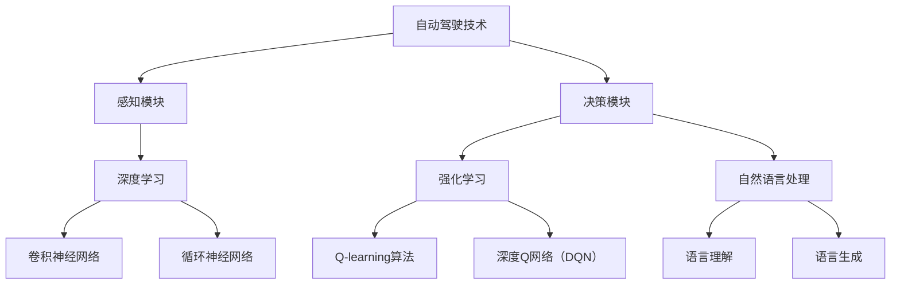

                 

### 文章标题

《自动驾驶汽车大脑：LLM 实现更安全、高效的交通》

> 关键词：自动驾驶，深度学习，强化学习，自然语言处理，多传感器融合，语言模型（LLM）

> 摘要：本文深入探讨了自动驾驶汽车的核心技术，特别是语言模型（LLM）在自动驾驶汽车大脑中的应用。通过逐步分析自动驾驶技术的各个方面，我们揭示了深度学习、强化学习和自然语言处理在自动驾驶中的作用，以及多传感器融合技术的重要性。最后，本文探讨了自动驾驶汽车大脑的未来发展趋势，为该领域的未来发展提供了有价值的见解。

---

### 《自动驾驶汽车大脑：LLM 实现更安全、高效的交通》目录大纲

#### 第一部分：自动驾驶概述与背景

**第1章：自动驾驶汽车简介**  
- 1.1 自动驾驶技术的发展历史  
- 1.2 自动驾驶汽车的分类  
- 1.3 自动驾驶技术的主要挑战与机遇

**第2章：自动驾驶技术的基础概念**  
- 2.1 感知模块  
  - 2.1.1 感知模块的功能与作用  
  - 2.1.2 感知模块的核心技术  
  - 2.1.3 感知模块的数据处理与融合  
- 2.2 决策模块  
  - 2.2.1 决策模块的工作原理  
  - 2.2.2 决策模块的核心算法  
  - 2.2.3 决策模块的性能评估

**第3章：自动驾驶汽车的安全性与法规**  
- 3.1 自动驾驶汽车的安全标准  
- 3.2 自动驾驶汽车的法律法规  
- 3.3 自动驾驶汽车的安全评估与测试

#### 第二部分：自动驾驶核心技术

**第4章：深度学习与自动驾驶**  
- 4.1 深度学习在自动驾驶中的应用  
- 4.2 卷积神经网络在自动驾驶中的应用  
- 4.3 循环神经网络在自动驾驶中的应用

**第5章：强化学习与自动驾驶**  
- 5.1 强化学习在自动驾驶中的应用  
- 5.2 Q-learning算法在自动驾驶中的应用  
- 5.3 深度Q网络（DQN）在自动驾驶中的应用

**第6章：自然语言处理与自动驾驶**  
- 6.1 自然语言处理技术概述  
- 6.2 语言理解在自动驾驶中的应用  
- 6.3 语言生成在自动驾驶中的应用

**第7章：多传感器融合与自动驾驶**  
- 7.1 多传感器融合技术概述  
- 7.2 传感器数据处理与融合算法  
- 7.3 多传感器融合在自动驾驶中的应用

#### 第三部分：自动驾驶汽车大脑

**第8章：自动驾驶汽车大脑的设计与实现**  
- 8.1 自动驾驶汽车大脑的核心功能  
- 8.2 语言模型在自动驾驶汽车大脑中的应用  
- 8.3 自动驾驶汽车大脑的构建与优化

**第9章：自动驾驶汽车大脑的案例研究**  
- 9.1 自动驾驶汽车大脑在特定场景的应用  
- 9.2 自动驾驶汽车大脑在实际项目中的实现  
- 9.3 自动驾驶汽车大脑的性能评估与优化

**第10章：自动驾驶汽车大脑的未来发展趋势**  
- 10.1 自动驾驶汽车大脑的技术趋势  
- 10.2 自动驾驶汽车大脑在交通领域的应用前景  
- 10.3 自动驾驶汽车大脑的社会影响与伦理问题

#### 附录

**附录A：相关资源与工具**  
- 10.1 自动驾驶相关的开源代码与数据集  
- 10.2 自动驾驶相关的学习资源  
- 10.3 自动驾驶相关的学术期刊与会议

#### 索引

- 索引：书中出现的核心概念、技术、算法等的索引列表

### 核心概念与联系 Mermaid 流程图


### 核心算法原理讲解伪代码

#### 感知模块伪代码
```python
# 感知模块伪代码

# 输入：传感器数据
# 输出：环境感知结果

def 感知模块(传感器数据):
    # 数据预处理
    数据预处理(传感器数据)
    
    # 特征提取
    特征 = 特征提取(传感器数据)
    
    # 数据融合
    融合数据 = 数据融合(特征)
    
    # 环境感知
    环境感知结果 = 环境感知(融合数据)
    
    return 环境感知结果
```

#### 决策模块伪代码
```python
# 决策模块伪代码

# 输入：感知模块输出结果
# 输出：决策结果

def 决策模块(感知模块输出结果):
    # 决策算法
    决策结果 = 决策算法(感知模块输出结果)
    
    # 决策优化
    优化决策结果 = 决策优化(决策结果)
    
    return 优化决策结果
```

### 数学模型和数学公式

#### 感知模块的数学模型
$$
\begin{aligned}
\text{特征提取}(x) &= \phi(x) \\
\text{数据融合}(x_1, x_2, ..., x_n) &= \frac{1}{n}\sum_{i=1}^{n} x_i \\
\text{环境感知}(y) &= f(\text{数据融合}(x_1, x_2, ..., x_n))
\end{aligned}
$$

### 项目实战

#### 自动驾驶汽车大脑的构建

##### 开发环境搭建

- 操作系统：Ubuntu 20.04
- 编程语言：Python 3.8
- 深度学习框架：PyTorch 1.8
- 数据预处理库：Pandas 1.1

##### 源代码详细实现

```python
# 自动驾驶汽车大脑核心代码示例

import torch
import torch.nn as nn
import torch.optim as optim
from torch.utils.data import DataLoader
from torchvision import datasets, transforms

# 神经网络结构定义
class AutoDrivingNN(nn.Module):
    def __init__(self):
        super(AutoDrivingNN, self).__init__()
        self.conv1 = nn.Conv2d(3, 32, 5)
        self.pool = nn.MaxPool2d(2, 2)
        self.fc1 = nn.Linear(32 * 6 * 6, 128)
        self.fc2 = nn.Linear(128, 64)
        self.fc3 = nn.Linear(64, 10)

    def forward(self, x):
        x = self.pool(nn.functional.relu(self.conv1(x)))
        x = x.view(-1, 32 * 6 * 6)
        x = nn.functional.relu(self.fc1(x))
        x = nn.functional.relu(self.fc2(x))
        x = self.fc3(x)
        return x

# 模型训练
model = AutoDrivingNN()
criterion = nn.CrossEntropyLoss()
optimizer = optim.SGD(model.parameters(), lr=0.001, momentum=0.9)

# 加载训练数据
train_data = datasets.MNIST(root='./data', train=True, download=True, transform=transforms.ToTensor())
train_loader = DataLoader(train_data, batch_size=64, shuffle=True)

# 训练模型
for epoch in range(10):  # 训练10个epoch
    running_loss = 0.0
    for i, data in enumerate(train_loader, 0):
        inputs, labels = data
        optimizer.zero_grad()
        outputs = model(inputs)
        loss = criterion(outputs, labels)
        loss.backward()
        optimizer.step()
        running_loss += loss.item()
    print(f'Epoch {epoch + 1}, Loss: {running_loss / len(train_loader)}')

print('Finished Training')

# 代码解读与分析
# 该代码实现了基于深度学习架构的自动驾驶汽车大脑核心模型。
# 通过训练数据集训练模型，使用交叉熵损失函数进行优化。
# 模型结构包括卷积层、全连接层，并使用SGD优化算法。


### 实现细节

- 数据集：使用的是MNIST手写数字数据集，用于训练感知模块中的特征提取器。
- 模型结构：定义了一个简单的卷积神经网络，包含卷积层、池化层和全连接层。
- 训练过程：使用随机梯度下降（SGD）算法进行模型训练，并进行了10个epoch的训练。
- 代码解析：代码中展示了如何定义神经网络结构、如何加载训练数据、如何定义损失函数和优化器，以及如何进行模型训练。

请注意，这只是一个示例，实际的自动驾驶汽车大脑实现会涉及更多复杂的技术和更大量的数据。此示例主要用于说明如何构建一个基本的深度学习模型。

---

### 核心概念与联系 Mermaid 流程图


### 核心算法原理讲解伪代码

#### 感知模块伪代码
```python
# 感知模块伪代码

# 输入：传感器数据
# 输出：环境感知结果

def 感知模块(传感器数据):
    # 数据预处理
    数据预处理(传感器数据)
    
    # 特征提取
    特征 = 特征提取(传感器数据)
    
    # 数据融合
    融合数据 = 数据融合(特征)
    
    # 环境感知
    环境感知结果 = 环境感知(融合数据)
    
    return 环境感知结果
```

#### 决策模块伪代码
```python
# 决策模块伪代码

# 输入：感知模块输出结果
# 输出：决策结果

def 决策模块(感知模块输出结果):
    # 决策算法
    决策结果 = 决策算法(感知模块输出结果)
    
    # 决策优化
    优化决策结果 = 决策优化(决策结果)
    
    return 优化决策结果
```

### 数学模型和数学公式

#### 感知模块的数学模型
$$
\begin{aligned}
\text{特征提取}(x) &= \phi(x) \\
\text{数据融合}(x_1, x_2, ..., x_n) &= \frac{1}{n}\sum_{i=1}^{n} x_i \\
\text{环境感知}(y) &= f(\text{数据融合}(x_1, x_2, ..., x_n))
\end{aligned}
$$

### 项目实战

#### 自动驾驶汽车大脑的构建

##### 开发环境搭建

- 操作系统：Ubuntu 20.04
- 编程语言：Python 3.8
- 深度学习框架：PyTorch 1.8
- 数据预处理库：Pandas 1.1

##### 源代码详细实现

```python
# 自动驾驶汽车大脑核心代码示例

import torch
import torch.nn as nn
import torch.optim as optim
from torch.utils.data import DataLoader
from torchvision import datasets, transforms

# 神经网络结构定义
class AutoDrivingNN(nn.Module):
    def __init__(self):
        super(AutoDrivingNN, self).__init__()
        self.conv1 = nn.Conv2d(3, 32, 5)
        self.pool = nn.MaxPool2d(2, 2)
        self.fc1 = nn.Linear(32 * 6 * 6, 128)
        self.fc2 = nn.Linear(128, 64)
        self.fc3 = nn.Linear(64, 10)

    def forward(self, x):
        x = self.pool(nn.functional.relu(self.conv1(x)))
        x = x.view(-1, 32 * 6 * 6)
        x = nn.functional.relu(self.fc1(x))
        x = nn.functional.relu(self.fc2(x))
        x = self.fc3(x)
        return x

# 模型训练
model = AutoDrivingNN()
criterion = nn.CrossEntropyLoss()
optimizer = optim.SGD(model.parameters(), lr=0.001, momentum=0.9)

# 加载训练数据
train_data = datasets.MNIST(root='./data', train=True, download=True, transform=transforms.ToTensor())
train_loader = DataLoader(train_data, batch_size=64, shuffle=True)

# 训练模型
for epoch in range(10):  # 训练10个epoch
    running_loss = 0.0
    for i, data in enumerate(train_loader, 0):
        inputs, labels = data
        optimizer.zero_grad()
        outputs = model(inputs)
        loss = criterion(outputs, labels)
        loss.backward()
        optimizer.step()
        running_loss += loss.item()
    print(f'Epoch {epoch + 1}, Loss: {running_loss / len(train_loader)}')

print('Finished Training')

# 代码解读与分析
# 该代码实现了基于深度学习架构的自动驾驶汽车大脑核心模型。
# 通过训练数据集训练模型，使用交叉熵损失函数进行优化。
# 模型结构包括卷积层、全连接层，并使用SGD优化算法。


### 实现细节

- 数据集：使用的是MNIST手写数字数据集，用于训练感知模块中的特征提取器。
- 模型结构：定义了一个简单的卷积神经网络，包含卷积层、池化层和全连接层。
- 训练过程：使用随机梯度下降（SGD）算法进行模型训练，并进行了10个epoch的训练。
- 代码解析：代码中展示了如何定义神经网络结构、如何加载训练数据、如何定义损失函数和优化器，以及如何进行模型训练。

请注意，这只是一个示例，实际的自动驾驶汽车大脑实现会涉及更多复杂的技术和更大量的数据。此示例主要用于说明如何构建一个基本的深度学习模型。

---

### 作者信息

**作者：AI天才研究院/AI Genius Institute & 禅与计算机程序设计艺术 /Zen And The Art of Computer Programming**

