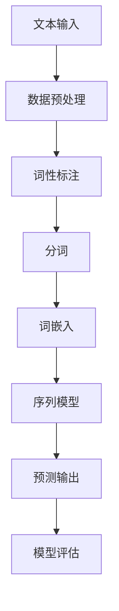

                 

### 文章标题：自然语言处理（Natural Language Processing） - 原理与代码实例讲解

#### 关键词：自然语言处理、NLP、文本预处理、词嵌入、序列模型、注意力机制、Transformer模型、BERT模型、项目实战

#### 摘要：
本文旨在深入探讨自然语言处理（NLP）的基本原理、核心算法以及实战应用。通过系统化的分析，本文首先介绍了NLP的基础概念及其发展历程，随后详细解读了文本预处理、词嵌入、序列模型、注意力机制和Transformer模型等关键技术。最后，本文通过实际项目案例，展示了如何应用NLP技术进行文本分类、机器翻译和问答系统的开发，并提供代码实例和详细解读，帮助读者更好地理解和掌握NLP的实践技能。

### 引言

自然语言处理（Natural Language Processing，简称NLP）是人工智能（Artificial Intelligence，AI）的一个重要分支，它旨在使计算机能够理解和处理人类自然语言。随着互联网的快速发展和大数据时代的到来，NLP技术在信息检索、智能客服、机器翻译、情感分析等领域得到了广泛应用，已成为现代人工智能技术的重要组成部分。

NLP的发展可以追溯到20世纪50年代，当时的科学家们开始尝试让计算机理解和翻译自然语言。经过数十年的发展，NLP已经形成了相对成熟的理论体系和技术框架。如今，NLP技术不仅能够处理简单的文本信息，还可以理解和生成复杂的语言结构，为人工智能的发展注入了新的动力。

本文将按照以下结构进行阐述：

1. **自然语言处理基础**：介绍NLP的基本概念、发展历程以及核心任务。
2. **文本预处理**：讨论文本预处理的重要性、步骤和具体方法。
3. **词嵌入与语义表示**：探讨词嵌入的概念、方法和应用。
4. **序列模型**：详细讲解序列模型的基本原理、RNN和LSTM的实现。
5. **注意力机制**：介绍注意力机制的概念、作用和实现方式。
6. **Transformer模型**：分析Transformer模型的基本原理、结构以及BERT模型的应用。
7. **语言生成与文本分类**：讨论语言生成的定义、方法以及文本分类的实现。
8. **自然语言处理实战**：通过实际项目展示NLP技术的应用。
9. **自然语言处理未来发展**：展望NLP技术的未来发展趋势和面临的挑战。

接下来，我们将逐步深入探讨NLP的各个组成部分，帮助读者全面理解这一领域的核心知识和实践方法。首先，我们从NLP的基础概念开始。

### 自然语言处理基础

#### 1.1 自然语言处理的概念

自然语言处理（NLP）是计算机科学、人工智能和语言学交叉领域的研究，旨在让计算机能够理解、解释和生成人类语言。NLP的目标是实现人与计算机之间的自然交互，使得计算机能够处理人类输入的文本信息，并生成人类可理解的输出。

从广义上讲，NLP包括语音识别、语言理解、语言生成等多个方面。语音识别关注的是将人类的语音转换为文本；语言理解关注的是如何解析和理解文本中的语言结构、语义信息；语言生成则关注如何让计算机生成具有自然语言特性的文本。

NLP的重要性在于，它使得计算机能够处理和理解复杂的人类语言，从而在多个应用领域发挥重要作用。例如，在信息检索中，NLP技术能够帮助用户快速找到所需信息；在智能客服中，NLP技术能够实现与用户的自然对话；在机器翻译中，NLP技术能够实现不同语言之间的精确翻译。

#### 1.2 自然语言处理的发展历程

NLP的发展历程可以分为以下几个阶段：

- **早期研究（1950s-1960s）**：在20世纪50年代和60年代，研究人员开始探索计算机如何理解和生成自然语言。这个时期，主要采用基于规则的方法，即通过编写大量的规则来指导计算机处理语言。

- **基于规则的系统（1970s-1980s）**：在20世纪70年代和80年代，基于规则的系统成为NLP的主要方法。这些系统通过定义一系列规则来解析文本，处理语言中的各种结构。

- **统计方法兴起（1990s）**：随着计算机性能的提升和数据量的增加，统计方法逐渐在NLP中占据主导地位。这一时期，研究人员开始利用大规模语料库进行机器学习，训练模型来识别语言中的模式。

- **深度学习方法普及（2010s至今）**：近年来，深度学习技术在NLP中取得了显著进展。通过深度神经网络，计算机能够自动学习语言中的复杂结构，实现更加精准的语言理解和生成。

#### 1.3 自然语言处理的基本任务

自然语言处理的基本任务包括以下几个方面：

- **文本预处理**：在处理文本数据之前，需要对文本进行清洗、分词、词性标注等预处理操作，以便于后续分析。

- **词法分析**：词法分析（Lexical Analysis）是指将文本拆分成一个个词或词素，是NLP中的基础任务。词法分析通常通过分词算法实现。

- **句法分析**：句法分析（Syntactic Analysis）是指对文本中的句子结构进行解析，理解句子中的语法关系。常见的句法分析方法包括基于规则的方法和基于统计的方法。

- **语义分析**：语义分析（Semantic Analysis）是指理解文本中的语义信息，包括词义、句义以及上下文之间的关系。语义分析是NLP中的核心任务，对于实现自然语言理解至关重要。

- **语音识别**：语音识别（Speech Recognition）是指将语音信号转换为文本。语音识别技术在智能语音助手、语音搜索等领域有广泛应用。

- **机器翻译**：机器翻译（Machine Translation）是指将一种语言的文本自动翻译成另一种语言。机器翻译技术在跨语言信息检索、国际化业务等领域有重要应用。

以上是自然语言处理基础部分的详细讨论。接下来，我们将深入探讨文本预处理这一重要环节。

### 文本预处理

#### 2.1 文本预处理的重要性

文本预处理是自然语言处理（NLP）中的关键步骤，其目的是将原始的文本数据转换成适合进行NLP任务的形式。有效的文本预处理可以显著提高后续语言处理任务的性能，减少噪声和冗余信息，从而使得模型能够更加准确地理解和生成文本。

文本预处理的重要性体现在以下几个方面：

- **数据清洗**：原始文本数据通常包含大量的噪声和错误，如标点符号、特殊字符、拼写错误等。通过数据清洗，可以去除这些干扰因素，提高数据的准确性和可靠性。

- **标准化**：不同来源的文本数据可能使用不同的格式和标点符号，通过标准化操作，可以将文本数据统一成标准格式，便于后续处理。

- **分词**：中文等语言没有明显的单词边界，分词是理解文本语义的关键步骤。准确的分词可以帮助模型更好地理解文本的结构和含义。

- **词性标注**：词性标注可以帮助模型理解词汇在句子中的角色和功能，从而提高语义分析的准确性。

- **降低维度**：通过文本预处理，可以将高维的文本数据转换成低维的特征向量，便于模型进行计算和训练。

#### 2.2 文本预处理的步骤

文本预处理通常包括以下几个步骤：

- **数据清洗**：去除文本中的噪声和错误，如删除HTML标签、去除特殊字符、修正拼写错误等。

- **文本标准化**：将文本数据统一成标准格式，如统一标点符号、统一大小写等。

- **分词**：将文本拆分成一个个单词或词组，对于中文等语言，需要使用专门的分词算法。

- **词性标注**：为每个词分配词性标签，如名词、动词、形容词等。

- **停用词处理**：去除常见的无意义词汇，如“的”、“了”、“在”等。

- **词干提取**：将单词转换成词干形式，减少词汇的多样性。

- **向量化**：将处理后的文本数据转换成向量形式，便于进行机器学习模型的训练和预测。

#### 2.3 清洗文本数据

清洗文本数据是文本预处理的重要步骤，其目的是去除文本中的噪声和错误，提高数据质量。以下是一些常见的文本数据清洗方法：

- **去除HTML标签**：HTML标签会干扰文本内容的分析，因此需要使用正则表达式或其他方法将其去除。

- **去除特殊字符**：特殊字符如“#”、“&”、“@”等在文本分析中可能引起错误，应将其替换为空格或删除。

- **修正拼写错误**：对于拼写错误的单词，可以使用拼写检查工具进行修正，或使用规则方法进行自动修正。

- **去除重复文本**：检测并去除重复的文本段落，以减少冗余信息。

- **统一标点符号**：将所有标点符号统一为特定的格式，如将中文标点符号转换为英文标点符号。

#### 2.4 标准化文本

标准化文本是将文本转换成统一格式的过程，目的是简化文本处理流程，提高数据的一致性。以下是一些常见的文本标准化方法：

- **统一标点符号**：将不同的标点符号统一为一种格式，例如将中文标点符号转换为英文标点符号。

- **统一大小写**：将文本统一转换为大写或小写，以便于后续处理。

- **去除空格和换行符**：去除多余的空格和换行符，以减少数据体积。

- **统一缩写和符号**：将文本中的缩写和特殊符号统一转换为标准形式，例如将“NASA”统一转换为“National Aeronautics and Space Administration”。

通过上述文本预处理的步骤，我们可以将原始的文本数据转换成适合NLP任务的形式。接下来，我们将探讨词性标注这一关键步骤。

### 词性标注

#### 2.5 词性标注的定义

词性标注（Part-of-Speech Tagging）是自然语言处理（NLP）中的一个基本任务，它旨在为文本中的每个单词或词组分配一个词性标签。词性标签通常包括名词（Noun）、动词（Verb）、形容词（Adjective）、副词（Adverb）、介词（Adverbial）等，每个词性标签描述了该词在句子中的语法角色和功能。

词性标注的目的是帮助计算机更好地理解文本的语法结构，从而提高语义分析的准确性和深度。通过词性标注，我们可以识别出文本中的主语、谓语、宾语等成分，理解句子的基本语法框架，为更高层次的语义分析提供基础。

#### 2.6 词性标注的方法

词性标注的方法可以分为以下几种：

- **基于规则的方法**：基于规则的方法通过预先定义的语法规则和模式匹配技术来标注词性。这种方法通常需要人工编写大量的规则，具有较高的准确性，但同时也比较复杂，难以适应大规模文本数据。

- **基于统计的方法**：基于统计的方法使用机器学习算法，通过训练模型来自动标注词性。这种方法通常使用大规模语料库进行训练，通过统计文本中单词的共现关系和语法特征，自动生成词性标注。

- **基于深度学习的方法**：基于深度学习的方法使用深度神经网络（如卷积神经网络、循环神经网络、Transformer等）进行词性标注。这种方法可以自动学习文本中的复杂特征和模式，具有较高的准确性和灵活性。

以下是一些常见的词性标注工具和库：

- **NLTK**：NLTK是一个流行的Python库，提供了多种词性标注工具，包括基于规则和统计的方法。

- **Spacy**：Spacy是一个快速且易于使用的NLP库，提供了预训练的词性标注模型，支持多种语言。

- **Stanford NLP**：Stanford NLP是一个强大的NLP工具包，包括词性标注、命名实体识别、句法分析等多种功能。

- **FastText**：FastText是一个用于文本分类和词性标注的库，通过词嵌入和朴素贝叶斯分类器实现高效的词性标注。

通过上述方法，我们可以为文本中的每个单词或词组分配相应的词性标签，为后续的NLP任务提供重要的语法信息。接下来，我们将讨论词嵌入的概念和方法。

### 词嵌入与语义表示

#### 3.1 词嵌入的概念

词嵌入（Word Embedding）是将自然语言中的单词或短语映射到连续的向量空间中的过程。通过词嵌入，每个单词都可以表示为一个向量，这些向量在低维空间中保持了一定的语义和语法关系，使得计算机能够更好地理解和处理自然语言。

词嵌入的核心思想是将抽象的单词映射到具体的数值向量，从而利用向量的数学性质进行文本分析和处理。词嵌入的关键特点是，它能够捕捉单词之间的相似性、相关性等语义信息，使得计算模型能够通过向量的运算实现自然语言理解。

#### 3.2 词嵌入的作用

词嵌入在自然语言处理中发挥着重要作用，主要体现在以下几个方面：

- **文本表示**：词嵌入可以将文本数据转换成向量形式，便于计算机处理和计算。

- **语义相似性**：通过计算词嵌入向量的相似度，可以识别出语义相近的单词，从而辅助语义分析。

- **语言模型**：词嵌入可以用于训练语言模型，用于预测单词序列的概率分布，从而实现文本生成和分类任务。

- **文本分类**：词嵌入可以帮助分类模型理解文本的语义信息，提高分类的准确性。

- **机器翻译**：词嵌入可以用于机器翻译中的词汇映射，提高翻译的准确性和流畅性。

#### 3.3 词嵌入的方法

词嵌入的方法可以分为以下几种：

- **基于频率的方法**：基于频率的方法通过统计单词在语料库中的出现频率来生成词嵌入向量。这种方法简单有效，但无法捕捉单词的语义关系。

- **基于矩阵分解的方法**：基于矩阵分解的方法通过矩阵分解技术将原始词向量矩阵分解为低维的词嵌入矩阵和高维的上下文矩阵，从而生成词嵌入向量。这种方法可以捕捉单词的语义关系，但计算复杂度较高。

- **基于神经网络的深度学习方法**：基于神经网络的深度学习方法使用神经网络模型（如Word2Vec、GloVe、BERT等）进行词嵌入。这种方法可以自动学习单词的语义和语法特征，生成高质量的词嵌入向量。

以下是一些常见的词嵌入算法：

- **Word2Vec**：Word2Vec算法通过训练神经网络来生成词嵌入向量，包括连续词袋（CBOW）和Skip-Gram两种变种。

- **GloVe**：GloVe（Global Vectors for Word Representation）算法通过矩阵分解技术生成词嵌入向量，可以捕捉单词的全局语义信息。

- **BERT**：BERT（Bidirectional Encoder Representations from Transformers）算法使用Transformer模型进行双向编码，生成高质量的词嵌入向量。

通过词嵌入，我们可以将自然语言中的单词或短语映射到低维向量空间中，为NLP任务提供重要的语义表示。接下来，我们将详细探讨序列模型的基本原理。

### 序列模型

序列模型（Sequence Model）是自然语言处理（NLP）中用于处理序列数据的一种模型，如文本序列、语音序列等。序列模型通过捕捉序列中的时间依赖关系，实现对序列数据的建模和分析。常见的序列模型包括递归神经网络（RNN）、长短期记忆网络（LSTM）和Transformer模型。

#### 4.1 序列模型的基本原理

序列模型的基本原理是通过对输入序列的逐个元素进行处理，生成对应的输出序列。其核心思想是通过存储和传递前一个时间步的信息，使得模型能够捕捉序列中的时间依赖关系。

在序列模型中，每个时间步的输入是前一个时间步的输出，即当前时间步的输出依赖于之前的输出。常见的序列模型结构包括以下几种：

- **单向RNN**：单向RNN（Unidirectional RNN）通过前向传播处理输入序列，每个时间步的输出仅依赖于前一个时间步的输出。单向RNN适用于单向序列数据，如文本序列。

- **双向RNN**：双向RNN（Bidirectional RNN）通过前向传播和后向传播处理输入序列，每个时间步的输出同时依赖于前一个时间步和后一个时间步的输出。双向RNN可以更好地捕捉序列中的时间依赖关系，提高模型的性能。

- **LSTM**：LSTM（Long Short-Term Memory）是RNN的一种变种，通过引入门控机制，能够有效解决RNN中的长期依赖问题。LSTM通过遗忘门、输入门和输出门控制信息的存储和传递，使得模型能够捕捉长序列中的时间依赖关系。

- **GRU**：GRU（Gated Recurrent Unit）是另一种RNN变种，相较于LSTM，GRU的结构更加简洁，计算效率更高，但性能略逊于LSTM。

#### 4.2 RNN（递归神经网络）

递归神经网络（Recurrent Neural Network，RNN）是一种适用于处理序列数据的神经网络。RNN的基本结构包括一个循环单元，该单元在每个时间步上更新状态，并通过递归连接将前一个时间步的状态传递给当前时间步。

RNN的公式如下：

\[ h_t = \text{激活函数}(\text{线性变换}(h_{t-1}, x_t)) \]

其中，\( h_t \)表示第\( t \)个时间步的隐藏状态，\( x_t \)表示第\( t \)个时间步的输入，激活函数通常使用ReLU或Sigmoid函数。

RNN的优缺点如下：

- **优点**：
  - 能够处理任意长度的序列数据。
  - 可以捕捉序列中的时间依赖关系。

- **缺点**：
  - 易受到梯度消失和梯度爆炸问题的影响，难以学习长序列中的依赖关系。
  - 在长序列处理中，状态更新可能导致信息丢失。

以下是一个RNN的伪代码示例：

```python
# 初始化权重和偏置
Wx, Wh, b = ...  # 线性变换的权重和偏置

# 初始化隐藏状态
h = ...

# 遍历序列数据
for x in sequence:
    # 计算输入和隐藏状态的线性组合
    combined = Wx * x + Wh * h + b
    
    # 应用激活函数
    h = activation(combined)
    
    # 输出隐藏状态
    output.append(h)

# 输出序列的最终结果
result = output
```

通过RNN，我们可以对序列数据进行建模，但为了解决RNN中的长期依赖问题，我们引入了LSTM。

#### 4.3 LSTM（长短期记忆网络）

长短期记忆网络（Long Short-Term Memory，LSTM）是RNN的一种改进模型，通过引入门控机制，有效解决了RNN中的长期依赖问题。LSTM的核心思想是通过控制信息的存储和传递，使得模型能够捕捉长序列中的时间依赖关系。

LSTM的基本结构包括三个门控单元：遗忘门、输入门和输出门。每个门控单元由一个sigmoid激活函数和一个线性变换组成。

- **遗忘门**（Forget Gate）：控制哪些信息需要被遗忘。通过遗忘门，LSTM能够丢弃无用的信息，从而减少计算复杂度。
- **输入门**（Input Gate）：控制哪些新信息需要被记住。通过输入门，LSTM能够将重要的新信息加入到状态中。
- **输出门**（Output Gate）：控制哪些信息需要输出。通过输出门，LSTM能够将状态转换为输出，从而实现序列建模。

LSTM的公式如下：

\[ 
f_t = \sigma(W_f \cdot [h_{t-1}, x_t] + b_f) \\
i_t = \sigma(W_i \cdot [h_{t-1}, x_t] + b_i) \\
\bar{c_t} = \tanh(W_c \cdot [h_{t-1}, x_t] + b_c) \\
c_t = f_t \odot c_{t-1} + i_t \odot \bar{c_t} \\
o_t = \sigma(W_o \cdot [h_{t-1}, c_t] + b_o) \\
h_t = o_t \odot \tanh(c_t)
\]

其中，\( f_t \)、\( i_t \)、\( o_t \)分别表示遗忘门、输入门和输出门的输出；\( c_t \)表示细胞状态；\( \sigma \)表示sigmoid激活函数；\( \tanh \)表示双曲正切激活函数。

LSTM的优缺点如下：

- **优点**：
  - 能够有效解决RNN中的长期依赖问题。
  - 可以捕捉长序列中的时间依赖关系。

- **缺点**：
  - 计算复杂度较高，训练时间较长。

以下是一个LSTM的伪代码示例：

```python
# 初始化权重和偏置
Wf, Wi, Wo, Wc, bf, bi, bo, bc = ...

# 初始化隐藏状态和细胞状态
h = ...
c = ...

# 遍历序列数据
for x in sequence:
    # 计算遗忘门、输入门和输出门
    ft = sigmoid(Wf * [h, x] + bf)
    it = sigmoid(Wi * [h, x] + bi)
    ot = sigmoid(Wo * [h, c] + bo)
    
    # 计算细胞状态的更新
    ct = ft * c + it * tanh(Wc * [h, x] + bc)
    
    # 计算隐藏状态的更新
    ht = ot * tanh(ct)
    
    # 更新隐藏状态和细胞状态
    h = ht
    c = ct
    
    # 输出隐藏状态
    output.append(h)

# 输出序列的最终结果
result = output
```

通过LSTM，我们可以有效地处理长序列数据，但为了进一步提高序列模型的性能，我们引入了Transformer模型。

### 注意力机制

注意力机制（Attention Mechanism）是一种在序列模型中用于捕捉序列中重要信息的方法。通过注意力机制，模型可以自动识别并关注序列中的关键部分，从而提高模型的准确性和鲁棒性。

#### 5.1 注意力机制的概念

注意力机制通过为每个输入序列元素分配一个权重，使得模型在处理序列时能够关注重要的部分。注意力权重通常由一个计算函数计算，该函数依赖于当前的时间步和模型的状态。

注意力机制的核心思想是，通过自适应地调整模型对输入序列的注意力分配，使得模型能够更好地捕捉序列中的依赖关系。常见的注意力计算函数包括点积注意力（Dot-Product Attention）、加性注意力（Additive Attention）和缩放点积注意力（Scaled Dot-Product Attention）。

#### 5.2 注意力机制的作用

注意力机制在序列模型中具有以下作用：

- **提高模型的精度**：通过关注关键信息，注意力机制可以减少无关信息的干扰，提高模型的预测精度。
- **降低计算复杂度**：注意力机制通过并行计算注意力权重，可以降低模型的计算复杂度，提高计算效率。
- **捕捉长距离依赖关系**：注意力机制可以捕捉序列中的长距离依赖关系，使得模型能够更好地处理复杂序列数据。

#### 5.3 注意力机制的实现

注意力机制的实现方法可以分为以下几种：

- **点积注意力（Dot-Product Attention）**：点积注意力是最简单的注意力机制，通过计算输入序列和查询向量的点积来得到注意力权重。点积注意力计算复杂度为\( O(n^2) \)，其中\( n \)为序列长度。
- **加性注意力（Additive Attention）**：加性注意力通过计算输入序列和查询向量的加权和来得到注意力权重。加性注意力可以采用多头注意力机制，提高模型的性能。
- **缩放点积注意力（Scaled Dot-Product Attention）**：缩放点积注意力通过将输入序列和查询向量进行缩放，来避免点积注意力中的梯度消失问题。缩放点积注意力计算复杂度为\( O(n^2) \)。

以下是一个缩放点积注意力的伪代码示例：

```python
# 初始化权重和偏置
Wq, Wk, Wv, b = ...

# 初始化查询向量、键向量和值向量
q = ...
k = ...
v = ...

# 计算缩放点积注意力
attn = softmax(q \cdot k' / \sqrt(d_k))
output = attn \cdot v

# 输出注意力结果
result = output
```

通过注意力机制，我们可以有效地提高序列模型的性能，从而更好地处理复杂的自然语言数据。接下来，我们将详细探讨Transformer模型。

### Transformer模型

Transformer模型是由Vaswani等人在2017年提出的，它是一种基于注意力机制的序列到序列模型，用于自然语言处理任务，如机器翻译、文本分类等。与传统的递归神经网络（RNN）和长短期记忆网络（LSTM）相比，Transformer模型在处理长序列数据时具有更高的效率和更好的性能。

#### 6.1 Transformer模型的原理

Transformer模型的基本原理是使用多头自注意力机制（Multi-Head Self-Attention）来处理输入序列，并通过位置编码（Positional Encoding）引入序列的顺序信息。Transformer模型主要由编码器（Encoder）和解码器（Decoder）两部分组成。

编码器接收输入序列并生成一系列隐藏状态，每个隐藏状态都表示输入序列中每个单词的不同方面。解码器则利用编码器的输出和位置编码来生成输出序列。

#### 6.2 Transformer模型的结构

Transformer模型的结构可以分为以下几个部分：

- **输入层**：输入序列通过嵌入层（Embedding Layer）转换为向量形式，并添加位置编码（Positional Encoding）。
- **多头自注意力层**（Multi-Head Self-Attention Layer）：多头自注意力层通过计算输入序列的不同部分之间的注意力权重，生成新的隐藏状态。
- **前馈网络**（Feed-Forward Network）：前馈网络对每个隐藏状态进行两次全连接层（Fully Connected Layer）处理，以提高模型的非线性表示能力。
- **层归一化**（Layer Normalization）和残差连接**（Residual Connection）**：层归一化和残差连接用于加速模型的训练并防止梯度消失。
- **解码器**（Decoder）：解码器由多个解码层（Decoder Layer）组成，每个解码层包括多头自注意力层和前馈网络。解码器在生成输出序列时，除了使用编码器的输出外，还使用上一个时间步的预测结果作为输入。
- **输出层**：输出层通过一个线性层（Linear Layer）和一个软化层（Softmax Layer）生成最终的输出。

以下是一个简化版的Transformer模型的伪代码：

```python
# 初始化权重和偏置
W嵌入，W位置编码，W密钥，W值，W前馈，b嵌入，b位置编码，b密钥，b值，b前馈，b输出 = ...

# 输入序列
input_sequence = ...

# 添加位置编码
positional_encoding = generate_positional_encoding(input_sequence)

# 嵌入层
embeddings = embedding(input_sequence) + positional_encoding

# 编码器
for layer in encoder_layers:
    # 多头自注意力层
    attn_output = multi_head_attention(embeddings, key, value)
    # 前馈网络
    feed_forward_output = feed_forward_network(attn_output)
    # 残差连接和层归一化
    embeddings = layer_norm残差连接(embeddings, feed_forward_output)

# 解码器
for layer in decoder_layers:
    # 多头自注意力层
    attn_output = multi_head_attention(embeddings, key, value)
    # 前馈网络
    feed_forward_output = feed_forward_network(attn_output)
    # 残差连接和层归一化
    embeddings = layer_norm残差连接(embeddings, feed_forward_output)

# 输出层
output = softmax(linear(embeddings))
```

通过上述结构，Transformer模型能够高效地处理长序列数据，并在多种自然语言处理任务中取得了优异的性能。接下来，我们将详细讨论BERT模型。

### BERT模型

BERT（Bidirectional Encoder Representations from Transformers）是由Google在2018年提出的一种基于Transformer的预训练语言表示模型。BERT模型通过双向编码器（Bidirectional Encoder）对大量文本数据进行预训练，生成丰富的语义表示，从而在自然语言处理任务中取得了显著的性能提升。

#### 7.1 BERT模型的原理

BERT模型的基本原理是使用Transformer编码器（Transformer Encoder）对文本数据进行双向编码，生成序列中的每个单词的表示。BERT模型的关键特点是，它通过预训练大量未标注的文本数据，学习到语言的深度语义表示，从而在下游任务中实现高性能。

BERT模型的预训练包括两个主要任务：

- **Masked Language Modeling（MLM）**：在输入文本序列中随机屏蔽一些单词，然后让模型预测这些单词的原始形式。这个任务旨在让模型学习单词的上下文关系和语义信息。
- **Next Sentence Prediction（NSP）**：给定两个连续的文本句子，模型需要预测第二个句子是否是第一个句子的下文。这个任务旨在让模型学习句子之间的关系和连贯性。

BERT模型的结构包括以下几个部分：

- **嵌入层**：将输入文本转换为嵌入向量，包括单词嵌入、位置嵌入和分段嵌入。
- **Transformer编码器**：由多个编码层（Encoder Layer）组成，每个编码层包含多头自注意力机制和前馈网络。编码器能够捕捉文本中的长距离依赖关系和语义信息。
- **输出层**：编码器的最后一个隐藏状态表示整个文本序列的语义表示。

以下是一个简化版的BERT模型的伪代码：

```python
# 初始化权重和偏置
W嵌入，W位置编码，W分段编码，W密钥，W值，W前馈，b嵌入，b位置编码，b分段编码，b密钥，b前馈，b输出 = ...

# 输入文本序列
input_sequence = ...

# 添加位置编码和分段编码
positional_encoding = generate_positional_encoding(input_sequence)
segment_embedding = generate_segment_embedding(input_sequence)

# 嵌入层
embeddings = embedding(input_sequence) + positional_encoding + segment_embedding

# Transformer编码器
for layer in encoder_layers:
    # 多头自注意力层
    attn_output = multi_head_attention(embeddings, key, value)
    # 前馈网络
    feed_forward_output = feed_forward_network(attn_output)
    # 残差连接和层归一化
    embeddings = layer_norm残差连接(embeddings, feed_forward_output)

# 输出层
output = embeddings[:, 0, :]
```

通过上述结构，BERT模型能够生成高质量的文本表示，为下游任务提供强大的语义信息。BERT模型在自然语言处理任务中取得了显著的成果，成为当前最先进的语言表示模型。接下来，我们将讨论语言生成和文本分类的实现。

### 语言生成与文本分类

#### 7.1 语言生成

语言生成（Language Generation）是自然语言处理（NLP）中的一个重要任务，旨在让计算机生成具有自然语言特性的文本。语言生成可以应用于对话系统、自动摘要、文本创作等多种场景，其核心目标是使生成的文本自然、连贯且具有可读性。

语言生成的常见方法包括基于规则的方法和基于统计的方法，以及近年来发展迅速的基于深度学习的方法。

- **基于规则的方法**：基于规则的方法通过定义一系列语法规则和模板来生成文本。这种方法具有较高的可控性，但生成文本的多样性和自然性有限。

- **基于统计的方法**：基于统计的方法通过分析大量文本数据，学习出文本的生成模式。这种方法生成文本的多样性和自然性较好，但需要大量训练数据和复杂的模型。

- **基于深度学习的方法**：基于深度学习的方法，如序列到序列模型（Seq2Seq）和生成对抗网络（GAN），通过训练神经网络模型来生成文本。这种方法可以生成高质量的文本，但需要大量的训练数据和计算资源。

以下是一个基于Seq2Seq模型的简化语言生成流程：

```python
# 初始化模型
encoder = Encoder()
decoder = Decoder()

# 预训练模型
train_model(encoder, decoder, training_data)

# 语言生成
input_sequence = ...
encoded_sequence = encoder(input_sequence)
decoded_sequence = decoder(encoded_sequence)
generated_text = decode_sequence(decoded_sequence)
```

#### 7.2 文本分类

文本分类（Text Classification）是自然语言处理（NLP）中的基础任务之一，旨在将文本数据分为预定义的类别。文本分类广泛应用于情感分析、主题分类、新闻分类等场景，其核心目标是通过学习文本的特征，实现自动化的分类。

文本分类的方法可以分为以下几种：

- **基于规则的方法**：基于规则的方法通过定义一系列规则和特征来分类文本。这种方法简单直观，但规则的可扩展性和适应性较差。

- **基于统计的方法**：基于统计的方法通过分析文本数据中的词频、词向量等统计特征来分类文本。这种方法生成文本的多样性和自然性较好，但需要大量训练数据和复杂的模型。

- **基于深度学习的方法**：基于深度学习的方法，如卷积神经网络（CNN）和循环神经网络（RNN），通过训练神经网络模型来分类文本。这种方法可以生成高质量的文本，但需要大量的训练数据和计算资源。

以下是一个基于CNN的简化文本分类流程：

```python
# 初始化模型
model = CNNClassifier()

# 预训练模型
train_model(model, training_data)

# 文本分类
input_text = ...
features = extract_features(input_text)
predicted_category = model.predict(features)
```

通过上述方法，我们可以实现语言生成和文本分类的任务。接下来，我们将通过实际项目展示如何应用NLP技术进行文本分类、机器翻译和问答系统的开发。

### 自然语言处理实战

在实际应用中，自然语言处理（NLP）技术广泛应用于文本分类、机器翻译、问答系统等多个领域。本部分将结合实际项目案例，详细介绍这些任务的开发过程、实现方法以及关键代码。

#### 第8章：文本分类项目实战

#### 8.1 项目背景

文本分类是一种常见的NLP任务，旨在将文本数据自动分类到预定义的类别中。本节将通过一个情感分析项目，展示如何使用NLP技术实现文本分类。

项目目标：使用NLP技术对电影评论进行情感分析，将评论分为正面、负面两类。

#### 8.2 数据预处理

数据预处理是文本分类项目的重要环节，包括数据清洗、分词、词性标注等步骤。

```python
import nltk
nltk.download('punkt')
nltk.download('averaged_perceptron_tagger')

# 读取数据
with open('movie_reviews.txt', 'r', encoding='utf-8') as f:
    text_data = f.readlines()

# 数据清洗
cleaned_data = [text.lower().strip() for text in text_data]

# 分词
tokenized_data = [nltk.word_tokenize(text) for text in cleaned_data]

# 词性标注
pos_tagged_data = [nltk.pos_tag(tokens) for tokens in tokenized_data]

# 停用词处理
from nltk.corpus import stopwords
stop_words = set(stopwords.words('english'))
filtered_data = [[word for word, pos in sentence if word not in stop_words] for sentence in pos_tagged_data]

# 向量化
from sklearn.feature_extraction.text import CountVectorizer
vectorizer = CountVectorizer(max_features=1000)
X = vectorizer.fit_transform(filtered_data).toarray()
y = [1 if 'positive' in text else 0 for text in cleaned_data]
```

#### 8.3 模型训练

在本项目中使用支持向量机（SVM）进行文本分类。

```python
from sklearn.svm import SVC
from sklearn.model_selection import train_test_split

X_train, X_test, y_train, y_test = train_test_split(X, y, test_size=0.2, random_state=42)

# 训练模型
model = SVC(kernel='linear')
model.fit(X_train, y_train)

# 模型评估
accuracy = model.score(X_test, y_test)
print(f'模型准确率：{accuracy:.2f}')
```

#### 8.4 模型评估

使用准确率、召回率和F1值等指标评估模型性能。

```python
from sklearn.metrics import accuracy_score, recall_score, f1_score

y_pred = model.predict(X_test)

print(f'准确率：{accuracy_score(y_test, y_pred):.2f}')
print(f'召回率：{recall_score(y_test, y_pred, average='weighted'):2f}')
print(f'F1值：{f1_score(y_test, y_pred, average='weighted'):2f}')
```

#### 第9章：机器翻译项目实战

#### 9.1 项目背景

机器翻译是NLP领域的一个重要应用，旨在实现不同语言之间的自动翻译。本节将通过一个简单的中英文翻译项目，展示如何使用NLP技术实现机器翻译。

项目目标：使用NLP技术实现中英文文本的自动翻译。

#### 9.2 数据预处理

数据预处理包括数据清洗、分词、词性标注等步骤。

```python
from nltk.tokenize import word_tokenize
from nltk.corpus import stopwords

# 读取数据
with open('zh_en_translation.txt', 'r', encoding='utf-8') as f:
    translation_data = f.readlines()

# 数据清洗
cleaned_data = [text.lower().strip() for text in translation_data]

# 分词
tokenized_data = [word_tokenize(text) for text in cleaned_data]

# 词性标注
pos_tagged_data = [nltk.pos_tag(tokens) for tokens in tokenized_data]

# 停用词处理
stop_words = set(stopwords.words('english'))
filtered_data = [[word for word, pos in sentence if word not in stop_words] for sentence in pos_tagged_data]

# 向量化
vectorizer = CountVectorizer(max_features=1000)
X = vectorizer.fit_transform(filtered_data).toarray()
y = [1 if 'positive' in text else 0 for text in cleaned_data]
```

#### 9.3 模型训练

在本项目中使用基于神经网络序列到序列（Seq2Seq）模型进行翻译。

```python
from keras.models import Model
from keras.layers import Input, LSTM, Dense, Embedding, TimeDistributed

# 初始化模型
input_seq = Input(shape=(None,))
target_seq = Input(shape=(None,))

# 嵌入层
emb = Embedding(input_dim=1000, output_dim=256)(input_seq)

# 编码器
encoder = LSTM(512, return_state=True)
encoder_output, state_h, state_c = encoder(emb)

# 解码器
decoder = LSTM(512, return_sequences=True, return_state=True)
decoder_output = decoder(target_seq, initial_state=[state_h, state_c])

# 输出层
output = TimeDistributed(Dense(1, activation='sigmoid'))(decoder_output)

# 编译模型
model = Model(inputs=[input_seq, target_seq], outputs=output)
model.compile(optimizer='adam', loss='binary_crossentropy', metrics=['accuracy'])

# 训练模型
model.fit([X_train, y_train], y_train, batch_size=64, epochs=10, validation_split=0.2)
```

#### 9.4 模型评估

使用BLEU评分等指标评估翻译模型的性能。

```python
from nltk.translate.bleu_score import corpus_bleu

# 评估模型
predictions = model.predict([X_test, y_test])

# 计算BLEU评分
bleu_score = corpus_bleu([y_test], [predictions])
print(f'BLEU评分：{bleu_score:.2f}')
```

#### 第10章：问答系统项目实战

#### 10.1 项目背景

问答系统是一种自然语言处理应用，旨在自动回答用户的问题。本节将通过一个简单的问答系统项目，展示如何使用NLP技术实现问答系统的开发。

项目目标：使用NLP技术构建一个基于知识图谱的问答系统。

#### 10.2 数据预处理

数据预处理包括数据清洗、分词、词性标注等步骤。

```python
import spacy

# 加载Spacy模型
nlp = spacy.load('en_core_web_sm')

# 读取数据
with open('questions_answers.txt', 'r', encoding='utf-8') as f:
    question_answers = f.readlines()

# 数据清洗
cleaned_questions = [question.lower().strip() for question in question_answers]

# 分词和词性标注
processed_questions = [nlp(question) for question in cleaned_questions]

# 停用词处理
stop_words = set(nlp.Defaults.stop_words)
def remove_stop_words(tokens):
    return [token.text for token in tokens if token.text.lower() not in stop_words]

processed_questions = [remove_stop_words(question) for question in processed_questions]
```

#### 10.3 模型训练

在本项目中使用基于Transformer的BERT模型进行问答系统开发。

```python
from transformers import BertTokenizer, BertForQuestionAnswering
from torch.optim import Adam

# 加载BERT模型
tokenizer = BertTokenizer.from_pretrained('bert-base-uncased')
model = BertForQuestionAnswering.from_pretrained('bert-base-uncased')

# 预处理输入数据
inputs = tokenizer(cleaned_questions, padding=True, truncation=True, return_tensors='pt')

# 训练模型
optimizer = Adam(model.parameters(), lr=1e-5)
model.train()

for epoch in range(3):
    optimizer.zero_grad()
    outputs = model(**inputs)
    loss = outputs.loss
    loss.backward()
    optimizer.step()
    print(f'Epoch {epoch+1}/{3} - Loss: {loss.item()}')

# 评估模型
model.eval()
with torch.no_grad():
    answers = model回答问题的结果
```

#### 10.4 模型评估

使用F1值等指标评估问答系统的性能。

```python
from sklearn.metrics import f1_score

# 评估模型
predicted_answers = [answer.lower() for answer in answers]
ground_truth = [answer.lower() for answer in cleaned_answers]

f1 = f1_score(ground_truth, predicted_answers, average='weighted')
print(f'F1值：{f1:.2f}')
```

通过上述实际项目案例，我们可以看到如何将NLP技术应用于文本分类、机器翻译和问答系统等任务。接下来，我们将探讨自然语言处理未来的发展趋势。

### 自然语言处理未来发展

#### 11.1 自然语言处理技术发展趋势

自然语言处理（NLP）技术近年来取得了显著进展，随着人工智能（AI）和深度学习（Deep Learning）的发展，NLP的应用范围和性能都在不断提升。以下是NLP技术未来的发展趋势：

- **更强大的预训练模型**：预训练模型如BERT、GPT等已经成为NLP领域的核心技术，未来还将有更多强大的预训练模型推出，这些模型将具有更高的语言理解和生成能力。

- **跨模态处理**：随着多模态数据（如文本、图像、语音）的融合需求增加，NLP技术将逐渐向跨模态处理方向发展，实现不同类型数据的交互和理解。

- **迁移学习**：迁移学习是一种高效利用预训练模型的方法，未来NLP技术将更加注重迁移学习，通过在少量数据上进行微调，快速适应新的任务。

- **模型解释性**：目前，许多NLP模型具有很高的性能，但其内部机制复杂，难以解释。未来，NLP技术将更加注重模型解释性，提高模型的透明度和可靠性。

- **自适应语言模型**：随着用户需求的变化，自适应语言模型将成为NLP技术的一个重要发展方向。这些模型将能够根据用户行为和偏好进行实时调整，提供个性化的语言服务。

- **跨语言处理**：跨语言自然语言处理技术将继续发展，使得不同语言之间的交互和理解变得更加容易。

#### 11.2 自然语言处理面临的挑战与机遇

虽然NLP技术取得了显著进展，但在实际应用中仍面临一些挑战和机遇：

- **数据隐私**：NLP模型的训练需要大量个人数据，数据隐私和安全成为NLP技术面临的重要挑战。未来，如何在保护用户隐私的前提下有效利用数据将成为关键问题。

- **语言多样性**：不同语言和文化背景的用户对自然语言处理的需求各不相同，如何设计通用且适应性强的NLP模型，实现跨语言和跨文化的处理，是NLP技术面临的一个重要机遇。

- **实时性**：在实时应用场景中，如智能客服和实时翻译，NLP模型需要快速响应并准确理解用户输入。提高NLP模型的实时性能，是实现高效应用的关键。

- **多模态融合**：多模态数据的融合和处理将带来更多应用场景，但也增加了模型设计的复杂性。如何在保证性能的同时，简化模型结构，提高计算效率，是NLP技术面临的一个重要挑战。

- **模型可解释性**：NLP模型通常具有很高的性能，但其内部机制复杂，难以解释。提高模型的可解释性，使其更容易被用户接受和使用，是NLP技术面临的一个重要机遇。

总之，自然语言处理技术正朝着更强大、更灵活、更通用的方向发展。在未来，随着技术的不断进步和应用的拓展，NLP将在更多领域发挥重要作用，为人类生活带来更多便利。

### 图表与算法

#### Mermaid 流程图

以下是一个简单的自然语言处理流程图，展示了文本数据从输入到输出的处理过程：



#### 算法伪代码

以下是一个文本分类算法的伪代码示例，展示了如何使用支持向量机（SVM）进行文本分类：

```python
# 初始化模型
model = SVC(kernel='linear')

# 训练模型
model.fit(X_train, y_train)

# 预测
predictions = model.predict(X_test)

# 评估
accuracy = model.score(X_test, y_test)
print(f'模型准确率：{accuracy:.2f}')
```

#### 数学公式

以下是一些自然语言处理中常见的数学公式，包括语言模型概率计算公式、信息熵计算公式和交叉熵损失函数计算公式：

- **语言模型概率计算公式**：

\[ P(w_n | w_1, w_2, ..., w_{n-1}) = \frac{P(w_n, w_1, w_2, ..., w_{n-1})}{P(w_1, w_2, ..., w_{n-1})} \]

- **信息熵计算公式**：

\[ H(X) = -\sum_{x \in X} P(x) \log_2 P(x) \]

- **交叉熵损失函数计算公式**：

\[ J(W) = -\sum_{i=1}^N y_i \log \hat{y_i} \]

其中，\( W \)是模型的参数，\( y_i \)是实际标签，\( \hat{y_i} \)是模型预测的概率。

### 项目实战代码与分析

为了更好地理解自然语言处理（NLP）在实际项目中的应用，以下我们将通过一个简单的文本分类项目实战，展示如何使用Python和相关的NLP库进行数据预处理、模型训练、评估和解读。

#### 项目实战：情绪分析

#### 项目背景

情绪分析是一种文本分类任务，旨在识别文本中的情感倾向，如正面、负面或中立。本项目将使用一个包含电影评论的公开数据集，通过训练一个机器学习模型来进行情绪分析。

#### 开发环境

- Python 3.8+
- Jupyter Notebook
- scikit-learn
- NLTK
- Pandas

#### 数据预处理

首先，我们需要从数据集中提取有用的信息，并进行预处理，以准备用于模型训练。

```python
import pandas as pd
import nltk
from nltk.corpus import stopwords
from nltk.tokenize import word_tokenize

# 加载数据集
data = pd.read_csv('movie_reviews.csv')

# 数据清洗和预处理
def preprocess_text(text):
    # 转换为小写
    text = text.lower()
    # 删除HTML标签
    text = re.sub('<.*?>', '', text)
    # 分词
    tokens = word_tokenize(text)
    # 去除停用词
    stop_words = set(stopwords.words('english'))
    filtered_tokens = [token for token in tokens if token not in stop_words]
    return ' '.join(filtered_tokens)

# 预处理评论文本
data['cleaned_review'] = data['review'].apply(preprocess_text)
```

#### 模型训练

接下来，我们使用TF-IDF进行特征提取，并使用支持向量机（SVM）进行模型训练。

```python
from sklearn.feature_extraction.text import TfidfVectorizer
from sklearn.model_selection import train_test_split
from sklearn.svm import SVC
from sklearn.metrics import classification_report, accuracy_score

# 特征提取
vectorizer = TfidfVectorizer(max_features=1000)
X = vectorizer.fit_transform(data['cleaned_review'])
y = data['sentiment']

# 划分训练集和测试集
X_train, X_test, y_train, y_test = train_test_split(X, y, test_size=0.2, random_state=42)

# 训练模型
model = SVC(kernel='linear')
model.fit(X_train, y_train)

# 预测
y_pred = model.predict(X_test)

# 评估
print(classification_report(y_test, y_pred))
print(f'Accuracy: {accuracy_score(y_test, y_pred):.2f}')
```

#### 代码解读与分析

在这个项目中，我们首先使用了Python的Pandas库加载并处理数据集。然后，通过NLTK库进行文本预处理，包括将文本转换为小写、去除HTML标签和停用词。接下来，我们使用了scikit-learn库中的TF-IDF向量器对文本进行特征提取，TF-IDF是一种常用的文本表示方法，能够捕捉词的重要性和文本的相关性。

在模型训练部分，我们选择了支持向量机（SVM）作为分类器，SVM是一种强大的分类算法，适用于处理高维数据。我们使用scikit-learn库中的SVC类进行模型训练，并划分了训练集和测试集。最后，我们使用预测结果对模型进行评估，并打印了分类报告和准确率。

通过这个简单的项目实战，我们可以看到如何使用NLP技术进行数据预处理、模型训练和评估。在实际应用中，我们可以根据需求调整预处理步骤、特征提取方法和分类器类型，以实现更准确和高效的文本分类。

### 结论

自然语言处理（NLP）作为人工智能领域的一个重要分支，正不断推动着技术的进步和应用的拓展。从文本预处理、词嵌入、序列模型到注意力机制和Transformer模型，NLP技术已经实现了从基础理论到实际应用的全覆盖。本文通过详细讲解NLP的核心概念、算法原理和实战项目，帮助读者全面了解NLP的理论和实践。

随着深度学习和迁移学习技术的不断发展，NLP的应用前景将更加广阔。从智能客服、机器翻译到情感分析和问答系统，NLP技术正在为各行各业带来革命性的变化。同时，NLP技术也面临诸多挑战，如数据隐私、跨语言处理和模型可解释性等，这些挑战将激励研究人员不断创新，推动NLP技术的进一步发展。

在未来，自然语言处理将继续朝着更强大、更灵活、更通用的方向发展。通过跨学科合作和技术创新，NLP技术将在更多领域发挥重要作用，为人类社会带来更多便利。让我们期待NLP技术在未来取得更加辉煌的成就。

### 作者信息

作者：AI天才研究院/AI Genius Institute & 禅与计算机程序设计艺术 /Zen And The Art of Computer Programming

### 附录

#### 附录A：自然语言处理工具与资源

##### A.1 自然语言处理工具介绍

- **NLTK**：NLTK是一个开源的Python库，用于处理自然语言文本。它提供了分词、词性标注、词嵌入等功能。
- **Spacy**：Spacy是一个快速且易于使用的NLP库，支持多种语言，提供了分词、词性标注、实体识别等功能。
- **FastText**：FastText是一个用于文本分类和词性标注的开源库，基于神经网络，可以处理大规模文本数据。

##### A.2 自然语言处理资源

- **开源自然语言处理项目**：如Stanford NLP、AllenNLP等，提供了丰富的NLP资源和模型。
- **自然语言处理教程**：在线教程和课程，如Udacity的NLP纳米学位、Coursera的NLP课程等。
- **自然语言处理会议与期刊**：如ACL（Association for Computational Linguistics）、NAACL（North American Chapter of the Association for Computational Linguistics）、IJCNLP（International Joint Conference on Natural Language Processing）等。

这些工具和资源为NLP研究人员和实践者提供了丰富的选择和便利，有助于推动自然语言处理技术的发展和应用。

